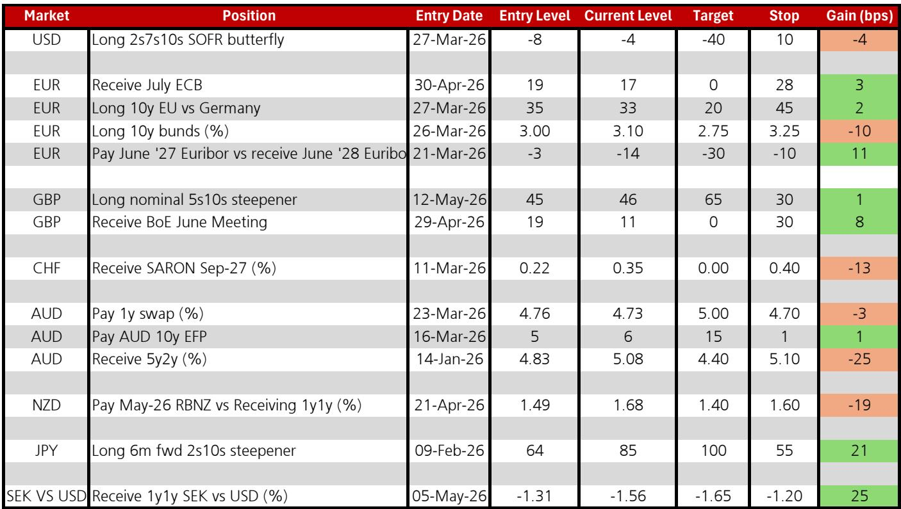

# 市场真正低估的不是通胀，而是央行对供给冲击的容忍度已到拐点

这份来自某外资投行策略团队的客户观点汇总，在五月上半月与对冲基金、实钱账户和银行司库的密集交流中，捕捉到了一个正在凝聚但尚未被充分定价的共识：全球资产定价的核心矛盾，正在从“通胀会不会回落”转向“央行愿意容忍多高的通胀才能避免衰退”。报告最值得关注的判断不是油价或利率的某个点位，而是机构投资者对央行反应函数的重新校准——这种校准将决定下半年所有跨资产交易的底层逻辑。

报告呈现的客户情绪并不极端。风险偏好较四月有所恢复，但大型方向性头寸依然稀缺。这种“谨慎中的试探”恰恰说明市场正处于一个关键认知转变的前夜。真正重要的不是某次CPI数据的高低，而是投资者开始意识到，过去两年支撑风险资产的“通胀回落叙事”正在被更复杂的供给约束所取代。全球石油库存下降、供应链中断风险被低估、以及央行对财政扩张的容忍度变化，这三条线索正在汇合成一个新的宏观叙事框架。

以下是我们从这份客户观点中提炼出的五个结构性判断，以及一个报告尚未完全回答的关键问题。

## 1. 能源供给冲击正在从“尾部风险”升级为资产定价的核心变量

报告明确指出，多位客户认为地缘政治风险仍未解决，能源价格紧张短期内难以缓解。全球石油库存下降是客观事实，而部分客户认为即将发生的供应链中断被市场系统性低估。这不是一个简单的油价预测问题，而是一个跨资产定价的基准情景调整。

当前油价的实际波动区间并不像预期那么极端，这给了市场一定的风险操作空间。但报告传递的关键信号是：投资者正在将能源价格作为Q2风险情绪的核心压制因素，并据此计划在科技股反弹和部分新兴市场强势表现后削减头寸。这意味着能源价格的二阶效应——通过通胀预期传导至利率定价——正在成为机构调仓的主要驱动力。

So what：如果能源供给冲击持续，市场将不得不重新定价那些依赖“通胀稳步回落”假设的资产。新兴市场、长久期债券和成长股将面临比目前定价更复杂的宏观环境。

## 2. 美国利率市场正在经历“数据验证共识”后的方向迷失

报告显示，做空前端和做空久期在美国市场已经产生了回报，最新的CPI数据验证了鹰派头寸的正确性。但问题在于，部分客户认为利率还会更高，而对曲线形态却没有共识。这是一个典型的“方向明确但结构模糊”的定价阶段。

更值得注意的是，部分实钱账户和银行司库认为在4.50%的10年期美债收益率上存在做多价值。这与某投行的基准预测（Q2 10年期美债收益率4.50%，能源中断情景下4.75%）形成了有趣的对比。市场正在分裂为两派：一派认为利率已经见顶，另一派认为还有上行空间。这种分歧本身就是一个交易机会，但需要更清晰的催化剂来打破僵局。

报告还提到一个被低估的风险：新租户租金下降可能不足以对抗更广泛的通胀压力。这是对“租金通胀即将回落”这一乐观假设的明确挑战。

So what：美国利率市场的下一个方向性突破，可能不是来自CPI数据本身，而是来自市场对美联储主席如何应对更高通胀和供给冲击的预期变化。当前的分歧意味着利率波动率可能在未来几个月显著上升。

## 3. 欧洲央行的鸽派转向正在被市场提前定价，但幅度可能不够

报告指出，市场对欧洲央行2026年加息幅度的核心预期是50-75个基点，但投资者情绪已明显转向鸽派。越来越多的人质疑，在薪资压力疲弱和PMI数据显示增长担忧的背景下，欧洲央行能否执行超过一次的加息。

客户的持仓结构已经反映了这种预期：他们偏好为欧洲央行降息做准备的曲线结构。报告作者自己也在做空Euribor近端与远端的利差。而奥地利央行行长关于“不能将6月加息作为基准情景”的表态，进一步强化了鸽派叙事。

So what：欧洲央行可能是今年主要央行中第一个被迫转向的。如果市场继续提前定价降息，欧洲政府债券的曲线形态将发生显著变化，尤其是前端利率的下行空间可能被低估。这对于持有欧洲利率多头头寸的投资者来说，是一个需要密切关注的风险敞口。

## 4. 欧洲政府债券的相对价值正在重新洗牌，意大利风险被高估

报告揭示了一个有趣的相对价值机会：部分客户认为意大利比法国更脆弱，并建议做空10年期意大利国债对法国国债。这一价差在2025年第四季度曾接近零，3月份升至22个基点，目前约11个基点。

但报告作者的判断是，意大利短期内不会跑输法国，因为对欧洲政府债券的温和利差追逐已经恢复。欧洲委员会正在审查财政规则的豁免条款，但报告明确排除了重演疫情期间财政支持力度的可能性。欧洲央行行长的表态也暗示，财政措施应该是临时和有针对性的，不应消除价格信号。

So what：意大利与法国的利差交易需要更明确的催化剂才能触发。当前市场对利差收窄的追逐仍在持续，但中期来看，意大利的财政脆弱性确实是一个需要关注的风险。这一交易的盈亏比取决于投资者对欧洲财政纪律恢复速度的判断。

## 5. 英国国债市场正在经历“投资者基础迁移”带来的结构性脆弱

报告中最引人注目的观察来自英国市场。英国央行货币政策委员会成员Mann警告，英国国债的投资者基础正在从国内养老基金转向对价格高度敏感的外国基金。这一动态现在也引起了投资者的担忧。

报告作者开仓了5s10s陡化交易，并做多6月英国央行会议。但关键信息是，在英国地方选举前后建立的长期头寸表现不佳，说明市场对英国利率的定价仍然存在较大不确定性。投资者基础的迁移意味着英国国债的波动性可能系统性上升，因为外国基金对全球宏观环境的敏感度远高于国内机构。

So what：英国国债不再是“安全的国内资产”。投资者基础的改变意味着，任何全球风险偏好的变化都会更快地传导至英国利率市场。这对于持有英国利率敞口的投资者来说，意味着需要更频繁地调整对冲策略。

## 报告尚未完全回答的关键问题：央行对供给冲击的反应函数究竟如何校准？

这份报告提供了丰富的客户情绪和交易头寸信息，但有一个核心问题没有完全解答：央行在面对持续的供给冲击时，究竟会优先选择容忍通胀还是容忍衰退？欧洲央行已经显示出鸽派倾向，但美联储呢？如果能源价格维持高位，而通胀数据继续高于预期，美联储主席将如何平衡“控制通胀”和“避免经济硬着陆”这两个目标？

报告提到了“供给冲击的性质”对央行决策的影响，但没有展开。这是一个关键的未解问题：如果供给冲击是持续性的（如地缘政治驱动的能源短缺），而不是一次性的，央行的反应函数是否会永久改变？这决定了当前利率市场的定价是否合理。

此外，报告对融资市场的评估是“没有实质性担忧”，但这建立在5月/6月发行量可能增加的背景下。如果利率继续上行，融资市场的压力是否会突然显现？这是一个需要持续跟踪的风险。

---

以上分析仅基于这份客户观点报告的逻辑推导。报告中还包含更详细的国家别利率交易建议和头寸管理细节，包括对瑞典克朗、日元、澳元等市场的具体操作思路。这些内容在本文中未能充分展开，但对于理解全球利率市场的完整图景至关重要。

我们欢迎对以上未解问题感兴趣的读者，来星球微信群里继续讨论。这些关于央行反应函数、供给冲击持续性以及融资市场风险的探讨，正是将研报信息转化为可执行交易框架的关键环节。

Personal reading notes and learning share only. Not investment advice.

