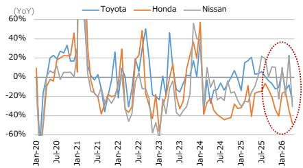

# Japanese Auto Parts Suppliers Face a Structural Reckoning, Not a Cyclical Dip

The April 2026 new vehicle sales data from Japanese OEMs in China is not a weather report. It is a strategic signal. Toyota fell 25% year-over-year. Honda collapsed 48%. Nissan dropped 31%. These are not the numbers of a market in a temporary downturn. They are the numbers of a market where the competitive landscape has permanently shifted, and the Japanese auto parts supply chain is now operating on borrowed assumptions.

For investors and strategists tracking the Japanese auto parts industry, the immediate reaction is to ask whether these declines are already priced into the guidance of companies like Koito Manufacturing and Toyota Boshoku. Koito assumes Japanese OEM China output at minus 4% for the fiscal year ending March 2027. Toyota Boshoku assumes seat production in China at minus 8%. The actual April data already blows past both of those assumptions by a wide margin. The gap between what the supply chain expects and what the market delivers is no longer a risk. It is a present reality.

The core argument of this analysis is straightforward: the Japanese auto parts industry is not facing a demand shock that will correct itself. It is facing a structural displacement from a market that is no longer willing to wait for incremental improvement. The strategic imperative for suppliers is no longer about cost containment or factory rationalization. It is about redefining their value proposition in a market where their primary customers are losing relevance.

## The April Sales Data Reveals a Divergence That Guidance Has Not Yet Captured

The headline numbers from April 2026 are stark, but the more important story is the cumulative trend. On a January-to-April basis, Toyota is down 10%, Honda is down 28%, and Nissan is down just over 3%. The cumulative figures mask the acceleration of the decline. April was not an outlier. It was a confirmation that the trajectory is worsening.

Consider the implications for the supply chain. A 25% drop in Toyota's monthly sales means approximately 36,000 fewer vehicles sold compared to the same month last year. For Honda, a 48% drop represents roughly 21,000 fewer units. For Nissan, a 31% decline is about 14,000 fewer vehicles. In aggregate, the three Japanese OEMs sold approximately 71,000 fewer vehicles in China in April 2026 than in April 2025. That is not a rounding error. That is a production line shutdown.

The auto parts suppliers that depend on these volumes are now operating in a regime where their customers are losing share at an accelerating rate. The guidance assumptions from Koito and Toyota Boshoku were already cautious relative to the broader market. They now appear optimistic. The question is not whether these companies will miss their forecasts. The question is how quickly they will need to revise them and what that revision will imply for capital allocation, headcount, and strategic priorities in China.

## The Assumptions Built into Fiscal Year Guidance Are Already Outdated

Koito's assumption of a 4% decline in Japanese OEM China output for fiscal year ending March 2027 was based on data that predates the April collapse. Toyota Boshoku's assumption of an 8% decline in seat production was similarly conservative by historical standards. Both assumptions now look like they were designed for a market that no longer exists.

The gap between guidance and reality is not just a forecasting error. It is a strategic vulnerability. When a supplier bases its production planning, inventory management, and fixed cost structure on a volume assumption that is materially higher than actual demand, the result is not just a profit miss. It is a cascading set of inefficiencies: excess inventory, underutilized capacity, and pressure on pricing from OEMs who are themselves trying to manage their own overcapacity.

For Koito, which supplies lighting systems, the 4% assumption implies a production volume that is already 21 percentage points above the April run rate. For Toyota Boshoku, the 8% assumption implies a volume that is 40 percentage points above the April run rate. These are not marginal adjustments. They are fundamental disconnects between the operating plan and the market reality.

The most important takeaway for investors is that the auto parts suppliers have not yet fully reflected the structural decline in their guidance. The earnings revisions, when they come, will likely be more severe than the market currently expects. This is not a buying opportunity on weakness. It is a moment to reassess the strategic logic of maintaining China-focused production capacity at current levels.

## Cost Rationalization Is Necessary but Insufficient as a Strategic Response

The report correctly notes that ongoing efforts to curb fixed costs and advance rationalization in China operations remain important in the near term. This is true, but it is also insufficient. Cost cutting is a defensive move. It protects margins in a declining volume environment. It does not address the underlying problem, which is that the Japanese OEMs are losing competitive ground to local Chinese manufacturers on price, speed, and technology.

The rationalization efforts that Japanese auto parts suppliers have undertaken over the past several years have been focused on reducing overhead, consolidating plants, and improving procurement efficiency. These are sensible measures in any downturn. But they assume that the current volume decline is cyclical and that a recovery will eventually restore utilization rates. The data suggests otherwise.

Chinese domestic automakers are not just gaining share. They are redefining the cost structure of the industry. Local parts suppliers can match or undercut Japanese suppliers on price while offering faster development cycles and closer integration with OEM design teams. The structural challenge for Japanese suppliers is not that they are too expensive. It is that their entire value proposition is built on a model of quality and reliability that the Chinese market is increasingly willing to trade for speed and cost.

Rationalization buys time. It does not buy a new competitive position. The suppliers that will emerge stronger from this period are those that use the current pressure to make strategic choices about where to compete, not just how to cut costs.

## The Unanswered Question: Can Japanese Suppliers Compete on Speed Without Sacrificing Their Core Value?

The report identifies improving development speed as a key challenge. This is the most important strategic question facing the industry, and it is also the one that the data cannot yet answer. Japanese auto parts suppliers have built their reputations on precision, reliability, and long development cycles that ensure quality. The Chinese market is increasingly rewarding speed over perfection. Local suppliers can move from design to production in months, not years.

The tension between speed and quality is not new, but it is becoming existential. If Japanese suppliers try to match the development velocity of local competitors, they risk undermining the quality and reliability that differentiate them. If they maintain their current pace, they risk losing relevance in a market that values rapid iteration.

The report does not provide a clear path through this dilemma, and that is appropriate because no clear path has yet emerged. The most likely outcome is a bifurcation within the supplier base. Some suppliers will successfully accelerate their development processes without sacrificing quality. Others will find that the trade-offs are too steep and will retreat to higher-margin segments where speed is less critical. The risk for investors is that it is not yet clear which suppliers fall into which category.

This is the analytical gap that the full report can help fill. The data on sales volumes and guidance assumptions is useful, but the strategic insight that matters most is about capability and positioning. Which suppliers have the engineering resources, the organizational flexibility, and the customer relationships to adapt? The answer to that question will determine the winners and losers over the next three to five years.

## A Decision Framework for Investors Evaluating Japanese Auto Parts Exposure

For investors who are considering positions in Japanese auto parts suppliers, the current environment demands a framework that goes beyond traditional valuation metrics. The following four questions can help separate companies that are managing a cyclical downturn from those that are facing a structural crisis.

First, what is the company's revenue exposure to Japanese OEMs in China? This is the most direct measure of vulnerability. A supplier with 30% of its revenue coming from Japanese OEMs in China faces a fundamentally different risk profile than one with 5%. The April data suggests that this revenue stream is declining at an accelerating rate, and the guidance assumptions are likely too optimistic.

Second, does the company have a meaningful revenue base outside of Japanese OEMs? Suppliers that have diversified into non-Japanese customers, particularly Chinese domestic OEMs or European and American manufacturers, have a buffer that pure-play Japanese suppliers lack. Diversification does not eliminate the risk, but it changes the calculus of whether the China business is worth defending at all costs.

Third, can the company compete on development speed without compromising its core technology advantages? This is the hardest question to answer from public data alone. It requires an understanding of the company's engineering culture, its relationships with customers, and its willingness to accept higher failure rates in exchange for faster time to market. The companies that can answer this question in the affirmative are the ones that will retain relevance in China.

Fourth, what is the company's capacity to redeploy capital from China to other markets? The rationalization of China operations will free up cash and management attention. The question is whether that capital can be deployed into higher-growth markets, such as Southeast Asia, India, or North America, or whether it will simply be returned to shareholders. The strategic quality of capital allocation decisions over the next 12 to 18 months will be a strong signal of management's long-term vision.

These four questions do not provide easy answers, but they provide a structure for decision-making. The companies that score well on all four dimensions are likely to navigate the current environment with their strategic position intact. The companies that score poorly on multiple dimensions face a more fundamental reckoning.

## The Full Report Contains the Data and Charts That Make These Questions Actionable

The analysis above is based on the April 2026 sales data and the guidance assumptions of key auto parts suppliers. But the full report contains a richer set of data, including monthly sales trends over multiple years, detailed breakdowns by OEM, and specific company-level assumptions that allow for a more granular assessment of risk.

The charts in the full report show the trajectory of Japanese OEM sales in China over time, revealing patterns that are not visible in a single month of data. They also provide the basis for stress-testing the guidance assumptions of individual suppliers. For investors who want to move beyond the headlines and build a position based on a rigorous understanding of the underlying dynamics, the full report is essential reading.

Join the community to read the full report and review the original charts.

*This article is for learning and discussion only and does not constitute investment advice.*

Personal reading notes and learning share only. Not investment advice.

