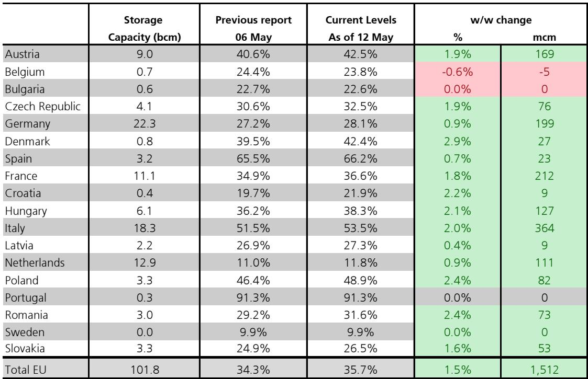
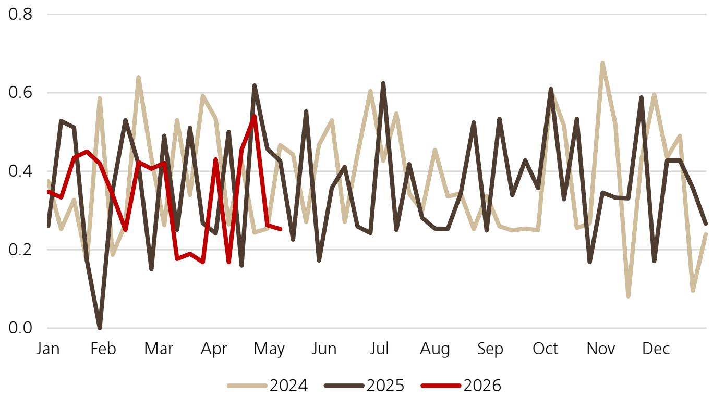

# 欧洲天然气库存的真正风险不在当前水位，而在注入速度的结构性放缓

全球天然气市场正在经历一个容易被低估的转折。截至5月中旬，欧洲天然气库存仅36%满，显著低于去年同期的43%和五年均值48%。表面看，这似乎只是一个“补库进度偏慢”的季节性故事。但这份来自某外资投行的最新研报揭示了一个更深层的判断：市场真正需要关注的不是库存绝对水平，而是注入速度正在经历结构性放缓，且这一趋势在夏季将持续加剧。

当前TTF近月价格已震荡上行逼近50欧元/兆瓦时，曲线呈现典型的近端强势形态，季节价差徘徊在平水至小幅贴水区间，这直接抑制了欧盟的储气注入动力。报告的核心信号在于：若当前供应中断持续，夏季市场将进一步收紧，而此前市场普遍预期的“中国LNG转售救场”正在迅速消退。这不是一个短期的波动，而是供给端再定价的早期信号。

## 1. 欧洲库存缺口正在从“进度偏慢”演变为“注入能力不足”

截至5月12日，欧洲天然气库存净注入量仅为1.5bcm/周，低于去年同期的1.8bcm和季节性正常的2.0bcm。按照当前注入速率，报告估算欧盟库存将在冬季前仅能达到约86%满。但更关键的是，分析师认为这一速率本身还会继续放缓，其基准情景已将冬季前库存预测下调至80%。

这意味着什么？80%的储气水平并非危机水位，但考虑到欧洲在过去两年已大幅降低需求基数，80%意味着冬季供应缓冲空间显著收窄。一旦遭遇严寒或供应意外中断，价格弹性将远高于过去两个冬季。市场目前定价的“软着陆”情景可能过于乐观。

## 2. LNG流向的结构性转移正在改变全球价差关系

报告中的LNG货轮追踪数据显示，美国对亚洲出口虽环比下降21%，但过去四周仍较去年同期高出60%以上。美国对欧洲出口占比仍接近60%，但流往亚洲的份额已从冲突前水平提升超过10个百分点，达到33%。

更值得关注的是JKM-TTF价差持续维持在1-2美元/mmBtu区间，这使得亚洲对于美国边际货源的竞争力得以保持。换句话说，欧洲无法通过价格优势从亚洲手中“抢回”LNG货轮。这一价差结构正在成为欧洲夏季补库的核心约束条件——不是没有LNG，而是欧洲需要支付更高的溢价才能吸引货轮转向。

## 3. 中国LNG转售的“安全阀”正在快速关闭

报告披露了一个容易被忽视的关键变化：中国LNG转售活动在3月达到10船的高峰后，4月急剧放缓至仅1船，5月至今仍然低迷。此前，市场普遍将中国转售视为欧洲夏季补库的潜在缓冲机制。但这个缓冲正在消失。

原因可能在于中国自身需求回升、库存策略调整，以及中美LNG贸易关系的微妙变化。报告提到，中国预计将在6月中下旬恢复直接进口美国LNG，三船货物即将到港。这可能标志着两国能源关系的改善，但同时也意味着中国将更少依赖转售市场来消化多余的长期合约量。对于欧洲而言，这意味着一个重要的边际供应来源正在收缩。

## 4. 美国库存正常化无法弥补欧洲的结构性缺口

美国天然气库存注入情况相对平稳，EIA报告周度注入85Bcf，符合市场预期。截至5月8日，美国库存利用率为54%，略高于五年均值50%。日本公用事业库存也基本处于季节性正常水平。

但问题在于，全球天然气市场的紧张并非供给总量不足，而是区域错配。美国市场相对宽松，但LNG出口设施的能力限制和全球船运的竞争性分配，使得美国无法无限度地向欧洲输送增量。报告中的货轮追踪数据显示，尽管美国对欧出口维持高位，但增量空间正在收窄。

## 5. 报告尚未完全回答的关键问题：需求侧的结构性变化是否被低估

这份研报在供给端分析上相当扎实，但对于需求侧的变化着墨相对有限。欧洲工业用气需求是否已在当前价格水平下触底反弹？亚洲（尤其是中国）的增量需求是否会在下半年超预期？这些问题在报告中并未完全展开。

尤其值得思考的是，欧洲过去两年的“需求破坏”有一部分是永久性的（工业外迁、能源效率提升），但另一部分可能是暂时性的（暖冬、库存去化）。如果未来一个冬季气温回归正常，甚至偏冷，当前80%的储气预测将面临严峻考验。这可能是市场目前定价中最大的不确定性。

## 6. 投资者应关注的三个观察框架

基于上述分析，我们认为投资者可以从以下三个维度持续跟踪市场演变：

第一，欧洲周度注入速率与季节性均值的偏离程度。当前1.5bcm/周的注入量低于季节性正常的2.0bcm，若这一差距在未来四周内没有收窄，则80%的冬季库存预测将面临进一步下调风险。

第二，JKM-TTF价差的变化方向。若价差从当前1-2美元/mmBtu扩大至3美元以上，意味着亚洲需求正在加速吸收美国LNG，欧洲的补库压力将进一步上升。

第三，中国LNG进口结构的转变。6月到达的三船美国LNG是否只是开始？中国是否会系统性增加美国LNG的直接采购？这将直接影响全球LNG的贸易流向和欧洲的供应安全。

这三个框架可以帮助投资者在看似平稳的市场中识别真正的风险积累点。

---

这份研报中还有大量未能在本文充分展开的细节——包括各国储气设施的差异化表现、俄罗斯管道气流量的边际变化、以及更精细化的LNG船运路线追踪数据。这些信息对于判断下半年市场走向至关重要。

欢迎来星球微信群里继续讨论：我们将在群内分享完整研报的原始图表和数据分析框架，并持续跟踪上述三个观察框架的实时变化。

Personal reading notes and learning share only. Not investment advice.

