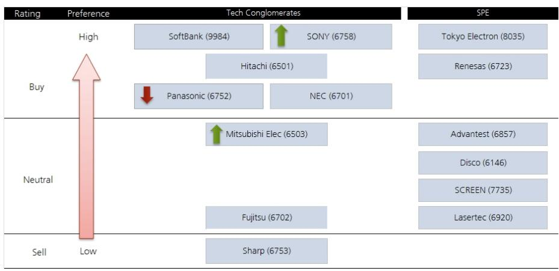

# 日本科技股真正的交易机会不在AI硬件本身，而在AI推理需求的结构性重定价

市场对日本科技股的讨论，仍然停留在“AI需要什么”的层面。芯片、设备、电力、封装——这些需求确实在增长，但已经充分反映在股价和估值中。真正值得追问的问题是：当AI从训练转向推理，从模型竞赛转向应用落地，产业链的价值分配将如何迁移？谁能在下一阶段占据定价权？

某外资投行最新发布的日本科技综合企业研报，提供了一个清晰的判断框架。报告的核心结论是：AI需求结构并未改变，但受益者的排序正在重新洗牌。硬件需求依然强劲，但市场对软件相关业务的担忧——“SaaS已死”的叙事——不会消失。在日本本土IT服务市场，客户转向内部开发的趋势正在成为最大的风险因素。

这份报告最值得关注的判断，不是“AI很好”，而是“哪些公司正在从AI推理需求中获取定价权”。软银、索尼、东京电子、瑞萨被列为高偏好标的，而Advantest和Disco尽管基本面稳固，但估值已缺乏吸引力。这背后反映的，是分析师对“增长质量”的重新评估——不是所有AI受益者都值得同等溢价。

## 1. 硬件需求的结构性扩张仍在继续，但市场低估了推理侧的价值迁移

报告明确指出，编码AI的扩张导致了对token和AI推理需求的急剧增长，AI数据中心相关业务的基本面预计将保持强劲。半导体、半导体制造设备、电力和高性能封装等领域的硬件需求增长趋势仍将持续。

但这里有一个更重要的洞察：推理需求与训练需求在价值分配上存在本质差异。训练阶段的核心竞争力是算力规模，而推理阶段的核心竞争力是效率——更低的功耗、更快的响应、更优的性价比。这意味着，在推理需求主导的下一阶段，拥有差异化硬件设计能力和系统级优化能力的公司将获得更高的议价权。

东京电子的涨价行动，正是这一趋势的早期信号。报告指出，东京电子的涨价是本次财报季中未被预期的进展，而这一变化将推动其市场份额和利润率的进一步扩张。这不是一个孤立的定价事件，而是设备供应商在AI推理需求链中获得话语权的标志。

## 2. 软银的真正价值不在ARM本身，而在AI推理需求与OpenAI商业化的双重杠杆

市场对软银的讨论往往集中在ARM的IPO效应或愿景基金的投资组合波动上。但这份报告提供了一个更具体的价值驱动框架：ARM正在捕获AI推理需求，而OpenAI因编码AI的持续增强正在加速变现——两者共同构成了软银股价上行的核心引擎。

ARM在推理侧的地位，与其在移动端和边缘计算领域的渗透率直接相关。当AI推理从云端下沉到终端设备，ARM架构的低功耗优势将转化为不可替代的竞争壁垒。而OpenAI的商业化加速，则意味着软银作为重要股东的潜在回报正在变得更具确定性。

这里需要特别注意的是，报告并未将软银的估值建立在愿景基金其他投资项目的退出预期上，而是聚焦于ARM和OpenAI这两个最清晰的驱动力。这种聚焦本身就隐含了一个判断：软银的股价表现正在从“故事驱动”转向“基本面驱动”。

## 3. 索尼的估值中隐含了一个未被充分定价的假设：AI对内容价值的侵蚀被过度担忧

索尼是这份报告中另一个高偏好标的，但其逻辑与软银截然不同。报告认为，索尼目前的股价处于低位，过度反映了市场对AI导致内容价值侵蚀的担忧。而索尼通过提价，已经成功抵消了DRAM价格上涨带来的负面影响——这是财报发布前市场最关注的风险点。

这个判断的深层含义是：市场对AI冲击内容产业的叙事可能过于悲观。索尼作为内容与硬件的复合体，其定价能力和品牌护城河被低估。如果AI确实改变了内容生产的方式，那么拥有IP和分发渠道的公司反而可能成为受益者——因为AI降低了内容生产的边际成本，扩大了优质内容的供给弹性，而索尼正是全球最大的内容IP持有者之一。

值得注意的是，报告并未将索尼的提价能力简单归因于通胀传导，而是将其视为公司管理能力的体现。这提示投资者，在评估日本科技企业时，需要更多关注其定价策略和成本管控能力，而不仅仅是收入增长。

## 4. 瑞萨的连续增长正在重新确认上行周期，但市场尚未充分定价利润率的改善

瑞萨的销售预计在4月至6月期间将继续环比增长，这将是连续第六个季度的销售增长，进一步确认了上行周期的延续。与此同时，海外竞争对手在3-4月涨价之后又实施了进一步提价，瑞萨预计也将受益于利润率改善。

这里的关键变量是“涨价传导的持续性”。半导体行业的上行周期通常伴随涨价，但这一轮周期的特殊性在于，下游需求的结构性变化——AI推理、汽车电子化、工业自动化——使得涨价具有更强的可持续性。瑞萨在汽车和工业领域的布局，使其成为这一趋势的核心受益者之一。

报告对瑞萨的偏好，与其对Advantest和Disco的谨慎态度形成了鲜明对比。后两者虽然受益于AI需求，但估值已经过高，缺乏股价吸引力。这再次印证了报告的核心逻辑：在AI需求增长的大背景下，投资者需要区分“受益”和“超额收益”之间的差异——前者是行业beta，后者需要公司在定价权或利润率上提供额外alpha。

## 5. 报告尚未完全回答的关键问题：日本IT服务市场的内部化趋势将如何冲击现有格局

报告提到了一个重要的风险因素：在日本本土IT服务市场，客户转向内部开发的趋势正在成为最大的风险因素。这一判断直接指向了富士通、NEC等传统IT服务提供商的商业模式。

但报告并未深入展开这一趋势的规模、速度和结构性影响。这是一个值得投资者持续跟踪的关键问题。如果日本企业客户的内部化开发趋势加速，传统IT服务商的收入结构将面临根本性挑战。与此同时，这也为云基础设施、开发工具和平台型公司创造了新的机会。

另一个尚未完全回答的问题是：东京电子的涨价能否持续？涨价本身是一个积极信号，但能否在下一轮设备采购周期中维持，取决于其技术壁垒和客户粘性。报告提到了市场份额和利润率的扩张预期，但并未给出具体的量化假设。

## 6. 投资者需要重新审视的观察框架：从“AI受益者”到“定价权持有者”

综合这份报告的判断，可以提炼出一个更实用的观察框架：在AI产业链中，真正值得长期持有的公司，不是那些“受益于AI需求增长”的公司，而是那些“在AI需求增长过程中获得定价权”的公司。

定价权的来源有三种：技术壁垒（如东京电子的设备涨价）、生态锁定（如ARM在推理侧的地位）、内容护城河（如索尼的IP组合）。而缺乏定价权的公司，即使身处高增长赛道，也可能面临估值压缩的风险——Advantest和Disco就是典型案例。

这个框架可以帮助投资者在筛选日本科技股时，避免陷入“所有AI概念股都一样”的认知陷阱。不同公司在AI价值链条中的位置不同、议价能力不同、增长质量不同，对应的估值逻辑也应该不同。

## 欢迎继续探讨

这份报告还包含了对松下、日立、三菱电机、富士通等公司的详细评级和逻辑分析，以及各公司的估值方法和风险陈述。由于篇幅限制，我们无法在此展开所有细节。报告中提到的“客户内部化开发趋势”对日本IT服务市场的具体影响，以及东京电子涨价背后的技术驱动因素，都是值得深入讨论的话题。

如果你对这些问题感兴趣，欢迎来我们的微信群里继续探讨。我们可以一起拆解这份报告的完整逻辑，讨论哪些假设需要进一步验证，以及这些判断对投资组合构建的实际含义。

Personal reading notes and learning share only. Not investment advice.

