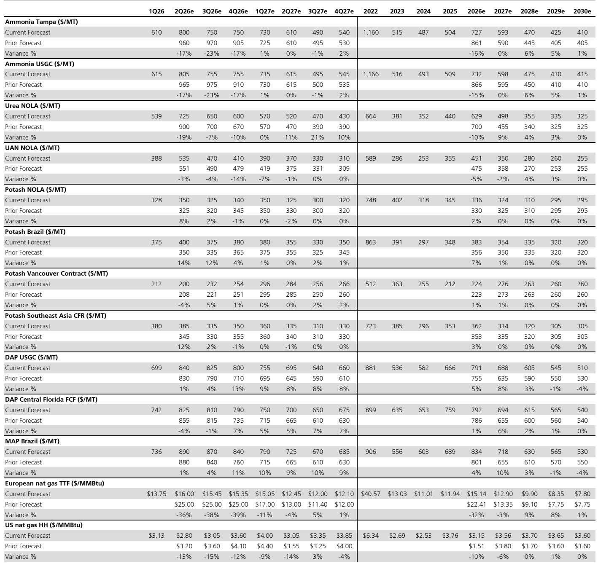
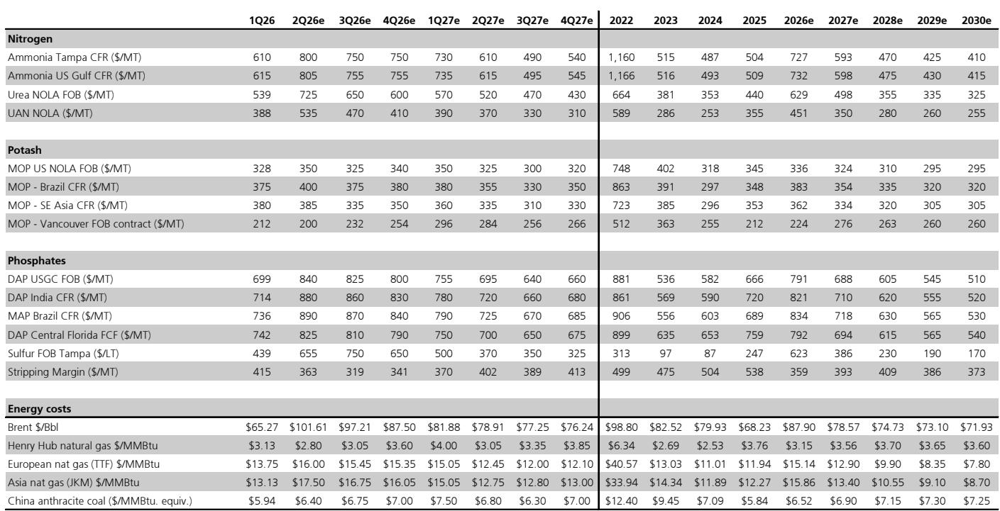

# 化肥市场的真正博弈不在价格，而在成本曲线的再定价

过去三个月，全球化肥市场经历了一轮剧烈但结构分化的价格波动。中东地缘冲突、供应链中断与季节性需求叠加，推动氮、磷、钾三大营养素价格全面走高。然而，这份某外资投行最新发布的化肥行业深度报告揭示了一个更值得关注的信号：**市场对化肥股的定价逻辑，正在从“价格弹性”转向“成本曲线溢价的可维持性”**。

报告的核心判断并不复杂——2026年第二季度大概率是本轮周期的盈利峰值，但这并不意味着所有化肥企业都将同步受益。真正区分赢家与输家的，是各自在成本曲线上的位置，以及能否在原材料成本剧烈波动中守住加工利润。

这不是一篇简单的“看好或看空”的报告。它提供了一个观察框架：当供给约束成为常态，哪些企业拥有定价权，哪些企业正在被成本吞噬。

## 1. 氮肥的盈利峰值已现，但成本曲线溢价将结构性维持

报告对氮肥的判断最为清晰：价格已走过季节性高点，第二季度将是本轮周期的盈利峰值。Tampa氨合约结算价低于市场预期，尿素现货价格在过去数周出现回落，这些信号都指向一个结论——市场正在从“恐慌定价”回归“基本面定价”。

但真正值得关注的不是价格顶部，而是成本曲线溢价的变化。自中东冲突以来，氨、尿素、硝酸盐的基准价格较冲突前上涨了约25%至60%，但天然气价格的涨幅远低于2022年俄乌冲突时期。TTF和JKM价格仅小幅上涨，远未达到2022年的峰值水平。这意味着，氮肥价格相对于天然气成本的溢价显著扩大——氨的溢价扩大了约100美元/吨，尿素和UAN的溢价分别扩大了约35美元和140美元。

这份溢价来自供给约束，而非需求拉动。伊朗部分产能仍处于停产状态，卡塔尔产量恢复时间不明，霍尔木兹海峡的通行风险尚未完全解除。报告指出，即使海峡短期内重新开放，从工厂重启到产品重新抵达巴西等主要进口市场，至少需要三个月的缓冲期。这意味着，2026年下半年乃至2027年，供给约束将持续支撑氮肥价格高于成本曲线。

**对投资者的含义：** 氮肥企业的盈利弹性正在从“天然气成本优势”转向“供给约束下的溢价捕获能力”。CF和LXU在报告中被列为中性评级中的优选，核心逻辑正是其天然气成本优势叠加北美产能的供给确定性。而NTR虽然也有氮肥业务，但报告认为其氮肥盈利将在2026年过度膨胀约15亿美元，随后面临正常化压力。

## 2. 磷肥的利润正在被原材料成本吞噬，供给收缩不等于盈利改善

磷肥的故事与氮肥截然不同。尽管磷肥价格自冲突以来上涨了20%至25%，但生产商的加工利润（stripping margin）却出现了显著压缩。问题的根源在于原材料——硫磺和氨的价格涨幅远超过磷肥本身。

硫磺价格在印度、中国和巴西市场已攀升至每吨900至1150美元的高位，氨成本也持续走高。报告估算，离岸市场的加工利润压缩幅度已达约120美元/吨。这种成本压力已经迫使全球主要生产商采取减产措施：OCP削减了约30%的产量，MOS在路易斯安那州和巴托的两家工厂将开工率降至50%，PhosAgro也因无人机袭击导致供应中断。

这里出现了一个经典的结构性矛盾：供给收缩本应推高价格，但更高的价格又进一步抑制了需求。报告明确指出，磷肥的需求破坏风险（约15%至30%）远高于钾肥（约5%至15%），巴西等关键市场的农民因可负担性问题正在减少施肥量。结果是，价格虽然在高位，但生产商的盈利却在恶化。

**对投资者的含义：** MOS和NTR的磷肥业务正在经历“有价无利”的困境。报告对MOS的2026年EBITDA估计比市场共识低17%，核心原因正是磷肥加工利润的持续压缩。如果硫磺和氨成本不能回落，即使磷肥价格维持高位，盈利也难以改善。这是一个典型的“成本曲线右移”案例——企业的竞争优势不再取决于产品价格，而取决于能否以低于竞争对手的成本获取原材料。

## 3. 钾肥的定价权正在被运费稀释，供给增量是中期隐忧

钾肥是三大营养素中基本面最为稳定的品种。自冲突以来，价格温和上涨，需求破坏风险有限，中东主要供应国（以色列、约旦）的生产未受明显影响。Canpotex已经售罄至6月30日的全部离岸量，NTR将北美夏季填充价格上调了约10美元/吨。

然而，报告提出了一个容易被忽视的问题：钾肥价格上涨中有相当一部分来自运费上涨，而非生产商定价能力的提升。这意味着，生产商实际获得的利润改善幅度小于价格涨幅。对于IPI、MOS和NTR的钾肥业务而言，价格上行的利好被运费成本部分抵消。

更值得关注的是中期供给格局。报告对NTR维持卖出评级，核心逻辑之一正是“增量供给超过需求增长”。到2020年代后期，全球钾肥产能扩张将逐步释放，而需求增速难以匹配。如果这一判断成立，钾肥价格将面临结构性下行压力，NTR的中期盈利前景将因此承压。

**对投资者的含义：** 钾肥的短期基本面相对健康，但中期风险不可忽视。市场对NTR的乐观预期建立在“钾肥价格在2027年继续上涨”的假设上，但报告认为这一假设面临供给增量与需求增速不匹配的挑战。对于投资者而言，钾肥板块的估值锚点应从“当前价格”转向“可持续的中期价格水平”。

## 4. 农产品价格的上行正在为化肥需求提供支撑，但传导机制存在滞后

报告还提供了一个重要的宏观背景：玉米和大豆的远期期货价格自中东冲突以来显著上涨。2026/2027年玉米期货上涨了约0.25至0.30美元/蒲式耳，大豆期货上涨了约0.40美元/蒲式耳。背后的逻辑是，化肥施用量的减少导致全球作物产量预期下降，进而推高了农产品价格。

这是一个有趣的反馈循环：化肥价格高企导致施肥量减少，作物产量下降推高农产品价格，而更高的农产品价格又可能激励农民增加施肥投入。但报告指出，这一传导机制存在显著的时滞。当前农产品价格的上涨尚未完全反映在农民的种植决策中，2027年的作物期货可能还有进一步上行空间。

**对投资者的含义：** 农产品价格上涨是化肥需求的长期支撑，但短期内无法缓解农民的可负担性问题。报告估算，玉米种植者的化肥成本影响约为每英亩45美元，大豆约为每英亩20美元。在农民现金流尚未显著改善之前，化肥需求仍将受到抑制。这一矛盾需要时间消化，而化肥企业的盈利修复也将是一个渐进过程。

## 5. 报告尚未完全回答的关键问题：供给约束何时解除？

这份报告在逻辑上高度自洽，但有一个关键变量没有给出明确答案：中东供给约束的持续时间。报告的所有判断都建立在“供给约束在2026年下半年至2027年逐步缓解”的基准假设之上。但这一假设本身存在高度不确定性。

如果霍尔木兹海峡的通行风险持续到2026年底甚至2027年，氮肥的成本曲线溢价将维持更长时间，CF和LXU的盈利峰值可能延续至2027年。反之，如果地缘局势迅速缓和，氮肥价格可能加速回落，CF和LXU将面临盈利预期下修的风险。

报告对MOS的判断也存在类似的不确定性。磷肥加工利润的修复取决于两个条件：一是磷肥价格能否继续上涨以覆盖成本，二是硫磺和氨成本能否回落。但这两个条件存在内在矛盾——如果硫磺和氨成本因供给改善而回落，磷肥价格也可能随之走弱。报告承认，MOS的风险“双向存在”，但更偏向下行。

这些问题并非报告的缺陷，而是任何前瞻性分析都无法回避的固有不确定性。正是这些未解的问题，构成了继续跟踪和讨论的价值。

---

这份报告的价值不在于给出一个简单的“买入或卖出”建议，而在于提供了一个分析框架：在供给约束成为常态的市场中，企业的竞争优势不再取决于产能规模，而取决于成本曲线上的位置和原材料获取能力。氮肥的成本曲线溢价正在扩大，但已接近峰值；磷肥的加工利润正在被成本吞噬，短期内难以修复；钾肥的短期稳定掩盖了中期的供给隐忧。

对于希望深入理解这份报告完整逻辑和原始图表的读者，欢迎来我们的微信群继续讨论。我们会围绕报告中提到的关键假设——供给约束持续时间、磷肥加工利润的修复路径、钾肥中期供需平衡——展开更细致的拆解，并分享报告中的原始定价模型和产能数据。这些内容在公开文章中无法完全展开，但对做出投资判断至关重要。

Personal reading notes and learning share only. Not investment advice.

