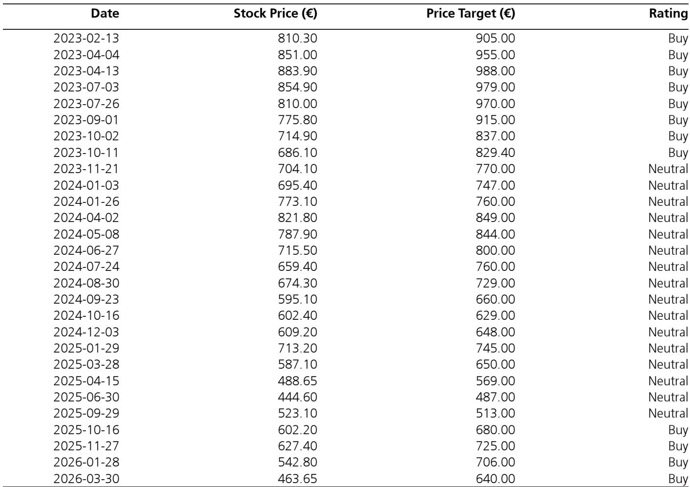

# 奢侈品市场的真正拐点：不是需求萎缩，而是品牌必须学会“收缩”

过去三年，奢侈品行业经历了一场史无前例的“民主化”实验。品牌争相追逐新一代的“向往型消费者”，用入门级产品、社交媒体的高频曝光和限量联名来拉新。但某外资投行最新发布的专家调研反馈揭示了一个清晰的信号：这场实验正在走向终点。

该报告基于与一家全球奢侈品转售与档案时尚平台创始人的深度对话。核心判断不是需求崩塌，而是市场正在经历一次“定价权再分配”——从那些依赖潮流和话题度的品牌，重新回到那些真正掌握客户关系和产品工艺的品牌手中。

对于产业决策者而言，这轮调整的真正含义是：过去十年“做大蛋糕”的增长逻辑已失效，下一阶段的赢家将是那些有能力“做小蛋糕”却做得更精的品牌。

## 1. 市场正在从“追逐新客”转向“服务核心”，但品牌未必有能力转身

报告中最具洞察力的判断，是专家指出的“市场修正正在发生”。这句话看似平淡，但结合上下文，其含义远比字面深刻。

过去几年，奢侈品行业的增长引擎是“向往型消费者”——那些收入尚未达到核心客群水平、但愿意为品牌溢价买单的人群。品牌通过降低入门门槛、增加高频低单价产品、加大社交媒体投放来捕获这批用户。但专家观察到，这批“趋势敏感型消费者”正在放缓消费，而核心高净值客户依然高度活跃，且他们的关注点正在从“拥有什么”转向“有多稀有、工艺有多好”。

这意味着什么？意味着过去几年支撑行业增长的“量”正在退潮，而真正决定品牌长期价值的“质”——也就是与核心客户的关系深度和产品本身的不可替代性——正在重新成为定价锚。

但这里有一个关键问题：品牌能否顺利“转身”？过去十年，大多数奢侈品牌的组织架构、供应链、营销体系都是为“规模化触达”设计的。要转向“深度服务核心客户”，需要的不是简单的营销策略调整，而是整个运营逻辑的重构。报告没有完全展开的是：哪些品牌具备这种组织柔性，哪些品牌可能在这一过程中陷入“两头不靠”的困境。

## 2. 转售市场正在成为品牌定价权的“压力测试场”

专家将转售市场定义为奢侈品生态系统的核心组成部分，这一点值得高度重视。传统视角下，转售市场常被视为“二手货流通”，对一手市场的影响有限。但报告揭示了一个更深层的逻辑：转售价格是品牌定价权的真实映射。

报告指出，标志性产品的转售定价依然高度坚挺，而潮流驱动或限量版产品在经历了疫情高峰期的倍数溢价后，已经大幅正常化。以爱马仕为例，部分二手包袋的转售溢价曾达到零售价的2至2.5倍，如今已回落至1至1.5倍。这不是需求消失，而是“投机性购买”退潮后的价格回归。

这一现象对投资者的含义是：转售溢价率可以作为品牌“真实定价权”的领先指标。如果一个品牌的经典款在转售市场仍能维持显著溢价，说明其核心客户的基本盘稳固；反之，如果转售价格快速回归甚至跌破零售价，则意味着品牌对消费者的吸引力更多来自潮流而非根基。

报告特别提到，转售平台的库存供给结构性改善，反映了转售污名化的减少以及与VIP寄售商关系的加强。这是一个值得关注的长期趋势。随着转售市场越来越透明、越来越被接受，品牌对终端价格的掌控力将面临持续挑战。那些无法在产品稀缺性、客户关系和品牌叙事上建立护城河的公司，可能会发现自己的定价权正在被二手市场“定价”。

## 3. 品牌分化正在加剧：不是所有“衰退”都是坏事

报告对具体品牌的分析，展现了一个高度分化的格局。

香奈儿被专家点名“表现优于同行”，尤其是在Matthieu Blazy创意首秀后，皮具产品的兴趣重燃。路易威登的经典老花系列在最新营销活动推动下展现稳定动能。而古驰则被描述为“更波动、更暴露于时尚周期”，尽管Tom Ford风格的Demna时代正在激发档案款需求。

普拉达和Miu Miu的趋势“非常强劲”，二手价格接近零售价。而爱马仕虽然仍是转售市场的锚点，但需求正在向“不为人知的小众款式”集中，而非标准Kelly和Birkin。

这些分化的背后，是同一个逻辑的演绎：品牌是否拥有足够深厚的“创意遗产”来支撑其定价。香奈儿和路易威登的稳定性，源于它们有清晰的品牌符号和持续的内容输出能力。普拉达和Miu Miu的强势，则来自它们对“知识分子时尚”这一细分赛道的精准占领。而古驰的波动，本质上是因为它过去几年过度依赖潮流驱动，导致品牌资产与特定创意总监深度绑定，缺乏超越个体的品牌稳定性。

这一分化格局对投资决策的意义在于：不能再用“奢侈品行业”这个笼统标签来思考问题。未来两到三年，行业内的表现差异可能比行业与大盘的差异更大。那些拥有深厚品牌档案、能持续从历史创意中提取价值的品牌，可能比那些依赖“新故事”的品牌更具防御性。

## 4. 报告尚未完全回答的关键问题：品牌如何“收缩”而不“缩水”

专家指出，行业前景的关键问题在于品牌如何“收缩规模”并聚焦核心以驱动增长。这是一个极具洞察力的判断，但也是一个尚未被充分回答的问题。

“收缩”在商业语境中往往带有负面含义。但在奢侈品行业，主动收缩可能恰恰是维持稀缺性和定价权的前提。问题是，收缩的路径是什么？是减少SKU数量、关闭部分门店、降低营销支出，还是重新调整客户分层策略？不同品牌的收缩方式可能截然不同。

报告提到，爱马仕的需求正向“稀有且不那么容易辨认的款式”集中。这暗示了一种可能的收缩路径：品牌可以通过调整产品组合，从“流量款”转向“深度款”，从“人人都想拥有”转向“只有少数人才能识别”。但这一路径对品牌的组织能力要求极高——它需要品牌有足够的客户数据来识别谁是真正的核心客户，有足够的产品开发能力来创造“稀缺但不古怪”的产品，有足够的耐心来承受短期收入波动。

另一个未被充分讨论的问题是：收缩过程中，品牌如何处理与渠道的关系？过去几年，许多奢侈品牌大幅扩张了直营门店和电商渠道。收缩意味着可能关闭部分门店或调整渠道策略，这将对品牌与地产商、百货公司的合作关系造成冲击。报告没有展开这一维度，但对投资者而言，这可能是判断品牌收缩计划可行性的关键变量。

## 5. 对读者的观察框架：用“三力模型”评估品牌韧性

基于报告的洞察，我们建议读者在评估奢侈品品牌时，建立一个“三力模型”作为分析框架。

第一是“定价力”，即品牌是否有能力在不牺牲销量的情况下持续提价。转售溢价率是衡量定价力的最直观指标。如果一个品牌的经典款在二手市场能以零售价的1.5倍以上成交，说明其定价力强劲；如果转售价格接近或低于零售价，则需要警惕。

第二是“关系力”，即品牌与核心客户的关系深度。报告反复强调“关系驱动”是转售市场的关键差异化因素。同样，在一手市场，品牌能否通过VIP服务、定制化体验、私密活动等方式建立超越交易的客户关系，决定了其在市场下行期的客户留存能力。如果品牌的主要客户触点来自社交媒体和电商平台，其关系力可能较弱。

第三是“创意力”，即品牌是否有持续产出“可被档案化”内容的能力。报告对香奈儿、路易威登、普拉达的分析表明，那些拥有深厚创意遗产的品牌，在市场波动中更具韧性。创意力不等于“每季出新”，而是品牌能否在历史与当下之间建立有意义的对话，让消费者觉得购买的不只是产品，而是文化资产。

这三个维度共同构成了品牌在“收缩时代”的生存能力。如果一个品牌在三力上都有明显短板，那么它面临的将不是短期的市场调整，而是结构性衰退的风险。

---

报告的核心判断清晰而有力：奢侈品行业的增长范式正在切换，从“规模扩张”转向“价值深耕”。但这一切换过程中，最大的不确定性不是需求本身，而是品牌是否有能力完成内部的组织转型。哪些品牌能成功“收缩”，哪些品牌会在收缩中“缩水”，将决定未来三到五年行业的竞争格局。

这正是我们需要继续深入讨论的问题。完整报告对每个品牌的估值、风险敞口和具体操作路径都有更详细的拆解，包括转售价格走势的量化分析、各品牌客户分层数据的对比，以及不同收缩方案的财务影响测算。欢迎来我们的星球微信群里继续讨论这些未解问题——我们每周会组织专题讨论，深入拆解关键研报的核心逻辑与投资含义。

Personal reading notes and learning share only. Not investment advice.

