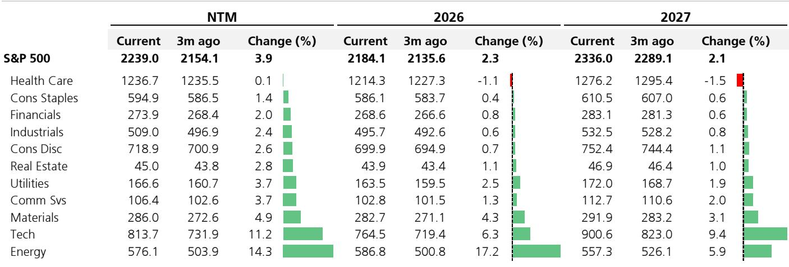
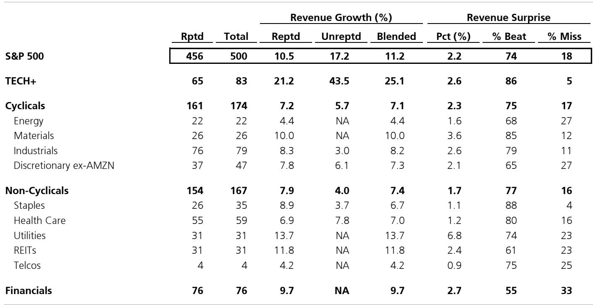

# 市场真正低估的不是AI需求，而是盈利集中的二阶效应

截至5月14日，标普500指数84%的市值已完成一季报披露。预期营收增长11.2%，EPS增长28.4%。表面上看，这是一份相当强劲的成绩单。但真正值得关注的，不是这些数字本身，而是它们背后的结构性含义：盈利增长正在以前所未有的速度向极少数公司集中，而这种集中正在重塑整个市场的定价逻辑。

某外资投行策略团队的最新一季报简报揭示了一个容易被忽视的信号：标普500整体EPS增长28.4%，但剔除TECH+后，这一数字骤降至11.1%。更令人警觉的是，六大科技巨头（Big 6 TECH+）的EPS增长预期高达61.2%，而市场其余部分的增长仅为17.9%。这不是简单的“强者恒强”，而是盈利增长格局正在发生质变。

这份简报的核心价值不在于它罗列了多少数据，而在于它提供了一组可以拆解市场结构的关键框架。以下是对这份简报的深度解读与延伸判断。

## 1. 盈利增长的集中度已经达到需要重新定义“市场”的程度

简报中最具冲击力的数据不是28.4%的整体EPS增速，而是TECH+板块对整体增速的贡献率。图表2清晰显示，TECH+对整体EPS增长的拉动已从2025年一季度的8.1个百分点跃升至2026年一季度的17.3个百分点。这意味着，如果没有TECH+，标普500一季度的EPS增速将被腰斩。

更值得细究的是内部结构。六大科技巨头（AMZN、META、MSFT、GOOGL、AAPL、NVDA）的预期EPS增长为61.2%，而TECH+板块其余公司的增速为56.1%。两者差距不大，但实际业绩与预期的偏离却天差地别。AMZN实际业绩比预期高出81.1个百分点，META高出62.2个百分点，GOOGL更是高出88个百分点。这些数字说明，市场对科技巨头的盈利预测系统性地低估了其实际表现。

这里的含义是：当前的市场定价可能还没有充分反映这种集中度带来的结构性变化。如果六大巨头持续以远超预期的速度增长，那么标普500的盈利增长将越来越取决于这六家公司的表现，而其他499家公司的权重将被持续稀释。

## 2. 盈利超预期的幅度和分布正在改变市场的风险定价逻辑

简报中的价格行为数据（图5和图6）揭示了另一个关键信号：市场对盈利超预期和不及预期的反应正在变得不对称。

从历史平均数据看，EPS超预期且营收超预期的公司，在业绩发布前后获得1.7%的正回报；而EPS不及预期且营收也不及预期的公司，则承受3.1%的负回报。但在当前季度，这一不对称性在TECH+板块被极度放大：EPS超预期但营收不及预期的TECH+公司，竟然获得了4.5%的正回报；而EPS不及预期但营收超预期的TECH+公司，却承受了8.4%的负回报。

这意味着市场正在用更严苛的标准审视科技公司：营收增长本身已经不够，市场要求的是盈利能力的实质性提升。反过来，只要EPS能够超预期，营收的小幅miss可以被容忍。这种定价逻辑的变化，对投资者的选股框架有直接影响——那些营收增长快但利润率薄弱的科技公司，可能面临更大的惩罚风险。

## 3. 非周期性板块的盈利疲软暗示宏观风险尚未完全定价

简报中一个容易被忽略的数据点是非周期性板块的表现。该板块整体EPS增长仅为1.7%，其中医疗保健板块更是负增长3.8%。即便剔除MRK的影响，医疗保健的EPS增速也仅为8.9%，远低于市场平均水平。

更值得关注的是利润率的变动。非周期性板块的利润率同比下滑6.2%，其中医疗保健下滑11.7%，电信服务下滑9.4%。这与TECH+板块34.1%的利润率增长形成鲜明对比。

这意味着什么？非周期性板块通常被视为防御性配置，其盈利稳定性是市场估值的重要锚点。当这些板块的盈利增长接近于零，甚至负增长时，市场的防御性逻辑需要重新审视。如果宏观环境出现波动，这些所谓的“防御性”板块可能无法提供预期的保护。报告没有完全展开的是，这种盈利分化是否会引发资金从防御板块向科技板块的进一步迁移，以及这种迁移何时会触及估值天花板。

## 4. 金融板块的盈利增长质量值得深入拆解

金融板块24.7%的EPS增速看似健康，但需要进一步拆解。简报显示，金融板块的营收增长为9.7%，利润率增长13.7%，这意味着盈利增长主要来自利润率扩张而非营收增长。

从细分行业看，保险板块EPS增长47.8%，银行板块增长21.8%，多元化金融增长19.2%。保险板块的高增长可能与承保周期和投资收益相关，而银行板块的增长则受到净息差和信贷成本的影响。

这里的关键问题是：金融板块的利润率扩张是否可持续？如果利率环境发生变化，或者信贷质量出现恶化，金融板块的盈利增长可能面临压力。报告没有展开分析的是，金融板块内部的分化——银行、保险、多元化金融各自的驱动因素不同，其可持续性也需要分别评估。

## 5. 定价框架中的“惊喜”维度正在失效，投资者需要新的信号指标

简报中一个有趣的发现是EPS超预期的幅度与股价表现之间的相关性正在减弱。从历史数据看，EPS超预期的公司在业绩发布后平均获得约1.5%的正回报，但这一关系在不同板块和不同市场环境下波动巨大。

更值得关注的是营收超预期与股价表现的关系。在TECH+板块中，EPS超预期但营收miss的公司获得了4.5%的正回报，而EPS miss但营收超预期的公司却遭受8.4%的负回报。这说明，在当前市场环境下，盈利能力比营收增长更重要。

这对投资者的含义是：传统的“双beat”（EPS和营收均超预期）策略可能需要调整。投资者应该更加关注盈利质量的信号——利润率变化、现金流状况、以及盈利增长的可持续性——而不仅仅盯着营收增速。报告没有完全回答的是，这种定价逻辑的转变是暂时的还是结构性的，以及它是否会随着市场环境的变化而逆转。

## 6. 投资者需要建立新的观察框架：从“市场整体”转向“盈利集中度”

基于以上分析，投资者当前的观察框架需要做出调整。传统的自上而下的方法——先看宏观，再看行业，最后选个股——在当前的盈利集中度下可能失效。更有效的方法可能是：

第一，将六大科技巨头视为一个独立的“资产类别”，单独跟踪其盈利趋势、估值水平和市场定价。这六家公司的盈利增长对整体市场的影响已经大到不能仅作为行业配置的一部分来考虑。

第二，关注盈利集中度的变化趋势。如果六大巨头的盈利占比继续上升，那么市场的风险收益特征将越来越由这六家公司决定。投资者需要问自己：我是否愿意承担这种集中度带来的风险？

第三，重新评估防御性配置的逻辑。如果非周期性板块的盈利增长接近零，传统的防御性配置可能无法提供真正的保护。投资者可能需要寻找新的对冲工具，或者接受更低的防御性收益。

第四，关注盈利质量而非增长速度。在当前环境下，能够持续产生盈利超预期的公司，比那些营收增长快但盈利不稳定的公司，更有可能获得市场的正向反馈。

## 一个尚未完全回答的问题

这份简报提供了丰富的数据和框架，但有一个关键问题尚未完全展开：当六大科技巨头的盈利增长开始放缓时，市场会发生什么？目前，六大巨头的EPS增长预期为61.2%，但其中NVDA的预期增长高达115.1%，而GOOGL的预期增长为负7.2%。这种内部差异本身就说明，科技巨头的盈利增长并非铁板一块。

如果NVDA的增长在某个季度开始低于预期，或者如果META和AMZN的利润率扩张遇到瓶颈，那么整个市场的盈利增长将面临显著的下行风险。报告没有深入探讨的是，这种风险是否已经被市场定价，以及投资者应该如何提前布局。

这些问题值得更深入的讨论。欢迎来星球微信群里继续探讨这些未解问题，包括六大科技巨头的盈利可持续性、非周期性板块的防御价值重构、以及如何在盈利集中度上升的环境中构建更稳健的投资组合。完整版研报中包含了更多行业层面的盈利拆解和价格行为数据，可以帮助投资者建立更精细的观察框架。

Personal reading notes and learning share only. Not investment advice.

