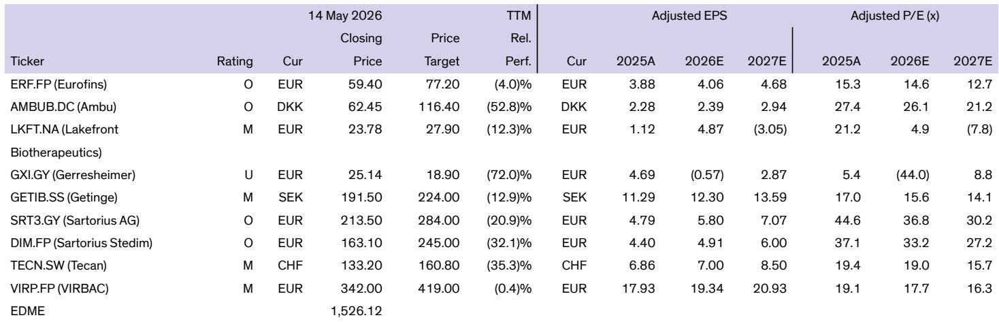

# AI在医疗领域的真正分水岭：谁掌握了多模态数据闭环，谁就定义了下一代诊疗入口

每天5000万个健康问题被抛向微软的Copilot，而谷歌每天收到超过10亿个健康相关搜索——这组数字本身已经说明了一个事实：医疗健康正在成为AI巨头争夺最激烈、也最有可能改变行业格局的战场。但某外资投行最新发布的这份研报揭示了一个更深层的判断：市场关注的重点正在从“谁有更好的大模型”转向“谁构建了更完整的多模态健康数据闭环”。谷歌和微软的路径分化，恰恰是这一趋势的缩影。

这份研报的价值不在于罗列谁在做什么，而在于它系统性地拆解了这两家公司在医疗AI上的底层逻辑差异。谷歌的策略是构建一个从搜索、穿戴设备、电子病历到基因组测序的多渠道生态系统，试图通过云平台连接所有利益相关方。微软则选择了更贴近个人的路径——Copilot Health被定位为“个人健康保险柜”，专注于整合个体的医疗数据并帮助用户理解自己的健康状况。

这两种路径看似互补，实则代表了两种完全不同的商业模式假设。而理解这种差异，对于任何关注医疗AI投资机会的人来说，都可能是未来三年最重要的分析框架。

## 1. 用户行为已经发生了结构性变化：从“查病名”到“描述症状”

研报引用了谷歌搜索AI负责人Hema Budaraju在Google Check Up 2026活动上的观察：健康类搜索请求的长度已经是普通搜索请求的三倍，而且用户不再只是搜索“头痛”这样的关键词，而是开始描述具体的症状和行为模式。这意味着用户正在把AI当作一个可以对话的“准医生”来使用，而不仅仅是一个信息检索工具。

这一变化的含义远超表面。当用户开始提供症状描述时，AI系统获得的就不再是孤立的关键词，而是带有上下文的结构化健康数据。这些数据可以被用于训练更精准的模型，也可以被用于构建个性化的健康画像。更重要的是，这种用户行为本身就在为AI系统提供免费的高质量训练数据——用户每描述一次症状，就是在帮助系统理解症状与疾病之间的概率关系。

从竞争角度看，这意味着先发优势正在被放大。谷歌每天10亿次健康搜索所产生的数据量，构成了一个几乎无法逾越的壁垒。微软虽然只有5000万次，但Copilot Health的“个人健康数据整合”定位意味着它获取的是更深层、更结构化的个体数据。两种数据各有价值，但都指向同一个结论：用户行为的变化正在加速AI在医疗领域的渗透，而谁先建立起数据飞轮，谁就能在后续的模型迭代中保持领先。

## 2. 谷歌的多模态生态系统正在形成一种“不可竞争性”

研报用了一个非常精准的词来描述谷歌的策略——“multi-channel approach”。这不仅仅是一个技术架构的选择，更是一种竞争战略的设计。谷歌通过Gemini、Fitbit（即将整合为Google Health）、Pixel、YouTube Health、MedGemma、AlphaFold以及与Roche等药企的合作，构建了一个从个人健康管理到临床研究再到药物发现的完整链条。

这种布局的威力在于：每一个环节产生的数据都会反过来增强其他环节的能力。Fitbit的睡眠和运动数据可以帮助优化Gemini的健康模型，YouTube上的健康视频观看数据可以反映公众的健康关切热点，与Roche合作的基因组测序数据则可以推动AlphaFold在药物发现中的应用。这种数据之间的正反馈效应，使得后来者几乎不可能在任何一个单点上进行追赶——因为即使你在某个环节做出了更好的产品，你也无法复制谷歌已经积累的数据规模和多样性。

研报特别指出，谷歌目前不允许在AI健康摘要回复中展示广告，但可以想象未来会基于回复的复杂度和精准度来设计变现模式。这意味着谷歌的医疗AI业务从一开始就不是为了短期广告收入，而是在构建一个长期的数据和用户粘性护城河。对于投资者来说，评估谷歌医疗AI的价值，不应该看它今天创造了多少收入，而应该看它正在积累的数据资产和用户习惯。

## 3. 微软Copilot Health的差异化定位：从“信息”到“理解”

与谷歌的生态平台策略不同，微软选择了另一条路。Copilot Health被描述为“个人健康保险柜”，它整合了来自50多个可穿戴设备和应用程序的数据、美国5万家医院的医疗记录以及实验室检测结果。核心承诺是帮助用户“理解他们所拥有的”——也就是把分散在不同系统里的医疗数据整合到一个地方，然后用AI来解释这些数据意味着什么。

这个定位的聪明之处在于，它解决了一个真实且普遍存在的痛点：大多数人拿到自己的体检报告或病历后，并不能真正理解其中的含义。Copilot Health试图填补这个认知鸿沟，让患者在去看医生之前就能对自己的健康状况有一个更清晰的了解，从而使医患沟通更加高效。

但这里有一个关键问题需要验证：用户是否愿意把自己的全部医疗数据交给微软？Copilot Health虽然强调自己是“dedicated, secure space”，但在公众对科技公司数据隐私的信任度仍然存疑的背景下，这可能是其最大的增长瓶颈。研报没有深入讨论这一点，但这是任何关注Copilot Health的人都需要持续跟踪的变量。

## 4. AI在临床决策中的真实能力与边界：NOHARM研究的启示

研报用相当篇幅介绍了斯坦福大学最新发布的NOHARM研究，这是本文中值得反复阅读的部分。该研究建立了一个临床安全评估框架，测试了多个大语言模型在临床决策中的表现。结果令人意外：AMBOSS Lisa（一个医疗知识平台）在安全性和完整性上大幅超越普通医生的推荐，得分在59%到62.3%之间，而医生的平均得分仅为46%。但在精准度上，医生仍然保持优势。

更值得关注的是各组模型的有害错误数量。即使是表现最好的Gemini 2.5 Flash，也出现了相当数量的严重和中度错误。这一发现的意义在于：AI在医疗领域的应用不能简单地用“更好”或“更差”来评价，而必须在安全、完整、精准这三个维度上进行综合评估。

研报明确指出，“AI永远无法承担医疗责任”。这句话听起来像是常识，但它揭示了AI在医疗领域应用的根本性约束：AI可以作为决策支持工具，但最终的诊断和治疗决策必须由医生做出。这意味着，任何医疗AI产品的商业模式都必须建立在“辅助”而非“替代”医生的基础上。那些声称可以用AI取代医生的创业项目，要么是在误导投资人，要么是在低估医疗监管的风险。

对于投资者来说，NOHARM研究提供了一个评估医疗AI公司的分析框架：不仅要看模型的技术指标，更要看它在安全性和完整性上的表现，以及它是否建立了持续的安全监控机制。那些在监管合规和临床验证上有实质性投入的公司，长期来看更有可能穿越周期。

## 5. 报告尚未完全回答的关键问题：变现路径与监管风险

尽管这份研报提供了大量有价值的分析，但它对几个关键问题的讨论并不充分。首先是变现路径。谷歌和微软都在医疗AI上投入了巨大资源，但它们的变现模式仍然不够清晰。谷歌目前不在AI健康回复中展示广告，这意味着它主动放弃了一部分短期收入。微软的Copilot Health目前还处于等待名单阶段，尚未公布定价策略。这两家巨头可以承受多年的亏损来培育市场，但对于独立医疗AI公司来说，变现路径是生死攸关的问题。

其次是监管风险。医疗AI的监管框架在全球范围内仍然处于快速演变中。不同国家对AI辅助诊断、数据隐私、算法透明度的要求差异巨大。研报提到了“regulations remain complex and country-specific”，但没有深入分析这些监管差异对竞争格局的影响。例如，欧盟的AI法案对高风险AI系统有严格的要求，这可能会影响欧洲医疗AI公司的产品开发和上市节奏。

第三个未解问题是数据互操作性。谷歌和微软都在试图整合来自不同来源的健康数据，但医疗数据的标准化程度仍然很低。不同医院使用的电子病历系统、不同品牌的可穿戴设备、不同国家的健康数据标准，都构成了数据整合的障碍。这个问题如果不能解决，无论是谷歌的生态系统还是微软的“个人健康保险柜”，其价值都会大打折扣。

这些正是值得在社群中继续深入讨论的问题。如果你对医疗AI的商业化路径、监管演变或数据互操作性的具体案例感兴趣，欢迎来我们的星球微信群里继续交流——我们每周都会围绕这类研报中的未解问题展开专题讨论，并分享更完整的原始图表和分析框架。

---

Personal reading notes and learning share only. Not investment advice.

