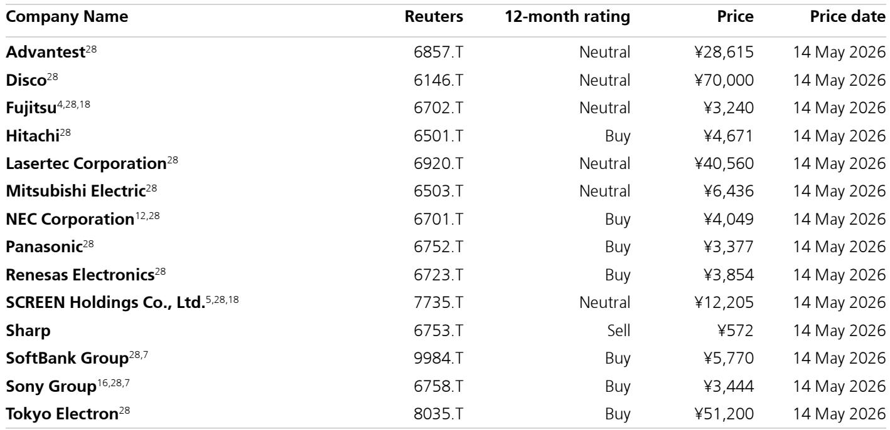

# Japan's Tech Hardware Cycle Is Not Over — It Is Shifting From Training to Inference

The dominant narrative in global technology investing has been that artificial intelligence demand follows a predictable pattern: massive upfront capital expenditure on training infrastructure, followed by a gradual commoditization of hardware as software layers capture value. That narrative is now being tested by a more complex reality emerging from Japan's technology sector. The evidence from recent earnings cycles and market positioning suggests that the AI hardware cycle is not peaking — it is rotating into a new phase centered on inference, and the companies best positioned for this rotation are not the ones that led the training boom.

Japan's technology conglomerates and semiconductor equipment makers are delivering a clear signal: the structure of AI demand is unchanged in its direction, but the composition of value capture is shifting. The expansion of coding AI has triggered a sharp increase in demand for tokens and inference compute. This is not a marginal uptick. It represents a structural change in how AI workloads are deployed, moving from experimental training runs to production-scale inference. The fundamental demand driver for data center-related hardware — semiconductors, manufacturing equipment, power infrastructure, and advanced packaging — remains robust. The question is not whether demand will persist, but which companies will capture the next wave of value creation.

This matters now because the market is beginning to conflate two separate phenomena. Concerns about software disruption — the so-called "death of SaaS" narrative — are being applied indiscriminately to hardware businesses that operate on entirely different economic principles. The result is a growing dispersion between companies that are genuinely exposed to structural headwinds and those whose valuations have been unfairly compressed by association. For investors with a strategic lens, this dispersion creates opportunity. The key is to distinguish between businesses facing cyclical normalization and those entering a structural upcycle driven by inference demand.

## The AI Demand Structure Has Not Inverted — It Has Rotated from Training to Inference

The most important analytical distinction in the current cycle is between training-driven hardware demand and inference-driven hardware demand. Training requires enormous clusters of GPUs operating in parallel for weeks or months, driving demand for high-bandwidth memory, advanced interconnects, and precision manufacturing equipment. Inference, by contrast, is more distributed, more latency-sensitive, and more dependent on efficient power delivery and thermal management. The two phases have different hardware profiles, different bottlenecks, and different margin structures.

What the current data shows is that the inference phase is accelerating faster than consensus models anticipated. Coding AI platforms — from Anthropic's product suite to OpenAI's ongoing improvements and China's competitive entrants like Kimi — are driving exponential growth in token consumption. Every query executed on a coding assistant represents an inference workload. As these tools move from developer productivity aids to enterprise deployment, the volume of inference compute required scales non-linearly.

This has direct implications for Japan's semiconductor ecosystem. The companies that benefit from training infrastructure — particularly those exposed to extreme ultraviolet lithography and advanced packaging — have already been priced for perfection. The companies that benefit from inference infrastructure are only now beginning to be recognized. Tokyo Electron's recent price hike, which was not anticipated by the market, is a signal that pricing power is returning to semiconductor equipment makers serving the inference buildout. When a supplier can raise prices in a cycle that many believed was maturing, it suggests that demand is not merely stable but tightening.

## SoftBank and Sony Offer Asymmetric Exposure to the Inference Economy, But for Different Reasons

Among Japan's technology conglomerates, the case for SoftBank rests on two pillars that are not fully reflected in its current valuation. The first is ARM's position in the inference value chain. ARM architecture is increasingly central to data center inference workloads, particularly as power efficiency becomes the binding constraint on deployment scale. The second is the accelerating monetization of OpenAI, which represents a direct beneficiary of the coding AI expansion. SoftBank's share price, in this framework, is not a bet on a holding company discount narrowing — it is a leveraged play on the inference economy through two of its most important structural positions.

Sony presents a different but equally compelling case. The primary concern entering its full-year results was the impact of DRAM price hikes on its content and imaging businesses. Sony has managed to offset that headwind through its own price increases, demonstrating pricing power that the market had not fully discounted. More importantly, Sony's current share price reflects excessive concern about content value erosion due to AI. The narrative that generative AI will commoditize content creation is real, but it is being applied too broadly. Sony's competitive advantages in high-end imaging sensors, professional audio-visual equipment, and gaming content are not easily replicated by AI models. The market is pricing in a worst-case scenario that may not materialize.

The contrast with Panasonic is instructive. Panasonic's share price already reflects positive factors — data center backup power units and structural reform benefits. There is less room for upside surprise. The same logic applies to Fujitsu, where hardware profit declines in the first quarter appear unavoidable, and the outlook remains challenging. The dispersion within the conglomerate space is not random. It reflects differing exposure to the inference cycle and differing ability to pass through cost increases.

## Tokyo Electron and Renesas Demonstrate That Semiconductor Equipment Pricing Power Is Returning

The semiconductor equipment segment has been the most direct beneficiary of AI-driven capital expenditure, but the market has treated it as a homogeneous group. The evidence from recent earnings suggests this is a mistake. Tokyo Electron's unanticipated price hike is the most significant data point. In a cycle where many expected equipment pricing to stabilize or decline as capacity additions came online, Tokyo Electron demonstrated the opposite. This is consistent with a market where leading-edge equipment remains in short supply due to the specific requirements of advanced logic and memory for inference workloads.

The implications extend beyond Tokyo Electron. When a market leader can raise prices, it creates room for others to follow. Renesas, which has now posted six consecutive quarters of sequential sales growth, is seeing a similar dynamic in its end markets. Overseas competitors have implemented further price increases following earlier rounds in March and April, and Renesas is positioned to benefit from improving profit margins as well. The six-quarter growth streak is not merely a cyclical recovery — it is confirmation of an upcycle that has more room to run.

The cautionary note applies to Advantest and Disco. Both companies are seeing solid operational trends, supported by AI demand tailwinds. But their current valuations embed assumptions about growth that leave little room for error. The multiples are excessively high relative to the visibility of future demand. This is not a call against the companies' fundamental positions. It is a recognition that the best risk-reward in the semiconductor equipment space now lies with companies that have pricing power and margin improvement potential, not those whose valuations already discount perfection.

## What the Report Does Not Fully Answer: The Software Side of the Equation Remains an Open Question

The report is clear in its preference for hardware over software within Japan's technology ecosystem. The "death of SaaS" narrative is acknowledged as a persistent risk. But the report does not fully resolve a critical question: if coding AI continues to improve at its current trajectory, at what point does the demand for inference hardware begin to moderate as models become more efficient? The relationship is not linear. More capable models can generate more demand through broader deployment, but they can also reduce the compute required per task through architectural improvements.

This tension creates an open analytical question. The report identifies the shift to in-house development as a risk factor in Japan's domestic IT services market, but it does not quantify how this trend interacts with the inference hardware cycle. If enterprises bring more development in-house, they may also deploy more inference infrastructure internally, which could sustain hardware demand. Alternatively, they may rely more on third-party API providers, concentrating demand in a smaller number of hyperscale data centers. The direction of travel matters for which hardware companies benefit.

A second unanswered question concerns the geographical distribution of the inference buildout. The report focuses on Japan-based companies, but the demand is global. How much of the inference infrastructure will be built in Japan versus other regions? The answer depends on energy availability, data sovereignty regulations, and the competitive positioning of Japanese semiconductor equipment versus Taiwanese and Korean alternatives. These factors are not addressed in detail, and they represent a meaningful source of uncertainty for the investment thesis.

## A Decision Framework for Navigating the Japanese Technology Cycle

For investors seeking to act on the insights in this report, a structured decision framework is more useful than a list of recommendations. The framework should address three sequential questions.

First, what is the primary demand driver for the company in question? Companies whose revenue is tied to training infrastructure — advanced lithography, high-bandwidth memory packaging, and extreme precision testing — face a different risk profile than those tied to inference infrastructure — power management, efficient compute architectures, and distributed networking. The market is currently pricing these two groups similarly, which creates opportunity for those who can distinguish between them.

Second, does the company have demonstrated pricing power? The ability to raise prices in the current environment is the single most reliable signal of a structural rather than cyclical demand trend. Tokyo Electron's price hike is the clearest example, but the framework should be applied across the universe. Companies that can pass through cost increases are signaling that their customers face binding capacity constraints. Companies that cannot are signaling that their markets are more competitive or more cyclical.

Third, is the company's valuation already discounting its positive attributes? Panasonic's share price reflects its data center exposure and restructuring benefits. Advantest's valuation reflects its AI tailwinds. The question is not whether the story is good — it is whether the story is already fully priced. The most attractive opportunities are those where the fundamental thesis is strengthening but the valuation has not yet adjusted.

Applying this framework to the report's analysis yields a clear preference for companies with inference exposure, demonstrated pricing power, and valuation that does not yet reflect the full cycle. This is the lens through which the report's recommendations should be interpreted.

Join the community to read the full report and review the original charts.

*This article is for learning and discussion only and does not constitute investment advice.*

Personal reading notes and learning share only. Not investment advice.

