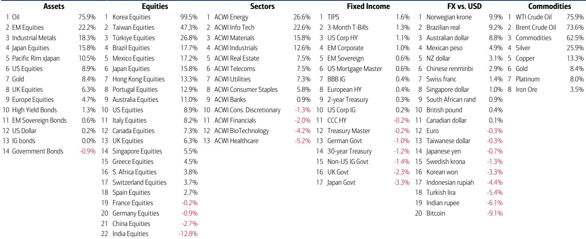

# The Boom Loop Has a Political Expiration Date: Why the Melt-Up Is the Market's Last Trade Before Inflation Breaks It

The defining financial narrative of 2026 is not artificial intelligence, not deregulation, and not the reshoring of supply chains. It is the $4 trillion addition to U.S. household equity wealth already recorded year-to-date, following $10 trillion in 2025, $9 trillion in 2024, and $8 trillion in 2023. This compounding wealth effect has created what a global investment bank report calls a "boom loop" — a self-reinforcing cycle where rising asset prices boost consumer confidence and spending, which in turn supports corporate earnings and further price appreciation. The loop has been the single most powerful force in markets for four consecutive years. But it is now approaching its natural termination point, and the mechanism of its end will not be a recession or a corporate credit event. It will be politics.

The argument that follows is not a forecast of an imminent crash. It is a strategic assessment of why the current market configuration — extreme concentration, collapsing volatility, and a semiconductor index trading 62 percent above its 200-day moving average — represents a late-cycle phenomenon that investors must treat as such. The report's data makes clear that the conditions for a policy-driven reversal are already being assembled. The question is not whether the boom loop ends, but whether investors are positioned for the transition from a regime of asset inflation to one of political inflation-fighting.

## The Wealth Effect Has Become the Economy's Primary Engine, and That Engine Is Now Politically Vulnerable

The cumulative $31 trillion in household equity wealth gains since 2023 is not merely a statistical curiosity. It is the mechanism by which the U.S. economy has maintained growth without a Federal Reserve willing to tighten policy. When households feel richer, they spend more, borrow more, and tolerate higher prices. This dynamic has allowed the economy to absorb rate hikes, tariff disruptions, and geopolitical shocks with surprising resilience. The boom loop works because asset prices drive consumption, and consumption drives earnings, and earnings drive further asset price gains.

But the loop has a fragility that is not widely appreciated. It depends on the continued tolerance of inflation by both the electorate and the political establishment. The report's data shows that U.S. CPI is on course to exceed 5 percent by the midterm elections if monthly gains do not slow from their current 0.4 percent pace. Historically, once CPI crosses 4 percent, the S&P 500 has averaged a 4 percent decline over the sUBSequent three months and a 7 percent decline over six months. The boom loop does not break because of a sudden loss of investor confidence. It breaks because the political system eventually must respond to the pain of rising prices, and that response will involve policies that directly undermine the wealth effect.

The report's flows data reveals the tension already present. In the same week that saw $24.4 billion flow into U.S. large-cap stocks — the largest in five weeks — there was also a $22.2 billion outflow from China equities and a $1.3 billion outflow from crypto. Investors are chasing the momentum of U.S. mega-cap tech while simultaneously signaling discomfort with riskier exposures. This is not the behavior of conviction. It is the behavior of capitulation into the most crowded trade.

## The Semiconductor Index Is Trading at Bubble Extremes, But the Real Risk Is Not a Tech Wreck — It Is a Bond Market Revolt

The report's comparison of the SOX semiconductor index to historical bubbles is striking. At 62 percent above its 200-day moving average, the index has surpassed the deviation seen at the peak of the dot-com bubble (55 percent) and is approaching the Mississippi Company bubble of 1720 (73 percent). For investors who rely on mean-reversion frameworks, this is a flashing red signal. But the more important observation is that this extreme has occurred in an environment of falling volatility and rising bond yields.

The simultaneous compression of equity volatility and expansion of term premiums creates a dangerous asymmetry. When volatility is low, investors lever up. When bond yields rise, the discount rate applied to future cash flows increases, compressing equity valuations. The Nasdaq is annualizing a 45 percent gain while the 10-year U.S. Treasury yield is on pace to rise 80 basis points this year. This combination has occurred only in the most speculative periods of market history — 1999 and 2009 — and in both cases, it preceded significant equity drawdowns.

The report's Table 1 provides a critical historical anchor. In the three months following the start of a new Fed chair's term, 2-year UST yields have risen an average of 55 basis points, and 10-year yields have risen 48 basis points. The new Fed chair, Kevin Warsh, began his term on May 15, 2026. If history is any guide, bond yields are likely to rise further, and the equity market's ability to absorb that rise while maintaining its current trajectory is highly questionable. The report notes that yields have already risen approximately 50 basis points in the three months before Warsh took office, suggesting the bond market is front-running the policy shift.

## The Political Center Cannot Hold, and the Inflation Backlash Will Reshape Sector Leadership

The report's analysis of UK local elections provides a framework for understanding the political dynamics at play in the U.S. The vote share of insurgent parties — Reform and the Greens — surged from 3 percent to 41 percent, while established parties collapsed from 92 percent to 54 percent. The report's conclusion is direct: in the 2020s, you cannot govern from the center. Extreme politics produce extreme asset price action.

In the U.S. context, the relevant metric is President Trump's approval rating on inflation, which the report notes is near Joe Biden's lows. The electorate's patience with rising prices is finite, and the political incentive to appear tough on inflation will eventually override the incentive to maintain asset-friendly policies. The report identifies a potential pivot from "Chips and Commodities to Consumer" in 2027 — a rotation out of the sectors that have benefited most from government-directed capital spending and into sectors that benefit from a political focus on affordability.

This is not a speculative forecast. It is a logical extension of the data. When inflation becomes the dominant political issue, the policy response will involve measures that reduce demand, increase supply, or both. Tariff reductions, energy price controls, antitrust enforcement against price-gouging, and regulatory easing for housing construction are all plausible tools. Each of these would have differential impacts on sectors. The report's flows data shows that private clients have been buying energy, municipal bond, and materials ETFs while selling utilities, financials, and tech ETFs. This is a defensive rotation, but it may be premature. The real rotation will come when the political pivot is confirmed, not when it is anticipated.

## The Report's Framework Has a Critical Gap: It Does Not Model What Happens When the Boom Loop Breaks

For all its analytical rigor, the report leaves one question unanswered: what is the mechanism of the boom loop's termination? It identifies the conditions — rising CPI, political backlash, bond yields breaking higher — but it does not specify the sequence of events that would trigger a sustained decline in equity prices.

There are three plausible pathways, and each has different implications for portfolio construction. The first is a bond market revolt, where rising yields force a repricing of equities through the discount rate channel. This would hit long-duration assets hardest, including technology and growth stocks. The second is a political shock, where an unexpected policy announcement — a tariff reduction, a price control, a surprise Fed hike — breaks the wealth effect narrative. This would likely cause a sharp but short-lived decline, followed by a rotation into value and consumer sectors. The third is a liquidity event, where the combination of high leverage and low volatility triggers a forced deleveraging. This is the most dangerous pathway because it is nonlinear and difficult to hedge.

The report's Bull & Bear Indicator is at 7.6, approaching the 8 level that has historically been a sell signal. The indicator is likely to trigger within the next two weeks if cash levels in the global fund manager survey decline from 4.3 percent to 3.8 percent and flows into global stocks, EM debt, and high-yield bonds continue at their current pace. This is a tactical signal, not a strategic one. It suggests that the market is due for a pullback, but it does not tell us whether the pullback will be a buying opportunity or the beginning of a more significant downturn.

## A Decision Framework for Navigating the Transition from Boom Loop to Political Regime

For investors who accept the report's premise that the boom loop is approaching its end, the strategic question becomes one of positioning. The following framework is designed to help decision-makers assess their exposure and identify adjustments.

First, assess your exposure to the wealth effect. The boom loop has been most powerful for assets that benefit from rising household spending and confidence: consumer discretionary, housing, and financials. If you are overweight these sectors, you are implicitly betting that the political system will continue to tolerate inflation. That bet has worked for four years, but its risk-reward profile has deteriorated significantly.

Second, evaluate your duration exposure. The report's data shows that bond yields are rising, and the historical pattern suggests further increases. If you are long duration in either bonds or equities, you are exposed to the discount rate channel. Consider reducing exposure to long-duration assets and increasing exposure to short-duration or floating-rate instruments.

Third, identify the sectors that would benefit from a political pivot to inflation-fighting. These include consumer staples, healthcare, and utilities — sectors that have underperformed in the boom loop but would benefit from a regime of stable prices and political support for affordability. The report's flows data shows that healthcare and real estate are seeing inflows for the first time in months, suggesting that some investors are already positioning for this shift.

Fourth, monitor the political calendar. The report identifies June as a potential inflection point, with the OPEC meeting, the World Cup, President Trump's birthday, the G7 summit, and the first FOMC meeting under Warsh all occurring within a two-week window. This concentration of events creates a high probability of a policy surprise. Be prepared to adjust positioning quickly.

Finally, do not assume that the boom loop's end will be orderly. The report's comparison of current price action to the start of a cycle versus the end of a cycle is deliberately ambiguous. The data supports both interpretations. The financial sector's relative performance — now below the lows of the dot-com bust, the global financial crisis, and the COVID crash — suggests that markets are pricing in a structural shift, not a cyclical rotation. Act accordingly.

## Join the Community to Read the Full Report and Review the Original Charts

The analysis presented here is based on a single report from a leading global investment bank, but the implications extend far beyond any single data point or forecast. The boom loop is not a theory. It is a four-year empirical reality that has reshaped portfolios, economies, and political systems. Understanding its dynamics — and its vulnerabilities — is essential for anyone who manages capital in the current environment.

The full report contains charts and tables that cannot be fully reproduced here: the trajectory of U.S. CPI under different monthly scenarios, the historical comparison of the SOX index to past bubbles, the relationship between financials and the S&P 500, and the weekly flows data that reveals where institutional and private client money is moving. These are not decorative additions. They are the analytical foundation for the argument presented in this article.

Join the community to read the full report and review the original charts. The data will speak for itself, but the interpretation requires context, discipline, and a willingness to challenge the consensus. The boom loop has been profitable for those who rode it. The question now is whether you are prepared for what comes next.

*This article is for learning and discussion only and does not constitute investment advice.*

Personal reading notes and learning share only. Not investment advice.

