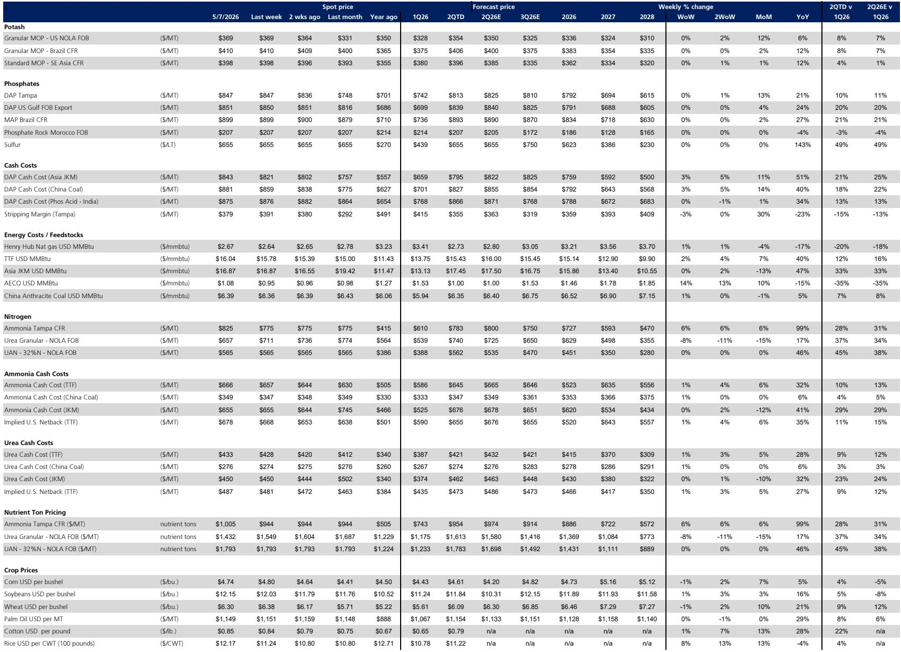

# The Fertilizer Cycle Has Peaked: Why the Second Half of 2026 Favors Stock Pickers Over Sector Bets

The global fertilizer market has entered a phase of maximum complexity. Nitrogen prices surged 25-60% since the onset of the Middle East conflict, phosphates are caught in a margin squeeze that is forcing production curtailments, and potash has moved higher on freight costs and seasonal demand. For investors, the temptation is to treat this as a uniform sector story. That would be a mistake. The critical insight emerging from the latest data is that the second quarter of 2026 is likely to represent the peak pricing quarter for this cycle, and the divergences between nutrients, companies, and time horizons are widening into chasms. The question is no longer whether fertilizer stocks are attractive. It is which ones can sustain earnings when the tailwinds fade, and which ones are structurally impaired even at elevated prices.

Understanding where we are in the cycle requires disentangling three separate dynamics that the market is conflating. First, the Middle East disruption created a supply shock that lifted all nutrients temporarily, but the transmission mechanism differs fundamentally for nitrogen, phosphates, and potash. Second, the cost curve has shifted in ways that benefit some producers while destroying margins for others. Third, the demand side is showing signs of stress that will accelerate as we move past the Northern Hemisphere growing season. The combination suggests that the next six months will separate the companies with genuine structural advantages from those that are merely riding a transient wave.

The most important analytical shift is recognizing that nitrogen pricing has already begun to soften. Spot urea prices have moved lower in recent weeks, and the Tampa ammonia contract settled below expectations. This is not a temporary blip. It reflects the reality that physical markets are pricing in a shorter disruption than what was feared in March and April. The seasonal demand peak has passed, and while supply constraints will keep prices above pre-conflict levels through the second half of 2026, the trajectory is downward. For investors positioned for continued nitrogen upside, the window is closing.

## The Nitrogen Premium to the Cost Curve Has Widened to Unsustainable Levels, Creating a Setup Where Peak Earnings Are Likely Behind Us

The most striking feature of the current nitrogen market is not the absolute price level, but the premium to the natural gas cost curve. Ammonia prices have risen approximately $100 per metric ton more than what the move in gas prices would imply. Urea and UAN have moved $35 and $140 above gas-driven expectations respectively. This premium reflects genuine supply constraints, including Iranian production outages, stranded vessels at the Strait of Hormuz, and limited alternative supply availability. But it also contains a significant element of fear premium that is now beginning to dissipate.

The disconnect becomes clearer when examining natural gas markets. U.S. and Canadian gas prices have seen a muted reaction to the Middle East conflict, declining 9% since February in the U.S. and rising only 2% in Canada. European and Asian gas benchmarks at roughly $16-17 per MMBtu remain well below 2022 peaks. The gas market is effectively signaling that it expects production interruptions to be short-term in nature. When the nitrogen premium to gas normalizes, as it inevitably will, the earnings impact for nitrogen-heavy producers will be sUBStantial.

For companies like CF Industries, the math is revealing. Current estimates place peak annualized EBITDA in the $5-6 billion range, generating $4-5 per quarter in excess free cash flow. This implies roughly 3-4 more quarters of elevated earnings before normalization begins. The base value of the stock, using mid-cycle EBITDA of approximately $2.05 billion and an 8.5x multiple, sits around $105 per share. The upside to $140-145 is possible if disruption persists, but the downside risk in a normalization scenario is equally real. The stock is already discounting much of the good news.

The strategic implication is that nitrogen-linked equities are now a bet on the duration of the disruption, not on the fundamental strength of the market. Investors who believe trade flows will resume within months should be reducing exposure. Those who expect a protracted closure of the Strait of Hormuz through year-end may still find opportunity. But the risk-reward has shifted meaningfully from where it stood in March.

## Phosphate Margins Are Being Crushed by Input Cost Inflation, and the Market Cannot Decide Whether Higher Prices or Demand Destruction Will Win

Phosphates present the most analytically challenging puzzle in the fertilizer complex. Prices have risen 20-25% since before the conflict, yet producer margins are compressing significantly. The culprit is input costs. Sulfur prices have surged to $900-1,150 per metric ton in key markets, while ammonia costs remain elevated. The result is stripping margin compression of up to $120 per metric ton in offshore regions.

This margin squeeze is not theoretical. It is driving real production decisions. OCP has implemented production cuts of up to 30% in the second quarter. Mosaic has curtailed operations at two U.S. plants to 50% capacity, representing approximately 1.7 million tons of production. PhosAgro faces supply disruptions from drone strikes. The combination of deliberate curtailments and forced outages is constraining supply against an already tight supply-demand setup.

The critical question is whether the market can bear the prices needed to restore producer margins. Higher phosphate prices would theoretically improve stripping margins, but demand destruction is already visible. U.S. applications are complete in some areas, and Brazilian buyers are reducing applications due to affordability concerns. The April import data shows Brazilian phosphate imports down 1% year-to-date, and aggregate April imports fell 11% year-over-year. The tension between supply constraints and demand weakness creates a binary outcome that is unusually difficult to predict.

For Mosaic, the implications are severe. Combined phosphate and Fertilizantes EBITDA is expected to decline more than 50% in 2026, while potash earnings remain roughly flat. Total 2026 EBITDA is projected near $1.6 billion, below the mid-cycle estimate of $1.85 billion. The stock trades near $23, which implies a mid-cycle valuation at roughly 6.0x EBITDA plus $6 per share for the SAU holdings. Free cash flow generation is depressed, with yields of only 0.2% to 2.0% over 2026 and 2027.

The bull case for Mosaic requires two things to happen simultaneously: phosphate prices must move higher to restore margins, and potash pricing must hold steady or improve. The bear case is that demand destruction caps phosphate prices while input costs remain elevated, compressing margins further. The asymmetry of outcomes appears skewed to the downside, which explains the cautious positioning.

## Potash Has Benefited from Freight-Driven Price Increases, but Producer Margins May Not Capture the Full Benefit

Potash pricing has moved up since the onset of the Middle East disruption, driven by peak Northern Hemisphere demand, increased Brazilian demand, and higher freight costs. Prices are tracking $15-30 per metric ton higher quarter-over-quarter. Canpotex is fully sold through June 30, indicating offshore volumes are on track. Demand destruction risks appear more limited, estimated at 5-15%, compared to the more severe stress in phosphates.

However, a significant portion of the price increase is attributable to freight costs rather than underlying supply-demand tightening. This matters because freight-driven price increases do not flow fully to producer margins. The benefit to companies like Nutrien and Mosaic is therefore less than the headline price move would suggest. Supply from Israel and Jordan remains uninterrupted, and potash has been less exposed to Strait of Hormuz disruptions than nitrogen or phosphates.

For Nutrien, which carries a Sell rating in the source report, the challenges extend beyond potash. The company faces declining EBITDA as nitrogen markets normalize, with an estimated $1.5 billion in over-earnings in 2026. The potash outlook is also contested. The bear case sees incremental supply exceeding demand growth through the end of the decade, creating modest downside risk to pricing. The bull case argues that better crop prices and farmer profitability will flow through to stronger demand, keeping the supply-demand balance tighter than expected.

The mid-cycle EBITDA estimate for Nutrien is approximately $5.5 billion, which at a 7.5x multiple implies a value of $62 per share. If potash pricing remains flat at 2025 levels, $20-30 per metric ton above mid-cycle assumptions, this would add $300-450 million to mid-cycle EBITDA and push the valuation to $70-72 per share. The stock currently trades in this range, suggesting that the market is already pricing in a relatively benign potash outcome. The risk is that the nitrogen normalization and potash oversupply materialize simultaneously.

## What the Report Does Not Fully Answer: The Timing and Mechanism of Demand Destruction

The source report provides a detailed supply-side analysis but leaves several critical demand-side questions unresolved. The most important is the elasticity of farmer demand to current price levels. We know that Brazilian phosphate imports are already showing signs of stress, and that nitrogen affordability is pushing buyers toward lower-cost alternatives like ammonium sulfate. But we do not know the threshold at which demand destruction becomes self-reinforcing, creating a downward spiral in prices that overwhelms supply constraints.

A second unresolved question concerns the interaction between fertilizer prices and crop prices. Corn and soybean futures for 2026 and 2027 have moved higher since the conflict began, adding $45 per acre for corn and $20 per acre for soybeans. This improves farmer economics and should support fertilizer demand. But if fertilizer prices remain elevated, the net benefit to farmers is eroded. The report estimates farmer break-even costs at $4.70 per bushel for corn and $11.95 for soybeans in 2025. Current futures are above these levels, but the margin is thin, and any further increase in fertilizer costs could push farmers back toward unprofitability.

The third open question is the duration of the Middle East disruption itself. The report acknowledges that physical markets are pricing in a shorter disruption, but the range of outcomes remains wide. If the Strait of Hormuz reopens in the near term, the normalization of nitrogen prices could be rapid and severe. If disruption persists through the third quarter, the impact on Brazil's peak import season would be amplified, potentially creating a second wave of price increases. The report cannot resolve this uncertainty, and investors must form their own views on geopolitical risk.

## A Decision Framework for Fertilizer Investors in the Second Half of 2026

Given the complexity of the current environment, a structured decision framework is essential. The following considerations should guide positioning:

First, distinguish between nutrient exposures. Nitrogen is past its peak and faces normalization risk. Phosphates are caught between input cost inflation and demand destruction, with asymmetric downside. Potash offers the most stability but limited upside from current levels. A portfolio that treats all fertilizers as interchangeable is missing the most important distinctions.

Second, assess the duration of the disruption. If you believe the Middle East situation will resolve within months, favor companies with diversified portfolios and lower nitrogen exposure. If you expect prolonged disruption, nitrogen-levered names still offer upside, but the window is narrowing. The base case in the report is that second quarter represents the peak, which implies that the time to reduce nitrogen exposure is now.

Third, evaluate company-specific margin dynamics. CF Industries benefits from low-cost U.S. natural gas and a pure-play nitrogen business that captures the full benefit of elevated prices. Mosaic faces structural margin compression in phosphates that is not captured by looking at phosphate prices alone. Nutrien's diversified portfolio provides some buffer but also means it cannot escape the nitrogen normalization.

Fourth, consider the crop price feedback loop. Higher crop prices support fertilizer demand, but the relationship is not linear. If fertilizer prices rise faster than crop prices, farmer affordability deteriorates. The current configuration, where both are moving higher, is favorable but fragile. Any reversal in crop prices would accelerate demand destruction.

Fifth, monitor Brazil import data closely. The April figures show only limited impact from the Middle East disruption, but the 6-8 week shipping lag means May and June data will be more revealing. A sharp decline in nitrogen and phosphate imports would confirm demand destruction and reinforce the peak-cycle thesis. Stable or rising imports would suggest that the market can absorb higher prices.

## The Divergence Between Nitrogen and Phosphate Stories Creates Opportunities for Active Investors

The fertilizer sector is entering a period where macro tailwinds are fading and company-specific factors will drive returns. The nitrogen story is about the duration of a disruption that is already being priced in. The phosphate story is about whether the market can find an equilibrium between supply constraints and demand destruction. The potash story is about whether the bull case for tighter supply-demand dynamics can overcome the structural oversupply that the bear case predicts.

For active investors, this environment favors those who can make granular, nutrient-specific bets rather than broad sector allocations. The source report's positioning, with Sell ratings on Nutrien and Intrepid Potash and a Neutral rating on Mosaic with a preference for CF Industries over LSB Industries over Mosaic, reflects this nuance. The recommendation is not to avoid fertilizers, but to be selective and to recognize that the easy money has been made.

The unresolved questions around demand elasticity, the duration of geopolitical disruptions, and the interaction between input costs and product prices mean that the range of outcomes remains wide. Investors who can form independent views on these questions will have an edge. Those who rely on simple narratives about supply constraints will be caught off guard when the cycle turns.

---

*This article is for learning and discussion only and does not constitute investment advice.*

Join the community to read the full report and review the original charts.

Personal reading notes and learning share only. Not investment advice.

