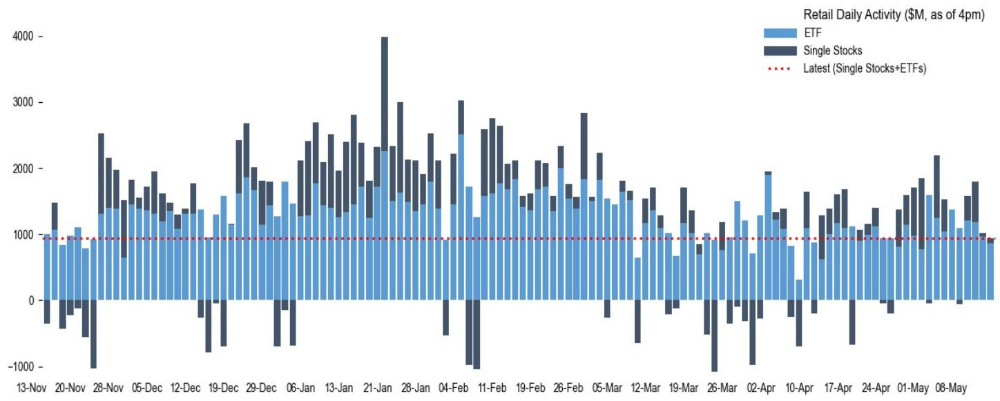

# The Retail Crowd Is Dumping Software and Doubling Down on Semis: A Strategic Divergence That Demands Attention

The most telling signal in equity markets right now is not a price level or a macroeconomic forecast. It is the behavior of retail investors, who have begun to systematically rotate out of software stocks and into semiconductor names with a conviction that has not been seen in years. According to the latest data from a global investment bank's quantitative research team, retail flows into semis have accelerated even as software exposure has been actively reduced, creating a positioning distortion that is now at extreme levels. This is not a minor tactical shift. It is a structural reorientation of retail sentiment that carries implications for relative performance, short-squeeze dynamics, and the sustainability of the AI trade.

The timing matters. This rotation is happening against a backdrop of robust earnings from both sectors. Software companies have delivered 25% year-over-year earnings growth, while semis have posted an extraordinary 124% increase. Both sectors are fundamentally strong, yet retail investors are treating them as if they belong to different asset classes. The divergence in crowding metrics, short interest, and flow patterns suggests that the market is pricing in a narrative that goes beyond near-term results. The question is whether the crowd is right, or whether it is creating an opportunity in the very names it is abandoning.

To understand what is driving this behavior, it is necessary to look beyond the surface-level data on buys and sells. The pattern reveals a sophisticated, if not always rational, attempt to position for the next phase of the AI cycle. Semiconductor stocks are perceived as the infrastructure layer of AI, the picks-and-shovels play that benefits regardless of which software applications ultimately win. Software, by contrast, is seen as more discretionary and more exposed to competitive disruption, especially as large language models commoditize certain functions. The retail crowd appears to be voting with its dollars for the tangible over the intangible, for hardware over code.

But this consensus carries risks. The extreme crowding in semis and the simultaneous abandonment of software have created conditions that historically precede sharp reversals. The data show that short interest in software has risen to the 100th percentile, meaning that bearish bets are as concentrated as they have ever been. This is a classic setup for a squeeze. Meanwhile, short interest in semis remains stable and low, suggesting that the bear case is not being actively debated. When everyone is on the same side of the trade, the trade itself becomes fragile.

## Retail Investors Are Not Just Buying Semis; They Are Abandoning Software in a Way That Has No Recent Precedent

The raw numbers make the divergence unmistakable. Microsoft, which was the second most-bought stock by retail investors in April, has become the second most-sold in May and the most-sold in the most recent week. Palantir has also seen sustained net selling. At the same time, retail inflows into semiconductor ETFs such as SOXX and SMH have remained robust, and buying into DRAM names has more than quadrupled over the past week. This is not a case of mild preference. It is a wholesale portfolio rebalancing.

The contrast is even starker when viewed through the lens of crowding analysis. The bank's proprietary crowding metrics, which measure how concentrated investor positions are relative to historical norms, show that semis crowding has expanded further while software crowding has contracted. The distortion between the two sectors has widened to levels that are rare even by the standards of the past decade. In the data, this divergence is not a blip. It is a trend that has been building since early 2025 and accelerated sharply in recent weeks.

What makes this behavior particularly noteworthy is that it is occurring during a period of strong earnings for both groups. Software companies including Datadog, Fortinet, and Cloudflare have reported solid results. Semiconductor and tech hardware names have done the same. The fundamental case for owning either sector is intact. Yet retail investors are treating them as if they belong to different regimes. This suggests that the rotation is driven not by disappointment with software fundamentals, but by a forward-looking narrative about where the AI cycle is headed.

The implication is clear. Retail investors are making a directional bet that the next leg of AI value creation will accrue to the hardware layer, not the application layer. They are betting that the massive capital expenditure on data centers and chips will translate into sustained earnings growth for semis, while software companies will face margin compression and competitive pressure as AI tools become ubiquitous. Whether this thesis is correct is an open question, but the conviction behind it is undeniable.

## The Short Squeeze Setup in Software Is the Most Compelling Contrarian Signal in the Market Today

When retail investors sell a sector aggressively, professional short sellers often follow. In software, they have done so with unusual intensity. Short interest in software names has risen to the 100th percentile of its historical range, meaning that bearish positioning is as concentrated as it has ever been. This is not a normal level of skepticism. It is a crowded trade in the opposite direction.

The risk here is asymmetric. If software stocks continue to deliver strong earnings and if the narrative around AI commoditization proves premature, the shorts will need to cover. A short squeeze in software would be violent precisely because positioning is so extreme. The retail crowd, having already sold, would not be the marginal buyer in such a scenario. That role would fall to institutional investors who have been underweight software and to short sellers themselves, who would be forced to buy to close their positions.

The data show that semis shorts, by contrast, are stable and low. There is no similar squeeze risk on the hardware side. This means that the most interesting risk-reward trade in the current market is not in the crowded semis trade, but in the abandoned software trade. The crowd is betting against software, and the crowd is often wrong at extremes.

This is not to say that software is a buy regardless of fundamentals. The sector faces real challenges, including the potential for AI to reduce barriers to entry and compress margins. But the positioning data suggest that these risks are fully priced in, if not overpriced. When short interest is at its historical maximum, the bear case is no longer a secret. It is the consensus. And consensus trades tend to reverse when the underlying assumptions are tested.

## Copper and Emerging Market Tech Are Emerging as Secondary Themes That Could Draw Retail Capital Away from Semis

While the software versus semis divergence dominates the narrative, retail investors are also beginning to explore adjacent themes. Copper has emerged as a significant area of interest, driven by a rebound in Chinese demand, strong AI-related fundamentals, and rising supply risks linked to sulfur shortages in the Middle East. Retail investors traded the copper theme aggressively, recording their largest single-day purchase in the COPX ETF on Tuesday, followed by profit-taking the next day. This is classic retail behavior: thematic conviction paired with short-term trading.

The copper trade is relevant to the semis story because it reflects a broader recognition that the AI buildout is a physical phenomenon. Data centers require copper for wiring, cooling systems, and power infrastructure. The same logic that makes semis attractive applies to copper, albeit with different timing and volatility characteristics. If retail investors begin to rotate some of their semis profits into copper and other infrastructure plays, it could moderate the crowding in semis while introducing new sources of dispersion.

Similarly, Chinese tech ETFs such as KWEB continue to see elevated retail activity. The bank's data show that KWEB recorded a z-score of 5.3, indicating unusually high retail buying relative to historical norms. This suggests that retail investors are also looking abroad for AI exposure, particularly in markets where valuations are lower and where the AI narrative is less mature. The combination of copper, Chinese tech, and semis creates a diversified portfolio of AI-adjacent bets, but it also means that retail attention is fragmented. The software sector is the clear loser in this allocation game.

The open question is whether copper and emerging market tech can sustain their momentum. Copper prices have already run significantly, and Chinese tech faces regulatory and geopolitical headwinds that are difficult to model. Retail investors have a tendency to chase performance, and the risk is that they pile into these themes just as the easy money has been made. For now, however, the data suggest that retail capital is flowing toward tangible assets and away from software, and this pattern is likely to persist until a catalyst shifts the narrative.

## The Report Leaves Unanswered Whether the Software Rotation Is a Leading Indicator or a Mistake

The bank's analysis is thorough, but it does not and cannot answer the most important question: is the retail crowd correct? The data show what is happening, but the data do not show whether the behavior is rational or whether it will persist. This is the fundamental limitation of any flow-based analysis. Positioning tells you where the consensus is, but it does not tell you whether the consensus is right.

There are plausible arguments on both sides. The case for semis is that AI capital expenditure is non-discretionary and that chip demand will remain robust regardless of which software applications succeed. The case for software is that the sector has been unfairly punished, that many companies have pricing power and sticky customer relationships, and that the short squeeze potential is enormous. Both narratives are internally consistent. The data alone cannot resolve which one will prevail.

What the data can do is highlight the asymmetry. In semis, the trade is crowded, short interest is low, and the upside may be limited if expectations are already high. In software, the trade is abandoned, short interest is extreme, and the upside could be explosive if the narrative shifts. The report provides the raw material for this analysis, but it leaves the strategic conclusion to the reader. That is both its strength and its limitation.

For serious investors, the implication is clear: the software versus semis divergence is not a topic for passive observation. It is a decision point. The data demand a view, whether that view is to go with the crowd or against it. The worst position is to have no position at all, because the divergence will eventually resolve, and the resolution will be violent.

## A Decision Framework for Navigating the Software Versus Semis Divergence

The following framework translates the report's data into actionable questions for portfolio construction. It is designed to force explicit assumptions rather than implicit bets.

First, assess your time horizon. If your holding period is measured in weeks, the momentum is clearly with semis. Retail flows are positive, earnings are strong, and the narrative is supportive. If your holding period is measured in quarters, the short squeeze potential in software becomes more relevant. Extreme short interest tends to resolve within three to six months, and the resolution is usually upward.

Second, evaluate the earnings trajectory. Semis have delivered 124% earnings growth, but that growth rate is unlikely to be sustained. Software has delivered 25% growth, which is more moderate but also more durable. The question is whether the market is correctly discounting the deceleration in semis growth and the acceleration potential in software.

Third, monitor the short interest data. If software short interest begins to decline, it will signal that the bearish consensus is breaking. That would be a powerful buy signal. If short interest continues to rise, the squeeze potential only increases. The data are a live indicator of conviction, and conviction at extremes is a contrarian signal.

Fourth, consider the macro environment. The Trump-Xi meeting, which begins this week, could shift the narrative around tariffs, supply chains, and technology competition. Semis are more exposed to geopolitical risk than software, especially given the concentration of manufacturing in Taiwan and South Korea. A negative outcome could reverse the semis trade quickly.

Fifth, size your positions accordingly. The software trade offers asymmetric upside but requires patience. The semis trade offers momentum but carries crowding risk. Neither is a sure thing. The framework is not designed to produce a single answer, but to ensure that whatever position you take is grounded in explicit assumptions that can be tested against incoming data.

## Join the Community to Read the Full Report and Review the Original Charts

The analysis above is based on a single week of data from a global investment bank's quantitative research team. The full report contains additional figures on retail crowding dynamics, short interest herding, and sector-level flow decomposition that are essential for building a complete picture. The charts on cumulative retail imbalances in DRAM, the evolution of software versus semis crowding over the past decade, and the breakdown of retail options activity are not reproduced here due to length constraints. They contain nuance that cannot be captured in text alone.

Join the community to read the full report and review the original charts. The data are updated weekly, and the positioning landscape can shift rapidly. Staying ahead of these shifts requires access to the raw material, not just the commentary. The full report also includes single-stock stories on names with elevated retail activity, including earnings reactions and short interest dynamics, that provide granular insight into how the crowd is behaving at the stock level.

*This article is for learning and discussion only and does not constitute investment advice.*

Personal reading notes and learning share only. Not investment advice.

