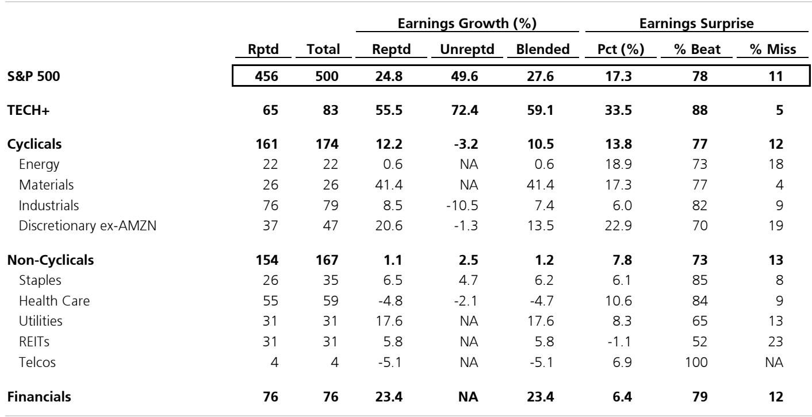

# The 1Q26 Earnings Season Confirms That Market Returns Are No Longer a Bellwether for the Economy

The S&P 500 is on track to report first-quarter earnings per share growth of 28.6% year over year, with 84% of market capitalization already reported and 78% of companies beating estimates. This marks one of the most powerful earnings seasons in recent memory, but the strength is almost entirely a story of technology concentration, not broad-based economic acceleration. The aggregate number is misleading. Beneath the surface, the earnings data reveals a market bifurcated into two regimes: the TECH+ megacaps, which are delivering growth rates that rival early-pandemic recovery quarters, and everything else, which is growing at a pace that barely exceeds inflation.

For institutional investors, this earnings season demands a strategic reassessment. The data from the first quarter of 2026 shows that the gap between the six largest technology companies and the rest of the market has widened to its largest level in over a decade. The six largest TECH+ companies are expected to deliver EPS growth of 61.2%, while the remaining 494 companies in the index are projected to grow at just 17.9%. This is not a cyclical upswing. It is a structural divergence that has profound implications for portfolio construction, sector rotation strategies, and the very concept of what the S&P 500 represents as an economic proxy.

The timing of this divergence matters. We are now in the fourth year of an earnings cycle that began with the post-pandemic normalization, and historically, this is the phase where breadth should be improving, not deteriorating. Instead, the opposite is happening. The median company in the S&P 500 is expected to grow EPS at just 12.9%, less than half the weighted average of 28.4%. In four of the eleven major sector groups, the median company is actually expected to outgrow the cap-weighted index, which means that for most sectors, the aggregate number is being pulled upward by a handful of large-cap outliers. The market is increasingly a story of a few giants, and the rest are spectators.

## The TECH+ Megacap Earnings Machine Is Operating on a Different Economic Plane Than the Rest of the Market

The data from 1Q26 makes this distinction unmistakable. TECH+ is expected to deliver EPS growth of 59.6%, driven by a combination of 25.1% revenue growth and an extraordinary 34.1% margin expansion. By contrast, the S&P 500 ex-TECH+ is growing EPS at just 11.1%, with revenue growth of 7.6% and margin expansion of only 2.6%. The margin story is particularly telling. The TECH+ group is not just selling more; it is becoming structurally more profitable at a pace that no other sector can replicate. Margins are expanding at 34.1% for TECH+ versus negative margin growth in Health Care, negative margin growth in Energy, and near-zero margin growth in Industrials and Staples.

What makes this data strategically significant is not just the magnitude of the gap, but the sustainability of its drivers. The TECH+ earnings growth is coming from a combination of artificial intelligence infrastructure spending, cloud migration, and advertising revenue recapture. These are not cyclical tailwinds; they are secular shifts in how capital is allocated and how value is captured in the digital economy. The rest of the market is still operating in a world of input cost inflation, wage pressure, and demand normalization. The margin expansion gap between TECH+ and the rest of the market is not a temporary anomaly. It is the signature of an economy where the returns to scale and the returns to data are increasingly concentrated in a small number of firms.

The implications for portfolio strategy are direct. If you own the S&P 500 as a proxy for broad economic exposure, you are effectively making a concentrated bet on six companies. The TECH+ group now accounts for a disproportionate share of index-level earnings growth. Without TECH+, the S&P 500 would be growing EPS at roughly 11%, which is below the historical average for this point in the cycle. The question investors must ask is whether they are being compensated for that concentration risk. The data suggests that the premium for owning the megacaps is justified by earnings delivery, but the risk is that any disruption to the AI narrative or regulatory challenge to the platform business models would leave the rest of the index without a growth engine.

## The Earnings Surprise Data Reveals That the Market Is Punishing Misses More Aggressively Than It Rewards Beats

One of the most subtle but important findings in the 1Q26 earnings data is the asymmetry in price reaction to earnings surprises. The historical average price reaction for a company that beats on both earnings and revenue is a gain of approximately 1.7% over the three-day window around the report. For a company that misses on both metrics, the average penalty is a loss of approximately 3.1%. But in the current quarter, that asymmetry has widened. The market is now rewarding beats at roughly the historical average, but it is punishing misses far more severely, particularly in certain sectors.

The data shows that for the S&P 500 overall, the price reaction to a combined earnings and revenue beat is 1.2%, while the reaction to a combined miss is negative 2.8%. That is a ratio of roughly 1 to 2.3, meaning the penalty for disappointing is more than twice the reward for outperforming. In TECH+, the asymmetry is even more extreme. A TECH+ company that beats on EPS but misses on revenue sees a price gain of 4.5%, which is counterintuitive. But a TECH+ company that misses on EPS while beating on revenue gets punished by negative 8.4%. And the worst case, a miss on both metrics, yields a catastrophic negative 11.9% return.

This pattern tells us something important about market expectations. Investors have already priced in perfection for the technology sector. Any deviation from that narrative is met with disproportionate selling pressure because the positioning is crowded and the valuation premium is high. For non-TECH+ sectors, the penalty for missing is less severe, but the reward for beating is also lower. This creates an asymmetric risk profile for long-only investors. If you are overweight TECH+, you are implicitly betting that the earnings delivery machine continues to operate without interruption. If you are underweight TECH+, you are accepting that your portfolio will lag in a market where the index is increasingly defined by its largest constituents.

The strategic implication is that active managers need to think about earnings season not just as a data collection exercise, but as a risk management event. The market is signaling that it has very little tolerance for disappointment in the growth names that have driven the rally. This means that the bar for forward guidance is extremely high. Companies that guide conservatively may be punished even if they beat current quarter estimates, because the market is already looking through to the next several quarters. The data from the price action tables suggests that the market is front-running the earnings narrative, and the penalty for falling short of that narrative is escalating.

## The Sector-Level Dispersion in Earnings Growth Creates a Clear Framework for Rotation Decisions

The 1Q26 data provides a granular view of which sectors are accelerating and which are decelerating, and the dispersion is wide enough to inform active allocation decisions. At the top of the growth spectrum, Semiconductors & Equipment is expected to deliver EPS growth of 101.3%, followed by Autos & Components at 78.2% and Media & Entertainment at 70.6%. At the bottom, Consumer Durables & Apparel is expected to decline by 18.2%, Pharmaceuticals, Biotechnology & Life Sciences by 11.8%, and Transportation by 9.4%. The range from best to worst is nearly 120 percentage points, which is unusually wide for this stage of the earnings cycle.

What is strategically interesting is not just the ranking, but the relationship between current growth and forward expectations. The consensus estimates for full-year 2026 show a significant reordering. Energy, which is essentially flat in 1Q26, is expected to rebound to 55% growth for the full year. Materials, which is strong in 1Q26 at 42.2%, is expected to remain strong at 38.4% for the full year. But the Big 6 TECH+ group, which is growing at 61.2% in 1Q26, is expected to decelerate to 33.5% for the full year. This implies that the market is anticipating a normalization of TECH+ growth rates, even as the current quarter shows acceleration.

For investors, this creates a tactical opportunity. If the consensus is correct that TECH+ growth will decelerate, then the relative performance advantage of the megacaps should narrow as the year progresses. That would create conditions for a rotation into sectors that are currently underappreciated. Materials, for example, is delivering 42.2% EPS growth in 1Q26 with a median growth rate of only 8.5%, which suggests that the sector's aggregate number is being driven by a few large firms, but the earnings surprise data is positive. Materials companies that beat on both earnings and revenue saw an average price gain of 0.9%, and those that missed saw a decline of only 1.7%. This is a much more forgiving penalty structure than in TECH+, and it suggests that investor expectations for Materials are more realistic.

Financials is another sector worth watching. With 24.7% EPS growth and 20.0% median growth, the sector is showing broad-based strength. The surprise data shows that Financials companies that beat on both metrics gained only 0.6%, but those that missed on both lost 2.4%. The asymmetry is less extreme than in TECH+, and the sector is trading at a much lower valuation multiple. For investors who are concerned about concentration risk in the megacaps, Financials offers a diversification benefit with comparable earnings growth and a more favorable risk-reward profile based on the price action data.

## The Report Does Not Fully Answer Whether the Earnings Concentration Is a Leading Indicator of Market Fragility

While the 1Q26 data is comprehensive in its measurement of what has happened, it leaves several critical questions unanswered. The most important of these is whether the extreme concentration of earnings growth in a handful of companies is a sign of market strength or a precursor to a correction. History is not reassuring on this point. Periods of extreme earnings concentration, such as the Nifty Fifty era of the early 1970s and the tech bubble of the late 1990s, were followed by significant market drawdowns when the concentration unwound. The current environment has some similarities to those periods, but also important differences.

The report shows that the TECH+ group is not just growing faster; it is also experiencing much larger positive earnings surprises. The surprise data for TECH+ shows an aggregate earnings surprise of 33.5%, compared to 17.3% for the S&P 500 overall. This suggests that analysts have been systematically underestimating TECH+ earnings power, which could mean that the forward estimates are still too low. If that is the case, the concentration could persist or even intensify. But there is another possibility: the large positive surprises could be a sign that the market has become too optimistic about the sustainability of TECH+ margins, and that mean reversion is inevitable.

The report does not resolve this tension, and it leaves open the question of whether the current earnings cycle has another leg up or is approaching a peak. The analyst community is projecting full-year 2026 S&P 500 EPS growth of 22.2%, which would be a deceleration from the 28.4% expected for 1Q26. But if the current beat rate of 78% of companies exceeding estimates continues, the actual growth rate could be higher. The report notes that based on historical trends of estimate revisions through the end of reporting season, EPS is on pace for 28.6%, which is slightly above the current consensus of 28.4%. This is a small gap, but it suggests that the bias is still to the upside.

For serious investors, the unresolved question is whether the market is pricing in a soft landing or a no-landing scenario. If the economy continues to grow at a moderate pace while inflation moderates, the earnings concentration could broaden out as cyclical sectors catch up. But if the economy slows more than expected, the concentration could become a vulnerability, because the rest of the market would not have enough earnings momentum to support current valuations. The data does not provide a clear answer, which is why the next several weeks of earnings reports from the remaining 12 companies representing 9.9% of market cap will be critical.

## A Decision Framework for Navigating the Second Quarter Based on the Earnings Data

The 1Q26 earnings data provides a clear set of signals that can be translated into a decision framework for the second quarter. The framework has three dimensions: positioning for concentration risk, calibrating for surprise asymmetry, and timing for rotation opportunities.

First, concentration risk must be explicitly managed. The data shows that the S&P 500 ex-Big 6 is growing EPS at 17.9%, which is a respectable rate but well below the headline number. An investor who is comfortable with that level of concentration risk can maintain an overweight to TECH+, but must accept that any negative surprise in the AI-related earnings narrative will have outsized portfolio impact. The price action data shows that TECH+ companies that miss on earnings are punished by an average of 8.4% even if they beat on revenue. This is a tail risk that cannot be hedged with simple sector diversification. The appropriate response is either to size the position appropriately or to implement a hedging strategy using options on the largest TECH+ names.

Second, the asymmetry in earnings surprises should inform position sizing around earnings reports. The data shows that the market is rewarding beats at roughly historical averages but punishing misses at above-average levels. This means that the expected value of holding a stock through an earnings report is negative unless the probability of a beat is significantly above 50%. For stocks with high valuation multiples and high expectations, the risk-reward of holding through earnings is unfavorable. The strategic implication is to reduce positions in high-expectation names ahead of reports and to add exposure after the report if the stock beats and the reaction is muted. The data from Figure 7 shows that the median price reaction to a beat has been around 1.5% to 2.0% in recent quarters, while the reaction to a miss has been negative 5% to 6%. This asymmetry makes the pre-earnings holding period a negative expected value proposition for most stocks.

Third, the rotation opportunity is in sectors where the consensus is too pessimistic relative to the earnings data. Materials is the clearest example. With 42.2% EPS growth and a median growth rate of only 8.5%, the sector is showing strong aggregate performance but the typical company is growing modestly. This suggests that the sector's earnings power is concentrated in a few large firms, but the valuation discount relative to TECH+ is sUBStantial. The price action data shows that Materials companies that miss are only penalized by 1.7%, which is far less than the penalty in TECH+. This means the downside risk is limited, while the upside from a positive surprise is meaningful. The same logic applies to Financials, where the median growth rate of 20.0% is higher than the weighted average of 24.7%, indicating broad-based strength that is not fully appreciated by the market.

The earnings data also suggests caution in Health Care and Consumer Discretionary. Health Care is expected to show negative EPS growth of 3.8%, and the price action data shows that Health Care companies that miss on both earnings and revenue are punished by an average of 11.6%, which is among the most severe penalties in the entire index. This suggests that investor expectations are already low, and any additional disappointment will be met with aggressive selling. Consumer Discretionary ex-AMZN shows a similar pattern, with a penalty of 5.6% for a combined miss. These sectors should be underweight until the earnings trajectory improves.

## The Full Report Contains the Charts and Granular Data That Make These Insights Actionable

The analysis above is based on a parsing of the 1Q26 earnings data, but the full report contains the original charts and detailed sector-level breakdowns that allow investors to drill down into specific industries and companies. The heatmaps of price action by sector, the historical trend of earnings surprise reactions, and the forward estimates for full-year 2026 are all available in their original form. These visualizations are essential for making the transition from strategic insight to tactical execution. The data on the Big 6 TECH+ companies individually, including the divergence between expected and actual growth for names like Amazon, Meta, and Google, provides the granularity needed to make stock-specific decisions.

The report also includes the full earnings dashboard with revenue, margin, earnings, and buyback contributions to EPS growth for every major sector group. This level of detail is not available in summary form, and it is critical for understanding which sectors are experiencing genuine operational improvement versus those that are benefiting from financial engineering. The buyback contribution to EPS growth is only 0.8% for the S&P 500 overall, which means the earnings growth is overwhelmingly driven by operational performance rather than share count reduction. This is a healthy sign, but it also means that the earnings growth is more vulnerable to economic slowdown than it would be if buybacks were a larger contributor.

Join the community to read the full report and review the original charts.

*This article is for learning and discussion only and does not constitute investment advice.*

Personal reading notes and learning share only. Not investment advice.

