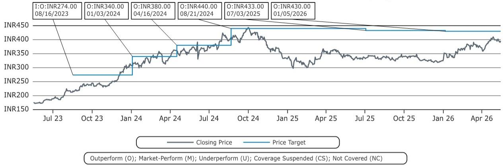
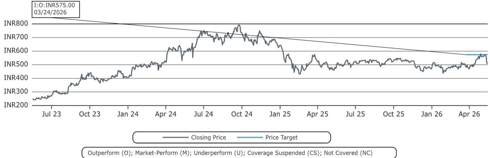
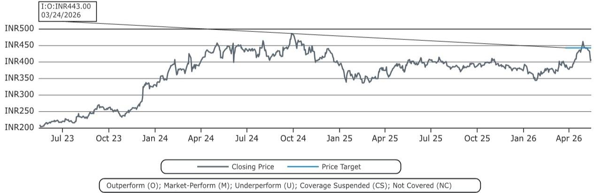

# 全球核能共识的真正赢家，不是技术，而是中国模式

这份报告最值得关注的判断，不是核能复兴本身，而是中国正在成为全球核能扩张的“默认参考系”。当35个新国家同时启动核电计划，当俄罗斯凭借地缘合约拿下29个潜在客户，当韩国因中东危机加速重启反应堆——真正稀缺的，不是铀燃料或反应堆设计，而是一套被验证过的、可复制的核能建设体系。而中国，恰好是唯一一个同时拥有低成本、短工期、规模化交付记录的国家。

这份来自某外资投行的研报，以1973年石油危机后法国和日本的核能大转向为历史锚点，系统梳理了当前全球核能共识的驱动力、新进入者的困境，以及中国模式为何可能成为其他国家的蓝本。报告并没有直接给出“买哪只股票”的建议，但它提供了比交易信号更重要的东西：一个理解未来十年全球能源基础设施竞争格局的分析框架。

## 1. 历史不会重复，但押注的底层逻辑高度相似

1974年，法国总理梅斯梅尔在演讲中说：“我们领土上几乎没有石油，煤炭比英国和德国少得多，天然气远不如荷兰……我们最大的机会，是核能。” 随后法国在十年内建成了56至58座反应堆，将石油发电占比从43%几乎压到零。日本也做出了类似的选择：1974年石油发电占比高达66%，核能被迅速提升为国家战略优先级。

今天的局面，与1973年有惊人的结构相似性——能源安全被重新定义为国家安全。但不同之处在于，1973年的冲击来自单一商品的价格暴涨，而今天的驱动力是多重叠加的：俄乌战争引发的天然气供应断裂、中东局势持续升温、以及AI数据中心带来的电力需求激增。韩国在2026年3月宣布加速重启因安全原因停运的反应堆，直接原因就是“中东战争”。

这意味着，当前这一轮核能共识的韧性，可能比1970年代更强。因为它不是对单一事件的应激反应，而是对能源系统脆弱性的结构性认知改变。报告没有明说的一点是：当核能被写入越来越多的国家长期能源规划，它就不再是周期性的“能源安全对冲”，而是变成了基础设施投资的确定性方向。

## 2. 35个新国家同时入场，但核能的门槛远比想象中高

报告披露了一个关键数据：目前有35个新国家正在规划或考虑加入核电阵营。这个数字本身令人瞩目，但真正值得思考的是这些国家面临的现实约束。

第一，规模错配。一座典型的核电站装机容量在1000兆瓦以上，对于电网总容量只有几千兆瓦的小国来说，一座核电站的突然停运就可能导致整个电网瘫痪。这不是技术问题，是系统设计问题。报告提到了这一点，但没有展开的是：小型模块化反应堆（SMR）恰恰是解决这个矛盾的技术路径，而SMR目前仍处于商业化前夜。

第二，技术依赖。报告展示了一张极具冲击力的图表：俄罗斯已经与29个国家建立了某种形式的核能合作协议。中国的合作对象是4个，其他所有国家加起来是6个。这意味着，对于大多数新进入者来说，选择核能几乎等同于选择俄罗斯作为技术供应商。这不是一个纯粹的技术决策，而是一个地缘政治决策。

第三，执行能力。这是报告最核心的洞察所在。全球核电站的平均建设周期是10年，而中国做到了5年。中国核电的平准化度电成本约为70美元/兆瓦时，远低于欧盟的165美元和美国的110美元。这个差距不是技术差距，而是系统性效率差距——从资本获取、选址审批、供应链组织到施工管理，中国在每一个环节都形成了制度性优势。

所以，对于这35个新国家来说，真正的挑战不是“要不要建核电站”，而是“谁能帮我把核电站建起来、建得快、建得便宜”。

## 3. 中国模式为什么难以复制——以及它为什么更重要

报告用了一个完整的章节来拆解中国核能成功的五个要素：低成本融资、沿海集群布局、海水冷却降低工程复杂度、本土化率持续提升、以及政府主导下的高效审批和土地征收。这些要素单独看都不算秘密，但组合在一起，就构成了一套其他国家几乎无法复制的系统。

以建设周期为例。报告数据显示，中国核电站的平均建设时间是6年，而全球平均是10年。但更值得关注的是分布：中国的6年均值背后，最慢的项目也只用了12年，而伊朗的最快项目用了17年。换句话说，中国不仅做得快，而且一致性高。这不是运气，是制度能力。

报告引用了中国最新的“十五五”规划目标：核电装机容量从目前的约60吉瓦提升到2030年的110吉瓦。这意味着未来五年，中国将新增约50吉瓦核电装机，相当于每年新增10吉瓦——这个速度在全球范围内没有先例。

但报告没有完全回答的问题是：中国模式能否被输出？中国正在通过“一带一路”框架向巴基斯坦、阿根廷等国出口反应堆，但规模仍然有限。与俄罗斯的29个合作伙伴相比，中国在海外核能市场的渗透率仍然很低。这不是技术问题，而是融资、保险、法律框架和地缘信任的综合问题。

## 4. 报告尚未完全回答的关键问题：谁在真正买单？

这份报告在技术分析和政策梳理上做得非常扎实，但有一个维度着墨不多：核能项目的最终经济性，谁来承担？

对于发达国家，核能的平准化成本已经高于天然气联合循环和光伏。即使考虑到碳价和能源安全溢价，核能的竞争力仍然需要政策补贴或长期购电协议来支撑。对于发展中国家，核能的初始投资动辄百亿美元级别，融资成本往往比中国高出数倍，这直接决定了项目的可行性。

报告提到了中国核电的低成本优势，但没有深入分析这个成本是否包含隐性补贴——比如土地的低价划拨、国有银行的低息贷款、以及监管审批的快速通道。如果这些因素被剥离，中国模式的成本优势可能会显著缩小。

另外，报告提到了小型模块化反应堆，但没有给出明确的商业化时间表。SMR被认为是解决“规模错配”问题的关键，但目前全球没有任何一座SMR实现商业化运行。如果SMR的落地速度慢于预期，那么35个新国家的核能计划中，相当一部分可能会停留在“纸面规划”阶段。

这些未解问题，恰恰是理解核能投资主题的关键变量。它们不会改变核能复兴的大方向，但会影响不同环节的受益程度和节奏。

## 5. 对决策者的观察框架：三个维度判断核能投资的真实价值

基于报告的底层逻辑，我们可以提炼出一个简洁的观察框架，用于评估不同市场、不同环节的核能投资机会。

第一，看执行能力，而不是看规划。报告的核电站建设周期对比图是最有说服力的单一图表。中国6年、韩国6年、日本5年——这些国家有能力把规划变成现实。而伊朗17年、墨西哥15年、罗马尼亚14年——这些国家的核能规划，需要打一个很大的折扣。对于投资者来说，关注“已开工”和“已投产”的数据，远比关注“已规划”的数据更有意义。

第二，看供应链瓶颈，而不是看需求。全球核能共识正在形成，但铀燃料供应、压力容器锻造能力、特种焊接工艺等环节的产能扩张，往往需要5到10年的前置时间。报告没有深入讨论这一点，但这是核能主题从“概念”走向“业绩”的关键环节。谁在这些瓶颈环节拥有产能和技术储备，谁就更有可能在这一轮周期中受益。

第三，看地缘风险，而不是看技术路线。俄罗斯在29个国家的核能合作网络，意味着全球核能供应链已经高度政治化。对于任何一个考虑核能的国家来说，技术选择本质上是一个外交选择。对于投资者来说，这意味着核能相关资产的地缘风险溢价，可能比市场当前定价的要高。

这份报告最值得反复阅读的部分，不是它的结论，而是它提供的比较框架——把法国1974年的决策、中国1990年代的引进消化吸收、以及今天35个新国家的规划放在同一张时间轴上。它让我们看到，核能从来不是一个纯粹的技术问题，而是一个关于国家能力、制度效率和地缘选择的综合命题。

欢迎来星球微信群里继续讨论：中国模式能否真正被复制？SMR会不会改变游戏规则？哪些供应链环节最值得跟踪？这些问题的答案，可能比报告本身更有价值。

Personal reading notes and learning share only. Not investment advice.

