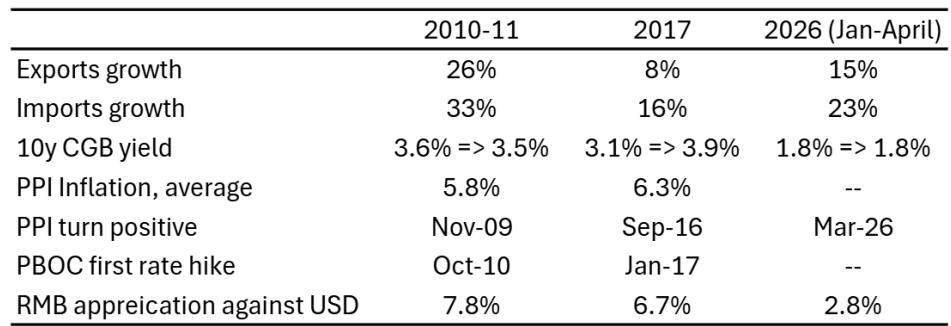

# 进口激增的真正信号：人民币正在被重新定价

市场对人民币的讨论，长期困在两个旧框架里：一是“出口强则汇率强”，二是“货币政策宽松则汇率弱”。然而，某外资投行一份最新研报揭示了一个被广泛忽视的结构性变化——中国2026年一季度进口增速（23%）已经显著超过出口增速（15%），贸易顺差占GDP比重不升反降。这看似是一个短期数据扰动，但报告通过历史比较与逻辑推演，给出了一个反直觉的判断：**无论进口激增是由出口备货还是内需复苏驱动，最终都将指向同一个方向——人民币加速升值。**

这份报告的价值不在于给出6.55的年末预测，而在于它重新定义了驱动汇率的底层变量：不是贸易差额本身，而是进口结构所揭示的经济动能切换。以下是我们从这份研报中提炼出的四个核心洞察，以及一个尚未被完全回答的关键问题。

## 1. 进口激增不是成本冲击，而是库存重建的信号

市场通常将进口增长归因于大宗商品价格上涨。但报告数据清晰地排除了这一解释：一季度进口增量中，原油贡献极为有限，甚至因价格飙升导致进口量同比下降20%。真正驱动进口的是两类商品：AI相关产品（芯片、半导体设备、计算机）贡献了约40%的增量，上游工业投入品（有色金属、化工产品、机械）贡献了约30%。

这意味着什么？这不是被动接受涨价，而是主动的库存重建。企业在大规模采购生产性投入品，而不是因为成本推高而被动多付钱。这个区别至关重要——前者指向对未来需求的乐观预期，后者则只是成本传导。

从产业层面看，AI相关进口的激增说明中国正在深度嵌入全球AI产业链的产能扩张周期。上游工业品进口的恢复则暗示，制造业企业正在为新一轮生产周期备料。两者叠加，形成的是“产能扩张+库存回补”的双重信号。对于投资者而言，这意味着那些依赖中国进口需求的全球大宗商品和半导体设备供应商，可能面临一个持续的需求支撑，而不是短期脉冲。

## 2. 两种可能的驱动路径，但指向同一个汇率结论

报告提出了一个经典的分析框架：进口激增到底是“为出口备货”还是“为内需备料”？两种情景对应完全不同的贸易平衡路径，但令人意外的是，它们对人民币汇率的指向却高度一致。

如果进口是为了满足海外订单（比如AI数据中心、电动车出口），那么下一步必然是出口增速进一步上升，贸易顺差重新扩大，结汇需求推动人民币走强。如果进口是由国内需求驱动（比如国内AI投资、基建项目），那么进口增长将持续超过出口，顺差继续收窄，但此时国内经济增长和通胀会回升，货币政策无法维持当前的低利率水平，利率上行将吸引资本流入，同样推动人民币升值。

这个逻辑链条的关键在于：无论哪条路径，进口激增本身都是经济活跃度上升的领先指标。历史经验也验证了这一点——2010-11年和2017年两次进口激增期，最终都伴随着人民币显著升值（分别达到7.8%和6.7%）。当前与这两段历史的相似之处在于：PPI刚刚走出通缩，财政和货币政策宽松周期已经持续了一段时间，经济正处于从“政策托底”向“内生增长”切换的临界点。

## 3. 历史不会简单重复，但当前环境比2017年更接近“内外共振”

报告将当前与2010-11年和2017年做了细致对比。2010-11年是典型的内外需共振：先有国内四万亿刺激拉动进口，后有全球复苏推高出口，最终出口增速反超进口。2017年则是内需主导：地方财政扩张和房地产反弹带动进口持续超过出口，货币政策在当年初就开始收紧。

2026年更像哪一种？从数据看，当前出口增速（15%）介于两次历史之间，进口增速（23%）则与2010-11年的33%和2017年的16%相比，处于中间位置。但一个关键差异在于：2017年货币政策转向时，10年期国债收益率已从3.1%升至3.9%，而当前收益率仍在1.8%的历史低位附近徘徊。这意味着，如果内需驱动是主因，利率上行的空间可能比2017年更大，对人民币的推升作用也可能更强。

另一个值得注意的差异是：当前AI相关投资的规模远超2017年。这不仅是周期性的库存回补，更可能是结构性的产能升级。如果AI相关的进口持续高增，它可能同时拉动出口（AI设备出口）和内需（国内AI基础设施建设），形成一种“新内外共振”。这种结构的变化，意味着人民币升值的持续性可能比前两次更强。

## 4. 报告尚未完全回答的关键问题：黄金进口激增的汇率含义

报告在最后部分抛出了一个引人深思的“彩蛋”：2026年一季度，中国贵金属进口暴增260%至660亿美元，贡献了总进口增量的三分之一。这在历史上从未出现过。报告谨慎地指出，如此大规模的金进口不太可能是生产或投资需求，更可能与消费和储蓄行为有关。

但问题在于：黄金进口的激增对人民币意味着什么？报告没有给出明确结论，只说“含义尚不清楚”。这恰恰是当前分析框架中最大的未解环节。如果黄金进口代表居民和企业对人民币信心的某种转移——比如将储蓄从人民币资产转向黄金——那么它可能对汇率构成隐性压力。反之，如果是央行或金融机构的战略储备调整，则可能只是资产配置的再平衡，对汇率的影响中性甚至正面。

这个问题的答案，取决于我们能否拆解黄金进口的最终去向和购买主体。而这正是完整报告可能提供但当前摘要没有覆盖的信息。对于认真追踪人民币走势的投资者而言，这可能是决定下半年汇率方向的最关键变量之一。

## 一个需要持续验证的观察框架

基于以上分析，我们建议读者建立一个三层的观察框架来跟踪人民币走势的可持续性：

第一层：进口结构的变化。关注AI相关产品和上游工业品进口增速是否持续，以及原油进口量的变化。如果进口增速在二季度出现回落，那么库存重建的逻辑可能被证伪。

第二层：出口订单与内需指标的对比。紧盯出口订单PMI与制造业投资、房地产销售等内需指标。如果出口订单持续走强而内需温和，那么“出口备货”路径占主导，人民币升值节奏可能更平稳；如果内需数据显著超预期，那么利率上行可能成为人民币加速升值的额外催化剂。

第三层：黄金进口的后续数据。这是当前最不确定的变量。建议关注海关月度数据中贵金属进口的细分来源和数量变化，以及央行资产负债表是否出现相应调整。如果黄金进口在二季度继续高增，那么需要重新评估其对汇率的影响权重。

人民币的定价正在从“贸易差额”切换到“经济动能切换预期”。进口激增这个看似平淡的数据，背后隐藏的是全球AI产业链重构与中国内需复苏的共振信号。那些仍然用旧框架看人民币的人，可能会错过一个重要的资产定价拐点。

---

欢迎来星球微信群里继续讨论。我们会在群内分享完整报告的原始图表和更多历史对比数据，并持续追踪黄金进口、AI产业链订单等关键变量的月度变化。如果你对人民币汇率、中国宏观或全球资产配置有深入研究的需求，这里是一个持续交流的社区。

Personal reading notes and learning share only. Not investment advice.

