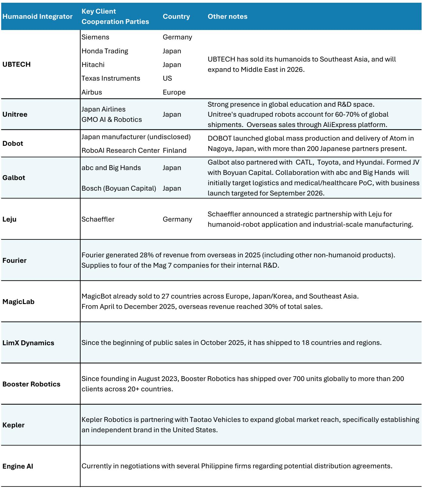
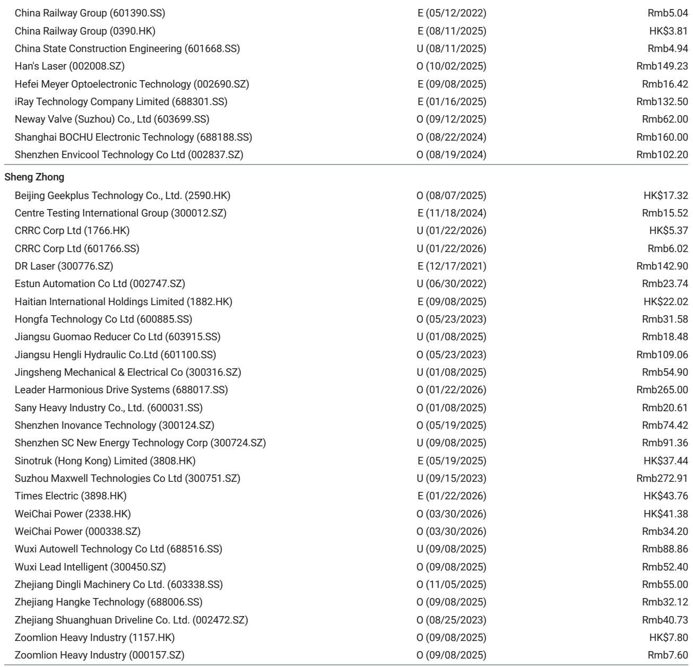
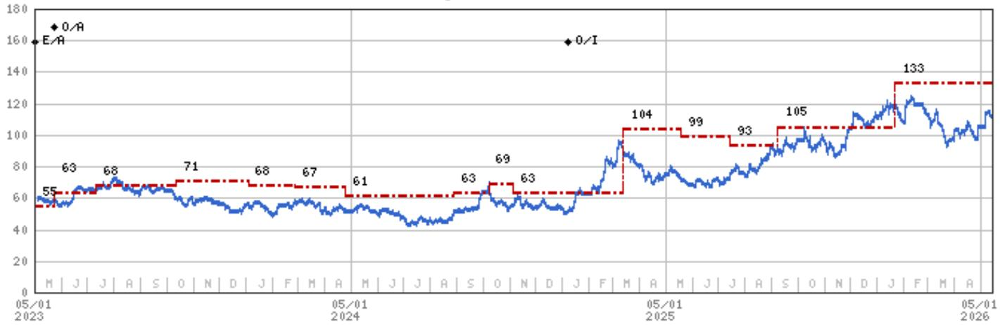

# Chinese Humanoid Integrators Are Going Global Before the Product Is Ready—and That Is the Strategic Signal

The most important insight in the humanoid robotics industry today is not about technical breakthroughs in dexterity or battery life. It is about geography. Chinese humanoid integrators are aggressively expanding into overseas markets at a stage when the technology is still in broad commercial verification, long before mass adoption is assured. This is not a premature move. It is a deliberate strategy to capture the data flywheel, build ecosystem partnerships, and establish a beachhead in markets with stronger spending power and tighter labor dynamics. The signal from this global push is clear: the race is not just about who builds the best robot, but who builds the largest deployed fleet first.

Why now matters. The industry is at an inflection point where the gap between laboratory capability and real-world reliability is narrowing but not yet closed. Most humanoid orders in the past year went to research institutions and tech giants for internal R&D, not to factories or warehouses for production work. Yet the shift toward commercial orders and strategic cooperation is accelerating. Overseas partnerships are moving beyond proof-of-concept into real work verification, with companies like UBTECH and Unitree signing deals with Airbus, Texas Instruments, and Japan Airlines. This transition from academic curiosity to industrial trial is the critical window in which early movers can lock in partnerships, gather operational data, and iterate faster than competitors who wait for perfect reliability.

The strategic logic is straightforward. Humanoid robots require massive amounts of real-world data to improve their models. The more robots deployed, the faster the iteration cycle. The faster the iteration, the sooner the technology becomes viable for mass adoption. Going global is not an optional growth tactic. It is a necessity for survival in a winner-take-most ecosystem where data advantage compounds over time. Chinese integrators understand this. They are not waiting for the domestic market to mature before expanding abroad. They are treating the entire world as their testing ground.

This article examines the strategic implications of this global push, the second-order effects on China's manufacturing dominance, and the unresolved questions that investors must grapple with as the industry evolves.

## The Global Push Is a Data Strategy, Not a Sales Strategy

The conventional reading of Chinese humanoid integrators expanding overseas is that they are chasing revenue. That interpretation is too narrow. At CES 2026, Chinese companies represented the majority of humanoid robot exhibitors. The goal was not to close immediate sales but to establish the partnerships and distribution channels that will enable fleet deployment over the next two to three years. Every robot placed in a foreign laboratory, factory, or warehouse generates data that feeds back into the model iteration loop. That data is the real asset.

Consider the pattern. UBTECH has sold humanoids to Southeast Asia and plans to expand into the Middle East in 2026. Unitree's quadruped robots already account for 60 to 70 percent of global shipments, giving it a massive data advantage in locomotion. Dobot launched global mass production and delivery of its Atom robot in Nagoya, Japan, with more than 200 Japanese partners present. Galbot has partnered with Japanese firms abc and Big Hands for logistics and healthcare proof-of-concept trials, with a business launch targeted for September 2026. These are not isolated deals. They form a coordinated push to embed Chinese humanoids into global supply chains and research ecosystems.

The so what is this: the data flywheel is the moat. A robot that has logged millions of hours in real-world conditions across multiple geographies and industries will have a model that is far more robust than a robot that has only been tested in controlled environments. The early mover advantage in humanoids is not about brand recognition or patent portfolios. It is about the volume and diversity of operational data. Chinese integrators are building that moat now, before Western competitors have fully committed to production-scale deployment.

## Overseas Partnerships Are Shifting from Research to Commercial Verification

The nature of overseas partnerships is evolving. Last year, many orders went to universities and tech giants for internal R&D. This year, the partnerships are increasingly commercial. UBTECH's collaboration with Airbus and Texas Instruments is not about academic research. It is about testing humanoids in aerospace manufacturing and semiconductor environments. Unitree's agreement with Japan Airlines targets operational tasks in aviation maintenance and ground services. These are high-stakes, high-visibility deployments that will accelerate the verification process.

This shift matters because it changes the risk profile for the entire industry. When humanoids are deployed in commercial settings, the failure tolerance is lower, but the learning potential is higher. A robot that fails on an assembly line generates more useful data than a robot that succeeds in a lab. The commercial verification process is forcing integrators to confront real-world constraints: reliability, safety, task autonomy, and integration with existing workflows. The companies that can navigate this transition will emerge with a significant competitive advantage.

The pattern also reveals a strategic alignment with global partners who can mitigate regulatory barriers. US-based OpenMind, for example, is helping bring Chinese humanoids into international markets. This partnership structure allows Chinese integrators to access markets that might otherwise be restricted by trade policies or national security concerns. It is a pragmatic approach that prioritizes deployment over ownership of the distribution channel. The question for investors is whether this partnership model is sustainable or whether it creates dependency on intermediaries who may have competing interests.

## The Next Chapter in China's Manufacturing Dominance Is Being Written in Humanoids

The global push by humanoid integrators is not happening in isolation. It is part of a broader structural shift in China's export competitiveness. A global investment bank projects that China's export market share will rise from 15 percent today to 16.5 percent by 2030, with electric vehicles, batteries, and robotics driving much of the increase. Humanoids are poised to become the next major industry supporting China's manufacturing and export machinery.

The logic is twofold. First, overseas markets have stronger spending power and tighter labor dynamics, creating attractive conditions for adoption once humanoid reliability improves. Developed economies facing labor shortages in manufacturing, logistics, and healthcare are natural early adopters. Chinese integrators are positioning themselves to supply these markets. Second, the overseas humanoid capacity ramp-up creates demand for China's manufacturing equipment. Wuxi Lead, for example, recently received a humanoid equipment order from a US-based client. This creates a virtuous cycle: as global humanoid production scales, Chinese equipment makers benefit, and as Chinese equipment makers improve, they lower the cost of humanoid production, accelerating adoption.

The strategic implication is that humanoids will reinforce China's manufacturing leadership, not replace it. The narrative that robotics will lead to reshoring of manufacturing to developed economies is incomplete. What is more likely is that Chinese companies will dominate the production of humanoid robots and the equipment used to make them, just as they dominate solar panels, batteries, and electric vehicles. The export of humanoid robots will be a higher-value addition to China's trade balance than the export of consumer goods, and it will strengthen the ecosystem of precision manufacturing, motion control, and automation components that China has been building for decades.

## What the Report Does Not Fully Answer: The Timing and Shape of the Adoption Curve

The report provides a compelling picture of early-stage expansion, but it leaves several critical questions unresolved. The most important is the timing of the adoption curve. Humanoids are in broad commercial verification, but the report does not specify when the technology will cross the threshold from trial to mainstream deployment. The partnerships and orders cited are promising, but they are still small in scale relative to the total addressable market. The risk is that the industry experiences a prolonged period of hype followed by disappointment if reliability improvements do not materialize as quickly as expected.

A second unresolved question is the competitive dynamics among Chinese integrators. The report lists multiple players—UBTECH, Unitree, Dobot, Galbot, Leju, Fourier, MagicLab, LimX Dynamics, Booster Robotics, Kepler, Engine AI—but does not analyze which ones are likely to emerge as winners. The industry is fragmented, and many of these companies are pursuing similar strategies. Consolidation is inevitable, but the report does not provide a framework for identifying which integrators have the technological depth, manufacturing scale, or partnership network to survive the shakeout.

A third question is the regulatory risk. The report acknowledges that partnerships with local intermediaries like OpenMind can mitigate regulatory barriers, but it does not address the possibility of more aggressive trade restrictions on humanoid robots, particularly in sectors deemed critical to national security. If the US or Europe imposes tariffs or export controls on Chinese humanoids, the global expansion strategy could be significantly constrained. The partnership model may not be sufficient to overcome geopolitical headwinds.

These open questions are not criticisms of the report. They are the natural boundaries of any analysis at this stage of the industry's development. Investors should treat the report's findings as directional, not definitive, and monitor the evolution of these uncertainties closely.

## A Decision Framework for Investors Navigating the Humanoid Opportunity

Given the early stage of the industry and the complexity of the global expansion strategy, investors need a structured approach to evaluating opportunities. The following framework is designed to help assess which companies are best positioned to capture value as the humanoid ecosystem develops.

First, evaluate data advantage. The most valuable asset in humanoid robotics is operational data. Companies that have deployed the largest fleets, across the widest range of environments, will have the most robust models. Look for integrators that are prioritizing deployment volume over profit margins in the near term. Unitree's dominance in quadruped robots gives it a significant data advantage in locomotion. UBTECH's breadth of partnerships across industries and geographies suggests a deliberate strategy to maximize data diversity.

Second, assess partnership quality. Not all partnerships are equal. Strategic collaborations with industrial end-users like Airbus, Texas Instruments, and Japan Airlines are more valuable than distribution agreements with resellers. The former provide real-world testing environments, operational feedback, and credibility. The latter provide revenue but limited strategic benefit. Investors should scrutinize the nature of each partnership and the extent to which it enables data collection and model iteration.

Third, analyze supply chain positioning. The humanoid ecosystem includes integrators, component suppliers, and equipment makers. The report highlights LeaderDrive and Hengli as preferred stocks, both of which are component suppliers rather than integrators. This is a defensible bet: component suppliers benefit from the growth of the entire industry without bearing the execution risk of any single integrator. However, investors should also consider equipment makers like Wuxi Lead, which benefit from the capital expenditure cycle as humanoid production scales.

Fourth, monitor the shift from research to commercial orders. The report notes that overseas partnerships are shifting toward commercial orders. This is a positive signal, but investors should verify the scale and duration of these orders. A single commercial order from a large company is not the same as recurring revenue from a production deployment. The transition from pilot to production is the most critical inflection point in the industry's development, and it is not yet clear how many integrators will successfully navigate it.

Fifth, account for geopolitical risk. The global expansion strategy depends on access to developed markets. Any escalation in trade tensions could disrupt this strategy. Investors should consider the extent to which each company's revenue is exposed to regulatory risk and whether the partnership model provides adequate protection. Companies with strong domestic demand or exposure to markets in Southeast Asia and the Middle East may be less vulnerable than those focused on the US and Europe.

## The Full Picture Requires Deeper Analysis

The global expansion of Chinese humanoid integrators is a strategic signal that deserves serious attention. It suggests that the industry is moving faster than many observers assume, and that the competitive dynamics are being shaped by data accumulation and ecosystem partnerships rather than pure technological prowess. The implications for China's manufacturing dominance, the supply chain for precision components, and the competitive landscape of global robotics are profound.

But the report leaves important questions unanswered. The timing of the adoption curve, the winners among the fragmented integrator landscape, and the impact of geopolitical risks are all critical uncertainties that investors must evaluate for themselves. The charts and detailed data in the full report provide the granularity needed to make informed judgments.

Join the community to read the full report and review the original charts.

*This article is for learning and discussion only and does not constitute investment advice.*

Personal reading notes and learning share only. Not investment advice.

