# US Equity Strategy

May 14, 2026

# Strategy Data Pack – May 2026

# Key Points:

• Strong earnings facilitate a continuation of the rolling recovery.

- This mid-year outlook builds on three themes we have emphasized since last year: running the economy/earnings cycle hot, public to private rebalancing, and a broadening of earnings and performance.   
• Over the next 12 months, we see the rolling recovery continuing to progress, driven by a strong earnings environment as positive operating leverage persists and is further enhanced by AI adoption.

• Forecast Update

- Our mid-year 2027 S&P 500 price target is 8,300 (20.5x forward EPS of \$404):   
• We see 2026 EPS of \$339 (23% growth), 2027 EPS of \$380 (12% growth), and 2028 EPS of \$429 (13% growth).

• Sector/Style Recommendations

• We see cyclicals outperforming defensives, which is consistent with our rolling recovery/earnings acceleration thesis.   
- In terms of sector preferences, we favor Industrials, Financials, and Consumer Discretionary Goods.   
• We also continue to view the hyperscalers as an attractive relative value trade (strong forward earnings at undemanding valuation levels).

# Michael Wilson

Chief US Equity Strategist & CIO of MS

M.Wilson@morganstanley.com

+1 212 761-2532

Andrew Pauker

Equity Strategist

Andrew.Pauker@morganstanley.com

+1 212 761-1328

Michelle M. Weaver, CFA

US Thematic Strategist

Michelle.M.Weaver@morganstanley.com

+1 212 296-5254

Diane Ding, Ph.D.

Quantitative Strategist

Qian.Ding@morganstanley.com

+1 212 761-6758

Nicholas J. Lentini, CFA

Equity Strategist

Nick.Lentini@morganstanley.com

+1 212 761-5863

MS does and seeks to do business with companies covered in its research reports. As a result, investors should be aware that the firm may have a conflict of interest that could affect the objectivity of this report. Investors should consider this report as only a single factor in making their investment decision.

For analyst certification and other important disclosures, refer to the Disclosure Section located at the end of this report.

# In Case You Missed It – Last Month’s Publications

# Weekly Warm Ups

•US Equity Strategy: Earnings Season Chartbook (11 May 2026)   
• US Equity Strategy: Weekly Warm-up: Earnings Strength Continues (4 May 2026)   
• US Equity Strategy: Weekly Warm-up: Back to the Future (27 Apr 2026)   
• US Equity Strategy: Earnings Season Chartbook (20 Apr 2026)   
•US Equity Strategy: Weekly Warm-up: The Market Waits for No One (13 Apr 2026)

# Special Reports

•US Equity Strategy: US Equities Mid-Year Outlook: Déjà Vu All Over Again...with Some Twists (13 May 2026)   
•Global Strategy Mid-Year Outlook: Constructive, Not Complacent (12 May 2026)   
•Global Thematics: AI Adoption and the Future of Work: Banks, Tech and Professional Services (11 May 2026)   
- AlphaWise: AI Adoption and the Future of Work: Survey Results Highlight Surprising Depth of Impact - The Data You Haven't Seen (27 Apr 2026)   
• Thematic Alpha: Conviction into Earnings (21 Apr 2026)   
• US Public Policy: Mapping the Midterms: A First Look (21 Apr 2026)   
•Sunday Start | What's Next in Global Macro: The Market Waits for No One (12 Apr 2026)

# Podcasts & Videos

- Podcast | Equities Unplugged with Michael Wilson and Andrew Pauker: Earnings Strength Is Broader Than Appreciated | Ep. 60 (11 May 2026)   
- Podcast | Thoughts on the Market: Why Stocks Keep Rallying (4 May 2026)   
- Podcast | Thoughts on the Market: Can Stock Momentum Hold Up? (27 Apr 2026)   
- Podcast | Equities Unplugged with Michael Wilson and Andrew Pauker: As Usual, the Equity Market Is Focused on Rate of Change | Ep. 59 (20 Apr 2026)   
- Podcast | Thoughts on the Market: Mounting Evidence of a Market Rebound (13 Apr 2026)   
•Video | MS Private Credit Forum: The Rise of Private Credit – Equity & Credit Market Readthroughs (10 Apr 2026)

# Outline

Pg. 3 Narrative

Pg. 12 Earnings & Valuation

Pg. 23 Quant

Pg. 27 Sector Views

Pg. 38 Macro & Misc.

# Cyclically Sensitive Stocks Underperformed in 2024 and Early 2025...

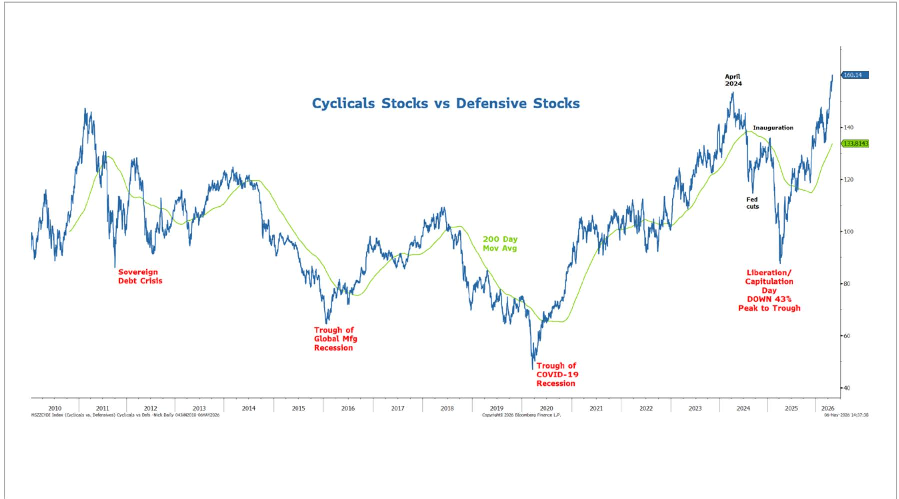

line

| Year | Value |
|------|-------|
| 2026 | 160.14 |
| 2024 | 133.8143 |
| April 2024 | 160.14 |
| Inauguration | 133.8143 |
| Lower Tier 2024 | 160.14 |
| Lower Tier 2020 | 60.0 |
| Lower Tier 2019 | 60.0 |
| Lower Tier 2018 | 80.0 |
| Lower Tier 2017 | 100.0 |
| Lower Tier 2016 | 80.0 |
| Lower Tier 2015 | 60.0 |
| Lower Tier 2014 | 80.0 |
| Lower Tier 2013 | 100.0 |
| Lower Tier 2012 | 120.0 |
| Lower Tier 2011 | 140.0 |
| Lower Tier 2010 | 120.0 |
| Sovereign Debt Crisis | - |
| Trough of Global Mfg Recession | - |
| Trough of COVID-19 Recession | - |
| 2024 (Liberation/ Capitulation Day DOWN 43% Peak to Trough) | - |
| 2024 (Fed cuts) | - |
| 2024 (Inauguration) | - |
| 2024 (Lower Tier 2024) | - |
| 2024 (Lower Tier 2023) | - |
| 2024 (Lower Tier 2022) | - |
| 2024 (Lower Tier 2021) | - |
| 2024 (Lower Tier 2020) | - |
| 2024 (Lower Tier 2019) | - |
| 2024 (Lower Tier 2018) | - |
| 2024 (Lower Tier 2017) | - |
| 2024 (Lower Tier 2016) | - |
| 2024 (Lower Tier 2015) | - |
| 2024 (Lower Tier 2014) | - |
| 2024 (Lower Tier 2013) | - |
| 2024 (Lower Tier 2012) | - |
| 2024 (Lower Tier 2011) | - |
| 2024 (Lower Tier 2010) | - |
| 2024 (Lower Tier 2009) | - |
| 2024 (Lower Tier 2008) | - |
| 2024 (Lower Tier 2007) | - |
| 2024 (Lower Tier 2006) | - |
| 2024 (Lower Tier 2005) | - |
| 2024 (Lower Tier 2004) | - |
| 2024 (Lower Tier 2003) | - |
| 2024 (Lower Tier 2002) | - |
| 2024 (Lower Tier 2001) | - |
| 2024 (Lower Tier 1999) | - |
| 2024 (Lower Tier 1998) | - |
| 2024 (Lower Tier 1997) | - |
| 2024 (Lower Tier 1996) | - |
| 2024 (Lower Tier 1995) | - |
| 2024 (Lower Tier 1994) | - |
| 2024 (Lower Tier 1993) | - |
| 2024 (Lower Tier 1992) | - |
| 2024 (Lower Tier 1991) | - |
| 2024 (Lower Tier 1990) | - |
| 2024 (Lower Tier 1989) | - |
| 2024 (Lower Tier 1988) | - |
| 2024 (Lower Tier 1987) | - |
| 2024 (Lower Tier 1986) | - |
| 2024 (Lower Tier 1985) | - |
| 2024 (Lower Tier 1984) | - |
| 2024 (Lower Tier 1983) | - |
| 2024 (Lower Tier 1982) | - |
| 2024 (Lower Tier 1981) | - |
| 2024 (Lower Tier 1980) | - |
| 2024 (Lower Tier 1979) | - |
| 2024 (Lower Tier 1978) | - |
| 2024 (Lower Tier 1977) | - |
| 2024 (Lower Tier 1976) | - |
| 2024 (Lower Tier 1975) | - |
| 2024 (Lower Tier 1974) | - |
| 2024 (Lower Tier 1973) | - |
| 2024 (Lower Tier 1972) | - |
| 2024 (Lower Tier 1971) | - |
| 2024 (Lower Tier 1970) | - |
| 2024 (Lower Tier 1969) | - |
| 2024 (Lower Tier 1968) | - |
| 2024 (Lower Tier 1967) | - |
| 2024 (Lower Tier 1966) | - |
| 2024 (Lower Tier 1965) | - |
| 2024 (Lower Tier 1964) | - |
| 2024 (Lower Tier 1963) | - |
| 2024 (Lower Tier 1962) | - |
| 2024 (Lower Tier 1961) | - |
| 2024 (Lower Tier 1960) | - |
| Note: The chart displays two data series: one for each year from October to December, and one for the following year from January to December. The lower tier is labeled as 'Inauguration'. The upper tier is labeled as 'Fed cuts'. The lower tier is labeled as 'Intra-Debt' and 'Other Debt' series.

# ...With Sentiment Capitulating on ‘Liberation Day’

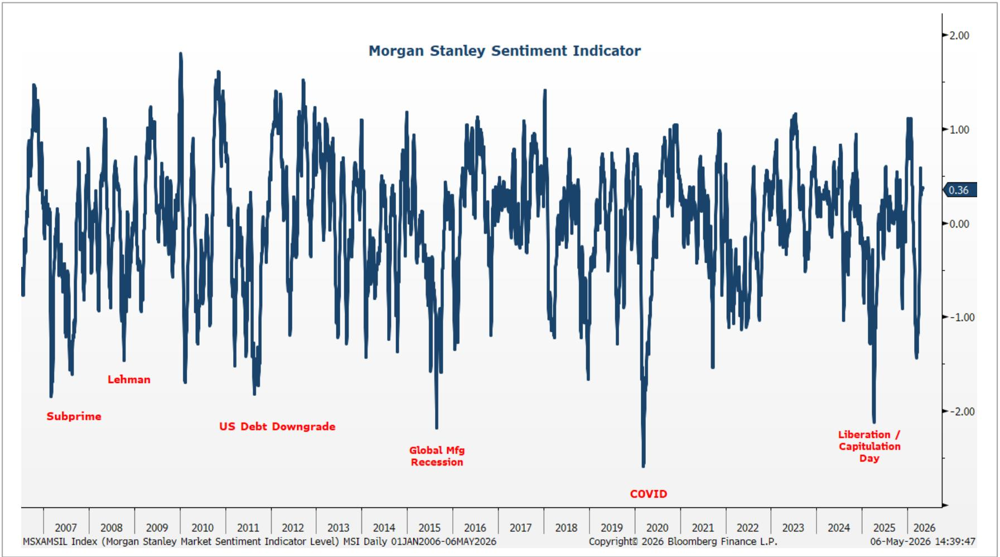

line

| Year | Value |
|------|-------|
| 2007 | ~-1.5 |
| 2008 | ~-1.8 |
| 2009 | ~-1.2 |
| 2010 | ~-1.6 |
| 2011 | ~-1.4 |
| 2012 | ~-1.3 |
| 2013 | ~-1.1 |
| 2014 | ~-0.8 |
| 2015 | ~-1.7 |
| 2016 | ~-1.0 |
| 2017 | ~-0.5 |
| 2018 | ~-0.3 |
| 2019 | ~-0.7 |
| 2020 | ~-2.5 |
| 2021 | ~-1.5 |
| 2022 | ~-1.0 |
| 2023 | ~-0.5 |
| 2024 | ~-0.8 |
| 2025 | ~-1.8 |
| 2026 | ~-1.5 |

# The Low Also Coincided with a V-Bottom in Earnings Revisions Breadth

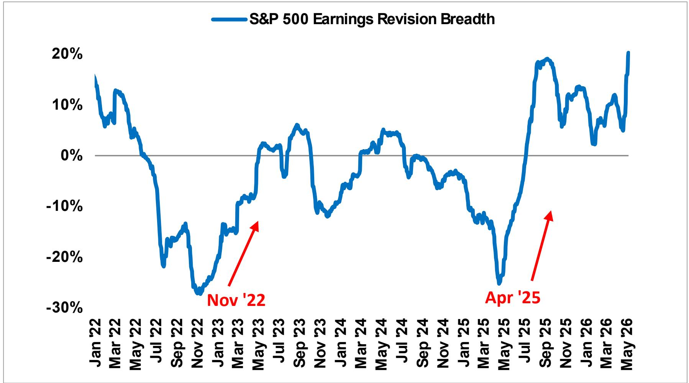

line

| Date       | Value  |
| ---------- | ------ |
| Nov '22    | -28%   |
| Apr '25    | -25%   |

# The Median Stock Is Now Recovering and Seeing the Strongest EPS Growth in 4 Years

Russell 3000 Median Stock EPS Growth   
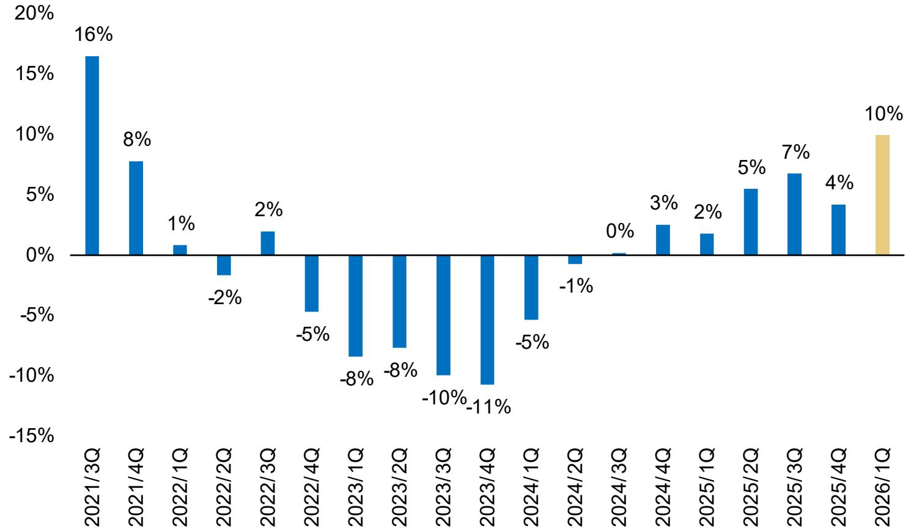

bar

| Quarter | Value (%) |
|---|---|
| 2021/3Q | 16 |
| 2021/4Q | 8 |
| 2022/1Q | 1 |
| 2022/2Q | -2 |
| 2022/3Q | 2 |
| 2022/4Q | -5 |
| 2023/1Q | -8 |
| 2023/2Q | -8 |
| 2023/3Q | -10 |
| 2023/4Q | -11 |
| 2024/1Q | -5 |
| 2024/2Q | -1 |
| 2024/3Q | 0 |
| 2024/4Q | 3 |
| 2025/1Q | 2 |
| 2025/2Q | 5 |
| 2025/3Q | 7 |
| 2025/4Q | 4 |
| 2026/1Q | 10 |

# Our Leading Earnings Model Is Forecasting Double Digit EPS Growth

MS Non-PMI Leading Earnings Indicator   
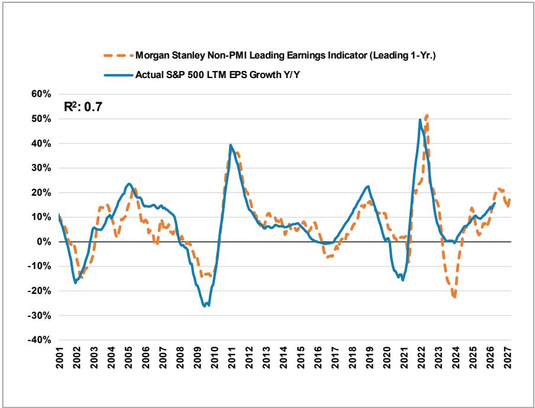

line

| Year | MS Non-PMI Leading Earnings Indicator (Leading 1-Yr.) | Actual S&P 500 LTM EPS Growth Y/Y |
|------|------------------------------------------------------------------------|------------------------------------|
| 2001 | ~10%                                                                   | ~10%                               |
| 2002 | ~-15%                                                                  | ~-15%                              |
| 2003 | ~5%                                                                    | ~5%                                |
| 2004 | ~15%                                                                   | ~15%                               |
| 2005 | ~20%                                                                   | ~25%                               |
| 2006 | ~10%                                                                   | ~15%                               |
| 2007 | ~5%                                                                    | ~10%                               |
| 2008 | ~-5%                                                                   | ~5%                                |
| 2009 | ~-25%                                                                  | ~-30%                              |
| 2010 | ~-15%                                                                  | ~-25%                              |
| 2011 | ~35%                                                                   | ~40%                               |
| 2012 | ~15%                                                                   | ~15%                               |
| 2013 | ~10%                                                                   | ~10%                               |
| 2014 | ~5%                                                                    | ~5%                                |
| 2015 | ~5%                                                                    | ~5%                                |
| 2016 | ~-5%                                                                   | ~-5%                               |
| 2017 | ~-10%                                                                  | ~-10%                              |
| 2018 | ~15%                                                                   | ~20%                               |
| 2019 | ~15%                                                                   | ~25%                               |
| 2020 | ~5%                                                                    | ~5%                                |
| 2021 | ~-15%                                                                  | ~-15%                              |
| 2022 | ~50%                                                                   | ~50%                               |
| 2023 | ~-20%                                                                  | ~-20%                              |
| 2024 | ~-25%                                                                  | ~-25%                              |
| 2025 | ~10%                                                                   | ~10%                               |
| 2026 | ~15%                                                                   | ~15%                               |
| 2027 | ~15%                                                                   | ~15%                               |

Consensus EPS Estimates   
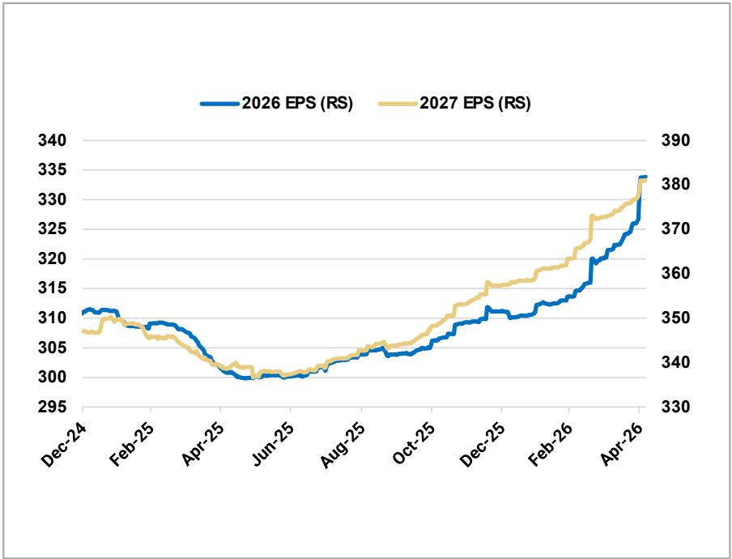

line

| Date   | 2026 EPS (RS) | 2027 EPS (RS) |
|--------|---------------|---------------|
| Dec-24 | 311           | 308           |
| Feb-25 | 309           | 307           |
| Apr-25 | 301           | 300           |
| Jun-25 | 300           | 301           |
| Aug-25 | 303           | 305           |
| Oct-25 | 306           | 308           |
| Dec-25 | 311           | 315           |
| Feb-26 | 318           | 325           |
| Apr-26 | 334           | 380           |

Source: FactSet, Bloomberg, MS. Left as of Mar. 31, 2026. Government data has delayed further updates. Actual S&P 500 LTM EPS as of 4/30/26. Right as of Mar 31, 2026.   
Note: The non-PMI LEI is a top down macro indicator that was built to triangulate our earnings forecasts using alternative sources. Inputs include Phil Fed economic activity, Creighton U. business confidence, Chicago Fed supplier deliveries, Atlanta Fed wage tracker (inverse signal), NFIB small bus. most important problem inflation (inverse signal), and Brave-Butters-Kelley cycle component of monthly GDP. Weightings are fixed over time.

# We Expect Earnings Growth to Accelerate for the Average Stock

Returns are Expected to Broaden in 2026 and 2027   
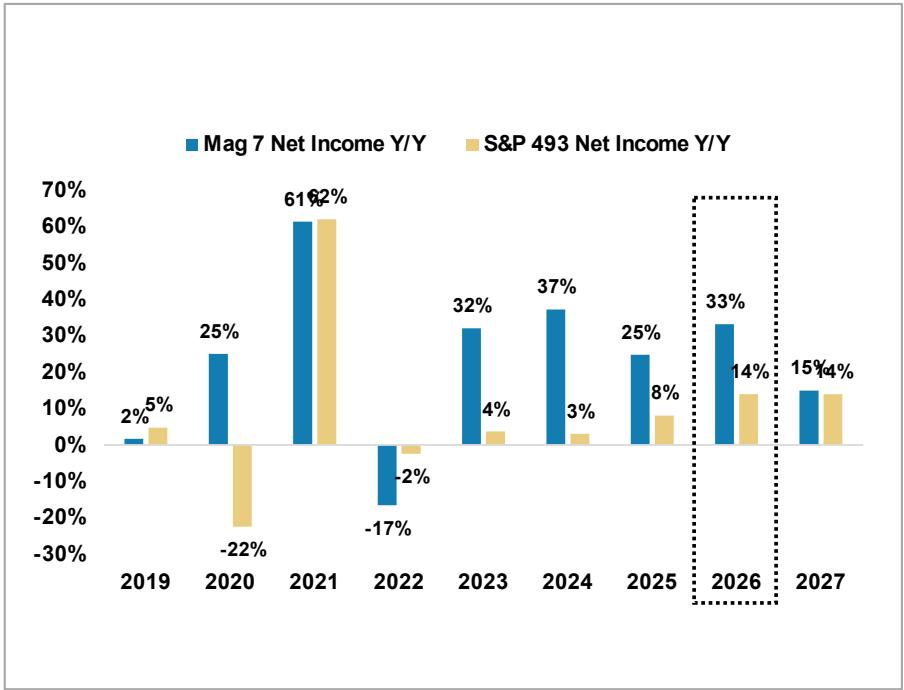

bar

| Year | Mag 7 Net Income Y/Y (%) | S&P 493 Net Income Y/Y (%) |
| :--- | :--- | :--- |
| 2019 | 2 | 5 |
| 2020 | 25 | -22 |
| 2021 | 61 | 62 |
| 2022 | -17 | -2 |
| 2023 | 32 | 4 |
| 2024 | 37 | 3 |
| 2025 | 25 | 8 |
| 2026 | 33 | 14 |
| 2027 | 15 | 14 |

We are Watching 2026 Estimates for the S&P 493   
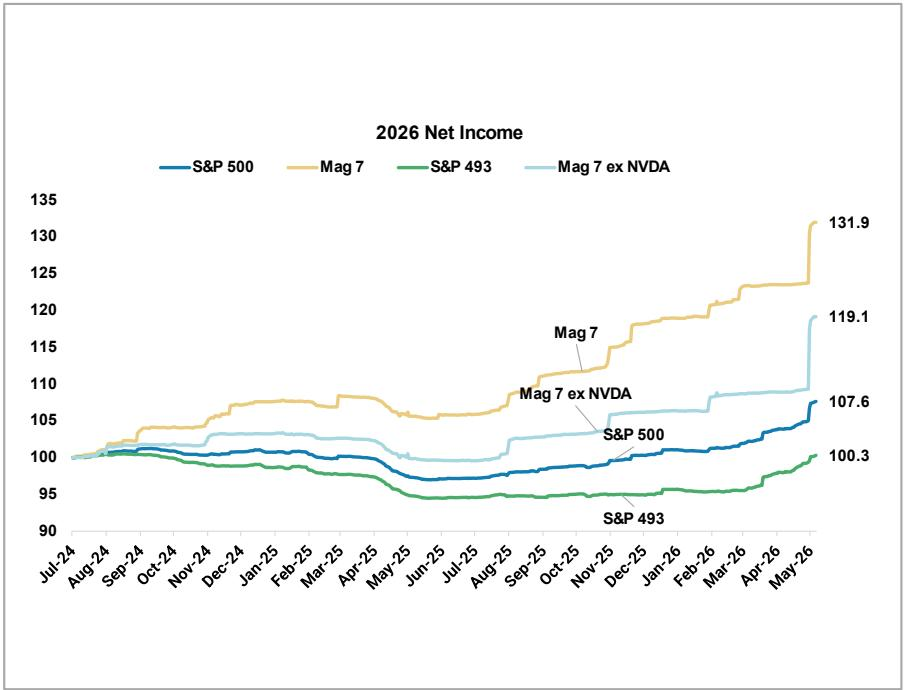

line

| Date   | S&P 500 | Mag 7 | S&P 493 | Mag 7 ex NVDA |
|--------|---------|-------|---------|---------------|
| May-26 | 107.6   | 131.9 | 100.3   | 119.1         |

# AI-Related Stocks Remain a Key Market Driver

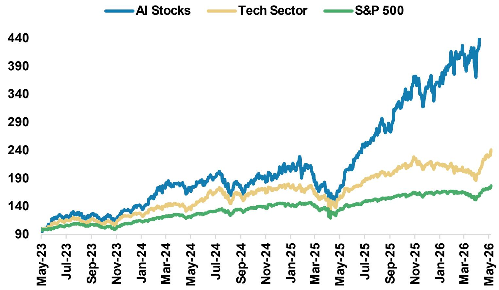

line

| Date   | AI Stocks | Tech Sector | S&P 500 |
|--------|-----------|-------------|---------|
| May-23 | 100       | 100         | 95      |
| Jul-23 | 130       | 125         | 110     |
| Sep-23 | 125       | 120         | 105     |
| Nov-23 | 135       | 130         | 115     |
| Jan-24 | 150       | 140         | 125     |
| Mar-24 | 180       | 150         | 135     |
| May-24 | 170       | 145         | 130     |
| Jul-24 | 190       | 160         | 140     |
| Sep-24 | 160       | 150         | 135     |
| Nov-24 | 180       | 165         | 145     |
| Jan-25 | 200       | 175         | 155     |
| Mar-25 | 180       | 160         | 145     |
| May-25 | 140       | 130         | 120     |
| Jul-25 | 220       | 180         | 140     |
| Sep-25 | 280       | 200         | 150     |
| Nov-25 | 350       | 230         | 160     |
| Jan-26 | 380       | 220         | 165     |
| Mar-26 | 400       | 240         | 170     |
| May-26 | 440       | 240         | 175     |

# Year Ahead Price Targets and Sector Preferences

Our S&P 500 EPS Targets 

<table><tr><td rowspan="2"></td><td rowspan="2">Current Price</td><td rowspan="2">MS Next 12M Price Target</td><td rowspan="2">MS Next 12M Price Target % to Current</td><td rowspan="2">Current P/E</td><td rowspan="2">MS Next 12M P/E Target</td><td colspan="4">MS Top Down EPS Estimates</td><td colspan="4">Bottom Up Consensus EPS Estimates</td></tr><tr><td>2026</td><td>2027</td><td>June 2028</td><td>2028</td><td>2026</td><td>2027</td><td>June 2028</td><td>2028</td></tr><tr><td rowspan="2">Bear Growth</td><td rowspan="2">7,399</td><td rowspan="2">5,900</td><td rowspan="2">-20%</td><td rowspan="2">21.2x</td><td rowspan="2">19.0x</td><td>$299</td><td>$300</td><td>$311</td><td>$322</td><td>$333</td><td>$383</td><td>$405</td><td>$427</td></tr><tr><td>9%</td><td>0%</td><td>4%</td><td>7%</td><td>21%</td><td>15%</td><td>13%</td><td>12%</td></tr><tr><td rowspan="2">Base Growth</td><td rowspan="2">7,399</td><td rowspan="2">8,300</td><td rowspan="2">12%</td><td rowspan="2">21.2x</td><td rowspan="2">20.5x</td><td>$339</td><td>$380</td><td>$404</td><td>$429</td><td>$333</td><td>$383</td><td>$405</td><td>$427</td></tr><tr><td>23%</td><td>12%</td><td>13%</td><td>13%</td><td>21%</td><td>15%</td><td>13%</td><td>12%</td></tr><tr><td rowspan="2">Bull Growth</td><td rowspan="2">7,399</td><td rowspan="2">9,400</td><td rowspan="2">27%</td><td rowspan="2">21.2x</td><td rowspan="2">21.0x</td><td>$352</td><td>$416</td><td>$448</td><td>$480</td><td>$333</td><td>$383</td><td>$405</td><td>$427</td></tr><tr><td>28%</td><td>18%</td><td>17%</td><td>16%</td><td>21%</td><td>15%</td><td>13%</td><td>12%</td></tr></table>

Our Sector Recommendations 

<table><tr><td colspan="4">MS Sector Recommendations</td></tr><tr><td>Overweight</td><td>Financials</td><td>Industrials</td><td>Consumer Discretionary Goods</td></tr><tr><td rowspan="3">Equal Weight</td><td>Tech</td><td>Comm. Services</td><td>Health Care</td></tr><tr><td>Materials</td><td>Utilities</td><td>Consumer Services</td></tr><tr><td>Energy</td><td></td><td></td></tr><tr><td>Underweight</td><td>Staples</td><td>Real Estate</td><td></td></tr></table>

# Outline

Pg. 3 Narrative

Pg. 12 Earnings & Valuation

Pg. 23 Quant

Pg. 27 Sector Views

Pg. 38 Macro & Misc.

# Earnings Continue to Drive the S&P 500 Higher Despite the Valuation Pullback

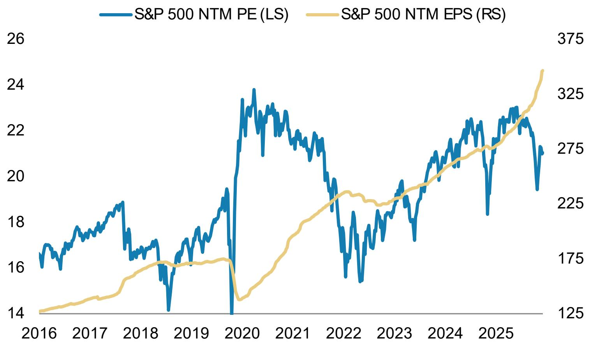

bar_line

| Year | S&P 500 NTM PE (LS) | S&P 500 NTM EPS (RS) |
|------|---------------------|----------------------|
| 2016 | ~16.5               | ~14                  |
| 2017 | ~18.0               | ~15                  |
| 2018 | ~17.0               | ~16                  |
| 2019 | ~16.5               | ~16                  |
| 2020 | ~24.0               | ~14                  |
| 2021 | ~22.0               | ~18                  |
| 2022 | ~19.0               | ~22                  |
| 2023 | ~18.0               | ~24                  |
| 2024 | ~21.0               | ~27                  |
| 2025 | ~23.0               | ~32                  |

Source: FactSet, MS as of May 6, 2026.

# MS Earnings Models

MS Leading Earnings Indicator   
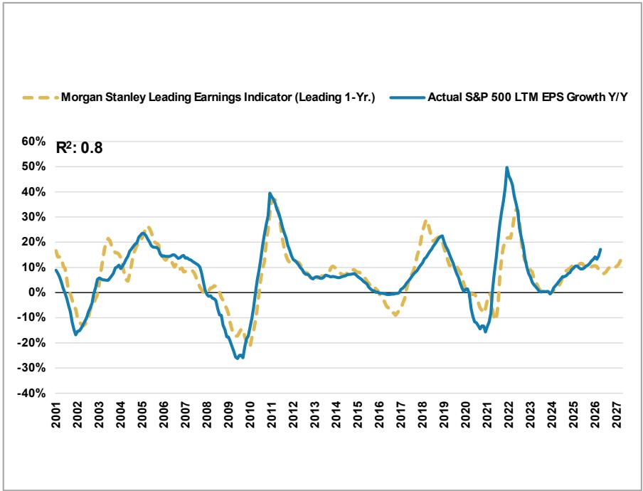

line

| Year | MS Leading Earnings Indicator (Leading 1-Yr.) | Actual S&P 500 LTM EPS Growth Y/Y |
|------|---------------------------------------------------------------|-----------------------------------|
| 2001 | ~15%                                                          | ~10%                              |
| 2002 | ~-15%                                                         | ~-20%                             |
| 2003 | ~20%                                                          | ~5%                               |
| 2004 | ~15%                                                          | ~10%                              |
| 2005 | ~25%                                                          | ~20%                              |
| 2006 | ~15%                                                          | ~15%                              |
| 2007 | ~10%                                                          | ~10%                              |
| 2008 | ~5%                                                           | ~5%                               |
| 2009 | ~-10%                                                         | ~-25%                             |
| 2010 | ~-20%                                                         | ~-30%                             |
| 2011 | ~35%                                                          | ~40%                              |
| 2012 | ~20%                                                          | ~15%                              |
| 2013 | ~10%                                                          | ~5%                               |
| 2014 | ~10%                                                          | ~5%                               |
| 2015 | ~5%                                                           | ~5%                               |
| 2016 | ~-5%                                                          | ~0%                               |
| 2017 | ~-10%                                                         | ~-5%                              |
| 2018 | ~30%                                                          | ~20%                              |
| 2019 | ~25%                                                          | ~25%                              |
| 2020 | ~-5%                                                          | ~-15%                             |
| 2021 | ~-10%                                                         | ~-15%                             |
| 2022 | ~30%                                                          | ~50%                              |
| 2023 | ~10%                                                          | ~5%                               |
| 2024 | ~5%                                                           | ~0%                               |
| 2025 | ~10%                                                          | ~10%                              |
| 2026 | ~15%                                                          | ~15%                              |
| 2027 | ~15%                                                          | ~15%                              |

MS Non-PMI Leading Earnings Indicator   
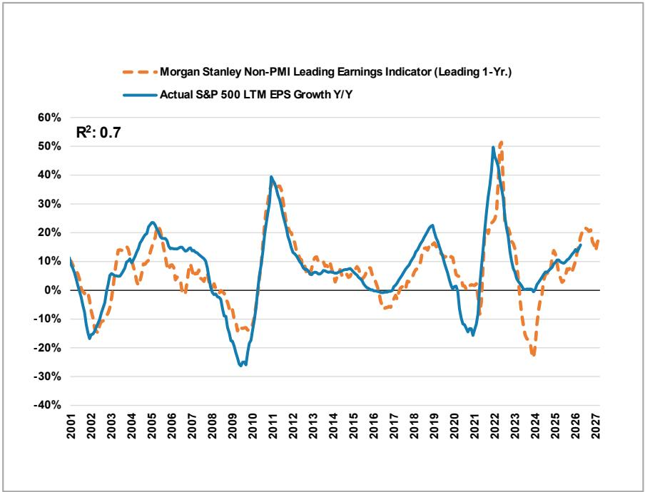

line

| Year | MS Non-PMI Leading Earnings Indicator (Leading 1-Yr.) | Actual S&P 500 LTM EPS Growth Y/Y |
|------|------------------------------------------------------------------------|------------------------------------|
| 2001 | ~10%                                                                   | ~10%                               |
| 2002 | ~-15%                                                                  | ~-15%                              |
| 2003 | ~5%                                                                    | ~5%                                |
| 2004 | ~15%                                                                   | ~15%                               |
| 2005 | ~20%                                                                   | ~25%                               |
| 2006 | ~10%                                                                   | ~15%                               |
| 2007 | ~5%                                                                    | ~10%                               |
| 2008 | ~-5%                                                                   | ~5%                                |
| 2009 | ~-25%                                                                  | ~-30%                              |
| 2010 | ~-10%                                                                  | ~-25%                              |
| 2011 | ~40%                                                                   | ~40%                               |
| 2012 | ~15%                                                                   | ~15%                               |
| 2013 | ~10%                                                                   | ~10%                               |
| 2014 | ~5%                                                                    | ~5%                                |
| 2015 | ~5%                                                                    | ~5%                                |
| 2016 | ~-5%                                                                   | ~-5%                               |
| 2017 | ~-10%                                                                  | ~-10%                              |
| 2018 | ~15%                                                                   | ~20%                               |
| 2019 | ~15%                                                                   | ~25%                               |
| 2020 | ~5%                                                                    | ~5%                                |
| 2021 | ~-15%                                                                  | ~-15%                              |
| 2022 | ~50%                                                                   | ~50%                               |
| 2023 | ~-5%                                                                   | ~-5%                               |
| 2024 | ~-25%                                                                  | ~-25%                              |
| 2025 | ~10%                                                                   | ~10%                               |
| 2026 | ~15%                                                                   | ~15%                               |
| 2027 | ~15%                                                                   | ~15%                               |

Source: Bloomberg, FactSet, Haver, MS. Left LEI as of Mar. 31, 2026. Right Non-PMI LEI as of Mar. 31, 2026 (inputs are lagged by 1-2 months). Actual S&P 500 LTM EPS as of 4/30/26. Note: The LEI is a top down macro indicator consisting of the Inventory/Sales ratio, ISM Manufacturing PMI, ISM Manufacturing Employment PMI, Consumer Confidence and credit spreads. The non-PMI LEI is a top down macro indicator that was built to triangulate our earnings forecasts using alternative sources. Inputs include Phil Fed economic activity, Creighton U. business confidence, Chicago Fed supplier deliveries, Atlanta Fed wage tracker (inverse signal), NFIB small bus. most important problem inflation (inverse signal), and Brave-Butters-Kelley cycle component of monthly GDP. Weightings are fixed over time.

# Consensus Is Pricing Strong Earnings through 2026

Strong Earnings Revisions Have Led the Index Higher   
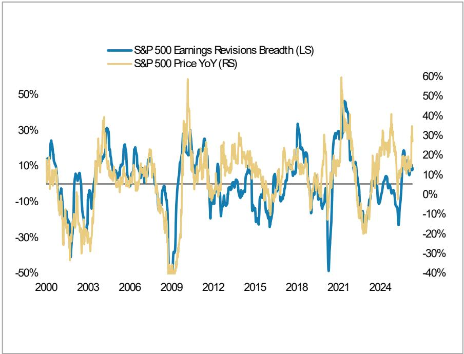

line

| Year | S&P 500 Earnings Revisions Breadth (LS) | S&P 500 Price YoY (RS) |
|------|------------------------------------------|------------------------|
| 2000 | ~25%                                     | ~10%                   |
| 2003 | ~-10%                                    | ~-30%                  |
| 2006 | ~15%                                     | ~10%                   |
| 2009 | ~-40%                                    | ~-45%                  |
| 2012 | ~-15%                                    | ~-10%                  |
| 2015 | ~-25%                                    | ~-15%                  |
| 2018 | ~30%                                     | ~20%                   |
| 2021 | ~-50%                                    | ~-20%                  |
| 2024 | ~-25%                                    | ~-15%                  |

Consensus Quarterly Earnings   
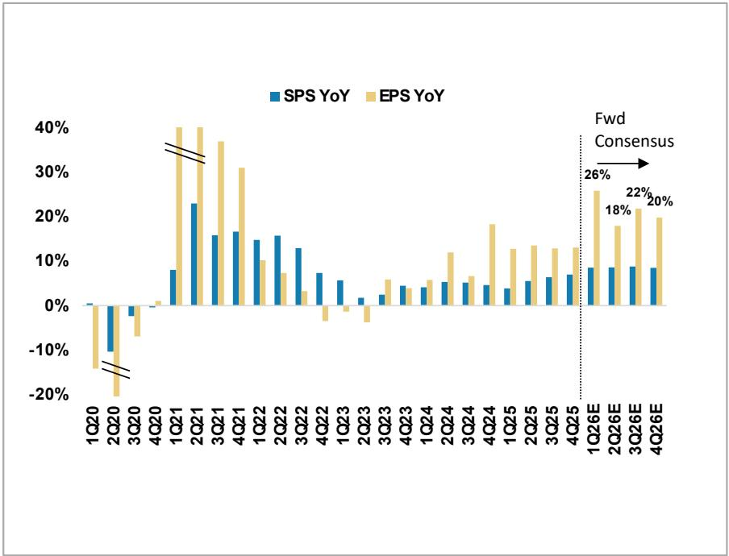

bar

| Quarter | SPS YoY (%) | EPS YoY (%) |
| :--- | :--- | :--- |
| 1Q20 | -1.5 | -1.8 |
| 2Q20 | -12.0 | -19.0 |
| 3Q20 | -2.0 | -7.0 |
| 4Q20 | 0.5 | 1.0 |
| 1Q21 | 8.0 | 40.0 |
| 2Q21 | 23.0 | 40.0 |
| 3Q21 | 16.0 | 37.0 |
| 4Q21 | 16.5 | 31.0 |
| 1Q22 | 15.0 | 10.0 |
| 2Q22 | 16.0 | 7.5 |
| 3Q22 | 13.0 | 3.0 |
| 4Q22 | 7.5 | -3.0 |
| 1Q23 | 6.0 | -1.5 |
| 2Q23 | 1.5 | -4.5 |
| 3Q23 | 2.5 | 6.0 |
| 4Q23 | 4.5 | 5.5 |
| 1Q24 | 4.5 | 6.0 |
| 2Q24 | 5.5 | 12.0 |
| 3Q24 | 5.5 | 7.0 |
| 4Q24 | 4.5 | 18.5 |
| 1Q25 | 3.5 | 12.5 |
| 2Q25 | 5.5 | 13.5 |
| 3Q25 | 6.5 | 13.0 |
| 4Q25 | 7.0 | 13.0 |
| Fwd Consensus (1Q26E) | 8.5 | 26.0 |
| Fwd Consensus (2Q26E) | 8.5 | 18.0 |
| Fwd Consensus (3Q26E) | 9.0 | 22.0 |
| Fwd Consensus (4Q26E) | 8.5 | 20.0 |

# Earnings Revisions by Size and Sector – 2026 Estimates

% Change to 2026 Earnings Estimates Over the Last 12 Months & Year to Date 

<table><tr><td colspan="3">Large Caps - S&amp;P 500</td><td colspan="3">Mid Caps - MID</td><td colspan="3">Small Caps - SML</td></tr><tr><td>Sector</td><td>LTM</td><td>YTD</td><td>Sector</td><td>LTM</td><td>YTD</td><td>Sector</td><td>LTM</td><td>YTD</td></tr><tr><td>Comm</td><td>18%</td><td>13%</td><td>Comm</td><td>227%</td><td>91%</td><td>Comm</td><td>-9%</td><td>-15%</td></tr><tr><td>Discretionary</td><td>3%</td><td>3%</td><td>Discretionary</td><td>-13%</td><td>-6%</td><td>Discretionary</td><td>-11%</td><td>-3%</td></tr><tr><td>Energy</td><td>26%</td><td>43%</td><td>Energy</td><td>20%</td><td>32%</td><td>Energy</td><td>7%</td><td>53%</td></tr><tr><td>Financials</td><td>3%</td><td>1%</td><td>Financials</td><td>6%</td><td>1%</td><td>Financials</td><td>9%</td><td>5%</td></tr><tr><td>Health Care</td><td>-6%</td><td>-2%</td><td>Health Care</td><td>-18%</td><td>-7%</td><td>Health Care</td><td>-8%</td><td>-3%</td></tr><tr><td>Industrials</td><td>-1%</td><td>0%</td><td>Industrials</td><td>-9%</td><td>-5%</td><td>Industrials</td><td>1%</td><td>-5%</td></tr><tr><td>Materials</td><td>15%</td><td>14%</td><td>Materials</td><td>-11%</td><td>-3%</td><td>Materials</td><td>9%</td><td>3%</td></tr><tr><td>Real Estate</td><td>-2%</td><td>0%</td><td>Real Estate</td><td>-3%</td><td>-2%</td><td>Real Estate</td><td>3%</td><td>2%</td></tr><tr><td>Staples</td><td>-3%</td><td>-1%</td><td>Staples</td><td>17%</td><td>18%</td><td>Staples</td><td>-12%</td><td>-9%</td></tr><tr><td>Tech</td><td>31%</td><td>13%</td><td>Tech</td><td>19%</td><td>19%</td><td>Tech</td><td>7%</td><td>3%</td></tr><tr><td>Utilities</td><td>2%</td><td>0%</td><td>Utilities</td><td>-2%</td><td>2%</td><td>Utilities</td><td>-6%</td><td>-8%</td></tr><tr><td>S&amp;P 500</td><td>11%</td><td>7%</td><td>S&amp;P 400</td><td>0%</td><td>3%</td><td>S&amp;P 600</td><td>2%</td><td>2%</td></tr></table>

Source: FactSet, MS as of Apr 30, 2026.

# S&P 500 Sector Level Earnings Revisions Breadth – Pt. 1

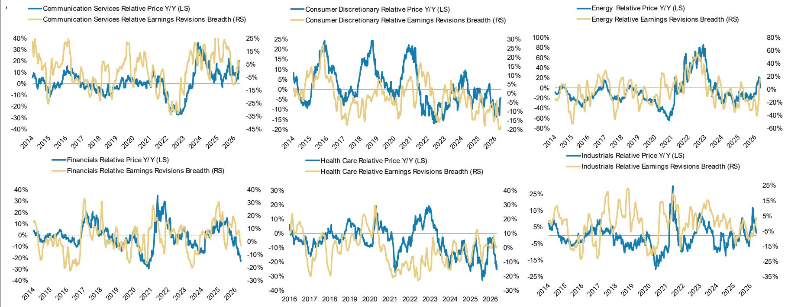  
Financials Relative Price Y/Y (LS)   
Financials Relative Earnings Revisions Breadth (RS)   
Health Care Relative Price Y/Y (LS)   
Health Care Relative Earnings Revisions Breadth (RS)   
—Industrials Relative Price Y/Y (LS)   
—Industrials Relative Earnings Revisions Breadth (RS)

# S&P 500 Sector Level Earnings Revisions Breadth – Pt. 2

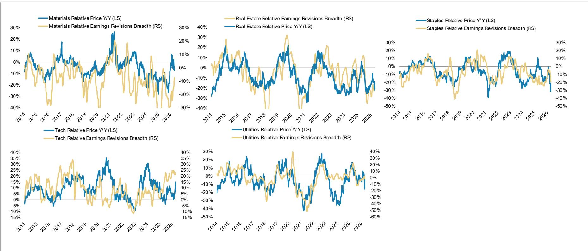

# US Equity Risk Premium Remains Historically Low

S&P 500 Next Twelve Month Equity Risk Premium   
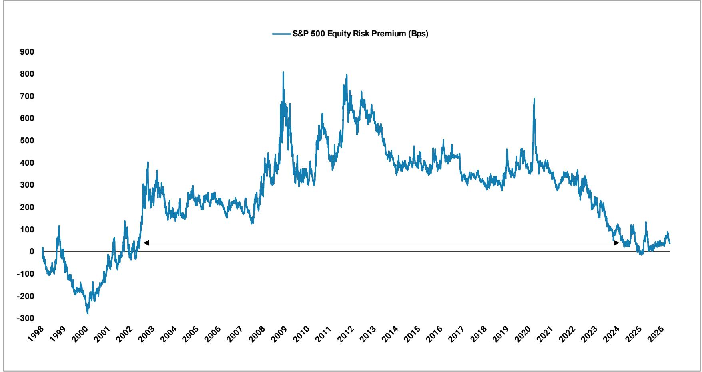

line

| Year | S&P 500 Equity Risk Premium (Bps) |
|------|-----------------------------------|
| 1998 | ~0                                |
| 1999 | ~100                              |
| 2000 | ~-250                             |
| 2001 | ~-150                             |
| 2002 | ~150                              |
| 2003 | ~400                              |
| 2004 | ~250                              |
| 2005 | ~300                              |
| 2006 | ~250                              |
| 2007 | ~200                              |
| 2008 | ~350                              |
| 2009 | ~800                              |
| 2010 | ~350                              |
| 2011 | ~600                              |
| 2012 | ~800                              |
| 2013 | ~650                              |
| 2014 | ~450                              |
| 2015 | ~400                              |
| 2016 | ~450                              |
| 2017 | ~350                              |
| 2018 | ~300                              |
| 2019 | ~350                              |
| 2020 | ~450                              |
| 2021 | ~700                              |
| 2022 | ~350                              |
| 2023 | ~300                              |
| 2024 | ~100                              |
| 2025 | ~50                               |
| 2026 | ~100                              |

Source: FactSet, Bloomberg, MS as of May 6, 2026.   
Note: ERP based on forward earnings yield and 10-year Treasury Yield.

# US Equity Market Traditional Valuation Measures

S&P 500 NTM P/E   
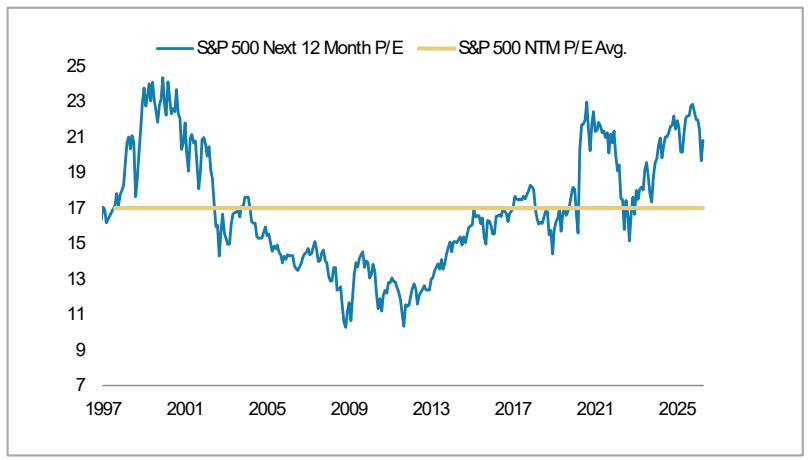

line

| Year | S&P 500 Next 12 Month P/E | S&P 500 NTM P/E Avg. |
|------|---------------------------|----------------------|
| 1997 | ~17                       | 17                   |
| 2001 | ~24                       | 17                   |
| 2005 | ~16                       | 17                   |
| 2009 | ~11                       | 17                   |
| 2013 | ~14                       | 17                   |
| 2017 | ~18                       | 17                   |
| 2021 | ~23                       | 17                   |
| 2025 | ~23                       | 17                   |

S&P 500 NTM P/S   
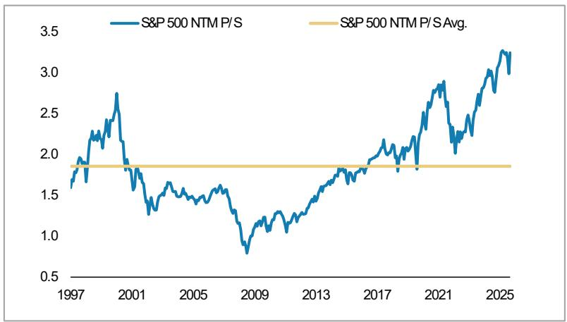

line

| Year | S&P 500 NTM P/S |
|------|-----------------|
| 1997 | ~1.6            |
| 2001 | ~2.8            |
| 2005 | ~1.5            |
| 2009 | ~0.8            |
| 2013 | ~1.8            |
| 2017 | ~2.2            |
| 2021 | ~2.9            |
| 2025 | ~3.3            |

S&P 500 NTM P/B   
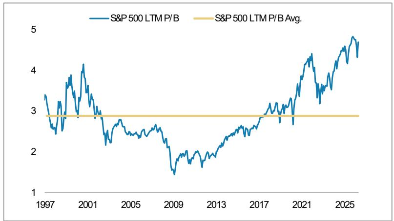

line

| Year | S&P 500 LTM P/B | S&P 500 LTM P/B Avg. |
|------|-----------------|----------------------|
| 1997 | ~3.5            | 3.0                  |
| 2001 | ~4.2            | 3.0                  |
| 2005 | ~2.8            | 3.0                  |
| 2009 | ~1.5            | 3.0                  |
| 2013 | ~2.0            | 3.0                  |
| 2017 | ~2.8            | 3.0                  |
| 2021 | ~4.5            | 3.0                  |
| 2025 | ~4.8            | 3.0                  |

S&P 500 NTM EV/EBITDA   
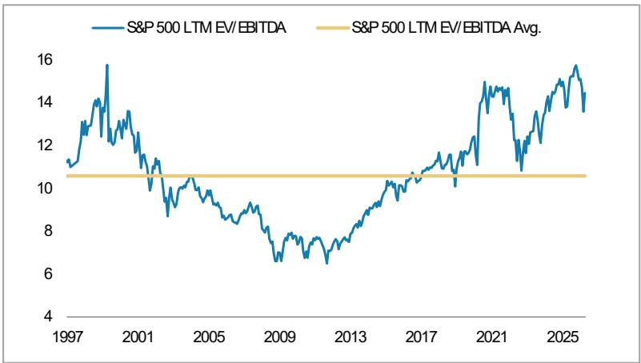

line

| Year | S&P 500 LTM EV/EBITDA | S&P 500 LTM EV/EBITDA Avg. |
|------|------------------------|----------------------------|
| 1997 | ~11.5                  | ~10.5                      |
| 2001 | ~13.5                  | ~10.5                      |
| 2005 | ~10.5                  | ~10.5                      |
| 2009 | ~7.5                   | ~10.5                      |
| 2013 | ~8.5                   | ~10.5                      |
| 2017 | ~11.5                  | ~10.5                      |
| 2021 | ~14.5                  | ~10.5                      |
| 2025 | ~15.5                  | ~10.5                      |

# Valuation by Size and Sector – Current FWD P/E vs 4 Yr. Median

<table><tr><td colspan="4">Large Caps - S&amp;P 500</td><td colspan="4">Mid Caps - MID</td><td colspan="4">Small Caps - SML</td></tr><tr><td>Sector</td><td>Fwd PE</td><td>Median</td><td>Delta</td><td>Sector</td><td>Fwd PE</td><td>Median</td><td>Delta</td><td>Sector</td><td>Fwd PE</td><td>Median</td><td>Delta</td></tr><tr><td>Comm</td><td>21.3</td><td>15.8</td><td>35%</td><td>Comm</td><td>14.1</td><td>18.3</td><td>-23%</td><td>Comm</td><td>28.1</td><td>17.1</td><td>65%</td></tr><tr><td>Discretionary</td><td>27.3</td><td>25.0</td><td>9%</td><td>Discretionary</td><td>15.0</td><td>10.2</td><td>47%</td><td>Discretionary</td><td>13.5</td><td>7.4</td><td>83%</td></tr><tr><td>Energy</td><td>15.0</td><td>10.3</td><td>47%</td><td>Energy</td><td>13.2</td><td>9.8</td><td>35%</td><td>Energy</td><td>14.3</td><td>7.8</td><td>82%</td></tr><tr><td>Financials</td><td>14.9</td><td>12.8</td><td>16%</td><td>Financials</td><td>9.8</td><td>10.0</td><td>-2%</td><td>Financials</td><td>10.0</td><td>10.7</td><td>-7%</td></tr><tr><td>Health Care</td><td>16.9</td><td>15.9</td><td>6%</td><td>Health Care</td><td>20.6</td><td>20.7</td><td>-1%</td><td>Health Care</td><td>21.3</td><td>27.4</td><td>-22%</td></tr><tr><td>Industrials</td><td>25.6</td><td>18.0</td><td>43%</td><td>Industrials</td><td>22.3</td><td>15.1</td><td>47%</td><td>Industrials</td><td>20.4</td><td>12.0</td><td>70%</td></tr><tr><td>Materials</td><td>18.3</td><td>14.5</td><td>26%</td><td>Materials</td><td>16.5</td><td>8.2</td><td>102%</td><td>Materials</td><td>14.5</td><td>11.9</td><td>22%</td></tr><tr><td>Real Estate</td><td>18.7</td><td>20.3</td><td>-8%</td><td>Real Estate</td><td>14.3</td><td>14.4</td><td>-1%</td><td>Real Estate</td><td>12.1</td><td>12.5</td><td>-3%</td></tr><tr><td>Staples</td><td>22.6</td><td>21.5</td><td>5%</td><td>Staples</td><td>14.6</td><td>15.6</td><td>-6%</td><td>Staples</td><td>16.7</td><td>17.7</td><td>-6%</td></tr><tr><td>Tech</td><td>23.7</td><td>21.5</td><td>11%</td><td>Tech</td><td>24.2</td><td>15.9</td><td>52%</td><td>Tech</td><td>25.1</td><td>15.5</td><td>62%</td></tr><tr><td>Utilities</td><td>19.0</td><td>20.3</td><td>-7%</td><td>Utilities</td><td>16.9</td><td>17.2</td><td>-2%</td><td>Utilities</td><td>20.4</td><td>22.8</td><td>-10%</td></tr><tr><td>S&amp;P 500</td><td>20.8</td><td>17.6</td><td>19%</td><td>S&amp;P 500</td><td>16.3</td><td>12.6</td><td>29%</td><td>S&amp;P 500</td><td>15.6</td><td>12.0</td><td>30%</td></tr></table>

Source: FactSet, MS as of Apr. 30, 2026.

# Valuation by Size and Sector – Current FWD P/Sales vs 4 Yr. Median

<table><tr><td colspan="4">Large Caps - S&amp;P 500</td><td colspan="4">Mid Caps - MID</td><td colspan="4">Small Caps - SML</td></tr><tr><td>Sector</td><td>Fwd PS</td><td>Median</td><td>Delta</td><td>Sector</td><td>Fwd PS</td><td>Median</td><td>Delta</td><td>Sector</td><td>Fwd PS</td><td>Median</td><td>Delta</td></tr><tr><td>Comm</td><td>4.1</td><td>3.3</td><td>24%</td><td>Comm</td><td>2.3</td><td>1.9</td><td>19%</td><td>Comm</td><td>1.2</td><td>0.8</td><td>49%</td></tr><tr><td>Discretionary</td><td>2.5</td><td>2.2</td><td>15%</td><td>Discretionary</td><td>0.8</td><td>0.8</td><td>-7%</td><td>Discretionary</td><td>0.6</td><td>0.6</td><td>1%</td></tr><tr><td>Energy</td><td>1.8</td><td>1.3</td><td>41%</td><td>Energy</td><td>1.5</td><td>1.0</td><td>48%</td><td>Energy</td><td>0.9</td><td>0.5</td><td>70%</td></tr><tr><td>Financials</td><td>3.0</td><td>2.8</td><td>8%</td><td>Financials</td><td>1.7</td><td>1.8</td><td>-5%</td><td>Financials</td><td>1.8</td><td>2.0</td><td>-10%</td></tr><tr><td>Health Care</td><td>1.4</td><td>1.6</td><td>-13%</td><td>Health Care</td><td>2.6</td><td>2.3</td><td>13%</td><td>Health Care</td><td>1.1</td><td>1.4</td><td>-21%</td></tr><tr><td>Industrials</td><td>2.8</td><td>2.2</td><td>25%</td><td>Industrials</td><td>1.5</td><td>1.3</td><td>21%</td><td>Industrials</td><td>1.0</td><td>0.9</td><td>10%</td></tr><tr><td>Materials</td><td>2.3</td><td>2.1</td><td>10%</td><td>Materials</td><td>1.2</td><td>1.0</td><td>21%</td><td>Materials</td><td>1.0</td><td>0.9</td><td>13%</td></tr><tr><td>Real Estate</td><td>5.9</td><td>6.2</td><td>-5%</td><td>Real Estate</td><td>3.5</td><td>3.6</td><td>-2%</td><td>Real Estate</td><td>2.6</td><td>2.5</td><td>6%</td></tr><tr><td>Staples</td><td>1.6</td><td>1.5</td><td>7%</td><td>Staples</td><td>0.5</td><td>0.6</td><td>-10%</td><td>Staples</td><td>0.5</td><td>0.4</td><td>12%</td></tr><tr><td>Tech</td><td>6.7</td><td>7.0</td><td>-5%</td><td>Tech</td><td>1.6</td><td>1.3</td><td>16%</td><td>Tech</td><td>1.6</td><td>1.4</td><td>10%</td></tr><tr><td>Utilities</td><td>2.8</td><td>2.6</td><td>11%</td><td>Utilities</td><td>2.6</td><td>1.8</td><td>40%</td><td>Utilities</td><td>2.1</td><td>2.6</td><td>-19%</td></tr><tr><td>S&amp;P 500</td><td>3.0</td><td>2.7</td><td>13%</td><td>S&amp;P 500</td><td>1.4</td><td>1.3</td><td>9%</td><td>S&amp;P 500</td><td>1.1</td><td>1.0</td><td>9%</td></tr></table>

Source: FactSet, MS as of Apr. 30, 2026.

# Outline

Pg. 3 Narrative

Pg. 12 Earnings & Valuation

Pg. 23 Quant

Pg. 27 Sector Views

Pg. 38 Macro & Misc.

# Stock Specific Risk Fell Sharply Post Liberation Day and Has Since Rebounded

Median 63-Day Rolling Stock Specific Risk Through Apr 30, 2026   
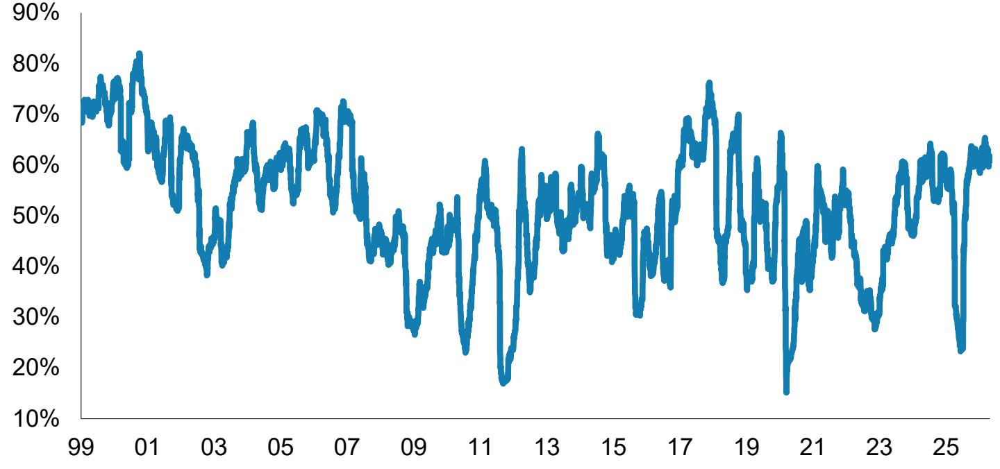

line

| Year | Value |
| ---- | ----- |
| 99   | 70%   |
| 01   | 80%   |
| 03   | 40%   |
| 05   | 60%   |
| 07   | 70%   |
| 09   | 30%   |
| 11   | 15%   |
| 13   | 50%   |
| 15   | 60%   |
| 17   | 70%   |
| 19   | 60%   |
| 21   | 15%   |
| 23   | 30%   |
| 25   | 60%   |

# Return Dispersion is on the Rise in 2026

Return Dispersion Has Risen in 2026   
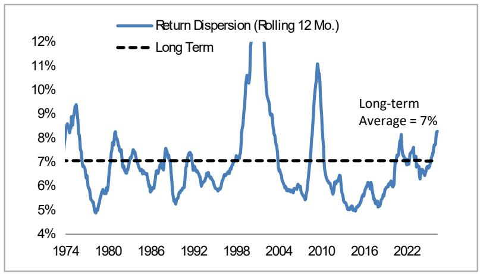

line

| Year | Return Dispersion (Rolling 12 Mo.) |
|------|------------------------------------|
| 1974 | ~8.5%                              |
| 1980 | ~5%                                |
| 1986 | ~7%                                |
| 1992 | ~6%                                |
| 1998 | ~7%                                |
| 2004 | ~12%                               |
| 2010 | ~11%                               |
| 2016 | ~5%                                |
| 2022 | ~8%                                |

Estimate Dispersion Has Also Ticked Higher in 2026   
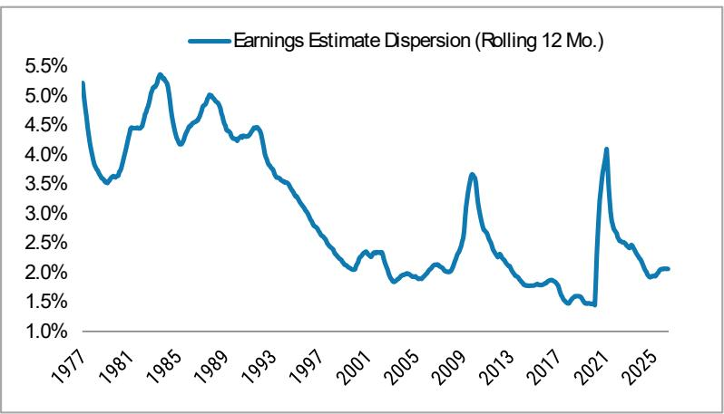

line

| Year | Earnings Estimate Dispersion (Rolling 12 Mo.) |
| ---- | --------------------------------------------- |
| 1977 | 5.3%                                          |
| 1981 | 3.5%                                          |
| 1985 | 5.4%                                          |
| 1989 | 5.0%                                          |
| 1993 | 4.3%                                          |
| 1997 | 3.0%                                          |
| 2001 | 2.2%                                          |
| 2005 | 2.0%                                          |
| 2009 | 3.6%                                          |
| 2013 | 2.5%                                          |
| 2017 | 1.8%                                          |
| 2021 | 4.1%                                          |
| 2025 | 2.0%                                          |

Book-to-Price Dispersion Below Median   
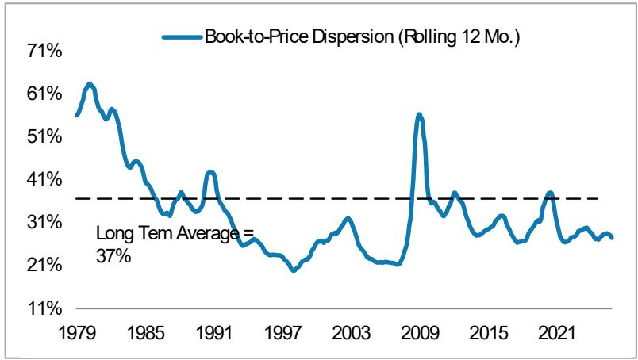

line

| Year | Book-to-Price Dispersion (Rolling 12 Mo.) |
| ---- | ------------------------------------------ |
| 1979 | ~61%                                       |
| 1985 | ~41%                                       |
| 1991 | ~41%                                       |
| 1997 | ~21%                                       |
| 2003 | ~31%                                       |
| 2009 | ~51%                                       |
| 2015 | ~31%                                       |
| 2021 | ~31%                                       |

Earnings Yield Dispersion Falling as Valuations Rise   
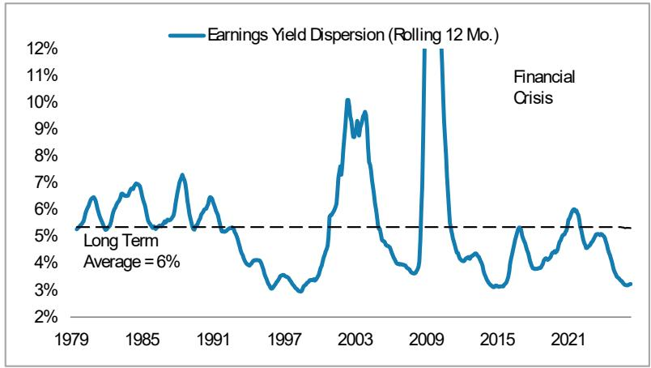

line

| Year | Earnings Yield Dispersion (Rolling 12 Mo.) |
|------|---------------------------------------------|
| 1979 | ~5%                                         |
| 1985 | ~7%                                         |
| 1991 | ~5%                                         |
| 1997 | ~3%                                         |
| 2003 | ~10%                                        |
| 2009 | ~12%                                        |
| 2015 | ~4%                                         |
| 2021 | ~6%                                         |

# Market Cap and Equal Weighted Indexes Show Differing Pictures

Cap Weight vs Equal Weight 12-Month Total Return   
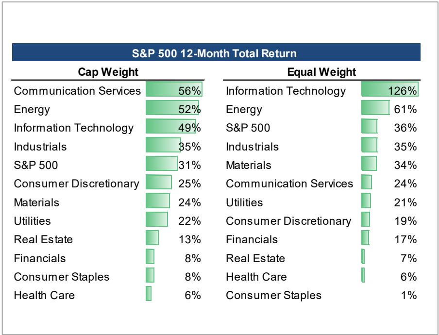

bar

S&P 500 12-Month Total Return
| Category | Cap Weight (%) | Equal Weight (%) |
| :--- | :--- | :--- |
| Communication Services | 56 | 126 |
| Energy | 52 | 61 |
| Information Technology | 49 | 36 |
| Industrials | 35 | 35 |
| S&P 500 | 31 | 34 |
| Consumer Discretionary | 25 | 24 |
| Materials | 24 | 21 |
| Utilities | 22 | 19 |
| Real Estate | 13 | 17 |
| Financials | 8 | 7 |
| Consumer Staples | 8 | 6 |
| Health Care | 6 | 1 |

Cap Weight vs Equal Weight Performance YTD   
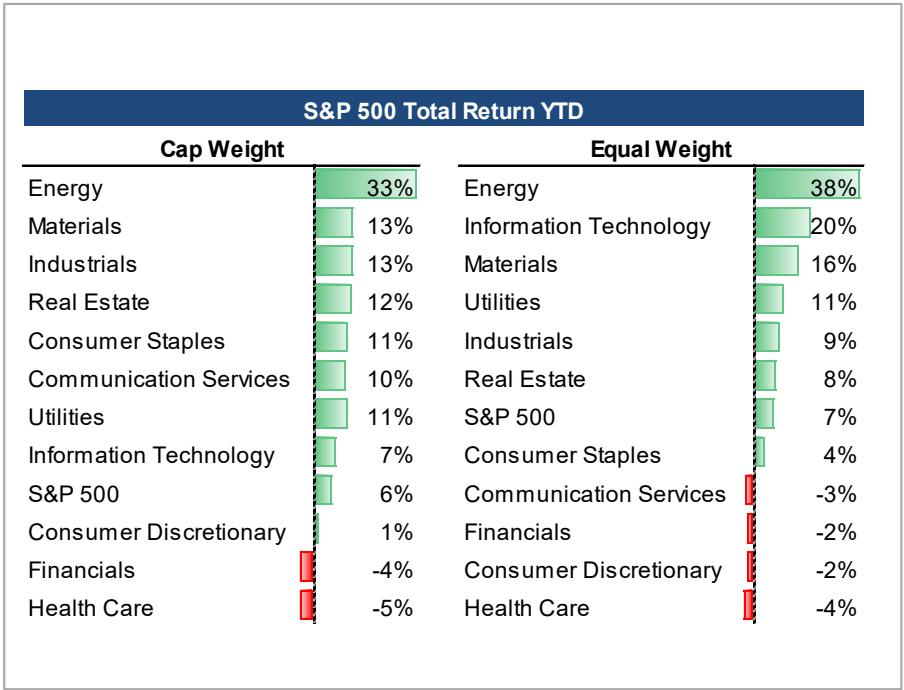

bar

S&P 500 Total Return YTD
| Category | Cap Weight (%) | Equal Weight (%) |
| :--- | :--- | :--- |
| Energy | 33 | 38 |
| Materials | 13 | 20 |
| Industrials | 13 | 16 |
| Real Estate | 12 | 11 |
| Consumer Staples | 11 | 9 |
| Communication Services | 10 | 8 |
| Utilities | 11 | 7 |
| Information Technology | 7 | 4 |
| S&P 500 | 6 | -3 |
| Consumer Discretionary | 1 | -2 |
| Financials | -4 | -2 |
| Health Care | -5 | -4 |

# Outline

Pg. 3 Narrative

Pg. 12 Earnings & Valuation

Pg. 23 Quant

Pg. 27 Sector Views

Pg. 38 Macro & Misc.

# Our Sector Recommendations

Our Sector Recommendations 

<table><tr><td colspan="4">MS Sector Recommendations</td></tr><tr><td>Overweight</td><td>Financials</td><td>Industrials</td><td>Consumer Discretionary Goods</td></tr><tr><td rowspan="3">Equal Weight</td><td>Tech</td><td>Comm. Services</td><td>Health Care</td></tr><tr><td>Materials</td><td>Utilities</td><td>Consumer Services</td></tr><tr><td>Energy</td><td></td><td></td></tr><tr><td>Underweight</td><td>Staples</td><td>Real Estate</td><td></td></tr></table>

# Overweight: Industrials

- Earnings revisions and macro indicators for Capital Goods and Transports have inflected higher, despite geopolitical and tariff-related risks.   
- Manufacturing data remain supportive: new orders rising, inventories benign, ISM resilient, and backlogs meaningfully improving.   
- Freight spend growth, improving C&I loans, and stabilizing short-cycle revenues signal a healthier industrial demand backdrop.   
- Capex growth is accelerating, driven by earnings recovery, fiscal tailwinds, data-center buildout, and reshoring dynamics.

Capex Growth Picking Up for Both the Mag 7 and S&P 493   
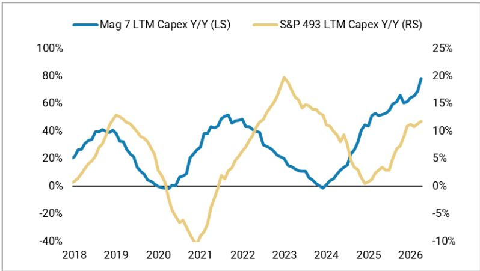

line

| Year | Mag 7 LTM Capex Y/Y (LS) | S&P 493 LTM Capex Y/Y (RS) |
|------|--------------------------|----------------------------|
| 2018 | ~20%                     | ~0%                        |
| 2019 | ~40%                     | ~50%                       |
| 2020 | ~0%                      | ~-10%                      |
| 2021 | ~40%                     | ~-40%                      |
| 2022 | ~50%                     | ~10%                       |
| 2023 | ~30%                     | ~20%                       |
| 2024 | ~0%                      | ~-5%                       |
| 2025 | ~50%                     | ~10%                       |
| 2026 | ~80%                     | ~15%                       |

Industrial Loan Growth on the Rise   
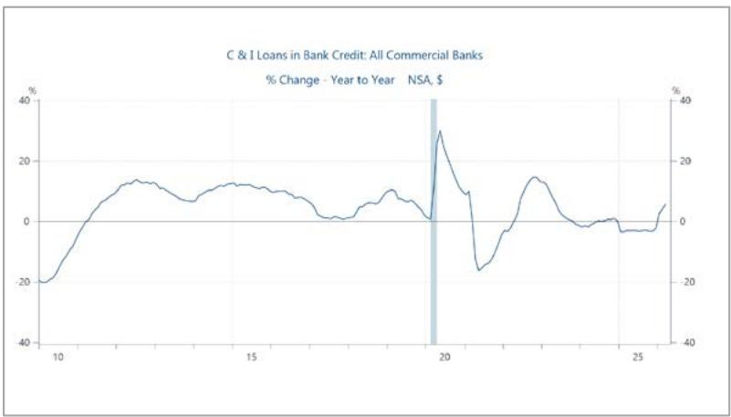

line

| Year | % Change |
|------|----------|
| 10   | -20      |
| 15   | 10       |
| 20   | 30       |
| 25   | 0        |

ISM Manufacturing PMI Has Held Up Well Despite the Geopolitical Risks   
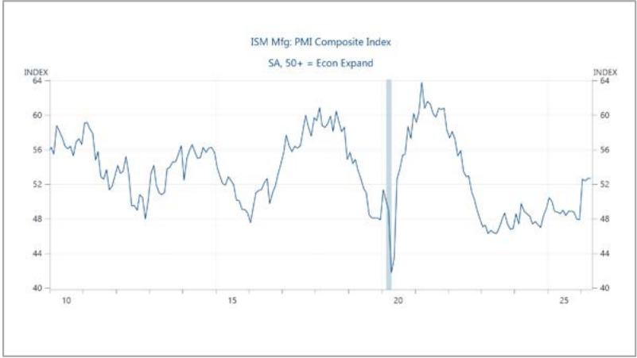

line

| Index | Value |
|-------|-------|
| 10    | 56    |
| 15    | 48    |
| 20    | 40    |
| 25    | 52    |

# Overweight: Financials

- Banks hold a significant amount of excess capital and our MS Banks team models this to expand with Basell III Endgame and GSIB surcharge revisions.   
- Forward earnings growth is improving (14%), valuations remain attractive (12x), and earnings revisions breadth has turned positive.   
- Loan growth and SLOOS signal upside momentum, especially for mid-size and regional banks; M&A activity is set to recover.   
- Positioning is extremely light, leaving the excess-capital and earnings-upside narrative largely out of consensus.

We See a Sustained M&A Rebound Ahead   
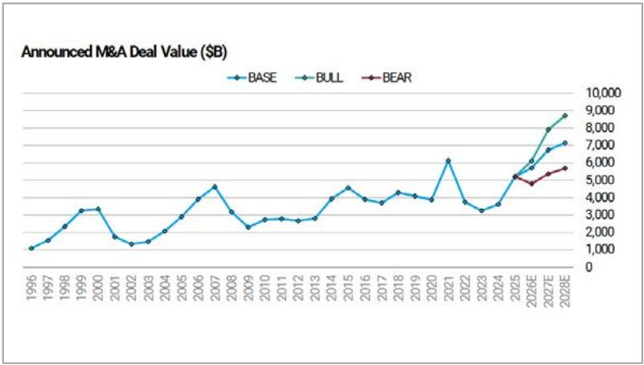

line

| Year   | BASE  | BULL  | BEAR  |
|--------|-------|-------|-------|
| 1996   | 1,000 | -     | -     |
| 1997   | 1,500 | -     | -     |
| 1998   | 2,000 | -     | -     |
| 1999   | 3,000 | -     | -     |
| 2000   | 3,500 | -     | -     |
| 2001   | 1,500 | -     | -     |
| 2002   | 1,200 | -     | -     |
| 2003   | 1,500 | -     | -     |
| 2004   | 2,000 | -     | -     |
| 2005   | 2,500 | -     | -     |
| 2006   | 3,500 | -     | -     |
| 2007   | 4,500 | -     | -     |
| 2008   | 3,500 | -     | -     |
| 2009   | 2,500 | -     | -     |
| 2010   | 3,000 | -     | -     |
| 2011   | 3,500 | -     | -     |
| 2012   | 3,500 | -     | -     |
| 2013   | 3,500 | -     | -     |
| 2014   | 4,500 | -     | -     |
| 2015   | 4,500 | -     | -     |
| 2016   | 3,500 | -     | -     |
| 2017   | 4,500 | -     | -     |
| 2018   | 4,500 | -     | -     |
| 2019   | 4,500 | -     | -     |
| 2020   | 4,500 | -     | -     |
| 2021   | 6,500 | -     | -     |
| 2022   | 3,500 | -     | -     |
| 2023   | 3,500 | -     | -     |
| 2024   | 3,500 | -     | -     |
| 2025E  | 5,500 | 6,500 | 5,500 |
| 2026E  | 6,500 | 7,500 | 6,500 |
| 2027E  | 7,500 | 8,500 | 7,500 |
| 2028E  | 7,500 | 9,500 | 8,500 |

Banks Earnings Expectations Continue to Rise As Valuation Looks More Attractive   
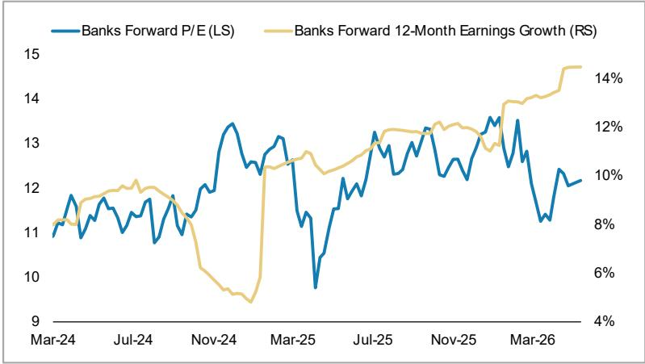

line

| Date   | Banks Forward P/E (LS) | Banks Forward 12-Month Earnings Growth (RS) |
|--------|------------------------|---------------------------------------------|
| Mar-24 | ~11.5                  | ~8%                                         |
| Jul-24 | ~11.8                  | ~10%                                        |
| Nov-24 | ~13.5                  | ~6%                                         |
| Mar-25 | ~10.0                  | ~12%                                        |
| Jul-25 | ~13.0                  | ~12%                                        |
| Nov-25 | ~13.5                  | ~12%                                        |
| Mar-26 | ~12.0                  | ~14%                                        |

Senior Loan Officer Survey Points to C&I Loan Growth in 2026   
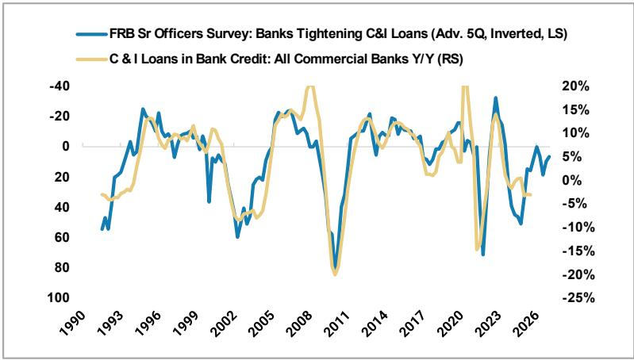

line

| Year | FRB Sr Officers Survey: Banks Tightening C&I Loans (Adv. 5Q, Inverted, LS) | C & I Loans in Bank Credit: All Commercial Banks Y/Y (RS) |
|------|------------------------------------------------------------------------|----------------------------------------------------------|
| 1990 | 60                                                                     | 10%                                                      |
| 1993 | 20                                                                     | -5%                                                      |
| 1996 | -10                                                                    | 5%                                                       |
| 1999 | 0                                                                      | 10%                                                      |
| 2002 | -20                                                                    | -10%                                                     |
| 2005 | 20                                                                     | 5%                                                       |
| 2008 | -10                                                                    | 15%                                                      |
| 2011 | -30                                                                    | -20%                                                     |
| 2014 | -10                                                                    | 5%                                                       |
| 2017 | 0                                                                      | 10%                                                      |
| 2020 | -10                                                                    | -5%                                                      |
| 2023 | -30                                                                    | -15%                                                     |
| 2026 | 0                                                                      | 5%                                                       |

# Overweight: Consumer Discretionary Goods

- U.S. consumer remains resilient despite higher gas prices, supported by high-income spending share and \~\$65B real income tailwind from the OBBBA.   
- Household balance sheets continue improving; labor market is stable, and aggregate consumer earnings expectations are up since Iran conflict.   
- Consumer Staples are more sensitive to energy prices; we prefer Discretionary as earnings revisions breadth re-accelerates.   
- Discretionary Goods benefit from services-to-goods wallet shift, improving pricing, and technical support at long-term relative levels.

Household Liabilities As A Share of Household Assets Continue to Fall   
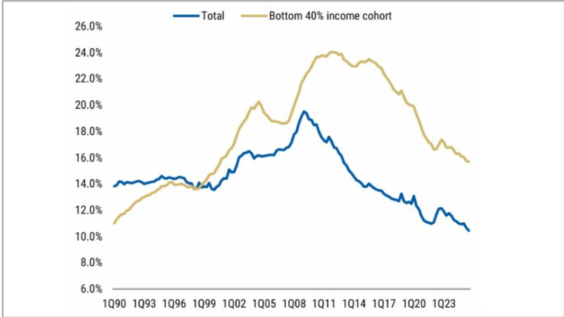

line

| Quarter | Total | Bottom 40% income cohort |
| ------- | ----- | ------------------------ |
| 1Q90    | 14.0% | 11.0%                    |
| 1Q93    | 14.5% | 13.0%                    |
| 1Q96    | 14.0% | 14.0%                    |
| 1Q99    | 13.5% | 14.5%                    |
| 1Q02    | 15.0% | 17.0%                    |
| 1Q05    | 16.5% | 20.0%                    |
| 1Q08    | 19.5% | 24.0%                    |
| 1Q11    | 17.0% | 24.5%                    |
| 1Q14    | 15.0% | 23.5%                    |
| 1Q17    | 13.5% | 22.0%                    |
| 1Q20    | 12.0% | 20.0%                    |
| 1Q23    | 10.5% | 16.0%                    |

Consumer Goods Pricing Is Improving While Consumer Services Pricing Is Decelerating   
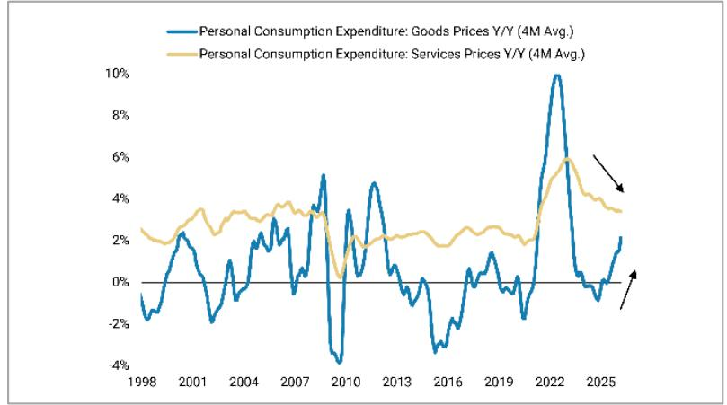

line

| Year | Personal Consumption Expenditure: Goods Prices Y/Y (4M Avg.) | Personal Consumption Expenditure: Services Prices Y/Y (4M Avg.) |
|------|---------------------------------------------------------------|------------------------------------------------------------------|
| 1998 | -1.5%                                                         | 2.5%                                                             |
| 2001 | 2.0%                                                          | 3.0%                                                             |
| 2004 | -1.0%                                                         | 3.5%                                                             |
| 2007 | 3.0%                                                          | 3.5%                                                             |
| 2010 | -4.0%                                                         | 1.5%                                                             |
| 2013 | 4.5%                                                          | 2.0%                                                             |
| 2016 | -3.0%                                                         | 2.5%                                                             |
| 2019 | 1.5%                                                          | 3.0%                                                             |
| 2022 | 10.0%                                                         | 6.0%                                                             |
| 2025 | 2.0%                                                          | 3.5%                                                             |

Higher Income Consumer Drives Large Share of Personal Consumption   
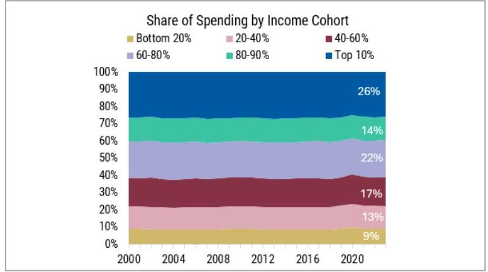

# Underweight: Consumer Staples & Real Estate

- We are underweight Consumer Staples and Real Estate on the back of our view that the rolling recession ended on Liberation Day and that we have begun a new rolling recovery. These sectors are likely to lag on a relative basis, in our view.   
- We have a preference for Cyclicals over Defensives in 2026 as we believe strong operating leverage will drive market broadening.   
- Consumer Staples face headwinds from tariffs, commodity costs, low immigration, and a weakening low-income consumer. Utilities are highly bifurcated between AI-plays and more traditional energy providers.

Staples are More Sensitive to Higher Gas Prices than Discretionary 

<table><tr><td colspan="2">Correlation: Relative Sector Returns Vs. Change in Crude</td></tr><tr><td>Energy</td><td>0.58</td></tr><tr><td>Information Technology</td><td>0.19</td></tr><tr><td>Materials</td><td>0.19</td></tr><tr><td>Communication Services</td><td>0.03</td></tr><tr><td>Real Estate</td><td>-0.09</td></tr><tr><td>Industrials</td><td>-0.11</td></tr><tr><td>Consumer Discretionary</td><td>-0.14</td></tr><tr><td>Health Care</td><td>-0.17</td></tr><tr><td>Financials</td><td>-0.31</td></tr><tr><td>Utilities</td><td>-0.32</td></tr><tr><td>Consumer Staples</td><td>-0.36</td></tr></table>

Cyclical/Defensive Ratio is Signaling an Improving Backdrop   
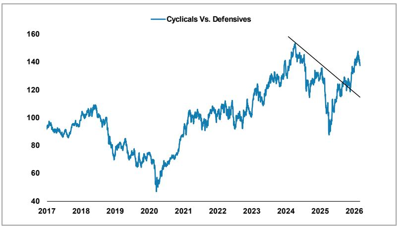

line

| Year | Cyclicals Vs. Defensives |
| ---- | ------------------------ |
| 2017 | ~95                      |
| 2018 | ~105                     |
| 2019 | ~80                      |
| 2020 | ~50                      |
| 2021 | ~100                     |
| 2022 | ~110                     |
| 2023 | ~125                     |
| 2024 | ~155                     |
| 2025 | ~130                     |
| 2026 | ~145                     |

Real Estate Has Held a High Correlation with Rate Moves in Recent Years   
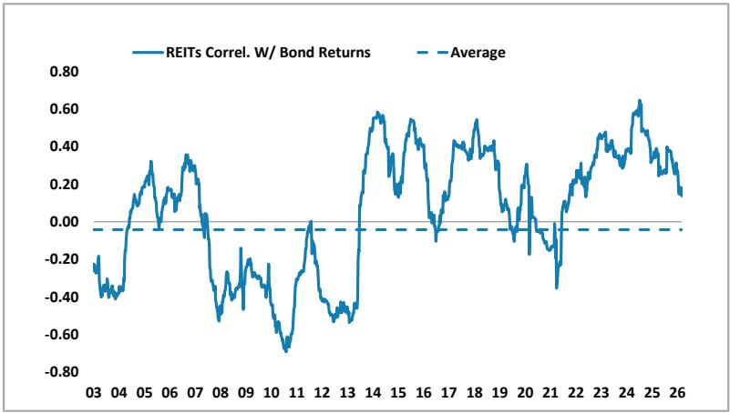

line

| Year | REITs Correl. W/ Bond Returns |
|------|--------------------------------|
| 03   | -0.40                          |
| 04   | -0.20                          |
| 05   | 0.30                           |
| 06   | 0.40                           |
| 07   | 0.35                           |
| 08   | -0.40                          |
| 09   | -0.20                          |
| 10   | -0.60                          |
| 11   | -0.40                          |
| 12   | -0.20                          |
| 13   | 0.60                           |
| 14   | 0.50                           |
| 15   | 0.60                           |
| 16   | 0.40                           |
| 17   | 0.50                           |
| 18   | 0.40                           |
| 19   | 0.30                           |
| 20   | -0.20                          |
| 21   | -0.40                          |
| 22   | 0.30                           |
| 23   | 0.40                           |
| 24   | 0.60                           |
| 25   | 0.50                           |
| 26   | 0.20                           |

# Equal Weights

# Technology

- AI-exposed stocks continue to outperform the broader index as continued capex spend fuels an ongoing investment cycle.   
- Our CIO survey data is expecting a pickup in Tech spending in 2026 across all pockets.   
- The Tech sector is highly levered to labor productivity gains as AI implementation diffuses across the economy.   
- We see the hyperscalers as an attractive relative value trade given their strong forward earnings growth at undemanding valuation levels.

AI Stocks Continue to Outperform   
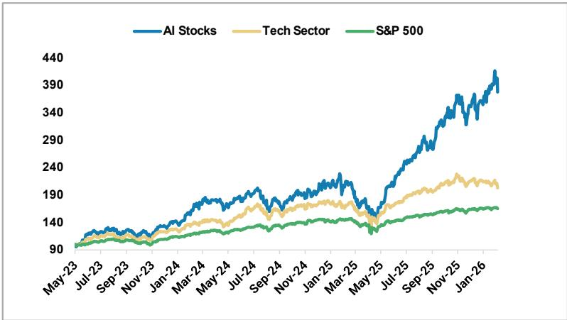

line

| Date   | AI Stocks | Tech Sector | S&P 500 |
|--------|-----------|-------------|---------|
| May-23 | 100       | 95          | 90      |
| Jul-23 | 110       | 100         | 95      |
| Sep-23 | 120       | 110         | 100     |
| Nov-23 | 130       | 120         | 105     |
| Jan-24 | 140       | 130         | 110     |
| Mar-24 | 150       | 140         | 115     |
| May-24 | 160       | 150         | 120     |
| Jul-24 | 170       | 160         | 125     |
| Sep-24 | 180       | 170         | 130     |
| Nov-24 | 190       | 180         | 135     |
| Jan-25 | 200       | 190         | 140     |
| Mar-25 | 190       | 180         | 135     |
| May-25 | 210       | 190         | 145     |
| Jul-25 | 230       | 200         | 150     |
| Sep-25 | 250       | 210         | 155     |
| Nov-25 | 270       | 220         | 160     |
| Jan-26 | 340       | 230         | 165     |

# Healthcare

- Healthcare valuations continue to look cheap on a relative basis and sit within the bottom quintile historically.   
- Biotech tends to perform well in the 6-12 months following a rate.   
- Policy overhangs have reduced which is increasingly reflected in prices (clearer CMS pricing guidance, on-time PDUFAs, and tariff/MFN dynamics). This has brought generalists back into the Healthcare trade from our conversations.

Healthcare Valuations are Historically Low   
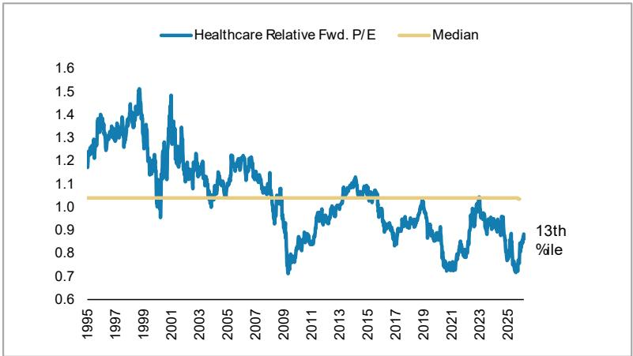

line

| Year | Healthcare Relative Fwd. P/E |
| ---- | ---------------------------- |
| 2025 | 0.7                          |

# Equal Weights

# Utilities

- Utilities are beneficiaries of the GenAI theme and can benefit from increased interest and focus on Energy capacity.   
- Reliable energy sources are increasingly important and the post Covid era has sparked traditional capex spending. Utilities with exposure to both traditional and clean energy ventures are set to benefit and reinvestment could provide further support for the sector.   
- Ultimately, we prefer cyclical over defensive exposures in what we believe is an early cycle environment.

Utilities are a Late Cycle Outperformer   
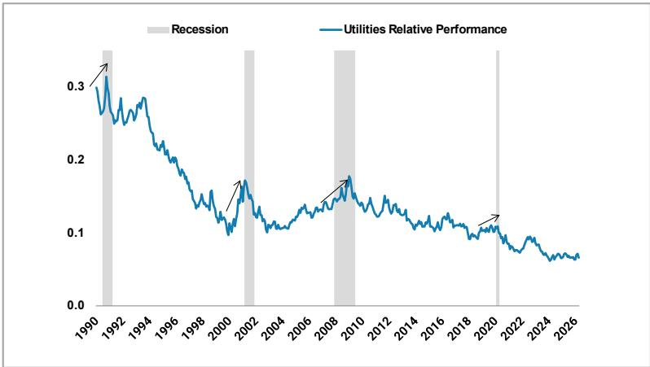

line

| Year | Utilities Relative Performance |
| ---- | ------------------------------ |
| 1990 | 0.3                            |
| 1992 | 0.25                           |
| 1994 | 0.28                           |
| 1996 | 0.22                           |
| 1998 | 0.18                           |
| 2000 | 0.15                           |
| 2002 | 0.17                           |
| 2004 | 0.12                           |
| 2006 | 0.14                           |
| 2008 | 0.16                           |
| 2010 | 0.18                           |
| 2012 | 0.15                           |
| 2014 | 0.13                           |
| 2016 | 0.12                           |
| 2018 | 0.11                           |
| 2020 | 0.1                            |
| 2022 | 0.09                           |
| 2024 | 0.08                           |
| 2026 | 0.07                           |

# Energy

- Energy equities outperformed the index through early March but have lagged on a relative basis as investors moved past peak uncertainty.   
- Geopolitical uncertainty is still high in absolute terms and energy equities could outperform if tensions reignite.   
- FCF margin for the space remains well above its historical average, net debt to EBITDA remains below its long-term run rate and HF net exposure appears under-owned.

Energy Stocks Trade Cheap to the Price of Oil   
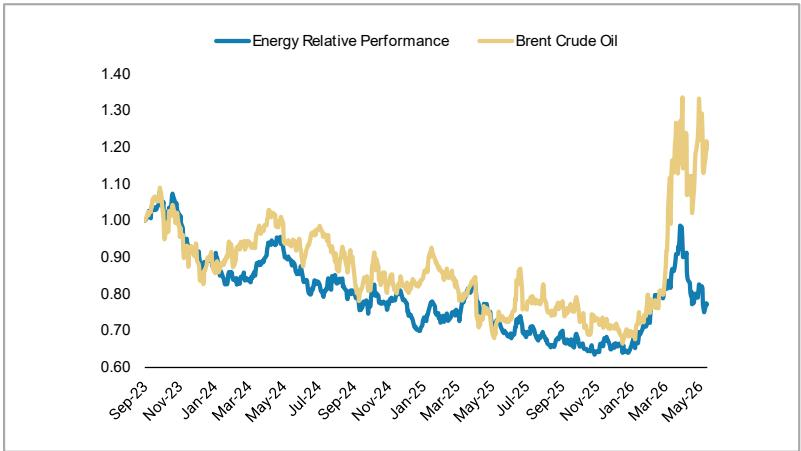

line

| Date   | Energy Relative Performance | Brent Crude Oil |
|--------|-----------------------------|-----------------|
| Sep-23 | 1.05                        | 1.08            |
| Nov-23 | 1.08                        | 1.10            |
| Jan-24 | 0.95                        | 0.98            |
| Mar-24 | 0.92                        | 0.96            |
| May-24 | 0.94                        | 0.97            |
| Jul-24 | 0.88                        | 0.90            |
| Sep-24 | 0.85                        | 0.87            |
| Nov-24 | 0.80                        | 0.83            |
| Jan-25 | 0.75                        | 0.80            |
| Mar-25 | 0.78                        | 0.82            |
| May-25 | 0.76                        | 0.81            |
| Jul-25 | 0.74                        | 0.80            |
| Sep-25 | 0.72                        | 0.78            |
| Nov-25 | 0.70                        | 0.76            |
| Jan-26 | 0.68                        | 0.74            |
| Mar-26 | 0.75                        | 0.85            |
| May-26 | 0.98                        | 1.35            |

# Equal Weights

# Communication Services

- Technology spend and media advertising are both cyclical metrics and winners may be idiosyncratic ahead.   
- A few names take up a large share of the sector and continue to crowd out smaller, incumbent names.   
- Cap-weighted Comm. Services has performed well given the high concentration in megacap stocks. We are watching the equal weighted performance as broader sign.

Communication Services Revisions Breadth Rebounding   
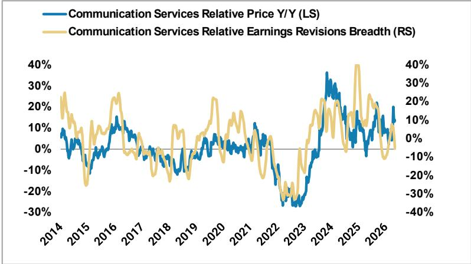

line

| Year | Communication Services Relative Price Y/Y (LS) | Communication Services Relative Earnings Revisions Breadth (RS) |
|------|-----------------------------------------------|---------------------------------------------------------------|
| 2014 | ~10%                                          | ~25%                                                          |
| 2015 | ~-5%                                          | ~-20%                                                         |
| 2016 | ~15%                                          | ~25%                                                          |
| 2017 | ~-5%                                          | ~-10%                                                         |
| 2018 | ~-10%                                         | ~-15%                                                         |
| 2019 | ~-5%                                          | ~-10%                                                         |
| 2020 | ~5%                                           | ~25%                                                          |
| 2021 | ~-5%                                          | ~-10%                                                         |
| 2022 | ~-20%                                         | ~-30%                                                         |
| 2023 | ~-30%                                         | ~-20%                                                         |
| 2024 | ~35%                                          | ~30%                                                          |
| 2025 | ~15%                                          | ~40%                                                          |
| 2026 | ~20%                                          | ~10%                                                          |

# Materials

- Materials are a cyclical sector but are highly sensitive to global growth. The sector is highly dependent on commodity pricing which may not recover in-line with the expected US recovery.   
- Increased capex remains a catalyst for materials and the sector could benefit from the start of a new capex cycle.

Rising Capex is Historically Positive for Materials but GenAI is Causing a Shift in the Type of Capex Spend   
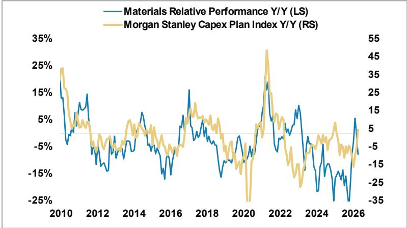

line

| Year | Materials Relative Performance Y/Y (LS) | MS Capex Plan Index Y/Y (RS) |
|------|------------------------------------------|------------------------------------------|
| 2010 | ~25%                                     | ~35                                      |
| 2012 | ~-15%                                    | ~-5                                      |
| 2014 | ~-5%                                     | ~-15                                     |
| 2016 | ~-15%                                    | ~-15                                     |
| 2018 | ~-5%                                     | ~-15                                     |
| 2020 | ~-25%                                    | ~-35                                     |
| 2022 | ~15%                                     | ~45                                      |
| 2024 | ~-15%                                    | ~-15                                     |
| 2026 | ~-25%                                    | ~-15                                     |

# MS Sector Analyst Sentiment Tracker

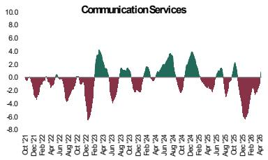

line

| Date    | Value |
|---------|-------|
| Oct '21 | -4.0  |
| Nov '21 | -2.0  |
| Dec '21 | -6.0  |
| Jan '22 | -2.0  |
| Feb '22 | 0.0   |
| Mar '22 | 2.0   |
| Apr '22 | 4.0   |
| May '22 | 6.0   |
| Jun '22 | 8.0   |
| Jul '22 | 10.0  |
| Aug '22 | 8.0   |
| Sep '22 | 6.0   |
| Oct '22 | 4.0   |
| Nov '22 | 2.0   |
| Dec '22 | 0.0   |
| Jan '23 | -2.0  |
| Feb '23 | -4.0  |
| Mar '23 | -6.0  |
| Apr '23 | -8.0  |
| May '23 | -6.0  |
| Jun '23 | -4.0  |
| Jul '23 | -2.0  |
| Aug '23 | 0.0   |
| Sep '23 | 2.0   |
| Oct '23 | 4.0   |
| Nov '23 | 6.0   |
| Dec '23 | 8.0   |
| Jan '24 | 10.0  |
| Feb '24 | 8.0   |
| Mar '24 | 6.0   |
| Apr '24 | 4.0   |
| May '24 | 2.0   |
| Jun '24 | 0.0   |
| Jul '24 | -2.0  |
| Aug '24 | -4.0  |
| Sep '24 | -6.0  |
| Oct '24 | -8.0  |
| Nov '24 | -6.0  |
| Dec '24 | -4.0  |
| Jan '25 | -2.0  |
| Feb '25 | 0.0   |
| Mar '25 | 2.0   |
| Apr '25 | 4.0   |
| May '25 | 6.0   |
| Jun '25 | 8.0   |
| Jul '25 | 10.0  |
| Aug '25 | 8.0   |
| Sep '25 | 6.0   |
| Oct '25 | 4.0   |
| Nov '25 | 2.0   |
| Dec '25 | 0.0   |
| Jan '26 | -2.0  |
| Feb '26 | -4.0  |
| Mar '26 | -6.0  |
| Apr '26 | -8.0  |

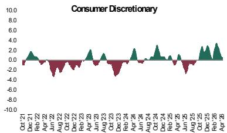

line

| Month   | Value |
|---------|-------|
| Oct 21  | 0.0   |
| Dec 21  | 2.0   |
| Feb 22  | -1.0  |
| Apr 22  | -2.0  |
| Jun 22  | -4.0  |
| Aug 22  | -3.0  |
| Oct 22  | -2.0  |
| Dec 22  | -1.0  |
| Feb 23  | 1.0   |
| Apr 23  | -1.0  |
| Jun 23  | -2.0  |
| Aug 23  | -3.0  |
| Oct 23  | -4.0  |
| Dec 23  | -5.0  |
| Feb 24  | -3.0  |
| Apr 24  | -1.0  |
| Jun 24  | 0.0   |
| Aug 24  | 1.0   |
| Oct 24  | 2.0   |
| Dec 24  | -1.0  |
| Feb 25  | -2.0  |
| Apr 25  | -3.0  |
| Jun 25  | -4.0  |
| Aug 25  | -3.0  |
| Oct 25  | -1.0  |
| Dec 25  | 1.0   |
| Feb 26  | 2.0   |
| Apr 26  | -1.0  |

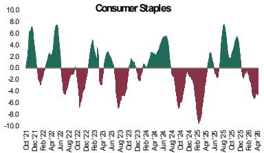

line

| Month   | Value |
|---------|-------|
| Oct '21 | 8.0   |
| Nov '21 | -2.0  |
| Dec '21 | 7.0   |
| Jan '22 | 8.0   |
| Feb '22 | 4.0   |
| Mar '22 | 0.0   |
| Apr '22 | -4.0  |
| May '22 | -6.0  |
| Jun '22 | -8.0  |
| Jul '22 | -6.0  |
| Aug '22 | -4.0  |
| Sep '22 | -2.0  |
| Oct '22 | 0.0   |
| Nov '22 | 4.0   |
| Dec '22 | 6.0   |
| Jan '23 | 8.0   |
| Feb '23 | 4.0   |
| Mar '23 | 2.0   |
| Apr '23 | 0.0   |
| May '23 | -4.0  |
| Jun '23 | -6.0  |
| Jul '23 | -8.0  |
| Aug '23 | -6.0  |
| Sep '23 | -4.0  |
| Oct '23 | -2.0  |
| Nov '23 | 0.0   |
| Dec '23 | 4.0   |
| Jan '24 | 6.0   |
| Feb '24 | 8.0   |
| Mar '24 | 4.0   |
| Apr '24 | 2.0   |
| May '24 | 0.0   |
| Jun '24 | -4.0  |
| Jul '24 | -6.0  |
| Aug '24 | -8.0  |
| Sep '24 | -6.0  |
| Oct '24 | -4.0  |
| Nov '24 | -2.0  |
| Dec '24 | 0.0   |
| Jan '25 | 4.0   |
| Feb '25 | 6.0   |
| Mar '25 | 8.0   |
| Apr '25 | 4.0   |
| May '25 | 2.0   |
| Jun '25 | 0.0   |
| Jul '25 | -4.0  |
| Aug '25 | -6.0  |
| Sep '25 | -8.0  |
| Oct '25 | -6.0  |
| Nov '25 | -4.0  |
| Dec '25 | -2.0  |
| Jan '26 | 0.0   |
| Feb '26 | 4.0   |
| Mar '26 | 6.0   |
| Apr '26 | 8.0   |

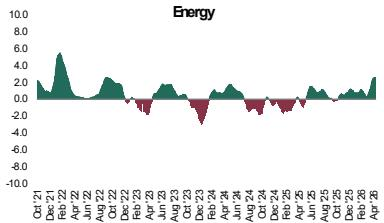

line

| Date     | Value |
|----------|-------|
| Oct-21   | 0.0   |
| Dec-21   | 5.0   |
| Feb-22   | 0.0   |
| Apr-22   | 0.0   |
| Jun-22   | 0.0   |
| Aug-22   | 0.0   |
| Oct-22   | 0.0   |
| Dec-22   | 0.0   |
| Feb-23   | -2.0  |
| Apr-23   | 0.0   |
| Jun-23   | 0.0   |
| Aug-23   | 0.0   |
| Oct-23   | 0.0   |
| Dec-23   | -4.0  |
| Feb-24   | 0.0   |
| Apr-24   | 0.0   |
| Jun-24   | 0.0   |
| Aug-24   | 0.0   |
| Oct-24   | 0.0   |
| Dec-24   | -2.0  |
| Feb-25   | 0.0   |
| Apr-25   | 0.0   |
| Jun-25   | 0.0   |
| Aug-25   | 0.0   |
| Oct-25   | 0.0   |
| Dec-25   | 0.0   |
| Feb-26   | 0.0   |
| Apr-26   | 0.0   |

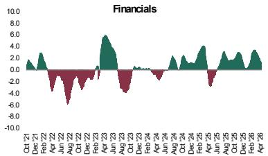

line

| Date   | Value |
|--------|-------|
| Oct '21 | 0.0   |
| Dec '21 | 2.0   |
| Jan '22 | -4.0  |
| Feb '22 | -6.0  |
| Mar '22 | -8.0  |
| Apr '22 | -6.0  |
| May '22 | -4.0  |
| Jun '22 | -2.0  |
| Jul '22 | 0.0   |
| Aug '22 | 2.0   |
| Sep '22 | 4.0   |
| Oct '22 | 6.0   |
| Nov '22 | 8.0   |
| Dec '22 | 10.0  |
| Jan '23 | 8.0   |
| Feb '23 | 6.0   |
| Mar '23 | 4.0   |
| Apr '23 | 2.0   |
| May '23 | 0.0   |
| Jun '23 | -2.0  |
| Jul '23 | -4.0  |
| Aug '23 | -6.0  |
| Sep '23 | -8.0  |
| Oct '23 | -10.0 |
| Nov '23 | -8.0  |
| Dec '23 | -6.0  |
| Jan '24 | -4.0  |
| Feb '24 | -2.0  |
| Mar '24 | 0.0   |
| Apr '24 | 2.0   |
| May '24 | 4.0   |
| Jun '24 | 6.0   |
| Jul '24 | 8.0   |
| Aug '24 | 10.0  |
| Sep '24 | 8.0   |
| Oct '24 | 6.0   |
| Nov '24 | 4.0   |
| Dec '24 | 2.0   |
| Jan '25 | 0.0   |
| Feb '25 | -2.0  |
| Mar '25 | -4.0  |
| Apr '25 | -6.0  |
| May '25 | -8.0  |
| Jun '25 | -10.0 |
| Jul '25 | -8.0  |
| Aug '25 | -6.0  |
| Sep '25 | -4.0  |
| Oct '25 | -2.0  |
| Nov '25 | 0.0   |
| Dec '25 | 2.0   |
| Jan '26 | 4.0   |
| Feb '26 | 6.0   |
| Mar '26 | 8.0   |
| Apr '26 | 10.0  |

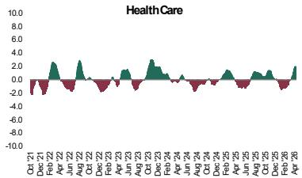

line

| Date     | Value |
|----------|-------|
| Oct '21  | -2.0  |
| Dec '21  | 2.0   |
| Feb '22  | -2.0  |
| Apr '22  | 2.0   |
| Jun '22  | -2.0  |
| Aug '22  | 2.0   |
| Oct '22  | -2.0  |
| Dec '22  | 2.0   |
| Feb '23  | -2.0  |
| Apr '23  | 2.0   |
| Jun '23  | -2.0  |
| Aug '23  | 2.0   |
| Oct '23  | -2.0  |
| Dec '23  | 2.0   |
| Feb '24  | -2.0  |
| Apr '24  | 2.0   |
| Jun '24  | -2.0  |
| Aug '24  | 2.0   |
| Oct '24  | -2.0  |
| Dec '24  | 2.0   |
| Feb '25  | -2.0  |
| Apr '25  | 2.0   |
| Jun '25  | -2.0  |
| Aug '25  | 2.0   |
| Oct '25  | -2.0  |
| Dec '25  | 2.0   |
| Feb '26  | -2.0  |
| Apr '26  | 2.0   |

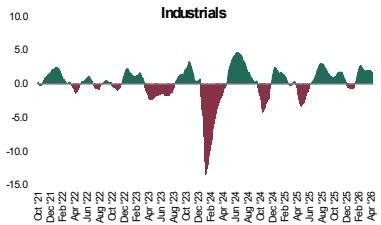

line

| Month   | Value |
|---------|-------|
| Oct 21  | 0.0   |
| Nov 21  | 0.5   |
| Dec 21  | 0.0   |
| Jan 22  | -0.5  |
| Feb 22  | -1.0  |
| Mar 22  | -0.5  |
| Apr 22  | 0.0   |
| May 22  | 0.5   |
| Jun 22  | 0.0   |
| Jul 22  | -0.5  |
| Aug 22  | -1.0  |
| Sep 22  | -0.5  |
| Oct 22  | 0.0   |
| Nov 22  | 0.5   |
| Dec 22  | 0.0   |
| Jan 23  | -0.5  |
| Feb 23  | -1.0  |
| Mar 23  | -0.5  |
| Apr 23  | 0.0   |
| May 23  | 0.5   |
| Jun 23  | 0.0   |
| Jul 23  | -0.5  |
| Aug 23  | -1.0  |
| Sep 23  | -0.5  |
| Oct 23  | 0.0   |
| Nov 23  | 0.5   |
| Dec 23  | -15.0 |
| Jan 24  | -10.0 |
| Feb 24  | -5.0  |
| Mar 24  | -10.0 |
| Apr 24  | -5.0  |
| May 24  | -10.0 |
| Jun 24  | -5.0  |
| Jul 24  | -10.0 |
| Aug 24  | -5.0  |
| Sep 24  | -10.0 |
| Oct 24  | -5.0  |
| Nov 24  | -10.0 |
| Dec 24  | -5.0  |
| Jan 25  | -10.0 |
| Feb 25  | -5.0  |
| Mar 25  | -10.0 |
| Apr 25  | -5.0  |
| May 25  | -10.0 |
| Jun 25  | -5.0  |
| Jul 25  | -10.0 |
| Aug 25  | -5.0  |
| Sep 25  | -10.0 |
| Oct 25  | -5.0  |
| Nov 25  | -10.0 |
| Dec 25  | -5.0  |
| Jan 26  | -10.0 |
| Feb 26  | -5.0  |
| Mar 26  | -10.0 |
| Apr 26  | -5.0  |

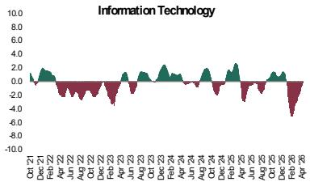

line

| Date     | Value |
| -------- | ----- |
| Oct 21   | 0.0   |
| Dec 21   | 2.0   |
| Feb 22   | -2.0  |
| Apr 22   | -4.0  |
| Jun 22   | -2.0  |
| Aug 22   | -4.0  |
| Oct 22   | -2.0  |
| Dec 22   | -4.0  |
| Feb 23   | -2.0  |
| Apr 23   | -4.0  |
| Jun 23   | -2.0  |
| Aug 23   | -4.0  |
| Oct 23   | -2.0  |
| Dec 23   | -4.0  |
| Feb 24   | -2.0  |
| Apr 24   | -4.0  |
| Jun 24   | -2.0  |
| Aug 24   | -4.0  |
| Oct 24   | -2.0  |
| Dec 24   | -4.0  |
| Feb 25   | -2.0  |
| Apr 25   | -4.0  |
| Jun 25   | -2.0  |
| Aug 25   | -4.0  |
| Oct 25   | -2.0  |
| Dec 25   | -4.0  |
| Feb 26   | -2.0  |
| Apr 26   | -4.0  |

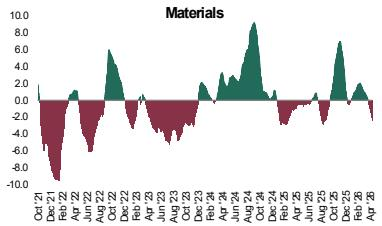

line

| Date     | Value |
|----------|-------|
| Oct '21  | -10.0 |
| Dec '21  | -6.0  |
| Feb '22  | 0.0   |
| Apr '22  | 0.0   |
| Jun '22  | 0.0   |
| Aug '22  | 6.0   |
| Oct '22  | 4.0   |
| Dec '22  | 0.0   |
| Feb '23  | -2.0  |
| Apr '23  | -4.0  |
| Jun '23  | -6.0  |
| Aug '23  | -4.0  |
| Oct '23  | -2.0  |
| Dec '23  | 0.0   |
| Feb '24  | 2.0   |
| Apr '24  | 4.0   |
| Jun '24  | 6.0   |
| Aug '24  | 8.0   |
| Oct '24  | 6.0   |
| Dec '24  | 4.0   |
| Feb '25  | 0.0   |
| Apr '25  | -2.0  |
| Jun '25  | -4.0  |
| Aug '25  | -6.0  |
| Oct '25  | -4.0  |
| Dec '25  | 0.0   |
| Feb '26  | 2.0   |
| Apr '26  | 4.0   |
| Jun '26  | 6.0   |
| Aug '26  | 8.0   |
| Oct '26  | 6.0   |
| Dec '26  | 4.0   |
| Feb '27  | 2.0   |
| Apr '27  | 0.0   |

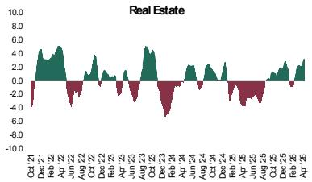

line

| Date   | Value |
|--------|-------|
| Oct '21| -4.0  |
| Dec '21| 4.0   |
| Jan '22| 5.0   |
| Feb '22| 4.5   |
| Mar '22| 3.0   |
| Apr '22| 2.0   |
| May '22| 1.0   |
| Jun '22| -1.0  |
| Jul '22| -2.0  |
| Aug '22| -3.0  |
| Sep '22| -4.0  |
| Oct '22| -3.0  |
| Nov '22| -2.0  |
| Dec '22| -1.0  |
| Jan '23| 0.0   |
| Feb '23| 1.0   |
| Mar '23| 2.0   |
| Apr '23| 3.0   |
| May '23| 4.0   |
| Jun '23| 5.0   |
| Jul '23| 4.5   |
| Aug '23| 3.5   |
| Sep '23| 2.5   |
| Oct '23| 1.5   |
| Nov '23| 0.5   |
| Dec '23| -1.0  |
| Jan '24| -2.0  |
| Feb '24| -3.0  |
| Mar '24| -4.0  |
| Apr '24| -5.0  |
| May '24| -4.5  |
| Jun '24| -3.5  |
| Jul '24| -2.5  |
| Aug '24| -1.5  |
| Sep '24| -0.5  |
| Oct '24| 0.5   |
| Nov '24| 1.5   |
| Dec '24| 2.5   |
| Jan '25| 3.5   |
| Feb '25| 4.5   |
| Mar '25| 5.5   |
| Apr '25| 6.5   |
| May '25| 7.5   |
| Jun '25| 8.5   |
| Jul '25| 9.5   |
| Aug '25| 10.5  |
| Sep '25| 11.5  |
| Oct '25| 12.5  |
| Nov '25| 13.5  |
| Dec '25| 14.5  |
| Jan '26| 15.5  |
| Feb '26| 16.5  |
| Mar '26| 17.5  |
| Apr '26| 18.5  |

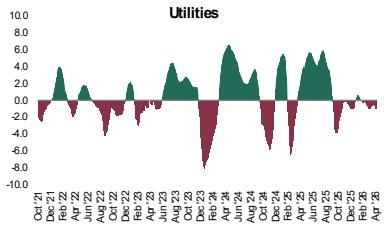

line

| Date   | Value |
|--------|-------|
| Oct '21| -2.0  |
| Dec '21| 4.0   |
| Jan '22| 1.0   |
| Feb '22| -2.0  |
| Mar '22| -4.0  |
| Apr '22| -2.0  |
| May '22| -2.0  |
| Jun '22| -2.0  |
| Jul '22| -2.0  |
| Aug '22| -2.0  |
| Sep '22| -2.0  |
| Oct '22| -2.0  |
| Nov '22| -2.0  |
| Dec '22| -2.0  |
| Jan '23 | -2.0  |
| Feb '23 | -2.0  |
| Mar '23 | -2.0  |
| Apr '23 | -2.0  |
| May '23 | -2.0  |
| Jun '23 | -2.0  |
| Jul '23 | -2.0  |
| Aug '23 | -2.0  |
| Sep '23 | -2.0  |
| Oct '23 | -2.0  |
| Nov '23 | -2.0  |
| Dec '23 | -8.0  |
| Jan '24 | 6.0   |
| Feb '24 | 4.0   |
| Mar '24 | 6.0   |
| Apr '24 | 4.0   |
| May '24 | 6.0   |
| Jun '24 | 4.0   |
| Jul '24 | 6.0   |
| Aug '24 | 4.0   |
| Sep '24 | 6.0   |
| Oct '24 | 4.0   |
| Nov '24 | 6.0   |
| Dec '24 | 4.0   |
| Jan '25 | 6.0   |
| Feb '25 | 4.0   |
| Mar '25 | 6.0   |
| Apr '25 | 4.0   |
| May '25 | 6.0   |
| Jun '25 | 4.0   |
| Jul '25 | 6.0   |
| Aug '25 | 4.0   |
| Sep '25 | 6.0   |
| Oct '25 | 4.0   |
| Nov '25 | 6.0   |
| Dec '25 | 4.0   |
| Jan '26 | 6.0   |
| Feb '26 | 4.0   |
| Mar '26 | 6.0   |
| Apr '26 | 4.0   |

MS Sector Analyst Sentiment Tracker: Our tool captures momentum in analyst sentiment at the sector level, using our proprietary natural language processing model. The tracker is an effective predictor of month-ahead sector performance, and we show how it can add alpha to stock portfolios. For the methodology and full report, see here.

# Outline

Pg. 3 Narrative

Pg. 12 Earnings & Valuation

Pg. 23 Quant

Pg. 27 Sector Views

Pg. 38 Macro & Misc.

# April Sees a Strong Rebound in US Equities Across All Market Caps

YTD & Monthly Performance   
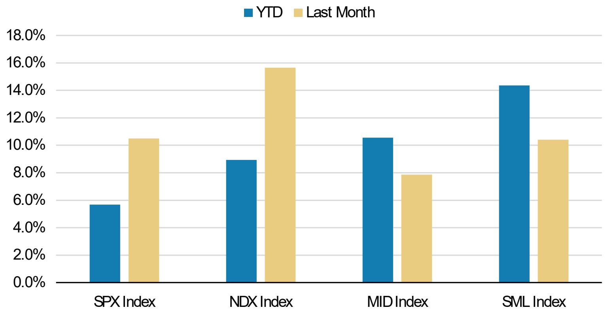

bar

| Index        | YTD    | Last Month |
| ------------ | ------ | ---------- |
| SPX Index    | 5.6%   | 10.4%      |
| NDX Index    | 8.9%   | 15.6%      |
| MID Index    | 10.5%  | 7.8%       |
| SML Index    | 14.3%  | 10.3%      |

# US PMI Snapshot

PMI vs S&P 500   
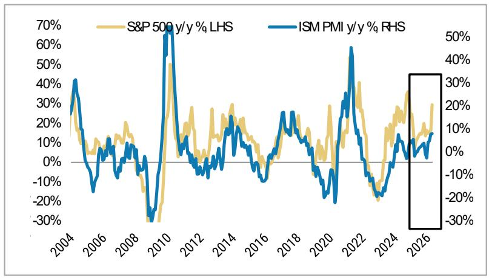

line

| Year | S&P 500 y/y % LHS | ISM PMI y/y % RHS |
|------|-------------------|-------------------|
| 2004 | ~30%              | ~40%              |
| 2006 | ~10%              | ~-10%             |
| 2008 | ~20%              | ~-20%             |
| 2010 | ~50%              | ~70%              |
| 2012 | ~25%              | ~-5%              |
| 2014 | ~30%              | ~-10%             |
| 2016 | ~20%              | ~-15%             |
| 2018 | ~25%              | ~-10%             |
| 2020 | ~30%              | ~-20%             |
| 2022 | ~40%              | ~60%              |
| 2024 | ~35%              | ~-15%             |
| 2026 | ~30%              | ~-10%             |

ISM Services PMI   
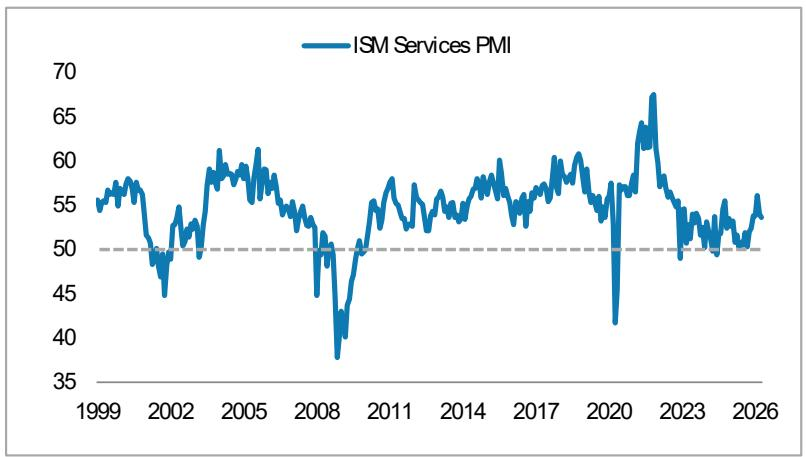

line

| Year | ISM Services PMI |
| ---- | ---------------- |
| 1999 | ~55              |
| 2002 | ~48              |
| 2005 | ~60              |
| 2008 | ~40              |
| 2011 | ~55              |
| 2014 | ~58              |
| 2017 | ~55              |
| 2020 | ~42              |
| 2023 | ~50              |
| 2026 | ~55              |

ISM Manufacturing PMI   
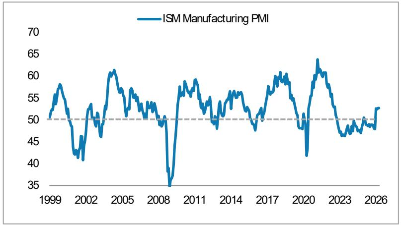

line

| Year | ISM Manufacturing PMI |
| ---- | --------------------- |
| 1999 | ~50                   |
| 2002 | ~45                   |
| 2005 | ~60                   |
| 2008 | ~35                   |
| 2011 | ~55                   |
| 2014 | ~50                   |
| 2017 | ~55                   |
| 2020 | ~40                   |
| 2023 | ~50                   |
| 2026 | ~55                   |

ISM Manufacturing PMI – New Orders   
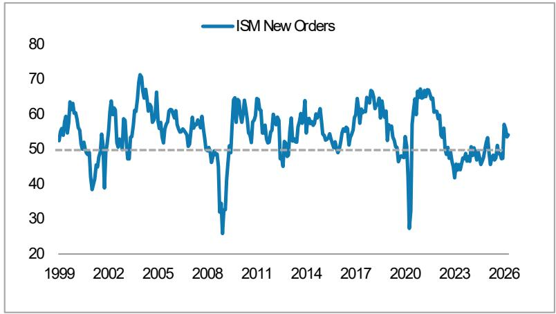

line

| Year | ISM New Orders |
| ---- | -------------- |
| 1999 | ~55            |
| 2000 | ~65            |
| 2001 | ~50            |
| 2002 | ~40            |
| 2003 | ~65            |
| 2004 | ~70            |
| 2005 | ~65            |
| 2006 | ~60            |
| 2007 | ~55            |
| 2008 | ~50            |
| 2009 | ~30            |
| 2010 | ~65            |
| 2011 | ~60            |
| 2012 | ~55            |
| 2013 | ~50            |
| 2014 | ~55            |
| 2015 | ~60            |
| 2016 | ~55            |
| 2017 | ~65            |
| 2018 | ~60            |
| 2019 | ~55            |
| 2020 | ~25            |
| 2021 | ~65            |
| 2022 | ~60            |
| 2023 | ~45            |
| 2024 | ~50            |
| 2025 | ~45            |
| 2026 | ~55            |

# Global Macro Backdrop

G10 Economic Surprises + Inflation Near Neutral   
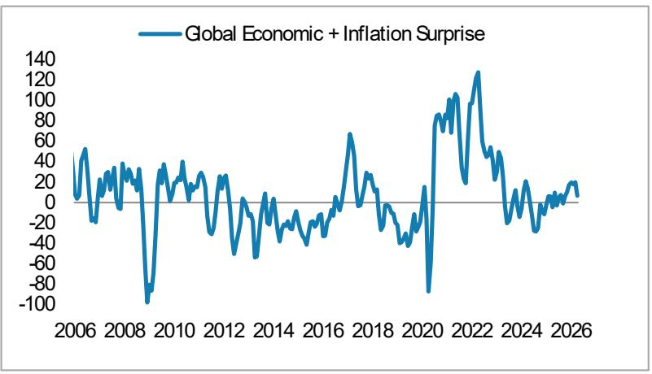

line

| Year | Global Economic + Inflation Surprise |
| ---- | ------------------------------------ |
| 2006 | ~50                                  |
| 2008 | ~30                                  |
| 2010 | ~-90                                 |
| 2012 | ~30                                  |
| 2014 | ~-40                                 |
| 2016 | ~-20                                 |
| 2018 | ~60                                  |
| 2020 | ~-80                                 |
| 2022 | ~130                                 |
| 2024 | ~-20                                 |
| 2026 | ~10                                  |

Global Composite PMI's Are Back to Modest Expansion   
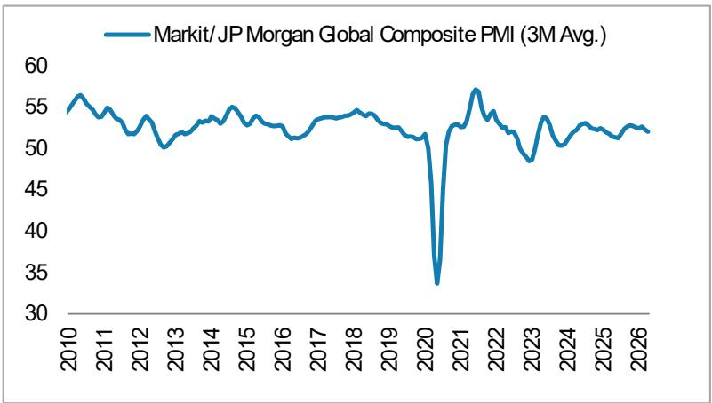

line

| Year | Markit/JPM Global Composite PMI (3M Avg.) |
|------|--------------------------------------------------|
| 2010 | 55.0                                             |
| 2011 | 56.0                                             |
| 2012 | 54.0                                             |
| 2013 | 51.0                                             |
| 2014 | 53.0                                             |
| 2015 | 54.0                                             |
| 2016 | 52.0                                             |
| 2017 | 53.0                                             |
| 2018 | 54.0                                             |
| 2019 | 53.0                                             |
| 2020 | 34.0                                             |
| 2021 | 57.0                                             |
| 2022 | 53.0                                             |
| 2023 | 49.0                                             |
| 2024 | 53.0                                             |
| 2025 | 52.0                                             |
| 2026 | 52.0                                             |

Global Equity Risk Premiums   
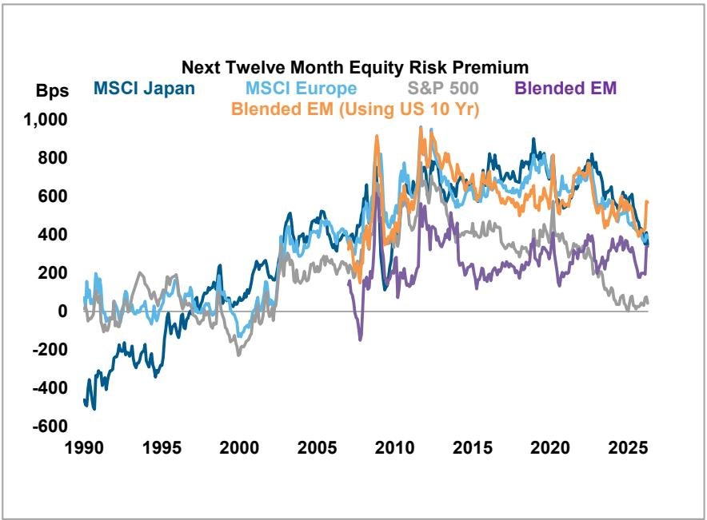

line

| Year | MSCI Japan | MSCI Europe | S&P 500 | Blended EM (Using US 10 Yr) |
|------|------------|-------------|---------|-----------------------------|
| 1990 | -500       | 100         | 0       | 0                           |
| 1995 | -300       | 200         | 100     | 100                         |
| 2000 | 200        | 300         | 200     | 200                         |
| 2005 | 500        | 400         | 300     | 300                         |
| 2010 | 800        | 700         | 600     | 900                         |
| 2015 | 700        | 600         | 500     | 700                         |
| 2020 | 800        | 700         | 600     | 800                         |
| 2025 | 400        | 300         | 200     | 400                         |

# Sentiment Snapshot

US Consumer Sentiment: Univ. of Michigan Survey   
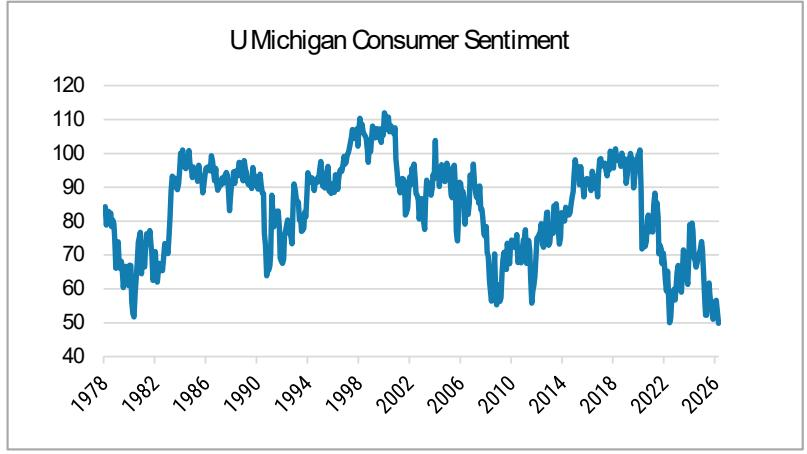

line

| Year | U Michigan Consumer Sentiment |
| ---- | ----------------------------- |
| 1978 | 85                            |
| 1982 | 50                            |
| 1986 | 100                           |
| 1990 | 95                            |
| 1994 | 80                            |
| 1998 | 105                           |
| 2002 | 110                           |
| 2006 | 95                            |
| 2010 | 55                            |
| 2014 | 80                            |
| 2018 | 100                           |
| 2022 | 50                            |
| 2026 | 50                            |

Small Business Sentiment: NFIB Survey   
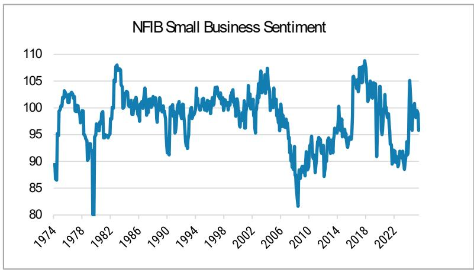

line

| Year | Value |
| ---- | ----- |
| 1974 | 87    |
| 1978 | 103   |
| 1982 | 80    |
| 1986 | 107   |
| 1990 | 101   |
| 1994 | 103   |
| 1998 | 105   |
| 2002 | 107   |
| 2006 | 105   |
| 2010 | 82    |
| 2014 | 95    |
| 2018 | 108   |
| 2022 | 90    |

Investor Sentiment: AAll Bulls Survey   
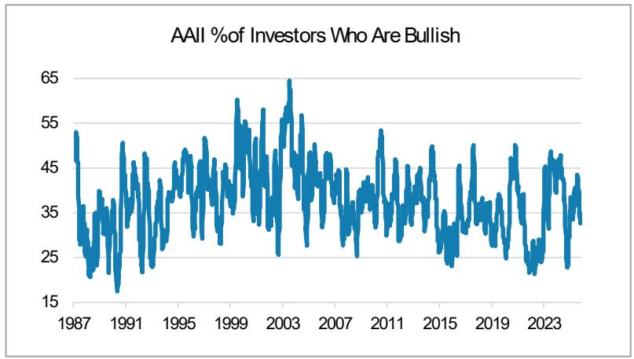

line

| Year | AAll % of Investors Who Are Bullish |
| ---- | ----------------------------------- |
| 1987 | ~45                                 |
| 1991 | ~15                                 |
| 1995 | ~45                                 |
| 1999 | ~55                                 |
| 2003 | ~65                                 |
| 2007 | ~45                                 |
| 2011 | ~50                                 |
| 2015 | ~40                                 |
| 2019 | ~45                                 |
| 2023 | ~40                                 |

Corporate Sentiment: CEO Business Confidence Survey   
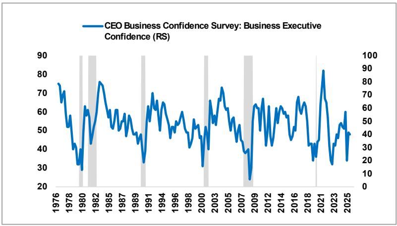

line

| Year | CEO Business Confidence Survey: Business Executive Confidence (RS) |
|------|------------------------------------------------------------------------|
| 1976 | 75                                                                     |
| 1978 | 40                                                                     |
| 1980 | 60                                                                     |
| 1982 | 75                                                                     |
| 1985 | 60                                                                     |
| 1987 | 55                                                                     |
| 1989 | 45                                                                     |
| 1991 | 65                                                                     |
| 1994 | 50                                                                     |
| 1996 | 60                                                                     |
| 1998 | 50                                                                     |
| 2000 | 30                                                                     |
| 2003 | 65                                                                     |
| 2005 | 70                                                                     |
| 2007 | 40                                                                     |
| 2009 | 25                                                                     |
| 2012 | 65                                                                     |
| 2014 | 60                                                                     |
| 2016 | 65                                                                     |
| 2018 | 40                                                                     |
| 2021 | 85                                                                     |
| 2023 | 30                                                                     |
| 2025 | 50                                                                     |

# Liquidity Is Important to Watch in 2026

M2 Money Supply   
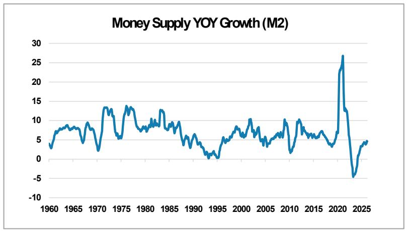

line

| Year | Money Supply YOY Growth (M2) |
| ---- | ---------------------------- |
| 1960 | ~3                           |
| 1965 | ~8                           |
| 1970 | ~13                          |
| 1975 | ~14                          |
| 1980 | ~10                          |
| 1985 | ~13                          |
| 1990 | ~5                           |
| 1995 | ~0                           |
| 2000 | ~8                           |
| 2005 | ~5                           |
| 2010 | ~10                          |
| 2015 | ~7                           |
| 2020 | ~27                          |
| 2025 | ~4                           |

US Liquidity vs S&P 500   
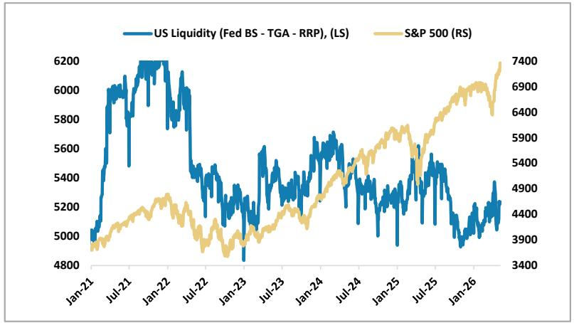

line

| Date   | US Liquidity (Fed BS - TGA - RRP), (LS) | S&P 500 (RS) |
|--------|----------------------------------------|--------------|
| Jan-21 | ~5000                                  | ~3900        |
| Jul-21 | ~6000                                  | ~4400        |
| Jan-22 | ~6200                                  | ~4800        |
| Jul-22 | ~5400                                  | ~4900        |
| Jan-23 | ~5200                                  | ~5000        |
| Jul-23 | ~5600                                  | ~5300        |
| Jan-24 | ~5700                                  | ~5500        |
| Jul-24 | ~5400                                  | ~5700        |
| Jan-25 | ~5300                                  | ~5900        |
| Jul-25 | ~5500                                  | ~6100        |
| Jan-26 | ~4900                                  | ~6900        |
| Mar-26 | ~5200                                  | ~7400        |

M2 vs Commercial Bank Liabilities: Other Deposits   
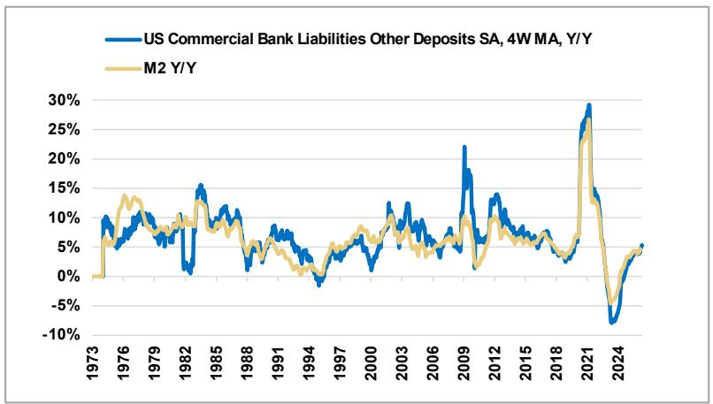

line

| Year | US Commercial Bank Liabilities Other Deposits SA, 4W MA, Y/Y | M2 Y/Y |
|------|---------------------------------------------------------------|--------|
| 1973 | ~5%                                                           | ~0%    |
| 1976 | ~10%                                                          | ~15%   |
| 1979 | ~8%                                                           | ~10%   |
| 1982 | ~15%                                                          | ~8%    |
| 1985 | ~10%                                                          | ~5%    |
| 1988 | ~5%                                                           | ~0%    |
| 1991 | ~8%                                                           | ~5%    |
| 1994 | ~0%                                                           | ~0%    |
| 1997 | ~5%                                                           | ~5%    |
| 2000 | ~10%                                                          | ~5%    |
| 2003 | ~12%                                                          | ~5%    |
| 2006 | ~8%                                                           | ~5%    |
| 2009 | ~22%                                                          | ~5%    |
| 2012 | ~15%                                                          | ~5%    |
| 2015 | ~8%                                                           | ~5%    |
| 2018 | ~5%                                                           | ~5%    |
| 2021 | ~30%                                                          | ~25%   |
| 2024 | ~-8%                                                          | ~-5%   |

Global M2 vs S&P 500   
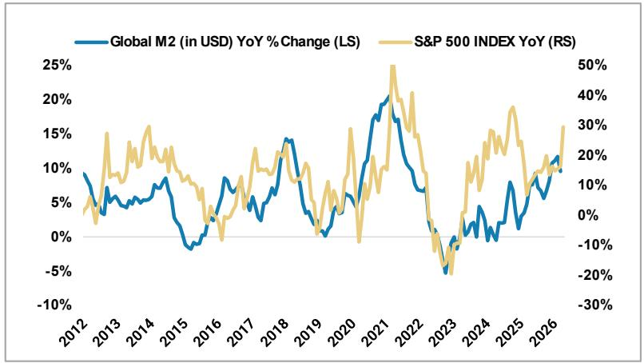

line

| Year | Global M2 (in USD) YoY % Change (LS) | S&P 500 INDEX YoY (RS) |
|------|-------------------------------------|------------------------|
| 2012 | ~9%                                 | ~4%                    |
| 2013 | ~6%                                 | ~15%                   |
| 2014 | ~8%                                 | ~16%                   |
| 2015 | ~-3%                                | ~10%                   |
| 2016 | ~7%                                 | ~5%                    |
| 2017 | ~14%                                | ~10%                   |
| 2018 | ~15%                                | ~15%                   |
| 2019 | ~5%                                 | ~10%                   |
| 2020 | ~10%                                | ~15%                   |
| 2021 | ~20%                                | ~40%                   |
| 2022 | ~15%                                | ~30%                   |
| 2023 | ~-5%                                | ~-20%                  |
| 2024 | ~5%                                 | ~30%                   |
| 2025 | ~10%                                | ~40%                   |
| 2026 | ~15%                                | ~30%                   |

# Investor Leverage Snapshot

FINRA Margin Debt   
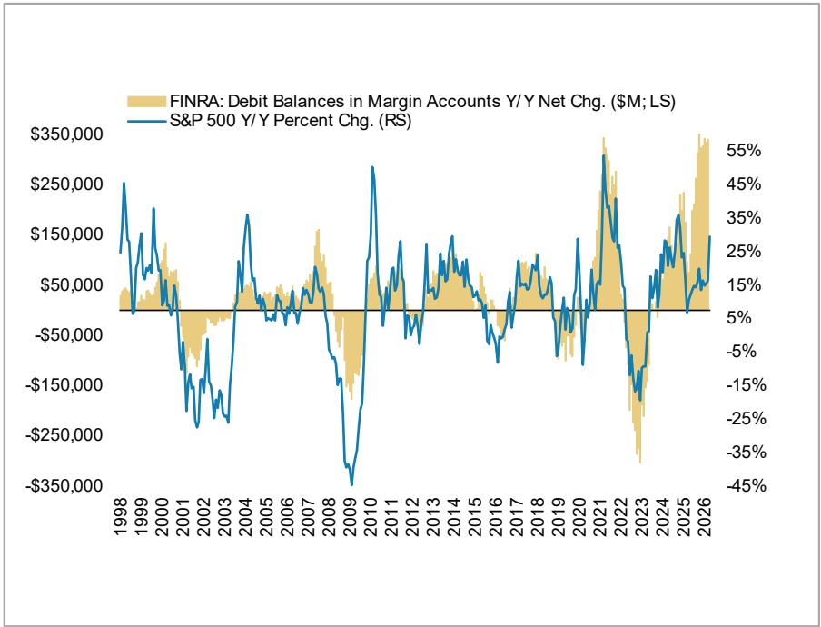

line

| Year | FINRA: Debit Balances in Margin Accounts Y/Y Net Chg. ($M; LS) | S&P 500 Y/Y Percent Chg. (RS) |
|------|------------------------------------------------------------------|-------------------------------|
| 1998 | ~$40,000                                                         | ~5%                           |
| 1999 | ~$150,000                                                        | ~15%                          |
| 2000 | ~$50,000                                                         | ~25%                          |
| 2001 | ~-$50,000                                                        | ~-15%                         |
| 2002 | ~-$150,000                                                       | ~-25%                         |
| 2003 | ~-$150,000                                                       | ~-35%                         |
| 2004 | ~$150,000                                                        | ~15%                          |
| 2005 | ~$50,000                                                         | ~5%                           |
| 2006 | ~$50,000                                                         | ~15%                          |
| 2007 | ~$150,000                                                        | ~25%                          |
| 2008 | ~$15,000                                                         | ~-15%                         |
| 2009 | ~-$350,000                                                       | ~-45%                         |
| 2010 | ~$50,000                                                         | ~5%                           |
| 2011 | ~$15,000                                                         | ~15%                          |
| 2012 | ~$15,000                                                         | ~25%                          |
| 2013 | ~$15,000                                                         | ~-15%                         |
| 2014 | ~$15,000                                                         | ~-5%                          |
| 2015 | ~$15,000                                                         | ~-15%                         |
| 2016 | ~$15,000                                                         | ~-25%                         |
| 2017 | ~$15,000                                                         | ~-35%                         |
| 2018 | ~$15,000                                                         | ~-15%                         |
| 2019 | ~$15,000                                                         | ~-5%                          |
| 2020 | ~$15,000                                                         | ~-15%                         |
| 2021 | ~$35,000                                                         | ~35%                          |
| 2022 | ~$35,000                                                         | ~-15%                         |
| 2023 | ~-$35,000                                                       | ~-35%                         |
| 2024 | ~$15,000                                                         | ~-15%                         |
| 2025 | ~$35,000                                                         | ~35%                          |
| 2026 | ~$35,000                                                         | ~45%                          |

FINRA Debit/Credit Balance   
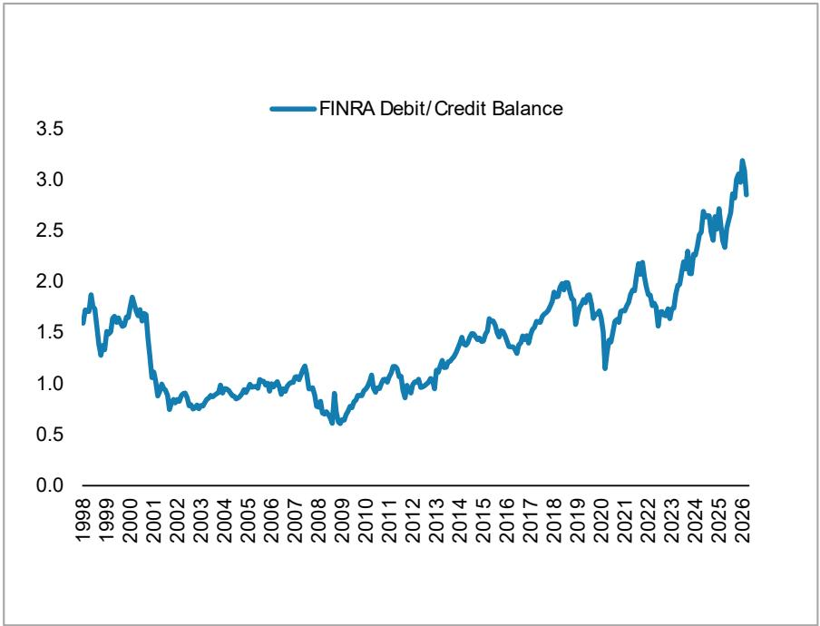

line

| Year | FINRA Debit/Credit Balance |
| ---- | -------------------------- |
| 1998 | 1.7                        |
| 1999 | 1.8                        |
| 2000 | 1.7                        |
| 2001 | 1.0                        |
| 2002 | 0.8                        |
| 2003 | 0.9                        |
| 2004 | 1.0                        |
| 2005 | 1.1                        |
| 2006 | 1.0                        |
| 2007 | 1.1                        |
| 2008 | 0.7                        |
| 2009 | 0.6                        |
| 2010 | 0.9                        |
| 2011 | 1.0                        |
| 2012 | 1.1                        |
| 2013 | 1.2                        |
| 2014 | 1.4                        |
| 2015 | 1.5                        |
| 2016 | 1.6                        |
| 2017 | 1.7                        |
| 2018 | 1.9                        |
| 2019 | 1.8                        |
| 2020 | 1.2                        |
| 2021 | 2.2                        |
| 2022 | 1.7                        |
| 2023 | 2.0                        |
| 2024 | 2.5                        |
| 2025 | 2.7                        |
| 2026 | 3.2                        |

# US Rates Snapshot

Cyclical/Defensive Performance Is Correlated to Rates   
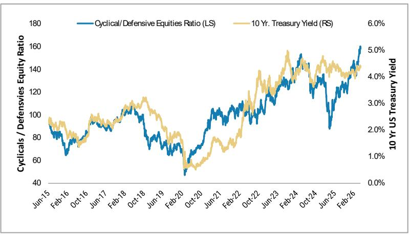

line

| Date   | Cyclical/Defensive Equities Ratio (LS) | 10 Yr. Treasury Yield (RS) |
|--------|----------------------------------------|----------------------------|
| Jun-15 | ~90                                    | ~3.0%                      |
| Feb-16 | ~70                                    | ~2.5%                      |
| Oct-16 | ~85                                    | ~3.5%                      |
| Jun-17 | ~95                                    | ~4.0%                      |
| Feb-18 | ~105                                   | ~4.5%                      |
| Oct-18 | ~110                                   | ~4.0%                      |
| Jun-19 | ~80                                    | ~2.0%                      |
| Feb-20 | ~50                                    | ~1.0%                      |
| Oct-20 | ~70                                    | ~2.5%                      |
| Jun-21 | ~90                                    | ~3.5%                      |
| Feb-22 | ~100                                   | ~4.0%                      |
| Oct-22 | ~110                                   | ~4.5%                      |
| Jun-23 | ~130                                   | ~5.0%                      |
| Feb-24 | ~140                                   | ~4.5%                      |
| Oct-24 | ~130                                   | ~4.0%                      |
| Jun-25 | ~85                                    | ~2.0%                      |
| Feb-26 | ~160                                   | ~4.5%                      |

The Curve is Uninverted and Gradually Steepening   
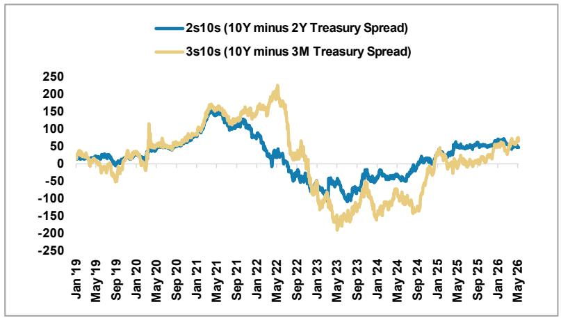

line

| Date   | 2s10s (10Y minus 2Y Treasury Spread) | 3s10s (10Y minus 3M Treasury Spread) |
|--------|--------------------------------------|---------------------------------------|
| Jan '19| ~0                                   | ~0                                    |
| May '19| ~-50                                 | ~-50                                  |
| Sep '19| ~-100                                | ~-100                                 |
| Jan '20| ~-50                                 | ~-50                                  |
| May '20| ~50                                  | ~50                                   |
| Sep '20| ~75                                  | ~75                                   |
| Jan '21| ~100                                 | ~100                                  |
| May '21| ~150                                 | ~150                                  |
| Sep '21| ~175                                 | ~175                                  |
| Jan '22| ~150                                 | ~150                                  |
| May '22| ~100                                 | ~200                                  |
| Sep '22| ~50                                  | ~50                                   |
| Jan '23| ~-50                                 | ~-100                                 |
| May '23| ~-150                                | ~-200                                 |
| Sep '23| ~-100                                | ~-150                                 |
| Jan '24| ~-50                                 | ~-100                                 |
| May '24| ~-75                                 | ~-75                                  |
| Sep '24| ~-50                                 | ~-50                                  |
| Jan '25| ~-25                                 | ~-25                                  |
| May '25| ~50                                  | ~50                                   |
| Sep '25| ~75                                  | ~75                                   |
| Jan '26| ~75                                  | ~75                                   |
| May '26| ~75                                  | ~75                                   |

Real Rates Are Elevated   
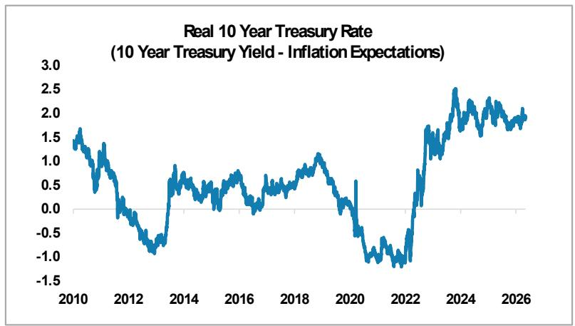

line

| Year | Real 10 Year Treasury Rate |
|------|---------------------------|
| 2010 | 1.5                       |
| 2011 | 1.0                       |
| 2012 | 0.0                       |
| 2013 | -0.5                      |
| 2014 | 0.5                       |
| 2015 | 0.7                       |
| 2016 | 0.5                       |
| 2017 | 0.7                       |
| 2018 | 1.0                       |
| 2019 | 0.5                       |
| 2020 | -0.5                      |
| 2021 | -1.0                      |
| 2022 | -1.5                      |
| 2023 | 1.5                       |
| 2024 | 2.5                       |
| 2025 | 2.0                       |
| 2026 | 1.8                       |

Rate Volatility is Trending Lower but Spiked in February   
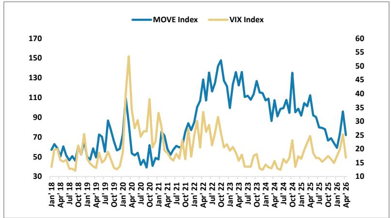

line

| Date    | MOVE Index | VIX Index |
|---------|------------|-----------|
| Jan '18 | 60         | 10        |
| Apr '18 | 55         | 15        |
| Jul '18 | 50         | 20        |
| Oct '18 | 60         | 25        |
| Jan '19 | 55         | 30        |
| Apr '19 | 65         | 35        |
| Jul '19 | 70         | 40        |
| Oct '19 | 80         | 45        |
| Jan '20 | 100        | 55        |
| Apr '20 | 110        | 60        |
| Jul '20 | 90         | 50        |
| Oct '20 | 70         | 40        |
| Jan '21 | 60         | 30        |
| Apr '21 | 50         | 20        |
| Jul '21 | 60         | 30        |
| Oct '21 | 70         | 40        |
| Jan '22 | 80         | 50        |
| Apr '22 | 90         | 60        |
| Jul '22 | 100        | 55        |
| Oct '22 | 110        | 50        |
| Jan '23 | 120        | 45        |
| Apr '23 | 130        | 40        |
| Jul '23 | 140        | 35        |
| Oct '23 | 130        | 30        |
| Jan '24 | 120        | 25        |
| Apr '24 | 110        | 20        |
| Jul '24 | 100        | 15        |
| Oct '24 | 90         | 10        |
| Jan '25 | 80         | 5         |
| Apr '25 | 70         | 10        |
| Jul '25 | 60         | 15        |
| Oct '25 | 50         | 20        |
| Jan '26 | 40         | 25        |
| Apr '26 | 30         | 30        |

# US Equity Market Technicals and Financial Conditions

S&P 500 Cumulative Advance Decline   
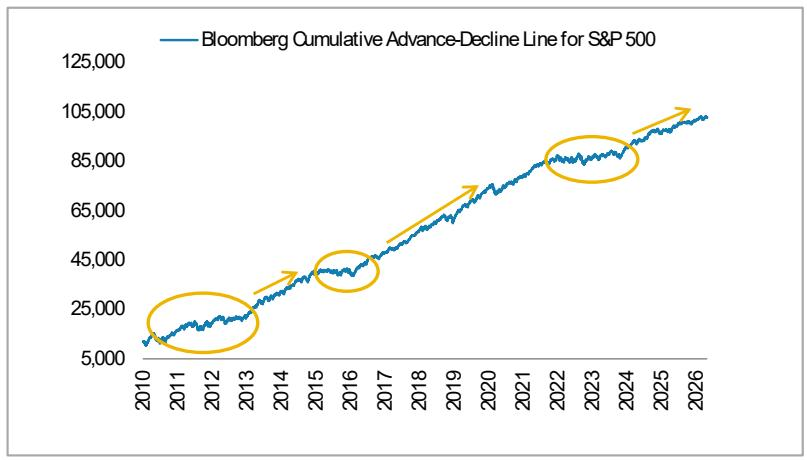

line

| Year | Bloomberg Cumulative Advance Decline Line for S&P 500 |
|------|--------------------------------------------------------|
| 2010 | ~5,000                                                 |
| 2011 | ~15,000                                                |
| 2012 | ~25,000                                                |
| 2013 | ~35,000                                                |
| 2014 | ~45,000                                                |
| 2015 | ~55,000                                                |
| 2016 | ~65,000                                                |
| 2017 | ~75,000                                                |
| 2018 | ~85,000                                                |
| 2019 | ~95,000                                                |
| 2020 | ~105,000                                               |
| 2021 | ~115,000                                               |
| 2022 | ~125,000                                               |
| 2023 | ~135,000                                               |
| 2024 | ~145,000                                               |
| 2025 | ~155,000                                               |
| 2026 | ~165,000                                               |

S&P 500 Percent Members Above 200-Day Moving Average   
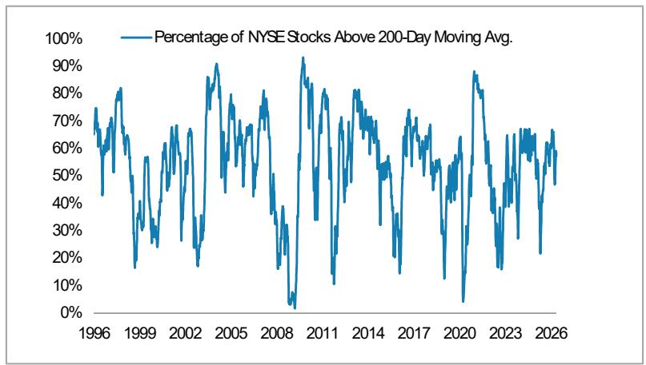

line

| Year | Percentage of NYSE Stocks Above 200-Day Moving Avg. |
|------|--------------------------------------------------------|
| 1996 | ~75%                                                   |
| 1999 | ~30%                                                   |
| 2002 | ~65%                                                   |
| 2005 | ~85%                                                   |
| 2008 | ~10%                                                   |
| 2011 | ~90%                                                   |
| 2014 | ~75%                                                   |
| 2017 | ~65%                                                   |
| 2020 | ~5%                                                    |
| 2023 | ~65%                                                   |
| 2026 | ~60%                                                   |

S&P 500 with Moving Averages   
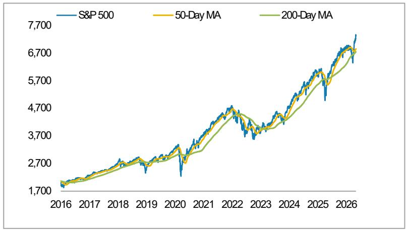

line

| Year | S&P 500 | 50-Day MA | 200-Day MA |
|------|---------|-----------|------------|
| 2016 | ~1,700  | ~1,700    | ~1,700     |
| 2017 | ~2,000  | ~2,000    | ~2,000     |
| 2018 | ~2,500  | ~2,500    | ~2,500     |
| 2019 | ~2,700  | ~2,700    | ~2,700     |
| 2020 | ~3,500  | ~3,500    | ~3,500     |
| 2021 | ~4,500  | ~4,500    | ~4,500     |
| 2022 | ~4,700  | ~4,700    | ~4,700     |
| 2023 | ~3,500  | ~3,500    | ~3,500     |
| 2024 | ~4,500  | ~4,500    | ~4,500     |
| 2025 | ~5,500  | ~5,500    | ~5,500     |
| 2026 | ~6,700  | ~6,700    | ~6,700     |

Chicago Fed National Financial Conditions Index   
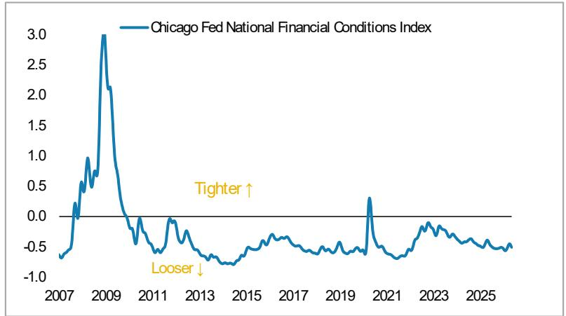

line

| Year | Chicago Fed National Financial Conditions Index |
| ---- | --------------------------------------------- |
| 2007 | -0.6                                          |
| 2008 | 1.0                                           |
| 2009 | 3.0                                           |
| 2010 | 0.0                                           |
| 2011 | -0.5                                          |
| 2012 | -0.3                                          |
| 2013 | -0.4                                          |
| 2014 | -0.5                                          |
| 2015 | -0.4                                          |
| 2016 | -0.3                                          |
| 2017 | -0.4                                          |
| 2018 | -0.5                                          |
| 2019 | -0.4                                          |
| 2020 | 0.3                                           |
| 2021 | -0.6                                          |
| 2022 | -0.4                                          |
| 2023 | -0.3                                          |
| 2024 | -0.4                                          |
| 2025 | -0.5                                          |

# MS Cross Asset Forecasts

Exhibit 9: MS forecasts 

<table><tr><td rowspan="2"></td><td rowspan="2">As of May 08, 2026</td><td colspan="3">Q2 2027 Forecast</td><td colspan="3">Q2 2027 Return Forecast</td><td rowspan="2">Volatility</td><td rowspan="2">Base Case Return/Risk</td></tr><tr><td>Bear</td><td>Base</td><td>Bull</td><td>Bear</td><td>Base</td><td>Bull</td></tr><tr><td>Equities</td><td></td><td></td><td></td><td></td><td colspan="3">Total Returns</td><td></td><td></td></tr><tr><td>S&amp;P 500</td><td>7,399</td><td>5,900</td><td>8,300</td><td>9,400</td><td>-19.2%</td><td>13.3%</td><td>28.1%</td><td>18%</td><td>0.72</td></tr><tr><td>MSCI Europe</td><td>2,426</td><td>1,820</td><td>2,700</td><td>3,020</td><td>-22.0%</td><td>14.3%</td><td>27.5%</td><td>15%</td><td>0.96</td></tr><tr><td>Topix</td><td>3,829</td><td>2,600</td><td>4,300</td><td>4,900</td><td>-30.1%</td><td>14.3%</td><td>30.0%</td><td>19%</td><td>0.77</td></tr><tr><td>MSCI EM</td><td>1,711</td><td>1,100</td><td>1,800</td><td>2,100</td><td>-33.7%</td><td>7.2%</td><td>24.7%</td><td>16%</td><td>0.44</td></tr><tr><td>FX</td><td></td><td></td><td></td><td></td><td colspan="3">Total Returns</td><td></td><td></td></tr><tr><td>JPY*</td><td>157</td><td>163</td><td>156</td><td>145</td><td>-7.2%</td><td>-2.5%</td><td>5.3%</td><td>9%</td><td>-0.28</td></tr><tr><td>EUR</td><td>1.18</td><td>1.00</td><td>1.16</td><td>1.30</td><td>-16.4%</td><td>-2.9%</td><td>9.0%</td><td>7%</td><td>-0.39</td></tr><tr><td>GBP</td><td>1.36</td><td>1.20</td><td>1.34</td><td>1.45</td><td>-11.5%</td><td>-1.2%</td><td>6.8%</td><td>9%</td><td>-0.13</td></tr><tr><td>AUD</td><td>0.72</td><td>0.68</td><td>0.73</td><td>0.76</td><td>-5.2%</td><td>1.7%</td><td>5.8%</td><td>10%</td><td>0.17</td></tr><tr><td>INR*</td><td>94.5</td><td>92.0</td><td>95.0</td><td>100.0</td><td>6.0%</td><td>2.3%</td><td>-2.5%</td><td>5%</td><td>0.48</td></tr><tr><td>ZAR*</td><td>16.4</td><td>15.0</td><td>16.3</td><td>18.7</td><td>12.4%</td><td>3.6%</td><td>-9.2%</td><td>15%</td><td>0.24</td></tr><tr><td>BRL*</td><td>4.89</td><td>4.40</td><td>4.90</td><td>5.40</td><td>19.6%</td><td>8.2%</td><td>-1.0%</td><td>15%</td><td>0.54</td></tr><tr><td>MXN*</td><td>17.2</td><td>16.5</td><td>17.2</td><td>19.5</td><td>7.4%</td><td>3.1%</td><td>-8.6%</td><td>13%</td><td>0.25</td></tr><tr><td>Rates (% percent)</td><td></td><td></td><td></td><td></td><td colspan="3">Total Returns</td><td></td><td></td></tr><tr><td>UST 10yr</td><td>4.36</td><td>5.10</td><td>4.20</td><td>3.55</td><td>-1.2%</td><td>6.0%</td><td>11.5%</td><td>7%</td><td>0.90</td></tr><tr><td>DBR 10yr</td><td>3.00</td><td>3.05</td><td>2.45</td><td>2.40</td><td>3.1%</td><td>8.0%</td><td>8.5%</td><td>6%</td><td>1.41</td></tr><tr><td>UKT 10yr</td><td>4.91</td><td>4.65</td><td>4.40</td><td>4.20</td><td>7.4%</td><td>9.4%</td><td>11.1%</td><td>7%</td><td>1.43</td></tr><tr><td>JGB 10yr</td><td>2.47</td><td>3.10</td><td>2.25</td><td>1.40</td><td>-1.8%</td><td>5.2%</td><td>12.5%</td><td>3%</td><td>2.06</td></tr><tr><td>Credit (bps)</td><td></td><td></td><td></td><td></td><td colspan="3">Excess Returns</td><td></td><td></td></tr><tr><td>US IG</td><td>77</td><td>125</td><td>90</td><td>70</td><td>-2.0%</td><td>-0.1%</td><td>1.3%</td><td>3%</td><td>-0.03</td></tr><tr><td>US HY</td><td>266</td><td>425</td><td>275</td><td>230</td><td>-3.3%</td><td>1.8%</td><td>3.7%</td><td>5%</td><td>0.33</td></tr><tr><td>EUR IG</td><td>80</td><td>150</td><td>80</td><td>60</td><td>-2.3%</td><td>0.8%</td><td>1.7%</td><td>2%</td><td>0.47</td></tr><tr><td>EUR HY</td><td>273</td><td>500</td><td>300</td><td>225</td><td>-5.4%</td><td>1.0%</td><td>3.6%</td><td>5%</td><td>0.23</td></tr><tr><td>EM $ Sov</td><td>238</td><td>400</td><td>260</td><td>210</td><td>-8.0%</td><td>1.0%</td><td>4.2%</td><td>7%</td><td>0.14</td></tr><tr><td>Sec. Products (bps)</td><td></td><td></td><td></td><td></td><td colspan="3">Excess Returns</td><td></td><td></td></tr><tr><td>US Agency MBS</td><td>19</td><td>40</td><td>20</td><td>15</td><td>-1.1%</td><td>0.1%</td><td>0.4%</td><td>2%</td><td>0.06</td></tr><tr><td>US CMBS AAA</td><td>71</td><td>110</td><td>75</td><td>60</td><td>-3.2%</td><td>0.3%</td><td>1.8%</td><td>2%</td><td>0.20</td></tr><tr><td>US CMBS BBB-</td><td>465</td><td>750</td><td>470</td><td>390</td><td>-23.6%</td><td>4.2%</td><td>12.1%</td><td>3%</td><td>1.21</td></tr><tr><td>Commodities</td><td></td><td></td><td></td><td></td><td colspan="3">Total Returns</td><td></td><td></td></tr><tr><td>Brent</td><td>101</td><td>65</td><td>80</td><td>180</td><td>-19.0%</td><td>-0.3%</td><td>124.4%</td><td>39%</td><td>-0.01</td></tr><tr><td>Copper</td><td>13,515</td><td>10,670</td><td>13,000</td><td>15,609</td><td>-21.6%</td><td>-4.4%</td><td>14.7%</td><td>21%</td><td>-0.21</td></tr><tr><td>Gold</td><td>4,741</td><td>4,250</td><td>5,000</td><td>6,000</td><td>-14.0%</td><td>1.2%</td><td>21.4%</td><td>16%</td><td>0.07</td></tr></table>

Source: Bloomberg, MSCI, MS forecasts; Note: Returns are total returns, except for credit, where we forecast excess returns versus government bonds. Commodity returns are calculated relative to futures to account for carry. Brent spot is shown as front-month contract, while returns are calculated on the Jun-27 contract. Volatility is 10y realized vol. All currency returns are shown as XXXUSD return. \*Currency forecasts shown for USDXXX.

# S&P 500 Adjusted for Inflation – We Are in a Secular Bull Market

S&P 500 / Gold   
Secular Bull Markets vs Secular Bear Markets   
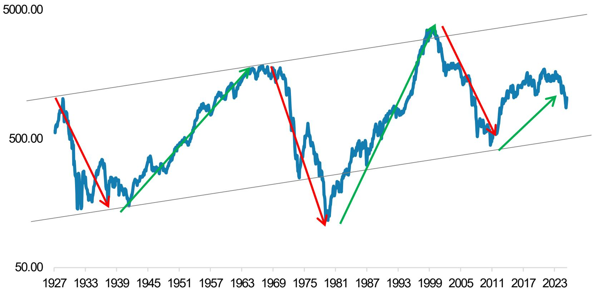

line

| Year | Value  |
|------|--------|
| 1927 | ~500.00 |
| 1933 | ~480.00 |
| 1939 | ~470.00 |
| 1945 | ~485.00 |
| 1951 | ~500.00 |
| 1957 | ~510.00 |
| 1963 | ~520.00 |
| 1969 | ~515.00 |
| 1975 | ~480.00 |
| 1981 | ~470.00 |
| 1987 | ~490.00 |
| 1993 | ~510.00 |
| 1999 | ~530.00 |
| 2005 | ~520.00 |
| 2011 | ~500.00 |
| 2017 | ~515.00 |
| 2023 | ~510.00 |

# Disclosures

# Disclosure Section

The information and opinions in MS were prepared by MS & Co. LLC, and/or MS C.T.V.M. S.A., and/or MS Mexico, Casa de Bolsa, S.A. de C.V., and/or MS Canada Limited. As used in this disclosure section, "MS" includes MS & Co. LLC, MS C.T.V.M. S.A., MS Mexico, Casa de Bolsa, S.A. de C.V., MS Canada Limited and their affiliates as necessary.

For important disclosures, stock price charts and equity rating histories regarding companies that are the subject of this report, please see the MS Disclosure Website at www.morganstanley.com/researchdisclosures, or contact your investment representative or MS at 1585 Broadway, (Attention: Research Management), New York, NY, 10036 USA.

For valuation methodology and risks associated with any recommendation, rating or price target referenced in this research report, please contact the Client Support Team as follows: US/Canada +1 800 303-2495; Hong Kong +852 2848-5999; Latin America +1 718 754-5444 (U.S.); London +44 (0)20-7425-8169; Singapore +65 6834-6860; Sydney +61 (0)2-9770-1505; Tokyo +81 (0)3-6836-9000. Alternatively you may contact your investment representative or MS at 1585 Broadway, (Attention: Research Management), New York, NY 10036 USA.

Analyst Certification

The following analysts hereby certify that their views about the companies and their securities discussed in this report are accurately expressed and that they have not received and will not receive direct or indirect compensation in exchange for expressing specific recommendations or views in this report: Diane Ding, Ph.D.; Nicholas Lentini, CFA; Andrew B Pauker; Michelle M. Weaver, CFA; Michael J Wilson.

# Global Research Conflict Management Policy

MS has been published in accordance with our conflict management policy, which is available at www.morganstanley.com/institutional/research/conflictpolicies. A Portuguese version of the policy can be found at www.morganstanley.com.br

# Important Regulatory Disclosures on Subject Companies

The equity research analysts or strategists principally responsible for the preparation of MS have received compensation based upon various factors, including quality of research, investor client feedback, stock picking, competitive factors, firm revenues and overall investment banking revenues. Equity Research analysts' or strategists' compensation is not linked to investment banking or capital markets transactions performed by MS or the profitability or revenues of particular trading desks.

MS and its affiliates do business that relates to companies/instruments covered in MS, including market making, providing liquidity, fund management, commercial banking, extension of credit, investment services and investment banking. MS sells to and buys from customers the securities/instruments of companies covered in MS on a principal basis. MS may have a position in the debt of the Company or instruments discussed in this report. MS trades or may trade as principal in the debt securities (or in related derivatives) that are the subject of the debt research report.

Certain disclosures listed above are also for compliance with applicable regulations in non-US jurisdictions.

# STOCK RATINGS

MS uses a relative rating system using terms such as Overweight, Equal-weight, Not-Rated or Underweight (see definitions below). MS does not assign ratings of Buy, Hold or Sell to the stocks we cover. Overweight, Equal-weight, Not-Rated and Underweight are not the equivalent of buy, hold and sell. Investors should carefully read the definitions of all ratings used in MS. In addition, since MS contains more complete information concerning the analyst's views, investors should carefully read MS, in its entirety, and not infer the contents from the rating alone. In any case, ratings (or research) should not be used or relied upon as investment advice. An investor's decision to buy or sell a stock should depend on individual circumstances (such as the investor's existing holdings) and other considerations.

# Disclosures

# Global Stock Ratings Distribution

(as of April 30, 2026)

The Stock Ratings described below apply to MS's Fundamental Equity Research and do not apply to Debt Research produced by the Firm.

For disclosure purposes only (in accordance with FINRA requirements), we include the category headings of Buy, Hold, and Sell alongside our ratings of Overweight, Equal-weight, Not-Rated and Underweight. MS does not assign ratings of Buy, Hold or Sell to the stocks we cover. Overweight, Equal-weight, Not-Rated and Underweight are not the equivalent of buy, hold, and sell but represent recommended relative weightings (see definitions below). To satisfy regulatory requirements, we correspond Overweight, our most positive stock rating, with a buy recommendation; we correspond Equal-weight and Not-Rated to hold and Underweight to sell recommendations, respectively.

<table><tr><td></td><td colspan="2">Coverage Universe</td><td colspan="3">Investment Banking Clients (IBC)</td><td colspan="2">Other Material Investment Services Clients (MISC)</td></tr><tr><td>Stock Rating Category</td><td>Count</td><td>% of Total</td><td>Count</td><td>% of Total IBC</td><td>% of Rating Category</td><td>Count</td><td>% of Total Other MISC</td></tr><tr><td>Overweight/Buy</td><td>1546</td><td>42%</td><td>467</td><td>51%</td><td>30%</td><td>709</td><td>44%</td></tr><tr><td>Equal-weight/Hold</td><td>1568</td><td>43%</td><td>358</td><td>39%</td><td>23%</td><td>715</td><td>44%</td></tr><tr><td>Not-Rated/Hold</td><td>4</td><td>0%</td><td>0</td><td>0%</td><td>0%</td><td>1</td><td>0%</td></tr><tr><td>Underweight/Sell</td><td>555</td><td>15%</td><td>84</td><td>9%</td><td>15%</td><td>202</td><td>12%</td></tr><tr><td>Total</td><td>3,673</td><td></td><td>909</td><td></td><td></td><td>1627</td><td></td></tr></table>

Data include common stock and ADRs currently assigned ratings. Investment Banking Clients are companies from whom MS received investment banking compensation in the last 12 months. Due to rounding off of decimals, the percentages provided in the "% of total" column may not add up to exactly 100 percent.

# Analyst Stock Ratings

Overweight (O). The stock's total return is expected to exceed the average total return of the analyst's industry (or industry team's) coverage universe, on a risk-adjusted basis, over the next 12-18 months. Equal-weight (E). The stock's total return is expected to be in line with the average total return of the analyst's industry (or industry team's) coverage universe, on a risk-adjusted basis, over the next 12-18 months. Not-Rated (NR). Currently the analyst does not have adequate conviction about the stock's total return relative to the average total return of the analyst's industry (or industry team's) coverage universe, on a risk-adjusted basis, over the next 12-18 months. Underweight (U). The stock's total return is expected to be below the average total return of the analyst's industry (or industry team's) coverage universe, on a risk-adjusted basis, over the next 12-18 months. Unless otherwise specified, the time frame for price targets included in MS is 12 to 18 months.

# Analyst Industry Views

Attractive (A): The analyst expects the performance of his or her industry coverage universe over the next 12-18 months to be attractive vs. the relevant broad market benchmark, as indicated below.

# Disclosures

In-Line (I): The analyst expects the performance of his or her industry coverage universe over the next 12-18 months to be in line with the relevant broad market benchmark, as indicated below.

Cautious (C): The analyst views the performance of his or her industry coverage universe over the next 12-18 months with caution vs. the relevant broad market benchmark, as indicated below.

Benchmarks for each region are as follows: North America - S&P 500; Latin America - relevant MSCI country index or MSCI Latin America Index; Europe - MSCI Europe; Japan - TOPIX; Asia - relevant MSCI country index or MSCI sub-regional index or MSCI AC Asia Pacific ex Japan Index.

Important Disclosures for MS Smith Barney LLC Customers

Important disclosures regarding the relationship between the companies that are the subject of MS and MS Smith Barney LLC or MS or any of their affiliates, are available on the MS Wealth Management disclosure website at www.morganstanley.com/online/researchdisclosures. For MS specific disclosures, you may refer to www.morganstanley.com/researchdisclosures.

Each MS report is reviewed and approved on behalf of MS Smith Barney LLC. This review and approval is conducted by the same person who reviews the research report on behalf of MS. This could create a conflict of interest.

# Other Important Disclosures

MS policy is to update research reports as and when the Research Analyst and Research Management deem appropriate, based on developments with the issuer, the sector, or the market that may have a material impact on the research views or opinions stated therein. In addition, certain Research publications are intended to be updated on a regular periodic basis (weekly/monthly/quarterly/annual) and will ordinarily be updated with that frequency, unless the Research Analyst and Research Management determine that a different publication schedule is appropriate based on current conditions.

MS is not acting as a municipal advisor and the opinions or views contained herein are not intended to be, and do not constitute, advice within the meaning of Section 975 of the Dodd-Frank Wall Street Reform and Consumer Protection Act.

MS produces an equity research product called a "Tactical Idea." Views contained in a "Tactical Idea" on a particular stock may be contrary to the recommendations or views expressed in research on the same stock. This may be the result of differing time horizons, methodologies, market events, or other factors. For all research available on a particular stock, please contact your sales representative or go to Matrix at http://www.morganstanley.com/matrix.

MS is provided to our clients through our proprietary research portal on Matrix and also distributed electronically by MS to clients. Certain, but not all, MS products are also made available to clients through third-party vendors or redistributed to clients through alternate electronic means as a convenience. For access to all available MS, please contact your sales representative or go to Matrix at http://www.morganstanley.com/matrix.

# Disclosures

Any access and/or use of MS is subject to MS's Terms of Use (http://www.morganstanley.com/terms.html). By accessing and/or using MS, you are indicating that you have read and agree to be bound by our Terms of Use (http://www.morganstanley.com/terms.html). In addition you consent to MS processing your personal data and using cookies in accordance with our Privacy Policy and our Global Cookies Policy

(http://www.morganstanley.com/privacy\_pledge.html), including for the purposes of setting your preferences and to collect readership data so that we can deliver better and more personalized service and products to you. To find out more information about how MS processes personal data, how we use cookies and how to reject cookies see our Privacy Policy and our Global Cookies Policy (http://www.morganstanley.com/privacy\_pledge.html).

If you do not agree to our Terms of Use and/or if you do not wish to provide your consent to MS processing your personal data or using cookies please do not access our research.

MS does not provide individually tailored investment advice. MS has been prepared without regard to the circumstances and objectives of those who receive it. MS recommends that investors independently evaluate particular investments and strategies, and encourages investors to seek the advice of a financial adviser. The appropriateness of an investment or strategy will depend on an investor's circumstances and objectives. The securities, instruments, or strategies discussed in MS may not be suitable for all investors, and certain investors may not be eligible to purchase or participate in some or all of them. MS is not an offer to buy or sell or the solicitation of an offer to buy or sell any security/instrument or to participate in any particular trading strategy. The value of and income from your investments may vary because of changes in interest rates, foreign exchange rates, default rates, prepayment rates, securities/instruments prices, market indexes, operational or financial conditions of companies or other factors. There may be time limitations on the exercise of options or other rights in securities/instruments transactions. Past performance is not necessarily a guide to future performance. Estimates of future performance are based on assumptions that may not be realized. If provided, and unless otherwise stated, the closing price on the cover page is that of the primary exchange for the subject company's securities/instruments.

The fixed income research analysts, strategists or economists principally responsible for the preparation of MS have received compensation based upon various factors, including quality, accuracy and value of research, firm profitability or revenues (which include fixed income trading and capital markets profitability or revenues), client feedback and competitive factors. Fixed Income Research analysts', strategists' or economists' compensation is not linked to investment banking or capital markets transactions performed by MS or the profitability or revenues of particular trading desks.

The "Important Regulatory Disclosures on Subject Companies" section in MS lists all companies mentioned where MS owns 1% or more of a class of common equity securities of the companies. For all other companies mentioned in MS, MS may have an investment of less than 1% in securities/instruments or derivatives of securities/instruments of companies and may trade them in ways different from those discussed in MS. Employees of MS not involved in the preparation of MS may have investments in securities/instruments or derivatives of securities/instruments of companies mentioned and may trade them in ways different from those discussed in MS. Derivatives may be issued by MS or associated persons.

With the exception of information regarding MS, MS is based on public information. MS makes every effort to use reliable, comprehensive information, but we make no representation that it is accurate or complete. We have no obligation to tell you when opinions or information in MS change apart from when we intend to discontinue equity research coverage of a subject company. Facts and views presented in MS have not been reviewed by, and may not reflect information known to, professionals in other MS business areas, including investment banking personnel.

MS personnel may participate in company events such as site visits and are generally prohibited from accepting payment by the company of associated expenses unless pre-approved by authorized members of Research management.

MS may make investment decisions that are inconsistent with the recommendations or views in this report.

# Disclosures

To our readers based in Taiwan or trading in Taiwan securities/instruments: Information on securities/instruments that trade in Taiwan is distributed by MS Taiwan Limited ("MSTL"). Such information is for your reference only. The reader should independently evaluate the investment risks and is solely responsible for their investment decisions. MS may not be distributed to the public media or quoted or used by the public media without the express written consent of MS. Any non-customer reader within the scope of Article 7-1 of the Taiwan Stock Exchange Recommendation Regulations accessing and/or receiving MS is not permitted to provide MS to any third party (including but not limited to related parties, affiliated companies and any other third parties) or engage in any activities regarding MS which may create or give the appearance of creating a conflict of interest. Information on securities/instruments that do not trade in Taiwan is for informational purposes only and is not to be construed as a recommendation or a solicitation to trade in such securities/instruments. MSTL may not execute transactions for clients in these securities/instruments.

MS is not incorporated under PRC law and the research in relation to this report is conducted outside the PRC. MS does not constitute an offer to sell or the solicitation of an offer to buy any securities in the PRC. PRC investors shall have the relevant qualifications to invest in such securities and shall be responsible for obtaining all relevant approvals, licenses, verifications and/or registrations from the relevant governmental authorities themselves. Neither this report nor any part of it is intended as, or shall constitute, provision of any consultancy or advisory service of securities investment as defined under PRC law. Such information is provided for your reference only.

MS is disseminated in Brazil by MS C.T.V.M. S.A. located at Av. Brigadeiro Faria Lima, 3600, 6th floor, São Paulo - SP, Brazil; and is regulated by the Comissão de Valores Mobiliários; in Mexico by MS México, Casa de Bolsa, S.A. de C.V which is regulated by Comision Nacional Bancaria y de Valores. Paseo de los Tamarindos 90, Torre 1, Col. Bosques de las Lomas Floor 29, 05120 Mexico City; in Japan by MS MUFG Securities Co., Ltd. and, for Commodities related research reports only, MS Capital Group Japan Co., Ltd; in Hong Kong by MS Asia Limited (which accepts responsibility for its contents) and by MS Bank Asia Limited; in Singapore by MS Asia (Singapore) Pte. (Registration number 199206298Z) and/or MS Asia (Singapore) Securities Pte Ltd (Registration number 200008434H), regulated by the Monetary Authority of Singapore (which accepts legal responsibility for its contents and should be contacted with respect to any matters arising from, or in connection with, MS) and by MS Bank Asia Limited, Singapore Branch (Registration number T14FC0118J); in Australia to "wholesale clients" within the meaning of the Australian Corporations Act by MS Australia Limited A.B.N. 67 003 734 576, holder of Australian financial services license No. 233742, which accepts responsibility for its contents; in Australia to "wholesale clients" and "retail clients" within the meaning of the Australian Corporations Act by MS Wealth Management Australia Pty Ltd (A.B.N. 19 009 145 555, holder of Australian financial services license No. 240813, which accepts responsibility for its contents; in Korea by MS & Co International plc, Seoul Branch; in India by MS India Company Private Limited having Corporate Identification No (CIN) U22990MH1998PTC115305, regulated by the Securities and Exchange Board of India ("SEBI") and holder of licenses as a Research Analyst (SEBI Registration No. INH000001105); Stock Broker (SEBI Stock Broker Registration No. INZ000244438), Merchant Banker (SEBI Registration No. INM000011203), and depository participant with National Securities Depository Limited (SEBI Registration No. IN-DP-NSDL-567-2021) having registered office at Altimus, Level 39 & 40, Pandurang Budhkar Marg, Worli, Mumbai 400018, India; Telephone no. +91-22-61181000; Compliance Officer Details: Mr. Tejarshi Hardas, Tel. No.: +91-22-61181000 or Email:

tejarshi.hardas@morganstanley.com; Grievance officer details: Mr. Tejarshi Hardas, Tel. No.: +91-22-61181000 or Email: msic-compliance@morganstanley.com. MS India Company Private Limited (MSICPL) may use AI tools in providing research services. All recommendations contained herein are made by the duly qualified research analysts; in Canada by MS Canada Limited; in Germany and the European Economic Area where required by MS Europe S.E., authorised and regulated by Bundesanstalt fuer Finanzdienstleistungsaufsicht (BaFin) under the reference number 149169; in the US by MS & Co. LLC, which accepts responsibility for its contents. MS & Co. International plc, authorized by the Prudential Regulation Authority and regulated by the Financial Conduct Authority and the Prudential Regulation Authority, disseminates in the UK research that it has prepared, and research which has been prepared by any of its affiliates, only to persons who (i) are investment professionals falling within Article 19(5) of the Financial Services and Markets Act 2000 (Financial Promotion) Order 2005 (as amended, the "Order"); (ii) are persons who are high net worth entities falling within Article 49(2)(a) to (d) of the Order; or (iii) are persons to whom an invitation or inducement to engage in investment activity (within the meaning of section 21 of the Financial Services and Markets Act 2000, as amended) may otherwise lawfully be communicated or caused to be communicated. RMB MS Proprietary Limited is a member of the JSE Limited and A2X (Pty) Ltd. RMB MS Proprietary Limited is a joint venture owned equally by MS International Holdings Inc. and RMB Investment Advisory (Proprietary) Limited, which is wholly owned by FirstRand Limited. The information in MS is being disseminated by MS Saudi Arabia, regulated by the Capital Market Authority in the Kingdom of Saudi Arabia, and is directed at Sophisticated investors only.

# Disclosures

The information in MS is being communicated by MS & Co. International plc (DIFC Branch), regulated by the Dubai Financial Services Authority (the DFSA) or by MS & Co. International plc (ADGM Branch), regulated by the Financial Services Regulatory Authority Abu Dhabi (the FSRA), and is directed at Professional Clients only, as defined by the DFSA or the FSRA, respectively. The financial products or financial services to which this research relates will only be made available to a customer who we are satisfied meets the regulatory criteria of a Professional Client. A distribution of the different MS Research ratings or recommendations, in percentage terms for Investments in each sector covered, is available upon request from your sales representative.

The information in MS is being communicated by MS & Co. International plc (QFC Branch), regulated by the Qatar Financial Centre Regulatory Authority (the QFCRA), and is directed at business customers and market counterparties only and is not intended for Retail Customers as defined by the QFCRA.

As required by the Capital Markets Board of Turkey, investment information, comments and recommendations stated here, are not within the scope of investment advisory activity. Investment advisory service is provided exclusively to persons based on their risk and income preferences by the authorized firms. Comments and recommendations stated here are general in nature. These opinions may not fit to your financial status, risk and return preferences. For this reason, to make an investment decision by relying solely to this information stated here may not bring about outcomes that fit your expectations.

The trademarks and service marks contained in MS are the property of their respective owners. Third-party data providers make no warranties or representations relating to the accuracy, completeness, or timeliness of the data they provide and shall not have liability for any damages relating to such data. The Global Industry Classification Standard (GICS) was developed by and is the exclusive property of MSCI and S&P.

MS, or any portion thereof may not be reprinted, sold or redistributed without the written consent of MS.

Indicators and trackers referenced in MS may not be used as, or treated as, a benchmark under Regulation EU 2016/1011, or any other similar framework.

The issuers and/or fixed income products recommended or discussed in certain fixed income research reports may not be continuously followed. Accordingly, investors should regard those fixed income research reports as providing stand-alone analysis and should not expect continuing analysis or additional reports relating to such issuers and/or individual fixed income products.

MS may hold, from time to time, material financial and commercial interests regarding the company subject to the Research report.

Registration granted by SEBI and certification from the National Institute of Securities Markets (NISM) in no way guarantee performance of the intermediary or provide any assurance of returns to investors. Investment in securities market are subject to market risks. Read all the related documents carefully before investing.

© 2026 MS

# The Americas

1585 Broadway

New York, NY 10036-8293

United States

+1 212 761 4000

# Europe

20 Bank Street, Canary Wharf

London E14 4AD

United Kingdom

+44 (0)20 7425 8000

# Japan

1-9-7 Otemachi, Chiyoda-ku

Tokyo 100-8104

Japan

+81 (0) 3 6836 5000

# Asia/Pacific

1 Austin Road West

Kowloon

Hong Kong

+852 2848 5200