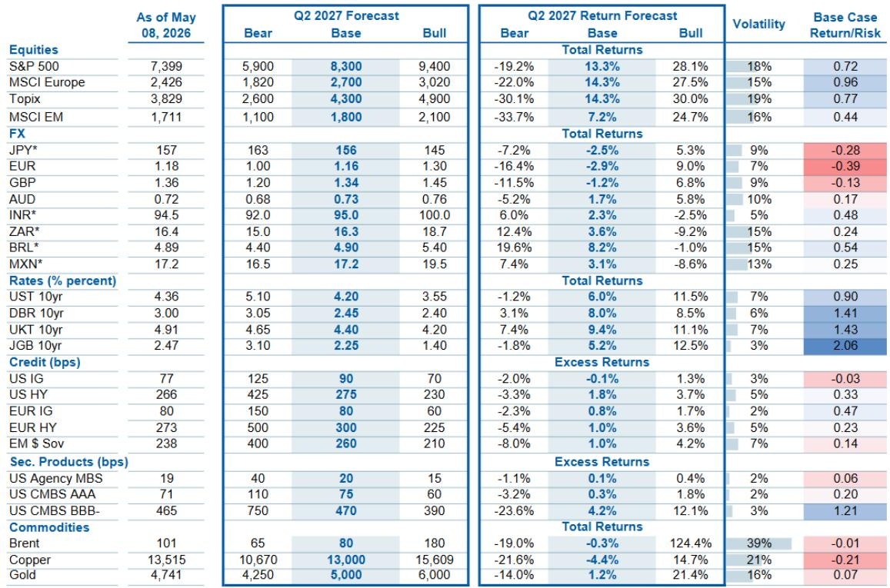

# 市场真正低估的不是AI，而是盈利复苏的广度

过去一年，大部分投资者都把注意力集中在AI主题能否持续、关税冲击何时消退、以及美联储何时降息这三个问题上。这些当然重要，但它们正在让市场错过一个更结构性的变化：美股盈利增长的驱动力正在从“少数巨头的集中爆发”切换为“多数公司的同步复苏”。

某外资投行在2026年5月发布的年中展望中提出了一个核心判断：S&P 500未来12个月的目标价是8300点，基于2027年中滚动EPS达到404美元、估值20.5倍。但比这个数字更值得关注的，是支撑这一目标的逻辑——该机构称之为“滚动复苏”的延续，而这一次，推动力不再是Mag 7，而是S&P 493。

如果你还在用“是否超配科技”来定义自己的美股策略，你可能已经落后于市场正在发生的结构性切换。

## 1. 盈利增长的“接力棒”正在从Mag 7交到S&P 493手中

报告中有一张图表值得反复看：Mag 7与S&P 493的净利润增速对比。2019年，两者的增速差距并不大。但到了2023年和2024年，Mag 7的净利润增速分别达到32%和37%，而同期S&P 493仅增长4%和3%。这是一个极度分化的市场，也是过去两年“只有AI在涨”这一感受的数据来源。

但报告预测，从2026年开始，这一格局将发生逆转。2026年，Mag 7的净利润增速预计为33%，而S&P 493的增速将跃升至14%。到了2027年，两者几乎持平——Mag 7为15%，S&P 493为14%。

这意味着什么？不是Mag 7不行了，而是盈利增长的中心正在扩散。过去两年，S&P 493的盈利几乎原地踏步，估值却被Mag 7的叙事拉高，形成了一种“预期跑在基本面前面”的状态。而现在，基本面正在追赶。对于投资者而言，这意味着超额收益的来源正在从“赌对哪家AI公司能赢”转向“识别哪些行业和公司在盈利复苏中具备定价权”。

## 2. 滚动复苏的真正含义：不是一蹴而就，而是轮动接力

该机构自2024年以来一直强调“滚动复苏”这一框架。这个框架的核心是：经济周期和盈利周期不会在同一个时点对所有行业同步启动，而是像接力赛一样，一个板块跑完一段后，把增长动力交给下一个板块。

报告提供的数据显示，盈利修正的广度已经在2025年4月触底，随后出现V型反弹。同时，该机构的非PMI领先盈利指标正在预测两位数的EPS增长。这些信号指向同一个方向：盈利复苏已经从“少数公司的预期修复”进入了“多数公司的实际兑现”阶段。

但这里有一个容易被忽略的细节：滚动复苏并不意味着所有板块都会涨。它意味着增长动力在轮动，而每一次轮动都会淘汰那些无法在下一阶段获得定价权的公司。换句话说，这不是一个“水涨船高”的故事，而是一个“水位变化后，谁在裸泳”的故事。

## 3. 报告尚未完全回答的问题：估值扩张的空间还有多大

报告给出的8300点目标价对应20.5倍远期PE，而当前S&P 500的PE约为21.2倍。这意味着，该机构对未来12个月涨幅的预期几乎完全来自盈利增长，而非估值扩张。这是一个非常“克制”的假设。

但报告也给出了Bull case：如果估值扩张到21倍，同时盈利超预期，S&P 500可以达到9400点。这比Base case高出13%以上。问题在于：估值扩张的条件是什么？报告没有完全展开。

从逻辑上推断，估值扩张需要两个条件同时成立：第一，盈利增长持续超预期，使当前估值看起来“便宜”；第二，宏观不确定性显著下降，使投资者愿意给更高的风险溢价。目前，关税政策走向、美国中期选举、以及全球经济增长的韧性，都还没有进入“确定性”区间。因此，报告的Base case选择不做估值扩张假设，是一种审慎的选择，但也意味着如果条件成熟，上行空间可能比目标价显示的更大。

## 4. 行业选择背后隐藏的共识：金融、工业、消费是下一阶段的核心

报告明确超配的行业有三个：金融、工业、可选消费（商品类）。这三个行业的共同特征是什么？它们都不是AI的直接受益者，但都是经济活动和资本开支周期回升的直接受益者。

金融板块受益于利率环境稳定和资本市场活动复苏。工业板块受益于制造业回流和基础设施投资。可选消费（商品类）受益于实际工资增长和消费者信心修复。这三个行业的盈利增长，都不需要AI主题的进一步催化，而是依赖于实体经济活动的延续。

这恰恰是“盈利复苏广度”这一判断在行业层面的映射。如果S&P 493的盈利真的在追赶Mag 7，那么金融、工业、消费这些“非AI核心”的板块，应该是最先受益的方向。

但这里有一个值得警惕的地方：报告对科技板块的评级是“等权重”，而非超配。这意味着，尽管该机构仍然看好超大规模云服务商的相对价值（strong forward earnings at undemanding valuations），但对于整个科技板块，他们已经不再认为存在普遍的alpha机会。这一判断与“盈利复苏广度”的逻辑是一致的——当大多数公司的盈利都在改善时，科技板块的相对吸引力自然下降。

## 5. 投资者需要建立的新观察框架：从“AI渗透率”转向“盈利修正广度”

过去两年，很多投资者的决策框架是：AI的渗透率有多高、哪家公司的AI业务增速最快、以及AI资本开支是否还在加速。这个框架在2023-2024年非常有效，但它正在变得不够用。

报告提供的数据显示，S&P 500的盈利修正广度（即上调EPS的公司数量占比）已经在2025年4月触底，随后出现V型反弹。这是一个领先指标，通常领先指数表现6-9个月。如果这个指标继续改善，意味着未来几个季度，将有越来越多的公司公布超预期的盈利。

对于投资者而言，这意味着应该把更多精力放在“哪些公司的盈利正在改善”上，而不是“哪家公司的AI叙事最好”。具体来说，可以关注以下几个维度：

第一，行业层面的盈利修正趋势。金融、工业、可选消费的盈利修正是否在加速？如果答案是肯定的，这些板块的相对表现可能继续跑赢科技。

第二，公司层面的经营杠杆。在通胀缓和、成本压力下降的背景下，哪些公司能够把收入增长转化为利润增长？这比单纯的收入增速更能反映定价能力。

第三，估值与盈利增长的匹配度。当前S&P 493的估值并不便宜，但如果盈利增长真的从3%跃升到14%，那么当前的估值水平可能只是“合理偏贵”，而非“泡沫”。关键在于盈利增长能否兑现。

## 6. 报告最大的伏笔：盈利预测的上行风险有多大

报告中有一张图对比了该机构的Top-down EPS预测与市场的Bottom-up共识预测。2026年，该机构的Top-down预测是339美元，而Bottom-up共识是333美元；2027年，Top-down预测是380美元，而Bottom-up共识是383美元。两者非常接近，但方向略有不同。

更值得关注的是，该机构认为2026年EPS增速为23%，2027年为12%，2028年为13%。这意味着，2026年可能是本轮盈利周期的增速峰值，而2027-2028年将进入一个“高基数上的温和增长”阶段。

但这里有一个尚未完全展开的讨论：如果AI的渗透率加速，或者关税冲击比预期更温和，盈利增速是否会持续高于当前预测？报告没有给出明确的答案，而是留下了Bull case作为上行空间。对于读者来说，这意味着需要跟踪两个关键变量：一是AI对企业生产力的实际提升是否在加速，二是宏观政策的不确定性是否在降低。

这两个变量，一个决定盈利增长的上限，一个决定估值扩张的空间。而它们目前都处于“无法确认但值得密切关注”的状态。

---

以上分析基于某外资投行2026年5月发布的年中展望报告摘要。报告全文包含了更详细的盈利模型假设、行业估值对比、以及量化因子分析，这些内容在本文中没有完全展开。如果你对滚动复苏的具体节奏、金融与工业板块的个股逻辑、或者AI相关股票在当前估值下的相对吸引力感兴趣，欢迎来星球微信群里继续讨论。我们会在群内分享完整报告的解读框架与关键图表，并持续跟踪盈利修正广度等领先指标的变化。

Personal reading notes and learning share only. Not investment advice.

