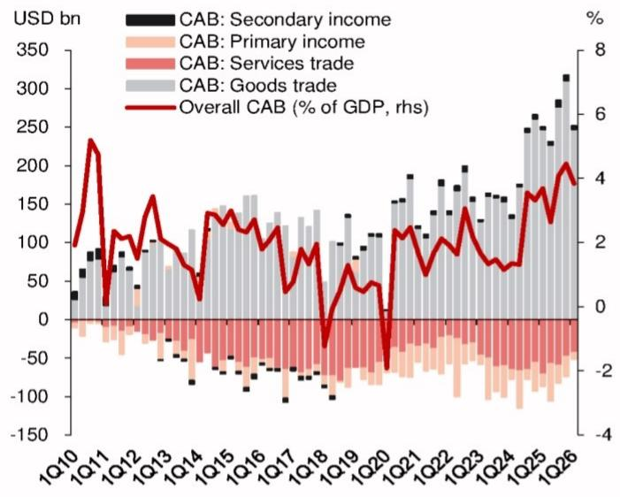

# 中国经常账户顺差反弹：市场低估的不是出口，而是服务逆差的收窄能力

2026年一季度中国经常账户数据出炉。表面看，顺差从2025年四季度的历史高点2420亿美元回落至1840亿美元，似乎印证了“顺差见顶”的预期。但仔细拆解结构会发现，真正超预期的信号并不在货物贸易，而在于服务贸易逆差的显著收缩——从去年同期的720亿美元收窄至440亿美元，其中旅游服务逆差从600亿美元降至470亿美元。这个变化正在重新定义中国经常账户的韧性边界。

某外资投行最新研报指出，一季度经常账户顺差占GDP比例从2025年四季度的4.4%降至3.8%，但仍高于去年同期的3.5%。市场习惯将注意力集中在货物贸易顺差是否会因关税、外需放缓而收窄，但报告揭示了一个被忽视的变量：服务逆差的收窄正在成为经常账户的新支撑。如果这个趋势可持续，中国外部失衡的调整路径可能比市场预期的更为温和。

## 1. 货物贸易顺差的“不变”本身就是一种超预期

一季度货物贸易顺差维持在2470亿美元，与去年同期持平。这个“不变”值得细读。同期海关口径的贸易顺差从2710亿美元略降至2640亿美元，但国际收支口径并未同步收窄。这表明，尽管出口面临外部压力，但进口端的调整同样在发生——进口增速放缓、价格因素、以及统计口径差异共同作用下，顺差并未如市场担忧的那样快速收窄。

报告进一步将2026年全年货物贸易顺差预测从此前的水平上调至11610亿美元，略低于2025年的11850亿美元。这意味着该机构认为全年顺差收窄幅度仅约2%，远低于此前市场普遍预期的5-10%的收缩幅度。对于依赖出口导向的产业链定价而言，这个判断意味着全球对中国出口能力的定价可能偏于悲观。

## 2. 服务逆差收窄：经常账户的真正边际变量

一季度服务贸易逆差收窄至440亿美元，较去年同期的720亿美元收缩了近39%。其中旅游服务逆差从600亿美元降至470亿美元，是最大的贡献项。这个变化的背后，既有出境旅游需求的结构性变化，也可能反映了汇率、消费偏好等更长期因素的调整。

过去十年，中国服务逆差持续扩大，2019年曾超过2600亿美元，成为经常账户的主要拖累。但疫情后，出境游恢复速度并未如预期那样“报复性反弹”，而是呈现出更克制的节奏。如果这种收窄趋势具有持续性，那么经常账户的结构将从“货物顺差覆盖服务逆差”的旧模式，转向“货物顺差依然强劲、服务逆差显著缩小”的新平衡。这对人民币汇率的定价逻辑、以及中国对外资产积累的速度，都会产生实质影响。

报告并未完全解释旅游逆差收窄的具体驱动因素——是汇率抑制了出境消费，还是国内旅游替代效应固化，或是签证政策变化？这里仍需验证。但无论原因如何，一季度数据表明，服务逆差的收窄幅度已经足以影响经常账户的整体走向。

## 3. FDI回暖与组合投资外流的对冲：金融账户的信号矛盾

金融账户方面，一季度外商直接投资（FDI）从去年同期的150亿美元回升至340亿美元，增幅超过一倍。与此同时，对外直接投资（ODI）从500亿美元降至440亿美元。两者合并后，直接投资项下净流出从350亿美元收窄至100亿美元。这个变化值得关注：FDI的回暖是否反映了外资对中国制造业、新能源等领域长期布局的延续？还是仅仅是季度性波动？

另一个不容忽视的信号是组合投资净流出从270亿美元扩大至530亿美元，几乎翻倍。基于境内银行外汇收付款数据的这一指标，反映了跨境证券投资资金流动的加速外流。在直接投资回暖的同时，组合投资外流扩大，说明不同性质的资本对中国资产的态度正在分化。长线产业资本与短期金融资本的定价逻辑出现背离，这给汇率和资本市场带来的影响并不相同。

报告没有进一步拆解组合投资外流的构成——是债券、股票还是其他工具？是主动减持还是被动调整？这些细节对于判断外流是否具有持续性至关重要。

## 4. 报告尚未完全回答的关键问题：服务逆差收窄的可持续性

尽管一季度数据亮眼，但服务逆差收窄的可持续性仍面临几个未解问题。第一，旅游逆差收窄是否包含季节性因素？一季度通常不是出境游旺季，如果下半年出境需求集中释放，逆差可能重新扩大。第二，收窄是否部分源于汇率贬值带来的价格抑制？如果人民币汇率企稳甚至升值，出境消费意愿可能回升。第三，服务贸易的其他子项，如运输、知识产权使用费，是否也会出现类似的收窄趋势？

报告给出了全年经常账户顺差占GDP比例从2025年的3.7%小幅降至3.6%的预测，这个判断暗含了一个假设：服务逆差不会大幅反弹，货物顺差温和收窄。但这两个假设都需要后续数据验证。对于投资者而言，服务逆差的走向将成为判断中国外部平衡是否真正改善的关键观察点。

## 5. 给读者的观察框架：三个需要持续追踪的指标

基于这份报告的逻辑，投资者可以建立三个观测维度来跟踪中国经常账户的真实变化。

第一，货物贸易顺差的月度演变。报告预计全年顺差小幅收窄，但一季度数据并未体现这个趋势。如果未来几个月顺差仍保持高位，意味着市场对出口的悲观预期可能需要修正，相关产业链的估值逻辑也应重新审视。

第二，旅游服务逆差的月度或季度变化。这是最大的不确定变量。如果二季度旅游逆差继续低于600亿美元，则收窄趋势基本确认；如果反弹至700亿美元以上，则一季度数据只是季节性扰动。

第三，FDI与组合投资外流的相对变化。直接投资回暖如果持续，说明外资对中国的产业布局逻辑未变；但组合投资外流若继续扩大，则意味着金融账户的压力可能传导至汇率，进而影响经常账户的货物贸易条件。

这三个指标共同构成了判断中国外部平衡是否进入“新均衡”的判断框架。目前来看，一季度数据指向的是一种比市场预期更温和的调整路径，但可持续性仍需观察。

## 6. 顺着这些未解问题，完整报告提供了更细致的拆解

上述分析只能触及这份研报的冰山一角。关于服务逆差各子项的具体驱动因素、货物贸易顺差的季度节奏假设、以及金融账户下组合投资外流的工具结构，报告都有更细致的图表和论述。这些信息对于判断上述三个观测指标的未来走向至关重要。

欢迎来星球微信群里继续讨论。我们的社群会定期分享这类研报的完整解读，并围绕未解问题展开深度交流。如果你对“服务逆差收窄的可持续性”或“FDI回暖背后的产业信号”感兴趣，群里的讨论可能比报告本身更有启发性。

Personal reading notes and learning share only. Not investment advice.

