# Global Memory

EQUITY: TECHNOLOGY

# Real AI boom is here, embrace the new regime

Expect memory stock re-rating driven by exponential demand growth from AI

# Exponentially growing AI-driven demand vs limited memory supply

The memory industry entered a structural growth phase following the launch of ChatGPT [owned by OpenAI (unlisted)] in December 2022, which triggered considerable growth in GPU and HBM (high-bandwidth memory) demand. SUBSequently, the adoption of Retrieval-Augmented Generation (RAG) and agentic AI applications has accelerated demand for conventional servers and SSDs, and initiated a triple memory super-cycle (commodity DRAM, HBM, and SSD) since 3Q25.

As AI semiconductor demand shifts from training toward inference workloads, memory demand is entering a period of exponential expansion. This reflects the rapid growth in KV-cache memory requirements, driven by increases in user base, user engagement time, AI task complexity (Fig. 6), reasoning-token consumption, and the emergence of agentic AI, where token usage per user is surging exponentially. Memory demand effectively scales as the multiplicative function of these variables (10 x 200 x 30 x 10 x ...), implying that memory demand could rise by several thousand-fold over the next five years, in our view. In contrast, we believe industry supply growth is likely to remain constrained to roughly 5-6x over the same period (CAGR of c.30%), raising serious questions around whether structural undersupply can realistically be resolved.

At present, the industry is attempting to narrow this widening supply-demand gap through multiple software- and architecture-level optimizations, including technologies such as KV-cache compression and selective cache eviction. However, we believe these solutions merely slow the pace of growth rather than reversing the trend. Therefore, every available approach – including NAND offloading (which offers over 100x higher capacity despite slower speeds) and the adoption of ultra-high-bandwidth NAND (HBF) – will likely need to be deployed simultaneously, in our view.

Meanwhile, we believe the rise of agentic AI is significantly improving AI productivity while simultaneously driving a considerable increase in token consumption. Agentic AI is also creating entirely new categories of semiconductor demand, including CPUs and commodity memory. However, these developments ultimately reinforce the usage expansion of AI servers themselves, thereby driving another leg of sUBStantial growth in GPU- and memory-related demand, in our view.

Fig. 1: Memory – stocks for action 

<table><tr><td>Company</td><td>Ticker</td><td>Rating</td><td>Target price (KRW)</td><td>Current price (KRW)</td><td>Upside</td></tr><tr><td>Samsung Electronics</td><td>005930 KS</td><td>Buy</td><td>590,000</td><td>270,500</td><td>118.1%</td></tr><tr><td>SK Hynix</td><td>000660 KS</td><td>Buy</td><td>4,000,000</td><td>1,819,000</td><td>119.9%</td></tr></table>

Note: Share price as of 15 May 2026.   
Source: NOM

(continued on the next page)

# Research Analysts

# Asia Technology

# CW Chung - NIHK

cwchung@NOM.com

+852 2252 6075

# Korea Technology

# Eon Hwang - NFIK

eon.hwang@NOM.com

+822 3783 2318

# YJ Kim, CFA - NFIK

yj.kim1@NOM.com

+82237832332

# AI-based innovations are actually happening and will create a self-reinforcing investment cycle

The advancement of agentic AI could finally unlock a step-function improvement in enterprise productivity. Combined revenue for leading AI software and service vendors such as Anthropic (unlisted), Gemini (provided by Google [GOOGL US, Not rated]), and Open AI could potentially expand by more than 100x over the next five years from the current level of approximately USD70bn, in our view. Until recently, such forecasts appeared detached from reality, but they are increasingly becoming plausible. Anthropic is reportedly expected to achieve a breakeven point by 2027E, while Open AI is targeting profitability around 2029E (link). Despite still generating losses today, these companies are already raising capital at unprecedented valuations, with aggregate equity values now approaching the trillion-dollar range (link 1, link 2).

We believe the revenues and capital generated by these AI service providers will, in turn, flow back to hyperscalers and CSPs such as Amazon (AMZN US, Not rated), Google, and Microsoft (MSFT US, Not rated) through cloud infrastructure spending, thereby creating a powerful self-reinforcing investment cycle in data center expansion. We believe the true Fourth Industrial Revolution is now beginning.

In our view, this transition represents an unprecedented new regime, including AI robots and autonomous driving. We believe the resulting wealth disparities, cross-country gaps, and social/political impacts are likely to exceed current expectations, while institutional and regulatory preparedness remains extremely limited. Nevertheless, AI appears to be an irreversible trend, and the Rubicon has already been crossed. AI's growth trajectory is unlikely to slow organically, in our view. In fact, leading AI experts are increasingly less concerned about whether AI will succeed, and more concerned about whether AI could become excessively powerful.

# LTAs and structural supply shortage to reduce risk premiums and drive re-rating for memory suppliers

Until recently, investors questioned whether LTAs between memory vendors and CSPs (cloud service providers) could truly differ from unsuccessful LTA structures seen in previous cycles, and whether the eventual slowdown of memory price increases could once again become a negative catalyst for stock prices. However, we believe investor perception is now beginning to improve materially. Contracts under the conditions reportedly embedded within current LTAs are progressing not only with CSPs but also with a broad range of memory customers. Three-to-five years of minimum contract periods, prepayments, and capex support commitments appear increasingly common, making cancellation difficult and enhancing binding aspects of contracts, effectively guaranteeing near-current level of profitability.

Importantly, we believe customer demand for HBM and high-performance memory already appears to exceed the industry's mid- to long-term supply capabilities. Therefore, we think the stable earnings outlook for memory vendors is becoming less dependent on LTAs themselves and more anchored by the underlying structural demand environment that effectively forces customers to accept such conditions. In our view, semiconductors are equivalent to AI, and memory is one of the key bottlenecks within the AI value chain.

Against this structural backdrop, we believe memory vendors have entered an unprecedented phase of rapid revenue growth and margin expansion in a short period of time. Over the next 3-5 years, and at minimum through 2027-31F, we expect annual revenue and earnings growth of approximately 30% following 7-8x profit increase in 2026F, backed by: (1) annual volume growth of \~30%, (2) stable or a slight increase in commodity memory prices based on LTAs, and (3) improvement in HBM profitability, converging to that of commodity DRAM, although we believe a likely KRW appreciation impact could reduce reported revenue by 10-20%. We believe this resembles a growth outlook comparable to TSMC's (2330 TT, Buy) 30% CAGR (over 2025-28F), which currently trades at a 12MF P/E of \~20x.

(continued on the next page)

# SEC and Hynix trade at unfairly low valuations; raise TP by factoring in lower risk premiums

For 2027F, which represents year one of this new LTA cycle, we forecast combined OP for Samsung Electronics (SEC; 005930 KS, Buy) and SK Hynix (000660 KS, Buy) to reach multiples of TSMC's expected earnings and sUBStantially exceed those of competitor Micron (MU US, Not rated). However, both SEC and Hynix still trade at a 12MF P/E of \~6x.

We believe this resulting implied risk premium (19% for SEC, 24% for Hynix; calculated as 1/[P/E – risk-free rate], with a risk-free rate of 4%) is unfairly high. Historically, weak shareholder return policies and high earnings volatility justified valuation discounts. However, we believe many of these discount factors are now structurally diminishing, or could largely disappear over at least the next five years.

As highlighted in our pervious report on SEC and Hynix, we expect these discount factors to gradually normalize, resulting in sustained valuation multiple expansion. We now believe the market should increasingly reflect the strength of long-term demand visibility and the durability of the emerging LTA framework, and therefore, we are beginning to incorporate this lower risk premium into our TP.

# Key risks currently being debated by the market regarding memory demand

First, investors continue to question whether CSPs can sustain their aggressive capex, or more fundamentally, whether AI demand could ultimately disappoint

expectations, leading companies such as Anthropic, Open AI, and Gemini (provided by Google) to face monetization or funding challenges that could interrupt the current virtuous cycle. However, we increasingly view such concerns as outdated. We believe AI demand has already passed the singularity point, and its primary drivers are now enterprise and sovereign AI demand. In our view, while CSPs' FCF could temporarily decline, this largely reflects their conviction in future profit generation. In fact, we believe their OCF is already growing materially faster than the market's overly conservative expectations.

# Second, we think there remains significant concern that US data center

construction could proceed more slowly than expected, particularly due to structural power shortages. Going forward, we expect a broad range of new solutions to emerge, including unprecedented innovations in power-efficiency technologies and the mobilization of new energy sources. Nevertheless, we continue to view this issue – particularly in the US – as a meaningful bottleneck risk. Compared with the highly optimized productivity of Asian memory suppliers, US construction sites remain materially slower and less efficient, while the power infrastructure supply chain, which has experienced years of underinvestment, still appears insufficiently prepared for the scale of the current AI-driven expansion cycle, in our view. As a result, we believe the memory industry may need to monitor data center construction progress, even through satellite imagery if needed.

Third, in our view, while direct CSP investment currently accounts for roughly half of total data center investments, a sUBStantial portion of the remaining investment appears to be financed by non-cloud operators leveraging long-term cloud purchase agreements signed with CSPs. These project financing structures are highly sensitive to funding costs. Therefore, if long-term bond yields rise sharply due to inflationary pressures, we believe project-related risks could increase meaningfully. In our view, memory price increases alone could contribute more than 0.8% to the US CPI this year, while higher oil prices driven by the Middle East geopolitical tensions may keep inflation and interest rates elevated for longer than currently expected. However, provided end-demand remains sufficiently strong, we believe refinancing markets should remain accessible even in a higher-rate environment, suggesting there is not yet a need for excessive concern.

(continued on the next page)

Fig. 2: DDR5 spot vs contract price trend   
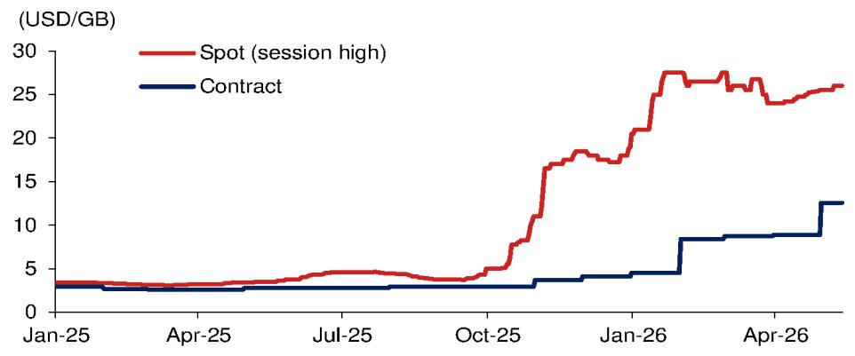

line

| Date   | Spot (session high) | Contract |
|--------|---------------------|----------|
| Jan-25 | 3.0                 | 3.0      |
| Apr-25 | 3.0                 | 3.0      |
| Jul-25 | 4.0                 | 3.0      |
| Oct-25 | 5.0                 | 3.0      |
| Jan-26 | 18.0                | 4.0      |
| Apr-26 | 26.0                | 13.0     |

Note: Spot price based on DDR5 16Gb (2Gx8) 4800/5600 session high prices; contract prices based on DDR5 16GB U-  
DIMM; both prices converted into USD/GB terms.   
Source: DRAMeXchange, NOM

Fig. 3: Global memory sales and y-y growth   
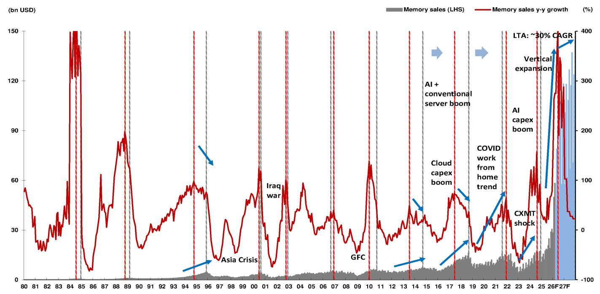

line

| Year | Memory sales (LHS) (bn USD) | Memory sales y-y growth (%) |
|------|------------------------------|-----------------------------|
| 80   | ~0                           | ~50                         |
| 81   | ~0                           | ~30                         |
| 82   | ~0                           | ~20                         |
| 83   | ~0                           | ~40                         |
| 84   | ~0                           | ~150                        |
| 85   | ~0                           | ~140                        |
| 86   | ~0                           | ~10                         |
| 87   | ~0                           | ~30                         |
| 88   | ~0                           | ~60                         |
| 89   | ~0                           | ~90                         |
| 90   | ~0                           | ~20                         |
| 91   | ~0                           | ~30                         |
| 92   | ~0                           | ~40                         |
| 93   | ~0                           | ~50                         |
| 94   | ~0                           | ~60                         |
| 95   | ~0                           | ~70                         |
| 96   | ~0                           | ~80                         |
| 97   | ~0                           | ~10                         |
| 98   | ~0                           | ~20                         |
| 99   | ~0                           | ~30                         |
| 00   | ~0                           | ~40                         |
| 01   | ~0                           | ~50                         |
| 02   | ~0                           | ~60                         |
| 03   | ~0                           | ~70                         |
| 04   | ~0                           | ~60                         |
| 05   | ~0                           | ~50                         |
| 06   | ~0                           | ~40                         |
| 07   | ~0                           | ~30                         |
| 08   | ~0                           | ~20                         |
| 09   | ~0                           | ~10                         |
| 10   | ~0                           | ~5                          |
| 11   | ~0                           | ~3                          |
| 12   | ~0                           | ~2                          |
| 13   | ~0                           | ~1                          |
| 14   | ~0                           | ~0                          |
| 15   | ~0                           | ~1                          |
| 16   | ~0                           | ~2                          |
| 17   | ~0                           | ~3                          |
| 18   | ~0                           | ~4                          |
| 19   | ~0                           | ~5                          |
| 20   | ~0                           | ~6                          |
| 21   | ~0                           | ~7                          |
| 22   | ~0                           | ~8                          |
| 23   | ~0                           | ~9                          |
| 24   | ~0                           | ~10                         |
| 25   | ~0                           | ~15                         |
| 26F  | ~5                           | ~35                         |
| F    | ~15                          | ~45                         |
| F27F | ~25                          | ~45                         |

Source: WSTS, NOM

Fig. 4: SEC – 2026F/27F OP NOM vs BBG   
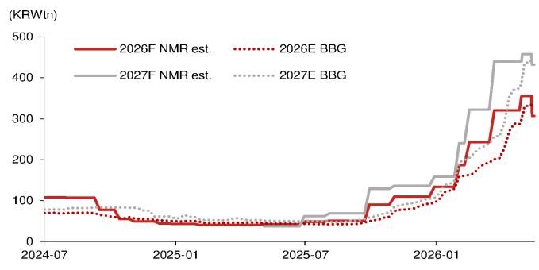

line

| Date     | 2026F NMR est. | 2026E BBG | 2027F NMR est. | 2027E BBG |
|----------|----------------|-----------|----------------|-----------|
| 2024-07  | 100            | 80        | 100            | 90        |
| 2025-01  | 50             | 40        | 50             | 40        |
| 2025-07  | 50             | 40        | 50             | 40        |
| 2026-01  | 150            | 130       | 350            | 300       |
| 2026-07  | 350            | 300       | 450            | 400       |

Source: Bloomberg Finance L.P., NOM

Fig. 5: Hynix – 2026F/27F OP NOM vs BBG   
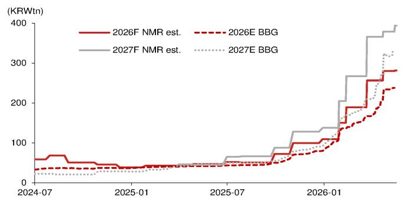

line

| Date     | 2026F NMR est. | 2026E BBG | 2027F NMR est. | 2027E BBG |
| -------- | -------------- | --------- | -------------- | --------- |
| 2024-07  | ~60            | ~30       | ~60            | ~30       |
| 2025-01  | ~40            | ~30       | ~40            | ~30       |
| 2025-07  | ~50            | ~40       | ~60            | ~40       |
| 2026-01  | ~100           | ~80       | ~150           | ~90       |
| 2026-07  | ~280           | ~240      | ~380           | ~320      |

Source: Bloomberg Finance L.P., NOM

Fig. 6: Estimated token consumption by prompt cases 

<table><tr><td rowspan="2"></td><td rowspan="2">Mainhardware</td><td colspan="8">Estimated token consumption per case</td></tr><tr><td>Simultaneousinterpretation</td><td>Simplequestion</td><td>Structuredconstraint</td><td>Styleexpansion</td><td>RAGquestion</td><td>Imagegeneration</td><td>Agent AI (report +model)</td><td>1-hour video generation</td></tr><tr><td>User&#x27;s prompt input</td><td>CPU +DRAM</td><td>(instanttranslation)</td><td>&quot;How&#x27;s the weather today?&quot;</td><td>&quot;How&#x27;s the weather toady? Please answer in 5 words or less&quot;</td><td>&quot;How&#x27;s the weather today? Please answer like a poet.&quot;</td><td>&quot;Explain about reasons behind national debt increase&quot;</td><td>&quot;Please describe today&#x27;s weather in an abstract painting.&quot;</td><td>&quot;Make earnings models and company note based on the model&quot;</td><td>&quot;Make a 1-hour video describing recent weather&quot;</td></tr><tr><td>Scheduling</td><td>CPU +DRAM</td><td></td><td></td><td></td><td></td><td></td><td></td><td></td><td></td></tr><tr><td>Input token</td><td>GPU + HBM</td><td>10</td><td>10</td><td>20</td><td>25</td><td>40</td><td>20</td><td>500</td><td>10</td></tr><tr><td>RAG</td><td>CPU +DRAM</td><td>-</td><td>-</td><td>-</td><td>-</td><td>5,000</td><td>-</td><td>20,000</td><td>-</td></tr><tr><td>Output token generation</td><td>GPU + HBM/LPU</td><td>30</td><td>20</td><td>5</td><td>100</td><td>1,000</td><td>10,000</td><td>10,000</td><td>100,000,000</td></tr><tr><td colspan="2">Total</td><td>40</td><td>30</td><td>25</td><td>125</td><td>6,040</td><td>10,020</td><td>30,500</td><td>100,000,010</td></tr></table>

Source: NOM estimates

Fig. 7: Memory vs logic demand from global data center capex 

<table><tr><td>(USDbn)</td><td>2024</td><td>2025</td><td>2026F</td><td>2027F</td><td>2028F</td><td>2029F</td><td>2030F</td></tr><tr><td>Global DC capex</td><td>668</td><td>1,164</td><td>2,295</td><td>2,977</td><td>4,197</td><td>5,123</td><td>6,127</td></tr><tr><td>Total memory demand from DC</td><td>60</td><td>107</td><td>454</td><td>667</td><td>941</td><td>1,181</td><td>1,398</td></tr><tr><td>Memory % of Global DC capex</td><td>9%</td><td>9%</td><td>20%</td><td>22%</td><td>22%</td><td>23%</td><td>23%</td></tr><tr><td>AI mix within capex</td><td>31%</td><td>40%</td><td>39%</td><td>41%</td><td>46%</td><td>51%</td><td>55%</td></tr><tr><td>Memory mix within DC semi demand</td><td>23%</td><td>24%</td><td>38%</td><td>41%</td><td>42%</td><td>42%</td><td>42%</td></tr><tr><td>Big 8&#x27;s DC capex</td><td>282</td><td>547</td><td>931</td><td>1,226</td><td>1,658</td><td>2,122</td><td>2,653</td></tr><tr><td>Big 8 share within global DC capex</td><td>42%</td><td>47%</td><td>41%</td><td>41%</td><td>39%</td><td>41%</td><td>43%</td></tr><tr><td>China&#x27;s DC capex</td><td>40</td><td>70</td><td>130</td><td>190</td><td>250</td><td>300</td><td>360</td></tr><tr><td>China share within global DC capex</td><td>6%</td><td>6%</td><td>6%</td><td>6%</td><td>6%</td><td>6%</td><td>6%</td></tr><tr><td>AI DC capex</td><td>206</td><td>466</td><td>888</td><td>1,207</td><td>1,942</td><td>2,601</td><td>3,379</td></tr><tr><td>Memory demand</td><td>20</td><td>41</td><td>106</td><td>176</td><td>285</td><td>397</td><td>517</td></tr><tr><td>Memory % of AI DC capex</td><td>10%</td><td>9%</td><td>12%</td><td>15%</td><td>15%</td><td>15%</td><td>15%</td></tr><tr><td>Logic demand</td><td>102</td><td>176</td><td>417</td><td>528</td><td>787</td><td>1,042</td><td>1,263</td></tr><tr><td>Logic % of AI DC capex</td><td>50%</td><td>38%</td><td>47%</td><td>44%</td><td>41%</td><td>40%</td><td>37%</td></tr><tr><td>Logic mix (within AIDC semi)</td><td>83%</td><td>81%</td><td>80%</td><td>75%</td><td>73%</td><td>72%</td><td>71%</td></tr><tr><td>General (non-AI) DC capex</td><td>461</td><td>698</td><td>1,407</td><td>1,770</td><td>2,256</td><td>2,522</td><td>2,747</td></tr><tr><td>Memory demand</td><td>39</td><td>66</td><td>347</td><td>490</td><td>655</td><td>784</td><td>881</td></tr><tr><td>Memory % of General DC capex</td><td>8%</td><td>9%</td><td>25%</td><td>28%</td><td>29%</td><td>31%</td><td>32%</td></tr><tr><td>Logic demand</td><td>101</td><td>161</td><td>326</td><td>417</td><td>538</td><td>614</td><td>642</td></tr><tr><td>Logic % of General DC capex</td><td>22%</td><td>23%</td><td>23%</td><td>24%</td><td>24%</td><td>24%</td><td>23%</td></tr><tr><td>Logic mix (within General DC semi)</td><td>72%</td><td>71%</td><td>48%</td><td>46%</td><td>45%</td><td>44%</td><td>42%</td></tr><tr><td>Out of total DC capex:</td><td></td><td></td><td></td><td></td><td></td><td></td><td></td></tr><tr><td>Memory %</td><td>9%</td><td>9%</td><td>20%</td><td>22%</td><td>22%</td><td>23%</td><td>23%</td></tr><tr><td>Logic %</td><td>30%</td><td>29%</td><td>32%</td><td>32%</td><td>32%</td><td>32%</td><td>31%</td></tr></table>

Source: Company data, NOM estimates

Fig. 8: Global memory revenue breakdown by end-demand 

<table><tr><td>(USDbn)</td><td>2024</td><td>2025</td><td>2026F</td><td>2027F</td><td>2028F</td><td>2029F</td><td>2030F</td></tr><tr><td>Total memory revenue</td><td>181</td><td>264</td><td>852</td><td>1,348</td><td>1,734</td><td>2,121</td><td>2,625</td></tr><tr><td>Memory demand from global DC capex</td><td>60</td><td>107</td><td>454</td><td>667</td><td>941</td><td>1,181</td><td>1,398</td></tr><tr><td>Share of DC within memory revenue</td><td>33%</td><td>41%</td><td>53%</td><td>49%</td><td>54%</td><td>56%</td><td>53%</td></tr><tr><td>Memory demand for AI DC</td><td>20</td><td>41</td><td>106</td><td>176</td><td>285</td><td>397</td><td>517</td></tr><tr><td>Share of AI DC</td><td>11%</td><td>16%</td><td>12%</td><td>13%</td><td>16%</td><td>19%</td><td>20%</td></tr><tr><td>Memory demand for general DC</td><td>39</td><td>66</td><td>347</td><td>490</td><td>655</td><td>784</td><td>881</td></tr><tr><td>Share of general DC</td><td>22%</td><td>25%</td><td>41%</td><td>36%</td><td>38%</td><td>37%</td><td>34%</td></tr><tr><td>Memory demand for non-DC usage</td><td>121</td><td>157</td><td>398</td><td>682</td><td>794</td><td>940</td><td>1,226</td></tr><tr><td>Share of non-DC demand</td><td>67%</td><td>59%</td><td>47%</td><td>51%</td><td>46%</td><td>44%</td><td>47%</td></tr></table>

Source: NOM estimates

Fig. 9: AI and memory industry – fund flow structure and self-reinforcing cycle   
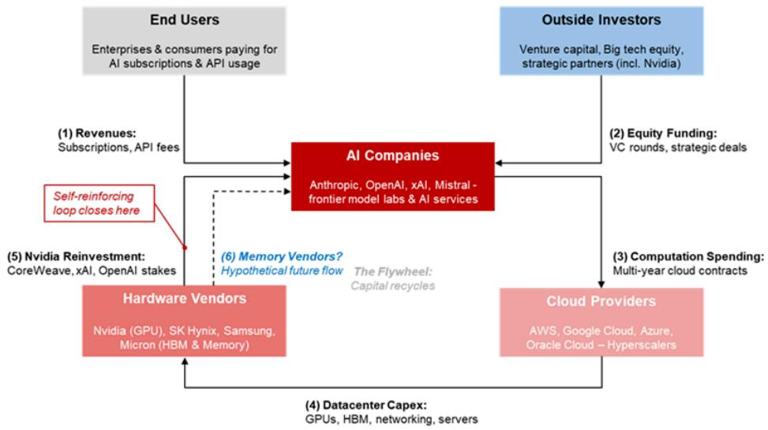

flowchart

```mermaid
graph TD
    A["End Users"] -->|Enterprises & consumers paying for AI sUBScriptions & API usage| B["AI Companies"]
    C["Outside Investors"] -->|Venture capital, Big tech equity, strategic partners (incl. Nvidia)| B
    B -->|Revenues: SUBScriptions, API fees| D["Hardware Vendors"]
    B -->|Self-reinforcing loop closes here| E["Hardware Vendors"]
    B -->|Equity Funding: VC rounds, strategic deals| F["Cloud Providers"]
    B -->|Computation Spending: Multi-year cloud contracts| F
    B -->|(5) Nvidia Reinvestment: CoreWeave, xAI, OpenAI stakes| E
    B -->|(6) Memory Vendors? Hypothetical future flow The Flywheel: Capital recycles| E
    E --> G["Hardware Vendors"]
    E --> H["Cloud Providers"]
    G --> I["Hardware Vendors"]
    H --> J["Cloud Providers"]
    I --> K["Hardware Vendors"]
    J --> L["Cloud Providers"]
    style A fill:#f9f,stroke:#333
    style C fill:#bbf,stroke:#333
    style B fill:#ff9,stroke:#333
    style F fill:#ff9,stroke:#333
    style H fill:#ff9,stroke:#333
    style I fill:#ff9,stroke:#333
    style J fill:#ff9,stroke:#333
    style K fill:#ff9,stroke:#333
    style L fill:#ff9,stroke:#333
```

Source: NOM

Fig. 10: Logic/memory TAM from OpenAI's capex by Nvidia's architecture 

<table><tr><td colspan="2"></td><td>Blackwell</td><td>Blackwell Ultra</td><td>Rubin</td><td>Rubin Ultra</td></tr><tr><td rowspan="9">USDmn</td><td>Memory TAM (HBM + LPDDR5X + NAND)</td><td>46,034</td><td>48,982</td><td>59,264</td><td>73,291</td></tr><tr><td>HBM</td><td>28,754</td><td>34,971</td><td>23,526</td><td>52,280</td></tr><tr><td>LP DDR5X</td><td>17,280</td><td>14,011</td><td>29,455</td><td>14,727</td></tr><tr><td>NAND</td><td>0</td><td>0</td><td>6,284</td><td>6,284</td></tr><tr><td>Logic share</td><td>31%</td><td>25%</td><td>18%</td><td>14%</td></tr><tr><td>HBM share</td><td>43%</td><td>53%</td><td>32%</td><td>61%</td></tr><tr><td>LPDDR5X share</td><td>26%</td><td>21%</td><td>41%</td><td>17%</td></tr><tr><td>NAND share</td><td>0%</td><td>0%</td><td>9%</td><td>7%</td></tr><tr><td>Memory / Logic</td><td>225%</td><td>295%</td><td>442%</td><td>601%</td></tr></table>

Source: Company data, NOM estimates

Fig. 11: SEC/Hynix – Risk premium, discount rate, target multiple, and TP 

<table><tr><td></td><td colspan="4">2027F TSMC discount rate</td><td colspan="2">SEC target</td><td colspan="6">Hynix target</td><td>SEC current</td><td>Hynix current</td></tr><tr><td>Equity risk premium</td><td>1.5%</td><td>3.0%</td><td>5.0%</td><td>7.0%</td><td>6.4%</td><td>9.0%</td><td>8.5%</td><td>11.0%</td><td>13.0%</td><td>15.0%</td><td>17.0%</td><td>18.0%</td><td>18.6%</td><td>23.7%</td></tr><tr><td>Discount rate</td><td>5.5%</td><td>7.0%</td><td>9.0%</td><td>11.0%</td><td>10.4%</td><td>13.0%</td><td>12.5%</td><td>15.0%</td><td>17.0%</td><td>19.0%</td><td>21.0%</td><td>22.0%</td><td>22.6%</td><td>27.7%</td></tr><tr><td>P/E (x)</td><td>18.1</td><td>14.3</td><td>11.1</td><td>9.1</td><td>9.6</td><td>7.7</td><td>8.0</td><td>6.7</td><td>5.9</td><td>5.3</td><td>4.8</td><td>4.5</td><td>4.4</td><td>3.6</td></tr><tr><td>SEC</td><td></td><td></td><td></td><td></td><td></td><td></td><td></td><td></td><td></td><td></td><td></td><td></td><td></td><td></td></tr><tr><td>P/B (x)</td><td>9.4</td><td>7.4</td><td>5.8</td><td>4.7</td><td>5.0</td><td>4.0</td><td>4.2</td><td>3.5</td><td>3.1</td><td>2.7</td><td>2.5</td><td>2.4</td><td>2.3</td><td>1.9</td></tr><tr><td>Share price (KRW)</td><td>1,110,000</td><td>870,000</td><td>680,000</td><td>560,000</td><td>590,000</td><td>470,000</td><td>490,000</td><td>410,000</td><td>360,000</td><td>320,000</td><td>290,000</td><td>280,000</td><td>270,500</td><td>220,000</td></tr><tr><td>Market cap (KRWtn)</td><td>6,119</td><td>4,796</td><td>3,749</td><td>3,087</td><td>3,253</td><td>2,591</td><td>2,701</td><td>2,260</td><td>1,985</td><td>1,764</td><td>1,599</td><td>1,544</td><td>1,491</td><td>1,213</td></tr><tr><td>Hynix</td><td></td><td></td><td></td><td></td><td></td><td></td><td></td><td></td><td></td><td></td><td></td><td></td><td></td><td></td></tr><tr><td>P/B (x)</td><td>13.6</td><td>10.7</td><td>8.3</td><td>6.8</td><td>7.2</td><td>5.8</td><td>6.0</td><td>5.0</td><td>4.4</td><td>3.9</td><td>3.6</td><td>3.4</td><td>3.3</td><td>2.7</td></tr><tr><td>Share price (KRW)</td><td>9,100,000</td><td>7,200,000</td><td>5,600,000</td><td>4,600,000</td><td>4,800,000</td><td>3,900,000</td><td>4,000,000</td><td>3,400,000</td><td>3,000,000</td><td>2,700,000</td><td>2,400,000</td><td>2,300,000</td><td>2,200,000</td><td>1,819,000</td></tr><tr><td>Market cap (KRWtn)</td><td>6,266</td><td>4,958</td><td>3,856</td><td>3,168</td><td>3,305</td><td>2,686</td><td>2,754</td><td>2,341</td><td>2,066</td><td>1,859</td><td>1,653</td><td>1,584</td><td>1,515</td><td>1,253</td></tr></table>

Note: Market cap is based on treasury share-adjusted number of shares; market cap for SEC excludes preferred shares; share prices as of 15 May 2026.
Source: NOM estimates

Fig. 12: Memory players' wafer capacity until 2028F 

<table><tr><td colspan="2">(unit: k wafers/month)</td><td>end-2024</td><td>end-2025</td><td>end-2026</td><td>end-2027</td><td>end-2028</td></tr><tr><td rowspan="10">SEC</td><td>DRAM</td><td>704</td><td>605</td><td>754</td><td>863</td><td>910</td></tr><tr><td>others</td><td>614</td><td>555</td><td>614</td><td>663</td><td>470</td></tr><tr><td>P3</td><td>90</td><td>0</td><td>0</td><td>0</td><td>120</td></tr><tr><td>P4</td><td>0</td><td>50</td><td>140</td><td>200</td><td>200</td></tr><tr><td>P5</td><td>0</td><td>0</td><td>0</td><td>0</td><td>120</td></tr><tr><td>NAND</td><td>300</td><td>400</td><td>441</td><td>435</td><td>443</td></tr><tr><td>others</td><td>241</td><td>340</td><td>371</td><td>365</td><td>323</td></tr><tr><td>P3</td><td>40</td><td>40</td><td>50</td><td>50</td><td>50</td></tr><tr><td>P4</td><td>20</td><td>20</td><td>20</td><td>20</td><td>20</td></tr><tr><td>P5</td><td>-1</td><td>0</td><td>0</td><td>0</td><td>50</td></tr><tr><td rowspan="9">SK Hynix</td><td>DRAM</td><td>474</td><td>547</td><td>592</td><td>643</td><td>803</td></tr><tr><td>others</td><td>474</td><td>547</td><td>532</td><td>523</td><td>513</td></tr><tr><td>M15X</td><td>0</td><td>0</td><td>60</td><td>90</td><td>90</td></tr><tr><td>Y1</td><td></td><td></td><td></td><td>30</td><td>200</td></tr><tr><td>Y2</td><td></td><td></td><td></td><td></td><td></td></tr><tr><td>NAND</td><td>260</td><td>260</td><td>220</td><td>170</td><td>310</td></tr><tr><td>others</td><td>260</td><td>260</td><td>220</td><td>170</td><td>210</td></tr><tr><td>Y1</td><td></td><td></td><td></td><td></td><td>100</td></tr><tr><td>Y2</td><td></td><td></td><td></td><td></td><td></td></tr><tr><td rowspan="7">Micron</td><td>DRAM</td><td>345</td><td>365</td><td>385</td><td>515</td><td>560</td></tr><tr><td>Taiwan</td><td>230</td><td>245</td><td>265</td><td>340</td><td>350</td></tr><tr><td>Japan</td><td>105</td><td>110</td><td>110</td><td>105</td><td>110</td></tr><tr><td>US</td><td>10</td><td>10</td><td>10</td><td>70</td><td>100</td></tr><tr><td>NAND</td><td>170</td><td>170</td><td>140</td><td>140</td><td>160</td></tr><tr><td>Others</td><td>41</td><td>40</td><td>25</td><td>40</td><td>0</td></tr><tr><td>SG</td><td>129</td><td>130</td><td>115</td><td>100</td><td>160</td></tr><tr><td>Kioxia (WD)</td><td>NAND</td><td>600</td><td>600</td><td>610</td><td>630</td><td>650</td></tr><tr><td>YMTC</td><td>NAND</td><td>150</td><td>150</td><td>200</td><td>250</td><td>300</td></tr><tr><td>CXMT</td><td>DRAM</td><td>200</td><td>280</td><td>330</td><td>400</td><td>500</td></tr><tr><td>Nanya</td><td>DRAM</td><td>76</td><td>105</td><td>115</td><td>120</td><td>120</td></tr><tr><td>Powerchip</td><td>DRAM</td><td>28</td><td>28</td><td>28</td><td>28</td><td>28</td></tr><tr><td>Swaysure</td><td>DRAM</td><td>60</td><td>60</td><td>60</td><td>60</td><td>60</td></tr><tr><td colspan="2">Total DRAM wafer capacity (y-end)</td><td>1,723</td><td>1,990</td><td>2,264</td><td>2,629</td><td>2,981</td></tr><tr><td colspan="2">y-y</td><td></td><td>267</td><td>274</td><td>364</td><td>353</td></tr><tr><td colspan="2">y-y %</td><td></td><td>16%</td><td>14%</td><td>16%</td><td>13%</td></tr><tr><td colspan="2">HBM (y-end)</td><td>181</td><td>380</td><td>490</td><td>700</td><td>900</td></tr><tr><td colspan="2">y-y</td><td></td><td>199</td><td>110</td><td>210</td><td>200</td></tr><tr><td colspan="2">y-y %</td><td></td><td>109%</td><td>29%</td><td>43%</td><td>29%</td></tr><tr><td colspan="2">Commodity (y-end)</td><td>1,542</td><td>1,610</td><td>1,774</td><td>1,929</td><td>2,081</td></tr><tr><td colspan="2">y-y</td><td></td><td>69</td><td>164</td><td>154</td><td>153</td></tr><tr><td colspan="2">y-y %</td><td></td><td>4%</td><td>10%</td><td>9%</td><td>8%</td></tr><tr><td colspan="2">Total DRAM wafer capacity (y-average)</td><td>1,723</td><td>1,857</td><td>2,127</td><td>2,447</td><td>2,805</td></tr><tr><td colspan="2">y-y</td><td></td><td>134</td><td>271</td><td>319</td><td>359</td></tr><tr><td colspan="2">y-y %</td><td></td><td>8%</td><td>15%</td><td>15%</td><td>15%</td></tr><tr><td colspan="2">HBM (y-average)</td><td>181</td><td>318</td><td>448</td><td>613</td><td>800</td></tr><tr><td colspan="2">y-y</td><td></td><td>136</td><td>130</td><td>165</td><td>188</td></tr><tr><td colspan="2">y-y %</td><td></td><td>75%</td><td>41%</td><td>37%</td><td>31%</td></tr><tr><td colspan="2">Commodity (y-average)</td><td>1,542</td><td>1,539</td><td>1,680</td><td>1,834</td><td>2,005</td></tr><tr><td colspan="2">y-y</td><td></td><td>-2</td><td>141</td><td>154</td><td>171</td></tr><tr><td colspan="2">y-y %</td><td></td><td>0%</td><td>9%</td><td>9%</td><td>9%</td></tr><tr><td colspan="2">NAND cleanroom capacity (y-end)</td><td>1,631</td><td>1,600</td><td>1,645</td><td>1,830</td><td>2,070</td></tr><tr><td colspan="2">y-y</td><td></td><td>-31</td><td>45</td><td>185</td><td>240</td></tr><tr><td colspan="2">y-y %</td><td></td><td>-2%</td><td>3%</td><td>11%</td><td>13%</td></tr><tr><td colspan="2">NAND wafer capacity (y-end)</td><td>1,480</td><td>1,580</td><td>1,611</td><td>1,625</td><td>1,863</td></tr><tr><td colspan="2">y-y</td><td></td><td>100</td><td>31</td><td>14</td><td>238</td></tr><tr><td colspan="2">y-y %</td><td></td><td>7%</td><td>2%</td><td>1%</td><td>15%</td></tr><tr><td colspan="2">NAND wafer capacity (y-average)</td><td>1,480</td><td>1,530</td><td>1,596</td><td>1,618</td><td>1,744</td></tr><tr><td colspan="2">y-y</td><td></td><td>50</td><td>66</td><td>23</td><td>126</td></tr><tr><td colspan="2">y-y %</td><td></td><td>3%</td><td>4%</td><td>1%</td><td>8%</td></tr></table>

Source: Company data, NOM estimates

Fig. 13: SEC – trailing P/B vs ROE and shareholder return   
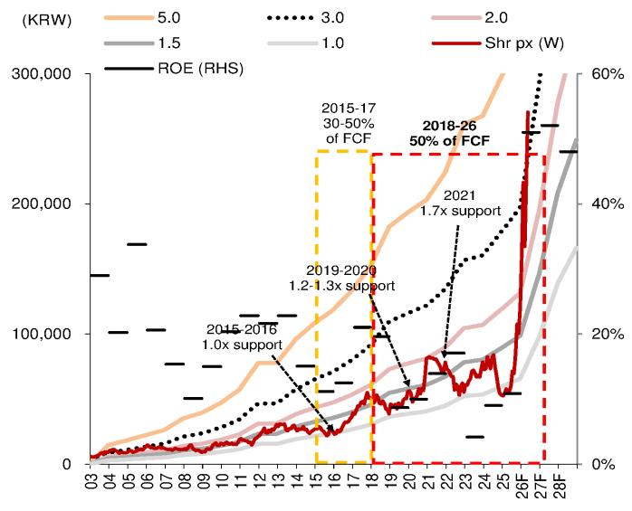

line

| Year | ROE (RHS) | Shr px (W) |
|------|-----------|------------|
| 2015-2016 | 1.0x support | - |
| 2015-2017 | 30-50% of FCF | - |
| 2018-26 | 50% of FCF | - |
| 2021 | 1.7x support | - |

Source: Company data, NOM estimates

Fig. 14: Hynix – trailing P/B vs ROE   
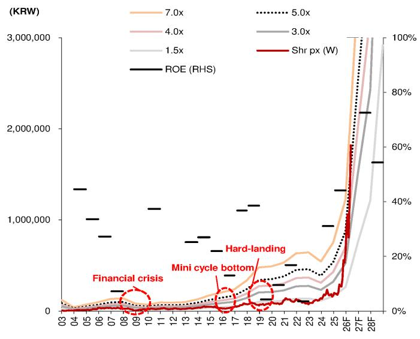  
Source: Bloomberg Finance L.P., NOM estimates

Fig. 15: SEC – trailing P/B: upsides from BV and multiple   
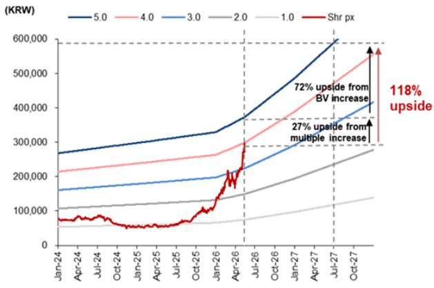

line

| Date   | 5.0     | 4.0     | 3.0     | 2.0     | 1.0     | Shr px |
|--------|---------|---------|---------|---------|---------|--------|
| Oct-27 | 600,000 | 550,000 | 500,000 | 450,000 | 400,000 | 118% upside |

Source: Company data, Quantiwise, NOM estimates

Fig. 16: Hynix – trailing P/B: upsides from BV and multiple   
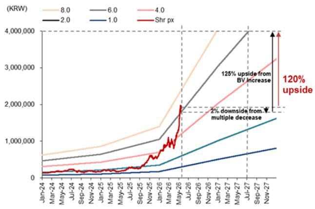

line

| Date    | 8.0     | 6.0     | 4.0     | 2.0     | 1.0     |
|---------|---------|---------|---------|---------|---------|
| Nov-27  |         |         |         |         |         |

Source: Company data, Quantiwise, NOM estimates

Fig. 17: SEC/Hynix vs peers - relative market cap trend   
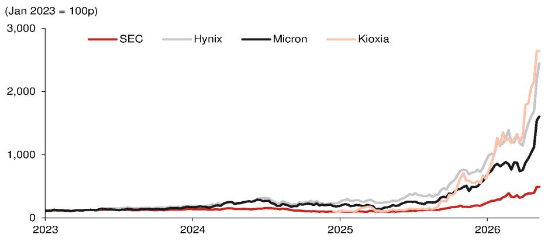

line

| Year | SEC   | Hynix | Micron | Kioxia |
|------|-------|-------|--------|--------|
| 2023 | ~0    | ~0    | ~0     | ~0     |
| 2024 | ~0    | ~0    | ~0     | ~0     |
| 2025 | ~0    | ~0    | ~0     | ~0     |
| 2026 | ~500  | ~1,000| ~1,500 | ~2,500 |

Source: Bloomberg Finance L.P., NOM

Fig. 18: Global peer valuation 

<table><tr><td rowspan="2" colspan="2"></td><td rowspan="2">Ticker</td><td rowspan="2">Rating</td><td rowspan="2">Share price (local)</td><td rowspan="2">M.Cap (KRW tn)</td><td rowspan="2">1M (%)</td><td rowspan="2">YTD</td><td colspan="2">P/E(x)</td><td colspan="2">P/B(x)</td><td colspan="2">EV/EBITDA(x)</td><td colspan="2">ROE(%)</td><td colspan="2">EPS GR(%)</td></tr><tr><td>26E</td><td>27E</td><td>26E</td><td>27E</td><td>26E</td><td>27E</td><td>26E</td><td>27E</td><td>26E</td><td>27E</td></tr><tr><td rowspan="5">Memory</td><td>Samsung Electronics</td><td>005930 KS</td><td>Buy</td><td>270,500</td><td>1,622.3</td><td>31.1</td><td>130.9</td><td>6.7</td><td>4.5</td><td>2.8</td><td>2.0</td><td>3.8</td><td>2.4</td><td>51.0</td><td>52.1</td><td>515.3</td><td>49.5</td></tr><tr><td>SK Hynix</td><td>000660 KS</td><td>Buy</td><td>1,819,000</td><td>1,338.5</td><td>65.0</td><td>188.0</td><td>5.5</td><td>4.1</td><td>3.6</td><td>2.2</td><td>3.8</td><td>2.3</td><td>100.2</td><td>72.5</td><td>461.8</td><td>34.4</td></tr><tr><td>Micron</td><td>MU US</td><td>Not rated</td><td>776.01</td><td>1,312.5</td><td>70.1</td><td>171.9</td><td>13.2</td><td>7.5</td><td>7.5</td><td>3.9</td><td>9.8</td><td>5.9</td><td>70.8</td><td>62.5</td><td>633.8</td><td>73.1</td></tr><tr><td>Kioxia</td><td>285A JP</td><td>Buy</td><td>48,460</td><td>229.9</td><td>37.1</td><td>326.0</td><td>8.0</td><td>5.6</td><td>6.7</td><td>3.4</td><td>4.9</td><td>3.0</td><td>126.3</td><td>81.3</td><td>502.5</td><td>43.7</td></tr><tr><td>Average</td><td></td><td></td><td></td><td></td><td></td><td></td><td>8.3</td><td>5.4</td><td>5.1</td><td>2.9</td><td>5.6</td><td>3.4</td><td>87.1</td><td>67.1</td><td>528.4</td><td>50.2</td></tr><tr><td rowspan="3">Storage</td><td>Western Digital</td><td>WDC US</td><td>Not rated</td><td>489.15</td><td>252.9</td><td>34.0</td><td>183.9</td><td>28.6</td><td>18.9</td><td>12.3</td><td>9.0</td><td>19.4</td><td>13.7</td><td>59.4</td><td>69.8</td><td>82.9</td><td>43.4</td></tr><tr><td>Seagate</td><td>STX US</td><td>Not rated</td><td>804.76</td><td>270.6</td><td>54.9</td><td>192.2</td><td>30.7</td><td>21.2</td><td>31.4</td><td>16.7</td><td>23.8</td><td>17.1</td><td>155.7</td><td>133.6</td><td>79.4</td><td>45.2</td></tr><tr><td>Average</td><td></td><td></td><td></td><td></td><td></td><td></td><td>29.6</td><td>20.1</td><td>21.9</td><td>12.8</td><td>21.6</td><td>15.4</td><td>107.6</td><td>101.7</td><td>81.1</td><td>44.3</td></tr><tr><td rowspan="3">Fabless</td><td>Nvidia</td><td>NVDA US</td><td>Not rated</td><td>235.74</td><td>8,563.1</td><td>18.5</td><td>26.4</td><td>28.0</td><td>20.6</td><td>19.6</td><td>12.3</td><td>22.8</td><td>17.3</td><td>83.4</td><td>65.8</td><td>77.9</td><td>33.7</td></tr><tr><td>AMD</td><td>AMD US</td><td>Not rated</td><td>449.7</td><td>1,099.7</td><td>74.2</td><td>110.0</td><td>61.8</td><td>35.0</td><td>10.4</td><td>8.8</td><td>52.9</td><td>30.0</td><td>14.4</td><td>21.8</td><td>84.8</td><td>80.2</td></tr><tr><td>Average</td><td></td><td></td><td></td><td></td><td></td><td></td><td>44.9</td><td>27.8</td><td>15.0</td><td>10.6</td><td>37.8</td><td>23.6</td><td>48.9</td><td>43.8</td><td>81.3</td><td>56.9</td></tr><tr><td rowspan="3">Foundry</td><td>TSMC</td><td>2330 TT</td><td>Buy</td><td>2,265</td><td>2,792.7</td><td>8.9</td><td>46.1</td><td>22.5</td><td>18.1</td><td>7.9</td><td>5.8</td><td>14.6</td><td>11.4</td><td>40.5</td><td>37.0</td><td>51.7</td><td>24.6</td></tr><tr><td>Intel</td><td>INTC US</td><td>Not rated</td><td>115.93</td><td>873.8</td><td>78.5</td><td>214.2</td><td>105.0</td><td>74.7</td><td>4.9</td><td>4.6</td><td>33.1</td><td>26.7</td><td>3.6</td><td>6.0</td><td>248.7</td><td>44.4</td></tr><tr><td>Average</td><td></td><td></td><td></td><td></td><td></td><td></td><td>63.8</td><td>46.4</td><td>6.4</td><td>5.2</td><td>23.9</td><td>19.1</td><td>22.0</td><td>21.5</td><td>150.2</td><td>34.5</td></tr><tr><td colspan="2">Total Average</td><td></td><td></td><td></td><td></td><td></td><td></td><td>31.0</td><td>21.0</td><td>10.7</td><td>6.9</td><td>18.9</td><td>13.0</td><td>70.5</td><td>60.2</td><td>273.9</td><td>47.2</td></tr></table>

Note: Priced as of 15 May 2026; Bloomberg consensus for not rated stocks and NOM estimates for covered stocks   
Source: Bloomberg Finance L.P., NOM estimates

EQUITY: TECHNOLOGY

# A significantly undervalued key beneficiary of AI

Maintain Buy and raise TP to KRW590,000; ready to embrace the new regime

# Maintain Buy and raise TP to KRW590,000; raise target multiple based on reduced risk premium

We reiterate our Buy rating and raise TP from KRW340,000 to KRW590,000. We derive the new TP by applying a target P/B of 5x (previously: 3.0x) to 12MF BVPS of KRW117,669. We raise our target multiple significantly by 67%, based on increased conviction that the memory industry's cashflows will structurally change to have long-term stability through strongly-binding long-term agreements (LTAs), and more importantly, that AI demand will likely grow significantly, enabling such LTAs. While we lower our implied target discount rate from 17% to 10%, it is still far above \~6% currently applied to TSMC's (2330 TT, Buy) market valuation. We believe that the discount rate can further decline, as market confidence grows, and such a decrease in the discount rate should accelerate in case Korea is included in MSCI Developed Markets Index (which we believe would materialize in June 2026).

Considering these, we expect SEC to record 2026F/27F/28F ROE of 51%/52%/48%. Through shareholder return of either 50% of FCF or 30-40% of NP, we expect the company to maintain stable ROE of c. 40% until 2031F, the end-period of most LTAs, which could be rolled over continuously.

Our new target discount rate translates into a target P/E of 9.6x, which implies a target P/B of 5.0x, considering SEC's annualized 2Q27F ROE. The new TP has 118% implied upside to the current share price, and we expect 2026F/27F FCF yields to be 13%/20% of current market cap. Our TP translates into a target market cap of KRW3,253tn, and as we expect end-2027F net cash balance of KRW471tn, our TP implies a target EV of KRW2,781tn. The stock currently trades at 2026F P/B of 2.8x (BVPS: KRW94,951).

(continued on page 4)

<table><tr><td>Year-end 31 Dec</td><td colspan="2">FY25</td><td colspan="2">FY26F</td><td colspan="2">FY27F</td><td colspan="2">FY28F</td></tr><tr><td>Currency (KRW)</td><td>Actual</td><td>Old</td><td>New</td><td>Old</td><td>New</td><td>Old</td><td>New</td><td></td></tr><tr><td>Revenue (bn)</td><td>333,606</td><td>639,570</td><td>641,928</td><td>753,719</td><td>786,287</td><td>852,229</td><td>909,056</td><td></td></tr><tr><td>Reported net profit (bn)</td><td>44,261</td><td>303,954</td><td>263,156</td><td>403,193</td><td>381,254</td><td>460,403</td><td>449,075</td><td></td></tr><tr><td>Normalised net profit (bn)</td><td>44,261</td><td>303,954</td><td>263,156</td><td>403,193</td><td>381,254</td><td>460,403</td><td>449,075</td><td></td></tr><tr><td>FD normalised EPS</td><td>6,571</td><td>46,704</td><td>40,435</td><td>64,042</td><td>60,435</td><td>74,198</td><td>72,138</td><td></td></tr><tr><td>FD norm. EPS growth (%)</td><td>32.8</td><td>610.7</td><td>515.3</td><td>37.1</td><td>49.5</td><td>15.9</td><td>19.4</td><td></td></tr><tr><td>FD normalised P/E (x)</td><td>41.2</td><td>-</td><td>6.7</td><td>-</td><td>4.5</td><td>-</td><td>3.7</td><td></td></tr><tr><td>EV/EBITDA (x)</td><td>17.1</td><td>-</td><td>3.8</td><td>-</td><td>2.4</td><td>-</td><td>1.9</td><td></td></tr><tr><td>Price/book (x)</td><td>4.2</td><td>-</td><td>2.8</td><td>-</td><td>2.0</td><td>-</td><td>1.7</td><td></td></tr><tr><td>Dividend yield (%)</td><td>0.6</td><td>-</td><td>3.9</td><td>-</td><td>5.7</td><td>-</td><td>13.8</td><td></td></tr><tr><td>ROE (%)</td><td>10.9</td><td>56.7</td><td>51.0</td><td>52.1</td><td>52.1</td><td>47.2</td><td>48.0</td><td></td></tr><tr><td>Net debt/equity (%)</td><td>net cash</td><td>net cash</td><td>net cash</td><td>net cash</td><td>net cash</td><td>net cash</td><td>net cash</td><td></td></tr></table>

Source: Company data, NOM estimates

<table><tr><td>RatingRemains</td><td>Buy</td></tr></table>

<table><tr><td>Target priceIncreased fromKRW 340,000</td></tr></table>

<table><tr><td>KRW 590,000</td></tr></table>

<table><tr><td>Closing price15 May 2026</td></tr></table>

<table><tr><td>KRW 270,500</td></tr></table>

<table><tr><td>Implied upside</td><td>+118.1%</td></tr></table>

<table><tr><td>Market Cap (USD mn)</td><td>1,053,506.4</td></tr><tr><td>ADT (USD mn)</td><td>3,759.5</td></tr></table>

Relative performance chart   
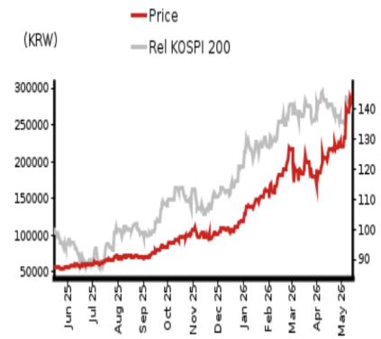

line

| Date   | Price     | Rel KOSPI 200 |
|--------|-----------|---------------|
| Jun 25 | ~50,000   | ~100,000      |
| Jul 25 | ~70,000   | ~110,000      |
| Aug 25 | ~80,000   | ~120,000      |
| Sep 25 | ~90,000   | ~130,000      |
| Oct 25 | ~100,000  | ~140,000      |
| Nov 25 | ~110,000  | ~150,000      |
| Dec 25 | ~130,000  | ~160,000      |
| Jan 26 | ~150,000  | ~170,000      |
| Feb 26 | ~180,000  | ~180,000      |
| Mar 26 | ~220,000  | ~190,000      |
| Apr 26 | ~250,000  | ~200,000      |
| May 26 | ~300,000  | ~210,000      |

Source: LSEG, NOM

# Research Analysts

Asia Technology

CW Chung - NIHK

cwchung@NOM.com

+852 2252 6075

Korea Technology

Eon Hwang - NFIK

eon.hwang@NOM.com

+822 3783 2318

YJ Kim, CFA - NFIK

yj.kim1@NOM.com

+82237832332

# Key data on Samsung Electronics

Performance 

<table><tr><td>(%)</td><td>1M</td><td>3M</td><td>12M</td><td></td><td></td></tr><tr><td>Absolute (KRW)</td><td>28.2</td><td>49.3</td><td>372.1</td><td>M cap (USDmn)</td><td>1,053,506.4</td></tr><tr><td>Absolute (USD)</td><td>26.0</td><td>43.2</td><td>337.9</td><td>Free float (%)</td><td>82.0</td></tr><tr><td>Rel to KOSPI 200</td><td>-7.4</td><td>-3.3</td><td>116.0</td><td>3-mth ADT (USDmn)</td><td>3,759.5</td></tr></table>

Income statement (KRWbn) 

<table><tr><td>Year-end 31 Dec</td><td>FY24</td><td>FY25</td><td>FY26F</td><td>FY27F</td><td>FY28F</td></tr><tr><td>Revenue</td><td>300,871</td><td>333,606</td><td>641,928</td><td>786,287</td><td>909,056</td></tr><tr><td>Cost of goods sold</td><td>-186,562</td><td>-202,236</td><td>-217,927</td><td>-217,315</td><td>-240,933</td></tr><tr><td>Gross profit</td><td>114,309</td><td>131,370</td><td>424,001</td><td>568,972</td><td>668,123</td></tr><tr><td>SG&amp;A</td><td>-81,583</td><td>-87,769</td><td>-116,687</td><td>-138,587</td><td>-157,407</td></tr><tr><td>Employee share expense</td><td>0</td><td>0</td><td>0</td><td>1,555</td><td>185</td></tr><tr><td>Operating profit</td><td>32,726</td><td>43,601</td><td>307,315</td><td>431,941</td><td>510,901</td></tr><tr><td>EBITDA</td><td>75,357</td><td>90,528</td><td>358,070</td><td>491,694</td><td>583,814</td></tr><tr><td>Depreciation</td><td>-39,650</td><td>-43,606</td><td>-47,351</td><td>-56,262</td><td>-69,334</td></tr><tr><td>Amortisation</td><td>-2,981</td><td>-3,321</td><td>-3,405</td><td>-3,491</td><td>-3,579</td></tr><tr><td>EBIT</td><td>32,726</td><td>43,601</td><td>307,315</td><td>431,941</td><td>510,901</td></tr><tr><td>Net interest expense</td><td>3,915</td><td>3,987</td><td>6,440</td><td>11,130</td><td>16,825</td></tr><tr><td>Associates &amp; JCEs</td><td>751</td><td>683</td><td>0</td><td>6,366</td><td>1,665</td></tr><tr><td>Other income</td><td>138</td><td>1,210</td><td>130</td><td>137</td><td>-8</td></tr><tr><td>Earnings before tax</td><td>37,530</td><td>49,481</td><td>313,884</td><td>449,574</td><td>529,384</td></tr><tr><td>Income tax</td><td>-3,078</td><td>-4,275</td><td>-49,862</td><td>-67,436</td><td>-79,408</td></tr><tr><td>Net profit after tax</td><td>34,451</td><td>45,207</td><td>264,022</td><td>382,138</td><td>449,976</td></tr><tr><td>Minority interests</td><td>-830</td><td>-946</td><td>-866</td><td>-884</td><td>-901</td></tr><tr><td>Other items</td><td></td><td></td><td></td><td></td><td></td></tr><tr><td>Preferred dividends</td><td></td><td></td><td></td><td></td><td></td></tr><tr><td>Normalised NPAT</td><td>33,621</td><td>44,261</td><td>263,156</td><td>381,254</td><td>449,075</td></tr><tr><td>Extraordinary items</td><td></td><td></td><td></td><td></td><td></td></tr><tr><td>Reported NPAT</td><td>33,621</td><td>44,261</td><td>263,156</td><td>381,254</td><td>449,075</td></tr><tr><td>Dividends</td><td>-9,806</td><td>-11,113</td><td>-67,804</td><td>-97,194</td><td>-231,380</td></tr><tr><td>Transfer to reserves</td><td>23,815</td><td>33,148</td><td>195,351</td><td>284,060</td><td>217,695</td></tr><tr><td>Valuations and ratios</td><td></td><td></td><td></td><td></td><td></td></tr><tr><td>Reported P/E (x)</td><td>54.4</td><td>40.5</td><td>6.6</td><td>4.5</td><td>3.7</td></tr><tr><td>Normalised P/E (x)</td><td>54.4</td><td>40.5</td><td>6.6</td><td>4.5</td><td>3.7</td></tr><tr><td>FD normalised P/E (x)</td><td>54.7</td><td>41.2</td><td>6.7</td><td>4.5</td><td>3.7</td></tr><tr><td>Dividend yield (%)</td><td>0.5</td><td>0.6</td><td>3.9</td><td>5.7</td><td>13.8</td></tr><tr><td>Price/cashflow (x)</td><td>25.2</td><td>21.4</td><td>6.1</td><td>4.0</td><td>3.3</td></tr><tr><td>Price/book (x)</td><td>4.7</td><td>4.2</td><td>2.8</td><td>2.0</td><td>1.7</td></tr><tr><td>EV/EBITDA (x)</td><td>20.5</td><td>17.1</td><td>3.8</td><td>2.4</td><td>1.9</td></tr><tr><td>EV/EBIT (x)</td><td>46.5</td><td>35.2</td><td>4.5</td><td>2.7</td><td>2.2</td></tr><tr><td>Gross margin (%)</td><td>38.0</td><td>39.4</td><td>66.1</td><td>72.4</td><td>73.5</td></tr><tr><td>EBITDA margin (%)</td><td>25.0</td><td>27.1</td><td>55.8</td><td>62.5</td><td>64.2</td></tr><tr><td>EBIT margin (%)</td><td>10.9</td><td>13.1</td><td>47.9</td><td>54.9</td><td>56.2</td></tr><tr><td>Net margin (%)</td><td>11.2</td><td>13.3</td><td>41.0</td><td>48.5</td><td>49.4</td></tr><tr><td>Effective tax rate (%)</td><td>8.2</td><td>8.6</td><td>15.9</td><td>15.0</td><td>15.0</td></tr><tr><td>Dividend payout (%)</td><td>29.2</td><td>25.1</td><td>25.8</td><td>25.5</td><td>51.5</td></tr><tr><td>ROE (%)</td><td>9.0</td><td>10.9</td><td>51.0</td><td>52.1</td><td>48.0</td></tr><tr><td>ROA (pretax %)</td><td>7.9</td><td>9.1</td><td>55.9</td><td>67.8</td><td>67.4</td></tr><tr><td>Growth (%)</td><td></td><td></td><td></td><td></td><td></td></tr><tr><td>Revenue</td><td>16.2</td><td>10.9</td><td>92.4</td><td>22.5</td><td>15.6</td></tr><tr><td>EBITDA</td><td>66.6</td><td>20.1</td><td>295.5</td><td>37.3</td><td>18.7</td></tr><tr><td>Normalised EPS</td><td>133.6</td><td>34.1</td><td>515.7</td><td>47.5</td><td>19.3</td></tr><tr><td>Normalised FDEPS</td><td>132.3</td><td>32.8</td><td>515.3</td><td>49.5</td><td>19.4</td></tr></table>

Source: Company data, NOM estimates

Cashflow statement (KRWbn) 

<table><tr><td>Year-end 31 Dec</td><td>FY24</td><td>FY25</td><td>FY26F</td><td>FY27F</td><td>FY28F</td></tr><tr><td>EBITDA</td><td>75,357</td><td>90,528</td><td>358,070</td><td>491,694</td><td>583,814</td></tr><tr><td>Change in working capital</td><td>368</td><td>2,296</td><td>36,714</td><td>-7,103</td><td>-4,793</td></tr><tr><td>Other operating cashflow</td><td>-2,742</td><td>-7,509</td><td>-107,151</td><td>-62,208</td><td>-65,750</td></tr><tr><td>Cashflow from operations</td><td>72,983</td><td>85,315</td><td>287,633</td><td>422,382</td><td>513,271</td></tr><tr><td>Capital expenditure</td><td>-55,137</td><td>-48,822</td><td>-79,270</td><td>-104,100</td><td></td></tr><tr><td>Free cashflow</td><td>17,845</td><td>36,493</td><td>208,363</td><td>318,282</td><td>513,271</td></tr><tr><td>Reduction in investments</td><td>-39,887</td><td>-16,055</td><td>-714</td><td>-7,109</td><td>-10,707</td></tr><tr><td>Net acquisitions</td><td>0</td><td>-2,200</td><td>0</td><td>0</td><td>0</td></tr><tr><td>Dec in other LT assets</td><td>-4,146</td><td>-9,687</td><td>-1,751</td><td>-1,822</td><td>-1,896</td></tr><tr><td>Inc in other LT liabilities</td><td>2,817</td><td>2,661</td><td>232</td><td>235</td><td>242</td></tr><tr><td>Adjustments</td><td>10,972</td><td>5,591</td><td>729</td><td>7,053</td><td>-138,681</td></tr><tr><td>CF after investing acts</td><td>-12,399</td><td>16,803</td><td>206,860</td><td>316,640</td><td>362,229</td></tr><tr><td>Cash dividends</td><td>-10,889</td><td>-9,897</td><td>-10,858</td><td>-95,147</td><td>-232,154</td></tr><tr><td>Equity issue</td><td>0</td><td>0</td><td>0</td><td>0</td><td>0</td></tr><tr><td>Debt issue</td><td>12,516</td><td>10,564</td><td>58,504</td><td>22,970</td><td>4,523</td></tr><tr><td>Convertible debt issue</td><td></td><td></td><td></td><td></td><td></td></tr><tr><td>Others</td><td>-4,603</td><td>-13,319</td><td>-70,909</td><td>-64,518</td><td>-70,378</td></tr><tr><td>CF from financial acts</td><td>-2,976</td><td>-12,652</td><td>-23,263</td><td>-136,694</td><td>-298,009</td></tr><tr><td>Net cashflow</td><td>-15,375</td><td>4,151</td><td>183,597</td><td>179,945</td><td>64,220</td></tr><tr><td>Beginning cash</td><td>69,094</td><td>53,719</td><td>57,870</td><td>241,467</td><td>421,412</td></tr><tr><td>Ending cash</td><td>53,719</td><td>57,870</td><td>241,467</td><td>421,412</td><td>485,632</td></tr><tr><td>Ending net debt</td><td>-34,389</td><td>-32,631</td><td>-218,353</td><td>-403,469</td><td>-471,596</td></tr></table>

Balance sheet (KRWbn) 

<table><tr><td>As at 31 Dec</td><td>FY24</td><td>FY25</td><td>FY26F</td><td>FY27F</td><td>FY28F</td></tr><tr><td>Cash &amp; equivalents</td><td>53,719</td><td>57,870</td><td>241,467</td><td>421,412</td><td>485,632</td></tr><tr><td>Marketable securities</td><td>58,909</td><td>67,965</td><td>67,965</td><td>67,965</td><td>67,965</td></tr><tr><td>Accounts receivable</td><td>43,623</td><td>51,128</td><td>96,870</td><td>122,774</td><td>145,208</td></tr><tr><td>Inventories</td><td>51,755</td><td>52,637</td><td>63,064</td><td>75,360</td><td>84,886</td></tr><tr><td>Other current assets</td><td>19,056</td><td>18,085</td><td>7,148</td><td>20,690</td><td>19,162</td></tr><tr><td>Total current assets</td><td>227,062</td><td>247,685</td><td>476,514</td><td>708,202</td><td>802,853</td></tr><tr><td>LT investments</td><td>24,349</td><td>31,348</td><td>32,061</td><td>39,170</td><td>49,877</td></tr><tr><td>Fixed assets</td><td>205,945</td><td>215,305</td><td>248,124</td><td>296,862</td><td>369,528</td></tr><tr><td>Goodwill</td><td></td><td></td><td></td><td></td><td></td></tr><tr><td>Other intangible assets</td><td>23,739</td><td>29,481</td><td>30,678</td><td>31,923</td><td>33,219</td></tr><tr><td>Other LT assets</td><td>33,437</td><td>43,125</td><td>44,876</td><td>46,698</td><td>48,594</td></tr><tr><td>Total assets</td><td>514,532</td><td>566,942</td><td>832,253</td><td>1,122,854</td><td>1,304,071</td></tr><tr><td>Short-term debt</td><td>15,380</td><td>18,752</td><td>17,534</td><td>14,282</td><td>11,633</td></tr><tr><td>Accounts payable</td><td>12,370</td><td>13,039</td><td>24,705</td><td>29,821</td><td>33,590</td></tr><tr><td>Other current liabilities</td><td>65,576</td><td>74,619</td><td>144,900</td><td>184,423</td><td>206,292</td></tr><tr><td>Total current liabilities</td><td>93,326</td><td>106,411</td><td>187,140</td><td>228,526</td><td>251,515</td></tr><tr><td>Long-term debt</td><td>3,950</td><td>6,487</td><td>5,580</td><td>3,662</td><td>2,403</td></tr><tr><td>Convertible debt</td><td></td><td></td><td></td><td></td><td></td></tr><tr><td>Other LT liabilities</td><td>15,063</td><td>17,724</td><td>17,956</td><td>18,192</td><td>18,434</td></tr><tr><td>Total liabilities</td><td>112,340</td><td>130,622</td><td>210,676</td><td>250,379</td><td>272,352</td></tr><tr><td>Minority interest</td><td>10,504</td><td>12,007</td><td>13,645</td><td>15,507</td><td>17,623</td></tr><tr><td>Preferred stock</td><td>119</td><td>119</td><td>119</td><td>119</td><td>119</td></tr><tr><td>Common stock</td><td>778</td><td>778</td><td>778</td><td>778</td><td>778</td></tr><tr><td>Retained earnings</td><td>370,513</td><td>402,136</td><td>585,294</td><td>833,861</td><td>990,510</td></tr><tr><td>Proposed dividends</td><td></td><td></td><td></td><td></td><td></td></tr><tr><td>Other equity and reserves</td><td>20,277</td><td>21,280</td><td>21,741</td><td>22,210</td><td>22,689</td></tr><tr><td>Total shareholders&#x27; equity</td><td>391,688</td><td>424,313</td><td>607,932</td><td>856,968</td><td>1,014,097</td></tr><tr><td>Total equity &amp; liabilities</td><td>514,532</td><td>566,942</td><td>832,253</td><td>1,122,854</td><td>1,304,071</td></tr><tr><td>Liquidity (x)</td><td></td><td></td><td></td><td></td><td></td></tr><tr><td>Current ratio</td><td>2.43</td><td>2.33</td><td>2.55</td><td>3.10</td><td>3.19</td></tr><tr><td>Interest cover</td><td>-</td><td>-</td><td>-</td><td>-</td><td>-</td></tr><tr><td>Leverage</td><td></td><td></td><td></td><td></td><td></td></tr><tr><td>Net debt/EBITDA (x)</td><td>net cash</td><td>net cash</td><td>net cash</td><td>net cash</td><td>net cash</td></tr><tr><td>Net debt/equity (%)</td><td>net cash</td><td>net cash</td><td>net cash</td><td>net cash</td><td>net cash</td></tr><tr><td>Per share</td><td></td><td></td><td></td><td></td><td></td></tr><tr><td>Reported EPS (KRW)</td><td>4,977</td><td>6,676</td><td>41,102</td><td>60,640</td><td>72,318</td></tr><tr><td>Norm EPS (KRW)</td><td>4,977</td><td>6,676</td><td>41,102</td><td>60,640</td><td>72,318</td></tr><tr><td>FD norm EPS (KRW)</td><td>4,950</td><td>6,571</td><td>40,435</td><td>60,435</td><td>72,138</td></tr><tr><td>BVPS (KRW)</td><td>57,981</td><td>63,997</td><td>94,951</td><td>136,305</td><td>163,308</td></tr><tr><td>DPS (KRW)</td><td>1,452</td><td>1,676</td><td>10,590</td><td>15,459</td><td>37,261</td></tr><tr><td>Activity (days)</td><td></td><td></td><td></td><td></td><td></td></tr><tr><td>Days receivable</td><td>48.8</td><td>51.8</td><td>42.1</td><td>51.0</td><td>53.9</td></tr><tr><td>Days inventory</td><td>101.4</td><td>94.2</td><td>96.9</td><td>116.2</td><td>121.7</td></tr><tr><td>Days payable</td><td>23.2</td><td>22.9</td><td>31.6</td><td>45.8</td><td>48.2</td></tr><tr><td>Cash cycle</td><td>127.0</td><td>123.1</td><td>107.4</td><td>121.4</td><td>127.5</td></tr></table>

Source: Company data, NOM estimates

# Company profile

Samsung Electronics Co., Ltd. manufactures a wide range of consumer and industrial electronic equipment and products such as semiconductors, personal computers, peripherals, monitors, televisions, and home appliances including air conditioners and microwave ovens. The company also produces internet access network systems and telecommunications equipment including mobile phones.

# Valuation Methodology

Our 12-month TP of KRW590,000 is derived by applying a target P/B of 5.0x to 12MF BVPS of KRW117,669. The target multiple reflects increased confidence in transition into long-term cashflow structure that could be generated by memory LTAs. The benchmark index for the stock is the KOSPI 200.

# Risks that may impede the achievement of the target price

Downside risk includes potential US tariffs on semiconductor products, delay in data center construction due to power supply shortage, and slowdown in AI capex under a higher interest rate environment.

# ESG

Samsung Electronics is one of the leading companies in Korea in executing ESG management. According to the mid-long-term green management roadmap, Samsung Electronics has set four key performance indicators in the areas of environment, safety and health (EHS) management system and is managing greenhouse gas, water resources, and waste during business activity. For more than 10 years, the company has been following 3R (Reduce, Reuse, Recycle) activities that conserve, reuse, and recycle water resources during manufacturing process. Samsung Electronics has established a greenhouse gas reduction plan to respond to climate change, and is also reflecting eco-friendly trends in semiconductors. The company has recently received 'Carbon Footprint Certification' from the UK 'Carbon Trust' for nine of its major memory products. Samsung Electronics establishes and operates management plans for each manufacturing process to minimize waste generated during production. In terms of social responsibility, Samsung Electronics is focusing on supporting its partners in three aspects: providing support for funds, technology, and manpower. Samsung is operating fund worth KRW2.2 tn in supporting its partner companies. Samsung is transparent with shareholder return policy by announcing shareholder return plans every three years and is working to improve corporate governance by having 54% of BOD as outside directors and implementing electronic voting for shareholders. Samsung is tackling the social issues by allowing for union activity.

# (continued from page 1)

# Expect 2026F/27F/28F OP to grow 604%/41%/18% y-y; memory players' share prices should be more about sustainability of earnings in coming 3-5 years

We lower our 2026F/27F/28F OP forecasts for SEC by 14%/6%/3% to KRW307tn/432tn/511tn (+604%/+41%/+18% y-y). Our forecasts this time reflect several changes in the key outlook, including additional bonus expenses and a rise in HBM (high bandwidth memory) prices. Our forecasts have been sUBStantially bullish vs. consensus until recently, but the market expectation has also risen significantly. In fact, as we reflected KRW's appreciation scenario in our previous report (link), our earnings forecasts in KRW terms could be even lower than bullish forecasts in the market.

We believe memory players' share prices will be determined more by valuations, reflecting how long-lasting and sustainable will the current historically high earnings be, rather than the revision of earnings itself, given that SEC/Hynix are currently trading at only \~6x 12MF P/E, although their share prices went up by 408%/946% since 2025 (vs. KOSPI up 212%).

# Memory: sizable bonus cost and strong KRW assumptions applied; HBM profitability to converge to commodity level in 2027F

We assume additional bonus expenses (12% of memory OP budgeted for bonus) on top of the current scheme of maximum 50% of base salary for SEC, and conservatively forecast earnings, reflecting the rapid appreciation of KRW (downside factor for profitability). Considering that SEC and Hynix are likely to generate profits that could potentially exceed the amount of Korea's current foreign exchange reserves and reach 25% of 2025 nominal GDP (vs. 3% in 2025) over next several years, we believe that the appreciation of KRW is inevitable. If we apply USD/KRW of 1,420 (end-2027F FX forecast by our macro team) or 1,501 (as of 15 May) for the next three years, SEC's OP will be at KRW308/322tn, KRW467/493tn, and KRW581/613tn for 2026F, 2027F, and 2028F, respectively, which are above our forecasts by more than 10% on average.

Reflecting LTAs, we assume that the historical-high profitability for commodity DRAM and NAND in 2026F will be sustained until 2028F. In addition, for HBM (of which profitability is lower than overall memory), we assume that prices will increase to an extent that its profitability will approach that of commodity DRAM in 2027F, and we factor in this in our forecasts.

# Foundry: fast-paced revenue growth, but limited profitability improvement due to lingering cost burden

For the foundry business, we believe the revenue growth will accelerate by securing new customers, yield stabilization, aggressive investments supported by strong memory earnings, and talent acquisition, narrowing down the gap with TSMC. However, we believe the profitability improvement will be limited over the next few years. This is because more than 30% of 2026F revenue will incur as expenses by paying out bonuses at similar level with the memory division, and fixed cost burden will rise significantly from the operation of the US fab from end-2026, which costs 50% more vs. fabs in Korea.

Fig. 19: SEC – trailing P/B band: upside from BV and multiple   
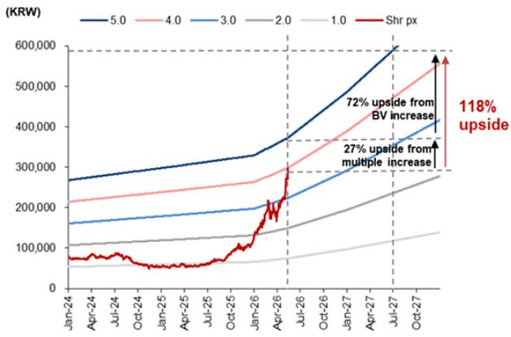

line

| Date   | 5.0    | 4.0    | 3.0    | 2.0    | 1.0    | Shr px |
|--------|--------|--------|--------|--------|--------|--------|
| Oct-27 | 600,000| 550,000| 500,000| 450,000| 400,000| 118% upside from multiple increase |

Fig. 20: SEC – trailing P/B vs. ROE during 2003-06   
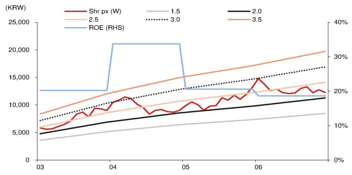

line

| Year | Shr px (W) | ROE (RHS) | 1.5  | 2.0  | 2.5  | 3.0  | 3.5  |
|------|------------|-----------|------|------|------|------|------|
| 2003 | ~6,000     | ~13,000   | ~4,000 | ~8,000 | ~9,000 | ~10,000 | ~11,000 |
| 2004 | ~11,000    | ~21,000   | ~6,000 | ~11,000 | ~12,000 | ~13,000 | ~15,000 |
| 2005 | ~8,000     | ~13,000   | ~8,000 | ~13,000 | ~14,000 | ~15,000 | ~17,000 |
| 2006 | ~14,000    | ~12,000   | ~10,000 | ~15,000 | ~16,000 | ~17,000 | ~20,000 |

Source: Company data, Quantiwise, NOM

Fig. 21: SEC – trailing P/B, ROE, and shareholder return policy   
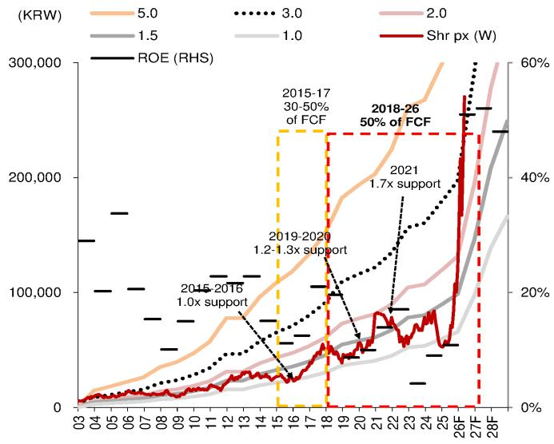

line

| Year | ROE (RHS) | Shpr px (W) |
|------|-----------|-------------|
| 2015 | 1.0x support | - |
| 2016 | 1.0x support | - |
| 2015-2016 | - | - |
| 2019-2020 | 1.2-1.3x support | - |
| 2018-26 | - | - |
| 2021 | - | 1.7x support |
| 2026F | - | - |
| 27F | - | - |
| 28F | - | - |

Source: Company data, Quantiwise, NOM

Fig. 22: SEC – trailing P/E vs. share price   
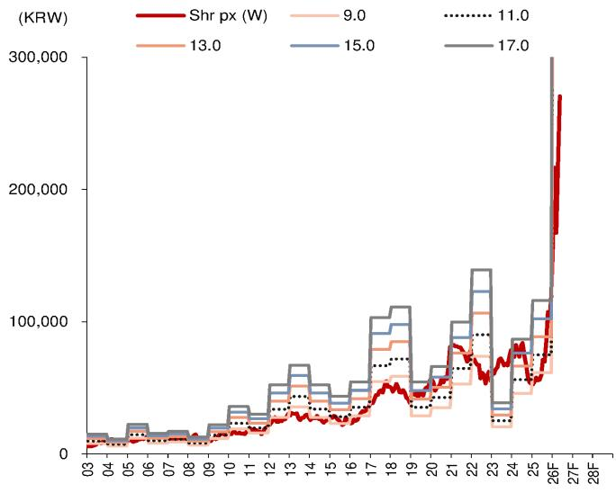

line

| Date | Shr px (W) | 9.0 | 11.0 | 13.0 | 15.0 | 17.0 |
|------|------------|-----|------|------|------|------|
| 03   | ~5,000     | ~5,000 | ~5,000 | ~5,000 | ~5,000 | ~5,000 |
| 04   | ~5,000     | ~5,000 | ~5,000 | ~5,000 | ~5,000 | ~5,000 |
| 05   | ~5,000     | ~5,000 | ~5,000 | ~5,000 | ~5,000 | ~5,000 |
| 06   | ~5,000     | ~5,000 | ~5,000 | ~5,000 | ~5,000 | ~5,000 |
| 07   | ~5,000     | ~5,000 | ~5,000 | ~5,000 | ~5,000 | ~5,000 |
| 08   | ~5,000     | ~5,000 | ~5,000 | ~5,000 | ~5,000 | ~5,000 |
| 09   | ~5,000     | ~5,000 | ~5,000 | ~5,000 | ~5,000 | ~5,000 |
| 10   | ~15,000    | ~15,000 | ~15,000 | ~15,000 | ~15,000 | ~15,000 |
| 11   | ~25,000    | ~25,000 | ~25,000 | ~25,000 | ~25,000 | ~25,000 |
| 12   | ~35,000    | ~35,000 | ~35,000 | ~35,000 | ~35,000 | ~35,000 |
| 13   | ~45,000    | ~45,000 | ~45,000 | ~45,000 | ~45,000 | ~45,000 |
| 14   | ~55,000    | ~55,000 | ~55,000 | ~55,000 | ~55,000 | ~55,000 |
| 15   | ~65,000    | ~65,000 | ~65,000 | ~65,000 | ~65,000 | ~65,000 |
| 16   | ~75,000    | ~75,000 | ~75,000 | ~75,000 | ~75,000 | ~75,000 |
| 17   | ~85,000    | ~85,000 | ~85,000 | ~85,000 | ~85,000 | ~85,000 |
| 18   | ~95,000    | ~95,000 | ~95,000 | ~95,000 | ~95,000 | ~95,000 |
| 19   | ~115,876   | ~115,876 | ~115,876 | ~115,876 | ~115,876 | ~115,876 |
| 24   | ~138,876   | ~138,876 | ~138,876 | ~138,876 | ~138,876 | ~138,876 |
| 26F  | ~278,876   | ~278,876 | ~278,876 | ~278,876 | ~278,876 | ~278,876 |
| 27F  | ~298,876   | ~298,876 | ~298,876 | ~298,876 | ~298,876 | ~298,876 |
| 28F  | -          | -     | -      | -      | -      | -      |

Source: Company data, Quantiwise, NOM

Fig. 23: SEC – 2026F/27F OP consensus vs. NOM estimates   
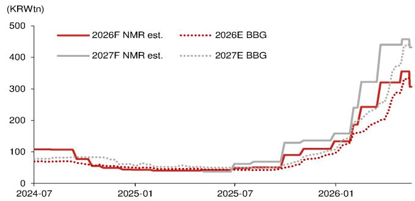

line

| Date     | 2026F NMR est. | 2026E BBG | 2027F NMR est. | 2027E BBG |
|----------|----------------|-----------|----------------|-----------|
| 2024-07  | 100            | 80        | 100            | 80        |
| 2025-01  | 50             | 40        | 50             | 40        |
| 2025-07  | 40             | 30        | 40             | 30        |
| 2026-01  | 150            | 100       | 350            | 250       |
| 2026-07  | 350            | 300       | 450            | 400       |

Source: Bloomberg Finance L.P., NOM estimates

Fig. 24: Memory OP – SEC vs. peers   
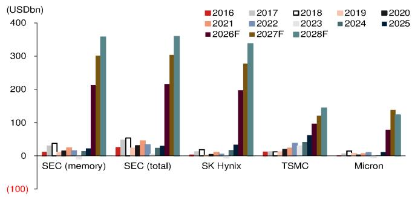

bar

| Category       | 2016  | 2017  | 2018  | 2019  | 2020  | 2021  | 2022  | 2023  | 2024  | 2025  | 2026F | 2027F | 2028F |
| -------------- | ----- | ----- | ----- | ----- | ----- | ----- | ----- | ----- | ----- | ----- | ----- | ----- | ----- |
| SEC (memory)   | 10    | 30    | 40    | 15    | 10    | 20    | 15    | 10    | 15    | 10    | 20    | 300   | 350   |
| SEC (total)    | 20    | 50    | 40    | 30    | 25    | 40    | 35    | 30    | 35    | 30    | 20    | 300   | 350   |
| SK Hynix       | 5     | 10    | 15    | 5     | 5     | 10    | 15    | 10    | 15    | 10    | 5     | 200   | 300   |
| TSMC           | 10    | 20    | 30    | 15    | 10    | 20    | 30    | 25    | 40    | 15    | 10    | 100   | 150   |
| Micron         | 5     | 10    | 15    | 10    | 5     | 15    | 20    | 15    | 25    | 10    | 5     | 80    | 125   |

Note: Bloomberg consensus estimates for Micron.   
Source: Company data, Bloomberg Finance L.P., NOM estimates

Fig. 25: SEC – Earnings estimate revisions 

<table><tr><td>(KRW tn)</td><td>2026F Old</td><td>2026F New</td><td>% y-y new</td><td>Diff.</td><td>Chg. (%)</td><td>2027F Old</td><td>2027F New</td><td>% y-y new</td><td>Diff.</td><td>Chg. (%)</td><td>2028F Old</td><td>2028F New</td><td>% y-y new</td><td>Diff.</td><td>Chg. (%)</td></tr><tr><td>Sales</td><td>639.57</td><td>641.93</td><td>92.4%</td><td>2.36</td><td>0.4%</td><td>753.72</td><td>786.29</td><td>22.5%</td><td>32.57</td><td>4.3%</td><td>852.23</td><td>909.06</td><td>15.6%</td><td>56.83</td><td>6.7%</td></tr><tr><td>Semiconductor</td><td>469.48</td><td>472.26</td><td>262.2%</td><td>2.77</td><td>0.6%</td><td>612.05</td><td>650.07</td><td>37.7%</td><td>38.02</td><td>6.2%</td><td>721.49</td><td>786.80</td><td>21.0%</td><td>65.32</td><td>9.1%</td></tr><tr><td>Memory</td><td>438.21</td><td>440.99</td><td>322.6%</td><td>2.77</td><td>0.6%</td><td>572.83</td><td>610.85</td><td>38.5%</td><td>38.02</td><td>6.6%</td><td>677.02</td><td>742.34</td><td>21.5%</td><td>65.32</td><td>9.6%</td></tr><tr><td>DRAM</td><td>290.37</td><td>293.14</td><td>319.4%</td><td>2.77</td><td>1.0%</td><td>381.37</td><td>419.39</td><td>43.1%</td><td>38.02</td><td>10.0%</td><td>461.12</td><td>526.44</td><td>25.5%</td><td>65.32</td><td>14.2%</td></tr><tr><td>NAND</td><td>147.84</td><td>147.84</td><td>329.0%</td><td>0.00</td><td>0.0%</td><td>191.46</td><td>191.46</td><td>29.5%</td><td>0.00</td><td>0.0%</td><td>215.90</td><td>215.90</td><td>12.8%</td><td>0.00</td><td>0.0%</td></tr><tr><td>System-LSI</td><td>31.27</td><td>31.27</td><td>20.1%</td><td>0.00</td><td>0.0%</td><td>39.22</td><td>39.22</td><td>25.4%</td><td>0.00</td><td>0.0%</td><td>44.47</td><td>44.47</td><td>13.4%</td><td>0.00</td><td>0.0%</td></tr><tr><td>Display panel</td><td>30.68</td><td>30.68</td><td>3.5%</td><td>0.00</td><td>0.0%</td><td>30.39</td><td>30.39</td><td>-1.0%</td><td>0.00</td><td>0.0%</td><td>28.28</td><td>28.28</td><td>-6.9%</td><td>0.00</td><td>0.0%</td></tr><tr><td>IT &amp; Mob. Communication</td><td>134.28</td><td>134.28</td><td>3.7%</td><td>0.00</td><td>0.0%</td><td>126.11</td><td>126.11</td><td>-6.1%</td><td>0.00</td><td>0.0%</td><td>120.43</td><td>120.43</td><td>-4.5%</td><td>0.00</td><td>0.0%</td></tr><tr><td>Consumer Electronics</td><td>56.29</td><td>56.29</td><td>-1.8%</td><td>0.00</td><td>0.0%</td><td>53.68</td><td>53.68</td><td>-4.6%</td><td>0.00</td><td>0.0%</td><td>52.12</td><td>52.12</td><td>-2.9%</td><td>0.00</td><td>0.0%</td></tr><tr><td>Harman</td><td>17.74</td><td>17.74</td><td>12.2%</td><td>0.00</td><td>0.0%</td><td>19.84</td><td>19.84</td><td>11.8%</td><td>0.00</td><td>0.0%</td><td>22.19</td><td>22.19</td><td>11.8%</td><td>0.00</td><td>0.0%</td></tr><tr><td>Operating profit</td><td>355.31</td><td>307.31</td><td>604.5%</td><td>-48.00</td><td>-13.5%</td><td>457.75</td><td>431.94</td><td>40.6%</td><td>-25.81</td><td>-5.6%</td><td>524.23</td><td>510.90</td><td>18.3%</td><td>-13.33</td><td>-2.5%</td></tr><tr><td>Semiconductor</td><td>342.17</td><td>294.18</td><td>370.2%</td><td>-48.00</td><td>-14.0%</td><td>443.63</td><td>417.82</td><td>42.0%</td><td>-25.81</td><td>-5.8%</td><td>509.93</td><td>496.60</td><td>18.9%</td><td>-13.33</td><td>-2.6%</td></tr><tr><td>Memory</td><td>344.91</td><td>301.82</td><td>335.0%</td><td>-43.09</td><td>-12.5%</td><td>446.24</td><td>428.63</td><td>42.0%</td><td>-17.61</td><td>-3.9%</td><td>512.78</td><td>509.18</td><td>18.8%</td><td>-3.60</td><td>-0.7%</td></tr><tr><td>DRAM</td><td>237.05</td><td>208.55</td><td>210.4%</td><td>-28.51</td><td>-12.0%</td><td>302.81</td><td>302.41</td><td>45.0%</td><td>-0.40</td><td>-0.1%</td><td>355.63</td><td>370.88</td><td>22.6%</td><td>15.26</td><td>4.3%</td></tr><tr><td>NAND</td><td>107.86</td><td>93.27</td><td>4154.0%</td><td>-14.58</td><td>-13.5%</td><td>143.44</td><td>126.22</td><td>35.3%</td><td>-17.21</td><td>-12.0%</td><td>157.16</td><td>138.30</td><td>9.6%</td><td>-18.86</td><td>-12.0%</td></tr><tr><td>System-LSI</td><td>-2.74</td><td>-7.65</td><td>na</td><td>-4.91</td><td>na</td><td>-2.61</td><td>-10.81</td><td>na</td><td>-8.20</td><td>na</td><td>-2.85</td><td>-12.58</td><td>na</td><td>-9.73</td><td>na</td></tr><tr><td>Display panel</td><td>3.92</td><td>3.92</td><td>-8.1%</td><td>0.00</td><td>0.0%</td><td>3.70</td><td>3.70</td><td>-5.6%</td><td>0.00</td><td>0.0%</td><td>3.53</td><td>3.53</td><td>-4.6%</td><td>0.00</td><td>0.0%</td></tr><tr><td>IT &amp; Mob. Communication</td><td>7.86</td><td>7.86</td><td>-38.7%</td><td>0.00</td><td>0.0%</td><td>8.60</td><td>8.60</td><td>9.5%</td><td>0.00</td><td>0.0%</td><td>8.75</td><td>8.75</td><td>1.7%</td><td>0.00</td><td>0.0%</td></tr><tr><td>Consumer Electronics</td><td>-0.01</td><td>-0.01</td><td>na</td><td>0.00</td><td>na</td><td>0.23</td><td>0.23</td><td>na</td><td>0.00</td><td>0.0%</td><td>0.24</td><td>0.24</td><td>2.8%</td><td>0.00</td><td>0.0%</td></tr><tr><td>Harman</td><td>1.45</td><td>1.45</td><td>-9.6%</td><td>0.00</td><td>0.0%</td><td>1.71</td><td>1.71</td><td>17.2%</td><td>0.00</td><td>0.0%</td><td>1.91</td><td>1.91</td><td>12.0%</td><td>0.00</td><td>0.0%</td></tr><tr><td>Operating margin</td><td>55.6%</td><td>47.9%</td><td>34.8%p</td><td>-7.7%p</td><td></td><td>60.7%</td><td>54.9%</td><td>7.1%p</td><td>-5.8%p</td><td></td><td>61.5%</td><td>56.2%</td><td>1.3%p</td><td>-5.3%p</td><td></td></tr><tr><td>Semiconductor</td><td>72.9%</td><td>62.3%</td><td>14.3%p</td><td>-10.6%p</td><td></td><td>72.5%</td><td>64.3%</td><td>2.0%p</td><td>-8.2%p</td><td></td><td>70.7%</td><td>63.1%</td><td>-1.2%p</td><td>-7.6%p</td><td></td></tr><tr><td>Memory</td><td>78.7%</td><td>68.4%</td><td>2.0%p</td><td>-10.3%p</td><td></td><td>77.9%</td><td>70.2%</td><td>1.7%p</td><td>-7.7%p</td><td></td><td>75.7%</td><td>68.6%</td><td>-1.6%p</td><td>-7.1%p</td><td></td></tr><tr><td>DRAM</td><td>81.6%</td><td>71.1%</td><td>-25.0%p</td><td>-10.5%p</td><td></td><td>79.4%</td><td>72.1%</td><td>1.0%p</td><td>-7.3%p</td><td></td><td>77.1%</td><td>70.5%</td><td>-1.7%p</td><td>-6.7%p</td><td></td></tr><tr><td>NAND</td><td>73.0%</td><td>63.1%</td><td>56.7%p</td><td>-9.9%p</td><td></td><td>74.9%</td><td>65.9%</td><td>2.8%p</td><td>-9.0%p</td><td></td><td>72.8%</td><td>64.1%</td><td>-1.9%p</td><td>-8.7%p</td><td></td></tr><tr><td>System-LSI</td><td>-8.7%</td><td>-24.4%</td><td>1.8%p</td><td>-15.7%p</td><td></td><td>-6.7%</td><td>-27.6%</td><td>-3.1%p</td><td>-20.9%p</td><td></td><td>-6.4%</td><td>-28.3%</td><td>-0.7%p</td><td>-21.9%p</td><td></td></tr><tr><td>Display panel</td><td>12.8%</td><td>12.8%</td><td>-1.6%p</td><td>0.0%p</td><td></td><td>12.2%</td><td>12.2%</td><td>-0.6%p</td><td>0.0%p</td><td></td><td>12.5%</td><td>12.5%</td><td>0.3%p</td><td>0.0%p</td><td></td></tr><tr><td>IT &amp; Mob. Communication</td><td>5.9%</td><td>5.9%</td><td>-4.0%p</td><td>0.0%p</td><td></td><td>6.8%</td><td>6.8%</td><td>1.0%p</td><td>0.0%p</td><td></td><td>7.3%</td><td>7.3%</td><td>0.4%p</td><td>0.0%p</td><td></td></tr><tr><td>Consumer Electronics</td><td>0.0%</td><td>0.0%</td><td>0.4%p</td><td>0.0%p</td><td></td><td>0.4%</td><td>0.4%</td><td>0.5%p</td><td>0.0%p</td><td></td><td>0.5%</td><td>0.5%</td><td>0.0%p</td><td>0.0%p</td><td></td></tr><tr><td>Harman</td><td>8.2%</td><td>8.2%</td><td>-2.0%p</td><td>0.0%p</td><td></td><td>8.6%</td><td>8.6%</td><td>0.4%p</td><td>0.0%p</td><td></td><td>8.6%</td><td>8.6%</td><td>0.0%p</td><td>0.0%p</td><td></td></tr><tr><td>Net Profit</td><td>303.95</td><td>263.16</td><td>494.6%</td><td>-40.80</td><td>-13.4%</td><td>403.19</td><td>381.25</td><td>44.9%</td><td>-21.94</td><td>-5.4%</td><td>460.40</td><td>449.08</td><td>17.8%</td><td>-11.33</td><td>-2.5%</td></tr><tr><td>EPS (KRW)</td><td>46,704</td><td>40,435</td><td>515.3%</td><td>-6,269</td><td>-13.4%</td><td>64,042</td><td>60,435</td><td>49.5%</td><td>-3,606</td><td>-5.6%</td><td>74,198</td><td>72,138</td><td>19.4%</td><td>-2,060</td><td>-2.8%</td></tr><tr><td>EPS (KRW, Treasury adj.)</td><td>47,474</td><td>41,102</td><td>515.7%</td><td>-6,372</td><td>-13.4%</td><td>64,187</td><td>60,640</td><td>47.5%</td><td>-3,547</td><td>-5.5%</td><td>74,428</td><td>72,318</td><td>19.3%</td><td>-2,109</td><td>-2.8%</td></tr><tr><td>BPS (KRW, Treasury adj.)</td><td>101,323</td><td>94,951</td><td>48.4%</td><td>-6,372</td><td>-6.3%</td><td>143,119</td><td>136,305</td><td>43.6%</td><td>-6,814</td><td>-4.8%</td><td>170,320</td><td>163,308</td><td>19.8%</td><td>-7,011</td><td>-4.1%</td></tr><tr><td>ROE (%)</td><td>56.7%</td><td>51.0%</td><td>40.1%p</td><td>-5.7%p</td><td></td><td>52.1%</td><td>52.1%</td><td>41.2%p</td><td>0.0%p</td><td></td><td>47.2%</td><td>48.0%</td><td>37.2%p</td><td>0.8%p</td><td></td></tr><tr><td colspan="16">Key assumption</td></tr><tr><td>DRAM ASP (1Gb eq., US$)</td><td>11.89</td><td>12.00</td><td>240.6%</td><td>0.12</td><td>1.0%</td><td>13.77</td><td>15.15</td><td>26.2%</td><td>1.38</td><td>10.0%</td><td>14.01</td><td>16.00</td><td>5.6%</td><td>1.99</td><td>14.2%</td></tr><tr><td>DRAM cost (1Gb eq., US$)</td><td>2.18</td><td>2.18</td><td>7.5%</td><td>0.00</td><td>0.0%</td><td>2.84</td><td>2.74</td><td>25.4%</td><td>-0.10</td><td>-3.5%</td><td>3.21</td><td>3.19</td><td>16.6%</td><td>-0.02</td><td>-0.5%</td></tr><tr><td>DRAM shipments (1Gb eq., units mn)</td><td>17,109</td><td>17,109</td><td>23.0%</td><td>0</td><td>0.0%</td><td>21,123</td><td>21,123</td><td>23.5%</td><td>0</td><td>0.0%</td><td>26,450</td><td>26,450</td><td>25.2%</td><td>0</td><td>0.0%</td></tr><tr><td>DRAM revenue (W tn)</td><td>291.60</td><td>294.46</td><td>322.7%</td><td>2.86</td><td>1.0%</td><td>382.51</td><td>420.86</td><td>42.9%</td><td>38.36</td><td>10.0%</td><td>461.41</td><td>526.84</td><td>25.2%</td><td>65.43</td><td>14.2%</td></tr><tr><td>NAND flash ASP (8GB eq., US$)</td><td>2.16</td><td>2.16</td><td>251.9%</td><td>0.00</td><td>0.0%</td><td>2.54</td><td>2.54</td><td>17.6%</td><td>0.00</td><td>0.0%</td><td>2.41</td><td>2.41</td><td>-5.1%</td><td>0.00</td><td>0.0%</td></tr><tr><td>NAND cost (8GB eq., US$)</td><td>0.58</td><td>0.58</td><td>0.9%</td><td>0.00</td><td>0.0%</td><td>0.63</td><td>0.63</td><td>9.4%</td><td>0.00</td><td>0.0%</td><td>0.65</td><td>0.65</td><td>3.1%</td><td>0.00</td><td>0.0%</td></tr><tr><td>NAND flash shipments (8GB eq., units mn)</td><td>48,086</td><td>48,086</td><td>21.7%</td><td>0</td><td>0.0%</td><td>57,533</td><td>57,533</td><td>19.6%</td><td>0</td><td>0.0%</td><td>72,086</td><td>72,086</td><td>25.3%</td><td>0</td><td>0.0%</td></tr><tr><td>NAND flash revenue (W tn)</td><td>148.77</td><td>148.77</td><td>332.4%</td><td>0.00</td><td>0.0%</td><td>191.97</td><td>191.97</td><td>29.0%</td><td>0.00</td><td>0.0%</td><td>216.06</td><td>216.06</td><td>12.5%</td><td>0.00</td><td>0.0%</td></tr><tr><td>Handset shipments (units mn)</td><td>216</td><td>216</td><td>-6.5%</td><td>0</td><td>0.0%</td><td>221</td><td>221</td><td>2.5%</td><td>0</td><td>0.0%</td><td>221</td><td>221</td><td>0.0%</td><td>0</td><td>0.0%</td></tr><tr><td>Smartphone shipments (units mn)</td><td>216</td><td>216</td><td>-6.5%</td><td>0</td><td>0.0%</td><td>221</td><td>221</td><td>2.5%</td><td>0</td><td>0.0%</td><td>221</td><td>221</td><td>0.0%</td><td>0</td><td>0.0%</td></tr><tr><td>Smartphone ASP (US$)</td><td>320</td><td>320</td><td>10.9%</td><td>0</td><td>0.0%</td><td>312</td><td>312</td><td>-2.2%</td><td>0</td><td>0.0%</td><td>309</td><td>309</td><td>-1.0%</td><td>0</td><td>0.0%</td></tr><tr><td>IT &amp; Mobile Com. revenue (W tn)</td><td>134.28</td><td>134.28</td><td>3.7%</td><td>0.00</td><td>0.0%</td><td>126.11</td><td>126.11</td><td>-6.1%</td><td>0.00</td><td>0.0%</td><td>120.43</td><td>120.43</td><td>-4.5%</td><td>0.00</td><td>0.0%</td></tr><tr><td>IT &amp; Mobile Com. OPM</td><td>6%</td><td>6%</td><td>-4.0%p</td><td>0.0%p</td><td></td><td>7%</td><td>7%</td><td>1.0%p</td><td>0.0%p</td><td></td><td>7%</td><td>7%</td><td>0.4%p</td><td>0.0%p</td><td></td></tr><tr><td>KRW/US$</td><td>1,434</td><td>1,434</td><td>0.9%</td><td></td><td>0.0%</td><td>1,315</td><td>1,315</td><td>-8.3%</td><td></td><td>0.0%</td><td>1,245</td><td>1,245</td><td>-5.3%</td><td></td><td>0.0%</td></tr></table>

Source: Company data, NOM estimates

Fig. 26: SEC – quarterly and annual earnings forecasts 

<table><tr><td>Revenue (KRWtn)</td><td>2023</td><td>2024</td><td>2025</td><td>1Q26</td><td>2Q26F</td><td>3Q26F</td><td>4Q26F</td><td>2026F</td><td>1Q27F</td><td>2Q27F</td><td>3Q27F</td><td>4Q27F</td><td>2027F</td><td>2028F</td></tr><tr><td>Semi</td><td>66.58</td><td>110.96</td><td>130.39</td><td>81.69</td><td>118.37</td><td>131.35</td><td>140.85</td><td>472.26</td><td>140.46</td><td>154.70</td><td>171.89</td><td>183.03</td><td>650.07</td><td>786.80</td></tr><tr><td>Memory</td><td>44.12</td><td>84.38</td><td>104.36</td><td>74.78</td><td>110.86</td><td>123.53</td><td>131.81</td><td>440.99</td><td>131.44</td><td>145.28</td><td>162.09</td><td>172.05</td><td>610.85</td><td>742.34</td></tr><tr><td>DRAM</td><td>25.91</td><td>50.75</td><td>69.90</td><td>52.41</td><td>74.37</td><td>80.58</td><td>85.79</td><td>293.14</td><td>88.35</td><td>99.36</td><td>112.71</td><td>118.98</td><td>419.39</td><td>526.44</td></tr><tr><td>NAND</td><td>18.21</td><td>33.63</td><td>34.46</td><td>22.37</td><td>36.50</td><td>42.95</td><td>46.02</td><td>147.84</td><td>43.09</td><td>45.93</td><td>49.38</td><td>53.07</td><td>191.46</td><td>215.90</td></tr><tr><td>foundry/LSI</td><td>22.46</td><td>26.58</td><td>26.03</td><td>6.91</td><td>7.50</td><td>7.82</td><td>9.04</td><td>31.27</td><td>9.02</td><td>9.41</td><td>9.81</td><td>10.98</td><td>39.22</td><td>44.47</td></tr><tr><td>Display</td><td>30.97</td><td>29.10</td><td>29.63</td><td>6.70</td><td>6.93</td><td>8.54</td><td>8.52</td><td>30.68</td><td>6.21</td><td>6.84</td><td>9.20</td><td>8.13</td><td>30.39</td><td>28.28</td></tr><tr><td>LCD</td><td>0.00</td><td>0.00</td><td>0.00</td><td>0.00</td><td>0.00</td><td>0.00</td><td>0.00</td><td>0.00</td><td>0.00</td><td>0.00</td><td>0.00</td><td>0.00</td><td>0.00</td><td>0.00</td></tr><tr><td>OLED &amp; small LCD</td><td>30.97</td><td>29.10</td><td>29.63</td><td>6.70</td><td>6.93</td><td>8.54</td><td>8.52</td><td>30.68</td><td>6.21</td><td>6.84</td><td>9.20</td><td>8.13</td><td>30.39</td><td>28.28</td></tr><tr><td>IT &amp; Mobile Comm</td><td>110.87</td><td>119.99</td><td>129.49</td><td>38.11</td><td>30.42</td><td>36.15</td><td>29.60</td><td>134.28</td><td>35.49</td><td>28.76</td><td>32.99</td><td>28.87</td><td>126.11</td><td>120.43</td></tr><tr><td>DA</td><td>56.45</td><td>56.46</td><td>57.33</td><td>14.29</td><td>13.98</td><td>13.83</td><td>14.19</td><td>56.29</td><td>13.61</td><td>13.31</td><td>13.18</td><td>13.58</td><td>53.68</td><td>52.12</td></tr><tr><td>Harman</td><td>14.39</td><td>14.25</td><td>15.81</td><td>3.80</td><td>4.27</td><td>4.52</td><td>5.15</td><td>17.74</td><td>4.18</td><td>4.78</td><td>5.11</td><td>5.77</td><td>19.84</td><td>22.19</td></tr><tr><td>Total</td><td>258.94</td><td>300.87</td><td>333.58</td><td>133.91</td><td>156.02</td><td>174.21</td><td>177.79</td><td>641.93</td><td>178.86</td><td>185.14</td><td>207.69</td><td>214.60</td><td>786.29</td><td>909.06</td></tr><tr><td>KRW/US$</td><td>1,310</td><td>1,364</td><td>1,420</td><td>1,475</td><td>1,460</td><td>1,420</td><td>1,380</td><td>1,434</td><td>1,360</td><td>1,330</td><td>1,300</td><td>1,270</td><td>1,315</td><td>1,245</td></tr><tr><td>Sales (US$, bn)</td><td>197.6</td><td>220.6</td><td>234.8</td><td>90.8</td><td>106.9</td><td>122.7</td><td>128.8</td><td>447.7</td><td>131.5</td><td>139.2</td><td>159.8</td><td>169.0</td><td>597.9</td><td>730.2</td></tr><tr><td>Operating margin</td><td>2023</td><td>2024</td><td>2025</td><td>1Q26F</td><td>2Q26F</td><td>3Q26F</td><td>4Q26F</td><td>2026F</td><td>1Q27F</td><td>2Q27F</td><td>3Q27F</td><td>4Q27F</td><td>2027F</td><td>2028F</td></tr><tr><td>Semi</td><td>-22%</td><td>14%</td><td>48%</td><td>66%</td><td>54%</td><td>65%</td><td>64%</td><td>62%</td><td>64%</td><td>64%</td><td>65%</td><td>64%</td><td>64%</td><td>63%</td></tr><tr><td>Memory</td><td>-27%</td><td>24%</td><td>66%</td><td>73%</td><td>61%</td><td>71%</td><td>70%</td><td>68%</td><td>70%</td><td>70%</td><td>70%</td><td>70%</td><td>70%</td><td>69%</td></tr><tr><td>DRAM</td><td>-2%</td><td>31%</td><td>96%</td><td>78%</td><td>63%</td><td>73%</td><td>72%</td><td>71%</td><td>72%</td><td>72%</td><td>72%</td><td>72%</td><td>72%</td><td>70%</td></tr><tr><td>NAND</td><td>-63%</td><td>13%</td><td>6%</td><td>60%</td><td>56%</td><td>67%</td><td>67%</td><td>63%</td><td>67%</td><td>66%</td><td>66%</td><td>65%</td><td>66%</td><td>64%</td></tr><tr><td>foundry/LSI</td><td>-12%</td><td>-18%</td><td>-26%</td><td>-10%</td><td>-44%</td><td>-22%</td><td>-21%</td><td>-24%</td><td>-35%</td><td>-30%</td><td>-26%</td><td>-21%</td><td>-28%</td><td>-28%</td></tr><tr><td>Display</td><td>18%</td><td>13%</td><td>14%</td><td>3%</td><td>5%</td><td>9%</td><td>8%</td><td>13%</td><td>4%</td><td>4%</td><td>9%</td><td>6%</td><td>12%</td><td>12%</td></tr><tr><td>Large LCD</td><td>na</td><td>na</td><td>na</td><td>na</td><td>na</td><td>na</td><td>na</td><td>na</td><td>na</td><td>na</td><td>na</td><td>na</td><td>na</td><td>na</td></tr><tr><td>OLED and Small LCD</td><td>18%</td><td>13%</td><td>14%</td><td>6%</td><td>11%</td><td>17%</td><td>15%</td><td>13%</td><td>9%</td><td>10%</td><td>15%</td><td>13%</td><td>12%</td><td>12%</td></tr><tr><td>IT &amp; Mobile Comm</td><td>12%</td><td>9%</td><td>10%</td><td>7%</td><td>5%</td><td>6%</td><td>5%</td><td>6%</td><td>7%</td><td>6%</td><td>7%</td><td>7%</td><td>7%</td><td>7%</td></tr><tr><td>handset &amp; tablet</td><td>7%</td><td>4%</td><td>5%</td><td>3%</td><td>0%</td><td>2%</td><td>0%</td><td>2%</td><td>3%</td><td>2%</td><td>3%</td><td>1%</td><td>2%</td><td>0%</td></tr><tr><td>System, IT &amp; others</td><td>11%</td><td>9%</td><td>9%</td><td>7%</td><td>6%</td><td>6%</td><td>8%</td><td>7%</td><td>9%</td><td>10%</td><td>10%</td><td>10%</td><td>10%</td><td>10%</td></tr><tr><td>DA</td><td>2%</td><td>3%</td><td>0%</td><td>1%</td><td>1%</td><td>0%</td><td>-2%</td><td>0%</td><td>1%</td><td>1%</td><td>1%</td><td>-1%</td><td>0%</td><td>0%</td></tr><tr><td>Harman</td><td>8%</td><td>9%</td><td>10%</td><td>5%</td><td>8%</td><td>10%</td><td>9%</td><td>8%</td><td>7%</td><td>8%</td><td>10%</td><td>9%</td><td>9%</td><td>9%</td></tr><tr><td>Total</td><td>3%</td><td>11%</td><td>13%</td><td>43%</td><td>43%</td><td>51%</td><td>53%</td><td>48%</td><td>52%</td><td>55%</td><td>56%</td><td>57%</td><td>55%</td><td>56%</td></tr><tr><td>Operating profit (KRWtn)</td><td>2023</td><td>2024</td><td>2025</td><td>1Q26F</td><td>2Q26F</td><td>3Q26F</td><td>4Q26F</td><td>2026F</td><td>1Q27F</td><td>2Q27F</td><td>3Q27F</td><td>4Q27F</td><td>2027F</td><td>2028F</td></tr><tr><td>DS (Semi)</td><td>-14.87</td><td>15.10</td><td>62.56</td><td>53.68</td><td>64.29</td><td>85.69</td><td>90.52</td><td>294.18</td><td>89.32</td><td>99.28</td><td>111.26</td><td>117.96</td><td>417.82</td><td>496.60</td></tr><tr><td>Memory</td><td>-12.11</td><td>19.97</td><td>69.38</td><td>54.36</td><td>67.61</td><td>87.39</td><td>92.46</td><td>301.82</td><td>92.49</td><td>102.10</td><td>113.77</td><td>120.27</td><td>428.63</td><td>509.18</td></tr><tr><td>DRAM</td><td>-0.60</td><td>15.66</td><td>67.19</td><td>41.03</td><td>47.08</td><td>58.80</td><td>61.63</td><td>208.55</td><td>63.82</td><td>71.73</td><td>81.33</td><td>85.53</td><td>302.41</td><td>370.88</td></tr><tr><td>NAND</td><td>-11.50</td><td>4.31</td><td>2.19</td><td>13.33</td><td>20.52</td><td>28.59</td><td>30.82</td><td>93.27</td><td>28.68</td><td>30.37</td><td>32.44</td><td>34.74</td><td>126.22</td><td>138.30</td></tr><tr><td>foundry/LSI</td><td>-2.77</td><td>-4.87</td><td>-6.82</td><td>-0.68</td><td>-3.32</td><td>-1.70</td><td>-1.94</td><td>-7.65</td><td>-3.17</td><td>-2.82</td><td>-2.51</td><td>-2.31</td><td>-10.81</td><td>-12.58</td></tr><tr><td>Display</td><td>5.57</td><td>3.76</td><td>4.27</td><td>0.41</td><td>0.79</td><td>1.41</td><td>1.31</td><td>3.92</td><td>0.55</td><td>0.69</td><td>1.40</td><td>1.06</td><td>3.70</td><td>3.53</td></tr><tr><td>Large LCD</td><td>0.00</td><td>0.00</td><td>0.00</td><td>0.00</td><td>0.00</td><td>0.00</td><td>0.00</td><td>0.00</td><td>0.00</td><td>0.00</td><td>0.00</td><td>0.00</td><td>0.00</td><td>0.00</td></tr><tr><td>OLED and Small LCD</td><td>5.57</td><td>3.76</td><td>4.27</td><td>0.41</td><td>0.79</td><td>1.41</td><td>1.31</td><td>3.92</td><td>0.55</td><td>0.69</td><td>1.40</td><td>1.06</td><td>3.70</td><td>3.53</td></tr><tr><td>MX/Network</td><td>12.87</td><td>10.85</td><td>12.81</td><td>2.81</td><td>1.42</td><td>2.09</td><td>1.54</td><td>7.86</td><td>2.54</td><td>1.82</td><td>2.29</td><td>1.95</td><td>8.60</td><td>8.75</td></tr><tr><td>Handset &amp; Tablet</td><td>12.46</td><td>10.59</td><td>12.54</td><td>2.77</td><td>1.37</td><td>2.04</td><td>1.46</td><td>7.65</td><td>2.47</td><td>1.75</td><td>2.21</td><td>1.86</td><td>8.29</td><td>8.43</td></tr><tr><td>System / IT &amp; others</td><td>0.41</td><td>0.26</td><td>0.27</td><td>0.04</td><td>0.05</td><td>0.05</td><td>0.07</td><td>0.21</td><td>0.07</td><td>0.08</td><td>0.08</td><td>0.09</td><td>0.32</td><td>0.32</td></tr><tr><td>VD/DA</td><td>1.25</td><td>1.75</td><td>-0.23</td><td>0.20</td><td>0.07</td><td>0.00</td><td>-0.28</td><td>-0.01</td><td>0.14</td><td>0.09</td><td>0.14</td><td>-0.14</td><td>0.23</td><td>0.24</td></tr><tr><td>Harman</td><td>1.17</td><td>1.32</td><td>1.61</td><td>0.20</td><td>0.34</td><td>0.45</td><td>0.46</td><td>1.45</td><td>0.29</td><td>0.38</td><td>0.51</td><td>0.52</td><td>1.71</td><td>1.91</td></tr><tr><td>Total</td><td>6.57</td><td>32.73</td><td>43.62</td><td>57.20</td><td>66.78</td><td>89.71</td><td>93.62</td><td>307.31</td><td>92.72</td><td>102.13</td><td>115.67</td><td>121.42</td><td>431.94</td><td>510.90</td></tr><tr><td>QoQ</td><td></td><td></td><td></td><td>185%</td><td>17%</td><td>34%</td><td>4%</td><td></td><td>-1%</td><td>10%</td><td>13%</td><td>5%</td><td></td><td></td></tr><tr><td>YoY</td><td>-85%</td><td>398%</td><td>33%</td><td>756%</td><td>1328%</td><td>637%</td><td>366%</td><td>604%</td><td>62%</td><td>53%</td><td>29%</td><td>30%</td><td>41%</td><td>18%</td></tr><tr><td colspan="15"></td></tr><tr><td>Net profit</td><td>14.47</td><td>33.62</td><td>44.26</td><td>47.10</td><td>57.73</td><td>77.38</td><td>80.94</td><td>263.16</td><td>82.38</td><td>90.60</td><td>101.69</td><td>106.58</td><td>381.25</td><td>449.08</td></tr><tr><td>QoQ</td><td></td><td></td><td></td><td>144%</td><td>23%</td><td>34%</td><td>5%</td><td></td><td>2%</td><td>10%</td><td>12%</td><td>5%</td><td></td><td></td></tr><tr><td>YoY</td><td>-74%</td><td>132%</td><td>32%</td><td>487%</td><td>1070%</td><td>544%</td><td>320%</td><td>495%</td><td>75%</td><td>57%</td><td>31%</td><td>32%</td><td>45%</td><td>18%</td></tr><tr><td>EPS (treasury share adjusted)</td><td>2,131</td><td>4,977</td><td>6,676</td><td>7,238</td><td>9,017</td><td>12,086</td><td>12,642</td><td>41,102</td><td>12,886</td><td>14,369</td><td>16,150</td><td>16,953</td><td>60,640</td><td>72,318</td></tr><tr><td>BPS (treasury share adjusted)</td><td>52,002</td><td>57,981</td><td>63,997</td><td>70,339</td><td>77,972</td><td>90,908</td><td>94,951</td><td>94,951</td><td>104,155</td><td>115,351</td><td>129,675</td><td>136,305</td><td>136,305</td><td>163,308</td></tr><tr><td>ROE</td><td>4.1%</td><td>9.0%</td><td>10.8%</td><td>42.7%</td><td>48.3%</td><td>57.3%</td><td>54.4%</td><td>51.0%</td><td>51.7%</td><td>52.0%</td><td>52.7%</td><td>51.0%</td><td>52.1%</td><td>48.0%</td></tr></table>

Source: Company data, NOM estimates

Fig. 27: SEC – Memory OP by product   
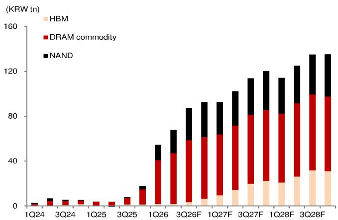

bar_stacked

| Quarter | HBM (KRW tn) | DRAM commodity (KRW tn) | NAND (KRW tn) |
| :--- | :--- | :--- | :--- |
| 1Q24 | 0 | 5 | 5 |
| 3Q24 | 0 | 10 | 10 |
| 1Q25 | 0 | 5 | 0 |
| 3Q25 | 0 | 10 | 5 |
| 1Q26 | 0 | 40 | 20 |
| 3Q26F | 5 | 70 | 30 |
| 1Q27F | 10 | 70 | 30 |
| 3Q27F | 20 | 80 | 30 |
| 1Q28F | 20 | 80 | 30 |
| 3Q28F | 35 | 90 | 30 |
| 1Q29F | 35 | 90 | 30 |
The chart displays stacked bars representing the total demand over time. The legend indicates that HBM is the primary component, DRAM commodity is the second, and NAND is the third. The values are in KRW tn. The x-axis represents the quarters from 1Q24 to 3Q28F. The y-axis represents the demand in KRW tn. There is no label for the data series.

Source: Company data, NOM estimates

Fig. 28: Memory OP and OPM trends   
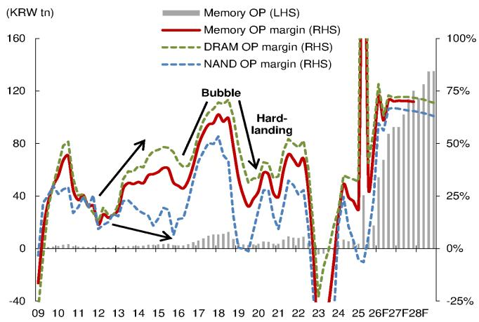  
Source: Company data, NOM estimates

Fig. 29: SEC – DRAM wafer production and bit per wafer growth outlook   
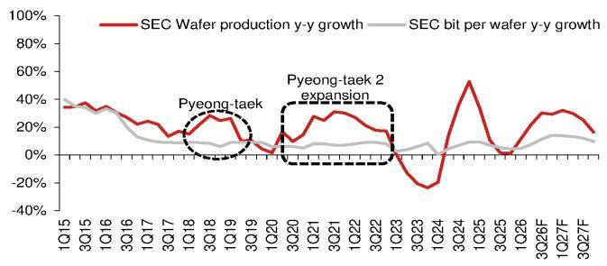

line

| Quarter | SEC Wafer production y-y growth | SEC bit per wafer y-y growth |
|---------|----------------------------------|------------------------------|
| 1Q15    | ~35%                             | ~40%                         |
| 3Q15    | ~30%                             | ~35%                         |
| 1Q16    | ~25%                             | ~30%                         |
| 3Q16    | ~20%                             | ~25%                         |
| 1Q17    | ~15%                             | ~20%                         |
| 3Q17    | ~10%                             | ~15%                         |
| 1Q18    | ~5%                              | ~10%                         |
| 3Q18    | ~0%                              | ~5%                          |
| 1Q19    | ~-5%                             | ~0%                          |
| 3Q19    | ~-10%                            | ~-5%                         |
| 1Q20    | ~-15%                            | ~-10%                        |
| 3Q20    | ~-20%                            | ~-15%                        |
| 1Q21    | ~-25%                            | ~-20%                        |
| 3Q21    | ~-30%                            | ~-25%                        |
| 1Q22    | ~-35%                            | ~-30%                        |
| 3Q22    | ~-40%                            | ~-35%                        |
| 1Q23    | ~-45%                            | ~-40%                        |
| 3Q23    | ~-50%                            | ~-45%                        |
| 1Q24    | ~-55%                            | ~-50%                        |
| 3Q24    | ~-60%                            | ~-55%                        |
| 1Q25    | ~-65%                            | ~-60%                        |
| 3Q25    | ~-70%                            | ~-65%                        |
| 1Q26    | ~-75%                            | ~-70%                        |
| 3Q26F   | ~-80%                            | ~-75%                        |
| 1Q27F   | ~-85%                            | ~-80%                        |
| 3Q27F   | ~-90%                            | ~-85%                        |

Source: Company data, NOM estimates

Fig. 30: SEC – NAND wafer production and bit per wafer growth outlook   
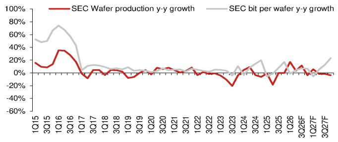

line

| Quarter | SEC Wafer production y-y growth | SEC bit per wafer y-y growth |
|---------|----------------------------------|------------------------------|
| 1Q15    | ~10%                             | ~50%                         |
| 3Q15    | ~20%                             | ~60%                         |
| 1Q16    | ~35%                             | ~75%                         |
| 3Q16    | ~20%                             | ~50%                         |
| 1Q17    | ~-10%                            | ~10%                         |
| 3Q17    | ~-5%                             | ~5%                          |
| 1Q18    | ~0%                              | ~0%                          |
| 3Q18    | ~5%                              | ~5%                          |
| 1Q19    | ~0%                              | ~0%                          |
| 3Q19    | ~5%                              | ~5%                          |
| 1Q20    | ~0%                              | ~0%                          |
| 3Q20    | ~5%                              | ~5%                          |
| 1Q21    | ~0%                              | ~0%                          |
| 3Q21    | ~5%                              | ~5%                          |
| 1Q22    | ~0%                              | ~0%                          |
| 3Q22    | ~5%                              | ~5%                          |
| 1Q23    | ~-20%                            | ~-5%                         |
| 3Q23    | ~-10%                            | ~-5%                         |
| 1Q24    | ~0%                              | ~0%                          |
| 3Q24    | ~5%                              | ~5%                          |
| 1Q25    | ~-20%                            | ~-5%                         |
| 3Q25    | ~-10%                            | ~-5%                         |
| 1Q26    | ~5%                              | ~5%                          |
| 3Q26F   | ~0%                              | ~0%                          |
| 1Q27F   | ~5%                              | ~5%                          |
| 3Q27F   | ~0%                              | ~0%                          |

Source: Company data, NOM estimates

Fig. 31: SEC – DRAM OP and OPM trends   
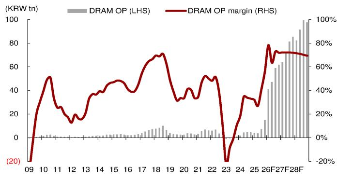

line

| Year | DRAM OP (LHS) (KRW tn) | DRAM OP margin (RHS) (%) |
|------|--------------------------|---------------------------|
| 09   | ~0                       | -20                       |
| 10   | ~0                       | ~50                       |
| 11   | ~0                       | ~30                       |
| 12   | ~0                       | ~15                       |
| 13   | ~0                       | ~25                       |
| 14   | ~0                       | ~35                       |
| 15   | ~0                       | ~45                       |
| 16   | ~0                       | ~50                       |
| 17   | ~0                       | ~60                       |
| 18   | ~0                       | ~70                       |
| 19   | ~0                       | ~65                       |
| 20   | ~0                       | ~55                       |
| 21   | ~0                       | ~50                       |
| 22   | ~0                       | ~45                       |
| 23   | ~0                       | ~-20                      |
| 24   | ~0                       | ~30                       |
| 25   | ~0                       | ~40                       |
| 26F  | ~0                       | ~80                       |
| F    | ~0                       | ~75                       |
| F2   | ~0                       | ~75                       |
| F28F | ~0                       | ~75                       |

Source: Company data, NOM estimates

Fig. 32: SEC – NAND OP and OPM trends   
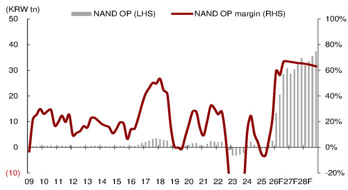

line

| Year | NAND OP (LHS) (KRW tn) | NAND OP margin (RHS) (%) |
|------|--------------------------|--------------------------|
| 09   | ~0                       | ~0                       |
| 10   | ~0                       | ~15                      |
| 11   | ~0                       | ~10                      |
| 12   | ~0                       | ~5                       |
| 13   | ~0                       | ~10                      |
| 14   | ~0                       | ~5                       |
| 15   | ~0                       | ~10                      |
| 16   | ~0                       | ~5                       |
| 17   | ~0                       | ~25                      |
| 18   | ~0                       | ~30                      |
| 19   | ~0                       | ~-5                      |
| 20   | ~0                       | ~15                      |
| 21   | ~0                       | ~10                      |
| 22   | ~0                       | ~15                      |
| 23   | ~0                       | ~-20                     |
| 24   | ~0                       | ~-10                     |
| 25   | ~0                       | ~-5                      |
| 26F  | ~0                       | ~30                      |
| 27F  | ~35                      | ~65                      |
| 28F  | ~35                      | ~65                      |

Source: Company data, NOM estimates

Fig. 33: SEC – DRAM ASP q-q / y-y, %   
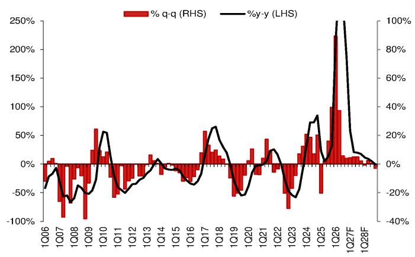

bar_line

| Quarter | % q-q (RHS) | %y-y (LHS) |
|---------|-------------|------------|
| 1Q06    | -           | -          |
| 1Q07    | -           | -          |
| 1Q08    | -           | -          |
| 1Q09    | -           | -          |
| 1Q10    | -           | -          |
| 1Q11    | -           | -          |
| 1Q12    | -           | -          |
| 1Q13    | -           | -          |
| 1Q14    | -           | -          |
| 1Q15    | -           | -          |
| 1Q16    | -           | -          |
| 1Q17    | -           | -          |
| 1Q18    | -           | -          |
| 1Q19    | -           | -          |
| 1Q20    | -           | -          |
| 1Q21    | -           | -          |
| 1Q22    | -           | -          |
| 1Q23    | -           | -          |
| 1Q24    | -           | -          |
| 1Q25    | -           | -          |
| 1Q26    | -           | -          |
| 1Q27F   | -           | -          |
| 1Q28F   | -           | -          |

Source: Company data, NOM estimates

Fig. 34: SEC – NAND ASP q-q / y-y, %   
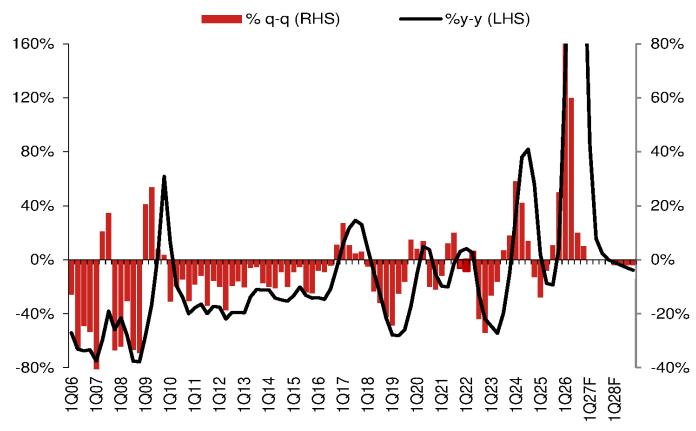

bar_line

| Quarter | % q-q (RHS) | %y-y (LHS) |
|---------|-------------|------------|
| 1Q06    | -30%        | -70%       |
| 1Q07    | 30%         | -30%       |
| 1Q08    | -20%        | -80%       |
| 1Q09    | 50%         | 70%        |
| 1Q10    | -10%        | -40%       |
| 1Q11    | -20%        | -30%       |
| 1Q12    | -10%        | -20%       |
| 1Q13    | -5%         | -10%       |
| 1Q14    | -10%        | -5%        |
| 1Q15    | -5%         | 0%         |
| 1Q16    | -10%        | 5%         |
| 1Q17    | 30%         | 10%        |
| 1Q18    | -20%        | -20%       |
| 1Q19    | -30%        | -70%       |
| 1Q20    | 20%         | 5%         |
| 1Q21    | -10%        | -5%        |
| 1Q22    | 10%         | 0%         |
| 1Q23    | -20%        | -30%       |
| 1Q24    | 40%         | 80%        |
| 1Q25    | -30%        | -20%       |
| 1Q26    | 160%        | 60%        |
| 1Q27F   | 120%        | 80%        |
| 1Q28F   | 0%          | 0%         |

Source: Company data, NOM estimates

Fig. 35: SEC – assumptions on DRAM (commodity, HBM), NAND ASP/cost/shipments 

<table><tr><td rowspan="2">Total</td><td colspan="2">2026F</td><td colspan="2">2027F</td></tr><tr><td>Old</td><td>New</td><td>Old</td><td>New</td></tr><tr><td>OP (KRW tn)</td><td>355</td><td>307</td><td>458</td><td>432</td></tr><tr><td>y-y</td><td>714%</td><td>604%</td><td>29%</td><td>41%</td></tr><tr><td>DRAM</td><td>237</td><td>209</td><td>303</td><td>302</td></tr><tr><td>NAND</td><td>108</td><td>93</td><td>143</td><td>126</td></tr><tr><td>Other divisions</td><td>10</td><td>5</td><td>12</td><td>3</td></tr><tr><td>OPM</td><td>56%</td><td>48%</td><td>61%</td><td>55%</td></tr><tr><td>DRAM</td><td>82%</td><td>71%</td><td>79%</td><td>72%</td></tr><tr><td>Commodity</td><td>85%</td><td>74%</td><td>85%</td><td>76%</td></tr><tr><td>HBM</td><td>48%</td><td>45%</td><td>54%</td><td>60%</td></tr><tr><td>NAND</td><td>73%</td><td>63%</td><td>75%</td><td>66%</td></tr></table>

<table><tr><td>DRAM Revenue (KRW tn)</td><td>290</td><td>293</td><td>381</td><td>419</td></tr><tr><td>Commodity</td><td>265</td><td>265</td><td>311</td><td>311</td></tr><tr><td>HBM</td><td>27</td><td>30</td><td>72</td><td>110</td></tr><tr><td>DRAM OP (KRW tn)</td><td>237</td><td>209</td><td>303</td><td>302</td></tr><tr><td>Commodity</td><td>225</td><td>196</td><td>265</td><td>237</td></tr><tr><td>HBM</td><td>13</td><td>13</td><td>39</td><td>67</td></tr><tr><td>DRAM OPM</td><td>82%</td><td>71%</td><td>79%</td><td>72%</td></tr><tr><td>Commodity</td><td>85%</td><td>74%</td><td>85%</td><td>76%</td></tr><tr><td>HBM</td><td>48%</td><td>45%</td><td>54%</td><td>60%</td></tr><tr><td>DRAM OP mix (%)</td><td></td><td></td><td></td><td></td></tr><tr><td>Commodity</td><td>95</td><td>94</td><td>88</td><td>78</td></tr><tr><td>HBM</td><td>5</td><td>6</td><td>13</td><td>22</td></tr><tr><td>ASP y-y</td><td></td><td></td><td></td><td></td></tr><tr><td>Commodity</td><td>276%</td><td>276%</td><td>11%</td><td>11%</td></tr><tr><td>HBM</td><td>14%</td><td>26%</td><td>45%</td><td>100%</td></tr><tr><td>Cost y-y</td><td></td><td></td><td></td><td></td></tr><tr><td>Commodity</td><td>1%</td><td>0%</td><td>9%</td><td>0%</td></tr><tr><td>HBM</td><td>-15%</td><td>-13%</td><td>28%</td><td>31%</td></tr><tr><td>Bit shipment y-y</td><td>23%</td><td>23%</td><td>23%</td><td>23%</td></tr><tr><td>Commodity</td><td>18%</td><td>18%</td><td>16%</td><td>16%</td></tr><tr><td>HBM</td><td>125%</td><td>125%</td><td>100%</td><td>100%</td></tr><tr><td>Bit mix (%)</td><td></td><td></td><td></td><td></td></tr><tr><td>Commodity</td><td>91%</td><td>91%</td><td>85%</td><td>85%</td></tr><tr><td>HBM</td><td>9%</td><td>9%</td><td>15%</td><td>15%</td></tr></table>

<table><tr><td>NAND Revenue (KRW tn)</td><td>148</td><td>148</td><td>191</td><td>191</td></tr><tr><td>NAND OP (KRW tn)</td><td>108</td><td>93</td><td>143</td><td>126</td></tr><tr><td>OPM</td><td>73%</td><td>63%</td><td>75%</td><td>66%</td></tr><tr><td>ASP y-y</td><td>252%</td><td>314%</td><td>18%</td><td>0%</td></tr><tr><td>Cost y-y</td><td>1%</td><td>10%</td><td>9%</td><td>0%</td></tr><tr><td>Bit shipment y-y</td><td>22%</td><td>46%</td><td>20%</td><td>0%</td></tr><tr><td colspan="5"></td></tr><tr><td>KRW/USD</td><td>1,434</td><td>1,434</td><td>1,315</td><td>1,315</td></tr></table>

Source: NOM estimates

Fig. 36: SEC – HBM sales, bit mix   
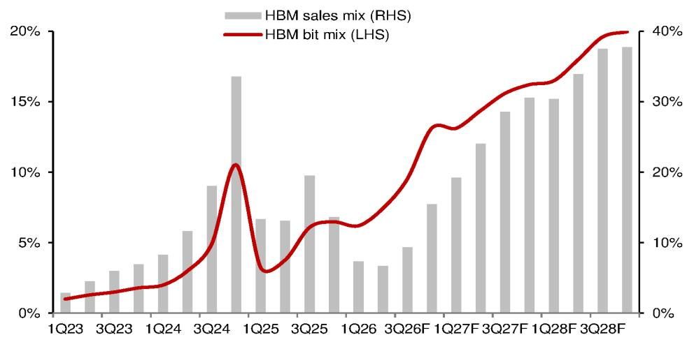  
Source: Company data, NOM estimates

Fig. 37: SEC – Non-memory sales trend   
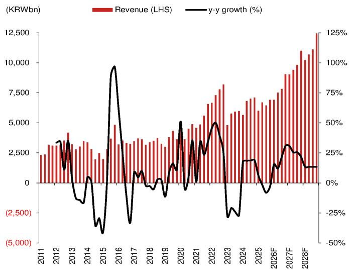

bar_line

| Year   | Revenue (LHS) | y-y growth (%) |
|--------|---------------|----------------|
| 2011   | ~2,500        | ~30%           |
| 2012   | ~3,500        | ~40%           |
| 2013   | ~4,000        | ~-10%          |
| 2014   | ~3,000        | ~-30%          |
| 2015   | ~2,500        | ~-50%          |
| 2016   | ~5,000        | ~100%          |
| 2017   | ~3,500        | ~-25%          |
| 2018   | ~3,500        | ~-10%          |
| 2019   | ~3,500        | ~-5%           |
| 2020   | ~4,500        | ~50%           |
| 2021   | ~5,000        | ~30%           |
| 2022   | ~6,500        | ~50%           |
| 2023   | ~8,000        | ~-25%          |
| 2024   | ~6,500        | ~-10%          |
| 2025   | ~7,500        | ~-5%           |
| 2026F  | ~8,500        | ~10%           |
| 2027F  | ~9,500        | ~25%           |
| 2028F  | ~11,500       | ~15%           |

Source: Company data, NOM estimates

Fig. 38: SEC – Non-memory OP and OPM trends   
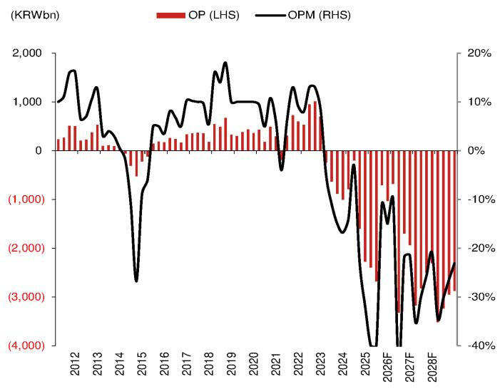

bar_line

| Year   | OP (LHS) | OPM (RHS) |
|--------|----------|-----------|
| 2012   | ~0       | ~100      |
| 2013   | ~0       | ~50       |
| 2014   | ~0       | ~-50      |
| 2015   | ~-500    | ~-300     |
| 2016   | ~0       | ~50       |
| 2017   | ~0       | ~100      |
| 2018   | ~0       | ~150      |
| 2019   | ~0       | ~100      |
| 2020   | ~0       | ~50       |
| 2021   | ~0       | ~-50      |
| 2022   | ~0       | ~100      |
| 2023   | ~0       | ~150      |
| 2024   | ~-500    | ~-200     |
| 2025   | ~-3,000  | ~-40%     |
| 2026F  | ~-2,000  | ~-30%     |
| 2027F  | ~-3,000  | ~-25%     |
| 2028F  | ~-3,500  | ~-35%     |

Source: Company data, NOM estimates

Fig. 39: SEC – smartphone sales and y-y growth trends   
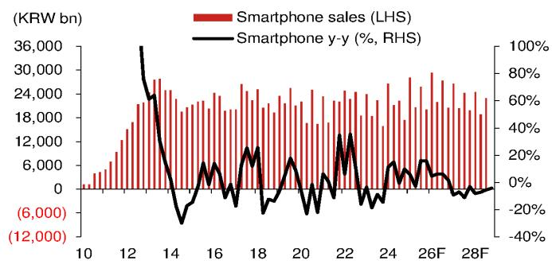

bar_line

| Year | Smartphone sales (KRW bn) | Smartphone y-y (% , RHS) |
|------|---------------------------|--------------------------|
| 10   | 0                         | 0%                       |
| 11   | 5,000                     | 0%                       |
| 12   | 10,000                    | 0%                       |
| 13   | 15,000                    | 0%                       |
| 14   | 20,000                    | -40%                     |
| 15   | 25,000                    | 0%                       |
| 16   | 24,000                    | 20%                      |
| 17   | 23,000                    | 40%                      |
| 18   | 24,000                    | 60%                      |
| 19   | 23,500                    | 40%                      |
| 20   | 24,500                    | 20%                      |
| 21   | 23,000                    | 0%                       |
| 22   | 24,000                    | 40%                      |
| 23   | 23,500                    | 20%                      |
| 24   | 24,500                    | 40%                      |
| 25   | 23,500                    | 20%                      |
| 26F  | 24,500                    | 40%                      |
| 27F  | 23,500                    | 20%                      |
| 28F  | 24,500                    | 40%                      |

Source: Company data, NOM estimates

Fig. 40: SEC – handset OP and OPM trends   
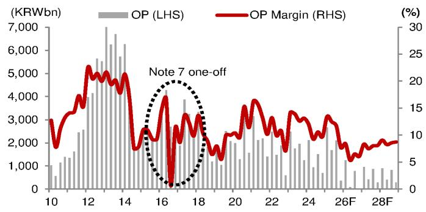

bar_line

| Year | OP (LHS) (KRWbn) | OP Margin (%) |
|------|------------------|---------------|
| 10   | ~1,000           | ~10           |
| 11   | ~1,500           | ~15           |
| 12   | ~2,000           | ~20           |
| 13   | ~3,000           | ~25           |
| 14   | ~4,000           | ~20           |
| 15   | ~2,500           | ~10           |
| 16   | ~1,000           | ~5            |
| 17   | ~4,000           | ~15           |
| 18   | ~3,000           | ~10           |
| 19   | ~2,500           | ~5            |
| 20   | ~3,000           | ~10           |
| 21   | ~2,500           | ~15           |
| 22   | ~3,000           | ~10           |
| 23   | ~2,500           | ~5            |
| 24   | ~3,000           | ~10           |
| 25   | ~2,500           | ~5            |
| 26F  | ~3,000           | ~10           |
| 27F  | ~2,500           | ~5            |
| 28F  | ~3,000           | ~10           |

Source: Company data, NOM estimates

Fig. 41: SEC – quarterly LCD/OLED OP trends   
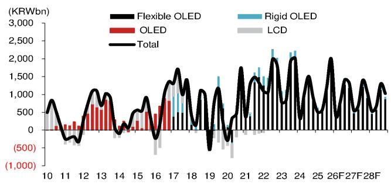  
Source: Company data, NOM estimates

Fig. 42: SEC – OPM for LCD, OLED and total display   
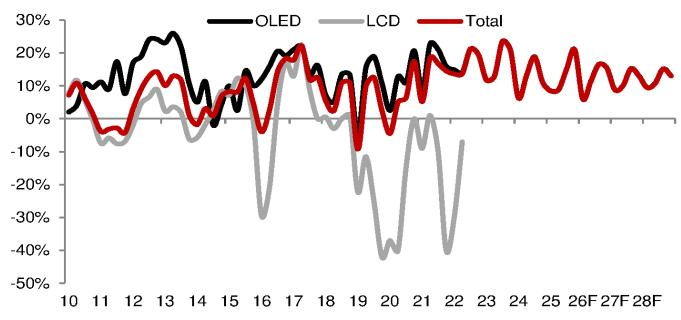

line

| Year | OLED  | LCD   | Total |
|------|-------|-------|-------|
| 10   | 0%    | 0%    | 0%    |
| 11   | 10%   | -5%   | 5%    |
| 12   | 20%   | -10%  | 10%   |
| 13   | 25%   | -5%   | 15%   |
| 14   | 10%   | 0%    | 5%    |
| 15   | 5%    | -10%  | 0%    |
| 16   | 10%   | -30%  | 5%    |
| 17   | 20%   | 10%   | 20%   |
| 18   | 10%   | -5%   | 5%    |
| 19   | 5%    | -20%  | -5%   |
| 20   | 10%   | -40%  | -10%  |
| 21   | 20%   | -5%   | 5%    |
| 22   | 15%   | -40%  | -5%   |
| 23   | 20%   | -5%   | 5%    |
| 24   | 15%   | -5%   | 10%   |
| 25   | 20%   | -5%   | 15%   |
| 26F  | 15%   | -5%   | 10%   |
| 27F  | 20%   | -5%   | 15%   |
| 28F  | 15%   | -5%   | 10%   |

Source: Company data, NOM estimates

Fig. 43: SEC – our key assumptions 

<table><tr><td></td><td>2023</td><td>2024</td><td>2025</td><td>1Q</td><td>2QF</td><td>3QF</td><td>4QF</td><td>2026F</td><td>1QF</td><td>2QF</td><td>3QF</td><td>4QF</td><td>2027F</td><td>2028F</td></tr><tr><td>DRAM ASP (8Gb eq., US$)</td><td>1.77</td><td>2.90</td><td>3.52</td><td>8.93</td><td>12.27</td><td>12.97</td><td>13.51</td><td>12.00</td><td>14.11</td><td>14.81</td><td>15.55</td><td>15.88</td><td>15.15</td><td>16.00</td></tr><tr><td>% q-q</td><td></td><td></td><td></td><td>89%</td><td>37%</td><td>6%</td><td>4%</td><td></td><td>4%</td><td>5%</td><td>5%</td><td>2%</td><td></td><td></td></tr><tr><td>% y-y</td><td>-45%</td><td>64%</td><td>22%</td><td>214%</td><td>322%</td><td>285%</td><td>187%</td><td>241%</td><td>58%</td><td>21%</td><td>20%</td><td>18%</td><td>26%</td><td>6%</td></tr><tr><td>DRAM shipments (8Gb eq., units mn)</td><td>11,152</td><td>12,809</td><td>13,916</td><td>3,979</td><td>4,152</td><td>4,376</td><td>4,603</td><td>17,109</td><td>4,603</td><td>5,043</td><td>5,577</td><td>5,899</td><td>21,123</td><td>26,450</td></tr><tr><td>% q-q</td><td></td><td></td><td></td><td>2%</td><td>4%</td><td>5%</td><td>5%</td><td></td><td>0%</td><td>10%</td><td>11%</td><td>6%</td><td></td><td></td></tr><tr><td>% y-y</td><td>9%</td><td>15%</td><td>9%</td><td>33%</td><td>27%</td><td>16%</td><td>18%</td><td>23%</td><td>16%</td><td>21%</td><td>27%</td><td>28%</td><td>23%</td><td>25%</td></tr><tr><td>DRAM revenue (KRW bn)</td><td>25,845</td><td>50,637</td><td>69,666</td><td>52,407</td><td>74,366</td><td>80,582</td><td>85,790</td><td>294,463</td><td>88,349</td><td>99,357</td><td>112,706</td><td>118,980</td><td>420,865</td><td>526,837</td></tr><tr><td>% q-q</td><td></td><td></td><td></td><td>97%</td><td>42%</td><td>8%</td><td>6%</td><td></td><td>3%</td><td>12%</td><td>13%</td><td>6%</td><td></td><td></td></tr><tr><td>% y-y</td><td>-39%</td><td>96%</td><td>38%</td><td>324%</td><td>456%</td><td>359%</td><td>223%</td><td>323%</td><td>69%</td><td>34%</td><td>40%</td><td>39%</td><td>43%</td><td>25%</td></tr><tr><td>NAND ASP (8GB eq., USD)</td><td>0.41</td><td>0.65</td><td>0.61</td><td>1.37</td><td>2.20</td><td>2.42</td><td>2.54</td><td>2.16</td><td>2.54</td><td>2.54</td><td>2.54</td><td>2.54</td><td>2.54</td><td>2.41</td></tr><tr><td>% q-q</td><td></td><td></td><td></td><td>88%</td><td>60%</td><td>10%</td><td>5%</td><td></td><td>0%</td><td>0%</td><td>0%</td><td>0%</td><td></td><td></td></tr><tr><td>% y-y</td><td>-42%</td><td>60%</td><td>-6%</td><td>138%</td><td>296%</td><td>314%</td><td>247%</td><td>252%</td><td>85%</td><td>16%</td><td>5%</td><td>0%</td><td>18%</td><td>-5%</td></tr><tr><td>NAND shipments (8GB eq., units mn)</td><td>34,063</td><td>37,826</td><td>39,498</td><td>11,048</td><td>11,379</td><td>12,517</td><td>13,143</td><td>48,086</td><td>12,486</td><td>13,609</td><td>14,970</td><td>16,467</td><td>57,533</td><td>72,086</td></tr><tr><td>% q-q</td><td></td><td></td><td></td><td>8%</td><td>3%</td><td>10%</td><td>5%</td><td></td><td>-5%</td><td>9%</td><td>10%</td><td>10%</td><td></td><td></td></tr><tr><td>% y-y</td><td>17%</td><td>11%</td><td>4%</td><td>39%</td><td>13%</td><td>12%</td><td>29%</td><td>22%</td><td>13%</td><td>20%</td><td>20%</td><td>25%</td><td>20%</td><td>25%</td></tr><tr><td>NAND flash sales (KRW bn)</td><td>18,196</td><td>33,624</td><td>34,405</td><td>22,374</td><td>36,497</td><td>42,952</td><td>46,021</td><td>148,771</td><td>43,086</td><td>45,928</td><td>49,381</td><td>53,066</td><td>191,967</td><td>216,056</td></tr><tr><td>% q-q</td><td></td><td></td><td></td><td>107%</td><td>63%</td><td>18%</td><td>7%</td><td></td><td>-6%</td><td>7%</td><td>8%</td><td>7%</td><td></td><td></td></tr><tr><td>% y-y</td><td>-31%</td><td>85%</td><td>2%</td><td>235%</td><td>363%</td><td>373%</td><td>325%</td><td>332%</td><td>93%</td><td>26%</td><td>15%</td><td>15%</td><td>29%</td><td>13%</td></tr><tr><td>Smartphone shipments (units mn)</td><td>224</td><td>228</td><td>231</td><td>58</td><td>51</td><td>56</td><td>50</td><td>216</td><td>59</td><td>54</td><td>56</td><td>52</td><td>221</td><td>221</td></tr><tr><td>% q-q</td><td></td><td></td><td></td><td>8%</td><td>-12%</td><td>9%</td><td>-10%</td><td></td><td>18%</td><td>-8%</td><td>3%</td><td>-8%</td><td></td><td></td></tr><tr><td>% y-y</td><td>-13%</td><td>2%</td><td>1%</td><td>-5%</td><td>-5%</td><td>-8%</td><td>-7%</td><td>-6%</td><td>2%</td><td>6%</td><td>0%</td><td>2%</td><td>3%</td><td>0%</td></tr><tr><td>Smartphone ASP (USD)</td><td>275</td><td>282</td><td>288</td><td>341</td><td>293</td><td>344</td><td>295</td><td>320</td><td>331</td><td>281</td><td>333</td><td>303</td><td>312</td><td>309</td></tr><tr><td>% q-q</td><td></td><td></td><td></td><td>34%</td><td>-14%</td><td>17%</td><td>-14%</td><td></td><td>12%</td><td>-15%</td><td>18%</td><td>-9%</td><td></td><td></td></tr><tr><td>% y-y</td><td>1%</td><td>3%</td><td>2%</td><td>9%</td><td>8%</td><td>13%</td><td>15%</td><td>11%</td><td>-3%</td><td>-4%</td><td>-3%</td><td>3%</td><td>-2%</td><td>-1%</td></tr><tr><td>IT&amp;Mobile Com. OPM</td><td>12%</td><td>9%</td><td>10%</td><td>7%</td><td>5%</td><td>6%</td><td>5%</td><td>6%</td><td>7%</td><td>6%</td><td>7%</td><td>7%</td><td>7%</td><td>7%</td></tr><tr><td>% q-q</td><td></td><td></td><td></td><td>0.8%</td><td>-2.7%</td><td>1.1%</td><td>-0.6%</td><td></td><td>2.0%</td><td>-0.8%</td><td>0.6%</td><td>-0.2%</td><td></td><td></td></tr><tr><td>% y-y</td><td>2.3%</td><td>-2.6%</td><td>0.8%</td><td>-4.3%</td><td>-5.9%</td><td>-4.5%</td><td>-1.3%</td><td>-4.0%</td><td>-0.2%</td><td>1.7%</td><td>1.2%</td><td>1.6%</td><td>1.0%</td><td>0.4%</td></tr><tr><td>IT&amp;Mobile Com. revenue (W bn)</td><td>110,874</td><td>119,988</td><td>129,494</td><td>38,109</td><td>30,424</td><td>36,147</td><td>29,602</td><td>134,282</td><td>35,493</td><td>28,756</td><td>32,991</td><td>28,869</td><td>126,109</td><td>120,434</td></tr><tr><td>% q-q</td><td></td><td></td><td></td><td>30%</td><td>-20%</td><td>19%</td><td>-18%</td><td></td><td>20%</td><td>-19%</td><td>15%</td><td>-12%</td><td></td><td></td></tr><tr><td>% y-y</td><td>-8%</td><td>8%</td><td>8%</td><td>3%</td><td>4%</td><td>6%</td><td>1%</td><td>4%</td><td>-7%</td><td>-5%</td><td>-9%</td><td>-2%</td><td>-6%</td><td>-5%</td></tr><tr><td>OLED unit (000/month)</td><td>369,520</td><td>343,834</td><td>330,249</td><td>25,632</td><td>24,979</td><td>30,281</td><td>31,237</td><td>336,387</td><td>24,365</td><td>25,855</td><td>32,131</td><td>29,321</td><td>335,013</td><td>332,260</td></tr><tr><td>% q-q</td><td></td><td></td><td></td><td>-24%</td><td>-3%</td><td>21%</td><td>3%</td><td></td><td>-22%</td><td>6%</td><td>24%</td><td>-9%</td><td></td><td></td></tr><tr><td>% y-y</td><td>-13%</td><td>-7%</td><td>-4%</td><td>7%</td><td>8%</td><td>4%</td><td>-8%</td><td>2%</td><td>-5%</td><td>4%</td><td>6%</td><td>-6%</td><td>0%</td><td>-1%</td></tr><tr><td>OLED flexible mix (%)</td><td>59%</td><td>57%</td><td>61%</td><td>54%</td><td>56%</td><td>59%</td><td>62%</td><td>58%</td><td>55%</td><td>58%</td><td>63%</td><td>63%</td><td>60%</td><td>0%</td></tr><tr><td>OLED revenue (W bn)</td><td>29,553</td><td>27,531</td><td>27,979</td><td>6,061</td><td>6,064</td><td>7,455</td><td>7,536</td><td>27,203</td><td>5,244</td><td>5,736</td><td>7,342</td><td>6,427</td><td>24,823</td><td>22,980</td></tr><tr><td>% q-q</td><td></td><td></td><td></td><td>-33%</td><td>0%</td><td>23%</td><td>1%</td><td></td><td>-30%</td><td>9%</td><td>28%</td><td>-12%</td><td></td><td></td></tr><tr><td>% y-y</td><td>-10%</td><td>-7%</td><td>2%</td><td>10%</td><td>2%</td><td>-1%</td><td>-17%</td><td>-3%</td><td>-13%</td><td>-5%</td><td>-2%</td><td>-15%</td><td>-9%</td><td>-7%</td></tr><tr><td>OLED total OPM</td><td>22%</td><td>15%</td><td>16%</td><td>7%</td><td>13%</td><td>19%</td><td>17%</td><td>14%</td><td>10%</td><td>12%</td><td>18%</td><td>15%</td><td>14%</td><td>14%</td></tr><tr><td>OLED total OP (W bn)</td><td>6,604</td><td>4,076</td><td>4,430</td><td>448</td><td>807</td><td>1,392</td><td>1,259</td><td>3,905</td><td>539</td><td>661</td><td>1,309</td><td>963</td><td>3,472</td><td>3,312</td></tr><tr><td>% q-q</td><td></td><td></td><td></td><td>-77%</td><td>80%</td><td>72%</td><td>-10%</td><td></td><td>-57%</td><td>23%</td><td>98%</td><td>-26%</td><td></td><td></td></tr><tr><td>% y-y</td><td>-9%</td><td>-38%</td><td>9%</td><td>-28%</td><td>29%</td><td>16%</td><td>-36%</td><td>-12%</td><td>20%</td><td>-18%</td><td>-6%</td><td>-24%</td><td>-11%</td><td>-5%</td></tr><tr><td>OP (KRW bn)</td><td>6,567</td><td>32,726</td><td>43,624</td><td>57,203</td><td>66,777</td><td>89,715</td><td>93,620</td><td>307,315</td><td>92,716</td><td>102,130</td><td>115,674</td><td>121,420</td><td>431,941</td><td>510,901</td></tr><tr><td>% q-q</td><td></td><td></td><td></td><td>185%</td><td>17%</td><td>34%</td><td>4%</td><td></td><td>-1%</td><td>10%</td><td>13%</td><td>5%</td><td></td><td></td></tr><tr><td>% y-y</td><td>-85%</td><td>398%</td><td>33%</td><td>756%</td><td>1328%</td><td>637%</td><td>366%</td><td>604%</td><td>62%</td><td>53%</td><td>29%</td><td>30%</td><td>41%</td><td>18%</td></tr><tr><td>EPS (KRW, annualized)</td><td>2,131</td><td>4,977</td><td>6,676</td><td>7,238</td><td>9,017</td><td>12,086</td><td>12,642</td><td>41,102</td><td>12,886</td><td>14,369</td><td>16,150</td><td>16,953</td><td>60,640</td><td>72,318</td></tr><tr><td>% q-q</td><td></td><td></td><td></td><td>149%</td><td>25%</td><td>34%</td><td>5%</td><td></td><td>2%</td><td>12%</td><td>12%</td><td>5%</td><td></td><td></td></tr><tr><td>% y-y</td><td>-74%</td><td>134%</td><td>34%</td><td>504%</td><td>1122%</td><td>567%</td><td>334%</td><td>516%</td><td>78%</td><td>59%</td><td>34%</td><td>34%</td><td>48%</td><td>19%</td></tr><tr><td>BPS (KRW)</td><td>52,002</td><td>57,981</td><td>63,997</td><td>70,339</td><td>77,972</td><td>90,908</td><td>94,951</td><td>94,951</td><td>104,155</td><td>115,351</td><td>129,675</td><td>136,305</td><td>136,305</td><td>163,308</td></tr><tr><td>% q-q</td><td></td><td></td><td></td><td>10%</td><td>11%</td><td>17%</td><td>4%</td><td></td><td>10%</td><td>11%</td><td>12%</td><td>5%</td><td></td><td></td></tr><tr><td>% y-y</td><td>2%</td><td>11%</td><td>10%</td><td>19%</td><td>34%</td><td>50%</td><td>48%</td><td>48%</td><td>48%</td><td>48%</td><td>43%</td><td>44%</td><td>44%</td><td>20%</td></tr><tr><td>ROE</td><td>4.1%</td><td>9.0%</td><td>10.8%</td><td>42.7%</td><td>48.3%</td><td>57.3%</td><td>54.4%</td><td>51.0%</td><td>51.7%</td><td>52.0%</td><td>52.7%</td><td>51.0%</td><td>52.1%</td><td>48.0%</td></tr><tr><td>KRW/USD</td><td>1,310</td><td>1,364</td><td>1,420</td><td>1,475</td><td>1,460</td><td>1,420</td><td>1,380</td><td>1,434</td><td>1,360</td><td>1,330</td><td>1,300</td><td>1,270</td><td>1,315</td><td>1,245</td></tr><tr><td>% q-q</td><td></td><td></td><td></td><td>2%</td><td>-1%</td><td>-3%</td><td>-3%</td><td></td><td>-1%</td><td>-2%</td><td>-2%</td><td>-2%</td><td></td><td></td></tr><tr><td>% y-y</td><td>1%</td><td>4%</td><td>4%</td><td>2%</td><td>4%</td><td>3%</td><td>-5%</td><td>1%</td><td>-8%</td><td>-9%</td><td>-8%</td><td>-8%</td><td>-8%</td><td>-5%</td></tr></table>

Source: Company data, NOM estimates

Fig. 44: SEC – SOTP valuation implied by current market cap 

<table><tr><td colspan="5">2026F</td></tr><tr><td>SOTP valuation by business (2025F)</td><td>OP after tax(OPAT)(KRWtn)</td><td>OP Margin(OPM)(%)</td><td>adj. OPAT multiple applied(x)</td><td>New Fair value (FV)(KRWtn)</td></tr><tr><td>Memory</td><td>257</td><td>68%</td><td>4.5</td><td>1,154</td></tr><tr><td>DRAM</td><td>177</td><td>71%</td><td>4.5</td><td>798</td></tr><tr><td>NAND</td><td>79</td><td>63%</td><td>4.5</td><td>357</td></tr><tr><td>Sys-LSI</td><td>-6</td><td>-24%</td><td>-</td><td>40</td></tr><tr><td>IT&amp; Mobile (IM)</td><td>6</td><td>6%</td><td>15.0</td><td>86</td></tr><tr><td>Display (85% of S.Display)</td><td>3</td><td>13%</td><td>9.0</td><td>26</td></tr><tr><td>CE &amp; Others</td><td>0</td><td>0%</td><td>8.0</td><td>-2</td></tr><tr><td>(1) Business sum</td><td>258</td><td>21%</td><td>5.0</td><td>1,304</td></tr><tr><td>(2)+(3) Other assets</td><td></td><td></td><td></td><td>333</td></tr><tr><td>(2) Net cash</td><td></td><td></td><td></td><td>286</td></tr><tr><td>(3) Invested asset, 30% discount on market value</td><td></td><td></td><td></td><td>47</td></tr><tr><td>Harman (consolidated)</td><td></td><td></td><td></td><td>15</td></tr><tr><td>Other affiliates (30% discount)</td><td></td><td></td><td></td><td>52</td></tr><tr><td>Samsung SDI - 19.6% stake</td><td></td><td></td><td></td><td>10</td></tr><tr><td>SEMCO - 23.7% stake</td><td></td><td></td><td></td><td>18</td></tr><tr><td>Samsung Biologics - 31.2% stake</td><td></td><td></td><td></td><td>20</td></tr><tr><td>Samsung SDS - 22.6% stake</td><td></td><td></td><td></td><td>3</td></tr><tr><td>Cheil Worldwide - 25.2% stake</td><td></td><td></td><td></td><td>1</td></tr><tr><td>(1+2+3) Total FV (KRW tn)</td><td></td><td></td><td></td><td>1,638</td></tr><tr><td rowspan="3">Current Market cap (KRWtn)</td><td>Total</td><td></td><td></td><td>1,660</td></tr><tr><td>common</td><td></td><td></td><td>1,519</td></tr><tr><td>preferred</td><td></td><td></td><td>142</td></tr><tr><td rowspan="3">Outstanding share (mn shares)</td><td>Total</td><td></td><td></td><td>6,403</td></tr><tr><td>common</td><td></td><td></td><td>5,614</td></tr><tr><td>preferred</td><td></td><td></td><td>789</td></tr><tr><td rowspan="3">Current share price (KRW)</td><td>Weighted average</td><td></td><td></td><td>260,000</td></tr><tr><td>common</td><td></td><td></td><td>270,500</td></tr><tr><td>preferred</td><td></td><td></td><td>179,400</td></tr><tr><td>SOTP-implied share price (KRW)</td><td></td><td></td><td></td><td>260,000</td></tr></table>

Note: Current share price as of 15 May 2026.   
Source: Company data, NOM estimates

Fig. 45: SEC – capex forecasts by division 

<table><tr><td>(KRWtn)</td><td>2019</td><td>2020</td><td>2021</td><td>2022</td><td>2023</td><td>2024</td><td>2025</td><td>2026F</td><td>2027F</td><td>2028F</td><td>2019 % growth</td><td>2020 % growth</td><td>2021 % growth</td><td>2022 % growth</td><td>2023 % growth</td><td>2024 % growth</td><td>2025 % growth</td><td>2026F % growth</td><td>2027F % growth</td><td>2028F % growth</td></tr><tr><td>Semi</td><td>22.7</td><td>31.9</td><td>45.2</td><td>51.1</td><td>52.3</td><td>42.0</td><td>47.5</td><td>79.2</td><td>96.8</td><td>140.2</td><td>-1%</td><td>41%</td><td>42%</td><td>13%</td><td>2%</td><td>-20%</td><td>13%</td><td>67%</td><td>22%</td><td>45%</td></tr><tr><td>Memory</td><td>17.1</td><td>23.3</td><td>31.2</td><td>35.1</td><td>35.8</td><td>34.0</td><td>42.6</td><td>61.4</td><td>75.8</td><td>115.2</td><td>-15%</td><td>36%</td><td>34%</td><td>12%</td><td>2%</td><td>-5%</td><td>25%</td><td>44%</td><td>23%</td><td>52%</td></tr><tr><td>DRAM</td><td>9.1</td><td>11.0</td><td>16.0</td><td>21.4</td><td>20.3</td><td>24.2</td><td>31.1</td><td>50.3</td><td>54.1</td><td>84.3</td><td>-29%</td><td>20%</td><td>46%</td><td>33%</td><td>-5%</td><td>19%</td><td>29%</td><td>62%</td><td>8%</td><td>56%</td></tr><tr><td>NAND</td><td>8.0</td><td>12.3</td><td>15.2</td><td>13.7</td><td>15.5</td><td>9.8</td><td>11.5</td><td>11.1</td><td>21.7</td><td>30.9</td><td>9%</td><td>55%</td><td>23%</td><td>-10%</td><td>13%</td><td>-37%</td><td>17%</td><td>-4%</td><td>96%</td><td>43%</td></tr><tr><td>S-LSI</td><td>5.6</td><td>8.6</td><td>14.0</td><td>16.0</td><td>16.5</td><td>8.0</td><td>4.9</td><td>17.8</td><td>21.0</td><td>25.0</td><td>100%</td><td>54%</td><td>63%</td><td>14%</td><td>3%</td><td>-52%</td><td>-38%</td><td>261%</td><td>18%</td><td>19%</td></tr><tr><td>OLED</td><td>2.2</td><td>4.5</td><td>2.6</td><td>2.5</td><td>2.4</td><td>4.8</td><td>2.8</td><td>2.0</td><td>2.0</td><td>2.0</td><td>-27%</td><td>105%</td><td>-42%</td><td>-4%</td><td>-4%</td><td>100%</td><td>-42%</td><td>-29%</td><td>0%</td><td>0%</td></tr><tr><td>Telecom/DM</td><td>1.0</td><td>1.0</td><td>1.0</td><td>1.0</td><td>1.1</td><td>1.2</td><td>1.0</td><td>1.0</td><td>1.0</td><td>1.0</td><td>0%</td><td>0%</td><td>0%</td><td>0%</td><td>10%</td><td>9%</td><td>-17%</td><td>0%</td><td>0%</td><td>0%</td></tr><tr><td>Others</td><td>1.0</td><td>1.0</td><td>0.0</td><td>1.6</td><td>1.8</td><td>3.0</td><td>1.4</td><td>2.0</td><td>3.0</td><td>3.0</td><td>-60%</td><td>0%</td><td>-100%</td><td>na</td><td>13%</td><td>67%</td><td>-53%</td><td>43%</td><td>50%</td><td>0%</td></tr><tr><td>Total</td><td>26.9</td><td>38.4</td><td>48.8</td><td>56.2</td><td>57.6</td><td>51.0</td><td>52.7</td><td>84.2</td><td>102.8</td><td>146.2</td><td>-10%</td><td>43%</td><td>27%</td><td>15%</td><td>3%</td><td>-12%</td><td>3%</td><td>60%</td><td>22%</td><td>42%</td></tr></table>

Source: Company data, NOM estimates

Fig. 46: SEC – FCF/EV and FCF/MC analysis 

<table><tr><td>(KRWtn)</td><td>2018</td><td>2019</td><td>2020</td><td>2021</td><td>2022</td><td>2023</td><td>2024</td><td>2025P</td><td>2026F</td><td>2027F</td><td>2028F</td></tr><tr><td>Operating cash flow</td><td>67.0</td><td>45.4</td><td>65.3</td><td>65.1</td><td>62.2</td><td>44.1</td><td>73.0</td><td>85.3</td><td>287.6</td><td>422.4</td><td>513.3</td></tr><tr><td>NP</td><td>44.3</td><td>21.7</td><td>26.4</td><td>39.9</td><td>54.7</td><td>14.5</td><td>33.6</td><td>44.3</td><td>263.2</td><td>381.3</td><td>449.1</td></tr><tr><td>Dep</td><td>25.2</td><td>26.6</td><td>27.1</td><td>31.3</td><td>36.0</td><td>35.5</td><td>39.6</td><td>43.6</td><td>47.4</td><td>56.3</td><td>69.3</td></tr><tr><td>working capital change</td><td>-10.3</td><td>-6.7</td><td>11.7</td><td>-6.1</td><td>-28.5</td><td>-5.9</td><td>-0.3</td><td>-2.6</td><td>-22.9</td><td>-15.1</td><td>-5.1</td></tr><tr><td>Investment Cash Flow</td><td>-30.3</td><td>-27.6</td><td>-39.5</td><td>-47.4</td><td>-52.3</td><td>-59.1</td><td>-55.1</td><td>-48.8</td><td>-79.3</td><td>-104.1</td><td>-141.1</td></tr><tr><td>Capex</td><td>-29.6</td><td>-25.4</td><td>-37.6</td><td>-47.1</td><td>-49.4</td><td>-57.6</td><td>-51.4</td><td>-47.5</td><td>-80.2</td><td>-105.0</td><td>-142.0</td></tr><tr><td>intangible asset</td><td>-1.0</td><td>-3.2</td><td>-2.7</td><td>-2.9</td><td>-3.7</td><td>-2.4</td><td>-4.6</td><td>0.0</td><td>0.0</td><td>0.0</td><td>0.0</td></tr><tr><td>Net M&amp;A</td><td>0.0</td><td>0.0</td><td>0.0</td><td>0.0</td><td>0.0</td><td>0.0</td><td>0.0</td><td>-2.2</td><td>0.0</td><td>0.0</td><td>0.0</td></tr><tr><td>Others</td><td>0.3</td><td>1.0</td><td>0.8</td><td>2.7</td><td>0.9</td><td>0.9</td><td>0.9</td><td>0.9</td><td>0.9</td><td>0.9</td><td>0.9</td></tr><tr><td>Free Cash Flow</td><td>36.8</td><td>17.8</td><td>25.8</td><td>17.7</td><td>9.9</td><td>-14.9</td><td>17.8</td><td>36.5</td><td>208.4</td><td>318.3</td><td>372.2</td></tr><tr><td>Share holder return (cash flow basis)</td><td>18.4</td><td>8.9</td><td>12.9</td><td>9.0</td><td>5.0</td><td>-7.5</td><td>8.9</td><td>18.2</td><td>104.2</td><td>159.1</td><td>186.1</td></tr><tr><td>% of FCF</td><td>50%</td><td>50%</td><td>50%</td><td>51%</td><td>50%</td><td>50%</td><td>50%</td><td>50%</td><td>50%</td><td>50%</td><td>50%</td></tr><tr><td>sharebuy back</td><td>0.9</td><td>0.0</td><td>0.0</td><td>0.0</td><td>0.0</td><td>0.0</td><td>1.8</td><td>8.2</td><td>13.1</td><td>36.4</td><td>61.9</td></tr><tr><td>cash dividend</td><td>10.2</td><td>9.6</td><td>9.7</td><td>20.5</td><td>9.8</td><td>9.9</td><td>10.9</td><td>9.9</td><td>10.9</td><td>95.1</td><td>232.2</td></tr><tr><td>Net Cash (including marketing securities)</td><td>81.7</td><td>84.7</td><td>101.6</td><td>102.4</td><td>104.5</td><td>79.1</td><td>93.3</td><td>101.4</td><td>286.3</td><td>471.4</td><td>539.6</td></tr><tr><td>weighted Avg. Share price (KRW)</td><td>37,858</td><td>54,540</td><td>80,104</td><td>77,440</td><td>54,719</td><td>76,537</td><td>52,110</td><td>116,185</td><td>259,277</td><td>259,279</td><td>259,366</td></tr><tr><td>common</td><td>38,700</td><td>55,800</td><td>81,000</td><td>78,300</td><td>55,300</td><td>78,500</td><td>53,200</td><td>119,900</td><td>270,500</td><td>270,500</td><td>270,500</td></tr><tr><td>preferred</td><td>31,750</td><td>45,400</td><td>73,600</td><td>71,200</td><td>50,500</td><td>62,300</td><td>44,200</td><td>89,200</td><td>179,400</td><td>179,400</td><td>179,400</td></tr><tr><td>outstanding shares (mn shares)</td><td>6,793</td><td>6,793</td><td>6,793</td><td>6,793</td><td>6,793</td><td>6,793</td><td>6,793</td><td>6,736</td><td>6,508</td><td>6,308</td><td>6,225</td></tr><tr><td>common</td><td>5,970</td><td>5,970</td><td>5,970</td><td>5,970</td><td>5,970</td><td>5,970</td><td>5,970</td><td>5,920</td><td>5,706</td><td>5,532</td><td>5,463</td></tr><tr><td>preferred</td><td>823</td><td>823</td><td>823</td><td>823</td><td>823</td><td>823</td><td>823</td><td>816</td><td>802</td><td>776</td><td>762</td></tr><tr><td>Dividend-paying shares (outstanding shares ex T.S.; mn shares)</td><td>6,793</td><td>6,793</td><td>6,793</td><td>6,793</td><td>6,793</td><td>6,793</td><td>6,755</td><td>6,630</td><td>6,403</td><td>6,287</td><td>6,210</td></tr><tr><td>common</td><td>5,970</td><td>5,970</td><td>5,970</td><td>5,970</td><td>5,970</td><td>5,970</td><td>5,937</td><td>5,828</td><td>5,614</td><td>5,513</td><td>5,451</td></tr><tr><td>preferred</td><td>823</td><td>823</td><td>823</td><td>823</td><td>823</td><td>823</td><td>818</td><td>802</td><td>789</td><td>774</td><td>759</td></tr><tr><td>Market cap</td><td>257</td><td>370</td><td>544</td><td>526</td><td>372</td><td>520</td><td>354</td><td>783</td><td>1,687</td><td>1,636</td><td>1,615</td></tr><tr><td>Market cap ex T.S.</td><td>257</td><td>370</td><td>544</td><td>526</td><td>372</td><td>520</td><td>352</td><td>770</td><td>1,660</td><td>1,630</td><td>1,611</td></tr><tr><td>EV</td><td>176</td><td>286</td><td>443</td><td>424</td><td>267</td><td>441</td><td>259</td><td>669</td><td>1,374</td><td>1,159</td><td>1,071</td></tr><tr><td>Free cash / EV</td><td>20.9%</td><td>6.2%</td><td>5.8%</td><td>4.2%</td><td>3.7%</td><td>-3.4%</td><td>6.9%</td><td>5.5%</td><td>15.2%</td><td>27.5%</td><td>34.7%</td></tr><tr><td>Free cash / MC</td><td>14.3%</td><td>4.8%</td><td>4.7%</td><td>3.4%</td><td>2.7%</td><td>-2.9%</td><td>5.0%</td><td>4.7%</td><td>12.3%</td><td>19.5%</td><td>23.1%</td></tr><tr><td>Free cash / MC ex T.S.</td><td>14.3%</td><td>4.8%</td><td>4.7%</td><td>3.4%</td><td>2.7%</td><td>-2.9%</td><td>5.1%</td><td>4.7%</td><td>12.6%</td><td>19.5%</td><td>23.1%</td></tr></table>

Note: 2018-2025 share price as of year-end and 2026-28F share price as of 15 May 2026.   
Source: Company data, NOM estimates

Fig. 47: SEC – dividend yield and shareholder returns yield 

<table><tr><td></td><td>2018</td><td>2019</td><td>2020</td><td>2021</td><td>2022</td><td>2023</td><td>2024</td><td>2025</td><td>2026F</td><td>2027F</td><td>2028F</td></tr><tr><td>FCF (KRWbn)</td><td>36,755</td><td>17,765</td><td>25,815</td><td>17,983</td><td>9,911</td><td>(14,926)</td><td>17,845</td><td>36,493</td><td>208,363</td><td>318,282</td><td>372,171</td></tr><tr><td>Annual shareholder return budget (KRWbn; balance sheet basis)</td><td>18,377</td><td>8,883</td><td>12,908</td><td>8,992</td><td>4,955</td><td>(7,463)</td><td>8,923</td><td>18,246</td><td>104,182</td><td>159,141</td><td>186,085</td></tr><tr><td>Annual shareholder return budget per share (KRW)</td><td>2,705</td><td>1,308</td><td>1,900</td><td>1,324</td><td>730</td><td>(1,099)</td><td>1,321</td><td>2,752</td><td>16,272</td><td>25,312</td><td>29,967</td></tr><tr><td>*(30% x preceding FCF for 2015; the rest 50% x preceding year FCF; KRWbn)</td><td></td><td></td><td></td><td></td><td></td><td></td><td></td><td></td><td></td><td></td><td></td></tr><tr><td>Annual cash dividends (KRWbn; balance sheet basis)</td><td>7,079</td><td>9,619</td><td>20,338</td><td>9,820</td><td>9,819</td><td>9,820</td><td>9,806</td><td>11,113</td><td>67,804</td><td>97,194</td><td>231,380</td></tr><tr><td>Common shares</td><td>6,226</td><td>8,453</td><td>17,874</td><td>8,629</td><td>8,629</td><td>8,629</td><td>8,618</td><td>9,768</td><td>59,450</td><td>85,219</td><td>203,025</td></tr><tr><td>Preferred shares</td><td>853</td><td>1,166</td><td>2,465</td><td>1,190</td><td>1,189</td><td>1,190</td><td>1,189</td><td>1,345</td><td>8,354</td><td>11,975</td><td>28,355</td></tr><tr><td>Annually remaining shareholder return budget (KRWbn)</td><td>11,299</td><td>(737)</td><td>(7,430)</td><td>(828)</td><td>(4,863)</td><td>(17,282)</td><td>(884)</td><td>7,133</td><td>36,377</td><td>61,947</td><td>(45,294)</td></tr><tr><td>*(Annual shareholder return budget - annual cash dividends)</td><td></td><td></td><td></td><td></td><td></td><td></td><td></td><td></td><td></td><td></td><td></td></tr><tr><td>Accumulated Annual shareholder return budget (KRWbn)</td><td></td><td>10,562</td><td>3,132</td><td>2,304</td><td>(2,560)</td><td>(19,842)</td><td>(20,726)</td><td>(13,592)</td><td>22,785</td><td>84,732</td><td>39,438</td></tr><tr><td>DPS (KRW; balance sheet basis)</td><td></td><td></td><td></td><td></td><td></td><td></td><td></td><td></td><td></td><td></td><td></td></tr><tr><td>Common shares</td><td>1,416</td><td>1,416</td><td>2,994</td><td>1,446</td><td>1,446</td><td>1,446</td><td>1,446</td><td>1,669</td><td>10,584</td><td>15,421</td><td>37,103</td></tr><tr><td>Preferred shares</td><td>1,417</td><td>1,417</td><td>2,995</td><td>1,447</td><td>1,446</td><td>1,447</td><td>1,447</td><td>1,669</td><td>10,585</td><td>15,422</td><td>37,104</td></tr><tr><td>DPS (KRW; cash flow basis)</td><td></td><td></td><td></td><td></td><td></td><td></td><td></td><td></td><td></td><td></td><td></td></tr><tr><td>Common shares</td><td>1,492</td><td>1,416</td><td>1,416</td><td>1,438</td><td>1,446</td><td>2,530</td><td>1,446</td><td>1,446</td><td>1,669</td><td>14,921</td><td>37,103</td></tr><tr><td>Preferred shares</td><td>1,493</td><td>1,417</td><td>1,417</td><td>3,017</td><td>1,447</td><td>2,530</td><td>1,447</td><td>1,447</td><td>1,669</td><td>14,922</td><td>37,104</td></tr><tr><td>weighted Avg. Share price (KRW)</td><td>37,858</td><td>54,540</td><td>80,104</td><td>77,440</td><td>54,719</td><td>76,537</td><td>52,110</td><td>116,185</td><td>259,277</td><td>259,279</td><td>259,366</td></tr><tr><td>Common shares</td><td>38,700</td><td>55,800</td><td>81,000</td><td>78,300</td><td>55,300</td><td>78,500</td><td>53,200</td><td>119,900</td><td>270,500</td><td>270,500</td><td>270,500</td></tr><tr><td>Preferred shares</td><td>31,750</td><td>45,400</td><td>73,600</td><td>71,200</td><td>50,500</td><td>62,300</td><td>44,200</td><td>89,200</td><td>179,400</td><td>179,400</td><td>179,400</td></tr><tr><td>outstanding shares ex Treasury shares (mn shares)</td><td>6,793</td><td>6,793</td><td>6,793</td><td>6,793</td><td>6,793</td><td>6,793</td><td>6,755</td><td>6,630</td><td>6,403</td><td>6,287</td><td>6,210</td></tr><tr><td>Common shares</td><td>5,970</td><td>5,970</td><td>5,970</td><td>5,970</td><td>5,970</td><td>5,970</td><td>5,937</td><td>5,828</td><td>5,614</td><td>5,513</td><td>5,451</td></tr><tr><td>Preferred shares</td><td>823</td><td>823</td><td>823</td><td>823</td><td>823</td><td>823</td><td>818</td><td>802</td><td>789</td><td>774</td><td>759</td></tr><tr><td>Dividend yield (DPS / share price)</td><td></td><td></td><td></td><td></td><td></td><td></td><td></td><td></td><td></td><td></td><td></td></tr><tr><td>Common shares</td><td>3.7%</td><td>2.5%</td><td>3.7%</td><td>1.8%</td><td>2.6%</td><td>1.8%</td><td>2.7%</td><td>1.4%</td><td>3.9%</td><td>5.7%</td><td>13.7%</td></tr><tr><td>Preferred shares</td><td>4.5%</td><td>3.1%</td><td>4.1%</td><td>2.0%</td><td>2.9%</td><td>2.3%</td><td>3.3%</td><td>1.9%</td><td>5.9%</td><td>8.6%</td><td>20.7%</td></tr><tr><td>Shareholder return yield (total shareholder return / market cap)</td><td></td><td></td><td></td><td></td><td></td><td></td><td></td><td></td><td></td><td></td><td></td></tr><tr><td>Common shares</td><td>7.0%</td><td>2.3%</td><td>2.3%</td><td>1.7%</td><td>1.3%</td><td>-1.4%</td><td>2.5%</td><td>2.3%</td><td>6.0%</td><td>9.4%</td><td>11.1%</td></tr><tr><td>Preferred shares</td><td>8.5%</td><td>2.9%</td><td>2.6%</td><td>1.9%</td><td>1.4%</td><td>-1.8%</td><td>3.0%</td><td>3.1%</td><td>9.1%</td><td>14.1%</td><td>16.7%</td></tr><tr><td>Cash dividend payout ratio</td><td>21.6%</td><td>44.2%</td><td>36.4%</td><td>24.1%</td><td>17.5%</td><td>66.3%</td><td>28.6%</td><td>21.7%</td><td>3.6%</td><td>2.5%</td><td>2.1%</td></tr><tr><td>Share holder return payout ratio</td><td>41.4%</td><td>40.9%</td><td>48.9%</td><td>22.5%</td><td>9.1%</td><td>-51.6%</td><td>26.5%</td><td>41.2%</td><td>39.6%</td><td>41.7%</td><td>41.4%</td></tr></table>

Note: 2018-2025 share price as of year-end and 2026-28F share price as of 15 May 2026.   
Source: Company data, NOM estimates

EQUITY: MEMORY

# Cyclical to secular thanks to AI

Raise TP to KRW4,000,000, reflecting lower risk premium based on enhanced business stability driven by LTAs

Maintain Buy and raise TP to KRW4,000,000; secular growth to drive share price re-rating

We reiterate Buy and raise TP from KRW2,340,000 to KRW4,000,000. We derive our new TP by applying a target P/B of 6.0x (previously: 3.5x) to 12MF BVPS of KRW673,248. We raise the target multiple by a significant 71% based on our increased conviction that memory industry cash flows will witness a structural shift toward long-term streams through strongly binding LTAs. While we have lowered the target discount rate from 21% to 12%, it is still far higher than \~6% currently applied to TSMC's (2330 TT, Buy; based on 2027F valuation) market valuation. We expect discount rates applied to memory players' valuations to progressively decrease going forward. Our target discount rate implies a target P/E of 8x, which translates into a target P/B of 6x based on Hynix's annualized 2Q27F ROE. The new TP implies 120% upside vs. the current share price, and we expect 2026F/27F FCF return to be 11%/23% vs. the current market cap. Our TP translates into a target market cap of KRW2,754tn, and as we expect end-2027F net cash balance of KRW361tn, our TP implies a target EV of KRW2,393tn.

Expect 2026F/27F/28F OP to reach KRW281tn/394tn/480tn; Hynix's higher ROE vs Samsung can be attributable to its financial leverage and pure-play business portfolio

We are raising our 2026F/27F/28F OP for Hynix by 1%/4%/9% to KRW281tn/394tn/480tn (+496%/+40%/+22% y-y). The company demonstrates notably higher ROE compared to SEC (005930 KS, Buy), as it has high degree of financial leverage and a pure-play memory business. As Hynix grows cash balance to bolster financial stability, financial leverage will become lower, in our view. Still, our estimates peg 2026F/27F/28F ROEs at 100%/73%/54%, which could converge to \~60% longer term during the LTA periods based on shareholder return and growth from re-investments, markedly higher than the Korea market average (excluding SEC and Hynix) of \~10%. With a projected cash balance of \~KRW100tn by 1H26F, we believe that Hynix might look to broaden its investor base through proactive shareholder return policies and ADR listing in the US.

<table><tr><td>Year-end 31 Dec</td><td colspan="2">FY25</td><td colspan="2">FY26F</td><td colspan="2">FY27F</td><td colspan="2">FY28F</td></tr><tr><td>Currency (KRW)</td><td>Actual</td><td>Old</td><td>New</td><td>Old</td><td>New</td><td>Old</td><td>New</td><td></td></tr><tr><td>Revenue (bn)</td><td>97,147</td><td>357,774</td><td>359,989</td><td>491,909</td><td>506,560</td><td>602,521</td><td>643,715</td><td></td></tr><tr><td>Reported net profit (bn)</td><td>42,948</td><td>234,239</td><td>235,084</td><td>304,157</td><td>315,878</td><td>352,286</td><td>384,943</td><td></td></tr><tr><td>Normalised net profit (bn)</td><td>42,948</td><td>234,239</td><td>235,084</td><td>304,157</td><td>315,878</td><td>352,286</td><td>384,943</td><td></td></tr><tr><td>FD normalised EPS</td><td>58,710</td><td>328,664</td><td>329,849</td><td>426,766</td><td>443,211</td><td>545,166</td><td>595,907</td><td></td></tr><tr><td>FD norm. EPS growth (%)</td><td>116.9</td><td>459.8</td><td>461.8</td><td>29.8</td><td>34.4</td><td>27.7</td><td>34.5</td><td></td></tr><tr><td>FD normalised P/E (x)</td><td>31.0</td><td>-</td><td>5.5</td><td>-</td><td>4.1</td><td>-</td><td>3.1</td><td></td></tr><tr><td>EV/EBITDA (x)</td><td>21.5</td><td>-</td><td>3.8</td><td>-</td><td>2.3</td><td>-</td><td>1.3</td><td></td></tr><tr><td>Price/book (x)</td><td>10.4</td><td>-</td><td>3.6</td><td>-</td><td>2.2</td><td>-</td><td>0.9</td><td></td></tr><tr><td>Dividend yield (%)</td><td>0.2</td><td>-</td><td>0.6</td><td>-</td><td>1.2</td><td>-</td><td>0.1</td><td></td></tr><tr><td>ROE (%)</td><td>44.1</td><td>100.1</td><td>100.2</td><td>70.8</td><td>72.5</td><td>51.8</td><td>54.3</td><td></td></tr><tr><td>Net debt/equity (%)</td><td>6.1</td><td>net cash</td><td>net cash</td><td>net cash</td><td>net cash</td><td>net cash</td><td>net cash</td><td></td></tr></table>

Source: Company data, NOM estimates

<table><tr><td>RatingRemains</td><td>Buy</td></tr></table>

<table><tr><td>Target priceIncreased fromKRW 2,340,000</td></tr></table>

<table><tr><td>KRW 4,000,000</td></tr></table>

<table><tr><td>Closing price15 May 2026</td></tr></table>

<table><tr><td>KRW 1,819,000</td></tr></table>

<table><tr><td>Implied upside</td><td>+119.9%</td></tr></table>

<table><tr><td>Market Cap (USD mn)</td><td>863,636.6</td></tr><tr><td>ADT (USD mn)</td><td>3,167.6</td></tr></table>

Relative performance chart   
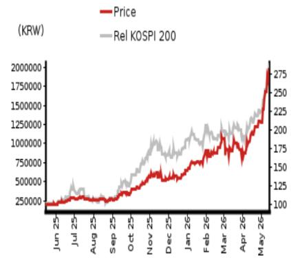

line

| Date   | Price     | Rel KOSPI 200 |
|--------|-----------|---------------|
| Jun 25 | ~250000   | ~100          |
| Jul 25 | ~300000   | ~125          |
| Aug 25 | ~400000   | ~150          |
| Sep 25 | ~500000   | ~175          |
| Oct 25 | ~600000   | ~200          |
| Nov 25 | ~750000   | ~225          |
| Dec 25 | ~900000   | ~250          |
| Jan 26 | ~1100000  | ~275          |
| Feb 26 | ~1300000  | ~275          |
| Mar 26 | ~1500000  | ~275          |
| Apr 26 | ~1750000  | ~275          |
| May 26 | ~2000000  | ~275          |

Source: LSEG, NOM

# Research Analysts

Asia Pacific Technology

CW Chung - NIHK

cwchung@NOM.com

+852 2252 6075

Korea Technology

Eon Hwang - NFIK

eon.hwang@NOM.com

+822 3783 2318

YJ Kim, CFA - NFIK

yj.kim1@NOM.com

+82237832332

# Key data on SK Hynix

Performance 

<table><tr><td>(%)</td><td>1M</td><td>3M</td><td>12M</td><td></td><td></td></tr><tr><td>Absolute (KRW)</td><td>60.1</td><td>106.7</td><td>807.2</td><td>M cap (USDmn)</td><td>863,636.6</td></tr><tr><td>Absolute (USD)</td><td>57.3</td><td>98.3</td><td>741.5</td><td>Free float (%)</td><td>64.0</td></tr><tr><td>Rel to KOSPI 200</td><td>24.5</td><td>54.1</td><td>551.2</td><td>3-mth ADT (USDmn)</td><td>3,167.6</td></tr></table>

Income statement (KRWbn) 

<table><tr><td>Year-end 31 Dec</td><td>FY24</td><td>FY25</td><td>FY26F</td><td>FY27F</td><td>FY28F</td></tr><tr><td>Revenue</td><td>66,193</td><td>97,147</td><td>359,989</td><td>506,560</td><td>643,715</td></tr><tr><td>Cost of goods sold</td><td>-34,365</td><td>-38,456</td><td>-58,351</td><td>-88,952</td><td>-135,701</td></tr><tr><td>Gross profit</td><td>31,828</td><td>58,691</td><td>301,638</td><td>417,608</td><td>508,014</td></tr><tr><td>SG&amp;A</td><td>-8,361</td><td>-11,484</td><td>-20,389</td><td>-24,095</td><td>-28,253</td></tr><tr><td>Employee share expense</td><td>0</td><td>0</td><td>0</td><td>0</td><td>0</td></tr><tr><td>Operating profit</td><td>23,467</td><td>47,206</td><td>281,249</td><td>393,513</td><td>479,761</td></tr><tr><td>EBITDA</td><td>35,827</td><td>61,200</td><td>297,588</td><td>415,930</td><td>513,274</td></tr><tr><td>Depreciation</td><td>-12,360</td><td>-13,993</td><td>-16,339</td><td>-22,417</td><td>-33,513</td></tr><tr><td>Amortisation</td><td></td><td></td><td></td><td></td><td></td></tr><tr><td>EBIT</td><td>23,467</td><td>47,206</td><td>281,249</td><td>393,513</td><td>479,761</td></tr><tr><td>Net interest expense</td><td>-1,000</td><td>-429</td><td>350</td><td>1,140</td><td>1,140</td></tr><tr><td>Associates &amp; JCEs</td><td>-38</td><td>-565</td><td>9,980</td><td>160</td><td>160</td></tr><tr><td>Other income</td><td>1,457</td><td>4,253</td><td>2,545</td><td>34</td><td>117</td></tr><tr><td>Earnings before tax</td><td>23,885</td><td>50,466</td><td>294,124</td><td>394,847</td><td>481,178</td></tr><tr><td>Income tax</td><td>-4,088</td><td>-7,518</td><td>-59,040</td><td>-78,969</td><td>-96,236</td></tr><tr><td>Net profit after tax</td><td>19,797</td><td>42,948</td><td>235,084</td><td>315,878</td><td>384,943</td></tr><tr><td>Minority interests</td><td>0</td><td></td><td></td><td></td><td></td></tr><tr><td>Other items</td><td>0</td><td></td><td></td><td></td><td></td></tr><tr><td>Preferred dividends</td><td>0</td><td></td><td></td><td></td><td></td></tr><tr><td>Normalised NPAT</td><td>19,797</td><td>42,948</td><td>235,084</td><td>315,878</td><td>384,943</td></tr><tr><td>Extraordinary items</td><td></td><td></td><td></td><td></td><td></td></tr><tr><td>Reported NPAT</td><td>19,797</td><td>42,948</td><td>235,084</td><td>315,878</td><td>384,943</td></tr><tr><td>Dividends</td><td>-1,522</td><td>-2,066</td><td>-7,107</td><td>-13,546</td><td>-969</td></tr><tr><td>Transfer to reserves</td><td>18,275</td><td>40,882</td><td>227,977</td><td>302,331</td><td>383,974</td></tr></table>

Valuations and ratios 

<table><tr><td>Reported P/E (x)</td><td>63.2</td><td>29.2</td><td>5.3</td><td>4.0</td><td>3.1</td></tr><tr><td>Normalised P/E (x)</td><td>63.2</td><td>29.2</td><td>5.3</td><td>4.0</td><td>3.1</td></tr><tr><td>FD normalised P/E (x)</td><td>67.2</td><td>31.0</td><td>5.5</td><td>4.1</td><td>3.1</td></tr><tr><td>Dividend yield (%)</td><td>0.1</td><td>0.2</td><td>0.6</td><td>1.2</td><td>0.1</td></tr><tr><td>Price/cashflow (x)</td><td>44.7</td><td>24.9</td><td>7.0</td><td>3.9</td><td>3.0</td></tr><tr><td>Price/book (x)</td><td>16.9</td><td>10.4</td><td>3.6</td><td>2.2</td><td>0.9</td></tr><tr><td>EV/EBITDA (x)</td><td>36.5</td><td>21.5</td><td>3.8</td><td>2.3</td><td>1.3</td></tr><tr><td>EV/EBIT (x)</td><td>55.8</td><td>28.0</td><td>4.0</td><td>2.4</td><td>1.4</td></tr><tr><td>Gross margin (%)</td><td>48.1</td><td>60.4</td><td>83.8</td><td>82.4</td><td>78.9</td></tr><tr><td>EBITDA margin (%)</td><td>54.1</td><td>63.0</td><td>82.7</td><td>82.1</td><td>79.7</td></tr><tr><td>EBIT margin (%)</td><td>35.5</td><td>48.6</td><td>78.1</td><td>77.7</td><td>74.5</td></tr><tr><td>Net margin (%)</td><td>29.9</td><td>44.2</td><td>65.3</td><td>62.4</td><td>59.8</td></tr><tr><td>Effective tax rate (%)</td><td>17.1</td><td>14.9</td><td>20.1</td><td>20.0</td><td>20.0</td></tr><tr><td>Dividend payout (%)</td><td>7.7</td><td>4.8</td><td>3.0</td><td>4.3</td><td>0.3</td></tr><tr><td>ROE (%)</td><td>31.1</td><td>44.1</td><td>100.2</td><td>72.5</td><td>54.3</td></tr><tr><td>ROA (pretax %)</td><td>23.3</td><td>34.6</td><td>133.2</td><td>132.5</td><td>130.9</td></tr><tr><td colspan="6">Growth (%)</td></tr><tr><td>Revenue</td><td>102.0</td><td>46.8</td><td>270.6</td><td>40.7</td><td>27.1</td></tr><tr><td>EBITDA</td><td>525.9</td><td>70.8</td><td>386.3</td><td>39.8</td><td>23.4</td></tr><tr><td>Normalised EPS</td><td></td><td>116.8</td><td>447.4</td><td>34.4</td><td>29.9</td></tr><tr><td>Normalised FDEPS</td><td></td><td>116.9</td><td>461.8</td><td>34.4</td><td>34.5</td></tr></table>

Source: Company data, NOM estimates

Cashflow statement (KRWbn) 

<table><tr><td>Year-end 31 Dec</td><td>FY24</td><td>FY25</td><td>FY26F</td><td>FY27F</td><td>FY28F</td></tr><tr><td>EBITDA</td><td>35,827</td><td>61,200</td><td>297,588</td><td>415,930</td><td>513,274</td></tr><tr><td>Change in working capital</td><td>1,987</td><td>3,111</td><td>-56,123</td><td>68,388</td><td>-12,398</td></tr><tr><td>Other operating cashflow</td><td>-8,019</td><td>-10,937</td><td>-56,677</td><td>-152,389</td><td>-106,688</td></tr><tr><td>Cashflow from operations</td><td>29,796</td><td>53,373</td><td>184,788</td><td>331,930</td><td>394,188</td></tr><tr><td>Capital expenditure</td><td>-15,946</td><td>-27,519</td><td>-42,657</td><td>-61,000</td><td>-96,000</td></tr><tr><td>Free cashflow</td><td>13,850</td><td>25,854</td><td>142,131</td><td>270,930</td><td>298,188</td></tr><tr><td>Reduction in investments</td><td>-1,695</td><td>-28,765</td><td>-1,278</td><td>-1,343</td><td>-1,411</td></tr><tr><td>Net acquisitions</td><td></td><td></td><td></td><td></td><td></td></tr><tr><td>Dec in other LT assets</td><td>0</td><td>0</td><td>0</td><td>0</td><td>0</td></tr><tr><td>Inc in other LT liabilities</td><td>-2,665</td><td>433</td><td>80</td><td>81</td><td>83</td></tr><tr><td>Adjustments</td><td>2,301</td><td>7,796</td><td>852</td><td>-81</td><td>-83</td></tr><tr><td>CF after investing acts</td><td>11,791</td><td>5,319</td><td>141,786</td><td>269,587</td><td>296,777</td></tr><tr><td>Cash dividends</td><td>-826</td><td>-1,681</td><td>-1,033</td><td>-969</td><td>-969</td></tr><tr><td>Equity issue</td><td>115</td><td>4,467</td><td>-94</td><td>0</td><td>0</td></tr><tr><td>Debt issue</td><td>-7,376</td><td>768</td><td>-7,754</td><td>-8,000</td><td>-6,000</td></tr><tr><td>Convertible debt issue</td><td>0</td><td>0</td><td>0</td><td>0</td><td>0</td></tr><tr><td>Others</td><td>-86</td><td>-5,153</td><td>3,031</td><td>-63,959</td><td>0</td></tr><tr><td>CF from financial acts</td><td>-8,173</td><td>-1,600</td><td>-5,850</td><td>-72,928</td><td>-6,969</td></tr><tr><td>Net cashflow</td><td>3,618</td><td>3,719</td><td>135,936</td><td>196,659</td><td>289,808</td></tr><tr><td>Beginning cash</td><td>7,587</td><td>11,205</td><td>14,924</td><td>150,859</td><td>347,518</td></tr><tr><td>Ending cash</td><td>11,205</td><td>14,924</td><td>150,859</td><td>347,518</td><td>637,326</td></tr><tr><td>Ending net debt</td><td>11,479</td><td>7,324</td><td>-136,541</td><td>-339,327</td><td>-634,332</td></tr></table>

Balance sheet (KRWbn) 

<table><tr><td>As at 31 Dec</td><td>FY24</td><td>FY25</td><td>FY26F</td><td>FY27F</td><td>FY28F</td></tr><tr><td>Cash &amp; equivalents</td><td>11,205</td><td>14,924</td><td>150,859</td><td>347,518</td><td>637,326</td></tr><tr><td>Marketable securities</td><td>2,951</td><td>20,018</td><td>20,018</td><td>20,018</td><td>20,018</td></tr><tr><td>Accounts receivable</td><td>13,019</td><td>18,199</td><td>64,484</td><td>75,397</td><td>99,556</td></tr><tr><td>Inventories</td><td>13,314</td><td>14,289</td><td>40,505</td><td>37,888</td><td>40,022</td></tr><tr><td>Other current assets</td><td>1,790</td><td>2,027</td><td>16,818</td><td>10,002</td><td>17,298</td></tr><tr><td>Total current assets</td><td>42,279</td><td>69,458</td><td>292,684</td><td>490,823</td><td>814,221</td></tr><tr><td>LT investments</td><td>13,400</td><td>25,097</td><td>26,375</td><td>27,718</td><td>29,129</td></tr><tr><td>Fixed assets</td><td>60,157</td><td>77,503</td><td>103,820</td><td>142,403</td><td>204,890</td></tr><tr><td>Goodwill</td><td>4,019</td><td>4,049</td><td>4,214</td><td>4,385</td><td>4,563</td></tr></table>

Other intangible assets 

<table><tr><td>Other LT assets</td><td>0</td><td>0</td><td>0</td><td>0</td><td>0</td></tr><tr><td>Total assets</td><td>119,855</td><td>176,108</td><td>427,093</td><td>665,329</td><td>1,052,803</td></tr><tr><td>Short-term debt</td><td>5,252</td><td>8,162</td><td>891</td><td>140</td><td>318</td></tr><tr><td>Accounts payable</td><td>2,277</td><td>2,848</td><td>6,086</td><td>8,276</td><td>10,562</td></tr><tr><td>Other current liabilities</td><td>17,436</td><td>26,369</td><td>54,299</td><td>121,976</td><td>140,883</td></tr><tr><td>Total current liabilities</td><td>24,965</td><td>37,379</td><td>61,275</td><td>130,392</td><td>151,763</td></tr><tr><td>Long-term debt</td><td>17,432</td><td>14,086</td><td>13,427</td><td>8,052</td><td>2,676</td></tr><tr><td>Convertible debt</td><td>0</td><td>0</td><td>0</td><td>0</td><td>0</td></tr><tr><td>Other LT liabilities</td><td>3,543</td><td>3,976</td><td>4,055</td><td>4,136</td><td>4,219</td></tr><tr><td>Total liabilities</td><td>45,940</td><td>55,441</td><td>78,757</td><td>142,580</td><td>158,658</td></tr><tr><td>Minority interest</td><td>0</td><td>0</td><td></td><td></td><td></td></tr><tr><td>Preferred stock</td><td>0</td><td>0</td><td></td><td></td><td></td></tr><tr><td>Common stock</td><td>3,658</td><td>3,658</td><td>3,564</td><td>3,564</td><td>3,564</td></tr><tr><td>Retained earnings</td><td>65,418</td><td>106,577</td><td>334,447</td><td>572,819</td><td>944,215</td></tr><tr><td>Proposed dividends</td><td>0</td><td>0</td><td></td><td></td><td></td></tr><tr><td>Other equity and reserves</td><td>4,840</td><td>10,433</td><td>10,326</td><td>-53,634</td><td>-53,634</td></tr><tr><td>Total shareholders&#x27; equity</td><td>73,916</td><td>120,667</td><td>348,336</td><td>522,749</td><td>894,145</td></tr><tr><td>Total equity &amp; liabilities</td><td>119,855</td><td>176,108</td><td>427,093</td><td>665,329</td><td>1,052,803</td></tr></table>

Liquidity (x) 

<table><tr><td>Current ratio</td><td>1.69</td><td>1.86</td><td>4.78</td><td>3.76</td><td>5.37</td></tr><tr><td>Interest cover</td><td>23.5</td><td>109.9</td><td>-</td><td>-</td><td>-</td></tr></table>

Leverage 

<table><tr><td>Net debt/EBITDA (x)</td><td>0.32</td><td>0.12</td><td>net cash</td><td>net cash</td><td>net cash</td></tr><tr><td>Net debt/equity (%)</td><td>15.5</td><td>6.1</td><td>net cash</td><td>net cash</td><td>net cash</td></tr></table>

Per share 

<table><tr><td>Reported EPS (KRW)</td><td>28,769</td><td>62,368</td><td>341,385</td><td>458,713</td><td>595,907</td></tr><tr><td>Norm EPS (KRW)</td><td>28,769</td><td>62,368</td><td>341,385</td><td>458,713</td><td>595,907</td></tr><tr><td>FD norm EPS (KRW)</td><td>27,062</td><td>58,710</td><td>329,849</td><td>443,211</td><td>595,907</td></tr><tr><td>BVPS (KRW)</td><td>107,339</td><td>175,230</td><td>505,848</td><td>809,236</td><td>1,945,485</td></tr><tr><td>DPS (KRW)</td><td>2,210</td><td>3,000</td><td>10,320</td><td>20,971</td><td>2,108</td></tr></table>

Activity (days) 

<table><tr><td>Days receivable</td><td>54.1</td><td>58.6</td><td>41.9</td><td>50.4</td><td>49.7</td></tr><tr><td>Days inventory</td><td>142.3</td><td>131.0</td><td>171.4</td><td>160.8</td><td>105.1</td></tr><tr><td>Days payable</td><td>21.9</td><td>24.3</td><td>27.9</td><td>29.5</td><td>25.4</td></tr><tr><td>Cash cycle</td><td>174.5</td><td>165.3</td><td>185.4</td><td>181.8</td><td>129.4</td></tr></table>

Source: Company data, NOM estimates

# Company profile

SK Hynix Inc. provides products and services for the electronic components industries. The Company manufactures semiconductors such as dynamic random access memory (DRAM) and NAND flash memory.

# Valuation Methodology

Our 12-month target price of KRW4,000,000 is derived by applying a target P/B of 6.0x to 12MF BVPS of KRW673,248. Our target multiple reflects increased conviction for transition into longer-term cash flow scheme based on memory LTAs. The benchmark index for this stock is the KOSPI 200.

# Risks that may impede the achievement of the target price

Downside risk includes potential US tariffs on semiconductor products, delay in data center construction due to power supply shortage, and slowdown in AI capex under a higher interest rate environment.

# ESG

We believe Hynix is heavily focused on following ESG policies. Recently Hynix issued green bonds worth USD 1 billion (KRW 1.1 trillion) and social bonds worth KRW 440 billion to ESG. Green bonds are used for eco-friendly projects such as water quality management, energy efficiency, pollution prevention, and ecological environment restoration and social infrastructure. Social bonds are invested in projects to solve social problems, such as creating jobs, supporting the vulnerable, and building social infrastructure. Both bonds are used exclusively for ESG purposes. Furthermore, Hynix announced the mid- to long-term roadmap 'SV 2030' for maximizing social value creation and set goals in four areas: environment, shared growth, social safety net, and corporate culture. The company presented a direction to focus on ESG management and explained that Hynix would strengthen 'RE100' and 'Zero Net Emissions', which increase the use of renewable energy to 100% by 2050.

Fig. 48: Global memory sales growth vs. USD/KRW over the past 10 years   
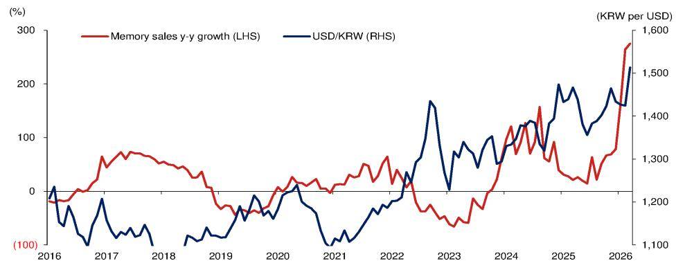

line

| Year | Memory sales y-y growth (%) | USD/KRW (KRW per USD) |
|------|-----------------------------|------------------------|
| 2016 | -100                        | 1,100                  |
| 2017 | 50                          | 1,200                  |
| 2018 | 30                          | 1,150                  |
| 2019 | -20                         | 1,100                  |
| 2020 | 20                          | 1,250                  |
| 2021 | -10                         | 1,100                  |
| 2022 | 30                          | 1,300                  |
| 2023 | -5                          | 1,450                  |
| 2024 | 10                          | 1,400                  |
| 2025 | 5                           | 1,500                  |
| 2026 | 300                         | 1,550                  |

Source: WSTS, Quantiwise, NOM

Fig. 49: Hynix – revisions to our earnings forecasts 

<table><tr><td rowspan="2">(K-IFRS consolidated)Unit: KRWbn, %</td><td colspan="4">2026F</td><td colspan="4">2027F</td><td colspan="4">2028F</td></tr><tr><td>Old</td><td>New</td><td>Diff. %</td><td>% y-y</td><td>Old</td><td>New</td><td>Diff. %</td><td>% y-y</td><td>Old</td><td>New</td><td>Diff. %</td><td>% y-y</td></tr><tr><td>Sales</td><td>357,774</td><td>359,989</td><td>0.6%</td><td>270.6%</td><td>491,909</td><td>506,560</td><td>3.0%</td><td>40.7%</td><td>602,521</td><td>643,715</td><td>6.8%</td><td>27.1%</td></tr><tr><td>Sales - DRAM</td><td>257,622</td><td>259,279</td><td>0.6%</td><td>243.6%</td><td>345,117</td><td>359,768</td><td>4.2%</td><td>38.8%</td><td>405,408</td><td>446,145</td><td>10.0%</td><td>24.0%</td></tr><tr><td>Sales - NAND</td><td>98,576</td><td>99,134</td><td>0.6%</td><td>396.6%</td><td>145,295</td><td>145,295</td><td>0.0%</td><td>46.6%</td><td>195,691</td><td>196,148</td><td>0.2%</td><td>35.0%</td></tr><tr><td>Sales - Other</td><td>1,576</td><td>1,576</td><td>0.0%</td><td>-8.1%</td><td>1,497</td><td>1,497</td><td>0.0%</td><td>-5.0%</td><td>1,422</td><td>1,422</td><td>0.0%</td><td>-5.0%</td></tr><tr><td>Operating Profit</td><td>279,548</td><td>281,249</td><td>0.6%</td><td>495.8%</td><td>378,862</td><td>393,513</td><td>3.9%</td><td>39.9%</td><td>438,954</td><td>479,761</td><td>9.3%</td><td>21.9%</td></tr><tr><td>OP - DRAM</td><td>209,824</td><td>211,154</td><td>0.6%</td><td>361.9%</td><td>273,238</td><td>287,889</td><td>5.4%</td><td>36.3%</td><td>304,146</td><td>344,647</td><td>13.3%</td><td>19.7%</td></tr><tr><td>OP - NAND</td><td>70,413</td><td>70,784</td><td>0.5%</td><td>3297.5%</td><td>106,372</td><td>106,372</td><td>0.0%</td><td>50.3%</td><td>135,021</td><td>135,328</td><td>0.2%</td><td>27.2%</td></tr><tr><td>% OPM</td><td>78%</td><td>78%</td><td>0.0%p</td><td>29.5%p</td><td>77%</td><td>78%</td><td>0.7%p</td><td>-0.4%p</td><td>73%</td><td>75%</td><td>1.7%p</td><td>-3.2%p</td></tr><tr><td>% OPM - DRAM</td><td>81%</td><td>81%</td><td>0.0%p</td><td>20.9%p</td><td>79%</td><td>80%</td><td>0.8%p</td><td>-1.4%p</td><td>75%</td><td>77%</td><td>2.2%p</td><td>-2.8%p</td></tr><tr><td>% OPM - NAND</td><td>71%</td><td>71%</td><td>0.0%p</td><td>61.0%p</td><td>73%</td><td>73%</td><td>0.0%p</td><td>1.8%p</td><td>69%</td><td>69%</td><td>0.0%p</td><td>-4.2%p</td></tr><tr><td>Net Profit</td><td>234,239</td><td>235,084</td><td>0.4%</td><td>447.4%</td><td>304,157</td><td>315,878</td><td>3.9%</td><td>34.4%</td><td>352,286</td><td>384,943</td><td>9.3%</td><td>21.9%</td></tr><tr><td>DRAM bit shipment (1Gb eq., mn)</td><td>13,934</td><td>13,934</td><td>0.0%</td><td>25.0%</td><td>18,551</td><td>18,551</td><td>0.0%</td><td>33.1%</td><td>23,189</td><td>23,189</td><td>0.0%</td><td>25.0%</td></tr><tr><td>% y-y</td><td>25%</td><td>25%</td><td>0.0%p</td><td></td><td>33%</td><td>33%</td><td>0.0%p</td><td></td><td>25%</td><td>25%</td><td>0.0%p</td><td></td></tr><tr><td>DRAM ASP (1Gb eq., USD)</td><td>13.00</td><td>12.98</td><td>-0.1%</td><td>172.9%</td><td>14.15</td><td>14.75</td><td>4.2%</td><td>13.6%</td><td>14.07</td><td>15.45</td><td>9.8%</td><td>4.8%</td></tr><tr><td>% y-y</td><td>173%</td><td>173%</td><td>-0.4%p</td><td></td><td>9%</td><td>14%</td><td>4.8%p</td><td></td><td>-1%</td><td>5%</td><td>5.3%p</td><td></td></tr><tr><td>DRAM Cost (1Gb eq., USD)</td><td>2.41</td><td>2.41</td><td>-0.1%</td><td>28.5%</td><td>2.95</td><td>2.95</td><td>0.0%</td><td>22.3%</td><td>3.51</td><td>3.52</td><td>0.0%</td><td>19.3%</td></tr><tr><td>% y-y</td><td>29%</td><td>28%</td><td>-0.1%p</td><td></td><td>22%</td><td>22%</td><td>0.1%p</td><td></td><td>19%</td><td>19%</td><td>0.0%p</td><td></td></tr><tr><td>NAND bit shipment (8Gb eq., mn)</td><td>35,200</td><td>35,200</td><td>0.0%</td><td>29.9%</td><td>45,993</td><td>45,993</td><td>0.0%</td><td>30.7%</td><td>69,907</td><td>69,907</td><td>0.0%</td><td>52.0%</td></tr><tr><td>% y-y</td><td>30%</td><td>30%</td><td>0.0%p</td><td></td><td>31%</td><td>31%</td><td>0.0%p</td><td></td><td>52%</td><td>52%</td><td>0.0%p</td><td></td></tr><tr><td>NAND ASP (8Gb eq., USD cents)</td><td>196.87</td><td>196.43</td><td>-0.2%</td><td>279.4%</td><td>240.24</td><td>240.24</td><td>0.0%</td><td>22.3%</td><td>225.30</td><td>225.37</td><td>0.0%</td><td>-6.2%</td></tr><tr><td>% y-y</td><td>280%</td><td>279%</td><td>-0.8%p</td><td></td><td>22%</td><td>22%</td><td>0.3%p</td><td></td><td>-6%</td><td>-6%</td><td>0.0%p</td><td></td></tr><tr><td>NAND Cost (8Gb eq., USD cents)</td><td>56.25</td><td>56.18</td><td>-0.1%</td><td>21.2%</td><td>64.36</td><td>64.36</td><td>0.0%</td><td>14.6%</td><td>69.85</td><td>69.88</td><td>0.0%</td><td>8.6%</td></tr><tr><td>% y-y</td><td>21%</td><td>21%</td><td>-0.2%p</td><td></td><td>14%</td><td>15%</td><td>0.1%p</td><td></td><td>9%</td><td>9%</td><td>0.1%p</td><td></td></tr><tr><td>KRW:USD1</td><td>1,423</td><td>1,434</td><td>0.8%</td><td>0.7%</td><td>1,315</td><td>1,315</td><td>0.0%</td><td>-8.3%</td><td>1,243</td><td>1,245</td><td>0.2%</td><td>-5.3%</td></tr></table>

Sources: NOM estimates

Fig. 50: Hynix - trailing P/B band: upside from BV increase   
  
Source: Quantiwise, NOM estimates

Fig. 51: Hynix – trailing P/B vs ROE   
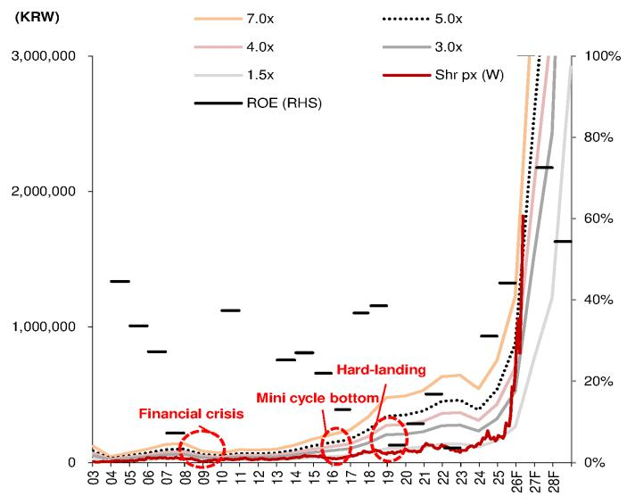

line

| Year | 7.0x | 4.0x | 3.0x | 1.5x | 5.0x | 1.5x | ROE (RHS) |
|------|------|------|------|------|------|------|-----------|
| 2026F | ~3,000,000 | ~3,000,000 | ~3,000,000 | ~3,000,000 | ~3,000,000 | ~3,000,000 | ~100% |
| 27F | ~3,000,000 | ~3,000,000 | ~3,000,000 | ~3,000,000 | ~3,000,000 | ~3,000,000 | ~100% |
| 28F | ~3,000,000 | ~3,000,000 | ~3,000,000 | ~3,000,000 | ~3,000,000 | ~3,000,000 | ~100% |

Sources: Bloomberg Finance L.P., Quantiwise, NOM estimates

Fig. 52: Hynix – P/E vs share price   
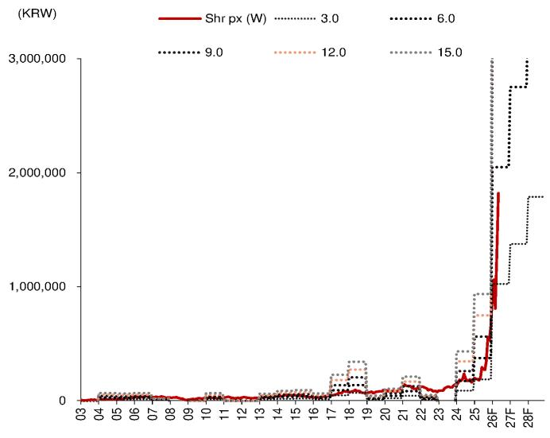  
Source: Bloomberg Finance L.P., Quantiwise, NOM estimates

Fig. 53: Hynix – 2026F/2027F OP consensus vs NOM estimates   
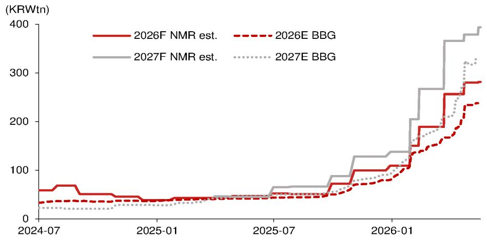

line

| Date     | 2026F NMR est. | 2026E BBG | 2027F NMR est. | 2027E BBG |
|----------|----------------|-----------|----------------|-----------|
| 2024-07  | ~60            | ~30       | ~30            | ~20       |
| 2025-01  | ~40            | ~35       | ~40            | ~30       |
| 2025-07  | ~50            | ~45       | ~60            | ~50       |
| 2026-01  | ~100           | ~80       | ~150           | ~120      |
| 2026-07  | ~150           | ~120      | ~250           | ~180      |
| 2027-01  | ~280           | ~240      | ~380           | ~320      |
| 2027-07  | ~300           | ~280      | ~400           | ~350      |

Source: Bloomberg Finance L.P., NOM estimates

Fig. 54: Hynix - OP trend by product   
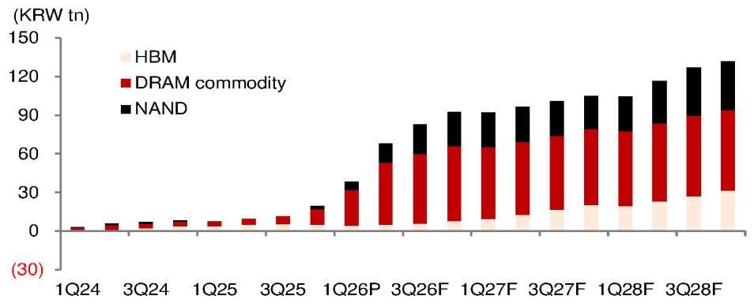

bar_stacked

| Quarter | HBM (KRW tn) | DRAM commodity (KRW tn) | NAND (KRW tn) |
| :--- | :--- | :--- | :--- |
| 1Q24 | 0 | 5 | 0 |
| 3Q24 | 0 | 10 | 0 |
| 1Q25 | 0 | 10 | 0 |
| 3Q25 | 0 | 15 | 0 |
| 1Q26P | 0 | 30 | 10 |
| 3Q26F | 0 | 55 | 20 |
| 1Q27F | 0 | 60 | 20 |
| 3Q27F | 0 | 65 | 20 |
| 1Q28F | 0 | 70 | 20 |
| 3Q28F | 0 | 75 | 25 |
| Final | 30 | 75 | 30 |

Source: Company data, NOM estimates

Fig. 55: Market cap comparison – Hynix vs. peers   
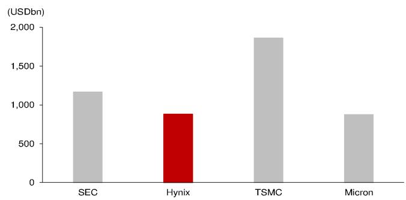

bar

| Category | Value (USDbn) |
|---|---|
| SEC | 1200 |
| Hynix | 900 |
| TSMC | 1850 |
| Micron | 900 |

Note: Market cap as of 23 April 2026; SEC market cap includes both common and preferred shares.   
Source: Bloomberg Finance L.P., NOM

Fig. 56: OP comparison – Hynix vs. peers   
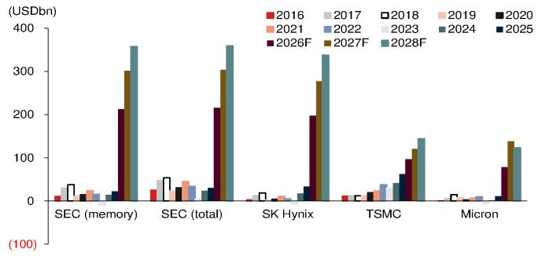

bar

| Category       | 2016  | 2017  | 2018  | 2019  | 2020  | 2021  | 2022  | 2023  | 2024  | 2025  | 2026F | 2027F | 2028F |
| -------------- | ----- | ----- | ----- | ----- | ----- | ----- | ----- | ----- | ----- | ----- | ----- | ----- | ----- |
| SEC (memory)   | ~10   | ~30   | ~40   | ~20   | ~15   | ~25   | ~15   | ~10   | ~15   | ~10   | ~20   | ~300  | ~350  |
| SEC (total)    | ~20   | ~50   | ~40   | ~30   | ~25   | ~40   | ~30   | ~25   | ~30   | ~25   | ~210  | ~300  | ~350  |
| SK Hynix       | ~5    | ~10   | ~15   | ~10   | ~5    | ~10   | ~15   | ~10   | ~15   | ~10   | ~190  | ~270  | ~330  |
| TSMC           | ~10   | ~15   | ~20   | ~15   | ~10   | ~25   | ~35   | ~30   | ~40   | ~30   | ~90   | ~120  | ~140  |
| Micron         | ~5    | ~10   | ~15   | ~10   | ~5    | ~15   | ~20   | ~15   | ~20   | ~15   | ~75   | ~135  | ~125  |

Note: Bloomberg consensus estimates for Micron   
Source: Company data, Bloomberg Finance L.P., NOM estimates.

Fig. 57: Hynix – HBM bit, sales mix in DRAM   
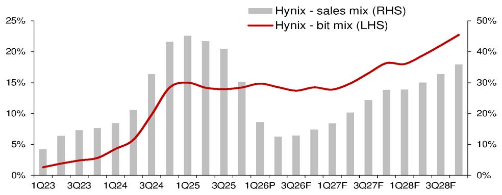

bar_line

| Quarter | Hynix - sales mix (RHS) | Hynix - bit mix (LHS) |
|---------|--------------------------|------------------------|
| 1Q23    | 4%                       | 1%                     |
| 3Q23    | 6%                       | 2%                     |
| 1Q24    | 7%                       | 3%                     |
| 3Q24    | 10%                      | 5%                     |
| 1Q25    | 22%                      | 15%                    |
| 3Q25    | 21%                      | 14%                    |
| 1Q26P   | 8%                       | 15%                    |
| 3Q26F   | 6%                       | 14%                    |
| 1Q27F   | 8%                       | 15%                    |
| 3Q27F   | 10%                      | 18%                    |
| 1Q28F   | 14%                      | 35%                    |
| 3Q28F   | 18%                      | 45%                    |

Source: Company data, NOM estimates

Fig. 58: DDR5 16Gb spot price vs contract price   
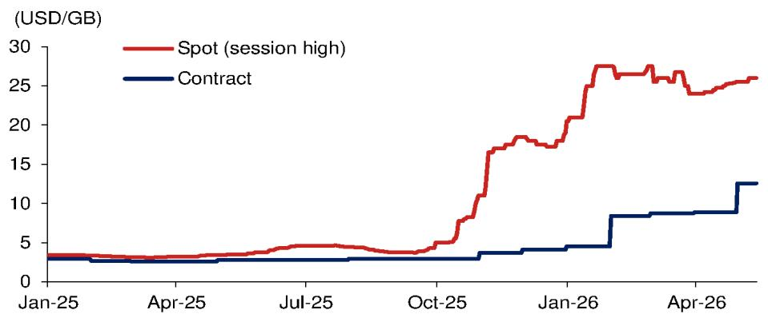

line

| Date   | Spot (session high) | Contract |
|--------|---------------------|----------|
| Jan-25 | ~3                  | ~3       |
| Apr-25 | ~3                  | ~3       |
| Jul-25 | ~4                  | ~3       |
| Oct-25 | ~5                  | ~3       |
| Jan-26 | ~18                 | ~4       |
| Apr-26 | ~26                 | ~13      |

Note: Converted DDR5 16Gb (2Gx8) 4800/5600 spot price and DDR5 16GB U-DIMM contract price into USD/GB unit. Source: DrameXchange, NOM

Fig. 59: DRAM/NAND ASP forecast revisions 

<table><tr><td></td><td>1Q25</td><td>2Q25</td><td>3Q25</td><td>4Q25</td><td>1Q26P</td><td>2Q26F</td><td>3Q26F</td><td>4Q26F</td><td>1Q27F</td><td>2Q27F</td><td>3Q27F</td><td>4Q27F</td><td>2025</td><td>2026F</td><td>2027F</td><td>2028F</td></tr><tr><td colspan="17">New forecasts</td></tr><tr><td>DRAM blended ASP (USD/GB)</td><td>4.3</td><td>4.4</td><td>4.6</td><td>5.7</td><td>9.3</td><td>13.4</td><td>14.2</td><td>14.5</td><td>14.4</td><td>14.6</td><td>14.9</td><td>15.1</td><td>4.8</td><td>13.1</td><td>14.8</td><td>15.5</td></tr><tr><td>q-q (%)</td><td>0%</td><td>2%</td><td>4%</td><td>24%</td><td>65%</td><td>44%</td><td>6%</td><td>2%</td><td>-1%</td><td>2%</td><td>2%</td><td>1%</td><td></td><td></td><td></td><td></td></tr><tr><td>y-y (%)</td><td>49%</td><td>32%</td><td>19%</td><td>33%</td><td>118%</td><td>208%</td><td>212%</td><td>156%</td><td>54%</td><td>9%</td><td>5%</td><td>4%</td><td>32%</td><td>175%</td><td>13%</td><td>5%</td></tr><tr><td>Commodity ASP</td><td>2.8</td><td>2.9</td><td>3.1</td><td>4.6</td><td>9.1</td><td>13.7</td><td>14.3</td><td>14.4</td><td>13.9</td><td>13.7</td><td>13.5</td><td>13.4</td><td>3.4</td><td>13.1</td><td>13.6</td><td>13.2</td></tr><tr><td>q-q (%)</td><td>-2%</td><td>4%</td><td>9%</td><td>47%</td><td>97%</td><td>51%</td><td>5%</td><td>1%</td><td>-4%</td><td>-1%</td><td>-1%</td><td>-1%</td><td></td><td></td><td></td><td></td></tr><tr><td>y-y (%)</td><td>11%</td><td>4%</td><td>10%</td><td>63%</td><td>229%</td><td>377%</td><td>359%</td><td>213%</td><td>53%</td><td>0%</td><td>-6%</td><td>-7%</td><td>24%</td><td>285%</td><td>4%</td><td>-3%</td></tr><tr><td>HBM ASP</td><td>12.9</td><td>13.4</td><td>13.4</td><td>12.0</td><td>10.8</td><td>11.8</td><td>13.3</td><td>15.1</td><td>17.3</td><td>19.9</td><td>21.9</td><td>23.0</td><td>12.9</td><td>12.9</td><td>20.9</td><td>24.1</td></tr><tr><td>q-q (%)</td><td>-1%</td><td>4%</td><td>0%</td><td>-10%</td><td>-10%</td><td>9%</td><td>13%</td><td>13%</td><td>15%</td><td>15%</td><td>10%</td><td>5%</td><td></td><td></td><td></td><td></td></tr><tr><td>y-y (%)</td><td>13%</td><td>10%</td><td>5%</td><td>-7%</td><td>-16%</td><td>-12%</td><td>0%</td><td>25%</td><td>60%</td><td>69%</td><td>64%</td><td>53%</td><td>2%</td><td>0%</td><td>62%</td><td>15%</td></tr><tr><td>NAND ASP (US cents/GB)</td><td>6.1</td><td>5.5</td><td>6.1</td><td>8.0</td><td>13.9</td><td>22.9</td><td>28.6</td><td>30.0</td><td>30.0</td><td>30.0</td><td>30.0</td><td>30.0</td><td>6.5</td><td>24.6</td><td>30.0</td><td>28.2</td></tr><tr><td>q-q (%)</td><td>-20%</td><td>-10%</td><td>11%</td><td>32%</td><td>73%</td><td>65%</td><td>25%</td><td>5%</td><td>0%</td><td>0%</td><td>0%</td><td>0%</td><td></td><td></td><td></td><td></td></tr><tr><td>y-y (%)</td><td>3%</td><td>-20%</td><td>-22%</td><td>6%</td><td>129%</td><td>318%</td><td>371%</td><td>275%</td><td>117%</td><td>31%</td><td>5%</td><td>0%</td><td>-7%</td><td>279%</td><td>22%</td><td>-6%</td></tr><tr><td colspan="17">Old forecasts</td></tr><tr><td>DRAM blended ASP (USD/GB)</td><td>4.3</td><td>4.4</td><td>4.6</td><td>5.7</td><td>9.3</td><td>13.4</td><td>14.2</td><td>14.5</td><td>14.2</td><td>14.2</td><td>14.2</td><td>14.1</td><td>4.8</td><td>13.1</td><td>14.2</td><td>14.1</td></tr><tr><td>q-q (%)</td><td>0%</td><td>2%</td><td>4%</td><td>24%</td><td>65%</td><td>44%</td><td>6%</td><td>2%</td><td>-2%</td><td>0%</td><td>0%</td><td>0%</td><td></td><td></td><td></td><td></td></tr><tr><td>Commodity ASP</td><td>2.8</td><td>2.9</td><td>3.1</td><td>4.6</td><td>9.1</td><td>13.7</td><td>14.3</td><td>14.4</td><td>13.9</td><td>13.7</td><td>13.5</td><td>13.4</td><td>3.4</td><td>13.1</td><td>13.6</td><td>13.2</td></tr><tr><td>q-q (%)</td><td>-2%</td><td>4%</td><td>9%</td><td>47%%</td><td>97%</td><td>51%</td><td>5%</td><td>1%</td><td>-4%</td><td>-1%</td><td>-1%</td><td>-1%</td><td></td><td></td><td></td><td></td></tr><tr><td>HBM ASP</td><td>12.9</td><td>13.4</td><td>13.4</td><td>12.0</td><td>10.8</td><td>11.8</td><td>13.3</td><td>15.1</td><td>16.3</td><td>17.1</td><td>17.4</td><td>17.4</td><td>12.9</td><td>12.9</td><td>17.1</td><td>17.4</td></tr><tr><td>q-q (%)</td><td>-1%</td><td>4%</td><td>0%</td><td>-10%</td><td>-10%</td><td>9%</td><td>13%</td><td>13%</td><td>8%</td><td>5%</td><td>2%</td><td>0%</td><td></td><td></td><td></td><td></td></tr><tr><td>NAND ASP (US cents/GB)</td><td>6.1</td><td>5.5</td><td>6.1</td><td>8.0</td><td>13.9</td><td>22.9</td><td>28.6</td><td>30.0</td><td>30.0</td><td>30.0</td><td>30.0</td><td>30.0</td><td>6.5</td><td>24.6</td><td>30.0</td><td>28.2</td></tr><tr><td>q-q (%)</td><td>-20%</td><td> $- {10}\%$ </td><td>11%</td><td>32%</td><td>73%</td><td>65%</td><td>25%</td><td>5%</td><td>0%</td><td>0%</td><td>0%</td><td>0%</td><td></td><td></td><td></td><td></td></tr></table>

Source: Company data, NOM estimates

Fig. 60: Hynix—assumptions on DRAM (commodity, HBM), NAND ASP/cost/shipments 

<table><tr><td rowspan="2">Total</td><td colspan="2">2026F</td><td colspan="2">2027F</td></tr><tr><td>Old</td><td>New</td><td>Old</td><td>New</td></tr><tr><td>OP (KRW tn)</td><td>280</td><td>281</td><td>379</td><td>394</td></tr><tr><td>y-y</td><td>492%</td><td>496%</td><td>36%</td><td>40%</td></tr><tr><td>DRAM</td><td>210</td><td>211</td><td>273</td><td>288</td></tr><tr><td>NAND</td><td>70</td><td>71</td><td>106</td><td>106</td></tr><tr><td>Others</td><td>-1</td><td>-1</td><td>-1</td><td>-1</td></tr><tr><td>OPM</td><td>78%</td><td>78%</td><td>77%</td><td>78%</td></tr><tr><td>DRAM</td><td>81%</td><td>81%</td><td>79%</td><td>80%</td></tr><tr><td>Commodity</td><td>84%</td><td>84%</td><td>82%</td><td>82%</td></tr><tr><td>HBM</td><td>63%</td><td>63%</td><td>66%</td><td>72%</td></tr><tr><td>NAND</td><td>71%</td><td>71%</td><td>73%</td><td>73%</td></tr></table>

<table><tr><td>DRAM OP (KRW tn)</td><td>210</td><td>211</td><td>273</td><td>288</td></tr><tr><td>Commodity</td><td>188</td><td>189</td><td>230</td><td>230</td></tr><tr><td>HBM</td><td>23</td><td>23</td><td>44</td><td>59</td></tr><tr><td>DRAM OPM</td><td>81%</td><td>81%</td><td>79%</td><td>80%</td></tr><tr><td>Commodity</td><td>84%</td><td>84%</td><td>82%</td><td>82%</td></tr><tr><td>HBM</td><td>63%</td><td>63%</td><td>66%</td><td>72%</td></tr><tr><td>DRAM OP mix (%)</td><td></td><td></td><td></td><td></td></tr><tr><td>Commodity</td><td>90</td><td>90</td><td>84</td><td>80</td></tr><tr><td>HBM</td><td>11</td><td>11</td><td>16</td><td>20</td></tr><tr><td>ASP y-y</td><td>175%</td><td>175%</td><td>9%</td><td>13%</td></tr><tr><td>Commodity</td><td>285%</td><td>285%</td><td>4%</td><td>4%</td></tr><tr><td>HBM</td><td>0%</td><td>0%</td><td>33%</td><td>62%</td></tr><tr><td>Cost y-y</td><td></td><td></td><td></td><td></td></tr><tr><td>Commodity</td><td>40%</td><td>40%</td><td>19%</td><td>19%</td></tr><tr><td>HBM</td><td>8%</td><td>8%</td><td>22%</td><td>22%</td></tr><tr><td>Bit shipment y-y</td><td>25%</td><td>25%</td><td>33%</td><td>33%</td></tr><tr><td>Commodity</td><td>25%</td><td>25%</td><td>30%</td><td>30%</td></tr><tr><td>HBM</td><td>24%</td><td>24%</td><td>50%</td><td>50%</td></tr><tr><td>Bit mix (%)</td><td></td><td></td><td></td><td></td></tr><tr><td>Commodity</td><td>86%</td><td>86%</td><td>84%</td><td>84%</td></tr><tr><td>HBM</td><td>14%</td><td>14%</td><td>16%</td><td>16%</td></tr></table>

<table><tr><td>NAND OP (KRW tn)</td><td>70</td><td>71</td><td>106</td><td>106</td></tr><tr><td>OPM</td><td>71%</td><td>71%</td><td>73%</td><td>73%</td></tr><tr><td>ASP y-y</td><td>280%</td><td>279%</td><td>22%</td><td>22%</td></tr><tr><td>Cost y-y</td><td>21%</td><td>21%</td><td>14%</td><td>15%</td></tr><tr><td>Bit shipment y-y</td><td>30%</td><td>30%</td><td>31%</td><td>31%</td></tr></table>

<table><tr><td>KRW/USD</td><td>1,423</td><td>1,434</td><td>1,315</td><td>1,315</td></tr></table>

Source: Company data, NOM estimates

Fig. 61: Hynix – quarterly earnings forecasts 

<table><tr><td rowspan="2">K-IFRS, KRWbn</td><td colspan="5">2025</td><td colspan="5">2026F</td><td>2027F</td><td>2028F</td></tr><tr><td>Total</td><td>1Q</td><td>2QF</td><td>3QF</td><td>4QF</td><td>Total</td><td>1QF</td><td>2QF</td><td>3QF</td><td>4QF</td><td>Total</td><td>Total</td></tr><tr><td>Sales</td><td>97,147</td><td>53,478</td><td>86,438</td><td>103,760</td><td>116,313</td><td>359,989</td><td>117,309</td><td>123,465</td><td>129,789</td><td>135,997</td><td>506,560</td><td>643,715</td></tr><tr><td>DRAM</td><td>75,470</td><td>41,458</td><td>64,660</td><td>72,623</td><td>80,538</td><td>259,279</td><td>80,617</td><td>86,086</td><td>92,773</td><td>100,292</td><td>359,768</td><td>446,145</td></tr><tr><td>Flash</td><td>19,961</td><td>11,544</td><td>21,358</td><td>30,707</td><td>35,525</td><td>99,134</td><td>36,240</td><td>36,979</td><td>36,607</td><td>35,468</td><td>145,295</td><td>196,148</td></tr><tr><td>Others</td><td>1,716</td><td>476</td><td>420</td><td>430</td><td>250</td><td>1,576</td><td>452</td><td>399</td><td>409</td><td>238</td><td>1,497</td><td>1,422</td></tr><tr><td>Cost of Goods Sold</td><td>38,456</td><td>11,147</td><td>13,643</td><td>15,695</td><td>17,865</td><td>58,351</td><td>20,161</td><td>21,483</td><td>22,938</td><td>24,370</td><td>88,952</td><td>135,701</td></tr><tr><td>Gross Profit</td><td>58,691</td><td>42,331</td><td>72,795</td><td>88,064</td><td>98,448</td><td>301,638</td><td>97,148</td><td>101,982</td><td>106,851</td><td>111,627</td><td>417,608</td><td>508,014</td></tr><tr><td>SG&amp;A</td><td>11,484</td><td>4,069</td><td>4,820</td><td>5,500</td><td>6,000</td><td>20,389</td><td>5,086</td><td>5,784</td><td>6,325</td><td>6,900</td><td>24,095</td><td>28,253</td></tr><tr><td>Other operating gain(loss)</td><td>0</td><td>0</td><td>0</td><td>0</td><td>0</td><td>0</td><td>0</td><td>0</td><td>0</td><td>0</td><td>0</td><td>0</td></tr><tr><td>Operating Profit</td><td>47,206</td><td>38,262</td><td>67,975</td><td>82,564</td><td>92,448</td><td>281,249</td><td>92,062</td><td>96,198</td><td>100,526</td><td>104,727</td><td>393,513</td><td>479,761</td></tr><tr><td>DRAM</td><td>45,719</td><td>32,119</td><td>53,225</td><td>59,850</td><td>65,960</td><td>211,154</td><td>65,312</td><td>69,154</td><td>74,070</td><td>79,353</td><td>287,889</td><td>344,647</td></tr><tr><td>Flash</td><td>2,083</td><td>6,323</td><td>14,918</td><td>22,929</td><td>26,613</td><td>70,784</td><td>26,976</td><td>27,243</td><td>26,660</td><td>25,493</td><td>106,372</td><td>135,328</td></tr><tr><td>Others</td><td>-596</td><td>-181</td><td>-168</td><td>-215</td><td>-125</td><td>-689</td><td>-226</td><td>-200</td><td>-204</td><td>-119</td><td>-749</td><td>-213</td></tr><tr><td>Non-Operating Profit (Loss)</td><td>1,192</td><td>12,440</td><td>102</td><td>100</td><td>234</td><td>12,875</td><td>236</td><td>269</td><td>328</td><td>502</td><td>1,334</td><td>1,417</td></tr><tr><td>Net interest income</td><td>-429</td><td>30</td><td>60</td><td>120</td><td>140</td><td>350</td><td>200</td><td>240</td><td>300</td><td>400</td><td>1,140</td><td>1,140</td></tr><tr><td>FX transaction &amp; translation Gain, net</td><td>-448</td><td>1,570</td><td>17</td><td>-45</td><td>-46</td><td>1,495</td><td>-24</td><td>-36</td><td>-37</td><td>-38</td><td>-136</td><td>-53</td></tr><tr><td>Equity Method and capital gain</td><td>-565</td><td>9,940</td><td>0</td><td>0</td><td>40</td><td>9,980</td><td>40</td><td>40</td><td>40</td><td>40</td><td>160</td><td>160</td></tr><tr><td>Pre-Tax Profit</td><td>50,466</td><td>50,702</td><td>68,077</td><td>82,664</td><td>92,681</td><td>294,124</td><td>92,297</td><td>96,466</td><td>100,854</td><td>105,229</td><td>394,847</td><td>481,178</td></tr><tr><td>Tax</td><td>-6,372</td><td>-10,356</td><td>-13,615</td><td>-16,533</td><td>-18,536</td><td>-59,040</td><td>-18,459</td><td>-19,293</td><td>-20,171</td><td>-21,046</td><td>-78,969</td><td>-96,236</td></tr><tr><td>Net Profit</td><td>42,948</td><td>40,346</td><td>54,461</td><td>66,131</td><td>74,145</td><td>235,084</td><td>73,838</td><td>77,173</td><td>80,683</td><td>84,184</td><td>315,878</td><td>384,943</td></tr><tr><td>EBITDA</td><td>61,136</td><td>41,991</td><td>71,905</td><td>86,833</td><td>97,087</td><td>297,816</td><td>97,053</td><td>101,620</td><td>106,406</td><td>111,091</td><td>416,170</td><td>513,514</td></tr><tr><td>Depreciation &amp; Amortization</td><td>13,930</td><td>3,729</td><td>3,930</td><td>4,269</td><td>4,639</td><td>16,567</td><td>4,991</td><td>5,422</td><td>5,880</td><td>6,364</td><td>22,657</td><td>33,753</td></tr><tr><td>OP Margin</td><td>49%</td><td>72%</td><td>79%</td><td>80%</td><td>79%</td><td>78%</td><td>78%</td><td>78%</td><td>77%</td><td>77%</td><td>78%</td><td>75%</td></tr><tr><td>EBITDA Margin</td><td>63%</td><td>79%</td><td>83%</td><td>84%</td><td>83%</td><td>83%</td><td>83%</td><td>82%</td><td>82%</td><td>82%</td><td>82%</td><td>80%</td></tr><tr><td>Net Profit Margin</td><td>44%</td><td>75%</td><td>63%</td><td>64%</td><td>64%</td><td>65%</td><td>63%</td><td>63%</td><td>62%</td><td>62%</td><td>62%</td><td>60%</td></tr><tr><td>EPS(Annualized)</td><td>443,211</td><td>234,359</td><td>316,351</td><td>384,140</td><td>430,690</td><td>595,907</td><td>457,216</td><td>477,868</td><td>499,603</td><td>521,278</td><td>0</td><td>0</td></tr><tr><td>BPS</td><td>175,230</td><td>232,998</td><td>311,711</td><td>407,371</td><td>505,848</td><td>505,848</td><td>603,662</td><td>673,248</td><td>748,268</td><td>809,236</td><td>809,236</td><td>1,384,173</td></tr><tr><td>ROE</td><td>44%</td><td>115%</td><td>116%</td><td>107%</td><td>94%</td><td>100%</td><td>80%</td><td>75%</td><td>70%</td><td>67%</td><td>73%</td><td>54%</td></tr><tr><td>Share price (Period-end)</td><td>651,000</td><td>807,000</td><td>807,000</td><td>807,000</td><td>807,000</td><td>807,000</td><td>807,000</td><td>807,000</td><td>807,000</td><td>807,000</td><td>807,000</td><td>807,000</td></tr><tr><td>PBR (12M FWD)</td><td>3.7</td><td>3.5</td><td>2.6</td><td>2.0</td><td>1.6</td><td>1.6</td><td>1.3</td><td>1.2</td><td>1.1</td><td>1.0</td><td>1.0</td><td>0.6</td></tr><tr><td>PER (12M FWD)</td><td>14.9</td><td>1.8</td><td>1.7</td><td>1.6</td><td>1.5</td><td>18.5</td><td>-</td><td>-</td><td>-</td><td>-</td><td>18.5</td><td>18.5</td></tr><tr><td>DRAM sales (KRW, bn)</td><td>75,470</td><td>41,458</td><td>64,660</td><td>72,623</td><td>80,538</td><td>259,279</td><td>80,617</td><td>86,086</td><td>92,773</td><td>100,292</td><td>359,768</td><td>446,145</td></tr><tr><td>% q-q</td><td>0%</td><td>64%</td><td>56%</td><td>12%</td><td>11%</td><td>0%</td><td>0%</td><td>7%</td><td>8%</td><td>8%</td><td>0%</td><td>0%</td></tr><tr><td>% y-y</td><td>66%</td><td>197%</td><td>279%</td><td>280%</td><td>218%</td><td>244%</td><td>94%</td><td>33%</td><td>28%</td><td>25%</td><td>39%</td><td>24%</td></tr><tr><td>Shipment (8Gb eq, mn)</td><td>11,150</td><td>3,016</td><td>3,295</td><td>3,601</td><td>4,022</td><td>13,934</td><td>4,125</td><td>4,424</td><td>4,782</td><td>5,219</td><td>18,551</td><td>23,189</td></tr><tr><td>% q-q</td><td></td><td>-2%</td><td>9%</td><td>9%</td><td>12%</td><td></td><td>3%</td><td>7%</td><td>8%</td><td>9%</td><td></td><td></td></tr><tr><td>% y-y</td><td>21%</td><td>34%</td><td>18%</td><td>19%</td><td>30%</td><td>25%</td><td>37%</td><td>34%</td><td>33%</td><td>30%</td><td>33%</td><td>25%</td></tr><tr><td>ASP (8Gb eq, US$)</td><td>4.8</td><td>9.3</td><td>13.4</td><td>14.2</td><td>14.5</td><td>13.0</td><td>14.4</td><td>14.6</td><td>14.9</td><td>15.1</td><td>14.7</td><td>15.5</td></tr><tr><td>% q-q</td><td></td><td>65%</td><td>44%</td><td>6%</td><td>2%</td><td></td><td>-1%</td><td>2%</td><td>2%</td><td>1%</td><td></td><td></td></tr><tr><td>% y-y</td><td>32%</td><td>118%</td><td>208%</td><td>212%</td><td>156%</td><td>173%</td><td>54%</td><td>9%</td><td>5%</td><td>4%</td><td>14%</td><td>5%</td></tr><tr><td>Cost (8Gb eq, US$)</td><td>1.9</td><td>2.1</td><td>2.4</td><td>2.5</td><td>2.6</td><td>2.4</td><td>2.7</td><td>2.9</td><td>3.0</td><td>3.2</td><td>2.9</td><td>3.5</td></tr><tr><td>% q-q</td><td></td><td>14%</td><td>13%</td><td>5%</td><td>5%</td><td></td><td>4%</td><td>5%</td><td>5%</td><td>5%</td><td></td><td></td></tr><tr><td>% y-y</td><td>-4%</td><td>6%</td><td>24%</td><td>39%</td><td>43%</td><td>28%</td><td>30%</td><td>21%</td><td>20%</td><td>20%</td><td>22%</td><td>19%</td></tr><tr><td>DRAM OP (KRW, bn)</td><td>45,719</td><td>32,119</td><td>53,225</td><td>59,850</td><td>65,960</td><td>211,154</td><td>65,312</td><td>69,154</td><td>74,070</td><td>79,353</td><td>287,889</td><td>344,647</td></tr><tr><td>OP margin</td><td>61%</td><td>77%</td><td>82%</td><td>82%</td><td>82%</td><td>81%</td><td>81%</td><td>80%</td><td>80%</td><td>79%</td><td>80%</td><td>77%</td></tr><tr><td>Flash sales (KRW, bn)</td><td>19,961</td><td>11,544</td><td>21,358</td><td>30,707</td><td>35,525</td><td>99,134</td><td>36,240</td><td>36,979</td><td>36,607</td><td>35,468</td><td>145,295</td><td>196,148</td></tr><tr><td>% q-q</td><td></td><td>58%</td><td>85%</td><td>44%</td><td>16%</td><td></td><td>2%</td><td>2%</td><td>-1%</td><td>-3%</td><td></td><td></td></tr><tr><td>% y-y</td><td>5%</td><td>268%</td><td>358%</td><td>533%</td><td>386%</td><td>397%</td><td>214%</td><td>73%</td><td>19%</td><td>0%</td><td>47%</td><td>35%</td></tr><tr><td>Shipment (8GB eq, mn)</td><td>27,092</td><td>7,052</td><td>7,989</td><td>9,447</td><td>10,711</td><td>35,200</td><td>11,087</td><td>11,569</td><td>11,717</td><td>11,620</td><td>45,993</td><td>69,907</td></tr><tr><td>% q-q</td><td></td><td>-10%</td><td>13%</td><td>18%</td><td>13%</td><td></td><td>4%</td><td>4%</td><td>1%</td><td>-1%</td><td></td><td></td></tr><tr><td>% y-y</td><td>9%</td><td>58%</td><td>5%</td><td>31%</td><td>36%</td><td>30%</td><td>57%</td><td>45%</td><td>24%</td><td>8%</td><td>31%</td><td>52%</td></tr><tr><td>ASP (8GB eq, US cents)</td><td>51.8</td><td>111.0</td><td>183.1</td><td>228.9</td><td>240.3</td><td>196.4</td><td>240.3</td><td>240.3</td><td>240.3</td><td>240.3</td><td>240.2</td><td>225.4</td></tr><tr><td>% q-q</td><td></td><td>73%</td><td>65%</td><td>25%</td><td>5%</td><td></td><td>0%</td><td>0%</td><td>0%</td><td>0%</td><td></td><td></td></tr><tr><td>% y-y</td><td>-7%</td><td>129%</td><td>318%</td><td>371%</td><td>275%</td><td>279%</td><td>117%</td><td>31%</td><td>5%</td><td>0%</td><td>22%</td><td>-6%</td></tr><tr><td>Cost (8GB eq, US cents)</td><td>46.4</td><td>50.2</td><td>55.2</td><td>58.0</td><td>60.3</td><td>56.2</td><td>61.4</td><td>63.3</td><td>65.3</td><td>67.6</td><td>64.4</td><td>69.9</td></tr><tr><td>% q-q</td><td></td><td>14%</td><td>10%</td><td>5%</td><td>4%</td><td></td><td>2%</td><td>3%</td><td>3%</td><td>3%</td><td></td><td></td></tr><tr><td>% y-y</td><td>0%</td><td>5%</td><td>20%</td><td>19%</td><td>36%</td><td>21%</td><td>22%</td><td>15%</td><td>13%</td><td>12%</td><td>15%</td><td>9%</td></tr><tr><td>Flash OP (KRW, bn)</td><td>2,083</td><td>6,323</td><td>14,918</td><td>22,929</td><td>26,613</td><td>70,784</td><td>26,976</td><td>27,243</td><td>26,660</td><td>25,493</td><td>106,372</td><td>135,328</td></tr><tr><td>OP margin</td><td>10%</td><td>55%</td><td>70%</td><td>75%</td><td>75%</td><td>71%</td><td>74%</td><td>74%</td><td>73%</td><td>72%</td><td>73%</td><td>69%</td></tr></table>

Sources: Company data, NOM estimates

Fig. 62: Hynix – DRAM ASP change (q-q %, y-y %)   
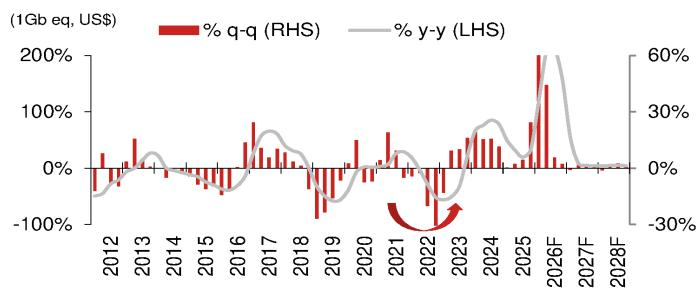

bar_line

| Year   | % q-q (RHS) | % y-y (LHS) |
|--------|-------------|-------------|
| 2012   | -           | -           |
| 2013   | -           | -           |
| 2014   | -           | -           |
| 2015   | -           | -           |
| 2016   | -           | -           |
| 2017   | -           | -           |
| 2018   | -           | -           |
| 2019   | -           | -           |
| 2020   | -           | -           |
| 2021   | -           | -           |
| 2022   | -           | -           |
| 2023   | -           | -           |
| 2024   | -           | -           |
| 2025   | -           | -           |
| 2026F  | -           | -           |
| 2027F  | -           | -           |
| 2028F  | -           | -           |

Sources: Company data, NOM estimates

Fig. 63: Hynix – NAND ASP change (q-q %, y-y %)   
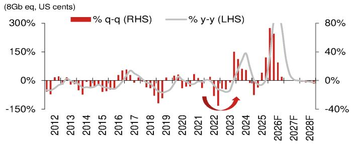

bar_line

| Year   | % q-q (RHS) | % y-y (LHS) |
|--------|-------------|-------------|
| 2012   | -150%       | -40%        |
| 2013   | -100%       | -30%        |
| 2014   | -50%        | -20%        |
| 2015   | 0%          | -10%        |
| 2016   | 50%         | 0%          |
| 2017   | 100%        | 5%          |
| 2018   | -100%       | -5%         |
| 2019   | -50%        | -10%        |
| 2020   | 0%          | -5%         |
| 2021   | 50%         | 0%          |
| 2022   | -150%       | -40%        |
| 2023   | 150%        | 40%         |
| 2024   | 100%        | 60%         |
| 2025   | 150%        | 80%         |
| 2026F  | 300%        | 80%         |
| 2027F  | 150%        | 60%         |
| 2028F  | 0%          | 0%          |

Sources: Company data, NOM estimates

Fig. 64: Hynix – DRAM cost trend (q-q %, y-y %)   
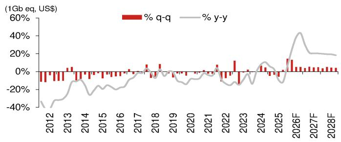

bar_line

| Year   | % q-q | % y-y |
|--------|-------|-------|
| 2012   | -10%  | -40%  |
| 2013   | 5%    | -20%  |
| 2014   | -5%   | -10%  |
| 2015   | -5%   | -15%  |
| 2016   | -5%   | -15%  |
| 2017   | 5%    | -5%   |
| 2018   | 10%   | -5%   |
| 2019   | -5%   | -5%   |
| 2020   | -5%   | -10%  |
| 2021   | -5%   | -10%  |
| 2022   | 5%    | -15%  |
| 2023   | -5%   | -15%  |
| 2024   | 5%    | -5%   |
| 2025   | -5%   | -10%  |
| 2026F  | 10%   | 40%   |
| 2027F  | 5%    | 20%   |
| 2028F  | 5%    | 20%   |

Source: Company data, NOM estimates

Fig. 65: Hynix – NAND cost trend (q-q %, y-y %)   
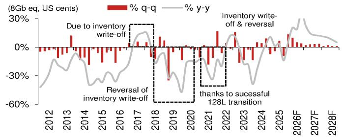

line

| Year | % q-q | % y-y |
|------|-------|-------|
| 2012 | ~0%   | ~-40% |
| 2013 | ~-10% | ~-30% |
| 2014 | ~-20% | ~-40% |
| 2015 | ~-30% | ~-50% |
| 2016 | ~-40% | ~-60% |
| 2017 | ~-50% | ~-50% |
| 2018 | ~-30% | ~-30% |
| 2019 | ~-40% | ~-40% |
| 2020 | ~-50% | ~-50% |
| 2021 | ~-30% | ~-30% |
| 2022 | ~-20% | ~-20% |
| 2023 | ~-10% | ~-10% |
| 2024 | ~0%   | ~0%   |
| 2025 | ~10%  | ~10%  |
| 2026E | ~20% | ~20%  |
| 2027E | ~10% | ~10%  |
| 2028E | ~5%   | ~5%   |

Source: Company data, NOM estimates

Fig. 66: Hynix – DRAM production and shipments growth and inventory   
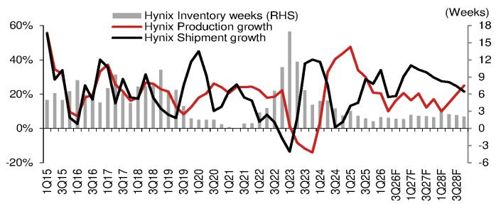

line

| Week   | Hynix Inventory weeks (RHS) | Hynix Production growth | Hynix Shipment growth |
|--------|------------------------------|--------------------------|------------------------|
| 1Q15   | ~20%                         | ~60%                     | ~60%                   |
| 3Q15   | ~20%                         | ~40%                     | ~40%                   |
| 1Q16   | ~20%                         | ~20%                     | ~20%                   |
| 3Q16   | ~20%                         | ~40%                     | ~40%                   |
| 1Q17   | ~20%                         | ~30%                     | ~30%                   |
| 3Q17   | ~20%                         | ~20%                     | ~20%                   |
| 1Q18   | ~20%                         | ~20%                     | ~20%                   |
| 3Q18   | ~20%                         | ~20%                     | ~20%                   |
| 1Q19   | ~20%                         | ~10%                     | ~10%                   |
| 3Q19   | ~20%                         | ~20%                     | ~20%                   |
| 1Q20   | ~20%                         | ~40%                     | ~40%                   |
| 3Q20   | ~20%                         | ~20%                     | ~20%                   |
| 1Q21   | ~20%                         | ~20%                     | ~20%                   |
| 3Q21   | ~20%                         | ~20%                     | ~20%                   |
| 1Q22   | ~20%                         | ~20%                     | ~20%                   |
| 3Q22   | ~20%                         | ~20%                     | ~20%                   |
| 1Q23   | ~60%                         | ~-3%                     | ~-3%                   |
| 3Q23   | ~20%                         | ~-3%                     | ~-3%                   |
| 1Q24   | ~20%                         | ~15%                     | ~15%                   |
| 3Q24   | ~20%                         | ~45%                     | ~45%                   |
| 1Q25   | ~20%                         | ~30%                     | ~30%                   |
| 3Q25   | ~20%                         | ~20%                     | ~20%                   |
| 1Q26   | ~20%                         | ~15%                     | ~15%                   |
| 3Q26F  | ~20%                         | ~10%                     | ~10%                   |
| 1Q27F  | ~20%                         | ~5%                      | ~5%                    |
| 3Q27F  | ~20%                         | ~5%                      | ~5%                    |
| 1Q28F  | ~20%                         | ~5%                      | ~5%                    |
| 3Q28F  | ~20%                         | ~5%                      | ~5%                    |

Source: Company data, NOM estimates

Fig. 67: Hynix – NAND production and shipments growth and inventory   
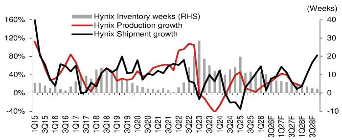

line

| Quarter | Hynix Inventory weeks (RHS) | Hynix Production growth | Hynix Shipment growth |
|---------|-----------------------------|--------------------------|------------------------|
| 1Q15    | ~30%                        | ~160%                    | ~160%                  |
| 3Q15    | ~30%                        | ~120%                    | ~120%                  |
| 1Q16    | ~30%                        | ~80%                     | ~80%                   |
| 3Q16    | ~30%                        | ~60%                     | ~60%                   |
| 1Q17    | ~30%                        | ~40%                     | ~40%                   |
| 3Q17    | ~30%                        | ~20%                     | ~20%                   |
| 1Q18    | ~30%                        | ~0%                      | ~0%                    |
| 3Q18    | ~30%                        | ~20%                     | ~20%                   |
| 1Q19    | ~30%                        | ~40%                     | ~40%                   |
| 3Q19    | ~30%                        | ~60%                     | ~60%                   |
| 1Q20    | ~30%                        | ~80%                     | ~80%                   |
| 3Q20    | ~30%                        | ~100%                    | ~100%                  |
| 1Q21    | ~30%                        | ~120%                    | ~120%                  |
| 3Q21    | ~30%                        | ~140%                    | ~140%                  |
| 1Q22    | ~30%                        | ~160%                    | ~160%                  |
| 3Q22    | ~30%                        | ~180%                    | ~180%                  |
| 1Q23    | ~30%                        | ~200%                    | ~200%                  |
| 3Q23    | ~30%                        | ~-40%                    | ~-40%                  |
| 1Q24    | ~30%                        | ~-60%                    | ~-60%                  |
| 3Q24    | ~30%                        | ~-80%                    | ~-80%                  |
| 1Q25    | ~30%                        | ~-10%                    | ~-10%                  |
| 3Q25    | ~30%                        | ~-80%                    | ~-80%                  |
| 1Q26    | ~30%                        | ~-60%                    | ~-60%                  |
| 3Q26F   | ~30%                        | ~-40%                    | ~-40%                  |
| 1Q27F   | ~30%                        | ~-20%                    | ~-20%                  |
| 3Q27F   | ~30%                        | ~0%                      | ~0%                    |
| 1Q28F   | ~30%                        | ~20%                     | ~20%                   |
| 3Q28F   | ~30%                        | ~40%                     | ~40%                   |

Source: Company data, NOM estimates

Fig. 68: Hynix – DRAM wafer output and utilization   
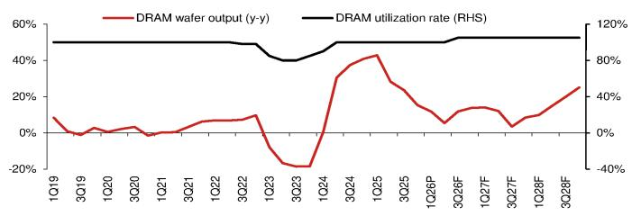

line

| Quarter | DRAM wafer output (y-y) | DRAM utilization rate (RHS) |
|---------|--------------------------|-----------------------------|
| 1Q19    | ~10%                     | ~50%                        |
| 3Q19    | ~0%                      | ~50%                        |
| 1Q20    | ~0%                      | ~50%                        |
| 3Q20    | ~0%                      | ~50%                        |
| 1Q21    | ~0%                      | ~50%                        |
| 3Q21    | ~0%                      | ~50%                        |
| 1Q22    | ~0%                      | ~50%                        |
| 3Q22    | ~0%                      | ~50%                        |
| 1Q23    | ~-10%                    | ~40%                        |
| 3Q23    | ~-20%                    | ~40%                        |
| 1Q24    | ~-10%                    | ~40%                        |
| 3Q24    | ~30%                     | ~40%                        |
| 1Q25    | ~40%                     | ~40%                        |
| 3Q25    | ~20%                     | ~40%                        |
| 1Q26F   | ~10%                     | ~40%                        |
| 3Q26F   | ~15%                     | ~40%                        |
| 1Q27F   | ~10%                     | ~40%                        |
| 3Q27F   | ~5%                      | ~40%                        |
| 1Q28F   | ~10%                     | ~40%                        |
| 3Q28F   | ~20%                     | ~40%                        |

Source: Company data, NOM estimates

Fig. 69: Hynix – NAND wafer output and utilization   
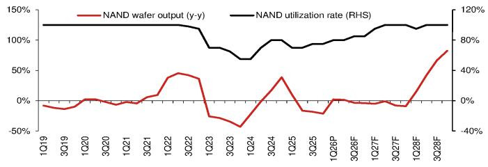

line

| Quarter | NAND wafer output (y-y) | NAND utilization rate (RHS) |
|---------|--------------------------|------------------------------|
| 1Q19    | -5%                      | 120%                         |
| 3Q19    | -10%                     | 120%                         |
| 1Q20    | 0%                       | 120%                         |
| 3Q20    | 0%                       | 120%                         |
| 1Q21    | 0%                       | 120%                         |
| 3Q21    | 0%                       | 120%                         |
| 1Q22    | 40%                      | 120%                         |
| 3Q22    | 40%                      | 120%                         |
| 1Q23    | -20%                     | 80%                          |
| 3Q23    | -40%                     | 60%                          |
| 1Q24    | -20%                     | 80%                          |
| 3Q24    | 40%                      | 100%                         |
| 1Q25    | -20%                     | 100%                         |
| 3Q25    | -20%                     | 100%                         |
| 1Q26P   | 0%                       | 100%                         |
| 3Q26F   | 0%                       | 100%                         |
| 1Q27F   | 0%                       | 100%                         |
| 3Q27F   | 0%                       | 100%                         |
| 1Q28F   | 0%                       | 100%                         |
| 3Q28F   | 80%                      | 100%                         |

Source: Company data, NOM estimates

Fig. 70: Hynix – DRAM OP   
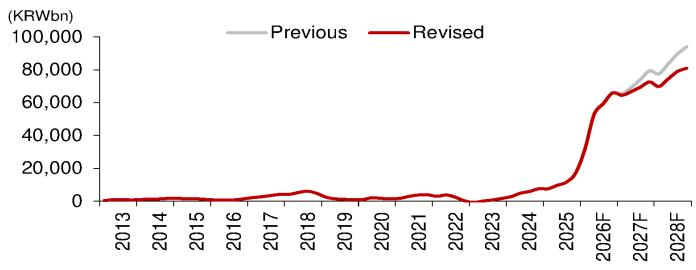

line

| Year   | Previous | Revised |
| ------ | -------- | ------- |
| 2013   | 0        | 0       |
| 2014   | 0        | 0       |
| 2015   | 0        | 0       |
| 2016   | 0        | 0       |
| 2017   | 0        | 0       |
| 2018   | 0        | 5,000   |
| 2019   | 0        | 0       |
| 2020   | 0        | 0       |
| 2021   | 0        | 5,000   |
| 2022   | 0        | 0       |
| 2023   | 0        | 0       |
| 2024   | 0        | 5,000   |
| 2025   | 0        | 15,000  |
| 2026F  | 75,000   | 75,000  |
| 2027F  | 85,000   | 85,000  |
| 2028F  | 95,000   | 95,000  |

Source: Company data, NOM estimates

Fig. 71: Hynix – NAND OP   
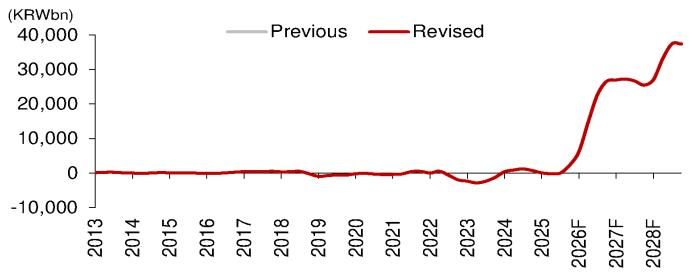

line

| Year   | Previous | Revised |
| ------ | -------- | ------- |
| 2013   | 0        | 0       |
| 2014   | 0        | 0       |
| 2015   | 0        | 0       |
| 2016   | 0        | 0       |
| 2017   | 0        | 0       |
| 2018   | 0        | 0       |
| 2019   | 0        | -5,000  |
| 2020   | 0        | -5,000  |
| 2021   | 0        | -5,000  |
| 2022   | 0        | -5,000  |
| 2023   | 0        | -5,000  |
| 2024   | 0        | -5,000  |
| 2025   | 0        | -5,000  |
| 2026F  | 0        | 5,000   |
| 2027F  | 0        | 25,000  |
| 2028F  | 0        | 35,000  |

Source: Company data, NOM estimates

Fig. 72: Hynix – DRAM bit growth (y-y, %)   
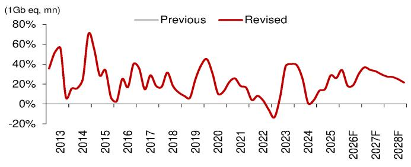

line

| Year   | Previous | Revised |
| ------ | -------- | ------- |
| 2013   |          |         |
| 2014   |          |         |
| 2015   |          |         |
| 2016   |          |         |
| 2017   |          |         |
| 2018   |          |         |
| 2019   |          |         |
| 2020   |          |         |
| 2021   |          |         |
| 2022   |          |         |
| 2023   |          |         |
| 2024   |          |         |
| 2025   |          |         |
| 2026F  |          |         |
| 2027F  |          |         |
| 2028F  |          |         |

Sources: Company data, NOM estimates

Fig. 73: Hynix – NAND bit growth (y-y, %)   
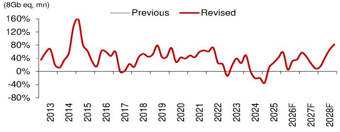

line

| Year   | Previous | Revised |
| ------ | -------- | ------- |
| 2013   |          |         |
| 2014   |          |         |
| 2015   |          |         |
| 2016   |          |         |
| 2017   |          |         |
| 2018   |          |         |
| 2019   |          |         |
| 2020   |          |         |
| 2021   |          |         |
| 2022   |          |         |
| 2023   |          |         |
| 2024   |          |         |
| 2025   |          |         |
| 2026F  |          |         |
| 2027F  |          |         |
| 2028F  |          |         |

Sources: Company data, NOM estimates

Fig. 74: Hynix – DRAM ASP forecasts   
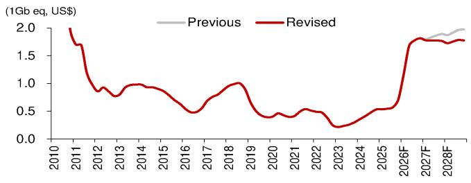

line

| Year   | Previous | Revised |
| ------ | -------- | ------- |
| 2010   |          |         |
| 2011   |          |         |
| 2012   |          |         |
| 2013   |          |         |
| 2014   |          |         |
| 2015   |          |         |
| 2016   |          |         |
| 2017   |          |         |
| 2018   |          |         |
| 2019   |          |         |
| 2020   |          |         |
| 2021   |          |         |
| 2022   |          |         |
| 2023   |          |         |
| 2024   |          |         |
| 2025   |          |         |
| 2026F  |          |         |
| 2027F  |          |         |
| 2028F  |          |         |

Sources: Company data, NOM estimates

Fig. 75: Hynix – NAND ASP forecasts   
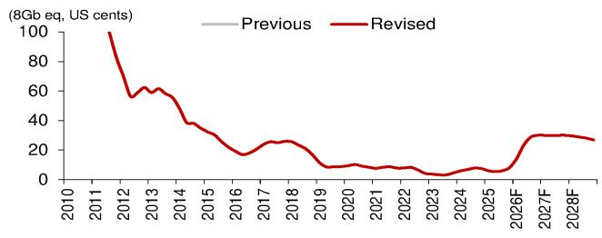

line

| Year   | Previous | Revised |
| ------ | -------- | ------- |
| 2010   |          |         |
| 2011   |          | 100     |
| 2012   |          | 60      |
| 2013   |          | 55      |
| 2014   |          | 45      |
| 2015   |          | 35      |
| 2016   |          | 25      |
| 2017   |          | 30      |
| 2018   |          | 25      |
| 2019   |          | 15      |
| 2020   |          | 10      |
| 2021   |          | 10      |
| 2022   |          | 10      |
| 2023   |          | 5       |
| 2024   |          | 10      |
| 2025   |          | 15      |
| 2026F  |          | 30      |
| 2027F  |          | 35      |
| 2028F  |          | 30      |

Sources: Company data, NOM estimates

Fig. 76: Estimated token consumption by prompt cases 

<table><tr><td rowspan="2"></td><td rowspan="2">Mainhardware</td><td colspan="8">Estimated token consumption per case</td></tr><tr><td>Simultaneous Interpretation</td><td>Simple question</td><td>Structured cosntraint</td><td>Style expansion</td><td>RAG question</td><td>Image generation</td><td>Agent AI (report + model)</td><td>1-hour video generation</td></tr><tr><td>User&#x27;s prompt input</td><td>CPU + DRAM</td><td>(instant translation)</td><td>&quot;How&#x27;s the weather today?&quot;</td><td>&quot;How&#x27;s the weather toady? Please answer in 5 words or less&quot;</td><td>&quot;How&#x27;s the weather today? Please answer like a poet.&quot;</td><td>&quot;Explain about reasons behind national debt increase&quot;</td><td>&quot;Please describe today&#x27;s weather in an abstract painting.&quot;</td><td>&quot;Make earnings models and company note based on the model&quot;</td><td>&quot;Make a 1-hour video describing recent weather&quot;</td></tr><tr><td>Scheduling</td><td>CPU + DRAM</td><td></td><td></td><td></td><td></td><td></td><td></td><td></td><td></td></tr><tr><td>Input token</td><td>GPU + HBM</td><td>10</td><td>10</td><td>20</td><td>25</td><td>40</td><td>20</td><td>500</td><td>10</td></tr><tr><td>RAG</td><td>CPU + DRAM</td><td>-</td><td>-</td><td>-</td><td>-</td><td>5,000</td><td>-</td><td>20,000</td><td>-</td></tr><tr><td>Output token generation</td><td>GPU + HBM/LPU</td><td>30</td><td>20</td><td>5</td><td>100</td><td>1,000</td><td>10,000</td><td>10,000</td><td>100,000,000</td></tr></table>

Source: NOM estimates

Fig. 77: Hynix – capex and memory bit shipments outlook   
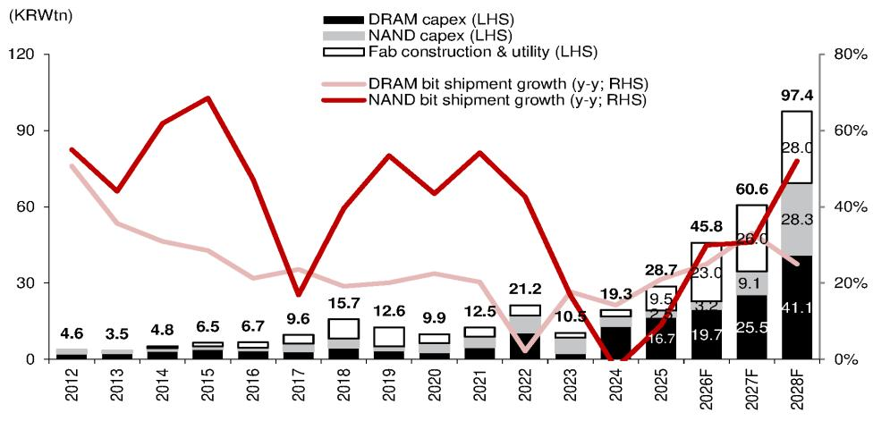

bar_line

| Year | DRAM capex (LHS) (KRWtn) | NAND capex (LHS) (KRWtn) | Fab construction & utility (LHS) (KRWtn) | DRAM bit shipment growth (y-y; RHS) (%) | NAND bit shipment growth (y-y; RHS) (%) |
|---|---|---|---|---|---|
| 2012 | 4.6 | 1.5 | 3.0 | 75.0 | 55.0 |
| 2013 | 3.5 | 1.6 | 3.1 | 60.0 | 48.0 |
| 2014 | 4.8 | 2.0 | 3.2 | 50.0 | 60.0 |
| 2015 | 6.5 | 2.5 | 3.3 | 45.0 | 70.0 |
| 2016 | 6.7 | 2.6 | 3.4 | 35.0 | 55.0 |
| 2017 | 9.6 | 3.0 | 3.5 | 30.0 | 28.0 |
| 2018 | 15.7 | 3.5 | 4.0 | 28.0 | 45.0 |
| 2019 | 12.6 | 3.8 | 4.1 | 30.0 | 55.0 |
| 2020 | 9.9 | 3.9 | 4.2 | 32.0 | 48.0 |
| 2021 | 12.5 | 4.0 | 4.3 | 30.0 | 55.0 |
| 2022 | 21.2 | 4.5 | 4.4 | 25.0 | 45.0 |
| 2023 | 10.5 | 4.8 | 4.5 | 28.0 | 35.0 |
| 2024 | 19.3 | 5.0 | 4.6 | 25.0 | -1.0 |
| 2025E | 16.7 | 6.7 | 6.8 | 30.0 | 28.7 |
| 2026E | 19.7 | 7.8 | 7.9 | 35.0 | 35.0 |
| 2027E | 25.5 | 9.1 | 9.2 | 45.8 | 48.0 |
| 2028E | 41.1 | 28.3 | 61.4 | 35.0 | 58.0 |
The chart displays the stacked bars for DRAM capex (LHS) and NAND capex (LHS), alongside the line for the cumulative growth of DRAM bit shipment growth (y-y; RHS). The data is presented in a table format as follows: 'FY' indicates estimated values for FY years from 2026 to 2028F.

Sources: Company data, NOM estimates

Fig. 78: Hynix – FCF/EV, FCF/MC analysis 

<table><tr><td>(W bn)</td><td>2017</td><td>2018</td><td>2019</td><td>2020</td><td>2021</td><td>2022</td><td>2023</td><td>2024</td><td>2025</td><td>2026F</td><td>2027F</td><td>2028F</td></tr><tr><td>Operating cash flow</td><td>14,691</td><td>22,227</td><td>6,550</td><td>12,315</td><td>19,798</td><td>14,781</td><td>4,278</td><td>29,796</td><td>53,373</td><td>184,788</td><td>331,930</td><td>394,188</td></tr><tr><td>NP</td><td>10,642</td><td>15,540</td><td>2,009</td><td>4,759</td><td>9,616</td><td>2,242</td><td>-9,138</td><td>19,797</td><td>42,948</td><td>235,084</td><td>315,878</td><td>384,943</td></tr><tr><td>Dep</td><td>5,026</td><td>6,428</td><td>8,620</td><td>9,772</td><td>10,657</td><td>14,151</td><td>13,674</td><td>12,582</td><td>13,930</td><td>16,567</td><td>22,657</td><td>33,753</td></tr><tr><td>working capital change</td><td>-3,190</td><td>-1,997</td><td>270</td><td>-1,650</td><td>-3,018</td><td>-2,690</td><td>794</td><td>-5,600</td><td>-2,881</td><td>-69,263</td><td>-6,105</td><td>-24,008</td></tr><tr><td>Investment Cash Flow</td><td>-11,919</td><td>-21,429</td><td>-10,451</td><td>-11,840</td><td>-22,392</td><td>-17,884</td><td>-7,335</td><td>-18,005</td><td>-48,054</td><td>-43,003</td><td>-62,343</td><td>-97,411</td></tr><tr><td>Capex</td><td>-9,128</td><td>-16,036</td><td>-13,920</td><td>-10,069</td><td>-12,487</td><td>-19,010</td><td>-8,325</td><td>-15,946</td><td>-27,519</td><td>-42,657</td><td>-61,000</td><td>-96,000</td></tr><tr><td>Others</td><td>-2,791</td><td>-5,393</td><td>3,469</td><td>-1,772</td><td>-9,906</td><td>1,127</td><td>990</td><td>-2,059</td><td>-20,535</td><td>-346</td><td>-1,343</td><td>-1,411</td></tr><tr><td>Free Cash Flow</td><td>5,562</td><td>6,191</td><td>-7,371</td><td>2,246</td><td>7,311</td><td>-4,230</td><td>-4,047</td><td>13,850</td><td>25,854</td><td>142,131</td><td>270,930</td><td>298,188</td></tr><tr><td>Share holder return (cashflow basis)</td><td>424</td><td>2,443</td><td>1,412</td><td>1,000</td><td>1,311</td><td>1,973</td><td>1,002</td><td>934</td><td>12,927</td><td>71,066</td><td>135,465</td><td>149,094</td></tr><tr><td>% of previous year&#x27;s free cashflow</td><td>8%</td><td>39%</td><td>-19%</td><td>45%</td><td>18%</td><td>-47%</td><td>-25%</td><td>7%</td><td>50%</td><td>50%</td><td>50%</td><td>50%</td></tr><tr><td>sharebuy back</td><td>0.0</td><td>1,736.5</td><td>385.8</td><td>315.7</td><td>506.4</td><td>291.7</td><td>176.2</td><td>108.0</td><td>10,861.3</td><td>63,959.1</td><td>121,918.3</td><td>148,124.8</td></tr><tr><td>cash dividend</td><td>424</td><td>706</td><td>1,026</td><td>684</td><td>805</td><td>1,681</td><td>826</td><td>826</td><td>2,066</td><td>7,107</td><td>13,546</td><td>969</td></tr><tr><td>Net Cash</td><td>3,454</td><td>3,096</td><td>-6,529</td><td>-6,304</td><td>-7,041</td><td>-16,884</td><td>-20,548</td><td>-8,528</td><td>12,694</td><td>156,560</td><td>361,219</td><td>657,026</td></tr><tr><td>Share price</td><td>76,500</td><td>60,500</td><td>94,100</td><td>118,500</td><td>131,000</td><td>75,000</td><td>141,500</td><td>173,900</td><td>651,000</td><td>1,819,000</td><td>1,819,000</td><td>1,819,000</td></tr><tr><td>outstanding shares ex T.S.</td><td>706</td><td>684</td><td>684</td><td>684</td><td>688</td><td>688</td><td>688</td><td>689</td><td>689</td><td>689</td><td>646</td><td>646</td></tr><tr><td>common</td><td>706</td><td>684</td><td>684</td><td>684</td><td>688</td><td>688</td><td>688</td><td>689</td><td>689</td><td>689</td><td>646</td><td>646</td></tr><tr><td>preferred</td><td>0</td><td>0</td><td>0</td><td>0</td><td>0</td><td>0</td><td>0</td><td>0</td><td>0</td><td>0</td><td>0</td><td>0</td></tr><tr><td>Market cap exc. Treasury shares</td><td>54,009</td><td>41,382</td><td>64,364</td><td>81,054</td><td>90,078</td><td>51,574</td><td>97,372</td><td>119,751</td><td>448,290</td><td>1,252,595</td><td>1,175,034</td><td>1,175,034</td></tr><tr><td>EV</td><td>50,555</td><td>38,286</td><td>70,894</td><td>87,358</td><td>97,119</td><td>68,458</td><td>117,920</td><td>128,278</td><td>435,595</td><td>1,096,035</td><td>813,815</td><td>518,007</td></tr><tr><td>Free cash / EV</td><td>11.0%</td><td>16.2%</td><td>-10.4%</td><td>2.6%</td><td>7.5%</td><td>-6.2%</td><td>-3.4%</td><td>10.8%</td><td>5.9%</td><td>13.0%</td><td>33.3%</td><td>57.6%</td></tr><tr><td>Free cash / MC</td><td>10.3%</td><td>15.0%</td><td>-11.5%</td><td>2.8%</td><td>8.1%</td><td>-8.2%</td><td>-4.2%</td><td>11.6%</td><td>5.8%</td><td>11.3%</td><td>23.1%</td><td>25.4%</td></tr></table>

Note: 2016-2025 share prices are as of year-end; 2026-28F share prices are as of 15 May 2026.   
Sources: Company data, NOM estimates

# Appendix A-1

This report has been produced by NOM International (Hong Kong) Ltd. (NIHK), Hong Kong.

See Disclaimers for NOM Group entity details.

# Analyst Certification

We, CW Chung, Eon Hwang and YJ Kim, hereby certify (1) that the views expressed in this Research report accurately reflect our personal views about any or all of the subject securities or issuers referred to in this Research report, (2) no part of our compensation was, is or will be directly or indirectly related to the specific recommendations or views expressed in this Research report and (3) no part of our compensation is tied to any specific investment banking transactions performed by NOM Securities International, Inc., NOM International plc or any other NOM Group company.

# Issuer Specific Regulatory Disclosures

The terms "NOM" and "NOM Group" used herein refer to NOM Holdings, Inc. and its affiliates and sUBSidiaries, including NOM Securities International, Inc. ('NSI') and Instinet, LLC ('ILLC'), U. S. registered broker dealers and members of SIPC.

Materially mentioned issuers 

<table><tr><td>Issuer</td><td>Ticker</td><td>Price</td><td>Price date</td><td>Stock rating</td><td>Sector rating</td><td>Disclosures</td></tr><tr><td>SK Hynix</td><td>000660 KS</td><td>KRW1819000</td><td>15-May-2026</td><td>Buy</td><td>N/A</td><td></td></tr><tr><td>Samsung Electronics</td><td>005930 KS</td><td>KRW 270500</td><td>15-May-2026</td><td>Buy</td><td>N/A</td><td></td></tr><tr><td>Taiwan Semiconductor Manufacturing Corp</td><td>2330 TT</td><td>TWD2,265.00</td><td>15-May-2026</td><td>Buy</td><td>N/A</td><td></td></tr></table>

SK Hynix (000660 KS)   
Rating and target price chart (three year history)   
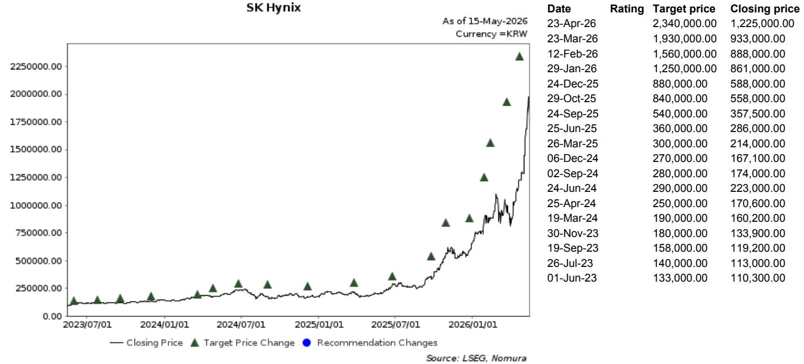

line

| Date       | Rating     | Target price | Closing price |
| ---------- | ---------- | ------------ | ------------- |
| 23-Apr-26  | 2,340,000.00 | 1,225,000.00 |               |
| 23-Mar-26  | 1,930,000.00 | 933,000.00   |               |
| 12-Feb-26  | 1,560,000.00 | 888,000.00   |               |
| 29-Jan-26  | 1,250,000.00 | 861,000.00   |               |
| 24-Dec-25  | 880,000.00  | 588,000.00   |               |
| 29-Oct-25  | 840,000.00  | 558,000.00   |               |
| 24-Sep-25  | 540,000.00  | 357,500.00   |               |
| 25-Jun-25  | 360,000.00  | 286,000.00   |               |
| 26-Mar-25  | 300,000.00  | 214,000.00   |               |
| 06-Dec-24  | 270,000.00  | 167,100.00   |               |
| 02-Sep-24  | 280,000.00  | 174,000.00   |               |
| 24-Jun-24  | 290,000.00  | 223,000.00   |               |
| 25-Apr-24  | 250,000.00  | 170,600.00   |               |
| 19-Mar-24  | 190,000.00  | 160,200.00   |               |
| 30-Nov-23  | 180,000.00  | 133,900.00   |               |
| 19-Sep-23  | 158,000.00  | 119,200.00   |               |
| 26-Jul-23  | 140,000.00  | 113,000.00   |               |
| 01-Jun-23  | 133,000.00  | 110,300.00   |               |

For explanation of ratings refer to the stock rating keys located after chart(s)

Valuation Methodology Our 12-month target price of KRW4,000,000 is derived by applying a target P/B of 6.0x to 12MF BVPS of KRW673,248. Our target multiple reflects increased conviction for transition into longer-term cash flow scheme based on memory LTAs. The benchmark index for this stock is the KOSPI 200.

Risks that may impede the achievement of the target price Downside risk includes potential US tariffs on semiconductor products, delay in data center construction due to power supply shortage, and slowdown in AI capex under a higher interest rate environment.

KRW 1819000 (15-May-2026) Buy (Sector rating: N/A)

Samsung Electronics (005930 KS)   
Rating and target price chart (three year history)   
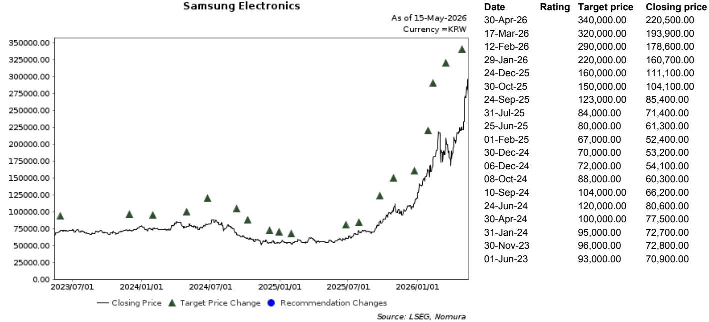

line

| Date       | Rating     | Target price | Closing price |
|------------|------------|--------------|---------------|
| 30-Apr-26  | 340,000.00 | 220,500.00   |               |
| 17-Mar-26  | 320,000.00 | 193,900.00   |               |
| 12-Feb-26  | 290,000.00 | 178,600.00   |               |
| 29-Jan-26  | 220,000.00 | 160,700.00   |               |
| 24-Dec-25  | 160,000.00 | 111,100.00   |               |
| 30-Oct-25  | 150,000.00 | 104,100.00   |               |
| 24-Sep-25  | 123,000.00 | 85,400.00    |               |
| 31-Jul-25  | 84,000.00  | 71,400.00    |               |
| 25-Jun-25  | 80,000.00  | 61,300.00    |               |
| 01-Feb-25   | 67,000.00  | 52,400.00    |               |
| 30-Dec-24  | 70,000.00  | 53,200.00    |               |
| 06-Dec-24  | 72,000.00  | 54,100.00    |               |
| 08-Oct-24  | 88,000.00  | 60,300.00    |               |
| 10-Sep-24  | 104,000.00 | 66,200.00    |               |
| 24-Jun-24  | 120,000.00 | 80,600.00    |               |
| 30-Apr-24  | 100,000.00 | 77,500.00    |               |
| 31-Jan-24  | 95,000.00  | 72,700.00    |               |
| 30-Nov-23  | 96,000.00  | 72,800.00    |               |
| 01-Jun-23   | 93,000.00  | 70,900.00    |               |

For explanation of ratings refer to the stock rating keys located after chart(s)

Valuation Methodology Our 12-month TP of KRW590,000 is derived by applying a target P/B of 5.0x to 12MF BVPS of KRW117,669. The target multiple reflects increased confidence in transition into long-term cashflow structure that could be generated by memory LTAs. The benchmark index for the stock is the KOSPI 200.

Risks that may impede the achievement of the target price Downside risk includes potential US tariffs on semiconductor products, delay in data center construction due to power supply shortage, and slowdown in AI capex under a higher interest rate environment.

Taiwan Semiconductor Manufacturing Corp (2330 TT)   
Rating and target price chart (three year history)   
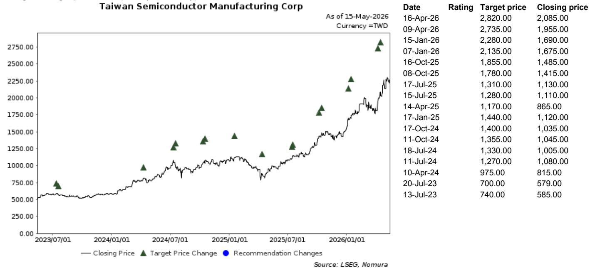

line

| Date       | Rating   | Target price | Closing price |
| ---------- | -------- | ------------ | ------------- |
| 16-Apr-26  |          | 2,820.00     | 2,085.00      |
| 09-Apr-26  |          | 2,735.00     | 1,955.00      |
| 15-Jan-26  |          | 2,280.00     | 1,690.00      |
| 07-Jan-26  |          | 2,135.00     | 1,675.00      |
| 16-Oct-25  |          | 1,855.00     | 1,485.00      |
| 08-Oct-25  |          | 1,780.00     | 1,415.00      |
| 17-Jul-25  |          | 1,310.00     | 1,130.00      |
| 15-Jul-25  |          | 1,280.00     | 1,110.00      |
| 14-Apr-25  |          | 1,170.00     | 865.00        |
| 17-Jan-25  |          | 1,440.00     | 1,120.00      |
| 17-Oct-24  |          | 1,400.00     | 1,035.00      |
| 11-Oct-24  |          | 1,355.00     | 1,045.00      |
| 18-Jul-24  |          | 1,330.00     | 1,005.00      |
| 11-Jul-24  |          | 1,270.00     | 1,080.00      |
| 10-Apr-24  |          | 975.00       | 815.00        |
| 20-Jul-23  |          | 700.00       | 579.00        |
| 13-Jul-23  |          | 740.00       | 585.00        |

For explanation of ratings refer to the stock rating keys located after chart(s)

Valuation Methodology Our TP of TWD2,820 is based on 25x 2026-27F average EPS. Our target P/E is at the higher end of historical range. The benchmark index for the stock is Taiwan TAIEX and SOX.

Risks that may impede the achievement of the target price Major downside risks are: 1) top-down macro issues because of US-China trade tensions; 2) weaker-than-expected sell-through compared with strong demand in the supply chain; 3) slower-than-expected technology migration; and 4) stronger-than-expected competition in advanced 5/3nm nodes.

Rating and target price changes 

<table><tr><td>Issuer</td><td>Ticker</td><td>Old Stock Rating</td><td>New Stock Rating</td><td>Old Target Price</td><td>New Target Price</td></tr><tr><td>SK Hynix</td><td>000660 KS</td><td>Buy</td><td>Buy</td><td>KRW 2340000</td><td>KRW 4000000</td></tr><tr><td>Samsung Electronics</td><td>005930 KS</td><td>Buy</td><td>Buy</td><td>KRW 340000</td><td>KRW 590000</td></tr></table>

# Important Disclosures

# Online availability of research and conflict-of-interest disclosures

NOM Group research is available on www.NOMnow.com/research, Bloomberg, Capital IQ, Factset, LSEG.

Important disclosures may be read at http://go.NOMnow.com/research/m/Disclosures or requested from NOM Securities International, Inc. If you have any difficulties with the website, please email grpsupport@NOM.com for help.

The analysts responsible for preparing this report have received compensation based upon various factors including the firm's total revenues, a portion of which is generated by Investment Banking activities. Unless otherwise noted, the non-US analysts listed at the front of this report are not registered/qualified as research analysts under FINRA rules, may not be associated persons of NSI, and may not be subject to FINRA Rule 2241 restrictions on communications with covered companies, public appearances, and trading securities held by a research analyst account.

NOM Global Financial Products Inc. (NGFP) NOM Derivative Products Inc. (NDP) and NOM International plc. (NIplc) are registered with the Commodities Futures Trading Commission and the National Futures Association (NFA) as swap dealers. NGFP, NDPI, and NIplc are generally engaged in the trading of swaps and other derivative products, any of which may be the subject of this report.

# Distribution of ratings (NOM Group)

The distribution of all ratings published by NOM Group Global Equity Research is as follows:

57% have been assigned a Buy rating which, for purposes of mandatory disclosures, are classified as a Buy rating; 34% of companies with this rating are investment banking clients of the NOM Group\*. 0% of companies (which are admitted to trading on a regulated market in the EEA) with this rating were supplied material services\*\* by the NOM Group.

41% have been assigned a Neutral rating which, for purposes of mandatory disclosures, is classified as a Hold rating; 57% of companies with this rating are investment banking clients of the NOM Group\*. 0% of companies (which are admitted to trading on a regulated market in the EEA) with this rating were supplied material services by the NOM Group

2% have been assigned a Reduce rating which, for purposes of mandatory disclosures, are classified as a Sell rating; 0% of companies with this rating are investment banking clients of the NOM Group\*. 0% of companies (which are admitted to trading on a regulated market in the EEA) with this rating were supplied material services by the NOM Group.

As at 31 March 2026.

\*The NOM Group as defined in the Disclaimer section at the end of this report.

\*\* As defined by the EU Market Abuse Regulation

# Definition of NOM Group's equity research rating system and sectors

The rating system is a relative system, indicating expected performance against a specific benchmark identified for each individual stock, subject to limited management discretion. An analyst's target price is an assessment of the current intrinsic fair value of the stock based on an appropriate valuation methodology determined by the analyst. Valuation methodologies include, but are not limited to, discounted cash flow analysis, expected return on equity and multiple analysis. Analysts may also indicate expected absolute upside/downside relative to the stated target price, defined as (target price - current price)/current price.

# STOCKS

A rating of 'Buy', indicates that the analyst expects the stock to outperform the Benchmark over the next 12 months. A rating of 'Neutral', indicates that the analyst expects the stock to perform in line with the Benchmark over the next 12 months. A rating of 'Reduce', indicates that the analyst expects the stock to underperform the Benchmark over the next 12 months. A rating of 'Suspended', indicates that the rating, target price and estimates have been suspended temporarily to comply with applicable regulations and/or firm policies. Securities and/or companies that are labelled as 'Not rated' or shown as 'No rating' are not in regular research coverage. Investors should not expect continuing or additional information from NOM relating to such securities and/or companies. Benchmarks are as follows: United States/Europe/Asia ex-Japan: please see valuation methodologies for explanations of relevant benchmarks for stocks, which can be accessed at: http://go.NOMnow.com/research/m/Disclosures; Global Emerging Markets (ex-Asia): MSCI Emerging Markets ex-Asia, unless otherwise stated in the valuation methodology; Japan: Russell/NOM Large Cap.

# SECTORS

A 'Bullish' stance, indicates that the analyst expects the sector to outperform the Benchmark during the next 12 months. A 'Neutral' stance, indicates that the analyst expects the sector to perform in line with the Benchmark during the next 12 months. A 'Bearish' stance, indicates that the analyst expects the sector to underperform the Benchmark during the next 12 months. Sectors that are labelled as 'Not rated' or shown as 'N/A' are not assigned ratings. Benchmarks are as follows: United States: S&P 500; Europe: Dow Jones STOXX 600; Global Emerging Markets (ex-Asia): MSCI Emerging Markets ex-Asia. Japan/Asia ex-Japan: Sector ratings are not assigned.

# Target Price

A Target Price, if discussed, indicates the analyst's forecast for the share price with a 12-month time horizon, reflecting in part the analyst's estimates for the company's earnings. The achievement of any target price may be impeded by general market and macroeconomic trends, and by other risks related to the company or the market, and may not occur if the company's earnings differ from estimates.

# Disclaimers

This publication contains material that has been prepared by the NOM Group entity identified on page 1 and, if applicable, with the contributions of one or more NOM Group entities whose employees and their respective affiliations are specified on page 1 or identified elsewhere in this publication. The term "NOM Group" used herein refers to NOM Holdings, Inc. and its affiliates and sUBSidiaries including: (a) NOM Securities Co., Ltd. ('NSC') Tokyo, Japan, (b) NOM Financial Products Europe GmbH ('NFPE'), Germany, (c) NOM International plc ('NIplc'), UK, (d) NOM Securities International, Inc. ('NSI'), New York, US, (e) NOM International (Hong Kong) Ltd. ('NIHK'), Hong Kong, (f) NOM Financial Investment (Korea) Co., Ltd. ('NFIK'), Korea (Information on NOM analysts registered with the Korea Financial Investment Association ('KOFIA') can be found on the KOFIA Intranet at http://dis.kofia.or.kr, (g) NOM Singapore Ltd. ('NSL'), Singapore (Registration number 197201440E, regulated by the Monetary Authority of Singapore) (h) NOM Australia Ltd. ('NAL'), Australia (ABN 48 003 032 513), regulated by the Australian Securities and Investment Commission ('ASIC') and holder of an Australian financial services licence number 246412, (i) NOM Securities Malaysia Sdn. Bhd. ('NSM'), Malaysia, (j) NIHK, Taipei Branch ('NITB'), Taiwan, (k) NOM Financial Advisory and Securities (India) Private Limited ('NFASL'), Mumbai, India (Registered Address: Ceejay House, Level 11, Plot F, Shivsagar Estate, Dr. Annie Besant Road, Worli, Mumbai- 400 018, India; Tel: 91 22 4037 4037, Fax: 91 22 4037 4111; CIN No: U74140MH2007PTC169116, SEBI Registration No. for Stock Broking activities : INZ000255633; SEBI Registration No. for Merchant Banking : INM000011419; SEBI Registration No. for Research: INH000001014 - Compliance Officer: Ms. Pratiksha Tondwalkar, 91 22 40374904, grievance email: investorgrievancesra@NOM.com Webpage: LINK

For reports with respect to Indian public companies or authored by India-based NFASL research analysts: (i) Investment in securities markets is subject to market risks. Read all the related documents carefully before investing. (ii) Registration granted by SEBI, and certification from NISM in no way guarantee performance of the intermediary or provide any assurance of returns to investors. (iii) NFASL terms and conditions for availing research services is disclosed on NFASL webpage.

(I) NOM Fiduciary Research & Consulting Co., Ltd. ('NFRC') Tokyo, Japan. (m) NOM Orient International Securities Co., Ltd ("NOI"), is a majority owned joint venture amongst NOM Group, Orient International (Holding) Co., Ltd, and Shanghai Huangpu Investment Holding (Group) Co., Ltd. In accordance with the laws of the People's Republic of China ("PRC", excluding Hong Kong, Macau and Taiwan, for the purpose of this document), NOI is licensed in the PRC to provide securities research and investment recommendations and it operates independently from the other members of the NOM Group; in particular, NOI's interests in PRC securities are not disclosed to, or aggregated with the holdings of, any other NOM Group entities and the interests in PRC securities of other NOM Group entities are not disclosed to, or aggregated with the holdings of, NOI. An individual name printed next to NOI on the front page of a research report indicates that individual is employed by NOI to provide research assistance to NIHK under a research partnership agreement. 'NSFSPL' next to an employee's name on the front page of a research report indicates that the individual is employed by NOM Structured Finance Services Private Limited to provide assistance to certain NOM entities under inter-company agreements. 'Verdhana' next to an individual's name on the front page of a research report indicates that the individual is employed by PT Verdhana Sekuritas Indonesia ('Verdhana') to provide research assistance to NIHK under a research partnership agreement and neither Verdhana nor such individual is licensed outside of Indonesia.

THIS MATERIAL IS: (I) FOR YOUR PRIVATE INFORMATION, AND WE ARE NOT SOLICitiNG ANY ACTION BASED UPON IT; (II) NOT TO BE CONSTRUED AS AN OFFER TO SELL OR A SOLICITATION OF AN OFFER TO BUY ANY SECURITIES IN ANY JURISDICTION WHERE SUCH OFFER OR SOLICITATION WOULD BE ILLEGAL; AND (III) OTHER THAN DISCLOSURES RELATING TO THE NOM GROUP, BASED UPON INFORMATION FROM SOURCES THAT WE CONSIDER RELIABLE, BUT HAS NOT BEEN INDEPENDENTLY VERIFIED BY NOM GROUP.

Other than disclosures relating to the NOM Group, the NOM Group does not warrant, represent or undertake, express or implied, that the document is fair, accurate, complete, correct, reliable or fit for any particular purpose or merchantable, and to the maximum extent permissible by law and/or regulation, does not accept liability (in negligence or otherwise, and in whole or in part) for any act (or decision not to act) resulting from use of this document and related data. To the maximum extent permissible by law and/or regulation, all warranties and other assurances by the NOM Group are hereby excluded and the NOM Group shall have no liability (in negligence or otherwise, and in whole or in part) for any loss howsoever arising from the use, misuse, or distribution of this material or the information contained in this material or otherwise arising in connection therewith.

Opinions or estimates expressed are current opinions as of the original publication date appearing on this material and the information, including the opinions and estimates contained herein, are subject to change without notice. The NOM Group, however, expressly disclaims any obligation, and therefore is under no duty, to update or revise this document. Any comments or statements made herein are those of the author(s) and may differ from views held by other parties within NOM Group. Clients should consider whether any advice or recommendation in this report is suitable for their particular circumstances and, if appropriate, seek professional advice, including tax advice. The NOM Group does not provide tax advice.

The NOM Group, and/or its officers, directors, employees and affiliates, may, to the extent permitted by applicable law and/or regulation, deal as principal, agent, or otherwise, or have long or short positions in, or buy or sell, the securities, commodities or instruments, or options or other derivative instruments based thereon, of issuers or securities mentioned herein. The NOM Group companies may also act as market maker or liquidity provider (within the meaning of applicable regulations in the UK) in the financial instruments of the issuer. Where the activity of market maker is carried out in accordance with the definition given to it by specific laws and regulations of the US or other jurisdictions, this will be separately disclosed within the specific issuer disclosures.

This document may contain information obtained from third parties, including, but not limited to, ratings from credit ratings agencies such as Standard & Poor's. The NOM Group hereby expressly disclaims all representations, warranties or undertakings of originality, fairness, accuracy, completeness, correctness, merchantability or fitness for a particular purpose with respect to any of the information obtained from third parties contained in this material or otherwise arising in connection therewith, and shall not be liable (in negligence or otherwise, and in whole or in part) for any direct, indirect, incidental, exemplary, compensatory, punitive, special or consequential damages, costs, expenses, legal fees, or losses (including lost income or profits and opportunity costs) in connection with any use or misuse of any of the information obtained from third parties contained in this material or otherwise arising in connection therewith. Reproduction and distribution of third-party content in any form is prohibited except with the prior written permission of the related third-party. Third-party content providers do not, express or implied, guarantee the fairness, accuracy, completeness, correctness, timeliness or availability of any information, including ratings, and are not in any way responsible for any errors or omissions (negligent or otherwise), regardless of the cause, or for the results obtained from the use or misuse of such content. Third-party content providers give no express or implied warranties, including, but not limited to, any warranties of merchantability or fitness for a particular purpose or use. Third-party content providers shall not be liable (in negligence or otherwise, and in whole or in part) for any direct, indirect, incidental, exemplary, compensatory, punitive, special or consequential damages, costs, expenses, legal fees, or losses (including lost income or profits and opportunity costs) in connection with any use or misuse of their content, including ratings. Credit ratings are statements of opinions and are not statements of fact or recommendations to purchase hold or sell securities. They do not address the suitability of securities or the suitability of securities for investment purposes, and should not be relied on as investment advice. Any MSCI sourced information in this document is the exclusive property of MSCI Inc. ('MSCI'). Without prior written permission of MSCI, this information and any other MSCI intellectual property may not be duplicated, reproduced, re-disseminated, redistributed or used, in whole or in part, for any purpose whatsoever, including creating any financial products and any indices. This information is provided on an "as is" basis. The user assumes the entire risk of any use made of this information. MSCI, its affiliates and any third party involved in, or related to, computing or compiling the information hereby expressly disclaim all representations, warranties or undertakings of originality, fairness, accuracy, completeness, correctness, merchantability or fitness for a particular purpose with respect to any of this material or the information contained in this material or otherwise arising in connection therewith. Without limiting any of the foregoing, in no event shall MSCI, any of its affiliates or any third party involved in, or related to, computing or compiling the information have any liability (in negligence or otherwise, and in whole or in part) for any damages of any kind. MSCI and the MSCI indexes are services marks of MSCI and its affiliates.

The intellectual property rights and any other rights, in Russell/NOM Japan Equity Index belong to NOM Fiduciary Research & Consulting Co., Ltd. ("NFRC") and FTSE Russell ("Russell"). NFRC and Russell do not guarantee fairness, accuracy, completeness, correctness, reliability, usefulness, marketability, merchantability or fitness of the Index, and do not account for business activities or services that any index user and/or its affiliates undertakes with the use of the Index.

Investors should consider this document as only a single factor in making their investment decision and, as such, the report should not be viewed as identifying or suggesting all risks, direct or indirect, that may be associated with any investment decision. NOM Group produces a number of different types of research product including, among others, fundamental analysis and quantitative analysis; recommendations contained in one type of research product may differ from recommendations contained in other types of research product, whether as a result of differing time horizons, methodologies or otherwise. The NOM Group publishes research product in a number of different ways including the posting of product on the NOM Group portals and/or distribution directly to clients. Different groups of clients may receive different products and services from the research department depending on their individual requirements.

Figures presented herein may refer to past performance or simulations based on past performance which are not reliable indicators of future or likely performance. Where the information contains an expectation, projection or indication of future performance and business prospects, such forecasts may not be a reliable indicator of future or likely performance. Moreover, simulations are based on models and simplifying assumptions which may oversimplify and not reflect the future distribution of returns. Any figure, strategy or index created and published for illustrative purposes within this document is not intended for “use” as a “benchmark” as defined by the European Benchmark Regulation.

Certain securities are subject to fluctuations in exchange rates that could have an adverse effect on the value or price of, or income derived from, the investment.

With respect to Fixed Income Research: Recommendations fall into two categories: tactical, which typically last up to three months; or strategic, which typically last from 6-12 months. However, trade recommendations may be reviewed at any time as circumstances change. 'Stop loss' levels for trades are also provided; which, if hit, closes the trade recommendation automatically. Prices and yields shown in recommendations are taken at the time of submission for publication and are based on either indicative Bloomberg, LSEG or NOM prices and yields at that time. The prices and yields shown are not necessarily those at which the trade recommendation can be implemented.

The securities described herein may not have been registered under the US Securities Act of 1933 (the ‘1933 Act’), and, in such case, may not be offered or sold in the US or to US persons unless they have been registered under the 1933 Act, or except in compliance with an exemption from the registration requirements of the 1933 Act. Unless governing law permits otherwise, any transaction should be executed via a NOM entity in your home jurisdiction.

This document has been approved for distribution in the UK as investment research by NIplc. NIplc is authorised by the Prudential Regulation Authority and regulated by the Financial Conduct Authority and the Prudential Regulation Authority. NIplc is a member of the London Stock Exchange. This document does not constitute a personal recommendation within the meaning of applicable regulations in the UK, or take into account the particular investment objectives, financial situations, or needs of individual investors. This document is intended only for investors who are 'eligible counterparties' or 'professional clients' for the purposes of applicable regulations in the UK, and may not, therefore, be redistributed to persons who are 'retail clients' for such purposes.

This document has been approved for distribution in the European Economic Area as investment research by NOM Financial Products Europe GmbH (“NFPE”). NFPE is a company organized as a limited liability company under German law registered in the Commercial Register of the Court of Frankfurt/Main under HRB 110223. NFPE is authorized and regulated by the German Federal Financial Supervisory Authority (BaFin).

This document has been approved by NIHK, which is regulated by the Hong Kong Securities and Futures Commission, for distribution in Hong Kong by NIHK. This document is intended only for investors who are 'professional investors' for the purposes of applicable regulations in Hong Kong and may not, therefore, be redistributed to persons who are not 'professional investors' for such purposes.

This document has been approved for distribution in Australia by NAL, which is authorized and regulated in Australia by the ASIC.

This document has also been approved for distribution in Malaysia by NSM.

In Singapore, this document has been distributed by NSL, an exempt financial adviser as defined under the Financial Advisers Act (Chapter

110), among other things, and regulated by the Monetary Authority of Singapore. NSL may distribute this document produced by its foreign affiliates pursuant to an arrangement under Regulation 32C of the Financial Advisers Regulations. This document is intended for accredited, expert or institutional investors as defined by the Securities and Futures Act (Chapter 289). Where the recipient of this document is not an accredited, expert or institutional investor, NSL accepts legal responsibility for the contents of this document in respect of such recipient only to the extent required by law. Recipients of this document in Singapore should contact NSL in respect of matters arising from, or in connection with, this document. THIS DOCUMENT IS INTENDED FOR GENERAL CIRCULATION. IT DOES NOT TAKE INTO ACCOUNT THE SPECIFIC INVESTMENT OBJECTIVES, FINANCIAL SITUATION OR PARTICULAR NEEDS OF ANY PARTICULAR PERSON. RECIPIENTS SHOULD TAKE INTO ACCOUNT THEIR SPECIFIC INVESTMENT OBJECTIVES, FINANCIAL SITUATION OR PARTICULAR NEEDS BEFORE MAKING A COMMITMENT TO PURCHASE ANY SECURITIES, INCLUDING SEEKING ADVICE FROM AN INDEPENDENT FINANCIAL ADVISER REGARDING THE SUITABILITY OF THE INVESTMENT, UNDER A SEPARATE ENGAGEMENT, AS THE RECIPIENT DEEMS FIT. Unless prohibited by the provisions of Regulation S of the 1933 Act, this material is distributed in the US, by NSI, a US-registered broker-dealer, which accepts responsibility for its contents in accordance with the provisions of Rule 15a-6, under the US Securities Exchange Act of 1934. The entity that prepared this document permits its separately operated affiliates within the NOM Group to make copies of such documents available to their clients.

This document has not been approved for distribution to persons other than ‘Authorised Persons’, ‘Exempt Persons’ or ‘Institutions’ (as defined by the Capital Markets Authority) in the Kingdom of Saudi Arabia (‘Saudi Arabia’) or a ‘Market Counterparty’ or a ‘Professional Client’ (as defined by the Dubai Financial Services Authority) in the United Arab Emirates (‘UAE’) or a ‘Market Counterparty’ or a ‘Business Customer’ (as defined by the Qatar Financial Centre Regulatory Authority) in the State of Qatar (‘Qatar’) by NOM Saudi Arabia, NIplc or any other member of the NOM Group, as the case may be. Neither this document nor any copy thereof may be taken or transmitted or distributed, directly or indirectly, by any person other than those authorised to do so into Saudi Arabia or in the UAE or in Qatar or to any person other than ‘Authorised Persons’, ‘Exempt Persons’ or ‘Institutions’ located in Saudi Arabia or a ‘Market Counterparty’ or a ‘Professional Client’ in the UAE or a ‘Market Counterparty’ or a ‘Business Customer’ in Qatar. Any failure to comply with these restrictions may constitute a violation of the laws of the UAE or Saudi Arabia or Qatar.

For report with reference of TAIWAN public companies or authored by Taiwan based research analyst:

THIS DOCUMENT IS SOLELY FOR REFERENCE ONLY. You should independently evaluate the investment risks and are solely responsible for your investment decisions. NO PORTION OF THE REPORT MAY BE REPRODUCED OR QUOTED BY THE PRESS OR ANY OTHER PERSON WITHOUT WRITTEN AUTHORIZATION FROM NOM GROUP. Pursuant to Operational Regulations Governing Securities Firms Recommending Trades in Securities to Customers and/or other applicable laws or regulations in Taiwan, you are prohibited to provide the reports to others (including but not limited to related parties, affiliated companies and any other third parties) or engage in any activities in connection with the reports which may involve conflicts of interests. INFORMATION ON SECURITIES / INSTRUMENTS NOT EXECUTABLE BY NOM INTERNATIONAL (HONG KONG) LTD., TAIPEI BRANCH IS FOR INFORMATIONAL PURPOSES ONLY AND IS NOT BE CONSTRUED AS A RECOMMENDATION OR A SOLICITATION TO TRADE IN SUCH SECURITIES / INSTRUMENTS.

This material may not be distributed in Indonesia or passed on within the territory of the Republic of Indonesia or to persons who are Indonesian Citizens (wherever they are domiciled or located) or entities of or residents in Indonesia in a manner which constitutes a public offering under the laws of the Republic of Indonesia. The securities mentioned in this document may not be offered or sold in Indonesia or to persons who are Citizens of Indonesia (wherever they are domiciled or located) or entities of or residents in Indonesia in a manner which constitutes a public offering under the laws of the Republic of Indonesia.

An individual name printed next to NOI on the front page of a research report indicates that this document is a translation of a research report issued by NOI in the PRC. In all other cases, this document is prepared by NOM Group or its sUBSidiary or affiliate (collectively, “Offshore Issuers”) that is not licensed in the PRC to provide securities research. This research report is not approved or intended to be circulated in the PRC. The A-share related analysis (if any) is not produced for any persons located or incorporated in the PRC. The recipients should not rely on any information contained in this research report in making investment decisions and Offshore Issuers take no responsibility in this regard. NO PART OF THIS MATERIAL MAY BE (I) COPIED, PHOTOCOPIED, REPRODUCED OR DUPLICATED IN ANY FORM, BY ANY MEANS; OR (II) REDISSEMINATED, REPUBLISHED OR REDISTRIBUTED WITHOUT THE PRIOR WRITTEN CONSENT OF A MEMBER OF THE NOM GROUP. If this document has been distributed by electronic transmission, such as e-mail, then such transmission cannot be guaranteed to be secure or error-free as information could be intercepted, corrupted, lost, destroyed, arrive late or incomplete, or contain viruses. The sender therefore does not accept liability (in negligence or otherwise, and in whole or in part) for any errors or omissions in the contents of this document, which may arise as a result of electronic transmission. If verification is required, please request a hard-copy version.

The NOM Group manages conflicts with respect to the production of research through its compliance policies and procedures (including, but not limited to, Conflicts of Interest, Chinese Wall and Confidentiality policies) as well as through the maintenance of Chinese Walls and employee training.

Additional information regarding the methodologies or models used in the production of any investment recommendations contained within this document is available upon request by contacting the Research Analysts of NOM listed on the front page. Disclosures information is available upon request and disclosure information is available at the NOM Disclosure web page:

http://go.NOMnow.com/research/m/Disclosures

Copyright © 2026 NOM International (Hong Kong) Ltd., Hong Kong. All rights reserved.