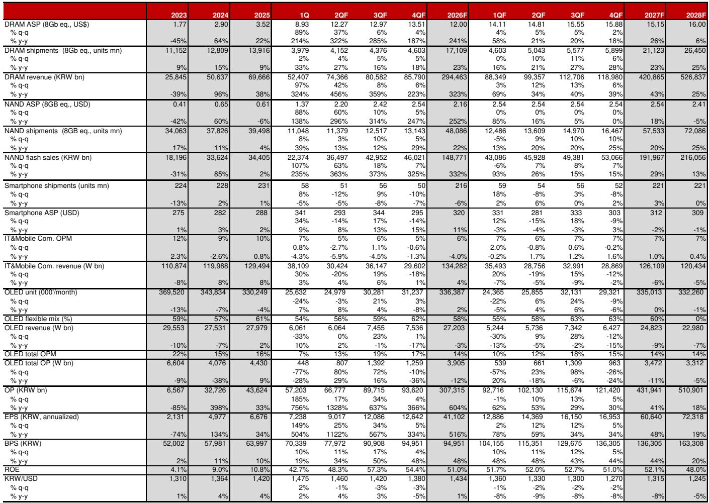

# 市场真正低估的不是需求，而是供给侧的再定价

过去六个月，AI芯片叙事从训练转向推理，市场注意力大多集中在GPU的迭代和算力消耗上。但一份来自某外资投行的最新研报提出了一个更根本的判断：AI时代的真正瓶颈，正在从计算转向存储。而市场对存储芯片的定价，仍停留在旧周期逻辑里，没有反映结构性供需失衡带来的重新估值。

这份报告的核心主张清晰而有力：AI驱动的存储需求正在进入指数级增长阶段，而供给端受制于产能扩张的物理极限，未来五年的供需缺口几乎不可弥合。这意味着存储芯片行业正在经历从周期性向成长性的根本转变，而投资者的估值框架也需要随之更新。

为什么现在关注这个判断？因为市场对存储芯片的认知仍被“周期股”的标签所束缚。三星电子和SK海力士的12个月远期市盈率仍在6倍左右，隐含的风险溢价高达19%至24%。相比之下，台积电的远期市盈率约为20倍，而其营收增速预期与存储头部企业相当。报告认为，这种估值折价正在失去合理性。

以下，我们从四个维度拆解这份研报的核心逻辑，并在最后提出两个报告尚未完全回答的关键问题。

## 1. 需求端的乘法效应：AI从训练转向推理，存储需求不是线性增长，而是指数爆发

报告最引人注目的分析，是它对AI存储需求增长机制的解构。传统观点认为，AI对存储的需求主要来自大模型训练阶段对HBM（高带宽内存）的消耗。但报告指出，随着AI应用从训练转向推理，存储需求正在经历一个更复杂的乘法增长过程。

关键变量包括：用户基数、用户交互时长、任务复杂度、推理token消耗量，以及代理式AI（agentic AI）的兴起。报告用一个示意性的乘法公式说明：如果每个变量增长10倍、200倍、30倍、10倍，那么总存储需求可能在五年内增长数千倍。这个数字看似夸张，但它的逻辑内核是坚实的——KV-cache（键值缓存）的内存在推理场景下随token消耗量线性甚至超线性增长，而token消耗本身又在用户规模和任务复杂度推动下加速扩张。

更值得注意的是，报告强调，当前行业正在尝试的软件优化——如KV-cache压缩和选择性缓存淘汰——只能延缓增长速度，无法逆转趋势。这意味着，即使技术优化取得进展，存储需求的绝对增量仍将远超供给能力。

所以呢？对于投资者而言，这意味着存储芯片的定价逻辑需要从“供需周期波动”切换到“结构性供不应求”。任何基于历史周期的估值模型，都可能低估了未来五年的营收和利润中枢。

## 2. 供给侧的硬约束：产能扩张有物理极限，结构性短缺是常态而非意外

如果说需求端的故事是“指数增长”，那么供给端的故事就是“线性受限”。报告估计，未来五年存储行业的供给增长只能达到约5至6倍，年复合增长率约30%。这与需求端数千倍的潜在增长形成鲜明对比。

供给受限的原因并不神秘：存储芯片的产能扩张需要巨额资本开支、数年的建设周期，以及极其复杂的制造工艺。即使在最乐观的假设下，新建晶圆厂的产能爬坡也需要三到五年时间。而HBM等高端产品的制造难度更大，良率提升缓慢。

报告还提到，行业正在尝试多种方案来弥合供需缺口，包括NAND卸载（提供超过100倍的容量但速度较慢）和采用超高带宽NAND（HBF）。但这些方案本质上都是“用容量换速度”，无法从根本上解决高性能存储的短缺问题。

这里有一个关键洞察：结构性短缺正在改变存储芯片的议价能力。报告指出，当前存储供应商与云服务提供商（CSP）之间的长期协议（LTA）已经包含了三至五年的最低合同期、预付款和资本开支支持承诺。这种合同结构使得客户很难取消订单，实质上锁定了供应商的盈利能力。更重要的是，报告认为，客户之所以接受这些条件，不是因为供应商的谈判技巧，而是因为结构性需求环境迫使它们必须这样做。

所以呢？对于产业决策者而言，这意味着存储芯片的供应链风险管理需要从“价格博弈”转向“产能锁定”。对于投资者而言，这意味存储芯片的盈利波动性正在系统性下降，估值折价应当收窄。

## 3. 估值折价的结构性修复：历史折扣因素正在消失，但市场尚未计价

报告对三星电子和SK海力士的估值分析，可能是最直接触动投资者神经的部分。两家公司2027年的预计营业利润总和有望达到台积电的数倍，并大幅超过美光，但它们的远期市盈率仅为6倍左右。

报告认为，这种估值折价历史上源于两个因素：一是存储行业的盈利高波动性，二是公司较弱的股东回报政策。但报告指出，这些折扣因素正在结构性消退。

盈利波动性方面，LTA的普及和结构性供不应求的格局，使得未来五年的盈利可见度大幅提升。报告预计，2027至2031年间，存储供应商的年营收和利润增速将维持在30%左右，这已经接近台积电的增长轨迹。股东回报方面，虽然报告没有详细展开，但隐含的逻辑是：在盈利持续增长和自由现金流改善的背景下，股东回报政策有望逐步改善。

报告将当前的风险溢价水平描述为“不公平地高”。以无风险利率4%计算，三星电子的隐含风险溢价为19%，SK海力士为24%。如果这些折扣因素确实在消退，那么估值倍数向台积电靠拢并不是天方夜谭。

所以呢？对于投资者而言，这意味着存储芯片的估值修复可能是一个持续数年的过程，而非短期的情绪反弹。报告给出的目标价隐含的上行空间在118%至120%之间，这并非基于盈利预测的上调，而是基于风险溢价的下降。

## 4. 三个未被完全回答的风险：报告留下了哪些需要继续观察的变量

尽管报告逻辑严密，但它也坦诚地列出了市场仍在争论的三个关键风险。这些风险既是报告的伏笔，也是投资者需要持续跟踪的核心变量。

第一个风险是CSP资本开支的可持续性。如果AI应用的商业化进度慢于预期，或者像Anthropic、OpenAI这样的头部公司面临融资困难，那么整个“AI投资-云基础设施-存储需求”的良性循环可能中断。报告认为这种担忧已经过时，但并未提供具体的验证指标。

第二个风险是数据中心建设的进度，特别是美国的电力短缺问题。报告指出，美国数据中心的建设效率远低于亚洲，电力基础设施供应链的投资不足可能成为瓶颈。报告甚至建议通过卫星图像监控数据中心建设进度，这从一个侧面反映了问题的严峻性。

第三个风险是融资成本。非云运营商通过长期云采购协议融资建设数据中心的结构，对利率高度敏感。如果长期债券收益率因通胀压力大幅上升，项目融资风险可能显著增加。报告提到，存储芯片价格上涨本身可能为美国CPI贡献超过0.8%，而中东地缘政治推高的油价可能使通胀和利率在高位停留更久。这是一个需要持续跟踪的宏观变量。

## 报告尚未回答的两个关键问题

第一个问题：软件优化和架构创新能否在中期内显著缓解存储需求压力？报告认为这些措施只能延缓增长，但并未量化它们的具体效果。如果KV-cache压缩技术取得突破性进展，或者新型计算架构大幅降低内存需求，那么供需缺口的假设可能需要调整。

第二个问题：存储芯片的估值修复是否已经部分反映在当前价格中？报告给出的目标价基于风险溢价的下降，但并未讨论市场是否已经开始提前计价这一修复。如果市场已经部分反映了这一逻辑，那么上行空间可能小于报告的估算。

这两个问题，恰好是我们在完整研报中重点讨论的部分。如果你希望深入理解这些未解问题的分析框架，以及报告中对三星电子和SK海力士的详细财务预测，欢迎来星球微信群里继续讨论。

Personal reading notes and learning share only. Not investment advice.

