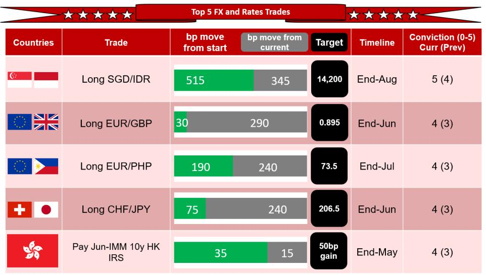

# Key focus and themes

Foreign Exchange - Asia ex-Japan/Euro Area/Europe

# Iran and AI risk events - staying short for most of SE Asia FX

Where do you expect US 10y yields to be in two weeks (current: 4.54%)?

1. 5.0% or higher   
2. 4.8% to 5.0%   
3. 4.6% to 4.8%   
4. 4.4% to 4.6%   
5. 4.4% or lower

- Stronger USD momentum is building. We are watchful of US-Iran-China developments, as well as key US tech earnings in the near term. Overall, we maintain a maximum conviction level on our long SGD/IDR (5/5).   
- Asia FX: On 12 May we raised the conviction level on our long SGD/IDR to the maximum 5/5, and maintain high conviction levels on our long EUR/PHP and long EUR/INR. We remain short USD/CNH, with a modest conviction level of 3/5.   
- G10 FX: UK political risk premium is unlikely to be fully priced in the FX market yet, thus, we remain long EUR/GBP (conviction level 4/5). Long CHF/JPY (4/5) is also performing well, while we are aware that the risk of MOF intervention is gradually increasing again. Elsewhere, we hold long EUR/SEK (3/5) and short AUD/NZD (3/5) positions.   
- Asia Rates: We maintain a relatively high conviction level of 4/5 on our pay Jun-10y HK IRS, but now remove the receive US leg. We also add a receive Jun-1y SORA recommendation.

Fig. 1: Top five top-conviction strategy trades in order (scale 1-5)   

bar

Top 5 FX and Rates Trades
| Countries | Trade | bp move from start | bp move from current | Target | Timeline | Conviction (0-5) Curr (Prev) |
| :--- | :--- | :--- | :--- | :--- | :--- | :--- |
| Singapore | Long SGD/IDR | 515 | 345 | 14,200 | End-Aug | 5 (4) |
| United Kingdom | Long EUR/GBP | 30 | 290 | 0.895 | End-Jun | 4 (3) |
| Spain | Long EUR/PHP | 190 | 240 | 73.5 | End-Jul | 4 (3) |
| Japan | Long CHF/JPY | 75 | 240 | 206.5 | End-Jun | 4 (3) |
| Hong Kong | Pay Jun-IMM 10y HK IRS | 35 | 15 | 50bp gain | End-May | 4 (3) |

Note: Conviction scale: 1 – Watch; 2 – Watch Closely; 3 - Positioned @ 1/3 desired; 4 – Positioned @ 2/3 desired; 5 – Positioned @ 100% desired.
Source: NOM.

The positive momentum on USD may continue in the near term. Pre-existing support for USD from high energy prices, and the negative implications for most of the world on trade and capital flows continue. However, additional support for USD has come from a

# Research Analysts

# Global FX Strategy

Craig Chan - NSL

craig.chan@NOM.com

+65 6433 6106

Yujiro Goto - NSC

yujiro.goto@NOM.com

+81 3 6703 1120

Dominic Bunning - Nlplc

dominic.bunning@NOM.com

+44 (0) 20 7102 4063

Wee Choon Teo - NSL

weechoon.teo@NOM.com

+65 6433 6107

Yusuke Miyairi, CFA - NIplc

yusuke.miyairi@NOM.com

+44 (0) 20 7102 4145

Vicky Chen - NSL

vicky.chen1@NOM.com

+65 6433 6540

Manthan Shingala - NSL

manthan.shingala1@NOM.com

+65 6433 6427

# Asia Rates Strategy

Albert Leung - NIHK

albert.leung1@NOM.com

+852 2252 1401

Nathan Sribalasundaram - NSL

nathan.sribalasundaram@NOM.com

+65 6433 9707

Clair Gao, CFA - NIHK

clair.gao@NOM.com

+852 2252 1081

Australia/New Zealand Rates Strategy

Andrew Ticehurst - NAL

andrew.ticehurst@NOM.com

+61 2 8062 8611

few factors including: 1) recent higher US inflation data – pushing US yields higher and raising more concerns about the outlook for Fed rate cuts in 2026 (Fed Fund futures pricing in 15bp of hikes by end-2026); 2) the US economy still holding steady, as reflected in the stronger April US NFP release (8 May), and also the stronger April US retail sales data (14 May); and 3) US equities breaking new highs.

We continue to lean towards a bias of stress building for EM/Asia FX and especially South/Southeast Asia in the near term. However, we also remain aware of some risks that could reverse the recent USD strength. A further de-escalation of the Iran war is still an important factor that could lead to lower global energy prices, more positivity for broad markets, and some softening of USD.

It remains to be seen whether China will exert significant pressure on Iran, with limited comments from China suggesting that this would be the case.. China's Foreign Ministry (15 May) said that there should be “a solution that takes into account the concerns of all parties on issues such as the Iranian nuclear issue through dialogue... shipping routes should be reopened as soon as possible... and China has been working tirelessly to end the fighting and strive for peace... and play a constructive role in ultimately achieving lasting peace.” This compares with the more forceful comments from the US White House readout (15 May) that said President Xi “made clear China’s opposition to militarization of the Strait and any effort to charge a toll for its use...” and “… agreed that Iran can never have a nuclear weapon.”

In the coming sessions, Trump will likely be focused back on trying to reach an agreement with Iran, with the market also watching out on whether China will play a more significant role to re-open the Strait of Hormuz. The negative risk is whether there is limited additional efforts from China. There is also the risk that Iran holds back on any agreement on the view that higher energy prices are an effective way to adversely affect Trump/the Republicans, with midterms just over five months away (3 November 2026). Time Magazine (11 March) highlighted that in the last three mid-terms, where the price of oil (adjusted for inflation) is \~USD100/bbl (at this point of the cycle), the party in the White House lost 29 House seats on average.

The other near-term important focus will be on NVIDIA Q1 earnings results (20 May after US market close). With Nvidia stock up \~20% this month and \~43% since the end of March 2026, investors may need both a beat of revenue expectations (\~79% y-o-y) and strong forward guidance. This will be key, as any disappointment could lead to downside risks to US equities, lowering the attractiveness of US assets/USD – though the risk is whether there is a sharp US equity sell-off, EM/Asia/risk FX will underperform (broadly speaking) USD (as compared with other parts of G10 FX such as CHF, JPY, EUR).

Overall, our strategy views in Asia FX remain intact, with highest conviction on our long SGD/IDR (maximum at 5/5; BI rate hike on 20 May will have little impact; no hike will see IDR weaken). We also remain long EUR/INR and EUR/PHP (4/5; watch VP Duterte impeachment case in Senate, 18 May). We continue to expect CNH outperformance with the broadly positive Xi-Trump summit, but adhere to some risk to our short USD/CNH view from the broad USD bid. In G10 FX, we maintain our relatively high conviction level (4/5) on our long EUR/GBP, with growing risks on the survival of PM Starmer; and maintain a 4/5 conviction level on our long CHF/JPY – though becoming more watchful as USD/JPY moves closer towards the 160 level. In Asia rates, we have a high conviction level (4/5) on our pay Jun-10y HK IRS on more HKD bond supply, a macro recovery and potentially higher HIBOR into half year-end. For the front-end, we are selectively more positive on valuation (receive Dec-1y Korea and Jun-1y SGD; convictions level 3/5).

# Asia FX strategy

On our long SGD/IDR, on 12 May we raised the conviction level to the maximum 5/5 (from 4), with a new target of 14,200 (\~9% total gains) by end-August (was 13,850 by end-July), and a trailing stop-loss of 1.5%. In Indonesia, we continue to expect IDR underperformance because: 1) significant FX reserve (FXR) drainage raises the risk of some FX adjustment. We believe BI was an aggressive seller of FX/USD in AeJ in April. Despite the intervention, IDR still underperformed in AeJ. We believe that BI may allow some FX flexibility, which will help reduce the drainage of FXR; 2) BI's recent efforts to promote FX stability have been insufficient and the market is questioning BI's willingness to hike rates aggressively. Our economics team expects BI to hike rates by 25bp at each of the May and June policy meetings – watch BI meeting on 20 May. Our

discussions with investors suggest a 25bp hike will be insufficient in the current backdrop. We see further BOP pressures for Indonesia (also for most of the EM/Asia region) due to rising geopolitical risks and persistent fiscal concerns, as well as a worsening current account deficit (in Q2 due to dividend repatriation and elevated energy prices); 3) following MSCI's May 2026 Index Review, Indonesia could see foreign equity outflows of \~USD1.7bn. Effective from the US close of 29 May 2026, MSCI will delete six Indonesian stocks from its indices owing to concentrated ownership; 4) furthermore, MSCI will soon communicate on the free float assessment of Indonesia securities as part of the Market Accessibility Review scheduled for June 2026. Investor concerns remain about possible adjustments to the foreign inclusion factor (FIF), which could still exacerbate foreign equity outflows – our discussions with market participants suggest that halving the FIF could result in foreign equity outflows of \~USD4bn. FTSE Russell also noted (on 13 May) that in accordance with guidelines on free float restrictions, it will delete the affected Indonesian securities in its June index review (effective 22 June 2026). FTSE Russell also deferred full index re-ranking, free float increases and additions (IPOs) of Indonesian listed securities until at least the September 2026 index review; 5) Indonesia's fiscal outlook remains under pressure from global factors – elevated energy prices. The government remains committed to not breaching the fiscal deficit ceiling of 3.0% of GDP for now, but there are risks of a possible change in the state finance law (parliament session 12-31 May). There is also an increasing risk of below-the-line spending; 6) rating agency downgrade risk. Moody's and Fitch ratings agencies already have “negative” outlooks on Indonesia's sovereign ratings, and S&P signalled that it might follow suit ahead of its review cycle in June or July; and 7) deteriorating business climate as highlighted by Chinese investors in Indonesia. The China Chamber of Commerce in Indonesia has sent a letter to President Prabowo (Tempo, 13 May) urging the government to improve Indonesia's business climate, Citing growing concerns among Chinese investors over regulations, law enforcement and policy uncertainty. This may have longer-term ramifications for FDI into Indonesia.

In Singapore, we continue to see scope for SGD to outperform because: 1) elevated energy prices amid the US-Iran stalemate could increase inflationary pressures in the local economy. March core inflation picked up significantly to 1.71% y-o-y from 1.45% in February, with the latest MAS CPI statement also including a more explicit characterization of upside inflation risks in comparison with the April monetary policy statement. Our economics team forecasts Singapore core CPI inflation to reach 2.8% in Q3 2026. Watch the April core CPI release on 25 May; 2) US financing conditions remain relatively loose, which should be an important factor for the MAS FX tightening at the July policy announcement. Favourable US financial conditions reduce the risk of a sharp global growth slowdown, and lower the negative tail risk on Singapore's growth for now (watch April NODX release on 18 May). If the US-Iran ceasefire remains in place, US financial conditions could remain relatively loose, unless there are unforeseen market/economic shocks; and 3) the current relatively strong pace of S\$NEER annualised appreciation should also provide near-term support to SGD. The MAS announced on 14 April 2026 that it will “increase slightly the rate of appreciation of the S\$NEER policy band,” which we estimate to be an increment of 0.5pp, bringing the slope to +1.0% annualised. This could be raised further to +1.5% annualised in July.

In the Philippines, we maintain the conviction level on our long EUR/PHP position at 4/5, targeting 73.5 (\~4% gains) by end-July (SL:71.5). We continue to favour PHP underperformance because: 1) a recent negative development for PHP has been the renewed domestic political tensions. The Philippines' lower house successfully voted to impeach Vice President Sara Duterte for charges that include threatening the lives of top officials (Philstar.com, 11 May). However, Duterte's supporters also took control of the Senate, which suggests that the impeachment trial could be blocked or the Senate could even vote in favour of Duterte. We believe political uncertainties are likely to exacerbate investor concerns regarding Philippines' weak economic outlook and credit ratings pressures; 2) BSP FX intervention in April highlights the severe BoP pressures on PHP. We estimate BSP net sold USD2.5bn of FX reserves (3.1% of March 2026 FXR) in April 2026. Despite significant FX selling by BSP, PHP was still one of the worst performing AeJ currencies in April, depreciating by \~1.1% against USD to reach new highs. Notably, Presidential Communications Office Undersecretary Claire Castro commented (Philippines News Agency, 30 April) that PHP's weakening was the result of overlapping global factors, particularly the sustained strength of the USD and rising international oil prices, and added that President Marcos recognized these external

pressures and had a similar economic assessment. That said, Castro noted that “BSP… has the institutional mandate to stabilize the peso and prevent excessive volatility” (Bloomberg, 30 April); 3) residents continued to shift into FX deposits. Residents increased their FX deposits by USD0.4bn in March 2026, taking the YTD total to +USD2.3bn (+USD5.2bn in 2025). The corruption controversy on flood control projects has already weakened the Philippines’ growth outlook, and has been exacerbated by the negative effects of the Iran war and renewed local political tensions. Our concern is that weak growth and high inflation domestically (i.e., stagflationary concerns) could further encourage residents to shift into FX deposits; 4) the Philippines’ current account deficit is vulnerable to elevated energy prices. Our economists revised up our current account deficit forecast to 4.8% of GDP from 4.5% for 2026, owing to our new higher oil price assumption; and 5) remittances are seasonally weak in May, exacerbated by tensions in the Middle East which may cause a sustained dip in remittances.

In India, we maintain the conviction level on our long EUR/INR position at 4/5, targeting 113 (\~5% gains) by end-August with a stop-loss at 111. INR has been in focus of late with a flurry of announcements from the government and possible RBI intervention. PM Modi on 10 May, urged Citizens to take measures such as avoid buying gold, conserve fuel and avoid non-essential travel to help conserve FX reserves as pressure on FX reserves rises (Reuters, 10 May). Moreover, India raised import tariffs on gold and silver to 15% (from 6%) on 13 May (Reuters), and further tightened imports by capping duty-free gold imports for jewelry exports at 100kg per licence on 14 May (licence for sUBSequent imports will only be issued after 50% is exported; Reuters). Reuters also reported (14 May) that India is considering a reduction in taxes paid by foreign investors on the country's bonds as authorities seek to align policies with global norms and attract inflows.

We believe the focus of these gold measures has not been targeted directly on pushing USD/INR lower, but to manage FX reserves drainage owing to the current negative BoP flow backdrop. Evidence of this can be seen in USD/INR price action, where spot traded at all-time highs of 96.14 (despite all these announcements). We remain cognizant of short-term relative INR outperformance if India announces further measures to control capital flows, and therefore, we implemented a stop-loss at 111. Factors leading to INR underperformance include: 1) BoP flows continue to put depreciation pressures on INR. The April trade deficit widened to USD28.4bn from USD20.7bn in March, bringing the YTD deficit to USD110.8bn, owing to the lagged impact of higher oil prices despite gold imports being stuck in customs; 2) foreign portfolio investors also net sold USD1.8bn of Indian bonds and equities in MTD May (1 to 13 May), adding to INR depreciation pressures; 3) the RBI's FX demand is likely to be strong on any dips in USD owing to the significant drain in FX reserves. We estimate that the RBI has drained USD99.6bn (spot + forward) between July 2025 and March 2026. In April, we estimate the RBI sold another USD4.8bn (spot only).

In China, we maintain the conviction level on our short USD/CNH position at a modest 3/5, targeting 6.60 (\~3% gains) by end-August. Trump's state visit to China (13-15 May) has been broadly constructive, and we view this as supportive of our CNH outperformance view. While we see a risk of a stronger USD backdrop temporarily impeding the downtrend in USD/CNH, we continue to believe any potential upside is limited. Factors for our CNH outperformance view include: 1) the US-China leaders' summit created a constructive backdrop for US-China relations in coming months. There were efforts to slow or even reverse process trade and the investment decoupling process between these two major economies. In our view, improving communications and personal ties between the two world leaders should help reduce the risk of an unintended escalation of tensions; 2) besides constructive US-China relations, we also have favorable views on China's capital flows, political/policy developments and the relative competitiveness of China/RMB; 3) USD/CNY fixing continues to drift lower with some official constraints. This week, the daily fixing was on average 17pips lower from 11-15 May and the positive fixing error (actual fix - model projection) widened to an average of +463pips. Despite lower fixings, we believe the Chinese authorities have also constrained the move lower in the daily USD/CNY fixing. This is also somewhat evident from April FX deposits increasing by USD18.8bn m-o-m, in line with our expectation that major Chinese banks were buying USD to absorb some FX settlement demand in the onshore market; and 3) onshore corporates are likely to continue repatriating their USD holdings in the coming months. The resilience of China's exports is likely to continue in April and in 2026, and our economics team has raised its export growth

forecast to $8.6\%$ from $4.0\%$ for 2026, owing to the global AI super cycle boosting prices and demand for China's AI-linked goods, and also rising global demand for China's green products. Watch April FX trade settlement data and tier-1 activity data releases (18 May).

Fig. 2: Our views on Asia FX   

<table><tr><td>Asia FX strategy view</td><td colspan="2">Comments/trades</td></tr><tr><td>Long SGD/IDR</td><td></td><td>Rationale for the trade: Raise conviction to 5/5 from 4 on 12 May - SGD to outperform, IDR underperformance Target and timeline: 14,200 (~9% gains) by end-August 2026 (entry: 9 January); trailing stop-loss:1.5% Trade rationale: Concerns on fiscal deficits, BI credibility concerns, credit rating, MSCI classification, strong SG macro Risks to trade: Reduced fiscal concerns, export proceeds regulations may support IDR, S$NEER trading close to top end</td></tr><tr><td>Long EUR/INR</td><td></td><td>Rationale for the trade: Raise conviction to 4/5 from 3 on 24 April - RBI measures rolled back Target and timeline: 113 (~5% gains) by end August 2026 (Entry: 1 April); SL:111 Trade rationale: INR Vulnerable to higher oil price, negative BoP pressure, RBI buy on dip; scope for EUR to reverse sell-off Risks to trade: RBI support INR aggressively; USD bid</td></tr><tr><td>Long EUR/PHP</td><td></td><td>Rationale for the trade: Raise conviction to 4/5 from 3 on 24 April - BSP allowing market to find PHP level Target and timeline: 73.5 (~4% gains) by end-July 2026 (entry: 17 April); SL: 71.5 Trade rationale: PHP CA vulnerable to energy prices; residents shifting into FX deposits; weak local sentiment and portfolio flow; BSP FX stance Risks to trade: Quick resolution to Strait of Hormuz; USD bid</td></tr><tr><td>Short USD/CNH</td><td></td><td>Rationale for the trade: Increase conviction to 3/5 from 2 on 8 May - Potential US-Iran agreement Target and timeline: 6.60 (~3.0% gain) by end-August (entry: 8 May) Trade rationale: Relative stability in USD/CNH; fixing drift lower; FX remittance; stable US-China relation Risks to trade: PBoC FX management risk</td></tr><tr><td>Long USD/HKD outrights</td><td></td><td>Rationale for the trade: Lowered conviction to 3/5 on 25 Jul - Softer USD, inflows to HK Target and timeline: 7.8 spot at expiry (entry: 23 Jan,8 May; 9M, 12M &amp; 12M tenor respectively) Trade rationale: USD/HKD peg regime to hold, weak HK dynamics, Trump risks, HKMA liquidity withdrawal, Fed cuts Risks to trade: SUBStantial positive shift in China/HK macro, consistent capital inflows</td></tr><tr><td>Long CNH vs 6FX abridged basket</td><td></td><td>Rationale for the trade: Lower the conviction level to 2/5 from 3 on 8 May Target and timeline: - Trade rationale: Relative outperformance amid high oil prices; FX remittance; RMB sUBStantial undervaluation; stable US-China relation Risks to trade: PBoC FX management</td></tr><tr><td>Long USD/THB</td><td></td><td>Rationale for the trade: Lower conviction to 1/5 from 3 on 8 April - US-Iran ceasefire Target and timeline: Trade rationale: Vulnerable to oil prices, weak fundamentals, local and foreign outflows, seasonality and BOT&#x27;s FX stance Risks to trade: USD weakness, gold rally, resolution in ME conflict.</td></tr></table>

Note: Conviction scale: 1 – Watch; 2 – Watch Closely; 3 - Positioned @ 1/3 desired; 4 – Positioned @ 2/3 desired; 5 – Positioned @ 100% desired.   
Source: NOM

# G10 FX strategy

JPY: Both yen and JGBs under pressure, what will officials do?

The Middle East situation has stalled, and with crude oil prices remaining elevated, USD is being broadly bought back in the FX market. USD/JPY is showing nervous price action amid strong caution over intervention, but it has recently recovered to the 158 level and is drifting higher. This can be seen as a move testing the authorities' intervention line, and heading into next week it will be necessary to watch for warning comments from officials, as well as the possibility of actual intervention. At the G7 Finance Ministers and Central Bank Governors Meeting on 18-19 May, with the focus on Treasury Secretary Bessent's stance on Japan's currency and monetary policy. It is currently unconfirmed whether Governor Ueda will attend, but as global bond yields come under upward pressure, market attention is likely to increase if a meeting between Treasury Secretary Bessent and Governor Ueda is arranged. If BOJ board member Koeda signals a positive stance toward a June rate hike in her speech on Thursday, it might provide some support to JPY, because of the view that a majority support a June hike at the moment. Unless there is a clear improvement in the Middle East situation, the main scenario for USD/JPY is to remain elevated, though caution is warranted regarding sporadic risks of a sharp JPY surge. We will avoid trading USD/JPY for now, recommending CHF/JPY long positions.

Long EUR/GBP: Starmer not calmer with potential replacement set for a Street fight

We raised the conviction on this idea on 12 May, following clear signs that UK PM Keir Starmer would face increased pressure over his job following the disastrous set of local election results. Since then, there has been many media reports on this topic, but continue to suggest a range of possible replacements. The current front-runner appears to be former Health Secretary Wes Streeting, who resigned on 14 May and called for the PM to step aside. Streeting himself would probably be the least worrying appointment for GBP, but by potentially challenging for the role (he needs 81 Labour MPs to publicly back him if he wants to do so) it likely opens up room for a more left-leaning, less market-friendly candidate to enter the fray. Manchester Mayor Andy Burnham appears to be a favoured alternative among party members (based on Labour List polling), and while he is not currently an MP, the path for him to challenge Starmer has become clearer following the resignation of Josh Simons in Makerfield. He still needs to secure approval from the NEC to stand in the by-election and then win it, but his biggest hurdle of finding an MP seat has now been cleared. Angela Rayner, formerly deputy PM, was recently cleared of intentional wrong-doing over a tax issue, potentially re-opening the door for her. Neither of these candidates would be welcomed by UK markets, and should they enter the fray and look well supported, we would expect pressure to mount on GBP via potential foreign investor selling of gilts and an increase in speculative GBP short positions (which look light on most measures). On the data front, the focus will be labour market and CPI data. The former has pointed to a softer wage backdrop than in 2022, for example, leading some MPC members to show less concern about second-round inflation effects, while the inflation print will be skewed by technical adjustments related to last year's vehicle excise duty changes, which will need to be stripped out to get a better reading of underlying inflation. ECB comments have continued to lean towards a June hike in recent weeks. We will hear from Emmanuel Moulin, who is set to become Governor of the Banque de France.

# Remain long CHF/JPY with conviction of 4/5 (target: 206.50, entry: 200.20 on 1 May)

Intervention wariness continued to dominate JPY trading this week, with USD/JPY temporarily dropping sharply to around 158 on both 12 and 14 May. Our estimates suggest neither episode was actual MOF intervention (though pinpointing the exact trigger is difficult), but the market is clearly on edge. If these concerns about intervention are dispelled, yen selling could accelerate quickly. Indeed, there was price action from Thursday to Friday, with USD/JPY reaching 158.67 at one point. The lack of sufficiently hawkish BOJ comments to out-hawk market pricing also makes a bullish yen pivot difficult. Nevertheless, a fast pace move higher in USD/JPY towards 160 will further increase the risk of MOF intervention and/or a NY Fed rate check, thus increasing short JPY exposure from here does not seem to be sensible from a risk-reward perspective. Thus, we maintain our buy-on-dips stance on JPY crosses, with CHF/JPY standing out as an attractive long for the following reasons: 1) May seasonality is typically supportive (hit ratio of 90% since 2016); 2) EUR/CHF has not yet entered territory (below 0.91), where the SNB would likely push back against CHF strength; 3) rising equities, as markets become more “accustomed to” geopolitical headlines, providing a tailwind for JPY crosses. Both countries release their respective GDP data next week (Switzerland on 18 May, Japan on 19 May), but Swiss GDP likely carries greater significance, as a strong print would diminish the case for the SNB to actively weaken CHF in support of the economy.

# Long EUR/SEK: SEK's seasonal underperformance continues but may be nearing an end

EUR/SEK continues to grind higher, up around 1.4% since our trade entry on 17 April. However, some of the seasonal selling pressure in the form of dividend outflows, may be drawing to a close with historical payments tending to end in Q2, around two-thirds of the way through the month. The other angle we see to SEK underperformance is a more dovish Riksbank than its peers. Recent inflation data make it hard for the central bank to look too concerned about upside risks, though some of the recent slowing has been related to the reduction of VAT on food. The Riksbank minutes suggested that most MPC members are comfortable with the wait-and-see approach to rates from here, and we think that the rate spread between the EUR and SEK has more scope to move in favour of the former. Much will also depend on developments in the Middle East, where SEK has shown a bit more of a higher beta reaction than EUR, with the major risk to our trade being signs of progress on the Strait of Hormuz reopening.

# AUD and NZD: Hold short AUD/NZD with modest conviction (3/5)

The AUD outlook appears very mixed in our view. Our RBA view (no further hikes) is somewhat more dovish than current market pricing, and rate spreads do not appear supportive, noting that markets moved this week to price a little more hiking in the US. Positioning data also suggest a balance of long positions, which may be becoming increasingly stale, in our view. Against this, market sentiment appears to be holding up relatively well – perhaps surprisingly, with the Strait of Hormuz still closed and oil prices rising – with US equities and copper prices making fresh highs this week. Elsewhere, a somewhat firmer USD appears as another headwind, though CNY held up reasonably well this week. We remain a little more positive on NZD, based largely on rate spreads and positioning, and we continue to hold a short AUD/NZD position, albeit with modest conviction (3/5). The move higher in oil prices this week has weighed on this position, in our view, and the market's apparent take on New Zealand inflation data appears to have impacted too. While short-term (1-2 year) inflation expectations rose this week, longer term (5-10 year) inflation expectations fell, capturing some attention, and April food prices were also flat in the month. We give little weight to the latter, noting that food prices were dragged down by a 2.3% m-o-m fall in volatile fruit and vegetable prices, and other components of the Select Price Indicator report (from which food prices are reported) revealed sharply higher prices, including for petrol (12.6% m-o-m), diesel (36.6% m-o-m), electricity (2.4% m-o-m) and domestic (4.2% m-o-m) and international (6.2% m-o-m) airfares.

Fig. 3: Our views on G10 FX 

<table><tr><td>1 Watch</td><td>2 Watch Closely</td><td>3 Positioned @ 1/3 desired</td><td>4 Positioned @ 2/3 desired</td><td>5 Positioned @ 100% desired</td></tr><tr><td colspan="5">G10 FX strategy view Comments/trades</td></tr><tr><td>Long EUR/GBP</td><td></td><td colspan="3">Rationale for the latest conviction change: Raised conviction to 4/5 from 3/5 (on 12 May), in light of the increased UK political uncertainty Target and timeline: Target 0.8950 by end-June (from entry a 0.8675 on 9 January 2026) Trade rationale: A potential challenge to the UK Prime Minister, asymmetric reaction to risk sentiment, our view of ECB&#x27;s back-to-back hike in June and July Risks to trade: European inflation / activity weakens or UK stickier UK inflation prompts more hawkish BoE compared to the market pricing</td></tr><tr><td>Long CHF/JPY</td><td></td><td colspan="3">Rationale for the latest conviction change: Raised conviction to 4/5 on 5 May 2026 after second wave of MOF intervention failed to materially strengthen Target and timeline: 206.50 (c3%) by end-June Trade rationale: JPY buying intervention from MOF expected to have short-lived impact; seasonal flows supportive of CHF in May and June Risks to trade: SNB intervention against CHF strength, more forceful follow through from MOF on JPY buying</td></tr><tr><td>Short AUD/NZD</td><td></td><td colspan="3">Rationale for the latest conviction change: Open short AUD/NZD at 1.2200 on 30 April, conviction 3/5 Target and timeline: 1.18 (3.35%) by end-June Trade rationale: i) more hawkish RBNZ and rate spreads; ii) relative positioning; iii) RBA could be more dovish than current market pricing Risks to trade: i) another surge in oil prices; ii) a surprisingly hawkish RBA</td></tr><tr><td>Long EUR/SEK</td><td></td><td colspan="3">Rationale for the latest conviction change: Open long EUR/SEK on 17 April, conviction 3/5 Target and timeline: 11.20 (c3.5%) by end-June (from entry of 10.82 on 17 April 2026) Trade rationale: Riksbank reaction function likely to be much less hawkish than ECB; seasonal flows on BOP worsen in Q2 for SEK Risks to trade: Dovish ECB, strong rsk sentiment could prompt more flows into SEK than EUR</td></tr></table>

Source: NOM

# Asia rates strategy

# HK: Maintain pay Jun-10y with a conviction level of 4/5

Over the past two years, Hong Kong rates have tended to outperform the US, with the latter moving up with a beta of 0.6-0.7. However, the beta has increased to 1.1x in the past month, when 10y US rates went up \~40bp. The change in the beta, in our view, represents a change in underlying dynamics in favour of paying long-end HK rates. A large pick-up in non-financial HKD bond issuance, such as the HK Airport Authority and MTR, a recovery in residential property market/mortgage loan growth and an improvement in key macro data (such as Q1 GDP) have been drivers, and we expect this to continue. Valuation wise, we also think the current 10y HK-US spread (at -70bp) remains too low. Note this spread was close to -20bp two years ago, when 10y US was at a similar level to now. Looking ahead, we will also monitor whether the recent grind higher in the HIBOR fixing can continue into half year-end with IPOs and dividend payments, but the bigger opportunity remains in the long-end, in our view. We have been holding the pay Jun-10y IRS position vs. 2/3 US, in line with the historical average beta. But with US rates having broken out of their recent range, we are removing the receive US leg and moving back to an outright pay 10y HK IRS position (Jun-10y HK and US IRS at 3.42% and 4.115% 4:30pm HK time).

# Korea: Maintain receive Dec-1y with conviction level of 3/5, with stop 10bp above the current level

Korea rates moved up sUBStantially this week in a bear-steepening fashion. We switched our receive position from Jun-5y to receive-1y on Wednesday, as we think the front-end offers better protection with the market already pricing policy hikes of over 100bp in the next 12 months (of course some of that pricing can be attributed to term premium rather than just BOK hike expectations). Also unlike the long-end, very front-end rates are trading technically better, as they are still below the last high in late March. Apart from valuation, another potential driver of lower Korea rates could come from KOSPI if today's decline extends, reducing the term premium of an aggressive BOK hike. That said, in light of

current global rate trends and a focus on the re-acceleration of Korea property prices, we will set a stop on this position at 10bp above the current level of 3.93%.

# Singapore: Add small front-end receiver (Jun-1y)

We tactically add a Jun-IMM 1y receive position (current: 1.35%), with a conviction level of 3/5, targeting a move to 1.20% by end-June. The SORA fix has retraced this week from the 1.40% area, down to the 1.20% area. We feel that given the ongoing uncertainty surrounding the Middle East the intention is to keep liquidity relatively flush. The recent MAS bill auctions have seen very little draining or injections to banking liquidity and April reserves data continue to show the MAS adding to reserves. The low vol, high carry and high level make this an attractive entry point to receive the front-end; however, we are cognisant of the risks because of the elevated crude prices.

# Thailand: Retain our receive 5y position because of the steep curve and market pricing

In Thailand, we maintain our outperformance view via our receive position in the 5y part of the curve; however, but with a moderate conviction of 3/5. This past week, Thai rates have moved sharply higher in sync with US rates, though today we have seen some underperformance. With 1y1y back to 1.65%, we believe the market continues to price in too much premia at the front-end of the curve. Our base case remains one in which the BOT leaves policy rates unchanged throughout this year; however, given current oil prices and uncertainty, the market will retain some level of risk premia, but 2.5 hikes feel excessive. We reduce the US hedge down to 50% after the sharp move higher in US rates over the past week (current:1.81%/3.925%).

# China: Pay Jun-3y NDIRS vs. long 30y CGB (extra pay 3y, conviction 3/5)

China rates continued to move in a tight range this week. The 7d repo fixing dropped further to 1.35% and 1y NCD yield stabilized around 1.44%, and these were against our earlier expectation of a small rebound in money market rates. That said, swap rates did not rally either, meaning ultra-flush liquidity for a longer time period had been somewhat expected. With the PBoC having net drained RMB1trn of medium-to-long term liquidity via 3m and 6m ORRs in May so far (RMB200bn in March and RMB560bn in April; all tools combined), we think the risk-reward still favors positioning for small liquidity tightening and higher front-end rates. On the 30y CGB, because of our view on liquidity (no sudden or big rise in funding cost) and economic growth headwinds (very weak credit demand), we think onshore funds (the key driver of bond yield movements) are unlikely to reduce their holdings massively. Thus, the upside in the 30y CGB yield should be capped, and we hold our pay Jun-3y vs. long 30y CGB with extra pay in 3y (conviction 3/5). Next week, watch out for April activity data on Monday.

# India: Neutral on India for now

We got stopped out of our tactical front-end receive position on the NDOIS curve yesterday owing to the large move higher. The market has aggressively priced in more tightening for the RBI, as FX concerns continue to linger. We think it is difficult to fade the market pricing owing to the potential for a large emergency rate hike alongside other measures to support the currency, though this is not our base case. The RBI governor spoke this week and while he sounded data dependant, the market is concerned that following the fuel price hike, we can see this translate into repo rate action. With the June meeting still a few weeks away the uncertainty remains high.

# Australia rates: Hold received 3m1y with a modest conviction (3/5)

Developed market yields rose notably this week, with higher oil prices, resilient US growth and inflation data and tepid US bond auctions the key drivers of the US move. Australian yields were dragged higher in response, but outperformed on a cross-market basis. The local Budget caused little market reaction; budget deficit forecasts were revised lower, although by less than expected, and the AOFM announced an ACGB issuance program of around AUD125bn in 2026-27, from a revised AUD120bn (was AUD125bn) in 2025-26, and implying some increase in T note issuance, and/or reduction in cash holdings on our figuring. We remain positioned (long) in the defensive front part of the curve (3m1y), where our RBA view (most likely on hold) contrasts with market pricing (\~40bp of tightening by year-end) and where attractive roll is available. Our focus next week – aside from oil and geopolitics – will be on the RBA’s May meeting minutes and the April jobs report. The May policy meeting delivered a third consecutive 25bp rate hike, with a resolute (8/1) decision, although the governor indicated at the sUBSequent press

conference that the board now had “space” to watch for impacts from these hikes, and “space” to give considerations to both sides of its mandate (not just inflation). Our forecast for the jobs data (20k and 4.3%) will likely prove close to consensus; leading indicators suggest trend-type job growth near term, but we are wary that the labour market could soften over sUBSequent months given the oil shock and loss of business confidence.

Fig. 4: Our views on Asia and AUD rates 

<table><tr><td colspan="2">1 Watch</td><td colspan="5">2 Watch Closely</td><td>3 Positioned @ 1/3 desired</td><td>4 Positioned @ 2/3 desired</td><td>5 Positioned @ 100% desired</td></tr><tr><td colspan="7">Asia/AU Rates strategy view</td><td colspan="3">Comments/trades</td></tr><tr><td>Pay Jun-10y HK IRS</td><td>0</td><td>1</td><td>2</td><td>3</td><td>4</td><td>5</td><td colspan="3">Rationale for last conviction chg: Raise conviction level to 4/5 on 30 April Target and timeline: 25bp gain by end-May, initiated on 6 March Trade rationale: Larger corp HKD bond issuances, better housing and macro sentiment, valuation Risks to trade: HK liquidity turn very flush</td></tr><tr><td>Long 30y CGB vs pay Jun-3y China NDIRS (extra pay 3y)</td><td>0</td><td>1</td><td>2</td><td>3</td><td>4</td><td>5</td><td colspan="3">Rationale for last conviction chg: Initiated with conviction 3/5 on 14 April Target and timeline: 15bp gain by end-May, initiated on 14 April Trade rationale: Larger net medium to long term liquidity drain, still-cheap funding, weak credit demand, valuation Risks to trade: Equity market outperforming, weak 30y CGSB auction, too low repo fixing</td></tr><tr><td>Receive Jun-1y SORA</td><td></td><td></td><td></td><td></td><td></td><td></td><td colspan="3">Rationale for last conviction chg: Initiated with conviction level of 3/5 on 15 May Target and timeline: 1.20% by end-June, initiated on 15 May Trade rationale: Lower SORA fix, flush liquidity due to Middle East uncertainties, MAS adding to reserves, valuation Risks to trade: Elevated crude price</td></tr><tr><td>Receive Dec-1y Korea NDIRS</td><td>0</td><td>1</td><td>2</td><td>3</td><td>4</td><td>5</td><td colspan="3">Rationale for last conviction chg: Initiated with conviction 3/5 on 13 May Target and timeline: 3.60% by mid-June, initiated on 13 May Trade rationale: BOK rate hike pricing (vs. NOM&#x27;s forecasts), valuation, positioning Risks to trade: Global rates selloff, rising property price</td></tr><tr><td>Receive Jun-IMM 5y THOR (50% vs. US)</td><td>0</td><td>1</td><td>2</td><td>3</td><td>4</td><td>5</td><td colspan="3">Rationale for last conviction chg: Reduced conviction level to 3/5 on 30 April Target and timeline: 20bp gain by end-April, initiated on 8 April Trade rationale: Weak macro environment and dovish growth outlook, market BOT hike pricing Risks to trade: Hawkish BOT, more emphasis on inflation, extra borrowing</td></tr><tr><td>Receive Australia 3m1y</td><td></td><td></td><td></td><td></td><td></td><td></td><td colspan="3">Rationale for last conviction chg: Initiate on 30 April with a conviction score of 3/5 Target and timeline: Entry: 4.90%; target 4.60% by end-June; stop: 5.05% Trade rationale: RBA rate hikes are likely overpriced; positive roll Risks to trade: Higher local inflation and higher oil prices compel a hawkish RBA response</td></tr></table>

Source: NOM

Previously, we asked “Do you expect CNH to strengthen against the USD in the two weeks after the Trump-Xi meeting (14-15 May) (current: 6.80)?”, 52.9% chose “Yes, Between 6.75 – 6.80”, 23.5% chose “Yes, Between 6.70 -6.75”, 17.6% chose “No”, and 5.9% chose “Yes, below 6.70”.

Please see Strategy portfolio update (7 May 2026) for our full portfolio.

Fig. 5: Trade ideas 

<table><tr><td>Trade</td><td>Target</td><td>Timeline</td><td>Conviction (0-5)</td><td>Entry Date</td></tr><tr><td>*NEW Receive Jun-IMM 1y SORA</td><td>1.20%</td><td>end-Jun</td><td>3</td><td>15-May-26</td></tr><tr><td>Short USD/CNH</td><td>6.6</td><td>end-Aug</td><td>3</td><td>8-May-26</td></tr><tr><td>Long 12m USD/HKD</td><td>7.8</td><td>12-May-27</td><td>3</td><td>8-May-26</td></tr><tr><td>Receive Australia 3m1y</td><td>30bp gain</td><td>end-Jun</td><td>3</td><td>30-Apr-26</td></tr><tr><td>Short AUD/NZD</td><td>1.1800</td><td>end-Jun</td><td>3</td><td>30-Apr-26</td></tr><tr><td>Long CNH vs 6FX abridged basket</td><td>-</td><td>-</td><td>2</td><td>30-Apr-26</td></tr><tr><td>Long CHF/JPY</td><td>206.5</td><td>end-Jun</td><td>4</td><td>30-Apr-26</td></tr><tr><td>Long EUR/PHP</td><td>73.5</td><td>end-Jul</td><td>4</td><td>17-Apr-26</td></tr><tr><td>Long EUR/SEK</td><td>11.2</td><td>end-Jun</td><td>3</td><td>17-Apr-26</td></tr><tr><td>Receive Dec-1y Korea NDIRS</td><td>3.60%</td><td>mid-Jun</td><td>3</td><td>13-May-26</td></tr><tr><td>Long 30y CGB vs. pay Jun-3y China NDIRS (extra pay in 3y)</td><td>15bp gain</td><td>end-May</td><td>3</td><td>14-Apr-26</td></tr><tr><td>Receive Jun-IMM 5y THOR (50% vs. US)</td><td>20bp gain</td><td>end-May</td><td>3</td><td>8-Apr-26</td></tr><tr><td>Long EUR/INR</td><td>113</td><td>end-Aug</td><td>4</td><td>1-Apr-26</td></tr><tr><td>Pay Jun-IMM 10y HK IRS</td><td>50bp gain</td><td>end-May</td><td>4</td><td>6-Mar-26</td></tr><tr><td>Long USD/THB</td><td>-</td><td>-</td><td>1</td><td>2-Feb-26</td></tr><tr><td>Long 9m USD/HKD</td><td>7.8</td><td>27-Oct-26</td><td>3</td><td>23-Jan-26</td></tr><tr><td>Long 12m USD/HKD</td><td>7.8</td><td>27-Jan-27</td><td>3</td><td>23-Jan-26</td></tr><tr><td>Long SGD/IDR</td><td>14,200</td><td>end-Aug</td><td>5</td><td>9-Jan-26</td></tr><tr><td>Long EUR/GBP</td><td>0.8950</td><td>end-Jun</td><td>4</td><td>9-Jan-26</td></tr></table>

Source: NOM

Fig. 6: Global FX forecasts 

<table><tr><td colspan="2"></td><td>15-May</td><td>Q2 26</td><td>Q3 26</td><td>Q4 26</td><td>Q4 27</td></tr><tr><td colspan="7">G10</td></tr><tr><td>US Dollar Index</td><td>(DXY)</td><td>99.10</td><td>98.70</td><td>95.80</td><td>95.00</td><td>92.60</td></tr><tr><td>Japanese yen</td><td>(USD/JPY)</td><td>158.5</td><td>157.5</td><td>155.0</td><td>152.5</td><td>145.0</td></tr><tr><td rowspan="2">Euro</td><td>(EUR/JPY)</td><td>184.5</td><td>183</td><td>186</td><td>186</td><td>181</td></tr><tr><td>(EUR)</td><td>1.16</td><td>1.16</td><td>1.20</td><td>1.22</td><td>1.25</td></tr><tr><td rowspan="2">Swiss Franc</td><td>(CHF)</td><td>0.79</td><td>0.79</td><td>0.76</td><td>0.74</td><td>0.72</td></tr><tr><td>(EUR/CHF)</td><td>0.91</td><td>0.92</td><td>0.91</td><td>0.90</td><td>0.90</td></tr><tr><td rowspan="2">British Pound</td><td>(GBP)</td><td>1.34</td><td>1.33</td><td>1.34</td><td>1.36</td><td>1.38</td></tr><tr><td>(EUR/GBP)</td><td>0.87</td><td>0.87</td><td>0.90</td><td>0.90</td><td>0.91</td></tr><tr><td>Australian Dollar</td><td>(AUD)</td><td>0.72</td><td>0.69</td><td>0.71</td><td>0.73</td><td>0.75</td></tr><tr><td>Canadian Dollar</td><td>(CAD)</td><td>1.37</td><td>1.39</td><td>1.37</td><td>1.35</td><td>1.35</td></tr><tr><td>New Zealand Dollar</td><td>(NZD)</td><td>0.58</td><td>0.58</td><td>0.60</td><td>0.62</td><td>0.65</td></tr><tr><td>Norwegian Krone</td><td>(EUR/NOK)</td><td>10.84</td><td>11.30</td><td>11.00</td><td>11.00</td><td>11.00</td></tr><tr><td>Swedish Krona</td><td>(EUR/SEK)</td><td>10.98</td><td>10.80</td><td>10.60</td><td>10.50</td><td>10.50</td></tr><tr><td colspan="7">Asia</td></tr><tr><td rowspan="2">Chinese Renminbi</td><td>(CNH)</td><td>6.81</td><td>6.75</td><td>6.60</td><td>6.50</td><td>6.30</td></tr><tr><td>(CNY)</td><td>6.81</td><td>6.75</td><td>6.60</td><td>6.50</td><td>6.30</td></tr><tr><td>Hong Kong Dollar</td><td>(HKD)</td><td>7.831</td><td>7.840</td><td>7.820</td><td>7.800</td><td>7.790</td></tr><tr><td>Indonesian Rupiah</td><td>(IDR)</td><td>17465.0</td><td>17150</td><td>17000</td><td>16900</td><td>16600</td></tr><tr><td>Indian Rupee</td><td>(INR)</td><td>96.0</td><td>94.5</td><td>94.0</td><td>93.5</td><td>92.0</td></tr><tr><td>Korean Won</td><td>(KRW)</td><td>1498.5</td><td>1525</td><td>1500</td><td>1470</td><td>1420</td></tr><tr><td>Malaysian Ringgit</td><td>(MYR)</td><td>3.96</td><td>4.03</td><td>4.02</td><td>4.01</td><td>3.99</td></tr><tr><td>Philippine Peso</td><td>(PHP)</td><td>61.7</td><td>60.6</td><td>60.0</td><td>59.7</td><td>59.0</td></tr><tr><td>Singapore Dollar</td><td>(SGD)</td><td>1.279</td><td>1.280</td><td>1.255</td><td>1.240</td><td>1.215</td></tr><tr><td>Thai Baht</td><td>(THB)</td><td>32.6</td><td>33.2</td><td>32.8</td><td>32.0</td><td>31.3</td></tr><tr><td>Taiwan Dollar</td><td>(TWD)</td><td>31.5</td><td>31.9</td><td>31.3</td><td>30.8</td><td>30.0</td></tr><tr><td colspan="7">CEEMEA</td></tr><tr><td>Turkish Lira</td><td>(TRY)</td><td>45.5</td><td>46.5</td><td>48.0</td><td>49.5</td><td>56.0</td></tr></table>

Source: Bloomberg, NOM.

Fig. 7: Rates forecast 

<table><tr><td colspan="2">As of 15-May</td><td>Current</td><td>Q2 26</td><td>Q3 26</td><td>Q4 26</td></tr><tr><td>CNY</td><td>10y CGB yield</td><td>1.75</td><td>1.85</td><td>1.90</td><td>1.95</td></tr><tr><td>KRW</td><td>10y KTB yield</td><td>4.09</td><td>3.75</td><td>3.70</td><td>3.60</td></tr><tr><td>TWD</td><td>10y TGB yield</td><td>1.64</td><td>1.50</td><td>1.55</td><td>1.55</td></tr><tr><td>THB</td><td>10y ThaiGB yield</td><td>2.21</td><td>2.00</td><td>1.75</td><td>1.75</td></tr><tr><td>IDR</td><td>10y IndoGB yield</td><td>6.69</td><td>6.50</td><td>6.25</td><td>6.00</td></tr><tr><td>INR</td><td>10y IGB yield</td><td>7.06</td><td>7.00</td><td>7.00</td><td>7.00</td></tr><tr><td>SGD</td><td>10y SIGB yield</td><td>2.08</td><td>2.25</td><td>2.25</td><td>2.25</td></tr></table>

Source: NOM

# Appendix A-1

This report has been produced by NOM Singapore Ltd. (NSL), Singapore.

See Disclaimers for NOM Group entity details.

# Analyst Certification

Each research analyst identified herein certifies that all of the views expressed in this report by such analyst accurately reflect his or her personal views about the subject securities and issuers. In addition, each research analyst identified in this report hereby certifies that no part of his or her compensation was, is, or will be, directly or indirectly related to the specific recommendations or views that he or she has expressed in this research report, nor is it tied to any specific investment banking transactions performed by NOM Securities International, Inc., NOM International plc or any other NOM Group company.

# Issuer Specific Regulatory Disclosures

The terms "NOM" and "NOM Group" used herein refer to NOM Holdings, Inc. and its affiliates and sUBSidiaries, including NOM Securities International, Inc. ('NSI') and Instinet, LLC ('ILLC'), U. S. registered broker dealers and members of SIPC.

<table><tr><td>Issuer</td><td>Disclosures</td></tr><tr><td>HONG KONG MONETARY AUTHORITY</td><td>A1,A2,A3</td></tr><tr><td>REPUBLIC OF KOREA</td><td>A1,A2,A3,A4,A5,A6,A7,A13</td></tr><tr><td>KINGDOM OF THAILAND</td><td>A1,A2</td></tr><tr><td>TAIWAN</td><td>A1,A2</td></tr><tr><td>COMMONWEALTH OF AUSTRALIA</td><td>A13</td></tr></table>

A1 The NOM Group has received compensation for non-investment banking products or services from the subject company in the past 12 months.   
A2 The NOM Group has had a non-investment banking securities related services client relationship with the subject company during the past 12 months.   
A3 The NOM Group has had a non-securities related services client relationship with the subject company during the past 12 months.   
A4 The NOM Group has had an investment banking services client relationship with the subject company during the past 12 months.   
A5 The NOM Group has received compensation for investment banking services from the subject company in the past 12 months.   
A6 The NOM Group expects to receive or intends to seek compensation for investment banking services from the subject company in the next three months.   
A7 The NOM Group has managed or co-managed a public or private offering of the subject company's securities in the past 12 months.   
A13 The NOM Group has a significant financial interest (non-equity) in the issuer.

# Important Disclosures

# Online availability of research and conflict-of-interest disclosures

NOM Group research is available on www.NOMnow.com/research, Bloomberg, Capital IQ, Factset, LSEG.

Important disclosures may be read at http://go.NOMnow.com/research/m/Disclosures or requested from NOM Securities International, Inc. If you have any difficulties with the website, please email grpsupport@NOM.com for help.

The analysts responsible for preparing this report have received compensation based upon various factors including the firm's total revenues, a portion of which is generated by Investment Banking activities. Unless otherwise noted, the non-US analysts listed at the front of this report are not registered/qualified as research analysts under FINRA rules, may not be associated persons of NSI, and may not be subject to FINRA Rule 2241 restrictions on communications with covered companies, public appearances, and trading securities held by a research analyst account.

NOM Global Financial Products Inc. (NGFP) NOM Derivative Products Inc. (NDP) and NOM International plc. (NIplc) are registered with the Commodities Futures Trading Commission and the National Futures Association (NFA) as swap dealers. NGFP, NDPI, and NIplc are generally engaged in the trading of swaps and other derivative products, any of which may be the subject of this report.

# ADDITIONAL DISCLOSURES REQUIRED IN THE U.S.

Principal Trading: NOM Securities International, Inc and its affiliates will usually trade as principal in the fixed income securities (or in related derivatives) that are the subject of this research report. Analyst Interactions with other NOM Securities International, Inc. Personnel: The fixed income research analysts of NOM Securities International, Inc and its affiliates regularly interact with sales and trading desk personnel in connection with obtaining liquidity and pricing information for their respective coverage universe.

# Valuation methodology - Fixed Income

NOM's Fixed Income Strategists express views on the price of securities and financial markets by providing trade recommendations. These can be relative value recommendations, directional trade recommendations, asset allocation recommendations, or a mixture of all three.

The analysis which is embedded in a trade recommendation would include, but not be limited to:

- Fundamental analysis regarding whether a security's price deviates from its underlying macro- or micro-economic fundamentals.   
• Quantitative analysis of price variations.   
- Technical factors such as regulatory changes, changes to risk appetite in the market, unexpected rating actions, primary market activity and supply/ demand considerations.

The timeframe for a trade recommendation is variable. Tactical ideas have a short timeframe, typically less than three months. Strategic trade ideas have a longer timeframe of typically more than three months.

For the purposes of the EU Market Abuse Regulation, the distribution of ratings published by NOM Global Fixed Income Research is as follows:

52% have been assigned a Buy (or equivalent) rating; 50% of issuers with this rating were supplied material services\* by the NOM Group\*\*.
0% have been assigned a Neutral (or equivalent) rating.

48% have been assigned a Sell (or equivalent) rating; 50% of issuers with this rating were supplied material services by the NOM Group. As at 31 Mar 2026.

\*As defined by the EU Market Abuse Regulation

\*\*The NOM Group as defined in the Disclaimer section at the end of this report

# Disclaimers

This publication contains material that has been prepared by the NOM Group entity identified on page 1 and, if applicable, with the contributions of one or more NOM Group entities whose employees and their respective affiliations are specified on page 1 or identified elsewhere in this publication. The term "NOM Group" used herein refers to NOM Holdings, Inc. and its affiliates and sUBSidiaries including: (a) NOM Securities Co., Ltd. ('NSC') Tokyo, Japan, (b) NOM Financial Products Europe GmbH ('NFPE'), Germany, (c) NOM International plc ('NIplc'), UK, (d) NOM Securities International, Inc. ('NSI'), New York, US, (e) NOM International (Hong Kong) Ltd. ('NIHK'), Hong Kong, (f) NOM Financial Investment (Korea) Co., Ltd. ('NFIK'), Korea (Information on NOM analysts registered with the Korea Financial Investment Association ('KOFIA') can be found on the KOFIA Intranet at http://dis.kofia.or.kr, (g) NOM Singapore Ltd. ('NSL'), Singapore (Registration number 197201440E, regulated by the Monetary Authority of Singapore) (h) NOM Australia Ltd. ('NAL'), Australia (ABN 48 003 032 513), regulated by the Australian Securities and Investment Commission ('ASIC') and holder of an Australian financial services licence number 246412, (i) NOM Securities Malaysia Sdn. Bhd. ('NSM'), Malaysia, (j) NIHK, Taipei Branch ('NITB'), Taiwan, (k) NOM Financial Advisory and Securities (India) Private Limited ('NFASL'), Mumbai, India (Registered Address: Ceejay House, Level 11, Plot F, Shivsagar Estate, Dr. Annie Besant Road, Worli, Mumbai- 400 018, India; Tel: 91 22 4037 4037, Fax: 91 22 4037 4111; CIN No: U74140MH2007PTC169116, SEBI Registration No. for Stock Broking activities : INZ000255633; SEBI Registration No. for Merchant Banking : INM000011419; SEBI Registration No. for Research: INH000001014 - Compliance Officer: Ms. Pratiksha Tondwalkar, 91 22 40374904, grievance email: investorgrievancesra@NOM.com Webpage: LINK

For reports with respect to Indian public companies or authored by India-based NFASL research analysts: (i) Investment in securities markets is subject to market risks. Read all the related documents carefully before investing. (ii) Registration granted by SEBI, and certification from NISM in no way guarantee performance of the intermediary or provide any assurance of returns to investors. (iii) NFASL terms and conditions for availing research services is disclosed on NFASL webpage.

(I) NOM Fiduciary Research & Consulting Co., Ltd. ('NFRC') Tokyo, Japan. (m) NOM Orient International Securities Co., Ltd ("NOI"), is a majority owned joint venture amongst NOM Group, Orient International (Holding) Co., Ltd, and Shanghai Huangpu Investment Holding (Group) Co., Ltd. In accordance with the laws of the People's Republic of China ("PRC", excluding Hong Kong, Macau and Taiwan, for the purpose of this document), NOI is licensed in the PRC to provide securities research and investment recommendations and it operates independently from the other members of the NOM Group; in particular, NOI's interests in PRC securities are not disclosed to, or aggregated with the holdings of, any other NOM Group entities and the interests in PRC securities of other NOM Group entities are not disclosed to, or aggregated with the holdings of, NOI. An individual name printed next to NOI on the front page of a research report indicates that individual is employed by NOI to provide research assistance to NIHK under a research partnership agreement. 'NSFSPL' next to an employee's name on the front page of a research report indicates that the individual is employed by NOM Structured Finance Services Private Limited to provide assistance to certain NOM entities under inter-company agreements. 'Verdhana' next to an individual's name on the front page of a research report indicates that the individual is employed by PT Verdhana Sekuritas Indonesia ('Verdhana') to provide research assistance to NIHK under a research partnership agreement and neither Verdhana nor such individual is licensed outside of Indonesia.

THIS MATERIAL IS: (I) FOR YOUR PRIVATE INFORMATION, AND WE ARE NOT SOLICitiNG ANY ACTION BASED UPON IT; (II) NOT TO BE CONSTRUED AS AN OFFER TO SELL OR A SOLICITATION OF AN OFFER TO BUY ANY SECURITIES IN ANY JURISDICTION WHERE SUCH OFFER OR SOLICITATION WOULD BE ILLEGAL; AND (III) OTHER THAN DISCLOSURES RELATING TO THE NOM GROUP, BASED UPON INFORMATION FROM SOURCES THAT WE CONSIDER RELIABLE, BUT HAS NOT BEEN INDEPENDENTLY VERIFIED BY NOM GROUP.

Other than disclosures relating to the NOM Group, the NOM Group does not warrant, represent or undertake, express or implied, that the document is fair, accurate, complete, correct, reliable or fit for any particular purpose or merchantable, and to the maximum extent permissible by law and/or regulation, does not accept liability (in negligence or otherwise, and in whole or in part) for any act (or decision not to act) resulting from use of this document and related data. To the maximum extent permissible by law and/or regulation, all warranties and other assurances by the NOM Group are hereby excluded and the NOM Group shall have no liability (in negligence or otherwise, and in whole or in part) for any loss howsoever arising from the use, misuse, or distribution of this material or the information contained in this material or otherwise arising in connection therewith.

Opinions or estimates expressed are current opinions as of the original publication date appearing on this material and the information, including the opinions and estimates contained herein, are subject to change without notice. The NOM Group, however, expressly disclaims any obligation, and therefore is under no duty, to update or revise this document. Any comments or statements made herein are those of the author(s) and may differ from views held by other parties within NOM Group. Clients should consider whether any advice or recommendation in this report is suitable for their particular circumstances and, if appropriate, seek professional advice, including tax advice. The NOM Group does not provide tax advice.

The NOM Group, and/or its officers, directors, employees and affiliates, may, to the extent permitted by applicable law and/or regulation, deal as principal, agent, or otherwise, or have long or short positions in, or buy or sell, the securities, commodities or instruments, or options or other derivative instruments based thereon, of issuers or securities mentioned herein. The NOM Group companies may also act as market maker or liquidity provider (within the meaning of applicable regulations in the UK) in the financial instruments of the issuer. Where the activity of market maker is carried out in accordance with the definition given to it by specific laws and regulations of the US or other jurisdictions, this will be separately disclosed within the specific issuer disclosures.

This document may contain information obtained from third parties, including, but not limited to, ratings from credit ratings agencies such as Standard & Poor's. The NOM Group hereby expressly disclaims all representations, warranties or undertakings of originality, fairness, accuracy, completeness, correctness, merchantability or fitness for a particular purpose with respect to any of the information obtained from third parties contained in this material or otherwise arising in connection therewith, and shall not be liable (in negligence or otherwise, and in whole or in part) for any direct, indirect, incidental, exemplary, compensatory, punitive, special or consequential damages, costs, expenses, legal fees, or losses (including lost income or profits and opportunity costs) in connection with any use or misuse of any of the information obtained from third parties contained in this material or otherwise arising in connection therewith. Reproduction and distribution of third-party content in any form is prohibited except with the prior written permission of the related third-party. Third-party content providers do not, express or implied, guarantee the fairness, accuracy, completeness, correctness, timeliness or availability of any information, including ratings, and are not in any way responsible for any errors or omissions (negligent or otherwise), regardless of the cause, or for the results obtained from the use or misuse of such content. Third-party content providers give no express or implied warranties, including, but not limited to, any warranties of merchantability or fitness for a particular purpose or use. Third-party content providers shall not be liable (in negligence or otherwise, and in whole or in part) for any direct, indirect, incidental, exemplary, compensatory, punitive, special or consequential damages, costs, expenses, legal fees, or losses (including lost income or profits and opportunity costs) in connection with any use or misuse of their content, including ratings. Credit ratings are statements of opinions and are not statements of fact or recommendations to purchase hold or sell securities. They do not address the suitability of securities or the suitability of securities for investment purposes, and should not be relied on as investment advice. Any MSCI sourced information in this document is the exclusive property of MSCI Inc. ('MSCI'). Without prior written permission of MSCI, this information and any other MSCI intellectual property may not be duplicated, reproduced, re-disseminated, redistributed or used, in whole or in part, for any purpose whatsoever, including creating any financial products and any indices. This information is provided on an "as is" basis. The user assumes the entire risk of any use made of this information. MSCI, its affiliates and any third party involved in, or related to, computing or compiling the information hereby expressly disclaim all representations, warranties or undertakings of originality, fairness, accuracy, completeness, correctness, merchantability or fitness for a particular purpose with respect to any of this material or the information contained in this material or otherwise arising in connection therewith. Without limiting any of the foregoing, in no event shall MSCI, any of its affiliates or any third party involved in, or related to, computing or compiling the information have any liability (in negligence or otherwise, and in whole or in part) for any damages of any kind. MSCI and the MSCI indexes are services marks of MSCI and its affiliates.

The intellectual property rights and any other rights, in Russell/NOM Japan Equity Index belong to NOM Fiduciary Research & Consulting Co., Ltd. ("NFRC") and FTSE Russell ("Russell"). NFRC and Russell do not guarantee fairness, accuracy, completeness, correctness, reliability, usefulness, marketability, merchantability or fitness of the Index, and do not account for business activities or services that any index user and/or its affiliates undertakes with the use of the Index.

Investors should consider this document as only a single factor in making their investment decision and, as such, the report should not be viewed as identifying or suggesting all risks, direct or indirect, that may be associated with any investment decision. NOM Group produces a number of different types of research product including, among others, fundamental analysis and quantitative analysis; recommendations contained in one type of research product may differ from recommendations contained in other types of research product, whether as a result of differing time horizons, methodologies or otherwise. The NOM Group publishes research product in a number of different ways including the posting of product on the NOM Group portals and/or distribution directly to clients. Different groups of clients may receive different products and services from the research department depending on their individual requirements.

Figures presented herein may refer to past performance or simulations based on past performance which are not reliable indicators of future or likely performance. Where the information contains an expectation, projection or indication of future performance and business prospects, such forecasts may not be a reliable indicator of future or likely performance. Moreover, simulations are based on models and simplifying assumptions which may oversimplify and not reflect the future distribution of returns. Any figure, strategy or index created and published for illustrative purposes within this document is not intended for “use” as a “benchmark” as defined by the European Benchmark Regulation.

Certain securities are subject to fluctuations in exchange rates that could have an adverse effect on the value or price of, or income derived from, the investment.

With respect to Fixed Income Research: Recommendations fall into two categories: tactical, which typically last up to three months; or strategic, which typically last from 6-12 months. However, trade recommendations may be reviewed at any time as circumstances change. 'Stop loss' levels for trades are also provided; which, if hit, closes the trade recommendation automatically. Prices and yields shown in recommendations are taken at the time of submission for publication and are based on either indicative Bloomberg, LSEG or NOM prices and yields at that time. The prices and yields shown are not necessarily those at which the trade recommendation can be implemented.

The securities described herein may not have been registered under the US Securities Act of 1933 (the ‘1933 Act’), and, in such case, may not be offered or sold in the US or to US persons unless they have been registered under the 1933 Act, or except in compliance with an exemption from the registration requirements of the 1933 Act. Unless governing law permits otherwise, any transaction should be executed via a NOM entity in your home jurisdiction.

This document has been approved for distribution in the UK as investment research by NIplc. NIplc is authorised by the Prudential Regulation Authority and regulated by the Financial Conduct Authority and the Prudential Regulation Authority. NIplc is a member of the London Stock Exchange. This document does not constitute a personal recommendation within the meaning of applicable regulations in the UK, or take into account the particular investment objectives, financial situations, or needs of individual investors. This document is intended only for investors who are 'eligible counterparties' or 'professional clients' for the purposes of applicable regulations in the UK, and may not, therefore, be redistributed to persons who are 'retail clients' for such purposes.

This document has been approved for distribution in the European Economic Area as investment research by NOM Financial Products Europe GmbH (“NFPE”). NFPE is a company organized as a limited liability company under German law registered in the Commercial Register of the Court of Frankfurt/Main under HRB 110223. NFPE is authorized and regulated by the German Federal Financial Supervisory Authority (BaFin).

This document has been approved by NIHK, which is regulated by the Hong Kong Securities and Futures Commission, for distribution in Hong Kong by NIHK. This document is intended only for investors who are 'professional investors' for the purposes of applicable regulations in Hong Kong and may not, therefore, be redistributed to persons who are not 'professional investors' for such purposes.

This document has been approved for distribution in Australia by NAL, which is authorized and regulated in Australia by the ASIC.

This document has also been approved for distribution in Malaysia by NSM.

In Singapore, this document has been distributed by NSL, an exempt financial adviser as defined under the Financial Advisers Act (Chapter 110), among other things, and regulated by the Monetary Authority of Singapore. NSL may distribute this document produced by its foreign affiliates pursuant to an arrangement under Regulation 32C of the Financial Advisers Regulations. This document is intended for accredited, expert or institutional investors as defined by the Securities and Futures Act (Chapter 289). Where the recipient of this document is not an accredited, expert or institutional investor, NSL accepts legal responsibility for the contents of this document in respect of such recipient only to the extent required by law. Recipients of this document in Singapore should contact NSL in respect of matters arising from, or in connection with, this document. THIS DOCUMENT IS INTENDED FOR GENERAL CIRCULATION. IT DOES NOT TAKE INTO ACCOUNT THE SPECIFIC INVESTMENT OBJECTIVES, FINANCIAL SITUATION OR PARTICULAR NEEDS OF ANY PARTICULAR PERSON. RECIPIENTS SHOULD TAKE INTO ACCOUNT THEIR SPECIFIC INVESTMENT OBJECTIVES, FINANCIAL SITUATION OR PARTICULAR NEEDS BEFORE MAKING A COMMITMENT TO PURCHASE ANY SECURITIES, INCLUDING SEEKING ADVICE FROM AN INDEPENDENT FINANCIAL ADVISER REGARDING THE SUITABILITY OF THE INVESTMENT, UNDER A SEPARATE ENGAGEMENT, AS THE RECIPIENT DEEMS FIT. Unless prohibited by the provisions of Regulation S of the 1933 Act, this material is distributed in the US, by NSI, a US-registered broker-dealer, which accepts responsibility for its contents in accordance with the provisions of Rule 15a-6, under the US Securities Exchange Act of 1934. The entity that prepared this document permits its separately operated affiliates within the NOM Group to make copies of such documents available to their clients.

This document has not been approved for distribution to persons other than ‘Authorised Persons’, ‘Exempt Persons’ or ‘Institutions’ (as defined by the Capital Markets Authority) in the Kingdom of Saudi Arabia (‘Saudi Arabia’) or a ‘Market Counterparty’ or a ‘Professional Client’ (as defined by the Dubai Financial Services Authority) in the United Arab Emirates (‘UAE’) or a ‘Market Counterparty’ or a ‘Business Customer’ (as defined by the Qatar Financial Centre Regulatory Authority) in the State of Qatar (‘Qatar’) by NOM Saudi Arabia, NIplc or any other member of the NOM Group, as the case may be. Neither this document nor any copy thereof may be taken or transmitted or distributed, directly or indirectly, by any person other than those authorised to do so into Saudi Arabia or in the UAE or in Qatar or to any person other than ‘Authorised Persons’, ‘Exempt Persons’ or ‘Institutions’ located in Saudi Arabia or a ‘Market Counterparty’ or a ‘Professional Client’ in the UAE or a ‘Market

Counterparty' or a ‘Business Customer’ in Qatar. Any failure to comply with these restrictions may constitute a violation of the laws of the UAE or Saudi Arabia or Qatar.

For report with reference of TAIWAN public companies or authored by Taiwan based research analyst:

THIS DOCUMENT IS SOLELY FOR REFERENCE ONLY. You should independently evaluate the investment risks and are solely responsible for your investment decisions. NO PORTION OF THE REPORT MAY BE REPRODUCED OR QUOTED BY THE PRESS OR ANY OTHER PERSON WITHOUT WRITTEN AUTHORIZATION FROM NOM GROUP. Pursuant to Operational Regulations Governing Securities Firms Recommending Trades in Securities to Customers and/or other applicable laws or regulations in Taiwan, you are prohibited to provide the reports to others (including but not limited to related parties, affiliated companies and any other third parties) or engage in any activities in connection with the reports which may involve conflicts of interests. INFORMATION ON SECURITIES / INSTRUMENTS NOT EXECUTABLE BY NOM INTERNATIONAL (HONG KONG) LTD., TAIPEI BRANCH IS FOR INFORMATIONAL PURPOSES ONLY AND IS NOT BE CONSTRUED AS A RECOMMENDATION OR A SOLICITATION TO TRADE IN SUCH SECURITIES / INSTRUMENTS.

This material may not be distributed in Indonesia or passed on within the territory of the Republic of Indonesia or to persons who are Indonesian Citizens (wherever they are domiciled or located) or entities of or residents in Indonesia in a manner which constitutes a public offering under the laws of the Republic of Indonesia. The securities mentioned in this document may not be offered or sold in Indonesia or to persons who are Citizens of Indonesia (wherever they are domiciled or located) or entities of or residents in Indonesia in a manner which constitutes a public offering under the laws of the Republic of Indonesia.

An individual name printed next to NOI on the front page of a research report indicates that this document is a translation of a research report issued by NOI in the PRC. In all other cases, this document is prepared by NOM Group or its sUBSidiary or affiliate (collectively, “Offshore Issuers”) that is not licensed in the PRC to provide securities research. This research report is not approved or intended to be circulated in the PRC. The A-share related analysis (if any) is not produced for any persons located or incorporated in the PRC. The recipients should not rely on any information contained in this research report in making investment decisions and Offshore Issuers take no responsibility in this regard. NO PART OF THIS MATERIAL MAY BE (I) COPIED, PHOTOCOPIED, REPRODUCED OR DUPLICATED IN ANY FORM, BY ANY MEANS; OR (II) REDISSEMINATED, REPUBLISHED OR REDISTRIBUTED WITHOUT THE PRIOR WRITTEN CONSENT OF A MEMBER OF THE NOM GROUP. If this document has been distributed by electronic transmission, such as e-mail, then such transmission cannot be guaranteed to be secure or error-free as information could be intercepted, corrupted, lost, destroyed, arrive late or incomplete, or contain

viruses. The sender therefore does not accept liability (in negligence or otherwise, and in whole or in part) for any errors or omissions in the contents of this document, which may arise as a result of electronic transmission. If verification is required, please request a hard-copy version.

The NOM Group manages conflicts with respect to the production of research through its compliance policies and procedures (including, but not limited to, Conflicts of Interest, Chinese Wall and Confidentiality policies) as well as through the maintenance of Chinese Walls and employee training.

Additional information regarding the methodologies or models used in the production of any investment recommendations contained within this document is available upon request by contacting the Research Analysts of NOM listed on the front page. Disclosures information is available upon request and disclosure information is available at the NOM Disclosure web page:

http://go.NOMnow.com/research/m/Disclosures

Copyright © 2026 NOM Singapore Ltd., Singapore. All rights reserved.