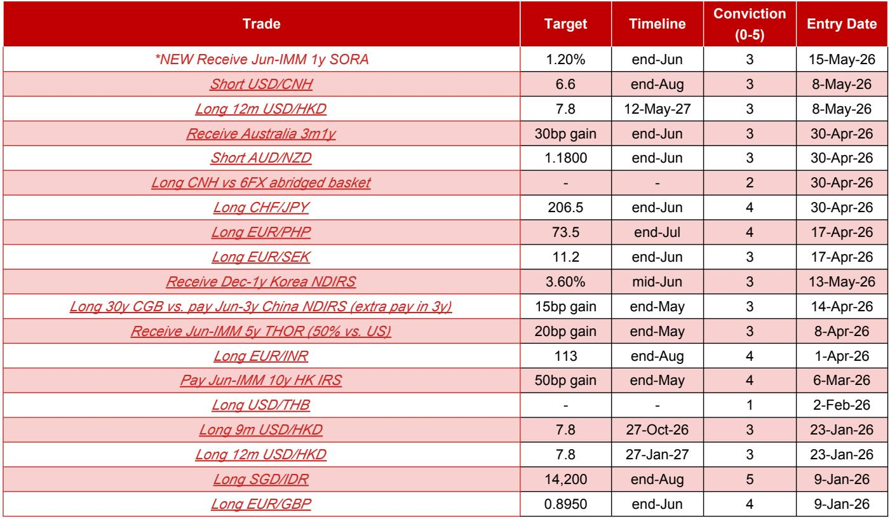
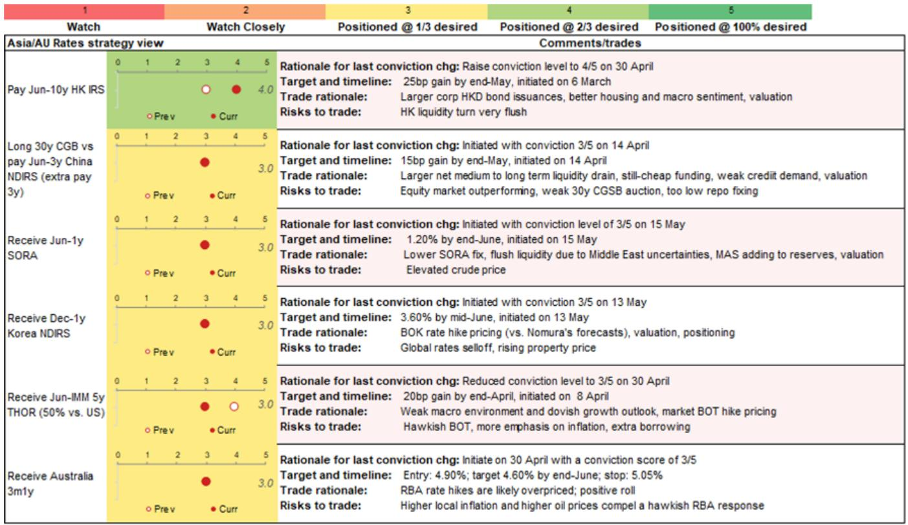
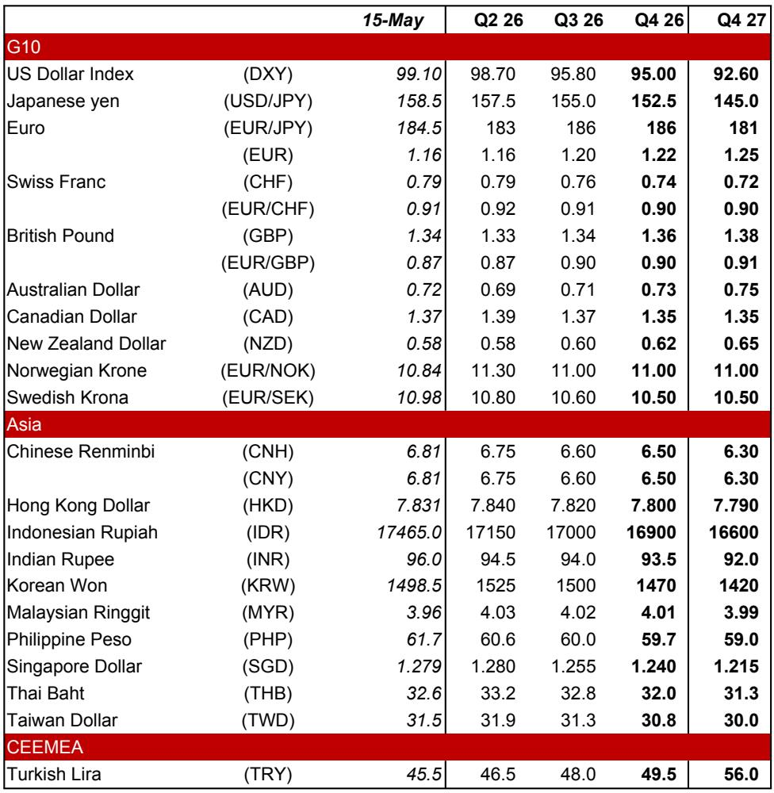

# 市场真正低估的不是地缘风险，而是新兴市场外汇的结构性压力

过去一个月，全球外汇市场经历了两股力量的交织：伊朗局势推高能源价格，美国通胀数据超预期压制降息预期，而中国与美国的元首峰会又短暂缓和了贸易紧张。市场参与者大多在问“地缘冲突会不会升级”或“美联储何时降息”，但某外资投行最新发布的全球外汇策略报告揭示了一个更值得关注的判断：新兴市场外汇面临的结构性压力，远比短期地缘事件更为持久和深刻。

这份报告的核心信号并不在于对美元走势的短期判断，而在于它系统性地拆解了东南亚和南亚主要经济体在外汇储备、资本流动、财政空间和国内政治四个维度上的脆弱性。这些因素正在形成一种“自我强化”的压力循环，而市场对此的定价可能仍然不足。

以下是报告中最值得关注的五个层次的分析。

## 1. 印尼盾面临的不只是汇率贬值，而是一套完整的压力传导链

报告将做多新加坡元兑印尼盾(SGD/IDR)的仓位信心提升至最高等级5/5，目标看至14200，这一判断并非基于单一因素，而是基于一套完整的压力传导逻辑。

第一层是外汇储备的持续消耗。报告明确指出，印尼央行在4月是亚洲新兴市场中最激进的美元卖出方之一，但即便如此，印尼盾仍然是区域内表现最差的货币之一。这意味着，干预本身的效果正在递减，而央行可能被迫允许更多汇率弹性，以减缓储备消耗。第二层是市场对央行加息意愿的质疑。报告提到，与投资者的交流显示，即使印尼央行在5月和6月各加息25个基点，市场仍认为“不够”。这背后是一个更根本的信任问题：市场怀疑央行是否有意愿通过大幅加息来捍卫汇率。第三层是资本外流的叠加效应。MSCI在5月的指数调整中将删除六只印尼股票，预计将带来约17亿美元的被动资金流出。更关键的是，MSCI和FTSE Russell正在重新评估印尼证券的自由流通比例，若外资可投资比例减半，可能引发约40亿美元的额外流出。第四层是财政和评级风险。能源价格上涨正在挤压印尼的财政空间，而穆迪和惠誉已经对印尼主权信用评级给出“负面”展望，标普也可能在6月或7月跟进。第五层是商业环境的恶化。中国商会致信印尼政府表达对监管不确定性的担忧，这可能对长期的外商直接投资产生负面影响。

这五层压力并非独立存在，而是相互强化：储备消耗削弱了市场信心，信心不足加剧资本外流，资本外流又进一步消耗储备。理解这一链条，才能理解为什么报告对印尼盾的看空如此坚定。

## 2. 新加坡元成为区域内的“避险锚”，但逻辑与市场常识不同

在东南亚货币普遍承压的背景下，报告选择做多新加坡元兑印尼盾，这意味着它们认为新加坡元不仅是相对强势，而且具有结构性的升值动力。

这里的逻辑与市场常识有所不同。多数投资者将新加坡元视为“贸易相关货币”，认为其走势取决于全球贸易周期。但报告强调的其实是两个更微妙的因素：通胀压力和货币政策路线。

第一，能源价格上升正在推高新加坡的核心通胀。报告引用的数据显示，3月核心CPI同比已从1.45%显著上升至1.71%，且新加坡金融管理局的CPI声明中对通胀上行风险的描述比4月货币政策声明更为明确。这意味着，通胀压力可能比市场预期的更持久。第二，美国金融条件仍然相对宽松，这降低了全球增长急剧放缓的风险，从而为新加坡的出口导向型经济提供了缓冲。更重要的是，宽松的美国金融条件降低了新加坡金管局在7月进一步收紧货币政策的“尾部风险”。第三，新加坡金管局在4月已经将新元名义有效汇率的年化斜率提升至+1.0%，报告认为7月可能进一步上调至+1.5%。

这些因素合在一起意味着：当区域内的其他国家被迫在“保汇率”和“保增长”之间做痛苦权衡时，新加坡拥有相对更大的政策空间来维持甚至加速升值。这种结构性优势在当前的全球环境下正在被重新定价。

## 3. 菲律宾比索的脆弱性被低估，政治风险正在放大经济压力

报告对菲律宾比索的看空同样具有层次感，但最值得关注的是政治风险如何与经济脆弱性形成共振。

表面上看，菲律宾比索的弱势源于经常账户赤字、能源价格冲击和居民换汇行为。报告提到，4月菲律宾央行净卖出了约25亿美元的外汇储备，但比索仍然是亚洲表现最差的货币之一。这种“干预无效”的困境与印尼类似。

但真正独特的是国内政治因素。副总统萨拉·杜特尔特被众议院弹劾，而参议院已被杜特尔特支持者控制。这意味着弹劾进程可能被阻挠，甚至出现反转。报告敏锐地指出，这种政治不确定性正在“加剧投资者对菲律宾经济前景和信用评级的担忧”。更值得警惕的是，居民正在加速将比索存款转换为外币存款——3月居民外币存款增加了4亿美元，2026年至今累计增加23亿美元。这种“去本币化”的行为一旦形成趋势，将对汇率形成持续的、自我实现的压力。

报告还提到一个容易被忽视的季节性因素：5月是菲律宾海外劳工汇款的季节性低点，而中东局势可能进一步抑制汇款流入。这意味着，在比索最需要外部支撑的时候，支撑力反而最弱。

## 4. 印度卢比的压力被黄金关税掩盖，真正的考验在经常账户

印度近期出台了一系列引人注目的措施：总理莫迪呼吁民众减少黄金购买、节约燃料、避免非必要旅行以节约外汇储备；印度还将黄金进口关税从6%大幅上调至15%，并限制了免税黄金进口的额度。

这些措施乍看之下像是在“保卫卢比”，但报告提供了一个更微妙的解读：这些措施的目标不是直接推高卢比汇率，而是管理外汇储备的消耗速度。证据是，在所有这些政策宣布之后，美元兑卢比仍然创下了96.14的历史新高。这意味着，市场并没有被这些政策说服。

真正让卢比承压的是经常账户。报告指出，4月印度贸易逆差从3月的207亿美元扩大至284亿美元，2026年至今的累计逆差已达1108亿美元。这是高油价的滞后影响，而黄金进口被卡在海关只是暂时掩盖了问题的严重性。与此同时，外国证券投资者在5月前13个交易日净卖出了18亿美元的印度债券和股票。外汇储备的消耗同样惊人：报告估计印度央行在2025年7月至2026年3月期间消耗了996亿美元的外汇储备，4月又卖出了48亿美元。

报告选择了做多欧元兑卢比，目标113，并设置了111的止损。这反映出一种“看空但不追空”的谨慎态度：印度可能出台更多资本流入的激励措施，从而在短期内支撑卢比。但中期来看，经常账户的压力才是真正的考验。

## 5. 人民币的升值逻辑依赖一个尚未验证的假设

在大多数新兴市场货币承压的背景下，报告对人民币的看法显得特立独行：做空美元兑离岸人民币，目标6.60，但信心等级仅为3/5（中等）。

这一判断的核心支撑是中美元首峰会带来的积极氛围。报告认为，双方领导人之间改善的沟通和个人关系有助于降低紧张局势意外升级的风险。此外，报告还提到中国出口的韧性——由于全球AI超级周期提振了与中国AI相关商品的需求，某外资投行的中国经济团队已将2026年中国出口增长预测从4.0%上调至8.6%。

但这里有一个尚未完全验证的关键假设：中国企业是否会持续将海外美元收入汇回国内。报告提到，4月中国外汇存款增加了188亿美元，表明大银行正在买入美元以吸收部分结汇需求。这意味着，尽管官方引导人民币升值，但市场的实际供需可能仍然存在一定的美元买盘压力。如果出口企业选择将更多美元留在海外而非汇回，人民币的升值动力将大打折扣。

此外，报告也承认，美元的强势背景可能暂时阻碍美元兑离岸人民币的下行趋势。这解释了为什么做空美元兑人民币的信心等级仅为3/5——这是一个方向明确但执行难度较高的交易。

## 报告尚未完全回答的三个关键问题

尽管这份报告提供了极具操作性的交易框架，但在阅读过程中，有三个问题值得进一步探讨。

第一，美元强势的持续性。报告提到美元获得了来自高能源价格、美国通胀数据超预期和美国股市创新高的多重支撑，但也承认伊朗局势降级可能导致美元走弱。问题是，这些因素中哪些是结构性的，哪些是周期性的？如果美国通胀迫使市场定价2026年加息，美元的强势可能比预期更持久。

第二，中国对伊朗的施压意愿。报告引用了中国外交部相对克制的表态，与美国白宫更直接的措辞形成对比。一个未解的问题是：中国是否愿意采取实质性行动来推动霍尔木兹海峡的重新开放？如果中国选择“有限参与”，能源价格可能维持高位，这将持续压制新兴市场货币。

第三，新兴市场央行的政策极限。报告多次提到印尼央行和菲律宾央行的干预效果递减，但并未系统性地讨论这些央行在什么情况下可能“放弃抵抗”。如果外汇储备的消耗速度超过预期，新兴市场可能面临被迫允许汇率大幅贬值的风险，这将引发更广泛的资产价格重估。

这些未解问题正是阅读完整报告的价值所在。每一个问题背后都有一组更细致的假设、更底层的图表和更完整的敏感性分析。如果你希望深入理解这些问题的推演逻辑，欢迎来星球微信群里继续讨论。

Personal reading notes and learning share only. Not investment advice.

