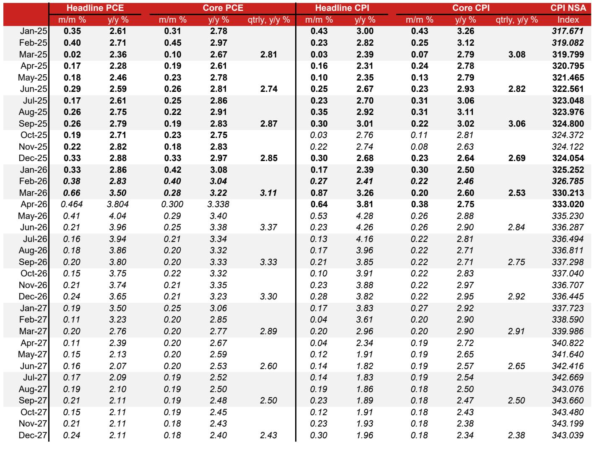
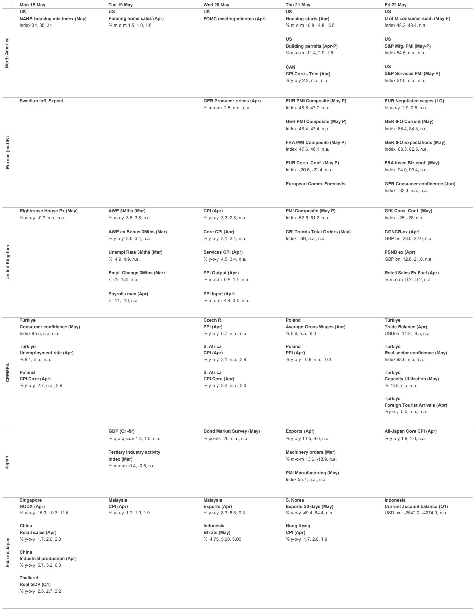
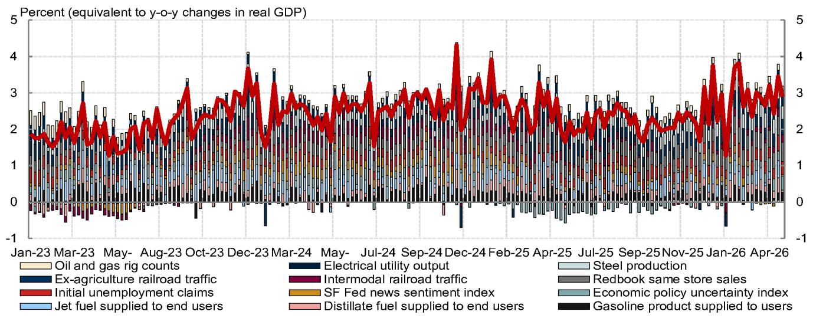

# Inflation Is No Longer Transitory: The Fed's Next Move Will Define the Cycle

The April inflation data released this week represents a structural shift, not a seasonal blip. Core PCE inflation is now tracking at 3.3% year-over-year, significantly above the Federal Reserve's 2% target, and the composition of this overshoot tells a more concerning story than the headline number alone. While some components will prove temporary, three distinct and persistent inflation drivers are converging simultaneously: technology-related price pressures, energy spillovers from the Iran conflict, and accelerating services inflation tied to financial asset prices. The Fed, under newly confirmed Chair Kevin Warsh with the slimmest Senate support in history, is running out of patience. The April FOMC minutes will likely reveal that "many" participants advocated for shifting to more neutral guidance, and the hawkish pivot is already reshaping expectations for the second half of the year.

The critical question for investors is whether this inflation cycle has entered a new phase where supply-side shocks compound rather than fade. The data suggests we are moving from a period where inflation was driven by post-pandemic demand recovery to one where structural cost pressures in manufacturing, transportation, and technology supply chains are becoming embedded. Retail sales remained strong in April despite headwinds from the Iran war, and Q2 GDP tracking stands at 2.7%, driven by resilient consumption and business investment. This combination of above-target inflation and above-trend growth creates the most challenging policy environment for the Fed since the early 1980s. The market has not fully priced the implications, and the next 90 days will determine whether we see a policy error that extends the tightening cycle or a carefully managed deceleration that preserves the expansion.

## The April Inflation Surprise Was Not a Statistical Artifact; It Reveals Three Structural Pressures That Are Mutually Reinforcing

The core CPI surprise of 0.376% month-over-month versus consensus expectations of 0.3% was initially attributed to technical factors, particularly the Bureau of Labor Statistics' carry-forward imputation for rent components. While rent-related inflation did benefit from this methodological quirk, the data reveals something more fundamental: the underlying inflation trend has shifted upward, and the drivers are becoming more diverse rather than converging toward the mean.

The most overlooked development in the April data is the emergence of technology-related components as a persistent inflation source. CPI's information technology commodities, including computers and computer software, continued to rise in April after several years of deflation. More importantly, the pipeline pressure is intensifying. PPI data for semiconductors and other electronic components registered a 2.0% month-over-month increase in April, following 1.0% and 1.1% advances in the prior two months. This is not a one-off supply disruption; it reflects capacity constraints in advanced chip manufacturing that are unlikely to resolve quickly. The semiconductor industry's capital expenditure cycles have a 3-5 year lead time, and the current pricing dynamics suggest that the era of declining consumer electronics costs may be over for the foreseeable future.

Simultaneously, spillovers from energy shocks caused by the Iran war are materializing in ways that extend beyond direct fuel costs. PPI's price index for rubber and plastic products jumped in April, and truck transportation prices rose at their fastest pace in the series' two-decade history. The transmission mechanism here is critical: higher fuel costs increase transportation expenses, which then get passed through to a wide range of manufactured goods. But the trucking industry is also facing capacity constraints that predate the energy shock, meaning these price increases have persistence. The combination of technology-driven input cost increases and energy-driven logistics cost increases creates a compounding effect that standard inflation models underestimate.

The third structural pressure comes from services inflation tied to financial asset prices. PPI's portfolio management and investment advice prices, a key input into core PCE, declined more than expected in April, but this is likely a temporary reprieve. Given the recent strong performance of stock prices, we expect these costs to rebound significantly in May. The linkage between asset prices and services inflation is often overlooked in policy discussions, but it creates a feedback loop: higher stock prices increase portfolio management fees, which feed into core PCE, which keeps the Fed hawkish, which eventually pressures asset prices. This mechanism will be a central tension in the months ahead.

## The New Fed Chair's Fragile Mandate and the Hawkish Shift in FOMC Guidance Will Constrain Policy Flexibility

Kevin Warsh's confirmation as Fed chair by a 54-45 Senate vote represents the slimmest support for any Fed chair in history. This political fragility has immediate implications for monetary policy decision-making. A chair with such narrow Congressional backing has reduced room to pursue unconventional or politically contested policy paths. The hawkish lean we observed in Fedspeak this week is not merely a reflection of data; it is also a strategic response to political vulnerability.

Boston Fed President Collins articulated the emerging consensus most clearly when she stated that more than five years of above-target inflation had reduced her patience for looking through another supply shock. This is a meaningful shift in central bank doctrine. The post-2020 framework emphasized tolerance for above-target inflation to ensure maximum employment, but that tolerance has now been exhausted. KC Fed President Schmid cited inflation as the "most pressing risk to the economy," and Governor Barr echoed the sentiment, calling inflation an "overwhelming risk." This language is not accidental; it signals that the Committee views the current inflation overshoot as requiring active suppression rather than passive management.

The April FOMC minutes, scheduled for release next week, will likely reveal that "many" participants either directly advocated shifting to more neutral guidance or indicated they could have supported such an adjustment. This represents an escalation from the March minutes, where "some" participants expressed similar views, and from January, where "several" did. The progression from "several" to "some" to "many" is a clear signal that the Committee's center of gravity has moved decisively toward tightening. Three voters dissented against the easing bias at the April meeting, and two additional non-voting officials have sUBSequently indicated they would have preferred to change the guidance. The FOMC is not merely drifting hawkish; it is actively consolidating around a more restrictive posture.

The NY Fed's decision to slow reserve management purchases to $10 billion per month, from $25 billion previously and well below consensus expectations of $20 billion, reinforces this hawkish tilt. While the NY Fed framed this as a response to softer seasonal demand, the magnitude of the undershoot is too large to be purely technical. This is a deliberate signal that balance sheet normalization is proceeding faster than the market anticipated. The combination of a politically fragile chair, a Committee that has lost patience with inflation, and accelerated balance sheet reduction creates a policy environment where the risk of overtightening is materially higher than the market currently prices.

## Resilient Domestic Demand Complicates the Fed's Task: Strong Growth and High Inflation Leave No Room for Error

The April retail sales data and Q2 GDP tracking estimates present the Fed with its most difficult scenario: an economy that is running above potential while inflation remains significantly above target. Our Q2 GDP tracking estimate stands at 2.7% quarter-over-quarter annualized, with real final sales to private domestic purchasers accelerating to 2.9%. This is not a recession narrative; this is an overheating narrative.

Retail sales strength was broad-based in April, with upward revisions to the control group in prior months. Critically, higher gasoline spending has not weighed on demand for other components thus far. This suggests that consumers are absorbing energy price increases through savings or income growth rather than cutting back on discretionary spending. Higher-than-usual tax refunds, coupled with strong income growth, have more than offset headwinds from the Iran war. The consumer is not cracking; the consumer is accelerating.

Business investment is also contributing to the growth momentum. The combination of tariff-related incentives for domestic production, strong corporate balance sheets, and the technology investment cycle is driving capex spending. The administration has processed $35.5 billion in tariff refunds for importers, providing an additional fiscal boost to businesses on top of the stimulus already in place from the OBBBA. These refunds will support investment and hiring or help firms absorb tariff- and energy-related cost pressures. Either way, they add to aggregate demand at a time when the economy does not need additional stimulus.

The implications for the Fed are straightforward: with output above potential and inflation above target, the neutral rate of interest is higher than the current policy rate. The Taylor rule, even with conservative parameters, would suggest a federal funds rate at least 50-75 basis points above current levels. The Committee's reluctance to adjust the dot plot has created a credibility gap that will need to be closed. The question is whether they close it through forward guidance or through actual rate increases. Given the hawkish shift in rhetoric, the latter seems increasingly likely.

## What the Report Leaves Unanswered: The Interaction Between Tariff Refunds, Fiscal Stimulus, and Monetary Policy Transmission

The report identifies tariff refunds as a fiscal boost to businesses but does not fully explore the second-order implications for monetary policy transmission. If tariff refunds provide cash flow relief that supports investment and hiring, they simultaneously increase aggregate demand and reduce the disinflationary impact of tariffs. This creates a paradox: the policy intended to reduce the trade deficit may end up increasing domestic inflation pressure, which then requires tighter monetary policy, which then strengthens the dollar, which then reduces the competitiveness of export-oriented industries.

The unresolved question is whether the fiscal and monetary arms of economic policy are working at cross-purposes. The administration is providing fiscal stimulus through tariff refunds and the OBBBA while the Fed is tightening monetary conditions. In normal circumstances, this tension would resolve through interest rate adjustments that crowd out private investment. But the current environment is not normal: business investment is accelerating despite higher rates, suggesting that either the fiscal stimulus is overwhelming the monetary tightening or that the transmission mechanism of monetary policy has weakened.

A second unanswered question concerns the durability of the technology-related inflation pressures. The report documents rising semiconductor and electronic component prices but does not address whether this reflects cyclical capacity constraints or structural changes in the industry's cost structure. If the latter, then the Fed's tools are less effective against this type of inflation, which is driven by supply-side factors rather than demand overheating. The central bank can slow demand, but it cannot directly increase semiconductor fabrication capacity. This suggests that a portion of current inflation may be immune to monetary policy tightening, which would require the Fed to tighten more than the data alone would suggest to achieve the same disinflationary effect.

The third open question relates to the political sustainability of the Fed's hawkish posture. Chair Warsh's narrow confirmation margin creates vulnerability to Congressional pressure, particularly if tightening begins to impact employment or housing. The historical precedent of Chair Volcker's 1979 confirmation, which received 98 votes, stands in stark contrast to the current political environment. A Fed chair with limited political capital may find it difficult to maintain an aggressive tightening stance in the face of rising unemployment or a housing market correction. The market has not priced this political risk because it assumes the Fed's independence is absolute. The data suggests it is not.

## A Decision Framework for Investors: Three Scenarios and the Signals That Differentiate Them

The current environment requires a structured approach to scenario analysis rather than point forecasts. Based on the report's data and our interpretation of the policy dynamics, three scenarios are plausible, and each has different implications for portfolio positioning.

Scenario One: The Fed Tightens into a Soft Landing. In this scenario, the April inflation data proves to be a peak, and sUBSequent months show gradual deceleration as the lagged effects of previous tightening work through the economy. The Fed raises rates once more, then holds steady as growth moderates to trend. This scenario is consistent with the report's finding that some components of April inflation are temporary, but it requires that the structural pressures from technology and energy fade more quickly than they have historically. The signal to watch for is a deceleration in PPI's processed materials and components prices, which would indicate that pipeline pressures are easing. If this occurs by July, the soft landing scenario becomes more probable.

Scenario Two: Stagflationary Persistence. In this scenario, the structural inflation drivers prove more durable than the temporary components prove transitory. Technology-related price increases continue as semiconductor capacity remains constrained, energy spillovers broaden into other industrial inputs, and services inflation accelerates as asset prices remain elevated. The economy grows below trend but inflation remains above 3%. This is the most challenging scenario for both monetary policy and asset allocation. The signal to watch for is a continued rise in PPI's electronic components and truck transportation prices over the next two months, combined with a failure of core PCE to decelerate below 3% year-over-year.

Scenario Three: Policy Error and Recession. In this scenario, the Fed overreacts to the April inflation data and tightens into an economy that is already slowing beneath the surface. The hawkish rhetoric from Fedspeak translates into aggressive rate increases that break the labor market and trigger a recession. This scenario is more likely given the political dynamics around the new Chair and the Committee's stated loss of patience. The signal to watch for is a sharp deterioration in consumer confidence or a sudden increase in initial jobless claims, which would indicate that the tightening is beginning to bite more quickly than the Fed anticipated.

Each scenario requires a different portfolio response. Scenario One favors duration and growth-sensitive assets. Scenario Two favors inflation-protected securities and commodities. Scenario Three favors cash and defensive sectors. The report's data does not definitively point to any single scenario, which is why the next two months of data will be decisive. Investors should position for the most probable scenario while maintaining the flexibility to adjust as the signals become clearer.

## Join the Community to Read the Full Report and Review the Original Charts

The analysis above draws on detailed inflation decompositions, FOMC voting patterns, and GDP tracking estimates that are best understood through the original charts and tables. The full report includes the complete data series for core PCE inflation by component, the semiconductor and transportation price indices, the historical Senate confirmation votes for Fed chairs, and the reserve management purchase schedule. These charts reveal patterns that text alone cannot capture, particularly the acceleration in processed materials prices and the relationship between stock prices and portfolio management fees. Join the community to access the complete analysis and review the original data visualizations that underpin these conclusions.

*This article is for learning and discussion only and does not constitute investment advice.*

Personal reading notes and learning share only. Not investment advice.

