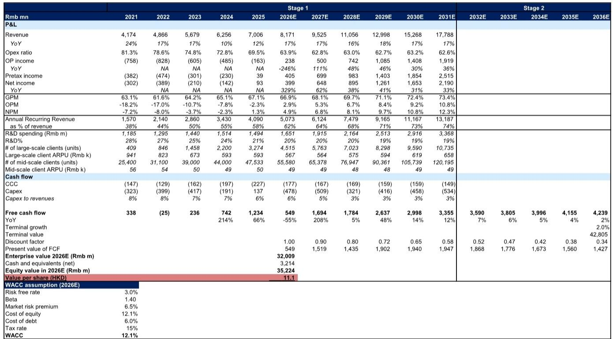
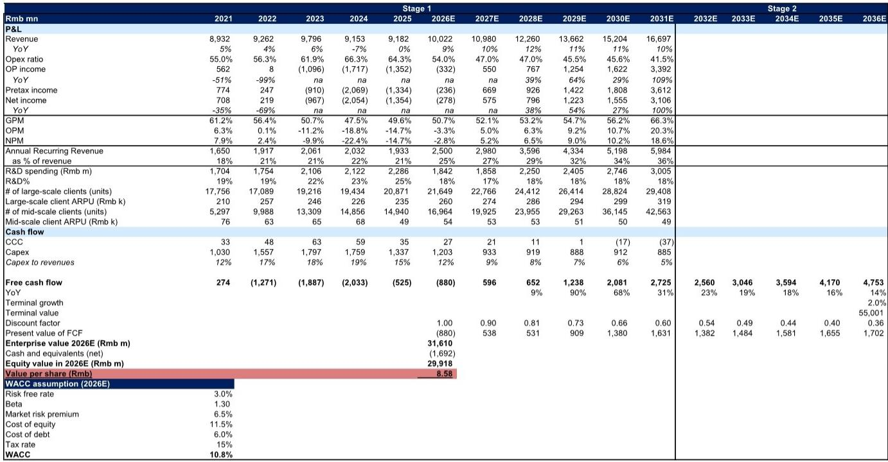
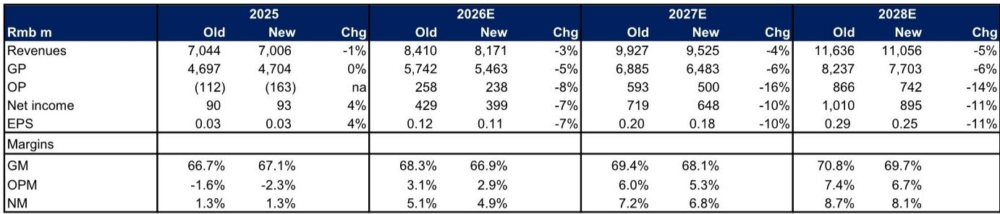

# China's ERP Vendors Are No Longer Selling Software—They Are Selling AI Transformation

The thesis is straightforward: China's enterprise resource planning (ERP) suppliers are undergoing a structural shift that is far more consequential than a simple product upgrade. Based on first-quarter results and forward guidance from two of the country's leading players, the argument is that AI-native features and AI agents are not additive features—they are becoming the primary driver of incremental client spending, internal operational efficiency, and long-term revenue composition. The cloud migration narrative, which dominated the last five years of ERP strategy, is now being sUBSumed by a more powerful transformation: the transition from selling enterprise software to selling enterprise AI.

This matters now because the data is no longer aspirational. Kingdee's annual recurring revenue (ARR) reached RMB 4.2 billion as of March 2026, up 19% year-over-year, with AI-native product contracts already at RMB 230 million. The company expects its AI suite alone to generate over RMB 1 billion in revenue in 2026. By 2030, management targets 50% of total revenues from AI-native solutions and the other 50% from AI SaaS applications. These are not incremental numbers. They represent a fundamental re-architecture of how these companies generate value.

Yet the market remains skeptical. Enterprise IT spending in China continues to face near-term pressure. Yonyou, the larger but more challenged player, reported first-quarter 2026 revenues up only 6% year-over-year, with cloud revenues growing 17%. Its gross margin improved by 5.7 percentage points to 44.7%, but the company is still guiding for a net loss in 2026. The divergence between Kingdee and Yonyou is instructive: the ability to execute on AI transformation is already separating winners from laggards.

The strategic question for investors, enterprise buyers, and competitors is no longer whether AI will reshape ERP. The question is which vendors have the business model, the product architecture, and the operational discipline to monetize this shift before the market forces consolidation.

## AI-Native Features Are Driving a New Revenue Layer That Extends Beyond Traditional SUBScription Growth

The most important insight from the first-quarter data is that AI is not simply a feature that increases retention or reduces churn. It is generating a distinct and measurable revenue stream that sits on top of the existing sUBScription base. Kingdee's AI-native product contracts of RMB 230 million are already material, and the company's guidance for AI suite revenues to exceed RMB 1 billion in 2026 implies a compound growth trajectory that far outpaces the broader business.

This is not about embedding a chatbot into an accounting module. The report details that Kingdee expects 50% of total revenues from AI-native solutions by 2030, with the other half from AI SaaS applications. This distinction is critical. AI-native solutions are products built from the ground up with AI as the core architecture, not legacy software with AI bolted on. The fact that management is willing to set a 50/50 target for 2030 suggests that the product roadmap is already being restructured around this premise.

For Yonyou, the story is more nascent but directionally consistent. The company's BIPv5 product integrates AI capabilities and data, and AI contracts continued to increase through the first quarter of 2026. However, the report explicitly notes that "large-scale revenues contribution from AI native products will still take time to reflect." This is the key difference between the two companies. Kingdee has reached an inflection point where AI revenue is visible and accelerating. Yonyou is still in the investment phase, spending on AI product development while its core business faces muted client spending in the mid-scale enterprise segment.

The implication is clear: the AI revenue layer is real, but it rewards vendors that have already completed the heavy lifting of cloud migration and sUBScription model adoption. Kingdee's sUBScription revenues accounted for 51% of total revenues in 2025, up from 47% in 2024. This base allows AI features to be monetized as incremental upgrades, consumption-based charges, or premium tiers. Without that sUBScription foundation, AI monetization becomes far more difficult.

## The SUBScription Model Transition Is the Prerequisite, Not the Destination

It would be a mistake to treat the continuing migration to sUBScription business models as the main story. The sUBScription transition is necessary, but it is no longer sufficient. The report shows that Kingdee is guiding for 2026 sUBScription revenue growth of 20% year-over-year, with total revenues achieving double-digit growth. SUBScription revenues now represent a majority of total revenues. This is a milestone that validates years of strategic execution.

But the real strategic insight is what happens after the sUBScription base reaches critical mass. Once a vendor has a recurring revenue relationship with clients, the marginal cost of introducing AI-native features drops significantly. The client acquisition cost is already sunk. The integration pathways are already established. The data necessary to train AI models is already flowing through the platform. This is why Kingdee's ARR growth of 19% is impressive, but the AI contract growth is the more important metric.

Yonyou's situation illustrates the risk of being caught in the middle. The company is still executing its cloud transition while simultaneously investing in AI. Its 2026E revenues are projected at RMB 10 billion, with cloud revenues growing 17%, but the company is expected to post a net loss of RMB 278 million. The earnings revision was driven by lower revenues from mid-scale enterprise clients due to muted spending, combined with higher operating expenses for AI product development. This is the classic innovation dilemma: investing in the new while the old is still under pressure.

For investors, the takeaway is that the sUBScription transition is table stakes. The differentiation comes from how quickly and effectively a vendor can layer AI monetization on top of that recurring base. Companies that have already crossed the 50% sUBScription threshold, like Kingdee, are in a fundamentally stronger position than those still approaching it.

## AI-Driven Operational Efficiency Is Reshaping the Cost Structure and the Unit Economics

The third structural shift is internal. ERP vendors are applying AI to their own operations, and the results are visible in the improving revenue-per-employee metrics and margin trajectories. Kingdee is targeting 70% of new code to be generated by AI in 2026, up from 41% in 2025. This is not a cost-cutting exercise in the traditional sense. It is a fundamental change in the productivity curve.

The report highlights that both Kingdee and Yonyou are prioritizing "higher revenues per employee" and "improving operational efficiency." This is not generic management language. When a software company can generate 70% of its new code through AI, the implications for R&D spending, time-to-market, and gross margins are profound. Kingdee's R&D spending as a percentage of revenue has already declined from 28% in 2021 to an estimated 20% in 2026E, even as the product portfolio expands. The company is spending less on R&D as a percentage of revenue while simultaneously launching more AI-native products. This is the efficiency flywheel.

The gross margin data reinforces this. Kingdee's gross margin improved from 63.1% in 2021 to 67.1% in 2025, with estimates reaching 69.7% by 2028E. Yonyou's gross margin improved 5.7 percentage points year-over-year to 44.7% in the first quarter of 2026. While Yonyou's margin is still significantly lower, the trajectory is positive and directly linked to product mix upgrades driven by AI integration.

The strategic implication is that the cost advantage of AI-enabled development will compound over time. Vendors that achieve high AI code generation rates will be able to develop more features, faster, with smaller teams. This creates a structural advantage that is difficult for competitors to replicate quickly, especially those still investing heavily in traditional R&D headcount.

## What the Report Does Not Fully Answer: The Enterprise Buyer's Willingness to Pay for AI-Native ERP

For all the supply-side data on AI product suites, internal efficiency, and sUBScription metrics, the report leaves one critical question unresolved: how much are enterprise customers actually willing to pay for AI-native ERP features, and how quickly will that willingness translate into budget allocation?

The report notes that Kingdee's AI suite revenue is expected to exceed RMB 1 billion in 2026, but it does not break down whether this is coming from existing clients upgrading their contracts or from new client acquisition. It does not specify whether AI features are being priced as premium add-ons, consumption-based tiers, or bundled into existing sUBScription levels. It does not provide data on client retention rates or net revenue retention for AI-enabled accounts versus traditional accounts.

These are not minor details. The entire bull case for China's ERP vendors depends on the assumption that AI features will drive incremental spending rather than simply cannibalize existing revenue. If AI-native features are being given away to retain clients in a competitive market, the revenue uplift will be far smaller than the headline numbers suggest. If, on the other hand, clients are paying a 20-30% premium for AI-enabled tiers, the margin expansion story becomes much more compelling.

The report also does not address the competitive dynamics. Kingdee and Yonyou are the two largest players, but the Chinese ERP market includes international competitors and emerging AI-native startups. The report does not assess whether the AI transformation is creating a winner-take-most dynamic or whether it is lowering barriers to entry for new challengers.

These open questions are precisely why investors need to dig deeper into the original data and charts. The directional story is clear, but the magnitude and timing of the financial impact remain uncertain.

## A Decision Framework for Evaluating China's ERP Vendors During the AI Transition

For readers who are portfolio managers, enterprise strategists, or industry analysts, the report provides enough data to construct a decision framework. The framework has three dimensions: sUBScription maturity, AI monetization visibility, and operational efficiency trajectory.

The first dimension is sUBScription maturity. A vendor that has crossed the 50% sUBScription revenue threshold, like Kingdee, has a structural advantage. Recurring revenue provides visibility, reduces volatility, and creates a platform for AI upsells. A vendor still below that threshold faces the dual challenge of managing the cloud transition while investing in AI.

The second dimension is AI monetization visibility. This is not about AI ambition or product announcements. It is about measurable AI contract value, disclosed AI revenue, and a clear path to scaling. Kingdee's RMB 230 million in AI-native contracts and RMB 1 billion 2026 target provide this visibility. Yonyou's disclosure that "large-scale revenues contribution from AI native products will still take time to reflect" suggests lower visibility.

The third dimension is operational efficiency trajectory. The key metric here is the percentage of new code generated by AI, along with the trend in R&D spending as a percentage of revenue and gross margins. Kingdee's target of 70% AI-generated code by 2026 is a leading indicator of margin expansion. Yonyou's improving but still low gross margins indicate that the efficiency gains are earlier in the cycle.

Applying this framework, the report's ratings make strategic sense. Kingdee is rated Neutral, which reflects the near-term pressure on on-premise ERP revenues that led to downward earnings revisions of 7-11% through 2028E. The AI story is compelling, but the valuation already reflects significant optimism. Yonyou is rated Sell, which reflects the combination of muted enterprise spending, higher AI investment costs, and a net loss expected in 2026E.

The framework suggests that the highest-risk position is owning a vendor that is low on all three dimensions: low sUBScription maturity, low AI monetization visibility, and low operational efficiency. The highest-reward position is owning a vendor that is high on all three but at a valuation that does not fully discount the AI upside.

## The Full Report Reveals the Data That Makes These Distinctions Visible

The analysis above is based on the report parsing, but the original report contains charts and data tables that provide the granularity necessary for conviction. The DCF valuation models for both Kingdee and Yonyou show the specific assumptions driving the target prices. The earnings revision tables show exactly where the consensus was wrong and why. The 12-month forward price-to-sales chart for Kingdee reveals the valuation history and the current re-rating.

These are not decorative exhibits. They are the analytical foundation for the strategic argument. The report also includes detailed breakdowns of client counts, ARPU trends, and cash flow projections that are essential for stress-testing the AI revenue thesis. Without this data, the argument remains at the level of narrative. With it, the argument becomes testable.

The most valuable insight from the full report is the divergence in cash flow trajectories. Kingdee's free cash flow is projected to grow from RMB 549 million in 2026E to over RMB 4.2 billion by 2036E, driven by the combination of sUBScription growth, AI monetization, and declining capital intensity. Yonyou's cash flow path is more uncertain, given the higher operating losses in the near term and the need to sustain AI investment without a clear monetization timeline.

This is the kind of distinction that only the original data can reveal. The narrative of AI transformation is common to both companies. The financial reality is very different.

Join the community to read the full report and review the original charts.

*This article is for learning and discussion only and does not constitute investment advice.*

Personal reading notes and learning share only. Not investment advice.

