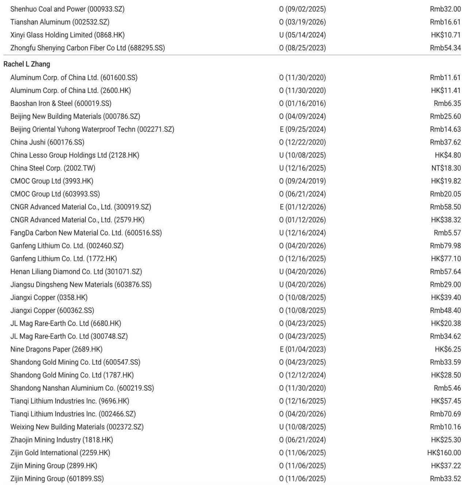
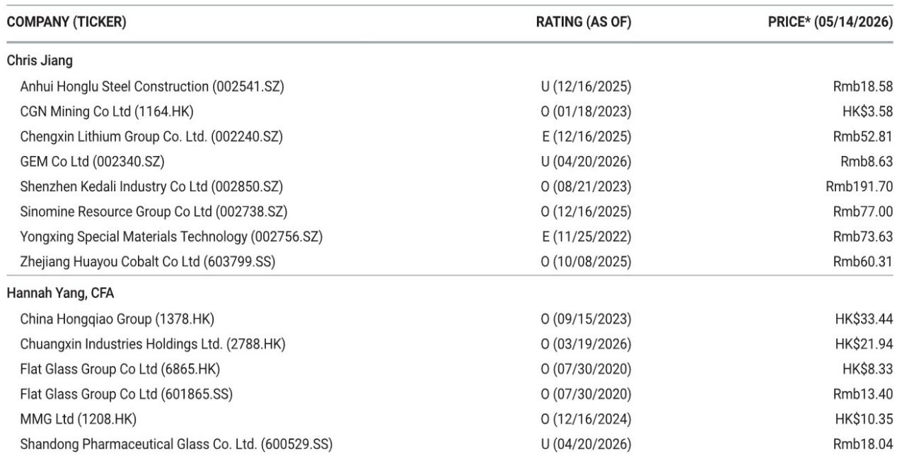
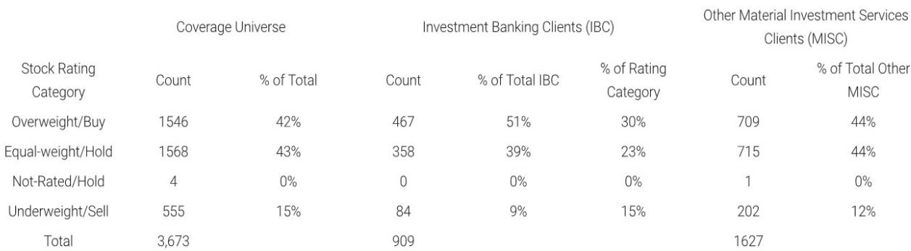

# The Aluminum Market Is Splitting in Two: Export-Driven Recovery and Domestic Consolidation Are Reshaping Who Wins

The narrative around Chinese aluminum demand has been stuck in a single story for too long. Investors have focused on the headline weakness in property-linked sectors and assumed the entire market is softening. That assumption is now dangerously incomplete. A recent field visit to Henan province, the heart of China's aluminum processing industry, reveals a market that is not uniformly weak but structurally bifurcated. Export orders are surging, margins are expanding for internationally exposed players, and domestic market share is concentrating into the hands of leading processors while smaller operators bleed volume. Meanwhile, regulatory interventions around invoicing and production monitoring are creating new liquidity constraints and reinforcing supply discipline. The result is a market where aggregate demand statistics mask a far more important story: the winners are pulling away, and the nature of competition is changing.

This is not a cyclical upturn in the making. It is a structural reconfiguration that will determine which companies survive, which thrive, and which are left holding obsolete capacity. Understanding the forces at work in Henan today is essential for anyone positioning in Greater China materials over the next twelve to eighteen months.

## Export Orders Are Surging on the Back of Overseas Supply Tightness, Not Just Seasonal Recovery

The most striking finding from the Henan checks is the magnitude of the export rebound. Leading processing plants and traders report that export orders increased by roughly 30% month-on-month in April, and one major player indicates that May orders are running 50% higher than March levels. This is not a modest bounce. It is a step-change in volume that reflects genuine demand from overseas markets where supply has become constrained.

What is driving this surge? The data points to a combination of factors. First, processing plants with 100% of their sales locked into long-term contracts reported that export margins improved by approximately RMB 1,800 per ton in April compared to the first quarter. That is a sUBStantial swing in profitability for a commodity processing business where margins are typically measured in hundreds of yuan. Second, volume gains for these contract-heavy players reached 10% in April, driven by pre-load orders from overseas buyers who are securing supply ahead of anticipated tightness.

The implication is clear: global aluminum supply is under pressure, and Chinese processors are stepping into the gap. This is not a demand story driven by Chinese stimulus or domestic re-stocking. It is an export-led recovery that benefits a specific sUBSet of processors those with established international customer relationships, the ability to meet overseas quality and certification standards, and the working capital to handle the longer payment cycles associated with export trade.

For investors, the key question is whether this surge is sustainable or simply a pull-forward of demand. The fact that pre-load orders are being placed suggests that overseas buyers expect conditions to remain tight. But the durability of this trend depends on how quickly non-Chinese capacity can come back online, and on the trajectory of global demand in the second half of 2026.

## The Domestic Market Is Consolidating Rapidly, and the Divergence Between Leaders and Laggards Is Widening

While export-oriented processors are enjoying a tailwind, the domestic market tells a different story. Leading aluminum plate and strip producers have increased capacity by 20-30% and report that order books remain relatively full. These companies are gaining share, investing in new lines, and operating at healthy utilization rates. They are the consolidators.

At the other end of the spectrum, smaller processing plants especially those with heavy exposure to the construction and property sectors are struggling. One processor with 80-90% of its sales tied to building materials reported that orders declined by 20-30% in April and have remained flat month-on-month in May. That is not stabilization. That is a new, lower baseline. The company is not losing share to competitors in its segment. It is losing share to the broader shift in demand away from property-related end uses.

This divergence is exactly what a mature industrial consolidation looks like. The leading players are not just surviving; they are investing aggressively in capacity expansion at a time when smaller rivals cannot afford to do so. The result is a self-reinforcing cycle: larger processors gain scale advantages, which allow them to offer better pricing and service, which in turn attracts more volume, which further strengthens their competitive position.

For investors, this means that aggregate production data for the aluminum processing industry is becoming less useful as a signal. The average masks the underlying reality that a handful of companies are capturing most of the growth, while a long tail of smaller operators are being squeezed out. The right question is not whether the market is growing, but which companies are gaining share and at whose expense.

## Regulatory Crackdowns on Invoicing and Production Are Creating New Frictions That Favor the Large and the Compliant

Two regulatory dynamics are reshaping the aluminum market in ways that are not yet fully priced into consensus expectations. The first is the metals invoice crackdown. According to warehouse operators in Gongyi, in-warehouse trading volume has fallen by 60% month-on-month in May as a direct result of tighter enforcement. Traders are pulling back, liquidity is drying up, and the normal flow of inventory through the warehousing system has been disrupted.

Crucially, this is not a demand shock. The underlying consumption of aluminum has not collapsed. What the invoice crackdown has done is to create a temporary liquidity freeze in the trading layer of the market. Some aluminum that would normally move through warehouses is now being transported directly from smelters to processing plants by truck, bypassing the warehousing system entirely. This is efficient in the short term, but it also means that the official inventory data may be understating the true availability of metal in the supply chain.

The second regulatory dynamic is the real-time monitoring of smelter emissions and energy consumption. Provincial government authorities now have direct access to this data, making it extremely difficult for smelters to overproduce without detection. Overproduction is not just a compliance issue; it is a safety risk, as running pots above design capacity can cause current instability, accidents, or even explosions. The combination of physical risk and regulatory surveillance means that effective supply is capped more tightly than many investors assume.

Both of these dynamics favor large, compliant players. Smaller operators and traders who rely on the flexibility of the informal market are most exposed to the invoice crackdown. And smelters that are tempted to push output above permitted levels face real consequences. The regulatory environment is becoming a structural moat for the well-capitalized and the well-governed.

## What the Report Does Not Yet Answer: The Sustainability of Export Demand and the Real Impact of Steel SUBStitution

For all the valuable ground-level data in the Henan checks, several critical questions remain open. The most important is the sustainability of the export surge. The report notes that export orders are strong and margins are improving, but it does not provide a clear view of the demand outlook beyond the next few months. Are overseas buyers building inventory in anticipation of further price increases, or is this a genuine increase in end-use consumption? The distinction matters enormously for forecasting earnings momentum in the second half of the year.

A second open question concerns the real impact of steel sUBStitution. The report indicates that in the current high aluminum price environment, some color-coated aluminum construction materials are being replaced by steel. But the volumes involved are described as small roughly 30% of a market that totals only 20,000 tons per month. That is a drop in the ocean relative to the broader aluminum market. However, the report does not explore whether higher aluminum prices could trigger sUBStitution in other, larger end-use segments. If aluminum prices remain elevated, the sUBStitution risk could grow beyond the construction niche.

A third unanswered question is the trajectory of domestic demand outside of property. The report confirms that property-linked demand is weak, but it does not provide granular data on demand from automotive, packaging, electronics, or renewable energy applications. These sectors are increasingly important drivers of aluminum consumption, and their health will determine whether the domestic market can find a new equilibrium even as construction fades.

These open questions are not flaws in the research. They are the natural boundaries of a field trip-based analysis. But they underscore the need for investors to triangulate the Henan findings with broader demand indicators and to remain alert to shifts in the export environment.

## A Decision Framework for Positioning in the Aluminum Value Chain

The insights from the Henan checks translate directly into a practical framework for investment decision-making. Investors should evaluate aluminum-exposed companies along three dimensions.

First, assess export exposure and international customer relationships. Companies that have built the infrastructure to serve overseas markets are capturing a surge in demand that domestic-only players cannot access. The key metrics are the share of revenue derived from exports, the stability of long-term contract pricing, and the ability to pass through raw material cost increases. The companies that score highly on these dimensions are likely to see margin expansion even if domestic demand remains sluggish.

Second, evaluate market position within the domestic processing landscape. The consolidation trend favors companies with scale, diversified end-market exposure, and the financial capacity to invest in capacity expansion. The key question is whether a company is a consolidator or a consolidation target. Leading players with 20-30% capacity increases and full order books are in the first category. Smaller players with heavy property exposure and declining orders are in the second.

Third, consider exposure to regulatory risk and compliance capability. The invoice crackdown and the real-time emissions monitoring are not temporary phenomena. They represent a permanent tightening of the operating environment. Companies that have invested in compliant systems, transparent supply chains, and strong government relationships are better positioned than those that have relied on the flexibility of the informal market.

Applying this framework suggests that the aluminum value chain is not a single bet. It is a set of distinct sub-sectors with very different risk-return profiles. The export-oriented segment offers near-term momentum but carries exposure to global demand cycles. The domestic consolidators offer structural compounding but require patience as property-related demand continues to weigh on the industry. The regulatory plays offer safety but may trade at premium valuations that already reflect their advantages.

## The Full Picture Requires Going Beyond the Headlines

The Henan field checks provide a rare window into the ground-level reality of one of China's most important industrial supply chains. The picture they reveal is far more nuanced than the simple narrative of weak domestic demand. Export markets are booming. Market share is shifting. Regulation is reshaping the competitive landscape. And the gap between the winners and the losers is widening.

But no single trip, no matter how well-researched, can capture the full complexity of a market this large and this dynamic. The questions that remain unanswered the sustainability of export demand, the trajectory of sUBStitution, the health of non-property end markets are precisely the questions that will determine whether the current trends persist or reverse.

The full report from which this analysis is drawn contains the original data, charts, and company-level details that allow investors to make their own judgments. It is the kind of research that rewards careful study, not headline scanning.

Join the community to read the full report and review the original charts.

*This article is for learning and discussion only and does not constitute investment advice.*

Personal reading notes and learning share only. Not investment advice.

