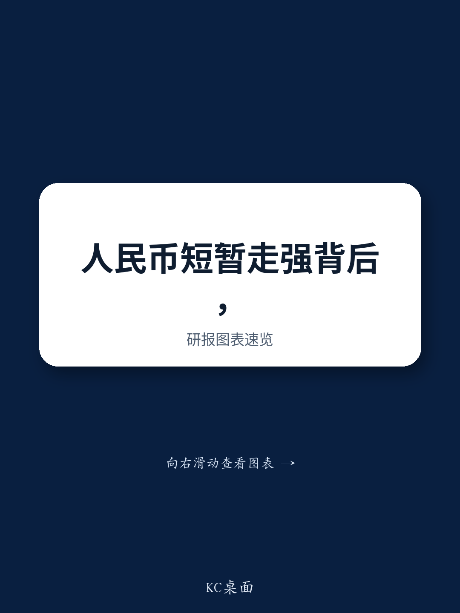
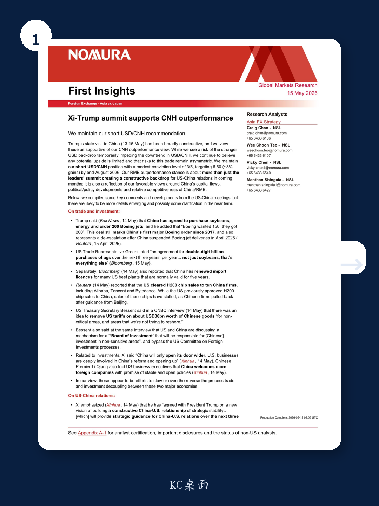
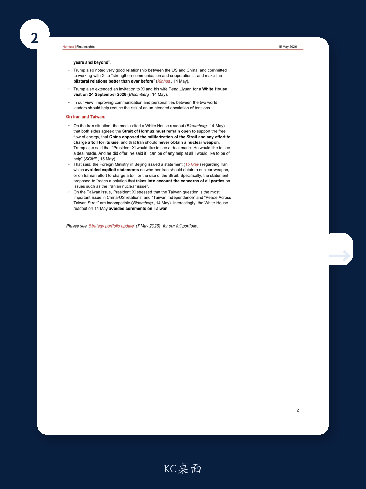

# The Xi-Trump Summit Has Rewired the Trade-Offs in Asia FX — Short USD/CNH Is Now a Strategic Bet on De-Coupling Reversal, Not a Tactical Trade

The conventional view that the renminbi is a passive victim of dollar strength is about to be tested by a far more consequential force: a deliberate, high-level political effort to reverse the de-coupling process between the world's two largest economies. A global investment bank’s research report, published after the Xi-Trump summit in mid-May 2026, makes a clear and counter-consensus argument: the renminbi is positioned to outperform, and the recent diplomatic breakthrough is not just a temporary mood booster but a structural shift in the incentives that govern cross-border capital flows, trade policy, and investment access. The report maintains a short USD/CNH recommendation with a target of 6.60 by end-August 2026, a roughly 3% gain, and assigns it a modest conviction level of 3 out of 5. That conviction level is itself telling — it signals that the trade is asymmetric, with limited upside risk to USD/CNH and meaningful downside potential, even if the path is not linear.

The timing matters. The summit produced a series of concrete outcomes that go far beyond the usual diplomatic photo opportunities. China agreed to purchase soybeans, energy, and 200 Boeing jets — a deal that marks the first major Boeing order from China since 2017 and represents a clear de-escalation after China suspended Boeing jet deliveries in April 2025. The US Trade Representative confirmed an agreement for double-digit billion purchases of agricultural goods per year over the next three years. China renewed import licenses for many US beef plants. The US cleared H200 chip sales to ten Chinese firms, including Alibaba, Tencent, and ByteDance. US Treasury Secretary Bessent floated the idea of removing tariffs on approximately USD 30 billion worth of Chinese goods for non-critical areas. And both sides are discussing a mechanism for a "Board of Investment" that would bypass the Committee on Foreign Investments processes for Chinese investment in non-sensitive areas.

These are not small gestures. They represent a coordinated attempt to slow, and in some cases reverse, the process of trade and investment de-coupling that has defined US-China economic relations for the better part of a decade. For currency strategists, the implication is clear: if the de-coupling narrative is being actively unwound, the renminbi's structural undervaluation — which was partly a function of geopolitical risk premia — should begin to correct. The report frames its RMB outperformance stance as being about more than just the summit; it is also a reflection of favorable views around China's capital flows, political and policy developments, and the relative competitiveness of the Chinese economy and the renminbi. The summit, in this reading, is the catalyst that unlocks a re-rating that was already latent.

But the report is careful not to over-claim. It acknowledges the risk of a stronger USD backdrop temporarily impeding the downtrend in USD/CNH. This is a critical nuance. The dollar has been on a multi-month rally driven by Fed hawkishness, relative US economic outperformance, and safe-haven flows. A stronger dollar is a headwind for any emerging market currency, including the renminbi. The report's view is not that the dollar will weaken, but that the renminbi's resilience will be greater than the market expects, and that any USD/CNH upside will be limited and short-lived. The asymmetry of risk is the key argument: the downside to USD/CNH from the current level is larger and more plausible than the upside, because the political and policy developments are moving in favor of renminbi appreciation, not depreciation.

This article unpacks the report's logic into a structured argument, identifies the questions it leaves open, and translates its insights into a decision framework for investors who are trying to position for the next phase of US-China economic relations.

## The Summit Outcomes Are Not Just Diplomatic Theater — They Are Concrete Mechanisms That Directly Affect Capital Flows and Currency Demand

The most important insight from the report is that the summit produced a set of outcomes that have direct, measurable implications for the renminbi's supply-demand dynamics. This is not about sentiment or "constructive dialogue." It is about real economic flows. The Boeing order alone represents a major shift. China had suspended Boeing jet deliveries in April 2025, a move that was widely interpreted as a retaliatory signal in the trade war. Resuming orders — and exceeding Boeing's own expectations by ordering 200 jets instead of 150 — sends a powerful signal that China is willing to use its purchasing power as a tool of diplomatic engagement. For the renminbi, the effect is indirect but significant: large-scale US exports to China create demand for renminbi to settle those transactions, and they also reduce the bilateral trade surplus, which has been a persistent source of friction and a justification for tariff actions.

The agricultural purchases are equally important. The US Trade Representative's statement that China agreed to "double-digit billion purchases of ags over the next three years, per year" is a massive commitment. Agricultural exports are politically sensitive in the US, and China's willingness to lock in multi-year purchase commitments provides a stable floor for US farm income. For the renminbi, the effect is similar: large, predictable agricultural export flows create a steady stream of renminbi demand from US exporters who need to convert dollar receipts into renminbi to pay Chinese suppliers or to repatriate profits.

The H200 chip sales approval is perhaps the most strategically significant outcome. The US cleared sales of advanced AI chips to ten Chinese firms, including Alibaba, Tencent, and ByteDance. This represents a partial reversal of the technology export controls that have been a cornerstone of US policy toward China. While the US had previously approved H200 chip sales, the report notes that sales had stalled because Chinese firms pulled back after guidance from Beijing. The summit appears to have created the political space for both sides to move forward. For the renminbi, the implication is that the technology de-coupling narrative — which had been a major source of risk premium for Chinese assets — is being actively managed. If Chinese tech firms can access advanced chips, their growth prospects improve, which supports equity valuations and, by extension, capital inflows into China. That, in turn, supports the renminbi.

The proposed "Board of Investment" mechanism is a longer-term structural change. If implemented, it would bypass the CFIUS process for Chinese investment in non-sensitive areas. This would dramatically reduce the regulatory uncertainty that has deterred Chinese outbound investment into the US. For the renminbi, the effect would be to increase the pool of capital that can flow out of China into US assets, which might seem bearish for the currency. But the report's logic is more nuanced: the Board of Investment is likely to be reciprocal, meaning it would also facilitate US investment into China. Given that China is a capital-account surplus economy with large foreign exchange reserves, the net effect of increased two-way investment flows is likely to be neutral to positive for the renminbi, especially if the mechanism reduces the risk of sudden capital flow reversals.

The report's key insight is that these outcomes are not isolated events. They form a coherent package that addresses the main sources of tension in US-China economic relations: trade imbalances, technology restrictions, and investment barriers. By addressing all three simultaneously, the summit creates a self-reinforcing dynamic that reduces the risk of future escalation. For currency markets, that reduction in tail risk is a powerful driver of renminbi appreciation.

## The Renminbi's Relative Competitiveness Is Not Just About the Summit — It Reflects Structural Advantages That Have Been Overlooked

The report makes a point that is easy to miss amid the summit headlines: the renminbi outperformance view is also a reflection of favorable views around China's capital flows, political and policy developments, and relative competitiveness. This is a reminder that the renminbi's fundamental story does not depend solely on US-China relations. There are internal factors that support the currency.

China's capital account has been gradually liberalizing, and the direction of policy has been consistently in favor of two-way flow. The report does not go into detail, but the implication is clear: China is becoming more integrated into global financial markets, and that integration tends to support the renminbi over the medium term because it increases the pool of global investors who need to hold renminbi-denominated assets. The policy environment has also been supportive. Chinese authorities have signaled a commitment to stable and open policies, as Premier Li Qiang told US business executives. That commitment reduces the policy uncertainty that has historically weighed on the renminbi.

On relative competitiveness, the report's argument is that China's export sector remains highly competitive, and the renminbi's real effective exchange rate is not overvalued. In fact, the report implies that the renminbi may be undervalued relative to its fundamental drivers, partly because of the geopolitical risk premium that has been priced in during the de-coupling era. If that risk premium is reduced — as the summit suggests it should be — then the renminbi should appreciate to reflect its true competitive position.

The report's reference to "relative competitiveness" is worth unpacking. China's manufacturing sector has become more efficient and more technologically advanced over the past decade. The country is no longer just the world's factory for low-cost goods; it is increasingly a producer of high-value-added products, including electric vehicles, batteries, solar panels, and advanced electronics. That shift in the composition of exports supports the renminbi because it reduces the price elasticity of demand for Chinese goods. When a country exports high-value-added goods, its currency can appreciate without destroying its export competitiveness, because buyers are more focused on quality and technology than on price. This is the classic "Balassa-Samuelson effect" in action, and it suggests that the renminbi has room to appreciate over the long term.

The report's view is that the summit acts as a catalyst that accelerates this process by removing the political impediments that had been holding back capital inflows and trade flows. The renminbi's fundamental story was already positive; the summit just makes it more visible to the market.

## What the Report Does Not Fully Answer — And Why That Creates Opportunity

The report is analytically rigorous, but it leaves several important questions unanswered. These gaps are not weaknesses; they are the natural result of a fast-moving situation where the full implications of the summit are still unfolding. For investors, these unanswered questions are precisely where the opportunity lies.

First, the report does not fully address the sustainability of the summit outcomes. The agreements on Boeing jets, agricultural purchases, and chip sales are concrete, but they are also reversible. If political tensions flare up again — over Taiwan, the South China Sea, or any other flashpoint — these deals could be suspended or canceled. The report acknowledges that the Taiwan issue remains the most important issue in US-China relations, and that President Xi stressed that "Taiwan Independence" and "Peace Across Taiwan Strait" are incompatible. The fact that the White House readout avoided comments on Taiwan suggests that the issue was deliberately finessed, not resolved. The risk is that a future incident could unravel the progress made at the summit. The report's modest conviction level of 3/5 reflects this uncertainty.

Second, the report does not fully address the dollar's trajectory. It acknowledges the risk of a stronger USD backdrop temporarily impeding the downtrend in USD/CNH, but it does not model what happens if the dollar strengthens further. The dollar's strength is driven by multiple factors — Fed policy, US fiscal spending, global risk appetite — that are largely independent of US-China relations. If the dollar continues to rally, the renminbi may struggle to appreciate, even with the summit tailwinds. The report's asymmetry argument — that any USD/CNH upside is limited — is plausible, but it depends on the assumption that the dollar's rally is near its peak. If the dollar has further to run, the trade could take longer to play out, and the conviction level would need to be adjusted.

Third, the report does not fully address the domestic Chinese policy environment. The summit outcomes are positive for the renminbi, but they operate against the backdrop of China's domestic economic challenges, including a property sector downturn, demographic headwinds, and local government debt. If these domestic issues worsen, they could offset the positive external developments. The report's favorable view of China's capital flows and policy developments is based on a relatively benign domestic scenario. If that scenario deteriorates, the renminbi could weaken despite the summit.

Fourth, the report does not fully address the implementation risk of the Board of Investment mechanism. The idea is promising, but it would require significant regulatory coordination between the US and China. The CFIUS process is deeply embedded in US law, and bypassing it would require legislative action or a creative interpretation of existing authorities. The timeline for implementation is unclear, and the mechanism could be delayed or watered down. The report's implicit assumption that the Board of Investment will be implemented in a meaningful way may be optimistic.

These unanswered questions create a range of possible outcomes. The base case — a gradual renminbi appreciation driven by summit outcomes and structural competitiveness — is the report's central scenario. But there are upside and downside risks. The upside risk is that the summit outcomes lead to a broader normalization of US-China relations, including progress on Taiwan and technology, which would trigger a much larger renminbi rally. The downside risk is that the summit outcomes unravel, or that the dollar strengthens significantly, or that domestic Chinese problems worsen, causing the renminbi to weaken.

For investors, the key is to recognize that the report's asymmetry argument is conditional on the summit outcomes being sustained. If they are sustained, the trade works. If they are not, the trade fails. The report's modest conviction level is a signal that the probability of success is above 50% but well below 100%. That is exactly the kind of trade where a disciplined risk management framework is essential.

## A Decision Framework for Investors: How to Position for the Renminbi Outperformance Trade

The report's insights can be translated into a structured decision framework for investors who are considering whether to position for renminbi outperformance. The framework has three layers: the macro environment, the diplomatic catalyst, and the trade implementation.

At the macro level, the key question is whether the fundamental drivers of the renminbi are supportive. The report argues that they are: China's capital flows are favorable, the policy environment is stable, and the renminbi is competitively undervalued. Investors should assess these factors independently. Are capital flows into China accelerating or decelerating? Is the policy environment becoming more or less predictable? Is the renminbi's real effective exchange rate undervalued or overvalued relative to its historical average and its fundamental drivers? If the answer to these questions is positive, the macro backdrop supports a long renminbi position.

At the diplomatic level, the key question is whether the summit outcomes are likely to be sustained and expanded. The report provides a list of concrete outcomes — Boeing orders, agricultural purchases, chip sales, tariff reductions, the Board of Investment — that can be tracked over time. Investors should monitor these outcomes for signs of implementation or reversal. If the Boeing orders are fulfilled, the agricultural purchases are made, the chip sales proceed, and the tariff reductions are implemented, the diplomatic catalyst is working. If any of these outcomes are delayed or canceled, the catalyst is weakening.

At the trade implementation level, the key question is how to structure the position. The report recommends a short USD/CNH position with a target of 6.60 and a conviction level of 3/5. Investors who agree with the macro and diplomatic analysis can use this as a starting point. But they should also consider the following adjustments:

- **Position sizing**: Given the modest conviction level, the position should be sized accordingly. A 3/5 conviction level suggests that the trade has a positive expected value but is not a slam dunk. Position sizing should reflect this uncertainty.

- **Stop-loss levels**: The report argues that any USD/CNH upside is limited, but that does not mean there is no risk. A stop-loss at a level that would invalidate the trade — for example, a break above the recent highs — should be set in advance.

- **Hedging**: If the dollar strengthens further, the trade could suffer. Investors could hedge dollar exposure by taking a short dollar position against a basket of currencies, or by using options to protect against a USD/CNH rally.

- **Time horizon**: The report's target is end-August 2026, which is about three months from the summit. That is a relatively short time horizon for a trade that depends on diplomatic outcomes. Investors should be prepared to hold the position longer if the summit outcomes take time to materialize, or to exit early if the outcomes reverse.

The decision framework is not a formula; it is a way of thinking about the trade that forces investors to be explicit about their assumptions and to monitor the key variables. The report provides the analytical foundation; the investor provides the judgment.

## The Unanswered Questions That Make This Trade Worth Following

The most valuable part of the report is not the trade recommendation itself, but the questions it raises about the future of US-China economic relations. The summit has created a window of opportunity for a more constructive relationship, but that window could close quickly. The report's analysis suggests that the renminbi is the most direct way to express a view on this relationship, but it is not the only way. Investors could also consider Chinese equities, Chinese bonds, or even commodity strategies that benefit from increased trade flows.

The report leaves the reader with a sense that the situation is fluid and that the full implications of the summit have not yet been priced in. That is precisely why this trade is interesting. If the market fully understood the implications, the renminbi would already have appreciated. The fact that the conviction level is only 3/5 suggests that the market is still uncertain, and that uncertainty creates opportunity.

For investors who want to track the evolution of this trade, the report provides a clear set of indicators to watch: the fulfillment of the Boeing order, the pace of agricultural purchases, the progress of the Board of Investment mechanism, and the trajectory of US-China political relations. Each of these indicators will provide signals about whether the trade is on track or off track. The report's analytical framework makes it possible to interpret those signals in real time.

The most important question the report does not answer is whether the summit represents a genuine shift in US-China relations or a temporary tactical pause. The answer to that question will determine whether the renminbi outperformance trade is a three-month tactical trade or a multi-year strategic bet. The report's modest conviction level suggests that even the authors are not sure. That uncertainty is what makes the trade worth following.

Join the community to read the full report and review the original charts.

*This article is for learning and discussion only and does not constitute investment advice.*

Personal reading notes and learning share only. Not investment advice.

