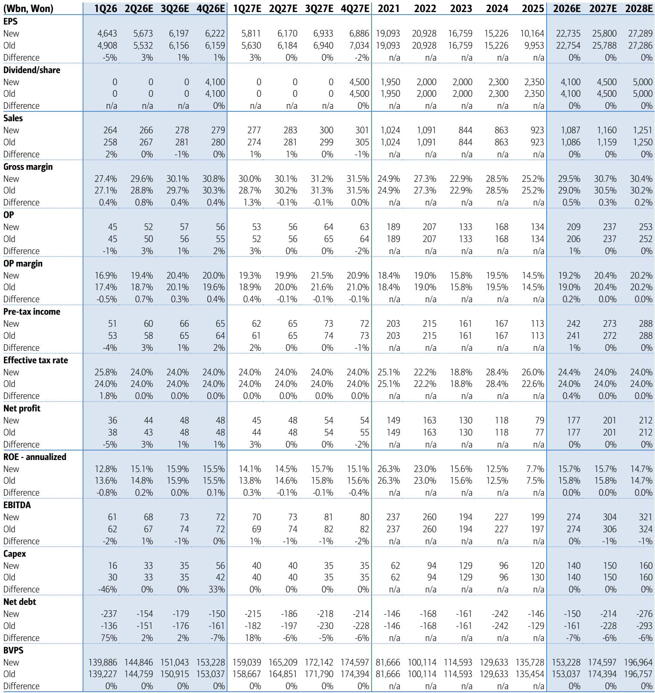
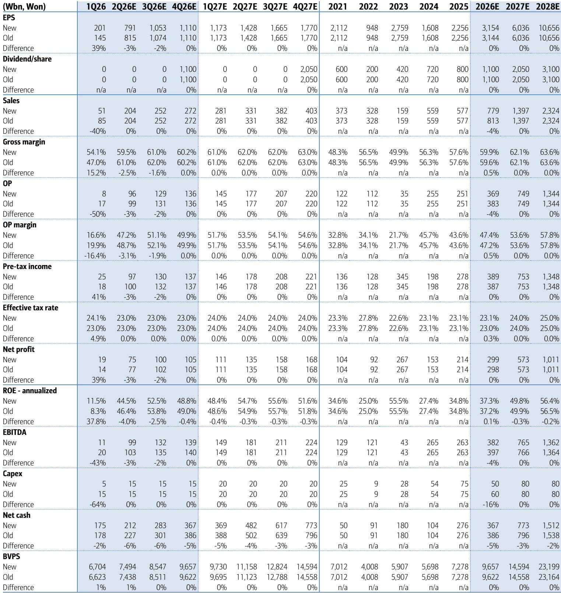
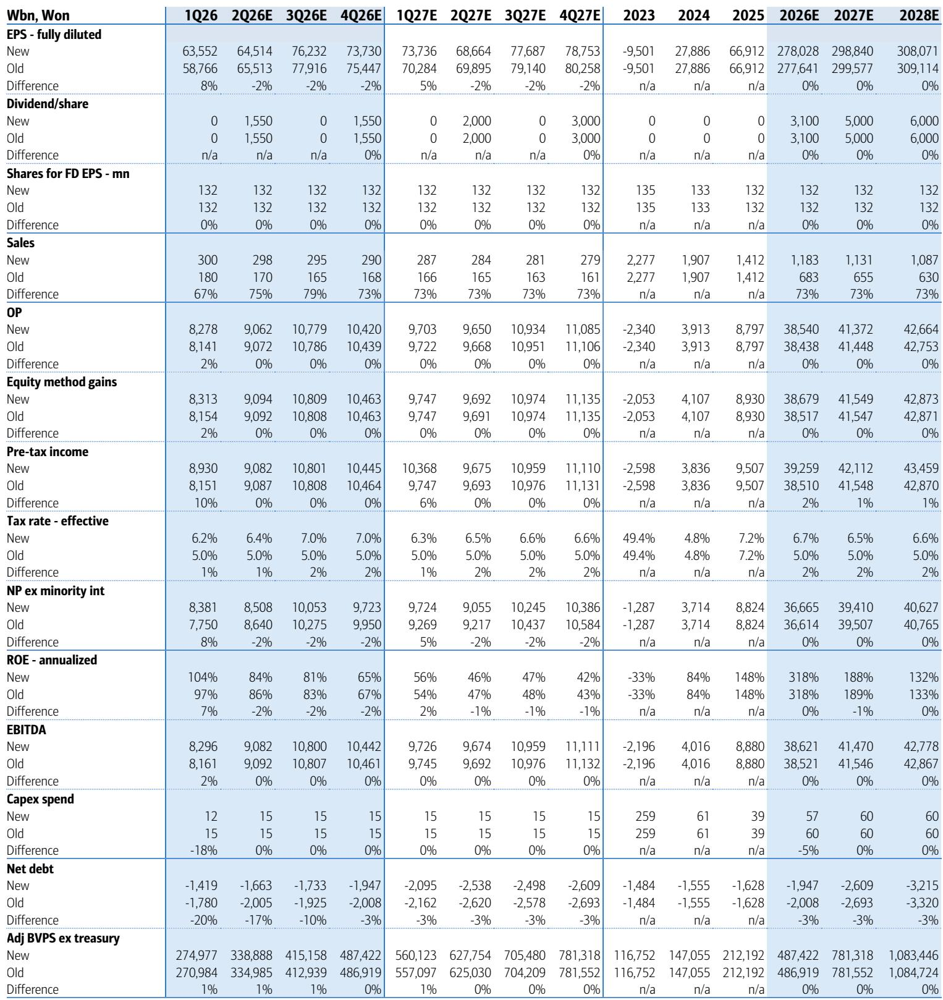

# Memory Chip Markets Are Entering a Structural Pricing Regime, Not Just a Cyclical Upswing

The global memory chip industry is generating signals that defy conventional cyclical logic. Kioxia's guidance for the first quarter of calendar 2026 revealed average selling prices (ASPs) that more than doubled sequentially—a figure 20 percentage points higher than what Korean chipmakers reported. This is not a modest beat. It is a data point that forces a fundamental reassessment of how supply, demand, and pricing interact in this cycle. Phison Electronics, a Taiwan-based NAND module maker, reported April results that can only be described as super-cycle-level: sales up 237% year-over-year, a pre-tax profit margin of 45%, and a net profit margin of 38%. These are not the numbers of a market that is merely recovering. They are the numbers of a market that is structurally repricing.

The conventional consensus, represented by forecasts from industry trackers such as TrendForce, expects NAND ASP growth to decelerate sharply after the second quarter—from 70-75% sequential growth down to single digits. Yet the evidence from Kioxia and Phison suggests that the upside risk to these forecasts is sUBStantial. The gap between what the market is delivering and what analysts expect is wide enough to create significant investment mispricing. The question is not whether memory prices will rise. The question is whether the market fully understands the forces that are sustaining these price increases.

Three developments in the current landscape deserve particular attention: the surprising strength of NAND pricing, the potential supply disruption from a labor strike at the world's largest memory supplier, and the manageable but instructive miss from a key semiconductor equipment company. Each of these tells a different part of the same story—that the memory market is being driven by forces that are more structural than cyclical, and that investors who rely on historical patterns risk underestimating the persistence of the current upcycle.

## Kioxia's Guidance Reveals That NAND Pricing Has Entered a Regime That Consensus Models Do Not Capture

Kioxia's more-than-doubled ASP guidance for the first quarter of 2026 is the single most important data point in this report. It is not merely a strong quarter. It is a signal that the pricing mechanism in NAND has shifted. The fact that Kioxia's ASP increase was 20 percentage points higher than the results reported by Korean chipmakers suggests that the mix of products matters enormously. Kioxia attributed part of this outperformance to an increase in SSD sales, including enterprise solutions. This is not accidental. Enterprise SSDs carry higher margins and are less price-sensitive than consumer NAND. The shift toward enterprise storage is a structural trend, not a cyclical one.

Phison's April results reinforce this interpretation. A 237% year-over-year sales increase with a 45% pre-tax margin is not something that happens in a market that is merely experiencing a cyclical bounce. It happens when demand is structurally outstripping supply in a way that allows pricing power to flow through the entire value chain. Phison is a module maker, not a memory manufacturer. Its margins reflect its ability to pass through higher component costs to end customers. When a module maker can achieve 45% pre-tax margins, it means that end demand is strong enough to absorb price increases without resistance.

The consensus forecast from TrendForce expects only 8-13% sequential NAND ASP growth after the second quarter. The report's own estimates are more aggressive, at 9% for the third quarter and 3% for the fourth quarter. But even these may prove conservative. If Kioxia's second-quarter guidance of 74.5% sequential revenue growth is any indication, the implied ASP increase for the second quarter is around 70%, well above the report's estimate of 34%. The gap between what is happening and what is being forecast is large enough to create meaningful investment opportunities for those who are willing to challenge the consensus.

The implication is clear: NAND pricing is not following the traditional cycle. The combination of enterprise SSD adoption, constrained supply, and sustained demand from data center and AI-related applications is creating a pricing regime that looks more like a structural shift than a transient upswing. Investors who are positioned for this shift may be rewarded, while those who assume a rapid mean reversion may be caught off guard.

## A Potential Labor Strike at Samsung Could Tighten Supply Further, But the Real Risk Is in the Backend

Samsung Electronics is the world's largest supplier of both DRAM and NAND memory. Any disruption to its production has global implications. The labor union has threatened an 18-day strike from May 21 to June 7 if special bonus payments are not settled. On its face, an 18-day strike might not seem catastrophic. But the reality of semiconductor manufacturing is that it is not easy to stop and restart. Even if the strike is limited in duration, the time required to normalize fab operations after a full suspension can stretch to several months.

The report correctly notes that Samsung's memory fab operations are highly automated, with few people inside the clean rooms. This reduces the risk of a complete shutdown. However, the backend packaging areas are labor-intensive and could be significantly affected. Packaging is not a trivial part of the value chain. It is where memory chips are prepared for integration into end products. If packaging operations are disrupted, the flow of finished chips to customers will be interrupted even if the fabs themselves continue to run.

The strategic implication is that OEMs and large technology companies are likely to accelerate their procurement of Samsung memory chips ahead of the peak season in September and October. This rush to secure supply will push spot prices higher. The report notes that both DRAM and NAND spot prices have already rebounded this week, following a period of softening in April and early May. This is not a coincidence. The market is pricing in the risk of a supply disruption, even if the strike itself is short-lived.

The most important consequence may be on contract pricing for the third quarter, which is typically negotiated in June. If the strike creates uncertainty about Samsung's ability to deliver, memory buyers will have less leverage in these negotiations. The result could be higher contract prices across the industry, benefiting not just Samsung but also its competitors such as SK Hynix and Micron. For investors, the key question is whether the market has fully priced in this tailwind. The spot price rebound suggests that some of it is already reflected, but the full impact on contract pricing may not be apparent until the negotiations are complete.

## Hanmi Semi's TCB Sales Miss Is Manageable, But It Highlights a Broader Risk in Equipment Concentration

Hanmi Semiconductor reported first-quarter sales of only 51 billion won, a 65% decline year-over-year, with an operating profit margin of just 17% compared to its normal range of 40-50%. This was a significant miss. The report attributes the weakness primarily to lower thermal compression bonding (TCB) orders from SK Hynix. TCB equipment is critical for high-bandwidth memory (HBM) production, and Hynix is a dominant player in that market. When Hynix reduces its orders, the impact on Hanmi is immediate and severe.

However, the report also makes clear that this is a manageable risk. Hanmi's second-quarter and second-half recovery is well expected, driven by a more diversified TCB customer base that includes not only Hynix but also Micron, ASE, TSMC, and others. The equipment is being used for applications beyond HBM, including 2.5D logic and even high-bandwidth flash (HBF). This diversification reduces the company's dependence on any single customer or application. The fact that Hanmi's first-quarter net profit of 19 billion won was actually higher than its operating profit of 8 billion won, due to foreign exchange gains, further softens the blow.

The broader lesson here is about the risks of concentration in the semiconductor equipment supply chain. Companies that depend on a small number of customers for the majority of their revenue are vulnerable to order fluctuations. This is not a reason to avoid the sector, but it is a reason to be selective. Hanmi's earnings estimates for 2026 through 2028 remain largely unchanged despite the first-quarter miss, which suggests that the report's analysts view the miss as a temporary setback rather than a structural problem.

For investors, the takeaway is that the equipment cycle is not perfectly aligned with the memory cycle. Equipment orders can be lumpy, and a single quarter of weakness does not necessarily indicate a broader downturn. The recovery in Hanmi's orders later this year, driven by a more diversified customer base, will be an important indicator of whether the company's growth thesis remains intact.

## The Report Leaves Unanswered Questions About the Sustainability of AI-Driven Memory Demand

While the report provides extensive data on pricing, supply, and individual company performance, it does not fully address one critical question: how sustainable is the current demand environment? The strong pricing and volume growth are clearly being driven in part by AI-related applications, including HBM for data center accelerators and enterprise SSDs for AI training and inference. But AI demand is notoriously difficult to forecast. It is subject to shifts in technology, capital spending cycles, and the adoption rates of new applications.

The report shows that Korea's semiconductor exports remained at record-high levels in May, with year-over-year growth of 140%. Taiwan's memory-related companies, such as Nanya Tech and Transcend, reported year-over-year sales growth of 200% or more. These are extraordinary numbers. But they also raise the question of whether the market is double-ordering or building inventory in anticipation of future demand. If AI demand slows, or if the major cloud service providers reduce their capital spending, the memory market could face a sharp correction.

The report does not provide a clear framework for assessing this risk. It acknowledges that the current cycle is unusual, but it does not model a scenario in which AI demand disappoints. For investors, this is the most important unresolved question. The bull case for memory stocks depends on the assumption that AI-driven demand will continue to grow for several more years. If that assumption proves wrong, the downside could be significant.

## A Decision Framework for Investors: Focus on Pricing Power, Supply Constraints, and Customer Diversification

Given the current environment, investors should evaluate memory-related investments using three criteria: pricing power, exposure to supply constraints, and customer diversification.

First, pricing power is the most important factor. Companies that can raise prices without losing market share are best positioned. Kioxia's ability to more than double its ASPs suggests that it has significant pricing power in the NAND market, particularly in enterprise SSDs. Phison's margins confirm that pricing power flows through the value chain. Investors should favor companies that have pricing power and avoid those that are price takers.

Second, supply constraints create opportunities. The potential Samsung labor strike is the most visible near-term supply risk, but there are also longer-term constraints related to capacity expansion. Building new memory fabs takes years and costs billions of dollars. If demand continues to grow faster than supply, pricing will remain elevated. Investors should monitor capacity announcements from the major memory manufacturers and adjust their positions accordingly.

Third, customer diversification reduces risk. Hanmi Semi's experience shows that dependence on a single customer can lead to significant earnings volatility. Companies with a broad customer base and multiple end-market applications are more resilient. This is particularly important in the equipment and materials segment, where order concentration is common.

## Join the Community to Read the Full Report and Review the Original Charts

The analysis above is based on a detailed research report that includes pricing data, earnings revisions, and supply-demand forecasts. The full report contains charts and tables that provide deeper insight into the trends discussed here. To access the complete analysis and make more informed investment decisions, join the community to read the full report and review the original charts.

*This article is for learning and discussion only and does not constitute investment advice.*

Personal reading notes and learning share only. Not investment advice.

