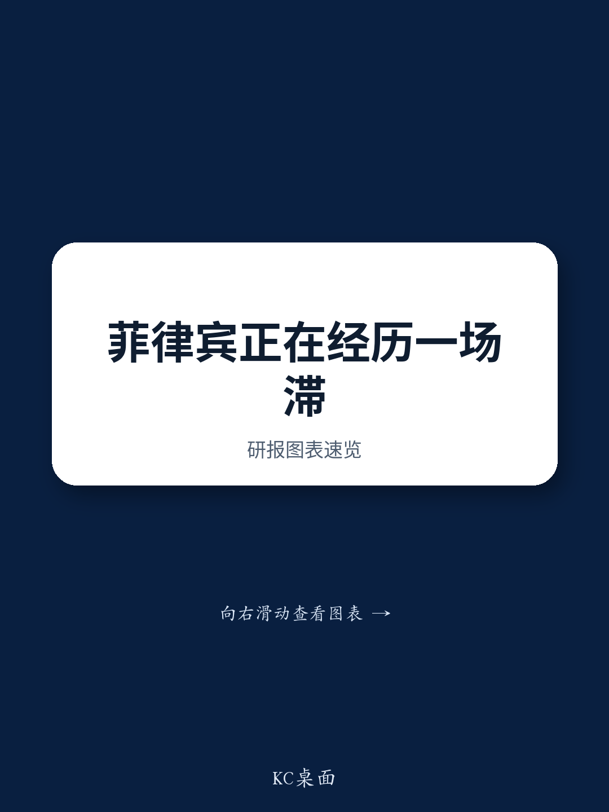
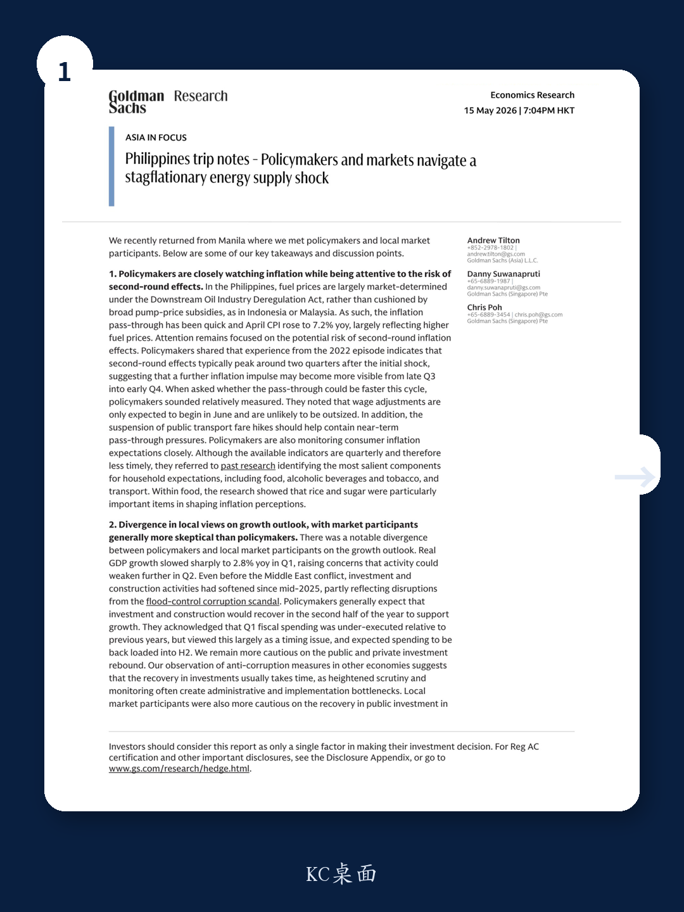
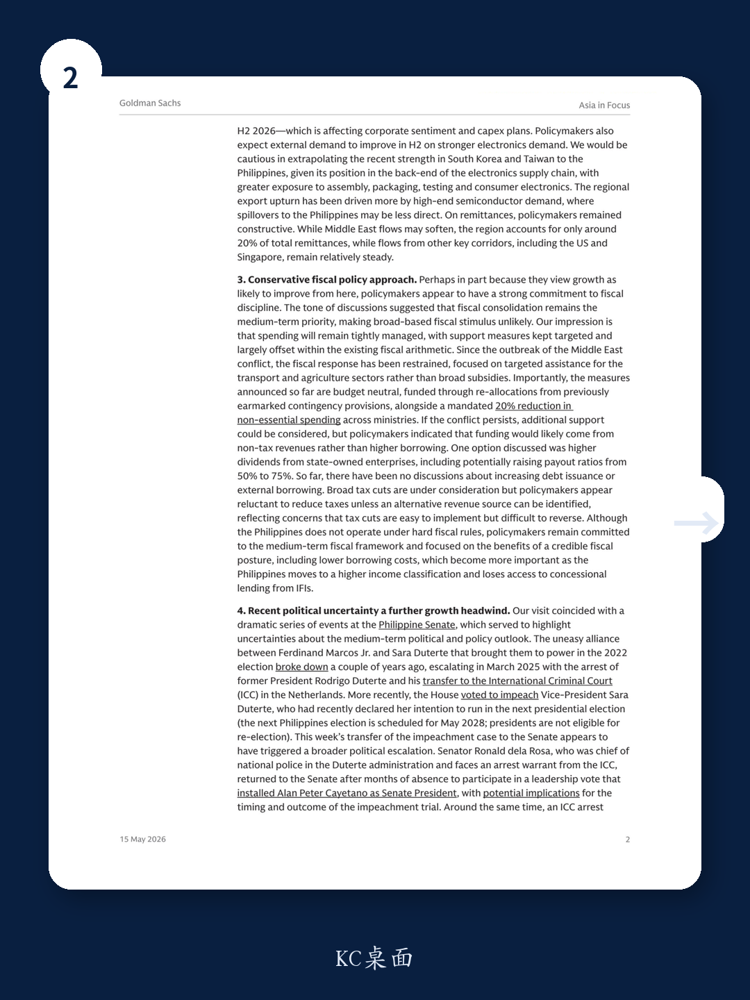

# 菲律宾正经历一场滞胀式能源供给冲击，市场低估了政治尾部风险对增长的压制

当全球投资者的目光仍集中在东南亚制造业转移与供应链重构的叙事上，一份来自某外资投行的菲律宾调研笔记，却揭示了一个更复杂、也更令人不安的现实。

2026年4月，菲律宾CPI同比已升至7.2%，主要驱动力是燃料价格。与此同时，一季度实际GDP增速骤降至2.8%。通胀高企与增长骤冷并存，这不是典型的周期波动，而是一场由能源供给冲击引发的滞胀。更关键的是，菲律宾国内的政策制定者与市场参与者，对增长前景的判断出现了显著分歧——前者倾向于认为下半年会反弹，后者则普遍更加悲观。

这份报告的真正价值，不在于罗列数据，而在于它揭示了三个被主流叙事低估的变量：政治不确定性对投资的压制、财政纪律对刺激空间的约束、以及货币政策的传导路径可能比市场预期的更曲折。本文基于该报告的核心逻辑，提炼出对产业决策者与资产配置者真正有意义的判断框架。

## 1. 能源价格传导的“快与慢”，决定了通胀二次效应的时间窗口

菲律宾的能源定价机制，决定了其通胀传导路径与印尼、马来西亚截然不同。在《下游石油产业放松管制法》框架下，国内燃料价格基本由市场决定，而非通过广泛补贴缓冲。这意味着，国际油价上涨会快速且直接地反映在CPI中。4月CPI飙升至7.2%，正是这一机制的体现。

然而，政策制定者更关心的不是第一次传导，而是二次效应。他们借鉴2022年的经验，认为二次效应通常在初始冲击后两个季度左右达到峰值。这意味着，通胀的进一步压力可能从2026年三季度末到四季度初才会更加明显。但这次传导会更快吗？政策制定者的回答相对克制：工资调整预计从6月才开始，且幅度不会过大；公共交通票价上调已被暂停，这有助于抑制近期的传导压力。同时，他们正在密切监测消费者通胀预期——尽管现有指标是季度数据，时效性不足。

这里有一个关键洞察：政策制定者依赖的历史经验，可能低估了本轮供给冲击的特殊性。2022年的能源冲击发生在全球需求从疫情中复苏的背景下，而当前菲律宾面临的是增长已显著放缓后的供给冲击。在增长动能减弱时，同样的油价涨幅对消费者信心和实际购买力的打击，可能更为持久。报告没有完全展开这一点，但这恰恰是判断后续通胀路径的核心假设。

## 2. 增长前景的分歧背后，是投资复苏节奏的根本性误判

政策制定者与市场参与者对增长前景的分歧，是这份报告中最值得关注的信号之一。政策制定者普遍预期投资和建筑业将在下半年复苏，理由包括：一季度财政支出执行不足主要是时间节奏问题，支出将集中在下半年；外部需求将因电子行业走强而改善。

但报告作者对此持谨慎态度，理由有三点，每一层都值得拆解。

第一，反腐调查对投资的压制效应往往具有滞后性和持久性。即使在2025年中期之前，投资和建筑活动就已经因防洪腐败丑闻的调查而放缓。作者观察其他经济体的反腐经验后指出，投资复苏通常需要时间，因为加强的审查和监测往往会造成行政和执行瓶颈。这不是一个简单的“调查结束、项目重启”的故事。

第二，菲律宾在全球电子供应链中的位置，决定了它难以充分受益于当前的半导体上行周期。近期韩国和台湾的出口强劲，主要受高端半导体需求驱动。而菲律宾处于供应链的后端，更多涉及组装、封装、测试和消费电子，高端芯片需求的溢出效应相对有限。

第三，市场参与者对2026年下半年公共投资复苏的怀疑，正在影响企业信心和资本开支计划。这是一个负向反馈循环：企业预期政府投资不会如期恢复，于是推迟自己的投资，而这反过来又削弱了经济复苏的基础。

所以，问题不在于“增长会不会反弹”，而在于“政策制定者假设的复苏机制是否成立”。如果投资复苏被反腐和行政瓶颈拖累，如果外部需求溢出有限，那么2.8%的一季度增速可能不是底部，而是趋势的确认。

## 3. 财政纪律优于增长刺激，意味着政策工具箱比市场预期的更有限

在增长放缓的背景下，菲律宾政策制定者的财政立场令人意外地保守。他们的表态清晰而坚定：财政整顿仍是中期优先事项，广泛财政刺激的可能性极低。

自中东冲突爆发以来，财政响应一直克制，仅限于对交通和农业部门的有针对性援助，而非广泛补贴。更重要的是，已宣布的措施是预算中性的——通过重新分配先前预留的应急拨款，以及强制各部委削减20%的非必要支出来融资。如果冲突持续，可能需要额外支持，但政策制定者表示，资金可能来自非税收入（如将国有企业分红比例从50%提高到75%），而非增加借贷或发债。

这传递了一个明确信号：即使增长放缓，政策制定者也不愿牺牲财政可信度。他们清楚，一旦失去低借贷成本的优势，尤其是在菲律宾即将进入更高收入国家分类、失去国际金融机构优惠贷款资格的情况下，代价将极其高昂。

对于投资者而言，这意味着不要期待大规模的财政刺激来托底经济。政策空间比市场想象的要窄，而政策制定者的优先序是“维持信用”先于“刺激增长”。

## 4. 政治不确定性是最大的隐性变量，资产定价尚未充分反映

报告撰写期间，菲律宾参议院发生了一系列戏剧性事件，凸显了中期政治和政策前景的不确定性。马科斯与杜特尔特家族的联盟早已破裂，3月前总统杜特尔特被捕并移交国际刑事法院，随后众议院投票弹劾副总统萨拉·杜特尔特。本周，弹劾案移交参议院，引发了更广泛的政治升级。参议员德拉罗萨（杜特尔特政府的国家警察总长，面临国际刑事法院逮捕令）在缺席数月后返回参议院参与领导层投票，与此同时，针对他的逮捕令被解封，他一度在参议院内寻求庇护。

这一系列事件对经济的直接影响是负面的：外资投资在短期内将更加谨慎。某外资投行的投资组合策略团队已于3月将菲律宾股市下调至低配，当地股市年内表现疲软。

但这里有一个更深刻的问题：政治不确定性对增长的压制，是否已经被资产价格充分定价？报告的判断是“短期负面”，但并未深入分析中期影响。如果政治动荡持续，不仅会影响外资流入，还可能导致国内政策执行效率进一步下降——而这恰恰是增长复苏所需的前提条件。这个未完全展开的问题，值得每一位关注东南亚市场的读者进一步思考。

## 5. 货币政策的收紧路径比市场预期的更复杂，但并非无限

菲律宾央行是亚洲最早对能源供给冲击做出反应的中枢之一，4月已加息25个基点。市场参与者普遍预期至少还有两次加息，部分人认为政策利率可能升至5.50%至6.00%（当前为4.50%）。但报告作者基于对增长的更悲观预期（预测2026年GDP增速为3.5%，低于市场预期的4%以上），认为加息周期将更为克制：再加两次，分别在6月和三季度。

一个值得关注的细节是，市场正在讨论央行可能采取非例会加息。4月CPI数据公布后，央行在数小时内连续发布两份声明，措辞逐步强化：从“采取必要行动”到“采取所有必要货币行动”，并删除了“在合理时间内”的表述。这种语言变化，加上央行曾在2026年3月召开非例会会议（尽管最终维持利率不变），使得市场对5月下旬可能出现的非例会加息保持警惕。

对于债券投资者而言，这意味着：菲律宾国债收益率曲线已经大幅上行，2年期收益率约为6%，比政策利率高出150个基点，表明市场已定价了比央行当前指引更激进的加息路径。但报告作者认为，如果通胀继续超预期，收益率曲线仍有进一步上行的空间，尽管并非所有已定价的加息都会完全实现。曲线形状方面，2/10年期利差已从战前的约95个基点扩大到约160个基点，后续可能呈现熊市平坦化——短端对通胀数据和加息预期更为敏感，而长端因政府不计划增加债务融资而相对稳定。

菲律宾比索是中东冲突以来亚洲表现最差的货币之一。即使油价回落至每桶90美元（该行大宗商品团队的基准情景），报告作者仍认为这对菲律宾比索不利——因为菲律宾是能源净进口国，且不在高端科技供应链中，无法像其他亚洲经济体那样获得贸易条件的缓冲。

---

这份报告提出了一个清晰的判断框架：菲律宾正经历一场由能源供给冲击引发的滞胀，而政策制定者与市场参与者对增长前景的分歧、财政纪律对刺激空间的约束、以及政治不确定性对投资的压制，这三个因素将共同决定未来6至12个月的资产定价逻辑。

但报告也留下了一些尚未完全回答的问题：政治动荡是否会进一步影响政策执行效率？反腐调查对投资的压制是否会比历史经验更持久？菲律宾能否在中期找到新的增长引擎，摆脱对电子组装和侨汇的过度依赖？这些问题的答案，将决定当前的估值水平是暂时的折价还是长期的结构性重估。

这些未解问题，恰恰是深度讨论的价值所在。欢迎来星球微信群里继续交流，我们会在群内分享完整研报的原始图表与数据，并围绕这些关键假设展开进一步推演。

Personal reading notes and learning share only. Not investment advice.

