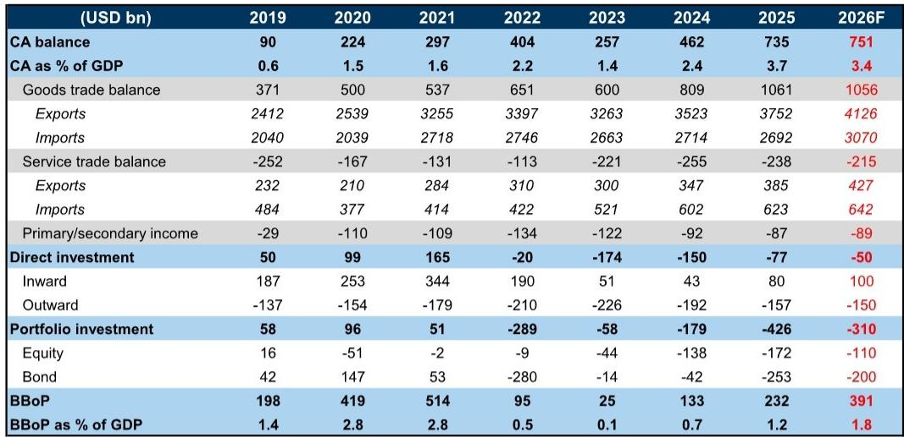
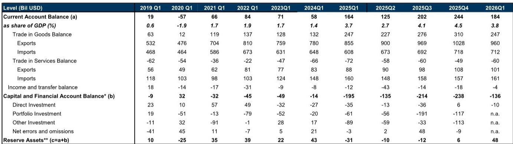
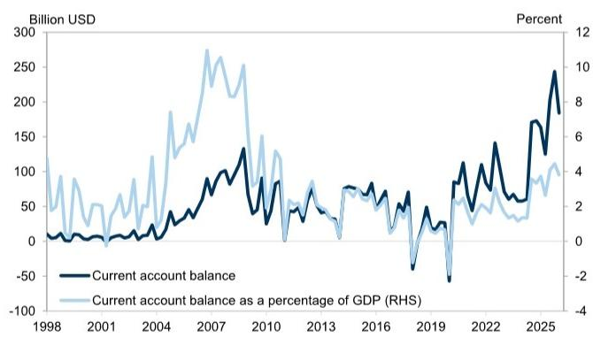

# China’s Current Account Surplus Is Narrowing, but the Real Story Is the Shift in Capital Flows

China’s preliminary Balance of Payments data for the first quarter of 2026 reveal a paradox that should command the attention of any investor with exposure to Asia’s largest economy. The headline number—a current account surplus of $184 billion, or 3.8 percent of GDP—is lower than the 4.5 percent recorded in the fourth quarter of 2025. That moderation, however, is not the story that matters most. What matters is what is happening beneath the surface: the capital and financial account is showing a meaningful deceleration in net outflows, and reserve assets are rising at their fastest pace in over a year. These two trends, taken together, signal a structural shift in how China interacts with the global financial system, and they carry implications for currency strategy, asset allocation, and the sustainability of China’s external position.

The conventional narrative has long held that China’s current account surplus is a source of strength, while its capital account is a persistent source of leakage. The first quarter of 2026 challenges that binary view. The surplus is indeed shrinking, but the pace of capital leaving the country is slowing even more dramatically. The net result is a broad balance of payments that is strengthening, not weakening. For investors who have been conditioned to expect steady depreciation pressure on the renminbi, this data demands a reassessment. The question is no longer whether China can defend its external position, but whether the composition of its flows is becoming more resilient—and what that means for the next phase of the cycle.

This article unpacks the Q1 2026 BOP data through a strategic lens, identifies the second-order implications that go beyond the headline numbers, and offers a decision framework for investors who need to position for the year ahead.

## The Current Account Surplus Is Moderating, but the Composition Reveals a More Resilient Trade Engine

The decline in the current account surplus from 4.5 percent to 3.8 percent of GDP is not a cause for alarm. On a seasonally adjusted basis, the surplus narrowed to 3.9 percent from 4.3 percent, a more modest adjustment. The key driver of the decline is the goods trade balance, which fell from $310 billion in Q4 2025 to $247 billion in Q1 2026. This drop is largely seasonal, and on a year-over-year basis, the goods surplus remained essentially unchanged. Export volumes held firm at $960 billion, while imports rose to $712 billion from $718 billion in the prior quarter—a pattern consistent with normal seasonal variation rather than a structural deterioration.

The services trade deficit widened slightly to $60 billion from $49 billion, driven by a modest increase in services imports. This is not a new trend; China’s services deficit has been gradually expanding as outbound tourism and intellectual property payments rise. But the magnitude remains manageable relative to the size of the goods surplus. What is more interesting is the income and transfer balance, which showed a sharp reduction in outflows—from $18 billion in Q4 2025 to just $4 billion in Q1 2026. This is the smallest outflow in this category in several quarters, and it suggests that profit repatriation by foreign firms and other cross-border income transfers may be slowing. If sustained, this would be a positive signal for the overall sustainability of the current account.

The bottom line on the current account is clear: the surplus is narrowing, but not because China is losing competitiveness. Export volumes remain robust, and the composition of the surplus is shifting toward more stable components. The real action, however, is on the other side of the ledger.

## Capital Outflows Are Decelerating Sharply, and the Direction of Direct Investment Is a Key Signal

The capital and financial account deficit narrowed to $136 billion in Q1 2026 from $238 billion in Q4 2025. This is a dramatic improvement, and it is driven by two forces: a sharp reduction in net outflows through portfolio investment and a more nuanced picture in direct investment.

The most striking data point is net direct investment, which flipped from a $6 billion inflow in Q4 2025 to a $10 billion outflow in Q1 2026. At first glance, this looks like a deterioration. But context matters. The $10 billion outflow is still modest by historical standards. In 2023, for example, net direct investment outflows averaged over $40 billion per quarter. The current level suggests that the wave of Chinese outward FDI that characterized the post-pandemic period is sUBSiding, while inward FDI is stabilizing. The report notes that inward FDI is expected to reach $100 billion in 2026, up from $80 billion in 2025. If that forecast holds, it would represent the first meaningful recovery in inward FDI since 2022.

Portfolio investment, meanwhile, is the wild card. The preliminary data show that SAFE net receipts related to portfolio investment declined from Q4 2025 to Q1 2026, implying increased net outflows. But the detailed breakdown will not be available until the end of June. This is a critical unknown. Portfolio flows are the most volatile component of the capital account, and they are heavily influenced by global risk appetite, interest rate differentials, and policy signals from Beijing. If the outflows are driven by foreign investors reducing their China exposure, that would be a negative signal. If they are driven by Chinese investors diversifying abroad in a controlled manner, the implications are different.

The key takeaway is that the capital account is healing, but the healing is uneven. Direct investment is stabilizing, portfolio flows remain uncertain, and the overall deficit is narrowing faster than many analysts expected.

## Reserve Accumulation Is Accelerating, and the Valuation Effect Hides a Stronger Underlying Position

Reserve assets increased by $48 billion in Q1 2026, compared to just $6 billion in Q4 2025. This is the largest quarterly increase in reserve assets since Q2 2024. The headline FX reserves, however, rose by only $7 billion over the same period. The discrepancy of approximately $41 billion is explained by valuation effects—changes in the market value of China’s foreign asset holdings due to currency fluctuations and asset price movements.

This is a critical nuance. The $48 billion increase in reserve assets is the real measure of China’s intervention capacity and external strength. The headline FX reserves number, which is widely tracked by markets, understates the improvement because it is net of valuation losses. In an environment where the US dollar has been volatile and global bond yields have moved, valuation effects can obscure the underlying trend. The data suggest that China is actively accumulating reserves through intervention in the spot market or through other channels, not simply benefiting from passive valuation gains.

For investors, this means that China’s stock of foreign reserves is likely stronger than the headline number suggests. And reserve accumulation of this magnitude provides ammunition for defending the renminbi if needed, or for funding future outflows. It also signals that the authorities are comfortable with the current trajectory of the balance of payments and are not under pressure to let the currency depreciate.

## The Report Leaves Key Open Questions That Will Define the Second Half of 2026

For all the insight the Q1 data provides, several critical questions remain unanswered. The first is the composition of portfolio investment flows. Without the detailed breakdown, it is impossible to know whether the increased outflows are driven by foreign selling of Chinese bonds and equities, or by Chinese investors buying overseas assets. The answer has very different implications for capital market sentiment and for the renminbi.

The second open question is the sustainability of the improvement in the income and transfer balance. Was the sharp reduction in outflows in Q1 a one-off, or does it reflect a structural shift in how foreign firms manage their China earnings? If the latter, it would be a bullish signal for the current account over the medium term.

The third question is the trajectory of services trade. The deficit widened slightly in Q1, but the report forecasts a narrowing in 2026 as a whole. That forecast depends on assumptions about outbound tourism and technology licensing fees that may prove optimistic if the global economy softens or if geopolitical tensions escalate.

Finally, the report does not address the potential impact of trade policy changes on the goods surplus. The upward revision to export and import volume forecasts—to 7.2 percent and 6.8 percent respectively—is predicated on higher energy prices and strong global demand. If those assumptions prove wrong, the current account surplus could narrow more sharply than expected.

## A Decision Framework for Investors: How to Position Around China’s External Accounts

The Q1 data provides the basis for a structured investment framework. Investors should assess their China exposure along three dimensions: currency, fixed income, and equity.

On currency, the data supports a constructive view on the renminbi. The broad balance of payments is improving, reserve accumulation is accelerating, and the capital account deficit is narrowing. The report projects the broad balance of payments to increase to 1.8 percent of GDP in 2026 from 1.2 percent in 2025. This is a tailwind for the currency. Investors who have been hedging renminbi exposure or positioning for depreciation should reconsider. The risk is now skewed toward stability or modest appreciation, particularly if the portfolio investment data due in June shows less outflow than feared.

On fixed income, the narrowing current account surplus and slower capital outflows reduce the need for the authorities to tighten monetary policy to defend the currency. This supports a stable or slightly lower interest rate environment. Chinese government bonds may benefit from reduced external pressure, particularly if global rates begin to decline. However, the valuation effect on reserves highlights the risk of mark-to-market losses on foreign asset holdings, which could constrain the authorities’ willingness to add duration.

On equity, the improving external position is a positive for sentiment, but it is not a direct catalyst for earnings. The relationship between the balance of payments and equity markets is indirect. A stronger renminbi benefits importers and companies with foreign currency debt, but it can hurt exporters. The net effect depends on sector composition. The more important equity implication is that a stable external environment reduces the risk of a sudden policy tightening or capital control escalation, which removes a tail risk for foreign investors.

The framework is simple: if the portfolio investment data due in June confirms a stabilization of outflows, the case for overweighting China assets strengthens. If the data shows a renewed acceleration of capital leaving the country, the cautious stance should remain.

## The Full Picture Requires the Charts and the Data That Support This Analysis

The analysis above is based on the preliminary Q1 2026 BOP data, but the full picture requires access to the underlying charts and detailed breakdowns that are not available in this summary. The trends in direct investment, the composition of portfolio flows, and the trajectory of reserve accumulation are best understood visually, with the context of historical comparisons and the report’s forward projections.

Join the community to read the full report and review the original charts.

*This article is for learning and discussion only and does not constitute investment advice.*

Personal reading notes and learning share only. Not investment advice.

