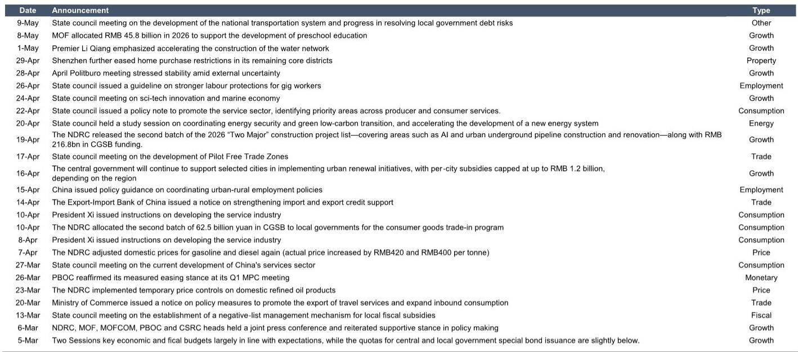

# The Energy Shock Is Redrawing China's Economic Map, and the Old Playbook for Recovery No Longer Applies

The Chinese economy is not simply slowing or accelerating. It is undergoing a structural repricing driven by an energy-supply shock that is fundamentally altering the relationship between consumption, production, and policy stimulus. A global investment bank's weekly tracker reveals a pattern that should concern serious investors: the traditional signals we use to gauge economic health are sending contradictory messages. Property transactions are recovering, but auto sales are declining. Consumer confidence is at multi-year highs, yet domestic flight cancellations are surging. Steel demand is edging up, but production remains flat. The common thread linking these seemingly disconnected data points is the pass-through of higher energy costs into the real economy, and the market has not yet fully priced in the second-order effects.

This is not a typical cyclical downturn where a standard policy response of rate cuts or fiscal stimulus will restore equilibrium. The energy shock acts as a supply-side tax that simultaneously depresses activity in energy-intensive sectors while creating pockets of demand in others. Policymakers face a dilemma: stimulating aggregate demand without addressing relative price distortions will simply feed inflation in the goods and services most exposed to energy inputs. The window for effective intervention is narrowing, and the data suggests we are already in a transition phase where the old correlations between indicators are breaking down.

The report's high-frequency data, updated weekly to capture the impact of the energy shock, provides a granular view of this transition. What follows is not a summary of those indicators, but an interpretation of what the pattern means for investment strategy, policy expectations, and the sectors that will define the next phase of China's economic cycle.

## Property Market Recovery Is Real but Narrow, and It Masks a Deeper Liquidity Problem in the Secondary Market

The most superficially encouraging data point in the tracker is the recovery in property transactions. Both primary market transactions in 30 Cities and secondary market transactions in 16 Cities have moved above year-ago levels. This has led some observers to declare that the property sector has bottomed. That conclusion is premature and potentially dangerous for investors who extrapolate this narrow recovery into a broad-based rebound.

The primary market recovery is concentrated in a handful of Tier-1 and strong Tier-2 Cities where state-owned developers have been able to access credit and complete projects. The secondary market rebound, while broader, is driven by distressed sellers accepting significant discounts to exit positions, not by genuine demand recovery. The volume increase in secondary transactions is a liquidity event, not a price discovery event. When sellers are motivated by margin calls or debt obligations rather than portfolio rebalancing, the transaction data overstates underlying demand.

The critical question the report does not fully answer is whether this transaction volume can be sustained without a corresponding recovery in new home prices. If the secondary market recovery is purely a function of discounting, it will eventually compress developer margins and discourage new supply, creating a supply-demand mismatch that could reignite price pressures in the primary market later this year. Investors should watch the spread between primary and secondary transaction prices as a leading indicator. If that spread narrows, it signals genuine demand; if it widens, the recovery is a mirage.

## The Energy Supply Shock Is Creating a Two-Track Economy, and Most Sectors Are on the Wrong Track

The most analytically significant section of the report is the tracking of energy-related prices and their pass-through to industrial inputs. The data shows a clear break in trend from early 2026 onward. Import prices for crude oil and refined petroleum products surged in April, with crude oil import prices jumping to 142 (indexed) from 92 in March. Export prices for refined petroleum products followed suit, reaching 148. Domestic gasoline and diesel prices were raised by 320 and 310 RMB per tonne respectively on May 11. These are not marginal adjustments; they represent a structural shift in input costs for virtually every sector of the economy.

The two-track economy is emerging along the fault line of energy intensity. Sectors with low energy intensity relative to value-add, such as technology services, high-end manufacturing, and consumer durables with pricing power, can absorb or pass through these cost increases. Sectors with high energy intensity, such as chemicals, metals processing, logistics, and construction materials, face margin compression that will force capacity rationalization. The report's data on chemical prices is instructive: sulfuric acid prices have more than doubled from their 2025 average, while polypropylene and urea have risen more modestly. This divergence within a single industrial category signals that the shock is not uniform; it is amplifying existing disparities in supply chain leverage.

The so-what for investors is clear: the traditional approach of buying cyclical Chinese stocks on a broad economic recovery thesis is broken. The energy shock means that sector selection must be driven by energy cost pass-through capability, not by beta to GDP growth. Companies that can hedge energy costs, shift to renewable inputs, or pass through price increases will outperform. Those that cannot will see margin compression regardless of top-line growth.

## Consumer Confidence Is Rising, but Spending Behavior Is Diverging from Sentiment in Ways That Signal Caution

The Morning Consult consumer confidence index has risen to its highest level since 2019, a genuinely positive data point. However, this headline masks a more complex picture. The report also shows that total auto sales declined in April and remain below year-ago levels, while new energy vehicle sales edged up but also remain below year-ago levels. Passenger flight volumes declined sharply, and cancellation rates surged.

The divergence between confidence and spending on big-ticket, energy-intensive items suggests that consumers are feeling better about their economic prospects in the abstract but are adjusting their actual spending to account for higher fuel and energy costs. This is rational behavior: rising confidence reflects improved labor market expectations and wage growth, but the energy shock is disproportionately affecting the cost of transportation, heating, and manufactured goods. Consumers are reallocating spending away from energy-intensive categories toward services and experiences that are less exposed to energy price fluctuations.

This has important implications for the retail and consumer sectors. Companies selling energy-intensive durable goods, from automobiles to home appliances, face a demand headwind that is not captured by consumer confidence surveys. Companies selling services, digital content, or low-energy-consumption goods may benefit from this reallocation. The report's data on domestic flights is a canary in the coal mine: if consumers are reducing air travel despite higher confidence, it suggests that the energy cost pass-through is already affecting discretionary spending patterns.

## The Fiscal Policy Response Is Insufficient in Scale and Misaligned in Timing Relative to the Energy Shock

The report tracks local government special bond issuance, which stands at RMB 1.36 trillion year-to-date. This is a meaningful fiscal impulse, but it is insufficient relative to the magnitude of the energy shock. More importantly, the timing is misaligned. The energy shock is a supply-side phenomenon that requires supply-side policy responses: investment in domestic energy production, strategic petroleum reserves, and sUBSidies for energy-efficient production technologies. The current fiscal package, focused on infrastructure investment and local government spending, is a demand-side response to a supply-side problem.

The data on steel demand and production illustrates this misalignment. Steel demand edged up over the past week, driven by infrastructure spending, but steel production remained stable. The spread between demand and production is being filled by imports or inventory drawdowns, which is precisely the wrong dynamic during an energy shock. Importing steel or steel inputs requires energy for transportation and processing, adding to the energy demand that is driving the original price shock. The fiscal stimulus is thus partially self-defeating: it boosts activity in energy-intensive sectors, which increases energy demand, which pushes up energy prices further, which then depresses activity in other sectors.

The report does not fully address the question of whether Chinese policymakers have the tools to implement a targeted supply-side response. The traditional tools of monetary easing and fiscal expansion are ill-suited to the current challenge. What is needed is a combination of strategic price controls, investment in alternative energy supply, and targeted sUBSidies for energy-intensive industries to maintain production capacity without passing through the full cost increase to consumers. The absence of such measures in the current policy mix suggests that policymakers are still diagnosing the problem using the old framework.

## The Report's Data Raises a Critical Unanswered Question: Is the Energy Shock Transitory or Structural?

The report is an excellent tracking exercise, but it does not provide a definitive answer to the most important question for investors: is the energy shock transitory or structural? The answer determines whether the current divergence between indicators is a temporary dislocation that will correct as supply adjusts, or a permanent shift in the economy's cost structure that requires a fundamental reassessment of asset valuations.

Several factors suggest the shock may be more structural than transitory. The pass-through to import and export prices is broad-based, affecting crude oil, refined petroleum products, coal, and plastics. The domestic price adjustments on gasoline and diesel are not one-off events but part of a mechanism that will continue to pass through global energy prices to domestic consumers. The investment cycle in energy production, both conventional and renewable, takes years to bring new supply online. If global energy prices remain elevated due to geopolitical factors, the Chinese economy will face a persistent cost headwind that no amount of demand-side stimulus can offset.

However, there are also reasons to believe the shock may be transitory. The data shows that coal consumption in coastal provinces increased and was above year-ago levels, suggesting that the economy is finding ways to sUBStitute cheaper energy sources for more expensive ones. The consumer confidence data, if sustained, could eventually translate into spending on big-ticket items as households adjust their expectations to the new price level. The property market recovery, if it broadens to include Tier-3 and Tier-4 Cities, could generate a virtuous cycle of employment and income growth that offsets the energy cost drag.

The unanswered question is which of these forces will dominate. The report's weekly frequency is designed to answer this question in real time, and investors should pay close attention to the next several weeks of data. If energy prices continue to rise while consumption indicators weaken, the structural interpretation is confirmed. If energy prices stabilize and consumption indicators improve, the transitory interpretation gains credibility. The market is currently pricing in a muddle-through scenario, which is the most dangerous position to hold if the outcome is either extreme.

## A Decision Framework for Navigating the Energy-Shock Economy

For serious investors, the report's data can be organized into a simple decision framework with three dimensions: energy exposure, pricing power, and policy sensitivity.

First, assess energy exposure across the value chain. Companies with high direct energy costs as a percentage of revenue, such as chemicals, metals, logistics, and construction materials, face the highest risk. Companies with indirect energy exposure through their supply chain, such as auto manufacturers and consumer durables, face moderate risk. Companies with low energy exposure, such as technology services, healthcare, and financials, are relatively insulated.

Second, evaluate pricing power within each sector. The ability to pass through energy cost increases to customers is the single most important determinant of margin resilience. Sectors with concentrated market structures, differentiated products, or inelastic demand have high pricing power. Sectors with fragmented competition, commoditized products, or elastic demand have low pricing power. The report's chemical price data shows that sulfuric acid producers have high pricing power, while urea producers do not, despite both being energy-intensive.

Third, overlay policy sensitivity. Sectors that are direct beneficiaries of fiscal stimulus, such as infrastructure and construction, may see temporary demand boosts that offset energy cost pressure. Sectors that are targets of regulatory intervention, such as property and energy-intensive manufacturing, face additional headwinds. Sectors that are priorities for strategic investment, such as renewable energy and electric vehicles, may receive policy support that improves their competitive position.

Applying this framework to the report's data suggests a portfolio tilt toward low-energy-exposure sectors with high pricing power and favorable policy tailwinds, and away from high-energy-exposure sectors with low pricing power and unfavorable policy headwinds. This is not a contrarian or consensus view; it is a logical inference from the data. The report provides the raw material for this analysis; the investor's job is to apply the framework consistently and update it as new weekly data becomes available.

Join the community to read the full report and review the original charts.

*This article is for learning and discussion only and does not constitute investment advice.*

Personal reading notes and learning share only. Not investment advice.

