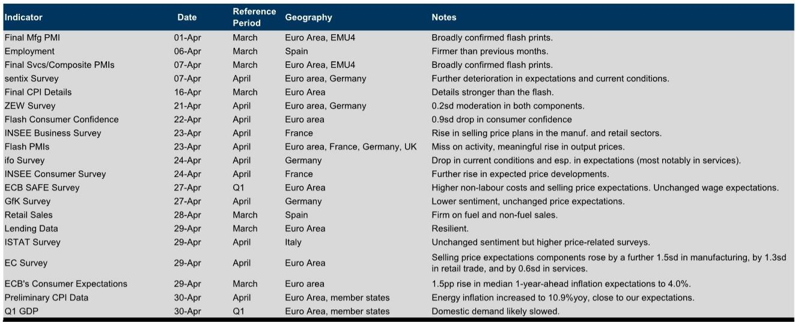
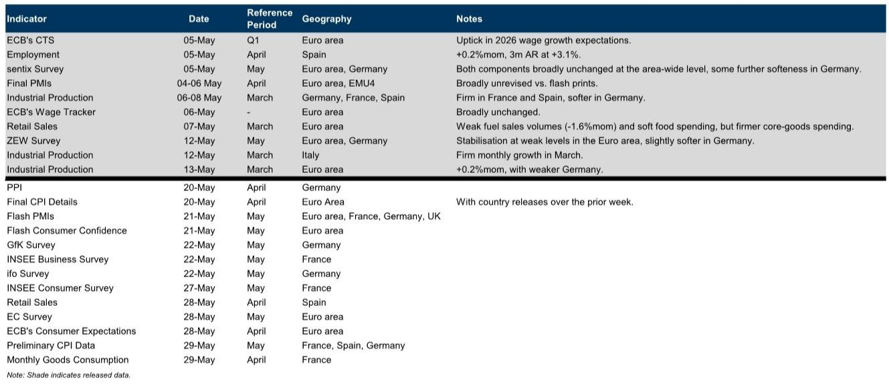
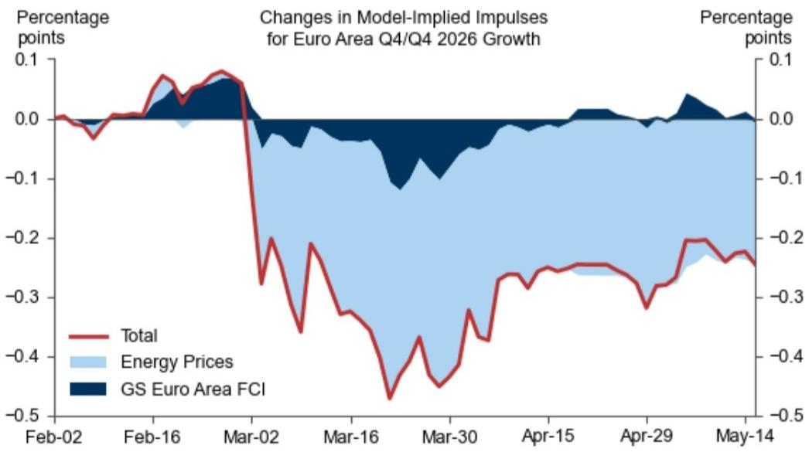

# 欧洲经济正在被重新定价，但市场低估了供给侧的滞后压力

2026年的欧洲经济叙事，正在被一场地缘冲突重新定义。过去三个月，从天然气远期曲线到消费者信心，从PMI到通胀预期，几乎所有关键变量都在移动。但真正重要的，不是这些数字本身的变化，而是这些变化背后隐含的结构性判断：市场正在把这次冲击与2022年俄乌冲突进行对比，并得出了一个看似合理的结论——这次冲击更小、更可控。

这份来自某外资投行的研报，通过其高频增长模型、金融条件指数和日度消费者信心追踪工具，提供了一个关键信号：当前的价格反应和预期调整，可能仍然低估了供给侧冲击的滞后效应。市场定价的“可控性”假设，正在面临来自能源价格传导、工资-价格螺旋、以及金融条件收紧三个方向的压力测试。

## 1. 天然气市场的定价逻辑已与2022年完全不同，但风险并未消失

报告中最直观的对比来自天然气远期曲线。2022年3月，TTF天然气价格在冲突爆发当天飙升至230欧元/兆瓦时附近，远期曲线陡峭下行。而当前，现货价格约在50欧元/兆瓦时，远期曲线平坦，且与某外资投行的基线预测基本重合。

这意味着市场目前认为：这次冲击对欧洲天然气供应的影响是有限的、短期的，不会重现2022年的供应危机。背后的逻辑是欧洲已经建立了更充足的LNG接收能力、储气库库存处于高位，以及需求端的结构性下降。

但这里有一个容易被忽略的细节。报告显示，当前远期曲线虽然低于2022年峰值，但相比冲突爆发前的2月水平，实际上已经上移了约20欧元/兆瓦时。更重要的是，远期曲线的后端（2027-2028年合约）并未完全回落到冲突前水平。这意味着市场正在对“长期天然气价格中枢上移”进行渐进式定价，而不是一次性重估。

对于欧洲制造业企业而言，这种缓慢但持续的成本抬升，比2022年的价格尖峰更具破坏力。2022年的冲击是一次性利润压缩，企业可以通过库存调节和短期对冲来应对。而当前的价格路径暗示，能源成本优势的永久性流失正在成为现实。

## 2. 消费者信心的“韧性”可能掩盖了实际购买力的结构性侵蚀

报告追踪了Morning Consult和欧盟委员会的消费者信心指数，发现两者在冲突爆发后的反应均显著弱于2022年。2022年3月，欧盟消费者信心指数单月跌幅达到3个标准差，而当前跌幅约为0.9个标准差。看起来，消费者似乎“学会了”与地缘冲突共存。

但这种韧性需要放在更长的周期中审视。报告数据显示，欧洲消费者信心在2022年冲击后经历了长达18个月的低位徘徊，直到2024年才逐步修复。而当前信心的“稳定”，建立在2024-2025年已经经历了一轮温和修复的基础上。换句话说，消费者并不是更抗压了，而是刚从上一轮冲击中恢复过来，又面临新的压力。

更值得警惕的是通胀预期的变化。报告显示，欧洲央行的消费者预期调查中，一年期通胀中位数预期在3月上升了1.5个百分点至4.0%。这一水平与2022年冲击后的峰值相当。消费者信心稳定，但通胀预期却在上升——这是一个典型“滞胀”组合的前兆信号。

对于依赖消费者支出的行业（零售、旅游、可选消费），这意味着实际购买力的侵蚀正在加速。名义工资增长虽然也在上升，但实际工资增速可能再次转负。

## 3. 金融条件的收紧幅度看似温和，但传导机制正在发生变化

报告中的某外资投行金融条件指数显示，欧元区金融条件自冲突爆发以来收紧约25个基点。相比2022年超过100个基点的收紧幅度，这确实显得温和。

但“幅度”不是唯一变量，“传导速度”和“传导渠道”同样关键。2022年的金融条件收紧主要通过利率渠道实现——欧洲央行快速加息，导致企业融资成本飙升。而当前，虽然欧洲央行已经进入降息周期，但金融条件的收紧更多来自信用利差扩Daiwa股票市场波动。

这意味着：2022年的冲击主要影响的是企业融资的可获得性，而当前冲击更多影响的是企业估值和投资者风险偏好。对于非金融企业而言，前者的影响是直接的（融资成本上升），后者的影响是间接的（股权融资难度增加、并购活动放缓），但同样具有实际约束力。

报告的高频增长模型显示，金融条件收紧对欧元区GDP的拖累约为0.1-0.2个百分点，加上能源价格冲击的0.1个百分点，合计拖累约0.25个百分点。这个数字看起来不大，但模型假设的前提是“金融条件维持在当前水平不再进一步恶化”。如果地缘局势升级导致金融条件进一步收紧，拖累幅度将非线性放大。

## 4. 报告尚未完全回答的关键问题：工资-价格螺旋是否已经启动

报告提供了大量关于通胀预期的数据，但在一个关键问题上留下了开放空间：工资-价格螺旋的自我强化机制是否已经启动。

数据显示，欧元区2026年GDP增长预测已被下调约0.8个百分点至0.5%，而同期通胀预测被上调约1.9个百分点至3.5%以上。这是一个典型的“滞胀”组合。但滞胀能否自我持续，取决于工资增长能否跟上通胀。

报告引用了欧洲央行的SAFE调查，显示非劳动成本和销售价格预期上升，但工资预期“未发生变化”。这听起来像是好消息——如果工资不涨，通胀压力可能自行消退。但这里需要追问：工资预期不变，是因为劳动力市场在冷却，还是因为工资谈判存在滞后性？

从历史经验看，工资对通胀的反应通常滞后6-9个月。2022年的冲击中，欧元区工资增长直到2023年才加速，随后成为欧洲央行维持紧缩政策的核心理由。当前冲击如果持续，2026年下半年到2027年的工资谈判可能成为下一个通胀风险点。

报告没有对此给出明确判断，这正是值得持续追踪的关键变量。如果工资增长在未来两个季度内出现加速，欧洲央行的政策路径将面临重大重新评估。

## 5. 投资者需要重新审视“欧洲资产定价”的底层假设

以上分析指向一个更宏观的结论：欧洲资产的定价模型可能需要修正。

当前市场对欧洲股票的估值，隐含了两个关键假设：一是欧洲央行将继续降息以支持增长，二是能源冲击对欧洲企业盈利的影响是可控的。但报告的数据显示，这两个假设正在被同时挑战。

降息的前提是通胀回落至目标水平。但如果通胀预期持续上移，欧洲央行的降息空间将比市场预期的更窄。报告显示，某外资投行已将欧元区2026年底通胀预测上调至3.5%以上，远高于欧洲央行2%的目标。这意味着降息周期可能比市场预期的更早结束，甚至不排除重新加息的可能性。

与此同时，能源成本上升对欧洲企业盈利的影响，并非均匀分布。报告中的能源价格冲击模型显示，对GDP的拖累约为0.1个百分点，但这是总量层面的平均效应。对于化工、金属、玻璃等能源密集型行业，成本上升可能侵蚀10%-20%的利润空间。而对于服务业和科技行业，影响则相对有限。

这意味着，欧洲股市的行业配置逻辑需要从“降息受益”转向“成本传导能力”。能够将成本上涨转嫁给下游的企业（如拥有定价权的品牌消费品、必需消费品），将比依赖成本优势的制造业企业更具防御性。

---

报告提供了丰富的日度数据和高频追踪工具，但数据本身不会告诉我们答案。真正有价值的，是从数据中识别出市场定价与基本面之间的偏差。

当前最值得追问的几个问题包括：天然气远期曲线的后端定价是否已经充分反映了结构性供应风险？金融条件收紧的传导时滞有多长？工资增长何时会开始反映当前的通胀压力？这些问题的答案，将决定欧洲经济是经历一次短暂扰动，还是进入新一轮结构性调整。

欢迎来星球微信群里继续讨论这些问题。我们会在群内分享完整的研报解读、原始图表，以及围绕上述未解问题的持续跟踪分析。如果你对欧洲资产定价的底层假设如何被重新定价有更深入的兴趣，这可能是你需要的讨论场域。

Personal reading notes and learning share only. Not investment advice.

