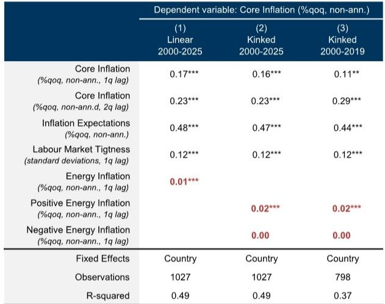
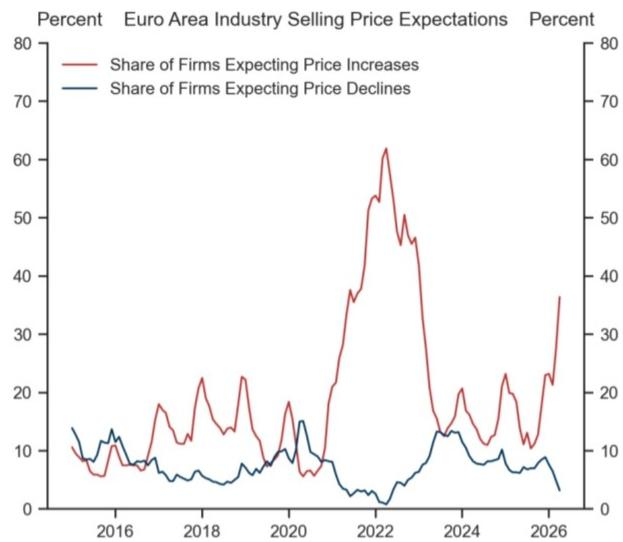
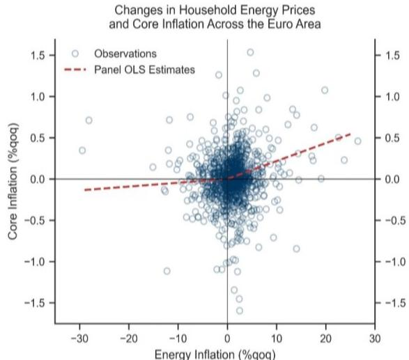

# Energy Inflation Is a One-Way Valve for Core Prices: Why the ECB Cannot Rely on Falling Energy to Solve Its Inflation Problem

The European Central Bank faces a structural asymmetry that undermines one of its most comforting assumptions: that energy price declines will mechanically pull core inflation back to target. This assumption is wrong. A growing body of evidence, including fresh statistical work covering the Euro area from 1999 to 2025, confirms that positive energy price shocks pass through to core inflation with force and persistence, while negative shocks produce effects that are small, short-lived, and often statistically indistinguishable from zero. This "rocket and feather" pattern—where prices shoot up like a rocket but drift down like a feather—is not a statistical curiosity. It is a structural feature of how firms set prices, how wages adjust, and how inflation expectations become embedded. For the ECB, the implication is uncomfortable but unavoidable: the central bank cannot treat energy price declines as a reliable pathway to disinflation. If energy prices rise again from current levels, the passthrough will be powerful. If they fall, the relief will be marginal. This asymmetry skews the entire inflation outlook to the upside and strengthens the case for preemptive tightening, even when headline inflation appears to be moderating.

The timing of this insight is critical. With European energy markets still vulnerable to geopolitical shocks, supply chain disruptions, and the slow transition away from fossil fuels, the probability of renewed energy price spikes remains elevated. Yet many market participants and policymakers continue to model inflation as if energy shocks are symmetric—as if a 20 percent decline in energy prices will undo the inflationary damage of a 20 percent increase. The data says otherwise. Understanding why this asymmetry exists, how it operates across different sectors and countries, and what it means for monetary policy is no longer an academic exercise. It is a practical requirement for anyone constructing a credible inflation forecast or positioning for the next phase of ECB policy.

## The Asymmetry Is Not a Statistical Artifact; It Is a Structural Feature of Firm Pricing Behavior

The evidence for asymmetric passthrough is not limited to one model or one data set. It emerges consistently across three distinct empirical approaches, each with its own strengths and limitations. The first approach uses a top-down vector autoregressive model on quarterly Euro area data from 1999 to 2025. This model isolates the effect of non-core inflation—food and energy—on sUBSequent core inflation, controlling for long-term inflation expectations and labour market slack. The result is unambiguous: positive non-core shocks produce a statistically significant increase in core inflation that peaks at around four quarters and persists for several more. Negative shocks, by contrast, produce an effect that is small, statistically insignificant, and essentially zero beyond two quarters. The asymmetry is not subtle; it is a gap of roughly 0.4 percentage points in peak impact.

The second approach addresses a natural concern: that the result is driven by the outsized 2022-23 energy shock. By constructing a cross-country panel that exploits variation in energy shocks across Euro area member states, the analysis gains statistical power and robustness. Even when the sample is restricted to the pre-2020 period—before the recent energy crisis—the asymmetry remains. The relationship between energy inflation and core inflation is "kinked": positive energy inflation has a coefficient roughly double that of the linear specification, while negative energy inflation has a coefficient that is essentially zero and statistically insignificant. This is not a post-pandemic anomaly. It is a pattern that has been present for two decades.

The third approach moves from macro aggregates to firm-level behavior. Using the European Commission business survey, the analysis examines how firms' selling price expectations respond to changes in wholesale energy prices, interacted with each sector's energy intensity. The findings are consistent with the macro evidence: a 10 percent increase in energy prices leads to a statistically significant increase in the share of firms expecting to raise selling prices, particularly in energy-intensive sectors. A 10 percent decrease in energy prices produces no such effect. Firms do not lower their selling price expectations when energy costs fall. This microeconomic evidence is crucial because it reveals the mechanism: the asymmetry is not a statistical artifact of aggregation or model specification. It is embedded in the pricing decisions of individual firms.

## Three Structural Drivers Explain Why Firms Raise Prices on the Way Up but Not on the Way Down

Understanding why this asymmetry exists is essential for assessing whether it is likely to persist or diminish. The research identifies three mutually reinforcing mechanisms, each grounded in standard microeconomic theory and supported by empirical evidence from multiple countries and time periods.

The first mechanism is asymmetric markup adjustment. When input costs rise, firms face a binding constraint: if they do not raise prices, their profit margins will erode, and in extreme cases, they risk bankruptcy. This is not a theoretical possibility; it is a practical reality for firms with thin margins and limited access to credit. When costs fall, however, no equivalent constraint exists. Firms can choose to maintain prices and let margins expand, particularly if they possess market power or face limited competitive pressure. The asymmetry in markup adjustment is essentially a one-sided risk management problem: firms are forced to act when costs rise but have discretion when costs fall.

The second mechanism involves menu costs in the presence of positive trend inflation. Changing prices is costly—not just the literal cost of printing new menus or updating price tags, but also the cost of customer relations, the risk of triggering price comparisons, and the administrative burden of coordination. When trend inflation is positive, as it has been in the Euro area for most of the past two decades, firms face an additional asymmetry: the real value of their prices is eroding over time. A firm that does not raise prices when costs rise is accepting a permanent reduction in real margins. A firm that does not lower prices when costs fall is merely postponing an adjustment that inflation will eventually make anyway. The menu cost of lowering prices is effectively higher because the firm must overcome the natural tendency of prices to rise with trend inflation.

The third mechanism is downward nominal rigidity in wages and prices. When a positive energy shock reduces real wages, workers demand compensation through higher nominal wages. This second-round effect amplifies the initial passthrough and makes it persistent. When energy prices fall, however, firms find it extremely difficult to cut nominal wages, and workers are unlikely to accept them. The cost savings from lower energy prices are therefore not passed through to lower labour costs, which means they are also not passed through to lower final prices. This asymmetry in wage adjustment creates a ratchet effect: energy price increases get embedded in the wage structure, while energy price decreases do not.

## The Asymmetry Creates a Systematic Upward Bias in Core Inflation Forecasts

The implications for inflation forecasting are direct and consequential. Most standard forecasting models treat energy price shocks as symmetric, meaning that a positive shock of a given size is assumed to have the same absolute effect on core inflation as a negative shock of the same size. The evidence shows this is false. The consequence is that inflation forecasts are systematically biased downward during periods of energy price declines and systematically biased upward during periods of energy price increases.

To quantify this bias, consider a simple exercise. Using the cross-country panel regression results, one can map symmetric energy price assumptions into core inflation projections. Under a baseline scenario where energy prices follow a moderate path, core inflation peaks at around 2.7 percent. Under an upside scenario where energy prices rise by the same amount they fell in the downside scenario, core inflation reaches nearly 3.0 percent. Under a downside scenario where energy prices decline further, core inflation barely budges from the baseline. The asymmetry means that the distribution of possible core inflation outcomes is not symmetric around the baseline. It is skewed to the upside.

This skewness matters for risk management. A central bank that treats the distribution as symmetric will underestimate the probability of high inflation outcomes and may therefore tighten too little or too late. The research explicitly links this insight to the ECB's recent decisions, noting that the asymmetry supports the case for two rate hikes in June and September. The logic is straightforward: if energy price declines provide limited relief, then the ECB cannot rely on favourable energy base effects to bring inflation back to target. It must use interest rates to do the job.

## What the Report Does Not Fully Answer: The Stability of the Asymmetry Over Time and Across Regimes

For all its empirical rigor, the analysis leaves several important questions open. The most critical concerns the stability of the asymmetry over time. The top-down model shows that the asymmetry is sensitive to the inclusion of the 2022-23 period, and the panel model shows that it holds even when that period is excluded. But this does not tell us whether the asymmetry is a constant structural feature or whether it varies with the level and volatility of inflation itself.

Consider the possibility that the asymmetry is more pronounced when inflation is high and volatile, as it was in 2021-2023, and less pronounced when inflation is low and stable, as it was in the 2010s. This would make sense theoretically: when inflation is low, firms have less room to adjust markups without losing market share, and workers have less reason to demand wage compensation. If this is true, then the current period of elevated inflation may have temporarily increased the degree of asymmetry, and the asymmetry may fade as inflation returns to target. The report does not test this hypothesis, and the data may not yet be sufficient to do so.

A second open question concerns the role of energy price volatility versus energy price levels. The analysis focuses on the sign of the price change, but it does not fully explore whether the magnitude or frequency of changes matters. If energy prices fluctuate rapidly, firms may become accustomed to temporary swings and may not adjust prices at all, regardless of the sign. If energy prices move in sustained trends, the asymmetry may be more pronounced. The interaction between volatility and asymmetry is a natural area for further research.

A third question relates to the heterogeneity across sectors and countries. The analysis shows that the asymmetry is present on average, but it does not identify which sectors or countries are most affected. If the asymmetry is concentrated in a few energy-intensive sectors, then the aggregate implications may be smaller than the headline results suggest. Conversely, if the asymmetry is broad-based, the implications are larger. Understanding this heterogeneity would allow for more targeted policy responses.

## A Decision Framework for Investors and Policymakers: How to Incorporate Asymmetric Passthrough into Inflation Forecasts

Despite these open questions, the evidence is strong enough to warrant a practical decision framework. For investors and policymakers who need to form a view on Euro area inflation, the following approach is suggested.

First, abandon the assumption that energy price shocks are symmetric. Any forecast that treats a 10 percent decline in energy prices as having the same absolute effect on core inflation as a 10 percent increase is almost certainly wrong. The direction of the bias depends on the current trajectory of energy prices. If energy prices are rising, the forecast will understate core inflation. If energy prices are falling, the forecast will overstate the disinflationary benefit.

Second, adjust the forecast for the asymmetry using a simple rule of thumb. Based on the panel regression results, the passthrough coefficient for positive energy inflation is approximately 0.02, while the coefficient for negative energy inflation is approximately zero. This means that a one percentage point increase in quarterly energy inflation adds roughly 0.02 percentage points to quarterly core inflation in the following quarter, while a one percentage point decrease has no effect. Over a four-quarter horizon, a sustained 10 percent increase in energy prices would add roughly 0.8 percentage points to core inflation, while a sustained 10 percent decrease would add nothing.

Third, incorporate the asymmetry into risk scenarios. Even if the baseline forecast assumes symmetric passthrough, the risk distribution should be skewed to the upside when energy prices are elevated and to the downside when they are depressed. This is not a matter of forecasting precision; it is a matter of risk management. The asymmetry means that the probability of a high-inflation outcome is systematically higher than the probability of a low-inflation outcome, all else equal.

Fourth, monitor firm pricing intentions as a leading indicator. The European Commission business survey provides monthly data on the share of firms expecting to raise or lower selling prices. When the share of firms expecting price increases rises sharply, particularly in energy-intensive sectors, it is a signal that the passthrough mechanism is active. When the share of firms expecting price declines remains low despite falling energy prices, it is a signal that the asymmetry is in play.

## The Open Questions That Make the Full Report Essential Reading

The analysis presented here is powerful, but it is not exhaustive. Several questions remain that can only be answered by reading the full report and reviewing the original charts. How robust is the asymmetry to different measures of core inflation? Does it hold for services inflation as well as goods inflation? What is the role of inflation expectations in amplifying or dampening the asymmetry? How do the results change when the sample is split by country or by sector? These are not minor details; they are central to assessing whether the asymmetry is a temporary feature of the current cycle or a permanent structural change in the Euro area inflation process.

The full report provides the underlying data, the regression tables, and the diagnostic tests that allow readers to assess the robustness of the results for themselves. It also includes the detailed charts that show the evolution of firm pricing intentions over time, the kinked relationship between energy and core inflation in the cross-country panel, and the simulation of core inflation under different energy price scenarios. These charts are not decorative; they are the evidence on which the argument rests.

For anyone who needs to form a defensible view on Euro area inflation—whether for investment, policy, or business planning—the full report is essential reading. The asymmetry documented here is not a footnote. It is a first-order feature of the inflation process that has been systematically underestimated by markets and policymakers alike.

Join the community to read the full report and review the original charts.

*This article is for learning and discussion only and does not constitute investment advice.*

Personal reading notes and learning share only. Not investment advice.

