GLOBAL RATES TRADER

# Rates Running Out of Patience

Supply-side volatility and uncertainty around the conflict continue to challenge global duration's usefulness. The introduction of some inflation risk into the UST curve—a feature that was absent earlier in the shock—and optimism priced into macro markets improve the value of duration as a medium-term hedge against the deeper downside tails. But with any near-term rally likely gradual in a benign deescalation scenario, or reliant first on a more adverse outcome for energy prices from the conflict that reignites growth concerns, we continue to see value to structures that limit downside in further selloffs. European front-end rates remain under pressure as no news on Strait of Hormuz flows weakens the case for longs. While we continue to recommend long EGBs vs OIS, we are tightening stops after recent spread tightening. Gilt risk premium emerged amid the late week global selloff after relative stability during the earlier increase in political uncertainty, potentially reflecting the already-elevated levels of UK risk premium. We think inflation and monetary policy outcomes will have the decisive impact on Gilt yields this year, with lower 10y yields likely to be driven by a lower policy path—for this reason we continue to favor front-end longs vs belly underweights.

# United States and Canada

Peer pressures. The break above 4.5% 10y and 5.0% 30y US yields has come against a backdrop of higher yields globally, with UK, Japan, and German long-end yields trending steadily higher—compared to the last time UST 30y yields exceeded 5% in 3Q25, the average of UK, Japan, and German 30s has risen about 50bp (Exhibit 1). Our estimate of global spillovers suggests that the year-to-date selloff in USTs has largely reflected bearish shocks from the UK and Japan. We are hesitant to write off domestic impulses entirely though, as the pairing of growth optimism and inflation upside risks have converged to erode market conviction in the likelihood of Fed cuts—a building sense of on hold (or higher) for longer front-end yields should shift the perception of what level offers attractive value further out the curve as well. Instead, we would interpret the global nature of the bearish pressure as underscoring the near-term challenges to achieving lasting relief without a shift in the macro picture—despite idiosyncratic factors, the paths to a meaningful rally in the UK and Japan hinge primarily on outcomes that either restore conviction in the path towards lower policy rates (for the UK) or validate the gradual approach to tightening (for

# George Cole

+44(20)7552-1214

george.cole@gs.com

GS International

# William Marshall

+1(212)357-0413

william.c.marshall@gs.com

GS & Co. LLC

# Simon Freycenet

+44(20)7774-5017

simon.freycenet@gs.com

GS Bank Europe SE - Paris

Branch

# Isabella Rosenberg

+1(212)357-7628

isabella.rosenberg@gs.com

GS & Co. LLC

# Friedrich Schaper

+1(917)343-3214

friedrich.schaper@gs.com

GS & Co. LLC

# Loic Mathys

+44(20)7051-1664

loic.mathys@gs.com

GS International

Japan).

An uneasy introduction of value. Treasuries have been a poor diversifier since the end of February—the one-month rolling correlation between 10y UST yield changes and equity returns reached its most negative in multiple decades (Exhibit 2). Continued uncertainty around the Iran conflict and supply shock remains an impediment to nominal duration's ability to dampen day-to-day portfolio volatility, which can sustain greater risk premium in the short term. However, the broader trends of growth optimism priced into risk markets and clearer build-up of inflation risk premia along the yield curve (more below) improves the value proposition of Treasuries as a medium-term hedge. Given the possibility that it takes a more acute spike in energy prices to reopen growth worries in the short term, we think expressions that lean bullish while limiting exposure to additional selloffs are a prudent implementation for now and would look either for deeper selloffs that more durably challenge the risk asset trend, or credible relief and a return of energy flows as catalysts to add to long duration exposure.

Exhibit 1: 30y UST yields' renewed break of $5\%$ has come amid a sustained uptrend in global long-end yields
UST 30y yield vs avg of UK, German, Japan 30y yields   
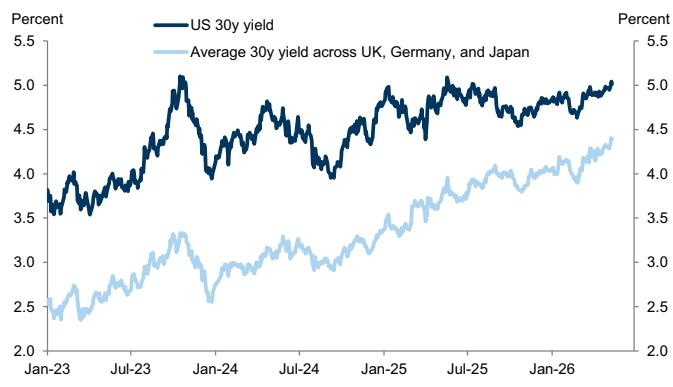

line

| Date   | US 30y yield | Average 30y yield across UK, Germany, and Japan |
|--------|--------------|-----------------------------------------------|
| Jan-23 | 3.7          | 2.5                                           |
| Jul-23 | 4.0          | 2.8                                           |
| Jan-24 | 5.1          | 3.3                                           |
| Jul-24 | 4.5          | 3.0                                           |
| Jan-25 | 4.9          | 3.5                                           |
| Jul-25 | 5.0          | 3.9                                           |
| Jan-26 | 5.1          | 4.4                                           |

Source: GS FICC and Equities, GS Global Investment Research   
1m rolling correlation of 10y UST yield change and S&P 500 returns

Exhibit 2: Treasuries have been a poor portfolio diversifier since the start of the conflict

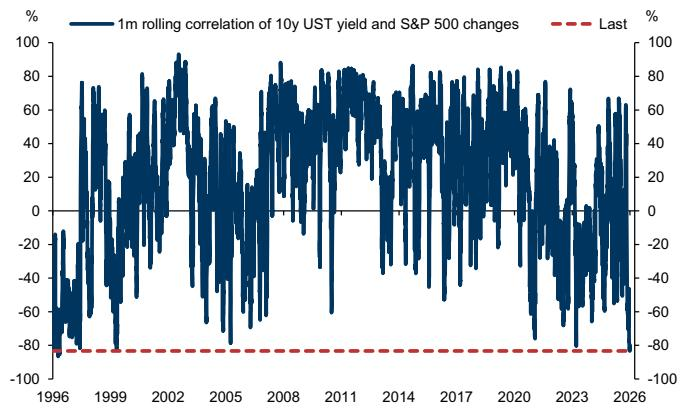

line

| Year | 1m rolling correlation of 10y UST yield and S&P 500 changes (%) |
|------|------------------------------------------------------------------------|
| 1996 | -80                                                                    |
| 1999 | -80                                                                    |
| 2002 | -80                                                                    |
| 2005 | -80                                                                    |
| 2008 | -80                                                                    |
| 2011 | -80                                                                    |
| 2014 | -80                                                                    |
| 2017 | -80                                                                    |
| 2020 | -80                                                                    |
| 2023 | -80                                                                    |
| 2026 | -80                                                                    |

Source: GS FICC and Equities, GS Global Investment Research

Easier funding costs lead stepdown in RMPs. The New York Fed announced a reduction in the pace of RMPs from \$25bn to \$10bn over the coming month, having slowed from \$40bn a month earlier. We previously argued that there was scope for a further reduction in the pace of purchases given recent funding market stability despite system-wide liquidity dipping to cycle lows relative to bank assets, and think the further easing in funding costs in recent weeks likely prompted the larger deceleration in RMPs. While the decline in overnight rates reflects a genuine moderation in the drivers of last year's funding volatility that we think is consistent with a leftward shift in the reserve demand curve, temporary factors have contributed to the recent decline in overnight rates. Net negative Treasury bill issuance alongside Fed RMPs took bill supply to a trough in early May, and although tax payments pulled liquidity from the system temporarily, the nearly \$300bn decline in the TGA from the April peak has boosted reserves, leaving short-end collateral supply at a local low and system-wide liquidity around a local high. While those factors should moderate as bill issuance turns positive and the TGA rebuilds, assuming the Fed aims for triparty repo rates close to but modestly below IORB in the steady state, we think that RMPs could slow further. We estimate that reserves stabilizing modestly around 11% of bank assets should be consistent with TGCR averaging modestly below IORB; assuming both bank asset and currency grow with trend nominal GDP, we assume RMPs of \$5bn per month and remain there to 1Q27, at which point reserves should be a bit above 11% of bank assets (beyond then we assume a return to a more trend-like pace of about \$25bn/mo in balance sheet growth absent other shifts). We would not rule out a period of zero growth in reserves, but continue to think there is a high bar to a lasting return to runoff given growth in currency, bank assets, and the TGA, as well as uncertainty around precisely where the steep part of the demand curve sits and the risks that arise from more rapidly draining liquidity.

Inflation forwards catching up to oil, and AI costs. Having lagged oil prices during most of the early part of the conflict (likely for multiple reasons, see here and here), inflation forwards recently have caught up with the general reset higher in yields and front-end inflation pricing. While the economic rationale for pricing persistently higher inflation over the coming years on the current supply shock is weak, particularly given the labor market backdrop, a return of supply-side volatility and the sanguine growth tone in markets both argue for more risk premium through the inflation curve. Our commodities analysts have noted that storage drawdowns and demand destruction have partially buffered the positive impact to energy prices, but inventory drawdowns risk reaching limits around summer should the Hormuz disruption last beyond June, likely requiring higher prices to incentivize further demand destruction. We also saw the clearest evidence in US data so far that higher costs from the AI-buildout phase can push inflation up initially (our economists estimate roughly half a percentage point boost to PPI from AI, but see mainly measurement errors at play for core PCE), before the productivity gains can lead to disinflation eventually. But with inflation forwards less cheap following the repricing (Exhibit 4), we now see a less clear case for using inflation longs as a hedge, and view risks as more two-sided, given risks of a slight pullback from the anticipatory growth optimism.

BoC minutes confirm dovish bias; steeper 2s5s. Canadian yields reset higher with rates globally over the past week as the conflict and energy shock drags on. While global shifts remain a headwind to longs, we continue to expect a more dovish than priced BoC path given expected inflation follow through and a weaker labor market. Reinforcing our bias to a steeper curve, the BoC minutes this week again emphasized the “scope to be patient” and ability “to look through the shock.” We thought the most notable takeaway was the unambiguously dovish characterization of trade risks. We see scope for focus to return to downside growth risks as the USMCA deadline approaches, and for hike premium to decay provided inflation stays along the BoC’s forecasts. That said, while cross-market longs have been popular, we view levels as less compelling from here, and the recent pickup in open interest in CORRA futures suggests some positioning risk. Given the better insulation to still-higher oil prices we still prefer 2s5s steepeners over outright longs. On a more technical note,

CORRA recently printed lower again, following a pocket of pressure in April amid a local low in repo liquidity. But with a looming bond maturity that would drain about 11% of settlement balances, we think there is a case for BoC to provide greater clarity about the balance sheet approach; one possible shift could be to lay out the target range as a share of bank assets (which have grown about 4% since the 50-70bn target range was laid out last year) rather than a fixed level.

Exhibit 3: Bill supply should return to positive territory over the coming quarters, with the Fed also likely buying at a slower pace for now   
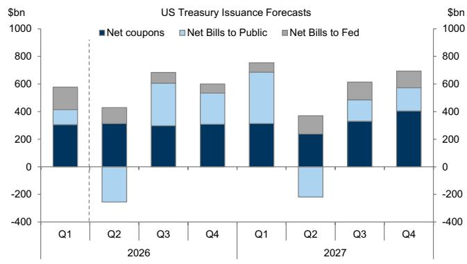

bar_stacked

| Quarter | Net coupons ($bn) | Net Bills to Public ($bn) | Net Bills to Fed ($bn) |
|---------|-------------------|---------------------------|------------------------|
| Q1 2026 | 300               | 100                       | 150                    |
| Q2 2026 | 300               | -200                      | 100                    |
| Q3 2026 | 300               | 300                       | 100                    |
| Q4 2026 | 300               | 250                       | 100                    |
| Q1 2027 | 300               | 400                       | 100                    |
| Q2 2027 | 250               | -250                      | 150                    |
| Q3 2027 | 300               | 150                       | 150                    |
| Q4 2027 | 400               | 150                       | 150                    |

Assumes RMPs slow to \$5bn/mo from next month through 1Q27   
Source: GS Global Investment Research

Exhibit 4: Inflation forwards are no longer clearly lagging the change in oil prices   
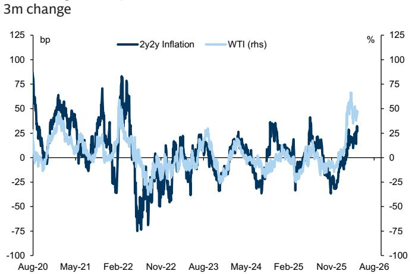

line

| Date   | 2y2y Inflation | WTI (rhs) |
|--------|----------------|---------|
| Aug-20 | ~90            | ~0      |
| May-21 | ~60            | ~20     |
| Feb-22 | ~80            | ~40     |
| Nov-22 | ~-70           | ~-30    |
| Aug-23 | ~20            | ~10     |
| May-24 | ~30            | ~5      |
| Feb-25 | ~40            | ~10     |
| Nov-25 | ~30            | ~5      |
| Aug-26 | ~60            | ~70     |

Source: GS FICC and Equities, GS Global Investment Research

# Europe

No news puts a floor on EUR front-end rates. An absence of positive news on commodity flows via the SoH, tends to see EUR yields and HICP pricing drift higher. We have argued that forward HICP is now close to fair value (Exhibit 5), and this suggests the market is pricing a reasonable degree of passthrough from headline to core inflation. This makes risk reward more balanced in the European front-end, but Z6 and front-end curve slope will still be subject to shifts in oil prices. We still see a high hurdle for sUBStantial tightening (100bp or more) and so front-end volatility remains too high relative to the plausible policy outcomes. Next week's flash PMIs will offer clues to the growth outlook, but price components will also be a key part of the release. We continue to favour sovereign credit carry, and continue to recommend IT, ES, FR longs vs OIS. But following strong performance over the last month, we tighten stops to 0.32.

Exhibit 5: Forward HICP pricing reasonable degree of passthrough from headline to core inflation   
Change in 2y2y HICP and model fitted value since 1 Jan.   
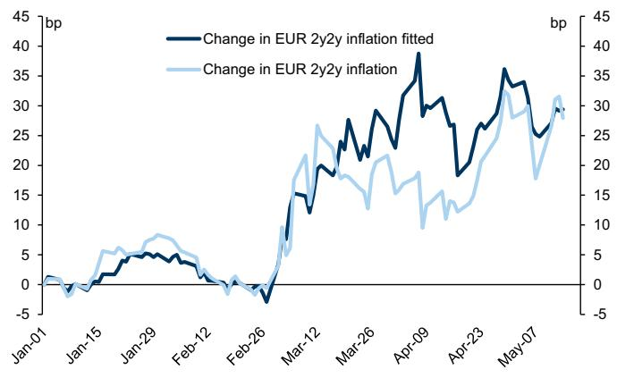

line

| Date   | Change in EUR 2y2y inflation fitted (bp) | Change in EUR 2y2y inflation |
|--------|------------------------------------------|-------------------------------|
| Jan-01 | 0                                        | 0                             |
| Jan-15 | 0                                        | 0                             |
| Jan-29 | 5                                        | 5                             |
| Feb-12 | 0                                        | 0                             |
| Feb-26 | -5                                       | -5                            |
| Mar-12 | 15                                       | 25                            |
| Mar-26 | 25                                       | 20                            |
| Apr-09 | 40                                       | 30                            |
| Apr-23 | 35                                       | 30                            |
| May-07 | 30                                       | 30                            |

Source: GS Global Investment Research, GS FICC and Equities, Haver Analytics

Exhibit 6: UK public interest cost fluctuations are large relative to headroom   
Vintage-to-vintage changes in the OBR's terminal debt interest forecast vs level of fiscal headroom   
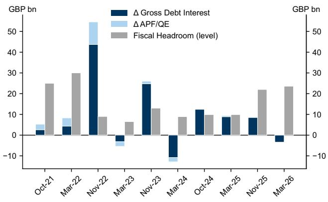

bar

| Month   | Δ Gross Debt Interest | Δ APF/QE | Fiscal Headroom (level) |
|---------|------------------------|----------|--------------------------|
| Oct-21  | 2                      | 3        | 25                       |
| Mar-22  | 4                      | 6        | 30                       |
| Nov-22  | 45                     | 10       | 9                        |
| Mar-23  | -3                     | -5       | 6                        |
| Nov-23  | 25                     | 0        | 13                       |
| Mar-24  | -8                     | -10      | 9                        |
| Oct-24  | 12                     | 0        | 10                       |
| Mar-25  | 9                      | 1        | 10                       |
| Nov-25  | 9                      | 0        | 22                       |
| Mar-26  | -3                     | 0        | 24                       |

Left bars show the change in end-of-horizon net debt interest, split into gross Gilt servicing and the BoE APF/QT adjustments.   
Source: GS Global Investment Research, BoE, OBR

Delayed reaction in Gilt premium. Despite an increase in political uncertainty on Monday and Tuesday, it took a global sell-off to shift Gilt risk premium higher late in the week. The UK curve steepened and our FX strategists' proxy for the political risk premium in Sterling — the gap between actual and GSBEER model-implied EUR/GBP performance — has risen. But overall, stress on UK assets has been more modest than in recent comparable periods. Our measure of the term premium also remains contained, and when we apply our spillover framework to the term premium, we find that the UK has not been contributing to upward pressure on global rates until very recently (Exhibit 7). This is consistent with the stability up until this week in Gilt swap spreads and 10s30s curve vs other G4 markets since last year's budget. Although political uncertainty will keep the market focused on fiscal policy, it is possible that some of the drivers of UK term premium, namely BoE QT and the rise in duration-adjusted free float, have started to moderate. That said, we expect relief to come from the front-end of the Gilt curve vs the belly, where the term premium will remain stable but sticky.

Only a little help from higher T-bill issuance. With the UK fiscal outlook in focus this week, we also assessed the likely implications of a higher resort to T-bill issuance by the UK DMO, as a result of its recent consultation. We find that raising the T-bill share to around 10% (roughly the G10 average) would save about £3bn annually in interest costs. But such an improvement needs to be weighed against the risk of fuelling funding volatility, at a moment when revisions in interest costs as part of the OBR budget forecasts are already significant, amounting to £10bn on average since 2021 (Exhibit 6). An interesting possibility is that a shift to T-bill issuance for debt management (as opposed to cash management) may see greater demand for UK securities. We argue that demand from banks, households, and reserve managers is relevant here, though it is likely to hinge on the regulatory environment, availability of alternatives (tax-free ISA accounts), and broader impulse for diversification in reserve currencies respectively. Against this, we see modest implications for UK rates overall. We think that a higher bill share can reinforce recent performance of

long-end Gilts vs swaps by reducing further issuance there, but that the clearest path for a reduction in Gilt term premium is through greater confidence on low and stable inflation.

# Exhibit 7: Decomposing G4 term premia shows that UK spillovers have only recently began contributing to global upward pressure

Estimated using G4 10y GS term premia, following the variance decomposition methodology in Rigobon (2003)

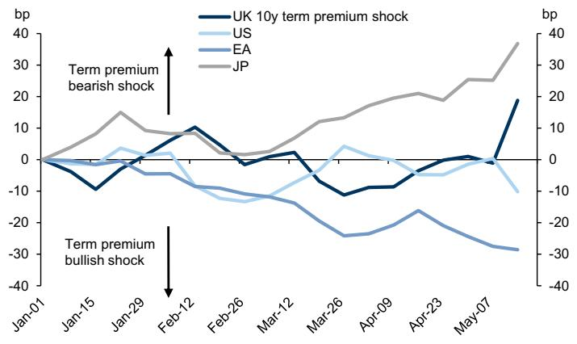

line

| Date   | UK 10y term premium shock | US  | EA  | JP  |
|--------|---------------------------|-----|-----|-----|
| Jan-01 | 0                         | 0   | 0   | 0   |
| Jan-15 | -10                       | 0   | 0   | 5   |
| Jan-29 | 5                         | 5   | -5  | 15  |
| Feb-12 | 10                        | 0   | -10 | 10  |
| Feb-26 | -5                        | -5  | -15 | 5   |
| Mar-12 | 0                         | -10 | -20 | 10  |
| Mar-26 | -10                       | 5   | -25 | 15  |
| Apr-09 | -5                        | -5  | -20 | 20  |
| Apr-23 | 0                         | -5  | -25 | 25  |
| May-07 | 20                        | -10 | -30 | 35  |

Source: GS Global Investment Research, GS FICC and Equities, Haver Analytics, Bloomberg

# Japan

BOJ QT likely to stay the course. The BoJ will release its quarterly bond market survey this upcoming week, ahead of the bond market group meetings on May 21 and 22. At these meetings, the BoJ seeks market participants' views on the pace of QT. This feedback will be a key input for the Bank's balance sheet policy review at the June monetary policy meeting and help inform any potential changes. During its previous review of balance sheet policy at the June 2025 MPM, the BoJ noted that "in the case of a rapid rise in long-term interest rates, the Bank will make nimble responses by, for example, increasing the amount of JGB purchases." Despite a sizable increase in long-term rates since then, the pace of QT has proceeded as planned. Most recently, in April, the BoJ implemented its scheduled moderation of purchase reductions from ¥400bn to ¥200bn per quarter. With funding markets showing no obvious signs of volatility and swap spreads relatively flat on the year, our economists do not anticipate a change to the QT path in June. Further, while a shift could provide some relief along the supply/demand dimension specifically, it would not address the main source of JGB volatility this year, which we think reflects domestic macro risks stemming in part from the BOJ's gradual approach to rate hikes.

# Latest Thematic Research:

Global Markets Analyst: UK T-bills: Not A Magic Bullet For Gilts — 11 May 2026

Global Markets Comment: Market Stress Monitor — 11 May 2026

Rates Vol Monitor: A Look at Hedging the Right Tail — 8 May 2026

Global Rates Notes: 2Q26 Treasury Refunding Recap — 6 May 2026

Rates Vol Monitor: Don't Forget the Left Tail — 18 March 2026

# Latest Global Markets Dailies:

Why Always Gilts? — 14 May 2026

A More Durable Risk Premium in JGBs — 8 May 2026

Trading Terms of Trade Shocks in the Smaller G10 Rates Markets — 21 April 2026

Redefining Rate Relief — 14 April 2026

TIPS During Oil Shocks — 27 March 2026

# Forecasts

G10 10y yield forecast 

<table><tr><td colspan="14">G10 10-Year Yield Forecasts</td></tr><tr><td></td><td>USD</td><td>DEM</td><td>FRA</td><td>ITA</td><td>ESP</td><td>GBP</td><td>JPY</td><td>CAD</td><td>CHF</td><td>SEK</td><td>NOK</td><td>AUD</td><td>NZD</td></tr><tr><td>Spot</td><td>4.54</td><td>3.12</td><td>3.76</td><td>3.88</td><td>3.55</td><td>5.14</td><td>2.72</td><td>3.57</td><td>0.47</td><td>2.89</td><td>4.54</td><td>5.07</td><td>4.75</td></tr><tr><td>2Q26</td><td>4.30</td><td>2.90</td><td>3.65</td><td>3.70</td><td>3.45</td><td>4.65</td><td>2.50</td><td>3.45</td><td>0.30</td><td>3.15</td><td>4.10</td><td>4.85</td><td>4.50</td></tr><tr><td>3Q26</td><td>4.20</td><td>2.95</td><td>3.70</td><td>3.80</td><td>3.50</td><td>4.50</td><td>2.50</td><td>3.50</td><td>0.40</td><td>3.20</td><td>4.00</td><td>4.75</td><td>4.50</td></tr><tr><td>4Q26</td><td>4.10</td><td>3.00</td><td>3.75</td><td>3.85</td><td>3.55</td><td>4.40</td><td>2.50</td><td>3.50</td><td>0.50</td><td>3.25</td><td>4.00</td><td>4.70</td><td>4.50</td></tr><tr><td>1Q27</td><td>4.10</td><td>3.00</td><td>3.75</td><td>3.90</td><td>3.60</td><td>4.40</td><td>2.45</td><td>3.50</td><td>0.50</td><td>3.25</td><td>4.00</td><td>4.60</td><td>4.50</td></tr><tr><td>2Q27</td><td>4.10</td><td>3.00</td><td>3.75</td><td>3.90</td><td>3.60</td><td>4.30</td><td>2.40</td><td>3.50</td><td>0.50</td><td>3.25</td><td>4.00</td><td>4.50</td><td>4.50</td></tr><tr><td>3Q27</td><td>4.15</td><td>3.00</td><td>3.75</td><td>3.90</td><td>3.60</td><td>4.30</td><td>2.30</td><td>3.50</td><td>0.50</td><td>3.25</td><td>4.00</td><td>4.50</td><td>4.50</td></tr><tr><td>4Q27</td><td>4.15</td><td>3.00</td><td>3.75</td><td>3.90</td><td>3.60</td><td>4.25</td><td>2.25</td><td>3.50</td><td>0.50</td><td>3.25</td><td>4.00</td><td>4.50</td><td>4.50</td></tr></table>

<table><tr><td colspan="14">Deviation from Forwards</td></tr><tr><td></td><td>USD</td><td>DEM</td><td>FRA</td><td>ITA</td><td>ESP</td><td>GBP</td><td>JPY</td><td>CAD</td><td>CHF</td><td>SEK</td><td>NOK</td><td>AUD</td><td>NZD</td></tr><tr><td>2Q26</td><td>-0.27</td><td>-0.26</td><td>-0.16</td><td>-0.24</td><td>-0.13</td><td>-0.55</td><td>-0.25</td><td>-0.15</td><td>-0.17</td><td>0.27</td><td>-0.43</td><td>-0.24</td><td>-0.28</td></tr><tr><td>3Q26</td><td>-0.43</td><td>-0.26</td><td>-0.19</td><td>-0.22</td><td>-0.14</td><td>-0.78</td><td>-0.32</td><td>-0.16</td><td>-0.10</td><td>0.30</td><td>-0.52</td><td>-0.36</td><td>-0.34</td></tr><tr><td>4Q26</td><td>-0.58</td><td>-0.25</td><td>-0.20</td><td>-0.23</td><td>-0.15</td><td>-0.93</td><td>-0.40</td><td>-0.19</td><td>-0.02</td><td>0.32</td><td>-0.51</td><td>-0.43</td><td>-0.42</td></tr><tr><td>1Q27</td><td>-0.63</td><td>-0.28</td><td>-0.25</td><td>-0.24</td><td>-0.14</td><td>-0.97</td><td>-0.52</td><td>-0.23</td><td>-0.03</td><td>0.29</td><td>-0.51</td><td>-0.56</td><td>-0.49</td></tr></table>

Source: GS Global Investment Research

G4 Curve Forecast   
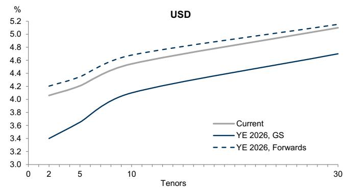

line

| Tenors | Current | YE 2026, GS | YE 2026, Forwards |
| ------ | ------- | ----------- | ----------------- |
| 2      | 4.1     | 3.4         | 4.2               |
| 5      | 4.3     | 3.7         | 4.4               |
| 10     | 4.5     | 4.1         | 4.7               |
| 30     | 5.1     | 4.7         | 5.1               |

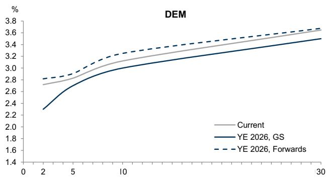

line

| x  | Current | YE 2026, GS | YE 2026, Forwards |
|----|---------|-------------|---------------------|
| 0  | 2.7     | 2.3         | 2.8                 |
| 5  | 3.0     | 2.8         | 3.1                 |
| 10 | 3.2     | 3.0         | 3.4                 |
| 30 | 3.6     | 3.5         | 3.7                 |

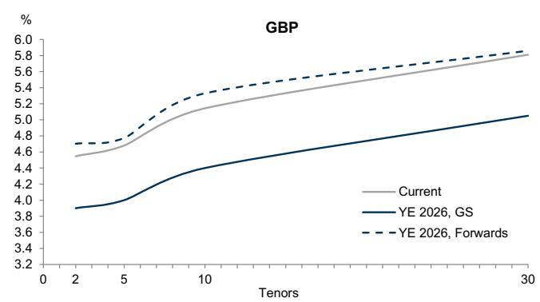

line

| Tenors | Current | YE 2026, GS | YE 2026, Forwards |
| ------ | ------- | ----------- | ----------------- |
| 2      | 4.5     | 3.9         | 4.7               |
| 5      | 4.7     | 4.0         | 4.8               |
| 10     | 5.1     | 4.4         | 5.3               |
| 30     | 5.8     | 5.1         | 5.8               |

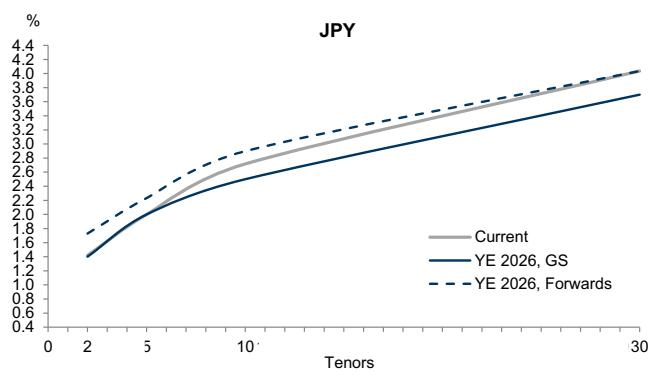

line

| Tenors | Current | YE 2026, GS | YE 2026, Forwards |
| ------ | ------- | ----------- | ----------------- |
| 2      | 1.4     | 1.4         | 1.7               |
| 5      | 2.0     | 2.0         | 2.4               |
| 10     | 2.6     | 2.4         | 3.0               |
| 30     | 3.8     | 3.6         | 4.0               |

Source: Bloomberg, GS Global Investment Research

# Central Bank Dashboard

Cumulative amount of hikes/cuts priced from today   
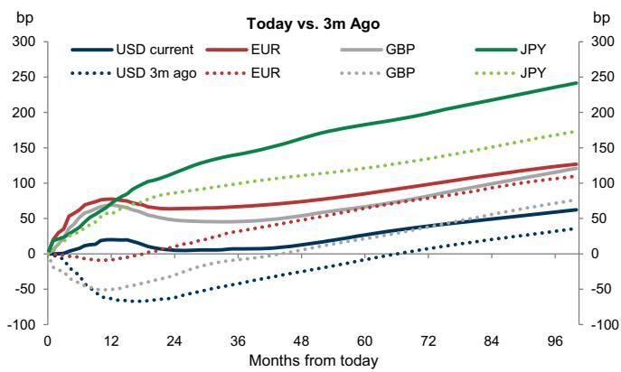

line

| Months from today | USD current | EUR | GBP | USD 3m ago | EUR | GBP | JPY |
| ----------------- | ----------- | --- | --- | ---------- | --- | --- | --- |
| 0                 | 0           | 0   | 0   | 0          | 0   | 0   | 0   |
| 12                | ~20         | ~70 | ~60 | ~-80       | ~-10 | ~-40 | ~80 |
| 24                | ~10         | ~65 | ~55 | ~-60       | ~-5  | ~-30 | ~100 |
| 36                | ~15         | ~70 | ~60 | ~-40       | ~-2  | ~-10 | ~120 |
| 48                | ~20         | ~75 | ~65 | ~-20       | ~0   | ~0    | ~140 |
| 60                | ~25         | ~80 | ~70 | ~0         | ~2   | ~20  | ~160 |
| 72                | ~30         | ~85 | ~75 | ~20        | ~4   | ~40  | ~180 |
| 84                | ~35         | ~90 | ~80 | ~40        | ~6   | ~60  | ~200 |
| 96                | ~40         | ~95 | ~85 | ~60        | ~8   | ~80  | ~220 |

Source: GS Global Investment Research

Expected hikes by year, GS vs. Market   
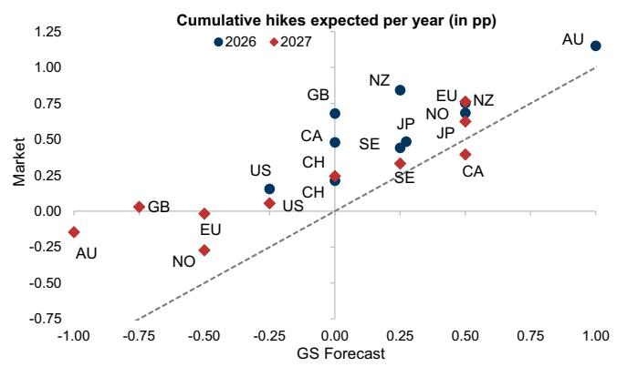

scatter

Cumulative hikes expected per year (in pp)
| Region | Year | GS Forecast | Market |
| :--- | :--- | :--- | :--- |
| AU | 2026 | 1.00 | 1.15 |
| GB | 2027 | -0.75 | -0.10 |
| EU | 2027 | -0.50 | -0.25 |
| US | 2026 | -0.25 | 0.15 |
| CH | 2026 | -0.10 | 0.45 |
| US | 2027 | -0.30 | 0.10 |
| GB | 2026 | 0.00 | 0.65 |
| CA | 2026 | 0.00 | 0.45 |
| CH | 2026 | -0.15 | 0.25 |
| NZ | 2026 | 0.25 | 0.85 |
| JP | 2026 | 0.30 | 0.45 |
| SE | 2027 | 0.10 | 0.35 |
| EU | 2027 | 0.50 | 0.75 |
| NO | 2026 | 0.45 | 0.65 |
| JP | 2027 | 0.50 | 0.65 |
| CA | 2027 | 0.55 | 0.45 |
The dashed line indicates a trend from left to right across the chart. The data points are labeled with country codes and abbreviations (e.g., “US”, “NZ”, “CA”).

Source: GS Global Investment Research

Central bank ownership of sovereign bonds, current vs. 1y ago   
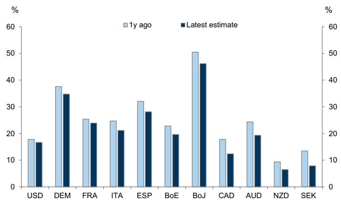

bar

| Currency | 1y ago (%) | Latest estimate (%) |
| :--- | :--- | :--- |
| USD | 18 | 17 |
| DEM | 38 | 35 |
| FRA | 25 | 24 |
| ITA | 25 | 21 |
| ESP | 32 | 28 |
| BoE | 23 | 20 |
| BoJ | 50 | 46 |
| CAD | 18 | 12 |
| AUD | 25 | 20 |
| NZD | 9 | 6 |
| SEK | 14 | 8 |

Source: Haver Analytics

Central bank assets as a share of GDP   
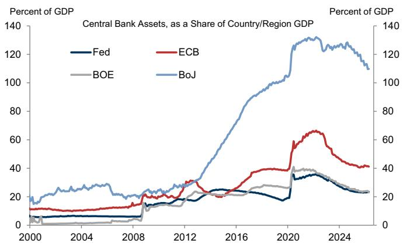

line

| Year | Fed  | ECB  | BOE  | BoJ  |
|------|------|------|------|------|
| 2000 | ~5   | ~10  | ~5   | ~20  |
| 2004 | ~10  | ~15  | ~10  | ~25  |
| 2008 | ~15  | ~20  | ~15  | ~30  |
| 2012 | ~20  | ~30  | ~25  | ~40  |
| 2016 | ~25  | ~40  | ~30  | ~70  |
| 2020 | ~30  | ~65  | ~40  | ~130 |
| 2024 | ~25  | ~45  | ~35  | ~110 |

Source: Haver Analytics

# Positioning and Flows Monitor

Option implied position indicator   
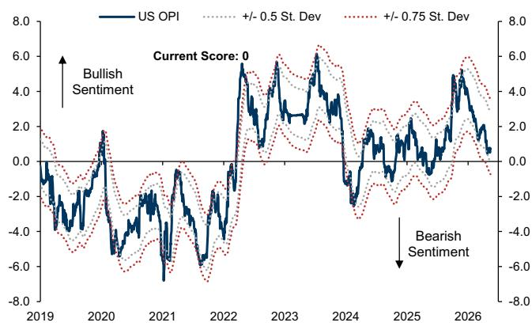

line

| Year | US OPI | +/- 0.5 St. Dev | +/- 0.75 St. Dev |
|------|--------|-----------------|------------------|
| 2019 | -4.0   | -2.0            | -1.0             |
| 2020 | 2.0    | 0.0             | -1.0             |
| 2021 | -6.0   | -4.0            | -2.0             |
| 2022 | 6.0    | 4.0             | 2.0              |
| 2023 | 4.0    | 2.0             | 0.0              |
| 2024 | -2.0   | -4.0            | -2.0             |
| 2025 | 4.0    | 2.0             | 0.0              |
| 2026 | 2.0    | 0.0             | -1.0             |

Source: GS Global Investment Research

GS Fund Positioning Indicator   
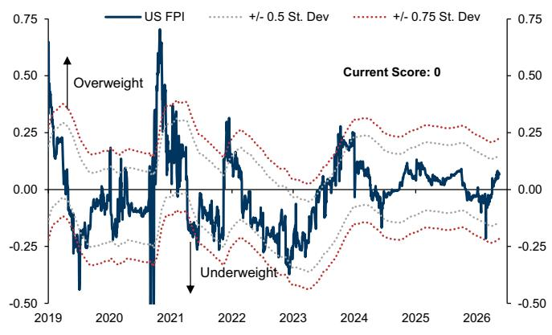

line

| Year | US FPI | +/- 0.5 St. Dev | +/- 0.75 St. Dev |
|------|--------|-----------------|------------------|
| 2019 | 0.75   | 0.30            | 0.40             |
| 2020 | -0.25  | -0.10           | -0.15            |
| 2021 | 0.75   | 0.35            | 0.45             |
| 2022 | -0.25  | -0.10           | -0.15            |
| 2023 | -0.30  | -0.15           | -0.20            |
| 2024 | 0.25   | 0.10            | 0.20             |
| 2025 | 0.10   | 0.05            | 0.15             |
| 2026 | 0.15   | 0.10            | 0.20             |

Source: GS Global Investment Research

US Data Response Indicator (DRI)   
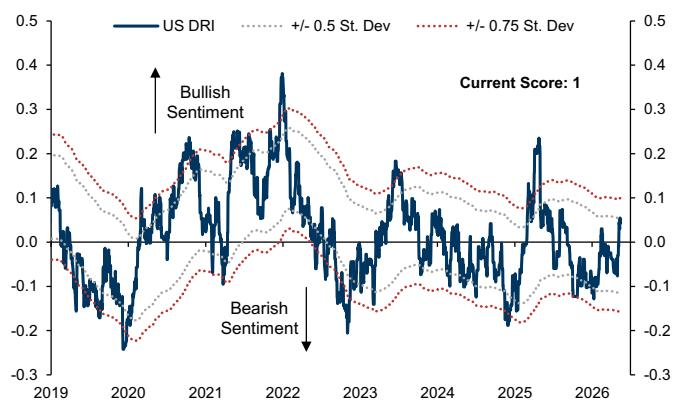

line

| Year | US DRI | +/- 0.5 St. Dev | +/- 0.75 St. Dev |
|------|--------|-----------------|------------------|
| 2019 | ~0.1   | ~0.2            | ~0.2             |
| 2020 | ~-0.2  | ~-0.1           | ~-0.1            |
| 2021 | ~0.2   | ~0.1            | ~0.1             |
| 2022 | ~0.4   | ~0.3            | ~0.3             |
| 2023 | ~-0.1  | ~-0.1           | ~-0.1            |
| 2024 | ~0.1   | ~0.1            | ~0.1             |
| 2025 | ~-0.1  | ~-0.1           | ~-0.1            |
| 2026 | ~0.1   | ~0.1            | ~0.1             |

Source: GS Global Investment Research

# CFTC Commitment of Traders and Traders in Financial Futures

Duration-weighted net position by investor type

Duration-Weighted Positioning, by Contract 

<table><tr><td>$mm/bp</td><td>SFR</td><td>TU</td><td>FV</td><td>TY</td><td>TN</td><td>US</td><td>WN</td></tr><tr><td>Spec Current</td><td>-43.2</td><td>-58.3</td><td>-59.0</td><td>-45.7</td><td>-9.1</td><td>-23.1</td><td>-45.4</td></tr><tr><td>Spec 1w Change</td><td>-8.9</td><td>1.4</td><td>3.9</td><td>4.3</td><td>-6.7</td><td>-6.8</td><td>6.6</td></tr><tr><td>LF Current</td><td>-41.3</td><td>-70.6</td><td>-101.1</td><td>-124.0</td><td>-24.1</td><td>-39.2</td><td>-153.3</td></tr><tr><td>LF 1w Change</td><td>-10.2</td><td>3.1</td><td>-1.4</td><td>8.6</td><td>-4.8</td><td>-7.6</td><td>2.9</td></tr><tr><td>AM + Other Current</td><td>5.5</td><td>80.4</td><td>119.1</td><td>142.5</td><td>58.1</td><td>57.7</td><td>201.7</td></tr><tr><td>AM + Other 1w Change</td><td>-4.8</td><td>-4.8</td><td>0.5</td><td>-7.1</td><td>3.9</td><td>4.8</td><td>-6.6</td></tr><tr><td>Dealer Current</td><td>35.9</td><td>-12.6</td><td>-20.9</td><td>-23.2</td><td>-22.6</td><td>-30.0</td><td>-46.6</td></tr><tr><td>Dealer 1w Change</td><td>15.0</td><td>1.8</td><td>1.4</td><td>-0.4</td><td>1.0</td><td>5.6</td><td>6.5</td></tr></table>

Source: CFTC, GS Global Investment Research

Net positions in Eurodollars   
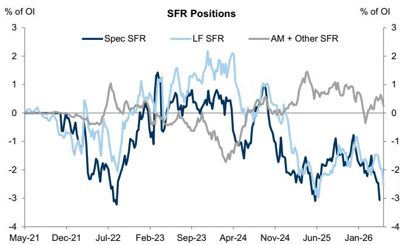

line

| Date    | Spec SFR | LF SFR | AM + Other SFR |
|---------|----------|--------|----------------|
| May-21  | 0        | 0      | 0              |
| Dec-21  | -1       | -1     | -1             |
| Jul-22  | -3       | -2     | -2             |
| Feb-23  | 1        | 1      | 0              |
| Sep-23  | 0        | 2      | 1              |
| Apr-24  | -1       | -1     | -1             |
| Nov-24  | -2       | -2     | -2             |
| Jun-25  | -3       | -3     | -3             |
| Jan-26  | -4       | -4     | -4             |

Note: Duration-weighted net position (long - short) as a % of duration-weighted gross exposure (long + short + spreading)   
Source: CFTC, GS Global Investment Research

# Primary dealer transactions

Net dealer position in US Treasuries

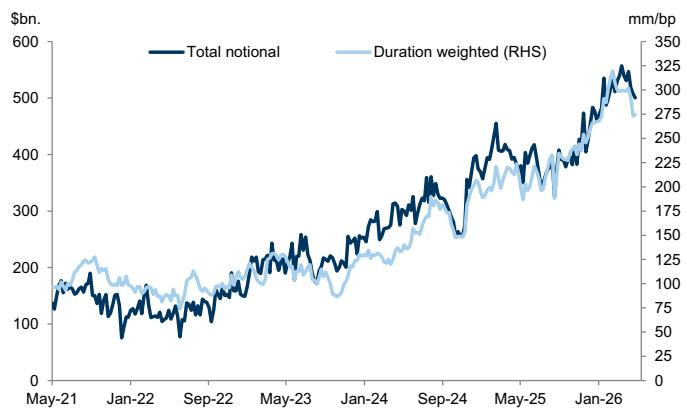

line

| Date    | Total notional ($bn) | Duration weighted (RHS) (mm/bp) |
|---------|------------------------|----------------------------------|
| May-21  | ~150                   | ~100                             |
| Jan-22  | ~100                   | ~125                             |
| Sep-22  | ~180                   | ~150                             |
| May-23  | ~250                   | ~175                             |
| Jan-24  | ~300                   | ~200                             |
| Sep-24  | ~350                   | ~225                             |
| May-25  | ~450                   | ~275                             |
| Jan-26  | ~550                   | ~325                             |

Source: Federal Reserve Bank of New York, GS Global Investment Research

Net positions in UST futures   
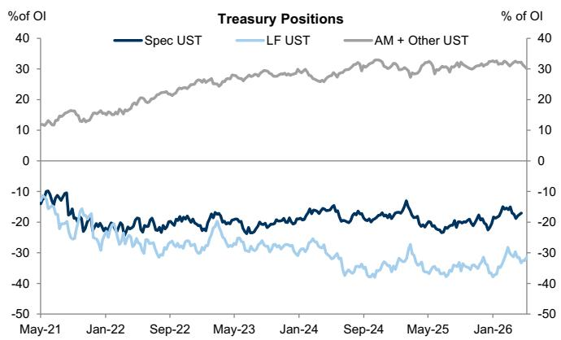

line

| Date    | Spec UST | LF UST | AM + Other UST |
|---------|----------|--------|----------------|
| May-21  | -10      | -15    | 10             |
| Jan-22  | -20      | -25    | 15             |
| Sep-22  | -15      | -20    | 20             |
| May-23  | -10      | -25    | 25             |
| Jan-24  | -15      | -30    | 30             |
| Sep-24  | -10      | -35    | 35             |
| May-25  | -15      | -30    | 30             |
| Jan-26  | -10      | -35    | 35             |

Note: Duration-weighted net position (long - short) as a % of duration-weighted gross exposure (long + short + spreading)   
Source: CFTC, GS Global Investment Research

# US Commercial Banks' Holdings of Treasury and Agency Securities

Total domestic and foreign holdings, all commercial banks

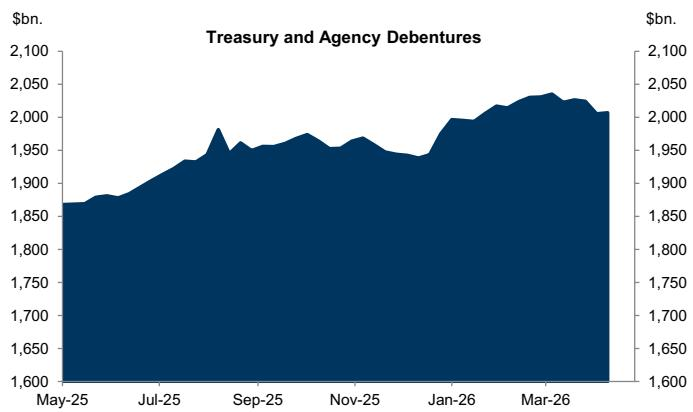

area

| Date   | Value ($bn) |
|--------|-------------|
| May-25 | 1,850       |
| Jul-25 | 1,900       |
| Sep-25 | 1,950       |
| Nov-25 | 1,900       |
| Jan-26 | 2,000       |
| Mar-26 | 2,050       |

Source: Federal Reserve Board

NY Fed Custody Holdings   
Marketable US Treasuries   
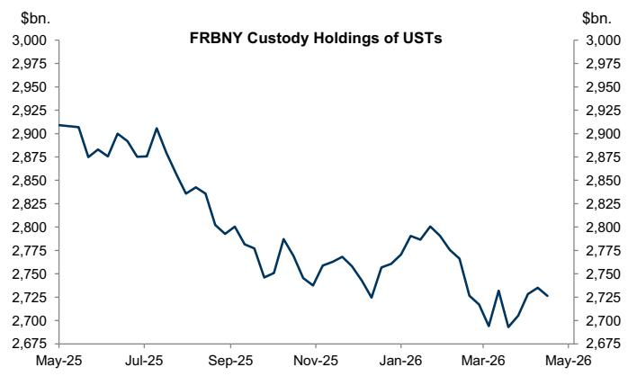

line

| Date   | Value ($bn) |
|--------|-------------|
| May-25 | 2,900       |
| Jul-25 | 2,875       |
| Sep-25 | 2,800       |
| Nov-25 | 2,750       |
| Jan-26 | 2,775       |
| Mar-26 | 2,700       |
| May-26 | 2,725       |

Source: Federal Reserve Bank of New York

US TIC Treasury Flows   
12m change in valuation-adjusted holdings of USTs, by holder of debt   
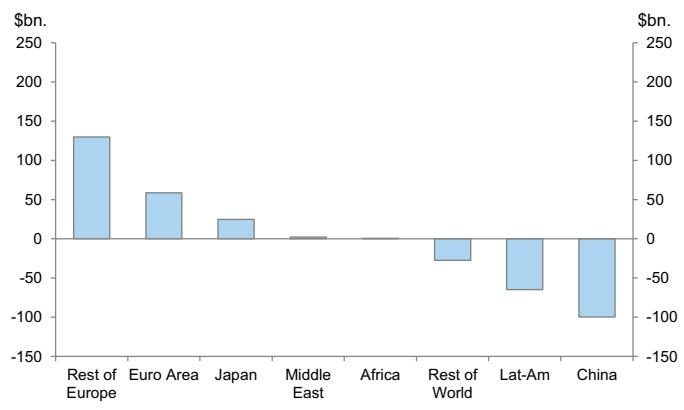

bar

| Region | Value ($bn) |
| :--- | :--- |
| Rest of Europe | 130 |
| Euro Area | 60 |
| Japan | 25 |
| Middle East | 5 |
| Africa | -5 |
| Rest of World | -30 |
| Lat-Am | -70 |
| China | -100 |

Source: US Treasury, GS Global Investment Research

Net monthly purchases of short- and long-term US Treasuries by Japanese investors   

bar

| Month   | Net Investment (¥tn) |
|---------|----------------------|
| Oct-20  | 4                    |
| Nov-20  | 1                    |
| Dec-20  | 1                    |
| Jan-21  | 1                    |
| Feb-21  | 1                    |
| Mar-21  | 1                    |
| Apr-21  | 1                    |
| May-21  | 1                    |
| Jun-21  | -3                   |
| Jul-21  | -3                   |
| Aug-21  | -3                   |
| Sep-21  | -3                   |
| Oct-21  | -3                   |
| Nov-21  | -3                   |
| Dec-21  | -3                   |
| Jan-22  | -3                   |
| Feb-22  | -3                   |
| Mar-22  | -3                   |
| Apr-22  | -3                   |
| May-22  | -3                   |
| Jun-22  | -3                   |
| Jul-22  | -3                   |
| Aug-22  | -3                   |
| Sep-22  | -3                   |
| Oct-22  | -3                   |
| Nov-22  | -3                   |
| Dec-22  | -3                   |
| Jan-23  | -3                   |
| Feb-23  | -3                   |
| Mar-23  | -3                   |
| Apr-23  | -3                   |
| May-23  | -3                   |
| Jun-23  | -3                   |
| Jul-23  | -3                   |
| Aug-23  | -3                   |
| Sep-23  | -3                   |
| Oct-23  | -3                   |
| Nov-23  | -3                   |
| Dec-23  | -3                   |
| Jan-24  | -3                   |
| Feb-24  | -3                   |
| Mar-24  | -3                   |
| Apr-24  | -3                   |
| May-24  | -3                   |
| Jun-24  | -3                   |
| Jul-24  | -3                   |
| Aug-24  | -3                   |
| Sep-24  | -3                   |
| Oct-24  | -3                   |
| Nov-24  | -3                   |
| Dec-24  | -3                   |
| Jan-25  | -3                   |
| Feb-25  | -3                   |
| Mar-25  | -3                   |
| Apr-25  | -3                   |
| May-25  | -3                   |
| Jun-25  | -3                   |
| Jul-25  | -3                   |
| Aug-25  | -3                   |
| Sep-25  | -3                   |
| Oct-25  | -3                   |

Source: Bank of Japan, Haver Analytics

Flow of Funds annual net purchases of US Treasuries, by sector   
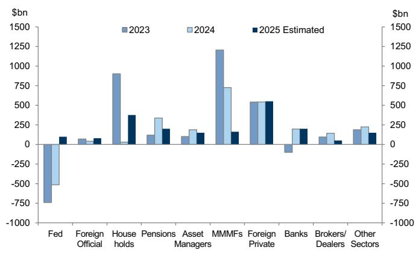

bar

| Category | 2023 ($bn) | 2024 ($bn) | 2025 Estimated ($bn) |
| :--- | :--- | :--- | :--- |
| Fed | -750 | -500 | 100 |
| Foreign Official | 50 | 50 | 50 |
| Households | 900 | 0 | 400 |
| Pensions | 100 | 350 | 200 |
| Asset Managers | 100 | 150 | 150 |
| MMMFs | 1200 | 700 | 150 |
| Foreign Private | 500 | 500 | 550 |
| Banks | -100 | 200 | 200 |
| Brokers/Dealers | 100 | 150 | 50 |
| Other Sectors | 200 | 250 | 150 |

Source: Federal Reserve Board, GS Global Investment Research

# Outright Carry

Bar chart shows top two carry points by currency, with solid reflecting carry to a long position and striped carry to a short position. Scatter illustrates top 25 carry/vol points by currency, with top point by currency noted

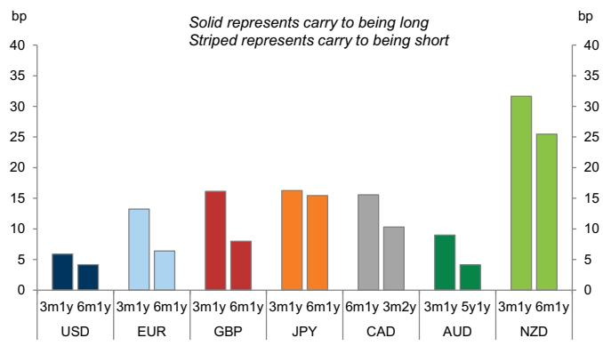

bar

| Currency | Short Term | Long Term |
|----------|------------|-----------|
| USD      | 3m1y       | 6m1y      |
| EUR      | 3m1y       | 6m1y      |
| GBP      | 3m1y       | 6m1y      |
| JPY      | 3m1y       | 6m1y      |
| CAD      | 6m1y       | 3m2y      |
| AUD      | 3m1y       | 5y1y      |
| NZD      | 3m1y       | 6m1y      |

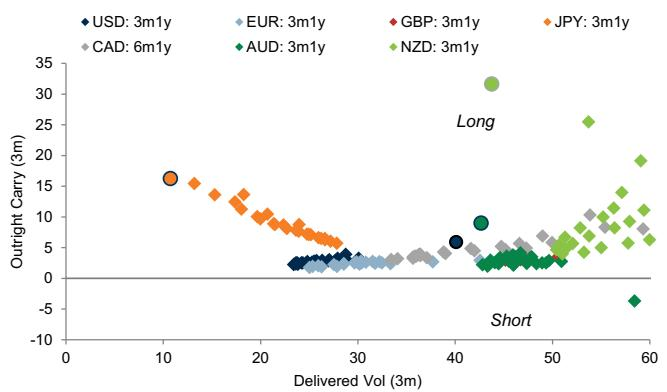

scatter

| Currency | Delivered Vol (3m) | Outright Carry (3m) |
|----------|---------------------|----------------------|
| USD      | ~25                 | ~2                   |
| EUR      | ~30                 | ~2                   |
| GBP      | ~40                 | ~6                   |
| JPY      | ~10                 | ~16                  |
| CAD      | ~35                 | ~4                   |
| AUD      | ~45                 | ~9                   |
| NZD      | ~55                 | ~25                  |

Source: GS Global Investment Research

# Curve Carry

Bar chart shows top two carry curves by currency, with solid reflecting carry to a steepening position and striped carry to a flattening position. Scatter illustrates top 5 carry/vol curves by currency, with top curve by currency noted

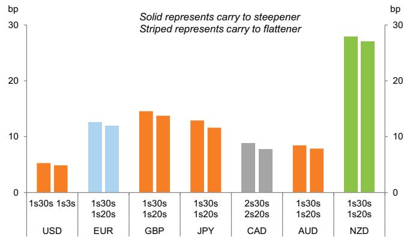

bar

| Currency | 1s30s | 1s20s |
|----------|-------|-------|
| USD      | 5     | 5     |
| EUR      | 12    | 12    |
| GBP      | 14    | 14    |
| JPY      | 13    | 12    |
| CAD      | 9     | 8     |
| AUD      | 8     | 8     |
| NZD      | 28    | 27    |

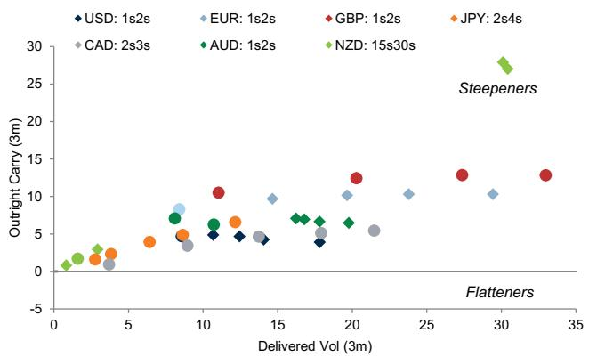

scatter

| Currency | Delivered Vol (3m) | Outright Carry (3m) |
|----------|---------------------|----------------------|
| USD      | 10                  | 5                    |
| USD      | 12                  | 4                    |
| USD      | 14                  | 4                    |
| EUR      | 8                   | 8                    |
| EUR      | 10                  | 9                    |
| EUR      | 15                  | 10                   |
| EUR      | 20                  | 12                   |
| EUR      | 24                  | 10                   |
| EUR      | 29                  | 10                   |
| GBP      | 10                  | 10                   |
| GBP      | 12                  | 6                    |
| GBP      | 15                  | 7                    |
| GBP      | 20                  | 13                   |
| GBP      | 28                  | 13                   |
| GBP      | 33                  | 13                   |
| JPY      | 6                   | 4                    |
| JPY      | 8                   | 5                    |
| JPY      | 10                  | 6                    |
| JPY      | 12                  | 6                    |
| JPY      | 14                  | 5                    |
| JPY      | 16                  | 6                    |
| JPY      | 20                  | 6                    |
| JPY      | 24                  | 5                    |
| JPY      | 28                  | 5                    |
| JPY      | 30                  | 5                    |
| JPY      | 32                  | 5                    |
| CAD      | 4                   | 1                    |
| CAD      | 6                   | 3                    |
| CAD      | 8                   | 4                    |
| CAD      | 10                  | 5                    |
| CAD      | 12                  | 5                    |
| CAD      | 14                  | 5                    |
| CAD      | 16                  | 5                    |
| CAD      | 18                  | 5                    |
| AUD      | 8                   | 7                    |
| AUD      | 10                  | 6                    |
| AUD      | 12                  | 6                    |
| AUD      | 14                  | 6                    |
| AUD      | 16                  | 7                    |
| AUD      | 18                  | 7                    |
| AUD      | 20                  | 7                    |
| AUD      | 22                  | 6                    |
| AUD      | 24                  | 5                    |
| AUD      | 26                  | 5                    |
| AUD      | 28                  | 5                    |
| AUD      | 30                  | 5                    |
| NZD      | 2                   | 1                    |
| NZD      | 4                   | 2                    |
| NZD      | 6                   | 3                    |
| NZD      | 8                   | 4                    |
| NZD      | 10                  | 4                    |
| NZD      | 12                  | 4                    |
| NZD      | 14                  | 4                    |
| NZD      | 16                  | 4                    |
| NZD      | 18                  | 4                    |
| NZD      | 20                  | 4                    |
| NZD      | 22                  | 4                    |
| NZD      | 24                  | 4                    |
| NZD      | 26                  | 4                    |
| NZD      | 28                  | 4                    |
| NZD      | 30                  | 4                    |
| NZD      | 32                  | 4                    |
| Steepeners| -                   | -                    |
| Steepeners| -                   | -                    |
| Steepeners| -                   | -                    |
| Steepeners| -                   | -                    |
| Steepeners| -                   | -                    |
| Steepeners| -                   | -                    |
| Steepeners| -                   | -                    |
| Steepeners| -                   | -                    |
| Steepeners| -                   | -                    |
| Steepeners| -                   | -                     |
| Steepeners| -                   | -                    |
| Steepeners| -                   | -                    |
| Steepeners| -                   | -                    |
| Steepeners| -                   | -                    |
| Steepeners| -                   | -                    |
| Steepeners| -                   | -                    |
| Steepeners| -                   | -                    |
| Steepeners| -                   | -                    |
| Steepeners| -                   | -                    |

Source: GS Global Investment Research

# Fly Carry

Bar chart shows top two carry flies by currency, with solid reflecting carry to a belly-richening fly and striped carry to a belly-cheapening fly. Scatter illustrates top 5 carry/vol flies by currency, with top fly by currency noted.

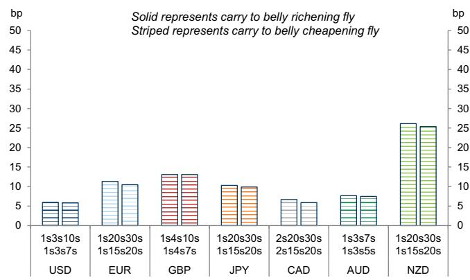

bar

| Currency | Time Window | Bond Yield (bp) |
|----------|-------------|-----------------|
| USD      | 1s3s10s     | 6               |
| USD      | 1s3s7s      | 6               |
| EUR      | 1s20s30s    | 12              |
| EUR      | 1s15s20s    | 11              |
| GBP      | 1s4s10s     | 13              |
| GBP      | 1s4s7s      | 13              |
| JPY      | 1s20s30s    | 10              |
| JPY      | 1s15s20s    | 10              |
| CAD      | 2s20s30s    | 7               |
| CAD      | 2s15s20s    | 6               |
| AUD      | 1s3s7s      | 8               |
| AUD      | 1s3s5s      | 8               |
| NZD      | 1s20s30s    | 26              |
| NZD      | 1s15s20s    | 25              |

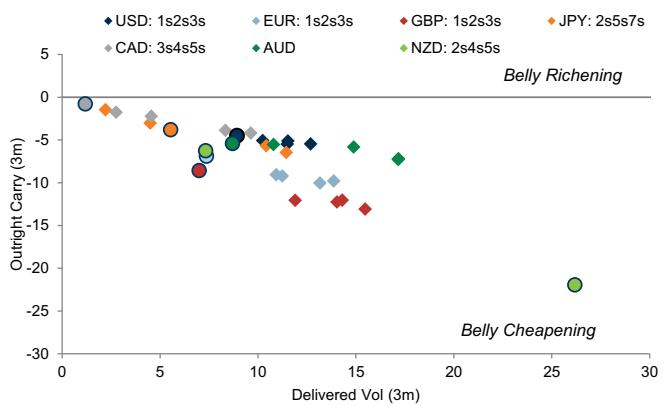

scatter

| Currency | Delivered Vol (3m) | Outright Carry (3m) |
|----------|---------------------|----------------------|
| USD      | 10                  | -5                   |
| EUR      | 10                  | -10                  |
| GBP      | 10                  | -15                  |
| JPY      | 5                   | -5                   |
| CAD      | 5                   | -5                   |
| AUD      | 5                   | -5                   |
| NZD      | 10                  | -5                   |
| AUD      | 15                  | -10                  |
| AUD      | 20                  | -10                  |
| AUD      | 25                  | -10                  |
| AUD      | 26                  | -20                  |
| AUD      | 27                  | -20                  |
| AUD      | 28                  | -20                  |
| AUD      | 29                  | -20                  |
| AUD      | 30                  | -20                  |

Source: GS Global Investment Research

# Treasury Supply Monitor

Gross Treasury auction size estimates by year end, with GS projections 

<table><tr><td colspan="12">Monthly Auction Amounts at End of Calendar Year ($ billions)</td></tr><tr><td></td><td>2y FRNs</td><td>2y</td><td>3y</td><td>5y</td><td>7y</td><td>10y</td><td>20y</td><td>30y</td><td>5y TIPS</td><td>10y TIPS</td><td>30y TIPS</td></tr><tr><td>YE-25 (CY)</td><td>30 / 28 (r)</td><td>69</td><td>58</td><td>70</td><td>44</td><td>42 / 39 (r)</td><td>16 / 13 (r)</td><td>25 / 22 (r)</td><td>26 / 24 (r)</td><td>21 / 19 (r)</td><td>9 / 8 (r)</td></tr><tr><td>YE-26 (CY, GS)</td><td>30 / 28 (r)</td><td>69</td><td>58</td><td>70</td><td>44</td><td>42 / 39 (r)</td><td>16 / 13 (r)</td><td>25 / 22 (r)</td><td>26 / 24 (r)</td><td>21 / 19 (r)</td><td>9 / 8 (r)</td></tr><tr><td>YE-27 (CY, GS)</td><td>33 / 30 (r)</td><td>83</td><td>72</td><td>84</td><td>58</td><td>42 / 39 (r)</td><td>16 / 13 (r)</td><td>25 / 22 (r)</td><td>28 / 26 (r)</td><td>21 / 19 (r)</td><td>9 / 8 (r)</td></tr></table>

\* Original Issue / Reopening listed for FRNs, 10s, 20s, 30s, and TIPS.

US Treasury Net Issuance by Calendar Year (\$ billions) 

<table><tr><td></td><td>Net Coupons</td><td>Fed</td><td>Net of Fed</td><td>Net Bills</td><td>Fed</td><td>Net of Fed</td></tr><tr><td>CY 2024</td><td>1346</td><td>-475</td><td>1821</td><td>511</td><td>-23</td><td>534</td></tr><tr><td>CY 2025</td><td>1566</td><td>-115</td><td>1681</td><td>360</td><td>38</td><td>322</td></tr><tr><td>CY 2026, GS</td><td>1225</td><td>-1</td><td>1226</td><td>811</td><td>422</td><td>389</td></tr><tr><td>CY 2027, GS</td><td>1286</td><td>0</td><td>1286</td><td>927</td><td>449</td><td>478</td></tr></table>

Duration supply (\$bn 10y equiv) 

<table><tr><td>Gross supply</td><td>Fed</td><td>Net of Fed</td></tr><tr><td>2765</td><td>0</td><td>2765</td></tr><tr><td>2797</td><td>0</td><td>2797</td></tr><tr><td>2803</td><td>0</td><td>2803</td></tr><tr><td>2996</td><td>0</td><td>2996</td></tr></table>

Source: GS Global Investment Research, US Department of the Treasury

Net issuance per quarter   
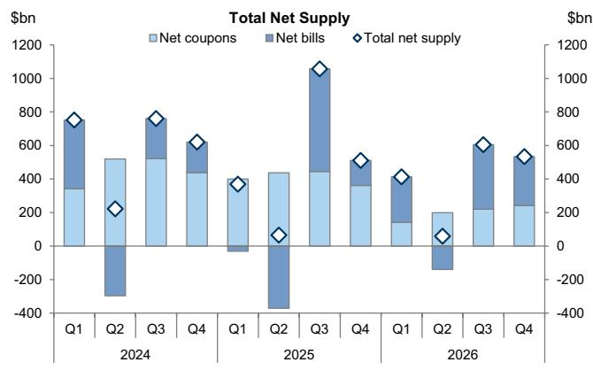

bar

| Quarter | Net coupons ($bn) | Net bills ($bn) | Total net supply ($bn) |
|---------|-------------------|-----------------|------------------------|
| Q1 2024 | 350               | 400             | 750                    |
| Q2 2024 | -300              | -350            | 200                    |
| Q3 2024 | 500               | 300             | 800                    |
| Q4 2024 | 450               | 250             | 650                    |
| Q1 2025 | -50               | -100            | 350                    |
| Q2 2025 | 450               | -350            | 100                    |
| Q3 2025 | 450               | 600             | 1100                   |
| Q4 2025 | 350               | 150             | 550                    |
| Q1 2026 | 150               | 300             | 450                    |
| Q2 2026 | -150              | -100            | 100                    |
| Q3 2026 | 200               | 450             | 650                    |
| Q4 2026 | 250               | 350             | 550                    |

Source: GS Global Investment Research, US Department of the Treasury

Average monthly UST issuance, gross and net of Fed purchases; \$bn 10y equivalents   
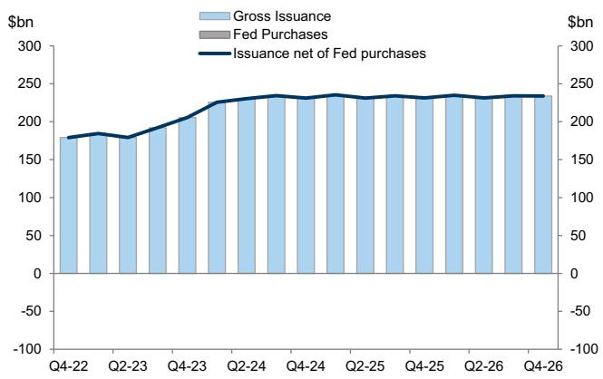

bar_line

| Quarter | Gross Issuance ($bn) | Fed Purchases ($bn) | Issuance net of Fed purchases ($bn) |
|---------|------------------------|----------------------|-------------------------------------|
| Q4-22   | 180                    | -                    | 180                                 |
| Q2-23   | 190                    | -                    | 190                                 |
| Q4-23   | 200                    | -                    | 200                                 |
| Q2-24   | 230                    | -                    | 230                                 |
| Q4-24   | 235                    | -                    | 235                                 |
| Q2-25   | 230                    | -                    | 230                                 |
| Q4-25   | 235                    | -                    | 235                                 |
| Q2-26   | 230                    | -                    | 230                                 |
| Q4-26   | 235                    | -                    | 235                                 |

Source: GS Global Investment Research, US Department of the Treasury

Free float (Treasuries outstanding less Fed and foreign official holdings) as % of GDP   
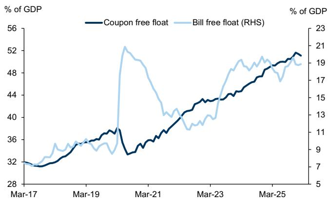

line

| Date   | Coupon free float | Bill free float (RHS) |
|--------|-------------------|------------------------|
| Mar-17 | 32                | 7                      |
| Mar-19 | 36                | 11                     |
| Mar-21 | 34                | 21                     |
| Mar-23 | 44                | 17                     |
| Mar-25 | 52                | 19                     |

Source: Haver Analytics, US Treasury, GS Global Investment Research

Bills as a share of Treasuries outstanding and GS forecast
Gray shading denotes TBAC recommended 15-20% range   
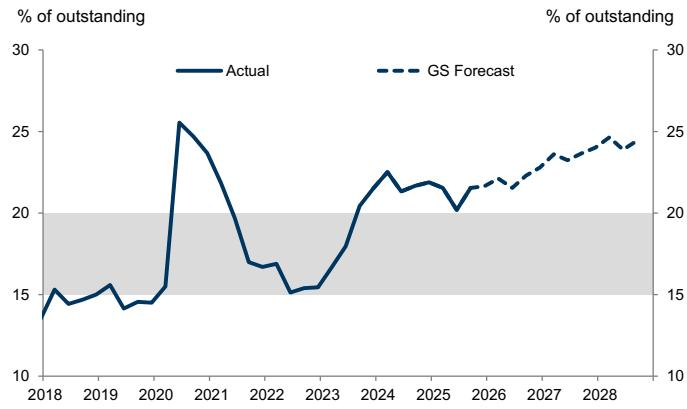

line

| Year | Actual | GS Forecast |
|------|--------|-------------|
| 2018 | 14.0   | -           |
| 2019 | 15.5   | -           |
| 2020 | 14.5   | -           |
| 2021 | 25.5   | -           |
| 2022 | 16.5   | -           |
| 2023 | 15.5   | -           |
| 2024 | 22.5   | -           |
| 2025 | 21.5   | -           |
| 2026 | 20.5   | 21.5        |
| 2027 | -      | 23.5        |
| 2028 | -      | 24.5        |

Source: US Treasury, GS Global Investment Research

# GS Term Premium Decomposition

1y Range of G10 10y Yields, by Term Premium and Expectations Components   
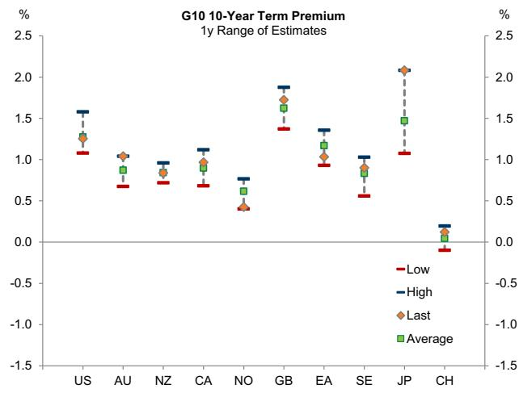

bar

| Country | Low  | High | Last | Average |
|---------|------|------|------|---------|
| US      | 1.1  | 1.6  | 1.3  | 1.2     |
| AU      | 0.7  | 1.0  | 1.0  | 0.9     |
| NZ      | 0.7  | 1.0  | 0.9  | 0.8     |
| CA      | 0.7  | 1.1  | 1.0  | 0.9     |
| NO      | 0.4  | 0.8  | 0.5  | 0.6     |
| GB      | 1.4  | 1.9  | 1.7  | 1.6     |
| EA      | 1.0  | 1.4  | 1.2  | 1.1     |
| SE      | 0.6  | 1.0  | 0.9  | 0.8     |
| JP      | 1.1  | 2.1  | 2.2  | 1.5     |
| CH      | -0.1 | 0.2  | 0.1  | 0.0     |

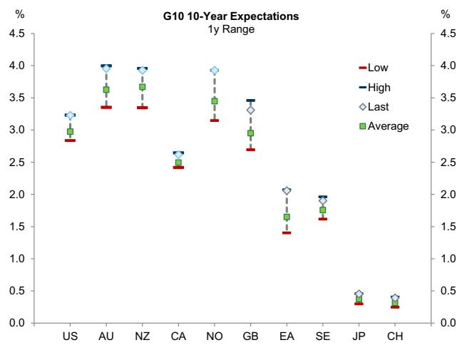

bar

| Country | Low  | High | Last | Average |
|---------|------|------|------|---------|
| US      | 2.8  | 3.2  | 3.2  | 3.0     |
| AU      | 3.3  | 4.0  | 3.6  | 3.6     |
| NZ      | 3.3  | 4.0  | 3.7  | 3.7     |
| CA      | 2.4  | 2.6  | 2.6  | 2.5     |
| NO      | 3.1  | 4.0  | 3.9  | 3.5     |
| GB      | 2.7  | 3.5  | 3.4  | 3.0     |
| EA      | 1.4  | 2.1  | 2.1  | 1.7     |
| SE      | 1.6  | 1.9  | 1.9  | 1.8     |
| JP      | 0.3  | 0.4  | 0.4  | 0.4     |
| CH      | 0.2  | 0.3  | 0.3  | 0.3     |

Term Structure of Fitted Yields, by Component   
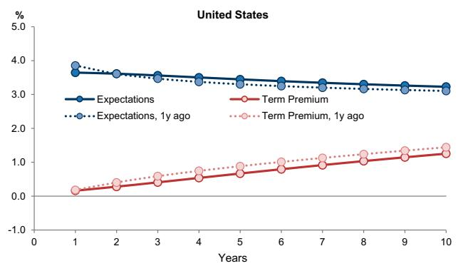

line

| Years | Expectations | Expectations, 1y ago | Term Premium | Term Premium, 1y ago |
|-------|--------------|----------------------|--------------|----------------------|
| 1     | 3.8          | 3.9                  | 0.1          | 0.1                  |
| 2     | 3.7          | 3.7                  | 0.3          | 0.3                  |
| 3     | 3.6          | 3.6                  | 0.5          | 0.5                  |
| 4     | 3.5          | 3.5                  | 0.7          | 0.7                  |
| 5     | 3.4          | 3.4                  | 0.9          | 0.9                  |
| 6     | 3.3          | 3.3                  | 1.0          | 1.0                  |
| 7     | 3.2          | 3.2                  | 1.1          | 1.1                  |
| 8     | 3.1          | 3.1                  | 1.2          | 1.2                  |
| 9     | 3.0          | 3.0                  | 1.3          | 1.3                  |
| 10    | 2.9          | 2.9                  | 1.4          | 1.4                  |

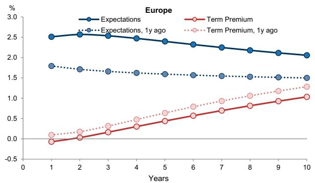

line

| Years | Expectations | Term Premium | Expectations, 1y ago | Term Premium, 1y ago |
|-------|--------------|--------------|----------------------|----------------------|
| 1     | 2.5          | -0.1         | 1.8                  | 0.1                  |
| 2     | 2.6          | 0.0          | 1.7                  | 0.2                  |
| 3     | 2.5          | 0.1          | 1.6                  | 0.3                  |
| 4     | 2.4          | 0.2          | 1.6                  | 0.4                  |
| 5     | 2.3          | 0.3          | 1.6                  | 0.6                  |
| 6     | 2.2          | 0.4          | 1.6                  | 0.8                  |
| 7     | 2.1          | 0.5          | 1.5                  | 1.0                  |
| 8     | 2.0          | 0.6          | 1.5                  | 1.1                  |
| 9     | 1.9          | 0.7          | 1.5                  | 1.2                  |
| 10    | 1.8          | 0.8          | 1.5                  | 1.3                  |

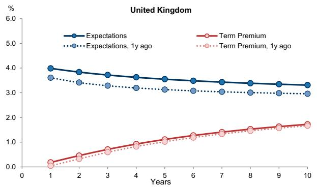

line

| Years | Expectations | Expectations, 1y ago | Term Premium | Term Premium, 1y ago |
|-------|--------------|----------------------|--------------|----------------------|
| 1     | 4.0          | 3.6                  | 0.1          | 0.1                  |
| 2     | 3.9          | 3.5                  | 0.4          | 0.4                  |
| 3     | 3.8          | 3.4                  | 0.7          | 0.7                  |
| 4     | 3.7          | 3.3                  | 1.0          | 1.0                  |
| 5     | 3.6          | 3.2                  | 1.2          | 1.2                  |
| 6     | 3.5          | 3.1                  | 1.4          | 1.4                  |
| 7     | 3.4          | 3.0                  | 1.5          | 1.5                  |
| 8     | 3.4          | 3.0                  | 1.6          | 1.6                  |
| 9     | 3.3          | 2.9                  | 1.7          | 1.7                  |
| 10    | 3.3          | 2.9                  | 1.8          | 1.8                  |

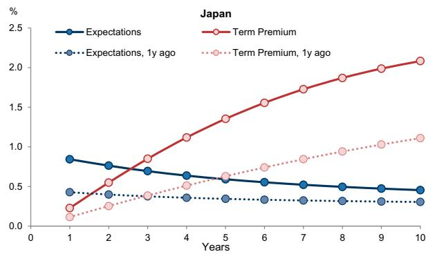

line

| Years | Expectations | Term Premium | Expectations, 1y ago | Term Premium, 1y ago |
|-------|--------------|--------------|----------------------|----------------------|
| 1     | 0.85         | 0.2          | 0.4                  | 0.1                  |
| 2     | 0.75         | 0.55         | 0.35                 | 0.25                 |
| 3     | 0.7          | 0.85         | 0.3                  | 0.35                 |
| 4     | 0.65         | 1.1          | 0.3                  | 0.5                  |
| 5     | 0.6          | 1.35         | 0.3                  | 0.6                  |
| 6     | 0.55         | 1.55         | 0.3                  | 0.7                  |
| 7     | 0.5          | 1.7          | 0.3                  | 0.8                  |
| 8     | 0.45         | 1.85         | 0.3                  | 0.9                  |
| 9     | 0.4          | 2.0          | 0.3                  | 1.0                  |
| 10    | 0.4          | 2.1          | 0.3                  | 1.1                  |

Source: GS Global Investment Research

2026 Trade Recommendations 

<table><tr><td colspan="7">GS Rates Trades</td></tr><tr><td>Active</td><td>Entry Date</td><td>Opened</td><td>Latest</td><td>Stop</td><td>Target</td><td>Performance</td></tr><tr><td>1. Long 3y France, Spain, Italy vs OIS (equally weighted)</td><td>10-Apr-26</td><td>0.33</td><td>0.27</td><td>0.32</td><td>0.23</td><td>+6 bps</td></tr><tr><td>2. Long 3y SOFR swap spread</td><td>17-Apr-26</td><td>-0.226</td><td>-0.211</td><td>-0.255</td><td>-0.180</td><td>+2 bps</td></tr><tr><td>3. 2s5s CAD steepeners</td><td>24-Apr-26</td><td>0.20</td><td>0.20</td><td>0.10</td><td>0.35</td><td>+0 bps</td></tr><tr><td>4. Long 5y5y EUR OIS - HICP</td><td>01-May-26</td><td>1.09</td><td>1.04</td><td>1.22</td><td>0.88</td><td>+5 bps</td></tr><tr><td>5. Long 5y Receivers on 3m 2s5s10s Receiver Fly (bp running)</td><td>08-May-26</td><td>0.01</td><td>0.00</td><td>-0.05</td><td>0.10</td><td>-1 bps</td></tr><tr><td>Closed</td><td>Entry Date</td><td>Closed</td><td>Performance</td><td></td><td></td><td></td></tr><tr><td>1. SFRZ6/Z7 steepeners</td><td>21-Nov-25</td><td>14-Jan-26</td><td>+6bps</td><td></td><td></td><td></td></tr><tr><td>2. Long 10y Gilts on ASW</td><td>21-Nov-25</td><td>30-Jan-26</td><td>+12 bps</td><td></td><td></td><td></td></tr><tr><td>3. Long USD 3m2y A-25 receiver vs short 3m10y A-25 receiver (return in bp running)</td><td>07-Nov-25</td><td>09-Feb-26</td><td>-2 bps</td><td></td><td></td><td></td></tr><tr><td>4. 2s5s CORRA steepener</td><td>16-Jan-26</td><td>13-Feb-26</td><td>+0 bps</td><td></td><td></td><td></td></tr><tr><td>5. Receive AUD 5y5y IRS vs pay NZD 5y5y</td><td>28-Nov-25</td><td>18-Feb-26</td><td>+0 bps</td><td></td><td></td><td></td></tr><tr><td>6. Long 20s on 10s20s30s weighted SOFR fly (weights 0.6x : 2x : 1.4x)</td><td>01-Aug-25</td><td>02-Mar-26</td><td>+6 bps</td><td></td><td></td><td></td></tr><tr><td>7. Long SFIU6</td><td>30-Jan-26</td><td>03-Mar-26</td><td>+7 bps</td><td></td><td></td><td></td></tr><tr><td>8. Long 10y Gilts vs Bunds</td><td>07-Nov-25</td><td>09-Mar-26</td><td>+4 bps</td><td></td><td></td><td></td></tr><tr><td>9. 3m10y A+5/A+20/A+27.5 payer ladders (bp running)</td><td>20-Feb-26</td><td>23-Mar-26</td><td>-5 bps</td><td></td><td></td><td></td></tr><tr><td>10. Long 10y NOK vs SEK</td><td>13-Feb-26</td><td>25-Mar-26</td><td>+20 bps</td><td></td><td></td><td></td></tr><tr><td>11. Long EU 30y on the fly against 30y Austria and Spain</td><td>27-Feb-26</td><td>10-Apr-26</td><td>-5 bps</td><td></td><td></td><td></td></tr><tr><td>12. Long USD 3m 2s10s A+10/A+25 curve cap spread (bp of notional)</td><td>23-Jan-26</td><td>15-Apr-26</td><td>-2 bps</td><td></td><td></td><td></td></tr><tr><td>13. USD 3m3y A-5/A-40 receiver spreads</td><td>13-Mar-26</td><td>30-Apr-26</td><td>-7 bps</td><td></td><td></td><td></td></tr><tr><td>14. Long 10y Inflation Swap vs 0.25x Receive 10y SOFR</td><td>27-Mar-26</td><td>07-May-26</td><td>+15 bps</td><td></td><td></td><td></td></tr><tr><td>15. Pay 10s on 5s10s30s SOFR fly</td><td>09-Jan-26</td><td>08-May-26</td><td>-1 bps</td><td></td><td></td><td></td></tr></table>

Note: Potential profit/loss estimates are given as per unit of duration risk, through yesterday's close.   
Source: GS Global Investment Research

# Global Interest Rates Strategy

# George Cole

+44(20)7552-1214

george.cole@gs.com

GS International

# William Marshall

+1(212)357-0413

william.c.marshall@gs.com

GS & Co. LLC

# Simon Freycenet

+44(20)7774-5017

simon.freycenet@gs.com

GS Bank Europe SE - Paris

Branch

# Isabella Rosenberg

+1(212)357-7628

isabella.rosenberg@gs.com

GS & Co. LLC

# Friedrich Schaper

+1(917)343-3214

friedrich.schaper@gs.com

GS & Co. LLC

# Loic Mathys

+44(20)7051-1664

loic.mathys@gs.com

GS International

# Disclosure Appendix

# Reg AC

We, George Cole, William Marshall, Simon Freycenet, Isabella Rosenberg, Friedrich Schaper and Loic Mathys, hereby certify that all of the views expressed in this report accurately reflect our personal views, which have not been influenced by considerations of the firm's business or client relationships.

Unless otherwise stated, the individuals listed on the cover page of this report are analysts in GS' Global Investment Research division.

Contributing Authors: George Cole GS International, William Marshall GS & Co. LLC, Simon Freycenet GS Bank Europe SE - Paris Branch, Isabella Rosenberg GS & Co. LLC, Friedrich Schaper GS & Co. LLC, Loic Mathys GS International.

Unless otherwise stated, the individuals listed in the Contributing Authors disclosure of this report are analysts in GS' Global Investment Research division.

# Disclosures

# Option Specific Disclosures

Price target methodology: Please refer to the analyst's previously published research for methodology and risks associated with equity price targets.

Pricing Disclosure: Option prices and volatility levels in this note are indicative only, and are based on our estimates of recent mid-market levels (unless otherwise noted). All prices and levels exclude transaction costs unless otherwise stated.

General Options Risks – The risks below and any other options risks mentioned in this research report pertain both to specific derivative trade recommendations mentioned and to discussion of general opportunities and advantages of derivative strategies. Unless otherwise noted, options strategies mentioned in this report may be a combination of the strategies below and therefore carry with them the risks of those strategies.

Buying Options – Investors who buy call (put) options risk loss of the entire premium paid if the underlying security finishes below (above) the strike price at expiration. Investors who buy call or put spreads also risk a maximum loss of the premium paid. The maximum gain on a long call or put spread is the difference between the strike prices, less the premium paid.

Selling Options – Investors who sell calls on securities they do not own risk unlimited loss of the security price less the strike price. Investors who sell covered calls (sell calls while owning the underlying security) risk having to deliver the underlying security or pay the difference between the security price and the strike price, depending on whether the option is settled by physical delivery or cash-settled. Investors who sell puts risk loss of the strike price less the premium received for selling the put. Investors who sell put or call spreads risk a maximum loss of the difference between the strikes less the premium received, while their maximum gain is the premium received.

For options settled by physical delivery, the above risks assume the options buyer or seller, buys or sells the resulting securities at the settlement price on expiry.

# Regulatory disclosures

# Disclosures required by United States laws and regulations

See company-specific regulatory disclosures above for any of the following disclosures required as to companies referred to in this report: manager or co-manager in a pending transaction; 1% or other ownership; compensation for certain services; types of client relationships; managed/co-managed public offerings in prior periods; directorships; for equity securities, market making and/or specialist role. GS trades or may trade as a principal in debt securities (or in related derivatives) of issuers discussed in this report.

The following are additional required disclosures: Ownership and material conflicts of interest: GS policy prohibits its analysts, professionals reporting to analysts and members of their households from owning securities of any company in the analyst's area of coverage. Analyst compensation: Analysts are paid in part based on the profitability of GS, which includes investment banking revenues. Analyst as officer or director: GS policy generally prohibits its analysts, persons reporting to analysts or members of their households from serving as an officer, director or advisor of any company in the analyst's area of coverage. Non-U.S. Analysts: Non-U.S. analysts may not be associated persons of GS & Co. LLC and therefore may not be subject to FINRA Rule 2241 or FINRA Rule 2242 restrictions on communications with a subject company, public appearances and trading in securities covered by the analysts.

# Additional disclosures required under the laws and regulations of jurisdictions other than the United States

The following disclosures are those required by the jurisdiction indicated, except to the extent already made above pursuant to United States laws and regulations. Australia: GS Australia Pty Ltd and its affiliates are not authorised deposit-taking institutions (as that term is defined in the Banking Act 1959 (Cth)) in Australia and do not provide banking services, nor carry on a banking business, in Australia. This research, and any access to it, is intended only for “wholesale clients” within the meaning of the Australian Corporations Act, unless otherwise agreed by GS. In producing research reports, members of Global Investment Research of GS Australia may attend site visits and other meetings hosted by the companies and other entities which are the subject of its research reports. In some instances the costs of such site visits or meetings may be met in part or in whole by the issuers concerned if GS Australia considers it is appropriate and reasonable in the specific circumstances relating to the site visit or meeting. To the extent that the contents of this document contains any financial product advice, it is general advice only and has been prepared by GS without taking into account a client’s objectives, financial situation or needs. A client should, before acting on any such advice, consider the appropriateness of the advice having regard to the client’s own objectives, financial situation and needs. A copy of certain GS Australia and New Zealand disclosure of interests and a copy of GS’ Australian Sell-Side Research Independence Policy Statement are available at: https://www.goldmansachs.com/disclosures/australia-new-zealand/index.html. Brazil: Disclosure information in relation to CVM Resolution n. 20 is available at https://www.gs.com/worldwide/brazil/area/gir/index.html. Where applicable, the Brazil-registered analyst primarily responsible for the content of this research report, as defined in Article 20 of CVM Resolution n. 20, is the first author named at the beginning of this report, unless indicated otherwise at the end of the text. Canada: This information is being provided to you for information purposes only and is not, and under no circumstances should be construed as, an advertisement, offering or solicitation by GS & Co. LLC for purchasers of securities in Canada to trade in any Canadian security. GS & Co. LLC is not registered as a dealer in any jurisdiction in Canada under applicable Canadian securities laws and generally is not permitted to trade in Canadian securities and may be prohibited from selling certain securities and products in certain jurisdictions in Canada. If you wish to trade in any Canadian securities or other products in Canada please contact GS Canada Inc., an affiliate of The GS Group Inc., or another registered Canadian dealer. Hong Kong: Further information on the securities of covered companies referred to in this research may be obtained on request from GS (Asia) L.L.C. India: Further information on the subject company or companies referred to in this research may be obtained from GS (India) Securities Private Limited, Research Analyst - SEBI Registration Number INH000001493, 10th Floor, Ascent-Worli, Sudam Kalu Ahire Marg, Worli, Mumbai-400 025, India, Corporate Identity Number U74140MH2006FTC160634, Phone +91 22 6616 9000, Fax +91 22 6616 9001. GS may beneficially own 1% or more of the securities (as such term is defined in clause 2 (h) the Indian Securities Contracts (Regulation) Act, 1956) of the subject company or companies referred to in this research report. Investment in securities market are subject to market risks. Read all the related documents carefully before investing. Registration granted by SEBI and certification from NISM in no way guarantee performance of the intermediary or provide any assurance of returns to investors. GS (India) Securities Private Limited compliance officer and investor grievance contact details can be found at: https://www.goldmansachs.com/worldwide/india/documents/Grievance-Redressal-and-Escalation-Matrix.pdf, and a copy of the annual audit compliance report can be found at this link: https://publishing.gs.com/content/site/india-annual-compliance-report.html. Japan: See below. Korea: This research, and any access to it, is intended only for “professional investors” within the meaning of the Financial Services and Capital Markets Act, unless otherwise agreed by GS. Further information on the subject company or companies referred to in this research may be obtained from GS (Asia) L.L.C., Seoul Branch. New Zealand: GS New Zealand Limited and its affiliates are neither “registered banks” nor “deposit takers” (as defined in the Reserve Bank of New Zealand Act 1989) in New Zealand. This research, and any access to it, is intended for “wholesale clients” (as defined in the Financial Advisers Act 2008) unless otherwise agreed by GS. A copy of certain GS Australia and New Zealand disclosure of interests is available at: https://www.goldmansachs.com/disclosures/australia-new-zealand/index.html. Russia: Research reports distributed in the Russian Federation are not advertising as defined in the Russian legislation, but are information and analysis not having product promotion as their main purpose and do not provide appraisal within the meaning of the Russian legislation on appraisal activity. Research reports do not constitute a personalized investment recommendation as defined in Russian laws and regulations, are not addressed to a specific client, and are prepared without analyzing the financial circumstances, investment profiles or risk profiles of clients. GS assumes no responsibility for any investment decisions that may be taken by a client or any other person based on this research report. Singapore: GS (Singapore) Pte. (Company Number: 198602165W), which is regulated by the Monetary Authority of Singapore, accepts legal responsibility for this research, and should be contacted with respect to any matters arising from, or in connection with, this research. Taiwan: This material is for reference only and must not be reprinted without permission. Investors should carefully consider their own investment risk. Investment results are the responsibility of the individual investor. United Kingdom: Persons who would be categorized as retail clients in the United Kingdom, as such term is defined in the rules of the Financial Conduct Authority, should read this research in conjunction with prior GS on the covered companies referred to herein and should refer to the risk warnings that have been sent to them by GS International. A copy of these risks warnings, and a glossary of certain financial terms used in this report, are available from GS International on request.

European Union and United Kingdom: Disclosure information in relation to Article 6 (2) of the European Commission Delegated Regulation (EU) (2016/958) supplementing Regulation (EU) No 596/2014 of the European Parliament and of the Council (including as that Delegated Regulation is implemented into United Kingdom domestic law and regulation following the United Kingdom's departure from the European Union and the European Economic Area) with regard to regulatory technical standards for the technical arrangements for objective presentation of investment recommendations or other information recommending or suggesting an investment strategy and for disclosure of particular interests or indications of conflicts of interest is available at https://www.gs.com/disclosures/europeanpolicy.html which states the European Policy for Managing Conflicts of Interest in Connection with Investment Research.

Japan: GS Japan Co., Ltd. is a Financial Instrument Dealer registered with the Kanto Financial Bureau under registration number Kinsho 69, and a member of Japan Securities Dealers Association, Financial Futures Association of Japan Type II Financial Instruments Firms Association, and Investment Management Association of Japan. Sales and purchase of equities are subject to commission pre-determined with clients plus consumption tax. See company-specific disclosures as to any applicable disclosures required by Japanese stock exchanges, the Japanese Securities Dealers Association or the Japanese Securities Finance Company.

# Global product; distributing entities

GS Global Investment Research produces and distributes research products for clients of GS on a global basis. Analysts based in GS offices around the world produce research on industries and companies, and research on macroeconomics, currencies, commodities and portfolio strategy. This research is disseminated in Australia by GS Australia Pty Ltd (ABN 21 006 797 897); in Brazil by GS do Brasil Corretora de Títulos e Valores Mobiliários S.A.; Public Communication Channel GS Brazil: 0800 727 5764 and / or contatogoldmanbrasil@gs.com. Available Weekdays (except holidays), from 9am to 6pm. Canal de Comunicação com o Público GS Brasil: 0800 727 5764 e/ou contatogoldmanbrasil@gs.com. Horário de funcionamento: segunda-feira à sexta-feira (exceto feriados), das 9h às 18h; in Canada by GS & Co. LLC; in Hong Kong by GS (Asia) L.L.C.; in India by GS (India) Securities Private Ltd.; in Japan by GS Japan Co., Ltd.; in the Republic of Korea by GS (Asia) L.L.C., Seoul Branch; in New Zealand by GS New Zealand Limited; in Russia by OOO GS; in Singapore by GS (Singapore) Pte. (Company Number: 198602165W); and in the United States of America by GS & Co. LLC. GS International has approved this research in connection with its distribution in the United Kingdom.

GS International (“GSI”), authorised by the Prudential Regulation Authority (“PRA”) and regulated by the Financial Conduct Authority (“FCA”) and the PRA, has approved this research in connection with its distribution in the United Kingdom.

European Economic Area: GS Bank Europe SE (“GSBE”) is a credit institution incorporated in Germany and, within the Single Supervisory Mechanism, subject to direct prudential supervision by the European Central Bank and in other respects supervised by German Federal Financial Supervisory Authority (Bundesanstalt für Finanzdienstleistungsaufsicht, BaFin) and Deutsche Bundesbank and disseminates research within the European Economic Area.

# General disclosures

This research is for our clients only. Other than disclosures relating to GS, this research is based on current public information that we consider reliable, but we do not represent it is accurate or complete, and it should not be relied on as such. The information, opinions, estimates and forecasts contained herein are as of the date hereof and are subject to change without prior notification. We seek to update our research as appropriate, but various regulations may prevent us from doing so. Other than certain industry reports published on a periodic basis, the large majority of reports are published at irregular intervals as appropriate in the analyst's judgment.

GS conducts a global full-service, integrated investment banking, investment management, and brokerage business. We have investment banking and other business relationships with a sUBStantial percentage of the companies covered by Global Investment Research. GS & Co. LLC, the United States broker dealer, is a member of SIPC (https://www.sipc.org).

Our salespeople, traders, and other professionals may provide oral or written market commentary or trading strategies to our clients and principal trading desks that reflect opinions that are contrary to the opinions expressed in this research. Our asset management area, principal trading desks and investing businesses may make investment decisions that are inconsistent with the recommendations or views expressed in this research.

We and our affiliates, officers, directors, and employees will from time to time have long or short positions in, act as principal in, and buy or sell, the securities or derivatives, if any, referred to in this research, unless otherwise prohibited by regulation or GS policy.

The views attributed to third party presenters at GS arranged conferences, including individuals from other parts of GS, do not

necessarily reflect those of Global Investment Research and are not an official view of GS.

Any third party referenced herein, including any salespeople, traders and other professionals or members of their household, may have positions in the products mentioned that are inconsistent with the views expressed by analysts named in this report.

This research is focused on investment themes across markets, industries and sectors. It does not attempt to distinguish between the prospects or performance of, or provide analysis of, individual companies within any industry or sector we describe.

Any trading recommendation in this research relating to an equity or credit security or securities within an industry or sector is reflective of the investment theme being discussed and is not a recommendation of any such security in isolation.

This research is not an offer to sell or the solicitation of an offer to buy any security in any jurisdiction where such an offer or solicitation would be illegal. It does not constitute a personal recommendation or take into account the particular investment objectives, financial situations, or needs of individual clients. Clients should consider whether any advice or recommendation in this research is suitable for their particular circumstances and, if appropriate, seek professional advice, including tax advice. The price and value of investments referred to in this research and the income from them may fluctuate. Past performance is not a guide to future performance, future returns are not guaranteed, and a loss of original capital may occur. Fluctuations in exchange rates could have adverse effects on the value or price of, or income derived from, certain investments.

Certain transactions, including those involving futures, options, and other derivatives, give rise to sUBStantial risk and are not suitable for all investors. Investors should review current options and futures disclosure documents which are available from GS sales representatives or at https://www.theocc.com/about/publications/character-risks.jsp and https://www.goldmansachs.com/disclosures/cftc\_fcm\_disclosures. Transaction costs may be significant in option strategies calling for multiple purchase and sales of options such as spreads. Supporting documentation will be supplied upon request.

Differing Levels of Service provided by Global Investment Research: The level and types of services provided to you by GS Global Investment Research may vary as compared to that provided to internal and other external clients of GS, depending on various factors including your individual preferences as to the frequency and manner of receiving communication, your risk profile and investment focus and perspective (e.g., marketwide, sector specific, long term, short term), the size and scope of your overall client relationship with GS, and legal and regulatory constraints. As an example, certain clients may request to receive notifications when research on specific securities is published, and certain clients may request that specific data underlying analysts' fundamental analysis available on our internal client websites be delivered to them electronically through data feeds or otherwise. No change to an analyst's fundamental research views (e.g., ratings, price targets, or material changes to earnings estimates for equity securities), will be communicated to any client prior to inclusion of such information in a research report broadly disseminated through electronic publication to our internal client websites or through other means, as necessary, to all clients who are entitled to receive such reports.

All research reports are disseminated and available to all clients simultaneously through electronic publication to our internal client websites. Not all research content is redistributed to our clients or available to third-party aggregators, nor is GS responsible for the redistribution of our research by third party aggregators. For research, models or other data related to one or more securities, markets or asset classes (including related services) that may be available to you, please contact your GS representative or go to https://research.gs.com.

Disclosure information is also available at https://www.gs.com/research/hedge.html or from Research Compliance, 200 West Street, New York, NY 10282.

# © 2026 GS.

You are permitted to store, display, analyze, modify, reformat, and print the information made available to you via this service only for your own use. You may not resell or reverse engineer this information to calculate or develop any index for disclosure and/or marketing or create any other derivative works or commercial product(s), data or offering(s) without the express written consent of GS. You are not permitted to publish, transmit, or otherwise reproduce this information, in whole or in part, in any format to any third party without the express written consent of GS. This foregoing restriction includes, without limitation, using, extracting, downloading or retrieving this information, in whole or in part, to train or finetune a machine learning or artificial intelligence system, or to provide or reproduce this information, in whole or in part, as a prompt or input to any such system.