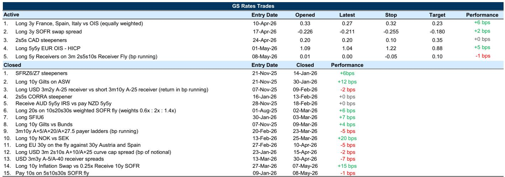
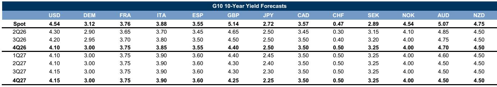

# Global Duration Is No Longer a Simple Hedge: The Case for Selective, Structured Exposure

The fundamental relationship that has anchored portfolio construction for decades—that Treasuries provide reliable diversification during risk-off episodes—has broken down. Since late February, the one-month rolling correlation between 10-year UST yield changes and equity returns has reached its most negative level in multiple decades, meaning bonds and stocks are now falling together. This is not a temporary aberration; it is a structural consequence of a regime shift in which supply-side shocks, not demand weakness, drive both inflation and growth uncertainty. Investors who continue to treat duration as a straightforward hedge are carrying a false sense of protection.

The report from a global investment bank makes a subtle but critical argument: the very factors that have degraded duration's near-term hedging properties are simultaneously improving its medium-term value proposition. This paradox is the central strategic challenge for rates investors today. The introduction of inflation risk premia into the UST curve—a feature conspicuously absent earlier in the conflict—combined with the optimism already priced into risk markets, means that duration now offers genuine value as a hedge against deeper downside tails. But getting from here to there requires navigating a period where any rally is likely to be either painfully gradual or contingent on an adverse energy price spike that first reopens growth concerns.

The implication is clear: outright long duration positions are too blunt an instrument for the current environment. What is needed instead is structured exposure that limits downside in further selloffs while preserving the ability to benefit from the medium-term hedge value that is quietly building. The report's framework for thinking about this trade-off, applied across the US, Europe, and the UK, reveals a market that is running out of patience with conventional approaches.

## Global Spillovers, Not Domestic Impulses, Are Driving the UST Selloff—But That Does Not Make It Easier to Fight

The break above 4.5% on the 10-year and 5.0% on the 30-year UST yield has occurred against a backdrop of synchronized upward pressure across developed market long-end yields. When UST 30-year yields last exceeded 5% in the third quarter of 2025, the average of UK, German, and Japanese 30-year yields has risen by approximately 50 basis points. This is not an isolated US phenomenon. The report's estimate of global spillovers suggests that the year-to-date selloff in USTs has largely reflected bearish shocks originating from the UK and Japan.

This global dimension matters for strategic positioning. It means that a domestic-focused narrative—whether centered on Fed policy expectations, fiscal concerns, or growth data—is insufficient to explain the scale of the move. More importantly, it implies that achieving lasting relief in USTs requires a shift in the macro picture that simultaneously addresses the drivers of higher yields in the UK and Japan. For the UK, that means restoring conviction in a path toward lower policy rates. For Japan, it means validating the gradual approach to tightening. Neither is imminent.

The temptation is to interpret the global nature of the selloff as a reason to fade it—to assume that because the move is broad, it is overdone. The report cautions against this reasoning. Instead, the synchronization underscores the near-term challenges to any meaningful rally without a material change in the macro backdrop. The selloff is not a mispricing to be exploited; it is a reflection of a genuinely higher equilibrium for term premia across markets. The strategic implication is that fighting the trend with outright long positions is likely to be costly, even if the medium-term value case is improving.

## The Inflation Risk Premium Is Finally Being Priced, but the Case for Inflation Hedges Has Become Two-Sided

One of the most significant developments in the rates market is the belated catch-up of inflation forwards to the reset higher in oil prices. For much of the early phase of the conflict, inflation forwards lagged the move in energy prices. That gap has now closed. The report notes that the economic rationale for pricing persistently higher inflation over the coming years on the current supply shock is weak, particularly given the labor market backdrop. Yet the return of supply-side volatility and the sanguine growth tone in markets both argue for more risk premium through the inflation curve.

This creates a nuanced situation. Inflation forwards are no longer cheap relative to oil prices, and the report now sees a less clear case for using inflation longs as a hedge. The risks have become more two-sided. On one hand, the possibility that storage drawdowns and demand destruction reach their limits around summer, should the Hormuz disruption persist beyond June, could push energy prices higher and force further upward repricing of inflation expectations. On the other hand, the anticipatory growth optimism that has supported risk assets could pull back, leading to a slight decline in inflation forwards from current levels.

The report also flags an underappreciated channel: the AI buildout phase is already pushing up costs. The bank's economists estimate roughly half a percentage point boost to producer price inflation from AI-related investment, before any productivity gains materialize to deliver disinflation. This adds a structural layer to the inflation outlook that is independent of the conflict dynamics. For investors, the implication is that inflation hedging strategies need to be more surgical. The straightforward long inflation position that worked earlier in the cycle is no longer a clear winner. The value now lies in being selective about which parts of the curve to hedge and in recognizing that the inflation risk premium, while real, may be approaching levels that already discount a reasonably adverse outcome.

## European Front-End Rates Face a High Hurdle for Tightening, but No News on Energy Flows Keeps Pressure On

In Europe, the report's analysis centers on a tension between valuation and catalyst. Forward HICP pricing is now close to the bank's model-implied fair value, suggesting the market is already pricing a reasonable degree of passthrough from headline to core inflation. This makes risk-reward more balanced in the European front-end. Yet the absence of positive news on commodity flows via the Strait of Hormuz means that EUR yields and HICP pricing continue to drift higher. The market is effectively pricing in a continuation of the current supply disruption, with no premium for a resolution.

The report identifies a high hurdle for sUBStantial tightening—100 basis points or more—from the European Central Bank. This implies that front-end volatility is too high relative to the plausible range of policy outcomes. The strategic opportunity, therefore, is not in taking a directional view on rates but in harvesting carry through sovereign credit positions. The report continues to recommend long positions in Italian, Spanish, and French government bonds versus OIS, but with tighter stops given the strong recent performance.

The key variable to watch is the upcoming flash PMI data. While the headline growth numbers will attract attention, the price components are equally important. If the PMI data show signs of softening in the services sector, it could provide the catalyst for a modest relief rally in front-end rates, even without progress on the energy front. Conversely, if price components remain elevated, the drift higher in yields is likely to continue, and the risk of a more disorderly repricing increases. The European market is in a holding pattern, waiting for either a resolution to the supply disruption or evidence that the growth outlook is deteriorating enough to offset the inflation impulse.

## UK Gilt Risk Premium Is Emerging Belatedly, and the Real Driver Will Be Inflation and Monetary Policy Outcomes

The UK market presents a particularly instructive case study in the lag between political uncertainty and term premium repricing. Despite an increase in political uncertainty early in the week, it took a global selloff to shift Gilt risk premium higher. The UK curve steepened, and the bank's proxy for political risk premium in sterling—the gap between actual and model-implied EUR/GBP performance—has risen. Yet overall stress on UK assets has been more modest than in comparable historical periods. The report's term premium measure remains contained, and the spillover framework shows that the UK has not been contributing to upward pressure on global rates until very recently.

This delayed reaction is consistent with the stability in Gilt swap spreads and the 10s30s curve relative to other G4 markets since last year's budget. The report suggests that some of the structural drivers of UK term premium—specifically Bank of England quantitative tightening and the rise in duration-adjusted free float—may have already been priced. This does not mean the UK is immune to further repricing, but it does imply that the marginal driver of Gilt yields going forward will be inflation and monetary policy outcomes, not political uncertainty per se.

The report's conclusion is direct: lower 10-year Gilt yields are likely to be driven by a lower policy path. For this reason, the report favors front-end longs versus belly underweights. This is a tactical expression of a strategic view: that the path to a sustainable rally in Gilts runs through the Bank of England delivering rate cuts, not through a reduction in political risk. The implication for investors is that the UK offers a cleaner expression of the global theme—duration is most valuable at the front end, where it is most directly tied to policy expectations, and least valuable in the belly, where term premium dynamics are more uncertain.

## What the Report Does Not Fully Answer: The Path from Here to a Sustainable Rally

The report is admirably clear about what it knows and what it does not. Several critical questions remain unresolved, and investors should be aware of these gaps when constructing their own views.

First, the report identifies that inflation forwards have caught up to oil prices but does not provide a clear framework for how this relationship evolves if the conflict escalates further. If energy prices spike sharply, do inflation forwards re-anchor at a higher level, or does the growth destruction channel dominate, causing a collapse in breakevens? The report hints at the latter possibility but does not quantify the threshold at which the trade-off flips.

Second, the analysis of global spillovers is powerful but incomplete. The report attributes the UST selloff to bearish shocks from the UK and Japan, but it does not fully explore the reverse channel. If UST yields continue to rise, what is the feedback loop into UK and Japanese yields? The synchronization that has driven yields higher could just as easily amplify a selloff, creating a self-reinforcing cycle that the report's framework does not fully capture.

Third, the report's recommendation for structured exposure that limits downside is strategically sound but operationally vague. What specific structures does the report have in mind? Put spreads on long duration? Bear flattener positions? The report leaves the implementation details to the reader, which is appropriate for a research document but leaves a gap for investors seeking actionable trade ideas.

Finally, the report does not address the question of timing. The medium-term case for duration is improving, but the near-term headwinds are formidable. The report acknowledges this tension but does not provide a clear catalyst calendar or a framework for determining when the balance shifts from near-term pain to medium-term gain. Investors are left to make this judgment themselves, which is the most challenging part of the current environment.

## A Decision Framework for Positioning in an Environment Where Duration Is Both Broken and Valuable

The report's strategic logic can be synthesized into a decision framework that helps investors navigate the current paradox. The framework has three dimensions: time horizon, source of risk, and expression structure.

For time horizon, the key distinction is between the next one to two months and the next six to twelve months. In the near term, the report's analysis suggests that outright long duration positions are vulnerable. The global spillover dynamic is unlikely to reverse quickly, the inflation risk premium is still being priced, and the catalyst for a rally—either a de-escalation of the conflict or a material deterioration in growth—is not imminent. For near-term positioning, the focus should be on structures that limit downside in further selloffs, such as put spreads on long duration or bear flatteners that benefit from a steeper curve without taking outright directional risk.

For the medium term, the report's analysis becomes more constructive. The introduction of inflation risk premia and the optimism priced into risk markets mean that duration is becoming a more attractive hedge against downside tails. The key is to be positioned to add long duration exposure when the conditions are right. The report suggests two potential catalysts: a deeper selloff that more durably challenges the risk asset trend, or credible relief on the energy front that restores the traditional negative correlation between bonds and equities.

For source of risk, the framework distinguishes between supply-driven and demand-driven risks. The current environment is dominated by supply shocks—energy disruptions, AI-related cost pressures, and geopolitical uncertainty. In a supply-shock regime, traditional duration hedging is less effective because bonds and equities can fall together. The report's analysis suggests that inflation-linked instruments and curve steepeners are more appropriate hedges in this regime than outright nominal duration.

For expression structure, the report's recommendations across markets point to a common theme: favor front-end duration over belly and long-end exposure. In the US, this means focusing on the 2-year to 5-year part of the curve, where policy expectations are the dominant driver. In Europe, it means sovereign credit carry versus OIS, with tight stops. In the UK, it means front-end longs versus belly underweights. The common thread is that the front end offers a cleaner expression of the policy outlook, while the belly and long end are more exposed to the term premium uncertainty that the report identifies as the key risk.

## The Analytical Frontier: Why This Report Deserves a Close Read and a Broader Discussion

The report from which this analysis is drawn is not a typical rates strategy piece. It is a strategic document that forces investors to reconsider the most fundamental assumption in fixed income portfolio construction: that duration provides reliable diversification. The report's central insight—that the breakdown of the bond-equity correlation is not a temporary anomaly but a reflection of a regime shift—has implications that extend far beyond the rates market. It affects asset allocation, risk management, and the very definition of what constitutes a prudent portfolio.

Yet the report also leaves important questions unanswered. How does the breakdown of the bond-equity correlation evolve if the conflict escalates further? What is the threshold at which the medium-term value of duration becomes compelling enough to override the near-term headwinds? How should investors think about the trade-off between the inflation risk premium that is being priced and the growth risks that are being ignored? These are not gaps in the analysis; they are the natural frontiers of a rapidly evolving market environment.

For investors who want to engage with these questions at a deeper level, the full report provides the original charts and data that underpin the analysis. The exhibits on global yield synchronization, the correlation breakdown between bonds and equities, and the inflation forward dynamics are essential reference points for anyone constructing a rates strategy in the current environment. The report also contains detailed analysis of the Bank of Canada minutes, the UK fiscal outlook, and the European PMI data that are not fully covered in this article.

Join the community to read the full report and review the original charts.

*This article is for learning and discussion only and does not constitute investment advice.*

Personal reading notes and learning share only. Not investment advice.

