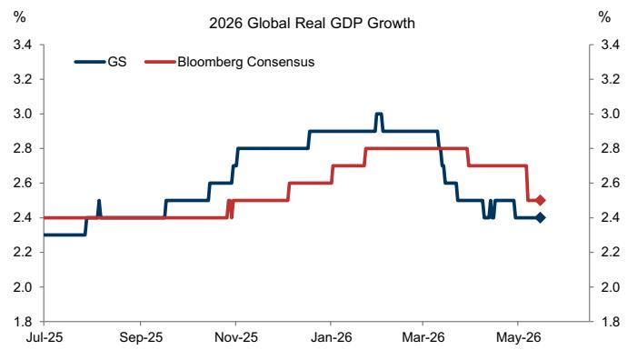
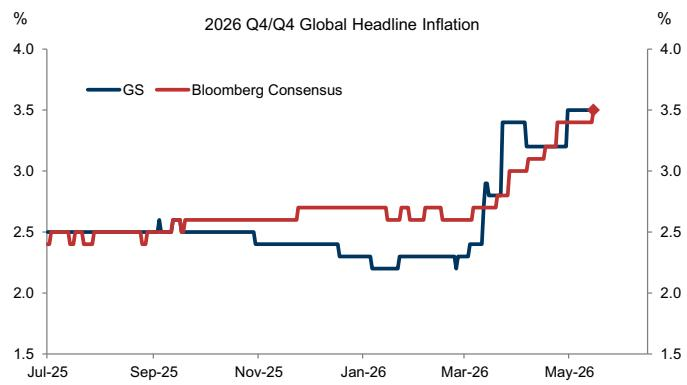
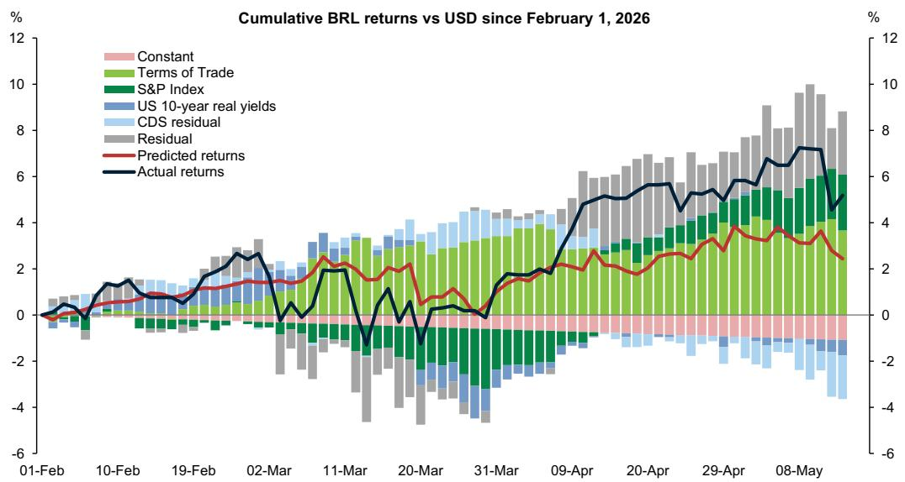
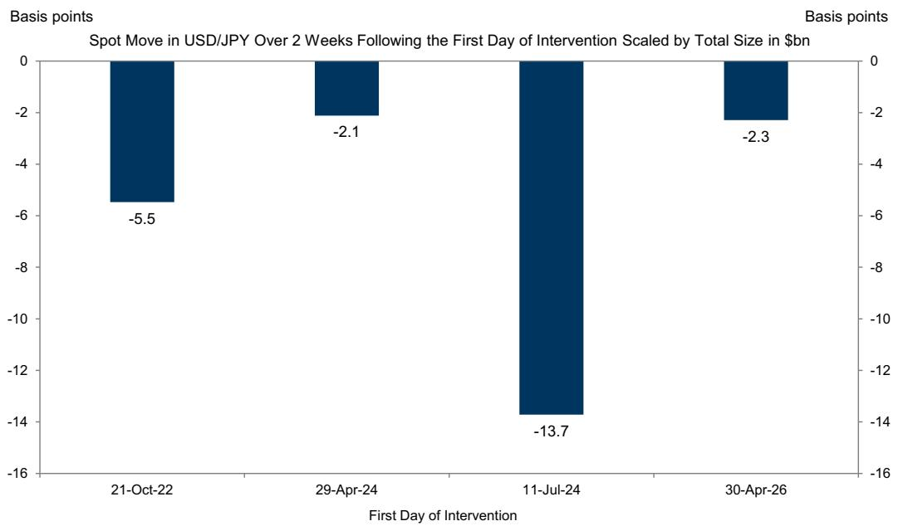
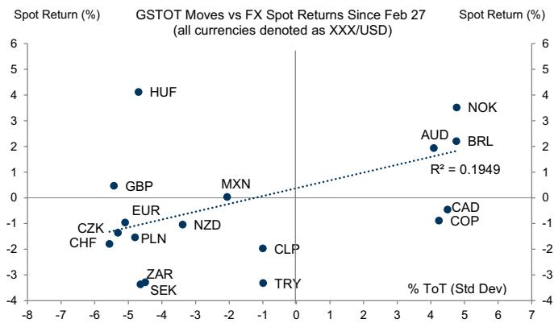
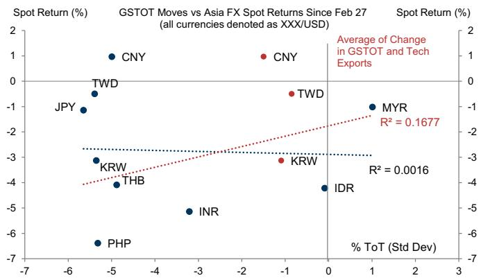
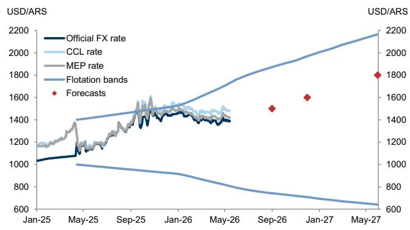
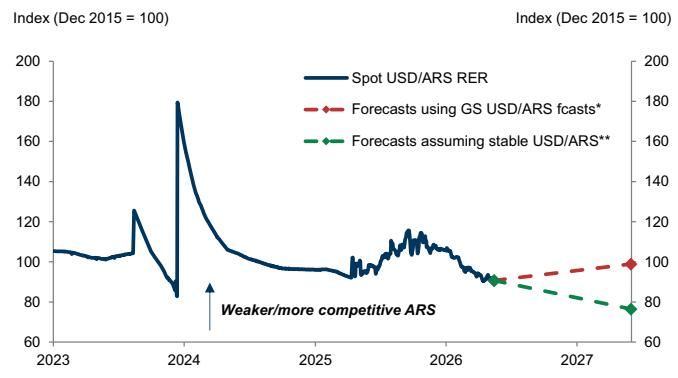
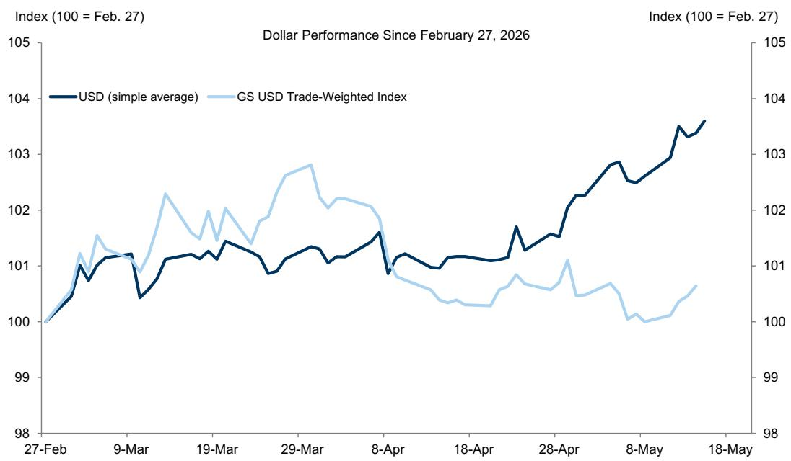

GLOBAL FX TRADER

Underneath It All

# Our thoughts on USD, GBP, BRL, JPY, Terms of Trade, HUF, ARS, and Dollar Drivers.

USD: Two shocks at the same time. While the broad Dollar is close to flat over the last few months, that obscures larger shifts under the surface and quietly building Dollar appreciation pressure. We have been emphasizing that terms of trade have been a key differentiator for FX returns in this more divided Dollar environment, and it is increasingly clear that two major forces—the energy shock and AI-driven demand—are responsible for the shortages causing that move (more in the ToT bullet below). Our economists have laid out how these factors have opposing effects on growth—we think the AI boom is one reason why global growth has slowed only moderately so far despite a longer disruption to global energy flows—but reinforce each other on the inflation side, at least in the near term. This is consistent with the direction of our macro forecasts: our global growth expectations have been roughly stable since the middle of March (Exhibit 1), despite a longer conflict, while inflation projections have continued to drift higher (Exhibit 2). We think this helps explain the Dollar’s strength over the last week following upside US inflation surprises that helped push global bond yields higher. Still-restricted energy flows, with limited relevant macro news from the Trump-Xi summit, have helped put these vulnerabilities—and the Dollar’s relative insulation—back into focus. We have attributed the more range-bound Dollar to the fact that it is caught between the more cyclical, commodity-forward currencies on the one hand and more stringent FX management on the other. As this past week has demonstrated, we think the clearest risk for a stronger Dollar is if a wider energy shock begins to pressure growth, policy, and prospective returns in other developed countries, particularly Europe.

Kamakshya Trivedi

+44(20)7051-4005

kamakshya.trivedi@gs.com

GS International

Michael Cahill

+44(20)7552-8314

michael.e.cahill@gs.com

GS International

Danny Suwanapruti

+65-6889-1987

danny.suwanapruti@gs.com

GS (Singapore) Pte

Teresa Alves

+44(20)7051-7566

teresa.alves@gs.com

GS International

Karen Reichgott Fishman

+1(212)855-6006

karen.fishman@gs.com

GS & Co. LLC

Stuart Jenkins

+44(20)7051-4700

stuart.jenkins@gs.com

GS International

Victor Engel

+44(20)7051-3862

victor.engel@gs.com

GS International

Lexi Kanter

+1(212)855-9701

alexandra.kanter@gs.com

GS & Co. LLC

Exhibit 1: Our global growth expectations have been roughly stable since the middle of March...   

line

| Date   | GS    | Bloomberg Consensus |
|--------|-------|---------------------|
| Jul-25 | 2.3   | 2.4                 |
| Sep-25 | 2.5   | 2.4                 |
| Nov-25 | 2.8   | 2.5                 |
| Jan-26 | 3.0   | 2.7                 |
| Mar-26 | 2.9   | 2.8                 |
| May-26 | 2.4   | 2.5                 |

Source: Bloomberg, GS Global Investment Research

Exhibit 2: ...while inflation projections have continued to drift higher   

line

| Date   | GS   | Bloomberg Consensus |
|--------|------|---------------------|
| Jul-25 | 2.5  | 2.5                 |
| Sep-25 | 2.5  | 2.5                 |
| Nov-25 | 2.5  | 2.5                 |
| Jan-26 | 2.5  | 2.5                 |
| Mar-26 | 2.5  | 2.5                 |
| May-26 | 3.5  | 3.5                 |

Source: Bloomberg, GS Global Investment Research

GBP: Pressures coming together. UK political newsflow has picked up following last week's local elections and, as is often the case, a rise in political uncertainty has been accompanied by FX underperformance. Heading into this week, we saw relatively little risk premium in the currency, with EUR/GBP moving closely in line with our GSBEER model of cyclical fundamentals. That has changed in recent days, with the cross now incorporating about 1ppt of fiscal premium according to this model, but the newly reintroduced premium is still light compared to most of last year when it regularly traded about $2\%$ above its fitted value (Exhibit 3). We think that represents a reasonable near-term target at least until there is more clarity on the policy plans. What would follow a leadership transition, and whether it would see any material shift in fiscal policy, also remains far from clear. In this context, it is worth noting that prediction market pricing of a leadership transition by year-end has already been elevated for some time, so we attribute the recent underperformance mostly to a narrowing in the timeline, as well as the confluence of realising this political pressure with macro factors that are already challenging the UK fiscal outlook at this point. Our economists note that the macro repercussions of the energy shock have already driven a further erosion of fiscal headroom, and energy futures have continued to move higher for the rest of the year. This presents a more durable risk to Sterling, and can also amplify the pass-through from political uncertainty relative to last year. It is also less clear to us that recent sources of Sterling resilience, namely a sharp rebound in global risk sentiment and larger-than-usual cross-border M&A inflows, can remain as supportive as they have been over the past few weeks. On net, we continue to see near-term upside risks to EUR/GBP from these levels, but with clearer value versus the forwards in Sterling downside versus the likes of AUD or USD over the coming months, which offer exposure to further terms of trade differentiation from the energy shock, as well as to domestic UK macro and premium risks.

Exhibit 3: Recent divergence between actual and model-implied EUR/GBP demonstrates a partial reintroduction of political premium in Sterling   

line

| Date     | EUR/GBP Actual | EUR/GBP Fitted | Nominal 2y Rate Differential | Credit Spreads | Nominal 2y Rate Differential | Constant |
|----------|----------------|----------------|-------------------------------|----------------|------------------------------|----------|
| 1-Jan    | -0.8           | -0.3           | -0.6                          | -0.1           | -0.7                         | -0.1     |
| 15-Jan   | -0.6           | -0.2           | -0.5                          | -0.1           | -0.6                         | -0.1     |
| 29-Jan   | -0.4           | -0.1           | -0.4                          | -0.1           | -0.5                         | -0.1     |
| 12-Feb   | -0.2           | 0.0            | -0.3                          | -0.1           | -0.4                         | -0.1     |
| 26-Feb   | 0.5            | 0.3            | 0.2                           | 0.1            | 0.2                          | 0.1      |
| 12-Mar   | -0.8           | -0.5           | -0.7                          | -0.2           | -0.6                         | -0.2     |
| 26-Mar   | -1.2           | -0.8           | -1.5                          | -0.3           | -1.3                         | -0.3     |
| 9-Apr    | -0.6           | -0.4           | -0.9                          | -0.2           | -0.8                         | -0.2     |
| 23-Apr   | -0.8           | -0.6           | -1.1                          | -0.3           | -1.0                         | -0.3     |
| 7-May    | -1.5           | -1.2           | -1.8                          | -0.4           | -1.6                         | -0.4     |

Source: GS FICC and Equities, GS Global Investment Research

BRL: Caught in a noise slide. After outperforming for most of the year, the Real has been a clear underperformer this week. Today's BRL depreciation likely reflects the broader decline in risk sentiment amid heavy long positioning. But domestic developments were the key driver earlier in the week when a media report regarding presidential candidate Flavio Bolsonaro drove USD/BRL more than 2% higher. The last time election-related headlines drove BRL weaker in December 2025, we noted that Real underperformance relative to other market developments was contained, and that it was difficult to gauge effectively what different developments meant for the election outcomes so far in advance. As these developments come closer to the election date (the first round is on October $4^{\text{th}}$ ), their impact could be more meaningful, especially given crowded positioning. Still, we think that the implications for polling and the odds of different election outcomes are what will ultimately matter for BRL. Recent reports suggest a growing lead for President Lula in the latest tracking, but there is limited information for now. While BRL will likely be responsive to any shift in election odds, we would also note that most of the Real's year-to-date appreciation has been driven by global factors and not domestic premium shifts. Using our cyclical model, we find that BRL's typical beta to Brazil's terms of trade and US equity performance explains most of its performance over the past few months (Exhibit 4). Instead, our proxy for Brazil-specific risk (a residual of Brazil's CDS after stripping out the impact of the other model inputs) has seen more limited moves this year. All in, BRL's performance looks broadly aligned with the model's inputs. Looking ahead, the lack of a large outperformance gap would suggest BRL is not as vulnerable in a less favourable backdrop beyond what its typical betas would imply. Here, an environment of higher-for-longer energy prices is a structural tailwind for the Real, but increasing political noise and weaker global risk sentiment could weigh on performance over the near-term.

Exhibit 4: The Real's typical beta to Brazil's terms of trade and US equity performance explains most of its performance over the past few months   

line

| Date     | Actual returns | Predicted returns | CDS residual | Residual | US 10-year real yields | S&P Index | Terms of Trade |
|----------|----------------|-------------------|--------------|----------|------------------------|-----------|----------------|
| 01-Feb   | 0.0            | 0.0               | 0.0          | 0.0      | 0.0                    | 0.0       | 0.0            |
| 10-Feb   | 0.5            | 0.3               | 0.2          | 0.4      | 0.1                    | 0.2       | 0.3            |
| 19-Feb   | 1.0            | 0.6               | 0.4          | 0.7      | 0.3                    | 0.5       | 0.6            |
| 02-Mar   | 1.5            | 0.8               | 0.6          | 1.0      | 0.5                    | 0.7       | 0.8            |
| 11-Mar   | -1.0           | -0.5              | -0.3         | -0.8     | -1.2                   | -0.6      | -1.1           |
| 20-Mar   | -2.0           | -1.5              | -1.2         | -1.8     | -2.5                   | -1.8      | -2.2           |
| 31-Mar   | -1.5           | -1.0              | -0.8         | -1.5     | -2.0                   | -1.5      | -1.8           |
| 09-Apr   | 2.0            | 1.5               | 1.0          | 1.5      | 1.0                    | 1.2       | 1.4            |
| 20-Apr   | 3.0            | 2.5               | 1.8          | 2.5      | 1.8                    | 2.0       | 2.2            |
| 29-Apr   | 4.0            | 3.5               | 2.5          | 3.5      | 2.5                    | 2.8       | 3.0            |
| 08-May   | 5.0            | 4.5               | 3.5          | 4.5      | 3.5                    | 3.8       | 4.2            |
|        |                |                   |              |          |                        |           |                |

BRL returns series displayed until May 14, 2026. Sensitivities estimated on weekly data over last 18 months

Source: Bloomberg, GS Global Investment Research

JPY: Not enough. The Yen weakened versus the Dollar over the past week, reflecting the continued depreciation pressures on the currency despite recent intervention. The comments by FM Katayama and Secretary Bessent following their meeting in Tokyo disappointed hopes for any sign of more active support from the US and stopped short of explicitly endorsing the latest intervention. The biggest headwind to JPY, however, continues to be the broader backdrop of elevated oil prices, US growth outperformance, higher-for-longer rates, and constructive risk sentiment—each of which tend to push up USD/JPY. Currency-negative fundamentals likely explain what appears to be the smaller impact of intervention on USD/JPY per \$bn over the two weeks since April 30 compared to the interventions in October 2022 and July 2024, when macro conditions were also pushing in the same direction (Exhibit 5). Prior interventions are not exactly comparable since the operations were done on two consecutive days rather than over the course of several days, like in this latest episode, and we estimate its total size based on the BoJ's funds supply/demand data since the official intervention data have not yet been released. But this exercise broadly reinforces our view that the 2026 intervention most closely echoes April 2024 and its less sustained impact versus other rounds. Even hawkish comments from BoJ board member Masu on Thursday struggled to support the currency. While we have said that faster and steeper hikes by the BoJ would be a meaningful catalyst for sustained Yen strength, an exceptionally gradual hiking cycle, including a hike in June hike that is already nearly 80% priced, would likely not be enough to dominate other factors—just as the hike in December that was pulled forward from January did little to halt Yen weakness thereafter. Overall, we continue to be skeptical that intervention can be successful in driving USD/JPY sustainably lower without a shift towards greater recession concerns or much more hawkish BoJ

policy.

Exhibit 5: Currency-negative fundamentals likely explain what appears to be the smaller impact of intervention on USD/JPY since April 30   

bar

Spot Move in USD/JPY Over 2 Weeks Following the First Day of Intervention Scaled by Total Size in $bn
| First Day of Intervention | Basis points |
| :--- | :--- |
| 21-Oct-22 | -5.5 |
| 29-Apr-24 | -2.1 |
| 11-Jul-24 | -13.7 |
| 30-Apr-26 | -2.3 |

Source: GS Global Investment Research, BoJ, Bloomberg

ToT: Dealing with a double shock. We have been arguing that terms of trade have been a key driver of FX returns since the start of the energy shock. And we have been emphasizing that moves in Dollar crosses understate terms of trade dynamics compared to near-neighbor crosses like NOK/SEK, AUD/NZD, and BRL/CLP, which have moved much further. We attribute part of the broad Dollar's more muted response to this conflict to the fact that its impact has fallen most severely on less central US trading partners and those with heavily-managed currencies—particularly in Asia. Indeed, we find that Asia FX returns have tracked terms of trade moves less closely than elsewhere in EM and the G10 (Exhibit 6). Besides more stringent currency management, this also reflects that commodity terms of trade do not capture the recent boost from higher-value tech exports, overstating the deterioration for the likes of KRW, TWD, and CNY; we find that incorporating tech exports alongside commodity terms of trade better explains recent Asia FX performance (Exhibit 7). More broadly, we find FX returns over shorter horizons have tracked less well with changes in terms of trade than they have over the entirety of the conflict period. This seems in part due to the fact commodity exporters like AUD have seen asymmetric outperformance on days when energy prices increase. We think this dynamic helps reveal investor sentiment and an expectation that the current environment should remain one of higher-for-longer energy prices. And though we expect that commodity exporters would see relative underperformance on a sustained de-escalation, terms of trade should remain relevant in the more medium term. Beyond any initial relief, the more lasting inflation and growth impacts these ToT shifts help capture should continue to influence FX returns over time, leaving us most constructive on currencies with both commodity and cyclical

exposure.

Exhibit 6: Asia FX returns have tracked terms of trade moves less closely than elsewhere in EM and the G10   

scatter

| Currency | Spot Return (%) | % ToT (Std Dev) |
|----------|-----------------|-----------------|
| HUF      | 4.0             | -               |
| GBP      | 0.5             | -               |
| EUR      | -1.0            | -               |
| NZD      | -1.5            | -               |
| MXN      | 0.0             | -               |
| ZAR      | -3.5            | -               |
| SEK      | -3.0            | -               |
| CHF      | -2.0            | -               |
| CZK      | -1.5            | -               |
| PLN      | -1.8            | -               |
| CLP      | -2.5            | -               |
| TRY      | -3.2            | -               |
| NOK      | 3.5             | 4.0             |
| AUD      | 2.0             | 2.5             |
| BRL      | 2.5             | 3.0             |
| CAD      | -0.5            | 4.5             |
| COP      | -1.0            | 5.0             |
| CAND     | -1.2            | 5.5             |
| MXN      | -2.0            | 6.0             |
| EUR      | -1.2            | 6.5             |
| NZD      | -1.8            | 7.0             |
| CHF      | -2.2            | 7.5             |
| ZAR      | -3.0            | 8.0             |
| SEK      | -3.5            | 8.5             |

Source: GS Global Investment Research, GS FICC and Equities

Exhibit 7: Incorporating tech exports alongside commodity terms of trade better explains recent Asia FX performance   

scatter

| Currency | Spot Return (%) | % ToT (Std Dev) |
|----------|-----------------|-----------------|
| CNY      | 1.0             | -               |
| TWD      | -1.0            | -               |
| JPY      | -1.0            | -               |
| THB      | -4.0            | -               |
| KRW      | -3.0            | -               |
| PHP      | -6.0            | -               |
| INR      | -5.0            | -               |
| IDR      | -4.0            | -               |
| MYR      | -1.0            | -               |
| TWD      | -0.5            | -               |
| KRW      | -3.0            | -               |
| IDR      | -4.0            | -               |

Source: Haver Analytics, GS Global Investment Research, GS FICC and Equities

HUF: More gradual, but still asymmetric. The HUF appreciation trend has stalled over the last week due to both local and global factors, including rising energy prices. On the domestic front, the MNB lowered its FX swap implied rate from 5.75% to 5.25% this week, Citing ‘improving market conditions’. We view this action through two lenses. First, we think that the recent decline in risk premium (HUF appreciation and declining yields) has allowed the MNB to consider resuming its cutting cycle, as comments by Deputy Governor Kurali earlier in the month also indicated. Second, there is likely some resistance to a sharp currency move that is not accompanied by inflows into local bonds, rather than pushback against the direction itself. We continue to think that a stronger Forint is key in helping to lower inflation to meet the Maastricht convergence criteria, but that the speed of the moves may be more gradual from here (we set our 3-month forecast for EUR/HUF at 355 on April 17). That said, the Forint should remain responsive to positive headlines, for instance in relation to EU fund disbursement. Moreover, inflows into local bonds would be an additional tailwind for HUF, alongside the EU fund inflows and the broader improvement in economic fundamentals. When considering the impact of MNB rate cuts on HUF, we note that the FX ‘beta’ to rate differentials has historically been negative in Hungary (that is, a lower rate differential is associated with a stronger HUF), reflecting country-specific risk premium shifts. Therefore, we view the risks to the Forint from a more front-loaded cutting cycle as limited, in the context of the sustained decline in country risk that we expect. Furthermore, we think the MNB would remain responsive to currency moves in the opposite direction too, thereby capping HUF weakening risks from easier monetary policy or higher energy prices. For these reasons, and given our expectation of a significant improvement in economic fundamentals, we continue to see the asymmetry towards further HUF appreciation from here.

ARS: A smaller window of opportunity. Since President Milei's party victory at the October 2025 midterm elections, the Argentine Peso (ARS) has been trading away from the upper flotation band, relieving pressure on low international reserves (Exhibit 8). More recently, however, a small gap between the official and parallel FX rates has opened up (Exhibit 8) and inflation has been sticky, with a drift higher in expectations. These inflation dynamics alongside the USD/ARS path imply that the real exchange rate has been appreciating (Exhibit 9), opening a \~12% overvaluation gap between the real effective exchange rate and its five-year moving average. And finally, while the central bank has made some limited progress towards its US\$10bn international reserve accumulation objective for 2026—purchased about US\$5.5bn so far this year—in our economists' assessment, it missed its target for year-end 2025. We think this still suggests fundamental external challenges and the need for a more competitive Peso. On the macro front, we expect a gradual improvement in both the growth and inflation backdrop as the year progresses, but there is less room for error. We revise our USD/ARS forecasts stronger, re-aligning them closer to forwards rather than along the upper flotation band, expecting 1,500/1,600/1,800 in 3/6/12 months (from 1,630/1,720/1,870 previously). But assuming inflation differentials with the US and the currency evolve in line with our forecasts, the real exchange rate would only become slightly more competitive over the next 12-months, not even offsetting the year-to-date real appreciation that occurred from already strong levels (Exhibit 9). Should the spot rate remain range-bound from here, the currency's real competitiveness would be even further eroded (Exhibit 9). While we think the political calendar and continued medium-term macro improvements still imply a window of opportunity to better align the exchange rate with fundamental drivers, recent political and social challenges and risks of further inflation stickiness mean that this window is narrowing in our view.

Exhibit 8: The USD/ARS exchange rate has been trading range-bound and away from the upper flotation band since the October 2025 midterm elections ...   

line

| Date   | Official FX rate | CCL rate | MEP rate | Flotation bands | Forecasts |
|--------|------------------|----------|----------|-----------------|---------|
| Jan-25 | 1000             | 1200     | 1200     | 1200            | -       |
| May-25 | 1100             | 1300     | 1300     | 1300            | -       |
| Sep-25 | 1400             | 1500     | 1500     | 1500            | -       |
| Jan-26 | 1450             | 1550     | 1550     | 1550            | -       |
| May-26 | 1400             | 1500     | 1500     | 1500            | -       |
| Sep-26 | -                | -        | -        | -               | 1500    |
| Jan-27 | -                | -        | -        | -               | 1600    |
| May-27 | -                | -        | -        | -               | 1800    |

We assume the flotation bands evolve in line with our economists' forecasts of monthly inflation.   
Source: Haver Analytics, GS Global Investment Research

Exhibit 9: ... which has further eroded the currency's real competitiveness against the Dollar   

line

| Year | Spot USD/ARS RER | Forecasts using GS USD/ARS fcasts* | Forecasts assuming stable USD/ARS** |
|------|------------------|-----------------------------------|-------------------------------------|
| 2023 | ~105             | -                                 | -                                   |
| 2024 | ~85              | -                                 | -                                   |
| 2025 | ~95              | -                                 | -                                   |
| 2026 | ~105             | -                                 | -                                   |
| 2027 | ~95              | ~100                              | ~80                                 |

Forecasts based on our economists' forecasts for US and Argentine inflation over the next year. \*Assumes that the nominal USD/ARS exchange rate depreciates towards our 12-month forecast. \*\*Assumes that the nominal USD/ARS exchange rate remains at its 14 May close level.   
Source: Haver Analytics, GS Global Investment Research

\- Dollar Drivers: A Divided Dollar. Since the end of March, the trade-weighted Dollar has weakened as US equities have sharply outperformed MSCI World ex-US, in stark contrast to the historically positive relationship between the two. Beneath the surface, however, the gap appears driven by the AI-fueled rally rather than a

fundamental dislocation. Moreover, Exhibit 10 shows that the Dollar has in fact been quietly appreciating over recent weeks against currencies with small or zero weight in the trade-weighted index, and we see two reasons that Dollar strength can continue to build and broaden. First, active intervention in Asian FX markets (notably in JPY and INR) has weighed on USD against otherwise supportive fundamentals, and such policy is unlikely to be sustained without a meaningful shift in the macro backdrop. Second, the combination of rising inflation and relatively resilient growth has already meant higher-for-longer yields, and any further concern about the duration of the energy shock should continue to drive relative returns consistent with shifting terms of trade. That scenario should also fuel broad Dollar strength across G10 currencies, consistent with the price action on Friday. That said, if risk sentiment remains well-supported, the divided Dollar performance of recent weeks is likely to persist, with high-beta, commodity exporter currencies leading and rate-sensitive, commodity-importer currencies lagging. The combination of a modestly pro-risk baseline and the downside asymmetry from a potential disruptive shock leads us to favor relative-value expressions that optimize for carry and minimize beta, such as a long basket of BRL, HUF, MXN, and ZAR funded via EUR, SEK, and THB.

Exhibit 10: The Dollar has been appreciating against currencies with small or zero weight in the trade-weighted index   

line

| Date     | USD (simple average) | GS USD Trade-Weighted Index |
| -------- | -------------------- | ---------------------------- |
| 27-Feb   | 100                  | 100                          |
| 9-Mar    | ~101                 | ~102                         |
| 19-Mar   | ~101                 | ~102                         |
| 29-Mar   | ~101                 | ~103                         |
| 8-Apr    | ~101                 | ~102                         |
| 18-Apr   | ~101                 | ~101                         |
| 28-Apr   | ~102                 | ~101                         |
| 8-May    | ~103                 | ~100                         |
| 18-May   | ~104                 | ~101                         |

Source: Bloomberg, GS Global Investment Research

Global FX Forecasts 

<table><tr><td rowspan="2"></td><td rowspan="2">Current Spot</td><td colspan="2">3-Month Horizon</td><td colspan="2">6-Month Horizon</td><td colspan="2">12-Month Horizon</td></tr><tr><td>Forward</td><td>Forecast</td><td>Forward</td><td>Forecast</td><td>Forward</td><td>Forecast</td></tr><tr><td colspan="8">G10</td></tr><tr><td>EUR/$</td><td>1.17</td><td>1.17</td><td>1.14</td><td>1.18</td><td>1.18</td><td>1.18</td><td>1.20</td></tr><tr><td>£/$</td><td>1.34</td><td>1.34</td><td>1.33</td><td>1.34</td><td>1.34</td><td>1.33</td><td>1.33</td></tr><tr><td>AUD/$</td><td>0.72</td><td>0.72</td><td>0.72</td><td>0.72</td><td>0.73</td><td>0.72</td><td>0.74</td></tr><tr><td>NZD/$</td><td>0.59</td><td>0.59</td><td>0.60</td><td>0.59</td><td>0.61</td><td>0.60</td><td>0.62</td></tr><tr><td>$/CAD</td><td>1.37</td><td>1.37</td><td>1.36</td><td>1.36</td><td>1.34</td><td>1.35</td><td>1.32</td></tr><tr><td>$/CHF</td><td>0.78</td><td>0.78</td><td>0.78</td><td>0.77</td><td>0.76</td><td>0.75</td><td>0.76</td></tr><tr><td>$/NOK</td><td>9.24</td><td>9.25</td><td>9.91</td><td>9.27</td><td>9.49</td><td>9.31</td><td>9.17</td></tr><tr><td>$/SEK</td><td>9.36</td><td>9.31</td><td>9.65</td><td>9.27</td><td>9.15</td><td>9.20</td><td>8.75</td></tr><tr><td>$/JPY</td><td>158</td><td>157</td><td>160</td><td>156</td><td>158</td><td>154</td><td>155</td></tr><tr><td colspan="8">EMEA</td></tr><tr><td>$/CZK</td><td>20.8</td><td>20.8</td><td>21.5</td><td>20.8</td><td>20.7</td><td>20.8</td><td>20.2</td></tr><tr><td>$/HUF</td><td>307</td><td>308</td><td>311</td><td>309</td><td>297</td><td>310</td><td>288</td></tr><tr><td>$/PLN</td><td>3.64</td><td>3.64</td><td>3.77</td><td>3.64</td><td>3.60</td><td>3.65</td><td>3.54</td></tr><tr><td>$/RON</td><td>4.46</td><td>4.48</td><td>4.52</td><td>4.50</td><td>4.39</td><td>4.55</td><td>4.38</td></tr><tr><td>$/RUB</td><td>75.27</td><td>75.27</td><td>80.0</td><td>77.30</td><td>85.0</td><td>81.97</td><td>90.0</td></tr><tr><td>$/UAH</td><td>43.9</td><td>45.1</td><td>44.0</td><td>46.4</td><td>46.0</td><td>49.0</td><td>48.0</td></tr><tr><td>$/TRY</td><td>45.43</td><td>49.56</td><td>46.0</td><td>53.90</td><td>48.0</td><td>63.34</td><td>52.0</td></tr><tr><td>$/ILS</td><td>2.90</td><td>2.90</td><td>3.00</td><td>2.90</td><td>3.05</td><td>2.88</td><td>3.10</td></tr><tr><td>$/ZAR</td><td>16.48</td><td>16.60</td><td>16.50</td><td>16.74</td><td>16.00</td><td>17.01</td><td>15.75</td></tr><tr><td>$/NGN</td><td>1370</td><td>1411</td><td>1325</td><td>1449</td><td>1300</td><td>1523</td><td>1250</td></tr><tr><td colspan="8">Americas</td></tr><tr><td>$/ARS</td><td>1391</td><td>1469</td><td>1500</td><td>1569</td><td>1600</td><td>1779</td><td>1800</td></tr><tr><td>$/BRL</td><td>4.98</td><td>5.10</td><td>4.90</td><td>5.21</td><td>5.00</td><td>5.41</td><td>5.00</td></tr><tr><td>$/MXN</td><td>17.22</td><td>17.36</td><td>17.75</td><td>17.50</td><td>18.00</td><td>17.80</td><td>18.00</td></tr><tr><td>$/CLP</td><td>895</td><td>894</td><td>920</td><td>894</td><td>900</td><td>895</td><td>860</td></tr><tr><td>$/PEN</td><td>3.42</td><td>3.44</td><td>3.40</td><td>3.46</td><td>3.35</td><td>3.49</td><td>3.30</td></tr><tr><td>$/COP</td><td>3782</td><td>3861</td><td>3600</td><td>3950</td><td>3700</td><td>4128</td><td>3750</td></tr><tr><td colspan="8">Asia</td></tr><tr><td>$/CNY</td><td>6.79</td><td>6.72</td><td>6.80</td><td>6.68</td><td>6.70</td><td>6.60</td><td>6.50</td></tr><tr><td>$/HKD</td><td>7.83</td><td>7.81</td><td>7.80</td><td>7.79</td><td>7.80</td><td>7.76</td><td>7.80</td></tr><tr><td>$/INR</td><td>95.77</td><td>96.69</td><td>97.00</td><td>97.63</td><td>96.00</td><td>99.36</td><td>96.00</td></tr><tr><td>$/KRW</td><td>1493</td><td>1489</td><td>1460</td><td>1485</td><td>1440</td><td>1478</td><td>1420</td></tr><tr><td>$/MYR</td><td>3.93</td><td>3.92</td><td>3.90</td><td>3.91</td><td>3.80</td><td>3.90</td><td>3.70</td></tr><tr><td>$/SGD</td><td>1.28</td><td>1.27</td><td>1.28</td><td>1.26</td><td>1.25</td><td>1.24</td><td>1.24</td></tr><tr><td>$/TWD</td><td>31.5</td><td>31.6</td><td>31.5</td><td>31.7</td><td>31.0</td><td>31.7</td><td>30.5</td></tr><tr><td>$/THB</td><td>32.33</td><td>32.32</td><td>34.00</td><td>32.19</td><td>33.50</td><td>31.85</td><td>33.00</td></tr><tr><td>$/IDR</td><td>17465</td><td>17615</td><td>17000</td><td>17701</td><td>17100</td><td>17877</td><td>17200</td></tr><tr><td>$/PHP</td><td>61.64</td><td>61.80</td><td>62.00</td><td>62.04</td><td>61.00</td><td>62.53</td><td>61.00</td></tr><tr><td colspan="8">Euro Crosses</td></tr><tr><td>EUR/GBP</td><td>0.87</td><td>0.87</td><td>0.86</td><td>0.88</td><td>0.88</td><td>0.89</td><td>0.90</td></tr><tr><td>EUR/CHF</td><td>0.91</td><td>0.91</td><td>0.89</td><td>0.90</td><td>0.90</td><td>0.89</td><td>0.91</td></tr><tr><td>EUR/NOK</td><td>10.78</td><td>10.84</td><td>11.30</td><td>10.89</td><td>11.20</td><td>11.00</td><td>11.00</td></tr><tr><td>EUR/SEK</td><td>10.92</td><td>10.91</td><td>11.00</td><td>10.90</td><td>10.80</td><td>10.88</td><td>10.50</td></tr><tr><td>EUR/CZK</td><td>24.31</td><td>24.38</td><td>24.50</td><td>24.45</td><td>24.40</td><td>24.57</td><td>24.20</td></tr><tr><td>EUR/HUF</td><td>358</td><td>361</td><td>355</td><td>363</td><td>350</td><td>367</td><td>345</td></tr><tr><td>EUR/PLN</td><td>4.24</td><td>4.26</td><td>4.30</td><td>4.28</td><td>4.25</td><td>4.32</td><td>4.25</td></tr><tr><td>EUR/RON</td><td>5.20</td><td>5.25</td><td>5.15</td><td>5.29</td><td>5.18</td><td>5.38</td><td>5.25</td></tr><tr><td>EUR/RUB</td><td>87.8</td><td>88.2</td><td>91.2</td><td>90.8</td><td>100.3</td><td>96.9</td><td>108.0</td></tr></table>

Note: Spot values are as of Thursday's close.   
See dynamic table here (or click image above): https://publishing.gs.com/content/themes/fx-forecasts.html   
Source: GS Global Investment Research

Return Forecasts & Valuations 

<table><tr><td rowspan="3"></td><td rowspan="3">Current Spot</td><td rowspan="2" colspan="4">Forecast: 12-Month Return (%)</td><td colspan="3">GSDEER</td><td colspan="3">GSFEER</td><td rowspan="3">Average Estimate</td><td rowspan="3">PPP*</td></tr><tr><td rowspan="2">Estimate</td><td colspan="2">Misalignment</td><td rowspan="2">Estimate</td><td colspan="2">Misalignment</td></tr><tr><td>Spot</td><td>Carry</td><td>Total</td><td>NEER</td><td>Bilateral</td><td>Trade-Weighted</td><td>Bilateral</td><td>Trade-Weighted</td></tr><tr><td colspan="14">G10</td></tr><tr><td>EUR/$</td><td>1.17</td><td>2.8</td><td>-1.3</td><td>1.5</td><td>1.9</td><td>1.20</td><td>-3%</td><td>9%</td><td>1.18</td><td>-1%</td><td>1%</td><td>1.19</td><td>1.52</td></tr><tr><td>GBP/$</td><td>1.34</td><td>-0.5</td><td>0.4</td><td>-0.1</td><td>-2.1</td><td>1.22</td><td>10%</td><td>23%</td><td>1.30</td><td>3%</td><td>6%</td><td>1.25</td><td>1.50</td></tr><tr><td>AUD/$</td><td>0.72</td><td>2.5</td><td>0.9</td><td>3.4</td><td>-0.5</td><td>0.81</td><td>-11%</td><td>12%</td><td>0.72</td><td>0%</td><td>7%</td><td>0.78</td><td>0.70</td></tr><tr><td>NZD/$</td><td>0.59</td><td>4.9</td><td>-0.7</td><td>4.1</td><td>2.2</td><td>0.68</td><td>-13%</td><td>4%</td><td>0.62</td><td>-5%</td><td>1%</td><td>0.65</td><td>0.67</td></tr><tr><td>$/CAD</td><td>1.37</td><td>3.9</td><td>-1.3</td><td>2.6</td><td>3.2</td><td>1.21</td><td>-12%</td><td>-7%</td><td>1.34</td><td>-2%</td><td>0%</td><td>1.27</td><td>1.17</td></tr><tr><td>$/CHF</td><td>0.78</td><td>3.3</td><td>-3.8</td><td>-0.6</td><td>1.6</td><td>0.85</td><td>8%</td><td>16%</td><td>0.800</td><td>2%</td><td>4%</td><td>0.83</td><td>0.92</td></tr><tr><td>$/NOK</td><td>9.24</td><td>0.8</td><td>0.8</td><td>1.5</td><td>-1.5</td><td>6.62</td><td>-28%</td><td>-22%</td><td>8.92</td><td>-3%</td><td>-3%</td><td>7.54</td><td>8.87</td></tr><tr><td>$/SEK</td><td>9.36</td><td>7.0</td><td>-1.7</td><td>5.1</td><td>4.8</td><td>7.44</td><td>-20%</td><td>-12%</td><td>8.99</td><td>-4%</td><td>-2%</td><td>8.06</td><td>8.26</td></tr><tr><td>$/JPY</td><td>158.4</td><td>2.2</td><td>-2.8</td><td>-0.7</td><td>0.0</td><td>93</td><td>-41%</td><td>-32%</td><td>140</td><td>-12%</td><td>-6%</td><td>112</td><td>93</td></tr><tr><td colspan="14">EMEA</td></tr><tr><td>$/CZK</td><td>20.84</td><td>3.3</td><td>-0.2</td><td>3.1</td><td>1.0</td><td>25.3</td><td>21%</td><td>29%</td><td>20.8</td><td>0%</td><td>1%</td><td>23.5</td><td>15.8</td></tr><tr><td>$/HUF</td><td>307</td><td>6.7</td><td>1.1</td><td>7.8</td><td>4.6</td><td>329</td><td>7%</td><td>14%</td><td>329</td><td>7%</td><td>8%</td><td>329</td><td>261</td></tr><tr><td>$/PLN</td><td>3.64</td><td>2.7</td><td>0.5</td><td>3.2</td><td>1.0</td><td>3.92</td><td>8%</td><td>15%</td><td>3.7</td><td>2%</td><td>3%</td><td>3.84</td><td>2.43</td></tr><tr><td>$/RON</td><td>4.46</td><td>1.9</td><td>2.0</td><td>3.9</td><td>--</td><td>--</td><td>--</td><td>--</td><td>5.25</td><td>18%</td><td>16%</td><td>--</td><td>--</td></tr><tr><td>$/RUB</td><td>75.3</td><td>-16.4</td><td>8.9</td><td>-8.9</td><td>-18.1</td><td>76.52</td><td>2%</td><td>18%</td><td>75.94</td><td>1%</td><td>4%</td><td>76.29</td><td>40.15</td></tr><tr><td>$/UAH</td><td>43.94</td><td>-8.5</td><td>11.6</td><td>3.2</td><td>--</td><td>--</td><td>--</td><td>--</td><td>--</td><td>--</td><td>--</td><td>--</td><td>--</td></tr><tr><td>$/TRY</td><td>45.43</td><td>-12.6</td><td>39.4</td><td>21.8</td><td>-13.1</td><td>32.42</td><td>-29%</td><td>-26%</td><td>45.51</td><td>0%</td><td>2%</td><td>37.66</td><td>29.15</td></tr><tr><td>$/ILS</td><td>2.90</td><td>-6.4</td><td>-0.7</td><td>-7.0</td><td>-7.3</td><td>3.55</td><td>22%</td><td>36%</td><td>3.03</td><td>4%</td><td>6%</td><td>3.34</td><td>4.70</td></tr><tr><td>$/ZAR</td><td>16.5</td><td>4.7</td><td>3.2</td><td>8.0</td><td>2.3</td><td>13.01</td><td>-21%</td><td>-12%</td><td>15.4</td><td>-6%</td><td>-3%</td><td>13.98</td><td>18.40</td></tr><tr><td>$/NGN</td><td>1370</td><td>9.6</td><td>11.1</td><td>20.8</td><td>--</td><td>--</td><td>--</td><td>--</td><td>--</td><td>--</td><td>--</td><td>--</td><td>--</td></tr><tr><td colspan="14">Americas</td></tr><tr><td>$/ARS</td><td>1391.4</td><td>-22.7</td><td>27.9</td><td>5.2</td><td>-23.8</td><td>--</td><td>--</td><td>--</td><td>--</td><td>--</td><td>--</td><td>--</td><td>--</td></tr><tr><td>$/BRL</td><td>4.98</td><td>-0.4</td><td>8.7</td><td>8.3</td><td>-1.0</td><td>4.22</td><td>-15%</td><td>-2%</td><td>5.18</td><td>4%</td><td>9%</td><td>4.61</td><td>5.28</td></tr><tr><td>$/MXN</td><td>17.22</td><td>-4.3</td><td>3.3</td><td>-1.1</td><td>-5.5</td><td>19.51</td><td>13%</td><td>21%</td><td>17.23</td><td>0%</td><td>2%</td><td>18.60</td><td>20.29</td></tr><tr><td>$/CLP</td><td>895</td><td>4.0</td><td>0.1</td><td>4.1</td><td>2.6</td><td>660</td><td>-26%</td><td>-13%</td><td>830</td><td>-7%</td><td>-2%</td><td>728</td><td>787</td></tr><tr><td>$/PEN</td><td>3.42</td><td>3.7</td><td>1.8</td><td>5.6</td><td>2.5</td><td>2.79</td><td>-18%</td><td>-7%</td><td>2.98</td><td>-13%</td><td>-11%</td><td>2.87</td><td>4.24</td></tr><tr><td>$/COP</td><td>3782</td><td>0.9</td><td>9.2</td><td>10.1</td><td>0.0</td><td>3487</td><td>-8%</td><td>5%</td><td>3823</td><td>1%</td><td>7%</td><td>3621</td><td>3298</td></tr><tr><td colspan="14">Asia</td></tr><tr><td>$/CNY</td><td>6.79</td><td>4.4</td><td>-2.8</td><td>1.5</td><td>3.0</td><td>5.02</td><td>-26%</td><td>-17%</td><td>5.89</td><td>-13%</td><td>-10%</td><td>5.37</td><td>5.82</td></tr><tr><td>$/HKD</td><td>7.83</td><td>0.4</td><td>-0.9</td><td>-0.5</td><td>-2.8</td><td>6.95</td><td>-11%</td><td>10%</td><td>6.67</td><td>-15%</td><td>-7%</td><td>6.84</td><td>5.85</td></tr><tr><td>$/INR</td><td>95.77</td><td>-0.2</td><td>3.7</td><td>3.5</td><td>-1.7</td><td>85.79</td><td>-10%</td><td>-2%</td><td>86.97</td><td>-9%</td><td>-6%</td><td>86.26</td><td>57.50</td></tr><tr><td>$/KRW</td><td>1493</td><td>5.1</td><td>-1.0</td><td>4.1</td><td>3.1</td><td>1166</td><td>-22%</td><td>-6%</td><td>1161</td><td>-22%</td><td>-17%</td><td>1164</td><td>929</td></tr><tr><td>$/MYR</td><td>3.93</td><td>6.2</td><td>-0.8</td><td>5.4</td><td>3.5</td><td>3.27</td><td>-17%</td><td>1%</td><td>4.02</td><td>2%</td><td>8%</td><td>3.57</td><td>1.95</td></tr><tr><td>$/SGD</td><td>1.276</td><td>2.9</td><td>-2.5</td><td>0.4</td><td>0.1</td><td>1.36</td><td>7%</td><td>26%</td><td>1.30</td><td>2%</td><td>8%</td><td>1.34</td><td>0.57</td></tr><tr><td>$/TWD</td><td>31.51</td><td>3.3</td><td>0.5</td><td>3.8</td><td>0.4</td><td>24.9</td><td>-21%</td><td>-2%</td><td>26.1</td><td>-17%</td><td>-12%</td><td>25.4</td><td>13.2</td></tr><tr><td>$/THB</td><td>32.33</td><td>-2.0</td><td>-1.5</td><td>-3.5</td><td>-4.6</td><td>30.60</td><td>-5%</td><td>15%</td><td>33.83</td><td>5%</td><td>10%</td><td>31.89</td><td>18.82</td></tr><tr><td>$/IDR</td><td>17465</td><td>1.5</td><td>2.4</td><td>3.9</td><td>-1.0</td><td>14101</td><td>-19%</td><td>-3%</td><td>15947</td><td>-9%</td><td>-3%</td><td>14840</td><td>10885</td></tr><tr><td>$/PHP</td><td>61.64</td><td>1.1</td><td>1.4</td><td>2.5</td><td>-1.5</td><td>58.87</td><td>-4%</td><td>17%</td><td>63.29</td><td>3%</td><td>11%</td><td>60.64</td><td>52.56</td></tr><tr><td colspan="14">Euro Crosses</td></tr><tr><td>EUR/GBP</td><td>0.87</td><td>-3.3</td><td>1.7</td><td>-1.6</td><td>-2.1</td><td>0.99</td><td>13%</td><td>23%</td><td>0.91</td><td>4%</td><td>6%</td><td>0.95</td><td>1.01</td></tr><tr><td>EUR/CHF</td><td>0.91</td><td>0.5</td><td>-2.5</td><td>-2.0</td><td>1.6</td><td>1.01</td><td>11%</td><td>16%</td><td>0.94</td><td>3%</td><td>4%</td><td>0.98</td><td>1.40</td></tr><tr><td>EUR/NOK</td><td>10.78</td><td>-2.0</td><td>2.1</td><td>0.1</td><td>-1.5</td><td>7.93</td><td>-26%</td><td>-22%</td><td>10.49</td><td>-3%</td><td>-3%</td><td>8.96</td><td>13.46</td></tr><tr><td>EUR/SEK</td><td>10.92</td><td>4.0</td><td>-0.4</td><td>3.6</td><td>4.8</td><td>8.92</td><td>-18%</td><td>-12%</td><td>10.58</td><td>-3%</td><td>-2%</td><td>9.59</td><td>12.54</td></tr><tr><td>EUR/CZK</td><td>24.31</td><td>0.5</td><td>1.0</td><td>1.5</td><td>1.0</td><td>30.33</td><td>25%</td><td>29%</td><td>24.47</td><td>1%</td><td>1%</td><td>27.99</td><td>24.02</td></tr><tr><td>EUR/HUF</td><td>358</td><td>3.8</td><td>2.4</td><td>6.1</td><td>4.6</td><td>394</td><td>10%</td><td>14%</td><td>387</td><td>8%</td><td>8%</td><td>391</td><td>396</td></tr><tr><td>EUR/PLN</td><td>4.24</td><td>-0.1</td><td>1.8</td><td>1.6</td><td>1.0</td><td>4.70</td><td>11%</td><td>15%</td><td>4.4</td><td>3%</td><td>3%</td><td>4.57</td><td>3.68</td></tr><tr><td>EUR/RON</td><td>5.20</td><td>-0.9</td><td>3.3</td><td>2.4</td><td>--</td><td>--</td><td>--</td><td>--</td><td>6.18</td><td>19%</td><td>16%</td><td>--</td><td>--</td></tr><tr><td>EUR/RUB</td><td>87.8</td><td>-18.7</td><td>10.2</td><td>-8.5</td><td>-18.1</td><td>91.8</td><td>4%</td><td>18%</td><td>89.4</td><td>2%</td><td>4%</td><td>90.8</td><td>--</td></tr><tr><td colspan="14">Addendum</td></tr><tr><td>USD</td><td>--</td><td>-1.2</td><td>-2.1</td><td>-3.0</td><td>-2.0</td><td>--</td><td>--</td><td>15%</td><td>--</td><td>--</td><td>4%</td><td>--</td><td>--</td></tr></table>

Note: USD returns average of all other currencies (except ARS, NGN and UAH) with opposite sign; \*EM estimates adjusted for per capita income. Spot values as of Thursday.

See dynamic table here (or click image above): https://publishing.gs.com/content/themes/table.html?criteriaKey=1k2HGqqS2h

Source: GS Global Investment Research

# Disclosure Appendix

# Reg AC

We, Kamakshya Trivedi, Michael Cahill, Danny Suwanapruti, Teresa Alves, Karen Reichgott Fishman, Stuart Jenkins, Victor Engel and Lexi Kanter, hereby certify that all of the views expressed in this report accurately reflect our personal views, which have not been influenced by considerations of the firm's business or client relationships.

Unless otherwise stated, the individuals listed on the cover page of this report are analysts in GS' Global Investment Research division.

Contributing Authors: Kamakshya Trivedi GS International, Michael Cahill GS International, Danny Suwanapruti GS (Singapore) Pte, Teresa Alves GS International, Karen Reichgott Fishman GS & Co. LLC, Stuart Jenkins GS International, Victor Engel GS International, Lexi Kanter GS & Co. LLC.

Unless otherwise stated, the individuals listed in the Contributing Authors disclosure of this report are analysts in GS' Global Investment Research division.

# Disclosures

# Regulatory disclosures

# Disclosures required by United States laws and regulations

See company-specific regulatory disclosures above for any of the following disclosures required as to companies referred to in this report: manager or co-manager in a pending transaction; 1% or other ownership; compensation for certain services; types of client relationships; managed/co-managed public offerings in prior periods; directorships; for equity securities, market making and/or specialist role. GS trades or may trade as a principal in debt securities (or in related derivatives) of issuers discussed in this report.

The following are additional required disclosures: Ownership and material conflicts of interest: GS policy prohibits its analysts, professionals reporting to analysts and members of their households from owning securities of any company in the analyst's area of coverage. Analyst compensation: Analysts are paid in part based on the profitability of GS, which includes investment banking revenues. Analyst as officer or director: GS policy generally prohibits its analysts, persons reporting to analysts or members of their households from serving as an officer, director or advisor of any company in the analyst's area of coverage. Non-U.S. Analysts: Non-U.S. analysts may not be associated persons of GS & Co. LLC and therefore may not be subject to FINRA Rule 2241 or FINRA Rule 2242 restrictions on communications with a subject company, public appearances and trading in securities covered by the analysts.

# Additional disclosures required under the laws and regulations of jurisdictions other than the United States

The following disclosures are those required by the jurisdiction indicated, except to the extent already made above pursuant to United States laws and regulations. Australia: GS Australia Pty Ltd and its affiliates are not authorised deposit-taking institutions (as that term is defined in the Banking Act 1959 (Cth)) in Australia and do not provide banking services, nor carry on a banking business, in Australia. This research, and any access to it, is intended only for “wholesale clients” within the meaning of the Australian Corporations Act, unless otherwise agreed by GS. In producing research reports, members of Global Investment Research of GS Australia may attend site visits and other meetings hosted by the companies and other entities which are the subject of its research reports. In some instances the costs of such site visits or meetings may be met in part or in whole by the issuers concerned if GS Australia considers it is appropriate and reasonable in the specific circumstances relating to the site visit or meeting. To the extent that the contents of this document contains any financial product advice, it is general advice only and has been prepared by GS without taking into account a client’s objectives, financial situation or needs. A client should, before acting on any such advice, consider the appropriateness of the advice having regard to the client’s own objectives, financial situation and needs. A copy of certain GS Australia and New Zealand disclosure of interests and a copy of GS’ Australian Sell-Side Research Independence Policy Statement are available at: https://www.goldmansachs.com/disclosures/australia-new-zealand/index.html. Brazil: Disclosure information in relation to CVM Resolution n. 20 is available at https://www.gs.com/worldwide/brazil/area/gir/index.html. Where applicable, the Brazil-registered analyst primarily responsible for the content of this research report, as defined in Article 20 of CVM Resolution n. 20, is the first author named at the beginning of this report, unless indicated otherwise at the end of the text. Canada: This information is being provided to you for information purposes only and is not, and under no circumstances should be construed as, an advertisement, offering or solicitation by GS & Co. LLC for purchasers of securities in Canada to trade in any Canadian security. GS & Co. LLC is not registered as a dealer in any jurisdiction in Canada under applicable Canadian securities laws and generally is not permitted to trade in Canadian securities and may be prohibited from selling certain securities and products in certain jurisdictions in Canada. If you wish to trade in any Canadian securities or other products in Canada please contact GS Canada Inc., an affiliate of The GS Group Inc., or another registered Canadian dealer. Hong Kong: Further information on the securities of covered companies referred to in this research may be obtained on request from GS (Asia) L.L.C. India: Further information on the subject company or companies referred to in this research may be obtained from GS (India) Securities Private Limited, Research Analyst - SEBI Registration Number INH000001493, 10th Floor, Ascent-Worli, Sudam Kalu Ahire Marg, Worli, Mumbai-400 025, India, Corporate Identity Number U74140MH2006FTC160634, Phone +91 22 6616 9000, Fax +91 22 6616 9001. GS may beneficially own 1% or more of the securities (as such term is defined in clause 2 (h) the Indian Securities Contracts (Regulation) Act, 1956) of the subject company or companies referred to in this research report. Investment in securities market are subject to market risks. Read all the related documents carefully before investing. Registration granted by SEBI and certification from NISM in no way guarantee performance of the intermediary or provide any assurance of returns to investors. GS (India) Securities Private Limited compliance officer and investor grievance contact details can be found at: https://www.goldmansachs.com/worldwide/india/documents/Grievance-Redressal-and-Escalation-Matrix.pdf, and a copy of the annual audit compliance report can be found at this link: https://publishing.gs.com/content/site/india-annual-compliance-report.html. Japan: See below. Korea: This research, and any access to it, is intended only for “professional investors” within the meaning of the Financial Services and Capital Markets Act, unless otherwise agreed by GS. Further information on the subject company or companies referred to in this research may be obtained from GS (Asia) L.L.C., Seoul Branch. New Zealand: GS New Zealand Limited and its affiliates are neither “registered banks” nor “deposit takers” (as defined in the Reserve Bank of New Zealand Act 1989) in New Zealand. This research, and any access to it, is intended for “wholesale clients” (as defined in the Financial Advisers Act 2008) unless otherwise agreed by GS. A copy of certain GS Australia and New Zealand disclosure of interests is available at: https://www.goldmansachs.com/disclosures/australia-new-zealand/index.html. Russia: Research reports distributed in the Russian Federation are not advertising as defined in the Russian legislation, but are information and analysis not having product promotion as their main purpose and do not provide appraisal within the meaning of the Russian legislation on appraisal activity. Research reports do not constitute a personalized investment recommendation as defined in Russian laws and regulations, are not addressed to a specific client, and are prepared without analyzing the financial circumstances, investment profiles or risk profiles of clients. GS assumes no responsibility for any investment decisions that may be taken by a client or any other person based on this research report. Singapore: GS (Singapore) Pte. (Company Number: 198602165W), which is regulated by the Monetary Authority of Singapore, accepts legal responsibility for this research, and should be contacted with respect to any matters arising from, or in connection with, this research. Taiwan: This material is for reference only and must not be reprinted without permission. Investors should carefully consider their own investment risk. Investment results are the responsibility of the individual investor. United Kingdom: Persons who would be categorized as retail clients in the United Kingdom, as such term is defined in the rules of the Financial Conduct Authority, should read this research in conjunction with prior GS on the covered companies referred to herein and should refer to the risk warnings that have been sent to them by GS International. A copy of these risks warnings, and a glossary of certain financial terms used in this report, are available from GS International on request.

European Union and United Kingdom: Disclosure information in relation to Article 6 (2) of the European Commission Delegated Regulation (EU) (2016/958) supplementing Regulation (EU) No 596/2014 of the European Parliament and of the Council (including as that Delegated Regulation is implemented into United Kingdom domestic law and regulation following the United Kingdom's departure from the European Union and the European Economic Area) with regard to regulatory technical standards for the technical arrangements for objective presentation of investment recommendations or other information recommending or suggesting an investment strategy and for disclosure of particular interests or indications of conflicts of interest is available at https://www.gs.com/disclosures/europeanpolicy.html which states the European Policy for Managing Conflicts of Interest in Connection with Investment Research.

Japan: GS Japan Co., Ltd. is a Financial Instrument Dealer registered with the Kanto Financial Bureau under registration number Kinsho 69, and a member of Japan Securities Dealers Association, Financial Futures Association of Japan Type II Financial Instruments Firms Association, and Investment Management Association of Japan. Sales and purchase of equities are subject to commission pre-determined with clients plus consumption tax. See company-specific disclosures as to any applicable disclosures required by Japanese stock exchanges, the Japanese Securities Dealers Association or the Japanese Securities Finance Company.

# Global product; distributing entities

GS Global Investment Research produces and distributes research products for clients of GS on a global basis. Analysts based in GS offices around the world produce research on industries and companies, and research on macroeconomics, currencies, commodities and portfolio strategy. This research is disseminated in Australia by GS Australia Pty Ltd (ABN 21 006 797 897); in Brazil by GS do Brasil Corretora de Títulos e Valores Mobiliários S.A.; Public Communication Channel GS Brazil: 0800 727 5764 and / or contatogoldmanbrasil@gs.com. Available Weekdays (except holidays), from 9am to 6pm. Canal de Comunicação com o Público GS Brasil: 0800 727 5764 e/ou contatogoldmanbrasil@gs.com. Horário de funcionamento: segunda-feira à sexta-feira (exceto feriados), das 9h às 18h; in Canada by GS & Co. LLC; in Hong Kong by GS (Asia) L.L.C.; in India by GS (India) Securities Private Ltd.; in Japan by GS Japan Co., Ltd.; in the Republic of Korea by GS (Asia) L.L.C., Seoul Branch; in New Zealand by GS New Zealand Limited; in Russia by OOO GS; in Singapore by GS (Singapore) Pte. (Company Number: 198602165W); and in the United States of America by GS & Co. LLC. GS International has approved this research in connection with its distribution in the United Kingdom.

GS International (“GSI”), authorised by the Prudential Regulation Authority (“PRA”) and regulated by the Financial Conduct Authority (“FCA”) and the PRA, has approved this research in connection with its distribution in the United Kingdom.

European Economic Area: GS Bank Europe SE (“GSBE”) is a credit institution incorporated in Germany and, within the Single Supervisory Mechanism, subject to direct prudential supervision by the European Central Bank and in other respects supervised by German Federal Financial Supervisory Authority (Bundesanstalt für Finanzdienstleistungsaufsicht, BaFin) and Deutsche Bundesbank and disseminates research within the European Economic Area.

# General disclosures

This research is for our clients only. Other than disclosures relating to GS, this research is based on current public information that we consider reliable, but we do not represent it is accurate or complete, and it should not be relied on as such. The information, opinions, estimates and forecasts contained herein are as of the date hereof and are subject to change without prior notification. We seek to update our research as appropriate, but various regulations may prevent us from doing so. Other than certain industry reports published on a periodic basis, the large majority of reports are published at irregular intervals as appropriate in the analyst's judgment.

GS conducts a global full-service, integrated investment banking, investment management, and brokerage business. We have investment banking and other business relationships with a sUBStantial percentage of the companies covered by Global Investment Research. GS & Co. LLC, the United States broker dealer, is a member of SIPC (https://www.sipc.org).

Our salespeople, traders, and other professionals may provide oral or written market commentary or trading strategies to our clients and principal trading desks that reflect opinions that are contrary to the opinions expressed in this research. Our asset management area, principal trading desks and investing businesses may make investment decisions that are inconsistent with the recommendations or views expressed in this research.

We and our affiliates, officers, directors, and employees will from time to time have long or short positions in, act as principal in, and buy or sell, the securities or derivatives, if any, referred to in this research, unless otherwise prohibited by regulation or GS policy.

The views attributed to third party presenters at GS arranged conferences, including individuals from other parts of GS, do not necessarily reflect those of Global Investment Research and are not an official view of GS.

Any third party referenced herein, including any salespeople, traders and other professionals or members of their household, may have positions in the products mentioned that are inconsistent with the views expressed by analysts named in this report.

This research is focused on investment themes across markets, industries and sectors. It does not attempt to distinguish between the prospects or performance of, or provide analysis of, individual companies within any industry or sector we describe.

Any trading recommendation in this research relating to an equity or credit security or securities within an industry or sector is reflective of the investment theme being discussed and is not a recommendation of any such security in isolation.

This research is not an offer to sell or the solicitation of an offer to buy any security in any jurisdiction where such an offer or solicitation would be illegal. It does not constitute a personal recommendation or take into account the particular investment objectives, financial situations, or needs of individual clients. Clients should consider whether any advice or recommendation in this research is suitable for their particular circumstances and, if appropriate, seek professional advice, including tax advice. The price and value of investments referred to in this research and the income from them may fluctuate. Past performance is not a guide to future performance, future returns are not guaranteed, and a loss of original capital may occur. Fluctuations in exchange rates could have adverse effects on the value or price of, or income derived from, certain investments.

Certain transactions, including those involving futures, options, and other derivatives, give rise to sUBStantial risk and are not suitable for all investors. Investors should review current options and futures disclosure documents which are available from GS sales representatives or at https://www.theocc.com/about/publications/character-risks.jsp and https://www.goldmansachs.com/disclosures/cftc\_fcm\_disclosures. Transaction costs may be significant in option strategies calling for multiple purchase and sales of options such as spreads. Supporting documentation will be supplied upon request.

Differing Levels of Service provided by Global Investment Research: The level and types of services provided to you by GS Global Investment Research may vary as compared to that provided to internal and other external clients of GS, depending on various factors including your individual preferences as to the frequency and manner of receiving communication, your risk profile and investment focus and perspective (e.g., marketwide, sector specific, long term, short term), the size and scope of your overall client relationship with GS, and legal and regulatory constraints. As an example, certain clients may request to receive notifications when research on specific securities is published, and certain clients may request that specific data underlying analysts' fundamental analysis available on our internal client websites be delivered to them electronically through data feeds or otherwise. No change to an analyst's fundamental research views (e.g., ratings, price targets, or material changes to earnings estimates for equity securities), will be communicated to any client prior to inclusion of such information in a research report broadly disseminated through electronic publication to our internal client websites or through other means, as necessary, to all clients who are entitled to receive such reports.

All research reports are disseminated and available to all clients simultaneously through electronic publication to our internal client websites. Not all research content is redistributed to our clients or available to third-party aggregators, nor is GS responsible for the redistribution of our research by third party aggregators. For research, models or other data related to one or more securities, markets or asset classes (including related services) that may be available to you, please contact your GS representative or go to https://research.gs.com.

Disclosure information is also available at https://www.gs.com/research/hedge.html or from Research Compliance, 200 West Street, New York, NY 10282.

# © 2026 GS.

You are permitted to store, display, analyze, modify, reformat, and print the information made available to you via this service only for your own use. You may not resell or reverse engineer this information to calculate or develop any index for disclosure and/or marketing or create any other derivative works or commercial product(s), data or offering(s) without the express written consent of GS. You are not permitted to publish, transmit, or otherwise reproduce this information, in whole or in part, in any format to any third party without the express written consent of GS. This foregoing restriction includes, without limitation, using, extracting, downloading or retrieving this information, in whole or in part, to train or finetune a machine learning or artificial intelligence system, or to provide or reproduce this information, in whole or in part, as a prompt or input to any such system.