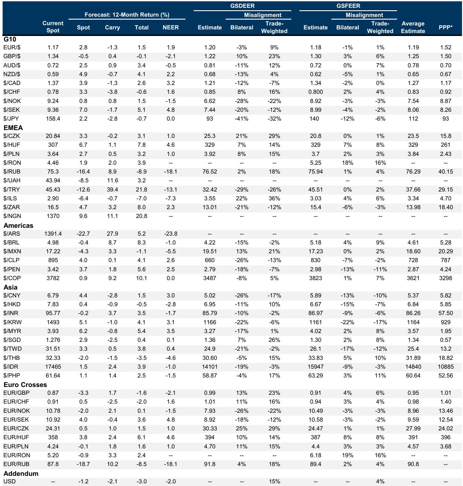
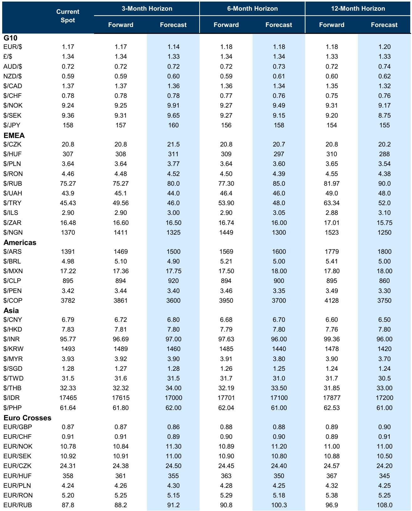
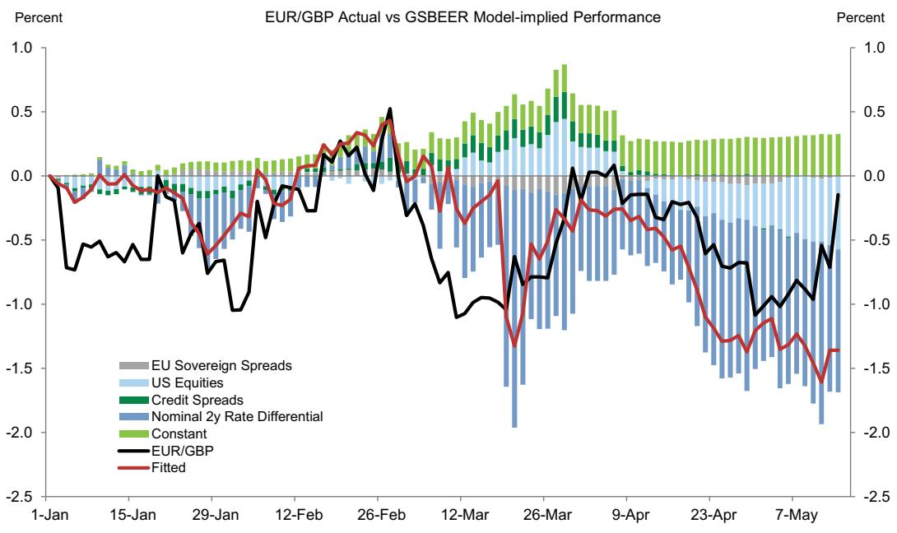

# The Dollar Is Quietly Building Appreciation Pressure as Two Simultaneous Shocks Reshape Global FX Dynamics

The broad Dollar has been nearly flat over the past several months, but that surface-level stability masks a more consequential shift underway. Beneath the apparent calm, two powerful and concurrent forces—an energy supply shock and an AI-driven demand boom—are creating asymmetric pressures across currencies that are quietly reinforcing Dollar strength. These forces are not canceling each other out; they are compounding in ways that most market participants have not yet fully priced.

The conventional narrative has focused on the Dollar being caught between cyclical commodity currencies on one side and tightly managed Asian FX regimes on the other. This is true, but it is a description of the symptom, not the cause. The real story is that the energy shock and the AI boom have opposing effects on global growth—one acts as a drag, the other as a support—but they align in the same direction on inflation. This is the critical insight that explains why the Dollar's appreciation pressure has been building quietly rather than exploding into a sharp rally.

What makes this moment different from previous periods of Dollar strength is the nature of the two shocks. The energy disruption is not a transient spike; it reflects a structural reconfiguration of global energy flows that will take years to resolve. The AI demand boom is not a cyclical uptick; it represents a capital-intensive investment cycle that is reshaping terms of trade for technology exporters. Together, they are redrawing the map of currency outperformance and underperformance in ways that will persist well beyond any single policy announcement or data release.

## The Dollar Is Caught Between Two Forces, But the Energy Shock Creates the Clearer Asymmetric Risk for a Breakout

The Dollar's recent range-bound behavior is not a sign of equilibrium. It is a tension between two opposing gravitational pulls. On one side, commodity-forward currencies like the Norwegian krone, Australian dollar, and Brazilian real have benefited from the energy shock through improved terms of trade. On the other side, Asian currencies with heavily managed exchange rate regimes have absorbed much of the adjustment through intervention rather than price discovery, muting the Dollar's visible appreciation.

This tug-of-war has kept the broad Dollar index range-bound, but it is an unstable equilibrium. The key risk is that the energy shock broadens from a terms-of-trade shock into a growth shock for Europe and other energy-importing developed economies. If higher energy prices begin to meaningfully pressure economic activity, policy responses, and prospective returns in those regions, the Dollar's relative insulation becomes a powerful magnet for capital flows.

The recent upside US inflation surprises demonstrate this mechanism in action. Higher US inflation readings pushed global bond yields higher, and the Dollar strengthened. This is not simply a US exceptionalism story. It is a story about how the energy shock creates asymmetric inflation pressures that are more manageable for the United States, which is relatively less exposed to energy imports, than for Europe or Japan. The Dollar benefits not because the US economy is perfect, but because it is less damaged.

## Sterling Faces a Dangerous Confluence of Political Uncertainty and Deteriorating Fiscal Fundamentals That Could Amplify Each Other

The recent underperformance of sterling is not merely a reaction to UK political newsflow. It represents a structural vulnerability that has been building beneath the surface and is now being exposed by the energy shock. The political uncertainty surrounding a potential leadership transition is real, but it is the interaction with deteriorating fiscal fundamentals that makes this episode more dangerous than previous periods of political turmoil.

The model-based analysis shows that EUR/GBP has incorporated roughly one percentage point of fiscal premium in recent days, but this remains well below the two percent premium that was regularly priced during most of the previous year. This gap represents a reasonable near-term target for further sterling weakness, but the more important question is whether the premium will expand beyond previous peaks. The answer depends on how the energy shock interacts with the UK's already constrained fiscal position.

The macro repercussions of the energy shock have already eroded fiscal headroom in the UK, and energy futures continue to move higher for the remainder of the year. This creates a dangerous feedback loop: political uncertainty increases the perceived risk of fiscal deterioration, which in turn makes the fiscal outlook more sensitive to energy prices, which then amplifies the market's reaction to any political development. The sources of sterling resilience that have supported the currency in recent months—a sharp rebound in global risk sentiment and large cross-border M&A inflows—may not persist in this environment.

The more durable risk to sterling is not the political noise itself, but the fact that the energy shock has structurally weakened the UK's external position at a time when fiscal buffers are already depleted. This is a fundamentally different setup from previous episodes of political uncertainty, where the currency could rebound quickly once clarity emerged. A leadership transition may provide temporary relief, but the underlying macro vulnerability will remain.

## The Brazilian Real Is Not as Vulnerable as Recent Depreciation Suggests Because Its Performance Remains Explained by Global Factors, Not Domestic Risk

The Real's sharp depreciation this week, driven initially by election-related headlines and then by a broader decline in risk sentiment, has raised questions about whether the currency is entering a period of sustained underperformance. The answer requires distinguishing between noise and signal. The model-based decomposition of BRL returns provides a clear framework: the Real's performance over the past several months has been predominantly explained by its typical beta to Brazil's terms of trade and US equity performance.

This is a reassuring finding. It means that the Real has not built up a large outperformance gap relative to what its fundamentals would predict. In previous election cycles, BRL often carried a significant risk premium that made it vulnerable to sharp corrections when sentiment turned. Today, the absence of such a premium suggests that the currency is not as exposed to a disorderly unwind as it might appear.

The lack of a large outperformance gap implies that BRL's vulnerability in a less favorable backdrop is limited to what its typical betas would imply. An environment of higher-for-longer energy prices is actually a structural tailwind for the Real, given Brazil's position as a commodity exporter. The near-term risks come from increasing political noise and weaker global risk sentiment, but these are cyclical headwinds, not structural vulnerabilities.

The key question for BRL investors is whether the election cycle will introduce a domestic risk premium that is not currently priced. The model suggests that Brazil-specific risk, as proxied by the residual of CDS after stripping out global factors, has seen limited moves this year. This could change as the October election approaches, but for now, the Real's performance remains firmly anchored to global drivers.

## Japanese Yen Intervention Is Losing Effectiveness Because It Is Fighting Against Macro Fundamentals That Overwhelm Any Tactical Response

The latest round of Japanese yen intervention has produced a notably smaller impact per billion dollars spent compared to previous episodes. This is not a failure of execution or strategy. It is a reflection of the fact that the macro environment has become more hostile to intervention effectiveness. The key headwinds—elevated oil prices, US growth outperformance, higher-for-longer interest rates, and constructive risk sentiment—are all pushing in the same direction against the yen.

The comparison with previous intervention rounds is instructive. The October 2022 intervention had a larger initial impact because it coincided with a period when US yields were peaking and recession fears were building. The July 2024 intervention was more effective because it occurred when the macro backdrop was already beginning to shift in favor of the yen. The current intervention is taking place in an environment where all the macro tailwinds are blowing against the currency.

The Bank of Japan's gradual hiking cycle, while a step in the right direction, is unlikely to be sufficient to overcome these headwinds. A hike that is already 80 percent priced in by the market provides little additional catalyst for sustained yen strength. The market needs either a much more aggressive tightening path from the BoJ or a significant deterioration in global growth and risk appetite to shift the yen's trajectory.

The intervention data reveals a clear pattern: the effectiveness of yen intervention has been declining over successive rounds as the macro environment has become more challenging. This suggests that further intervention attempts will face diminishing returns unless accompanied by a fundamental shift in the forces driving USD/JPY. The yen will remain under pressure until either the energy shock sUBSides or the global growth outlook deteriorates sufficiently to trigger a flight to safety that benefits the currency.

## The Terms of Trade Framework Reveals That Asia FX Is an Outlier, and Incorporating Tech Exports Explains Why

The terms of trade framework has been a powerful tool for explaining FX returns since the start of the energy shock, but it has one notable blind spot: Asia. Asian currencies have tracked terms of trade moves less closely than their emerging market and G10 peers. This is partly due to more stringent currency management in the region, but it also reflects a deeper structural factor that the standard commodity terms of trade measure misses.

The missing factor is the technology export channel. For economies like South Korea, Taiwan, and China, the AI-driven demand boom has provided a significant boost to export revenues that is not captured by commodity terms of trade. When tech exports are incorporated alongside commodity terms of trade, the explanatory power for Asia FX performance improves sUBStantially. This is not a minor adjustment; it is a fundamental reframing of how to think about currency dynamics in the region.

The implication is that Asia FX is not simply underperforming relative to its terms of trade. It is responding to a different set of drivers that the standard framework does not capture. This has important consequences for positioning. Investors who rely solely on commodity terms of trade to assess Asia FX will systematically underestimate the resilience of currencies like the Korean won and Taiwanese dollar, while overestimating the vulnerability of currencies that lack a tech export channel.

The broader lesson is that the terms of trade framework must be adapted to the specific structural characteristics of each region. A one-size-fits-all approach will miss the most important dynamics in the current environment. The AI boom and the energy shock are reshaping global trade patterns in ways that require a more nuanced analytical toolkit.

## What the Report Does Not Fully Answer: How to Trade the Interaction Between the Two Shocks When They Move in Opposite Directions on Growth

The report provides a clear framework for understanding how the energy shock and AI boom affect inflation, but it is less definitive on how to trade the interaction when these forces move in opposite directions on growth. The energy shock is a drag on global growth, while the AI boom is a support. The net effect on growth has been roughly neutral so far, but this balance could shift rapidly in either direction.

The unresolved question is what happens if the energy shock intensifies to the point where it overwhelms the growth support from AI investment. In that scenario, the Dollar's relative insulation becomes even more valuable, and the case for Dollar strength becomes overwhelming. Conversely, if the AI boom accelerates to the point where it offsets the energy drag entirely, the growth picture improves, and the cyclical commodity currencies that have benefited from the energy shock could see additional support.

The report also leaves open the question of how to position for a potential de-escalation of the energy shock. The expectation of higher-for-longer energy prices is embedded in current FX positioning, particularly through the asymmetric outperformance of commodity exporters on days when energy prices increase. A sustained de-escalation would trigger a sharp reversal of these positions, but the report suggests that any relief would be temporary because the more lasting inflation and growth impacts of the terms of trade shifts would continue to influence FX returns.

## A Decision Framework for Navigating the Current Environment

For investors trying to position in this environment, the key is to recognize that the current regime is defined by the interaction of two structural shocks, not by cyclical factors. This requires a different approach to portfolio construction and risk management.

The first decision is whether to focus on the energy shock or the AI boom as the primary driver. For commodity currencies like NOK, AUD, and BRL, the energy shock is the dominant factor. For Asian tech exporters, the AI boom matters more. For the Dollar and European currencies, both forces are relevant, but the energy shock carries more weight for the direction of risk.

The second decision is about time horizon. In the near term, the energy shock will continue to drive FX returns through terms of trade differentiation. In the medium term, the more lasting inflation and growth impacts of these shifts will become more important. The currencies that offer the best risk-reward are those with exposure to both commodity and cyclical channels, as these provide diversification across the two shocks.

The third decision is about how to incorporate the blind spots in the standard framework. The terms of trade framework works well for G10 and non-Asia EM, but it needs to be adjusted for Asia to account for the tech export channel. Similarly, the standard intervention analysis for JPY needs to account for the declining effectiveness of intervention in the current macro environment.

The most important strategic insight is that the current environment favors currencies that are insulated from both the energy shock and the growth drag it creates. The Dollar is the clearest beneficiary of this dynamic, but commodity exporters with strong fiscal positions and credible monetary policy frameworks also offer attractive risk-reward. The currencies that are most vulnerable are those that combine energy import dependence with weak fiscal positions and political uncertainty.

Join the community to read the full report and review the original charts.

*This article is for learning and discussion only and does not constitute investment advice.*

Personal reading notes and learning share only. Not investment advice.

