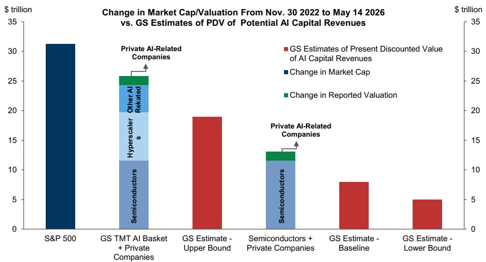
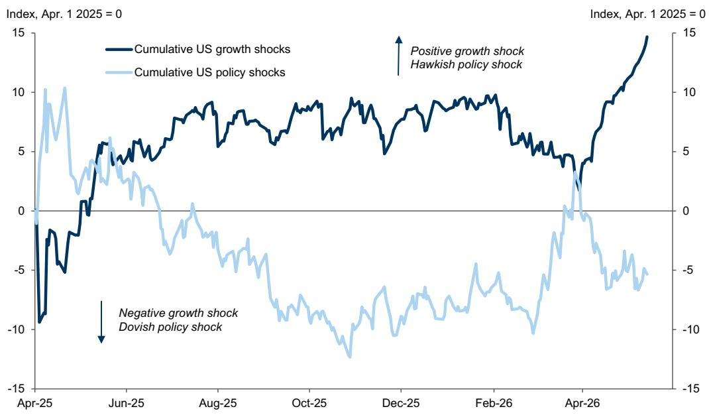
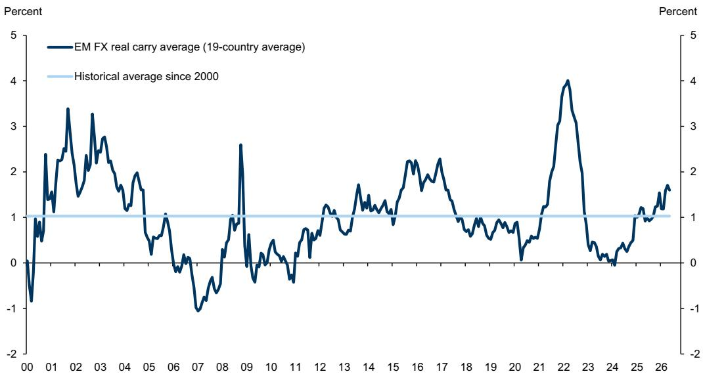

# Markets Are Now Pricing a World of Shortages, and That Creates a More Fragile Tension Than Any Single Risk

The market has made its decision. After months of staring into a geopolitical abyss, it has chosen to look through the disruption and refocus on what is scarce: energy and AI compute. The result has been a sharp, compressed recovery in risk assets—US equities, commodity-exposed currencies, and emerging markets have all rebounded smartly. But this is not a return to normal. It is a repricing of a world defined by deliberate shortages, and that changes the logic of every portfolio decision.

The relief is real but fragile. The Iran ceasefire and a reduction in the deepest downside tails have allowed risk premia to narrow across a range of assets. That type of compression in the distribution of outcomes is historically associated with sharp market gains when fundamental uncertainty remains high, and this cycle has proven no exception. Yet the common driver across the recovery is not a resolution of macro imbalances—it is a bet that shortages will persist. In commodities, the bet is on constrained supply. In AI, the bet is on constrained capacity. Both are driving capital flows, and both are creating a market that has already priced significant optimism into a fundamentally uncertain outlook.

The central tension is this: the market has moved past the worst-case scenario but has not yet priced the consequences of a prolonged stalemate. Oil prices and bond yields remain elevated, yet equities have shrugged off the pressure. The result is a distribution of risks that has narrowed but is now more balanced. The most obvious downside threat is a re-escalation of hostilities in the Middle East or a prolonged closure of the Strait of Hormuz, which would push oil prices higher, raise rates, and increase the probability of recession. But even in a benign scenario, the market is now priced for a growth and earnings trajectory that may overshoot reality. The question is not whether the shortages are real—they are. The question is whether the market has already paid for them.

This article translates a global investment bank's latest cross-asset research into a strategic framework. It does not summarize the report. It makes an argument: that the current market regime is defined by a fragile coexistence of bullish shortages and bearish macro constraints, and that investors need to think in terms of second-order effects, not just first-order winners.

## The Iran Risk Has Not Disappeared; It Has Only Been Repriced into a Higher Threshold for Worry

The market has effectively decided that the deepest tail risks from the Iran conflict are off the table. That assumption has allowed risk assets to recover and has raised the threshold for what constitutes a worrying headline. But this dynamic cuts both ways. A higher threshold for worry means that when a genuinely adverse event does occur, the repricing will be larger because the market has become complacent about the range of possible outcomes.

The circularity here is worth examining. Markets are looking through temporary disruptions, yet it may be that another bout of market worry is actually necessary to force the kind of political agreement that allows energy flows to resume. The longer we go without a clear peace agreement and a convincing reopening of the Strait of Hormuz, the more likely it becomes that energy product shortages will become visible in physical markets, not just in futures prices. At that point, the market's patience will be tested.

The report's scenario analysis makes this tension explicit. In the benign case—where flows fully recover by mid-June with no scarring—oil prices fall sharply from current levels. In the severely adverse case—where flows do not recover until end-July and scarring reaches 2.5 million barrels per day—prices spike to over USD 140 per barrel. The market is currently pricing somewhere between the base case and the benign case, but the distribution of outcomes is heavily skewed to the upside. That skew is underpriced.

What this means for investors is straightforward: the macro insurance that was bought during the worst of the crisis has been sold off too quickly. Hedges against a re-escalation—out-of-the-money downside in European equities, credit, and FX, as well as long oil positions—still offer attractive asymmetric payoffs. The market has priced relief, but it has not priced the cost of a failed resolution.

## AI-Driven Capex Is Creating a Self-Fulfilling Cycle That Also Builds a Valuation Overhang

The AI theme has returned with a force that has surprised even the optimists. Outside energy-related areas, the markets that have moved most decisively through their pre-war highs are AI-heavy indices: Korea, Taiwan, and the Nasdaq. The pattern is familiar. As in 2025, concerns about the sustainability of the AI boom that emerged in the first quarter have dissipated in the second quarter, driven by another wave of upward revisions to hyperscaler capital expenditure expectations.

The numbers are staggering. Consensus estimates for US hyperscaler capex have risen from USD 673 billion for 2026 at the start of the earnings season to USD 755 billion currently. For 2027, the increase is from USD 790 billion to USD 890 billion. Tech investment spending as a share of GDP has now exceeded the peaks of the late 1990s. And unlike that era, corporate profits as a share of GDP are also at record highs, meaning that the investment boom is not yet creating the macro imbalances that signaled trouble two decades ago.

But the value creation is heavily concentrated. The report's analysis shows that the cumulative increase in market capitalization for AI-related companies since November 2022 is far larger than the present discounted value of potential AI-related revenues, even under optimistic assumptions. This does not mean the theme is wrong. It means that the market is taking credit for sUBStantial macro benefits that may or may not materialize. The risk is that investors fall into one of two fallacies: the fallacy of aggregation, assuming that more individual companies can be winners than the economy overall can deliver, or the fallacy of extrapolation, assuming that earnings supported by the investment boom itself can be sustained indefinitely.

As long as earnings and spending plans continue to rise more quickly than expected, there will be a tailwind for the AI complex. But in the process, the market is building a valuation overhang that will need to be resolved at some point. The question is whether that resolution comes through earnings delivery or through a correction.

## Bond Yields and Equities Are Rising Together, and That Combination Is Historically Unsustainable

One of the most striking features of the current market is that bond yields and equities have been rising steadily together. This is not a typical pattern. In most cycles, rising yields are a headwind for equities because they discount future cash flows more heavily and raise the cost of capital. But in a shortage-driven market, both can rise simultaneously if the driver is stronger growth expectations rather than tighter monetary policy.

The report's estimates of US growth pricing from the joint shifts in equities and bonds now stand at 2.5%, which is above the bank's own forecasts for 2027. These measures may overstate true cyclical optimism because tech and commodity strength are boosting them for other reasons, but they are consistent with a market that is already looking through the short-term weakness to a better growth outlook. The problem is that the market may now be overshooting those levels.

The sustainability of this combination depends on whether inflation pressure fades quickly enough. The report argues that inflation is likely to begin to fade within a couple of months of the energy price peak, and that the market is already priced for rate hikes, including in the US. If that is correct, the pressure on yields will ultimately be contained. But given how relaxed equity markets have been about rising rates so far, there is a risk that markets will continue to worry that a mix of more hawkish policy pricing and less bullish growth pricing may be needed.

What this means for investors is that the current positive correlation between equities and bonds is a fragile equilibrium. If growth expectations begin to fade while yields remain elevated, the correlation will flip, and the diversification benefit of holding bonds will return—but only after a period of pain for both asset classes.

## The Report's Blind Spot: It Does Not Fully Address What Happens When Shortages End

For all its analytical rigor, the report leaves one critical question unanswered: what happens when the shortages resolve? The entire market narrative is built on the assumption that energy supply will remain constrained and that AI compute capacity will remain scarce. But both of these assumptions are time-bound.

In the energy case, a full resolution of the Iran crisis would release significant supply back into the market. The report's benign scenario shows oil prices falling sharply within months of a reopening. That would be good for inflation and for central banks, but it would also remove the primary driver of the current macro narrative. Commodity-exposed currencies and energy equities would likely underperform, and the rotation into other sectors would accelerate.

In the AI case, the capex boom is itself creating the capacity that will eventually resolve the shortage. Hyperscalers are building data centers as fast as they can. At some point, supply will catch up with demand, and the pricing power of the chip layer will erode. The report acknowledges this risk but does not model the timing or the magnitude of the impact. The market is effectively betting that the shortage persists longer than the consensus expects. That is a bet that can be right for a long time, but it is still a bet.

The unanswered question for investors is whether they are prepared for a regime shift. If the shortages resolve faster than expected, the winners of the past two years could become the losers of the next two. The report's framework is excellent for navigating the current regime, but it does not provide a clear roadmap for the transition.

## A Decision Framework for the Shortage Regime: Distinguish Between Structural and Cyclical Scarcity

The most valuable contribution of this report is not its forecasts but its implicit framework for thinking about scarcity. Not all shortages are created equal. Some are structural—driven by long-term capacity constraints that take years to resolve. Others are cyclical—driven by policy, geopolitics, or temporary demand surges. The investment implications are very different.

For investors trying to navigate this regime, the first question to ask is whether the shortage you are betting on is structural or cyclical. AI compute capacity is structural. The lead times for building new fabrication plants and data centers are measured in years, not months. The demand for AI inference is growing exponentially. That is a structural shortage that supports sustained investment and pricing power for the suppliers.

Energy supply from the Middle East is cyclical. The Strait of Hormuz will reopen eventually. The question is when, not if. The Iran conflict is a political crisis, not a geological one. That means the shortage is time-limited, and the assets that benefit from it are trading on a temporary premium that will disappear when the crisis resolves.

The second question is whether the market is pricing the shortage as if it will persist indefinitely. In the AI case, the market is pricing multi-year growth as if the shortage will continue to widen. In the energy case, the market is pricing a relatively quick resolution. Both could be wrong, but the asymmetry is different. If the AI shortage resolves faster than expected, the downside is large because the valuations are high. If the energy shortage persists longer than expected, the upside is large because the hedges are cheap.

The third question is about correlation. In a shortage-driven market, correlations between asset classes shift. Commodities and equities rise together. Bonds and equities rise together. That reduces the diversification benefit of traditional portfolios. Investors need to think about tail hedges that work when the shortage narrative breaks, not just when it continues.

## The Most Important Question the Report Leaves Open Is Whether the Market Has Already Priced the Good News

The report's data on growth pricing suggests that the market has already moved past the bank's own forecasts for 2027. That is a warning sign. Markets are discounting mechanisms, and they are supposed to look forward. But when the discounting becomes too aggressive, it creates vulnerability to disappointment.

The pattern is familiar from previous cycles. In 2021, the market priced a rapid recovery from the pandemic that largely materialized, but the sUBSequent inflation shock caught everyone off guard. In 2023, the market priced a recession that did not happen, leading to a sharp rally when growth surprised to the upside. In both cases, the market was right about the direction but wrong about the magnitude, and the corrections were painful.

The current market is pricing a Goldilocks scenario: shortages that support corporate pricing power, inflation that fades quickly enough to allow central banks to ease, and AI-driven productivity gains that justify elevated valuations. That is a lot to ask. The report's analysis suggests that the market has already priced the good news and is now vulnerable to any disappointment on the inflation or growth front.

The open question is whether the market can continue to climb the wall of worry or whether it has already reached the top. The answer will depend on whether the shortages persist long enough for earnings to catch up with valuations. That is a question that no report can answer with certainty, which is precisely why the current regime is so interesting.

Join the community to read the full report and review the original charts.

*This article is for learning and discussion only and does not constitute investment advice.*

Personal reading notes and learning share only. Not investment advice.

