GLOBAL STEEL

# The steel market barometer: May Update

# Big picture: The steel & iron ore navigator

# Key latest datapoints

Global flat steel prices: In April, average HRC prices increased in virtually all analyzed regions with Brazil printing the stronger increase (+10% m/m), followed by Japan (+6.5% m/m), then China (+2.9% m/m), the US (+2.4% m/m), and the Black Sea (+2% m/m), while in EU it was broadly flattish (+0.3% m/m). On a YTD basis, Brazil's HRC steel price performance has been the strongest in our sample (+21%), followed by the US (+15%) with other regions also showing price increases from 6%-13%. From early April to early May, HRC prices rose for all regions except for the EU and the Black Sea (both flattish), up by +2%/+3%/+7%/+10% in the US/China/Japan/Brazil.   
Global long steel prices: In April, average rebar prices increased for all regions ex-US (flattish). Brazil's performance was the strongest once again (+12% m/m), followed by EU (+6.9% m/m), then the Black Sea (+6.1% m/m), Japan (+4.5% m/m), and China (+2.3% m/m). On a YTD basis, Brazil's rebar prices also saw the best performance (+13%), followed by EU (+10.6%), China (+7.8%), the Black Sea (+6% m/m), and Japan (+3.7%), while prices are flat in the US. From early April to Early May, rebar prices rose for all regions except for the US and Black Sea (flattish), up by +2%/+5%/+5%/+12% in China/EU/Japan/Brazil.   
China: China's steel production continued to decline y/y in the first two weeks of May (-3.2% y/y vs the same week in 2025). According to GS's China Basic Materials team commentary, “on the industry level, while the anti-involution effort and long-term capacity cut plan for the Chinese steel sector remain intact, we see delayed execution in 2026E in terms of both capacity and production discipline.”   
Europe: In March, EU crude steel production increased 16% m/m (above the historical seasonality for the month of +10% m/m on avg from 2026-2025), but it declined by 3% y/y and YTD.   
US: In April, US avg weekly steel production (7.3Mst) increased by 3% m/m and utilization rates averaged 79.6% (+2 p.p. m/m and +4.4 p.p. y/y).

# Marcio Farid

+55(11)3371-4580

marcio.farid@gs.com

GS do Brasil CTVM S.A.

# Matt Greene

+44(20)7051-0489

matt.greene@gs.com

GS International

# Paul Young

+61(2)9321-8302

paul.young1@gs.com

GS Australia Pty Ltd

# Trina Chen

+852-2978-2678 | trina.chen@gs.com

GS (Asia) L.L.C.

# Yuting Yang

+852-2978-7283

yuting.y.yang@gs.com

GS (Asia) L.L.C.

# Nick Cash

+1(212)357-6372 | nick.cash@gs.com

GS & Co. LLC

LatAm: In March, LatAm crude steel production declined by 3% y/y (-2% y/y YTD in 1Q26), but increased by 16% m/m (above the +6% m/m historical avg seasonality for the month).

RoW: In March, India's crude steel production growth accelerated to $11\%$ y/y (vs $+10\%$ y/y YTD and $+7\%$ y/y in Feb). In Japan and the Black Sea, crude steel production declined by $4\%$ y/y and $3\%$ y/y, respectively, while on a monthly basis, it increased by $+8\% / 10\%$ m/m, respectively, both in line with historical seasonality.

# Global Steel Indicators

# Steel Prices

# Flat Steel

Exhibit 1: HRC Prices in major regions \$/t   
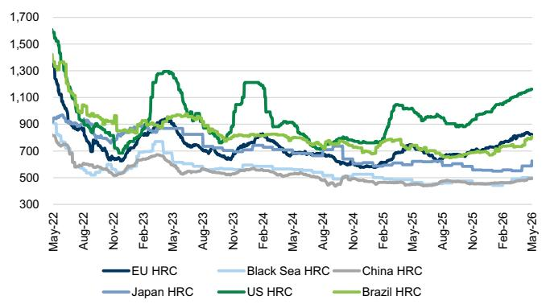

line

| Month   | EU HRC | Black Sea HRC | China HRC | Japan HRC | US HRC | Brazil HRC |
|---------|--------|---------------|-----------|-----------|--------|------------|
| May-22  | 1300   | 900           | 800       | 900       | 1500   | 1400       |
| Aug-22  | 900    | 700           | 600       | 800       | 1300   | 1200       |
| Nov-22  | 700    | 600           | 500       | 700       | 1100   | 1000       |
| Feb-23  | 800    | 700           | 600       | 800       | 1300   | 1200       |
| May-23  | 900    | 800           | 700       | 900       | 1200   | 1100       |
| Aug-23  | 800    | 700           | 600       | 800       | 1100   | 1000       |
| Nov-23  | 700    | 600           | 500       | 700       | 1300   | 900        |
| Feb-24  | 800    | 700           | 600       | 800       | 1200   | 800        |
| May-24  | 700    | 600           | 500       | 700       | 1100   | 700        |
| Aug-24  | 600    | 500           | 400       | 600       | 900    | 600        |
| Nov-24  | 700    | 600           | 500       | 700       | 800    | 700        |
| Feb-25  | 800    | 700           | 600       | 800       | 1100   | 800        |
| May-25  | 700    | 600           | 500       | 700       | 1300   | 900        |
| Aug-25  | 600    | 500           | 400       | 600       | 1200   | 800        |
| Nov-25  | 700    | 600           | 500       | 700       | 1100   | 900        |
| Feb-26  | 800    | 700           | 600       | 800       | 1300   | 1100       |
| May-26  | 900    | 800           | 700       | 900       | 1400   | 1200       |

Source: S&P Global Platts, GS Global Investment Research

Exhibit 2: HRC 1m/YTD price performance, \$ terms 

<table><tr><td colspan="4">HRC Price Performance</td></tr><tr><td></td><td>Spot</td><td>M/M</td><td>YTD</td></tr><tr><td>EU</td><td>821</td><td>0.3%</td><td>12.6%</td></tr><tr><td>Black Sea</td><td>500</td><td>2.0%</td><td>11.1%</td></tr><tr><td>China</td><td>493</td><td>2.9%</td><td>7.4%</td></tr><tr><td>Japan</td><td>587</td><td>6.5%</td><td>5.7%</td></tr><tr><td>US</td><td>1,163</td><td>2.4%</td><td>14.7%</td></tr><tr><td>Brazil</td><td>808</td><td>10.3%</td><td>20.6%</td></tr></table>

Data for April 2026   
Source: S&P Global Platts, GS Global Investment Research

Exhibit 3: HRC price ranges in the past 4 years US\$/t   
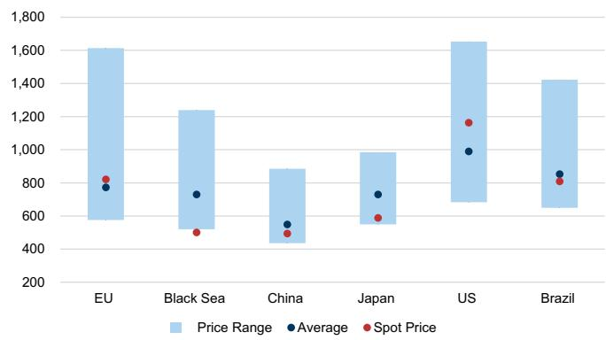

bar

| Region   | Price Range | Average | Spot Price |
| -------- | ----------- | ------- | ---------- |
| EU       | 1600        | 750     | 800        |
| Black Sea| 1250        | 700     | 500        |
| China    | 900         | 550     | 450        |
| Japan    | 1000        | 700     | 600        |
| US       | 1650        | 1000    | 1150       |
| Brazil   | 1400        | 850     | 800        |

Source: S&P Global Platts, GS Global Investment Research

# Long Steel

Exhibit 4: Rebar prices in major regions \$/t   
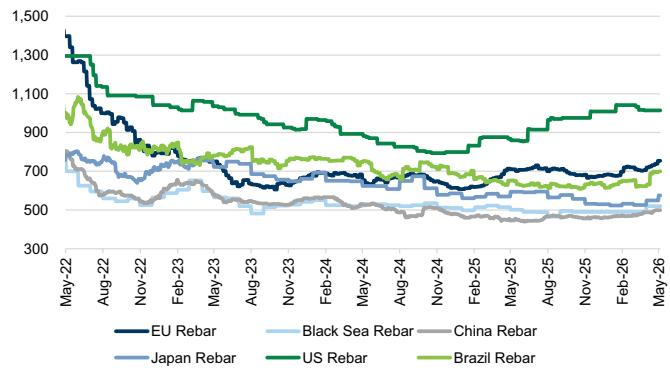

line

| Month   | EU Rebar | Black Sea Rebar | China Rebar | Japan Rebar | US Rebar | Brazil Rebar |
|---------|----------|-----------------|-------------|-------------|----------|--------------|
| May-22  | 1400     | 750             | 700         | 750         | 1400     | 1000         |
| Aug-22  | 1000     | 650             | 600         | 650         | 1100     | 900          |
| Nov-22  | 800      | 600             | 550         | 600         | 1050     | 850          |
| Feb-23  | 750      | 550             | 500         | 550         | 1000     | 800          |
| May-23  | 700      | 500             | 450         | 500         | 950      | 750          |
| Aug-23  | 650      | 450             | 400         | 450         | 900      | 700          |
| Nov-23  | 600      | 400             | 350         | 400         | 850      | 650          |
| Feb-24  | 650      | 450             | 300         | 450         | 800      | 600          |
| May-24  | 700      | 500             | 250         | 500         | 750      | 550          |
| Aug-24  | 650      | 450             | 200         | 450         | 700      | 500          |
| Nov-24  | 600      | 400             | 150         | 400         | 650      | 450          |
| Feb-25  | 650      | 450             | 100         | 450         | 600      | 400          |
| May-25  | 700      | 500             | 50          | 50          | 550      | 350          |
| Aug-25  | 750      | 550             | 25          | 55          | 500      | 300          |
| Nov-25  | 800      | 600             | 10          | 60          | 450      | 250          |
| Feb-26  | 850      | 650             | 25          | 65          | 400      | 200          |
| May-26  | 900      | 700             | 15          | 70          | 350      | 150          |

Source: S&P Global Platts, GS Global Investment Research

Exhibit 5: Rebar 1m/YTD price performance, \$ terms % 

<table><tr><td colspan="4">Rebar Price Performance</td></tr><tr><td></td><td>Spot</td><td>M/M</td><td>YTD</td></tr><tr><td>EU</td><td>754</td><td>6.9%</td><td>10.6%</td></tr><tr><td>Black Sea</td><td>520</td><td>6.1%</td><td>6.1%</td></tr><tr><td>China</td><td>499</td><td>2.3%</td><td>7.8%</td></tr><tr><td>Japan</td><td>550</td><td>4.5%</td><td>3.7%</td></tr><tr><td>US</td><td>1,014</td><td>0.0%</td><td>0.5%</td></tr><tr><td>Brazil</td><td>698</td><td>12.0%</td><td>13.3%</td></tr></table>

Data for April 2026   
Source: S&P Global Platts, GS Global Investment Research

Exhibit 6: Rebar price ranges in the past 4 years US\$/t   
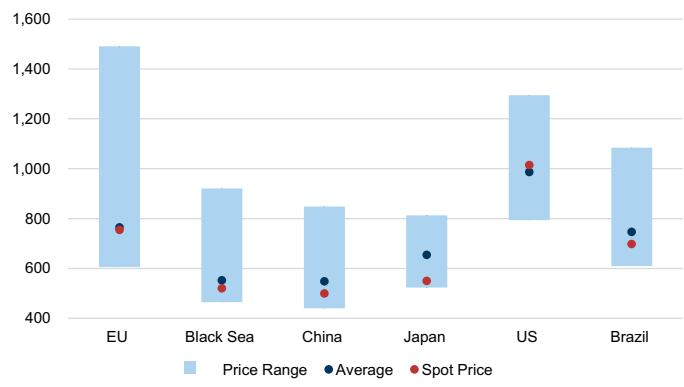

bar

| Region   | Price Range | Average | Spot Price |
| -------- | ----------- | ------- | ---------- |
| EU       | 1500        | 780     | 780        |
| Black Sea| 920         | 560     | 520        |
| China    | 850         | 550     | 530        |
| Japan    | 820         | 660     | 550        |
| US       | 1300        | 1000    | 1020       |
| Brazil   | 1100        | 760     | 700        |

Source: S&P Global Platts, GS Global Investment Research

# Output

Exhibit 7: Global crude steel mn tonnes (monthly)   
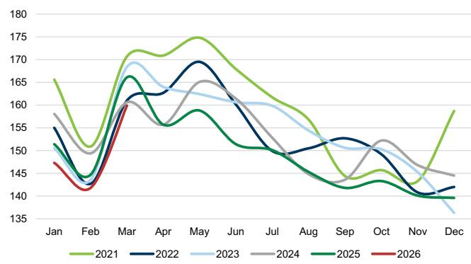

line

| Month | 2021 | 2022 | 2023 | 2024 | 2025 | 2026 |
|-------|------|------|------|------|------|------|
| Jan   | 165  | 155  | 158  | 157  | 151  | 148  |
| Feb   | 150  | 145  | 150  | 148  | 143  | 141  |
| Mar   | 170  | 160  | 168  | 160  | 165  | 158  |
| Apr   | 172  | 162  | 165  | 158  | 155  | 155  |
| May   | 175  | 170  | 163  | 165  | 158  | 158  |
| Jun   | 170  | 165  | 160  | 160  | 150  | 150  |
| Jul   | 165  | 160  | 158  | 158  | 148  | 148  |
| Aug   | 160  | 155  | 155  | 155  | 145  | 145  |
| Sep   | 155  | 150  | 150  | 150  | 143  | 143  |
| Oct   | 145  | 148  | 148  | 148  | 143  | 143  |
| Nov   | 140  | 142  | 142  | 142  | 140  | 140  |
| Dec   | 158  | 140  | 138  | 145  | 140  | -    |

Source: World Steel Association, GS Global Investment Research

Exhibit 8: Global crude steel production, China/ex-China mn tonnes (monthly)   
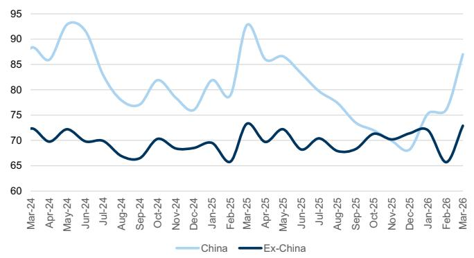

line

| Month    | China | Ex-China |
| -------- | ----- | -------- |
| Mar-24   | 88    | 72       |
| Apr-24   | 86    | 71       |
| May-24   | 93    | 72       |
| Jun-24   | 91    | 70       |
| Jul-24   | 85    | 69       |
| Aug-24   | 80    | 67       |
| Sep-24   | 77    | 66       |
| Oct-24   | 82    | 68       |
| Nov-24   | 78    | 69       |
| Dec-24   | 76    | 68       |
| Jan-25   | 82    | 69       |
| Feb-25   | 78    | 65       |
| Mar-25   | 93    | 73       |
| Apr-25   | 87    | 70       |
| May-25   | 85    | 72       |
| Jun-25   | 83    | 68       |
| Jul-25   | 80    | 69       |
| Aug-25   | 77    | 68       |
| Sep-25   | 73    | 69       |
| Oct-25   | 70    | 70       |
| Nov-25   | 68    | 71       |
| Dec-25   | 67    | 70       |
| Jan-26   | 70    | 71       |
| Feb-26   | 75    | 65       |
| Mar-26   | 87    | 73       |

Source: World Steel Association, GS Global Investment Research

# Capacity

Exhibit 9: Effective steel capacity utilization   
Latest monthly output as % of peak output (since 2022)   
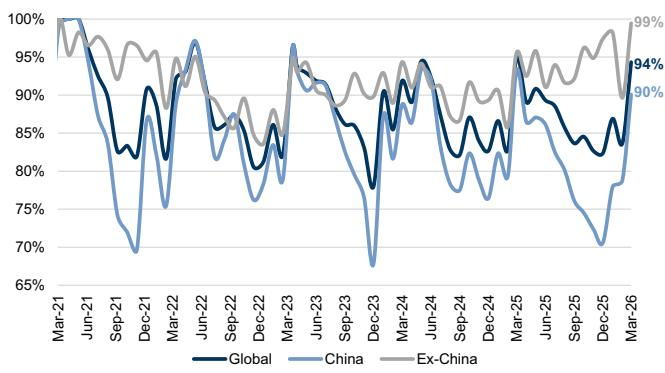

line

| Date   | Global | China | Ex-China |
|--------|--------|-------|----------|
| Mar-26 | 90%    | 94%   | 99%      |

Source: World Steel Association, GS Global Investment Research

Exhibit 10: Ex-China effective steel capacity utilization   
Latest monthly output as % of peak output (since 2022)   
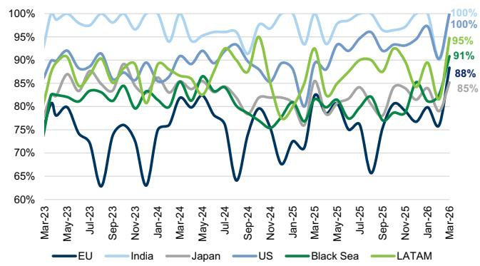

line

| Month   | EU    | India | Japan | US    | Black Sea | LATAM |
|---------|-------|-------|-------|-------|-----------|-------|
| Mar-23  | 80%   | 100%  | 85%   | 90%   | 85%       | 85%   |
| May-23  | 75%   | 100%  | 85%   | 90%   | 85%       | 85%   |
| Jul-23  | 65%   | 100%  | 85%   | 90%   | 85%       | 85%   |
| Sep-23  | 75%   | 100%  | 85%   | 90%   | 85%       | 85%   |
| Nov-23  | 65%   | 100%  | 85%   | 90%   | 85%       | 85%   |
| Jan-24  | 75%   | 100%  | 85%   | 90%   | 85%       | 85%   |
| Mar-24  | 80%   | 100%  | 85%   | 90%   | 85%       | 85%   |
| May-24  | 75%   | 100%  | 85%   | 90%   | 85%       | 85%   |
| Jul-24  | 65%   | 100%  | 85%   | 90%   | 85%       | 85%   |
| Sep-24  | 75%   | 100%  | 85%   | 90%   | 85%       | 85%   |
| Nov-24  | 80%   | 100%  | 85%   | 90%   | 85%       | 85%   |
| Jan-25  | 75%   | 100%  | 85%   | 90%   | 85%       | 85%   |
| Mar-25  | 80%   | 100%  | 85%   | 90%   | 85%       | 85%   |
| May-25  | 75%   | 100%  | 85%   | 90%   | 85%       | 85%   |
| Jul-25  | 65%   | 100%  | 85%   | 90%   | 85%       | 85%   |
| Sep-25  | 75%   | 100%  | 85%   | 90%   | 85%       | 85%   |
| Nov-25  | 80%   | 100%  | 85%   | 90%   | 85%       | 85%   |
| Jan-26  | 75%   | 100%  | 85%   | 90%   | 85%       | 85%   |
| Mar-26  | 80%   | 100%  | 85%   | 90%   | 85%       | 95%   |
| Apr-26* | -     | -     | -     | -     | -         | -     |

Source: World Steel Association, GS Global Investment Research

Exhibit 11: Annualized spare capacity by region   
mn tonnes   
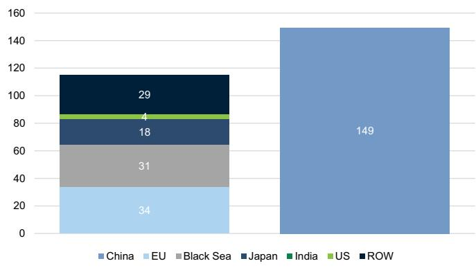

bar_stacked

| Region | Value |
| :--- | :--- |
| China | 149 |
| EU | 34 |
| Black Sea | 31 |
| Japan | 18 |
| India | 4 |
| US | 0 |
| ROW | 29 |

Source: World Steel Association, GS Global Investment Research

# China Steel Indicators

# Steel Output

Exhibit 12: Steel production remained stable over the past week   
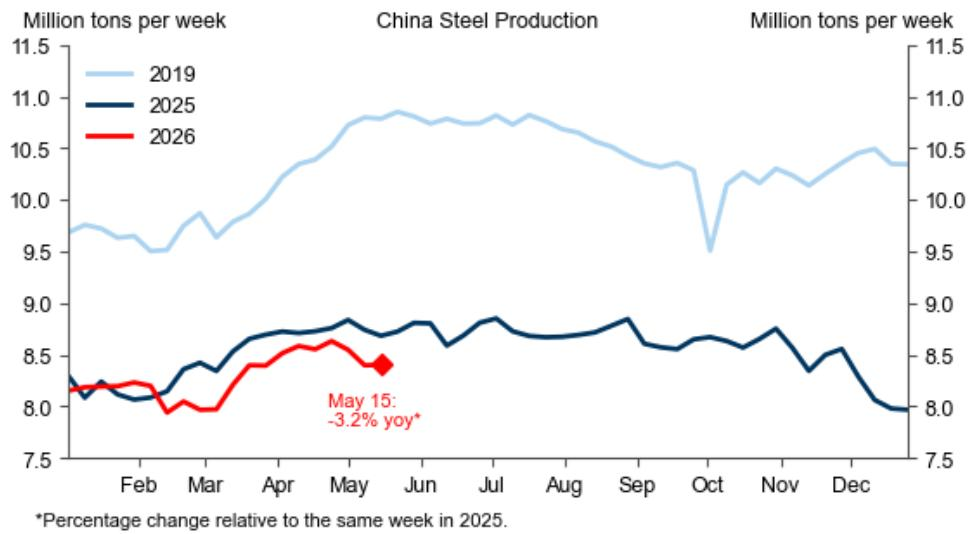

line

| Month | 2019 (Million tons per week) | 2025 (Million tons per week) | 2026 (Million tons per week) |
|-------|------------------------------|------------------------------|------------------------------|
| Feb   | ~9.7                         | ~8.1                         | ~8.2                         |
| Mar   | ~9.8                         | ~8.3                         | ~8.1                         |
| Apr   | ~10.2                        | ~8.6                         | ~8.4                         |
| May   | ~10.8                        | ~8.7                         | ~8.5                         |
| Jun   | ~10.9                        | ~8.7                         | —                            |
| Jul   | ~10.8                        | ~8.7                         | —                            |
| Aug   | ~10.7                        | ~8.7                         | —                            |
| Sep   | ~10.5                        | ~8.7                         | —                            |
| Oct   | ~9.6                         | ~8.6                         | —                            |
| Nov   | ~10.3                        | ~8.7                         | —                            |
| Dec   | ~10.5                        | ~8.0                         | —                            |

Source: Mysteel, GS Global Investment Research

Exhibit 13: China crude steel output change % m/m vs 5Y median trend   
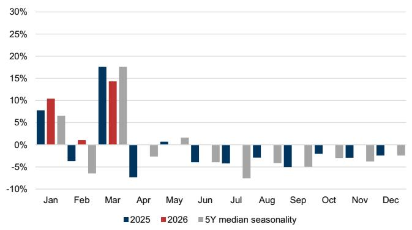

bar

| Month | 2025 (%) | 2026 (%) | 5Y median seasonality (%) |
|---|---|---|---|
| Jan | 7.5 | 10.5 | 6.5 |
| Feb | -3.5 | 1.0 | -6.0 |
| Mar | 17.5 | 14.0 | 17.5 |
| Apr | -7.5 | -1.0 | -2.0 |
| May | 0.8 | -0.5 | 1.5 |
| Jun | -3.0 | -0.5 | -3.5 |
| Jul | -0.5 | -0.5 | -7.5 |
| Aug | -0.5 | -0.5 | -3.5 |
| Sep | -4.0 | -0.5 | -3.0 |
| Oct | -0.8 | -0.5 | -3.0 |
| Nov | -1.0 | -0.5 | -3.5 |
| Dec | -1.0 | -0.5 | -2.0 |

Source: CISA, Mysteel, Bloomberg, GS Global Investment Research

Exhibit 14: China's monthly crude steel production increased $14\%$ m/m but decreased $-6\%$ y/y in March'26 mn tonnes   
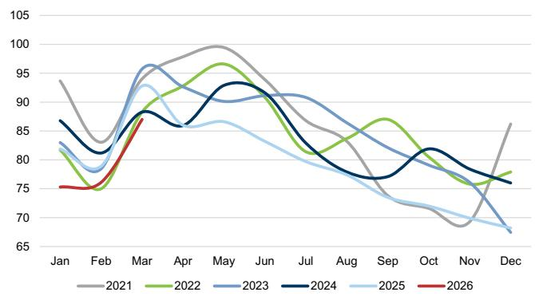

line

| Month | 2021 | 2022 | 2023 | 2024 | 2025 | 2026 |
|-------|------|------|------|------|------|------|
| Jan   | 94   | 83   | 87   | 87   | 83   | 75   |
| Feb   | 83   | 75   | 80   | 83   | 78   | 75   |
| Mar   | 96   | 88   | 96   | 96   | 93   | 87   |
| Apr   | 99   | 93   | 91   | 87   | 86   | -    |
| May   | 100  | 97   | 90   | 94   | 87   | -    |
| Jun   | 95   | 94   | 91   | 93   | 85   | -    |
| Jul   | 88   | 81   | 90   | 81   | 80   | -    |
| Aug   | 85   | 87   | 87   | 77   | 75   | -    |
| Sep   | 75   | 87   | 83   | 77   | 73   | -    |
| Oct   | 70   | 80   | 81   | 81   | 71   | -    |
| Nov   | 68   | 75   | 77   | 77   | 69   | -    |
| Dec   | 86   | 78   | 68   | 76   | 67   | -    |

Source: World Steel Association, GS Global Investment Research

Exhibit 15: China's Blast Furnace capacity utilization rate %   
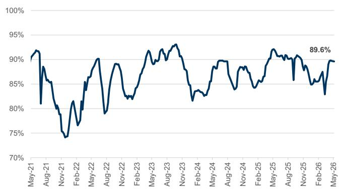

line

| Date    | Value  |
|---------|--------|
| May-26  | 89.6%  |

Source: CISA, Mysteel, GS Global Investment Research

Exhibit 16: China auto production (mn units)   
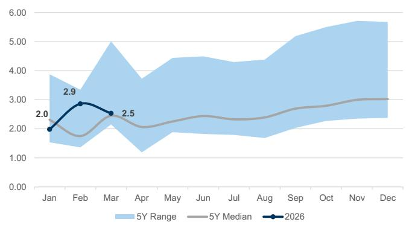

line

| Month | 5Y Range | 5Y Median | 2026 |
|-------|----------|-----------|------|
| Jan   | 3.8      | 2.0       | 2.0  |
| Feb   | 4.8      | 1.8       | 2.9  |
| Mar   | 5.0      | 2.5       | 2.5  |
| Apr   | 3.8      | 2.0       | -    |
| May   | 4.5      | 2.2       | -    |
| Jun   | 4.5      | 2.4       | -    |
| Jul   | 4.3      | 2.3       | -    |
| Aug   | 4.3      | 2.4       | -    |
| Sep   | 5.0      | 2.6       | -    |
| Oct   | 5.5      | 2.8       | -    |
| Nov   | 5.7      | 3.0       | -    |
| Dec   | 5.7      | 3.0       | -    |

Source: Bloomberg, GS Global Investment Research

# Macro/property indicators

Exhibit 17: 30-city daily property transaction volume in the primary market increased over the last week and was above year-ago level   
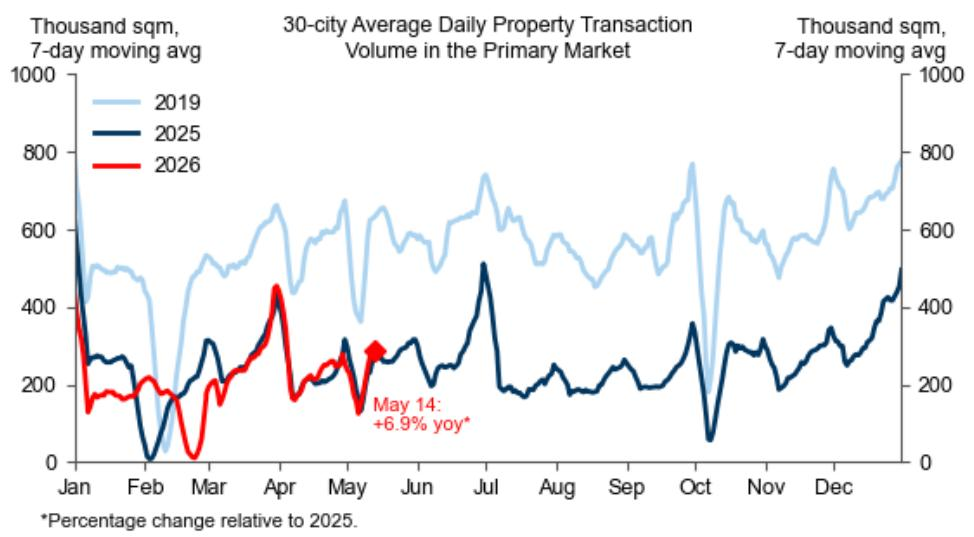

line

| Date       | 2019 (Thousand sqm) | 2025 (Thousand sqm) | 2026 (Thousand sqm) |
|------------|---------------------|---------------------|---------------------|
| May 14     | +6.9% yoy*          | -                   | -                   |

Source: Wind, GS Global Investment Research

Exhibit 18: Our manufacturing growth proxy increased in March while our construction growth proxy fell   
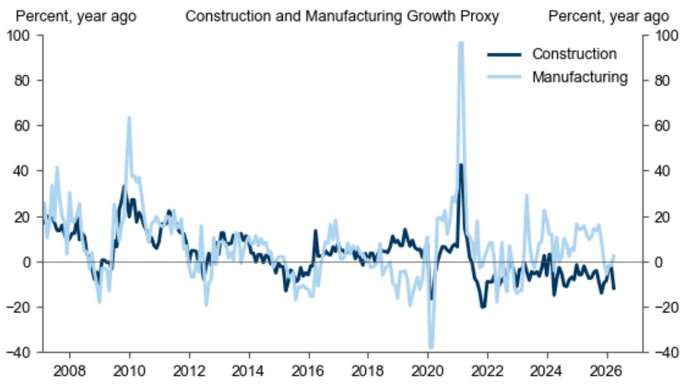

line

| Year | Construction | Manufacturing |
|------|--------------|---------------|
| 2008 | ~20%         | ~30%          |
| 2010 | ~30%         | ~65%          |
| 2012 | ~10%         | ~15%          |
| 2014 | ~15%         | ~10%          |
| 2016 | ~5%          | ~-10%         |
| 2018 | ~10%         | ~5%           |
| 2020 | ~-20%        | ~-40%         |
| 2022 | ~45%         | ~95%          |
| 2024 | ~-10%        | ~30%          |
| 2026 | ~-5%         | ~5%           |

Source: Haver Analytics, GS Global Investment Research

Exhibit 19: FAI-infrastructure (ex water/power supply) increased 8.9% yoy in 3M26, implying a increased of 7.2% in March-26   
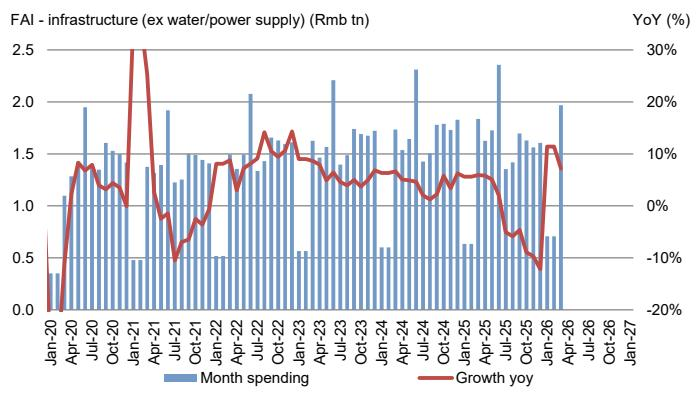

bar_line

| Month    | Month spending (Rmb tn) | Growth yoy (%) |
|----------|--------------------------|----------------|
| Jan-20   | 0.4                      | -              |
| Apr-20   | 1.9                      | 14%            |
| Jul-20   | 1.5                      | 10%            |
| Oct-20   | 1.4                      | 8%             |
| Jan-21   | 1.3                      | 30%            |
| Apr-21   | 1.9                      | 5%             |
| Jul-21   | 1.5                      | -5%            |
| Oct-21   | 1.4                      | 0%             |
| Jan-22   | 1.5                      | 5%             |
| Apr-22   | 2.1                      | 10%            |
| Jul-22   | 1.6                      | 15%            |
| Oct-22   | 1.5                      | 10%            |
| Jan-23   | 1.6                      | 15%            |
| Apr-23   | 2.2                      | 10%            |
| Jul-23   | 1.7                      | 5%             |
| Oct-23   | 1.7                      | 5%             |
| Jan-24   | 1.7                      | 5%             |
| Apr-24   | 2.3                      | 5%             |
| Jul-24   | 1.8                      | 5%             |
| Oct-24   | 1.8                      | 5%             |
| Jan-25   | 1.8                      | 5%             |
| Apr-25   | 2.4                      | 5%             |
| Jul-25   | 1.7                      | -5%            |
| Oct-25   | 1.7                      | -10%           |
| Jan-26   | 1.6                      | -5%            |
| Apr-26   | 2.0                      | 10%            |
| Jul-26   | 1.6                      | -5%            |
| Oct-26   | 1.6                      | -5%            |
| Jan-27   | 1.6                      | -5%            |

Source: CEIC, GS Global Investment Research

Exhibit 20: In the primary market, the sequential decline in 70-city weighted average property price eased to 4.1% mom annualized in March   
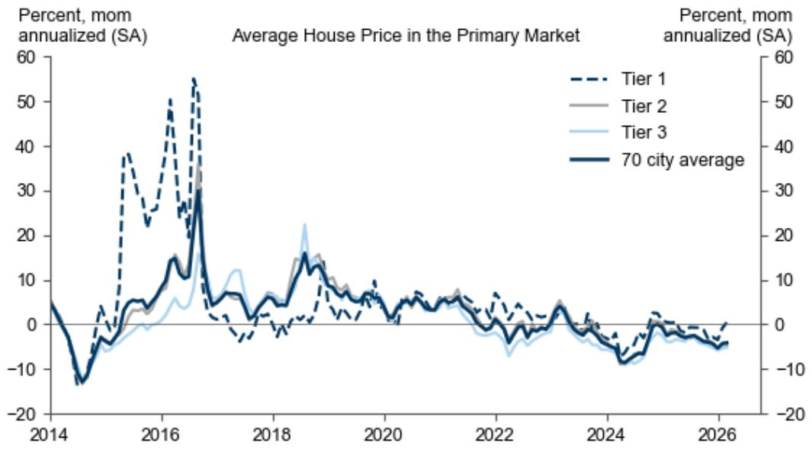

line

| Year | Tier 1 | Tier 2 | Tier 3 | 70 city average |
|------|--------|--------|--------|-----------------|
| 2014 | -15    | -10    | -5     | -15             |
| 2015 | 35     | 5      | 0      | 5               |
| 2016 | 50     | 15     | 10     | 15              |
| 2017 | 55     | 30     | 20     | 30              |
| 2018 | 5      | 10     | 5      | 10              |
| 2019 | 10     | 15     | 10     | 15              |
| 2020 | 5      | 5      | 5      | 5               |
| 2021 | 5      | 5      | 5      | 5               |
| 2022 | 5      | 5      | 5      | 5               |
| 2023 | 5      | 5      | 5      | 5               |
| 2024 | 5      | 5      | 5      | 5               |
| 2025 | 5      | 5      | 5      | 5               |
| 2026 | 5      | 5      | 5      | 5               |

Source: NBS, GS Global Investment Research

Exhibit 21: RMB 1.36bn local government special bonds have been issued year-to-date   
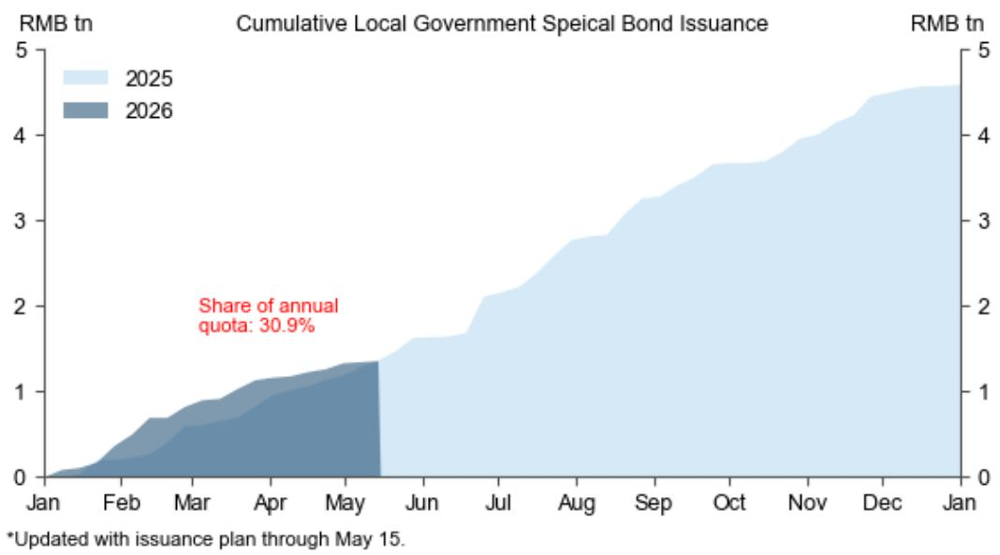

area

| Month | 2025 (RMB tn) | 2026 (RMB tn) |
|-------|---------------|---------------|
| Jan   | ~0            | ~0            |
| Feb   | ~0.5          | ~0.3          |
| Mar   | ~1.0          | ~0.8          |
| Apr   | ~1.5          | ~1.2          |
| May   | ~2.0          | ~1.5          |
| Jun   | ~2.5          | ~1.8          |
| Jul   | ~3.0          | ~2.0          |
| Aug   | ~3.5          | ~2.2          |
| Sep   | ~4.0          | ~2.5          |
| Oct   | ~4.5          | ~2.8          |
| Nov   | ~4.8          | ~3.0          |
| Dec   | ~5.0          | ~3.2          |
| Jan   | ~5.0          | ~3.3          |

Source: Wind, GS Global Investment Research

# Steel Trade & Demand

Exhibit 22: Monthly steel trade – China   
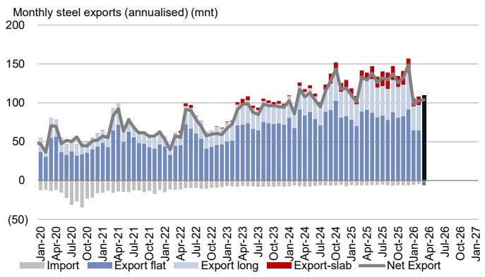

bar_line

Monthly steel exports (annualised) (mnt)
| Month | Import (mnt) | Export flat (mnt) | Export long (mnt) | Export-slab (mnt) | Net Export (mnt) |
|---|---|---|---|---|---|
| Jan-20 | 45 | 35 | 10 | 0 | 50 |
| Apr-20 | 50 | 30 | 15 | 0 | 60 |
| Jul-20 | 40 | 25 | 10 | 0 | 55 |
| Oct-20 | 45 | 30 | 15 | 0 | 60 |
| Jan-21 | 55 | 35 | 20 | 0 | 70 |
| Apr-21 | 60 | 40 | 25 | 0 | 80 |
| Jul-21 | 50 | 35 | 20 | 0 | 75 |
| Oct-21 | 45 | 30 | 15 | 0 | 70 |
| Jan-22 | 40 | 25 | 10 | 0 | 65 |
| Apr-22 | 55 | 40 | 20 | 10 | 85 |
| Jul-22 | 60 | 45 | 25 | 15 | 90 |
| Oct-22 | 50 | 35 | 15 | 10 | 80 |
| Jan-23 | 45 | 30 | 10 | 15 | 75 |
| Apr-23 | 60 | 40 | 20 | 20 | 95 |
| Jul-23 | 65 | 45 | 25 | 25 | 100 |
| Oct-23 | 60 | 40 | 20 | 30 | 95 |
| Jan-24 | 70 | 45 | 25 | 35 | 110 |
| Apr-24 | 75 | 50 | 30 | 40 | 115 |
| Jul-24 | 80 | 55 | 35 | 45 | 120 |
| Oct-24 | 85 | 60 | 40 | 50 | 130 |
| Jan-25 | 90 | 65 | 45 | 55 | 135 |
| Apr-25 | 95 | 70 | 50 | 60 | 140 |
| Jul-25 | 100 | 75 | 55 | 65 | 145 |
| Oct-25 | 105 | 80 | 60 | 70 | 150 |
| Jan-26 | 110 | 85 | 65 | 75 | 160 |
| Apr-26 | -100 | -90 | -80 | -90 | -110 |
| Jul-26 | -95 | -85 | -75 | -85 | -115 |
| Oct-26 | -90 | -80 | -70 | -80 | -120 |
| Jan-27 | -85 | -75 | -65 | -75 | -125 |
The data is already in the required format for future years. The values for 'Import' and 'Export' are estimated based on the provided code.

Source: CEIC, GS Global Investment Research

Exhibit 23: Steel inventory – social inventory and mills update   
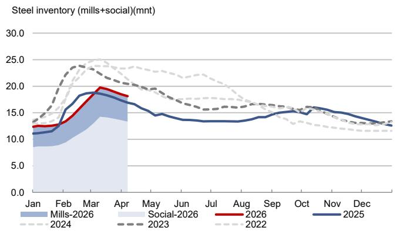

line

| Month | Mills-2026 | Social-2026 | 2025 | 2026 | 2023 | 2024 |
|-------|------------|-------------|------|------|------|------|
| Jan   | 10.0       | 10.0        | 10.0 | 10.0 | 10.0 | 10.0 |
| Feb   | 12.0       | 12.0        | 12.0 | 12.0 | 12.0 | 12.0 |
| Mar   | 18.0       | 18.0        | 18.0 | 18.0 | 18.0 | 18.0 |
| Apr   | 19.0       | 19.0        | 19.0 | 19.0 | 19.0 | 19.0 |
| May   | 17.0       | 17.0        | 17.0 | 17.0 | 17.0 | 17.0 |
| Jun   | 15.0       | 15.0        | 15.0 | 15.0 | 15.0 | 15.0 |
| Jul   | 14.0       | 14.0        | 14.0 | 14.0 | 14.0 | 14.0 |
| Aug   | 14.0       | 14.0        | 14.0 | 14.0 | 14.0 | 14.0 |
| Sep   | 15.0       | 15.0        | 15.0 | 15.0 | 15.0 | 15.0 |
| Oct   | 16.0       | 16.0        | 16.0 | 16.0 | 16.0 | 16.0 |
| Nov   | 14.0       | 14.0        | 14.0 | 14.0 | 14.0 | 14.0 |
| Dec   | 13.0       | 13.0        | 13.0 | 13.0 | 13.0 | 13.0 |

Source: Wind, GS Global Investment Research

Exhibit 24: Channel checks – steel orderbook trend   
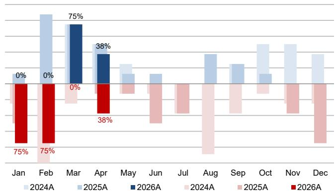

bar

| Month | 2024A (%) | 2025A (%) | 2026A (%) |
|---|---|---|---|
| Jan | 0 | 0 | 75 |
| Feb | 0 | 75 | 0 |
| Mar | 0 | 75 | 0 |
| Apr | 38 | 38 | 38 |
| May | 18 | 18 | 18 |
| Jun | 18 | 18 | 18 |
| Jul | 0 | 0 | 18 |
| Aug | 25 | 25 | 0 |
| Sep | 25 | 25 | 18 |
| Oct | 35 | 18 | 18 |
| Nov | 35 | 35 | 18 |
| Dec | 30 | 30 | 18 |

Source: Company data, GS Global Investment Research

Exhibit 25: Steel demand edged up over the past week   
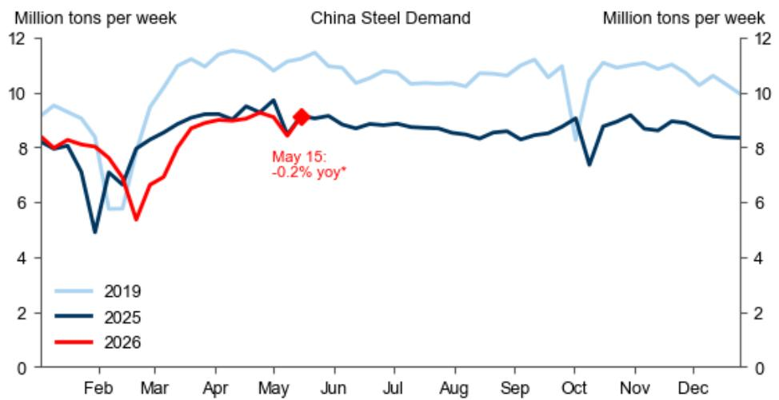

line

| Month | 2019 (Million tons per week) | 2025 (Million tons per week) | 2026 (Million tons per week) |
|-------|-------------------------------|------------------------------|------------------------------|
| Feb   | ~9.5                          | ~8.5                         | ~8.3                         |
| Mar   | ~10.5                         | ~7.5                         | ~5.5                         |
| Apr   | ~11.5                         | ~9.0                         | ~8.8                         |
| May   | ~11.0                         | ~9.5                         | ~9.0                         |
| Jun   | ~10.5                         | ~8.8                         | —                            |
| Jul   | ~10.5                         | ~8.5                         | —                            |
| Aug   | ~10.5                         | ~8.5                         | —                            |
| Sep   | ~10.5                         | ~8.5                         | —                            |
| Oct   | ~10.5                         | ~7.5                         | —                            |
| Nov   | ~11.0                         | ~9.0                         | —                            |
| Dec   | ~10.5                         | ~8.5                         | —                            |

\*Percentage change relative to the same week in 2025.   
Source: Mysteel, GS Global Investment Research

# Steelmakers' profitability

Exhibit 26: Chinese HRC prices increased 2% m/m and Rebar 1% m/m
RMB/t   
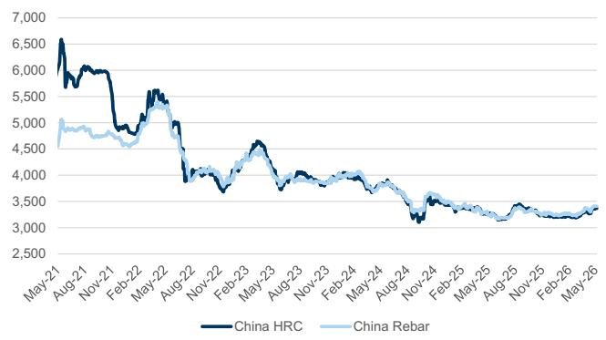

line

| Date    | China HRC | China Rebar |
|---------|-----------|-------------|
| May-21  | 6,500     | 5,000       |
| Aug-21  | 6,000     | 4,800       |
| Nov-21  | 5,800     | 4,700       |
| Feb-22  | 5,500     | 4,600       |
| May-22  | 5,600     | 4,700       |
| Aug-22  | 5,400     | 4,500       |
| Nov-22  | 4,000     | 3,800       |
| Feb-23  | 4,500     | 4,200       |
| May-23  | 4,600     | 4,300       |
| Aug-23  | 4,300     | 4,100       |
| Nov-23  | 4,100     | 3,900       |
| Feb-24  | 4,000     | 3,800       |
| May-24  | 3,800     | 3,700       |
| Aug-24  | 3,500     | 3,400       |
| Nov-24  | 3,300     | 3,200       |
| Feb-25  | 3,200     | 3,100       |
| May-25  | 3,100     | 3,000       |
| Aug-25  | 3,200     | 3,100       |
| Nov-25  | 3,300     | 3,200       |
| Feb-26  | 3,400     | 3,300       |
| May-26  | 3,500     | 3,400       |

Source: S&P Global Platts, GS Global Investment Research

Exhibit 27: BF ferrous feed spreads increased 9% m/m for HRC and 3% m/m Rebar in April...
BF ferrous feed, RMB/t   
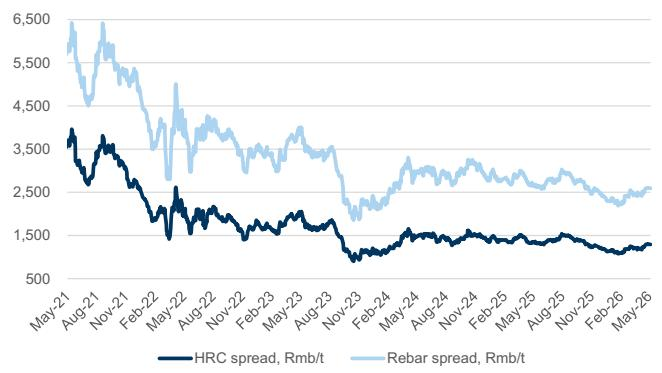

line

| Date    | HRC spread, Rmb/t | Rebar spread, Rmb/t |
|---------|-------------------|---------------------|
| May-21  | ~3,500            | ~6,000              |
| Aug-21  | ~3,000            | ~5,500              |
| Nov-21  | ~2,800            | ~5,000              |
| Feb-22  | ~2,500            | ~4,500              |
| May-22  | ~2,200            | ~4,000              |
| Aug-22  | ~1,800            | ~3,500              |
| Nov-22  | ~1,600            | ~3,000              |
| Feb-23  | ~1,500            | ~2,800              |
| May-23  | ~1,400            | ~2,600              |
| Aug-23  | ~1,300            | ~2,400              |
| Nov-23  | ~1,100            | ~2,200              |
| Feb-24  | ~1,000            | ~2,000              |
| May-24  | ~1,100            | ~2,200              |
| Aug-24  | ~1,200            | ~2,400              |
| Nov-24  | ~1,300            | ~2,600              |
| Feb-25  | ~1,400            | ~2,800              |
| May-25  | ~1,500            | ~3,000              |
| Aug-25  | ~1,600            | ~3,200              |
| Nov-25  | ~1,700            | ~3,400              |
| Feb-26  | ~1,800            | ~3,600              |
| May-26  | ~1,900            | ~3,800              |

Source: S&P Global Platts, Datastream, GS Global Investment Research

Exhibit 28: ...continuing higher than EAF ferrous feeds RMB/t   
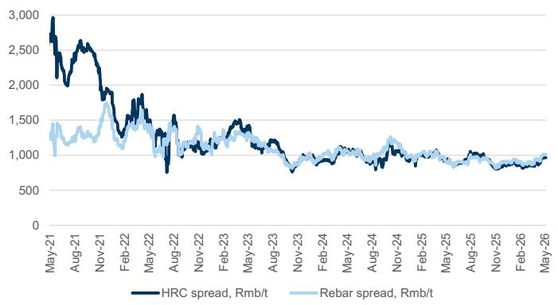

line

| Date   | HRC spread, Rmb/t | Rebar spread, Rmb/t |
|--------|-------------------|---------------------|
| May-21 | 3000              | 1500                |
| Aug-21 | 2500              | 1400                |
| Nov-21 | 2000              | 1300                |
| Feb-22 | 1800              | 1200                |
| May-22 | 1500              | 1100                |
| Aug-22 | 1000              | 900                 |
| Nov-22 | 1200              | 1100                |
| Feb-23 | 1400              | 1300                |
| May-23 | 1500              | 1400                |
| Aug-23 | 1300              | 1200                |
| Nov-23 | 1100              | 1000                |
| Feb-24 | 1000              | 900                 |
| May-24 | 900               | 800                 |
| Aug-24 | 1100              | 1000                |
| Nov-24 | 1300              | 1200                |
| Feb-25 | 1200              | 1100                |
| May-25 | 1100              | 1000                |
| Aug-25 | 1000              | 900                 |
| Nov-25 | 900               | 800                 |
| Feb-26 | 800               | 700                 |
| May-26 | 900               | 800                 |

Source: S&P Global Platts, Datastream, GS Global Investment Research

# Europe Steel Indicators

Exhibit 29: EU monthly crude steel production mn tonnes   
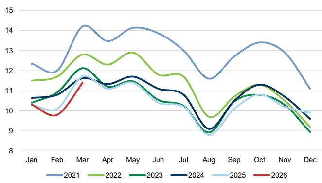

line

| Month | 2021 | 2022 | 2023 | 2024 | 2025 | 2026 |
|-------|------|------|------|------|------|------|
| Jan   | 12.5 | 11.5 | 10.5 | 10.7 | 10.3 | 10.4 |
| Feb   | 12.0 | 11.8 | 10.8 | 10.9 | 10.1 | 9.8  |
| Mar   | 14.3 | 12.8 | 12.1 | 11.7 | 11.5 | 11.4 |
| Apr   | 13.5 | 12.3 | 11.5 | 11.4 | 11.3 | -    |
| May   | 14.2 | 12.9 | 11.6 | 11.7 | 11.4 | -    |
| Jun   | 13.8 | 12.0 | 11.3 | 11.5 | 11.2 | -    |
| Jul   | 13.0 | 11.8 | 10.8 | 11.0 | 10.7 | -    |
| Aug   | 11.5 | 9.8  | 9.0  | 9.5  | 8.8  | -    |
| Sep   | 12.8 | 10.5 | 10.8 | 10.7 | 10.5 | -    |
| Oct   | 13.5 | 11.3 | 11.2 | 11.3 | 10.9 | -    |
| Nov   | 13.0 | 10.8 | 10.5 | 10.7 | 10.3 | -    |
| Dec   | 11.0 | 9.0  | 8.8  | 9.5  | 9.8  | -    |

Source: World Steel Association, GS Global Investment Research

Exhibit 30: Europe Steel Prices
EUR/t   
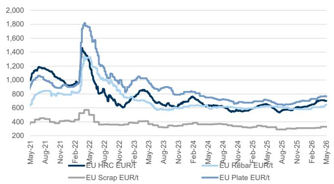

line

| Date    | EU HRC EUR/t | EU Rebar EUR/t | EU Scrap EUR/t | EU Plate EUR/t |
|---------|--------------|----------------|----------------|----------------|
| May-21  | ~1,100       | ~800           | ~400           | ~900           |
| Aug-21  | ~1,200       | ~900           | ~450           | ~1,000         |
| Nov-21  | ~1,100       | ~850           | ~450           | ~950           |
| Feb-22  | ~1,400       | ~1,000         | ~550           | ~1,800         |
| May-22  | ~1,300       | ~950           | ~450           | ~1,700         |
| Aug-22  | ~1,000       | ~850           | ~400           | ~1,500         |
| Nov-22  | ~800         | ~750           | ~350           | ~1,300         |
| Feb-23  | ~700         | ~700           | ~350           | ~1,200         |
| May-23  | ~650         | ~650           | ~350           | ~1,150         |
| Aug-23  | ~650         | ~650           | ~350           | ~1,100         |
| Nov-23  | ~650         | ~650           | ~350           | ~1,100         |
| Feb-24  | ~650         | ~650           | ~350           | ~1,100         |
| May-24  | ~650         | ~650           | ~350           | ~1,100         |
| Aug-24  | ~650         | ~650           | ~350           | ~1,100         |
| Nov-24  | ~650         | ~650           | ~350           | ~1,100         |
| Feb-25  | ~650         | ~650           | ~350           | ~1,100         |
| May-25  | ~650         | ~650           | ~350           | ~1,100         |
| Aug-25  | ~650         | ~650           | ~350           | ~1,100         |
| Nov-25  | ~650         | ~650           | ~350           | ~1,100         |
| Feb-26  | ~650         | ~650           | ~350           | ~1,100         |
| May-26  | ~650         | ~650           | ~350           | ~1,100         |

Source: S&P Global Platts, GS Global Investment Research

Exhibit 31: Europe ferrous feed spreads EUR/t   
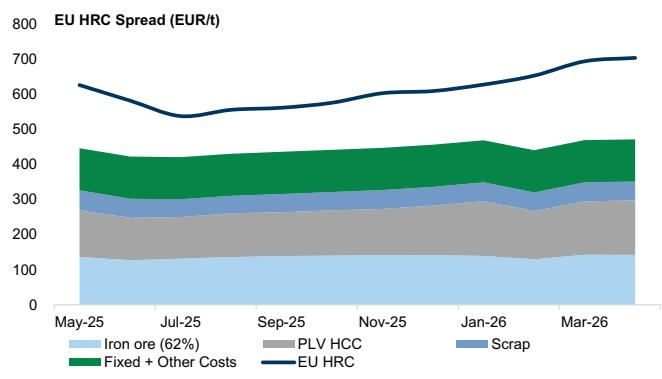

area

| Date   | Iron ore (62%) | PLV HCC | Scrap | Fixed + Other Costs | EU HRC |
|--------|----------------|---------|-------|---------------------|--------|
| May-25 | 140            | 120     | 80    | 130                 | 630    |
| Jul-25 | 130            | 110     | 70    | 120                 | 540    |
| Sep-25 | 135            | 115     | 75    | 125                 | 560    |
| Nov-25 | 140            | 120     | 80    | 130                 | 590    |
| Jan-26 | 145            | 125     | 85    | 135                 | 620    |
| Mar-26 | 150            | 130     | 90    | 140                 | 670    |

Source: S&P Global Platts, GS Global Investment Research

Exhibit 32: EU manufacturing PMI Index (lhs), % chg yoy (rhs)   
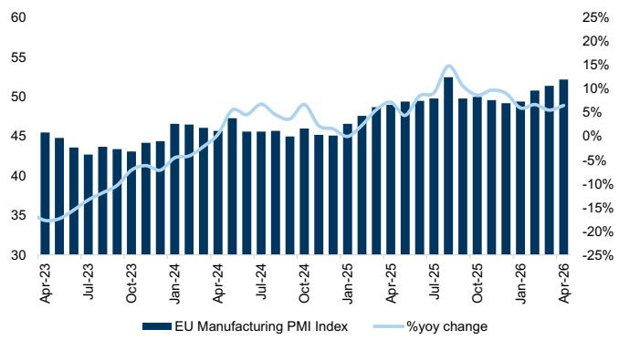

bar_line

| Month   | EU Manufacturing PMI Index | %yoy change |
|---------|-----------------------------|-------------|
| Apr-23  | 45                          | -15%        |
| Jul-23  | 43                          | -10%        |
| Oct-23  | 44                          | -5%         |
| Jan-24  | 47                          | 0%          |
| Apr-24  | 48                          | 5%          |
| Jul-24  | 46                          | 10%         |
| Oct-24  | 47                          | 5%          |
| Jan-25  | 48                          | 0%          |
| Apr-25  | 50                          | 10%         |
| Jul-25  | 52                          | 15%         |
| Oct-25  | 50                          | 10%         |
| Jan-26  | 51                          | 5%          |
| Apr-26  | 53                          | 10%         |

Source: S&P Global Market Intelligence, GS Global Investment Research

Exhibit 33: EU monthly auto production (mn units)   
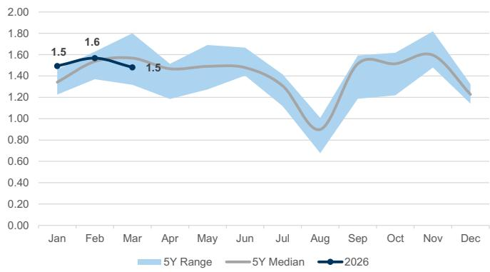

line

| Month | 5Y Range | 5Y Median | 2026 |
|-------|----------|-----------|------|
| Jan   |          |           | 1.5  |
| Feb   |          |           | 1.6  |
| Mar   |          |           | 1.5  |
| Apr   |          |           |      |
| May   |          |           |      |
| Jun   |          |           |      |
| Jul   |          |           |      |
| Aug   |          |           |      |
| Sep   |          |           |      |
| Oct   |          |           |      |
| Nov   |          |           |      |
| Dec   |          |           |      |

Source: GS Global Investment Research, Bloomberg

# US Steel Indicators

Exhibit 34: US steel production   
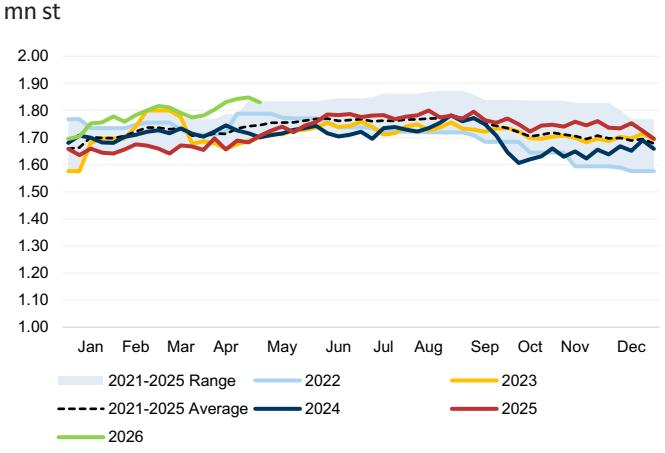

line

| Month | 2021-2025 Range | 2022 | 2023 | 2021-2025 Average | 2024 | 2025 | 2026 |
|-------|-----------------|------|------|-------------------|------|------|------|
| Jan   | ~1.70           | ~1.70| ~1.65| ~1.70             | ~1.70| ~1.70| ~1.70|
| Feb   | ~1.70           | ~1.70| ~1.75| ~1.70             | ~1.70| ~1.70| ~1.80|
| Mar   | ~1.70           | ~1.70| ~1.75| ~1.70             | ~1.70| ~1.70| ~1.80|
| Apr   | ~1.70           | ~1.70| ~1.75| ~1.70             | ~1.70| ~1.70| ~1.85|
| May   | ~1.70           | ~1.70| ~1.75| ~1.70             | ~1.70| ~1.75| ~1.85|
| Jun   | ~1.70           | ~1.70| ~1.75| ~1.70             | ~1.70| ~1.80| ~1.80|
| Jul   | ~1.70           | ~1.70| ~1.75| ~1.70             | ~1.70| ~1.80| ~1.80|
| Aug   | ~1.70           | ~1.70| ~1.75| ~1.70             | ~1.70| ~1.80| ~1.80|
| Sep   | ~1.70           | ~1.70| ~1.75| ~1.70             | ~1.65| ~1.80| ~1.80|
| Oct   | ~1.70           | ~1.70| ~1.75| ~1.70             | ~1.65| ~1.80| ~1.80|
| Nov   | ~1.70           | ~1.70| ~1.75| ~1.70             | ~1.65| ~1.80| ~1.80|
| Dec   | ~1.70           | ~1.70| ~1.75| ~1.70             | ~1.65| ~1.80| ~1.80|

Source: World Steel Association, Eurofer, S&P Global Platts, GS Global Investment Research

Exhibit 35: US steel production capacity utilization   
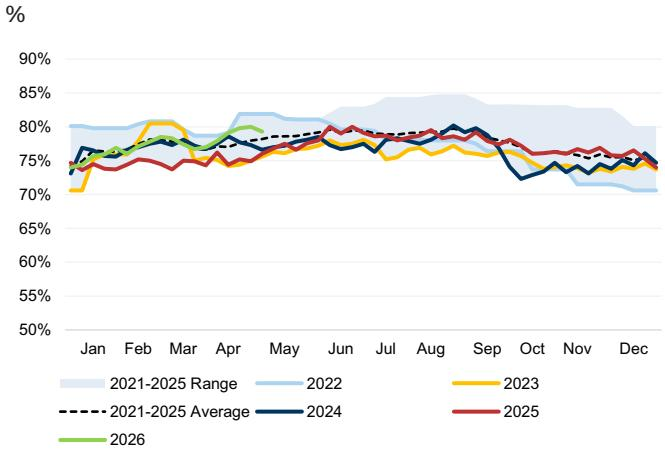

line

| Month | 2021-2025 Range | 2022 | 2023 | 2021-2025 Average | 2024 | 2025 | 2026 |
|-------|------------------|------|------|---------------------|------|------|------|
| Jan   | ~75%             | ~80% | ~70% | ~75%                | ~75% | ~75% | ~75% |
| Feb   | ~75%             | ~80% | ~80% | ~75%                | ~75% | ~75% | ~75% |
| Mar   | ~75%             | ~80% | ~80% | ~75%                | ~75% | ~75% | ~75% |
| Apr   | ~75%             | ~80% | ~75% | ~75%                | ~75% | ~75% | ~75% |
| May   | ~75%             | ~80% | ~75% | ~75%                | ~75% | ~75% | ~75% |
| Jun   | ~75%             | ~80% | ~75% | ~75%                | ~75% | ~75% | ~75% |
| Jul   | ~75%             | ~80% | ~75% | ~75%                | ~75% | ~75% | ~75% |
| Aug   | ~75%             | ~80% | ~75% | ~75%                | ~75% | ~75% | ~75% |
| Sep   | ~75%             | ~80% | ~75% | ~75%                | ~75% | ~75% | ~75% |
| Oct   | ~75%             | ~80% | ~75% | ~75%                | ~75% | ~75% | ~75% |
| Nov   | ~75%             | ~80% | ~75% | ~75%                | ~75% | ~75% | ~75% |
| Dec   | ~75%             | ~80% | ~75% | ~75%                | ~75% | ~75% | ~75% |

Source: World Steel Association, Eurofer, S&P Global Platts, GS Global Investment Research

Exhibit 36: US steel prices   
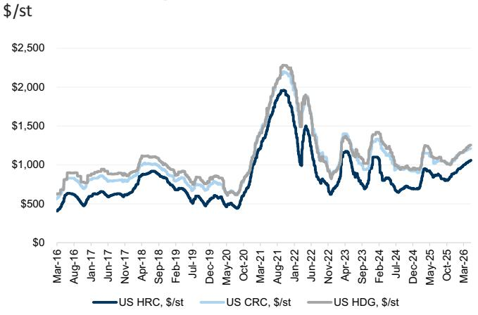

line

| Date    | US HRC, $/st | US CRC, $/st | US HDG, $/st |
|---------|--------------|--------------|--------------|
| Mar-16  | ~$400        | ~$500        | ~$600        |
| Aug-16  | ~$500        | ~$600        | ~$700        |
| Jan-17  | ~$600        | ~$700        | ~$800        |
| Jun-17  | ~$700        | ~$800        | ~$900        |
| Nov-17  | ~$800        | ~$900        | ~$1,000      |
| Apr-18  | ~$900        | ~$1,000      | ~$1,100      |
| Sep-18  | ~$1,000      | ~$1,100      | ~$1,200      |
| Feb-19  | ~$1,100      | ~$1,200      | ~$1,300      |
| Jul-19  | ~$1,200      | ~$1,300      | ~$1,400      |
| Dec-19  | ~$1,300      | ~$1,400      | ~$1,500      |
| May-20  | ~$1,400      | ~$1,500      | ~$1,600      |
| Oct-20  | ~$1,500      | ~$1,600      | ~$1,700      |
| Mar-21  | ~$1,600      | ~$1,700      | ~$1,800      |
| Aug-21  | ~$2,000      | ~$2,100      | ~$2,200      |
| Jan-22  | ~$1,800      | ~$2,000      | ~$2,100      |
| Jun-22  | ~$1,500      | ~$1,600      | ~$1,700      |
| Nov-22  | ~$1,300      | ~$1,400      | ~$1,500      |
| Apr-23  | ~$1,200      | ~$1,300      | ~$1,400      |
| Sep-23  | ~$1,100      | ~$1,200      | ~$1,300      |
| Feb-24  | ~$1,000      | ~$1,100      | ~$1,200      |
| Jul-24  | ~$900        | ~$1,000      | ~$1,100      |
| Dec-24  | ~$800        | ~$900        | ~$1,000      |
| May-25  | ~$750        | ~$850        | ~$950        |
| Oct-25  | ~$850        | ~$950        | ~$1,050      |
| Mar-26  | ~$950        | ~$1,150      | ~$1,250      |

Source: S&P Global Platts, GS Global Investment Research

Exhibit 37: HRC-BOF and HRC-EAF spreads   
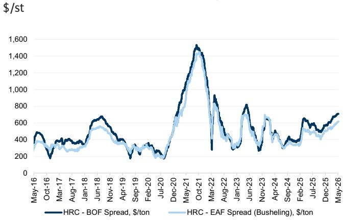

line

| Date    | HRC - BOF Spread, $/ton | HRC - EAF Spread (Busheling), $/ton |
|---------|--------------------------|-------------------------------------|
| May-16  | ~450                     | ~350                                |
| Oct-16  | ~200                     | ~250                                |
| Mar-17  | ~400                     | ~300                                |
| Aug-17  | ~450                     | ~350                                |
| Jan-18  | ~500                     | ~400                                |
| Jun-18  | ~650                     | ~550                                |
| Nov-18  | ~550                     | ~450                                |
| Apr-19  | ~400                     | ~300                                |
| Sep-19  | ~300                     | ~250                                |
| Feb-20  | ~350                     | ~300                                |
| Jul-20  | ~200                     | ~250                                |
| Dec-20  | ~600                     | ~500                                |
| May-21  | ~1,450                   | ~1,350                              |
| Oct-21  | ~1,500                   | ~1,400                              |
| Mar-22  | ~900                     | ~800                                |
| Aug-22  | ~400                     | ~350                                |
| Jan-23  | ~800                     | ~700                                |
| Jun-23  | ~650                     | ~600                                |
| Nov-23  | ~450                     | ~400                                |
| Apr-24  | ~500                     | ~450                                |
| Sep-24  | ~450                     | ~400                                |
| Feb-25  | ~650                     | ~600                                |
| Jul-25  | ~600                     | ~550                                |
| Dec-25  | ~700                     | ~650                                |
| May-26  | ~750                     | ~700                                |

Source: S&P Global Platts, GS Global Investment Research

Exhibit 38: US Total construction (\$ bn) spending and change YoY %   
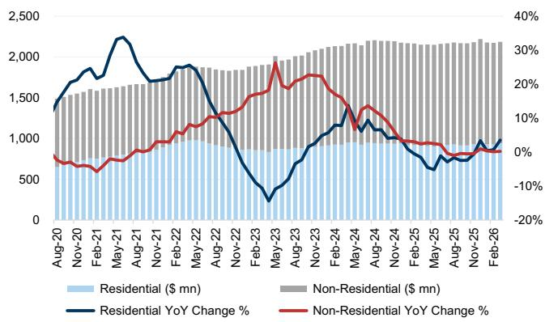

line

| Date    | Residential ($ mn) | Non-Residential ($ mn) | Residential YoY Change % | Non-Residential YoY Change % |
|---------|--------------------|------------------------|--------------------------|------------------------------|
| Aug-20  | ~1,400             | ~1,500                 | ~7%                      | ~1%                          |
| Nov-20  | ~1,600             | ~1,600                 | ~6%                      | ~1%                          |
| Feb-21  | ~1,800             | ~1,700                 | ~7%                      | ~1%                          |
| May-21  | ~2,200             | ~1,800                 | ~8%                      | ~1%                          |
| Aug-21  | ~1,900             | ~1,700                 | ~9%                      | ~1%                          |
| Nov-21  | ~1,800             | ~1,600                 | ~10%                     | ~1%                          |
| Feb-22  | ~1,900             | ~1,700                 | ~11%                     | ~1%                          |
| May-22  | ~1,800             | ~1,800                 | ~12%                     | ~1%                          |
| Aug-22  | ~1,700             | ~1,900                 | ~13%                     | ~1%                          |
| Nov-22  | ~1,600             | ~2,000                 | ~14%                     | ~1%                          |
| Feb-23  | ~500               | ~2,100                 | ~-15%                    | ~35%                         |
| May-23  | ~300               | ~2,200                 | ~-15%                    | ~35%                         |
| Aug-23  | ~800               | ~2,300                 | ~-15%                    | ~35%                         |
| Nov-23  | ~1,000             | ~2,400                 | ~-15%                    | ~35%                         |
| Feb-24  | ~1,200             | ~2,500                 | ~-15%                    | ~35%                         |
| May-24  | ~1,400             | ~2,600                 | ~-15%                    | ~35%                         |
| Aug-24  | ~1,300             | ~2,700                 | ~-15%                    | ~35%                         |
| Nov-24  | ~1,200             | ~2,800                 | ~-15%                    | ~35%                         |
| Feb-25  | ~900               | ~2,900                 | ~-15%                    | ~35%                         |
| May-25  | ~700               | ~3,000                 | ~-15%                    | ~35%                         |
| Aug-25  | ~800               | ~3,100                 | ~-15%                    | ~35%                         |
| Nov-25  | ~900               | ~3,200                 | ~-15%                    | ~35%                         |
| Feb-26  | ~1,000             | ~3,300                 | ~-15%                    | ~35%                         |

Source: CRU Group, US Census Bureau, Baker Hughes, AISI, Bloomberg, GS Global Investment Research

Exhibit 39: Annualised steel imports (mn st)   
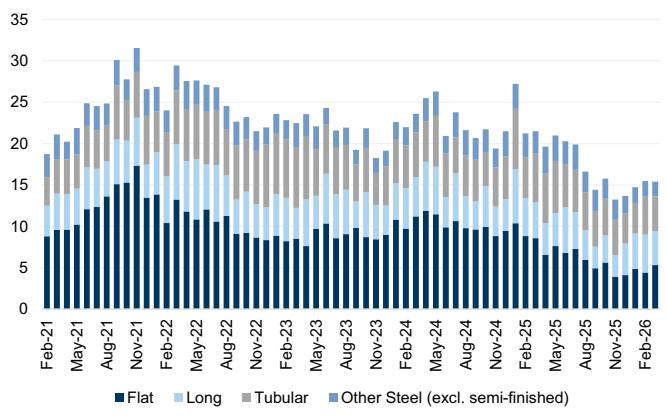

bar_stacked

| Month | Flat | Long | Tubular | Other Steel (excl. semi-finished) |
| :--- | :--- | :--- | :--- | :--- |
| Feb-21 | 9 | 4 | 5 | 7 |
| May-21 | 10 | 5 | 5 | 8 |
| Aug-21 | 13 | 6 | 5 | 8 |
| Nov-21 | 15 | 7 | 5 | 10 |
| Feb-22 | 14 | 6 | 5 | 7 |
| May-22 | 13 | 7 | 5 | 7 |
| Aug-22 | 11 | 6 | 5 | 7 |
| Nov-22 | 9 | 5 | 6 | 7 |
| Feb-23 | 8 | 5 | 6 | 7 |
| May-23 | 8 | 5 | 6 | 7 |
| Aug-23 | 10 | 6 | 5 | 7 |
| Nov-23 | 9 | 5 | 5 | 7 |
| Feb-24 | 11 | 6 | 5 | 7 |
| May-24 | 12 | 6 | 5 | 8 |
| Aug-24 | 10 | 6 | 5 | 7 |
| Nov-24 | 9 | 5 | 5 | 7 |
| Feb-25 | 10 | 6 | 5 | 7 |
| May-25 | 8 | 5 | 6 | 7 |
| Aug-25 | 7 | 5 | 6 | 7 |
| Nov-25 | 5 | 4 | 6 | 7 |
| Feb-26 | 5 | 4 | 6 | 7 |
The chart displays a stacked bar chart with categories labeled as 'Flat', 'Long', 'Tubular', and 'Other Steel (excl. semi-finished)'. The x-axis represents time in months from Feb-21 to Feb-26. The y-axis represents production volume in millions. There is no explicit numerical values but rather a temporal comparison of production levels across these steel types over time.

Source: US Census Bureau, AISI, Bloomberg, GS Global Investment Research

Exhibit 40: Monthly steel imports by region (k st)   
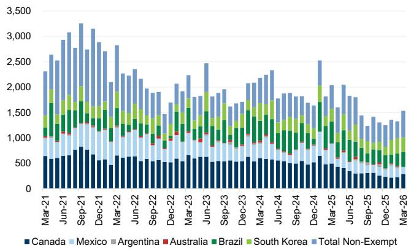

bar_stacked

| Month | Canada | Mexico | Argentina | Australia | Brazil | South Korea | Total Non-Exempt |
|---|---|---|---|---|---|---|---|
| Mar-21 | 700 | 300 | 150 | 50 | 400 | 600 | 1300 |
| Jun-21 | 750 | 350 | 150 | 50 | 400 | 650 | 1450 |
| Sep-21 | 800 | 400 | 150 | 50 | 450 | 700 | 1600 |
| Dec-21 | 700 | 350 | 150 | 50 | 450 | 650 | 1350 |
| Mar-22 | 750 | 350 | 150 | 50 | 450 | 650 | 1450 |
| Jun-22 | 750 | 350 | 150 | 50 | 450 | 650 | 1450 |
| Sep-22 | 750 | 350 | 150 | 50 | 450 | 650 | 1450 |
| Dec-22 | 750 | 350 | 150 | 50 | 450 | 650 | 1450 |
| Mar-23 | 750 | 350 | 150 | 50 | 450 | 650 | 1450 |
| Jun-23 | 750 | 350 | 150 | 50 | 450 | 650 | 1450 |
| Sep-23 | 750 | 350 | 150 | 50 | 450 | 650 | 1450 |
| Dec-23 | 750 | 350 | 150 | 50 | 450 | 650 | 1450 |
| Mar-24 | 750 | 350 | 150 | 50 | 450 | 650 | 1450 |
| Jun-24 | 750 | 350 | 150 | 50 | 450 | 650 | 1450 |
| Sep-24 | 750 | 350 | 150 | 50 | 450 | 650 | 1450 |
| Dec-24 | 750 | 350 | 150 | 50 | 450 | 650 | 1450 |
| Mar-25 | 750 | 350 | 150 | 50 | 450 | 650 | 1450 |
| Jun-25 | 750 | 350 | 150 | 50 | 450 | 650 | 1450 |
| Sep-25 | 750 | 350 | 150 | 50 | 450 | 650 | 1450 |
| Dec-25 | 750 | 350 | 150 | 50 | 450 | 650 | 1450 |
| Mar-26 | 750 | 350 | 150 | 50 | 450 | 650 | 1450 |
The chart displays a stacked bar chart representing the cumulative non-exempt cases over time. The x-axis represents time from Mar-21 to Mar-26, and the y-axis represents the number of cases. The legend indicates that each bar is labeled with its corresponding country name. The data is presented in a single column for all bars. There are no labels or additional data series in this image. The title explicitly states 'Total Exempt' but does not correspond to any data series in this image. The legend is used to differentiate countries by color: dark blue for Canada, light blue for Mexico, gray for Argentina, red for Australia, green for Brazil, and light blue for South Korea. The chart is saved as a PNG file named 'exempt' and displayed on the right side of the chart.

Source: US Census Bureau, AISI, Bloomberg, GS Global Investment Research

Exhibit 42: Total steel shipments   
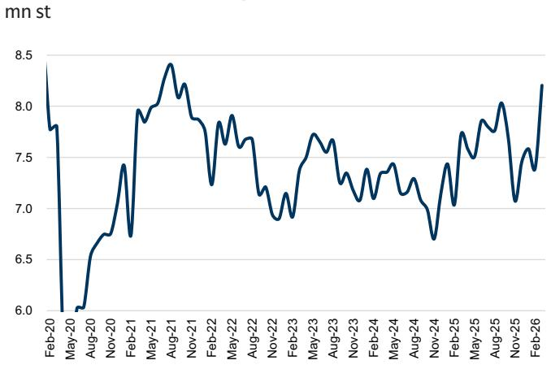

line

| Date    | Value |
|---------|-------|
| Feb-20  | 8.4   |
| May-20  | 6.0   |
| Aug-20  | 6.7   |
| Nov-20  | 7.4   |
| Feb-21  | 7.9   |
| May-21  | 8.4   |
| Aug-21  | 8.1   |
| Nov-21  | 7.8   |
| Feb-22  | 7.3   |
| May-22  | 7.9   |
| Aug-22  | 7.6   |
| Nov-22  | 7.1   |
| Feb-23  | 6.9   |
| May-23  | 7.7   |
| Aug-23  | 7.3   |
| Nov-23  | 7.1   |
| Feb-24  | 7.4   |
| May-24  | 7.3   |
| Aug-24  | 6.7   |
| Nov-24  | 7.4   |
| Feb-25  | 7.1   |
| May-25  | 7.8   |
| Aug-25  | 8.0   |
| Nov-25  | 7.1   |
| Feb-26  | 8.2   |

Source: US Census Bureau, AISI, Bloomberg, GS Global Investment Research

# Latin America Steel Indicators

Exhibit 44: LatAm crude steel production   
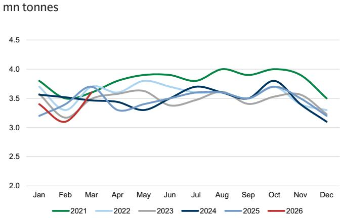

line

| Month | 2021 | 2022 | 2023 | 2024 | 2025 | 2026 |
|-------|------|------|------|------|------|------|
| Jan   | 3.8  | 3.6  | 3.5  | 3.6  | 3.2  | 3.4  |
| Feb   | 3.5  | 3.4  | 3.3  | 3.5  | 3.6  | 3.1  |
| Mar   | 3.7  | 3.6  | 3.5  | 3.6  | 3.7  | 3.5  |
| Apr   | 3.8  | 3.7  | 3.6  | 3.5  | 3.6  | 3.4  |
| May   | 3.9  | 3.8  | 3.7  | 3.4  | 3.5  | 3.3  |
| Jun   | 3.9  | 3.7  | 3.6  | 3.5  | 3.4  | 3.4  |
| Jul   | 4.0  | 3.8  | 3.7  | 3.6  | 3.5  | 3.5  |
| Aug   | 4.0  | 3.7  | 3.6  | 3.7  | 3.6  | 3.6  |
| Sep   | 4.0  | 3.6  | 3.5  | 3.8  | 3.7  | 3.7  |
| Oct   | 4.0  | 3.5  | 3.4  | 3.9  | 3.8  | 3.8  |
| Nov   | 4.0  | 3.4  | 3.3  | 3.8  | 3.7  | 3.7  |
| Dec   | 3.5  | 3.2  | 3.1  | 3.1  | 3.2  | 3.1  |

Source: World Steel Association, GS Global Investment Research

Exhibit 41: Annualized monthly apparent demand (mn tons)   

bar_line

| Month | Shipments | Imports (finished product) | Exports | Apparent demand |
| :--- | :--- | :--- | :--- | :--- |
| Feb-22 | 95 | 120 | -10 | 110 |
| May-22 | 94 | 121 | -10 | 111 |
| Aug-22 | 93 | 118 | -10 | 109 |
| Nov-22 | 87 | 105 | -15 | 100 |
| Feb-23 | 88 | 113 | -10 | 103 |
| May-23 | 90 | 116 | -10 | 106 |
| Aug-23 | 89 | 109 | -10 | 100 |
| Nov-23 | 88 | 107 | -10 | 99 |
| Feb-24 | 87 | 109 | -10 | 100 |
| May-24 | 88 | 115 | -10 | 103 |
| Aug-24 | 86 | 107 | -10 | 99 |
| Nov-24 | 83 | 103 | -10 | 95 |
| Feb-25 | 89 | 114 | -10 | 105 |
| May-25 | 92 | 113 | -10 | 107 |
| Aug-25 | 93 | 114 | -10 | 106 |
| Nov-25 | 90 | 107 | -10 | 98 |
| Feb-26 | 95 | 113 | -10 | 107 |

Source: US Census Bureau, AISI, Bloomberg, GS Global Investment Research

Exhibit 43: North America auto production   
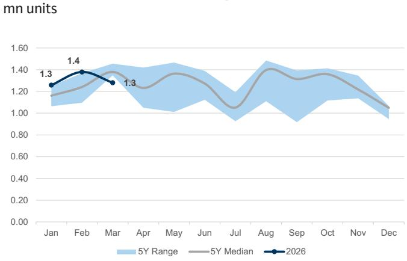

line

| Month | 5Y Range | 5Y Median | 2026 |
|-------|----------|-----------|------|
| Jan   | 1.1      | 1.2       | 1.3  |
| Feb   | 1.2      | 1.3       | 1.4  |
| Mar   | 1.3      | 1.3       | 1.3  |
| Apr   | 1.2      | 1.2       | -    |
| May   | 1.3      | 1.3       | -    |
| Jun   | 1.2      | 1.2       | -    |
| Jul   | 1.0      | 1.0       | -    |
| Aug   | 1.4      | 1.4       | -    |
| Sep   | 1.3      | 1.3       | -    |
| Oct   | 1.3      | 1.3       | -    |
| Nov   | 1.2      | 1.2       | -    |
| Dec   | 1.0      | 1.0       | -    |

Source: Bloomberg, GS Global Investment Research

Exhibit 45: Brazil steel prices (R\$/t)   
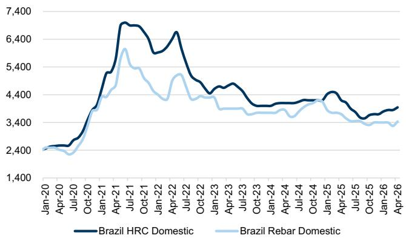

line

| Date    | Brazil HRC Domestic | Brazil Rebar Domestic |
|---------|---------------------|------------------------|
| Jan-20  | 2,400               | 2,400                  |
| Apr-20  | 2,400               | 2,400                  |
| Jul-20  | 2,400               | 2,400                  |
| Oct-20  | 3,500               | 3,500                  |
| Jan-21  | 4,500               | 4,500                  |
| Apr-21  | 6,800               | 5,800                  |
| Jul-21  | 6,800               | 5,500                  |
| Oct-21  | 6,500               | 5,000                  |
| Jan-22  | 6,500               | 4,500                  |
| Apr-22  | 6,500               | 4,800                  |
| Jul-22  | 5,500               | 4,500                  |
| Oct-22  | 4,500               | 4,000                  |
| Jan-23  | 4,500               | 3,800                  |
| Apr-23  | 4,500               | 3,700                  |
| Jul-23  | 4,500               | 3,600                  |
| Oct-23  | 4,500               | 3,600                  |
| Jan-24  | 4,500               | 3,600                  |
| Apr-24  | 4,500               | 3,600                  |
| Jul-24  | 4,500               | 3,700                  |
| Oct-24  | 4,500               | 3,800                  |
| Jan-25  | 4,500               | 3,800                  |
| Apr-25  | 4,500               | 3,700                  |
| Jul-25  | 4,500               | 3,600                  |
| Oct-25  | 4,500               | 3,600                  |
| Jan-26  | 4,500               | 3,600                  |
| Apr-26  | 4,500               | 3,600                  |

Source: Platts

Exhibit 46: Brazil's Flat Steel Apparent Consumption (kt)   
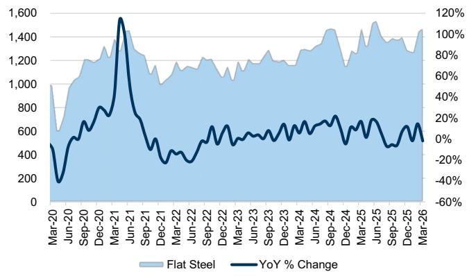

line

| Date    | Flat Steel | YoY % Change |
|---------|------------|--------------|
| Mar-20  | ~1,000     | ~50%         |
| Jun-20  | ~1,200     | ~30%         |
| Sep-20  | ~1,300     | ~60%         |
| Dec-20  | ~1,400     | ~80%         |
| Mar-21  | ~1,500     | ~120%        |
| Jun-21  | ~1,400     | ~100%        |
| Sep-21  | ~1,300     | ~60%         |
| Dec-21  | ~1,200     | ~40%         |
| Mar-22  | ~1,100     | ~30%         |
| Jun-22  | ~1,200     | ~50%         |
| Sep-22  | ~1,300     | ~60%         |
| Dec-22  | ~1,200     | ~50%         |
| Mar-23  | ~1,300     | ~60%         |
| Jun-23  | ~1,400     | ~70%         |
| Sep-23  | ~1,300     | ~60%         |
| Dec-23  | ~1,400     | ~70%         |
| Mar-24  | ~1,500     | ~80%         |
| Jun-24  | ~1,400     | ~70%         |
| Sep-24  | ~1,500     | ~80%         |
| Dec-24  | ~1,400     | ~70%         |
| Mar-25  | ~1,500     | ~80%         |
| Jun-25  | ~1,400     | ~70%         |
| Sep-25  | ~1,300     | ~60%         |
| Dec-25  | ~1,400     | ~70%         |
| Mar-26  | ~1,500     | ~80%         |

Source: IABR

Exhibit 47: Brazil's Long Steel Apparent Consumption (kt)   
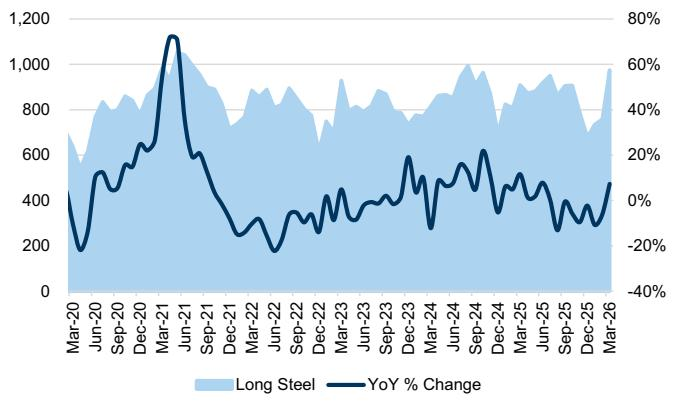

line

| Date    | Long Steel | YoY % Change |
|---------|------------|--------------|
| Mar-20  | ~700       | ~40%         |
| Jun-20  | ~800       | ~20%         |
| Sep-20  | ~900       | ~30%         |
| Dec-20  | ~1,000     | ~50%         |
| Mar-21  | ~1,100     | ~70%         |
| Jun-21  | ~1,000     | ~60%         |
| Sep-21  | ~800       | ~30%         |
| Dec-21  | ~700       | ~10%         |
| Mar-22  | ~800       | ~20%         |
| Jun-22  | ~900       | ~30%         |
| Sep-22  | ~800       | ~20%         |
| Dec-22  | ~700       | ~10%         |
| Mar-23  | ~900       | ~30%         |
| Jun-23  | ~800       | ~20%         |
| Sep-23  | ~900       | ~30%         |
| Dec-23  | ~800       | ~40%         |
| Mar-24  | ~900       | ~50%         |
| Jun-24  | ~1,000     | ~60%         |
| Sep-24  | ~900       | ~50%         |
| Dec-24  | ~800       | ~40%         |
| Mar-25  | ~900       | ~30%         |
| Jun-25  | ~800       | ~20%         |
| Sep-25  | ~900       | ~30%         |
| Dec-25  | ~800       | ~20%         |
| Mar-26  | ~1,100     | ~40%         |

Source: IABR

Exhibit 48: Brazilian steel distributors' shipments (kt)   
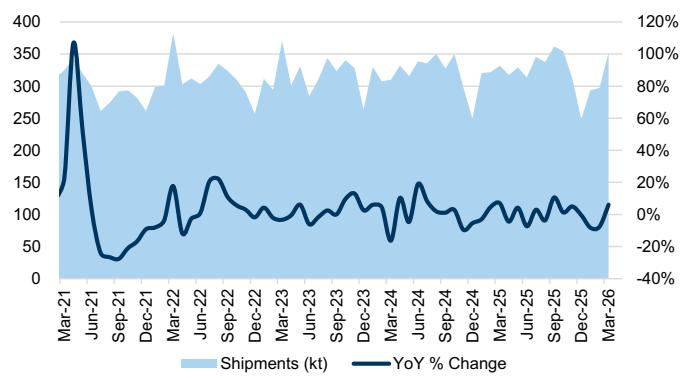

line

| Date    | Shipments (kt) | YoY % Change |
|---------|----------------|--------------|
| Mar-21  | ~350           | ~100%        |
| Jun-21  | ~300           | ~-20%        |
| Sep-21  | ~280           | ~-30%        |
| Dec-21  | ~300           | ~-10%        |
| Mar-22  | ~380           | ~15%         |
| Jun-22  | ~320           | ~10%         |
| Sep-22  | ~340           | ~5%          |
| Dec-22  | ~300           | ~0%          |
| Mar-23  | ~360           | ~5%          |
| Jun-23  | ~340           | ~0%          |
| Sep-23  | ~350           | ~5%          |
| Dec-23  | ~330           | ~0%          |
| Mar-24  | ~340           | ~5%          |
| Jun-24  | ~350           | ~10%         |
| Sep-24  | ~360           | ~5%          |
| Dec-24  | ~340           | ~0%          |
| Mar-25  | ~350           | ~5%          |
| Jun-25  | ~360           | ~10%         |
| Sep-25  | ~370           | ~5%          |
| Dec-25  | ~350           | ~0%          |
| Mar-26  | ~340           | ~5%          |

Source: INDA

Exhibit 49: Brazilian steel distributors' inventories (kt)   
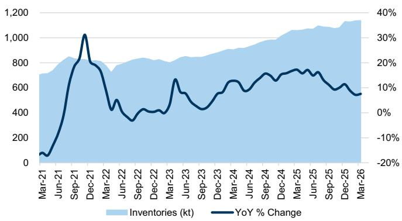

line

| Date    | Inventories (kt) | YoY % Change |
|---------|------------------|--------------|
| Mar-21  | ~700             | ~-15%        |
| Jun-21  | ~850             | ~-5%         |
| Sep-21  | ~950             | ~30%         |
| Dec-21  | ~800             | ~40%         |
| Mar-22  | ~750             | ~-5%         |
| Jun-22  | ~800             | ~-10%        |
| Sep-22  | ~850             | ~-5%         |
| Dec-22  | ~800             | ~0%          |
| Mar-23  | ~850             | ~15%         |
| Jun-23  | ~800             | ~-5%         |
| Sep-23  | ~850             | ~-10%        |
| Dec-23  | ~900             | ~-5%         |
| Mar-24  | ~950             | ~10%         |
| Jun-24  | ~1,000           | ~15%         |
| Sep-24  | ~1,050           | ~10%         |
| Dec-24  | ~1,100           | ~15%         |
| Mar-25  | ~1,150           | ~10%         |
| Jun-25  | ~1,150           | ~15%         |
| Sep-25  | ~1,150           | ~10%         |
| Dec-25  | ~1,200           | ~5%          |
| Mar-26  | ~1,250           | ~-5%         |

Source: INDA

Exhibit 50: Brazil's Auto Production (k units)   
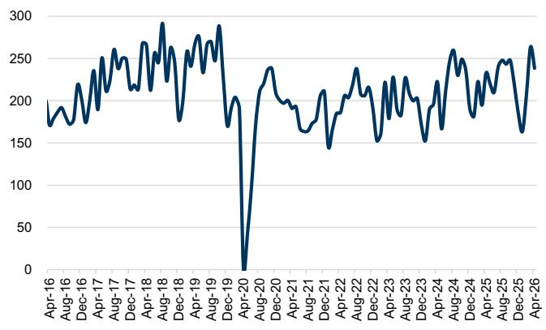

line

| Date    | Value |
|---------|-------|
| Apr-16  | 180   |
| Aug-16  | 190   |
| Dec-16  | 200   |
| Apr-17  | 210   |
| Aug-17  | 220   |
| Dec-17  | 230   |
| Apr-18  | 240   |
| Aug-18  | 250   |
| Dec-18  | 260   |
| Apr-19  | 270   |
| Aug-19  | 280   |
| Dec-19  | 290   |
| Apr-20  | 0     |
| Aug-20  | 240   |
| Dec-20  | 250   |
| Apr-21  | 260   |
| Aug-21  | 270   |
| Dec-21  | 280   |
| Apr-22  | 290   |
| Aug-22  | 300   |
| Dec-22  | 290   |
| Apr-23  | 280   |
| Aug-23  | 270   |
| Dec-23  | 260   |
| Apr-24  | 250   |
| Aug-24  | 240   |
| Dec-24  | 230   |
| Apr-25  | 220   |
| Aug-25  | 210   |
| Dec-25  | 200   |
| Apr-26  | 190   |

Source: ANFAVEA

Exhibit 51: Sao Paulo Real Estate LTM Launches (units)   
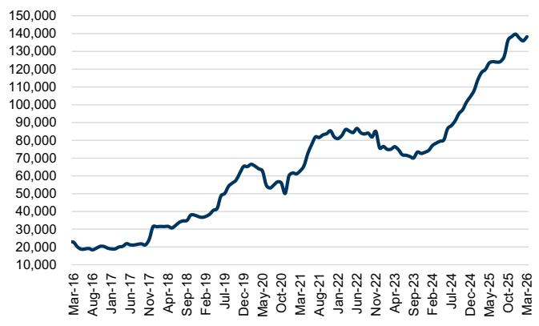

line

| Date    | Value  |
|---------|--------|
| Mar-16  | 20,000 |
| Aug-16  | 22,000 |
| Jan-17  | 23,000 |
| Jun-17  | 25,000 |
| Nov-17  | 30,000 |
| Apr-18  | 35,000 |
| Sep-18  | 40,000 |
| Feb-19  | 50,000 |
| Jul-19  | 65,000 |
| Dec-19  | 70,000 |
| May-20  | 55,000 |
| Oct-20  | 65,000 |
| Mar-21  | 85,000 |
| Aug-21  | 88,000 |
| Jan-22  | 85,000 |
| Jun-22  | 82,000 |
| Nov-22  | 78,000 |
| Apr-23  | 75,000 |
| Sep-23  | 72,000 |
| Feb-24  | 85,000 |
| Jul-24  | 105,000|
| Dec-24  | 125,000|
| May-25  | 135,000|
| Oct-25  | 145,000|
| Mar-26  | 148,000|

Source: SECOVI

Exhibit 52: Brazil's steel export sales breakdown (kt)   
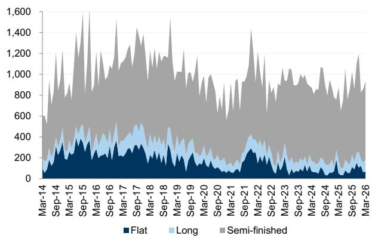

area

| Date    | Flat | Long | Semi-finished |
|---------|------|------|---------------|
| Mar-14  | 100  | 100  | 300           |
| Sep-14  | 150  | 150  | 400           |
| Mar-15  | 200  | 200  | 500           |
| Sep-15  | 250  | 250  | 600           |
| Mar-16  | 300  | 300  | 700           |
| Sep-16  | 350  | 350  | 800           |
| Mar-17  | 400  | 400  | 900           |
| Sep-17  | 450  | 450  | 1000          |
| Mar-18  | 500  | 500  | 1100          |
| Sep-18  | 550  | 550  | 1200          |
| Mar-19  | 600  | 600  | 1300          |
| Sep-19  | 650  | 650  | 1400          |
| Mar-20  | 700  | 700  | 1500          |
| Sep-20  | 750  | 750  | 1600          |
| Mar-21  | 800  | 800  | 1700          |
| Sep-21  | 850  | 850  | 1800          |
| Mar-22  | 900  | 900  | 1900          |
| Sep-22  | 950  | 950  | 2000          |
| Mar-23  | 1000 | 1000 | 2100          |
| Sep-23  | 1050 | 1050 | 2200          |
| Mar-24  | 1100 | 1100 | 2300          |
| Sep-24  | 1150 | 1150 | 2400          |
| Mar-25  | 1200 | 1200 | 2500          |
| Sep-25  | 1250 | 1250 | 2600          |
| Mar-26  | 1300 | 1300 | 2700          |

Source: IABR

Exhibit 53: Brazil's steel imports breakdown (kt)   
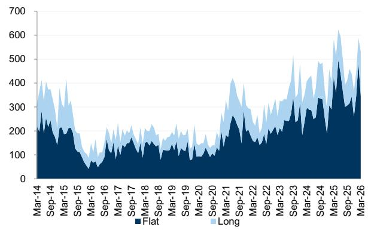

area

| Date    | Flat | Long |
|---------|------|------|
| Mar-14  | 200  | 300  |
| Sep-14  | 150  | 250  |
| Mar-15  | 100  | 200  |
| Sep-15  | 80   | 150  |
| Mar-16  | 60   | 100  |
| Sep-16  | 80   | 120  |
| Mar-17  | 100  | 150  |
| Sep-17  | 120  | 180  |
| Mar-18  | 150  | 200  |
| Sep-18  | 180  | 220  |
| Mar-19  | 200  | 250  |
| Sep-19  | 220  | 280  |
| Mar-20  | 250  | 300  |
| Sep-20  | 300  | 350  |
| Mar-21  | 350  | 400  |
| Sep-21  | 400  | 450  |
| Mar-22  | 450  | 500  |
| Sep-22  | 500  | 550  |
| Mar-23  | 550  | 600  |
| Sep-23  | 600  | 650  |
| Mar-24  | 650  | 700  |
| Sep-24  | 700  | 750  |
| Mar-25  | 750  | 800  |
| Sep-25  | 800  | 850  |
| Mar-26  | 850  | 900  |

Source: IABR

Exhibit 54: Brazil's LTM White goods sales volume index   
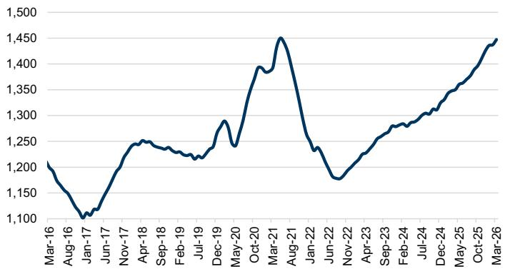

line

| Month    | Value |
| -------- | ----- |
| Mar-16   | 1200  |
| Aug-16   | 1150  |
| Jan-17   | 1100  |
| Jun-17   | 1150  |
| Nov-17   | 1250  |
| Apr-18   | 1250  |
| Sep-18   | 1230  |
| Feb-19   | 1220  |
| Jul-19   | 1210  |
| Dec-19   | 1280  |
| May-20   | 1250  |
| Oct-20   | 1380  |
| Mar-21   | 1450  |
| Aug-21   | 1350  |
| Jan-22   | 1250  |
| Jun-22   | 1180  |
| Nov-22   | 1200  |
| Apr-23   | 1250  |
| Sep-23   | 1280  |
| Feb-24   | 1300  |
| Jul-24   | 1320  |
| Dec-24   | 1350  |
| May-25   | 1380  |
| Oct-25   | 1400  |
| Mar-26   | 1450  |

Source: IBGE

# Rest of World: Black Sea, Japan & India steel indicators

Exhibit 55: Black Sea crude steel production mn tonnes   
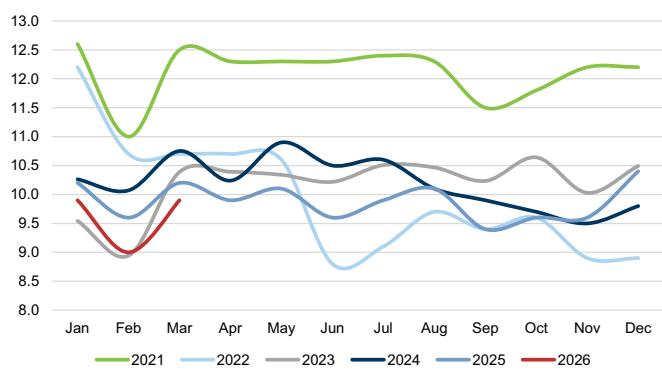

line

| Month | 2021  | 2022  | 2023  | 2024  | 2025  | 2026  |
|-------|-------|-------|-------|-------|-------|-------|
| Jan   | 12.7  | 12.3  | 9.5   | 10.3  | 10.3  | 9.9   |
| Feb   | 11.0  | 10.7  | 9.0   | 10.1  | 9.7   | 9.0   |
| Mar   | 12.5  | 10.7  | 10.3  | 10.7  | 10.3  | 9.9   |
| Apr   | 12.3  | 10.7  | 10.4  | 10.3  | 10.1  | -     |
| May   | 12.3  | 10.7  | 10.4  | 10.9  | 10.1  | -     |
| Jun   | 12.3  | 8.7   | 10.3  | 10.5  | 9.7   | -     |
| Jul   | 12.3  | 9.7   | 10.4  | 10.5  | 10.1  | -     |
| Aug   | 12.3  | 9.7   | 10.4  | 10.3  | 9.7   | -     |
| Sep   | 11.5  | -     | -     | -     | -     | -     |
| Oct   | -     | -     | -     | -     | -     | -     |
| Nov   | -     | -     | -     | -     | -     | -     |
| Dec   | -     | -     | -     | -     | -     | -     |

Source: World Steel Association, GS Global Investment Research

Exhibit 56: India crude steel production mn tonnes   
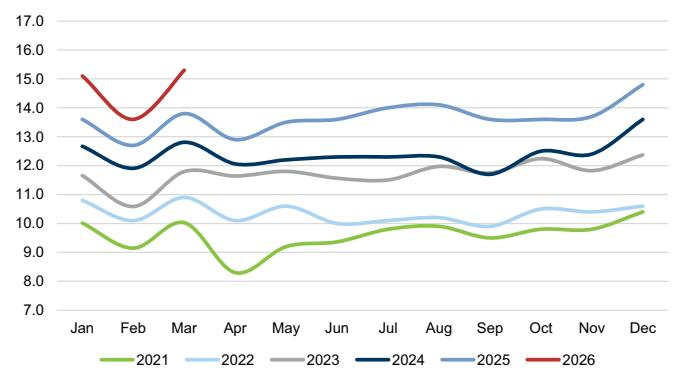

line

| Month | 2021 | 2022 | 2023 | 2024 | 2025 | 2026 |
|-------|------|------|------|------|------|------|
| Jan   | 10.0 | 10.8 | 11.7 | 12.7 | 13.6 | 15.1 |
| Feb   | 9.0  | 10.5 | 10.7 | 11.9 | 13.0 | 13.8 |
| Mar   | 10.1 | 10.9 | 11.8 | 12.8 | 13.8 | 15.4 |
| Apr   | 8.3  | 10.3 | 11.6 | 12.1 | 13.0 | -    |
| May   | 9.3  | 10.6 | 11.7 | 12.2 | 13.5 | -    |
| Jun   | 9.4  | 10.0 | 11.6 | 12.3 | 13.6 | -    |
| Jul   | 9.8  | 10.1 | 11.5 | 12.3 | 14.0 | -    |
| Aug   | 9.9  | 10.2 | 11.8 | 12.3 | 14.1 | -    |
| Sep   | 9.7  | 9.9  | 11.7 | 11.8 | 13.7 | -    |
| Oct   | 9.9  | 10.4 | 12.0 | 12.4 | 13.6 | -    |
| Nov   | 9.9  | 10.5 | 11.9 | 12.3 | 13.7 | -    |
| Dec   | 10.4 | 10.6 | 12.4 | 13.6 | 14.8 | -    |

Source: World Steel Association, GS Global Investment Research

Exhibit 57: Japan crude steel production mn tonnes   
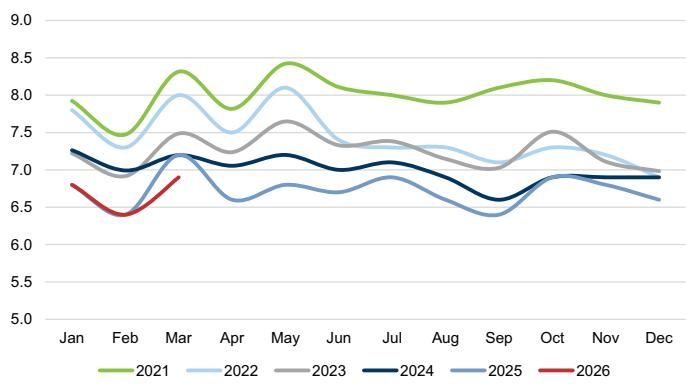

line

| Month | 2021 | 2022 | 2023 | 2024 | 2025 | 2026 |
|-------|------|------|------|------|------|------|
| Jan   | 7.9  | 7.8  | 7.3  | 7.2  | 7.1  | 6.8  |
| Feb   | 7.5  | 7.3  | 7.0  | 6.9  | 6.8  | 6.4  |
| Mar   | 8.3  | 8.0  | 7.5  | 7.1  | 7.0  | 6.9  |
| Apr   | 7.8  | 7.5  | 7.3  | 7.0  | 6.6  | -    |
| May   | 8.4  | 8.1  | 7.6  | 7.1  | 6.8  | -    |
| Jun   | 8.1  | 7.4  | 7.3  | 7.0  | 6.7  | -    |
| Jul   | 8.0  | 7.3  | 7.4  | 6.9  | 6.8  | -    |
| Aug   | 7.9  | 7.2  | 7.3  | 6.8  | 6.6  | -    |
| Sep   | 8.0  | 7.1  | 7.0  | 6.5  | 6.4  | -    |
| Oct   | 8.2  | 7.3  | 7.5  | 6.9  | 6.9  | -    |
| Nov   | 8.0  | 7.1  | 7.2  | 6.8  | 6.8  | -    |
| Dec   | 7.9  | 7.0  | 7.0  | 6.7  | 6.6  | -    |

Source: World Steel Association, GS Global Investment Research

# Pricing and Penalties

Exhibit 58: Seaborne iron ore and pellet prices (CIF China) US\$/dmt   
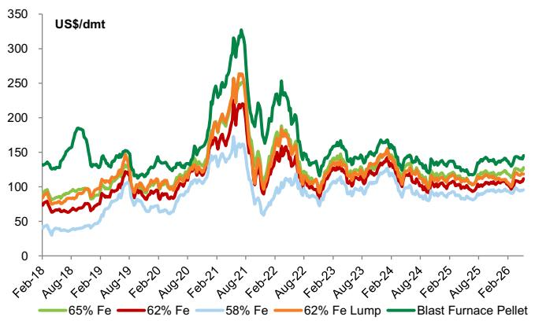

line

| Date    | 65% Fe | 62% Fe | 58% Fe | 62% Fe Lump | Blast Furnace Pellet |
|---------|--------|--------|--------|-------------|----------------------|
| Feb-18  | ~90    | ~70    | ~40    | ~80         | ~130                 |
| Aug-18  | ~100   | ~80    | ~50    | ~90         | ~180                 |
| Feb-19  | ~110   | ~90    | ~60    | ~100        | ~150                 |
| Aug-19  | ~120   | ~100   | ~70    | ~110        | ~140                 |
| Feb-20  | ~130   | ~110   | ~80    | ~120        | ~150                 |
| Aug-20  | ~140   | ~120   | ~90    | ~130        | ~160                 |
| Feb-21  | ~150   | ~130   | ~100   | ~140        | ~250                 |
| Aug-21  | ~250   | ~220   | ~150   | ~260        | ~320                 |
| Feb-22  | ~180   | ~160   | ~120   | ~190        | ~240                 |
| Aug-22  | ~170   | ~150   | ~110   | ~180        | ~230                 |
| Feb-23  | ~160   | ~140   | ~100   | ~170        | ~220                 |
| Aug-23  | ~150   | ~130   | ~90    | ~160        | ~210                 |
| Feb-24  | ~140   | ~120   | ~80    | ~150        | ~200                 |
| Aug-24  | ~130   | ~110   | ~70    | ~140        | ~190                 |
| Feb-25  | ~120   | ~100   | ~60    | ~130        | ~180                 |
| Aug-25  | ~110   | ~90    | ~50    | ~120        | ~170                 |
| Feb-26  | ~100   | ~80    | ~40    | ~110        | ~160                 |

Source: S&P Global Platts, Bloomberg, GS Global Investment Research

Exhibit 59: 58% Fe price realisations US\$/t   
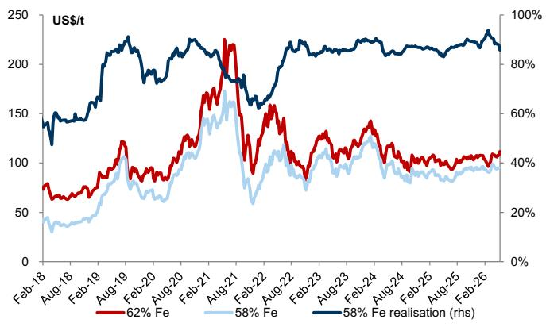

line

| Date    | 62% Fe | 58% Fe | 58% Fe realisation (rhs) |
|---------|--------|--------|--------------------------|
| Feb-18  | ~70    | ~40    | ~130                     |
| Aug-18  | ~80    | ~50    | ~140                     |
| Feb-19  | ~100   | ~70    | ~150                     |
| Aug-19  | ~120   | ~90    | ~160                     |
| Feb-20  | ~110   | ~80    | ~170                     |
| Aug-20  | ~130   | ~100   | ~180                     |
| Feb-21  | ~160   | ~120   | ~190                     |
| Aug-21  | ~220   | ~150   | ~200                     |
| Feb-22  | ~90    | ~60    | ~180                     |
| Aug-22  | ~140   | ~100   | ~190                     |
| Feb-23  | ~130   | ~90    | ~200                     |
| Aug-23  | ~120   | ~80    | ~210                     |
| Feb-24  | ~130   | ~90    | ~220                     |
| Aug-24  | ~120   | ~80    | ~230                     |
| Feb-25  | ~110   | ~70    | ~240                     |
| Aug-25  | ~100   | ~60    | ~250                     |
| Feb-26  | ~110   | ~70    | ~260                     |

Source: S&P Global Platts, Bloomberg, GS Global Investment Research

Exhibit 60: High / low grade iron ore premiums / vs 62% Fe US\$/dmt   
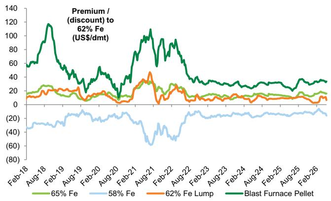

line

| Date    | 65% Fe | 58% Fe | 62% Fe Lump | Blast Furnace Pellet |
|---------|--------|--------|-------------|----------------------|
| Feb-18  | ~20    | ~-30   | ~15         | ~60                  |
| Aug-18  | ~25    | ~-35   | ~18         | ~120                 |
| Feb-19  | ~20    | ~-30   | ~15         | ~80                  |
| Aug-19  | ~15    | ~-25   | ~10         | ~40                  |
| Feb-20  | ~10    | ~-20   | ~5          | ~20                  |
| Aug-20  | ~5     | ~-15   | ~0          | ~10                  |
| Feb-21  | ~10    | ~-20   | ~5          | ~40                  |
| Aug-21  | ~20    | ~-30   | ~40         | ~110                 |
| Feb-22  | ~15    | ~-25   | ~30         | ~90                  |
| Aug-22  | ~10    | ~-20   | ~20         | ~70                  |
| Feb-23  | ~5     | ~-15   | ~10         | ~50                  |
| Aug-23  | ~5     | ~-15   | ~10         | ~40                  |
| Feb-24  | ~5     | ~-15   | ~10         | ~35                  |
| Aug-24  | ~5     | ~-15   | ~10         | ~30                  |
| Feb-25  | ~5     | ~-15   | ~10         | ~30                  |
| Aug-25  | ~5     | ~-15   | ~10         | ~35                  |
| Feb-26  | ~5     | ~-15   | ~10         | ~35                  |

Source: S&P Global Platts, Bloomberg, GS Global Investment Research

Exhibit 61: Iron ore pricing vs. Rebar and HRC margin US\$/t   
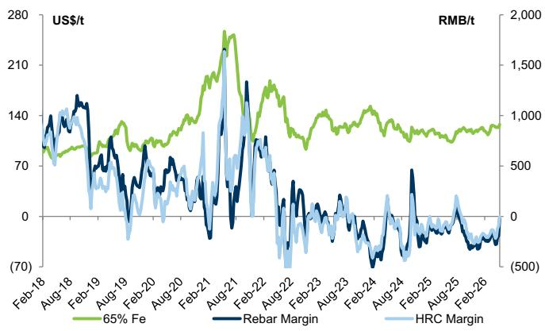

line

| Date    | 65% Fe (US$/t) | Rebar Margin (US$/t) | HRC Margin (US$/t) | 65% Fe (RMB/t) | Rebar Margin (RMB/t) | HRC Margin (RMB/t) |
|---------|----------------|----------------------|--------------------|----------------|----------------------|--------------------|
| Feb-18  | ~130           | ~140                 | ~135               | ~1000          | ~1000                | ~1000              |
| Aug-18  | ~140           | ~150                 | ~145               | ~1000          | ~1000                | ~1000              |
| Feb-19  | ~130           | ~140                 | ~135               | ~1000          | ~1000                | ~1000              |
| Aug-19  | ~120           | ~130                 | ~125               | ~1000          | ~1000                | ~1000              |
| Feb-20  | ~130           | ~140                 | ~135               | ~1000          | ~1000                | ~1000              |
| Aug-20  | ~140           | ~150                 | ~145               | ~1000          | ~1000                | ~1000              |
| Feb-21  | ~150           | ~160                 | ~155               | ~1000          | ~1000                | ~1000              |
| Aug-21  | ~270           | ~260                 | ~255               | ~1800          | ~1800                | ~1800              |
| Feb-22  | ~150           | ~140                 | ~135               | ~1500          | ~1500                | ~1500              |
| Aug-22  | ~140           | ~130                 | ~125               | ~1400          | ~1400                | ~1400              |
| Feb-23  | ~130           | ~120                 | ~115               | ~1300          | ~1300                | ~1300              |
| Aug-23  | ~140           | ~130                 | ~125               | ~1400          | ~1400                | ~1400              |
| Feb-24  | ~130           | ~120                 | ~115               | ~1300          | ~1300                | ~1300              |
| Aug-24  | ~70            | ~65                  | ~60                | ~750           | ~750                 | ~750               |
| Feb-25  | ~65            | ~60                  | ~55                | ~75            | ~75                  | ~75                |
| Aug-25  | ~65            | ~65                  | ~65                | ~75            | ~75                  | ~75                |
| Feb-26  | ~65            | ~65                  | ~65                | ~75            | ~75                  | ~75                |

Source: S&P Global Platts, Bloomberg, GS Global Investment Research

# Iron ore: Seaborne trade

Exhibit 62: Brazilian iron ore shipments   
kt   
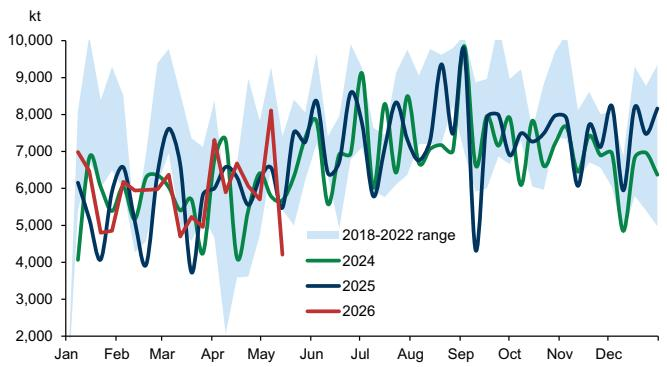

line

| Month | 2018-2022 range | 2024 | 2025 | 2026 |
|-------|-----------------|------|------|------|
| Jan   | ~7,000          | ~4,000 | ~6,000 | ~7,000 |
| Feb   | ~9,000          | ~5,000 | ~6,500 | ~5,500 |
| Mar   | ~8,500          | ~6,500 | ~7,500 | ~6,000 |
| Apr   | ~7,500          | ~5,500 | ~3,500 | ~5,000 |
| May   | ~6,500          | ~4,500 | ~6,500 | ~8,000 |
| Jun   | ~8,500          | ~7,500 | ~8,500 | ~5,500 |
| Jul   | ~9,500          | ~9,500 | ~8,500 | ~7,500 |
| Aug   | ~8,500          | ~8,500 | ~7,500 | ~7,500 |
| Sep   | ~9,500          | ~7,500 | ~4,500 | ~7,500 |
| Oct   | ~8,500          | ~7,500 | ~8,500 | ~7,500 |
| Nov   | ~8,500          | ~7,500 | ~8,500 | ~7,500 |
| Dec   | ~8,500          | ~7,500 | ~8,500 | ~7,500 |

Source: S&P Global Platts, Bloomberg, GS Global Investment Research

Exhibit 63: Australian iron ore shipments   
kt   
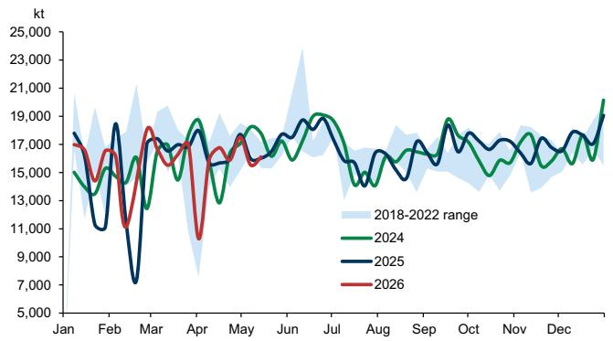

line

| Month | 2018-2022 range | 2024 | 2025 | 2026 |
|-------|-----------------|------|------|------|
| Jan   | ~19,000         | ~15,000 | ~17,500 | ~17,000 |
| Feb   | ~18,500         | ~14,500 | ~11,000 | ~13,000 |
| Mar   | ~19,500         | ~16,000 | ~7,500 | ~18,500 |
| Apr   | ~17,500         | ~18,500 | ~17,500 | ~9,500 |
| May   | ~17,500         | ~17,500 | ~16,500 | ~17,500 |
| Jun   | ~18,500         | ~18,500 | ~18,500 | ~18,500 |
| Jul   | ~18,500         | ~19,500 | ~19,500 | ~18,500 |
| Aug   | ~17,500         | ~14,500 | ~16,500 | ~14,500 |
| Sep   | ~17,500         | ~17,500 | ~17,500 | ~17,500 |
| Oct   | ~17,500         | ~18,500 | ~17,500 | ~17,500 |
| Nov   | ~17,500         | ~17,500 | ~17,500 | ~17,500 |
| Dec   | ~17,500         | ~19,500 | ~18,500 | ~19,500 |

Source: S&P Global Platts, Bloomberg, GS Global Investment Research

Exhibit 64: Australian shipments to China   
kt   
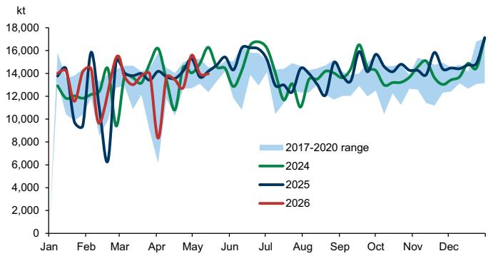

line

| Month | 2017-2020 range | 2024 | 2025 | 2026 |
|-------|-----------------|------|------|------|
| Jan   | ~15,000         | ~13,000 | ~14,500 | ~14,000 |
| Feb   | ~14,500         | ~12,500 | ~15,500 | ~14,500 |
| Mar   | ~13,500         | ~9,500 | ~6,500 | ~15,500 |
| Apr   | ~14,000         | ~16,500 | ~14,500 | ~8,500 |
| May   | ~14,500         | ~15,500 | ~14,500 | ~15,500 |
| Jun   | ~14,500         | ~16,500 | ~15,500 | ~14,500 |
| Jul   | ~14,500         | ~16,500 | ~16,500 | ~14,500 |
| Aug   | ~14,500         | ~13,500 | ~14,500 | ~13,500 |
| Sep   | ~14,500         | ~16,500 | ~15,500 | ~14,500 |
| Oct   | ~14,500         | ~14,500 | ~14,500 | ~14,500 |
| Nov   | ~14,500         | ~14,500 | ~14,500 | ~14,500 |
| Dec   | ~14,500         | ~14,500 | ~14,500 | ~14,500 |

Source: S&P Global Platts, Bloomberg, GS Global Investment Research

# China Iron Ore Imports (ex Aus/Brazil) and domestic production and stocks

Exhibit 65: China imports - ex Aus/Brazil mtpa   
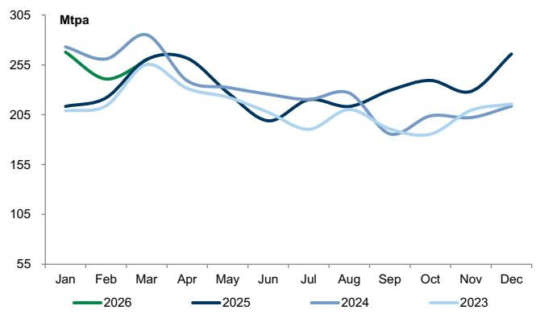

line

| Month | 2026 | 2025 | 2024 | 2023 |
|-------|------|------|------|------|
| Jan   | 265  | 210  | 270  | 205  |
| Feb   | 240  | 215  | 260  | 210  |
| Mar   | 250  | 260  | 280  | 250  |
| Apr   | 245  | 255  | 230  | 235  |
| May   | 230  | 240  | 225  | 220  |
| Jun   | 210  | 200  | 215  | 210  |
| Jul   | 205  | 210  | 215  | 190  |
| Aug   | 210  | 215  | 220  | 205  |
| Sep   | 215  | 220  | 185  | 180  |
| Oct   | 220  | 230  | 195  | 185  |
| Nov   | 215  | 235  | 200  | 195  |
| Dec   | 260  | 260  | 210  | 210  |

Source: Mysteel, China NBS, Bloomberg, GS Global Investment Research

Exhibit 66: China ex Aus/Brazil iron ore imports by country   
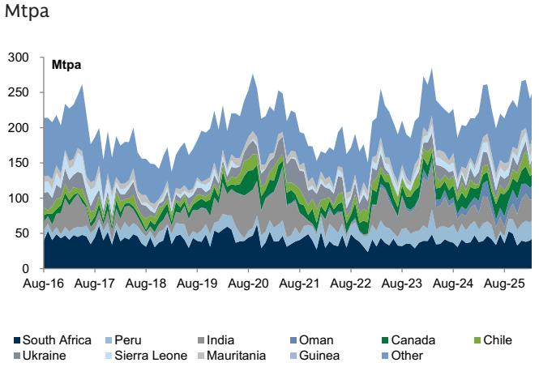

bar_stacked

| Date | South Africa | Peru | India | Oman | Canada | Chile | Ukraine | Sierra Leone | Mauritania | Guinea | Other |
|---|---|---|---|---|---|---|---|---|---|---|---|
| Aug-16 | 40 | 10 | 20 | 30 | 10 | 5 | 10 | 5 | 5 | 5 | 10 |
| Aug-17 | 45 | 15 | 25 | 35 | 15 | 10 | 15 | 10 | 5 | 5 | 15 |
| Aug-18 | 35 | 10 | 20 | 30 | 10 | 5 | 10 | 5 | 5 | 5 | 10 |
| Aug-19 | 40 | 15 | 25 | 35 | 15 | 10 | 15 | 10 | 5 | 5 | 15 |
| Aug-20 | 45 | 20 | 30 | 40 | 20 | 15 | 20 | 15 | 10 | 5 | 20 |
| Aug-21 | 35 | 10 | 20 | 30 | 10 | 5 | 10 | 5 | 5 | 5 | 10 |
| Aug-22 | 40 | 15 | 25 | 35 | 15 | 10 | 15 | 10 | 5 | 5 | 15 |
| Aug-23 | 45 | 20 | 30 | 40 | 20 | 15 | 20 | 15 | 10 | 5 | 20 |
| Aug-24 | 40 | 15 | 25 | 35 | 15 | 10 | 15 | 10 | 5 | 5 | 15 |
| Aug-25 | 45 | 20 | 30 | 40 | 20 | 15 | 20 | 15 | 10 | 5 | 20 |

Source: Mysteel, China NBS, Bloomberg, GS Global Investment Research

Exhibit 67: China domestic iron ore production by region (62% FeEq)   
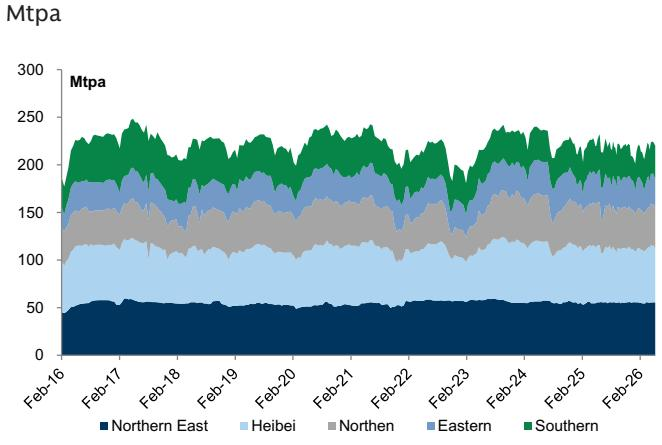

area_stacked

| Date    | Northern East | Heibei | Northern | Eastern | Southern |
|---------|---------------|--------|----------|---------|----------|
| Feb-16  | 50            | 50     | 30       | 30      | 40       |
| Feb-17  | 50            | 50     | 30       | 30      | 40       |
| Feb-18  | 50            | 50     | 30       | 30      | 40       |
| Feb-19  | 50            | 50     | 30       | 30      | 40       |
| Feb-20  | 50            | 50     | 30       | 30      | 40       |
| Feb-21  | 50            | 50     | 30       | 30      | 40       |
| Feb-22  | 50            | 50     | 30       | 30      | 40       |
| Feb-23  | 50            | 50     | 30       | 30      | 40       |
| Feb-24  | 50            | 50     | 30       | 30      | 40       |
| Feb-25  | 50            | 50     | 30       | 30      | 40       |
| Feb-26  | 50            | 50     | 30       | 30      | 40       |

Source: Mysteel, China NBS, Bloomberg, GS Global Investment Research

Exhibit 68: Domestic miner iron ore stocks and utilisation rates   
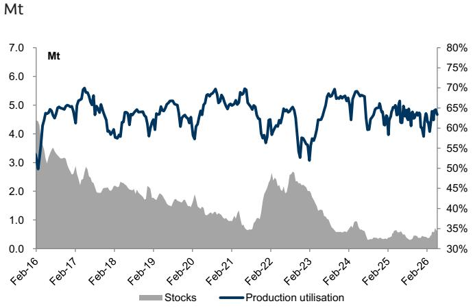

line

| Date   | Stocks | Production utilisation |
|--------|--------|------------------------|
| Feb-16 | 3.0    | 30%                    |
| Feb-17 | 2.5    | 50%                    |
| Feb-18 | 2.0    | 60%                    |
| Feb-19 | 1.5    | 55%                    |
| Feb-20 | 1.0    | 65%                    |
| Feb-21 | 0.5    | 60%                    |
| Feb-22 | 2.5    | 50%                    |
| Feb-23 | 1.0    | 40%                    |
| Feb-24 | 0.5    | 55%                    |
| Feb-25 | 0.5    | 60%                    |
| Feb-26 | 0.5    | 65%                    |

Source: Mysteel, China NBS, Bloomberg, GS Global Investment Research

# Chinese port inventories

Exhibit 69: China portside iron ore stockpiles   
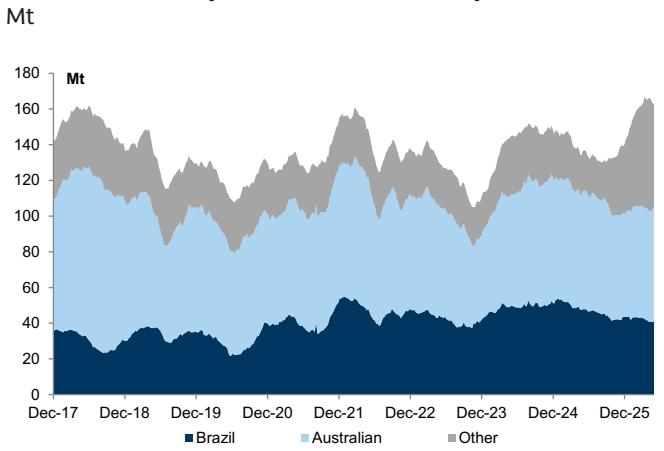

area_stacked

| Date    | Brazil | Australian | Other |
|---------|--------|------------|-------|
| Dec-17  | 35     | 80         | 40    |
| Dec-18  | 30     | 75         | 45    |
| Dec-19  | 25     | 70         | 50    |
| Dec-20  | 30     | 65         | 45    |
| Dec-21  | 40     | 70         | 50    |
| Dec-22  | 35     | 65         | 45    |
| Dec-23  | 30     | 60         | 40    |
| Dec-24  | 35     | 65         | 45    |
| Dec-25  | 30     | 60         | 50    |

Source: Mysteel, Steelhome, Bloomberg, GS Global Investment Research

Exhibit 70: We calculate around 5 weeks of inventory   
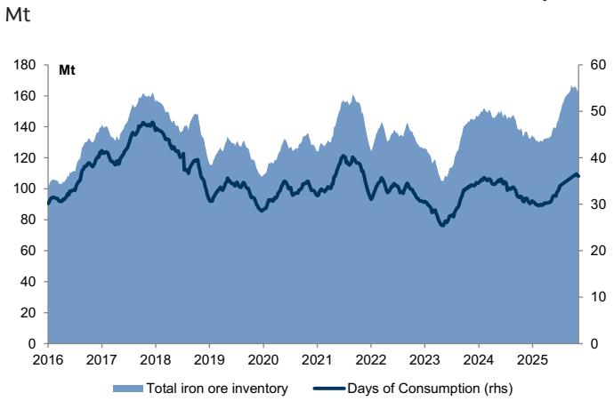

line

| Year | Total iron ore inventory (Mt) | Days of Consumption (hrs) |
|------|-------------------------------|---------------------------|
| 2016 | ~100                          | ~30                       |
| 2017 | ~140                          | ~35                       |
| 2018 | ~160                          | ~40                       |
| 2019 | ~140                          | ~35                       |
| 2020 | ~100                          | ~30                       |
| 2021 | ~160                          | ~40                       |
| 2022 | ~140                          | ~35                       |
| 2023 | ~100                          | ~30                       |
| 2024 | ~150                          | ~35                       |
| 2025 | ~160                          | ~40                       |

Source: Mysteel, Steelhome, Bloomberg, GS Global Investment Research

Exhibit 71: FMG branded fines stockpile   
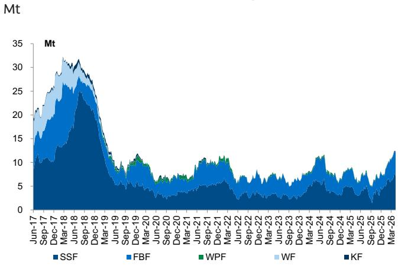

area

| Date    | SSF  | FBF  | WPF  | WF   | KF   |
|---------|------|------|------|------|------|
| Jun-17  | 10   | 10   | 10   | 10   | 10   |
| Sep-17  | 15   | 15   | 15   | 15   | 15   |
| Dec-17  | 20   | 20   | 20   | 20   | 20   |
| Mar-18  | 25   | 25   | 25   | 25   | 25   |
| Jun-18  | 30   | 30   | 30   | 30   | 30   |
| Sep-18  | 25   | 25   | 25   | 25   | 25   |
| Dec-18  | 20   | 20   | 20   | 20   | 20   |
| Mar-19  | 15   | 15   | 15   | 15   | 15   |
| Jun-19  | 10   | 10   | 10   | 10   | 10   |
| Sep-19  | 5    | 5    | 5    | 5    | 5    |
| Dec-19  | 5    | 5    | 5    | 5    | 5    |
| Mar-20  | 5    | 5    | 5    | 5    | 5    |
| Jun-20  | 5    | 5    | 5    | 5    | 5    |
| Sep-20  | 5    | 5    | 5    | 5    | 5    |
| Dec-20  | 5    | 5    | 5    | 5    | 5    |
| Mar-21  | 5    | 5    | 5    | 5    | 5    |
| Jun-21  | 5    | 5    | 5    | 5    | 5    |
| Sep-21  | 5    | 5    | 5    | 5    | 5    |
| Dec-21  | 5    | 5    | 5    | 5    | 5    |
| Mar-22  | 5    | 5    | 5    | 5    | 5    |
| Jun-22  | 5    | 5    | 5    | 5    | 5    |
| Sep-22  | 5    | 5    | 5    | 5    | 5    |
| Dec-22  | 5    | 5    | 5    | 5    | 5    |
| Mar-23  | 5    | 5    | 5    | 5    | 5    |
| Jun-23  | 5    | 5    | 5    | 5    | 5    |
| Sep-23  | 5    | 5    | 5    | 5    | 5    |
| Dec-23  | 5    | 5    | 5    | 5    | 5    |
| Mar-24  | 5    | 5    | 5    | 5    | 5    |
| Jun-24  | 5    | 5    | 5    | 5    | 5    |
| Sep-24  | 5    | 5    | 5    | 5    | 5    |
| Dec-24  | 5    | 5    | 5    | 5    | 5    |
| Mar-25  | 5    | 5    | 5    | 5    | 5    |
| Jun-25  | 5    | 5    | 5    | 5    | 5    |
| Sep-25  | 5    | 5    | 5    | 5    | 5    |
| Dec-25  | 5    | 5    | 5    | 5    | 5    |
| Mar-26  | 10   | -    | -    | -    | -    |
| Jun-26* | -     | -    | -    | -    | -    |
| Sep-26* | -     | -    | -    | -    | -    |
| Dec-26* | -     | -    | -    | -    | -    |
| Mar-27* * - - Jun-27* + Sep-27* + Oct-27* + Nov-27* + Dec-27* + Jan-28* + Feb-28* + Mar-29* + Apr-29* + May-30* + Jun-31* + Jul-31* + Aug-31* + Sep-31* + Oct-31* + Nov-31* + Dec-31* + Dec-31* + Jan-32* + Feb-32* + Mar-33* + Apr-33* + May-34* + Jun-34* + Jul-34* + Aug-34* + Sep-34* + Oct-34* + Nov-34* + Dec-34* + Dec-34* + Jan-36* + Mar-36* + Apr-36* + Jun-36* + Jul-36* + Aug-36* + Sep-36* + Oct-36* + Nov-36* + Dec-36* + Dec-36* + Jan-38* + Mar-38* + Apr-38* + Jul-38* + Aug-38* + Sep-38* + Oct-38* + Nov-38* + Dec-38* + Dec-38* + Jan-40* + Mar-40* + Apr-40* + Jul-40* + Aug-40* + Sep-40* + Oct-40* + Nov-40* + Dec-40* + Dec-40* + Jan-42* + Mar-42* + Apr-42* + Jul-42* + Aug-42* + Sep-42* + Oct-42* + Nov-42* + Dec-42* + Dec-42* + Jan-44* + Mar-44* + Apr-44* + Jul-44* + Aug-44* + Sep-44* + Oct-44* + Nov-44* + Dec-44* + Dec-44* + Jan-46* + Mar-46* + Apr-46* + Jul-46* + Aug-46* + Sep-46* + Oct-46* + Nov-46* + Dec-46* + Dec-46* + Jan-48* + Mar-48* + Apr-48* + Jul-48* + Aug-48* + Sep-48* + Oct-48* + Nov-48* + Dec-48* + Dec-48* + Jan-50* + Mar-50* + Apr-60* + Jul-60* + Aug-60* + Sep-60* + Oct-60* + Nov-60* + Dec-60* + Dec-60* + Jan-62* + Mar-62* + Apr-62* + Jul-62* + Aug-62* + Sep-62* + Oct-62* + Nov-62* + Dec-62* + Dec-62* + Jan-64* + Mar-64* + Apr-64* + Jul-64* + Aug-64* + Sep-64* + Oct-64* + Nov-64* + Dec-64* + Dec-64* + Jan-66* + Mar-66* + Apr-66* + Jul-66* + Aug-66* + Sep-66* + Oct-66* + Nov-66* + Dec-66* + Dec-66* + Jan-68* + Mar-68* + Apr-68* + Jul-68* + Aug-68* + Sep-68* + Oct-68* + Nov-68* + Dec-68* + Dec-68* + Jan-70+

Source: Mysteel, Steelhome, Bloomberg, GS Global Investment Research

Exhibit 72: BHP & RIO inventories   
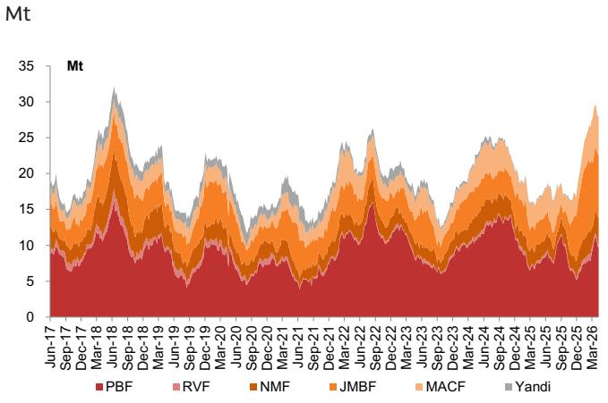  
Source: Mysteel, Steelhome, Bloomberg, Data Compiled by GS Global Investment Research

# GS Projections and equity views

# GS Global steel prices outlook

Exhibit 73: GS Global Steel Price Outlook 

<table><tr><td></td><td>Units</td><td>SPOT</td><td>2020</td><td>2021</td><td>2022</td><td>2023</td><td>2024</td><td>2025</td><td>2026E</td><td>1Q26</td><td>2Q26E</td><td>3Q26E</td><td>4Q26E</td></tr><tr><td colspan="14">China</td></tr><tr><td>HRC</td><td>Rmb/t</td><td>3,439</td><td>3,898</td><td>5,420</td><td>4,503</td><td>4,085</td><td>3,805</td><td>3,296</td><td>3,363</td><td>3,228</td><td>3,363</td><td>3,363</td><td>3,363</td></tr><tr><td>YoY / QoQ</td><td>%</td><td></td><td>1%</td><td>39%</td><td>-17%</td><td>-9%</td><td>-7%</td><td>-13%</td><td>2%</td><td>-19%</td><td>4%</td><td>0%</td><td>0%</td></tr><tr><td>Rebar</td><td>Rmb/t</td><td>3,432</td><td>3,718</td><td>5,042</td><td>4,417</td><td>3,928</td><td>3,551</td><td>3,298</td><td>3,542</td><td>3,272</td><td>3,542</td><td>3,542</td><td>3,542</td></tr><tr><td>YoY / QoQ</td><td>%</td><td></td><td>-4%</td><td>36%</td><td>-12%</td><td>-11%</td><td>-10%</td><td>-7%</td><td>7%</td><td>-17%</td><td>8%</td><td>0%</td><td>0%</td></tr><tr><td colspan="14">US</td></tr><tr><td>HRC EXW Indiana</td><td>US$/t</td><td>1,179</td><td>646</td><td>1,774</td><td>1,120</td><td>1,015</td><td>855</td><td>937</td><td>1,078</td><td>1,078</td><td>1,089</td><td>1,077</td><td>1,069</td></tr><tr><td>YoY / QoQ</td><td>%</td><td></td><td>8%</td><td>174%</td><td>-37%</td><td>-9%</td><td>-16%</td><td>10%</td><td>15%</td><td>17%</td><td>1%</td><td>-1%</td><td>-1%</td></tr><tr><td>Rebar EXW US Southeast</td><td>US$/t</td><td>1,014</td><td>672</td><td>998</td><td>1,162</td><td>993</td><td>857</td><td>919</td><td>1,035</td><td>1,030</td><td>1,047</td><td>1,036</td><td>1,025</td></tr><tr><td>YoY / QoQ</td><td>%</td><td></td><td>2%</td><td>49%</td><td>16%</td><td>-15%</td><td>-14%</td><td>7%</td><td>13%</td><td>21%</td><td>2%</td><td>-1%</td><td>-1%</td></tr><tr><td colspan="14">European</td></tr><tr><td>HRC, EXW South and North</td><td>EUR/t</td><td>690</td><td>457</td><td>930</td><td>863</td><td>694</td><td>620</td><td>581</td><td>599</td><td>655</td><td>605</td><td>585</td><td>585</td></tr><tr><td>YoY / QoQ</td><td>%</td><td></td><td>-1%</td><td>104%</td><td>-7%</td><td>-25%</td><td>-28%</td><td>-6%</td><td>3%</td><td>2%</td><td>-8%</td><td>-3%</td><td>0%</td></tr><tr><td>Merchant bar, Europe dome:</td><td>EUR/t</td><td>750</td><td>480</td><td>775</td><td>1,081</td><td>752</td><td>675</td><td>667</td><td>656</td><td>668</td><td>665</td><td>645</td><td>646</td></tr><tr><td>YoY / QoQ</td><td>%</td><td></td><td>-8%</td><td>61%</td><td>40%</td><td>-3%</td><td>-38%</td><td>-1%</td><td>-2%</td><td>-1%</td><td>0%</td><td>-3%</td><td>0%</td></tr><tr><td colspan="14">Brazil</td></tr><tr><td>HRC</td><td>R$/t</td><td>4,025</td><td>2,941</td><td>6,170</td><td>5,546</td><td>4,416</td><td>4,137</td><td>3,962</td><td>3,931</td><td>3,831</td><td>3,950</td><td>3,950</td><td>3,995</td></tr><tr><td>YoY / QoQ</td><td>%</td><td></td><td>14%</td><td>110%</td><td>-10%</td><td>-28%</td><td>-6%</td><td>-4%</td><td>-1%</td><td>-4%</td><td>3%</td><td>0%</td><td>1%</td></tr><tr><td>Rebar</td><td>R$/t</td><td>3,520</td><td>2,762</td><td>5,076</td><td>4,494</td><td>3,858</td><td>3,888</td><td>3,571</td><td>3,370</td><td>3,360</td><td>3,475</td><td>3,310</td><td>3,335</td></tr><tr><td>YoY / QoQ</td><td>%</td><td></td><td>1%</td><td>84%</td><td>-11%</td><td>-24%</td><td>1%</td><td>-8%</td><td>-6%</td><td>-10%</td><td>3%</td><td>-5%</td><td>1%</td></tr></table>

Source: S&P Global Platts, GS Global Investment Research

# Steel and Iron Ore Comparables

Exhibit 74: Steel and iron comparables 

<table><tr><td>Steel</td><td colspan="14"></td></tr><tr><td>Region</td><td>Company name</td><td>Analyst name</td><td>Curr</td><td>Price</td><td>PT</td><td>Upsd</td><td>Rating</td><td>MCap US$bn</td><td>EV/EBITDA 2026E</td><td>2027E</td><td>Dividend yield 2026E</td><td>2027E</td><td>FCF yield 2026E</td><td>2027E</td></tr><tr><td rowspan="6">North America</td><td>Nucor Corp.</td><td>Nick Cash</td><td>$</td><td>232.85</td><td>260.00</td><td>12%</td><td>Buy</td><td>53</td><td>8.8x</td><td>7.2x</td><td>1.0%</td><td>1.0%</td><td>4.4%</td><td>7.2%</td></tr><tr><td>Steel Dynamics Inc.</td><td>Nick Cash</td><td>$</td><td>234.68</td><td>n.a.</td><td>n.a.</td><td>Not Rated</td><td>34</td><td>9.7x</td><td>7.8x</td><td>0.9%</td><td>0.9%</td><td>3.8%</td><td>8.3%</td></tr><tr><td>Reliance Inc.</td><td>Nick Cash</td><td>$</td><td>367.84</td><td>341.00</td><td>-7%</td><td>Neutral</td><td>19</td><td>12.0x</td><td>11.0x</td><td>1.4%</td><td>1.5%</td><td>5.9%</td><td>5.7%</td></tr><tr><td>Cleveland-Cliffs Inc.</td><td>Nick Cash</td><td>$</td><td>10.93</td><td>10.00</td><td>-9%</td><td>Neutral</td><td>6</td><td>10.5x</td><td>5.9x</td><td>0.0%</td><td>0.0%</td><td>-1.3%</td><td>11.6%</td></tr><tr><td>Commercial Metals Co.</td><td>Nick Cash</td><td>$</td><td>72.75</td><td>77.00</td><td>6%</td><td>Buy</td><td>8</td><td>7.9x</td><td>6.3x</td><td>1.0%</td><td>1.1%</td><td>3.4%</td><td>11.0%</td></tr><tr><td>North America Average</td><td></td><td></td><td></td><td></td><td></td><td></td><td></td><td>9.8x</td><td>7.6x</td><td>0.9%</td><td>0.9%</td><td>3.2%</td><td>8.8%</td></tr><tr><td rowspan="3">Europe</td><td>ArcelorMittal SA</td><td>Matt Greene</td><td>$</td><td>63.78</td><td>51.40</td><td>-19%</td><td>Neutral</td><td>48</td><td>6.9x</td><td>5.7x</td><td>1.2%</td><td>1.2%</td><td>1.9%</td><td>5.8%</td></tr><tr><td>ArcelorMittal SA</td><td>Matt Greene</td><td>€</td><td>55.00</td><td>44.00</td><td>-20%</td><td>Neutral</td><td>49</td><td>7.0x</td><td>5.8x</td><td>1.2%</td><td>1.2%</td><td>1.9%</td><td>5.7%</td></tr><tr><td>Europe Average</td><td></td><td></td><td></td><td></td><td></td><td></td><td></td><td>7.0x</td><td>5.8x</td><td>1.2%</td><td>1.2%</td><td>1.9%</td><td>5.7%</td></tr><tr><td rowspan="6">Latin America</td><td>Gerdau</td><td>Marcio Farid</td><td>R$</td><td>23.58</td><td>25.00</td><td>6%</td><td>Buy</td><td>10</td><td>4.6x</td><td>4.3x</td><td>3.0%</td><td>3.0%</td><td>7.7%</td><td>7.1%</td></tr><tr><td>Usiminas</td><td>Marcio Farid</td><td>R$</td><td>9.89</td><td>6.60</td><td>-33%</td><td>Neutral</td><td>2</td><td>7.3x</td><td>5.7x</td><td>0.0%</td><td>2.2%</td><td>4.8%</td><td>9.2%</td></tr><tr><td>Ternium</td><td>Marcio Farid</td><td>$</td><td>44.17</td><td>49.00</td><td>11%</td><td>Buy</td><td>9</td><td>6.5x</td><td>4.8x</td><td>5.0%</td><td>5.0%</td><td>-10.0%</td><td>9.6%</td></tr><tr><td>CSN</td><td>Marcio Farid</td><td>R$</td><td>6.67</td><td>6.40</td><td>-4%</td><td>Sell</td><td>2</td><td>5.5x</td><td>6.8x</td><td>0.0%</td><td>0.0%</td><td>-59.3%</td><td>-60.9%</td></tr><tr><td>CSN Mineracao</td><td>Marcio Farid</td><td>R$</td><td>4.77</td><td>4.30</td><td>-10%</td><td>Sell</td><td>5</td><td>7.9x</td><td>13.8x</td><td>3.7%</td><td>0.0%</td><td>-15.4%</td><td>-21.1%</td></tr><tr><td>Latin America Average</td><td></td><td></td><td></td><td></td><td></td><td></td><td></td><td>6.4x</td><td>7.1x</td><td>2.3%</td><td>2.0%</td><td>-14.4%</td><td>-11.2%</td></tr><tr><td rowspan="4">Asia</td><td>Baoshan Iron &amp; Steel</td><td>Trina Chen</td><td>Rmb</td><td>6.22</td><td>7.50</td><td>21%</td><td>Neutral</td><td>20</td><td>5.0x</td><td>4.4x</td><td>5.2%</td><td>6.4%</td><td>7.3%</td><td>10.0%</td></tr><tr><td>Angang Steel</td><td>Trina Chen</td><td>HK$</td><td>1.41</td><td>1.20</td><td>-15%</td><td>Sell</td><td>2</td><td></td><td>10.7x</td><td>0.0%</td><td>0.0%</td><td>-32.4%</td><td>-1.3%</td></tr><tr><td>Maanshan Iron &amp; Steel</td><td>Trina Chen</td><td>HK$</td><td>2.50</td><td>2.50</td><td>0%</td><td>Neutral</td><td>2</td><td>7.2x</td><td>5.9x</td><td>1.5%</td><td>2.9%</td><td>-0.7%</td><td>6.7%</td></tr><tr><td>Asia Average</td><td></td><td></td><td></td><td></td><td></td><td></td><td></td><td>6.1x</td><td>7.0x</td><td>2.2%</td><td>3.1%</td><td>-8.6%</td><td>5.1%</td></tr><tr><td rowspan="3">Australia</td><td>Sims Metal Management Ltd.</td><td>Paul Young</td><td>A$</td><td>22.48</td><td>22.20</td><td>-1%</td><td>Neutral</td><td>3</td><td>8.2x</td><td>6.4x</td><td>1.2%</td><td>0.9%</td><td>2.9%</td><td>6.5%</td></tr><tr><td>BlueScope Steel</td><td>Paul Young</td><td>A$</td><td>30.14</td><td>n.a.</td><td>n.a.</td><td>Not Rated</td><td>10</td><td>7.4x</td><td>6.8x</td><td>7.6%</td><td>4.8%</td><td>0.2%</td><td>5.9%</td></tr><tr><td colspan="8">Global Median</td><td>7.4x</td><td>6.4x</td><td>1.2%</td><td>1.2%</td><td>2.4%</td><td>6.9%</td></tr><tr><td>Bulks</td><td colspan="14"></td></tr><tr><td>Region</td><td>Company name</td><td>Analyst name</td><td>Curr</td><td>Price</td><td>PT</td><td>Upsd</td><td>Rating</td><td>MCap US$bn</td><td>EV/EBITDA 2026E</td><td>2027E</td><td>Dividend yield 2026E</td><td>2027E</td><td>FCF yield 2026E</td><td>2027E</td></tr><tr><td rowspan="11">Global</td><td>BHP Group Ltd.</td><td>Paul Young</td><td>A$</td><td>60.46</td><td>58.50</td><td>-3%</td><td>Buy</td><td>221</td><td>7.5x</td><td>8.7x</td><td>3.2%</td><td>2.6%</td><td>4.6%</td><td>3.4%</td></tr><tr><td>Rio Tinto Ltd.</td><td>Paul Young</td><td>A$</td><td>185.75</td><td>165.30</td><td>-11%</td><td>Neutral</td><td>218</td><td>8.3x</td><td>8.5x</td><td>3.2%</td><td>3.2%</td><td>3.5%</td><td>4.0%</td></tr><tr><td>BHP Group Ltd.</td><td>Matt Greene</td><td>£</td><td>3,308.00</td><td>2,900.00</td><td>-12%</td><td>Neutral</td><td>225</td><td>7.6x</td><td>8.9x</td><td>3.2%</td><td>2.6%</td><td>4.5%</td><td>3.3%</td></tr><tr><td>Rio Tinto Plc</td><td>Matt Greene</td><td>£</td><td>8,154.00</td><td>7,600.00</td><td>-7%</td><td>Neutral</td><td>179</td><td>6.9x</td><td>7.1x</td><td>3.9%</td><td>3.9%</td><td>4.3%</td><td>4.8%</td></tr><tr><td>Fortescue Metals Group</td><td>Paul Young</td><td>A$</td><td>22.60</td><td>18.90</td><td>-16%</td><td>Neutral</td><td>51</td><td>5.9x</td><td>8.1x</td><td>4.6%</td><td>2.8%</td><td>5.5%</td><td>1.5%</td></tr><tr><td>Whitehaven Coal Ltd.</td><td>Paul Young</td><td>A$</td><td>7.97</td><td>6.00</td><td>-25%</td><td>Sell</td><td>5</td><td>7.1x</td><td>7.5x</td><td>2.1%</td><td>1.7%</td><td>3.7%</td><td>4.6%</td></tr><tr><td>New Hope Corp.</td><td>Paul Young</td><td>A$</td><td>5.23</td><td>3.60</td><td>-31%</td><td>Sell</td><td>3</td><td>8.1x</td><td>5.7x</td><td>4.2%</td><td>5.7%</td><td>3.1%</td><td>7.9%</td></tr><tr><td>Champion Iron Ltd.</td><td>Paul Young</td><td>A$</td><td>5.00</td><td>6.00</td><td>20%</td><td>Buy</td><td>2</td><td>6.3x</td><td>7.2x</td><td>4.0%</td><td>1.5%</td><td>0.6%</td><td>2.8%</td></tr><tr><td>Deterra Royalties Ltd.</td><td>Paul Young</td><td>A$</td><td>4.50</td><td>4.50</td><td>0%</td><td>Neutral</td><td>2</td><td>11.0x</td><td>12.3x</td><td>5.3%</td><td>4.5%</td><td>7.8%</td><td>7.8%</td></tr><tr><td>Vale</td><td>Marcio Farid</td><td>$</td><td>16.58</td><td>18.00</td><td>9%</td><td>Buy</td><td>71</td><td>5.3x</td><td>6.2x</td><td>6.9%</td><td>4.7%</td><td>6.8%</td><td>4.1%</td></tr><tr><td colspan="8">Average</td><td>7.4x</td><td>8.0x</td><td>4.1%</td><td>3.3%</td><td>4.4%</td><td>4.4%</td></tr></table>

Closing prices as of 14-May-2026.

Time frame for price targets is 12 months

Source: Company data, FactSet, GS Global Investment Research

# Disclosure Appendix

# Reg AC

We, Marcio Farid, Matt Greene, Paul Young, Trina Chen and Nick Cash, hereby certify that all of the views expressed in this report accurately reflect our personal views about the subject company or companies and its or their securities. We also certify that no part of our compensation was, is or will be, directly or indirectly, related to the specific recommendations or views expressed in this report.

I, Yuting Yang, hereby certify that all of the views expressed in this report accurately reflect my personal views, which have not been influenced by considerations of the firm's business or client relationships.

Unless otherwise stated, the individuals listed on the cover page of this report are analysts in GS' Global Investment Research division.

Contributing Authors: Marcio Farid GS do Brasil CTVM S.A., Matt Greene GS International, Paul Young GS Australia Pty Ltd, Trina Chen GS (Asia) L.L.C., Yuting Yang GS (Asia) L.L.C., Nick Cash GS & Co. LLC.

Unless otherwise stated, the individuals listed in the Contributing Authors disclosure of this report are analysts in GS' Global Investment Research division.

# GS Factor Profile

The GS Factor Profile provides investment context for a stock by comparing key attributes to the market (i.e. our universe of rated stocks) and its sector peers. The four key attributes depicted are: Growth, Financial Returns, Multiple (e.g. valuation) and Integrated (a composite of Growth, Financial Returns and Multiple). Growth, Financial Returns and Multiple are calculated by using normalized ranks for specific metrics for each stock. The normalized ranks for the metrics are then averaged and converted into percentiles for the relevant attribute. The precise calculation of each metric may vary depending on the fiscal year, industry and region, but the standard approach is as follows:

Growth is based on a stock's forward-looking sales growth, EBITDA growth and EPS growth (for financial stocks, only EPS and sales growth), with a higher percentile indicating a higher growth company. Financial Returns is based on a stock's forward-looking ROE, ROCE and CROCI (for financial stocks, only ROE), with a higher percentile indicating a company with higher financial returns. Multiple is based on a stock's forward-looking P/E, P/B, price/dividend (P/D), EV/EBITDA, EV/FCF and EV/Debt Adjusted Cash Flow (DACF) (for financial stocks, only P/E, P/B and P/D), with a higher percentile indicating a stock trading at a higher multiple. The Integrated percentile is calculated as the average of the Growth percentile, Financial Returns percentile and (100% - Multiple percentile).

Financial Returns and Multiple use the GS analyst forecasts at the fiscal year-end at least three quarters in the future. Growth uses inputs for the fiscal year at least seven quarters in the future compared with the year at least three quarters in the future (on a per-share basis for all metrics).

For a more detailed description of how we calculate the GS Factor Profile, please contact your GS representative.

# M&A Rank

Across our global coverage, we examine stocks using an M&A framework, considering both qualitative factors and quantitative factors (which may vary across sectors and regions) to incorporate the potential that certain companies could be acquired. We then assign a M&A rank as a means of scoring companies under our rated coverage from 1 to 3, with 1 representing high (30%-50%) probability of the company becoming an acquisition target, 2 representing medium (15%-30%) probability and 3 representing low (0%-15%) probability. For companies ranked 1 or 2, in line with our standard departmental guidelines we incorporate an M&A component into our target price. M&A rank of 3 is considered immaterial and therefore does not factor into our price target, and may or may not be discussed in research.

# Quantum

Quantum is GS' proprietary database providing access to detailed financial statement histories, forecasts and ratios. It can be used for in-depth analysis of a single company, or to make comparisons between companies in different sectors and markets.

# Disclosures

# Distribution of ratings/investment banking relationships

GS Investment Research global Equity coverage universe

<table><tr><td rowspan="2"></td><td colspan="3">Rating Distribution</td><td colspan="3">Investment Banking Relationships</td></tr><tr><td>Buy</td><td>Hold</td><td>Sell</td><td>Buy</td><td>Hold</td><td>Sell</td></tr><tr><td>Global</td><td>50%</td><td>34%</td><td>16%</td><td>65%</td><td>60%</td><td>45%</td></tr></table>

As of April 1, 2026, GS Global Investment Research had investment ratings on 3,074 equity securities. GS assigns stocks as Buys and Sells on various regional Investment Lists; stocks not so assigned are deemed Neutral. Such assignments equate to Buy, Hold and Sell for the purposes of the above disclosure required by the FINRA Rules. See ‘Ratings, Coverage universe and related definitions’ below. The Investment Banking Relationships chart reflects the percentage of subject companies within each rating category for whom GS has provided investment banking services within the previous twelve months.

# Regulatory disclosures

# Disclosures required by United States laws and regulations

See company-specific regulatory disclosures above for any of the following disclosures required as to companies referred to in this report: manager or co-manager in a pending transaction; 1% or other ownership; compensation for certain services; types of client relationships; managed/co-managed public offerings in prior periods; directorships; for equity securities, market making and/or specialist role. GS trades or may trade as a principal in debt securities (or in related derivatives) of issuers discussed in this report.

The following are additional required disclosures: Ownership and material conflicts of interest: GS policy prohibits its analysts, professionals reporting to analysts and members of their households from owning securities of any company in the analyst's area of coverage. Analyst compensation: Analysts are paid in part based on the profitability of GS, which includes investment banking revenues. Analyst as officer or director: GS policy generally prohibits its analysts, persons reporting to analysts or members of their households from serving as an officer, director or advisor of any company in the analyst's area of coverage. Non-U.S. Analysts: Non-U.S. analysts may not be associated persons of

GS & Co. LLC and therefore may not be subject to FINRA Rule 2241 or FINRA Rule 2242 restrictions on communications with a subject company, public appearances and trading in securities covered by the analysts.

Distribution of ratings: See the distribution of ratings disclosure above. Price chart: See the price chart, with changes of ratings and price targets in prior periods, above, or, if electronic format or if with respect to multiple companies which are the subject of this report, on the GS website at https://www.gs.com/research/hedge.html.

# Additional disclosures required under the laws and regulations of jurisdictions other than the United States

The following disclosures are those required by the jurisdiction indicated, except to the extent already made above pursuant to United States laws and regulations. Australia: GS Australia Pty Ltd and its affiliates are not authorised deposit-taking institutions (as that term is defined in the Banking Act 1959 (Cth)) in Australia and do not provide banking services, nor carry on a banking business, in Australia. This research, and any access to it, is intended only for “wholesale clients” within the meaning of the Australian Corporations Act, unless otherwise agreed by GS. In producing research reports, members of Global Investment Research of GS Australia may attend site visits and other meetings hosted by the companies and other entities which are the subject of its research reports. In some instances the costs of such site visits or meetings may be met in part or in whole by the issuers concerned if GS Australia considers it is appropriate and reasonable in the specific circumstances relating to the site visit or meeting. To the extent that the contents of this document contains any financial product advice, it is general advice only and has been prepared by GS without taking into account a client’s objectives, financial situation or needs. A client should, before acting on any such advice, consider the appropriateness of the advice having regard to the client’s own objectives, financial situation and needs. A copy of certain GS Australia and New Zealand disclosure of interests and a copy of GS’ Australian Sell-Side Research Independence Policy Statement are available at: https://www.goldmansachs.com/disclosures/australia-new-zealand/index.html. Brazil: Disclosure information in relation to CVM Resolution n. 20 is available at https://www.gs.com/worldwide/brazil/area/gir/index.html. Where applicable, the Brazil-registered analyst primarily responsible for the content of this research report, as defined in Article 20 of CVM Resolution n. 20, is the first author named at the beginning of this report, unless indicated otherwise at the end of the text. Canada: This information is being provided to you for information purposes only and is not, and under no circumstances should be construed as, an advertisement, offering or solicitation by GS & Co. LLC for purchasers of securities in Canada to trade in any Canadian security. GS & Co. LLC is not registered as a dealer in any jurisdiction in Canada under applicable Canadian securities laws and generally is not permitted to trade in Canadian securities and may be prohibited from selling certain securities and products in certain jurisdictions in Canada. If you wish to trade in any Canadian securities or other products in Canada please contact GS Canada Inc., an affiliate of The GS Group Inc., or another registered Canadian dealer. Hong Kong: Further information on the securities of covered companies referred to in this research may be obtained on request from GS (Asia) L.L.C. India: Further information on the subject company or companies referred to in this research may be obtained from GS (India) Securities Private Limited, Research Analyst - SEBI Registration Number INH000001493, 10th Floor, Ascent-Worli, Sudam Kalu Ahire Marg, Worli, Mumbai-400 025, India, Corporate Identity Number U74140MH2006FTC160634, Phone +91 22 6616 9000, Fax +91 22 6616 9001. GS may beneficially own 1% or more of the securities (as such term is defined in clause 2 (h) the Indian Securities Contracts (Regulation) Act, 1956) of the subject company or companies referred to in this research report. Investment in securities market are subject to market risks. Read all the related documents carefully before investing. Registration granted by SEBI and certification from NISM in no way guarantee performance of the intermediary or provide any assurance of returns to investors. GS (India) Securities Private Limited compliance officer and investor grievance contact details can be found at: https://www.goldmansachs.com/worldwide/india/documents/Grievance-Redressal-and-Escalation-Matrix.pdf, and a copy of the annual audit compliance report can be found at this link: https://publishing.gs.com/content/site/india-annual-compliance-report.html. Japan: See below. Korea: This research, and any access to it, is intended only for “professional investors” within the meaning of the Financial Services and Capital Markets Act, unless otherwise agreed by GS. Further information on the subject company or companies referred to in this research may be obtained from GS (Asia) L.L.C., Seoul Branch. New Zealand: GS New Zealand Limited and its affiliates are neither “registered banks” nor “deposit takers” (as defined in the Reserve Bank of New Zealand Act 1989) in New Zealand. This research, and any access to it, is intended for “wholesale clients” (as defined in the Financial Advisers Act 2008) unless otherwise agreed by GS. A copy of certain GS Australia and New Zealand disclosure of interests is available at: https://www.goldmansachs.com/disclosures/australia-new-zealand/index.html. Russia: Research reports distributed in the Russian Federation are not advertising as defined in the Russian legislation, but are information and analysis not having product promotion as their main purpose and do not provide appraisal within the meaning of the Russian legislation on appraisal activity. Research reports do not constitute a personalized investment recommendation as defined in Russian laws and regulations, are not addressed to a specific client, and are prepared without analyzing the financial circumstances, investment profiles or risk profiles of clients. GS assumes no responsibility for any investment decisions that may be taken by a client or any other person based on this research report. Singapore: GS (Singapore) Pte. (Company Number: 198602165W), which is regulated by the Monetary Authority of Singapore, accepts legal responsibility for this research, and should be contacted with respect to any matters arising from, or in connection with, this research. Taiwan: This material is for reference only and must not be reprinted without permission. Investors should carefully consider their own investment risk. Investment results are the responsibility of the individual investor. United Kingdom: Persons who would be categorized as retail clients in the United Kingdom, as such term is defined in the rules of the Financial Conduct Authority, should read this research in conjunction with prior GS on the covered companies referred to herein and should refer to the risk warnings that have been sent to them by GS International. A copy of these risks warnings, and a glossary of certain financial terms used in this report, are available from GS International on request.

European Union and United Kingdom: Disclosure information in relation to Article 6 (2) of the European Commission Delegated Regulation (EU) (2016/958) supplementing Regulation (EU) No 596/2014 of the European Parliament and of the Council (including as that Delegated Regulation is implemented into United Kingdom domestic law and regulation following the United Kingdom's departure from the European Union and the European Economic Area) with regard to regulatory technical standards for the technical arrangements for objective presentation of investment recommendations or other information recommending or suggesting an investment strategy and for disclosure of particular interests or indications of conflicts of interest is available at https://www.gs.com/disclosures/europeanpolicy.html which states the European Policy for Managing Conflicts of Interest in Connection with Investment Research.

Japan: GS Japan Co., Ltd. is a Financial Instrument Dealer registered with the Kanto Financial Bureau under registration number Kinsho 69, and a member of Japan Securities Dealers Association, Financial Futures Association of Japan Type II Financial Instruments Firms Association, and Investment Management Association of Japan. Sales and purchase of equities are subject to commission pre-determined with clients plus consumption tax. See company-specific disclosures as to any applicable disclosures required by Japanese stock exchanges, the Japanese Securities Dealers Association or the Japanese Securities Finance Company.

# Ratings, coverage universe and related definitions

Buy (B), Neutral (N), Sell (S) Analysts recommend stocks as Buys or Sells for inclusion on various regional Investment Lists. Being assigned a Buy or Sell on an Investment List is determined by a stock's total return potential relative to its coverage universe. Any stock not assigned as a Buy or a Sell on an Investment List with an active rating (i.e., a stock that is not Rating Suspended, Not Rated, Early-Stage Biotech, Coverage Suspended or Not Covered), is deemed Neutral. Each region manages Regional Conviction Lists, which are selected from Buy rated stocks on the respective region's Investment Lists and represent investment recommendations focused on the size of the total return potential and/or the likelihood of the realization of the return across their respective areas of coverage. The addition or removal of stocks from such Conviction Lists are managed by the Investment Review Committee or other designated committee in each respective region and do not represent a change in the analysts' investment rating for such stocks.

Total return potential represents the upside or downside differential between the current share price and the price target, including all paid or anticipated dividends, expected during the time horizon associated with the price target. Price targets are required for all covered stocks. The total return potential, price target and associated time horizon are stated in each report adding or reiterating an Investment List membership.

Coverage Universe: A list of all stocks in each coverage universe is available by primary analyst, stock and coverage universe at https://www.gs.com/research/hedge.html.

Not Rated (NR). The investment rating, target price and earnings estimates (where relevant) are removed pursuant to GS policy when GS is acting in an advisory capacity in a merger or in a strategic transaction involving this company, when there are legal, regulatory or policy constraints due to GS' involvement in a transaction, and in certain other circumstances. Early-Stage Biotech (ES). An investment rating and a target price are not assigned pursuant to GS policy when this company has neither a drug, treatment or medical device that has passed a Phase II clinical trial nor a license to distribute a post-Phase II drug, treatment or medical device. Rating Suspended (RS). GS has suspended the investment rating and price target for this stock, because there is not a sufficient fundamental basis for determining an investment rating or target price. The previous investment rating and target price, if any, are no longer in effect for this stock and should not be relied upon. Coverage Suspended (CS). GS has suspended coverage of this company. Not Covered (NC). GS does not cover this company.

# Global product; distributing entities

GS Global Investment Research produces and distributes research products for clients of GS on a global basis. Analysts based in GS offices around the world produce research on industries and companies, and research on macroeconomics, currencies, commodities and portfolio strategy. This research is disseminated in Australia by GS Australia Pty Ltd (ABN 21 006 797 897); in Brazil by GS do Brasil Corretora de Títulos e Valores Mobiliários S.A.; Public Communication Channel GS Brazil: 0800 727 5764 and / or contatogoldmanbrasil@gs.com. Available Weekdays (except holidays), from 9am to 6pm. Canal de Comunicação com o Público GS Brasil: 0800 727 5764 e/ou contatogoldmanbrasil@gs.com. Horário de funcionamento: segunda-feira à sexta-feira (exceto feriados), das 9h às 18h; in Canada by GS & Co. LLC; in Hong Kong by GS (Asia) L.L.C.; in India by GS (India) Securities Private Ltd.; in Japan by GS Japan Co., Ltd.; in the Republic of Korea by GS (Asia) L.L.C., Seoul Branch; in New Zealand by GS New Zealand Limited; in Russia by OOO GS; in Singapore by GS (Singapore) Pte. (Company Number: 198602165W); and in the United States of America by GS & Co. LLC. GS International has approved this research in connection with its distribution in the United Kingdom.

GS International (“GSI”), authorised by the Prudential Regulation Authority (“PRA”) and regulated by the Financial Conduct Authority (“FCA”) and the PRA, has approved this research in connection with its distribution in the United Kingdom.

European Economic Area: GS Bank Europe SE (“GSBE”) is a credit institution incorporated in Germany and, within the Single Supervisory Mechanism, subject to direct prudential supervision by the European Central Bank and in other respects supervised by German Federal Financial Supervisory Authority (Bundesanstalt für Finanzdienstleistungsaufsicht, BaFin) and Deutsche Bundesbank and disseminates research within the European Economic Area.

# General disclosures

This research is for our clients only. Other than disclosures relating to GS, this research is based on current public information that we consider reliable, but we do not represent it is accurate or complete, and it should not be relied on as such. The information, opinions, estimates and forecasts contained herein are as of the date hereof and are subject to change without prior notification. We seek to update our research as appropriate, but various regulations may prevent us from doing so. Other than certain industry reports published on a periodic basis, the large majority of reports are published at irregular intervals as appropriate in the analyst's judgment.

GS conducts a global full-service, integrated investment banking, investment management, and brokerage business. We have investment banking and other business relationships with a sUBStantial percentage of the companies covered by Global Investment Research. GS & Co. LLC, the United States broker dealer, is a member of SIPC (https://www.sipc.org).

Our salespeople, traders, and other professionals may provide oral or written market commentary or trading strategies to our clients and principal trading desks that reflect opinions that are contrary to the opinions expressed in this research. Our asset management area, principal trading desks and investing businesses may make investment decisions that are inconsistent with the recommendations or views expressed in this research.

The analysts named in this report may have from time to time discussed with our clients, including GS salespersons and traders, or may discuss in this report, trading strategies that reference catalysts or events that may have a near-term impact on the market price of the equity securities discussed in this report, which impact may be directionally counter to the analyst's published price target expectations for such stocks. Any such trading strategies are distinct from and do not affect the analyst's fundamental equity rating for such stocks, which rating reflects a stock's return potential relative to its coverage universe as described herein.

We and our affiliates, officers, directors, and employees will from time to time have long or short positions in, act as principal in, and buy or sell, the securities or derivatives, if any, referred to in this research, unless otherwise prohibited by regulation or GS policy.

The views attributed to third party presenters at GS arranged conferences, including individuals from other parts of GS, do not necessarily reflect those of Global Investment Research and are not an official view of GS.

Any third party referenced herein, including any salespeople, traders and other professionals or members of their household, may have positions in the products mentioned that are inconsistent with the views expressed by analysts named in this report.

This research is not an offer to sell or the solicitation of an offer to buy any security in any jurisdiction where such an offer or solicitation would be illegal. It does not constitute a personal recommendation or take into account the particular investment objectives, financial situations, or needs of individual clients. Clients should consider whether any advice or recommendation in this research is suitable for their particular circumstances and, if appropriate, seek professional advice, including tax advice. The price and value of investments referred to in this research and the income from them may fluctuate. Past performance is not a guide to future performance, future returns are not guaranteed, and a loss of original capital may occur. Fluctuations in exchange rates could have adverse effects on the value or price of, or income derived from, certain investments.

Certain transactions, including those involving futures, options, and other derivatives, give rise to sUBStantial risk and are not suitable for all investors. Investors should review current options and futures disclosure documents which are available from GS sales representatives or at https://www.theocc.com/about/publications/character-risks.jsp and https://www.goldmansachs.com/disclosures/cftc\_fcm\_disclosures. Transaction costs may be significant in option strategies calling for multiple purchase and sales of options such as spreads. Supporting documentation will be supplied upon request.

Differing Levels of Service provided by Global Investment Research: The level and types of services provided to you by GS Global Investment Research may vary as compared to that provided to internal and other external clients of GS, depending on various factors including your individual preferences as to the frequency and manner of receiving communication, your risk profile and investment focus and perspective (e.g., marketwide, sector specific, long term, short term), the size and scope of your overall client relationship with GS, and legal and regulatory constraints. As an example, certain clients may request to receive notifications when research on specific securities is published, and certain clients may request that specific data underlying analysts' fundamental analysis available on our internal client websites be delivered to them electronically through data feeds or otherwise. No change to an analyst's fundamental research views (e.g., ratings, price targets, or material changes to earnings estimates for equity securities), will be communicated to any client prior to inclusion of such information in a research report broadly disseminated through electronic publication to our internal client websites or through other means, as necessary, to all clients who are entitled to receive such reports.

All research reports are disseminated and available to all clients simultaneously through electronic publication to our internal client websites. Not all research content is redistributed to our clients or available to third-party aggregators, nor is GS responsible for the redistribution of our research by third party aggregators. For research, models or other data related to one or more securities, markets or asset classes (including related services) that may be available to you, please contact your GS representative or go to https://research.gs.com.

Disclosure information is also available at https://www.gs.com/research/hedge.html or from Research Compliance, 200 West Street, New York, NY 10282.

# © 2026 GS.

You are permitted to store, display, analyze, modify, reformat, and print the information made available to you via this service only for your own use. You may not resell or reverse engineer this information to calculate or develop any index for disclosure and/or marketing or create any other derivative works or commercial product(s), data or offering(s) without the express written consent of GS. You are not permitted to publish, transmit, or otherwise reproduce this information, in whole or in part, in any format to any third party without the express written consent of GS. This foregoing restriction includes, without limitation, using, extracting, downloading or retrieving this information, in whole or in part, to train or finetune a machine learning or artificial intelligence system, or to provide or reproduce this information, in whole or in part, as a prompt or input to any such system.