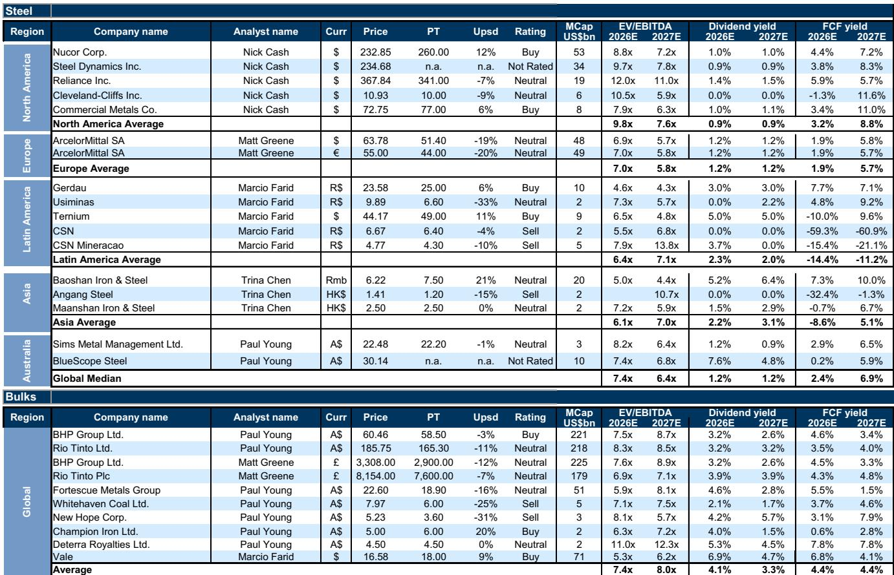
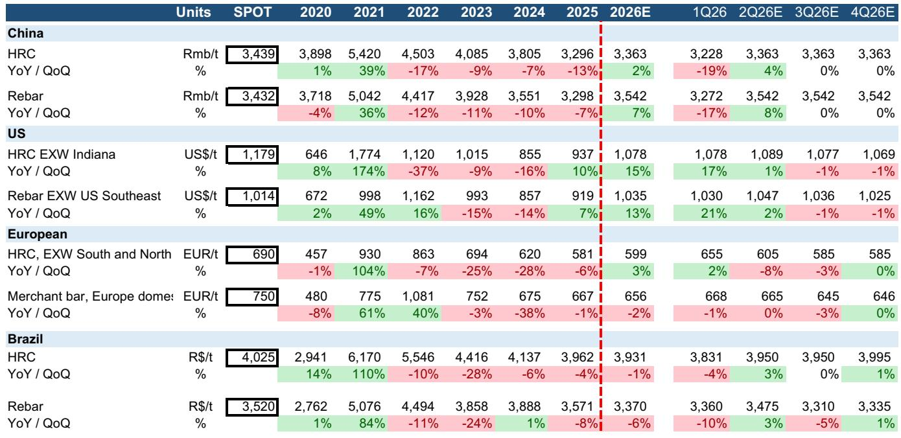
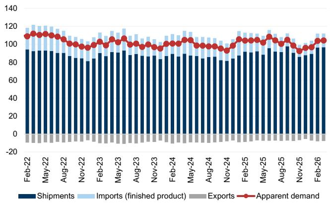

# Steel's Asymmetry Is Reshaping the Global Trade Map: Why Brazil and the US Are Winning While China and Europe Face Structural Headwinds

The global steel market in mid-2026 is not simply experiencing a cyclical upturn. It is undergoing a regional divergence that signals a fundamental reordering of competitive advantage. Flat steel prices rose in virtually every major region in April, but the magnitude of those increases tells a story that goes far beyond demand recovery. Brazil posted a 10.3% month-on-month increase in hot-rolled coil prices, more than four times the US increase and over three times China's. On a year-to-date basis, Brazil's HRC prices have surged 20.6%, while the US has gained 14.7% and Europe has managed only 12.6%. This is not random variation. It reflects deep structural differences in production capacity, policy regimes, and exposure to global trade flows.

The controlling idea is this: the steel market is bifurcating into two distinct regimes. In one regime, regions with tight capacity, high utilization rates, and protectionist trade policies are capturing pricing power. In the other, regions burdened by overcapacity, weak domestic demand, and delayed capacity rationalization are struggling to translate production cuts into sustainable price gains. The winners are not necessarily the largest producers. They are the most disciplined ones.

This divergence matters because it creates a strategic inflection point for investors, procurement executives, and policymakers. The old assumption that steel is a globally fungible commodity with prices converging over time is breaking down. Regional pricing dynamics are becoming more persistent, and the implications for supply chains, capital allocation, and trade policy are profound. The report from which this analysis draws provides a rich set of data points, but the real value lies in interpreting what these numbers mean for the next twelve to eighteen months.

## The Pricing Hierarchy Is Inverting: Brazil and the US Are Emerging as Premium Markets, Not Just Large Ones

The most striking pattern in the April data is the emergence of a clear pricing hierarchy that does not correlate with production scale. Brazil, which is not among the top global steel producers, now commands the strongest price momentum. Its HRC prices rose 10.3% month-on-month, and rebar prices jumped 12.0%. On a year-to-date basis, Brazil's rebar performance of 13.3% leads all regions except its own flat steel segment. The US is not far behind, with HRC prices up 14.7% YTD and capacity utilization averaging 79.6% in April, a 4.4 percentage point improvement year-on-year.

What explains this inversion? The answer lies in capacity discipline and trade barriers. Brazil's steel industry operates with relatively tight capacity, limited import penetration, and a domestic market that has been recovering faster than many analysts expected. The US benefits from Section 232 tariffs and a broader protectionist environment that effectively caps import volumes and allows domestic mills to operate at higher utilization rates without being undercut by Chinese or other low-cost producers. In both cases, the pricing premium is a direct function of supply constraints, not demand exuberance.

The implication is straightforward: steel buyers in these markets are paying a structural premium that is unlikely to erode quickly. For investors, this means that steel companies with significant exposure to the US and Brazilian markets are likely to maintain stronger margins than peers in Europe or Asia, even if global demand softens. The pricing power is embedded in the regulatory and capacity structure, not in transient demand cycles.

## China's Production Discipline Is Real but Delayed, and the Market Is Pricing in a Longer Wait

China remains the elephant in the room, and the data confirms that its production trajectory is evolving in a way that creates both opportunity and risk for global markets. Chinese steel production continued to decline year-on-year in the first two weeks of May, down 3.2% versus the same period in 2025. The March 2026 data showed a 14% month-on-month increase in crude steel output, but that was still 6% below the prior year's level. The narrative of "anti-involution" and long-term capacity cuts is intact, but the execution timeline has shifted.

The report notes that analysts see delayed execution into 2026 in terms of both capacity and production discipline. This is a critical nuance. The market has been anticipating that China's capacity rationalization would create a floor under global steel prices. What the data suggests instead is that the floor is being built more slowly than expected, and that Chinese mills are still capable of ramping up production when seasonal or policy incentives align. The blast furnace capacity utilization rate in May 2026 stood at 89.6%, which is high by historical standards and indicates that existing capacity is being actively used.

The strategic implication is that China is not withdrawing from the global steel market in a clean, linear fashion. It is managing a complex transition that involves maintaining production for domestic infrastructure and export markets while gradually reducing the most inefficient capacity. For global steel prices, this means that the downside risk from Chinese oversupply has diminished but not disappeared. The market is pricing in a slower adjustment, and that creates a window of uncertainty for any investment thesis that relies on a sharp, sustained reduction in Chinese output.

## Europe and the Black Sea Are Trapped Between Cost Pressures and Import Competition

The European and Black Sea markets present a contrasting picture that highlights the limits of pricing power in open trade environments. European HRC prices were broadly flat month-on-month in April, rising only 0.3%, and the region's crude steel production in March, while up 16% month-on-month, was still down 3% year-on-year. The Black Sea region saw a 2% month-on-month increase in HRC prices, but the absolute price level at $500 per tonne is the lowest among all major regions and far below the US level of $1,163.

These regions are caught in a structural trap. On one side, they face high energy costs and regulatory burdens that raise production costs. On the other, they are exposed to import competition from lower-cost producers, particularly if Chinese or Indian steel finds its way into European markets through trade diversion. The European Union's safeguard measures provide some protection, but they are not as comprehensive as US tariffs, and the bloc's steel demand is heavily dependent on construction and automotive sectors that are themselves under pressure from higher interest rates and slowing economic growth.

The data on capacity utilization reinforces this diagnosis. Ex-China effective steel capacity utilization in the EU was 80% in March 2026, which is below the levels seen in India (100%), the US (90%), and Latin America (95%). The Black Sea region was at 85%. These utilization rates are not low enough to signal a crisis, but they are low enough to prevent mills from exercising significant pricing power. The spare capacity data tells the same story: the EU has 34 million tonnes of annualized spare capacity, and the Black Sea region has 31 million tonnes. That overhang acts as a cap on price increases.

For decision-makers, the takeaway is that European and Black Sea steel assets are unlikely to generate the same margin expansion as US or Brazilian assets in the current environment. Any investment in these regions must account for the persistent risk of import competition and the limited ability to pass through cost increases to customers.

## India's Production Acceleration Is a Wild Card That the Market Has Not Fully Priced

One of the most interesting data points in the report is the acceleration in Indian crude steel production. In March 2026, India's output grew 11% year-on-year, up from 10% YTD and 7% in February. This acceleration is occurring from a base that already had effective capacity utilization at 100%, meaning that India is operating at the limits of its current capacity. The country is adding new capacity, and the growth trajectory suggests that India could become a more significant exporter in the medium term.

The market has not fully priced this development. Most global steel analysis focuses on China and the US, but India's production growth has implications for trade flows, particularly into markets that are not heavily protected by tariffs. If Indian mills continue to ramp up output, they could displace Chinese exports in Southeast Asia, the Middle East, and Africa, putting downward pressure on prices in those regions. Alternatively, if Indian domestic demand absorbs the additional output, the impact on global trade would be muted.

This is an area where the report provides data but leaves a meaningful analytical gap. The capacity utilization data shows India at 100%, but the spare capacity chart shows India with only 4 million tonnes of annualized spare capacity. These two data points are not contradictory, but they raise questions about how quickly India can add new capacity and whether the current growth rate is sustainable. The answer to that question will determine whether India becomes a net stabilizer or a net disruptor in the global steel market.

## The Decision Framework: Three Questions Every Steel Market Participant Must Answer

For investors, procurement managers, and strategists, the regional divergence in steel markets creates a need for a clear decision framework. The following three questions should guide any analysis of steel exposure over the next twelve months.

First, what is your region's capacity utilization trajectory relative to its historical peak? The data shows that markets with utilization rates above 90%, such as the US and Latin America, have significantly more pricing power than those below that threshold. If your exposure is to a region where utilization is rising toward 90%, the margin outlook is favorable. If utilization is stagnant or declining, margin expansion will be difficult regardless of demand trends.

Second, what is your exposure to Chinese production decisions? Even with delayed capacity cuts, China remains the marginal producer that can swing global supply balances. The key variable is not whether China cuts capacity, but when and how quickly. If you are investing in European or Asian steel assets, you need to model scenarios where Chinese exports remain elevated for another twelve to eighteen months. If you are investing in US or Brazilian assets, the Chinese risk is lower because trade barriers provide a buffer.

Third, how will trade policy evolve in your key markets? The US election cycle, European safeguard reviews, and potential trade disputes involving India and China all create policy uncertainty. The current environment favors protected markets, but that could change. Any investment thesis that relies on continued protectionism must account for the possibility that trade barriers could be lowered or that other regions could retaliate with their own measures.

## What the Report Does Not Fully Answer: The Sustainability of Brazilian Pricing and the Risk of Policy Reversal

The report provides extensive data on pricing, production, and capacity, but it leaves several important questions unresolved. The most pressing is whether Brazil's pricing momentum is sustainable. Brazil's HRC prices have risen 20.6% year-to-date, and rebar prices are up 13.3%. These are extraordinary gains for a market that is not typically considered a premium pricing environment. The question is whether this reflects genuine supply-demand tightness or a temporary surge driven by inventory restocking and currency effects.

The report does not provide enough granularity on Brazilian demand drivers to answer this question definitively. If the price gains are driven by construction and infrastructure spending that is likely to continue, then Brazilian steel assets are attractive. If they are driven by one-time factors such as import sUBStitution or a weak real, then the gains could reverse quickly. Investors need to dig deeper into Brazilian end-market data to make an informed judgment.

A second unresolved question is the risk of policy reversal in the US. The current administration has maintained a protectionist stance on steel, but trade policy is subject to change. If tariffs are reduced or if exemptions are expanded, US steel prices could fall sharply as import volumes increase. The report's data on US capacity utilization at 79.6% suggests that there is room for domestic mills to increase output, but that would not fully offset the impact of lower import barriers. The market is pricing in continued protection, but that assumption is not risk-free.

## Join the Community to Read the Full Report and Review the Original Charts

The data and analysis presented here are drawn from a comprehensive global steel market report that includes detailed pricing tables, production trends, and capacity utilization charts across all major regions. The full report provides the underlying data that supports the arguments made in this article, as well as additional exhibits on Chinese steel output, global crude steel production, and regional spare capacity. For decision-makers who need to validate these conclusions with original source material, the full report is essential reading. Join the community to read the full report and review the original charts.

*This article is for learning and discussion only and does not constitute investment advice.*

Personal reading notes and learning share only. Not investment advice.

