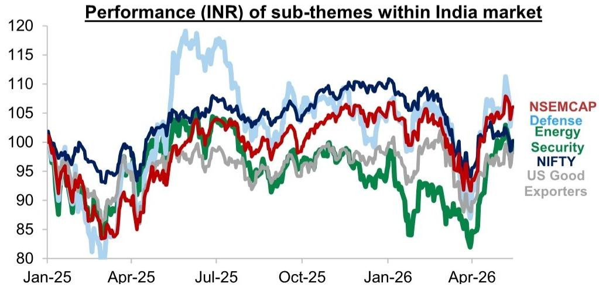
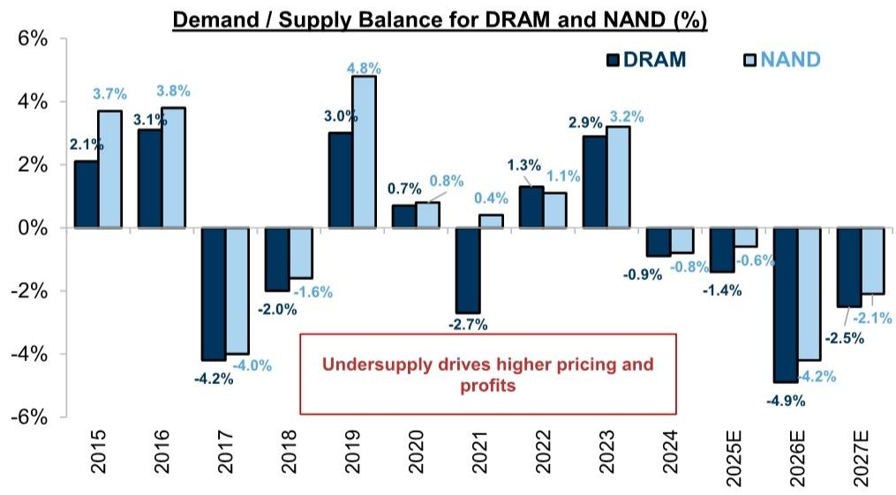
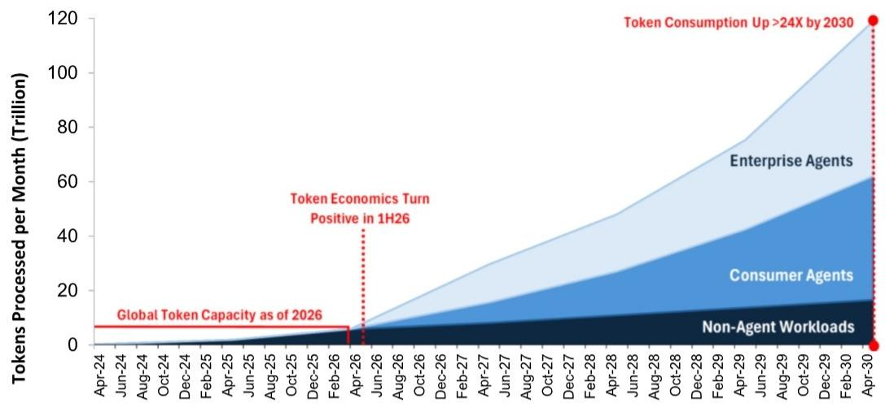

# 印度市场的真正分歧不在涨跌，而在“谁先扛不住”和“谁在悄悄换仓”

5月中旬，某外资投行策略团队在孟买与一批印度本土机构投资者进行了为期两天的交流。回来后，他们写了一份反馈纪要，标题是“Cautious Near-Term, Constructive on Select Alpha”。翻译成市场语言，就是：短期看不清，但选股的机会正在浮现。

这份纪要透露出的信号，远比表面上的“谨慎”二字复杂。它揭示了当前印度市场中一个正在被定价但尚未被充分讨论的结构性张力：本土资金与外资的预期正在脱钩，而真正决定下一阶段回报的，不是谁更乐观，而是谁能更准确地判断“压力会先从哪里释放”。

**这份报告最值得看的判断不是印度市场会不会跌，而是：当前市场正在经历一场由宏观冲击驱动的、但最终会由微观结构决定的资金再分配。** 外资在撤，本土资金在接，但接盘的逻辑和定价权正在发生转移。这轮调整的终点，不是估值见底，而是新的主导资金力量完成建仓。

## 1. 市场最焦虑的不是油价，而是“不知道油价会高多久”

与直觉相反，印度本土机构投资者对当前宏观风险的认知并不模糊，甚至高度一致：伊朗局势推高油价，印度作为原油净进口国，经济增长和企业盈利必然承压。真正让他们分歧的，不是方向，是持续时间和深度。

报告显示，部分投资者认为一旦地缘冲突缓和，油价回落将直接成为印度股市的催化剂；但也有投资者担忧，即使冲突结束，大宗商品价格的中枢可能已经抬升，这将持续侵蚀下游企业的利润率。这种分歧的实质，是对“供给冲击的粘性”预期不同。

从历史经验来看，某外资投行援引的数据表明，能源供给冲击发生后，印度市场盈利在12个月内被下调6%-13%，中位数为7%。当前市场已经部分反映了这种下调预期，但关键在于：**如果油价在更高位置维持更久，那么当前市场隐含的盈利预期可能仍然偏高。** 这意味着，市场对印度企业盈利的“下修周期”可能才刚刚开始，而非接近尾声。

这个判断对投资者的含义是：在盈利下修周期中，指数层面的贝塔机会有限，而个股层面的阿尔法分化会急剧扩大。那些能够将成本压力转嫁给下游、或自身能源成本占比较低的企业，将获得显著的相对收益。

## 2. 外资的“卖出”可能已经完成大半，但“重新买入”的触发条件仍未满足

报告中一个被高度关注的现象是：外资持续流出印度市场，但本土机构资金仍在源源不断地流入。这形成了当前印度市场最核心的“资金对峙”。

该外资投行认为，大部分主动型外资的卖出可能已经发生——他们在预期到盈利下调周期之前就已经减仓。但问题在于，低盈利能见度会阻碍他们重新买入。换句话说，外资不是不想回来，而是没有看到足够清晰的理由回来。

这里有一个被市场普遍低估的细节：被动资金（ETF）仍在流入，但流入速度在放缓。报告提到，本土投资者开始担忧印度在全球指数中的权重收缩，这可能导致被动资金流入进一步缩减。**如果被动资金也开始减速，那么印度市场将失去最后一个稳定的外资买入力量。** 届时，市场的边际定价权将完全交到本土资金手中。

这意味着，印度市场的“底部”将不再由估值决定，而是由本土资金的承接能力和意愿决定。而本土资金目前的信心，建立在一个尚未被证伪的假设上：家庭储蓄向金融资产转移的结构性趋势仍在加速。这个假设一旦受到挑战，市场的调整幅度可能远超当前预期。

## 3. 半导体存储器的“更高更久”盈利，是少有的、可以独立于宏观交易的叙事

在整体谨慎的氛围中，有一个子领域获得了高度一致的关注：韩国半导体存储器。报告指出，投资者问得最多的问题之一就是“半导体存储器上行周期何时见顶”。

这个问题的背后，是市场对周期性见顶的天然恐惧。但该外资投行的判断恰恰相反：DRAM和NAND的供需缺口在未来几年将持续扩大，甚至到2026-2027年仍将处于供不应求状态。原因有三：超大规模云服务商的投资驱动需求持续强劲；存储器厂商正在转向3-5年的长期协议，这改变了传统的定价周期；供给端的新增产能有限。

**这组事实合在一起意味着：存储器行业正在从“强周期”向“结构性盈利”转变。** 如果这个判断成立，那么当前市场对存储器股票的估值可能仍然偏低，因为它们仍在按周期股的框架定价，而实际上它们的盈利稳定性正在接近成长股。

对于印度投资者而言，这提供了一个少有的、可以独立于印度国内宏观风险的交易机会。报告提到，有条件的投资者正在将资金配置到离岸市场（即韩国），这本身就是一种对印度本土资产缺乏信心的表达。

## 4. 印度本土的“主题性阿尔法”正在从防御转向结构性受益

在资金整体审慎的背景下，印度本土机构投资者并未完全离场，而是将注意力集中在几个明确的结构性主题上：能源安全、数据中心资本设备、商品出口商（受益于弱卢比和近期签署的FTA），以及中小市值股票。

值得注意的是，这些主题并非传统的防御性板块（如消费、医药），而是更接近“宏观对冲”或“政策受益”的逻辑。能源安全是对油价上涨的直接对冲；数据中心资本设备是对AI投资浪潮的间接参与；商品出口商则是在利用卢比贬值和贸易协议扩大市场份额。

**这意味着，印度本土机构正在从“买入印度增长故事”转向“买入印度结构性竞争优势”。** 这是一个重要的信号变化。过去几年，印度市场的核心叙事是“人口红利+改革红利”带来的长期增长。而现在，投资者开始更精细地拆解哪些行业真正拥有定价权、成本转嫁能力和全球竞争力。

这种转变对资产定价的含义是：那些依赖国内消费增长、但缺乏定价权的行业，可能面临持续的估值压缩；而那些能够受益于全球供应链重构、或国内政策定向支持的行业，将获得溢价。

## 5. 报告尚未完全回答的关键问题：本土资金流入的“脆弱点”在哪里？

整份报告读下来，最令人不安的，不是外资流出，也不是油价冲击，而是本土资金流入的“确定性”可能被高估。

报告指出，本土机构投资者对国内资金流入的持续保持“信心”，理由是家庭储蓄向金融资产转移的结构性趋势。但这个趋势的可持续性，取决于几个尚未被充分验证的假设：第一，印度家庭的实际收入增长能否支撑储蓄率的持续提升；第二，银行存款利率与股市回报率的相对吸引力是否会发生逆转；第三，如果市场出现持续下跌，散户投资者的行为是否会从“逢低买入”转向“恐慌赎回”。

**这些假设中的任何一个被打破，都可能导致本土资金流入出现断崖式下降。** 而当前市场对印度股市的定价，已经隐含了本土资金持续流入的预期。如果这个预期被修正，那么市场的调整幅度将远超当前油价冲击所能解释的范围。

这是报告没有完全展开、但值得所有投资者深思的问题。印度市场的“结构牛”叙事，目前仍建立在资金流入的假设之上，而非企业盈利的广泛改善之上。

---

顺着上述未解问题，我们可以继续深入讨论：本土资金流入的脆弱性如何量化？哪些信号可以提前预警？在盈利下修周期中，哪些行业仍然具备防御性？这些问题的答案，都在完整版研报的详细数据与图表中。欢迎来星球微信群里继续讨论，我们也会在群内分享更详细的拆解和后续跟踪。

Personal reading notes and learning share only. Not investment advice.

