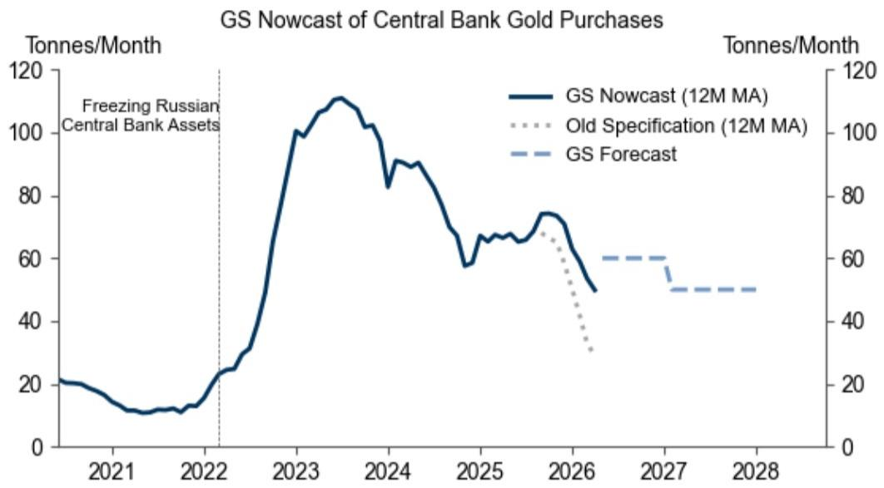
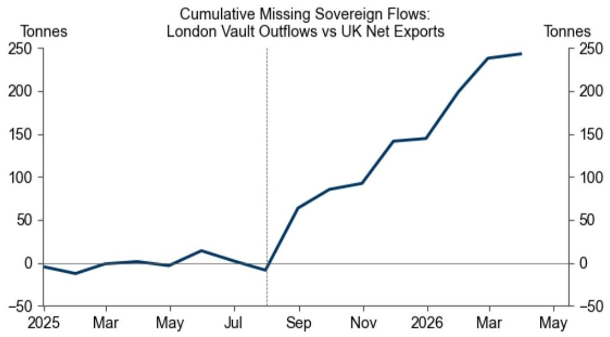

# Central Bank Gold Buying Is Stronger Than the Market Thinks—And Poised to Accelerate Again

The prevailing market narrative that central bank gold purchases have been steadily declining is based on an incomplete reading of the data. A major global investment bank's updated nowcast reveals that sovereign gold buying has been systematically understated since August 2025, with the true pace running nearly 70% higher than previously estimated. The 12-month moving average now stands at approximately 50 tonnes per month as of March 2026, not the 29 tonnes that earlier models suggested. This is not a minor statistical adjustment. It represents a fundamental reassessment of how central banks are behaving in a world where geopolitical fragmentation is accelerating, reserve diversification is becoming a strategic imperative, and the traditional relationship between trade data and physical gold flows has broken down.

The implications for gold investors are sUBStantial. If the market has been operating on flawed assumptions about the pace of sovereign buying, then the entire demand-side calculus for gold needs to be rethought. The report's forecast that central bank purchases will average 60 tonnes per month through 2026—a significant acceleration from current levels—suggests that the structural support for gold prices is stronger than most participants recognize. Yet the near-term outlook is more nuanced. Gold's unique position as the most liquid commodity means it remains vulnerable to forced selling during periods of equity market stress, particularly if geopolitical risks trigger a simultaneous reassessment of growth expectations and interest rate trajectories. Understanding this tension between structural demand and cyclical vulnerability is the key challenge for investors today.

What makes this moment particularly interesting is not just the magnitude of the data revision, but what it reveals about central bank behavior in an era of strategic opacity. Sovereign buyers are increasingly choosing to obscure their transactions, and the traditional methods of tracking their activity are breaking down. The report's methodological innovation—adding the discrepancy between London vault outflows and UK net exports as a proxy for unrecorded sovereign flows—is a direct response to this new reality. The analytical question is no longer simply "how much gold are central banks buying?" but rather "why are they going to such lengths to hide it, and what does that tell us about their long-term intentions?"

## The Breakdown of Traditional Tracking Methods Reveals a Structural Shift in Sovereign Behavior

The foundation of the bank's nowcast methodology is elegant in its simplicity. London is the primary venue for sovereign gold transactions, and the UK produces no gold of its own. Every bar traded in London must be imported. Once imported, gold either remains in London vaults or is exported—either to Switzerland for recasting into smaller bars for retail demand, or directly to sovereign vaults abroad. By tracking UK exports of gold bars to destinations other than Switzerland, and then estimating the sovereign component of exports to Switzerland, the bank had historically been able to infer central bank buying with reasonable accuracy.

This approach worked because the math was closed: UK net exports should have matched London vault outflows. For years, they did. The close historical relationship between these two data series provided confidence that sovereign gold flows were being captured in UK trade statistics, despite international guidelines that recommend excluding sovereign transactions from such data. The system was imperfect, but it was consistent.

That consistency ended in August 2025. Since that point, London vault data have shown gold leaving the system, but UK trade data no longer fully reflect these outflows. The gap has been persistent and growing, reaching approximately 250 tonnes by May 2026. This is not a data collection error or a seasonal anomaly. It is a deliberate shift in sovereign behavior. Central banks are finding new ways to move gold that bypass traditional trade reporting channels, and the scale of these unrecorded flows is now too large to ignore.

The implication is profound. If sovereign buyers are actively working to obscure their transactions, it suggests a level of strategic intent that goes beyond routine reserve management. Central banks are not just buying gold; they are building positions with an eye toward future geopolitical contingencies where visibility into their holdings could be a liability. This behavior is consistent with a world where financial sanctions, asset freezes, and the weaponization of the dollar-based payment system have become live risks for reserve managers in certain jurisdictions. The opacity itself is the signal.

## Survey Evidence and Geopolitical Dynamics Point to Accelerating Demand Through 2026

The report's forecast that central bank purchases will average 60 tonnes per month through 2026 is not based solely on the mechanical adjustment of the nowcast model. It is reinforced by the bank's own survey of central bank reserve managers, which points to strong underlying interest in gold. This survey evidence is particularly valuable because it captures intentions rather than just observed flows, and it suggests that the current pace of buying is not a peak but a plateau from which further acceleration is possible.

The logic here is straightforward but powerful. Central banks that have not yet begun diversifying into gold are under increasing pressure to do so, both from their own strategic planning processes and from the example set by peers. The recent acceleration of geopolitical fragmentation—trade disputes, sanctions regimes, and the erosion of multilateral institutions—creates a self-reinforcing dynamic. Each new geopolitical shock increases the perceived value of reserve assets that are outside the traditional dollar-based system, which in turn encourages more central banks to follow suit. Gold is the primary beneficiary of this trend because it has no counterparty risk, no political allegiance, and a millennia-long track record as a store of value.

The report's end-2026 price target of $5,400 per ounce is consistent with this demand outlook, but it also embeds an important caveat. The near-term path for gold is not a straight line upward. Gold's exceptional liquidity makes it the first asset that private investors will sell when they need to raise cash. If equity markets sell off amid higher interest rates and weaker growth expectations—both of which are real possibilities given the current geopolitical environment—gold could face significant headwinds. This creates a tension between the structural bull case and the cyclical risks that investors must navigate carefully.

The key question is whether the structural demand from central banks is large enough to absorb any forced selling from private investors. The report's data suggests that it might be, but the answer depends on the scale and speed of any liquidity event. A gradual equity market decline would likely be absorbed without much disruption to gold's upward trend. A sudden, panic-driven selloff could overwhelm even sUBStantial central bank buying in the short term.

## What the Report Does Not Fully Answer: The Identity and Motivation of the Hidden Buyers

For all its analytical rigor, the report leaves several critical questions unresolved. The most obvious is the identity of the central banks that are now buying gold through channels that evade traditional trade reporting. The report can measure the gap between London vault outflows and UK net exports, but it cannot attribute those flows to specific sovereign buyers with any confidence. This matters because the market's assessment of future demand depends heavily on whether the current buying is coming from a narrow set of countries with specific geopolitical motivations or from a broad-based shift in reserve management practices.

If the hidden buying is concentrated among a small number of central banks that are already heavily exposed to gold, the incremental demand from further accumulation may be limited. If, however, it represents the early stages of a broader diversification trend that includes central banks that have historically held minimal gold reserves, the potential for sustained demand is much larger. The report's survey evidence suggests the latter interpretation is more likely, but the data on actual flows remains ambiguous.

A second unresolved question concerns the mechanism by which central banks are hiding their transactions. The report identifies the gap between London vault outflows and UK trade data, but it does not specify how sovereign buyers are moving gold without triggering trade reporting requirements. Possible explanations include the use of intermediaries that do not report to UK customs, transactions structured as financial derivatives rather than physical transfers, or the use of alternative trading venues outside London. Each of these explanations has different implications for the sustainability and scalability of the current buying pattern.

Third, the report does not fully explore what happens when central banks decide to sell. The analysis is entirely focused on the accumulation phase, but gold's role as a reserve asset implies that it will eventually need to be liquidated, at least in part. If the current buying is motivated by geopolitical concerns, then the conditions that would trigger selling—a relaxation of tensions, a return to multilateralism, or a credible reform of the international monetary system—are precisely the conditions that would reduce gold's strategic value. This creates an asymmetry in the demand function that is not fully addressed.

## A Decision Framework for Investors: Three Scenarios for Gold Through 2026

The report's analysis can be translated into a practical decision framework that helps investors position for the range of possible outcomes. The framework rests on three scenarios, each defined by the interaction between central bank demand and private investor behavior.

The base case, which is broadly consistent with the report's explicit forecast, assumes that central bank purchases accelerate to 60 tonnes per month as expected, while private investors maintain a neutral to modestly positive stance on gold. In this scenario, gold trends toward the $5,400 target by end-2026, with periodic pullbacks during equity market stress that are quickly reversed as central bank buying absorbs the excess supply. The primary risk in this scenario is timing: the path to $5,400 may include significant volatility, and investors need to have the conviction and the holding period to weather the drawdowns.

The bullish scenario assumes that central bank buying exceeds the forecast, either because the hidden buyers accelerate their accumulation or because a new wave of sovereign purchasers enters the market. This scenario could be triggered by a further escalation of geopolitical tensions, a sanctions event that catches reserve managers off guard, or a significant depreciation of the dollar that forces a reassessment of reserve composition. In this scenario, gold could reach $5,400 well before end-2026 and potentially overshoot to the upside. The key indicator to watch is the trajectory of the gap between London vault outflows and UK net exports. If that gap continues to widen, it would suggest that the hidden buying is accelerating, which would be a powerful bullish signal.

The bearish scenario is more nuanced. It does not require a collapse in central bank demand, but rather a simultaneous shock to private investor sentiment and a reassessment of the macroeconomic outlook. If equity markets sell off sharply on a combination of higher rates and weaker growth, private investors may liquidate gold holdings at a pace that overwhelms even elevated central bank buying. The report explicitly warns about this possibility. In this scenario, gold could trade down to $4,500 or lower before recovering, and the path to $5,400 would be pushed into 2027 or beyond. The key risk factor here is the speed of any equity market decline and whether it triggers forced selling across asset classes.

The practical implication for investors is that gold positioning should be sized not just for the base case but for the range of outcomes. The structural case for gold is strong, but the cyclical risks are real. The best approach is to build positions gradually, using pullbacks as opportunities to add exposure, while maintaining the liquidity to withstand short-term volatility.

## Why This Analysis Matters Now: The Market Is Underestimating a Structural Shift

The most important takeaway from this report is not the specific numbers but the pattern they reveal. Central banks are not just passive buyers of gold; they are actively reshaping the market in ways that are becoming harder to track. The breakdown of the traditional relationship between trade data and physical flows is not a data problem to be solved. It is a signal of a deeper structural shift in the international monetary system.

For investors, this means that the conventional wisdom about gold demand is likely wrong. The market has been operating on the assumption that central bank buying was slowing, and that assumption has been reflected in positioning and pricing. If the true pace of buying is significantly higher, then gold is more undervalued than the consensus recognizes. The report's upward revision to the nowcast and its forecast of further acceleration are not just analytical adjustments. They are a challenge to the market's prevailing narrative.

The open questions that remain—the identity of the hidden buyers, the mechanisms they are using, and the conditions under which they might become sellers—are not weaknesses in the analysis. They are the natural frontiers of understanding in a market that is evolving rapidly. Investors who want to stay ahead of the curve need to engage with these questions, not wait for them to be resolved.

Join the community to read the full report and review the original charts.

*This article is for learning and discussion only and does not constitute investment advice.*

Personal reading notes and learning share only. Not investment advice.

