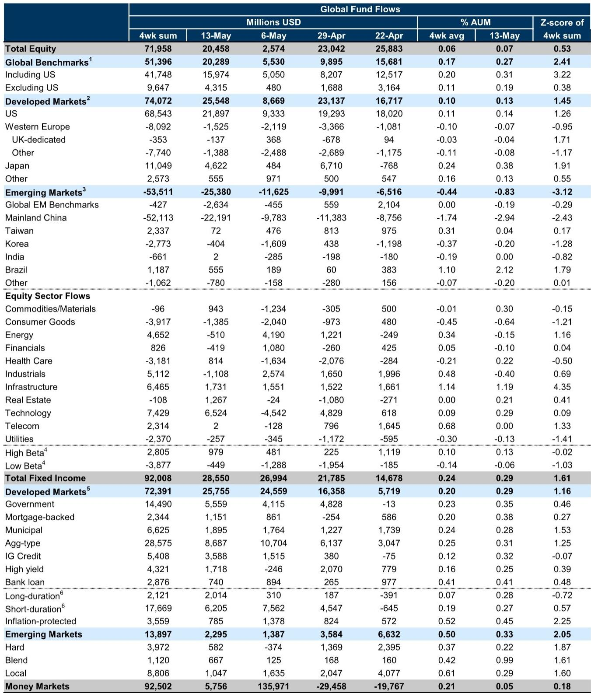
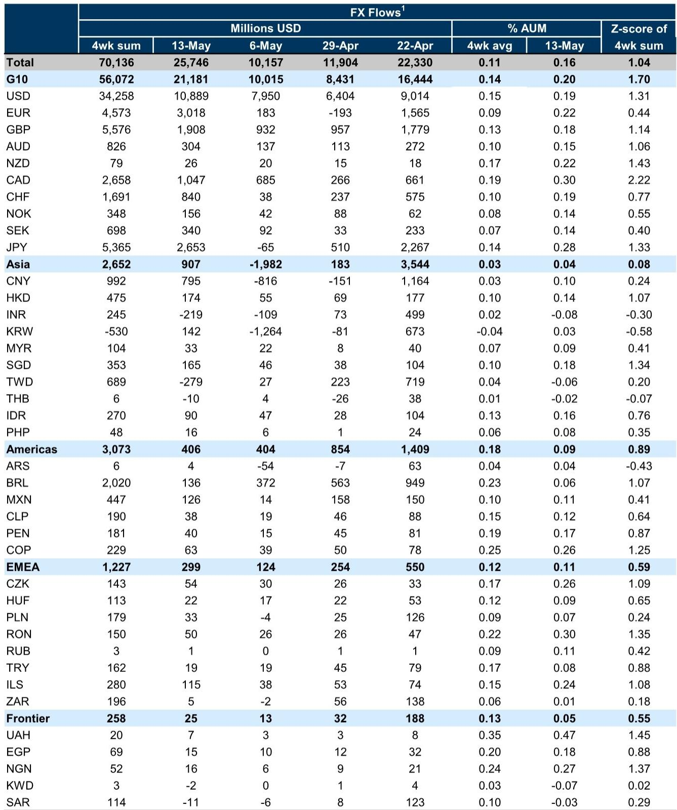

# Global Fund Flows Are Sending a Clear Signal: The Rotation Out of Energy Is Not an Anomaly, It Is a Structural Repricing

The week ending May 13 recorded a striking shift in the global fund flow landscape: net inflows into equity funds surged to $20 billion from just $2 billion the prior week, while fixed income continued its steady march higher at $28.5 billion. At first glance, this looks like a straightforward risk-on environment. But beneath the aggregate numbers lies a more nuanced and strategically important pattern. Energy sector funds, which had attracted $4 billion in inflows the previous week, reversed sharply to $0.5 billion in outflows. This is not a blip. It is the latest data point in a sequence that reveals how capital is repricing the energy complex relative to broader commodity exposure and technology-led growth.

The conventional narrative that energy is a simple inflation hedge or a cyclical bet on rising commodity prices is breaking down. What we are observing is a decoupling between commodity price momentum and capital allocation decisions. The S&P GSCI has been rising, yet flows into energy funds have been volatile and, on a four-week moving average basis, are now negative. This divergence demands explanation. It suggests that institutional investors are not treating energy as a monolithic sector anymore. They are differentiating between the commodity itself, the equity exposure to energy producers, and the broader infrastructure and technology themes that are reshaping how energy is produced, stored, and consumed.

This report parsing reveals that the real story is not about whether capital is flowing into equities or fixed income. It is about *where* within those broad buckets capital is being deployed, and what that tells us about the market's underlying assumptions about growth, inflation, and the energy transition. The data forces us to ask: are we witnessing a tactical rotation, or the early stages of a secular shift in how portfolios are constructed?

## The Surge in Equity Flows Masks a Critical Divergence Between Developed and Emerging Markets

The headline $20 billion in net equity inflows is dominated by developed market funds, particularly the United States and Japan. This is consistent with a market that is pricing in a soft landing or a mild recession in the developed world, supported by resilient corporate earnings and a still-tight labor market. But the divergence within emerging markets is where the signal becomes more interesting. Global EM benchmark funds, Mainland China, and Korea equity funds all saw net outflows. Mainland China funds have experienced the largest net outflows in recent weeks, a pattern that has been building for some time.

This is not simply a China-specific story. It reflects a broader reassessment of emerging market risk premia in a world where interest rates remain higher for longer in the developed world, and where the growth differential between DM and EM is narrowing. Capital is flowing to markets where the policy backdrop is clear and where corporate governance and earnings visibility are high. Japan, with its corporate governance reforms and shareholder-friendly policies, has become a magnet. The United States, despite its own fiscal and political uncertainties, still offers the deepest and most liquid markets.

The implication for portfolio construction is straightforward: a generic EM allocation is no longer sufficient. The dispersion within EM is as wide as the dispersion between DM and EM. Investors who simply buy an EM index are implicitly taking a large bet on China and Korea, two markets that are currently seeing capital outflows. A more granular approach, one that tilts toward markets with strong domestic demand and policy credibility, may be required. The data suggests that India, despite its high valuations, is still attracting interest, while Taiwan continues to benefit from semiconductor demand. But the overall EM story is one of fragmentation, not convergence.

## Fixed Income Flows Reveal a Market That Is Pricing in Sticky Inflation and a Flattening Yield Curve

Fixed income flows were well supported, with aggregate-type and government bond funds leading the way. But the composition within fixed income is telling. Short-duration bond funds have seen sustained inflows, while long-duration bond funds have lagged. Demand for inflation-protected bond funds has been strong. This is a classic portfolio response to an environment where inflation risks are perceived as rising, but where the central bank is not expected to cut rates aggressively.

The market is effectively saying: we believe inflation will stay above target for longer than previously expected, but we do not believe it will spiral out of control. As a result, investors are willing to take on credit risk in the front end of the curve, where yields are attractive and duration risk is minimal. They are less willing to lock in long-term yields, which would expose them to the risk that inflation expectations become unanchored.

For strategic asset allocators, this has two implications. First, the traditional 60/40 portfolio is being re-engineered. Fixed income is no longer a simple diversifier; it is a source of yield, but only if duration is managed actively. Second, the strong demand for inflation-protected bonds suggests that the market is not fully convinced that the inflation problem is solved. This is consistent with the energy flow data: investors are hedging against energy-driven inflation, even as they reduce direct exposure to energy equities.

## The Energy Flow Reversal Is a Leading Indicator of a Broader Reassessment of Commodity Exposure

The chart of the week in the report shows the relationship between net flows into energy funds and the S&P GSCI. Historically, these two series have moved together. Energy fund inflows rose when commodity prices rose, and vice versa. But in recent weeks, the correlation has broken down. Commodity prices have remained elevated, yet energy fund flows have turned negative.

This is not a sign that investors are bearish on energy prices. It is a sign that they are re-evaluating how to gain exposure to the energy theme. The rise of infrastructure funds, technology funds, and even materials funds as vehicles for energy-related exposure suggests that the traditional energy equity fund is losing its appeal. Investors want exposure to the energy transition, to grid modernization, to electrification, and to the supply chain for critical minerals. They do not want to own a portfolio of oil and gas producers that are vulnerable to policy risk, regulatory headwinds, and the long-term decline of fossil fuel demand.

The cumulative flows by sector year-to-date support this interpretation. Industrials, infrastructure, and commodities/materials have all seen strong inflows. Energy is positive but volatile. Technology is positive but modest. Consumer goods are negative. This is not a market that is rotating out of growth and into value. It is a market that is rotating out of old-economy cyclical sectors and into new-economy capital expenditure themes.

The open question is whether this rotation is sustainable. If commodity prices continue to rise, will investors eventually be forced back into energy equities? Or will the structural shift toward infrastructure and technology prove durable? The report does not answer this question, but the data suggests that the burden of proof is now on the energy bulls. They need to show that energy equities can generate returns that are not simply a function of commodity price momentum.

## What the Report Does Not Fully Answer: The Role of Passive Flows and the Impact on Market Structure

The report provides a detailed breakdown of active mutual fund and ETF flows, but it does not fully address the role of passive investment vehicles. In many markets, passive flows now dominate. A large portion of the inflows into US and Japan equity funds may be driven by passive allocation, not active stock selection. This has implications for market structure.

If passive flows are the primary driver, then the divergence between DM and EM may be partly a function of index composition, not fundamental conviction. The MSCI World Index is heavily weighted toward US and Japanese stocks. Passive investors who are simply rebalancing their portfolios are mechanically adding to those markets, regardless of valuation or outlook. This creates a self-reinforcing cycle: passive inflows push prices higher, which attracts more passive inflows.

The report also does not address the impact of corporate buybacks on fund flows. In the US, corporate buybacks are a major source of demand for equities. If buyback activity is slowing, that could offset the impact of fund inflows. Conversely, if buybacks are accelerating, they could amplify the effect of inflows. Without this context, it is difficult to assess whether the $20 billion in equity inflows is truly bullish or simply a reflection of a market that is being supported by non-fundamental factors.

## A Decision Framework for Readers: How to Interpret Weekly Flow Data in a Strategic Context

Weekly fund flow data is noisy. A single week of data, even one as strong as the week ending May 13, should not be extrapolated into a trend. But when viewed in the context of four-week moving averages and cumulative year-to-date data, patterns emerge that can inform portfolio decisions.

The decision framework I recommend has three layers. First, identify the *direction* of flows. Are they positive or negative for the asset class as a whole? In this case, both equities and fixed income are positive, which suggests a risk-on environment. Second, identify the *composition* of flows. Within equities, are developed markets outperforming emerging markets? Within fixed income, are short-duration and inflation-protected bonds outperforming long-duration bonds? The answer to both questions is yes. Third, identify the *divergences*. Where is the market behaving differently from what the macro narrative would predict? The divergence between energy fund flows and commodity prices is the most important divergence in this week's data.

The strategic implication is that investors should be skeptical of simple narratives. The market is not uniformly bullish. It is selectively bullish, and the selectivity is driven by a sophisticated assessment of risk. The energy flow reversal is a warning that the old playbook of buying energy when commodity prices rise may no longer work. The fixed income composition is a warning that duration risk is not being rewarded. The EM divergence is a warning that country selection matters more than ever.

For readers who want to stay ahead of these shifts, weekly flow data is an essential input, but it must be interpreted through a strategic lens, not a tactical one. The goal is not to trade on the weekly number, but to understand the structural forces that are shaping capital allocation decisions over quarters and years.

## Join the Community to Read the Full Report and Review the Original Charts

The full report contains additional data on cross-border FX flows, sector-level cumulative flows, and a detailed breakdown of flows by country and region. The charts on cumulative global equity flows by sector and region year-to-date are particularly valuable for understanding the long-term trends that underlie the weekly noise. To access these charts and the complete analysis, join the community. The data is too rich to summarize in a single article, and the strategic insights become clearer when you can see the full picture.

*This article is for learning and discussion only and does not constitute investment advice.*

Personal reading notes and learning share only. Not investment advice.

