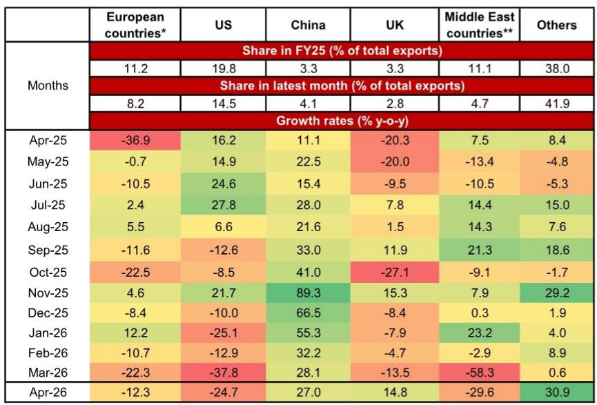
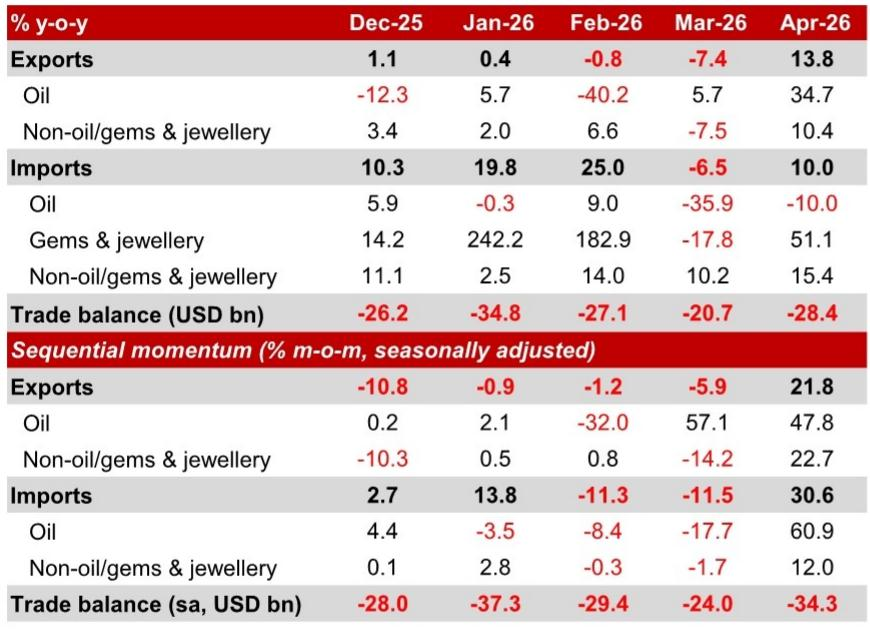
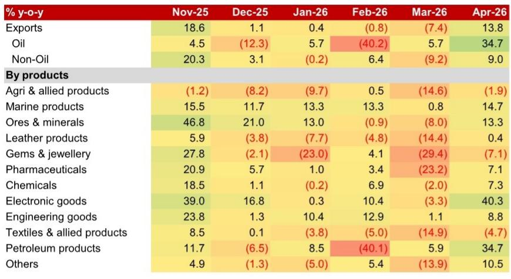

# 印度贸易逆差扩大的真正信号：出口韧性背后，是结构性再定价的开始

印度4月贸易逆差扩大至284亿美元，远超市场预期的260亿美元。市场的第一反应是担忧——经常账户赤字压力加大，卢比承压，资本外流风险上升。但这份来自某外资投行的研报揭示了一个更值得关注的判断：真正超预期的不是逆差规模本身，而是出口结构的急剧变化。

4月印度出口同比增长13.8%，从3月的-7.4%大幅反弹，远超市场预期的-4.4%。这不是简单的基数效应或价格扰动。电子产品的出口增速达到40.3%，创下近一年来的新高。与此同时，传统的纺织品和珠宝出口仍在收缩，对美国和欧洲的出口也在放缓。

这意味着什么？印度正在经历一场“出口替代”——不是总量的扩张，而是结构的重塑。出口增长的动力正在从传统劳动密集型产品转向电子制造，从对欧美市场的依赖转向亚洲内部贸易。这是印度制造业政策红利的初步兑现，还是全球供应链重构中的一次性红利？答案将决定印度未来几年经常账户的真实走向。

## 1. 四月的反弹不是基数效应，而是价格与数量共同推动的结构性转变

4月出口的反弹幅度令人意外。从3月的-7.4%跃升至13.8%，环比经季节调整后增长21.8%。市场预期仅为-4.4%，误差超过18个百分点。

拆解来看，出口增长并非单纯由价格上涨驱动。研报的核心分析显示，剔除石油后的核心出口中，价格效应和数量效应都有贡献。4月核心出口价值增长约10%，其中数量增长贡献了约5个百分点，价格增长贡献了约5个百分点。这与此前几个月价格主导、数量拖累的模式有本质区别。

更关键的是，电子产品的出口增速从3月的-3.3%飙升至40.3%，成为出口增长的最大拉动项。这一增速远超其他品类，且并非基数效应——去年同期电子产品出口增速已经达到15%左右的高基数。这意味着印度在智能手机组装等领域的产能正在加速释放。

这一变化的意义在于：出口增长的质量正在提升。如果只是价格上涨推动，那么一旦全球商品价格回落，出口增长就会逆转。但如果数量增长也在加速，说明印度正在获得真实的全球市场份额。这是结构性改善的信号。

## 2. 电子产品出口的爆发不是偶然，而是全球供应链重构的印度时刻

电子产品出口40.3%的增速需要放在更大的背景下来理解。全球电子产业链正在经历新一轮的区域化重组，印度是这一轮重组的主要受益者之一。

研报中提到的地理分布数据提供了佐证。虽然印度对美国和欧洲的出口增速在4月分别下滑了24.7%和12.3%，但对中国的出口增速达到27.0%，对新加坡和越南的出口增速也保持强劲。这一分化不是暂时的扰动，而是反映了全球电子产品供应链的“近岸化”趋势——中国+东南亚+南亚正在形成一个更紧密的区域制造网络。

印度在这一网络中的定位正在从“组装车间”向“制造基地”升级。电子产品出口的高速增长，很大程度得益于苹果及其代工厂在印度的产能扩张。这一趋势在研报数据中得到了印证：电子产品出口在印度总出口中的占比持续上升，从两年前的约5%升至目前的约8%。

但这里有一个需要验证的关键问题：电子产品出口的高增长能否持续？当前的增长部分得益于全球芯片短缺缓解后的补库需求，部分得益于印度生产挂钩激励计划（PLI）的政策红利。如果全球电子需求放缓，或者苹果等企业的产能分配发生调整，这一增速可能会面临压力。研报对此没有给出明确判断，这是读者需要自行跟踪的变量。

## 3. 进口增长的核心驱动力是消费需求，而非投资需求——这对经济增长的质量提出了疑问

4月进口同比增长10.0%，同样大幅高于市场预期的-5.0%。但进口的结构比总量更值得关注。

核心进口（剔除石油和黄金）增长15.4%，其中消费品的进口增速远超投资品。研报的图表显示，消费品进口增速在4月达到约20%，而投资/工业品进口增速则继续放缓至约10%。这一分化已经持续了数月，并非偶发现象。

这意味着什么？印度的进口增长更多受国内消费需求驱动，而非投资需求。消费驱动的进口增长对经常账户的可持续性是一个负面信号——消费进口更多是“用完即走”的支出，而投资进口则能转化为未来的出口能力。如果进口增长持续由消费品拉动，那么经常账户改善的空间将非常有限。

黄金进口的爆发式增长（81.7%）进一步放大了这一担忧。尽管媒体报道称黄金进口因海关行政延迟而受阻，但实际数据仍然强劲。黄金进口本质上是一种储蓄转移，对经济增长的乘数效应很低，却直接推高贸易逆差。

## 4. 经常账户赤字2.4%的预测可能过于乐观，资本外流才是真正的压力点

研报预测印度2026/27财年经常账户赤字约为GDP的2.4%，这是一个相对可控的水平。但真正的风险不在经常账户，而在资本账户。

研报明确指出，资本流入的疲弱意味着印度的国际收支（BOP）正在录得约700亿美元的赤字。2.4%的经常账户赤字本身不是问题——印度历史上曾长期维持类似水平的赤字。问题在于，当资本流入无法覆盖这一赤字时，央行就需要动用外汇储备来弥补缺口。

印度央行目前的外汇储备约为6000亿美元，短期来看并不构成系统性风险。但资本外流的趋势值得警惕。研报提到，政府已经采取了限制黄金进口、提高汽油柴油零售价格等措施来管理经常账户赤字，并预计会有更多措施出台。这暗示政策制定者对资本外流的担忧正在上升。

对于投资者而言，这意味着卢比可能面临持续的贬值压力。在资本外流的环境下，即使经常账户赤字本身可控，卢比的波动性也会加大。这是所有持有印度资产敞口的投资者需要重新评估的风险。

## 5. 报告尚未完全回答的关键问题：出口韧性能否对冲进口的结构性压力

研报的核心贡献在于揭示了出口结构的改善，但有一个关键问题尚未完全回答：出口的韧性是否足以对冲进口的结构性压力？

出口方面，电子产品的高增长能否持续取决于全球需求、产能扩张节奏以及政策支持力度。这些因素都存在不确定性。进口方面，消费驱动的进口增长短期内难以逆转，黄金进口虽然可能因政策限制而放缓，但居民的避险需求不会消失。

更复杂的是，出口和进口之间存在不对称的弹性。出口增长更多受全球周期影响，而进口增长则受国内居民收入增长和消费习惯驱动。在全球经济放缓的背景下，出口可能先于进口回落，这意味着经常账户的改善可能比预期更慢。

研报提出的“更多管理BOP压力的措施即将到来”是一个重要的政策信号。但具体措施的效果仍有待观察。例如，限制黄金进口可能会推高国内金价，反而刺激走私活动。提高汽油柴油价格虽然能抑制需求，但也会推高通胀，挤压居民消费能力。这些政策两难在研报中没有展开讨论，是读者需要自行判断的领域。

## 6. 投资者的观察框架：不要只看总量，要关注三个结构性指标

基于这份研报，投资者可以建立一个更精细的观察框架，而不是简单盯着每月的贸易逆差数字。

第一，关注电子产品出口增速的持续性。如果电子产品出口能够维持在20%以上的增速，说明印度的制造业升级正在兑现，这将改善经常账户的结构性质量。如果增速回落至10%以下，则说明当前的增长更多是周期性的。

第二，关注核心进口中消费品与投资品的相对增速。如果投资品进口增速开始回升，意味着企业正在加大资本开支，这对未来的出口能力是一个积极信号。如果消费品进口增速持续高于投资品，则需要警惕经常账户改善的可持续性。

第三，关注资本流入的变化。资本账户的动向比经常账户更能决定卢比的短期走势。如果外资持续流出印度债市和股市，即使经常账户赤字稳定，卢比仍可能面临贬值压力。

这三个指标结合起来，比单一的贸易逆差数字更能反映印度经济的真实处境。

---

这份研报揭示了一个正在被市场低估的趋势：印度出口结构正在发生深刻变化，但其对经常账户的改善效果仍需时间验证。与此同时，进口的结构性压力和资本外流的风险正在上升。政策的应对空间和效果将是未来几个月的关键变量。

这些未解问题——电子产品出口的可持续性、消费进口是否见顶、资本外流的规模与节奏——在完整报告中都有更详细的数据拆解和情景分析。欢迎来星球微信群里继续讨论，我们会在群内分享完整的研报原文、图表以及进一步的解读框架。

Personal reading notes and learning share only. Not investment advice.

