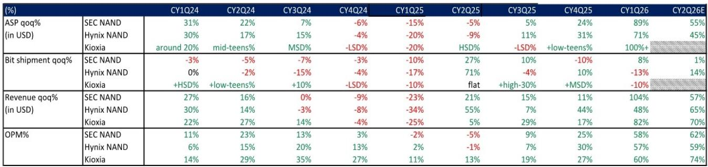
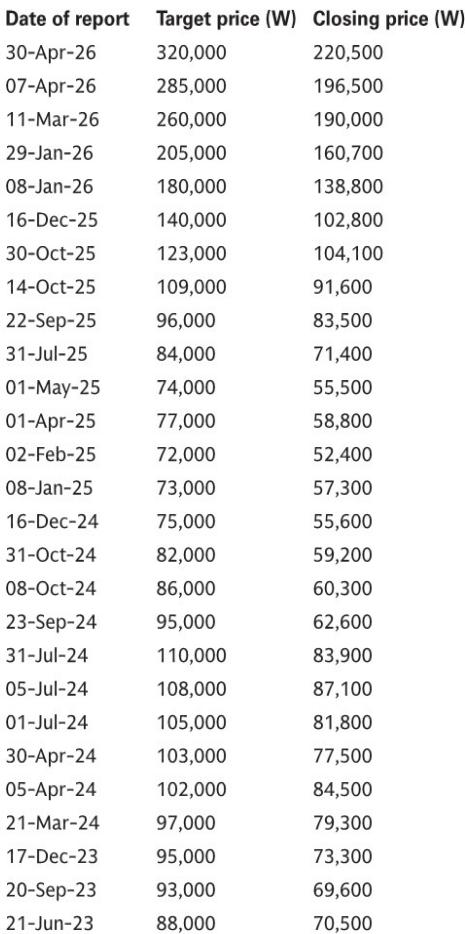
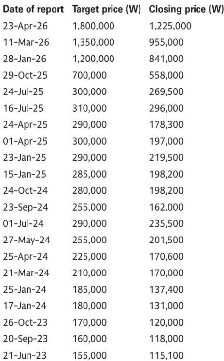

# Kioxia's Guidance Reveals That Street Estimates for NAND Leaders Are Still Too Low

The most important signal from Kioxia's latest earnings is not the company's own performance, but what it reveals about the mispricing of its larger Korean competitors. When a Japanese NAND producer with roughly half the market share of Samsung Electronics guides for 70 percent sequential revenue growth and a 74 percent operating margin in the current quarter, the implications for the two dominant players in the space are profound. The market has yet to fully price in the magnitude of the NAND upcycle that is now underway, and the window for repositioning is narrowing.

Kioxia reported its March quarter results on May 15, and the data points are striking. Blended average selling prices more than doubled sequentially, while operating margins surged to 60 percent. More importantly, the company's guidance for the June quarter implies that ASP growth will be the primary driver of a 70 percent revenue increase, with bit shipment growth described as marginal. This is not a volume story. This is a pricing story, and it is accelerating.

For investors focused on SK Hynix and Samsung Electronics, the read-across is unambiguous. Current consensus estimates for these companies assume NAND ASP growth of 55 percent and 45 percent respectively for the June quarter. Kioxia's guidance suggests these figures are too conservative by a meaningful margin. If Kioxia, which has a less favorable product mix and smaller scale, can deliver this trajectory, the Korean suppliers should be capable of even stronger performance. The gap between what the market expects and what is likely to materialize represents a tangible opportunity.

Beyond the immediate quarter, Kioxia's management has reinforced a bullish outlook that extends well into 2027. The company expects the NAND market to remain very tight for both 2026 and 2027, with undersupply persisting through next year. This aligns with commentary from Samsung during its own recent earnings call, and it suggests that the current pricing momentum is not a transient spike but the beginning of a sustained cycle. For long-only investors, the question is not whether to participate, but how much exposure is appropriate.

## Kioxia's June Quarter Guidance Implies That Korean NAND ASP Estimates Are 15 to 25 Percent Too Low

The arithmetic is straightforward but the implications are often overlooked. Kioxia guided for 70 percent sequential revenue growth in the June quarter, with the company explicitly stating that bit shipment growth will have only a marginal impact. This means that virtually all of the revenue growth will come from higher prices. If we assume that bit shipments are flat to slightly up, the implied ASP increase is in the range of 65 to 70 percent.

Compare this to the current estimates for Samsung Electronics and SK Hynix. The research report shows that Samsung's NAND ASP is forecast at plus 55 percent quarter on quarter, while SK Hynix is at plus 45 percent. Both figures are significantly below what Kioxia is delivering. This discrepancy matters because the three companies have historically shown similar ASP trajectories. In the March quarter, all three recorded operating margins in the 57 to 60 percent range, confirming that their pricing power and cost structures are broadly comparable.

If Kioxia's guidance proves accurate, and there is no reason to doubt a company that just delivered a 100 percent plus ASP increase, then the Korean suppliers are likely to report ASP growth that exceeds current estimates by 10 to 25 percentage points. The revenue impact is sUBStantial. For Samsung, a 10 point upside in ASP translates to roughly 10 percent additional revenue, most of which flows through to operating profit given the high incremental margins in NAND manufacturing.

The operating margin guidance is equally telling. Kioxia's 74 percent target for the June quarter is well above the 60 percent range that analysts have penciled in for Samsung and SK Hynix. If the Korean companies deliver similar margins, earnings estimates will need to be revised upward significantly. This is not a marginal adjustment. This is a fundamental re-rating of the earnings power of these businesses.

## The NAND Supply Tightness Extends Through 2027, Creating a Multi-Year Earnings Tailwind

One of the most important insights from Kioxia's earnings call is the duration of the current cycle. Management stated unequivocally that the NAND market will be very tight for both 2026 and 2027, with undersupply expected to continue into next year. This is consistent with Samsung's own commentary about tighter supply in 2027, and it represents a significant departure from the historical pattern of NAND cycles that typically last 12 to 18 months.

The structural driver is clear. AI data center demand is absorbing an increasing share of NAND output, and enterprise SSD bit growth is accelerating. Kioxia noted that demand for NAND is increasing across all applications, but the primary driver is AI infrastructure. This is not a cyclical recovery in consumer electronics. This is a structural shift in the composition of demand.

At the same time, supply growth remains constrained. Kioxia expects NAND bit growth in the high teens for calendar 2026, which is below the long-term CAGR of 20 percent that the industry has historically targeted. When demand grows faster than supply for multiple years, pricing power remains with the producers. The implication is that NAND margins could stay elevated well beyond what the current consensus assumes.

For investors, this changes the valuation framework. If the NAND cycle is structurally longer than previous cycles, then peak multiples should be higher, and the risk of a sharp cyclical downturn is reduced. Companies like SK Hynix and Samsung, which have both NAND and HBM exposure, benefit from a double tailwind that is not fully reflected in current price targets.

## The Kioxia ADR Listing Could Act as a Catalyst for SK Hynix Sentiment

Kioxia announced that it is preparing an ADR listing in the United States, with the stated goal of expanding its investor base and increasing corporate value. While details remain limited, the strategic logic is clear. A US listing would give Kioxia access to a deeper pool of capital and a broader set of institutional investors, many of whom are underweight Japanese equities.

The direct beneficiary of this development may be SK Hynix. The company owns a meaningful stake in Kioxia through a consortium, and a successful ADR listing would likely revalue that holding. More importantly, it would draw attention to the NAND sector from US investors who may not have followed the space closely. This increased attention could lead to multiple expansion for SK Hynix, which is already a leading player in both NAND and HBM.

There is also a potential strategic angle. A US-listed Kioxia with a stronger market position and greater financial flexibility could become a more formidable competitor, but it could also become a more attractive partner. For SK Hynix, which already has a stake in the company, the ADR listing provides optionality. Whether this leads to deeper collaboration or simply a more liquid holding, the net effect is positive for sentiment.

## What the Report Does Not Fully Answer: The Risk of Demand Normalization and the HBM-NAND Tradeoff

The bullish case for NAND rests on the assumption that AI-driven demand will continue to absorb supply at an accelerating rate. This is a reasonable assumption, but it is not without risk. The report does not address what happens if AI capital expenditure growth slows, either due to macroeconomic headwinds or a reassessment of returns on investment. If data center buildouts decelerate, the NAND market could shift from undersupply to oversupply more quickly than expected.

Another open question is the tradeoff between NAND and HBM within the product mix of companies like SK Hynix and Samsung. Both companies are investing heavily in HBM capacity, and there is a finite amount of wafer starts that can be allocated between the two technologies. If HBM demand continues to surge, it could crowd out NAND capacity, which would be positive for NAND pricing but could also constrain volume growth. The report does not model this dynamic explicitly, and it is a critical variable for long-term earnings forecasts.

Finally, the report does not address the competitive dynamics between the Korean and Japanese NAND producers in a rising price environment. Kioxia's guidance is impressive, but it is based on a product mix that is more weighted toward consumer and enterprise SSD than the Korean companies. If Samsung and SK Hynix are able to capture more of the high-end AI SSD market, their ASP growth could exceed Kioxia's. Conversely, if Kioxia's product mix improves, the gap could narrow. The report leaves this question open, and it is worth monitoring in coming quarters.

## A Decision Framework for NAND Exposure in the Current Cycle

For investors looking to position for the NAND upcycle, the key question is not whether to be exposed, but how to structure that exposure across the two Korean suppliers. The following framework is designed to help make that decision based on individual risk tolerance and portfolio construction.

First, assess the duration of your investment horizon. If you are investing for the next two to three quarters, the primary driver of returns will be earnings revisions. Kioxia's guidance strongly suggests that current estimates are too low, and the first round of upward revisions is likely to occur within the next month. For this time horizon, the stock with the largest gap between current estimates and likely outcomes offers the highest potential return.

Second, evaluate the diversification benefits of each name. Samsung Electronics offers exposure to NAND, DRAM, HBM, and a large consumer electronics business. It is a lower-beta way to play the NAND cycle, but the non-memory businesses can dilute the upside. SK Hynix is a pure play on memory, with a higher proportion of revenue from NAND and HBM. It offers more leverage to the cycle but also more volatility.

Third, consider the catalyst calendar. The Kioxia ADR listing could provide a near-term sentiment boost for SK Hynix, while Samsung's broader business mix may require a longer wait for the NAND cycle to become the dominant driver of earnings. For investors who want to capture the NAND theme with a catalyst in sight, SK Hynix appears better positioned.

Fourth, monitor the supply-demand data points. The key risk to the thesis is a sudden shift in demand, particularly from the hyperscale data center operators. If any of the major cloud providers signal a reduction in capital expenditure, the NAND trade will need to be reassessed. Until that happens, the data supports a constructive view.

## The Full Picture Requires More Than a Single Data Point

Kioxia's earnings provide a powerful signal, but they are one piece of a larger mosaic. Understanding the full implications requires access to the original charts, the historical data series, and the detailed financial models that underpin the analyst forecasts. The NAND cycle is complex, and the interaction between ASP, bit growth, and operating leverage is not always intuitive.

Join the community to read the full report and review the original charts. The data on ASP trajectories, margin convergence, and supply forecasts is essential for anyone managing a concentrated position in memory stocks. The report also includes the detailed price target methodologies and risk assessments for both SK Hynix and Samsung Electronics, which are critical for understanding the downside scenarios.

The NAND cycle is entering a phase where the upside may be larger than the consensus expects, but the risks are also real. The full report provides the analytical tools to navigate both.

*This article is for learning and discussion only and does not constitute investment advice.*

Personal reading notes and learning share only. Not investment advice.

