EUROPE WEEKLY KICKSTART

1Q26 Earnings Tracker: Late season update

The bulk of the season is behind us. As of today, more than 280 companies included in our Tracker have reported earnings, representing roughly 75% of the total market cap due to report in 1Q26 season.

Earnings beats remain positive but concentrated. So far in the season, EPS has surprised by around 2.3% on a cap-weighted basis, only slightly below the historical average (Exhibit 1). Financials and Commodities, whose companies tend to report quarterly to a greater extent than the rest of the market, are continuing to lead the positive surprises. At the margin, and despite lower Middle East sales given the Iran conflict, Consumer companies are also contributing to aggregate earnings beats. Among those under our Equity research coverage, Puma and Adidas reported earnings ahead of expectations, with their share prices up 5% and 8% on reporting day, respectively. In the retail space, our sector analysts have also highlighted better than expected US margins for Ahold Delhaize and adj. EBIT for Zalando.

EU Big Oils are experiencing a strong 1Q26 season with sector Operating Cash Flow beating expectations by 9%, offsetting the higher-than-expected capex and driving solid FCF delivery. Our Equity analysts expect further upside for LNG trading profits and upstream earnings in Q2, and rising profits point to a major capex upcycle from 2027.

Capital goods are showing strong order momentum (on which 77% of our Equity research coverage surprised to the upside) in the 1Q26 season led by AI/datacentre demand, but our analysts note that investors have flagged concerns that pre-buy activity may have inflated order strength, as conversion of orders into sales (c. 70% missed) seems to be getting longer. Furthermore, companies that have reported earnings are showing margins under pressure (c.50% missed) from input costs.

Earnings misses continue to be penalised, while beats are only marginally rewarded. On average, companies missing expectations have underperformed the market by c.1.5% on the reporting day, whereas earnings beats have outperformed by less than 1% (Exhibit 2).

Companies providing guidance away from consensus expectations are seeing a smaller price reaction than has historically been the case, possibly because the increasing macro uncertainty is contributing to make these estimates less reliable. Of the 450 SXXP companies that have reported earnings or published a shorter interim

Peter Oppenheimer

+44(20)7552-5782

peter.Oppenheimer@gs.com

GS International

Sharon Bell

+44(20)7552-1341

sharon.bell@gs.com

GS International

Guillaume Jaisson

+44(20)7552-3000

guillaume.jaisson@gs.com

GS International

Giovanni Ferrannini

+44(20)7051-2589

giovanni.ferrannini@gs.com

GS International

report in the current season, ca. 140 have also issued their 2026 guidance on at least one key financial item. Roughly half of these names provided guidance below analysts' expectations while performing in line with the market on the reporting day (Exhibit 3) (in all cases in which guidance was provided as a range, we match the range mid-point against consensus expectations). On the other hand, companies guiding above consensus have outperformed the market by less than 1% (vs. >2% during last earnings season).

Aggregate earnings upgrades continue to be sustained by commodity-related sectors. Exhibit 4 shows that Energy and Basic Resources names are guiding the aggregate 4% EPS upgrade observed since the outbreak of the Iran war. Chemicals producers, which are proving able to pass higher costs through to downstream buyers, have also experienced positive earnings revisions since the start of the season (+3%, vs. +1.5% for the market). Outside of the commodities space: higher real rates, more active fiscal policy, reshoring, supply-chain reconfiguration and geopolitics all remain supportive our basket of capital-intensive stocks (GSSTCAPI), whose 2026 earnings have been revised up by 3% in the past month.

Exhibit 1: EPS has surprised by around 2%, only slightly below the historical average   
Equal Weighted (%)   
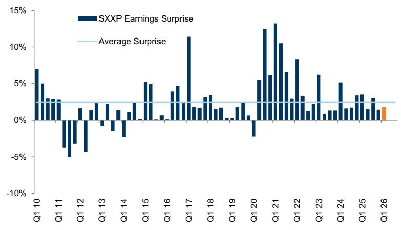

bar

| Quarter | SXXP Earnings Surprise |
| ------- | ---------------------- |
| Q1 10   | 7.0%                   |
| Q1 11   | 5.0%                   |
| Q1 12   | -5.0%                  |
| Q1 13   | 2.0%                   |
| Q1 14   | -2.0%                  |
| Q1 15   | 5.0%                   |
| Q1 16   | 4.0%                   |
| Q1 17   | 12.0%                  |
| Q1 18   | 3.0%                   |
| Q1 19   | 2.0%                   |
| Q1 20   | -3.0%                  |
| Q1 21   | 13.0%                  |
| Q1 22   | 8.0%                   |
| Q1 23   | 6.0%                   |
| Q1 24   | 5.0%                   |
| Q1 25   | 3.0%                   |
| Q1 26   | 2.0%                   |

Source: Bloomberg, FactSet, GS Global Investment Research

Exhibit 3: Guidance surprises are seeing small price reactions   
SXXP companies. Average price reaction on reporting day (vs. the market). FY1 guidance (vs. consensus one day before the guidance was issued).   
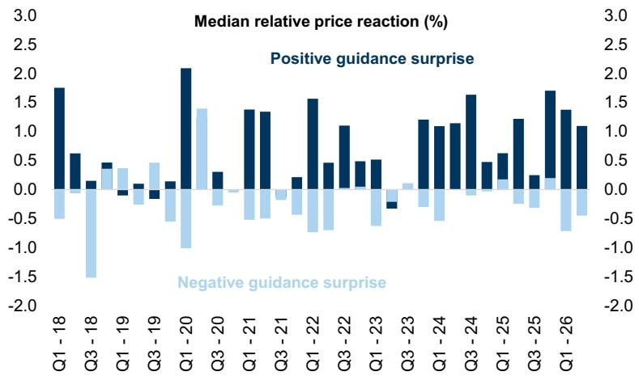

bar

| Quarter | Median relative price reaction (%) |
| ------- | ---------------------------------- |
| Q1 - 18 | 1.8                                |
| Q3 - 18 | 0.6                                |
| Q1 - 19 | 0.4                                |
| Q3 - 19 | 0.2                                |
| Q1 - 20 | 2.1                                |
| Q3 - 20 | 0.3                                |
| Q1 - 21 | 1.4                                |
| Q3 - 21 | 1.3                                |
| Q1 - 22 | 1.6                                |
| Q3 - 22 | 1.1                                |
| Q1 - 23 | 0.5                                |
| Q3 - 23 | -0.3                               |
| Q1 - 24 | 1.2                                |
| Q3 - 24 | 1.6                                |
| Q1 - 25 | 0.6                                |
| Q3 - 25 | 1.2                                |
| Q1 - 26 | 1.7                                |

Guidance issued across a selection of 19 relevant items.

Exhibit 2: Market reactions remain asymmetric   
Average price reaction on reporting day vs. the market - STOXX 600 companies   
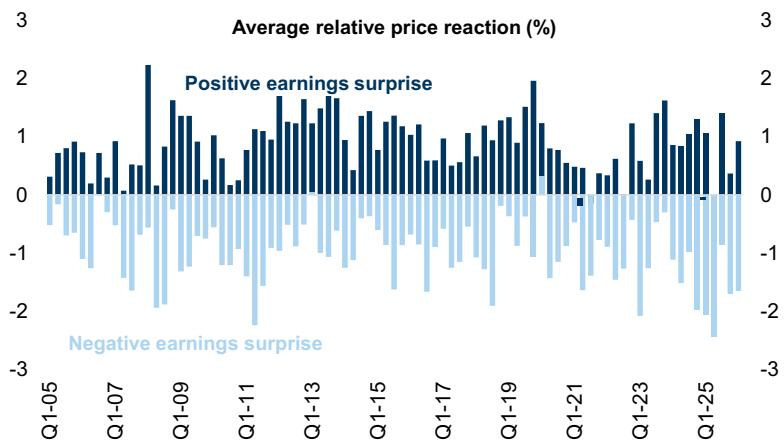

bar

| Quarter | Average relative price reaction (%) |
| ------- | ----------------------------------- |
| Q1-05   | 0.5                                 |
| Q1-06   | 0.7                                 |
| Q1-07   | 0.9                                 |
| Q1-08   | 1.2                                 |
| Q1-09   | 2.3                                 |
| Q1-10   | 1.5                                 |
| Q1-11   | 1.0                                 |
| Q1-12   | 1.8                                 |
| Q1-13   | 1.6                                 |
| Q1-14   | 1.4                                 |
| Q1-15   | 1.3                                 |
| Q1-16   | 1.2                                 |
| Q1-17   | 1.1                                 |
| Q1-18   | 1.0                                 |
| Q1-19   | 1.5                                 |
| Q1-20   | 2.0                                 |
| Q1-21   | 0.8                                 |
| Q1-22   | 0.6                                 |
| Q1-23   | 0.4                                 |
| Q1-24   | 0.3                                 |
| Q1-25   | 0.2                                 |

Source: FactSet, GS Global Investment Research

Exhibit 4: Energy and Basic Resources names continue to guide the aggregate upgrades   
2026 EPS revisions. STOXX 600 sectors.   
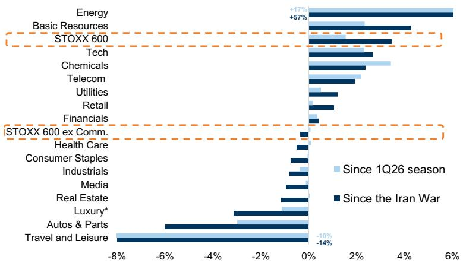

bar

| Sector | Since 1Q26 season (%) | Since the Iran War (%) |
| :--- | :--- | :--- |
| Energy | +17 | +57 |
| Basic Resources | 2.3 | 4.2 |
| STOXX 600 | 1.8 | 3.4 |
| Tech | 2.5 | 2.8 |
| Chemicals | 3.5 | 2.6 |
| Telecom | 2.0 | 1.9 |
| Utilities | 0.5 | 1.3 |
| Retail | -0.2 | 1.1 |
| Financials | -0.1 | 0.3 |
| STOXX 600 ex Comm. | -0.1 | -0.1 |
| Health Care | -0.1 | -0.3 |
| Consumer Staples | -0.1 | -0.4 |
| Industrials | -0.1 | -0.5 |
| Media | -0.1 | -0.6 |
| Real Estate | -0.1 | -0.7 |
| Luxury* | -0.1 | -3.2 |
| Autos & Parts | -3.2 | -5.8 |
| Travel and Leisure | -0.1 | -14 |

Source: FactSet, GS Global Investment Research

Exhibit 5: Earnings of capital-intensive and internationally exposed names are being upgraded   
1-month revisions 2026 Earnings - selection of European baskets   
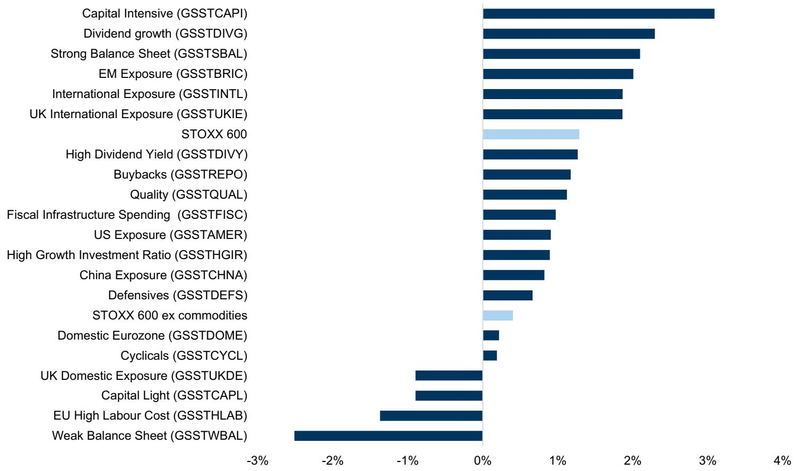

bar

| Category | Value (%) |
| :--- | :--- |
| Capital Intensive (GSSTCAPI) | 3.1 |
| Dividend growth (GSSTDIVG) | 2.3 |
| Strong Balance Sheet (GSSTSBAL) | 2.1 |
| EM Exposure (GSSTBRIC) | 2.0 |
| International Exposure (GSSTINTL) | 1.9 |
| UK International Exposure (GSSTUKIE) | 1.9 |
| STOXX 600 | 1.2 |
| High Dividend Yield (GSSTDIVY) | 1.2 |
| Buybacks (GSSTREPO) | 1.1 |
| Quality (GSSTQUAL) | 1.1 |
| Fiscal Infrastructure Spending (GSSTFISC) | 1.0 |
| US Exposure (GSSTAMER) | 0.9 |
| High Growth Investment Ratio (GSSTHGIR) | 0.9 |
| China Exposure (GSSTCHNA) | 0.8 |
| Defensives (GSSTDEFS) | 0.7 |
| STOXX 600 ex commodities | 0.4 |
| Domestic Eurozone (GSSTDOME) | 0.2 |
| Cyclicals (GSSTCYCL) | 0.2 |
| UK Domestic Exposure (GSSTUKDE) | -0.7 |
| Capital Light (GSSTCAPL) | -0.7 |
| EU High Labour Cost (GSSTHLAB) | -1.4 |
| Weak Balance Sheet (GSSTWBAL) | -2.5 |

Source: FactSet, GS Global Investment Research

# Earnings surprises — Equal-weighted

Exhibit 6: Earnings surprises

Equal-weighted

<table><tr><td rowspan="2">Sector</td><td colspan="3">Number of Companies</td><td colspan="3">Surprise &gt;5%</td><td colspan="2">Absolute Surprise</td><td rowspan="2">Average Surprise</td></tr><tr><td>Reported</td><td>Expected</td><td>%</td><td>Positive</td><td>In-Line</td><td>Negative</td><td>Positive</td><td>Negative</td></tr><tr><td>Chemicals</td><td>9</td><td>12</td><td>75.0</td><td>77.8</td><td>11.1</td><td>11.1</td><td>88.9</td><td>11.1</td><td>5.5</td></tr><tr><td>Consumer Products and Services</td><td>8</td><td>12</td><td>66.7</td><td>50.0</td><td>50.0</td><td>0.0</td><td>87.5</td><td>12.5</td><td>9.4</td></tr><tr><td>Financial Services</td><td>8</td><td>14</td><td>57.1</td><td>50.0</td><td>37.5</td><td>12.5</td><td>75.0</td><td>25.0</td><td>1.8</td></tr><tr><td>Insurance</td><td>11</td><td>15</td><td>73.3</td><td>45.5</td><td>27.3</td><td>27.3</td><td>54.5</td><td>45.5</td><td>3.4</td></tr><tr><td>Banks</td><td>41</td><td>50</td><td>82.0</td><td>36.6</td><td>58.5</td><td>4.9</td><td>80.5</td><td>19.5</td><td>5.5</td></tr><tr><td>Basic Resources</td><td>11</td><td>12</td><td>91.7</td><td>36.4</td><td>54.5</td><td>9.1</td><td>54.5</td><td>45.5</td><td>5.6</td></tr><tr><td>Energy</td><td>20</td><td>22</td><td>90.9</td><td>35.0</td><td>40.0</td><td>25.0</td><td>55.0</td><td>45.0</td><td>4.4</td></tr><tr><td>Technology</td><td>15</td><td>24</td><td>62.5</td><td>33.3</td><td>60.0</td><td>6.7</td><td>73.3</td><td>26.7</td><td>2.1</td></tr><tr><td>Retail</td><td>3</td><td>3</td><td>100.0</td><td>33.3</td><td>66.7</td><td>0.0</td><td>66.7</td><td>33.3</td><td>1.1</td></tr><tr><td>Automobiles and Parts</td><td>9</td><td>10</td><td>90.0</td><td>33.3</td><td>22.2</td><td>44.4</td><td>55.6</td><td>44.4</td><td>-2.9</td></tr><tr><td>Food Beverage and Tobacco</td><td>7</td><td>15</td><td>46.7</td><td>28.6</td><td>57.1</td><td>14.3</td><td>57.1</td><td>42.9</td><td>1.6</td></tr><tr><td>Personal Care Drug and Grocery Stores</td><td>8</td><td>10</td><td>80.0</td><td>25.0</td><td>62.5</td><td>12.5</td><td>62.5</td><td>37.5</td><td>2.6</td></tr><tr><td>Health Care</td><td>28</td><td>32</td><td>87.5</td><td>25.0</td><td>57.1</td><td>17.9</td><td>57.1</td><td>42.9</td><td>0.8</td></tr><tr><td>Real Estate</td><td>10</td><td>15</td><td>66.7</td><td>20.0</td><td>30.0</td><td>50.0</td><td>40.0</td><td>60.0</td><td>-5.7</td></tr><tr><td>Construction and Materials</td><td>12</td><td>16</td><td>75.0</td><td>16.7</td><td>50.0</td><td>33.3</td><td>33.3</td><td>66.7</td><td>-4.4</td></tr><tr><td>Travel and Leisure</td><td>7</td><td>9</td><td>77.8</td><td>14.3</td><td>71.4</td><td>14.3</td><td>85.7</td><td>14.3</td><td>4.1</td></tr><tr><td>Utilities</td><td>15</td><td>22</td><td>68.2</td><td>13.3</td><td>86.7</td><td>0.0</td><td>80.0</td><td>20.0</td><td>2.0</td></tr><tr><td>Industrial Goods and Services</td><td>46</td><td>61</td><td>75.4</td><td>10.9</td><td>69.6</td><td>19.6</td><td>52.2</td><td>47.8</td><td>-1.8</td></tr><tr><td>Telecommunications</td><td>16</td><td>19</td><td>84.2</td><td>6.3</td><td>93.8</td><td>0.0</td><td>68.8</td><td>31.3</td><td>1.3</td></tr><tr><td>Media</td><td>1</td><td>2</td><td>50.0</td><td>0.0</td><td>0.0</td><td>100.0</td><td>0.0</td><td>100.0</td><td>-6.6</td></tr><tr><td>SXXP</td><td>285</td><td>375</td><td>76.0</td><td>27.7</td><td>56.5</td><td>15.8</td><td>63.5</td><td>36.5</td><td>1.7</td></tr><tr><td>SXXP ex Financials</td><td>215</td><td>281</td><td>76.5</td><td>24.7</td><td>59.5</td><td>15.8</td><td>61.4</td><td>38.6</td><td>1.3</td></tr></table>

Source: Factset, Bloomberg, GS Global Investment Research

# Earnings surprises — Market cap-weighted

Exhibit 7: Earnings surprises

Market cap-weighted

<table><tr><td rowspan="2">Sector</td><td colspan="3">Weight of Companies</td><td colspan="3">Surprise &gt;5%</td><td colspan="2">Absolute Surprise</td><td rowspan="2">Average Surprise</td></tr><tr><td>Reported</td><td>Expected</td><td>%</td><td>Positive</td><td>In-Line</td><td>Negative</td><td>Positive</td><td>Negative</td></tr><tr><td>Chemicals</td><td>0.5</td><td>1.2</td><td>39.5</td><td>90.4</td><td>5.6</td><td>4.0</td><td>96.0</td><td>4.0</td><td>7.1</td></tr><tr><td>Banks</td><td>9.8</td><td>11.9</td><td>82.7</td><td>56.9</td><td>41.5</td><td>1.6</td><td>80.2</td><td>19.8</td><td>6.0</td></tr><tr><td>Technology</td><td>1.4</td><td>3.0</td><td>46.4</td><td>55.4</td><td>41.5</td><td>3.1</td><td>85.7</td><td>14.3</td><td>3.7</td></tr><tr><td>Consumer Products and Services</td><td>1.9</td><td>2.0</td><td>96.8</td><td>49.9</td><td>50.1</td><td>0.0</td><td>97.4</td><td>2.6</td><td>14.6</td></tr><tr><td>Retail</td><td>0.1</td><td>0.1</td><td>100.0</td><td>49.2</td><td>50.8</td><td>0.0</td><td>70.3</td><td>29.7</td><td>2.2</td></tr><tr><td>Financial Services</td><td>1.6</td><td>5.6</td><td>28.7</td><td>46.4</td><td>49.7</td><td>3.9</td><td>93.8</td><td>6.2</td><td>10.2</td></tr><tr><td>Insurance</td><td>1.1</td><td>1.6</td><td>70.8</td><td>43.0</td><td>41.5</td><td>15.6</td><td>53.5</td><td>46.5</td><td>7.2</td></tr><tr><td>Energy</td><td>5.9</td><td>6.0</td><td>96.8</td><td>39.6</td><td>54.6</td><td>5.8</td><td>88.2</td><td>11.8</td><td>6.9</td></tr><tr><td>Automobiles and Parts</td><td>1.2</td><td>1.3</td><td>95.9</td><td>36.7</td><td>18.8</td><td>44.5</td><td>55.5</td><td>44.5</td><td>-1.3</td></tr><tr><td>Real Estate</td><td>1.6</td><td>3.1</td><td>53.1</td><td>28.0</td><td>64.7</td><td>7.3</td><td>33.5</td><td>66.5</td><td>-1.9</td></tr><tr><td>Construction and Materials</td><td>1.9</td><td>2.6</td><td>73.0</td><td>24.6</td><td>40.2</td><td>35.2</td><td>35.2</td><td>64.8</td><td>-13.4</td></tr><tr><td>Health Care</td><td>7.7</td><td>8.5</td><td>90.6</td><td>16.2</td><td>63.7</td><td>20.2</td><td>49.6</td><td>50.4</td><td>-2.5</td></tr><tr><td>Utilities</td><td>2.6</td><td>3.6</td><td>73.8</td><td>10.2</td><td>89.8</td><td>0.0</td><td>68.1</td><td>31.9</td><td>1.3</td></tr><tr><td>Travel and Leisure</td><td>0.3</td><td>1.1</td><td>30.1</td><td>9.6</td><td>48.9</td><td>41.6</td><td>58.4</td><td>41.6</td><td>-3.3</td></tr><tr><td>Industrial Goods and Services</td><td>6.5</td><td>8.2</td><td>78.8</td><td>9.3</td><td>78.9</td><td>11.8</td><td>68.5</td><td>31.5</td><td>0.7</td></tr><tr><td>Personal Care Drug and Grocery Stores</td><td>1.0</td><td>1.0</td><td>94.4</td><td>8.5</td><td>53.7</td><td>37.8</td><td>34.4</td><td>65.6</td><td>-1.2</td></tr><tr><td>Telecommunications</td><td>1.8</td><td>2.0</td><td>93.9</td><td>8.2</td><td>91.8</td><td>0.0</td><td>48.2</td><td>51.8</td><td>0.7</td></tr><tr><td>Basic Resources</td><td>1.6</td><td>1.6</td><td>95.9</td><td>7.3</td><td>91.3</td><td>1.4</td><td>25.9</td><td>74.1</td><td>0.9</td></tr><tr><td>Food Beverage and Tobacco</td><td>0.9</td><td>3.5</td><td>26.8</td><td>6.0</td><td>40.6</td><td>53.4</td><td>38.6</td><td>61.4</td><td>-1.3</td></tr><tr><td>Media</td><td>0</td><td>0</td><td>86.9</td><td>0.0</td><td>0.0</td><td>100.0</td><td>0.0</td><td>100.0</td><td>-6.6</td></tr><tr><td>SXXP</td><td>50</td><td>68</td><td>73.0</td><td>30.7</td><td>57.8</td><td>11.5</td><td>66.1</td><td>33.9</td><td>2.3</td></tr><tr><td>SXXP ex Financials</td><td>36</td><td>46</td><td>77.3</td><td>22.4</td><td>62.9</td><td>14.6</td><td>62.8</td><td>37.2</td><td>1.0</td></tr></table>

Source: Factset, Bloomberg, GS Global Investment Research

# Sales surprises — Equal-weighted

Exhibit 8: Sales surprises

Equal-weighted

<table><tr><td colspan="11">SALESSTOXX EUROPE 600 - EQUAL WEIGHTED</td></tr><tr><td rowspan="2">Sector</td><td colspan="3">Number of Companies</td><td colspan="3">Surprise &gt;2%</td><td colspan="2">Absolute Surprise</td><td rowspan="2">Average Surprise</td><td>Sales Growth</td></tr><tr><td>Reported</td><td>Expected</td><td>%</td><td>Positive</td><td>In-Line</td><td>Negative</td><td>Positive</td><td>Negative</td><td>2026</td></tr><tr><td>Financial Services</td><td>9</td><td>14</td><td>64.3</td><td>55.6</td><td>22.2</td><td>22.2</td><td>66.7</td><td>33.3</td><td>1.9</td><td>NM</td></tr><tr><td>Energy</td><td>21</td><td>22</td><td>95.5</td><td>38.1</td><td>28.6</td><td>33.3</td><td>61.9</td><td>38.1</td><td>0.8</td><td>11.6</td></tr><tr><td>Retail</td><td>3</td><td>3</td><td>100.0</td><td>33.3</td><td>66.7</td><td>0.0</td><td>33.3</td><td>66.7</td><td>0.7</td><td>5.6</td></tr><tr><td>Consumer Products and Services</td><td>10</td><td>12</td><td>83.3</td><td>30.0</td><td>60.0</td><td>10.0</td><td>80.0</td><td>20.0</td><td>0.9</td><td>NM</td></tr><tr><td>Insurance</td><td>11</td><td>15</td><td>73.3</td><td>27.3</td><td>63.6</td><td>9.1</td><td>81.8</td><td>18.2</td><td>4.1</td><td>NM</td></tr><tr><td>Chemicals</td><td>11</td><td>12</td><td>91.7</td><td>27.3</td><td>72.7</td><td>0.0</td><td>54.5</td><td>45.5</td><td>1.2</td><td>3.2</td></tr><tr><td>Technology</td><td>17</td><td>24</td><td>70.8</td><td>23.5</td><td>70.6</td><td>5.9</td><td>88.2</td><td>11.8</td><td>0.9</td><td>11.7</td></tr><tr><td>Banks</td><td>48</td><td>50</td><td>96.0</td><td>22.9</td><td>75.0</td><td>2.1</td><td>75.0</td><td>25.0</td><td>1.0</td><td>NM</td></tr><tr><td>Personal Care Drug and Grocery Stores</td><td>9</td><td>10</td><td>90.0</td><td>22.2</td><td>77.8</td><td>0.0</td><td>66.7</td><td>33.3</td><td>0.9</td><td>3.7</td></tr><tr><td>Utilities</td><td>15</td><td>22</td><td>68.2</td><td>20.0</td><td>60.0</td><td>20.0</td><td>53.3</td><td>46.7</td><td>-0.3</td><td>4.7</td></tr><tr><td>Industrial Goods and Services</td><td>51</td><td>61</td><td>83.6</td><td>17.6</td><td>62.7</td><td>19.6</td><td>58.8</td><td>41.2</td><td>-0.4</td><td>6.1</td></tr><tr><td>Basic Resources</td><td>12</td><td>12</td><td>100.0</td><td>16.7</td><td>41.7</td><td>41.7</td><td>33.3</td><td>66.7</td><td>-1.8</td><td>8.9</td></tr><tr><td>Real Estate</td><td>9</td><td>15</td><td>60.0</td><td>11.1</td><td>66.7</td><td>22.2</td><td>33.3</td><td>66.7</td><td>-0.9</td><td>NM</td></tr><tr><td>Health Care</td><td>29</td><td>32</td><td>90.6</td><td>10.3</td><td>72.4</td><td>17.2</td><td>62.1</td><td>37.9</td><td>0.4</td><td>4.4</td></tr><tr><td>Food Beverage and Tobacco</td><td>10</td><td>15</td><td>66.7</td><td>10.0</td><td>80.0</td><td>10.0</td><td>70.0</td><td>30.0</td><td>0.5</td><td>2.7</td></tr><tr><td>Construction and Materials</td><td>14</td><td>16</td><td>87.5</td><td>7.1</td><td>71.4</td><td>21.4</td><td>21.4</td><td>78.6</td><td>-1.7</td><td>2.8</td></tr><tr><td>Telecommunications</td><td>17</td><td>19</td><td>89.5</td><td>5.9</td><td>82.4</td><td>11.8</td><td>47.1</td><td>52.9</td><td>-0.2</td><td>4.7</td></tr><tr><td>Travel and Leisure</td><td>7</td><td>9</td><td>77.8</td><td>0.0</td><td>100.0</td><td>0.0</td><td>71.4</td><td>28.6</td><td>0.1</td><td>3.7</td></tr><tr><td>Media</td><td>1</td><td>2</td><td>50.0</td><td>0.0</td><td>100.0</td><td>0.0</td><td>0.0</td><td>100.0</td><td>-1.4</td><td>1.2</td></tr><tr><td>Automobiles and Parts</td><td>9</td><td>10</td><td>90.0</td><td>0.0</td><td>66.7</td><td>33.3</td><td>44.4</td><td>55.6</td><td>-0.9</td><td>0.0</td></tr><tr><td>SXXP</td><td>313</td><td>375</td><td>83.5</td><td>19.5</td><td>65.5</td><td>15.0</td><td>60.7</td><td>39.3</td><td>0.3</td><td>5.4</td></tr><tr><td>SXXP ex Financials</td><td>236</td><td>281</td><td>84.0</td><td>17.4</td><td>65.3</td><td>17.4</td><td>57.6</td><td>42.4</td><td>0.0</td><td>5.4</td></tr></table>

Source: Factset, Bloomberg, GS Global Investment Research

# Sales surprises — Market cap-weighted

Exhibit 9: Sales surprises

Market cap-weighted

<table><tr><td colspan="11">SALESSTOXX EUROPE 600 - MARKET CAP WEIGHTED</td></tr><tr><td rowspan="2">Sector</td><td colspan="3">Weight of Companies</td><td colspan="3">Surprise &gt;2%</td><td colspan="2">Absolute Surprise</td><td rowspan="2">Average Surprise</td><td>Sales Growth</td></tr><tr><td>Reported</td><td>Expected</td><td>%</td><td>Positive</td><td>In-Line</td><td>Negative</td><td>Positive</td><td>Negative</td><td>2026</td></tr><tr><td>Financial Services</td><td>1.7</td><td>5.6</td><td>29.5</td><td>90.1</td><td>4.9</td><td>5.0</td><td>92.8</td><td>7.2</td><td>5.1</td><td>NM</td></tr><tr><td>Technology</td><td>2.7</td><td>3.0</td><td>91.6</td><td>57.2</td><td>41.3</td><td>1.6</td><td>96.8</td><td>3.2</td><td>1.8</td><td>11.4</td></tr><tr><td>Consumer Products and Services</td><td>1.9</td><td>2.0</td><td>97.6</td><td>49.7</td><td>48.8</td><td>1.5</td><td>98.5</td><td>1.5</td><td>1.4</td><td>3.8</td></tr><tr><td>Insurance</td><td>1.0</td><td>1.6</td><td>65.7</td><td>38.7</td><td>57.9</td><td>3.4</td><td>67.6</td><td>32.4</td><td>4.2</td><td>NM</td></tr><tr><td>Utilities</td><td>2.7</td><td>3.6</td><td>74.2</td><td>38.2</td><td>30.9</td><td>30.9</td><td>55.5</td><td>44.5</td><td>-0.4</td><td>1.9</td></tr><tr><td>Energy</td><td>6.0</td><td>6.0</td><td>98.9</td><td>31.8</td><td>23.4</td><td>44.8</td><td>52.8</td><td>47.2</td><td>-0.6</td><td>12.5</td></tr><tr><td>Retail</td><td>0.1</td><td>0.1</td><td>100.0</td><td>29.7</td><td>70.3</td><td>0.0</td><td>29.7</td><td>70.3</td><td>0.6</td><td>4.6</td></tr><tr><td>Real Estate</td><td>1.6</td><td>3.1</td><td>52.6</td><td>26.6</td><td>70.6</td><td>2.8</td><td>29.7</td><td>70.3</td><td>0.1</td><td>NM</td></tr><tr><td>Food Beverage and Tobacco</td><td>1.1</td><td>3.5</td><td>31.6</td><td>26.0</td><td>70.5</td><td>3.6</td><td>87.8</td><td>12.2</td><td>1.1</td><td>1.7</td></tr><tr><td>Banks</td><td>10.2</td><td>11.9</td><td>85.4</td><td>19.6</td><td>80.2</td><td>0.2</td><td>81.2</td><td>18.8</td><td>1.4</td><td>NM</td></tr><tr><td>Construction and Materials</td><td>2.5</td><td>2.6</td><td>97.9</td><td>17.7</td><td>77.6</td><td>4.7</td><td>31.8</td><td>68.2</td><td>-0.4</td><td>3.7</td></tr><tr><td>Industrial Goods and Services</td><td>7.6</td><td>8.2</td><td>92.3</td><td>10.4</td><td>80.2</td><td>9.3</td><td>59.5</td><td>40.5</td><td>0.0</td><td>5.7</td></tr><tr><td>Health Care</td><td>7.5</td><td>8.5</td><td>88.6</td><td>10.1</td><td>74.9</td><td>15.0</td><td>53.9</td><td>46.1</td><td>-0.4</td><td>3.5</td></tr><tr><td>Personal Care Drug and Grocery Stores</td><td>1.0</td><td>1.0</td><td>97.2</td><td>8.2</td><td>91.8</td><td>0.0</td><td>46.8</td><td>53.2</td><td>0.1</td><td>2.7</td></tr><tr><td>Chemicals</td><td>1.2</td><td>1.2</td><td>100.0</td><td>7.6</td><td>92.4</td><td>0.0</td><td>43.7</td><td>56.3</td><td>0.7</td><td>3.8</td></tr><tr><td>Basic Resources</td><td>1.6</td><td>1.6</td><td>100.0</td><td>2.0</td><td>27.2</td><td>70.8</td><td>18.3</td><td>81.7</td><td>-3.2</td><td>9.1</td></tr><tr><td>Telecommunications</td><td>1.9</td><td>2.0</td><td>96.7</td><td>1.6</td><td>81.1</td><td>17.3</td><td>50.9</td><td>49.1</td><td>-0.6</td><td>3.1</td></tr><tr><td>Travel and Leisure</td><td>0.3</td><td>1.1</td><td>30.1</td><td>0.0</td><td>100.0</td><td>0.0</td><td>50.4</td><td>49.6</td><td>-0.3</td><td>3.8</td></tr><tr><td>Media</td><td>0.2</td><td>0.3</td><td>86.9</td><td>0.0</td><td>100.0</td><td>0.0</td><td>0.0</td><td>100.0</td><td>-1.4</td><td>1.6</td></tr><tr><td>Automobiles and Parts</td><td>1.2</td><td>1.3</td><td>95.9</td><td>0.0</td><td>50.3</td><td>49.7</td><td>36.2</td><td>63.8</td><td>-1.4</td><td>1.0</td></tr><tr><td>SXXP</td><td>54.1</td><td>68.1</td><td>79.4</td><td>22.7</td><td>62.8</td><td>14.5</td><td>61.7</td><td>38.3</td><td>0.4</td><td>5.0</td></tr><tr><td>SXXP ex Financials</td><td>39.6</td><td>45.9</td><td>86.3</td><td>20.1</td><td>60.5</td><td>19.3</td><td>56.5</td><td>43.5</td><td>-0.2</td><td>5.0</td></tr></table>

Source: Factset, Bloomberg, GS Global Investment Research

# Snapshot of Global Performance Across Assets - Total Returns (€)

Exhibit 10: Cross-asset performance   
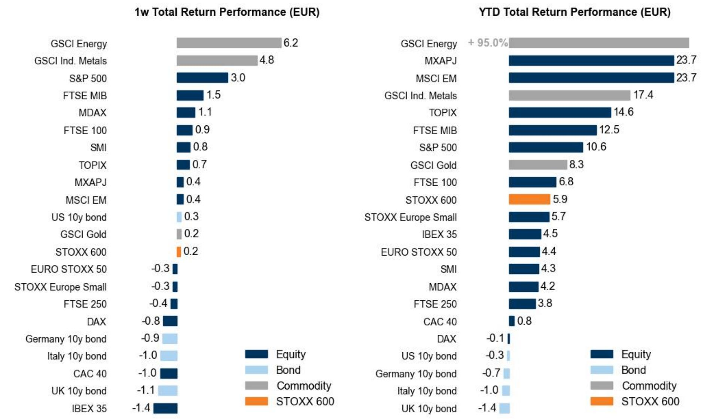  
Source: Bloomberg, Datastream, STOXX, GS Global Investment Research

# Global Strategy Views: Indices and Asset Classes

Exhibit 11: GS forecasts across assets 

<table><tr><td rowspan="2">14 May 2026</td><td rowspan="2">Current</td><td colspan="3">Forecast</td><td rowspan="2">Up/Downside to 12m TP (%)</td></tr><tr><td>3m</td><td>6m</td><td>12m</td></tr><tr><td colspan="6">Equities</td></tr><tr><td>STOXX Europe 600 (€)</td><td>616</td><td>605</td><td>615</td><td>625</td><td>1.5</td></tr><tr><td>Eurostoxx 50 (€)</td><td>5935</td><td>5800</td><td>5900</td><td>6000</td><td>1.1</td></tr><tr><td>FTSE 100 (£)</td><td>10373</td><td>10500</td><td>10600</td><td>10800</td><td>4.1</td></tr><tr><td>S&amp;P 500 ($)</td><td>7501</td><td>7200</td><td>7400</td><td>7600</td><td>1.3</td></tr><tr><td>MSCI Asia-Pacific Ex-Japan ($)</td><td>883</td><td>900</td><td>940</td><td>990</td><td>12.1</td></tr><tr><td>Topix (¥)</td><td>3879</td><td>3800</td><td>4000</td><td>4200</td><td>8.3</td></tr><tr><td colspan="6">10Y Rate (%)</td></tr><tr><td>US</td><td>4.5</td><td>4.3</td><td>4.2</td><td>4.1</td><td>-37 bp</td></tr><tr><td>Euro Area (Germany)</td><td>3.0</td><td>2.9</td><td>3.0</td><td>3.0</td><td>-2 bp</td></tr><tr><td>UK</td><td>5.0</td><td>4.6</td><td>4.5</td><td>4.4</td><td>-65 bp</td></tr><tr><td>Japan</td><td>2.6</td><td>2.5</td><td>2.5</td><td>2.4</td><td>-18 bp</td></tr><tr><td colspan="6">Currencies</td></tr><tr><td>€/$</td><td>1.17</td><td>1.14</td><td>1.18</td><td>1.20</td><td>2.8</td></tr><tr><td>£/$</td><td>1.35</td><td>1.33</td><td>1.34</td><td>1.33</td><td>-1.1</td></tr><tr><td>$/¥</td><td>158</td><td>160</td><td>158</td><td>155</td><td>-2.0</td></tr><tr><td colspan="6">Commodities</td></tr><tr><td>Brent Crude Oil ($/bbl)</td><td>105.7</td><td>94.0</td><td>91.0</td><td>86.0</td><td>-18.7</td></tr><tr><td>NYMEX Nat. Gas ($/mmBtu)</td><td>2.9</td><td>3.5</td><td>3.5</td><td>3.5</td><td>22.2</td></tr><tr><td>Gold ($/troy oz)</td><td>4685</td><td>4805</td><td>4990</td><td>5445</td><td>16.2</td></tr><tr><td>LME Copper ($/mt)</td><td>13895</td><td>12635</td><td>12535</td><td>12265</td><td>-11.7</td></tr></table>

Source: Bloomberg, Datastream, STOXX, GS Global Investment Research

Exhibit 12: Valuation metrics across regions 

<table><tr><td>14 May 2026</td><td>P/E12m fwd (X)</td><td>EV / EBITDALast 12m (X)</td><td>FCF YieldLast 12m (%)</td><td>Div Yield12m fwd (%)</td><td>P/BLast 12m (X)</td><td>ROELast 12m (%)</td></tr><tr><td>STOXX Europe 600</td><td>14.4</td><td>9.5</td><td>4.5</td><td>3.3</td><td>2.3</td><td>13.7</td></tr><tr><td>EuroStoxx 50</td><td>14.8</td><td>10.7</td><td>4.1</td><td>3.2</td><td>2.3</td><td>14.3</td></tr><tr><td>FTSE 100</td><td>12.4</td><td>8.2</td><td>5.6</td><td>3.5</td><td>2.2</td><td>15.7</td></tr><tr><td>S&amp;P 500</td><td>21.4</td><td>16.6</td><td>3.1</td><td>1.4</td><td>5.2</td><td>21.6</td></tr><tr><td>MSCI Asia Pacific ex-Japan</td><td>13.1</td><td>12.1</td><td>3.6</td><td>2.3</td><td>2.4</td><td>13.8</td></tr><tr><td>Topix</td><td>16.9</td><td>12.5</td><td>3.9</td><td>2.2</td><td>1.8</td><td>9.3</td></tr></table>

Source: FactSet, I/B/E/S, STOXX, GS Global Investment Research

# Earnings Expectations and Revisions

Exhibit 13: Expected earnings growth and revisions by sector (%)   
Local currency 

<table><tr><td></td><td colspan="3">EPS Growth</td><td colspan="2">EPS Revisions (1-month)</td><td colspan="2">EPS Revisions (YTD)</td></tr><tr><td>Sector</td><td>2026E</td><td>2027E</td><td>CAGR 26/27</td><td>2026E</td><td>2027E</td><td>2026E</td><td>2027E</td></tr><tr><td>Autos and Parts</td><td>50.8</td><td>25.3</td><td>37.4</td><td>NM</td><td>(2.4)</td><td>NM</td><td>(12.7)</td></tr><tr><td>Basic Resources</td><td>47.9</td><td>10.4</td><td>27.8</td><td>1.9</td><td>1.6</td><td>15.9</td><td>14.3</td></tr><tr><td>Energy</td><td>65.9</td><td>(8.6)</td><td>23.2</td><td>9.4</td><td>3.7</td><td>52.2</td><td>21.3</td></tr><tr><td>Technology</td><td>20.1</td><td>22.2</td><td>21.1</td><td>2.8</td><td>3.2</td><td>7.8</td><td>10.7</td></tr><tr><td>Industrials</td><td>14.8</td><td>15.8</td><td>15.3</td><td>(0.6)</td><td>0.1</td><td>(1.9)</td><td>(0.8)</td></tr><tr><td>Consumer Prods and Srvs</td><td>12.8</td><td>15.8</td><td>14.3</td><td>(0.3)</td><td>(0.8)</td><td>(5.4)</td><td>(5.0)</td></tr><tr><td>Construction and Mat.</td><td>14.3</td><td>13.2</td><td>13.8</td><td>(0.4)</td><td>(0.3)</td><td>(3.4)</td><td>(1.3)</td></tr><tr><td>STOXX 600 ex Fin. &amp; RE</td><td>17.9</td><td>9.6</td><td>13.7</td><td>1.7</td><td>0.6</td><td>4.3</td><td>1.6</td></tr><tr><td>Chemicals</td><td>19.1</td><td>6.8</td><td>12.8</td><td>4.7</td><td>1.7</td><td>2.5</td><td>(2.6)</td></tr><tr><td>STOXX 600</td><td>14.2</td><td>9.9</td><td>12.0</td><td>1.4</td><td>0.8</td><td>3.9</td><td>2.0</td></tr><tr><td>Banks</td><td>9.6</td><td>13.2</td><td>11.4</td><td>1.2</td><td>1.6</td><td>3.6</td><td>5.2</td></tr><tr><td>STOXX 600 ex Commod.</td><td>9.3</td><td>12.1</td><td>10.7</td><td>0.5</td><td>0.5</td><td>(0.1)</td><td>0.3</td></tr><tr><td>Telecoms</td><td>9.0</td><td>11.0</td><td>10.0</td><td>1.6</td><td>(1.2)</td><td>(1.4)</td><td>(1.6)</td></tr><tr><td>Retailers</td><td>9.5</td><td>10.0</td><td>9.8</td><td>0.1</td><td>(0.1)</td><td>0.7</td><td>0.7</td></tr><tr><td>Utilities</td><td>8.4</td><td>8.1</td><td>8.3</td><td>0.2</td><td>0.3</td><td>1.2</td><td>1.8</td></tr><tr><td>Travel and Leisure</td><td>(1.4)</td><td>18.5</td><td>8.1</td><td>(6.9)</td><td>(2.8)</td><td>(12.7)</td><td>(7.5)</td></tr><tr><td>Insurance</td><td>6.7</td><td>7.8</td><td>7.3</td><td>0.5</td><td>0.0</td><td>0.7</td><td>0.8</td></tr><tr><td>Health Care</td><td>4.1</td><td>10.0</td><td>7.0</td><td>0.6</td><td>(0.0)</td><td>(2.4)</td><td>(2.4)</td></tr><tr><td>Pers Care, D&amp;G Stores</td><td>4.1</td><td>7.6</td><td>5.9</td><td>(0.7)</td><td>(0.6)</td><td>(4.0)</td><td>(4.2)</td></tr><tr><td>Food, Bev. and Tobacco</td><td>2.7</td><td>8.1</td><td>5.4</td><td>0.3</td><td>0.4</td><td>(1.3)</td><td>(1.6)</td></tr><tr><td>Media</td><td>0.8</td><td>9.0</td><td>4.8</td><td>(0.4)</td><td>0.3</td><td>(3.4)</td><td>(3.0)</td></tr><tr><td>Financial Services</td><td>3.0</td><td>4.4</td><td>3.7</td><td>1.1</td><td>0.6</td><td>6.5</td><td>(3.7)</td></tr><tr><td>Real Estate</td><td>0.4</td><td>4.4</td><td>2.4</td><td>(2.3)</td><td>(1.4)</td><td>(2.8)</td><td>(2.5)</td></tr><tr><td colspan="8">GS Top-down</td></tr><tr><td>STOXX 600</td><td>10</td><td>5</td><td>7</td><td>-</td><td>-</td><td>-</td><td>-</td></tr></table>

Source: FactSet, STOXX, GS Global Investment Research

Exhibit 14: STOXX Europe 600 EPS revisions & earnings sentiment   
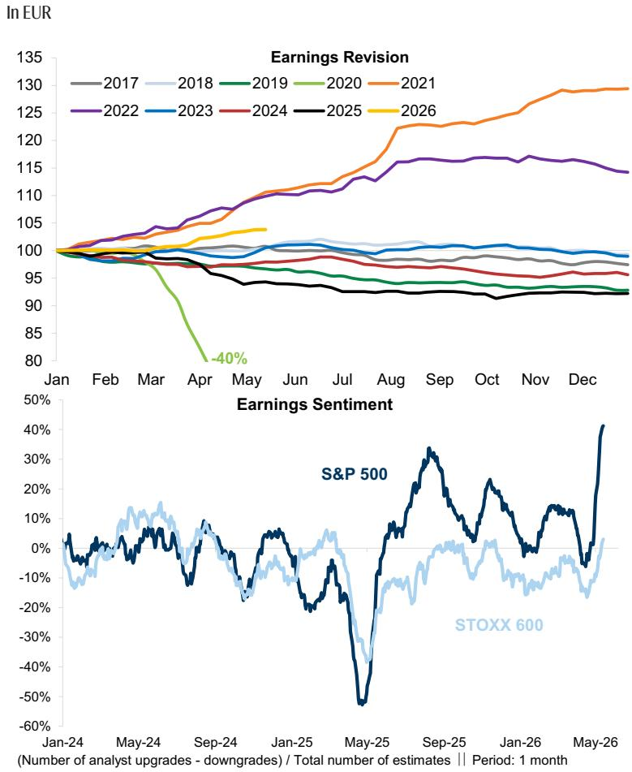

line

| Year | Earnings Revision (EUR) | Earnings Sentiment (%) |
|------|--------------------------|------------------------|
| 2017 | ~100                     | ~0%                    |
| 2018 | ~100                     | ~-10%                  |
| 2019 | ~100                     | ~10%                   |
| 2020 | ~100                     | -40%                   |
| 2021 | ~130                     | ~30%                   |
| 2022 | ~115                     | ~-50%                  |
| 2023 | ~110                     | ~-10%                  |
| 2024 | ~110                     | ~-5%                   |
| 2025 | ~115                     | ~-10%                  |
| 2026 | ~130                     | ~40%                   |

Source: FactSet, STOXX, GS Global Investment Research

# STOXX Europe 600 Supersectors

# Exhibit 15: Our recommendations

STOXX Europe 600; sub-sectors in light blue

Sector and Supersector Recommendations 

<table><tr><td>Overweight</td><td>Neutral</td><td>Underweight</td></tr><tr><td>Banks (SX7P)</td><td>Healthcare (SXDP)</td><td>Autos and Parts (SXAP)</td></tr><tr><td>Construction &amp; Materials (SXOP)</td><td>Basic Resources (SXPP)</td><td>Chemicals (SX4P)</td></tr><tr><td>Food, Bev. &amp; Tob (S600FOP)</td><td>Energy (S600ENP)</td><td>Consum. P&amp;S (S600CPP)</td></tr><tr><td>Pers. Care &amp; Grocery (S600PDP)</td><td>Financial Svs (SXFP)</td><td>Media (SXMP)</td></tr><tr><td>Retailers (SXRP)</td><td>Industrial G&amp;S (SXNP)</td><td>Insurance P&amp;C (GSSBPCIN)</td></tr><tr><td>Technology (SX8P)</td><td>Insurance (SXIP)</td><td>Steel (GSSBSTEL)</td></tr><tr><td>Telecoms (SXKP)</td><td>Real Estate (SX86P)</td><td></td></tr><tr><td>Aerospace (GSSBCIVA)</td><td>Travel and Leisure (SXTP)</td><td></td></tr><tr><td>Defense (GSSBDEFE)</td><td>Utilities (SX6P)</td><td></td></tr><tr><td>Renewables (GSSBRNEW)</td><td></td><td></td></tr></table>

# Trade Recommendations

Capital Intensive (GSSTCAPI) vs. Capital Light (GSSTCAPL)

Fiscal Infrastructure (GSSTFISC)

High Labour Cost (GSSTHLAB) vs. SXXE ex Financials

Source: GS Global Investment Research

# Exhibit 17: 3-month sector performance

Total Return (€)

3m Total Return Performance   
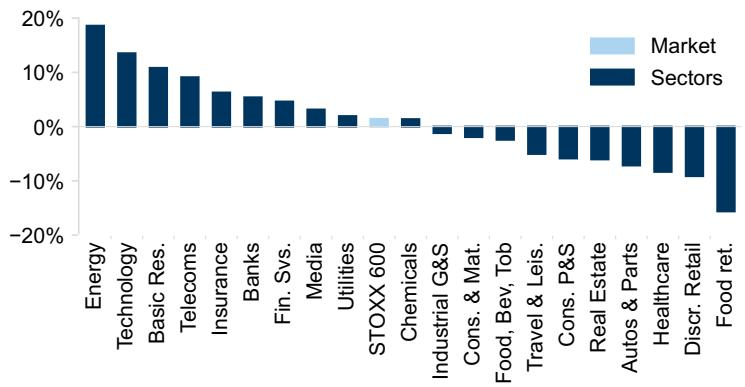

bar

| Sector | Value (%) |
| :--- | :--- |
| Energy | 19 |
| Technology | 14 |
| Basic Res. | 11 |
| Telecoms | 9 |
| Insurance | 6 |
| Banks | 5 |
| Fin. Sys. | 4 |
| Media | 3 |
| Utilities | 2 |
| STOXX 600 | 1.5 |
| Chemicals | 1.5 |
| Industrial G&S | -1 |
| Cons. & Mat. | -2 |
| Food, Bev, Tob | -3 |
| Travel & Leis. | -5 |
| Cons. P&S | -5 |
| Real Estate | -6 |
| Autos & Parts | -7 |
| Healthcare | -8 |
| Discr. Retail | -9 |
| Food ret. | -17 |

Source: Datastream, STOXX, GS Global Investment Research

# Exhibit 16: 1-week sector performance

Total Return (€)

1w Total Return Performance   
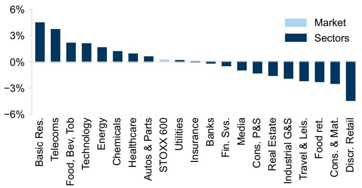

bar

| Sector | Value (%) |
| :--- | :--- |
| Basic Res. | 5.0 |
| Telecoms | 3.5 |
| Food, Bev, Tob | 2.5 |
| Technology | 2.5 |
| Energy | 2.0 |
| Chemicals | 1.5 |
| Healthcare | 1.0 |
| Autos & Parts | 0.5 |
| STOXX 600 | 0.2 |
| Utilities | 0.1 |
| Insurance | -0.1 |
| Banks | -0.2 |
| Fin. Svs. | -0.5 |
| Media | -1.0 |
| Cons. P&S | -1.5 |
| Real Estate | -2.0 |
| Industrial G&S | -2.5 |
| Travel & Leis. | -3.0 |
| Food ret. | -3.0 |
| Cons. & Mat. | -3.0 |
| Discr. Retail | -4.5 |

Source: Datastream, STOXX, GS Global Investment Research

# Exhibit 18: YTD sector performance

Total Return (€)

YTD Total Return Performance   
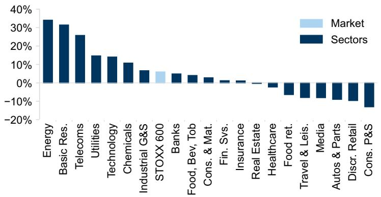

bar

| Sector | Value (%) |
| :--- | :--- |
| Energy | 35 |
| Basic Res. | 32 |
| Telecoms | 26 |
| Utilities | 15 |
| Technology | 14 |
| Chemicals | 11 |
| Industrial G&S | 7 |
| STOXX 600 | 6 |
| Banks | 5 |
| Food, Bev, Tob | 4 |
| Cons. & Mat. | 3 |
| Fin. Svs. | 1 |
| Insurance | 1 |
| Real Estate | -1 |
| Healthcare | -2 |
| Food ret. | -5 |
| Travel & Leis. | -6 |
| Media | -7 |
| Autos & Parts | -8 |
| Discr. Retail | -9 |
| Cons. P&S | -15 |

Source: Datastream, STOXX, GS Global Investment Research

# Style Performance

Exhibit 19: Cyclicals vs. Defensives   
Cyclicals = Equal Weighted: Industrials, Financials and Cons Discretionary. Defensives = Equal Weighted: Utilities, Health Care, Com Services, Cons Staples   
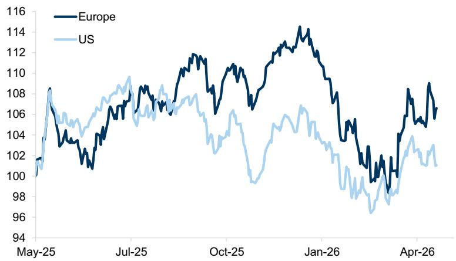

line

| Date   | Europe | US   |
|--------|--------|------|
| May-25 | 108.5  | 107.2|
| Jul-25 | 109.8  | 108.9|
| Oct-25 | 110.5  | 107.8|
| Jan-26 | 114.2  | 106.5|
| Apr-26 | 109.3  | 103.7|

Source: FactSet, GS Global Investment Research

Exhibit 20: Value vs. Growth price performance   
MSCI indices   
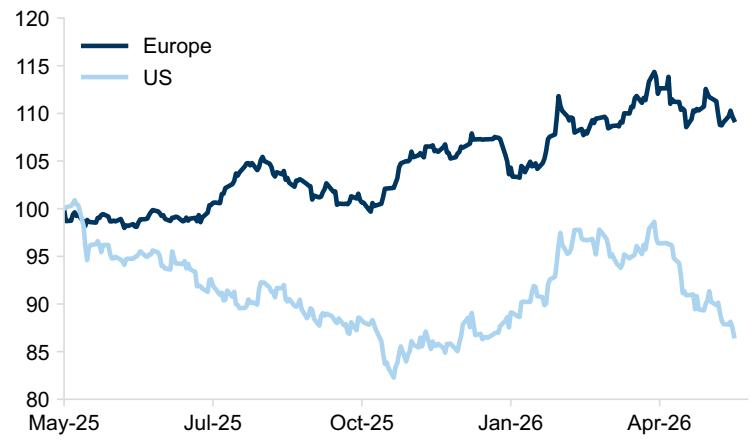

line

| Date   | Europe | US   |
|--------|--------|------|
| May-25 | 99     | 100  |
| Jul-25 | 105    | 95   |
| Oct-25 | 100    | 85   |
| Jan-26 | 108    | 90   |
| Apr-26 | 115    | 98   |

Source: Bloomberg, STOXX, GS Global Investment Research

Exhibit 21: Small-cap vs. Large-cap price performance   
US: Russell 2000 vs. SPX; Europe: STOXX Small vs. STOXX Europe Large   
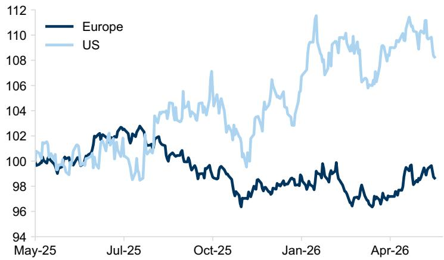

line

| Date   | Europe | US    |
|--------|--------|-------|
| May-25 | 100.0  | 101.0 |
| Jul-25 | 102.0  | 103.0 |
| Oct-25 | 98.0   | 107.0 |
| Jan-26 | 97.0   | 111.0 |
| Apr-26 | 99.0   | 108.0 |

Source: Bloomberg, STOXX, GS Global Investment Research

Exhibit 22: Momentum vs. Market   
MSCI indices   
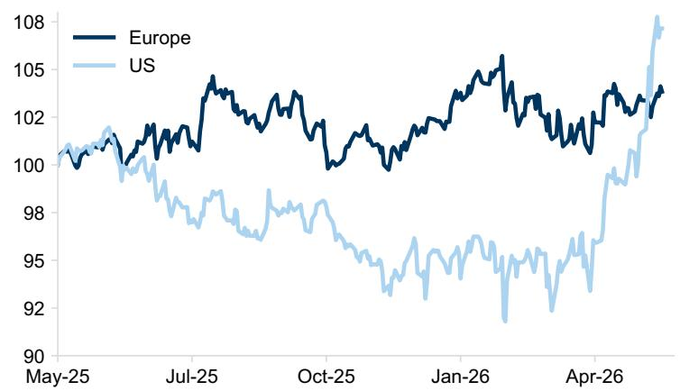

line

| Date   | Europe | US   |
|--------|--------|------|
| May-25 | 100.5  | 100.8|
| Jul-25 | 104.2  | 97.5 |
| Oct-25 | 100.8  | 93.2 |
| Jan-26 | 105.7  | 91.8 |
| Apr-26 | 103.9  | 108.1|

Source: Bloomberg, STOXX, GS Global Investment Research

# Thematic Baskets – Price performance

Exhibit 23: Thematic basket relative performance   
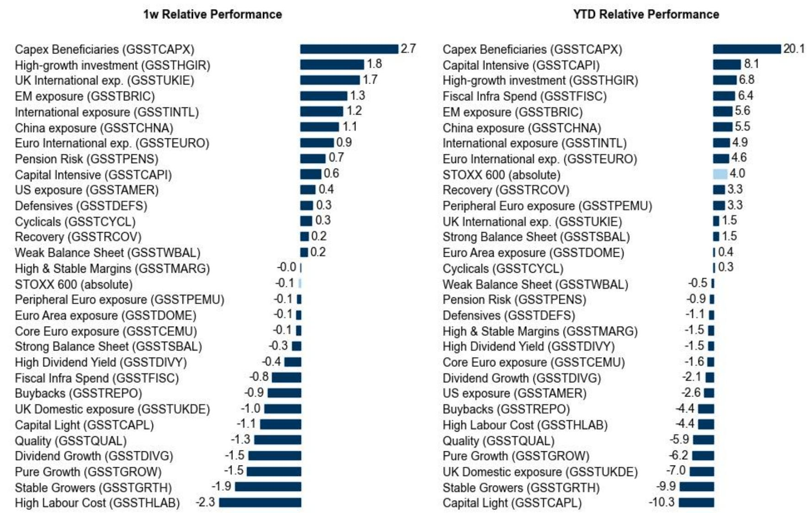  
Source: Bloomberg, STOXX, GS Global Investment Research

# Sub-Sector Performance

Exhibit 24: 1-week sub-sector price performance   
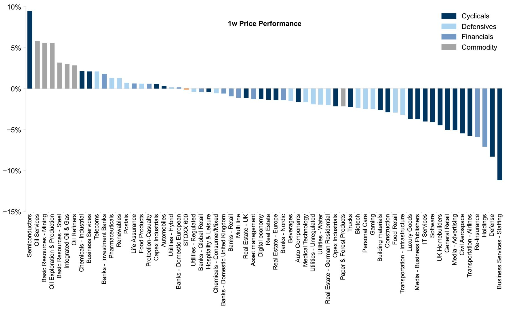

bar

| Category | Value |
| --- | --- |
| Semiconductors | 9.5% |
| Oil Services | 5.8% |
| Basic Resources - Mining | 5.6% |
| Oil Exploration & Production | 5.5% |
| Basic Resources - Steel | 3.2% |
| Integrated Oil & Gas | 3.0% |
| Oil Refiners | 2.8% |
| Chemicals - Industrial | 2.2% |
| Business Services | 2.1% |
| Telecoms | 2.0% |
| Banks - Investment Banks | 1.8% |
| Pharmaceuticals | 1.5% |
| Renewables | 1.4% |
| Postals | 0.8% |
| Life Assurance | 0.7% |
| Food Products | 0.6% |
| Protection-Casualty | 0.5% |
| Capex Industrials | 0.4% |
| Automobiles | 0.3% |
| Utilities - Hybrid | 0.2% |
| Banks - Domestic European | 0.1% |
| STOXX 600 | 0.0% |
| Utilities - Regulated | -0.1% |
| Banks - Global Retail | -0.2% |
| Hospitality & Leisure | -0.3% |
| Chemicals - Consumer/Mixed | -0.4% |
| Banks - Domestic United Kingdom | -0.5% |
| Banks - Retail | -0.6% |
| Multi line | -0.7% |
| Real Estate - UK | -0.8% |
| Asset management | -0.9% |
| Digital economy | -1.0% |
| Real Estate | -1.1% |
| Real Estate - Europe | -1.2% |
| Banks - Nordic | -1.3% |
| Beverages | -1.4% |
| Auto Components | -1.5% |
| Medical Technology | -1.6% |
| Utilities - Unregulated | -1.7% |
| Utilities - Water | -1.8% |
| Real Estate - German Residential | -1.9% |
| Opex Industrials | -2.0% |
| Paper & Forest Products | -2.1% |
| Trucks | -2.2% |
| Biotech | -2.3% |
| Personal Care | -2.4% |
| Gaming | -2.5% |
| Building materials | -2.6% |
| Construction | -2.7% |
| Food Retail | -2.8% |
| Transportation - Infrastructure | -2.9% |
| Luxury Goods | -3.0% |
| Media - Business Publishers | -3.1% |
| IT Services | -3.2% |
| Software | -3.3% |
| UK Homebuilders | -3.4% |
| General Retail | -3.5% |
| Media - Advertising | -3.6% |
| Civil Aerospace | -3.7% |
| Transportation - Airlines | -3.8% |
| Re-Insurance | -3.9% |
| Holdings | -4.0% |
| Defense | -4.1% |
| Business Services - Staffing | -12.0% |

Source: Bloomberg, GS Global Investment Research

Exhibit 25: YTD Sub-sector price performance   
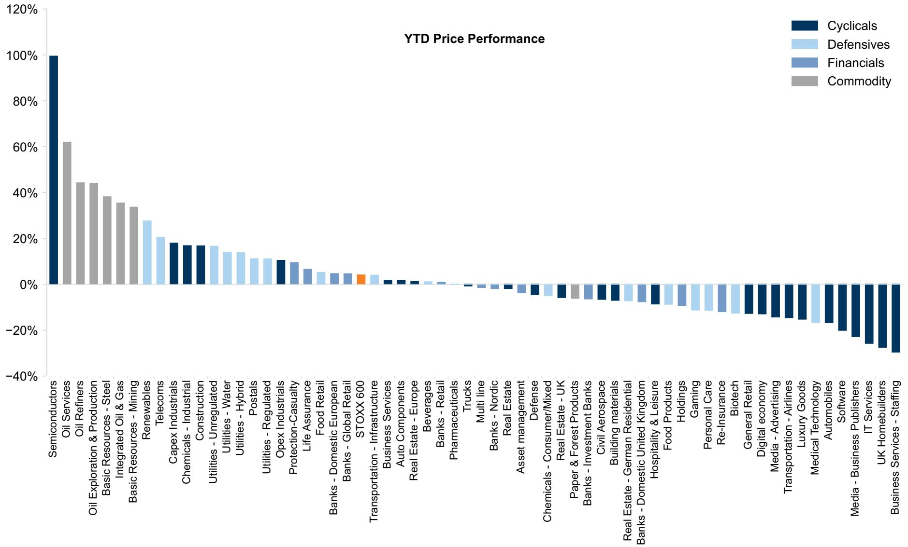

bar

YTD Price Performance
| Sector | Performance (%) |
| :--- | :--- |
| Semiconductors | 100 |
| Oil Services | 62 |
| Oil Refiners | 45 |
| Oil Exploration & Production | 44 |
| Basic Resources - Steel | 39 |
| Integrated Oil & Gas | 36 |
| Basic Resources - Mining | 34 |
| Renewables | 28 |
| Telecoms | 21 |
| Capex Industrials | 18 |
| Chemicals - Industrial | 17 |
| Construction | 17 |
| Utilities - Unregulated | 17 |
| Utilities - Water | 14 |
| Utilities - Hybrid | 14 |
| Postals | 11 |
| Utilities - Regulated | 11 |
| Opex Industrials | 10 |
| Protection-Casualty | 8 |
| Life Assurance | 6 |
| Food Retail | 5 |
| Banks - Domestic European | 4 |
| Banks - Global Retail | 4 |
| STOXX 600 | 3 |
| Transportation - Infrastructure | 3 |
| Business Services | 2 |
| Auto Components | 1.5 |
| Real Estate - Europe | 1.5 |
| Beverages | 1.5 |
| Banks - Retail | 1.5 |
| Pharmaceuticals | 0.5 |
| Trucks | 0.5 |
| Multi line | 0.5 |
| Banks - Nordic | 0.5 |
| Real Estate | 0.5 |
| Asset management | 0.5 |
| Defense | -1.5 |
| Chemicals - Consumer/Mixed | -1.5 |
| Real Estate - UK | -1.5 |
| Paper & Forest Products | -1.5 |
| Banks - Investment Banks | -1.5 |
| Civil Aerospace | -1.5 |
| Building materials | -1.5 |
| Real Estate - German Residential | -1.5 |
| Banks - Domestic United Kingdom | -1.5 |
| Hospitality & Leisure | -1.5 |
| Food Products | -1.5 |
| Holdings | -1.5 |
| Gaming | -1.5 |
| Personal Care | -1.5 |
| Re-Insurance | -1.5 |
| Biotech | -1.5 |
| General Retail | -1.5 |
| Digital economy | -1.5 |
| Media - Advertising | -1.5 |
| Transportation - Airlines | -1.5 |
| Luxury Goods | -1.5 |
| Medical Technology | -1.5 |
| Automobiles | -1.5 |
| Software | -2.0 |
| Media - Business Publishers | -2.5 |
| IT Services | -2.5 |
| UK Homebuilders | -2.5 |
| Business Services - Staffing | -3.0 |

Source: Bloomberg, GS Global Investment Research

# Thematic Baskets

Exhibit 26: International Exposure Baskets   
Relative performance vs. SXXP (EUR)   
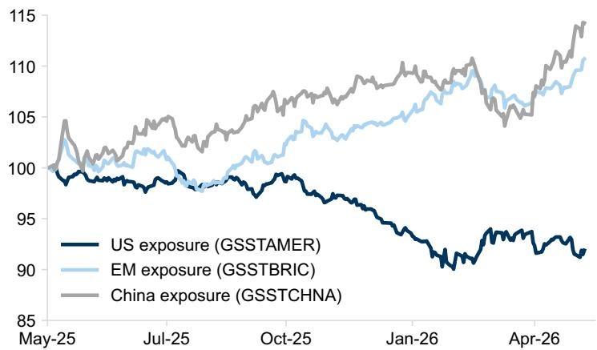

line

| Date   | US exposure (GSSTAMER) | EM exposure (GSSTBRIC) | China exposure (GSSTCHNA) |
|--------|------------------------|------------------------|--------------------------|
| May-25 | ~99                    | ~100                   | ~100                     |
| Jul-25 | ~98                    | ~101                   | ~103                     |
| Oct-25 | ~97                    | ~103                   | ~107                     |
| Jan-26 | ~92                    | ~106                   | ~110                     |
| Apr-26 | ~91                    | ~108                   | ~114                     |

Source: Bloomberg, STOXX, GS Global Investment Research

Exhibit 27: Domestic Exposure Baskets   
Relative performance vs. SXXP (EUR)   
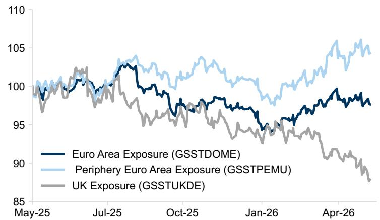

line

| Date   | Euro Area Exposure (GSSTDOME) | Periphery Euro Area Exposure (GSSTPEMU) | UK Exposure (GSSTUKDE) |
|--------|-------------------------------|----------------------------------------|------------------------|
| May-25 | ~100                          | ~100                                   | ~100                   |
| Jul-25 | ~103                          | ~104                                   | ~102                   |
| Oct-25 | ~98                           | ~103                                   | ~97                    |
| Jan-26 | ~95                           | ~101                                   | ~93                    |
| Apr-26 | ~98                           | ~106                                   | ~88                    |

Source: Bloomberg, STOXX, GS Global Investment Research

Exhibit 28: Shareholder Return Baskets   
Relative performance vs. SXXP (EUR)   
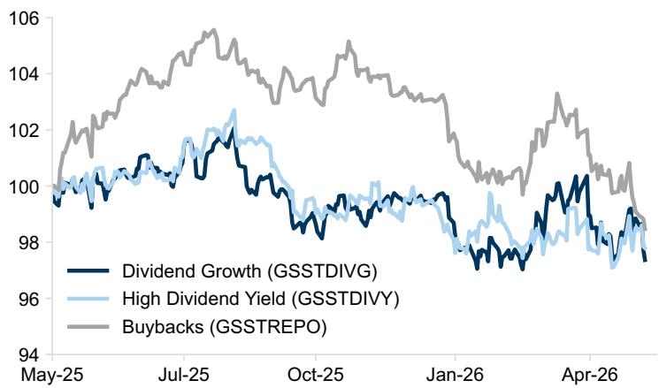

line

| Date   | Dividend Growth (GSSTDIVG) | High Dividend Yield (GSSTDIVY) | Buybacks (GSSTREPO) |
|--------|-----------------------------|----------------------------------|----------------------|
| May-25 | ~100                        | ~100                             | ~100                 |
| Jul-25 | ~101                        | ~102                             | ~105                 |
| Oct-25 | ~98                         | ~100                             | ~103                 |
| Jan-26 | ~97                         | ~98                              | ~100                 |
| Apr-26 | ~98                         | ~97                              | ~101                 |

Source: Bloomberg, STOXX, GS Global Investment Research

Exhibit 29: Fundamental Thematic Baskets   
Relative performance vs. SXXP (EUR)   
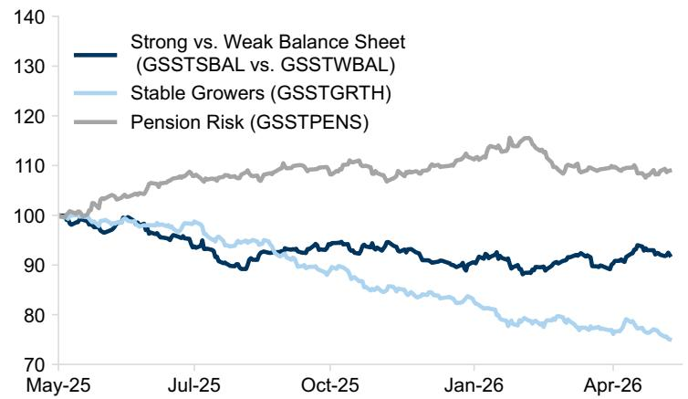

line

| Date   | Strong vs. Weak Balance Sheet | Stable Growers | Pension Risk |
|--------|-------------------------------|----------------|--------------|
| May-25 | 100                           | 100            | 100          |
| Jul-25 | 95                            | 98             | 108          |
| Oct-25 | 92                            | 90             | 110          |
| Jan-26 | 90                            | 85             | 115          |
| Apr-26 | 93                            | 78             | 110          |

Source: Bloomberg, STOXX, GS Global Investment Research

# Thematic Basket Valuation

# Strategy in Style

> For more on our basket methodology, please click here   
> Our baskets and constituents can be accessed via Bloomberg using the ticker followed by <Index> (e.g. <GSSTGRTH Index><Go> or MEMB <Go>)

Exhibit 30: GS Thematic basket valuation metrics 

<table><tr><td rowspan="2">Baskets14 May, 2026</td><td rowspan="2">Bloomberg Ticker</td><td colspan="3">Relative Total Return</td><td colspan="2">EPS Growth</td><td colspan="2">Sales Growth</td><td colspan="4">EPS Momentum</td><td rowspan="2">P/E</td><td rowspan="2">EV/ EBITDA</td><td rowspan="2">Cash Flow Yield</td><td rowspan="2">Dividend Yield</td><td rowspan="2">Price / Book</td></tr><tr><td>1w(%)</td><td>1m(%)</td><td>YTD(%)</td><td>2025E - 2026E (%)</td><td>2026E - 2027E (%)</td><td>2025E - 2026E (%)</td><td>2026E - 2027E (%)</td><td>1m change 2026 (%)</td><td>2027 (%)</td><td>YTD change 2026 (%)</td><td>2027 (%)</td></tr><tr><td colspan="18">Macro Baskets</td></tr><tr><td>Defensives</td><td>GSSTDEFS</td><td>0.1</td><td>-2.3</td><td>-0.9</td><td>6.2</td><td>7.8</td><td>2.8</td><td>4.0</td><td>0.7</td><td>-0.7</td><td>0.1</td><td>-1.2</td><td>15.0</td><td>10.5</td><td>6.3</td><td>3.9</td><td>1.9</td></tr><tr><td>Cyclicals</td><td>GSSTCYCL</td><td>0.1</td><td>1.8</td><td>-0.3</td><td>19.3</td><td>17.3</td><td>3.3</td><td>3.5</td><td>0.2</td><td>-0.9</td><td>-4.2</td><td>-4.7</td><td>12.6</td><td>19.9</td><td>4.4</td><td>3.3</td><td>1.2</td></tr><tr><td>Capex Beneficiaries</td><td>GSSTCAPX</td><td>2.7</td><td>6.6</td><td>19.5</td><td>30.1</td><td>7.6</td><td>4.2</td><td>1.7</td><td>6.2</td><td>3.2</td><td>16.1</td><td>7.0</td><td>16.4</td><td>12.0</td><td>4.1</td><td>2.8</td><td>2.0</td></tr><tr><td>Fiscal Infrastructure Spending</td><td>GSSTFISC</td><td>-1.0</td><td>0.1</td><td>6.2</td><td>24.0</td><td>19.2</td><td>2.1</td><td>5.7</td><td>1.0</td><td>0.4</td><td>-0.9</td><td>-0.2</td><td>19.5</td><td>11.1</td><td>3.6</td><td>2.6</td><td>2.5</td></tr><tr><td colspan="18">Fundamental Baskets</td></tr><tr><td>Recovery</td><td>GSSTRCOV</td><td>0.5</td><td>2.0</td><td>3.0</td><td>16.8</td><td>15.9</td><td>2.4</td><td>3.1</td><td>-1.7</td><td>-1.1</td><td>-4.7</td><td>-4.6</td><td>10.9</td><td>6.7</td><td>9.3</td><td>3.9</td><td>1.1</td></tr><tr><td>Pension Risk</td><td>GSSTPENS</td><td>0.3</td><td>-0.4</td><td>-1.3</td><td>25.1</td><td>27.8</td><td>1.7</td><td>3.0</td><td>-4.3</td><td>-2.5</td><td>-11.9</td><td>-6.9</td><td>11.0</td><td>6.4</td><td>7.2</td><td>3.7</td><td>1.1</td></tr><tr><td>Pure Growth</td><td>GSSTGROW</td><td>-1.7</td><td>-0.9</td><td>-7.4</td><td>22.8</td><td>19.5</td><td>11.1</td><td>10.9</td><td>-0.5</td><td>-0.1</td><td>-3.0</td><td>-3.1</td><td>21.1</td><td>15.7</td><td>4.8</td><td>1.8</td><td>4.8</td></tr><tr><td>Stable Growers</td><td>GSSTGRTH</td><td>-2.1</td><td>-2.7</td><td>-10.6</td><td>6.7</td><td>11.2</td><td>6.3</td><td>7.0</td><td>-0.8</td><td>-0.8</td><td>-2.1</td><td>-2.5</td><td>17.7</td><td>12.7</td><td>5.2</td><td>2.4</td><td>3.6</td></tr><tr><td>High &amp; Stable Margins</td><td>GSSTMARG</td><td>-0.4</td><td>0.9</td><td>-2.0</td><td>10.1</td><td>8.0</td><td>3.8</td><td>4.1</td><td>1.8</td><td>0.9</td><td>3.1</td><td>1.4</td><td>17.8</td><td>13.6</td><td>4.5</td><td>3.0</td><td>3.3</td></tr><tr><td>Quality</td><td>GSSTQUAL</td><td>-1.6</td><td>-1.9</td><td>-6.2</td><td>7.5</td><td>8.0</td><td>4.1</td><td>3.9</td><td>1.1</td><td>0.4</td><td>3.3</td><td>1.5</td><td>16.0</td><td>12.4</td><td>4.7</td><td>3.4</td><td>3.2</td></tr><tr><td>Strong Balance Sheet</td><td>GSSTSBAL</td><td>-0.4</td><td>0.7</td><td>0.8</td><td>9.1</td><td>10.0</td><td>4.8</td><td>5.0</td><td>2.1</td><td>1.6</td><td>4.4</td><td>2.9</td><td>20.3</td><td>14.6</td><td>4.5</td><td>2.1</td><td>3.1</td></tr><tr><td>Weak Balance Sheet</td><td>GSSTWBAL</td><td>-0.1</td><td>-0.1</td><td>-1.1</td><td>24.4</td><td>13.5</td><td>0.4</td><td>3.6</td><td>-2.5</td><td>-2.3</td><td>-5.2</td><td>-4.0</td><td>11.7</td><td>8.2</td><td>9.1</td><td>3.5</td><td>1.6</td></tr><tr><td>EU High Labour Cost</td><td>GSSTHLAB</td><td>-2.3</td><td>-0.9</td><td>-4.4</td><td>11.4</td><td>19.2</td><td>1.4</td><td>3.8</td><td>-1.4</td><td>-0.9</td><td>-6.6</td><td>-3.7</td><td>12.9</td><td>7.1</td><td>9.1</td><td>3.3</td><td>1.4</td></tr><tr><td>Capital Intensive</td><td>GSSTCAPI</td><td>0.4</td><td>0.6</td><td>7.5</td><td>24.1</td><td>7.9</td><td>4.5</td><td>2.5</td><td>3.1</td><td>0.8</td><td>9.3</td><td>4.2</td><td>14.6</td><td>13.5</td><td>4.9</td><td>3.3</td><td>1.6</td></tr><tr><td>Capital Light</td><td>GSSTCAPL</td><td>-1.3</td><td>-1.0</td><td>-10.9</td><td>8.0</td><td>11.5</td><td>2.5</td><td>3.9</td><td>-0.9</td><td>-0.8</td><td>-2.8</td><td>-2.5</td><td>15.9</td><td>11.8</td><td>7.2</td><td>2.9</td><td>2.8</td></tr><tr><td colspan="18">Shareholder Return Baskets</td></tr><tr><td>High Dividend Yield</td><td>GSSTDIVY</td><td>-0.5</td><td>0.1</td><td>-1.6</td><td>12.1</td><td>7.8</td><td>2.7</td><td>2.8</td><td>1.3</td><td>-0.1</td><td>3.8</td><td>0.7</td><td>11.3</td><td>8.5</td><td>7.3</td><td>4.9</td><td>1.8</td></tr><tr><td>Dividend growth</td><td>GSSTDIVG</td><td>-1.0</td><td>-0.3</td><td>-2.1</td><td>24.7</td><td>5.8</td><td>5.4</td><td>2.4</td><td>2.3</td><td>0.2</td><td>4.5</td><td>-0.1</td><td>10.4</td><td>8.7</td><td>8.4</td><td>4.3</td><td>1.8</td></tr><tr><td>Buybacks</td><td>GSSTREPO</td><td>-1.0</td><td>-1.5</td><td>-4.0</td><td>20.6</td><td>11.0</td><td>3.5</td><td>1.1</td><td>1.2</td><td>0.0</td><td>1.1</td><td>-0.8</td><td>11.8</td><td>11.1</td><td>7.8</td><td>3.7</td><td>1.4</td></tr><tr><td>High Growth Investment Ratio</td><td>GSSTHGIR</td><td>1.6</td><td>3.9</td><td>5.7</td><td>14.3</td><td>17.6</td><td>6.7</td><td>7.2</td><td>0.9</td><td>1.0</td><td>1.3</td><td>1.2</td><td>18.9</td><td>13.8</td><td>3.0</td><td>2.0</td><td>2.9</td></tr><tr><td colspan="18">International Baskets</td></tr><tr><td>International Exposure</td><td>GSSTINTL</td><td>1.0</td><td>2.2</td><td>4.5</td><td>11.0</td><td>8.0</td><td>5.4</td><td>4.0</td><td>1.9</td><td>1.1</td><td>5.9</td><td>2.8</td><td>14.5</td><td>15.2</td><td>5.8</td><td>2.9</td><td>2.3</td></tr><tr><td>Euro International Exposure</td><td>GSSTEURO</td><td>0.9</td><td>2.7</td><td>4.3</td><td>13.0</td><td>12.8</td><td>4.2</td><td>5.0</td><td>1.1</td><td>0.9</td><td>-0.6</td><td>0.1</td><td>14.7</td><td>14.7</td><td>4.9</td><td>2.9</td><td>2.1</td></tr><tr><td>UK International Exposure</td><td>GSSTUKIE</td><td>1.5</td><td>0.5</td><td>1.0</td><td>17.2</td><td>8.3</td><td>6.4</td><td>2.9</td><td>1.9</td><td>-0.2</td><td>5.6</td><td>1.5</td><td>14.6</td><td>9.3</td><td>7.4</td><td>2.9</td><td>2.5</td></tr><tr><td>US Exposure</td><td>GSSTAMER</td><td>0.1</td><td>-0.5</td><td>-3.1</td><td>10.1</td><td>10.4</td><td>4.1</td><td>4.4</td><td>0.9</td><td>-0.7</td><td>-0.9</td><td>-4.1</td><td>14.9</td><td>11.2</td><td>5.5</td><td>2.9</td><td>2.3</td></tr><tr><td>China Exposure</td><td>GSSTCHNA</td><td>0.8</td><td>4.9</td><td>4.9</td><td>17.8</td><td>19.5</td><td>1.4</td><td>3.8</td><td>0.8</td><td>0.8</td><td>-1.6</td><td>0.2</td><td>17.6</td><td>16.9</td><td>4.9</td><td>2.6</td><td>1.6</td></tr><tr><td>EM Exposure</td><td>GSSTBRIC</td><td>1.2</td><td>2.9</td><td>5.1</td><td>24.1</td><td>10.9</td><td>3.7</td><td>3.5</td><td>2.0</td><td>1.0</td><td>6.2</td><td>2.9</td><td>15.6</td><td>13.5</td><td>6.1</td><td>2.9</td><td>1.8</td></tr><tr><td colspan="18">Domestic Baskets</td></tr><tr><td>Domestic Eurozone</td><td>GSSTDOME</td><td>-0.4</td><td>-0.4</td><td>-0.1</td><td>8.6</td><td>8.9</td><td>2.9</td><td>2.6</td><td>0.2</td><td>0.4</td><td>-0.1</td><td>0.0</td><td>12.6</td><td>10.2</td><td>5.8</td><td>4.8</td><td>1.5</td></tr><tr><td>Core Eurozone</td><td>GSSTCEMU</td><td>-1.0</td><td>-2.6</td><td>-4.0</td><td>8.0</td><td>11.5</td><td>2.5</td><td>3.5</td><td>-0.5</td><td>0.1</td><td>-2.2</td><td>-0.8</td><td>12.5</td><td>10.9</td><td>7.0</td><td>4.6</td><td>1.3</td></tr><tr><td>Periphery Eurozone</td><td>GSSTPEMU</td><td>-0.4</td><td>0.1</td><td>2.4</td><td>9.6</td><td>5.2</td><td>4.0</td><td>0.2</td><td>1.2</td><td>0.8</td><td>3.1</td><td>1.1</td><td>12.8</td><td>9.2</td><td>4.1</td><td>5.0</td><td>1.7</td></tr><tr><td>UK Domestic Exposure</td><td>GSSTUKDE</td><td>-1.2</td><td>-3.1</td><td>-7.3</td><td>4.3</td><td>7.7</td><td>2.0</td><td>3.4</td><td>-0.9</td><td>-1.4</td><td>-2.1</td><td>-3.4</td><td>12.0</td><td>8.1</td><td>4.1</td><td>4.6</td><td>1.6</td></tr><tr><td>STOXX Europe 600</td><td>SXXP</td><td>0.2</td><td>0.3</td><td>5.9</td><td>14.2</td><td>9.9</td><td>5.0</td><td>3.5</td><td>1.4</td><td>0.8</td><td>3.9</td><td>2.0</td><td>14.4</td><td>8.7</td><td>4.5</td><td>3.3</td><td>2.3</td></tr></table>

Source: FactSet, STOXX, GS Global Investment Research

# Europe Sector Valuation

Exhibit 31: Sector valuation 

<table><tr><td rowspan="3">SectorsMay 14, 2026</td><td rowspan="3">STOXX600Wgt</td><td colspan="3">Total Return</td><td colspan="2">EPS Growth</td><td colspan="2">GSEPS Growth</td><td colspan="2">EPS Momentum</td><td colspan="2">Sales Growth</td><td rowspan="3">Expd.ROE2026</td><td rowspan="3">P/EMult.NTM</td><td rowspan="3">EV /EBITDANTM</td><td rowspan="3">CashFlowYieldLTM</td><td rowspan="3">DivYldNTM</td><td rowspan="3">Price /BookValueLTM</td><td rowspan="3">NetDebt /Equity(%)</td></tr><tr><td rowspan="2">1 wk(%)</td><td rowspan="2">1 mo(%)</td><td rowspan="2">YTD(%)</td><td rowspan="2">2025E-2026E(%)</td><td rowspan="2">2026E-2027E(%)</td><td rowspan="2">2025E-2026E(%)</td><td rowspan="2">2026E-2027E(%)</td><td colspan="2">One monthchange</td><td rowspan="2">2025E-2026E(%)</td><td rowspan="2">2026E-2027E(%)</td></tr><tr><td>2026</td><td>2027</td></tr><tr><td>Automobiles and Parts</td><td>1.8</td><td>0.6</td><td>(0.3)</td><td>(8.9)</td><td>50.8</td><td>25.3</td><td>55.5</td><td>29.7</td><td>(0.2)</td><td>(2.4)</td><td>1.0</td><td>3.0</td><td>4.8</td><td>8.1</td><td>6.0</td><td>6.1</td><td>4.5</td><td>0.4</td><td>87</td></tr><tr><td>Banks</td><td>13.3</td><td>(0.2)</td><td>(0.8)</td><td>4.8</td><td>9.6</td><td>13.2</td><td>12.3</td><td>15.1</td><td>1.2</td><td>1.6</td><td>NM</td><td>NM</td><td>13.9</td><td>9.6</td><td>NM</td><td>NM</td><td>5.4</td><td>1.4</td><td>NM</td></tr><tr><td>Basic Resources</td><td>3.1</td><td>4.4</td><td>7.9</td><td>31.4</td><td>47.9</td><td>10.4</td><td>45.6</td><td>4.8</td><td>1.9</td><td>1.6</td><td>9.1</td><td>2.2</td><td>12.2</td><td>15.1</td><td>6.6</td><td>3.0</td><td>2.9</td><td>1.9</td><td>30</td></tr><tr><td>Chemicals</td><td>2.1</td><td>1.2</td><td>0.3</td><td>10.7</td><td>19.1</td><td>6.8</td><td>31.7</td><td>(1.4)</td><td>4.7</td><td>1.7</td><td>3.8</td><td>2.0</td><td>10.9</td><td>18.5</td><td>9.2</td><td>4.1</td><td>3.2</td><td>2.1</td><td>40</td></tr><tr><td>Construction and Materials</td><td>3.3</td><td>(2.5)</td><td>(1.0)</td><td>2.7</td><td>14.3</td><td>13.2</td><td>7.5</td><td>10.8</td><td>(0.4)</td><td>(0.3)</td><td>3.7</td><td>5.6</td><td>14.5</td><td>17.1</td><td>9.2</td><td>5.9</td><td>2.7</td><td>2.6</td><td>53</td></tr><tr><td>Consumer Products and Services</td><td>4.9</td><td>(1.3)</td><td>0.5</td><td>(13.0)</td><td>12.8</td><td>15.8</td><td>12.7</td><td>15.4</td><td>(0.3)</td><td>(0.8)</td><td>3.8</td><td>6.5</td><td>14.3</td><td>21.5</td><td>12.5</td><td>3.3</td><td>2.4</td><td>3.3</td><td>43</td></tr><tr><td>Energy</td><td>6.4</td><td>1.6</td><td>(0.5)</td><td>34.0</td><td>65.9</td><td>(8.6)</td><td>67.0</td><td>(11.4)</td><td>9.4</td><td>3.7</td><td>12.5</td><td>(4.0)</td><td>20.0</td><td>10.5</td><td>4.6</td><td>7.1</td><td>3.7</td><td>2.0</td><td>35</td></tr><tr><td>Financial Services</td><td>4.3</td><td>(0.5)</td><td>1.4</td><td>1.1</td><td>3.0</td><td>4.4</td><td>3.2</td><td>4.4</td><td>1.1</td><td>0.6</td><td>NM</td><td>NM</td><td>12.5</td><td>12.3</td><td>NM</td><td>NM</td><td>3.1</td><td>1.5</td><td>NM</td></tr><tr><td>Food Beverage and Tobacco</td><td>5.0</td><td>2.1</td><td>3.5</td><td>4.0</td><td>2.7</td><td>8.1</td><td>2.2</td><td>7.7</td><td>0.3</td><td>0.4</td><td>1.7</td><td>3.3</td><td>17.6</td><td>14.9</td><td>10.1</td><td>5.7</td><td>3.9</td><td>2.7</td><td>80</td></tr><tr><td>Health Care</td><td>13.0</td><td>0.9</td><td>(3.6)</td><td>(2.2)</td><td>4.1</td><td>10.0</td><td>4.3</td><td>8.4</td><td>0.6</td><td>(0.0)</td><td>3.5</td><td>5.8</td><td>21.2</td><td>15.3</td><td>10.3</td><td>5.3</td><td>2.6</td><td>3.4</td><td>45</td></tr><tr><td>Industrial Goods and Services</td><td>15.5</td><td>(1.9)</td><td>(0.6)</td><td>6.6</td><td>14.8</td><td>15.8</td><td>12.5</td><td>17.1</td><td>(0.6)</td><td>0.1</td><td>5.7</td><td>6.7</td><td>17.5</td><td>21.5</td><td>11.8</td><td>4.2</td><td>2.1</td><td>4.2</td><td>40</td></tr><tr><td>Insurance</td><td>5.5</td><td>(0.0)</td><td>(0.0)</td><td>1.0</td><td>6.7</td><td>7.8</td><td>4.8</td><td>8.2</td><td>0.5</td><td>0.0</td><td>NM</td><td>NM</td><td>18.7</td><td>11.4</td><td>NM</td><td>NM</td><td>5.4</td><td>2.2</td><td>NM</td></tr><tr><td>Media</td><td>0.5</td><td>(0.9)</td><td>2.3</td><td>(8.0)</td><td>0.8</td><td>9.0</td><td>1.2</td><td>9.7</td><td>(0.4)</td><td>0.3</td><td>1.6</td><td>4.5</td><td>16.3</td><td>12.7</td><td>9.0</td><td>7.8</td><td>3.6</td><td>2.1</td><td>14</td></tr><tr><td>Personal Care Drug and Grocery Stores</td><td>2.2</td><td>(2.3)</td><td>(4.7)</td><td>(6.3)</td><td>4.1</td><td>7.6</td><td>3.5</td><td>7.2</td><td>(0.7)</td><td>(0.6)</td><td>2.7</td><td>3.1</td><td>21.7</td><td>13.8</td><td>7.9</td><td>7.9</td><td>3.9</td><td>3.1</td><td>90</td></tr><tr><td>Real Estate</td><td>1.1</td><td>(1.6)</td><td>(3.2)</td><td>(0.3)</td><td>0.4</td><td>4.4</td><td>0.8</td><td>3.9</td><td>(2.3)</td><td>(1.4)</td><td>NM</td><td>NM</td><td>5.8</td><td>14.5</td><td>NM</td><td>NM</td><td>4.8</td><td>0.9</td><td>NM</td></tr><tr><td>Retail</td><td>0.9</td><td>(4.4)</td><td>(6.2)</td><td>(9.6)</td><td>9.5</td><td>10.0</td><td>7.6</td><td>10.3</td><td>0.1</td><td>(0.1)</td><td>4.6</td><td>5.1</td><td>22.7</td><td>16.1</td><td>9.2</td><td>5.7</td><td>3.5</td><td>3.8</td><td>55</td></tr><tr><td>Technology</td><td>8.7</td><td>2.1</td><td>10.1</td><td>14.0</td><td>20.1</td><td>22.2</td><td>23.4</td><td>27.7</td><td>2.8</td><td>3.2</td><td>11.4</td><td>11.5</td><td>24.0</td><td>24.9</td><td>18.4</td><td>2.7</td><td>1.2</td><td>6.8</td><td>6</td></tr><tr><td>Telecommunications</td><td>2.9</td><td>3.7</td><td>5.3</td><td>25.7</td><td>9.0</td><td>11.0</td><td>16.5</td><td>16.4</td><td>1.6</td><td>(1.2)</td><td>3.1</td><td>3.8</td><td>11.6</td><td>17.5</td><td>6.6</td><td>7.9</td><td>3.6</td><td>2.1</td><td>139</td></tr><tr><td>Travel and Leisure</td><td>0.8</td><td>(2.2)</td><td>(2.7)</td><td>(7.9)</td><td>(1.4)</td><td>18.5</td><td>1.8</td><td>11.0</td><td>(6.9)</td><td>(2.8)</td><td>3.8</td><td>4.7</td><td>20.0</td><td>NM</td><td>5.2</td><td>7.8</td><td>3.0</td><td>2.5</td><td>99</td></tr><tr><td>Utilities</td><td>4.6</td><td>0.1</td><td>(2.1)</td><td>14.6</td><td>8.4</td><td>8.1</td><td>7.1</td><td>8.7</td><td>0.2</td><td>0.3</td><td>1.9</td><td>3.9</td><td>14.3</td><td>15.6</td><td>8.5</td><td>(2.2)</td><td>4.0</td><td>2.3</td><td>123</td></tr><tr><td>Stoxx 600</td><td></td><td>0.2</td><td>0.3</td><td>5.9</td><td>14.2</td><td>9.9</td><td>15.1</td><td>10.0</td><td>1.4</td><td>0.8</td><td>5.0</td><td>3.5</td><td>15.1</td><td>14.4</td><td>8.7</td><td>4.5</td><td>3.3</td><td>2.3</td><td>61</td></tr><tr><td>Stoxx 600 ex Financials &amp; RE</td><td></td><td>0.3</td><td>0.4</td><td>6.8</td><td>17.9</td><td>9.6</td><td>18.6</td><td>8.9</td><td>1.7</td><td>0.6</td><td>5.0</td><td>3.5</td><td>15.9</td><td>16.4</td><td>8.7</td><td>4.5</td><td>2.8</td><td>2.7</td><td>61</td></tr><tr><td>Stoxx 600 (median)</td><td></td><td>(1.1)</td><td>(0.9)</td><td>2.6</td><td>8.2</td><td>11.0</td><td>8.4</td><td>11.2</td><td>0.2</td><td>0.2</td><td>4.1</td><td>4.9</td><td>16.0</td><td>14.6</td><td>8.8</td><td>5.5</td><td>3.2</td><td>2.2</td><td>43</td></tr><tr><td>EuroStoxx 50</td><td>33.8</td><td>(0.3)</td><td>0.4</td><td>4.4</td><td>15.0</td><td>12.0</td><td>16.1</td><td>12.7</td><td>1.8</td><td>1.0</td><td>4.4</td><td>4.6</td><td>15.1</td><td>14.8</td><td>9.8</td><td>4.1</td><td>3.2</td><td>2.3</td><td>65</td></tr><tr><td>Stoxx Large</td><td>82.5</td><td>0.3</td><td>0.3</td><td>5.8</td><td>14.2</td><td>10.0</td><td>15.5</td><td>10.0</td><td>1.7</td><td>0.9</td><td>5.8</td><td>3.4</td><td>15.9</td><td>14.4</td><td>9.1</td><td>4.4</td><td>3.3</td><td>2.4</td><td>62</td></tr><tr><td>Stoxx Mid</td><td>12.1</td><td>(0.5)</td><td>(0.5)</td><td>6.5</td><td>15.8</td><td>7.8</td><td>14.5</td><td>7.9</td><td>0.9</td><td>0.1</td><td>3.5</td><td>3.5</td><td>12.7</td><td>14.6</td><td>7.8</td><td>4.6</td><td>3.5</td><td>1.9</td><td>57</td></tr><tr><td>Stoxx Small</td><td>4.9</td><td>(0.3)</td><td>1.2</td><td>5.7</td><td>9.4</td><td>13.3</td><td>10.0</td><td>13.6</td><td>(1.5)</td><td>0.2</td><td>3.5</td><td>3.8</td><td>11.4</td><td>13.4</td><td>7.2</td><td>5.3</td><td>3.7</td><td>1.6</td><td>63</td></tr></table>

Source: FactSet, STOXX, GS Global Investment Research

# European Indices Valuation

Exhibit 32: European indices valuation 

<table><tr><td rowspan="2" colspan="2">Country Indices</td><td rowspan="2">Price</td><td rowspan="2" colspan="3">Total Return</td><td rowspan="2" colspan="2">EPS Growth</td><td rowspan="2">2025E-2026E(%)</td><td rowspan="2">2026E-2027E(%)</td><td rowspan="2">2025E-2026E(%)</td><td rowspan="2">2026E-2027E(%)</td><td colspan="2">GS EPS Growth</td><td colspan="2">EPS Momentum</td><td colspan="2">Sales Growth</td><td>Expd. ROE</td><td>P/E Mult.</td><td>EV / EBITDA</td><td>Cash Flow Yield</td><td>Div Yld</td><td>Price / Book Value</td><td>Net Debt / Equity</td></tr><tr><td colspan="2">One month change</td><td>2025E-2026E(%)</td><td>2026E-2027E(%)</td><td>2026</td><td>NTM</td><td>NTM</td><td>LTM</td><td>NTM</td><td>LTM</td><td>LTM</td><td>(%)</td><td></td></tr><tr><td>STOXX Europe 600</td><td>Europe</td><td>616</td><td>0.2</td><td>0.3</td><td>5.9</td><td>14.2</td><td>9.9</td><td>15.1</td><td>10.0</td><td>1.4</td><td>0.8</td><td>5.0</td><td>3.5</td><td>15.1</td><td>14.4</td><td>8.7</td><td>4.5</td><td>3.3</td><td>2.3</td><td>61</td><td></td><td></td><td></td><td></td></tr><tr><td>EuroStoxx 50</td><td>Euro Area</td><td>5935</td><td>(0.3)</td><td>0.4</td><td>4.4</td><td>15.0</td><td>12.0</td><td>16.1</td><td>12.7</td><td>1.8</td><td>1.0</td><td>4.4</td><td>4.6</td><td>15.1</td><td>14.8</td><td>9.8</td><td>4.1</td><td>3.2</td><td>2.3</td><td>65</td><td></td><td></td><td></td><td></td></tr><tr><td>FTSE 100</td><td>UK</td><td>10373</td><td>1.1</td><td>(1.8)</td><td>6.0</td><td>19.8</td><td>6.7</td><td>19.7</td><td>6.9</td><td>1.8</td><td>0.5</td><td>7.9</td><td>0.7</td><td>14.5</td><td>12.4</td><td>7.6</td><td>5.6</td><td>3.5</td><td>2.2</td><td>68</td><td></td><td></td><td></td><td></td></tr><tr><td>FTSE 250</td><td>UK</td><td>22828</td><td>(0.2)</td><td>0.9</td><td>3.0</td><td>13.5</td><td>12.7</td><td>16.2</td><td>11.5</td><td>(3.2)</td><td>(1.5)</td><td>4.2</td><td>3.2</td><td>9.8</td><td>11.8</td><td>5.7</td><td>7.7</td><td>4.3</td><td>1.2</td><td>60</td><td></td><td></td><td></td><td></td></tr><tr><td>DAX 40</td><td>Germany</td><td>24456</td><td>(0.8)</td><td>1.7</td><td>(0.1)</td><td>13.1</td><td>15.7</td><td>12.7</td><td>17.2</td><td>0.5</td><td>0.0</td><td>3.1</td><td>5.2</td><td>10.1</td><td>14.3</td><td>7.7</td><td>5.3</td><td>3.1</td><td>1.5</td><td>78</td><td></td><td></td><td></td><td></td></tr><tr><td>MDAX 50</td><td>Germany</td><td>31894</td><td>1.1</td><td>4.5</td><td>4.2</td><td>37.4</td><td>31.7</td><td>29.2</td><td>28.5</td><td>(7.0)</td><td>(0.6)</td><td>4.8</td><td>5.6</td><td>7.3</td><td>15.8</td><td>6.9</td><td>3.0</td><td>2.3</td><td>1.5</td><td>45</td><td></td><td></td><td></td><td></td></tr><tr><td>CAC 40</td><td>France</td><td>8082</td><td>(1.0)</td><td>(1.5)</td><td>0.8</td><td>19.6</td><td>10.3</td><td>21.3</td><td>10.2</td><td>1.4</td><td>0.4</td><td>4.7</td><td>4.5</td><td>14.4</td><td>14.1</td><td>8.9</td><td>3.6</td><td>3.4</td><td>2.1</td><td>46</td><td></td><td></td><td></td><td></td></tr><tr><td>SMI 20</td><td>Switzerland</td><td>13213</td><td>0.7</td><td>0.5</td><td>2.4</td><td>7.1</td><td>11.0</td><td>5.3</td><td>10.3</td><td>0.5</td><td>0.8</td><td>2.5</td><td>4.8</td><td>22.7</td><td>17.1</td><td>12.3</td><td>4.8</td><td>3.2</td><td>4.1</td><td>60</td><td></td><td></td><td></td><td></td></tr><tr><td>MIB 40</td><td>Italy</td><td>50050</td><td>1.5</td><td>4.5</td><td>12.5</td><td>12.6</td><td>11.3</td><td>19.4</td><td>12.0</td><td>1.3</td><td>1.0</td><td>6.0</td><td>3.1</td><td>14.6</td><td>12.3</td><td>6.9</td><td>1.8</td><td>4.8</td><td>1.9</td><td>76</td><td></td><td></td><td></td><td></td></tr><tr><td>IBEX 35</td><td>Spain</td><td>17809</td><td>(1.4)</td><td>(2.1)</td><td>4.5</td><td>11.6</td><td>12.5</td><td>24.5</td><td>13.8</td><td>0.9</td><td>1.2</td><td>5.3</td><td>3.5</td><td>14.8</td><td>12.7</td><td>8.5</td><td>2.6</td><td>4.1</td><td>2.0</td><td>85</td><td></td><td></td><td></td><td></td></tr><tr><td>AEX 25</td><td>Netherlands</td><td>1022</td><td>0.5</td><td>1.0</td><td>8.7</td><td>16.5</td><td>17.1</td><td>16.3</td><td>19.4</td><td>1.9</td><td>2.0</td><td>9.7</td><td>0.7</td><td>11.3</td><td>19.1</td><td>9.1</td><td>5.4</td><td>2.1</td><td>2.5</td><td>32</td><td></td><td></td><td></td><td></td></tr><tr><td>OMX Stockholm 30</td><td>Sweden</td><td>3048</td><td>(1.9)</td><td>(2.1)</td><td>7.9</td><td>4.2</td><td>3.6</td><td>4.9</td><td>4.2</td><td>1.0</td><td>0.3</td><td>3.9</td><td>6.2</td><td>15.0</td><td>15.7</td><td>11.1</td><td>4.0</td><td>3.0</td><td>2.4</td><td>40</td><td></td><td></td><td></td><td></td></tr><tr><td>OMX Copenhagen 20</td><td>Denmark</td><td>1544</td><td>0.9</td><td>5.6</td><td>(1.8)</td><td>(6.2)</td><td>5.9</td><td>10.2</td><td>(2.1)</td><td>1.8</td><td>(0.7)</td><td>2.7</td><td>3.0</td><td>12.9</td><td>16.4</td><td>7.9</td><td>3.8</td><td>2.9</td><td>2.2</td><td>24</td><td></td><td></td><td></td><td></td></tr><tr><td>OBX Oslo 25</td><td>Norway</td><td>1930</td><td>0.5</td><td>(2.8)</td><td>20.8</td><td>47.8</td><td>(5.0)</td><td>54.3</td><td>(6.3)</td><td>5.2</td><td>1.4</td><td>13.1</td><td>(6.6)</td><td>15.2</td><td>11.7</td><td>3.6</td><td>4.1</td><td>5.0</td><td>2.2</td><td>47</td><td></td><td></td><td></td><td></td></tr></table>

Source: FactSet, STOXX, GS Global Investment Research

# Long-Term Valuation – Europe

Exhibit 33: STOXX Europe 600 12m fwd P/E   
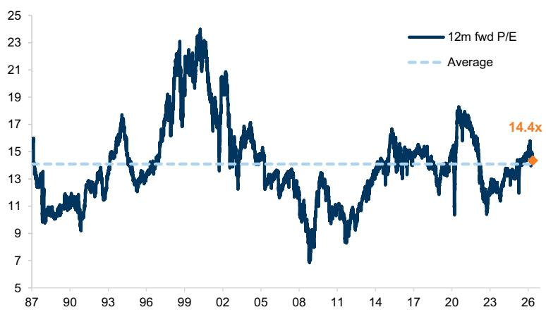

line

| Year | 12m fwd P/E |
|------|-------------|
| 2026 | 14.4x       |

Source: Datastream, I/B/E/S, STOXX, GS Global Investment Research

Exhibit 35: Global valuation range   
12m fwd P/E multiple. Data since 2000   
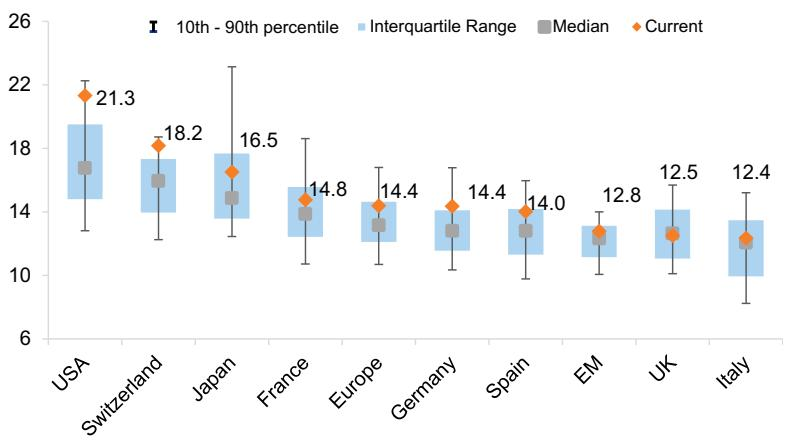

bar

| Region     | 10th - 90th percentile | Interquartile Range | Median | Current |
| ---------- | ---------------------- | ------------------- | ------ | ------- |
| USA        | 18.5                   | 17.0                | 16.5   | 21.3    |
| Switzerland| 17.5                   | 16.0                | 15.5   | 18.2    |
| Japan      | 17.8                   | 16.5                | 15.8   | 16.5    |
| France     | 14.5                   | 13.5                | 13.8   | 14.8    |
| Europe     | 14.0                   | 13.0                | 13.2   | 14.4    |
| Germany    | 13.5                   | 12.5                | 12.8   | 14.4    |
| Spain      | 13.8                   | 12.8                | 13.0   | 14.0    |
| EM         | 13.0                   | 12.0                | 12.2   | 12.8    |
| UK         | 13.5                   | 13.0                | 13.2   | 12.5    |
| Italy      | 13.8                   | 12.5                | 12.8   | 12.4    |

Source: Datastream, Worldscope, GS Global Investment Research

Exhibit 34: European valuation levels and historical percentiles   
Europe STOXX 600. Percentile since 2000 

<table><tr><td></td><td>Metrics</td><td>Current Level</td><td>Historical Percentile*</td><td>Median</td></tr><tr><td rowspan="7">Equity (SXXP)</td><td>NTM EV / Sales</td><td>2.0</td><td>92%</td><td rowspan="7">86%</td></tr><tr><td>NTM EV / EBITDA</td><td>8.7</td><td>86%</td></tr><tr><td>NTM Price / Book</td><td>2.2</td><td>91%</td></tr><tr><td>NTM P/E</td><td>14.4</td><td>71%</td></tr><tr><td>NTM Free cash flow yield</td><td>4.9</td><td>89%</td></tr><tr><td>Cyclically Adjusted P/E</td><td>19.3</td><td>76%</td></tr><tr><td>ERP (%)</td><td>3.8</td><td>77%</td></tr><tr><td rowspan="2">Rates</td><td>Germany 10-y Bond Yield</td><td>3.0%</td><td>40%</td><td rowspan="6">54%</td></tr><tr><td>UK 10-y Bond Yield</td><td>5.0%</td><td>10%</td></tr><tr><td rowspan="4">Credit</td><td>High Yield YTM</td><td>5.8%</td><td>62%</td></tr><tr><td>Investment Grade YTM</td><td>3.6%</td><td>47%</td></tr><tr><td>High Yield spread</td><td>263bp</td><td>66%</td></tr><tr><td>Investment Grade spread</td><td>91bp</td><td>80%</td></tr></table>

\*High percentile = High valuation   
Source: Datastream, FactSet, Haver Analytics, GS Global Investment Research

Exhibit 36: Market implied ERP   
Pan-Europe   
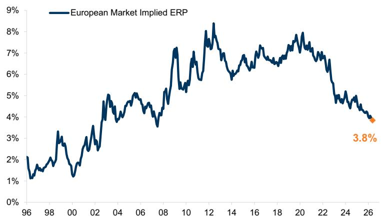

line

| Year | European Market Implied ERP |
| ---- | --------------------------- |
| 2026 | 3.8%                        |

Source: GS Global Investment Research

# Style Performance

Exhibit 37: Europe STOXX 600 and Europe Composite PMI   
Europe STOXX 600 (Y/Y % Chg) and Europe Composite PMI (RHS)   
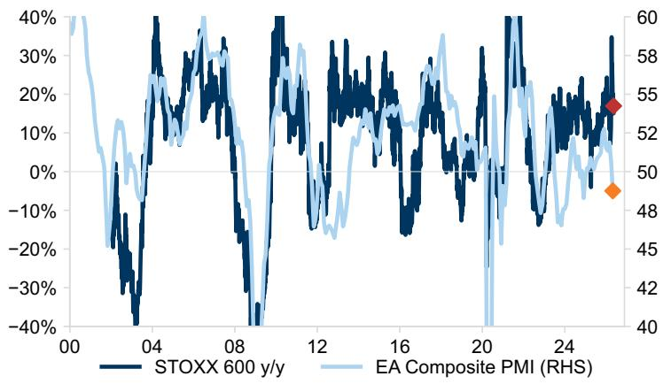

line

| Year | STOXX 600 y/y | EA Composite PMI (RHS) |
|------|---------------|------------------------|
| 25   | 55%           | 48                     |

Source: Bloomberg, Datastream, STOXX, GS Global Investment Research

Exhibit 38: Cyclicals vs. Defensives and Europe Composite PMI   
Europe Cyclicals vs. Defensives (Y/Y % Chg) and Europe Composite PMI (RHS)   
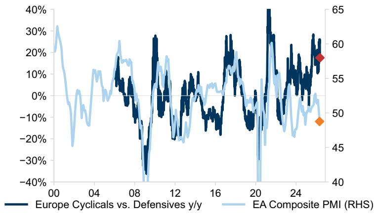

line

| Year | Europe Cyclicals vs. Defensives y/y | EA Composite PMI (RHS) |
|------|-------------------------------------|------------------------|
| 25   | 60%                                 | 50                     |

Source: Bloomberg, Datastream, GS Global Investment Research

Exhibit 39: MSCI Europe Value vs. Growth and US 10y Bond Yield   
MSCI Europe Value vs. Growth (Y/Y % Chg) and US 10y Bond Yield (Y/Y Chg, RHS)   
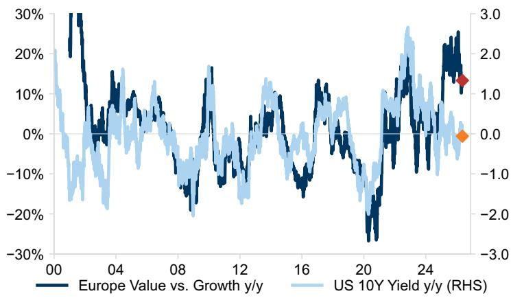

line

| Year | Europe Value vs. Growth y/y | US 10Y Yield y/y (RHS) |
|------|-----------------------------|------------------------|
| 25   | ~25%                        | ~1.5                   |

Source: Bloomberg, Datastream, GS Global Investment Research

Exhibit 40: Europe STOXX Small vs. Large and EUR/USD   
Europe STOXX Small vs. Europe STOXX Large (Y/Y % Chg) and EUR/USD (Y/Y % Chg, RHS)   
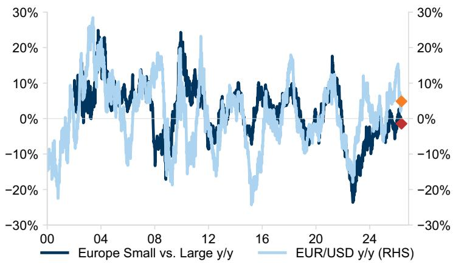

line

| Year | Europe Small vs. Large y/y | EUR/USD y/y (RHS) |
|------|-----------------------------|-------------------|
| 2025 | -5%                         | 5%                |

Source: Bloomberg, Datastream, STOXX, GS Global Investment Research

# Flows from Global Investors into European Funds

Exhibit 41: 1-month rolling flows from Global investors into European equities   
Weekly fund flows (EPFR Country Flows Database)   
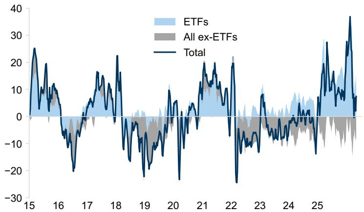

line

| Year | ETFs | All ex-ETFs | Total |
|------|------|-------------|-------|
| 15   | 25   | 0           | 25    |
| 16   | 10   | 0           | 10    |
| 17   | 15   | 0           | 15    |
| 18   | 20   | 0           | 20    |
| 19   | 0    | 0           | 0     |
| 20   | 10   | 0           | 10    |
| 21   | 20   | 0           | 20    |
| 22   | 25   | 0           | 25    |
| 23   | 10   | 0           | 10    |
| 24   | 5    | 0           | 5     |
| 25   | 30   | 0           | 30    |

Source: EPFR, Haver Analytics, GS Global Investment Research

Exhibit 42: Calendarised flows from Global investors into European equities   
Weekly fund flows (EPFR Country Flows Database)   
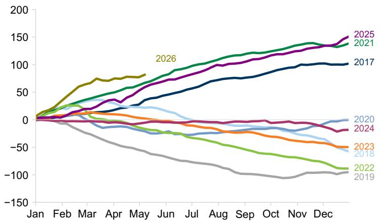  
Source: EPFR, Haver Analytics, GS Global Investment Research

Exhibit 43: Flows into developed Europe equity from Foreign and Domestic Investors   
1-month rolling sum of weekly fund flows (EPFR Country Flows Database)   
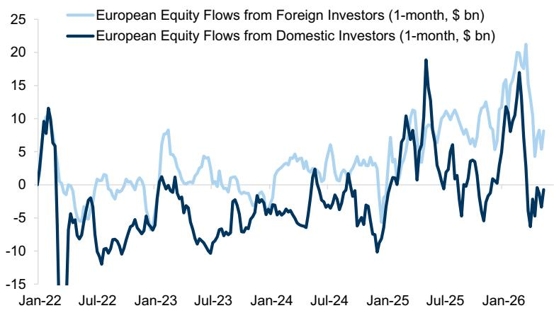

line

| Date   | European Equity Flows from Foreign Investors ($ bn) | European Equity Flows from Domestic Investors ($ bn) |
|--------|------------------------------------------------------|-----------------------------------------------------|
| Jan-22 | 0                                                    | 12                                                  |
| Jul-22 | -5                                                   | -15                                                 |
| Jan-23 | 8                                                    | -5                                                  |
| Jul-23 | 4                                                    | -10                                                 |
| Jan-24 | 5                                                    | -5                                                  |
| Jul-24 | 6                                                    | -5                                                  |
| Jan-25 | 10                                                   | -10                                                 |
| Jul-25 | 10                                                   | 19                                                  |
| Jan-26 | 21                                                   | -5                                                  |

Source: EPFR, GS Global Investment Research

Exhibit 44: Ownership of Euro area equities   
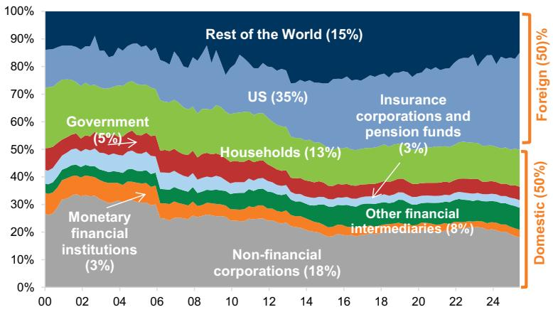

area_stacked

| Category | Percentage (%) |
| :--- | :--- |
| Rest of the World | 15 |
| US | 35 |
| Insurance corporations and pension funds | 3 |
| Households | 13 |
| Monetary financial institutions | 3 |
| Non-financial corporations | 18 |
| Foreign | 50 |
| Domestic | 50 |

Source: ECB, US Treasury, IMF, Haver Analytics, GS Global Investment Research

# Volatility, Skew, Dispersion and Correlations

Exhibit 45: Implied volatility (3-month ATM)   
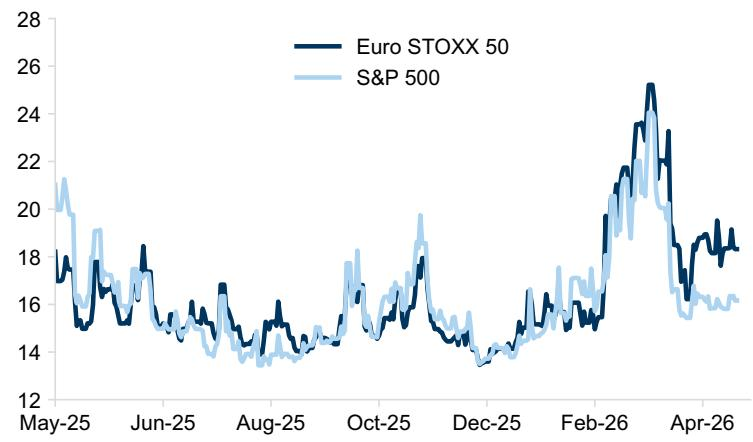

line

| Date   | Euro STOXX 50 | S&P 500 |
|--------|---------------|---------|
| May-25 | 17.5          | 21.0    |
| Jun-25 | 16.0          | 17.0    |
| Aug-25 | 14.5          | 13.5    |
| Oct-25 | 16.5          | 18.0    |
| Dec-25 | 13.0          | 14.0    |
| Feb-26 | 19.0          | 20.0    |
| Apr-26 | 18.0          | 16.0    |

Source: STOXX, GS Global Investment Research

Exhibit 46: Normalised skew (3-month, 25 delta)   
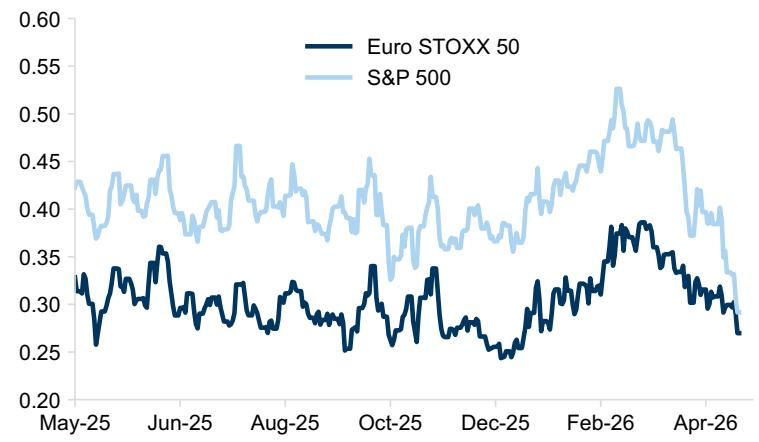

line

| Date   | Euro STOXX 50 | S&P 500 |
|--------|---------------|---------|
| May-25 | 0.33          | 0.43    |
| Jun-25 | 0.36          | 0.47    |
| Aug-25 | 0.31          | 0.45    |
| Oct-25 | 0.34          | 0.46    |
| Dec-25 | 0.28          | 0.39    |
| Feb-26 | 0.38          | 0.53    |
| Apr-26 | 0.27          | 0.31    |

Source: STOXX, GS Global Investment Research   
6-month average of monthly return dispersion

Exhibit 47: STOXX Europe 600 return dispersion

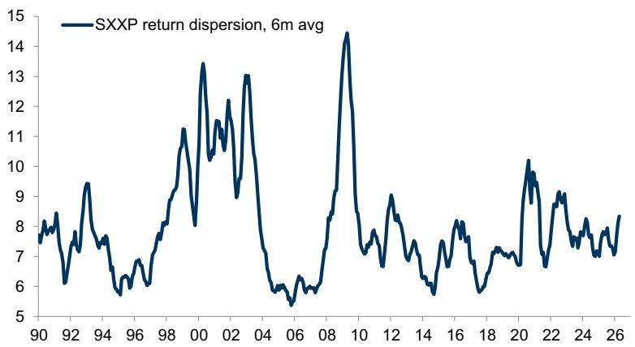

line

| Year | SXXP return dispersion, 6m avg |
| ---- | ------------------------------ |
| 90   | 7.5                            |
| 91   | 7.8                            |
| 92   | 6.2                            |
| 93   | 7.0                            |
| 94   | 9.5                            |
| 95   | 7.5                            |
| 96   | 6.0                            |
| 97   | 6.5                            |
| 98   | 8.0                            |
| 99   | 11.0                           |
| 00   | 13.5                           |
| 01   | 10.5                           |
| 02   | 12.0                           |
| 03   | 13.0                           |
| 04   | 9.0                            |
| 05   | 6.0                            |
| 06   | 5.5                            |
| 07   | 6.0                            |
| 08   | 8.5                            |
| 09   | 14.5                           |
| 10   | 7.5                            |
| 11   | 8.0                            |
| 12   | 9.0                            |
| 13   | 7.5                            |
| 14   | 6.5                            |
| 15   | 7.0                            |
| 16   | 8.0                            |
| 17   | 7.5                            |
| 18   | 6.0                            |
| 19   | 7.0                            |
| 20   | 10.0                           |
| 21   | 7.0                            |
| 22   | 9.0                            |
| 23   | 8.5                            |
| 24   | 7.5                            |
| 25   | 8.0                            |
| 26   | 8.5                            |

Source: Datastream, STOXX, GS Global Investment Research

Exhibit 48: 1-month average pairwise correlation   
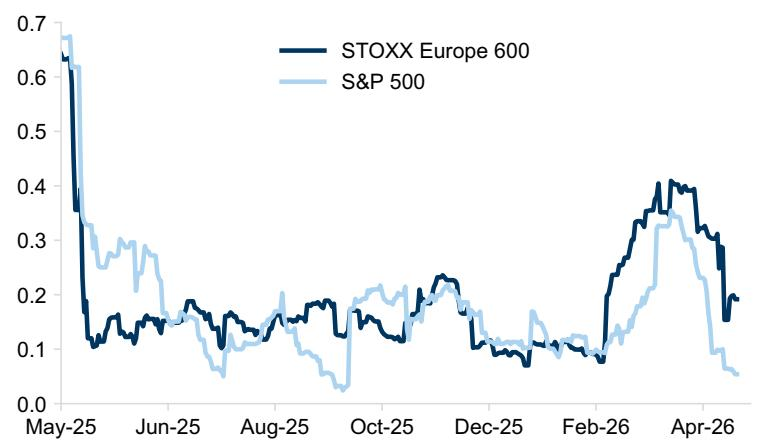

line

| Date   | STOXX Europe 600 | S&P 500 |
|--------|------------------|---------|
| May-25 | 0.68             | 0.69    |
| Jun-25 | 0.15             | 0.28    |
| Aug-25 | 0.18             | 0.15    |
| Oct-25 | 0.22             | 0.20    |
| Dec-25 | 0.12             | 0.15    |
| Feb-26 | 0.35             | 0.32    |
| Apr-26 | 0.40             | 0.35    |

Source: STOXX, GS Global Investment Research

# Europe Indices Sales Exposure

Exhibit 49: Sales exposure across indices 

<table><tr><td>Index</td><td>Region</td><td>Domestic</td><td>Europe</td><td>North America</td><td>Asia - Pacific</td><td>Emerging Markets</td><td>Others</td></tr><tr><td>STOXX Europe 600</td><td>Europe</td><td>-</td><td>42%</td><td>24%</td><td>19%</td><td>15%</td><td>0%</td></tr><tr><td>EuroStoxx 50</td><td>Euro Area</td><td>-</td><td>39%</td><td>21%</td><td>22%</td><td>18%</td><td>0%</td></tr><tr><td>FTSE 100</td><td>UK</td><td>24%</td><td>14%</td><td>28%</td><td>23%</td><td>11%</td><td>0%</td></tr><tr><td>FTSE 250</td><td>UK</td><td>56%</td><td>13%</td><td>14%</td><td>8%</td><td>10%</td><td>0%</td></tr><tr><td>DAX</td><td>Germany</td><td>20%</td><td>25%</td><td>25%</td><td>16%</td><td>14%</td><td>0%</td></tr><tr><td>MDAX</td><td>Germany</td><td>32%</td><td>24%</td><td>17%</td><td>14%</td><td>14%</td><td>0%</td></tr><tr><td>CAC</td><td>France</td><td>16%</td><td>24%</td><td>25%</td><td>19%</td><td>16%</td><td>0%</td></tr><tr><td>SMI</td><td>Switzerland</td><td>6%</td><td>23%</td><td>36%</td><td>19%</td><td>15%</td><td>0%</td></tr><tr><td>MIB</td><td>Italy</td><td>51%</td><td>23%</td><td>8%</td><td>6%</td><td>12%</td><td>0%</td></tr><tr><td>IBEX</td><td>Spain</td><td>32%</td><td>24%</td><td>12%</td><td>5%</td><td>27%</td><td>0%</td></tr><tr><td>AEX</td><td>Netherlands</td><td>9%</td><td>17%</td><td>22%</td><td>38%</td><td>15%</td><td>0%</td></tr><tr><td>MSCI Nordic countries</td><td>Scandinavia</td><td>24%</td><td>22%</td><td>28%</td><td>14%</td><td>13%</td><td>0%</td></tr><tr><td></td><td>Sector</td><td></td><td>Europe</td><td>North America</td><td>Asia - Pacific</td><td>Emerging Markets</td><td>Others</td></tr><tr><td>STOXX Europe 600</td><td></td><td></td><td>42%</td><td>24%</td><td>19%</td><td>15%</td><td>0%</td></tr><tr><td></td><td>Auto &amp; Parts</td><td></td><td>40%</td><td>25%</td><td>19%</td><td>14%</td><td>1%</td></tr><tr><td></td><td>Banks</td><td></td><td>68%</td><td>6%</td><td>10%</td><td>17%</td><td>0%</td></tr><tr><td></td><td>Basic Resources</td><td></td><td>24%</td><td>14%</td><td>47%</td><td>15%</td><td>0%</td></tr><tr><td></td><td>Chemicals</td><td></td><td>31%</td><td>28%</td><td>21%</td><td>20%</td><td>0%</td></tr><tr><td></td><td>Construction &amp; Mat.</td><td></td><td>48%</td><td>27%</td><td>10%</td><td>16%</td><td>0%</td></tr><tr><td></td><td>Financial Services</td><td></td><td>54%</td><td>26%</td><td>9%</td><td>8%</td><td>2%</td></tr><tr><td></td><td>Food, Bev. &amp; Tobacco</td><td></td><td>28%</td><td>30%</td><td>17%</td><td>26%</td><td>0%</td></tr><tr><td></td><td>Health Care</td><td></td><td>24%</td><td>45%</td><td>18%</td><td>13%</td><td>0%</td></tr><tr><td></td><td>Industrial Gds &amp; Svs</td><td></td><td>36%</td><td>28%</td><td>19%</td><td>16%</td><td>0%</td></tr><tr><td></td><td>Insurance</td><td></td><td>57%</td><td>19%</td><td>13%</td><td>11%</td><td>0%</td></tr><tr><td></td><td>Media</td><td></td><td>31%</td><td>48%</td><td>12%</td><td>9%</td><td>0%</td></tr><tr><td></td><td>Energy</td><td></td><td>44%</td><td>18%</td><td>17%</td><td>21%</td><td>0%</td></tr><tr><td></td><td>Pers. Care, Drug &amp; Groc.</td><td></td><td>40%</td><td>22%</td><td>19%</td><td>19%</td><td>0%</td></tr><tr><td></td><td>Real Estate</td><td></td><td>95%</td><td>2%</td><td>0%</td><td>3%</td><td>0%</td></tr><tr><td></td><td>Retail</td><td></td><td>69%</td><td>10%</td><td>8%</td><td>13%</td><td>0%</td></tr><tr><td></td><td>Technology</td><td></td><td>20%</td><td>22%</td><td>48%</td><td>10%</td><td>0%</td></tr><tr><td></td><td>Telecommunications</td><td></td><td>59%</td><td>25%</td><td>5%</td><td>11%</td><td>0%</td></tr><tr><td></td><td>Travel &amp; Leisure</td><td></td><td>62%</td><td>19%</td><td>8%</td><td>11%</td><td>0%</td></tr><tr><td></td><td>Utilities</td><td></td><td>74%</td><td>13%</td><td>1%</td><td>12%</td><td>0%</td></tr></table>

For more details, see our Portfolio Passport   
Source: STOXX, GS Global Investment Research

# European Indices Sector Weights

Exhibit 50: Sector weights 

<table><tr><td>Sector Breakdown</td><td>STOXX 600</td><td>Euro Stoxx 50</td><td>STOXX Small</td><td>STOXX Mid</td><td>STOXX Large</td><td>FTSE 100</td><td>FTSE 250</td><td>DAX</td><td>MDAX</td><td>CAC</td><td>SMI</td><td>MIB</td><td>IBEX</td><td>AEX</td><td>OBX Oslo</td><td>OMX Stockholm</td><td>OMX Copenhagen</td></tr><tr><td>Automobiles and Parts</td><td>1.8</td><td>3.7</td><td>1.6</td><td>2.1</td><td>1.8</td><td>0.0</td><td>0.1</td><td>7.2</td><td>8.9</td><td>2.2</td><td>0.0</td><td>9.7</td><td>0.0</td><td>0.0</td><td>0.0</td><td>0.0</td><td>0.0</td></tr><tr><td>Banks</td><td>13.3</td><td>16.2</td><td>8.7</td><td>5.9</td><td>14.7</td><td>16.4</td><td>2.8</td><td>4.4</td><td>0.0</td><td>8.4</td><td>0.0</td><td>34.6</td><td>44.4</td><td>6.6</td><td>12.4</td><td>11.5</td><td>8.2</td></tr><tr><td>Basic Resources</td><td>3.2</td><td>0.0</td><td>4.5</td><td>3.2</td><td>3.1</td><td>10.8</td><td>2.8</td><td>0.0</td><td>4.3</td><td>1.4</td><td>0.0</td><td>0.0</td><td>5.6</td><td>1.7</td><td>7.3</td><td>2.6</td><td>0.0</td></tr><tr><td>Chemicals</td><td>2.1</td><td>3.6</td><td>3.8</td><td>2.8</td><td>1.9</td><td>0.2</td><td>1.7</td><td>5.1</td><td>8.1</td><td>6.0</td><td>1.3</td><td>0.0</td><td>0.0</td><td>0.9</td><td>4.5</td><td>0.0</td><td>0.0</td></tr><tr><td>Construction and Materials</td><td>3.2</td><td>2.2</td><td>4.8</td><td>5.1</td><td>2.8</td><td>0.0</td><td>4.5</td><td>1.3</td><td>7.0</td><td>6.6</td><td>6.7</td><td>0.0</td><td>5.9</td><td>0.0</td><td>1.1</td><td>4.6</td><td>2.1</td></tr><tr><td>Consumer Products and Services</td><td>4.8</td><td>6.7</td><td>5.0</td><td>3.8</td><td>5.0</td><td>2.5</td><td>2.8</td><td>1.5</td><td>7.4</td><td>15.8</td><td>10.9</td><td>1.4</td><td>0.0</td><td>0.0</td><td>0.0</td><td>0.0</td><td>1.3</td></tr><tr><td>Energy</td><td>6.6</td><td>8.0</td><td>4.6</td><td>6.1</td><td>6.8</td><td>11.1</td><td>2.2</td><td>7.5</td><td>3.3</td><td>9.4</td><td>0.0</td><td>8.6</td><td>3.5</td><td>15.2</td><td>29.9</td><td>0.0</td><td>5.8</td></tr><tr><td>Financial Services</td><td>4.3</td><td>1.0</td><td>11.3</td><td>5.0</td><td>3.7</td><td>5.1</td><td>42.9</td><td>2.5</td><td>2.8</td><td>0.6</td><td>9.6</td><td>3.7</td><td>0.0</td><td>1.2</td><td>0.0</td><td>13.9</td><td>0.0</td></tr><tr><td>Food, Beverage and Tobacco</td><td>5.1</td><td>3.0</td><td>3.9</td><td>5.2</td><td>5.2</td><td>6.9</td><td>3.4</td><td>0.0</td><td>0.0</td><td>2.8</td><td>13.0</td><td>0.7</td><td>0.0</td><td>2.9</td><td>11.9</td><td>0.0</td><td>3.6</td></tr><tr><td>Health Care</td><td>13.2</td><td>4.8</td><td>5.3</td><td>6.1</td><td>2.0</td><td>13.8</td><td>2.2</td><td>7.4</td><td>6.0</td><td>7.9</td><td>37.4</td><td>1.3</td><td>0.8</td><td>1.1</td><td>0.0</td><td>24.5</td><td>54.1</td></tr><tr><td>Industrial Goods and Services</td><td>15.1</td><td>15.8</td><td>18.3</td><td>21.1</td><td>14.0</td><td>10.4</td><td>10.7</td><td>25.3</td><td>20.1</td><td>23.9</td><td>9.0</td><td>11.5</td><td>0.2</td><td>3.1</td><td>13.9</td><td>33.3</td><td>20.8</td></tr><tr><td>Insurance</td><td>5.4</td><td>6.0</td><td>2.0</td><td>7.1</td><td>5.3</td><td>3.5</td><td>0.7</td><td>12.0</td><td>3.5</td><td>3.7</td><td>9.8</td><td>6.9</td><td>0.5</td><td>2.7</td><td>8.3</td><td>0.0</td><td>1.6</td></tr><tr><td>Media</td><td>0.5</td><td>0.0</td><td>1.8</td><td>0.4</td><td>0.4</td><td>0.7</td><td>2.2</td><td>0.0</td><td>3.2</td><td>0.8</td><td>0.0</td><td>0.0</td><td>0.0</td><td>1.5</td><td>0.0</td><td>0.0</td><td>0.0</td></tr><tr><td>Personal Care, Drug and Grocery Stores</td><td>2.1</td><td>0.7</td><td>1.4</td><td>3.1</td><td>2.0</td><td>6.5</td><td>1.2</td><td>0.5</td><td>0.4</td><td>0.6</td><td>0.0</td><td>0.0</td><td>0.0</td><td>9.6</td><td>0.0</td><td>1.3</td><td>0.0</td></tr><tr><td>Real Estate</td><td>1.1</td><td>0.0</td><td>7.1</td><td>4.8</td><td>0.2</td><td>1.0</td><td>7.2</td><td>1.0</td><td>5.6</td><td>0.6</td><td>0.0</td><td>0.0</td><td>1.3</td><td>0.3</td><td>0.0</td><td>0.0</td><td>0.0</td></tr><tr><td>Retail</td><td>0.9</td><td>1.3</td><td>1.7</td><td>1.7</td><td>0.7</td><td>1.0</td><td>3.3</td><td>0.3</td><td>1.4</td><td>0.0</td><td>0.0</td><td>0.0</td><td>6.7</td><td>0.0</td><td>0.0</td><td>0.7</td><td>0.0</td></tr><tr><td>Technology</td><td>8.8</td><td>20.1</td><td>5.9</td><td>2.3</td><td>10.0</td><td>2.2</td><td>3.2</td><td>14.4</td><td>8.5</td><td>3.5</td><td>1.0</td><td>5.2</td><td>3.3</td><td>51.7</td><td>4.2</td><td>1.8</td><td>0.0</td></tr><tr><td>Telecommunications</td><td>3.0</td><td>2.2</td><td>2.7</td><td>2.9</td><td>3.1</td><td>1.7</td><td>1.1</td><td>5.4</td><td>3.1</td><td>1.8</td><td>1.3</td><td>1.8</td><td>5.2</td><td>1.2</td><td>5.9</td><td>5.1</td><td>0.0</td></tr><tr><td>Travel and Leisure</td><td>0.8</td><td>0.0</td><td>2.1</td><td>3.0</td><td>0.4</td><td>1.3</td><td>3.1</td><td>0.0</td><td>6.3</td><td>0.5</td><td>0.0</td><td>0.0</td><td>2.5</td><td>0.0</td><td>0.7</td><td>0.6</td><td>0.0</td></tr><tr><td>Utilities</td><td>4.6</td><td>4.6</td><td>3.5</td><td>8.3</td><td>4.1</td><td>4.9</td><td>2.2</td><td>4.4</td><td>0.0</td><td>3.6</td><td>0.0</td><td>14.7</td><td>20.1</td><td>0.0</td><td>0.0</td><td>0.0</td><td>2.5</td></tr></table>

Source: FactSet, STOXX, GS Global Investment Research

# Sector Correlations

Exhibit 51: Europe sectors: cross-asset correlations   
5y correlation of w/w relative returns 

<table><tr><td rowspan="2"></td><td colspan="3">Equity</td><td colspan="6">Bonds</td><td>FX</td><td colspan="2">Credit</td><td colspan="2">Commodities</td><td colspan="2">Risk</td></tr><tr><td>Global Cyclicals vs. Defensives</td><td>Global Value vs. Growth</td><td>EM vs. DM</td><td>US nominal yield</td><td>US real yield</td><td>Breakeven inflation</td><td>Yield Curve (US 10y-2y)</td><td>German 10y BY</td><td>BTP-Bund spread</td><td>USDEUR</td><td>EUR IG spread</td><td>EUR HY spread</td><td>Brent</td><td>Copper</td><td>VIX</td><td>Risk Appetite Indicator</td></tr><tr><td>Banks</td><td>0.51</td><td>0.43</td><td>0.03</td><td>0.38</td><td>0.24</td><td>0.22</td><td>0.09</td><td>0.36</td><td>-0.23</td><td>-0.13</td><td>-0.32</td><td>-0.28</td><td>0.13</td><td>0.14</td><td>-0.18</td><td>0.41</td></tr><tr><td>Automobiles and Parts</td><td>0.51</td><td>0.12</td><td>0.03</td><td>0.18</td><td>0.03</td><td>0.23</td><td>0.00</td><td>0.15</td><td>-0.22</td><td>-0.19</td><td>-0.35</td><td>-0.39</td><td>0.10</td><td>0.12</td><td>-0.23</td><td>0.36</td></tr><tr><td>Insurance</td><td>0.32</td><td>0.44</td><td>-0.03</td><td>0.15</td><td>-0.01</td><td>0.25</td><td>-0.04</td><td>0.10</td><td>-0.28</td><td>-0.11</td><td>-0.32</td><td>-0.38</td><td>0.12</td><td>0.06</td><td>-0.22</td><td>0.28</td></tr><tr><td>Industrial Goods and Services</td><td>0.46</td><td>-0.16</td><td>-0.20</td><td>-0.08</td><td>-0.23</td><td>0.23</td><td>-0.06</td><td>-0.13</td><td>-0.25</td><td>-0.31</td><td>-0.38</td><td>-0.42</td><td>0.09</td><td>0.22</td><td>-0.27</td><td>0.32</td></tr><tr><td>Basic Resources</td><td>0.39</td><td>0.18</td><td>0.27</td><td>0.10</td><td>-0.08</td><td>0.30</td><td>0.06</td><td>0.10</td><td>-0.08</td><td>-0.16</td><td>-0.14</td><td>-0.16</td><td>0.33</td><td>0.61</td><td>-0.10</td><td>0.23</td></tr><tr><td>Energy</td><td>0.34</td><td>0.43</td><td>0.10</td><td>0.23</td><td>-0.03</td><td>0.42</td><td>0.05</td><td>0.21</td><td>-0.16</td><td>0.07</td><td>-0.11</td><td>-0.19</td><td>0.48</td><td>0.16</td><td>-0.18</td><td>0.26</td></tr><tr><td>Construction and Materials</td><td>0.38</td><td>0.09</td><td>-0.19</td><td>-0.12</td><td>-0.28</td><td>0.24</td><td>-0.01</td><td>-0.14</td><td>-0.29</td><td>-0.26</td><td>-0.33</td><td>-0.40</td><td>0.10</td><td>0.18</td><td>-0.29</td><td>0.28</td></tr><tr><td>Travel and Leisure</td><td>0.44</td><td>0.04</td><td>-0.12</td><td>0.05</td><td>-0.13</td><td>0.27</td><td>-0.03</td><td>-0.03</td><td>-0.25</td><td>-0.23</td><td>-0.41</td><td>-0.47</td><td>0.13</td><td>0.21</td><td>-0.35</td><td>0.42</td></tr><tr><td>Financial Services</td><td>0.32</td><td>-0.19</td><td>-0.16</td><td>-0.18</td><td>-0.30</td><td>0.18</td><td>-0.17</td><td>-0.22</td><td>-0.24</td><td>-0.33</td><td>-0.38</td><td>-0.44</td><td>0.10</td><td>0.21</td><td>-0.35</td><td>0.34</td></tr><tr><td>Consumer Products and Services</td><td>0.21</td><td>-0.27</td><td>0.04</td><td>-0.14</td><td>-0.15</td><td>0.01</td><td>-0.02</td><td>-0.11</td><td>-0.15</td><td>-0.24</td><td>-0.11</td><td>-0.12</td><td>-0.10</td><td>0.18</td><td>-0.11</td><td>0.15</td></tr><tr><td>Technology</td><td>0.30</td><td>-0.65</td><td>-0.06</td><td>-0.18</td><td>-0.20</td><td>0.01</td><td>-0.08</td><td>-0.19</td><td>-0.15</td><td>-0.23</td><td>-0.11</td><td>-0.16</td><td>0.03</td><td>0.19</td><td>-0.20</td><td>0.21</td></tr><tr><td>Chemicals</td><td>-0.12</td><td>0.01</td><td>-0.06</td><td>-0.02</td><td>0.07</td><td>-0.14</td><td>0.12</td><td>0.02</td><td>0.11</td><td>0.05</td><td>0.10</td><td>0.16</td><td>-0.06</td><td>-0.01</td><td>0.16</td><td>-0.16</td></tr><tr><td>Retailers</td><td>0.09</td><td>-0.13</td><td>-0.06</td><td>-0.13</td><td>-0.07</td><td>-0.10</td><td>0.03</td><td>-0.09</td><td>-0.03</td><td>-0.18</td><td>-0.05</td><td>-0.01</td><td>-0.10</td><td>0.03</td><td>-0.03</td><td>0.06</td></tr><tr><td>Media</td><td>-0.08</td><td>-0.06</td><td>-0.18</td><td>0.03</td><td>0.03</td><td>-0.01</td><td>0.03</td><td>-0.10</td><td>0.11</td><td>0.06</td><td>-0.07</td><td>-0.09</td><td>-0.04</td><td>-0.14</td><td>0.00</td><td>-0.07</td></tr><tr><td>Real Estate</td><td>-0.01</td><td>-0.01</td><td>-0.10</td><td>-0.44</td><td>-0.44</td><td>-0.01</td><td>-0.15</td><td>-0.45</td><td>-0.17</td><td>-0.27</td><td>-0.18</td><td>-0.18</td><td>-0.01</td><td>0.09</td><td>-0.05</td><td>-0.10</td></tr><tr><td>Telecommunications</td><td>-0.38</td><td>0.20</td><td>0.01</td><td>0.02</td><td>0.15</td><td>-0.20</td><td>0.11</td><td>0.05</td><td>0.07</td><td>0.28</td><td>0.37</td><td>0.41</td><td>-0.11</td><td>-0.31</td><td>0.22</td><td>-0.28</td></tr><tr><td>Utilities</td><td>-0.48</td><td>0.11</td><td>-0.11</td><td>-0.25</td><td>-0.15</td><td>-0.16</td><td>0.00</td><td>-0.25</td><td>0.04</td><td>0.01</td><td>0.16</td><td>0.20</td><td>-0.19</td><td>-0.19</td><td>0.18</td><td>-0.38</td></tr><tr><td>Personal Care, Drug and Grocery Stores</td><td>-0.64</td><td>-0.07</td><td>0.10</td><td>-0.08</td><td>0.18</td><td>-0.41</td><td>0.06</td><td>-0.04</td><td>0.38</td><td>0.29</td><td>0.49</td><td>0.54</td><td>-0.37</td><td>-0.41</td><td>0.45</td><td>-0.56</td></tr><tr><td>Food, Beverage and Tobacco</td><td>-0.67</td><td>0.04</td><td>0.09</td><td>-0.06</td><td>0.17</td><td>-0.36</td><td>0.06</td><td>-0.04</td><td>0.38</td><td>0.34</td><td>0.45</td><td>0.49</td><td>-0.26</td><td>-0.37</td><td>0.42</td><td>-0.56</td></tr><tr><td>Health Care</td><td>-0.74</td><td>-0.15</td><td>0.03</td><td>-0.13</td><td>0.11</td><td>-0.37</td><td>-0.03</td><td>-0.08</td><td>0.39</td><td>0.33</td><td>0.47</td><td>0.50</td><td>-0.26</td><td>-0.35</td><td>0.33</td><td>-0.49</td></tr></table>

Source: Bloomberg, GS Global Investment Research

# Economics

Exhibit 52: Real GDP forecasts 

<table><tr><td colspan="6">Real GDP Growth</td></tr><tr><td rowspan="2">Percent Change yoy</td><td>2025</td><td colspan="2">2026</td><td colspan="2">2027</td></tr><tr><td>GS</td><td>GS</td><td>Cons*</td><td>GS</td><td>Cons*</td></tr><tr><td>USA</td><td>2.1</td><td>2.1</td><td>2.1</td><td>2.0</td><td>2.0</td></tr><tr><td>Japan</td><td>1.2</td><td>0.5</td><td>0.7</td><td>1.0</td><td>0.9</td></tr><tr><td>Euro area</td><td>1.5</td><td>0.7</td><td>0.8</td><td>0.9</td><td>1.3</td></tr><tr><td>Germany</td><td>0.3</td><td>0.7</td><td>0.7</td><td>1.0</td><td>1.2</td></tr><tr><td>France</td><td>0.9</td><td>0.6</td><td>0.8</td><td>0.6</td><td>1.0</td></tr><tr><td>Italy</td><td>0.7</td><td>0.5</td><td>0.5</td><td>0.5</td><td>0.7</td></tr><tr><td>Spain</td><td>2.8</td><td>2.1</td><td>2.3</td><td>1.5</td><td>1.9</td></tr><tr><td>UK</td><td>1.4</td><td>1.2</td><td>0.8</td><td>1.3</td><td>1.2</td></tr><tr><td>China</td><td>5.0</td><td>4.7</td><td>4.6</td><td>4.7</td><td>4.4</td></tr><tr><td>Developed Markets</td><td>1.8</td><td>1.5</td><td>1.9</td><td>1.6</td><td>1.5</td></tr><tr><td>Emerging Markets</td><td>4.2</td><td>3.6</td><td>4.0</td><td>4.0</td><td>3.9</td></tr><tr><td>World</td><td>2.8</td><td>2.4</td><td>2.8</td><td>2.7</td><td>2.6</td></tr></table>

\* Bloomberg country and GS aggregate consensus   
Source: Consensus Economics, Bloomberg, GS Global Investment Research

Exhibit 54: Macro-data Assessment Platform (MAP)   
Economic surprise. GS Proprietary Index   
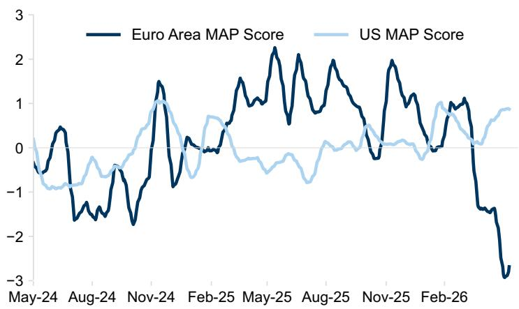

line

| Date    | Euro Area MAP Score | US MAP Score |
|---------|---------------------|--------------|
| May-24  | -0.5                | 0.1          |
| Aug-24  | -1.8                | -0.7         |
| Nov-24  | 1.5                 | 1.0          |
| Feb-25  | 0.2                 | 0.5          |
| May-25  | 2.3                 | -0.2         |
| Aug-25  | 1.8                 | 0.1          |
| Nov-25  | 2.0                 | -0.1         |
| Feb-26  | -1.5                | 0.8          |
| Apr-26  | -3.0                | 1.0          |

Source: GS Global Investment Research

Exhibit 53: Current Activity Index (CAI)   
GS Proprietary Index   
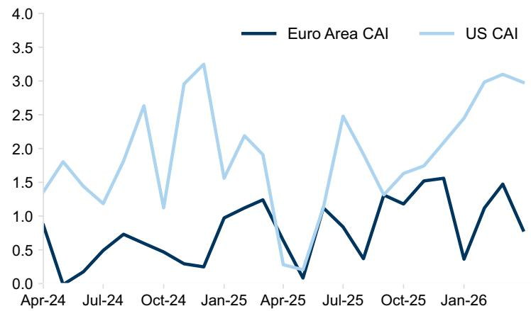

line

| Date    | Euro Area CAI | US CAI |
|---------|---------------|--------|
| Apr-24  | 0.9           | 1.4    |
| Jul-24  | 0.7           | 1.8    |
| Oct-24  | 0.3           | 2.6    |
| Jan-25  | 1.0           | 3.3    |
| Apr-25  | 0.1           | 0.3    |
| Jul-25  | 0.8           | 2.5    |
| Oct-25  | 1.5           | 1.7    |
| Jan-26  | 1.4           | 3.1    |

Source: GS Global Investment Research

Exhibit 55: GS Financial Conditions Index (GSFCI)   
GS Proprietary Index   
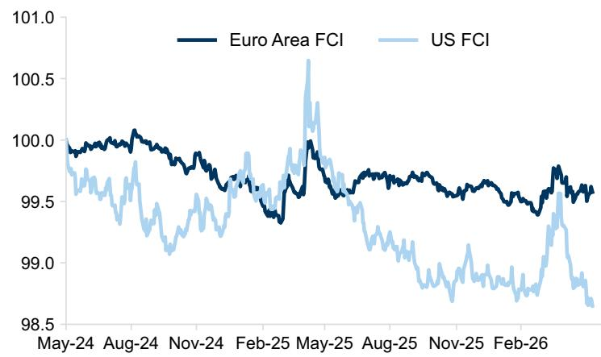

line

| Date    | Euro Area FCI | US FCI |
|---------|---------------|--------|
| May-24  | ~100.0        | ~99.8  |
| Aug-24  | ~100.1        | ~99.7  |
| Nov-24  | ~99.8         | ~99.5  |
| Feb-25  | ~99.5         | ~99.7  |
| May-25  | ~100.0        | ~100.7 |
| Aug-25  | ~99.7         | ~99.3  |
| Nov-25  | ~99.6         | ~98.8  |
| Feb-26  | ~99.8         | ~98.7  |

Source: GS Global Investment Research

# Disclosure Appendix

# Reg AC

We, Peter Oppenheimer, Sharon Bell, Guillaume Jaisson and Giovanni Ferrannini, hereby certify that all of the views expressed in this report accurately reflect our personal views, which have not been influenced by considerations of the firm's business or client relationships.

Unless otherwise stated, the individuals listed on the cover page of this report are analysts in GS' Global Investment Research division.

Contributing Authors: Peter Oppenheimer GS International, Sharon Bell GS International, Guillaume Jaisson GS International, Giovanni Ferrannini GS International.

Unless otherwise stated, the individuals listed in the Contributing Authors disclosure of this report are analysts in GS' Global Investment Research division.

# Disclosures

# MSCI disclosure

All MSCI data used in this report is the exclusive property of MSCI, Inc. (MSCI). Without prior written permission of MSCI, this information and any other MSCI intellectual property may not be reproduced or redisseminated in any form and may not be used to create any financial instruments or products or any indices. This information is provided on an “as is” basis, and the user of this information assumes the entire risk of any use made of this information. Neither MSCI, any of its affiliates nor any third party involved in, or related to, computing or compiling the data makes any express or implied warranties or representations with respect to this information (or the results to be obtained by the use thereof), and MSCI, its affiliates and any such third party hereby expressly disclaim all warranties of originality, accuracy, completeness, merchantability or fitness for a particular purpose with respect to any of this information. Without limiting any of the foregoing, in no event shall MSCI, any of its affiliates or any third party involved in, or related to, computing or compiling the data have any liability for any direct, indirect, special, punitive, consequential or any other damages (including lost profits) even if notified of the possibility of such damages. MSCI and the MSCI indexes are service marks of MSCI and its affiliates. The Global Industry Classification Standard (GICS) were developed by and is the exclusive property of MSCI and Standard & Poor’s. GICS is a service mark of MSCI and S&P and has been licensed for use by The GS Group.

# Equity basket disclosure

The ability to trade the basket(s) discussed in this research will depend upon market conditions, including liquidity and borrow constraints at the time of trade.

# Marquee disclosure

Marquee is a product of GS FICC and Equities. Any Marquee content linked in this report is not necessarily representative of GS Research views. If you need access to Marquee, please contact your GS salesperson or email the Marquee team at gs-marquee-sales@gs.com.

# Regulatory disclosures

# Disclosures required by United States laws and regulations

See company-specific regulatory disclosures above for any of the following disclosures required as to companies referred to in this report: manager or co-manager in a pending transaction; 1% or other ownership; compensation for certain services; types of client relationships; managed/co-managed public offerings in prior periods; directorships; for equity securities, market making and/or specialist role. GS trades or may trade as a principal in debt securities (or in related derivatives) of issuers discussed in this report.

The following are additional required disclosures: Ownership and material conflicts of interest: GS policy prohibits its analysts, professionals reporting to analysts and members of their households from owning securities of any company in the analyst's area of coverage. Analyst compensation: Analysts are paid in part based on the profitability of GS, which includes investment banking revenues. Analyst as officer or director: GS policy generally prohibits its analysts, persons reporting to analysts or members of their households from serving as an officer, director or advisor of any company in the analyst's area of coverage. Non-U.S. Analysts: Non-U.S. analysts may not be associated persons of GS & Co. LLC and therefore may not be subject to FINRA Rule 2241 or FINRA Rule 2242 restrictions on communications with a subject company, public appearances and trading in securities covered by the analysts.

# Additional disclosures required under the laws and regulations of jurisdictions other than the United States

The following disclosures are those required by the jurisdiction indicated, except to the extent already made above pursuant to United States laws and regulations. Australia: GS Australia Pty Ltd and its affiliates are not authorised deposit-taking institutions (as that term is defined in the Banking Act 1959 (Cth)) in Australia and do not provide banking services, nor carry on a banking business, in Australia. This research, and any access to it, is intended only for “wholesale clients” within the meaning of the Australian Corporations Act, unless otherwise agreed by GS. In producing research reports, members of Global Investment Research of GS Australia may attend site visits and other meetings hosted by the companies and other entities which are the subject of its research reports. In some instances the costs of such site visits or meetings may be met in part or in whole by the issuers concerned if GS Australia considers it is appropriate and reasonable in the specific circumstances relating to the site visit or meeting. To the extent that the contents of this document contains any financial product advice, it is general advice only and has been prepared by GS without taking into account a client’s objectives, financial situation or needs. A client should, before acting on any such advice, consider the appropriateness of the advice having regard to the client’s own objectives, financial situation and needs. A copy of certain GS Australia and New Zealand disclosure of interests and a copy of GS’ Australian Sell-Side Research Independence Policy Statement are available at: https://www.goldmansachs.com/disclosures/australia-new-zealand/index.html. Brazil: Disclosure information in relation to CVM Resolution n. 20 is available at https://www.gs.com/worldwide/brazil/area/gir/index.html. Where applicable, the Brazil-registered analyst primarily responsible for the content of this research report, as defined in Article 20 of CVM Resolution n. 20, is the first author named at the beginning of this report, unless indicated otherwise at the end of the text. Canada: This information is being provided to you for information purposes only and is not, and under no circumstances should be construed as, an advertisement, offering or solicitation by GS & Co. LLC for purchasers of securities in Canada to trade in any Canadian security. GS & Co. LLC is not registered as a dealer in any jurisdiction in Canada under applicable Canadian securities laws and generally is not permitted to trade in Canadian securities and may be prohibited from selling certain securities and products in certain jurisdictions in Canada. If you wish to trade in any Canadian securities or other products in Canada please contact GS Canada Inc., an affiliate of The GS Group Inc., or another registered Canadian dealer. Hong Kong: Further information on the securities of covered companies referred to in this research may be obtained on request from GS (Asia) L.L.C. India: Further information on the subject company or companies referred to in this research may be obtained from GS (India) Securities Private Limited, Research Analyst - SEBI Registration Number INH000001493, 10th Floor, Ascent-Worli, Sudam Kalu Ahire Marg, Worli, Mumbai-400 025, India, Corporate Identity Number U74140MH2006FTC160634, Phone +91 22 6616 9000, Fax +91 22 6616 9001. GS may beneficially own 1% or more of the securities (as such term is defined in clause 2 (h) the Indian Securities Contracts (Regulation) Act, 1956) of the subject company or companies referred to in this research report. Investment in securities market are subject to market risks. Read all the related documents carefully before investing. Registration granted by SEBI and certification from NISM in no way guarantee performance of the intermediary or provide any assurance of returns to investors. GS (India) Securities Private Limited compliance officer and investor grievance contact details can be found at:

https://www.goldmansachs.com/worldwide/india/documents/Grievance-Redressal-and-Escalation-Matrix.pdf, and a copy of the annual audit compliance report can be found at this link: https://publishing.gs.com/content/site/india-annual-compliance-report.html. Japan: See below. Korea: This research, and any access to it, is intended only for “professional investors” within the meaning of the Financial Services and Capital Markets Act, unless otherwise agreed by GS. Further information on the subject company or companies referred to in this research may be obtained from GS (Asia) L.L.C., Seoul Branch. New Zealand: GS New Zealand Limited and its affiliates are neither “registered banks” nor “deposit takers” (as defined in the Reserve Bank of New Zealand Act 1989) in New Zealand. This research, and any access to it, is intended for “wholesale clients” (as defined in the Financial Advisers Act 2008) unless otherwise agreed by GS. A copy of certain GS Australia and New Zealand disclosure of interests is available at: https://www.goldmansachs.com/disclosures/australia-new-zealand/index.html. Russia: Research reports distributed in the Russian Federation are not advertising as defined in the Russian legislation, but are information and analysis not having product promotion as their main purpose and do not provide appraisal within the meaning of the Russian legislation on appraisal activity. Research reports do not constitute a personalized investment recommendation as defined in Russian laws and regulations, are not addressed to a specific client, and are prepared without analyzing the financial circumstances, investment profiles or risk profiles of clients. GS assumes no responsibility for any investment decisions that may be taken by a client or any other person based on this research report. Singapore: GS (Singapore) Pte. (Company Number: 198602165W), which is regulated by the Monetary Authority of Singapore, accepts legal responsibility for this research, and should be contacted with respect to any matters arising from, or in connection with, this research. Taiwan: This material is for reference only and must not be reprinted without permission. Investors should carefully consider their own investment risk. Investment results are the responsibility of the individual investor. United Kingdom: Persons who would be categorized as retail clients in the United Kingdom, as such term is defined in the rules of the Financial Conduct Authority, should read this research in conjunction with prior GS on the covered companies referred to herein and should refer to the risk warnings that have been sent to them by GS International. A copy of these risks warnings, and a glossary of certain financial terms used in this report, are available from GS International on request.

European Union and United Kingdom: Disclosure information in relation to Article 6 (2) of the European Commission Delegated Regulation (EU) (2016/958) supplementing Regulation (EU) No 596/2014 of the European Parliament and of the Council (including as that Delegated Regulation is implemented into United Kingdom domestic law and regulation following the United Kingdom's departure from the European Union and the European Economic Area) with regard to regulatory technical standards for the technical arrangements for objective presentation of investment recommendations or other information recommending or suggesting an investment strategy and for disclosure of particular interests or indications of conflicts of interest is available at https://www.gs.com/disclosures/europeanpolicy.html which states the European Policy for Managing Conflicts of Interest in Connection with Investment Research.

Japan: GS Japan Co., Ltd. is a Financial Instrument Dealer registered with the Kanto Financial Bureau under registration number Kinsho 69, and a member of Japan Securities Dealers Association, Financial Futures Association of Japan Type II Financial Instruments Firms Association, and Investment Management Association of Japan. Sales and purchase of equities are subject to commission pre-determined with clients plus consumption tax. See company-specific disclosures as to any applicable disclosures required by Japanese stock exchanges, the Japanese Securities Dealers Association or the Japanese Securities Finance Company.

# Global product; distributing entities

GS Global Investment Research produces and distributes research products for clients of GS on a global basis. Analysts based in GS offices around the world produce research on industries and companies, and research on macroeconomics, currencies, commodities and portfolio strategy. This research is disseminated in Australia by GS Australia Pty Ltd (ABN 21 006 797 897); in Brazil by GS do Brasil Corretora de Títulos e Valores Mobiliários S.A.; Public Communication Channel GS Brazil: 0800 727 5764 and / or contatogoldmanbrasil@gs.com. Available Weekdays (except holidays), from 9am to 6pm. Canal de Comunicação com o Público GS Brasil: 0800 727 5764 e/ou contatogoldmanbrasil@gs.com. Horário de funcionamento: segunda-feira à sexta-feira (exceto feriados), das 9h às 18h; in Canada by GS & Co. LLC; in Hong Kong by GS (Asia) L.L.C.; in India by GS (India) Securities Private Ltd.; in Japan by GS Japan Co., Ltd.; in the Republic of Korea by GS (Asia) L.L.C., Seoul Branch; in New Zealand by GS New Zealand Limited; in Russia by OOO GS; in Singapore by GS (Singapore) Pte. (Company Number: 198602165W); and in the United States of America by GS & Co. LLC. GS International has approved this research in connection with its distribution in the United Kingdom.

GS International (“GSI”), authorised by the Prudential Regulation Authority (“PRA”) and regulated by the Financial Conduct Authority (“FCA”) and the PRA, has approved this research in connection with its distribution in the United Kingdom.

European Economic Area: GS Bank Europe SE (“GSBE”) is a credit institution incorporated in Germany and, within the Single Supervisory Mechanism, subject to direct prudential supervision by the European Central Bank and in other respects supervised by German Federal Financial Supervisory Authority (Bundesanstalt für Finanzdienstleistungsaufsicht, BaFin) and Deutsche Bundesbank and disseminates research within the European Economic Area.

# General disclosures

This research is for our clients only. Other than disclosures relating to GS, this research is based on current public information that we consider reliable, but we do not represent it is accurate or complete, and it should not be relied on as such. The information, opinions, estimates and forecasts contained herein are as of the date hereof and are subject to change without prior notification. We seek to update our research as appropriate, but various regulations may prevent us from doing so. Other than certain industry reports published on a periodic basis, the large majority of reports are published at

irregular intervals as appropriate in the analyst's judgment.

GS conducts a global full-service, integrated investment banking, investment management, and brokerage business. We have investment banking and other business relationships with a sUBStantial percentage of the companies covered by Global Investment Research. GS & Co. LLC, the United States broker dealer, is a member of SIPC (https://www.sipc.org).

Our salespeople, traders, and other professionals may provide oral or written market commentary or trading strategies to our clients and principal trading desks that reflect opinions that are contrary to the opinions expressed in this research. Our asset management area, principal trading desks and investing businesses may make investment decisions that are inconsistent with the recommendations or views expressed in this research.

We and our affiliates, officers, directors, and employees will from time to time have long or short positions in, act as principal in, and buy or sell, the securities or derivatives, if any, referred to in this research, unless otherwise prohibited by regulation or GS policy.

The views attributed to third party presenters at GS arranged conferences, including individuals from other parts of GS, do not necessarily reflect those of Global Investment Research and are not an official view of GS.

Any third party referenced herein, including any salespeople, traders and other professionals or members of their household, may have positions in the products mentioned that are inconsistent with the views expressed by analysts named in this report.

This research is focused on investment themes across markets, industries and sectors. It does not attempt to distinguish between the prospects or performance of, or provide analysis of, individual companies within any industry or sector we describe.

Any trading recommendation in this research relating to an equity or credit security or securities within an industry or sector is reflective of the investment theme being discussed and is not a recommendation of any such security in isolation.

This research is not an offer to sell or the solicitation of an offer to buy any security in any jurisdiction where such an offer or solicitation would be illegal. It does not constitute a personal recommendation or take into account the particular investment objectives, financial situations, or needs of individual clients. Clients should consider whether any advice or recommendation in this research is suitable for their particular circumstances and, if appropriate, seek professional advice, including tax advice. The price and value of investments referred to in this research and the income from them may fluctuate. Past performance is not a guide to future performance, future returns are not guaranteed, and a loss of original capital may occur. Fluctuations in exchange rates could have adverse effects on the value or price of, or income derived from, certain investments.

Certain transactions, including those involving futures, options, and other derivatives, give rise to sUBStantial risk and are not suitable for all investors. Investors should review current options and futures disclosure documents which are available from GS sales representatives or at https://www.theocc.com/about/publications/character-risks.jsp and https://www.goldmansachs.com/disclosures/cftc\_fcm\_disclosures. Transaction costs may be significant in option strategies calling for multiple purchase and sales of options such as spreads. Supporting documentation will be supplied upon request.

Differing Levels of Service provided by Global Investment Research: The level and types of services provided to you by GS Global Investment Research may vary as compared to that provided to internal and other external clients of GS, depending on various factors including your individual preferences as to the frequency and manner of receiving communication, your risk profile and investment focus and perspective (e.g., marketwide, sector specific, long term, short term), the size and scope of your overall client relationship with GS, and legal and regulatory constraints. As an example, certain clients may request to receive notifications when research on specific securities is published, and certain clients may request that specific data underlying analysts' fundamental analysis available on our internal client websites be delivered to them electronically through data feeds or otherwise. No change to an analyst's fundamental research views (e.g., ratings, price targets, or material changes to earnings estimates for equity securities), will be communicated to any client prior to inclusion of such information in a research report broadly disseminated through electronic publication to our internal client websites or through other means, as necessary, to all clients who are entitled to receive such reports.

All research reports are disseminated and available to all clients simultaneously through electronic publication to our internal client websites. Not all research content is redistributed to our clients or available to third-party aggregators, nor is GS responsible for the redistribution of our research by third party aggregators. For research, models or other data related to one or more securities, markets or asset classes (including related services) that may be available to you, please contact your GS representative or go to https://research.gs.com.

Disclosure information is also available at https://www.gs.com/research/hedge.html or from Research Compliance, 200 West Street, New York, NY 10282.

# © 2026 GS.

You are permitted to store, display, analyze, modify, reformat, and print the information made available to you via this service only for your own use. You may not resell or reverse engineer this information to calculate or develop any index for disclosure and/or marketing or create any other derivative works or commercial product(s), data or offering(s) without the express written consent of GS. You are not permitted to publish, transmit, or otherwise reproduce this information, in whole or in part, in any format to any third party without the express written consent of GS. This foregoing restriction includes, without limitation, using, extracting, downloading or retrieving this information, in whole or in part, to train or finetune a machine learning or artificial intelligence system, or to provide or reproduce this information, in whole or in part, as a prompt or input to any such system.