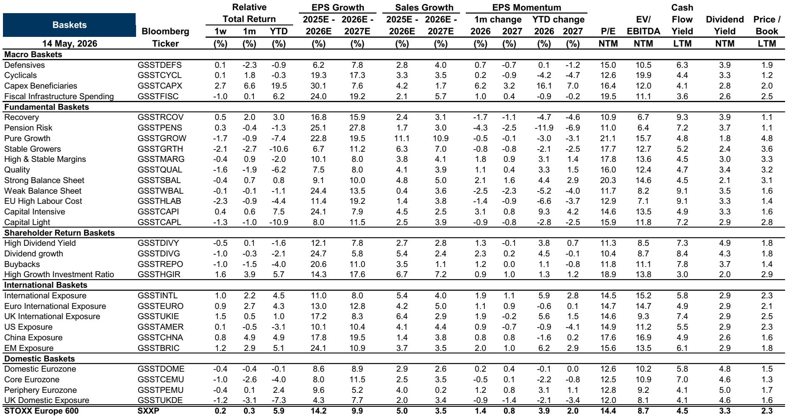
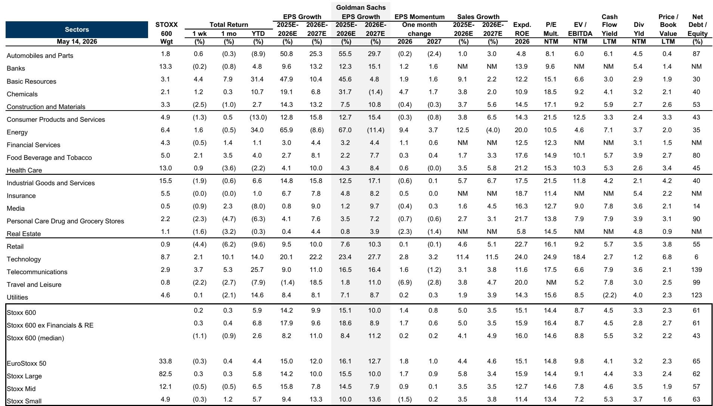

# European Earnings Are Beating, but the Market No Longer Believes the Signal

The 1Q26 earnings season in Europe is largely complete, with 75% of market capitalization having reported. On the surface, the numbers look respectable: aggregate EPS surprised by approximately 2.3% on a cap-weighted basis, only slightly below the historical average. Financials and commodities continue to lead positive surprises, and select consumer names like Puma and Adidas delivered beats that were rewarded with share price gains of 5% and 8% on reporting day.

Yet a careful reading of the data reveals something more troubling beneath the surface. The market is punishing misses aggressively while barely rewarding beats. Companies guiding below consensus are seeing virtually no incremental penalty, while those guiding above are rewarded far less than in prior seasons. This asymmetry is not noise—it is a signal that the market has lost faith in the reliability of earnings estimates as a guide to future value.

The core argument of this article is straightforward: the 1Q26 earnings season reveals that European equity markets are entering a regime where earnings data is becoming less informative for price discovery. This is not a temporary phenomenon. It reflects a structural shift in how macro uncertainty, sector concentration, and capital allocation dynamics interact to distort the traditional feedback loop between corporate performance and market pricing.

## The Market Is Discounting Earnings Guidance Because Macro Uncertainty Has Broken the Signal

The most striking finding in the late-season data concerns the market's reaction to guidance. Of the roughly 140 companies that have issued 2026 guidance on at least one key financial item, approximately half provided guidance below analysts' expectations. Historically, such negative guidance would trigger a meaningful penalty on reporting day. In this season, those companies performed in line with the market.

On the other side, companies guiding above consensus outperformed by less than 1%, compared to more than 2% during the prior earnings season. The asymmetry is clear: the penalty for bad news has diminished, and the reward for good news has collapsed.

This pattern suggests that investors are increasingly treating management guidance as unreliable. When macro conditions shift rapidly—due to geopolitical shocks, interest rate volatility, or supply chain reconfiguration—the assumptions embedded in corporate guidance lose their anchoring power. Managers themselves are operating with less visibility, and the market knows it.

The implication is profound. If guidance is no longer a credible signal, then the entire earnings season becomes less useful for stock selection. Investors must look elsewhere for differentiation: cash flow delivery, capital allocation discipline, and exposure to secular demand drivers become more important than quarterly earnings beats.

## Commodities and Financials Are Driving Aggregate Upgrades, Creating a Dangerous Concentration Risk

Aggregate earnings upgrades for the STOXX 600 stand at approximately 4% since the outbreak of the Iran conflict. But this headline figure masks a dangerous concentration. Energy and Basic Resources are the primary drivers, with Energy alone showing a 57% upgrade since the war began. Chemicals producers, able to pass through higher costs, have also seen positive revisions of 3%.

Outside of commodities, the picture is far weaker. Consumer-facing sectors like Autos, Travel and Leisure, and Luxury are experiencing significant downgrades. The market's aggregate resilience is therefore a function of sector composition rather than broad-based corporate health.

This concentration creates a vulnerability for index-level investors. If commodity prices stabilize or decline, the earnings upgrade cycle could reverse sharply, dragging down aggregate market performance. The data suggests that investors who are long the European market purely on the basis of aggregate earnings momentum are implicitly making a leveraged bet on commodity prices.

The strategic question for allocators is whether they want to be compensated for that concentration risk. The answer depends on one's view of commodity supply dynamics, geopolitical escalation, and the energy transition timeline. But the data makes clear that the current earnings upgrade cycle is not broad-based, and that fact should inform portfolio construction.

## Capital Goods Orders Are Strong but Conversion Is Slowing, Signaling a Potential Inventory Cycle Risk

Capital goods companies have reported strong order momentum, with 77% of companies under coverage surprising to the upside on orders. This is driven largely by AI and data center demand, which continues to fuel investment in infrastructure, power generation, and industrial equipment.

However, a critical second-order signal is emerging. Approximately 70% of companies missed expectations on the conversion of orders into sales, and roughly 50% showed margins under pressure from input costs. This suggests that order books may be inflated by pre-buy activity—customers placing orders early to secure supply, but not necessarily converting those orders into revenue at the expected pace.

If this pre-buy dynamic is indeed distorting order data, then the current strength in capital goods is borrowing from future demand. When the pre-buy cycle ends, order books could normalize or even contract, creating a negative surprise for revenue and margins.

The implication for investors is that capital goods companies with strong order books are not automatically attractive. The key differentiator will be the quality of the order book: how much is genuine end-demand versus pre-buy, and how quickly orders convert to cash. Companies that can demonstrate high conversion rates and stable margins are likely to outperform those that simply report strong order momentum.

## The Report Raises a Critical Question That It Does Not Fully Answer

The data shows that earnings beats are concentrated, guidance is being discounted, and order conversion is slowing. But the report leaves an important question unresolved: is this a cyclical phenomenon that will normalize as macro uncertainty recedes, or is it a structural shift in how markets process information?

Consider the evidence on both sides. In favor of a cyclical interpretation, the current macro environment is unusually volatile due to the Iran conflict, interest rate uncertainty, and fiscal policy shifts. As these factors stabilize, management guidance may regain credibility, and the market may return to rewarding earnings beats more symmetrically.

In favor of a structural interpretation, several long-term trends are reducing the informativeness of earnings data. The rise of passive investing means that stock prices are less sensitive to company-specific news. The increasing complexity of global supply chains makes it harder for managers to forecast accurately. And the growing importance of intangible assets, which are poorly captured by traditional accounting, means that earnings may be a less complete measure of corporate value creation.

The report does not resolve this tension, and for good reason: the data is too recent to distinguish between cyclical and structural forces. But this ambiguity is itself useful. It suggests that investors should not assume a return to normal. They should build portfolios that are robust to both scenarios—meaning they should avoid over-relying on earnings guidance as a signal and should favor companies with strong cash flow generation and clear capital allocation strategies.

## A Decision Framework for Navigating the Post-Guidance Regime

For readers who manage portfolios, the earnings season data points to a specific decision framework. The traditional approach of screening for earnings beats and guidance upgrades is likely to underperform in the current environment. Instead, investors should prioritize three dimensions:

First, focus on cash flow delivery rather than earnings surprises. The data shows that European Big Oils, for example, are beating on operating cash flow by 9%, offsetting higher capex and driving solid free cash flow. Cash flow is harder to manipulate and less sensitive to accounting assumptions. Companies that consistently convert earnings into cash are more likely to create shareholder value over time.

Second, assess the quality of order books in capital goods. The pre-buy dynamic suggests that not all order momentum is equal. Investors should ask: what is the conversion rate of orders to sales? Are margins stable or under pressure? Is the order book diversified across end markets, or concentrated in a single demand driver like AI infrastructure?

Third, evaluate sector concentration risk in aggregate earnings upgrades. If an investor's portfolio is overweight energy and basic resources because of earnings momentum, they should explicitly assess whether they are being compensated for the commodity price risk embedded in that position. If not, they should consider hedging or rotating into sectors with more sustainable upgrade drivers.

This framework is not a sUBStitute for fundamental analysis, but it provides a structured way to interpret the earnings season data without over-relying on guidance, which the market has shown it no longer trusts.

## The Full Picture Requires Deeper Data Than This Article Can Provide

The analysis presented here is based on a single report covering the late-season update for 1Q26 European earnings. The data on sector-level surprises, guidance reactions, and order conversion rates is rich, but it is only a snapshot. To fully understand the implications, one needs access to the original charts, the historical context, and the detailed sector-level breakdowns that the full report provides.

For example, the report includes exhibits showing the average price reaction to guidance surprises over multiple quarters, the evolution of EPS surprises since 2010, and the sector-level breakdown of earnings revisions since the Iran war began. These charts reveal patterns that are difficult to discern from summary statistics alone.

Join the community to read the full report and review the original charts. The data will help you make more informed decisions about sector allocation, stock selection, and risk management in a market where earnings signals are becoming less reliable.

*This article is for learning and discussion only and does not constitute investment advice.*

Personal reading notes and learning share only. Not investment advice.

