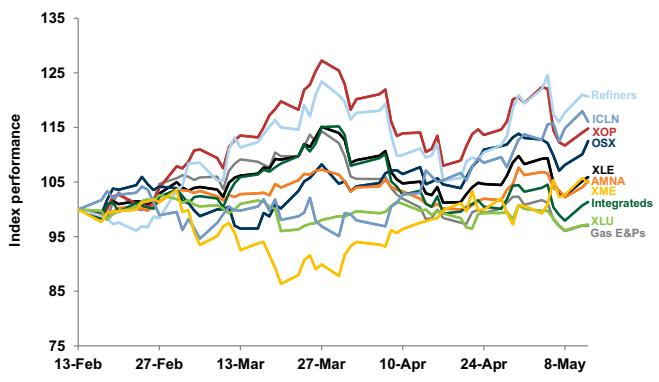
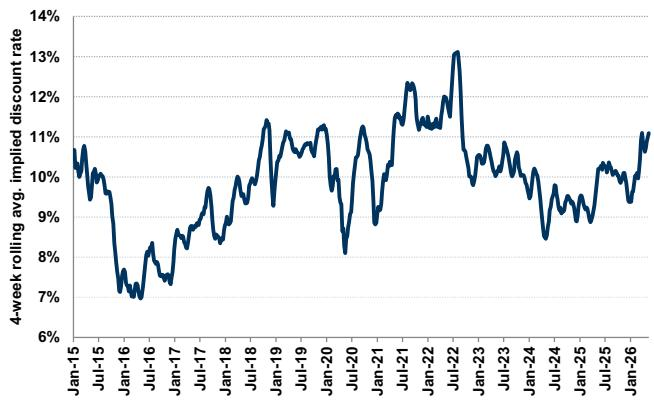
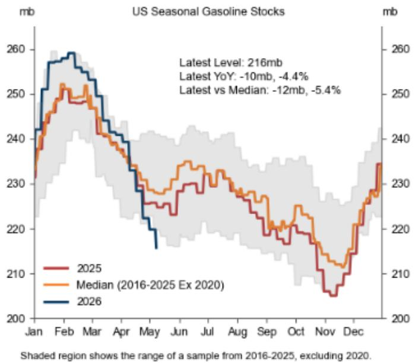
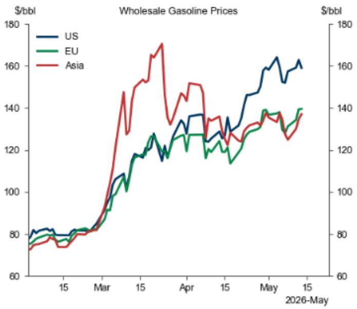
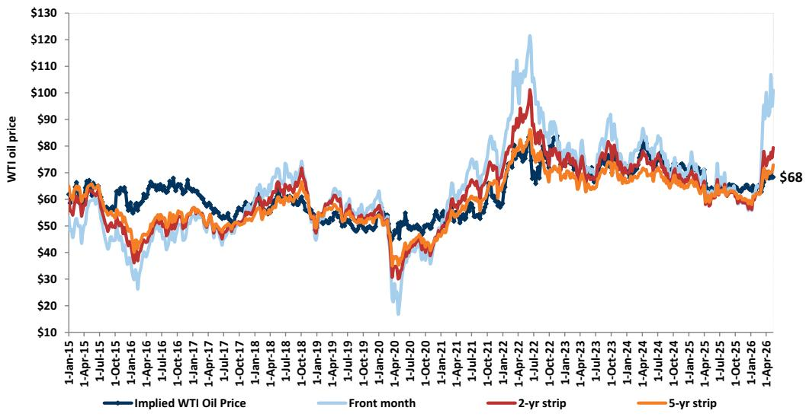
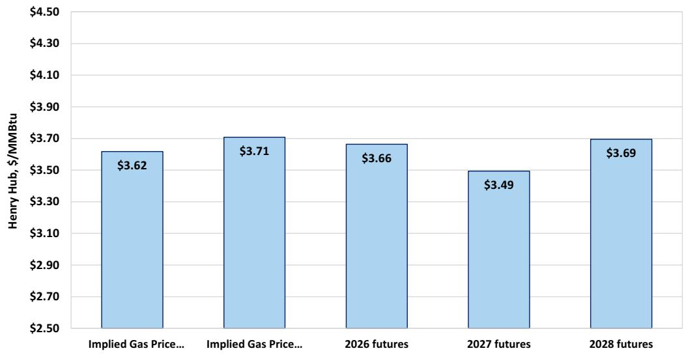
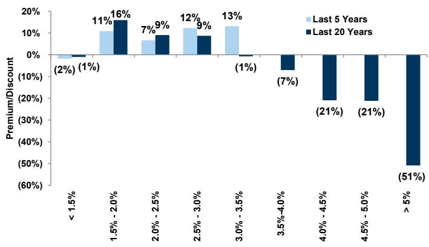
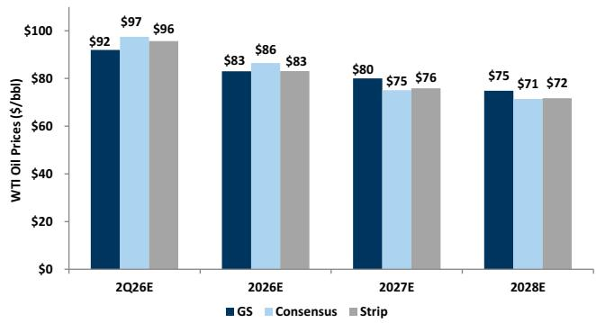
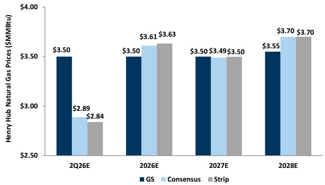
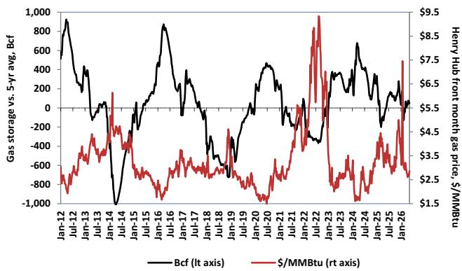

# Energy, Utilities & Mining Pulse: Investors Asking: What Stocks Led and Lagged During Earnings Season — And Now What?

We have seen stocks move through the 1Q26 earnings cycle as the market reacted to earnings results and overall trends over the past month. This week in the Pulse, we ask our senior analyst team to identify the best and worst share price performances within their coverage through 1Q earnings (April 15th-May 14th), and what they see as drivers of respective stock moves. Teams also discuss how they anticipate stocks to perform post 1Q26 as we move further through 2Q. Buy-rated stocks discussed inside include CVE, COP, HAL, FTI, TOU, KGS, LNG, NEE, NRG, ENPH, NUE, and FCX.

# Integrated & Refining:

# Outperformer: CVE (+19%)

After a strong 1Q26 print, we expect Buy-rated Cenovus Energy (CVE) to continue to outperform Canadian Oil peers, benefitting from strong operational results and capturing commodity price upside. The stock offers attractive total return potential of \~21% from current levels, trading at a \~9%/10% free cash flow yield in 2027/2028 at \$75/b Brent. We look for a production and free cash flow uplift, as West White Rose comes online in 3Q26, with further upside from a faster-than-expected integration of Christina Lake North, where initial redevelopment well results are exceeding expectations. Although R&M represents a smaller part of the portfolio, we note tight supply/demand balances support a constructive margin environment and earnings momentum. At current commodity prices, management also expects the pace of deleveraging to accelerate significantly, with a short-term bias for debt reduction over buybacks.

# Underperformer: COP (0%)

We have been surprised by the relative weakness in ConocoPhillips (COP) following results and believe this presents an opportunity. Those more bearish have expressed concern about weaker U.S. gas realizations, elevated spending on Willow, and the lighter buyback in Q1. With roughly \~24% total return from current levels, we reiterate our Buy-rating on the company, estimating a \~20-25% free cash flow per share CAGR through 2030, driven by four major growth projects (NFE, NFS, Port Arthur, Willow) alongside \~\$1 bn in cost reductions and margin enhancements. After a successful winter construction season, we note Willow is now 50% complete. While some investors raise questions around recent Middle East disruptions, we expect the impact is contained, with Qatar accounting for only \~3% of the company's total production, and highlight other positions in Alaska, the Lower 48, and Canada, which offer a lower geopolitical risk profile compared to global peers. We note that COP is

# Neil Mehta

+1(212)357-4042 | neil.mehta@gs.com
GS & Co. LLC

# Brian Lee, CFA

+1(917)343-3110 | brian.k.lee@gs.com
GS & Co. LLC

# John Mackay

+1(212)357-5379 |
john.mackay@gs.com
GS & Co. LLC

# Carly Davenport

+1(212)357-1914 | carly.davenport@gs.com GS & Co. LLC

# Ati Modak

+1(212)902-9365 | ati.modak@gs.com
GS & Co. LLC

# Nick Cash

+1(212)357-6372 | nick.cash@gs.com
GS & Co. LLC

# Alexa Petrick

+1(917)343-9472 | alexa.petrick@gs.com GS & Co. LLC on the US Conviction List.

# Oil Services:

# Outperformer: HAL (+10%)

Through 1Q26 earnings we have seen dispersion between stocks within the oilfield services sector. Since the start of 1Q earnings, we have seen HAL shares outperform in our OFS coverage, as the market continues to favor the stock due to the company's more balanced exposure between North America and international regions compared to other OFS companies. With the company's revenue exposure of \~60/40% between international and North America respectively, we have seen HAL benefit from positive sentiment and activity signals in US land amid a sustained higher commodity price environment, as well as positive sentiment around the magnitude of services work that will be required in the Middle East after the end of the disruption. With the company reporting strong 1Q26 results vs consensus, HAL shares appreciated over the past several weeks, and we continue to highlight the stock as a means to gain balanced exposure to positive activity signals in both North America and international regions.

# Underperformer: FTI (+2%)

Conversely, we have seen shares of FTI underperform our OFS coverage, as the market has favored oilfield services stocks with higher beta to commodity prices and direct rig additions through 1Q26 earnings. With FTI's steady order cadence and backlog, the market has looked to OFS names with higher exposure to direct activity levels in North America and other international regions amid the rapidly changing macro environment as commodity prices remain elevated compared to previous expectations. Despite strong backlog and order expectations for 2026 earnings, we have seen FTI shares underperform the rest of our OFS coverage as a result. We continue to highlight FTI as a means of exposure to strong earnings and steady order growth, as management sees the potential for increasing projects through the end of the decade as they anticipate increasing spend from operators on offshore and sUBSea infrastructure for production.

# E&P:

# Outperformer: TOU (+10%)

TOU has outperformed peers since the start of 1Q earnings driven by (1) solid 1Q26 earnings results, (2) strengthening commodity prices following the liquids pricing uplift following the Middle East conflict and AECO improvements following a milder Pacific Northwest winter, and (3) continued focus on margin improvements through cost optimizations and price realizations. While the natural gas macro environment has remained volatile, TOU’s long-term strategy of focusing on optimizing the company’s existing asset base and driving down costs over time through facility buildout has remained consistent. In addition, TOU receives benefits to natural gas realizations through the company’s ramping direct LNG pricing exposure. We continue to see positive momentum to the stock from current levels as the company reiterates confidence in (1) operational execution and facility buildout, (2) potential for a data center co-location opportunity given TOU’s vertically integrated business model and deep inventory of supply, and (3) uplift from recent strengthening liquids pricing. We highlight recent takeaways from meetings with management on the road in Dallas here.

# Underperformer: NFG (-9%)

NFG has underperformed E&P peers since the start of 1Q earnings following weaker F2Q26 production results relative to expectations. Alongside F2Q26 results, NFG announced that some lower Utica wells underperformed expectations on a pad developed with Gen 4 Lower Utica wells and Upper Utica wells. In addition, those more cautious on NFG highlight a potentially more challenged Pennsylvania regulatory environment and note NFG's upcoming Supply Corp and Utility rate cases. As Henry Hub pricing has continued to de-rate into the shoulder season following strong winter weather, the natural gas forward curve has further de-rated. Lastly, we note that the recent stock price softness is following a period of meaningful stock price improvement in 2025 versus peers.

# Midstream:

# Outperformer: KGS (+21%)

KGS continues to be a top performer among the midstream sector (+21% since 4/15 vs. AMNA +8%) on strong underlying business strength and line of sight to meaningful long term growth. With 1Q26 earnings, the company updated 2026 guidance for its DPS acquisition, a step into the power market. EBITDA guidance came in line with expectations, though the company’s long term growth outlook and overall power deployment backlog was higher than anticipated. KGS expects to reach a full 2 GW for its entire fleet by 2030 through ratable growth through the end of the decade (300-500 MW per year) with 261 MW already on order. Meanwhile, its compression business also remains robust with new unit orders extending into 2028 and the beginning of 2029 highlighting ongoing tightness of supply in a strong demand environment. We expect we could see upside to our growth expectations given management’s track record of strong execution and conservatism. Overall, compression margin strength and a healthy power add backlog support further outperformance of the stock with focus on execution, commercialization, and balance sheet strength from here.

# Underperformer: LNG (-6%)

Following outperformance since the start of the conflict in the Middle East up until Cheniere reported earnings (LNG +10% vs AMNA +3%), LNG underperformed post earnings (-8% vs AMNA +4% since 5/7). Specifically, the stock traded down post earnings despite solid underlying execution on both 1Q26 results (EBITDA was +2%/+13% vs GS/consensus) and the 2026 EBITDA guidance raise (FY26 EBITDA guidance is now \$7.5b at the midpoint vs \$7b prior). That said, we believe both the beat in the quarter and 2026 guidance raise were largely expected by investors given improvement in global gas margins and solid commissioning progress on CCL Stage 3. Thus, although we see the stock’s underperformance post earnings as overdone, we acknowledge that the bar was high going into the release on the back of YTD outperformance and that the lack of formal commercial updates and softer sequential buybacks were modest disappointments. Looking forward, we maintain our constructive view on LNG, as we see a clear line of sight to executing \$30/sh of DCF in the medium-term, supported by the company’s high-quality, 95%+ contracted take-or-pay contracts and solid capital return program. We will look for updates on near-term positive growth catalysts (new long-term contracts, converting brownfield expansion at both Corpus and SPL) to support performance from here.

# Utilities:

# Outperformer: NEE (+4%)

We believe NextEra's (NEE) outperformance since 1Q earnings has been driven by (1) stronger than consensus results that demonstrated $10\%$ YoY EPS growth vs. Street average $8\%$ EPS growth YoY through 2029 along with a 4 GW addition to the backlog, which is above historical levels and expected to sustain going forward, (2) relatively advantaged positioning for the company from a regulatory perspective, with less perceived election/affordability risk versus a number of other areas in the US, in particular deregulated markets like PJM, and (3) a constructive view of the near-term catalyst path, with potential for a large load announcement this year at FPL, as well as potential firming of previous announcements around data center hUBS, particularly in Texas, around the gas build out. We remain constructive on NEE here, though we recognize we have less absolute upside to our price target following the stock's strong run, but we continue to see the stock offering a defensive hedge against regulatory risks given the regulatory backdrop in Florida with constructive rate case outcomes and potential for data center growth. We forecast $10\%$ EPS growth on average for NEE through 2030, and we see upside risk to consensus which prices $8\%$ average EPS growth in the coming years.

# Underperformer: NRG (-21%)

We believe NRG's underperformance since 1Q earnings has been driven by (1) weaker 1Q results, with mild weather and weaker pricing in Texas weighing on results, without the offset of strong PJM pricing coming through due to the timing of the close of the LS Power assets transaction, (2) a shift in sentiment around Texas broadly, where NRG is still heavily exposed, that weaker prices on a real time basis and in the forward curves are indicative of load growth not materializing as planned and driving a view that prices could be lower for longer in ERCOT, and (3) continued regulatory/policy uncertainty in PJM, which is now important for NRG following the LS Power assets acquisition, driving questions around newbuild and how much large load will ultimately materialize over what timeframe in PJM. We see valuation as compelling at current levels for NRG, with the stock trading at about 7.5x EV/EBITDA on 2027 and a $12\%$ FCF yield. Moreover, we see the fundamentals of the business as intact and expect any weakness in Texas to be largely offset by strength in pricing in PJM, and still see potential for the company to announce its targeted at least 1 GW of data center deals this year (likely in Texas), which we believe should be positive catalysts for shares.

# Clean Tech:

# Outperformer: ENPH (+46%)

Within our Clean Tech coverage, ENPH has been the top performer since 1Q26 earnings kicked off. We attribute this strength to the company's continued focus on growth drivers in 2H26 and beyond, including new product launches around batteries, its IQ9 inverter for the C&I market, and traction with prepaid leases. Additionally, given the company's strong safe harboring activity to-date, in conjunction with its peer mostly leveraging the physical work test, investors have queried if ENPH could be taking market share within the TPO market. Lastly, we believe there is a growing focus on the opportunity for solid-state transformers, especially following our recent investor call with management, which provided additional clarity on the market opportunity.

# Underperformer: PNR (-15%)

Conversely, PNR has been the laggard in our Clean Tech coverage despite relatively solid 1Q26 earnings results that included a modest raise to its FY2026 adj. EPS guidance. However, we note that the company only raised the bottom-end of its adj. EPS guidance, while also slightly lowering the low-end of its topline growth guidance. As a result, we attribute the weakness to concerns around end market demand, particularly within the pool segment given macro conditions that are yet to see much material improvement. We note that other water companies within our coverage have seen similar underperformance despite reporting relatively solid results, suggesting a high bar to start the year.

# Metals & Mining:

# Outperformer: NUE (+23%)

NUE has outperformed over the past month as the company posted a meaningfully better than expected quarter across all metrics and constructive 2Q commentary. NUE, being the largest steel producer in the US, has seen the most incremental market share capture from imports in 1Q26 as the company grew shipments qoq/yoy +20%/+9% while also benefiting from pricing tailwinds. Despite the positive price performance, we continue to see upside to NUE as metal spreads widen, which have already expanded \~12% qoq. We expect this expansion to flow directly to the bottom line, accelerating earnings in 2Q and 3Q which will drive upward estimate revisions. We continue to highlight NUE as one of our top picks as a result of favorable macro and fundamental tailwinds.

# Underperformer: FCX (-4%)

FCX underperformed over the past month as a result of the revision to the trajectory of the Grasberg ramp. The company noted an issue with the restart on the 1Q26 earnings call, which resulted in a delayed ramp up of the Grasberg Block Cave which is now expected to exit 2026 at \~65% capacity vs. \~85% prior. The impact was a reduction of roughly \~600mn lbs. between 2026-2028. We note that while near-term production is impacted, the lbs. are merely delayed rather than permanently lost. Still, between FCX's earnings date through the 5/7 trough, FCX declined (\~21%) while copper prices declined (\~5%). Over the past 7 days, de-escalation optimism and China destocking have fueled a \~10% rally in copper driving a \~20% rally in FCX as price appreciation of the commodity offset the EBITDA loss from the production cut. We continue to view that FCX will trade in line with commodity prices, albeit, at a rerated multiple until investors gain confidence in the new production trajectory which we believe would warrant a multiple re-rating and provide more upside to the equity.

# Editor's Choice Charts

Exhibit 1: Energy, Utilities & Mining sub-sector performance   
Past 90 days (2/13/2026-5/14/2026)   

line

| Date     | Refiners | ICLN  | XOP   | OSX   | XLE   | AMNA  | XME   | Integrateds | XLU   | Gas E&Ps |
|----------|----------|-------|-------|-------|-------|-------|-------|-------------|-------|----------|
| 13-Feb   | 98       | 98    | 98    | 98    | 98    | 98    | 98    | 98          | 98    | 98       |
| 27-Feb   | 100      | 100   | 100   | 100   | 100   | 100   | 100   | 100         | 100   | 100      |
| 13-Mar   | 105      | 105   | 105   | 105   | 105   | 105   | 105   | 105         | 105   | 105      |
| 27-Mar   | 125      | 125   | 125   | 125   | 125   | 125   | 125   | 125         | 125   | 125      |
| 10-Apr   | 115      | 115   | 115   | 115   | 115   | 115   | 115   | 115         | 115   | 115      |
| 24-Apr   | 120      | 120   | 120   | 120   | 120   | 120   | 120   | 120         | 120   | 120      |
| 8-May    | 125      | 125   | 125   | 125   | 125   | 125   | 125   | 125         | 125   | 125      |

Source: FactSet, GS Global Investment Research

Exhibit 2: We believe E&Ps are reflecting a cost of capital above 11%   
4-week rolling avg. of the implied discount rate for E&Ps based on five-year futures   

line

| Date    | 4-week rolling avg. implied discount rate |
|---------|------------------------------------------|
| Jan-15  | 10.5%                                    |
| Jul-15  | 10.8%                                    |
| Jan-16  | 7.0%                                     |
| Jul-16  | 7.5%                                     |
| Jan-17  | 8.0%                                     |
| Jul-17  | 8.5%                                     |
| Jan-18  | 9.0%                                     |
| Jul-18  | 10.0%                                    |
| Jan-19  | 11.0%                                    |
| Jul-19  | 10.5%                                    |
| Jan-20  | 8.0%                                     |
| Jul-20  | 10.0%                                    |
| Jan-21  | 11.5%                                    |
| Jul-21  | 12.0%                                    |
| Jan-22  | 13.0%                                    |
| Jul-22  | 12.5%                                    |
| Jan-23  | 10.0%                                    |
| Jul-23  | 10.5%                                    |
| Jan-24  | 9.0%                                     |
| Jul-24  | 8.5%                                     |
| Jan-25  | 9.5%                                     |
| Jul-25  | 10.0%                                    |
| Jan-26  | 11.0%                                    |

Source: Bloomberg, GS Global Investment Research

Exhibit 3: US Gasoline Inventories Have Drawn Sharply to 5% Below the Historical Seasonal Median; Wholesale Gasoline Prices Are 15% (\$21/bbl) Higher in the US Than in Asia/EU   

line

| Month | 2025 (mb) | Median (2016-2025 Ex 2020) (mb) | 2026 (mb) |
|-------|-----------|----------------------------------|-----------|
| Jan   | 230       | 230                              | 240       |
| Feb   | 250       | 250                              | 260       |
| Mar   | 245       | 245                              | 255       |
| Apr   | 235       | 235                              | 245       |
| May   | 225       | 225                              | 230       |
| Jun   | 230       | 230                              | 235       |
| Jul   | 235       | 235                              | 240       |
| Aug   | 230       | 230                              | 235       |
| Sep   | 225       | 225                              | 230       |
| Oct   | 215       | 215                              | 220       |
| Nov   | 205       | 205                              | 210       |
| Dec   | 235       | 235                              | 240       |

line

| Date       | US   | EU   | Asia |
| ---------- | ---- | ---- | ---- |
| 2026-May   | 160  | 140  | 130  |

Source: DOE, Platts, GS Global Investment Research

# Sector in Context

Exhibit 4: Valuations of E&P stocks reflect WTI oil prices below the five-year strip
Historical WTI price implied in covered E&Ps and forward oil futures, \$/bbl   

line

| Date       | Implied WTI Oil Price | Front month | 2-yr strip | 5-yr strip |
|------------|------------------------|-------------|----------|----------|
| 1-Apr-26   | $68                    | $100        | $75      | $70      |

Source: FactSet, GS Global Investment Research

# Exhibit 5: Gas-focused E&Ps are broadly implying \~\$3.65/MMBtu long-term gas price vs. our mid-cycle view of \$3.75/MMBtu, 2026/2027/2028 gas futures at \~\$3.66/\$3.49/\$3.69 per MMBtu

Henry Hub gas price implied by our FCF Yield-analysis of covered gas producers, vs. 2026/2027/2028
Henry Hub gas futures

bar

| Category | Value ($/MMBtu) |
| :--- | :--- |
| Implied Gas Price... | 3.62 |
| Implied Gas Price... | 3.71 |
| 2026 futures | 3.66 |
| 2027 futures | 3.49 |
| 2028 futures | 3.69 |

Source: FactSet, GS Global Investment Research

# Exhibit 6: Historically, Utilities trade at a P/E multiple premium to the S&P when the 10-year UST remains below \~3%, however, the relationship weakens in times of negative real rates

Utility P/E multiple premium / discount to the S&P in different UST 10-year yield environments

bar

| Range | Last 5 Years (%) | Last 20 Years (%) |
| :--- | :--- | :--- |
| < 1.5% | -2 | -1 |
| 1.5% - 2.0% | 11 | 16 |
| 2.0% - 2.5% | 7 | 9 |
| 2.5% - 3.0% | 12 | 9 |
| 3.0% - 3.5% | 13 | (1) |
| 3.5% - 4.0% | | -7 |
| 4.0% - 4.5% | | -21 |
| 4.5% - 5.0% | | -21 |
| > 5% | | -51 |

Source: Company data, GS Global Investment Research

# Conversations we are having with investors

# E&P – Neil Mehta

FANG. FANG continues to be a stock in focus with investors following the company's reporting of 1Q26 earnings last week where the company guided to activity increases and production volume growth in FY2026. Many investors note a modest amount of volume growth is reasonable for FANG specifically given the company's existing DUC backlog. Investors remain focused on the company's use of FCF priorities given the incrementally positive FCF outlook for 2026 relative to expectations at the start of this year, and given FANG's new flexible outlook on shareholder returns which is no longer tied to a percentage of FCF on a quarterly basis. Investors are analyzing FANG's strategy regarding cash accumulation versus debt reduction. Those more cautious on FANG seek incremental clarity on major shareholder remediation, specifically whether more stock will be sold on the open market or through sales agreements directly with FANG. Those more constructive on FANG see shares trading at attractive levels given a $12\%$ FCF yield on our average 2027/2028 estimates given the quality of the company's assets and the low-cost of FANG's operations.

OVV. OVV has been a stock in focus among our conversations with investors this week following the company’s reporting of 1Q26 earnings on Monday, May 11. Investors have highlighted the company’s simplified, capital efficient strategy following the completion of OVV’s multi-year portfolio transformation. Investors also continue to evaluate the value embedded within assets in the Montney Basin given the depth of inventory and potential for an improving local Canadian macro environment. OVV’s outlook for incremental operational efficiencies, particularly on the ongoing integration synergies with NuVista assets as well as benefits stemming from OVV’s use of surfactants are positive catalysts highlighted by many investors. OVV reiterated FY2026 guidance, although investors seek further clarity of the flexibility in OVV’s 2026 activity program given the company’s quality and depth of inventory. Those more constructive on OVV see the company trading at attractive levels relative to peers with a 14% FCF yield on average 2027/2028 estimates versus peer average of 13% (peers include FANG, MGY, PR).

# Majors & Refining – Neil Mehta & Alexa Petrick

Refining. This week within the refining complex, we have received incremental investor inbounds around Large Cap Refiners Marathon Petroleum (MPC) and Phillips 66 (PSX). For MPC, those more constructive on the stock point towards the company's exposure to the structurally tighter PADD 5 market, steady Midstream distributions from MPLX, and peer-leading capital returns profile where many investors have discussed the \~\$1 bn in capital returns in 1Q26. However, those less constructive on the stock remain mindful on relative valuation following outperformance the LTM and the softer than expected Midstream results this quarter. For PSX, those bullish on the stock see an opportunity for mean reversion following relative underperformance the LTM and highlight management's commitment to improving refining operations across the asset base. Additionally, investors note the potential for higher than expected earnings contributions from CPChem driven by global supply disruptions in the Middle East. That said, those less bullish on the stock remain mindful of the company's elevated leverage levels and monitor for updates around broader strategic initiatives.

U.S. Majors. Investor debate continues around the outlook for U.S. Majors and the return of broader generalist interest in the XLE. Those with a constructive view of XOM highlight advantaged Permian growth, greater refining exposure, and industry-leading cost reductions. Conversely, those with a more cautious view flag expensive, relative valuation, and Middle East assets that represent roughly \~20% of the Upstream portfolio. At CVX, many investors see strong, long-term production and free cash flow supported by Upstream assets in Kazakhstan, Guyana, the Permian, and the Gulf of America, with potential upside from Venezuela. They also highlight the company's disciplined capital strategy and resilient shareholder returns amid a volatile commodity price environment. With this said, despite lower relative Middle East exposure, some investors remain cautious of the company's operations across other high-risk regions.

# Energy Services – Ati Modak & Neil Mehta

AGX. Investor inbounds this week centered on Argan on the back of our meeting with management on May 11th as a part of GS Sustain's Power & Resources Reliability trip. With the company aiming to report 1FQ27 earnings in the next few weeks, conversations have centered on gross margins, and the potential level of results after the company reported a large margin beat vs expectations in 4FQ26 in March 2026. With continued strong demand from developers and hyperscalers for combined cycle power solutions, AGX continues to see strong project inbounds, with high line of sight for the next several years and OEMs such as GEV continue to see lead times of \~4 years for their turbine offerings. Management noted a focus from OEMs to partner with EPCs, which they see as a positive signal of continued strong demand for CCGT and SCGT solutions for the long-term as power demand remains a key focus for regulated utilities, IPPs, and hyperscalers. As investors look to 1FQ27 results, conversations focus on the forward outlook for potential margin growth in FY2027, and timing of new project announcements as the company works through existing backlog.

MTZ. Conversations with investors this week focused on MTZ after the company hosted an Investor Day on May 12th, and introduced 2028 financial targets in-line with GS expectations. Investors are focused on the various growth opportunities MTZ sees within each of its business segments, and the incremental benefit MTZ will see from each of the end-markets the company has exposure to. Management noted a focus on gas fired simple cycle plants, as well as growth in turnkey data center projects and Communications work as data consumption is anticipated to continue to grow through the end of the decade. Investors are focused on the forward earnings trajectory for the company, and the potential for further multiple expansion from current levels. Inbounds center on the higher valuation multiple that MTZ trades on, similar to peers such as PWR and AGX, as the market continues to favor EPCs with exposure to multiple high-growth end-markets that address the power demand theme.

# Utilities - Carly Davenport

IPPs. This week, both VST and NRG were in focus in our investor conversations. On VST, we hosted investors for a meeting with management in Dallas, where there were questions on policy uncertainty in both PJM and ERCOT, the outlook for pricing, and large load customer appetite for nuclear. Investors are focused on (1) if the policy uncertainty in PJM will make it very difficult for VST to sign a deal at its remaining nuclear facility at Beaver Valley this year, (2) if the pricing weakness in ERCOT, increasing local pushback to data centers, and the batch zero process could lead to less load in ERCOT materializing than anticipated and driving weakness in the Texas business, and (3) how to think about VST's plans to add incremental capacity via uprates, as well as options around higher utilization on the CCGT fleet, as an upside driver to earnings or a risk to supply/demand balances supporting prices. On NRG, following the pullback post 1Q earnings, we are getting more inbounds based on valuation largely. There is increasing bearishness on the Texas market given recent power price weakness and local pushback to data centers, which is manifesting in concern on NRG, but in general, few see material downside risk to numbers given the strength in PJM as an offset to weaker Texas pricing. The main catalyst outside of regulatory clarity is viewed to be the targeted 1 GW of data center announcement in ERCOT this year. Non-dedicated investors have been focused on the pullback in the equity and are analyzing further investment opportunity at these valuation levels, while some dedicated investors see the stock as more challenging to underwrite this year due to the policy uncertainty.

NEE. NextEra remains topical this week, and a highly debated stock. Some specialist investors believe the stock has run and now screens as expensive, while some generalists or broader energy investors are more constructive on the outlook. Investors have been optimistic regarding a potential large load deal announcement with FPL this year, supported by management's confidence and the evolving view of load significance in Florida. There is also optimism on the potential for the company to provide more clarity around the earnings growth guidance going forward. At the December 2025 analyst day, management presented EPS guidance of an 8%+ CAGR, and there has been some debate among investors on what the “plus” means. As opportunities related to the development backlog and large load firm, investors see potential for management to get more specific around the EPS guidance, which could be constructive given the Street estimates currently show an average of 8% EPS growth over the next couple of years. Investors also remain positive on FPL and the regulatory backdrop in Florida. On the nuclear side, there is also optimism about potential updates at Point Beach, particularly as WEC has started to talk about the need to replace those volumes in their portfolio. In our conversations with specialists, there is very little fundamental pushback to NEE’s story or opportunity set, with the only real pushback by some centered on valuation at current levels.

# MLPs/Pipelines - John Mackay

Feedback on VG. Following strong 1Q26 earnings, our Boston NDR, and our post-earnings callback, we fielded considerable questions on VG this week. We believe investor sentiment reached a peak since the IPO, with investors highlighting strong operational execution, commercial momentum, improved funding flexibility, and an emerging line of sight on a significant FCF profile in 2030. That said, the stock is trading at roughly the same level as last August, before the initial arbitration loss. Most investors we speak with have noted that recent macro developments – and the company’s recent track record – should drive stronger performance. Some investors remain cautious on the name as they seek a clearer resolution to the Iran disruption amid ongoing headline-driven volatility. Incremental medium-term contracting reduces cash flow exposure to forward LNG price volatility, making it a key factor for potential upside from here all else equal.

Increasing investor confidence in AM's growth outlook. We fielded several inbounds this week on AM's medium-term growth outlook with key debates centering on AR's production growth plans in the base case vs. upside case, outlook for now high-single-digit EBITDA growth at AM, and the outlook for water growth 2027+. The main focus in investor conversations was AM's slight change in messaging on the 1Q26 call that the base growth plan at AR will drive high-single-digit EBITDA growth at AM (vs mid to high-single-digit growth discussed on the 4Q25 call). Investors asked on the duration of this growth outlook where management noted that growth is expected to persist for the foreseeable future. Investors asked on the outlook for AR's base case production growth plan for 2027+ given softer HH pricing YTD, though most investors are constructive on AR maintaining growth plans, as the 2027+ strip remains above \$3/mmbtu. On water, investors focused on the magnitude of the volume tailwind in 2027+ once the HG acreage is connected to AM's legacy water system, with particular focus on how the \~2-crew program affects the trajectory toward water volumes. For context, on AM's legacy acreage, each frac crew produced \~85-90 kb/d of water volumes, while the second frac crew (on HG's acreage) is projected by AM to have a lower water intensity relative to the first. Elsewhere, investors asked on the potential upside from in-basin demand opportunities, including data center and power generation connections, with sponsor AR noting participation in 5 bcf/d of proposals for gas supply in the basin. From here, focus remains on AR's formal production growth cadence, milestones on the HG water system connectivity build-out, and any concrete in-basin demand announcements that could provide incremental upside to AM's high single digit growth outlook.

# Clean Technology – Brian Lee, CFA

FLNC. Investor inbounds on FLNC remained elevated this week as there continues to be a focus on understanding the best ways to gain exposure to the AI data center power demand theme. In particular, uncertainty remains regarding how well FLNC can capture this trend, with a focus on the recent 12 GW opportunity through two master supply agreements the company signed with hyperscalers. Additionally, investors are trying to size whether there is upside to consensus estimates in 2027 and 2028, and to what degree, as well as how longer term growth could be impacted by realizing upside from the AI DC theme. Lastly, there was focus on the recent stock price movement following the announcement of a secondary offering by major shareholders.

NXT. We received an influx of investor interest on NXT leading up to and following the company’s earnings results this week. Questions have focused on the company’s strong execution track record and how it differentiates itself from peers. Additionally, investors are seeking further context regarding the recent acquisition in the power conversion market, as well as outlook for this segment of its business. There have also been inquiries into potential near-term catalysts, including whether there could be upside to management’s current guidance targets given the discussion on its earnings that it plans to host another Capital Markets Day later this year.

# Metals & Mining - Nick Cash

Investor inbounds revolved around price beneficiaries this week as HDG and CRC prices climbed last week. Investors are focused on pricing tailwinds as higher prices should drive continued margin expansion for steel equities. Despite the continued earnings tailwind, investors are still grappling with how much is already priced in and how much higher prices can climb this year before a ceiling is reached which should result in increases in imports. As a result, investors have continued to shift focus to CMC as the company has lagged the recent rally and with bulls noting it remains attractive on a relative basis.

# Key GS Energy Research Reports

# GS Energy Research for the Week

POWER & RESOURCES RELIABILITY: DC/Texas meetings support Reliability investment theme

Latin America Energy: Oil: LatAm oil production +1 mmbpd YoY in 1Q26 (+10%), on track to lead global growth in 2026; Buys listed inside

GLOBAL: OIL: Refining: The Product Supply Challenge Even in a De-Escalation Scenario

AMERICAS ENERGY: OIL & GAS - E&P: Raising Targets for Buy-Rated VNOM and FANG to Better Reflect Higher Production Growth Profiles

EOG Resources Inc. (EOG): Continue to See Execution and Return of Capital as Key Strengths, Yet See More Compelling Valuation Support Elsewhere in Coverage; Remain Neutral

Cenovus Energy Inc. (CVE): Raising Long-Term Cash Flow Estimates to Reflect Higher Upstream Margins; Buy

Permian Resources Corp. (PR): Free Cash Flow Yield of 15% at \$75/b in 2027-2028 Brent Combined With Strong Execution Drive Buy

Nextpower (NXT): Strong demand and execution drives another beat and raise; more M&A positions for acceleration and upside to long-term targets; Buy

Cameco Corp. (CCJ): Flooding causes production disruption, impact unknown for now; reiterate Buy

Ramaco Resources Inc. (METC): Coal business to improve in 2H26, as rare earths nearing updated economics and potential MOUs; Neutral

Nuclear Nuggets: Global reactor tracker - May edition

Oklo Inc. (OKLO): Continuing to advance various assets, nearing Isotope revenue, guidance reiterated as balance sheet remains strong; Neutral

Inside the Model: Focus on Power and Utilities

Ameren Corp. (AEE): Missouri regulatory and large load updates key in 2026; valuation balanced for EPS growth

AMERICAS UTILITIES: POWER - IPPS: Updating estimates post 1Q: Fundamental support and attractive valuation, with data center upside; Buy VST/NRG

Venture Global (VG): Takeaways from Boston NDR and Earnings Callback - Confidence in Operational Momentum and Cash Flow Growth

Enterprise Products Partners LP (EPD): 1Q26 Recap: Spread Tailwinds Plus Potential LT Upside, Tempered by Valuation

South Bow Corp. (SOBO.TO): 1Q26 Recap: Incremental Support for Prairie Connector, But Need More; Sell

ONEOK Inc. (OKE): 1Q26 Recap: Spread Gains to Support 2026 EBITDA Upside, But Still Expect Lower 2027+

Cheniere Energy (LNG/CQP): 1Q26 Recap: Solid Quarter; Focus on Converting Phase 1 SPL and CCL Expansions to Support Path to DCF \$30/sh

Antero Midstream Corp. (AM): 1Q26 Recap: Softer Quarter, but Increased Confidence in Medium-Term Growth Outlook

MasTec Inc. (MTZ): Investor Day Takeaways: M&A Opportunities Could Augment Strong Organic Growth Across All Segments, Driving Upside to 2028 Guidance; Buy

Americas Steel: HDG prices surge as flat roll prices increase across the board; tailwind for NUE/CLF/STLD

AMERICAS ENERGY: OIL - REFINING: SMID Cap Takeaways From Earnings: Monitor for Execution, SREs and Capital Returns; Stay Buy DK/PARR and Sell CVI

# Commodities - Oil and Natural Gas strip

Exhibit 7: Oil: GS vs. consensus vs. strip   
GS Commodities estimates vs consensus vs strip prices for WTI oil, \$/bbl   

bar

| Year | GS ($) | Consensus ($) | Strip ($) |
| :--- | :--- | :--- | :--- |
| 2Q26E | 92 | 97 | 96 |
| 2026E | 83 | 86 | 83 |
| 2027E | 80 | 75 | 76 |
| 2028E | 75 | 71 | 72 |

Source: FactSet, Bloomberg, GS Global Investment Research

Exhibit 8: Natural gas: GS vs. consensus vs. strip   
GS Commodities estimates vs consensus vs strip prices for natural gas, \$/MMBtu   

bar

| Period | GS ($) | Consensus ($) | Strip ($) |
| :--- | :--- | :--- | :--- |
| 2Q26E | 3.50 | 2.89 | 2.84 |
| 2026E | 3.50 | 3.61 | 3.63 |
| 2027E | 3.50 | 3.49 | 3.50 |
| 2028E | 3.55 | 3.70 | 3.70 |

Source: FactSet, Bloomberg, GS Global Investment Research

Exhibit 9: Natural gas inventories are in a modest surplus versus the 5-year-average   
Natural gas storage vs. the five-year average (Bcf) vs. HH front-month natural gas price (\$/MMBtu)   

line

| Date   | Gas storage vs. 5-yr avg, Bcf | Henry Hub front month gas price, $/MMBtu |
|--------|-------------------------------|------------------------------------------|
| Jan-12 | ~900                          | ~$3.5                                    |
| Jul-12 | ~400                          | ~$3.0                                    |
| Jan-13 | ~-800                         | ~$2.5                                    |
| Jul-13 | ~-1000                        | ~$2.0                                    |
| Jan-14 | ~-1000                        | ~$2.5                                    |
| Jul-14 | ~-800                         | ~$2.0                                    |
| Jan-15 | ~-600                         | ~$2.5                                    |
| Jul-15 | ~-400                         | ~$3.0                                    |
| Jan-16 | ~800                          | ~$3.5                                    |
| Jul-16 | ~400                          | ~$4.0                                    |
| Jan-17 | ~200                          | ~$4.5                                    |
| Jul-17 | ~0                            | ~$5.0                                    |
| Jan-18 | ~-200                         | ~$5.5                                    |
| Jul-18 | ~-400                         | ~$6.0                                    |
| Jan-19 | ~-600                         | ~$6.5                                    |
| Jul-19 | ~-800                         | ~$7.0                                    |
| Jan-20 | ~-600                         | ~$7.5                                    |
| Jul-20 | ~-400                         | ~$8.0                                    |
| Jan-21 | ~-200                         | ~$8.5                                    |
| Jul-21 | ~0                            | ~$9.0                                    |
| Jan-22 | ~200                          | ~$9.5                                    |
| Jul-22 | ~400                          | ~$9.0                                    |
| Jan-23 | ~600                          | ~$8.5                                    |
| Jul-23 | ~800                          | ~$8.0                                    |
| Jan-24 | ~600                          | ~$7.5                                    |
| Jul-24 | ~400                          | ~$7.0                                    |
| Jan-25 | ~200                          | ~$6.5                                    |
| Jul-25 | ~0                            | ~$6.0                                    |
| Jan-26 | ~200                          | ~$5.5                                    |

Source: EIA, GS Global Investment Research

# GS Energy & Utilities Analyst Contributors

GS Energy, Utilities & Mining team   
Contributors to this report 

<table><tr><td colspan="7">Neil Mehta, Business Unit LeaderBrian Lee, CFA, Deputy Business Unit Leader</td></tr><tr><td>E&amp;Ps</td><td>Intgd. Oils/Refiners</td><td>Energy Services</td><td>Clean Energy</td><td>Utilities</td><td>Pipelines/MLPs</td><td>Metals &amp; Mining</td></tr><tr><td>Neil Mehta(212) 357-4042neil.mehta@gs.comGoldman, Sachs &amp; Co.</td><td>Neil Mehta(212) 357-4042neil.mehta@gs.comGoldman, Sachs &amp; Co.</td><td>Ati Modak(212) 902-9365ati.modak@gs.comGoldman, Sachs &amp; Co.</td><td>Brian Lee, CFA(917) 343-3110brian.k.lee@gs.comGoldman, Sachs &amp; Co.</td><td>Carly Davenport(212) 357-1914carly.davenport@gs.comGoldman, Sachs &amp; Co.</td><td>John Mackay(212) 357-5379john.mackay@gs.comGoldman, Sachs &amp; Co.</td><td>Nick Cash(212) 357-6372nick.cash@gs.comGoldman, Sachs &amp; Co.</td></tr><tr><td>Greta Drefke(212) 357-5667greta.drefke@gs.comGoldman, Sachs &amp; Co.</td><td>Alexa Petrick(212) 357-4089alexa.petrick@gs.comGoldman, Sachs &amp; Co.</td><td>Neil Mehta(212) 357-4042neil.mehta@gs.comGoldman, Sachs &amp; Co.</td><td>Tyler Bisset(212)357-5510tyler.bisset@gs.comGoldman, Sachs &amp; Co.</td><td>Beatriz Abreu(212) 357-0455beatriz.abreau@gs.comGoldman, Sachs &amp; Co.</td><td>Jackie Koletas(917) 343-8915jackie.koletas@gs.comGoldman, Sachs &amp; Co.</td><td>Cecilia Tang(713) 904-8282cecilia.x.tang@gs.comGoldman, Sachs &amp; Co.</td></tr><tr><td rowspan="2">Jack Cavanagh(212) 902-7206jack.cavanagh@gs.comGoldman, Sachs &amp; Co.</td><td>Lydia Gould(212) 357-1041lydia.gould@gs.comGoldman, Sachs &amp; Co.</td><td>Caitlin Donohue(212) 357-9738caitlin.donohue@gs.comGoldman, Sachs &amp; Co.</td><td>Keshav Choudhary(332) 245-7971keshav.choudhary@gs.comGoldman, Sachs India SPL</td><td>Jaskaran Jaiya(332) 245-7709jaskaran.jaiya@gs.comGoldman, Sachs India SPL</td><td>Olivia Halferty(801) 212-7314olivia.halferty@gs.comGoldman, Sachs &amp; Co.</td><td></td></tr><tr><td>Josiah Knight(212) 357-9806josiah.knight@gs.comGoldman, Sachs &amp; Co.</td><td></td><td></td><td>Jaya Patel(212) 357-9901jaya.patel@gs.comGoldman, Sachs &amp; Co.</td><td>Ben Lund(801) 884-1197ben.lund@gs.comGoldman, Sachs &amp; Co.</td><td></td></tr></table>

Source: GS Global Investment Research

# Valuation and Key Risks

COP. We are Buy-rated on COP, and our 12-month P/E, EV/DACF, and DCF-based price target is \$144. Key risks relate to commodity prices, capital spend, and operational execution. Closing Price: \$118.97

CVE. We are Buy-rated on CVE, and our 12-month DCF/SOTP-based price target is US\$36. Key risks relate to commodity prices, refining margins, capital spend, and operational execution. Closing Price: \$30.15

ENPH. Our 12-month target price of \$51 is based on our target P/E multiple of 20X applied to our Q5-Q8 EPS, and then adding back \$5 of net cash per share. Key risks include lower-than-expected revenue growth and margins, changes in the competitive and technology landscape, US-China tariffs, and abnormal inventory builds across the channel. Closing Price: \$48.01

HAL. We are Buy rated on HAL, We value the shares on the basis of an average of two methods between a target 7.0% FCF yield and an 8.0x target EV/EBITDA, on a through-cycle basis, between 2026-30. We are maintaining our 12-month target price of \$44. Key risks: 1) Weaker NAM pricing power, 2) NAM activity, and 3) lower-than-expected margin uplift from int'l growth. Closing Price: \$41.29

FCX. Our 12-month price target of \$68 is based on a through-cycle EV/EBITDA valuation (85%) and an M&A component (15%). Our fundamental valuation of \$65 is based on a 7.1x EV/EBITDA multiple to 2026-2028 average estimates. As for the M&A valuation, we apply a 9.0x multiple to FY2026-2028 estimates to arrive at an \$85 price target. Key risks include: 1) Commodity prices lower than anticipated; 2) Higher energy costs; 3) Labor strikes in Indonesia and South America; 4) Mine operating disruptions resulting in less output than anticipated; 5) Higher than anticipated capital costs; 6) Cost reduction less than anticipated. Closing Price: \$66.14

FTI. We are Buy rated on FTI. Our 12-month price target is \$75 and is based on an average of the valuations implied by our target through-cycle ('27-'31) EV/EBITDA multiple of 10.0x and target through-cycle ('27-'31) FCF yield of 7.0%. Key Risks: 1)

weaker commodity prices, 2) loss of contracts, 3) slower adoption of new technologies, 4) supply chain issues. Closing Price: \$73.01

KGS. We are Buy rated with a 12-month price target of \$88 is based on a 12x on our 2027 EBITDA estimate. Key downside risks include: 1) Reduction in natural gas/oil demand, 2) higher input costs, 3) extreme supply chain constraints, 4) inability to secure power contracts, 5) inability to procure power equipment, 6) near term balance sheet constraints, and 7) market discipline. Closing Price: \$74.23

LNG. We are Buy rated with a 12-month price target of \$303 based on a 13.5x multiple on our 2027 EBITDA estimate. Downside risks include: 1) Lower-than-expected global gas prices, 2) higher-than-expected US natural gas prices, 3) execution issues that reduce view of a strong track record, 4) asset concentration risk, and 5) high multiple fold-in of CQP. Closing Price: \$241.08

NEE. We are Buy rated on NEE with a 12-month SOTP-based price target of \$103. Key risks relate to 1) a slowdown in renewables demand or deterioration in economics for these projects, 2) the impact of higher interest rates on financing costs, 3) the ability to execute asset sales, and 4) acceleration in power demand not materializing. Closing Price: \$95.68

NFG. We are Not Rated on NFG. Closing Price: \$81.51

NRG. We are Buy rated on NRG with a blended EV/EBITDA and FCF yield based valuation, and our 12-month price target of \$197 is based on a 9x EV/EBITDA multiple and an 8.0% FCF yield. Key downside risks for NRG include: (1) Increased headline risk tied to AI and data center theme; (2) Lower-than-anticipated power prices; and (3) PJM capacity auction price uncertainty. Closing Price: \$134.72

NUE. Our 12-month price target of \$260 is based on a 9x EV/EBITDA multiple on average FY2026-FY2028 EBITDA. Key risks include: 1) Higher than expected scrap costs; 2) Reductions in tariffs; 3) Increases in domestic capacity could drive downward pressure on prices; 4) Slower-than-anticipated economic growth could drive a deceleration in US steel demand. Closing Price: \$232.85

PNR. Our 12-month price target of \$91 is based on a 16X P/E multiple applied to our Q5-Q8 EPS forecast. Key risks include better/worse supply chain and logistics challenges, higher/lower currency rates and FX impacts, higher/lower input costs, M&A, new home constructions, and better/worse weather-related or labor issues. Closing Price: \$74.88

TOU. Our 12-month price target of C\$70 is based on a target FCF yield of 6.0% on 2027/2028 estimates with \$75 per bbl Brent oil price and \$3.75 per MMBtu Henry Hub gas price. Key risks include costs, well results, commodity price volatility and government pronouncements. Closing Price: C\$66.35

# Disclosure Appendix

# Reg AC

We, Neil Mehta, Brian Lee, CFA, John Mackay, Carly Davenport, Ati Modak, Nick Cash and Alexa Petrick, hereby certify that all of the views expressed in this report accurately reflect our personal views about the subject company or companies and its or their securities. We also certify that no part of our compensation was, is or will be, directly or indirectly, related to the specific recommendations or views expressed in this report.

Unless otherwise stated, the individuals listed on the cover page of this report are analysts in GS' Global Investment Research division.

Contributing Authors: Neil Mehta GS & Co. LLC, Brian Lee, CFA GS & Co. LLC, John Mackay GS & Co. LLC, Carly Davenport GS & Co. LLC, Ati Modak GS & Co. LLC, Nick Cash GS & Co. LLC, Alexa Petrick GS & Co. LLC.

Unless otherwise stated, the individuals listed in the Contributing Authors disclosure of this report are analysts in GS' Global Investment Research division.

# GS Factor Profile

The GS Factor Profile provides investment context for a stock by comparing key attributes to the market (i.e. our universe of rated stocks) and its sector peers. The four key attributes depicted are: Growth, Financial Returns, Multiple (e.g. valuation) and Integrated (a composite of Growth, Financial Returns and Multiple). Growth, Financial Returns and Multiple are calculated by using normalized ranks for specific metrics for each stock. The normalized ranks for the metrics are then averaged and converted into percentiles for the relevant attribute. The precise calculation of each metric may vary depending on the fiscal year, industry and region, but the standard approach is as follows:

Growth is based on a stock's forward-looking sales growth, EBITDA growth and EPS growth (for financial stocks, only EPS and sales growth), with a higher percentile indicating a higher growth company. Financial Returns is based on a stock's forward-looking ROE, ROCE and CROCI (for financial stocks, only ROE), with a higher percentile indicating a company with higher financial returns. Multiple is based on a stock's forward-looking P/E, P/B, price/dividend (P/D), EV/EBITDA, EV/FCF and EV/Debt Adjusted Cash Flow (DACF) (for financial stocks, only P/E, P/B and P/D), with a higher percentile indicating a stock trading at a higher multiple. The Integrated percentile is calculated as the average of the Growth percentile, Financial Returns percentile and (100% - Multiple percentile).

Financial Returns and Multiple use the GS analyst forecasts at the fiscal year-end at least three quarters in the future. Growth uses inputs for the fiscal year at least seven quarters in the future compared with the year at least three quarters in the future (on a per-share basis for all metrics).

For a more detailed description of how we calculate the GS Factor Profile, please contact your GS representative.

# M&A Rank

Across our global coverage, we examine stocks using an M&A framework, considering both qualitative factors and quantitative factors (which may vary across sectors and regions) to incorporate the potential that certain companies could be acquired. We then assign a M&A rank as a means of scoring companies under our rated coverage from 1 to 3, with 1 representing high (30%-50%) probability of the company becoming an acquisition target, 2 representing medium (15%-30%) probability and 3 representing low (0%-15%) probability. For companies ranked 1 or 2, in line with our standard departmental guidelines we incorporate an M&A component into our target price. M&A rank of 3 is considered immaterial and therefore does not factor into our price target, and may or may not be discussed in research.

# Quantum

Quantum is GS' proprietary database providing access to detailed financial statement histories, forecasts and ratios. It can be used for in-depth analysis of a single company, or to make comparisons between companies in different sectors and markets.

# Disclosures

# Financial advisory disclosure

GS and/or one of its affiliates is acting as a financial advisor in connection with an announced strategic matter involving the following company or one of its affiliates: National Fuel Gas Company

The rating(s) for Cheniere Energy Inc. and Kodiak Gas Services Inc. is/are relative to the other companies in its/their coverage universe: Antero Midstream Corp., Cheniere Energy Inc., Cheniere Energy Partners, DT Midstream Inc., Energy Transfer LP, Enterprise Products Partners LP, Golar LNG, Hess Midstream LP, Kinder Morgan Inc., Kinetik Holdings, Kodiak Gas Services Inc., LandBridge, MPLX LP, ONEOK Inc., Plains All American Pipeline LP, Plains GP Holdings, South Bow Corp., TC Energy Corp., Targa Resources Corp., Venture Global, WaterBridge Infrastructure, Williams Cos.

The rating(s) for NRG Energy Inc. and NextEra Energy Inc. is/are relative to the other companies in its/their coverage universe: Ameren Corp., American Electric Power, Consolidated Edison Inc., Dominion Energy Inc., Duke Energy Corp., Edison International, Eversource Energy, Exelon Corp., FirstEnergy Corp., NRG Energy Inc., NextEra Energy Inc., PG&E Corp., Public Service Enterprise Group, Sempra, Southern Co., Vistra Corp., WEC Energy Group, Xcel Energy Inc.

The rating(s) for Tourmaline Oil Corp. is/are relative to the other companies in its/their coverage universe: APA Corp., Antero Resources Corp., Comstock Resources Inc., Diamondback Energy Inc., EOG Resources Inc., EQT Corp., Expand Energy Corp., Magnolia Oil & Gas, Murphy Oil Corp., Occidental Petroleum Corp., Ovintiv Inc., Permian Resources Corp., Range Resources Corp., Talos Energy, Tourmaline Oil Corp., Viper Energy Inc.

The rating(s) for Cenovus Energy Inc. and ConocoPhillips is/are relative to the other companies in its/their coverage universe: CVR Energy Inc., Calumet Inc., Canadian Natural Resources Ltd., Cenovus Energy Inc., Chevron Corp., ConocoPhillips, Delek US Holdings, Exxon Mobil Corp., HF Sinclair Corp., Imperial Oil Ltd., Kosmos Energy Ltd., Marathon Petroleum Corp., PBF Energy Inc., Par Pacific Holdings, Phillips 66, Suncor Energy Inc., Valero Energy Corp.

The rating(s) for Freeport-McMoRan Inc. and Nucor Corp. is/are relative to the other companies in its/their coverage universe: Cleveland-Cliffs Inc., Commercial Metals Co., Freeport-McMoRan Inc., Nucor Corp., Reliance Inc.

The rating(s) for Enphase Energy Inc. and Pentair Plc is/are relative to the other companies in its/their coverage universe: Acuity Inc., Array Technologies Inc., Cameco Corp., Canadian Solar Inc., Energy Fuels Inc., Energy Vault Holdings, Enphase Energy Inc., First Solar Inc., Fluence Energy Inc., HA Sustainable Infrastructure, Hayward Holdings, JinkoSolar Holding, MP Materials, Mueller Water Products Inc., Nextpower, Nuscale Power Corp., Oklo Inc., Pentair Plc, Ramaco Resources Inc., Shoals Technologies, SolarEdge Technologies Inc., Sunrun Inc., Universal Display Corp., Uranium Energy Corp., Veralto Corp., Watts Water Technologies Inc., Wolfspeed Inc., Xylem Inc.

The rating(s) for Halliburton Co. and TechnipFMC Plc is/are relative to the other companies in its/their coverage universe: Argan Inc., Atlas Energy Solutions, Expro Group Holdings NV, Halliburton Co., Helmerich & Payne Inc., Liberty Energy Inc., MYR Group, MasTec Inc., NOV Inc., Patterson-UTI Energy Inc., ProPetro Holding Corp., Quanta Services, SLB, TechnipFMC Plc, Weatherford International Ltd.

# Company-specific regulatory disclosures

Compendium report: please see disclosures at https://www.gs.com/research/hedge.html. Disclosures applicable to the companies included in this compendium can be found in the latest relevant published research

# Distribution of ratings/investment banking relationships

GS Investment Research global Equity coverage universe

<table><tr><td rowspan="2"></td><td colspan="3">Rating Distribution</td><td colspan="3">Investment Banking Relationships</td></tr><tr><td>Buy</td><td>Hold</td><td>Sell</td><td>Buy</td><td>Hold</td><td>Sell</td></tr><tr><td>Global</td><td>50%</td><td>34%</td><td>16%</td><td>65%</td><td>60%</td><td>45%</td></tr></table>

As of April 1, 2026, GS Global Investment Research had investment ratings on 3,074 equity securities. GS assigns stocks as Buys and Sells on various regional Investment Lists; stocks not so assigned are deemed Neutral. Such assignments equate to Buy, Hold and Sell for the purposes of the above disclosure required by the FINRA Rules. See ‘Ratings, Coverage universe and related definitions’ below. The Investment Banking Relationships chart reflects the percentage of subject companies within each rating category for whom GS has provided investment banking services within the previous twelve months.

# Price target and rating history chart(s)

Compendium report: please see disclosures at https://www.gs.com/research/hedge.html. Disclosures applicable to the companies included in this compendium can be found in the latest relevant published research

Target price history table(s) 

<table><tr><td colspan="3">National Fuel Gas Co. (NFG)</td><td colspan="3">Cenovus Energy Inc. (CVE)</td></tr><tr><td>Date of report</td><td>Target price ($)</td><td>Closing price ($)</td><td>Date of report</td><td>Target price ($)</td><td>Closing price ($)</td></tr><tr><td>15-Oct-25</td><td>92.00</td><td>86.21</td><td>12-May-26</td><td>36.00</td><td>30.01</td></tr><tr><td>27-Aug-25</td><td>94.00</td><td>87.26</td><td>23-Apr-26</td><td>32.00</td><td>26.45</td></tr><tr><td>17-Jul-25</td><td>86.00</td><td>88.03</td><td>22-Mar-26</td><td>31.00</td><td>25.06</td></tr><tr><td>29-May-25</td><td>85.00</td><td>82.00</td><td>11-Mar-26</td><td>29.00</td><td>23.70</td></tr><tr><td>03-Feb-25</td><td>84.00</td><td>71.91</td><td>29-Jan-26</td><td>22.00</td><td>20.39</td></tr><tr><td>22-Jan-25</td><td>76.00</td><td>68.42</td><td>02-Jan-26</td><td>20.00</td><td>17.53</td></tr><tr><td>17-Dec-24</td><td>71.00</td><td>60.63</td><td>14-Aug-25</td><td>17.00</td><td>15.13</td></tr><tr><td>15-Oct-24</td><td>63.00</td><td>60.86</td><td>25-Jul-25</td><td>16.00</td><td>14.46</td></tr><tr><td>05-Sep-24</td><td>64.00</td><td>59.33</td><td>29-May-25</td><td>15.00</td><td>13.55</td></tr><tr><td>11-Jul-24</td><td>62.00</td><td>55.69</td><td>30-Apr-25</td><td>16.00</td><td>11.77</td></tr><tr><td>17-May-24</td><td>60.00</td><td>56.61</td><td>27-Mar-25</td><td>18.00</td><td>14.09</td></tr><tr><td>02-Apr-24</td><td>56.00</td><td>53.09</td><td>21-Feb-25</td><td>19.00</td><td>14.59</td></tr><tr><td>24-Jan-24</td><td>54.00</td><td>46.92</td><td>17-Dec-24</td><td>20.00</td><td>14.77</td></tr><tr><td>23-Aug-23</td><td>55.00</td><td>53.39</td><td>01-Oct-24</td><td>22.00</td><td>17.16</td></tr><tr><td>24-May-23</td><td>54.00</td><td>51.54</td><td>26-Jul-24</td><td>24.00</td><td>19.76</td></tr><tr><td></td><td></td><td></td><td>24-Apr-24</td><td>23.00</td><td>21.23</td></tr><tr><td></td><td></td><td></td><td>16-Feb-24</td><td>22.00</td><td>17.41</td></tr><tr><td></td><td></td><td></td><td>01-Feb-24</td><td>21.00</td><td>16.13</td></tr><tr><td></td><td></td><td></td><td>10-Nov-23</td><td>23.00</td><td>18.07</td></tr><tr><td></td><td></td><td></td><td>01-Sep-23</td><td>24.00</td><td>20.15</td></tr><tr><td></td><td></td><td></td><td>17-Aug-23</td><td>22.00</td><td>19.37</td></tr><tr><td></td><td></td><td></td><td>20-Jul-23</td><td>21.00</td><td>17.12</td></tr><tr><td></td><td></td><td></td><td>06-Jun-23</td><td>22.00</td><td>17.45</td></tr><tr><td></td><td></td><td></td><td>22-May-23</td><td>20.00</td><td>16.59</td></tr></table>

<table><tr><td colspan="3">TechnipFMC Plc (FTI)</td><td colspan="3">NextEra Energy Inc. (NEE)</td></tr><tr><td>Date of report</td><td>Target price ($)</td><td>Closing price ($)</td><td>Date of report</td><td>Target price ($)</td><td>Closing price ($)</td></tr><tr><td>14-Apr-26</td><td>75.00</td><td>72.00</td><td>24-Apr-26</td><td>103.00</td><td>95.28</td></tr><tr><td>04-Mar-26</td><td>66.00</td><td>65.27</td><td>27-Jan-26</td><td>98.00</td><td>87.15</td></tr><tr><td>14-Jan-26</td><td>55.00</td><td>52.24</td><td>09-Dec-25</td><td>94.00</td><td>79.64</td></tr><tr><td>04-Nov-25</td><td>46.00</td><td>41.86</td><td>29-Oct-25</td><td>93.00</td><td>81.76</td></tr><tr><td>07-Oct-25</td><td>43.00</td><td>38.21</td><td>23-Apr-25</td><td>91.00</td><td>67.27</td></tr><tr><td>14-Aug-25</td><td>40.00</td><td>35.60</td><td>10-Apr-25</td><td>92.00</td><td>66.72</td></tr><tr><td>02-Jul-25</td><td>38.00</td><td>34.64</td><td>29-Jan-25</td><td>94.00</td><td>70.89</td></tr><tr><td>02-May-25</td><td>35.00</td><td>29.67</td><td>25-Oct-24</td><td>92.00</td><td>81.43</td></tr><tr><td>09-Apr-25</td><td>33.00</td><td>26.18</td><td>09-Oct-24</td><td>86.00</td><td>80.58</td></tr></table>

TechnipFMC Plc (FTI) 

<table><tr><td>Date of report</td><td>Target price ($)</td><td>Closing price ($)</td></tr><tr><td>03-Mar-25</td><td>36.00</td><td>28.20</td></tr><tr><td>12-Dec-24</td><td>38.00</td><td>30.88</td></tr></table>

NextEra Energy Inc. (NEE) 

<table><tr><td>Date of report</td><td>Target price ($)</td><td>Closing price ($)</td></tr><tr><td>24-Jul-24</td><td>83.00</td><td>75.41</td></tr><tr><td>12-Jun-24</td><td>81.00</td><td>72.26</td></tr><tr><td>24-Apr-24</td><td>74.00</td><td>66.56</td></tr><tr><td>26-Jan-24</td><td>73.00</td><td>58.48</td></tr><tr><td>02-Oct-23</td><td>72.00</td><td>52.15</td></tr><tr><td>28-Aug-23</td><td>83.00</td><td>68.02</td></tr><tr><td>18-Jul-23</td><td>89.00</td><td>72.05</td></tr><tr><td>07-Jun-23</td><td>90.00</td><td>74.17</td></tr></table>

Halliburton Co. (HAL) 

<table><tr><td>Date of report</td><td>Target price ($)</td><td>Closing price ($)</td></tr><tr><td>04-Mar-26</td><td>44.00</td><td>34.43</td></tr><tr><td>21-Jan-26</td><td>40.00</td><td>33.36</td></tr><tr><td>14-Jan-26</td><td>35.00</td><td>33.04</td></tr><tr><td>04-Nov-25</td><td>29.00</td><td>26.81</td></tr><tr><td>22-Oct-25</td><td>28.00</td><td>26.31</td></tr><tr><td>07-Oct-25</td><td>25.00</td><td>24.28</td></tr><tr><td>02-Jul-25</td><td>23.00</td><td>21.71</td></tr><tr><td>02-May-25</td><td>24.00</td><td>20.60</td></tr><tr><td>14-Apr-25</td><td>27.00</td><td>21.25</td></tr><tr><td>23-Jan-25</td><td>34.00</td><td>27.97</td></tr><tr><td>12-Dec-24</td><td>36.00</td><td>28.89</td></tr><tr><td>29-Aug-24</td><td>40.00</td><td>31.38</td></tr><tr><td>17-May-24</td><td>47.00</td><td>37.90</td></tr><tr><td>15-Apr-24</td><td>46.00</td><td>39.10</td></tr><tr><td>05-Oct-23</td><td>44.00</td><td>38.06</td></tr><tr><td>20-Jul-23</td><td>43.00</td><td>36.45</td></tr><tr><td>13-Jun-23</td><td>42.00</td><td>32.70</td></tr></table>

Pentair Plc (PNR) 

<table><tr><td>Date of report</td><td>Target price ($)</td><td>Closing price ($)</td></tr><tr><td>29-Apr-26</td><td>91.00</td><td>80.84</td></tr><tr><td>20-Apr-26</td><td>98.00</td><td>90.43</td></tr><tr><td>05-Mar-26</td><td>104.00</td><td>95.97</td></tr><tr><td>04-Feb-26</td><td>103.00</td><td>97.28</td></tr><tr><td>21-Oct-25</td><td>112.00</td><td>109.02</td></tr><tr><td>22-Jul-25</td><td>109.00</td><td>104.87</td></tr><tr><td>22-Apr-25</td><td>95.00</td><td>86.24</td></tr><tr><td>05-Feb-25</td><td>104.00</td><td>98.70</td></tr><tr><td>23-Oct-24</td><td>103.00</td><td>98.00</td></tr><tr><td>23-Jul-24</td><td>93.00</td><td>87.19</td></tr><tr><td>01-Jul-24</td><td>85.00</td><td>74.42</td></tr><tr><td>07-Mar-24</td><td>91.00</td><td>81.56</td></tr><tr><td>31-Jan-24</td><td>80.00</td><td>73.17</td></tr><tr><td>24-Oct-23</td><td>78.00</td><td>59.47</td></tr><tr><td>28-Jul-23</td><td>81.00</td><td>69.69</td></tr></table>

Nucor Corp. (NUE) 

<table><tr><td>Date of report</td><td>Target price ($)</td><td>Closing price ($)</td></tr><tr><td>30-Apr-26</td><td>260.00</td><td>225.29</td></tr><tr><td>28-Apr-26</td><td>240.00</td><td>225.11</td></tr><tr><td>31-Mar-26</td><td>210.00</td><td>169.10</td></tr><tr><td>04-Feb-26</td><td>206.00</td><td>189.95</td></tr><tr><td>16-Jan-26</td><td>196.00</td><td>174.39</td></tr><tr><td>12-Nov-25</td><td>182.00</td><td>148.38</td></tr><tr><td>22-Sep-25</td><td>173.00</td><td>134.68</td></tr><tr><td>14-Aug-25</td><td>182.00</td><td>144.35</td></tr><tr><td>24-Jun-25</td><td>176.00</td><td>128.20</td></tr><tr><td>30-Apr-25</td><td>175.00</td><td>119.37</td></tr><tr><td>03-Apr-25</td><td>169.00</td><td>109.79</td></tr><tr><td>21-Mar-25</td><td>175.00</td><td>122.01</td></tr><tr><td>03-Feb-25</td><td>177.00</td><td>131.30</td></tr><tr><td>26-Dec-24</td><td>178.00</td><td>118.64</td></tr><tr><td>02-Dec-24</td><td>190.00</td><td>156.37</td></tr></table>

ConocoPhillips (COP) 

<table><tr><td>Date of report</td><td>Target price ($)</td><td>Closing price ($)</td></tr><tr><td>22-Mar-26</td><td>144.00</td><td>126.92</td></tr><tr><td>11-Mar-26</td><td>135.00</td><td>117.03</td></tr><tr><td>27-Feb-26</td><td>125.00</td><td>113.46</td></tr><tr><td>06-Feb-26</td><td>120.00</td><td>107.62</td></tr><tr><td>21-Jan-26</td><td>115.00</td><td>97.15</td></tr><tr><td>16-Oct-25</td><td>108.00</td><td>86.91</td></tr><tr><td>23-Jul-25</td><td>111.00</td><td>95.04</td></tr><tr><td>09-May-25</td><td>119.00</td><td>88.59</td></tr><tr><td>17-Apr-25</td><td>121.00</td><td>88.98</td></tr><tr><td>27-Mar-25</td><td>126.00</td><td>102.82</td></tr><tr><td>07-Feb-25</td><td>128.00</td><td>98.36</td></tr><tr><td>29-Jan-25</td><td>132.00</td><td>101.56</td></tr><tr><td>13-Nov-24</td><td>130.00</td><td>111.82</td></tr><tr><td>24-Oct-24</td><td>125.00</td><td>104.37</td></tr><tr><td>06-Sep-24</td><td>127.00</td><td>106.02</td></tr><tr><td>24-Jun-24</td><td>130.00</td><td>115.17</td></tr><tr><td>09-Feb-24</td><td>134.00</td><td>111.16</td></tr><tr><td>16-Jan-24</td><td>135.00</td><td>108.64</td></tr><tr><td>03-Nov-23</td><td>138.00</td><td>119.75</td></tr><tr><td>17-Oct-23</td><td>135.00</td><td>125.46</td></tr><tr><td>14-Sep-23</td><td>130.00</td><td>124.50</td></tr><tr><td>07-Aug-23</td><td>128.00</td><td>114.48</td></tr><tr><td>17-Jul-23</td><td>120.00</td><td>106.44</td></tr></table>

Freeport-McMoRan Inc. (FCX) 

<table><tr><td>Date of report</td><td>Target price ($)</td><td>Closing price ($)</td></tr><tr><td>24-Apr-26</td><td>68.00</td><td>61.05</td></tr></table>

Enphase Energy Inc. (ENPH) 

<table><tr><td>Date of report</td><td>Target price ($)</td><td>Closing price ($)</td></tr><tr><td>04-Feb-26</td><td>51.00</td><td>51.67</td></tr></table>

Freeport-McMoRan Inc. (FCX) 

<table><tr><td>Date of report</td><td>Target price ($)</td><td>Closing price ($)</td></tr><tr><td>01-Apr-26</td><td>70.00</td><td>61.20</td></tr><tr><td>07-Jul-23</td><td>45.00</td><td>38.64</td></tr><tr><td>25-May-23</td><td>46.00</td><td>33.63</td></tr></table>

Enphase Energy Inc. (ENPH) 

<table><tr><td>Date of report</td><td>Target price ($)</td><td>Closing price ($)</td></tr><tr><td>20-Jan-26</td><td>45.00</td><td>34.52</td></tr><tr><td>29-Oct-25</td><td>29.00</td><td>31.14</td></tr><tr><td>09-Jul-25</td><td>32.00</td><td>42.85</td></tr><tr><td>23-Apr-25</td><td>77.00</td><td>45.07</td></tr><tr><td>08-Apr-25</td><td>90.00</td><td>49.52</td></tr><tr><td>21-Jan-25</td><td>105.00</td><td>62.84</td></tr><tr><td>16-Dec-24</td><td>121.00</td><td>71.62</td></tr><tr><td>23-Oct-24</td><td>145.00</td><td>78.47</td></tr><tr><td>24-Jul-24</td><td>170.00</td><td>116.91</td></tr><tr><td>24-Apr-24</td><td>165.00</td><td>107.17</td></tr><tr><td>07-Feb-24</td><td>173.00</td><td>117.51</td></tr><tr><td>21-Dec-23</td><td>166.00</td><td>133.86</td></tr><tr><td>27-Oct-23</td><td>158.00</td><td>82.09</td></tr><tr><td>16-Oct-23</td><td>180.00</td><td>127.11</td></tr><tr><td>13-Sep-23</td><td>199.00</td><td>119.60</td></tr><tr><td>28-Jul-23</td><td>217.00</td><td>154.33</td></tr><tr><td>18-Jul-23</td><td>250.00</td><td>184.05</td></tr></table>

Kodiak Gas Services Inc. (KGS) 

<table><tr><td>Date of report</td><td>Target price ($)</td><td>Closing price ($)</td></tr><tr><td>14-May-26</td><td>88.00</td><td>74.23</td></tr><tr><td>20-Apr-26</td><td>69.00</td><td>63.42</td></tr><tr><td>02-Mar-26</td><td>60.00</td><td>56.86</td></tr><tr><td>27-Jan-26</td><td>46.00</td><td>41.26</td></tr><tr><td>09-Oct-25</td><td>42.00</td><td>35.16</td></tr><tr><td>24-Jun-25</td><td>43.00</td><td>34.70</td></tr><tr><td>09-May-25</td><td>44.00</td><td>35.66</td></tr><tr><td>18-Dec-24</td><td>46.00</td><td>38.59</td></tr><tr><td>25-Nov-24</td><td>44.00</td><td>39.72</td></tr><tr><td>07-Oct-24</td><td>32.00</td><td>32.13</td></tr><tr><td>10-Jul-24</td><td>33.00</td><td>26.97</td></tr><tr><td>10-Apr-24</td><td>31.00</td><td>27.46</td></tr><tr><td>10-Mar-24</td><td>27.00</td><td>25.50</td></tr><tr><td>05-Oct-23</td><td>24.00</td><td>17.25</td></tr><tr><td>24-Jul-23</td><td>25.00</td><td>17.18</td></tr></table>

NRG Energy Inc. (NRG) 

<table><tr><td>Date of report</td><td>Target price ($)</td><td>Closing price ($)</td></tr><tr><td>12-May-26</td><td>197.00</td><td>137.34</td></tr><tr><td>27-Apr-26</td><td>198.00</td><td>160.15</td></tr><tr><td>06-Mar-26</td><td>197.00</td><td>154.32</td></tr><tr><td>04-Apr-25</td><td>129.00</td><td>83.61</td></tr></table>

Tourmaline Oil Corp. (TOU.TO) 

<table><tr><td>Date of report</td><td>Target price (C$)</td><td>Closing price (C$)</td></tr><tr><td>15-May-26</td><td>70.00</td><td>66.35</td></tr><tr><td>14-Apr-26</td><td>66.00</td><td>60.51</td></tr><tr><td>12-Mar-26</td><td>71.00</td><td>66.65</td></tr><tr><td>22-Jan-26</td><td>68.00</td><td>61.55</td></tr><tr><td>20-Nov-25</td><td>71.00</td><td>61.24</td></tr><tr><td>13-Oct-25</td><td>73.00</td><td>59.67</td></tr></table>

Cheniere Energy Inc. (LNG) 

<table><tr><td>Date of report</td><td>Target price ($)</td><td>Closing price ($)</td></tr><tr><td>11-May-26</td><td>303.00</td><td>240.70</td></tr><tr><td>20-Apr-26</td><td>308.00</td><td>252.35</td></tr><tr><td>24-Mar-26</td><td>312.00</td><td>294.58</td></tr><tr><td>03-Mar-26</td><td>276.00</td><td>246.07</td></tr><tr><td>02-Nov-25</td><td>275.00</td><td>212.00</td></tr><tr><td>08-Oct-25</td><td>280.00</td><td>235.74</td></tr><tr><td>08-Aug-25</td><td>265.00</td><td>230.83</td></tr><tr><td>09-Jul-25</td><td>263.00</td><td>235.96</td></tr><tr><td>14-Apr-25</td><td>262.00</td><td>221.65</td></tr><tr><td>24-Feb-25</td><td>265.00</td><td>219.78</td></tr><tr><td>18-Dec-24</td><td>261.00</td><td>206.65</td></tr><tr><td>07-Nov-24</td><td>234.00</td><td>201.99</td></tr><tr><td>14-Oct-24</td><td>220.00</td><td>188.77</td></tr><tr><td>18-Sep-24</td><td>224.00</td><td>180.10</td></tr><tr><td>11-Aug-24</td><td>220.00</td><td>183.17</td></tr><tr><td>10-Jul-24</td><td>219.00</td><td>174.92</td></tr><tr><td>04-Apr-24</td><td>216.00</td><td>155.03</td></tr><tr><td>23-Feb-24</td><td>212.00</td><td>157.73</td></tr><tr><td>05-Feb-24</td><td>215.00</td><td>159.85</td></tr><tr><td>03-Nov-23</td><td>211.00</td><td>173.59</td></tr></table>

# Tourmaline Oil Corp. (TOU.TO)

Date of report Target price (C\$) Closing price (C\$)

# Cheniere Energy Inc. (LNG)

Date of report Target price (\$) Closing price (\$)

05-Oct-23 205.00 160.60

Price targets shown in table(s) are unadjusted for corporate actions.

# Regulatory disclosures

# Disclosures required by United States laws and regulations

See company-specific regulatory disclosures above for any of the following disclosures required as to companies referred to in this report: manager or co-manager in a pending transaction; 1% or other ownership; compensation for certain services; types of client relationships; managed/co-managed public offerings in prior periods; directorships; for equity securities, market making and/or specialist role. GS trades or may trade as a principal in debt securities (or in related derivatives) of issuers discussed in this report.

The following are additional required disclosures: Ownership and material conflicts of interest: GS policy prohibits its analysts, professionals reporting to analysts and members of their households from owning securities of any company in the analyst's area of coverage. Analyst compensation: Analysts are paid in part based on the profitability of GS, which includes investment banking revenues. Analyst as officer or director: GS policy generally prohibits its analysts, persons reporting to analysts or members of their households from serving as an officer, director or advisor of any company in the analyst's area of coverage. Non-U.S. Analysts: Non-U.S. analysts may not be associated persons of GS & Co. LLC and therefore may not be subject to FINRA Rule 2241 or FINRA Rule 2242 restrictions on communications with a subject company, public appearances and trading in securities covered by the analysts.

Distribution of ratings: See the distribution of ratings disclosure above. Price chart: See the price chart, with changes of ratings and price targets in prior periods, above, or, if electronic format or if with respect to multiple companies which are the subject of this report, on the GS website at https://www.gs.com/research/hedge.html.

# Additional disclosures required under the laws and regulations of jurisdictions other than the United States

The following disclosures are those required by the jurisdiction indicated, except to the extent already made above pursuant to United States laws and regulations. Australia: GS Australia Pty Ltd and its affiliates are not authorised deposit-taking institutions (as that term is defined in the Banking Act 1959 (Cth)) in Australia and do not provide banking services, nor carry on a banking business, in Australia. This research, and any access to it, is intended only for “wholesale clients” within the meaning of the Australian Corporations Act, unless otherwise agreed by GS. In producing research reports, members of Global Investment Research of GS Australia may attend site visits and other meetings hosted by the companies and other entities which are the subject of its research reports. In some instances the costs of such site visits or meetings may be met in part or in whole by the issuers concerned if GS Australia considers it is appropriate and reasonable in the specific circumstances relating to the site visit or meeting. To the extent that the contents of this document contains any financial product advice, it is general advice only and has been prepared by GS without taking into account a client’s objectives, financial situation or needs. A client should, before acting on any such advice, consider the appropriateness of the advice having regard to the client’s own objectives, financial situation and needs. A copy of certain GS Australia and New Zealand disclosure of interests and a copy of GS’ Australian Sell-Side Research Independence Policy Statement are available at: https://www.goldmansachs.com/disclosures/australia-new-zealand/index.html. Brazil: Disclosure information in relation to CVM Resolution n. 20 is available at https://www.gs.com/worldwide/brazil/area/gir/index.html. Where applicable, the Brazil-registered analyst primarily responsible for the content of this research report, as defined in Article 20 of CVM Resolution n. 20, is the first author named at the beginning of this report, unless indicated otherwise at the end of the text. Canada: This information is being provided to you for information purposes only and is not, and under no circumstances should be construed as, an advertisement, offering or solicitation by GS & Co. LLC for purchasers of securities in Canada to trade in any Canadian security. GS & Co. LLC is not registered as a dealer in any jurisdiction in Canada under applicable Canadian securities laws and generally is not permitted to trade in Canadian securities and may be prohibited from selling certain securities and products in certain jurisdictions in Canada. If you wish to trade in any Canadian securities or other products in Canada please contact GS Canada Inc., an affiliate of The GS Group Inc., or another registered Canadian dealer. Hong Kong: Further information on the securities of covered companies referred to in this research may be obtained on request from GS (Asia) L.L.C. India: Further information on the subject company or companies referred to in this research may be obtained from GS (India) Securities Private Limited, Research Analyst - SEBI Registration Number INH000001493, 10th Floor, Ascent-Worli, Sudam Kalu Ahire Marg, Worli, Mumbai-400 025, India, Corporate Identity Number U74140MH2006FTC160634, Phone +91 22 6616 9000, Fax +91 22 6616 9001. GS may beneficially own 1% or more of the securities (as such term is defined in clause 2 (h) the Indian Securities Contracts (Regulation) Act, 1956) of the subject company or companies referred to in this research report. Investment in securities market are subject to market risks. Read all the related documents carefully before investing. Registration granted by SEBI and certification from NISM in no way guarantee performance of the intermediary or provide any assurance of returns to investors. GS (India) Securities Private Limited compliance officer and investor grievance contact details can be found at: https://www.goldmansachs.com/worldwide/india/documents/Grievance-Redressal-and-Escalation-Matrix.pdf, and a copy of the annual audit compliance report can be found at this link: https://publishing.gs.com/content/site/india-annual-compliance-report.html. Japan: See below. Korea: This research, and any access to it, is intended only for “professional investors” within the meaning of the Financial Services and Capital Markets Act, unless otherwise agreed by GS. Further information on the subject company or companies referred to in this research may be obtained from GS (Asia) L.L.C., Seoul Branch. New Zealand: GS New Zealand Limited and its affiliates are neither “registered banks” nor “deposit takers” (as defined in the Reserve Bank of New Zealand Act 1989) in New Zealand. This research, and any access to it, is intended for “wholesale clients” (as defined in the Financial Advisers Act 2008) unless otherwise agreed by GS. A copy of certain GS Australia and New Zealand disclosure of interests is available at: https://www.goldmansachs.com/disclosures/australia-new-zealand/index.html. Russia: Research reports distributed in the Russian Federation are not advertising as defined in the Russian legislation, but are information and analysis not having product promotion as their main purpose and do not provide appraisal within the meaning of the Russian legislation on appraisal activity. Research reports do not constitute a personalized investment recommendation as defined in Russian laws and regulations, are not addressed to a specific client, and are prepared without analyzing the financial circumstances, investment profiles or risk profiles of clients. GS assumes no responsibility for any investment decisions that may be taken by a client or any other person based on this research report. Singapore: GS (Singapore) Pte. (Company Number: 198602165W), which is regulated by the Monetary Authority of Singapore, accepts legal responsibility for this research, and should be contacted with respect to any matters arising from, or in connection with, this research. Taiwan: This material is for reference only and must not be reprinted without permission. Investors should carefully consider their own investment risk. Investment results are the responsibility of the individual investor. United Kingdom: Persons who would be categorized as retail clients in the United Kingdom, as such term is defined in the rules of the Financial Conduct Authority, should read this research in conjunction with prior GS on the covered companies referred to herein and should refer to the risk warnings that have been sent to them by GS International. A copy of these risks warnings, and a glossary of certain financial terms used in this report, are available from GS International on request.

European Union and United Kingdom: Disclosure information in relation to Article 6 (2) of the European Commission Delegated Regulation (EU) (2016/958) supplementing Regulation (EU) No 596/2014 of the European Parliament and of the Council (including as that Delegated Regulation is implemented into United Kingdom domestic law and regulation following the United Kingdom's departure from the European Union and the European

Economic Area) with regard to regulatory technical standards for the technical arrangements for objective presentation of investment recommendations or other information recommending or suggesting an investment strategy and for disclosure of particular interests or indications of conflicts of interest is available at https://www.gs.com/disclosures/europeanpolicy.html which states the European Policy for Managing Conflicts of Interest in Connection with Investment Research.

Japan: GS Japan Co., Ltd. is a Financial Instrument Dealer registered with the Kanto Financial Bureau under registration number Kinsho 69, and a member of Japan Securities Dealers Association, Financial Futures Association of Japan Type II Financial Instruments Firms Association, and Investment Management Association of Japan. Sales and purchase of equities are subject to commission pre-determined with clients plus consumption tax. See company-specific disclosures as to any applicable disclosures required by Japanese stock exchanges, the Japanese Securities Dealers Association or the Japanese Securities Finance Company.

# Ratings, coverage universe and related definitions

Buy (B), Neutral (N), Sell (S) Analysts recommend stocks as Buys or Sells for inclusion on various regional Investment Lists. Being assigned a Buy or Sell on an Investment List is determined by a stock's total return potential relative to its coverage universe. Any stock not assigned as a Buy or a Sell on an Investment List with an active rating (i.e., a stock that is not Rating Suspended, Not Rated, Early-Stage Biotech, Coverage Suspended or Not Covered), is deemed Neutral. Each region manages Regional Conviction Lists, which are selected from Buy rated stocks on the respective region's Investment Lists and represent investment recommendations focused on the size of the total return potential and/or the likelihood of the realization of the return across their respective areas of coverage. The addition or removal of stocks from such Conviction Lists are managed by the Investment Review Committee or other designated committee in each respective region and do not represent a change in the analysts' investment rating for such stocks.

Total return potential represents the upside or downside differential between the current share price and the price target, including all paid or anticipated dividends, expected during the time horizon associated with the price target. Price targets are required for all covered stocks. The total return potential, price target and associated time horizon are stated in each report adding or reiterating an Investment List membership.

Coverage Universe: A list of all stocks in each coverage universe is available by primary analyst, stock and coverage universe at https://www.gs.com/research/hedge.html.

Not Rated (NR). The investment rating, target price and earnings estimates (where relevant) are removed pursuant to GS policy when GS is acting in an advisory capacity in a merger or in a strategic transaction involving this company, when there are legal, regulatory or policy constraints due to GS' involvement in a transaction, and in certain other circumstances. Early-Stage Biotech (ES). An investment rating and a target price are not assigned pursuant to GS policy when this company has neither a drug, treatment or medical device that has passed a Phase II clinical trial nor a license to distribute a post-Phase II drug, treatment or medical device. Rating Suspended (RS). GS has suspended the investment rating and price target for this stock, because there is not a sufficient fundamental basis for determining an investment rating or target price. The previous investment rating and target price, if any, are no longer in effect for this stock and should not be relied upon. Coverage Suspended (CS). GS has suspended coverage of this company. Not Covered (NC). GS does not cover this company.

# Global product; distributing entities

GS Global Investment Research produces and distributes research products for clients of GS on a global basis. Analysts based in GS offices around the world produce research on industries and companies, and research on macroeconomics, currencies, commodities and portfolio strategy. This research is disseminated in Australia by GS Australia Pty Ltd (ABN 21 006 797 897); in Brazil by GS do Brasil Corretora de Títulos e Valores Mobiliários S.A.; Public Communication Channel GS Brazil: 0800 727 5764 and / or contatogoldmanbrasil@gs.com. Available Weekdays (except holidays), from 9am to 6pm. Canal de Comunicação com o Público GS Brasil: 0800 727 5764 e/ou contatogoldmanbrasil@gs.com. Horário de funcionamento: segunda-feira à sexta-feira (exceto feriados), das 9h às 18h; in Canada by GS & Co. LLC; in Hong Kong by GS (Asia) L.L.C.; in India by GS (India) Securities Private Ltd.; in Japan by GS Japan Co., Ltd.; in the Republic of Korea by GS (Asia) L.L.C., Seoul Branch; in New Zealand by GS New Zealand Limited; in Russia by OOO GS; in Singapore by GS (Singapore) Pte. (Company Number: 198602165W); and in the United States of America by GS & Co. LLC. GS International has approved this research in connection with its distribution in the United Kingdom.

GS International (“GSI”), authorised by the Prudential Regulation Authority (“PRA”) and regulated by the Financial Conduct Authority (“FCA”) and the PRA, has approved this research in connection with its distribution in the United Kingdom.

European Economic Area: GS Bank Europe SE (“GSBE”) is a credit institution incorporated in Germany and, within the Single Supervisory Mechanism, subject to direct prudential supervision by the European Central Bank and in other respects supervised by German Federal Financial Supervisory Authority (Bundesanstalt für Finanzdienstleistungsaufsicht, BaFin) and Deutsche Bundesbank and disseminates research within the European Economic Area.

# General disclosures

This research is for our clients only. Other than disclosures relating to GS, this research is based on current public information that we consider reliable, but we do not represent it is accurate or complete, and it should not be relied on as such. The information, opinions, estimates and forecasts contained herein are as of the date hereof and are subject to change without prior notification. We seek to update our research as appropriate, but various regulations may prevent us from doing so. Other than certain industry reports published on a periodic basis, the large majority of reports are published at irregular intervals as appropriate in the analyst's judgment.

GS conducts a global full-service, integrated investment banking, investment management, and brokerage business. We have investment banking and other business relationships with a sUBStantial percentage of the companies covered by Global Investment Research. GS & Co. LLC, the United States broker dealer, is a member of SIPC (https://www.sipc.org).

Our salespeople, traders, and other professionals may provide oral or written market commentary or trading strategies to our clients and principal trading desks that reflect opinions that are contrary to the opinions expressed in this research. Our asset management area, principal trading desks and investing businesses may make investment decisions that are inconsistent with the recommendations or views expressed in this research.

The analysts named in this report may have from time to time discussed with our clients, including GS salespersons and traders, or may discuss in this report, trading strategies that reference catalysts or events that may have a near-term impact on the market price of the equity securities discussed in this report, which impact may be directionally counter to the analyst's published price target expectations for such stocks. Any such trading strategies are distinct from and do not affect the analyst's fundamental equity rating for such stocks, which rating reflects a stock's return potential relative to its coverage universe as described herein.

We and our affiliates, officers, directors, and employees will from time to time have long or short positions in, act as principal in, and buy or sell, the securities or derivatives, if any, referred to in this research, unless otherwise prohibited by regulation or GS policy.

The views attributed to third party presenters at GS arranged conferences, including individuals from other parts of GS, do not necessarily reflect those of Global Investment Research and are not an official view of GS.

Any third party referenced herein, including any salespeople, traders and other professionals or members of their household, may have positions in the products mentioned that are inconsistent with the views expressed by analysts named in this report.

This research is not an offer to sell or the solicitation of an offer to buy any security in any jurisdiction where such an offer or solicitation would be illegal. It does not constitute a personal recommendation or take into account the particular investment objectives, financial situations, or needs of individual clients. Clients should consider whether any advice or recommendation in this research is suitable for their particular circumstances and, if appropriate, seek professional advice, including tax advice. The price and value of investments referred to in this research and the income from them may fluctuate. Past performance is not a guide to future performance, future returns are not guaranteed, and a loss of original capital may occur. Fluctuations in exchange rates could have adverse effects on the value or price of, or income derived from, certain investments.

Certain transactions, including those involving futures, options, and other derivatives, give rise to sUBStantial risk and are not suitable for all investors. Investors should review current options and futures disclosure documents which are available from GS sales representatives or at https://www.theocc.com/about/publications/character-risks.jsp and https://www.goldmansachs.com/disclosures/cftc\_fcm\_disclosures. Transaction costs may be significant in option strategies calling for multiple purchase and sales of options such as spreads. Supporting documentation will be supplied upon request.

Differing Levels of Service provided by Global Investment Research: The level and types of services provided to you by GS Global Investment Research may vary as compared to that provided to internal and other external clients of GS, depending on various factors including your individual preferences as to the frequency and manner of receiving communication, your risk profile and investment focus and perspective (e.g., marketwide, sector specific, long term, short term), the size and scope of your overall client relationship with GS, and legal and regulatory constraints. As an example, certain clients may request to receive notifications when research on specific securities is published, and certain clients may request that specific data underlying analysts' fundamental analysis available on our internal client websites be delivered to them electronically through data feeds or otherwise. No change to an analyst's fundamental research views (e.g., ratings, price targets, or material changes to earnings estimates for equity securities), will be communicated to any client prior to inclusion of such information in a research report broadly disseminated through electronic publication to our internal client websites or through other means, as necessary, to all clients who are entitled to receive such reports.

All research reports are disseminated and available to all clients simultaneously through electronic publication to our internal client websites. Not all research content is redistributed to our clients or available to third-party aggregators, nor is GS responsible for the redistribution of our research by third party aggregators. For research, models or other data related to one or more securities, markets or asset classes (including related services) that may be available to you, please contact your GS representative or go to https://research.gs.com.

Disclosure information is also available at https://www.gs.com/research/hedge.html or from Research Compliance, 200 West Street, New York, NY 10282.

# © 2026 GS.

You are permitted to store, display, analyze, modify, reformat, and print the information made available to you via this service only for your own use. You may not resell or reverse engineer this information to calculate or develop any index for disclosure and/or marketing or create any other derivative works or commercial product(s), data or offering(s) without the express written consent of GS. You are not permitted to publish, transmit, or otherwise reproduce this information, in whole or in part, in any format to any third party without the express written consent of GS. This foregoing restriction includes, without limitation, using, extracting, downloading or retrieving this information, in whole or in part, to train or finetune a machine learning or artificial intelligence system, or to provide or reproduce this information, in whole or in part, as a prompt or input to any such system.