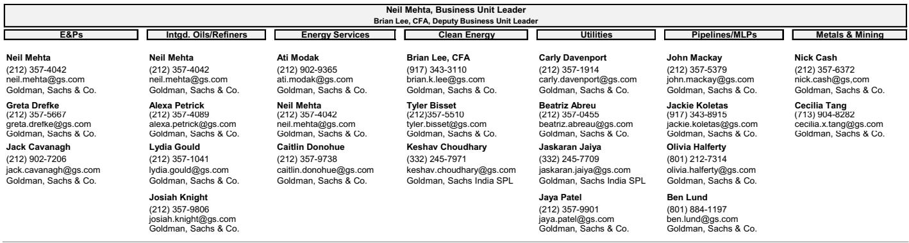
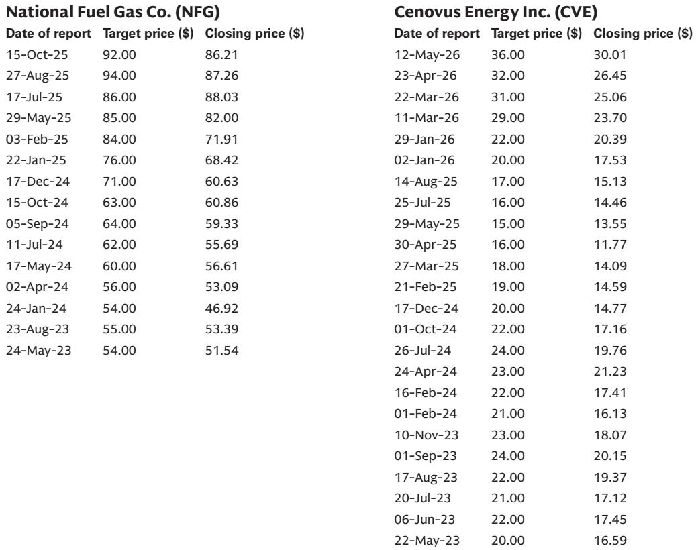

# 市场真正低估的不是需求，而是供给侧的再定价

财报季的股价涨跌，表面看是业绩的投票器，但背后往往隐藏着更深的产业逻辑。过去一个月，某外资投行覆盖的能源、公用事业与矿业板块中，涨幅最高的股票上涨了46%，跌幅最大的则下跌了21%。这种极端的分化，不能简单归因于“好公司”与“坏公司”的区别。

真正值得关注的信号是：市场正在重新定价供给侧的稀缺性，而不是需求侧的复苏。

这份研报覆盖了从上游勘探生产到中游管道运输，从传统能源到清洁技术，从公用事业到金属矿业的完整链条。我们仔细梳理了每个子板块中表现最好和最差的标的，发现了一个清晰的规律——那些能够控制供给节奏、拥有不可复制资产、或在区域市场中占据结构性优势的公司，正在获得超额回报。而那些依赖需求弹性、受制于政策不确定性、或供给端出现意外的公司，即使业绩本身并不差，也被市场惩罚。

这不是一个关于“周期来了还是没来”的问题。这是一个关于“谁在真正掌控供给”的问题。

## 1. 上游勘探生产的分化：不是油价，而是成本曲线的位置

在E&P板块，表现最好的Tourmaline Oil（TOU）上涨了10%，而表现最差的National Fuel Gas（NFG）下跌了9%。两者都是天然气生产商，但市场给出了完全相反的判断。

TOU的上涨逻辑有三个层次。第一层是运营执行：公司通过持续优化现有资产基础、降低单位成本，在天然气价格波动的环境中实现了利润率的改善。第二层是定价能力：TOU通过直接接入LNG出口设施，获得了优于现货市场的天然气实现价格。第三层是结构性增长：公司正在探索数据中心共址机会，利用其垂直整合的业务模式和大规模天然气储备，将供给转化为新的需求场景。

NFG的下跌则揭示了供给端的脆弱性。公司在Utica区块的部分水平井产量低于预期，这直接动摇了投资者对其资产质量的信心。更关键的是，Pennsylvania的监管环境正在变得更加不确定，而公司即将面临Supply Corp和Utility的费率案审查。当供给端出现物理性问题，同时政策端又施加压力，市场自然会重新评估其价值。

这两家公司的对比说明了一个核心判断：在天然气这个供给过剩风险始终存在的市场中，能够控制成本曲线、拥有差异化定价渠道、并能主动创造需求场景的公司，才是真正安全的。而仅仅依靠资源禀赋、缺乏运营灵活性的公司，即使处于同样的宏观环境中，也会被市场抛弃。

## 2. 油服板块的逆向选择：市场正在奖励“看得见的增长”

油服板块的分化同样具有启示意义。Halliburton（HAL）上涨了10%，而TechnipFMC（FTI）仅上涨了2%。在同一个子板块中，差距高达8个百分点。

HAL的优势在于其收入的区域分布：约60%来自国际业务，40%来自北美。这种平衡意味着，当北美市场因高油价而活跃时，HAL能够受益；当国际市场因中东重建而需求旺盛时，HAL同样能够受益。更重要的是，市场能够“看见”这种受益——北美活跃钻机数的增长和中东服务需求的增加，都是可追踪、可量化的指标。

FTI的问题恰恰相反。尽管公司拥有强劲的订单积压和稳定的订单节奏，但市场对其兴趣有限。原因在于，FTI的业务主要集中于海底和海上基础设施项目，这些项目的周期长、订单转化为收入的时间滞后，市场无法在短期内看到“直接的钻机增长”或“明确的产量提升”。在宏观环境快速变化的当下，投资者更倾向于选择那些能够立即反映商品价格变化的标的。

这个现象值得深思：当市场处于不确定性较高的阶段，投资者会缩短视野，优先奖励那些“看得见的增长”，即使这种增长可能只是短期现象。而真正具有长期价值的项目，反而可能因为时间跨度太长而被低估。这既是机会，也是风险。

## 3. 中游管道：供给瓶颈正在变成定价权

中游板块的表现进一步强化了供给侧逻辑。Kinder Morgan（KGS）上涨了21%，是板块中表现最好的标的，而Cheniere Energy（LNG）则下跌了6%，尽管其业绩并不差。

KGS的上涨动力来自两个方向。其压缩业务的新设备订单已经排到了2028年甚至2029年初，这直接反映了市场对天然气运输和压缩能力的强劲需求——当上游产量增加、下游需求增长时，中游基础设施的瓶颈效应就会显现。更值得注意的是，KGS通过收购DPS进入了电力市场，其电力部署积压量超过了市场预期：公司预计到2030年实现2GW的装机容量，年均增长300-500MW，目前已有261MW在订单中。这意味着，KGS不仅是一个管道公司，正在变成一个“能源基础设施平台”。

LNG的下跌则是一个“好业绩但高预期”的典型案例。公司一季度EBITDA超预期2%，2026年EBITDA指引从70亿美元上调至75亿美元，但这些利好已经被市场提前消化。真正让市场失望的是：没有新的商业合同公布，回购力度环比减弱。当一只股票在财报前已经上涨了10%，市场对“惊喜”的要求就会变得极高。LNG的案例提醒我们，即使供给端的基本面稳固（公司95%以上的合同是照付不议的长期合同），如果市场已经将这种确定性定价充分，股价也难有超额表现。

## 4. 公用事业：监管风险正在重塑估值逻辑

公用事业板块的分化揭示了另一个重要变量：监管环境。NextEra Energy（NEE）上涨了4%，而NRG Energy（NRG）下跌了21%，后者是本次财报季整个能源板块中表现最差的标的之一。

NEE的优势在于其监管“护城河”。佛罗里达州的监管环境相对友好，NEE旗下的Florida Power & Light（FPL）在费率案中获得了有利结果。同时，NEE在数据中心的布局也具有先发优势——公司在德克萨斯州围绕天然气发电的数据中心项目正在推进，市场预期今年可能有一个大型负荷接入公告。在监管不确定性和电力需求增长的双重背景下，NEE被视为一个“防御性成长”的标的。

NRG的困境则反映了德克萨斯州和PJM两个市场的双重压力。在德克萨斯州，温和的天气和疲软的电价让市场怀疑“负荷增长是否真的在按计划实现”。在PJM区域，监管政策的不确定性又让投资者对新发电能力的建设前景产生疑虑。NRG刚刚完成对LS Power资产的收购，PJM的监管走向直接决定了这笔收购的价值。当市场开始质疑“电力需求增长是否真实”时，那些高度依赖这一假设的公司就会受到重创。

这个板块的分化告诉我们：在公用事业领域，监管确定性比增长故事本身更重要。一个友好的监管环境可以支撑估值溢价，而一个不确定的监管环境可能摧毁整个投资逻辑。

## 5. 清洁技术与金属矿业：两个不同的“供给故事”

清洁技术板块中，Enphase Energy（ENPH）上涨了46%，是本次财报季表现最好的标的之一。而Pentair（PNR）下跌了15%。

ENPH的上涨动力来自产品创新和市场策略的双重驱动。公司正在推出新一代电池产品、面向工商业市场的IQ9逆变器，以及预付费租赁模式。更重要的是，通过“安全港”策略（safe harboring），ENPH可能在第三方拥有市场（TPO）中抢占了市场份额。市场对固态变压器的关注也在升温，这为ENPH打开了新的想象空间。

PNR的下跌则是一个典型的“需求端故事”。尽管公司一季度业绩并不差，甚至小幅上调了全年调整后EPS指引，但市场关注的是其终端需求的疲软——特别是泳池业务，在宏观环境改善之前，需求恢复的前景不明朗。当一家公司的增长高度依赖消费者信心和住宅投资时，即使短期业绩尚可，市场也会提前给出悲观预期。

金属矿业板块中，Nucor（NUE）上涨了23%，而Freeport-McMoRan（FCX）下跌了4%。NUE作为美国最大的钢铁生产商，在进口替代中获得了最大的市场份额增量——一季度出货量环比增长20%，同比增长9%，同时受益于价格上行。FCX的下跌则源于供给端的意外：Grasberg Block Cave的复产进度低于预期，导致2026-2028年产量预期减少约6亿磅。

这两个板块的分化共同指向了一个结论：当供给端出现主动性收缩（如进口减少、产能瓶颈）时，市场会给予积极定价；但当供给端出现被动性中断（如矿山复产延迟）时，即使是暂时的，市场也会惩罚。

## 6. 报告尚未完全回答的关键问题：数据中心的真实电力需求

研报中多次提到数据中心对电力需求的拉动——NEE在德克萨斯州的数据中心项目、NRG在德克萨斯州和PJM的数据中心潜在交易、KGS的电力部署积压。但报告没有完全回答的问题是：这些需求到底有多“真实”？

目前，市场对数据中心电力需求的预期主要来自于科技公司的公开声明和项目公告。但一个关键的不确定性在于：这些需求中有多少是“软性需求”（即公司只是表达了意向，尚未签订长期合同），有多少是“硬性需求”（即已经签署了购电协议或已经开工建设）？如果大部分需求停留在意向阶段，那么当科技公司的资本支出周期转向时，这些需求可能迅速消失。

另一个未解的问题是：数据中心的电力需求增长，是否真的需要新建发电能力？还是可以通过提高现有电网的利用效率来满足？如果答案是后者，那么新建发电能力的投资逻辑就会受到挑战。

这些问题的答案将直接决定公用事业板块的未来估值。如果数据中心的电力需求是真实且持久的，那么NEE、NRG等公司的增长故事就是可信的；如果需求只是暂时的或可被现有能力覆盖，那么这些公司可能面临估值回调。

## 7. 一个观察框架：如何判断供给侧的定价权是否可持续

基于上述分析，我们可以提炼出一个简单的观察框架，用于判断一家公司是否真正拥有供给侧的定价权。

第一，看资产的可复制性。如果一家公司的核心资产（如矿山、管道、发电厂）是稀缺的、难以复制的，那么它就拥有天然的供给壁垒。KGS的管道网络、FCX的铜矿资源、TOU的天然气储层，都属于这一类。相反，如果资产是标准化的、可快速复制的，那么定价权就会受到挑战。

第二，看运营的灵活性。能够在不同的市场环境中调整成本结构、优化产品组合的公司，更容易在供给过剩时保持利润率。HAL的国际/北美平衡、ENPH的产品多样化，都是灵活性的体现。

第三，看监管环境的确定性。在公用事业和能源领域，监管政策的变化可能比市场供需更能影响公司价值。NEE的佛罗里达州优势、NRG的PJM风险，都是监管因素在起作用。

第四，看市场预期的饱和度。即使一家公司基本面扎实，如果市场已经将其利好充分定价（如LNG案例），那么超额回报的空间就会非常有限。投资者需要关注的是“预期差”，而不是“绝对好”。

## 顺着这些未解问题，继续深入

本次财报季的分化揭示了供给侧定价权的力量，但也留下了一些关键问题：数据中心的真实需求到底有多大？LNG的长期合同何时会有新的突破？FCX的Grasberg复产能否恢复市场信心？TOU的数据中心共址机会是否会落地？这些问题的答案，将决定我们能否在下一轮行情中占据先机。

这些未解问题，我们在星球的微信群里持续讨论。欢迎加入，与更多产业研究者和投资者一起，沿着这些线索继续深挖。

Personal reading notes and learning share only. Not investment advice.

