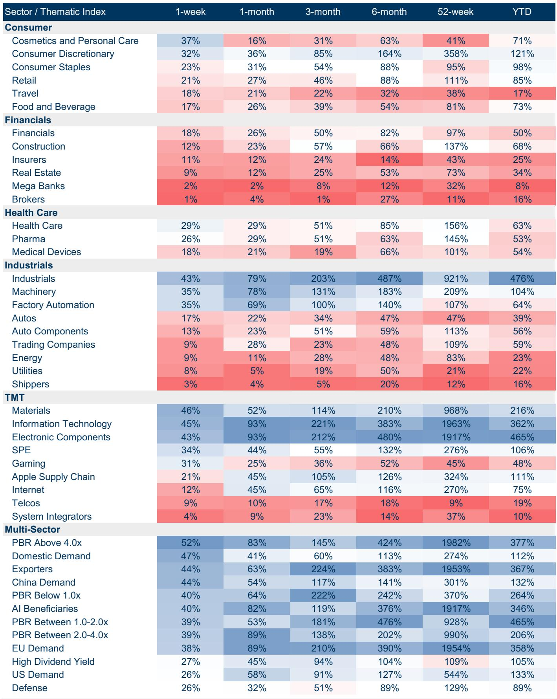
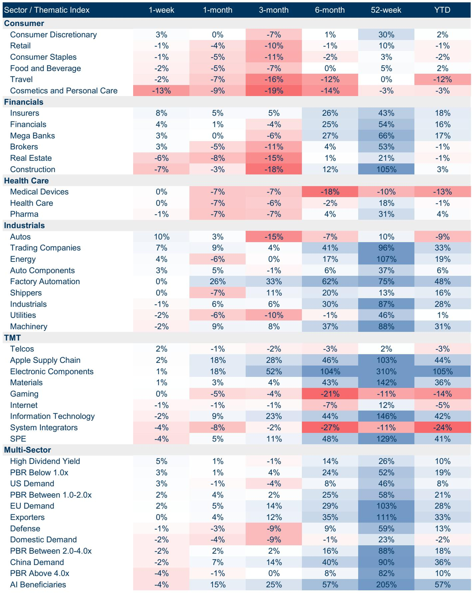
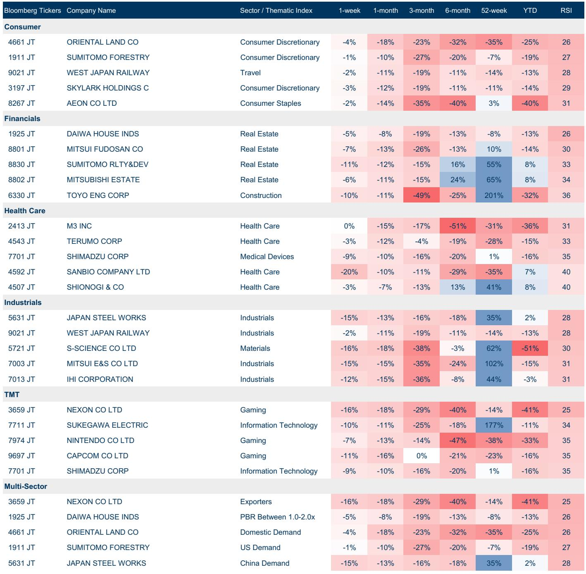

# Japan's Earnings Season Reveals a Market That Only Punishes, Never Rewards

The asymmetry is stark and it demands a strategic reassessment. Japan's FY3/26 fourth-quarter earnings season, now 84% complete by market capitalization, has delivered a clear numerical victory: 54% of companies reported positive earnings surprises against only 35% negative. The blended net profit growth for the quarter came in 16 percentage points above pre-season consensus. Yet the market's response tells a different, more troubling story. Price reactions to these results reveal that Japanese equities have entered a regime where negative surprises are severely punished while positive surprises go almost entirely unrewarded. This is not noise. It is a structural shift in how the market processes information, and it carries profound implications for portfolio construction, risk management, and the very nature of alpha generation in Japanese equities.

The conventional playbook for earnings season relies on a symmetrical assumption: companies that beat expectations will be rewarded, and those that miss will be penalized, with the magnitude of the reaction proportional to the surprise. That playbook is broken. The data from this season shows that for momentum stocks, a negative surprise triggered a median price decline of roughly 5% over three days relative to the TOPIX. A positive surprise, by contrast, produced no measurable positive reaction at all. The market has become a one-way valve: it releases pressure only on the downside. For investors who have built positions around earnings momentum, this asymmetry represents a fundamental change in the risk-reward calculus. The upside from a beat is capped, but the downside from a miss is amplified. The implication is uncomfortable but clear: the market is no longer pricing earnings outcomes; it is pricing something else entirely.

What that something else might be is the central strategic question for anyone invested in Japanese equities today. The report points to several clues, though it does not, and cannot, resolve the question fully. The dispersion of price reactions has spiked, suggesting that idiosyncratic factors are dominating. Foreign investors have returned as net buyers, purchasing 1.2 trillion yen of TSE Prime cash equities in a single week, while domestic institutions and individuals have been net sellers. And the critical resources basket, a theme tied to economic security and geopolitical volatility, has returned 43% year-to-date, more than triple the TOPIX return. These pieces do not yet form a complete picture, but they point toward a market that is increasingly driven by macro narratives, geopolitical risk pricing, and structural capital flows rather than by micro-level earnings beats.

## The Market Has Decoupled Earnings Quality from Price Outcomes, and That Changes Everything

The most direct evidence for this decoupling lies in the price reaction data. When a company reports a positive earnings surprise, the median TOPIX-relative price reaction over the sUBSequent three days is effectively zero. When the surprise is negative, the penalty is severe and immediate. This is not merely a question of market efficiency or of expectations having been already priced in. It is a signal that the marginal buyer and seller in Japanese equities are operating on different time horizons and with different information sets than the earnings-focused analyst community.

Consider what this means for a fundamental bottom-up investor. The traditional approach of identifying companies with improving fundamentals, building positions ahead of expected beats, and then monetizing those positions as the market re-rates the stock, relies on the assumption that earnings quality is a primary driver of price. That assumption is now questionable. If positive earnings surprises are not rewarded, then the entire edge of fundamental research shifts from identification of beats to avoidance of misses. The game becomes defensive. The risk-reward of holding a stock through an earnings announcement becomes asymmetric in the worst possible direction: limited upside, unlimited downside.

This dynamic is particularly acute for momentum stocks, which had been the darlings of the Japanese market rally. The report specifically highlights that one-month momentum stocks reacted strongly to negative surprises while showing no reaction to positive ones. This suggests that momentum strategies, which have been highly effective in Japan over the past year, may have become crowded and fragile. When a momentum stock misses, the exit is violent because there is no natural buyer base willing to step in on weakness. The absence of a positive reaction to beats, meanwhile, suggests that the good news was already fully discounted by the momentum crowd. The strategy has become all risk and no reward at the margin.

For portfolio managers, the implication is that earnings season can no longer be treated as a source of alpha generation. It must instead be treated as a risk event that requires active hedging. The traditional approach of overweighting sectors with high beat rates, such as Energy Resources at 80% positive or Construction & Materials at 75%, may still be valid, but the execution must change. The bet should not be on the beat itself, which will not be rewarded, but on the structural factors that make those sectors resilient to the broader market's punishing logic.

## The Guidance Game Has Changed: Conservative Guidance Is No Longer a Signal of Strength

Japanese companies have historically been conservative with their forward guidance, and this season is no exception. The report notes that guidance is running 9.2% below consensus, slightly more conservative than the ten-year median of 8.1%. In a normal market, this conservatism would be interpreted as a positive signal: companies are setting the bar low to clear it easily, and investors should expect upward revisions as the year progresses. But in the current regime, the interpretation is more ambiguous.

The price reaction to guidance announcements tells a nuanced story. Companies that issued guidance above consensus saw a strong positive reaction of roughly 4.5% over three days. Companies that issued guidance below consensus saw an equally strong negative reaction of roughly 4.5%. This symmetry suggests that guidance, unlike earnings surprises, still matters to the market. The asymmetry that plagues earnings reactions does not extend to guidance reactions. This creates an interesting strategic wedge: the market may no longer care about what happened last quarter, but it still cares deeply about what companies say about the coming year.

For investors, this means that the focus of earnings season analysis must shift from the rearview mirror to the windshield. The fourth-quarter beat or miss is increasingly irrelevant. What matters is the trajectory that management sets for the next twelve months. This is consistent with a market that is forward-looking and macro-driven. If the market is pricing geopolitical risk, structural capital flows, and the economic security narrative, then backward-looking earnings data is simply not the relevant information set. Guidance, by contrast, offers a window into how companies themselves are reading the macro environment, and that is what the market is trying to price.

The challenge is that guidance is also becoming less informative in a different sense. The report notes that companies that did not disclose new year guidance were punished more severely than those that did, regardless of the content of that guidance. The penalty for no guidance was roughly 2% over three days, compared to roughly 1% for those that issued guidance, even if that guidance was disappointing. This suggests that the market is demanding visibility and is willing to penalize companies that cannot provide it. But the value of that visibility is declining at the margin, because the macro environment is changing so rapidly that any guidance is likely to be outdated within weeks. The market may be demanding something that companies cannot credibly provide.

## The Critical Resources Basket Is Not a Sector Trade; It Is a Proxy for a New Market Regime

The standout performer of the year so far is the Japan Critical Resources basket, which has returned 43% year-to-date against the TOPIX's 12%. This basket includes trading companies, energy resources companies, and shippers, all of which are exposed to the extraction, transportation, and processing of critical resources. The report explicitly ties this outperformance to the geopolitical situation in the Middle East and to broader economic security concerns. But the basket's performance tells a deeper story about the structure of the Japanese equity market.

This is not a sector rotation trade in the traditional sense. It is not about value versus growth, or cyclical versus defensive. It is about the market pricing a structural shift in global supply chains and in the strategic importance of resource security. The outperformance of this basket, which began in earnest last March, has persisted through multiple macro shocks and through earnings seasons that have punished other high-momentum names. It has become the dominant narrative in Japanese equities, and it is a narrative that is largely immune to the earnings surprise dynamics that are plaguing the rest of the market.

For investors, the critical resources theme offers a potential hedge against the asymmetric punishment regime. Companies in this basket are not being rewarded or punished based on quarterly earnings beats. They are being repriced based on the market's assessment of long-term structural demand for resources in a world of fractured supply chains and rising geopolitical risk. The earnings data for these companies matters, but it matters in a different way. A beat does not trigger a price reaction because the market is already looking through the quarter to the multi-year trajectory. A miss does not trigger a severe penalty because the structural thesis remains intact.

This creates an interesting portfolio construction question. If the rest of the market is becoming increasingly treacherous for active managers, with earnings beats going unrewarded and misses being severely punished, then the rational response is to increase exposure to themes and baskets that are priced on structural rather than cyclical factors. The critical resources basket is the clearest example, but there may be others. The report also highlights strong performance in electronic components, factory automation, and AI beneficiaries, though these have shown more volatility and may be more susceptible to the asymmetric punishment regime.

## What the Report Does Not Fully Answer: Is This Asymmetry Permanent or Cyclical?

The report provides an excellent diagnosis of the current market regime, but it leaves open a crucial question that every investor must answer for themselves: is the asymmetric punishment of earnings surprises a permanent structural feature of the Japanese equity market, or is it a cyclical phenomenon that will reverse as the macro environment stabilizes?

There are arguments on both sides. The structural case points to the dominance of foreign investors, who now account for a larger share of trading volume and who may be less sensitive to quarterly earnings outcomes than domestic institutions. It also points to the rise of passive investing and factor-based strategies, which can create mechanical selling pressure on momentum stocks that miss without creating corresponding buying pressure on those that beat. And it points to the increasing importance of macro narratives, from geopolitics to interest rates to currency, which may simply overwhelm micro-level earnings data.

The cyclical case points to the specific context of this earnings season. The report notes that guidance is slightly more conservative than historical norms, which may reflect genuine uncertainty about the macro outlook. If the macro environment stabilizes, companies may become more confident in their guidance, and the market may return to a more symmetric treatment of earnings surprises. The cyclical case also notes that foreign buying has been strong, which could be a leading indicator of a shift in market structure. If foreign investors are buying Japanese equities for structural reasons, they may eventually become more attentive to earnings quality as they build long-term positions.

The report does not take a firm position on this debate, and it is right not to. The data does not yet support a definitive conclusion. What the data does support is the recognition that the current regime is different from the historical norm and that it requires a different investment approach. Investors who assume that the old playbook will reassert itself are taking a significant risk. Investors who assume that the new regime is permanent may be overreacting to a cyclical phenomenon. The prudent approach is to acknowledge the uncertainty and to build portfolios that are resilient under both scenarios.

## A Decision Framework for Navigating the Asymmetric Punishment Regime

For investors who accept that the market's treatment of earnings is currently asymmetric, the question becomes: what do I do about it? The report's data suggests a clear decision framework with four components.

First, shift the center of gravity of your earnings season exposure from individual stock picks to thematic baskets. The critical resources basket has demonstrated that structural themes can outperform regardless of the quarterly earnings noise. Investors should identify other baskets or themes that are similarly insulated from the asymmetric punishment regime. The report's performance table shows strong year-to-date performance in electronic components, factory automation, and AI beneficiaries. Each of these themes has its own risk profile, but they share the characteristic of being priced on structural rather than cyclical factors.

Second, if you must own individual stocks, prioritize those with strong guidance over those with strong fourth-quarter results. The data shows that guidance still matters to the market, while fourth-quarter earnings surprises do not. This means that the earnings season research process should be inverted: spend less time analyzing the fourth quarter and more time analyzing the management team's outlook and credibility. Companies that provide clear, credible, and upwardly biased guidance should be rewarded, even if their fourth quarter was mediocre.

Third, implement explicit hedging around earnings announcements for momentum stocks. The asymmetry is most severe for momentum stocks, where a miss can trigger a 5% decline. If you hold momentum stocks, consider using options or other hedging strategies to protect against the downside of a miss, while accepting that you will not capture the upside of a beat. The cost of this hedge is the price of insurance against the asymmetric risk. If the cost is too high, that is itself a signal that the position size should be reduced.

Fourth, pay close attention to the behavior of foreign investors. The report notes that foreigners were net buyers of 1.2 trillion yen in a single week, while domestic institutions and individuals were net sellers. This divergence is unusual and may signal a shift in the marginal price setter. If foreign investors continue to buy, they may eventually drive a return to more symmetric pricing of earnings outcomes. If they reverse course, the asymmetry could become even more severe. Monitoring foreign flow data should be a regular part of the investment process.

## The Unresolved Analytical Questions That Should Drive Your Next Move

The report's analysis is thorough, but it inevitably leaves several questions unanswered. These are not gaps in the analysis. They are the natural boundaries of what can be known from the available data, and they represent the most fertile ground for further research.

The first unresolved question is whether the asymmetry is driven by investor composition or by information content. Is the market punishing misses and ignoring beats because the marginal investor is a macro-driven foreign institution that does not care about quarterly earnings, or is it because the market has already priced in the beat and is only surprised by the miss? The answer has very different implications for portfolio construction. If it is about investor composition, then the asymmetry will persist as long as foreign investors dominate. If it is about information content, then the asymmetry will reverse when the market becomes less efficient at anticipating beats.

The second unresolved question is whether the critical resources basket's outperformance is sustainable or whether it has become crowded. The basket has returned 43% year-to-date, which is an extraordinary return by any measure. At some point, the structural thesis may become fully priced, and the basket may become vulnerable to the same asymmetric punishment regime that afflicts other momentum names. The report does not provide a valuation framework for the basket, and investors must do their own work to assess whether the structural thesis is still underappreciated or whether it has become consensus.

The third unresolved question is whether the guidance asymmetry will persist. The report shows that guidance still matters, but the magnitude of the reaction to guidance surprises is roughly symmetric. This could change if the macro environment becomes more uncertain and companies become less willing to provide guidance. If the number of companies providing guidance declines, the market may begin to penalize all companies that provide guidance, regardless of its content, because the act of providing guidance itself becomes a signal of overconfidence in an uncertain world.

These questions are not rhetorical. They are the starting point for the next stage of analysis. Investors who can answer them before the market does will have a significant edge. The report provides the data and the framework. The interpretation is up to you.

Join the community to read the full report and review the original charts.

*This article is for learning and discussion only and does not constitute investment advice.*

Personal reading notes and learning share only. Not investment advice.

